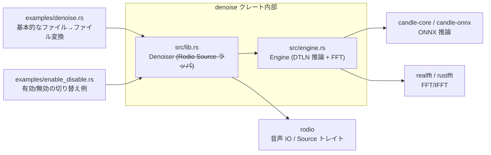
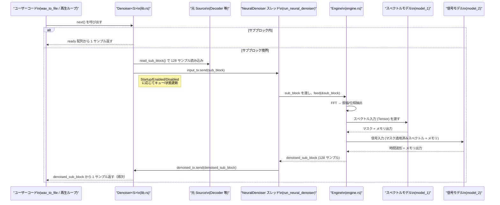

## 1. ざっくり一言

`denoise` クレートは、**16kHz モノラルの音声ストリームを DTLN（Dual‑Signal Transformation LSTM Network）ベースのニューラルネットでリアルタイムにノイズ除去するための Rodio 用ラッパ**です。  
内部で ONNX モデル（Candle）と FFT を扱いつつ、外側からは `rodio::Source` としてシンプルに使えるように抽象化されています。

---

## 2. このモジュールの役割

### 2.1 概要

このディレクトリ（クレート）は主に次の問題を解決します。

- 生の Rodio の音声ストリームを、そのままではノイズに埋もれて聞き取りづらい  
  → ニューラルネットワーク（DTLN）を使ってリアルタイムにノイズ抑圧したい
- しかし、ONNX モデルの読み込みや FFT、状態管理（LSTM のメモリ）を自前で実装するのは負担が大きい  
  → これらを一つの `Denoiser<S>` 型としてカプセル化し、`Source` として差し替えるだけで使えるようにする

そのために、以下の二層構造になっています。

- 上位層: `src/lib.rs` – Rodio の `Source` をラップし、サンプルを小さなブロックに分割してエンジンに送る
- 下位層: `src/engine.rs` – FFT と 2 つの ONNX モデルを使って 1 ブロックのノイズ除去を行う「エンジン」

### 2.2 アーキテクチャ内での位置づけ

主なファイル・モジュール間の依存関係は次のようになっています。



- 利用者は基本的に `denoise::Denoiser<S>` だけを意識すればよく、  
  `Engine` や ONNX モデルの詳細は `lib.rs` が隠蔽します。
- 実際のノイズ抑圧のアルゴリズム（DTLN）は `engine.rs` + 組み込み ONNX モデルに実装されています。
- サンプルコード（`examples/` と README）は Rodio のパイプラインにどう組み込むかを示します。

### 2.3 設計上のポイント

コードから読み取れる設計上の特徴は次のとおりです。

- **ストリーミング前提**
  - 固定長ブロック（`BLOCK_SHIFT = 128` サンプル / 8ms）単位で処理し、重なり窓（`BLOCK_LEN = 512` サンプル / 32ms）を用いたオーバーラップ・アド方式になっています。
- **非同期エンジン**
  - DTLN 推論は別スレッド（`NeuralDenoiser`）で動き、メインの `Denoiser` は Rodio の再生ループに同期してサンプルを供給します。
  - スレッド間通信には `std::sync::mpsc` を用いています。
- **状態管理**
  - DTLN の内部状態（LSTM メモリ）は `Engine` 内の `spectral_memory` / `signal_memory` という `Tensor` として保持されます。
  - `Denoiser` 側は有効/無効や起動時・再有効化時の遷移を `IterState` で管理し、レイテンシを一定に保つためのキュー（`Queue`）を持ちます。
- **入力制約の明示**
  - サンプリングレート 16kHz、1 チャンネル（モノラル）のみに対応し、それ以外は `DenoiserError` で明示的にエラーにします。

---

## 3. 主要な機能一覧

このクレートが提供する主な機能は次の通りです。

- **Denoiser ラッパ**
  - 任意の `rodio::Source` を `Denoiser<S>` でラップし、ノイズ抑圧済みの `Source` として扱えるようにします。
- **ニューラルノイズ抑圧エンジン (`Engine`)**
  - 内部 FFT（`realfft` / `rustfft`）と ONNX モデル（`candle-onnx`）を使って、DTLN に基づくノイズ抑圧を行います。
- **ブロックベースのストリーミング処理**
  - 固定長ブロック（128 サンプル）単位で処理しつつ、32ms 窓＋8ms シフトのオーバーラップ・アドにより連続した出力を生成します。
- **有効/無効の動的切り替え**
  - 再生中に `set_enabled(true/false)` でノイズ抑圧をオン・オフできます。  
    オフ時にも内部のレイテンシ（512 サンプル）を維持し、再度オンにしても波形が不連続にならないようにしています。
- **簡易な使用例**
  - ファイル入力 → ノイズ抑圧 → WAV ファイル出力のサンプル（`examples/denoise.rs`）と、有効/無効の周期的切り替え例（`examples/enable_disable.rs`）が含まれます。

---

## 4. 関数・構造体の解説

### 4.1 主な構造体・列挙体一覧

| 名前 | 種別 | 定義場所 | 役割 / 用途 |
|------|------|----------|-------------|
| `Denoiser<S>` | 構造体 | `src/lib.rs` | 任意の `rodio::Source` をラップし、ノイズ抑圧済みのサンプルを返すメイン API |
| `Engine` | 構造体 | `src/engine.rs` | FFT と 2 つの ONNX モデルを組み合わせて、1 ブロック分のノイズ抑圧を行う内部エンジン |
| `Queue` | 構造体 | `src/lib.rs` | 無効化時にもレイテンシを維持するため、元の（未処理の）サブブロック 4 個を保持するキュー |
| `IterState` | 列挙体 | `src/lib.rs` | `Denoiser` の動作状態（起動中、有効、無効、中途から再有効化中）を表します |
| `DenoiserError` | 列挙体 | `src/lib.rs` | サポートされないサンプリングレート・チャンネル数に対するエラー |
| `DenoiseEngineCrashed` | 構造体（エラー型） | `src/lib.rs` | 内部スレッドとの送受信に失敗した場合（エンジンがクラッシュしたとみなす）に使う内部エラー |
| `BLOCK_LEN` | 定数 | `src/engine.rs` | FFT 窓長（512 サンプル / 約 32ms @ 16kHz） |
| `BLOCK_SHIFT` | 定数 | `src/engine.rs` | ブロックシフト長（128 サンプル / 約 8ms） |
| `FFT_OUT_SIZE` | 定数 | `src/engine.rs` | 実数 FFT の出力サイズ（`BLOCK_LEN / 2 + 1`） |

以下では、特に重要な関数・メソッドを 7 個選んで詳しく説明します。

---

### 4.2 重要な関数・メソッド

#### 1) `Denoiser::try_new(source: S) -> Result<Denoiser<S>, DenoiserError>`

**概要**

- 任意の `rodio::Source` を受け取り、ノイズ抑圧用の `Denoiser` ラッパを初期化します。
- サンプリングレート 16kHz、1 チャンネルであることを検証し、バックグラウンドスレッドと MPSC チャネルをセットアップします。

**引数**

| 引数名 | 型 | 説明 |
|--------|----|------|
| `source` | `S: Source` | 入力音声ストリーム（Rodio の `Source` 実装） |

**戻り値**

- `Ok(Denoiser<S>)`: ノイズ抑圧が可能なラッパ。
- `Err(DenoiserError)`: サポートされないサンプリングレートまたはチャンネル数だった場合。

**内部処理の流れ**

1. `source.sample_rate()` が `16_000` かどうかを確認。異なれば `UnsupportedSampleRate` エラー。
2. `source.channels()` が `1` かどうかを確認。異なれば `UnsupportedChannelCount` エラー。
3. `mpsc::channel()` で
   - 入力サブブロック用（`input_tx`, `input_rx`）
   - 出力サブブロック用（`denoised_tx`, `denoised_rx`）
   を生成。
4. 新しいスレッド `"NeuralDenoiser"` を起動し、`run_neural_denoiser(denoised_tx, input_rx)` を実行。
5. `Denoiser` 本体を構築し、起動状態を `IterState::Startup { enabled: true }` に設定。

**Examples（使用例）**

基本的なファイル→ファイルの変換例です（`examples/denoise.rs` 相当）。

```rust
use rodio::{nz, source::UniformSourceIterator, wav_to_file};

fn main() -> Result<(), Box<dyn std::error::Error>> {
    // 入力 WAV ファイルを開く
    let file = std::fs::File::open("airconditioning.wav")?;
    // rodio でデコードする（Source を得る）
    let decoder = rodio::Decoder::try_from(file)?;
    // 1ch / 16kHz にリサンプリングする
    let resampled = UniformSourceIterator::new(decoder, nz!(1), nz!(16_000));

    // Denoiser を初期化する（ここでサンプリングレート/チャネルを検証）
    let mut denoised = denoise::Denoiser::try_new(resampled)?;

    // ノイズ抑圧済みの Source を WAV ファイルに書き出す
    wav_to_file(&mut denoised, "denoised.wav")?;
    Ok(())
}
```

**Errors / Panics**

- `DenoiserError::UnsupportedSampleRate`:
  - `source.sample_rate() != 16000` の場合。
- `DenoiserError::UnsupportedChannelCount`:
  - `source.channels() != 1` の場合。
- スレッド生成に失敗した場合は `expect("Should be ablet to spawn threads")` により panic します。

**Edge cases（エッジケース）**

- 入力ソースが非常に短い（512 サンプル未満）の場合:
  - 起動時に `read_sub_block` が `None` を返すと、その時点でイテレータが `None` を返すため、出力も短くなります。
- Denoiser がドロップされると:
  - `input_tx` がクローズされ、バックグラウンドスレッドはループから抜けて終了します。

**使用上の注意点**

- 入力は必ず **16kHz / モノラル** に変換してから渡す必要があります（例では `UniformSourceIterator` を使用）。
- `try_new` 後は `Denoiser` が `Source + Iterator<Item=Sample>` として使えるため、そのまま Rodio の再生や `wav_to_file` に渡せます。

---

#### 2) `Denoiser::set_enabled(&mut self, enabled: bool)`

**概要**

- 再生中にノイズ抑圧の有効/無効を切り替えるためのメソッドです。
- 内部の状態マシン（`IterState`）を更新し、次のサブブロック境界から挙動を切り替えます。

**引数**

| 引数名 | 型 | 説明 |
|--------|----|------|
| `enabled` | `bool` | `true` で有効化、`false` で無効化 |

**戻り値**

- 返り値はありません（`()`）。

**内部処理の流れ（簡略）**

- `(enabled, self.state)` の組み合わせに応じて `self.state` を更新します。
  - 有効 → 無効: `Enabled` / `StartingMidAudio` から `Disabled` へ。
  - 起動中 (`Startup { enabled: true }`) のまま無効にしたい場合: `Startup { enabled: false }` に変更。
  - 無効 → 有効: `Disabled` から `StartingMidAudio { fed_to_denoiser: 0 }` にして、再度エンジンのウォームアップを行う準備をします。
- それ以外（同じ状態に設定するなど）の場合は状態を変更しません。

**Examples（使用例）**

`examples/enable_disable.rs` では、一定間隔で有効/無効を切り替えています。

```rust
use std::time::Duration;
use rodio::Source;
use rodio::{nz, source::UniformSourceIterator, wav_to_file};

fn main() -> Result<(), Box<dyn std::error::Error>> {
    let file = std::fs::File::open("clips_airconditioning.wav")?;
    let decoder = rodio::Decoder::try_from(file)?;
    let resampled = UniformSourceIterator::new(decoder, nz!(1), nz!(16_000));

    let mut enabled = true;

    // Denoiser を作成し、その上で rodio の periodic_access を使って定期的にコールバック
    let denoised = denoise::Denoiser::try_new(resampled)?.periodic_access(
        Duration::from_secs(2),
        |denoised| {
            enabled = !enabled;
            denoised.set_enabled(enabled); // 2 秒ごとに有効/無効をトグル
        },
    );

    wav_to_file(denoised, "processed.wav")?;
    Ok(())
}
```

※ `periodic_access` は Rodio 側の機能であり、このクレート内には定義が見えません。

**Edge cases**

- 状態は「サブブロック境界」（128 サンプルごと）で反映されるため、呼び出して即座に波形が切り替わるわけではありません。
- `Startup` 状態で `enabled = false` を指定すると、起動後すぐに `Disabled` 状態で動作開始するようにセットされます。

**使用上の注意点**

- 無効化している間も内部キューで 512 サンプル分の遅延を維持しているため、再有効化してもレイテンシが変化しません。
- 有効/無効の切り替えはスレッドセーフに見えますが、`Denoiser` 自体は `&mut self` を要求するため、通常は単一スレッドから操作します。

---

#### 3) `impl<S: Source> Iterator for Denoiser<S>::next(&mut self) -> Option<Sample>`

**概要**

- `Denoiser` が `Iterator<Item = Sample>` を実装する中核です。
- Rodio からのサンプル要求に応じて、事前に用意してあるサブブロック（`ready`）から 1 サンプルずつ取り出すか、必要に応じて新しいサブブロックを準備します。

**内部処理の流れ**

1. `self.next += 1` して、次に返すインデックスを進めます。
2. `self.next < self.ready.len()`（= `BLOCK_SHIFT`）であれば、`self.ready[self.next]` を返して終了。
3. そうでない場合、ブロック境界に達したとみなし `self.prepare_next_ready()` を呼び出します。
4. `prepare_next_ready` の結果が `Ok(Some(sample))` ならそれを返し、`Ok(None)` または `Err(_)` の場合は `None` を返します。
   - `Err(_)` の場合は `log::error!("Denoise engine crashed")` でログを出してから終了します。

**Edge cases**

- 内部のエンジンスレッドがクラッシュした場合（チャネル送受信に失敗した場合）は、`None` を返すことでイテレータを終了します。
- 初回呼び出し時は `self.next` が `BLOCK_SHIFT` にセットされており、必ず `prepare_next_ready` が呼ばれて起動処理が走ります。

**使用上の注意点**

- 通常、利用者は `next` を直接呼び出さず、Rodio や `wav_to_file` を通じて間接的に利用します。

---

#### 4) `Denoiser::prepare_next_ready(&mut self) -> Result<Option<f32>, DenoiseEngineCrashed>`

**概要**

- 128 サンプルごと（サブブロックごと）に呼ばれ、次の `ready` ブロックを用意するための関数です。
- 起動直後・有効中・無効中・再有効化中で挙動を切り替えます。

**主要な状態別挙動**

- `IterState::Startup { enabled }`:
  - 「無音から開始する」ことを前提に、4 サブブロックぶんのウォームアップを行います。
  - 4 回 `read_sub_block` で元のソースから読み取って `Queue` とエンジンに送信。
  - エンジンの出力のうち、最初の 3 ブロックを破棄し、4 ブロック目を `ready` に採用。
  - さらに 1 ブロック読み込んでエンジンに送信しつつ `Queue` に積み、状態を `Enabled` / `Disabled` に遷移。
- `IterState::Enabled`:
  - `denoised_rx.recv()` でエンジンの出力ブロックを `ready` にセット。
  - 次のサブブロックを元ソースから読み取り、エンジンに送信し、`Queue` に積みます。
- `IterState::Disabled`:
  - エンジンには新しいブロックを送らず、`Queue` からポップした生のサブブロックを `ready` にします。
  - レイテンシ維持のため、新しい生ブロックを `Queue` に積み直します。
- `IterState::StartingMidAudio { fed_to_denoiser }`:
  - 無効状態から再び有効にする際のウォームアップ。
  - 無効時と同じく `Queue` から `ready` を取りつつ、新しいブロックをエンジンに送り、`fed_to_denoiser` をカウントアップ。
  - `fed_to_denoiser > 4` になったタイミングで、`denoised_rx` から 3 ブロック分を破棄して `Enabled` 状態へ。

**戻り値**

- `Ok(Some(sample0))` – `self.ready` が更新され、その先頭サンプルを返せる場合。
- `Ok(None)` – 入力ソースが尽きて、これ以上サンプルがない場合。
- `Err(DenoiseEngineCrashed)` – エンジンスレッドとの送受信に失敗した場合。

**使用上の注意点**

- この関数自体は `#[cold]` で、「めったに呼ばれない（128 サンプルに 1 回）」ことをコンパイラに伝えています。
- `self.feed(sub_block)` 呼び出し部分だけは `unwrap()` を使用しており、そこで送信に失敗すると panic し得ます（他の箇所は `DenoiseEngineCrashed` に変換）。

---

#### 5) `Engine::new() -> Engine`

**概要**

- ノイズ抑圧エンジンを初期化し、ONNX モデルと FFT 用のバッファ・メモリを準備します。

**内部処理の流れ**

1. `RealFftPlanner::new()` を生成し、`BLOCK_LEN` (=512) 用の前向き FFT をプラン。
2. プランから必要なスクラッチバッファ長を取得し、`fft_scratch` を確保。
3. `include_bytes!("../models/model_1_converted_simplified.onnx")` と `model_2_converted_simplified.onnx` を `ModelProto::decode` で読み込み。
4. スペクトル側・信号側のメモリ `spectral_memory` / `signal_memory` をゼロで初期化  
   - 形状 `(1, 2, BLOCK_SHIFT, 2)`（= `(1, 2, 128, 2)`）に固定。
5. 入出力用の配列（`spectrum`, `signal`, `in_magnitude`, `in_phase`, `in_buffer`, `out_buffer`）をゼロクリア。

**使用上の注意点**

- モデルファイルのパスと名前（`../models/model_1_converted_simplified.onnx` など）は埋め込み前提で、外部に配布しなくてもバイナリに含まれる設計です。
- `expect("The model should decode")` により、モデルが壊れていると起動時に panic します。

---

#### 6) `Engine::feed(&mut self, samples: &[f32]) -> [f32; BLOCK_SHIFT]`

**概要**

- 長さ `BLOCK_SHIFT`（128 サンプル）の入力ブロックを受け取り、**4 フィード（4 ブロック）先のモデル出力に基づいてノイズ抑圧された 128 サンプルを返します**。
- 内部では、512 サンプルの窓（`in_buffer`）を用いたオーバーラップ・アドを行い、スペクトルモデル→信号モデルの順に DTLN 推論を実行します。

**引数**

| 引数名 | 型 | 説明 |
|--------|----|------|
| `samples` | `&[f32]` | 新しく到着した 128 サンプル分の入力ブロック |

**戻り値**

- `[f32; BLOCK_SHIFT]` – ノイズ抑圧済みの出力サブブロック（128 サンプル）。

**内部処理の流れ（簡略）**

1. `debug_assert_eq!(samples.len(), BLOCK_SHIFT)` で長さをチェック。
2. `in_buffer` を `copy_within(BLOCK_SHIFT.., 0)` して左に 128 サンプル分シフトし、末尾 128 サンプルに新しい `samples` をコピー。
3. `spectral_inputs()` を呼んで FFT・スペクトル特徴量（振幅・位相）を計算し、スペクトル側 ONNX モデルの入力 `HashMap<String, Tensor>` を作成。
4. `candle_onnx::simple_eval(&self.spectral_model, inputs)` でスペクトルモデルを実行し、メモリ出力 `"Identity_1"` を `self.spectral_memory` に保存。
5. 残りの出力を `signal_inputs()` に渡し、マスクの適用＋逆 FFT を行って信号側モデルの入力（信号波形＋メモリ）を生成。
6. 信号側モデルを同様に実行し、メモリ `"Identity_1"` を `self.signal_memory` に更新。
7. 最終出力 `"Identity"` を `model_outputs` で `Vec<f32>` に変換。
8. `out_buffer` を同じように左に 128 サンプルシフトし、末尾 128 サンプルをゼロで埋める。
9. `out_buffer` 全体に `model_output` を足し合わせ（オーバーラップ・アド）、先頭 128 サンプルを `[f32; BLOCK_SHIFT]` として返す。

**Errors / Panics**

- モデルの入出力名（`"input_2"`, `"input_3"`, `"input_4"`, `"input_5"`, `"Identity"`, `"Identity_1"`）が想定と異なる場合、`expect("The model has an output named Identity_1")` などで panic します。
- `simple_eval()` の失敗も `expect("The embedded file must be valid")` で panic します。

**使用上の注意点**

- `Engine` は `f32` ベースで実装されており、Rodio 側から渡されるサンプルも最終的には `f32` に変換されている前提で設計されています（コード中では `0f32` が使用されています）。
- `feed` はスレッドセーフではないため、1 つの `Engine` インスタンスを複数スレッドから同時に使用しない前提です（`run_neural_denoiser` 内で単一スレッドのみが使用）。

---

#### 7) `run_neural_denoiser(denoised_tx, input_rx)`

**概要**

- バックグラウンドスレッドのエントリポイントです。
- `input_rx` から生のサブブロックを受信し、`Engine::feed` で処理して `denoised_tx` に送信するだけのループです。

**引数**

| 引数名 | 型 | 説明 |
|--------|----|------|
| `denoised_tx` | `mpsc::Sender<[f32; BLOCK_SHIFT]>` | ノイズ抑圧後のサブブロックを `Denoiser` 本体に送る送信側 |
| `input_rx` | `mpsc::Receiver<[f32; BLOCK_SHIFT]>` | `Denoiser` 本体から受け取る入力サブブロック |

**内部処理の流れ**

1. `Engine::new()` で内部エンジンを構築。
2. ループ:
   - `input_rx.recv()` で入力サブブロックを待つ。送信側が切れたらループを抜けて終了。
   - `engine.feed(&sub_block)` でノイズ抑圧済みサブブロックを取得。
   - `denoised_tx.send(denoised_sub_block)` を行い、失敗したらループを抜けて終了。

**使用上の注意点**

- スレッドは送信側（`input_tx`）がドロップされるか、`denoised_tx.send` が失敗したタイミングで自然に終了します。
- `run_neural_denoiser` 自体はエラーを返さず、失敗時も静かにループを抜ける設計です。呼び出し元はチャネルのエラー経由で検知します。

---

## 5. データフロー

### 5.1 全体のフロー概要

代表的なシナリオ（ファイルから読み込んで WAV に書き出す）におけるデータの流れは次のようになります。

1. ユーザーコードが Rodio の `Decoder` からサンプルを読み出し、`UniformSourceIterator` で 16kHz モノラルに変換。
2. その `Source` を `Denoiser::try_new` でラップし、`Denoiser` が `Iterator<Item = Sample>` として Rodio に認識される。
3. Rodio（もしくは `wav_to_file`）が `Denoiser` に対して `next()` を繰り返し呼び出す。
4. `Denoiser` の内部では 128 サンプル単位で入力を `read_sub_block` し、バックグラウンドスレッドに渡す。
5. バックグラウンドスレッドでは `Engine::feed` を使って、FFT → DTLN 推論 → 逆 FFT → オーバーラップ・アドを実施。
6. `Denoiser` はサブブロック単位の出力を受信し、サンプルを 1 個ずつ Rodio に返す。

### 5.2 シーケンス図

この処理をシーケンス図で表すと、概略は次のようになります。



- 起動直後や再有効化時は、`D`（Denoiser）が内部状態に応じて一部の出力ブロックを破棄し、エンジンのメモリを「馴染ませる」処理を挟みます。
- 無効状態では `E` は入力を受け取らず、`D` が `Queue` 内の生データをそのまま返します。

---

## 6. 使い方（How to Use）

### 6.1 基本的な使用方法

もっとも基本的な使い方は、「入力 WAV をデコード → 16kHz モノラルに変換 → Denoiser でラップ → WAV に書き出し」です。

```rust
use rodio::{nz, source::UniformSourceIterator, wav_to_file};

fn main() -> Result<(), Box<dyn std::error::Error>> {
    // 1. 入力ファイルを開く
    let file = std::fs::File::open("airconditioning.wav")?;

    // 2. rodio でデコードして Source を得る
    let decoder = rodio::Decoder::try_from(file)?;

    // 3. 1 チャンネル / 16kHz に変換する
    let resampled = UniformSourceIterator::new(decoder, nz!(1), nz!(16_000));

    // 4. Denoiser でラップしてノイズ抑圧を有効にする
    let mut denoised = denoise::Denoiser::try_new(resampled)?;

    // 5. ノイズ抑圧済みストリームを WAV に書き出す
    wav_to_file(&mut denoised, "denoised.wav")?;

    Ok(())
}
```

ポイント:

- `UniformSourceIterator` による **16kHz / モノラル化** が必須です（他の方法で同じ条件を満たしても構いません）。
- その後は `denoised` が通常の Rodio `Source` として利用できます。

### 6.2 よくある使用パターン

#### パターン 1: 再生しながら有効/無効を切り替える

`examples/enable_disable.rs` のように、一定時間ごとに `set_enabled` を切り替えるパターンです。

```rust
use std::time::Duration;
use rodio::{nz, source::UniformSourceIterator, Source, wav_to_file};

fn main() -> Result<(), Box<dyn std::error::Error>> {
    let file = std::fs::File::open("clips_airconditioning.wav")?;
    let decoder = rodio::Decoder::try_from(file)?;
    let resampled = UniformSourceIterator::new(decoder, nz!(1), nz!(16_000));

    let mut enabled = true;

    // periodic_access は rodio の拡張メソッド
    let denoised = denoise::Denoiser::try_new(resampled)?.periodic_access(
        Duration::from_secs(2),
        |denoised| {
            enabled = !enabled;
            denoised.set_enabled(enabled); // 2 秒ごとに on / off
        },
    );

    wav_to_file(denoised, "processed.wav")?;
    Ok(())
}
```

- 無効化時も 512 サンプル分の遅延は維持されるため、再有効化しても音が「飛ぶ」ことを避けられます。
- `StartingMidAudio` 状態でウォームアップしてから `Enabled` 状態に遷移するため、再度有効にした直後の数ブロックは内部的に捨てられます。

#### パターン 2: 再生パイプラインへの組み込み

このチャンクには Rodio 再生デバイスへの接続例は含まれていませんが、概ね次のようにチェーンすることが想定されます。

```rust
// let device = rodio::default_output_device().unwrap();
// let sink = rodio::Sink::new(&device);
// ... decoder / resampled を用意 ... 
let denoised = denoise::Denoiser::try_new(resampled)?;
sink.append(denoised); // ノイズ抑圧済みストリームを再生
```

このコードはこのチャンクには登場しませんが、Rodio の一般的な使い方と Denoiser の API から推測できる組み合わせ例です。

### 6.3 使用上の注意点

- **サンプリングレート / チャンネル数**
  - `try_new` は 16kHz / 1 チャンネルでなければエラーを返します。
  - 誤って 44.1kHz やステレオを渡すと `DenoiserError` になり、内部スレッドも起動しません。
- **入力ソースの長さ**
  - 起動時に 4 サブブロック（512 サンプル）以上を前提としたウォームアップを行います。
  - それより短いクリップでは、途中で `read_sub_block` が `None` を返し、すぐにストリームが終了します。
- **スレッドの寿命**
  - `Denoiser` をドロップすると、送信チャネルがクローズされ、バックグラウンドスレッドは自然に終了します。
- **エンジンのクラッシュ検知**
  - MPSC チャネルの送受信エラーは `DenoiseEngineCrashed` として検知され、ログ出力の後イテレータが `None` を返して終端します。
  - 一部 `send().unwrap()` となっている箇所もあるため、そこでは panic になる可能性があります。
- **パフォーマンス**
  - FFT と 2 つの ONNX 推論を 8ms ごとのサブブロックに対して実行するため、CPU 負荷がある程度かかります。
  - マルチスレッド再生や他の重い処理と併用する際は、全体の負荷に注意が必要です（このクレート側には特別なスロットリング処理はありません）。

---

## 7. 関連ファイル

このディレクトリ内の主なファイルと役割は次のとおりです。

| パス | 役割 / 関係 |
|------|------------|
| `denoise/Cargo.toml` | クレートのメタデータと依存クレートの定義。`candle-core`, `candle-onnx`, `rodio`, `realfft`, `rustfft`, `thiserror` などを使用します。 |
| `denoise/README.md` | DTLN ベースのリアルタイムノイズ抑圧であること、Candle と Rodio による簡単な利用例を説明しています。 |
| `denoise/src/lib.rs` | 公開 API の中心。`Denoiser<S>` 型、`Engine` の re-export、エラ型、内部の状態管理とスレッド起動ロジックを提供します。 |
| `denoise/src/engine.rs` | ニューラルノイズ抑圧エンジン。FFT でスペクトルを計算し、埋め込み ONNX モデルを Candle 経由で実行して出力を生成します。 |
| `denoise/examples/denoise.rs` | 単純な「ファイル入力→ノイズ抑圧→ファイル出力」のサンプルコード。 |
| `denoise/examples/enable_disable.rs` | ノイズ抑圧の有効/無効を一定間隔で切り替える使用例。Rodio の `periodic_access` を利用しています。 |

補足:

- `engine.rs` では `include_bytes!("../models/model_1_converted_simplified.onnx")` などのモデルファイルを参照していますが、このチャンクには `models` ディレクトリ自体の内容は含まれていません。  
  モデルの形状や詳細な構造は ONNX ファイルを開かないと分かりません（コメントでは Netron などのツール利用が示唆されています）。
