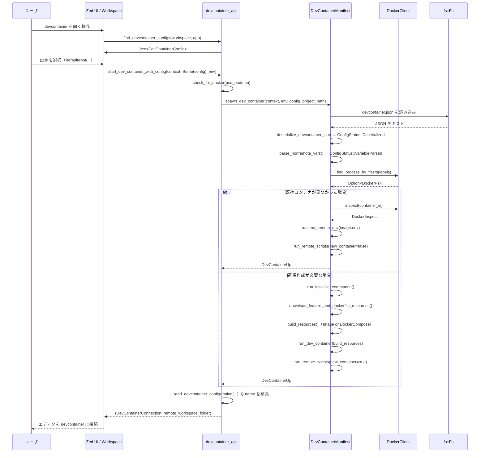

# dev_container/ クレート コード解説

## 1. ざっくり一言

Zed のプロジェクトから `.devcontainer/devcontainer.json` などの設定を読み取り、  
Docker / Podman 上に devcontainer をビルド・起動し、エディタから接続するためのクレートです。

---

## 2. このモジュールの役割

### 2.1 概要

- このクレートは **VS Code / containers.dev 互換の devcontainer.json** を解釈し、  
  Docker / Podman を用いて開発用コンテナを構築・起動する役割を持ちます。
- devcontainer **Features** や **Templates（OCI レジストリから配布されるテンプレート）** をダウンロード・展開し、  
  プロジェクトに `.devcontainer/` ディレクトリを生成する処理も含まれます。
- devcontainer の **ライフサイクルスクリプト（initialize/onCreate/postCreate など）** をホスト／コンテナ内で実行し、  
  起動済みコンテナとの再接続（再利用）も扱います。

### 2.2 アーキテクチャ内での位置づけ

このクレート内部の主なモジュール間と外部依存の関係を簡略化して示します。

```mermaid
graph TD
    UI[Zed UI / Workspace] --> API[devcontainer_api]
    API --> M[devcontainer_manifest]
    API --> CJ[command_json]

    M --> JSON[devcontainer_json]
    M --> D[docker.rs (DockerClient)]
    M --> F[features.rs]
    M --> OCI[oci.rs]
    M --> FS[fs::Fs]
    M --> HTTP[http_client::HttpClient]

    API --> Settings[settings::DevContainerConnection]
```

- `devcontainer_api`  
  外部（Workspace や UI コード）から呼ばれる高レベル API を提供します。
- `devcontainer_manifest`  
  devcontainer.json の読み込み → 変数展開 → Features のダウンロード → Docker/Compose ビルド → 実行、  
  という一連の処理をまとめた中核モジュールです。
- `devcontainer_json`  
  devcontainer.json のスキーマを Rust の構造体・列挙体として表現し、  
  `serde_json_lenient` によるコメント付き JSON のパースを担当します。
- `command_json`  
  外部コマンドを非同期で実行し、標準出力から JSON をデシリアライズするユーティリティです。
- `docker.rs` / `features.rs` / `oci.rs`（実装はこのチャンクには出てきません）  
  Docker / Podman CLI 抽象、devcontainer Feature の表現、OCI レジストリとの通信を担当します。

### 2.3 設計上のポイント

コードから読み取れる特徴を箇条書きにします。

- **責務分割**
  - `devcontainer_api` … Workspace との橋渡し（設定探索・起動要求・テンプレート適用）。
  - `devcontainer_manifest` … 具体的な Docker/Compose ビルド・実行フロー。
  - `devcontainer_json` … devcontainer.json の型定義とデシリアライズ。
  - `command_json` … 「コマンド実行 + JSON パース」という共通パターンの抽象化。
- **依存の抽象化**
  - ファイルシステムは `fs::Fs`（trait）、HTTP クライアントは `http_client::HttpClient`（trait）、
    Docker/Podman は `DockerClient`（trait）、外部コマンド実行は `CommandRunner`（trait）に抽象化され、
    実装には `Arc<dyn Trait>` が使われています。
  - テストでは `FakeFs` / `FakeHttpClient` / `FakeDocker` / `TestCommandRunner` で差し替えられており、
    外部依存をモックしやすい構造になっています。
- **設定の二段階パース**
  - `DevContainerManifest` は、まず `"${...}"` 変数を展開しない状態で devcontainer.json を読み込み、
    次に `parse_nonremote_vars` で `${devcontainerId}` や `${localEnv:VAR}` などの非リモート変数を展開します。
  - これを `ConfigStatus::{Deserialized, VariableParsed}` で明示的に区別しています。
- **エラーハンドリング**
  - ドメイン固有の `DevContainerError` を定義し、Docker 未インストール、ファイルシステムエラー、
    OCI リソース取得失敗、設定パース失敗などを一元的に扱います。
  - ほとんどの関数は `Result<_, DevContainerError>` を返し、`log` クレートで詳細を記録します。
- **devcontainers CLI との整合性**
  - コード中に `containers.dev` の仕様 URL へのコメントが多く、  
    Features の展開や Dockerfile.extended の生成ロジックは CLI 実装をかなり忠実にトレースしています。
  - テストでは、生成される Dockerfile や docker-compose オーバーライド JSON を
    文字列比較で検証しており、仕様との差異を防いでいます。

---

## 3. 主要な機能一覧

このクレートが提供する主な機能をまとめます。

- **devcontainer 設定の探索**
  - プロジェクトの `Snapshot`（worktree 状態）から  
    `.devcontainer/devcontainer.json`、`.devcontainer.json`、`.devcontainer/<名前>/devcontainer.json`  
    を走査し、選択可能な構成一覧を生成します。

- **devcontainer.json のパースと型表現**
  - コメントや末尾カンマを含む JSON を `serde_json_lenient` でパースし、
    `DevContainer` 構造体にマッピングします。
  - `forwardPorts` や `features` のように複数の表現が許されるフィールドを
    カスタムデシリアライザで吸収します。

- **変数展開（`${...}` プレースホルダ）**
  - `${devcontainerId}`、`${localWorkspaceFolder}`、`${containerWorkspaceFolder}`、
    `${localEnv:VAR}` などの変数を devcontainer.json 文字列中で置き換えます。

- **Features とテンプレートのダウンロード**
  - OCI レジストリ（例: `ghcr.io/devcontainers/features/...`）から Feature を取得し、
    一時ディレクトリに展開して `Dockerfile.extended` や環境ファイルを生成します。
  - devcontainer テンプレートをダウンロードし、テンプレートオプションの展開や
    Features の自動挿入を行った上でプロジェクトに `.devcontainer/` を作成します。

- **Docker イメージ / Docker Compose のビルド**
  - `image`, `build.dockerfile`, `dockerComposeFile + service` のいずれにも対応し、
    必要に応じて `docker buildx build` や `docker compose build` を組み立てます。
  - devcontainer Features を反映した拡張 Dockerfile（`Dockerfile.extended`）を生成します。

- **コンテナの起動と再利用**
  - ラベル（`devcontainer.local_folder`, `devcontainer.config_file`）を使って
    既存の devcontainer コンテナを検索し、存在すれば再利用します。
  - 不在の場合は新規にコンテナを起動し、ポートフォワードやボリュームマウントを設定します。

- **ライフサイクルスクリプトの実行**
  - `initializeCommand` をホスト上で、`onCreateCommand` / `postCreateCommand` /
    `postStartCommand` / `postAttachCommand` / `updateContentCommand` をコンテナ内で実行します。

- **エディタとの接続情報の生成**
  - 実行中コンテナの ID・リモートユーザ名・ワークスペースパス・
    拡張機能 ID・リモート環境変数をまとめた `DevContainerConnection` を返します。

---

## 4. 関数・構造体の解説

### 4.1 主な型一覧

| 名前 | 種別 | 定義モジュール | 役割 / 用途 |
|------|------|----------------|-------------|
| `DevContainerConfig` | 構造体 | `devcontainer_api` | 発見された devcontainer 設定 1 件を表します（表示名と設定ファイルへの相対パス）。 |
| `DevContainerUp` | 構造体 | `devcontainer_api` | 起動済みコンテナの ID・リモートユーザ・ワークスペースパス・リモート環境などを表します。 |
| `DevContainerApply` | 構造体 | `devcontainer_api` | テンプレート適用後にプロジェクト内に作成されたファイル群（`RelPath` の一覧）を保持します。 |
| `DevContainerError` | 列挙体 | `devcontainer_api` | Docker 未インストール、パース失敗、リソース取得失敗など、クレート内の代表的なエラーを表します。 |
| `ForwardPort` | 列挙体 | `devcontainer_json` | `forwardPorts` の要素（数値ポートまたは文字列 `"service:port"`）を表現します。 |
| `PortAttributes` | 構造体 | `devcontainer_json` | ポートフォワードに対するラベル・自動フォワード動作・プロトコルなどの属性です。 |
| `MountDefinition` | 構造体 | `devcontainer_json` | `mounts` や `workspaceMount` の 1 件分（`source`, `target`, `type`）を表します。 |
| `FeatureOptions` | 列挙体 | `devcontainer_json` | Feature の値（`true` / `"version"` / オプションオブジェクト）を表現します。 |
| `LifecycleScript` | 構造体 | `devcontainer_json` | `onCreateCommand` などのライフサイクルスクリプトを、名前付きコマンド群として保持します。 |
| `DevContainerBuildType` | 列挙体 | `devcontainer_json` | 設定が `image` / `build` / `dockerComposeFile` のどれに該当するかを表します。 |
| `DevContainer` | 構造体 | `devcontainer_json` | devcontainer.json のメイン設定全体を表す構造体です。 |
| `ZedCustomizationsWrapper` / `ZedCustomization` | 構造体 | `devcontainer_json` | `customizations.zed.extensions` を抽出するためのラッパーです。 |
| `CommandRunner` | trait | `command_json` | 外部コマンドを非同期に実行するための抽象インターフェイスです。 |
| `DefaultCommandRunner` | 構造体 | `command_json` | 実際に `util::command::Command::output()` を呼び出す標準実装です。 |
| `DockerComposeResources` | 構造体 | `devcontainer_manifest` | docker-compose 関係のファイル一覧とパース済み `DockerComposeConfig` をまとめます。 |
| `DevContainerManifest` | 構造体 | `devcontainer_manifest` | devcontainer.json からコンテナ起動までの状態・依存をまとめた内部オブジェクトです（外部には公開されていません）。 |
| `FeaturesBuildInfo` | 構造体 | `devcontainer_manifest` | `Dockerfile.extended` のパス、Features 展開ディレクトリ、ビルド用のイメージタグ等を保持します。 |
| `DockerBuildResources` | 構造体 | `devcontainer_manifest` | 1 コンテナ起動に必要なイメージ情報・追加マウント・エントリポイントスクリプトを保持します。 |

### 4.2 主要な関数（詳細）

#### `find_devcontainer_configs(workspace: &Workspace, cx: &gpui::App) -> Vec<DevContainerConfig>`

**概要**

- 現在の Workspace（プロジェクト）から devcontainer 設定を探索し、
  UI で選択可能な `DevContainerConfig` の一覧を返します。

**引数**

| 引数名 | 型 | 説明 |
|--------|----|------|
| `workspace` | `&Workspace` | Zed の Workspace オブジェクト。プロジェクト・ワークツリーにアクセスするために使います。 |
| `cx` | `&gpui::App` | gpui のアプリケーションコンテキスト。`Project` や `Worktree` への読み取りに使用します。 |

**戻り値**

- `Vec<DevContainerConfig>`  
  - 見つかった設定のリスト。0 件のこともあります。
  - 優先度順にソートされて返ります（`default` / `root` が先頭、それ以外は名前順）。

**内部処理の流れ**

1. `workspace.project().read(cx)` から `Project` を取得します。
2. 可視な worktree のうち、ルートがディレクトリのものを 1 つ選びます。
3. その `Snapshot` を `find_configs_in_snapshot` に渡して実際の探索を行います。
4. 見つからなかった場合は空の `Vec` を返します。

探索ロジック（`find_configs_in_snapshot`）は次を行います。

- `.devcontainer/` ディレクトリが存在する場合:
  - 直下に `devcontainer.json` があれば `"default"` として追加。
  - さらにサブディレクトリ直下の `devcontainer.json` を、それぞれ `name = サブディレクトリ名` で追加。
- `.devcontainer.json` がプロジェクトルートに存在する場合:
  - `"root"` 設定として常に追加（`.devcontainer/devcontainer.json` があっても併存）。
- 最後に `"default"` / `"root"` を先頭にし、それ以外を名前順ソートします。

**Examples（使用例）**

```rust
use workspace::Workspace;
use gpui::App;
use dev_container::devcontainer_api::{find_devcontainer_configs, DevContainerConfig};

fn pick_devcontainer_config(workspace: &Workspace, app: &App) -> Option<DevContainerConfig> {
    // プロジェクト内の devcontainer 設定を列挙する
    let configs = find_devcontainer_configs(workspace, app);

    // 何もなければ None を返す
    if configs.is_empty() {
        return None;
    }

    // ここでは単純に最初の設定を選ぶ（UI ではユーザ選択に置き換わる）
    Some(configs[0].clone())
}
```

**Errors / Panics**

- この関数自体は `Result` を返さず、内部でエラーが起きた場合は `log::debug!` 等で記録した上で
  単に空のベクタを返します。

**Edge cases**

- `.devcontainer/` が空ディレクトリだけ存在し、`.devcontainer.json` も無い場合:
  - テスト `test_find_configs_empty_devcontainer_dir_falls_back_to_root` にあるように、  
    `.devcontainer.json` があれば `"root"` のみが返ります。
- `.devcontainer.json` と `.devcontainer/devcontainer.json` の両方がある場合:
  - `"default"` と `"root"` の 2 件が返ります。

**使用上の注意点**

- 実際のディスクではなく Worktree の `Snapshot` を基に探索するため、  
  Zed 内でまだ保存していない変更も反映される場合があります。

---

#### `start_dev_container_with_config(context: DevContainerContext, config: Option<DevContainerConfig>, environment: HashMap<String, String>) -> Result<(DevContainerConnection, String), DevContainerError>`

**概要**

- 選択された devcontainer 設定に基づいて Docker / Podman 上にコンテナを起動し、
  エディタが接続に使う `DevContainerConnection` とリモートワークスペースパスを返します。

**引数**

| 引数名 | 型 | 説明 |
|--------|----|------|
| `context` | `DevContainerContext` | プロジェクトディレクトリ、`fs::Fs`、HTTP クライアント、`use_podman` などを含むコンテキスト（定義は `lib.rs` 側にあります）。 |
| `config` | `Option<DevContainerConfig>` | 起動に使う devcontainer 設定。`None` の場合はエラーになります。 |
| `environment` | `HashMap<String, String>` | `${localEnv:...}` 展開などに使うローカル環境変数マップです。 |

**戻り値**

- `Ok((DevContainerConnection, String))`  
  - `DevContainerConnection`: コンテナ ID、リモートユーザ、Features から推論された Zed 拡張 ID 等。
  - `String`: リモートワークスペースフォルダ（コンテナ内パス）。
- `Err(DevContainerError)`  
  - Docker 未検出、devcontainer 設定不正、コンテナ起動失敗など。

**内部処理の流れ**

1. `check_for_docker(context.use_podman)` で `docker` または `podman` CLI の存在を `--version` で確認。
2. `config` が `None` の場合は `NotInValidProject` エラーを返します。
3. `spawn_dev_container`（`devcontainer_manifest` 側の関数）を呼び出し、  
   実際のビルド・起動（または既存コンテナ再利用）を行います。
4. 成功時に得られた `DevContainerUp` から、設定を再度読み込んでプロジェクト名を決定します。
   - `read_devcontainer_configuration` で `DevContainer` を読み取り、
     `.name` があればそれを表示名として採用。
   - 取得に失敗した場合は `get_backup_project_name` でワークスペースパス末尾かコンテナ ID から補完。
5. `DevContainerConnection` を構築し、(connection, remote_workspace_folder) を返します。

**Examples（使用例）**

```rust
use std::collections::HashMap;
use dev_container::DevContainerContext;
use dev_container::devcontainer_api::{
    find_devcontainer_configs,
    start_dev_container_with_config,
};
use workspace::Workspace;
use gpui::App;

// 非同期コンテキスト内で呼び出す想定
async fn open_devcontainer_for_workspace(
    workspace: &Workspace,
    app: &App,
    context: DevContainerContext,
) -> Result<(), dev_container::devcontainer_api::DevContainerError> {
    // 1. 使用する devcontainer 設定を決める
    let configs = find_devcontainer_configs(workspace, app);
    let chosen = configs.first().cloned(); // ここでは最初の設定を採用

    // 2. 環境変数マップを用意する（${localEnv:...} の展開に利用される）
    let environment: HashMap<String, String> = std::env::vars().collect();

    // 3. コンテナを起動し、接続情報を取得する
    let (connection, remote_folder) =
        start_dev_container_with_config(context, chosen, environment).await?;

    println!("Container: {}", connection.container_id);
    println!("Remote workspace: {}", remote_folder);

    Ok(())
}
```

**Errors / Panics**

- `check_for_docker` で `docker` / `podman` 実行に失敗した場合:
  - `DevContainerError::DockerNotAvailable` が返ります。
- `spawn_dev_container` 内部で発生した各種エラーは `DevContainerUpFailed` にラップされます。

**Edge cases**

- `config` が `None` の場合:
  - 即座に `NotInValidProject` を返します（`spawn_dev_container` は呼ばれません）。
- `read_devcontainer_configuration` が失敗した場合:
  - コンテナ自体は起動済みなので、`DevContainerConnection.name` は  
    ワークスペースパスの末尾またはコンテナ ID からのバックアップ名になります。

**使用上の注意点**

- `DevContainerContext` の `project_directory` は devcontainer 設定ファイルからの相対パス解決に使われるため、
  実際のプロジェクトルートを正しく指している必要があります。
- `environment` に渡すマップは `${localEnv:VAR}` 展開のソースになるため、  
  必要な変数を漏れなく含める必要があります（`std::env::vars()` からそのまま作るのが自然です）。

---

#### `apply_devcontainer_template(...) -> Result<DevContainerApply, DevContainerError>`

```rust
pub(crate) async fn apply_devcontainer_template(
    worktree: Entity<Worktree>,
    template: &DevContainerTemplate,
    template_options: &HashMap<String, String>,
    features_selected: &HashSet<DevContainerFeature>,
    context: &DevContainerContext,
    cx: &mut AsyncWindowContext,
) -> Result<DevContainerApply, DevContainerError>
```

**概要**

- OCI レジストリ上の devcontainer テンプレートをダウンロードし、  
  `${templateOption:...}` プレースホルダと選択された Features を反映した `.devcontainer/`  
  以下のファイルをプロジェクト worktree に生成します。

**主な引数**

| 引数名 | 型 | 説明 |
|--------|----|------|
| `worktree` | `Entity<Worktree>` | ファイルを作成する対象の Worktree。 |
| `template` | `&DevContainerTemplate` | 適用するテンプレートのメタ情報（ID など）。定義は `lib.rs` にあります。 |
| `template_options` | `&HashMap<String, String>` | テンプレート内の `${templateOption:key}` を置き換えるキーと値。 |
| `features_selected` | `&HashSet<DevContainerFeature>` | `features` セクションとして挿入する Feature の集合。 |
| `context` | `&DevContainerContext` | HTTP クライアントやファイルシステムなどの依存を含みます。 |
| `cx` | `&mut AsyncWindowContext` | gpui の非同期ウィンドウコンテキスト。worktree 更新に必要です。 |

**戻り値**

- `Ok(DevContainerApply { project_files })`  
  - `project_files`: プロジェクトに作成された `.devcontainer/...` ファイルの相対パス一覧。
- `Err(DevContainerError)`  
  - OCI リソースの取得・展開・書き込みに失敗した場合など。

**内部処理の流れ（概要）**

1. `get_oci_token` と `get_latest_oci_manifest` を使ってテンプレート用の OCI マニフェストを取得。
2. 一時ディレクトリ `extract_dir` を作成し、`download_oci_tarball` でテンプレート tarball を展開。
3. 展開結果の `.devcontainer/` 以下を `WalkDir` で再帰的に走査。
4. 各ファイルについて:
   - 一時ディレクトリに対する相対パスを `RelPath` に変換。
   - ファイル内容を `context.fs.load` で読み込み。
   - `expand_template_options` で `${templateOption:key}` を `template_options` で置き換え。
   - ファイル名が `devcontainer.json` の場合は、  
     `insert_features_into_devcontainer_json` で `features` フィールドを挿入。
   - `worktree.create_entry` でプロジェクト worktree にファイルを作成（非同期）。
5. 生成された全ファイルの `RelPath` を `DevContainerApply` にまとめて返します。

**Examples（使用例）**

（`DevContainerTemplate` や `DevContainerFeature` の詳細はこのチャンクにありませんが、
概念的な使い方の例を示します。）

```rust
use std::collections::{HashMap, HashSet};
use dev_container::{
    DevContainerContext, DevContainerFeature, DevContainerTemplate,
    devcontainer_api::apply_devcontainer_template,
};
use gpui::AsyncWindowContext;
use project::Worktree;

// 非同期関数内でのイメージ
async fn apply_template_example(
    worktree: gpui::Entity<Worktree>,
    context: &DevContainerContext,
    cx: &mut AsyncWindowContext,
) -> Result<(), dev_container::devcontainer_api::DevContainerError> {
    let template = DevContainerTemplate {
        id: "rust-postgres".to_string(),
        // 他のフィールドは省略（実際は lib.rs 側の定義に従います）
    };

    // テンプレートオプション（テンプレート側で定義されているキーに合わせる）
    let mut options = HashMap::new();
    options.insert("projectName".to_string(), "my-rust-app".to_string());

    // 適用したい Features（ここでは空集合とする）
    let features = HashSet::<DevContainerFeature>::new();

    let apply_result =
        apply_devcontainer_template(worktree, &template, &options, &features, context, cx).await?;

    for path in apply_result.project_files {
        println!("Created: {}", path.as_unix_str());
    }

    Ok(())
}
```

**Errors / Edge cases**

- マニフェストに layer が 1 つも含まれない場合:
  - `"Given manifest has no layers..."` とログに出力され、`ResourceFetchFailed` が返ります。
- `RelPath::unix(...)` への変換に失敗した場合や FS 操作が失敗した場合:
  - `FilesystemError` が返ります。
- worktree への書き込み (`create_entry`) に失敗した場合:
  - `NotInValidProject` が返されます。

**使用上の注意点**

- 一時ディレクトリ（`std::env::temp_dir()` 配下）にテンプレートを展開しますが、  
  明示的なクリーンアップ処理はこの関数内には見当たりません。  
  実際の運用では OS の一時ファイルクリーンアップに依存することになります。
- `features_selected` は devcontainer.json の `features` フィールドに直接挿入されるため、  
  既存の `features` がテンプレートに含まれている場合は上書きされる点に注意が必要です。

---

#### `deserialize_devcontainer_json(json: &str) -> Result<DevContainer, DevContainerError>`

**概要**

- コメントや末尾カンマを含む devcontainer.json テキストを  
  `DevContainer` 構造体へデシリアライズします。

**引数**

| 引数名 | 型 | 説明 |
|--------|----|------|
| `json` | `&str` | devcontainer.json の生テキスト。コメント付き・末尾カンマ等も許可されます。 |

**戻り値**

- `Ok(DevContainer)` … 正常にパースできた場合。
- `Err(DevContainerError::DevContainerParseFailed)` … パースに失敗した場合。

**内部処理の流れ**

1. `serde_json_lenient::from_str::<DevContainer>(json)` を呼び出してパースを試みます。
2. 成功した場合は `Ok(devcontainer)` を返します。
3. 失敗した場合はエラーログを出力し、`DevContainerParseFailed` を返します。

**Examples（使用例）**

```rust
use dev_container::devcontainer_json::{
    deserialize_devcontainer_json,
    DevContainerBuildType,
};

fn parse_and_check_build_type(text: &str) {
    match deserialize_devcontainer_json(text) {
        Ok(dev) => {
            match dev.build_type() {
                DevContainerBuildType::Image => println!("Image-based devcontainer"),
                DevContainerBuildType::Dockerfile => println!("Dockerfile-based devcontainer"),
                DevContainerBuildType::DockerCompose => println!("Docker Compose-based devcontainer"),
                DevContainerBuildType::None => println!("No build configuration"),
            }
        }
        Err(err) => {
            eprintln!("Failed to parse devcontainer.json: {err}");
        }
    }
}
```

**Edge cases**

- `"image": 123` のように明らかに型が合わない JSON の場合:
  - テスト `should_deserialize_simple_devcontainer_json` にある通り、`DevContainerParseFailed` になります。
- `"customizations"` 内に `"zed"` キーが無い場合:
  - `ZedCustomizationsWrapper` のカスタム `Deserialize` 実装により、`zed.extensions` は空ベクタとして扱われます。
- `"customizations"` に未知のキー（`"codespaces"` など）が含まれていても:
  - それらは `serde_json_lenient::Value` として読み飛ばされ、パースは成功します。

**使用上の注意点**

- この関数は JSON のパースのみ行い、`${...}` 形式の変数展開は **一切行いません**。  
  変数展開を行いたい場合は `DevContainerManifest::parse_nonremote_vars` を通す必要があります。

---

#### `impl DevContainer { pub(crate) fn build_type(&self) -> DevContainerBuildType }`

**概要**

- `DevContainer` インスタンスが `image`, `build.dockerfile`, `dockerComposeFile` のどれに基づくかを判定します。

**判定ルール**

1. `self.image.is_some()` → `DevContainerBuildType::Image`
2. `self.docker_compose_file.is_some()` → `DevContainerBuildType::DockerCompose`
3. `self.build.is_some()` → `DevContainerBuildType::Dockerfile`
4. それ以外 → `DevContainerBuildType::None`

**Examples（使用例）**

```rust
use dev_container::devcontainer_json::{
    deserialize_devcontainer_json, DevContainerBuildType,
};

fn is_compose_based(json: &str) -> bool {
    let dev = deserialize_devcontainer_json(json).expect("valid devcontainer");
    matches!(dev.build_type(), DevContainerBuildType::DockerCompose)
}
```

**使用上の注意点**

- `image` と `dockerComposeFile` 両方が指定されているようなケースについては、  
  上記の優先順位に従い `Image` が選択されます。  
  このような設定は spec 上は推奨されませんが、コード上は `image` 優先です。

---

#### `impl LifecycleScript { pub async fn run(&self, command_runner: &Arc<dyn CommandRunner>, working_directory: &Path) -> Result<(), DevContainerError> }`

**概要**

- `initializeCommand` などのローカルライフサイクルスクリプトを、  
  `command_runner` を通じて順次実行します。

**引数**

| 引数名 | 型 | 説明 |
|--------|----|------|
| `self` | `&LifecycleScript` | 実行するスクリプト群（`default` や任意のキーに紐づくコマンド） |
| `command_runner` | `&Arc<dyn CommandRunner>` | コマンド実行を担う抽象オブジェクト。テストではモックに差し替え可能です。 |
| `working_directory` | `&Path` | コマンドのカレントディレクトリとして指定されるパスです。 |

**戻り値**

- 全てのコマンド実行で I/O エラーが発生しなければ `Ok(())` を返します。
- `CommandRunner::run_command` が `Err` を返した場合は `DevContainerError::CommandFailed` になります。

**内部処理の流れ**

1. `script_commands()` で `HashMap<String, Command>` を構築します。
   - `"foo": ["echo","foo"]` のような定義から `Command::new("echo").args(&["foo"])` を生成します。
2. 各 `(command_name, command)` について:
   - `.current_dir(working_directory)` でカレントディレクトリを設定。
   - `command_runner.run_command(&mut command).await` を呼び出し、`Output` を取得。
   - `Output.status.success()` が `false` の場合は stderr をログに出しますが、**エラーにはせず次のコマンドへ進みます**。
   - stdout を DEBUG ログに出力します。
3. 最後まで I/O エラーがなければ `Ok(())` を返します。

**Examples（使用例）**

```rust
use std::{path::Path, sync::Arc};
use dev_container::command_json::{CommandRunner, DefaultCommandRunner};
use dev_container::devcontainer_json::LifecycleScript;

// 簡易的に "echo hello" を 1 コマンドとして実行する例
async fn run_simple_script() -> Result<(), dev_container::devcontainer_api::DevContainerError> {
    // 文字列から LifecycleScript を構築
    let script = LifecycleScript::from_str("echo hello");

    // 実際のコマンド実行器（テストでは別実装に差し替え可能）
    let runner: Arc<dyn CommandRunner> = Arc::new(DefaultCommandRunner::new());

    // カレントディレクトリはカレントディレクトリを使用
    let cwd = Path::new(".");

    script.run(&runner, cwd).await
}
```

**Edge cases**

- スクリプト定義に `"key": []` のように空配列が含まれると、`command` が `None` となり  
  WARN ログを出してそのスクリプトはスキップされます。
- コマンド終了コードが非 0 の場合:
  - エラーログは出力されますが、`Result` は成功のままです。

**使用上の注意点**

- 「コマンドが失敗したら devcontainer 全体も失敗させたい」という要件にはそのままでは合致しません。  
  その場合は `CommandRunner` 実装側でステータスコードを見てエラーにするか、  
  このメソッドの戻り値だけでなくログ内容も考慮する必要があります。

---

#### `read_devcontainer_configuration(config: DevContainerConfig, context: &DevContainerContext, environment: HashMap<String, String>) -> Result<DevContainer, DevContainerError>`

**概要**

- 指定された `DevContainerConfig` に対応する devcontainer.json を読み込み、  
  `${...}` 変数を展開した状態の `DevContainer` を返します。  
  コンテナを起動せず、設定だけ確認したい場合に使われます。

**引数**

| 引数名 | 型 | 説明 |
|--------|----|------|
| `config` | `DevContainerConfig` | 読み込む devcontainer.json の相対パスと表示名。 |
| `context` | `&DevContainerContext` | FS や HTTP クライアント、`use_podman` フラグなど。 |
| `environment` | `HashMap<String, String>` | `${localEnv:...}` 展開に使うローカル環境変数。 |

**戻り値**

- `Ok(DevContainer)` … 変数展開済みの設定。
- `Err(DevContainerError)` … 読み込み・パース・変数展開のいずれかに失敗した場合。

**内部処理の流れ**

1. `Docker::new("docker" or "podman")` で `DockerClient` 実装を構築。
2. `DevContainerManifest::new(...)` でマニフェストを作成し、devcontainer.json を読み込む。
3. `parse_nonremote_vars()` を呼び出して `${devcontainerId}` などの非リモート変数を展開。
4. `devcontainer_manifest.dev_container().clone()` を返します。

**使用上の注意点**

- 実際にコンテナを起動するわけではありませんが、`Docker` のインスタンスは作成されます。
  - 将来のコード変更で `Docker` 側で何らかのチェックを行う可能性もあるため、  
    CLI が全く存在しない環境では失敗しうる点に注意が必要です（現状のコードからは断定できません）。

---

#### `spawn_dev_container(...) -> Result<DevContainerUp, DevContainerError>`

```rust
pub(crate) async fn spawn_dev_container(
    context: &DevContainerContext,
    environment: HashMap<String, String>,
    config: DevContainerConfig,
    local_project_path: &Path,
) -> Result<DevContainerUp, DevContainerError>
```

**概要**

- `DevContainerManifest` を構築し、既存 devcontainer の再利用または新規ビルド・起動を行って  
  `DevContainerUp` を返します。`start_dev_container_with_config` から呼び出されます。

**主な処理の流れ**

1. `Docker::new("docker" or "podman")` で `DockerClient` を準備。
2. `DevContainerManifest::new(...)` でマニフェストを構築。
3. `parse_nonremote_vars()` で非リモート変数を展開。
4. `check_for_existing_devcontainer()` で該当ラベルを持つコンテナが存在するか確認。
   - 存在すれば `DevContainerUp` を構築して返します（必要であれば `start_container` も実行）。
5. 存在しない場合:
   - `build_and_run()` で Features ダウンロード・Dockerfile.extended 生成・ビルド・コンテナ起動・  
     ライフサイクルスクリプト実行まで一括で行い、その結果の `DevContainerUp` を返します。

**使用上の注意点**

- 直接この関数を呼ぶのではなく、通常は `start_dev_container_with_config` を経由して使われます。
- `local_project_path` は `context.project_directory` と同じでも構いませんが、  
  テストでは任意のパスで呼び出しているため、コンテナ内のワークスペース推論にはこの値が使われます。

---

### 4.3 その他の補助的な関数（一部）

| 関数名 | 所属モジュール | 役割（1 行） |
|--------|----------------|--------------|
| `find_configs_in_snapshot` | `devcontainer_api` | `Snapshot` 上で `.devcontainer/...` パターンを探索し、`DevContainerConfig` のリストを返します。 |
| `insert_features_into_devcontainer_json` | `devcontainer_api` | devcontainer.json テキストに `features` フィールドを JSON として挿入します。 |
| `expand_template_options` | `devcontainer_api` | `${templateOption:KEY}` を単純な文字列置換で展開します。 |
| `get_backup_project_name` | `devcontainer_api` | `workspaceFolder` パスかコンテナ ID からプロジェクト名の代替文字列を生成します。 |
| `escape_regex_chars` | `devcontainer_manifest` | `/etc/passwd` 検索用の正規表現文字列をエスケープします。 |
| `extract_feature_id` | `devcontainer_manifest` | `ghcr.io/devcontainers/features/go:1` から `go` のような短い ID を抽出します。 |
| `resolve_feature_order` | `devcontainer_manifest` | `overrideFeatureInstallOrder` を考慮して Feature のインストール順序を決定します。 |
| `generate_install_wrapper` | `devcontainer_manifest` | 1 Feature 用の `devcontainer-features-install.sh` スクリプトを生成します。 |
| `get_remote_user_from_config` | `devcontainer_manifest` | devcontainer.json, Docker ラベル, `image_user` の順でリモートユーザ名を決定します。 |
| `get_container_user_from_config` | `devcontainer_manifest` | コンテナユーザ名（コンテナ内実ユーザ）を決定します。 |
| `evaluate_json_command` | `command_json` | 外部コマンドを実行し、正常終了時に stdout を JSON としてデシリアライズします。 |

---

## 5. データフロー

ここでは「devcontainer を選択して起動する」典型的なシナリオのデータフローを示します。

### 5.1 概要

1. Workspace から利用可能な devcontainer 設定一覧を取得する。
2. ユーザが 1 つの設定を選択する。
3. 選択された設定でコンテナを起動（既存コンテナがあれば再利用）する。
4. 起動したコンテナの接続情報をエディタに返す。

### 5.2 シーケンス図



### 5.3 要点

- 設定の読み込みと変数展開（`parse_nonremote_vars`）は、コンテナのビルド・起動前に必ず行われます。
- 既存コンテナがラベルから見つかれば、**ビルドフェーズをスキップ**して再利用し、
  必要なライフサイクルスクリプト（特に `postAttachCommand`）だけを実行します。
- `DevContainerUp` は、最終的に `DevContainerConnection` の構築と UI 側の表示に利用されます。

---

## 6. 使い方（How to Use）

### 6.1 基本的な使用方法

「Workspace から devcontainer 設定を探し、最初の設定でコンテナを起動する」最小限の例です。  
（`DevContainerContext` の構築はアプリ側の責務のため、ここでは概念的に記述します。）

```rust
use std::collections::HashMap;
use dev_container::{
    DevContainerContext,
    devcontainer_api::{
        find_devcontainer_configs,
        start_dev_container_with_config,
        DevContainerError,
    },
};
use workspace::Workspace;
use gpui::App;

// 非同期コンテキストで呼び出す想定
async fn open_first_devcontainer(
    workspace: &Workspace,
    app: &App,
    context: DevContainerContext, // プロジェクトディレクトリなどを含む
) -> Result<(), DevContainerError> {
    // devcontainer 設定一覧を取得する
    let configs = find_devcontainer_configs(workspace, app);

    // 設定が 1 つも無ければ何もしない
    let Some(config) = configs.first().cloned() else {
        eprintln!("No devcontainer configuration found");
        return Ok(());
    };

    // ${localEnv:...} 展開に使う環境変数マップを用意する
    let environment: HashMap<String, String> = std::env::vars().collect();

    // コンテナを起動し、接続情報を取得する
    let (connection, remote_folder) =
        start_dev_container_with_config(context, Some(config), environment).await?;

    println!("Devcontainer '{}'", connection.name);
    println!("Container ID: {}", connection.container_id);
    println!("Remote workspace: {remote_folder}");

    Ok(())
}
```

### 6.2 よくある使用パターン

#### パターン 1: `.devcontainer.json` と `.devcontainer/devcontainer.json` の両方がある場合

- `find_devcontainer_configs` は次のような順序で返します。
  1. `.devcontainer/devcontainer.json` → `"default"`  
  2. `.devcontainer.json` → `"root"`

UI で「どちらの設定を使うか」をユーザに選ばせたい場合は、  
`configs` をそのままリスト表示すると自然な順番になります。

#### パターン 2: テンプレートから devcontainer を生成してから起動する

1. `apply_devcontainer_template` で `.devcontainer/` 以下にテンプレートを展開。
2. `find_devcontainer_configs` を再度呼び出して、新しくできた設定を見つける。
3. `start_dev_container_with_config` で起動する。

```rust
// 概念的な流れのみを示します
async fn create_then_open(
    worktree: gpui::Entity<project::Worktree>,
    workspace: &Workspace,
    app: &App,
    context: DevContainerContext,
    cx: &mut gpui::AsyncWindowContext,
) -> Result<(), DevContainerError> {
    // 1. テンプレートを適用
    let template = /* DevContainerTemplate を何らかの UI から選択 */;
    let options = HashMap::new();
    let features = std::collections::HashSet::new();
    dev_container::devcontainer_api::apply_devcontainer_template(
        worktree,
        &template,
        &options,
        &features,
        &context,
        cx,
    )
    .await?;

    // 2. 新しい設定を探索
    let configs = find_devcontainer_configs(workspace, app);

    // 3. 任意の設定でコンテナを起動
    let environment = std::env::vars().collect();
    let first = configs.first().cloned();
    let (_conn, _folder) =
        start_dev_container_with_config(context, first, environment).await?;

    Ok(())
}
```

#### パターン 3: devcontainer.json だけを検査したいとき

- コンテナは起動せずに、設定の内容だけを見たい場合は `read_devcontainer_configuration` を使います。

```rust
use dev_container::devcontainer_api::{
    DevContainerConfig,
    read_devcontainer_configuration,
};

async fn inspect_devcontainer(
    context: &DevContainerContext,
) -> Result<(), dev_container::devcontainer_api::DevContainerError> {
    // 例として「default」構成を直接読む
    let config = DevContainerConfig::default_config();

    let env = std::env::vars().collect();
    let dev = read_devcontainer_configuration(config, context, env).await?;

    println!("Name: {:?}", dev.name);
    println!("Build type: {:?}", dev.build_type());
    println!("Features: {:?}", dev.features.as_ref().map(|m| m.keys()));

    Ok(())
}
```

### 6.3 よくある間違い

```rust
use dev_container::devcontainer_api::start_dev_container_with_config;

// 間違い例: config = None のまま呼び出してしまう
async fn wrong(context: dev_container::DevContainerContext) {
    let env = std::collections::HashMap::new();
    // これは DevContainerError::NotInValidProject になる
    let _ = start_dev_container_with_config(context, None, env).await;
}

// 正しい例: 事前に find_devcontainer_configs で設定を選択してから渡す
```

```rust
use dev_container::devcontainer_api::read_devcontainer_configuration;

// 間違い例: 環境変数を空マップにしてしまい、${localEnv:...} がすべて空文字になる
async fn wrong_env(context: &dev_container::DevContainerContext) {
    // 実際には環境変数を投入したいが…
    let env = std::collections::HashMap::new();

    // devcontainer.json 側で ${localEnv:HOME} などを書いていると、意図しない空文字列になります
    let _ = read_devcontainer_configuration(
        dev_container::devcontainer_api::DevContainerConfig::default_config(),
        context,
        env,
    )
    .await;
}
```

### 6.4 使用上の注意点（まとめ）

- **Docker / Podman のインストール**
  - `check_for_docker` は `docker --version` または `podman --version` を実行して確認します。
  - 見つからない場合は `DevContainerError::DockerNotAvailable` となり、コンテナは起動しません。

- **変数展開の前提**
  - `${localEnv:VAR}` の展開には `DevContainerManifest` 構築時に渡す `environment` マップが使われます。
    - `std::env::vars().collect()` から作るのがもっとも自然です。
  - `${containerEnv:VAR}` はイメージの環境変数を JSON 文字列に再シリアライズした上で置換されるため、  
    予期せぬ文字列置換が起こり得ます。

- **ライフサイクルスクリプトの失敗の扱い**
  - `LifecycleScript::run` は、コマンドの **終了コードが非 0 でもエラーを返しません**。  
    I/O エラー（コマンドを起動できない等）のみ `DevContainerError::CommandFailed` になります。
  - コンテナ内スクリプト（`onCreateCommand` など）も、`docker exec` の失敗は `DevContainerError` になりますが、  
    スクリプト自体の exit code は `DockerClient::run_docker_exec` 側の実装次第です。

- **ポートフォワードの記法**
  - `forwardPorts` の `Number` は単純に `-p port:port`（単一コンテナ）に対応します。
  - `String("db:5432")` のような形式は docker-compose 用で、  
    `"service:port"` として扱い、`build_runtime_override` 内で対象サービスごとの `"ports"` に変換されます。

- **UID/GID の書き換え**
  - 非 Windows 環境では `updateRemoteUserUID` が `Some(false)` でない限り、  
    ホストの UID/GID に合わせてコンテナ内のユーザ UID/GID を変更するための  
    追加イメージビルドが走る場合があります。
  - これによりホストディレクトリのマウント時にファイル所有権がホストユーザと揃うように設計されています。

- **一時ディレクトリの利用**
  - Features やテンプレート展開、Compose オーバーライドファイル作成に `std::env::temp_dir()` 配下が使われます。
  - このクレート内では削除処理は見当たらないため、長期的には OS 側のクリーンアップ任せになります。

---

## 7. 関連ファイル

このクレート内の主要ファイルと役割の対応です。

| パス | 役割 / 関係 |
|------|------------|
| `dev_container/Cargo.toml` | クレートメタデータと依存クレート定義。`fs`, `gpui`, `http_client`, `workspace` など UI/FS/ネットワーク関連の依存が列挙されています。 |
| `dev_container/src/lib.rs` | クレートのルートモジュール。`DevContainerContext`, `DevContainerTemplate`, `DevContainerFeature` や `get_oci_token` など、このチャンクで参照される型・関数が定義されていると考えられます（実装はこのチャンクには含まれません）。 |
| `dev_container/src/devcontainer_api.rs` | Workspace/UI から利用される高レベル API を提供。devcontainer 設定探索（`find_devcontainer_configs`）・コンテナ起動（`start_dev_container_with_config`）・テンプレート適用（`apply_devcontainer_template`）などが実装されています。 |
| `dev_container/src/devcontainer_json.rs` | devcontainer.json のスキーマ定義と lenient なデシリアライザ群。Features、mounts、Lifecycle scripts、customizations など devcontainers 仕様に対応した型がまとまっています。 |
| `dev_container/src/devcontainer_manifest.rs` | devcontainer.json から Docker/Podman コンテナをビルド・実行するための詳細なロジック。Features ダウンロード、Dockerfile.extended 生成、Compose オーバーライド生成、ライフサイクルスクリプト実行などが実装されています。 |
| `dev_container/src/command_json.rs` | `CommandRunner` trait とその標準実装 `DefaultCommandRunner` を提供し、外部コマンドから JSON を読み取る共通処理（`evaluate_json_command`）を定義します。 |
| `dev_container/src/docker.rs` | `DockerClient`, `Docker`, `DockerComposeConfig` など Docker/Podman CLI の抽象インターフェイスとデータ構造を提供するモジュールです（型参照からの推定であり、詳細実装はこのチャンクにはありません）。 |
| `dev_container/src/features.rs` | devcontainer Features のマニフェスト（`DevContainerFeatureJson`, `FeatureManifest` など）を表現し、マウント追加や Dockerfile 断片生成に利用されます（テストからの参照に基づきます）。 |
| `dev_container/src/oci.rs` | OCI レジストリとの通信ロジックをまとめたモジュール。`TokenResponse`, `get_oci_manifest`, `download_oci_tarball` などが定義されています。 |
| `dev_container/src/oci.rs` のテスト・`devcontainer_manifest.rs` のテスト | `FakeDocker`, `TestCommandRunner`, `FakeFs`, `FakeHttpClient` などを用いた統合テストを通じて、devcontainers CLI との挙動差分を防ぐ役割を果たしています。 |

この解説は、提供されたコードチャンクに基づいています。  
`lib.rs` や `docker.rs` などの詳細実装はチャンク内に含まれていないため、  
それらの内部処理については推測を避け、型名・呼び出し関係から分かる範囲にとどめています。
