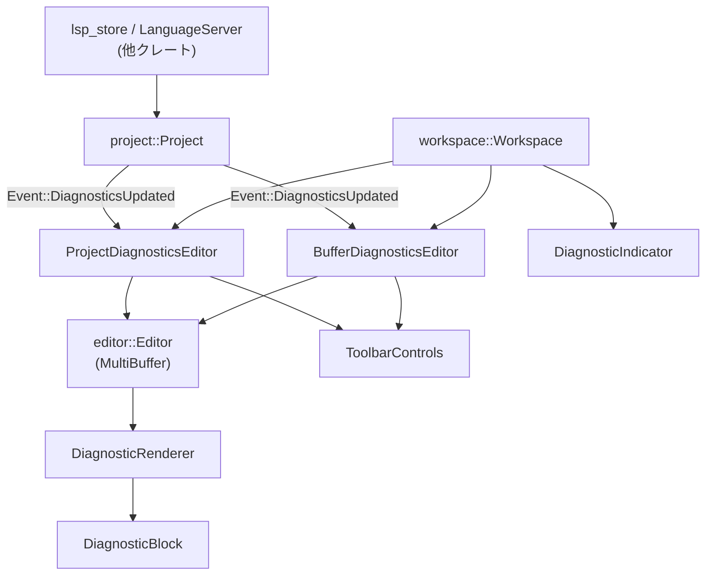
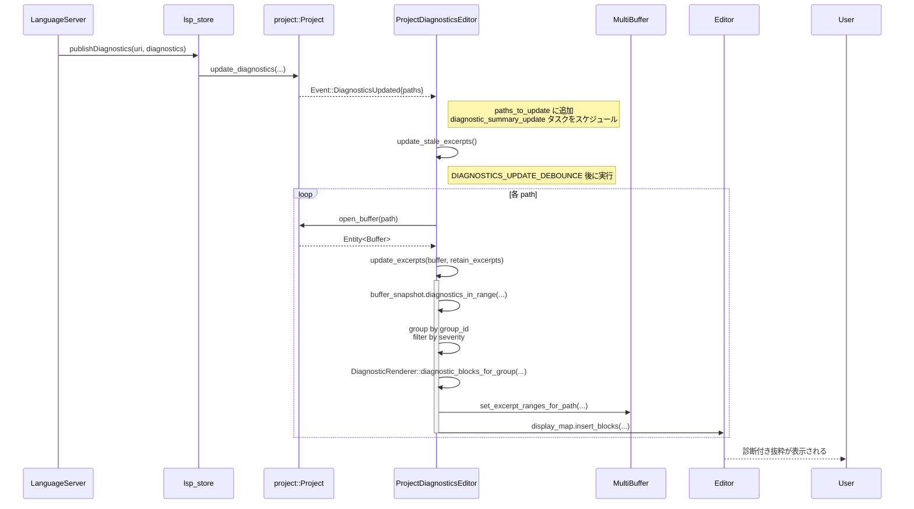

# diagnostics/ ディレクトリ解説

## 1. ざっくり一言

`diagnostics` クレートは、LSP などから届く診断情報を集約し、

- プロジェクト全体向け (`ProjectDiagnosticsEditor`)
- 1 ファイル（1 バッファ）向け (`BufferDiagnosticsEditor`)

の専用ビューと、それに連動するインライン表示・ツールバー・ステータスバー部品を提供するモジュールです。

---

## 2. このモジュールの役割

### 2.1 概要

このモジュールは **言語サーバーの診断結果をエディタ UI に統合して表示する** ために存在し、主に次の機能を提供します。

- プロジェクト全体の診断を横断的に閲覧する「プロジェクト診断ビュー」
- 現在のファイルだけに絞った「バッファ診断ビュー」
- 診断メッセージをコード横に Markdown ブロックとして表示するレンダラー
- ステータスバー上の診断サマリ・現在行の診断メッセージ表示
- 診断ビュー専用のツールバー（検索、再実行、警告の表示切り替えなど）

診断ビューはどちらも内部で `editor::Editor` と `editor::MultiBuffer` を利用し、「診断がある箇所だけを抜き出した擬似バッファ」を構築して表示します。

### 2.2 アーキテクチャ内での位置づけ

主要コンポーネントの依存関係を簡略化して示すと次のようになります。



- `ProjectDiagnosticsEditor` / `BufferDiagnosticsEditor` は `Workspace` のタブアイテム (`Item`) として扱われます。
- どちらのエディタも `DiagnosticsToolbarEditor` トレイトを実装しており、`ToolbarControls` から共通の操作（警告の ON/OFF、更新停止/再実行など）を受け取ります。
- `DiagnosticRenderer` はグローバルに `editor::set_diagnostic_renderer` 経由で登録され、通常のエディタ内のインライン診断表示やホバーポップオーバにも利用されます。
- `DiagnosticIndicator` はステータスバーの `StatusItemView` として、診断件数とカーソル位置の代表的な診断を表示します。

### 2.3 設計上のポイント

コードから読み取れる主な設計上の特徴です。

- **エディタから独立した診断ビュー**
  - 診断ビュー用に専用の `MultiBuffer` を用意し、診断のある範囲だけを抜き出した抜粋（excerpt）を並べたバッファを構築します。
  - これにより、複数ファイルの問題を 1 つのスクロールビューで一覧できます。

- **バックグラウンドタスク + デバウンス**
  - 診断の更新は `cx.spawn_in(window, async move |..., cx| { ... })` でバックグラウンドタスクとして実行されます。
  - `DIAGNOSTICS_UPDATE_DEBOUNCE`（50ms）などのデバウンスを入れて、診断の連続更新に対する UI の過剰な再描画を避けています。

- **差分更新の最小化**
  - `diagnostics_are_unchanged` で既存の診断と新しい診断を比較し、メッセージ・severity・primary フラグ・レンジ（オフセット変換後）が完全一致している場合は何も更新しません。

- **診断グループとナビゲーション**
  - 診断には `group_id` があり、`DiagnosticRenderer::diagnostic_blocks_for_group` でグループ単位に Markdown ブロックを生成します。
  - 遠く離れた関連診断は Markdown 内リンク（`file://#diagnostic-...`）で相互にジャンプでき、`DiagnosticBlock::open_link` で解決されます。

- **共通ツールバー用のトレイト**
  - `DiagnosticsToolbarEditor` トレイトで「警告を含めるか」「更新中か」「診断の再読み込み」「現在のバッファの診断取得」などを抽象化し、プロジェクト/バッファ両方のビューから同じ UI（`ToolbarControls`）で操作できるようにしています。

- **Tree-sitter を用いたコンテキスト拡張**
  - `context_range_for_entry` と `heuristic_syntactic_expand` で、診断位置の前後にどこまでコードを含めるかを構文情報から推定し、関数・ブロック単位のまとまりで抜粋を生成しようとしています。

---

## 3. 主要な機能一覧

このディレクトリが提供する主な機能を列挙します。

- **プロジェクト診断ビュー (`ProjectDiagnosticsEditor`)**
  - ワークスペース内のすべてのファイルの診断を、抜粋を並べた専用ビューで一覧表示します。
  - エラー数／警告数のサマリ表示や、自動更新の ON/OFF、警告表示の切り替えをサポートします。

- **バッファ診断ビュー (`BufferDiagnosticsEditor`)**
  - 特定の 1 ファイルに対する診断のみを、抜粋＋診断ブロックとして表示します。
  - 同一パスのタブが既に開いていれば再利用し、新しいタブを増やしません。

- **診断レンダラー (`DiagnosticRenderer`)**
  - `editor::DiagnosticRenderer` トレイト実装として、エディタ内のインライン診断ブロックやホバーポップオーバを Markdown で描画します。
  - 診断コード・ソースの表示や、「hint」リンク／「back」リンクによるグループ内ナビゲーションを行います。

- **診断ブロック (`DiagnosticBlock`)**
  - 個々の診断グループ要素を表し、適切な色・枠線・コピー用ボタン付きの UI ブロックとして描画します。
  - Markdown 内リンクから実際のバッファ位置へジャンプする処理を持ちます。

- **診断ツールバー (`ToolbarControls`)**
  - バッファ診断ビュー／プロジェクト診断ビューがアクティブなときに、検索ボタン・Inline Assist ボタン・診断再読み込みボタン・警告トグルボタンなどを表示します。

- **ステータスバーの診断インジケータ (`DiagnosticIndicator`)**
  - ワークスペース全体のエラー数／警告数をアイコン付きで表示し、クリックで診断ビューを開きます。
  - アクティブなエディタのカーソル位置で最も重要と思われる診断メッセージを 1 行表示し、クリックで次の診断へ移動します。

- **グローバル設定・アクション**
  - `IncludeWarnings`（警告を含めるか）のグローバル設定。
  - アクション:
    - `Deploy`（プロジェクト診断ビューを開く）
    - `ToggleWarnings`（警告表示の ON/OFF）
    - `ToggleDiagnosticsRefresh`（自動更新の ON/OFF）
    - `DeployCurrentFile`（現在のファイルのバッファ診断ビューを開く）

---

## 4. 関数・構造体の解説

### 4.1 型一覧（主要な構造体・トレイト）

| 名前 | 種別 | 役割 / 用途 |
|------|------|-------------|
| `IncludeWarnings` | 構造体 + `Global` | 「警告を含めるか」を保持するグローバル設定 (`bool`) |
| `ProjectDiagnosticsEditor` | 構造体 (`Item`, `Focusable`, `EventEmitter<EditorEvent>`, `Render`) | プロジェクト全体の診断を抜粋ビューで表示するタブアイテム |
| `BufferDiagnosticsEditor` | 構造体 (`Item`, `Focusable`, `EventEmitter<EditorEvent>`, `Render`) | 1 つの `ProjectPath` に対する診断だけを表示するタブアイテム |
| `DiagnosticRenderer` | 構造体 (`editor::DiagnosticRenderer` 実装) | エディタ内のインライン診断・ホバー表示を Markdown ブロックとして描画するレンダラー |
| `DiagnosticBlock` | 構造体（`Clone`） | 個々の診断グループ要素の表示・ナビゲーションを担う UI ブロック |
| `DiagnosticsToolbarEditor` | トレイト | ツールバーから診断ビューを操作するための共通インターフェイス |
| `ToolbarControls` | 構造体 (`ToolbarItemView`, `Render`) | 診断ビュー用のツールバー UI（検索・再読み込み・警告トグル） |
| `DiagnosticIndicator` | 構造体 (`StatusItemView`, `Render`) | ステータスバーの診断インジケータ（件数と現在行の診断メッセージ） |

この他に、抜粋範囲を求めるための関数 `context_range_for_entry`、Tree-sitter を利用した範囲拡張関数 `heuristic_syntactic_expand` などがあります。

---

### 4.2 重要な関数・メソッド（詳細）

ここでは特に重要な 7 個の関数・メソッドを取り上げます。

#### `init(cx: &mut App)`

**概要**

- 診断システム全体をアプリケーションに組み込む初期化関数です。
- エディタのグローバル診断レンダラーを差し替え、ワークスペースが作られたときに診断ビューのアクション登録が行われるように設定します。

**引数**

| 引数名 | 型 | 説明 |
|--------|----|------|
| `cx` | `&mut App` | アプリケーション全体のコンテキスト |

**戻り値**

- なし（`()`）

**内部処理の流れ**

1. `editor::set_diagnostic_renderer` で、`DiagnosticRenderer` をグローバルな診断レンダラーとして登録します。
2. `cx.observe_new(ProjectDiagnosticsEditor::register)` を登録し、新しい `Workspace` が作られるたびに `ProjectDiagnosticsEditor::register` が呼ばれるようにします。
3. 同様に `BufferDiagnosticsEditor::register` も登録し、バッファ診断ビュー用のアクションも自動登録されるようにします。

**使用例**

テストコードでは、アプリ初期化時に次のように呼び出されています。

```rust
fn init_test(cx: &mut gpui::TestAppContext) {
    cx.update(|cx| {
        zlog::init_test();
        let settings = SettingsStore::test(cx);   // 設定ストアの初期化
        cx.set_global(settings);
        theme_settings::init(theme::LoadThemes::JustBase, cx); // テーマ初期化

        diagnostics::init(cx);  // 診断システムの初期化
        editor::init(cx);       // エディタ本体の初期化（他クレート）
    });
}
```

**Edge cases（エッジケース）**

- `init` 自体には特別な前提条件は見えませんが、テストではテーマや設定ストアの初期化後に呼ばれています。これらが前提である可能性はありますが、コードからは明確には分かりません。
- `init` を呼ばない場合、エディタの診断レンダラーはデフォルトのままであり、このクレートが提供する Markdown ベースのブロック表示やナビゲーションは有効になりません。

**使用上の注意点**

- アプリケーション起動時に 1 度だけ呼び出す想定の処理です。複数回呼び出しても大きな副作用はなさそうですが、そのような利用はコードからは想定されていません。

---

#### `ProjectDiagnosticsEditor::update_excerpts(&mut self, buffer: Entity<Buffer>, retain_excerpts: RetainExcerpts, window: &mut Window, cx: &mut Context<Self>) -> Task<Result<()>>`

**概要**

- プロジェクト診断ビュー内で、指定されたバッファ（ファイル）の診断抜粋と診断ブロックを更新します。
- 既存の抜粋を再利用するかどうかを `retain_excerpts` で制御し、診断のないバッファの抜粋を削除するロジックと連動します。

**引数**

| 引数名 | 型 | 説明 |
|--------|----|------|
| `buffer` | `Entity<Buffer>` | 対象となるソースコードバッファ |
| `retain_excerpts` | `RetainExcerpts` (`All` / `Dirty`) | 既存の抜粋を保持するかどうか |
| `window` | `&mut Window` | ウィンドウコンテキスト |
| `cx` | `&mut Context<Self>` | このエディタ用のコンテキスト |

**戻り値**

- `Task<Result<()>>`  
  バックグラウンドで更新を行うタスクです。`Result` の具体的なエラー要因はコードからは分かりません。

**内部処理の流れ（簡略版）**

1. 現在の抜粋バッファが空かどうかを `was_empty` として保存します。
2. `buffer` のスナップショットを取得し、`buffer_id` と最大診断 severity（警告を含めるかどうかで ERROR/ WARNING を切り替え）を決定します。
3. `cx.spawn_in(window, async move |this, cx| { ... })` でバックグラウンドタスクを開始します。
4. バックグラウンドタスク内で:
   - `buffer_snapshot.diagnostics_in_range` でバッファ全体の診断を収集します。
   - `diagnostics_are_unchanged` によって既存の診断と比較し、変化がなければ早期リターンします。
   - `group_id` ごとに診断を `HashMap<usize, Vec<_>>` へグルーピングします。
   - グループ最小 severity が最大表示 severity (`max_severity`) を超える場合はそのグループをスキップします。
   - `DiagnosticRenderer::diagnostic_blocks_for_group` を使って `DiagnosticBlock` 群を生成し、`blocks` ベクタに追加します。
   - 既存の抜粋（`ExcerptRange<Anchor>`）を取得し、`retain_excerpts` が `Dirty` かつバッファがクリーンであれば空のリストにします。
   - 各 `DiagnosticBlock` について `context_range_for_entry` を呼び出し、診断の前後を含めたコンテキスト範囲を決定します。
   - その結果から `ExcerptRange` を挿入ソートし、`result_blocks`（各抜粋に対応する `Option<DiagnosticBlock>`）を構築します。
5. 最後に `update_in` で UI スレッドに戻り:
   - 既存の表示ブロック（`CustomBlockId`）を削除します。
   - `MultiBuffer::set_excerpt_ranges_for_path` で新しい抜粋範囲を設定します。
   - 抜粋範囲から `Anchor` ベースのレンジを計算し、最初のレンジにカーソルを移動します（ビューが空だった場合）。
   - 新しい `BlockProperties` 群を `Editor` の `display_map` に挿入し、`self.blocks` に記録します。

**Examples（使用例）**

実際には `update_stale_excerpts` からのみ呼び出される内部メソッドですが、テストでは次のように再利用されています。

```rust
// 既存の診断ビューに対して「古くなったパス」を再度更新させる
mutated_diagnostics.update_in(cx, |diagnostics, window, cx| {
    diagnostics.update_stale_excerpts(window, cx)
});
```

`update_stale_excerpts` 内で、各パスに対して `update_excerpts(buffer, retain_excerpts, ...)` が順次呼ばれます。

**Errors / Panics**

- `Task<Result<()>>` は内部で `?` を多用しているため、`Buffer` のオープンや UI 更新が失敗した場合に `Err` を返す可能性があります。  
  ただし、どの条件で `Err` になるかは、このチャンクだけでは特定できません。

**Edge cases（エッジケース）**

- 同じ内容の診断が再度通知された場合は、`diagnostics_are_unchanged` により UI を一切更新しません。
- `retain_excerpts` が `Dirty` の場合、クリーンなバッファの既存抜粋はすべて破棄されます。これにより、診断が消えたファイルの抜粋が自動で閉じられます。
- 診断グループに `is_primary` な診断がない場合、`DiagnosticRenderer::diagnostic_blocks_for_group` は空を返し、そのグループはビューに出ません。

**使用上の注意点**

- この関数を直接呼び出すよりも、`update_stale_excerpts` を通じて呼ぶ前提の作りになっています。  
  `update_excerpts_task` による「同時実行の防止」は `update_stale_excerpts` 側にあるためです。
- 大きなファイル・大量の診断に対しても動作するよう設計されていますが、コンテキスト生成や Tree-sitter による解析は非同期とはいえ、ある程度のコストがかかります。

---

#### `BufferDiagnosticsEditor::update_excerpts(&mut self, buffer: Entity<Buffer>, window: &mut Window, cx: &mut Context<Self>) -> Task<Result<()>>`

**概要**

- バッファ診断ビュー用に、1 つのバッファの診断抜粋と診断ブロックを更新します。
- `ProjectDiagnosticsEditor::update_excerpts` と似ていますが、単一バッファ専用であり、`diagnostics` フィールドにこのバッファの診断だけを保持します。

**引数**

| 引数名 | 型 | 説明 |
|--------|----|------|
| `buffer` | `Entity<Buffer>` | 対象バッファ |
| `window` | `&mut Window` | ウィンドウコンテキスト |
| `cx` | `&mut Context<Self>` | このエディタのコンテキスト |

**戻り値**

- `Task<Result<()>>`（バックグラウンドでの更新タスク）

**内部処理の流れ（要約）**

1. `was_empty`（マルチバッファが空かどうか）を保存します。
2. 文脈行数（`multibuffer_context_lines(cx)`）、バッファスナップショット、最大 severity（警告を含めるかどうか）を決定します。
3. `cx.spawn_in(window, async move |buffer_diagnostics_editor, mut cx| { ... })` で非同期タスクを開始します。
4. タスク内で:
   - バッファ全体の診断（`DiagnosticEntryRef<Anchor>`）を収集。
   - `diagnostics_are_unchanged` で変化有無を判定し、変化がなければ早期リターン。
   - `set_diagnostics` で `self.diagnostics` を更新。
   - `group_id` ごとに診断をグルーピングし、severity でフィルタ。
   - プロジェクトの `languages()` を取得し、`DiagnosticRenderer::diagnostic_blocks_for_group` で `DiagnosticBlock` 群を生成。
   - 診断ブロックを開始位置・終了位置でソートし、抜粋範囲 (`ExcerptRange`) を構築。
   - `context_range_for_entry` で文脈範囲を計算し、バイナリサーチで既存の抜粋リストに挿入。
5. 最後に UI スレッドで:
   - 既存のブロック ID を `display_map.remove_blocks` で削除。
   - `MultiBuffer::set_excerpt_ranges_for_path` で新しい抜粋を設定。
   - 抜粋からマルチバッファ上のアンカー範囲を求め、最初の範囲にカーソルを移動（初回のみ）。
   - `BlockProperties` を生成し `display_map.insert_blocks` で挿入、`self.blocks` に ID を保存。

**Examples（使用例）**

テストでの利用例です。`BufferDiagnosticsEditor` のビュー構築後、一定時間経過させてから内容を検証しています。

```rust
let buffer_diagnostics = window.build_entity(cx, |window, cx| {
    BufferDiagnosticsEditor::new(
        project_path.clone(),    // 対象パス
        project.clone(),         // プロジェクト
        buffer,                  // 対象バッファ
        true,                    // warnings を含める
        window,
        cx,
    )
});
let editor = buffer_diagnostics.update(cx, |bde, _| bde.editor().clone());

// 非同期タスクが完了するまでデバウンス時間を進める
cx.executor()
    .advance_clock(DIAGNOSTICS_UPDATE_DEBOUNCE + Duration::from_millis(10));
```

**Errors / Panics**

- `Result` のエラー内容は `anyhow::Result` でラップされており、詳細はこのチャンクからは分かりません。

**Edge cases**

- 診断が 1 件も無い場合、`render` 実装側で「No problems in」「No errors in」といったメッセージのみが表示されます。
- `update_excerpts_task` により、同時に複数の更新タスクが走らないよう、`update_all_excerpts` 側で制御されています。

**使用上の注意点**

- `update_excerpts` は直接呼び出すのではなく、`update_all_excerpts` 経由で呼ばれる設計になっています。  
  外部から直接呼ぶ場合は、`update_excerpts_task` との整合性に注意が必要です（コード上ではそのような利用はされていません）。

---

#### `DiagnosticRenderer::diagnostic_blocks_for_group(diagnostic_group, buffer_id, diagnostics_editor, language_registry, cx) -> Vec<DiagnosticBlock>`

**概要**

- 1 つの診断グループ（`group_id` が同じ診断集合）から、表示用の `DiagnosticBlock` 群を生成します。
- 主にメッセージの Markdown 化、関連情報への「hint」リンクや「back」リンクの付加を行います。

**引数**

| 引数名 | 型 | 説明 |
|--------|----|------|
| `diagnostic_group` | `Vec<DiagnosticEntryRef<'_, Point>>` | 同一 `group_id` を持つ診断の集合 |
| `buffer_id` | `BufferId` | 診断が属するバッファの ID |
| `diagnostics_editor` | `Option<Arc<dyn DiagnosticsToolbarEditor>>` | 診断ビューへの参照（「hint」リンクなどのナビゲーションに使用） |
| `language_registry` | `Option<Arc<LanguageRegistry>>` | Markdown 内のコードブロックで利用する言語レジストリ |
| `cx` | `&mut App` | アプリケーションコンテキスト |

**戻り値**

- `Vec<DiagnosticBlock>`  
  各診断（グループ内のエントリ）に対応するブロックのベクタ。

**内部処理の流れ**

1. `diagnostic_group` から `diagnostic.is_primary` なエントリを探し、見つからなければ空ベクタを返します。
2. プライマリ診断（`primary`）の `group_id` を取得し、以降の Markdown 生成の基準にします。
3. 各エントリに対してループし:
   - `markdown(diagnostic)` でベースとなる Markdown 文字列を構築。
   - **プライマリ診断の場合**:
     - `source` や `code` があれば `" (eslint no-unused-vars)"` のように末尾に追記。`code_description` が URL の場合には `[code](url)` 形式でリンクにします。
     - グループ内の他のエントリのうち、プライマリから 5 行以上離れているものを `hint` として列挙し、`- hint: [message](file://#diagnostic-...)` 形式のリンクを追加します。
   - **非プライマリ診断の場合**:
     - プライマリ診断と 5 行以上離れている場合は、`([back](file://#diagnostic-...))` というリンクを末尾に追加します。
4. 上記で構築した Markdown を `Markdown::new` で `Entity<Markdown>` に変換し、`DiagnosticBlock` として `results` に追加します。

**Examples（使用例）**

この関数は `ProjectDiagnosticsEditor`・`BufferDiagnosticsEditor` の両方から内部的に呼ばれています。概念的なイメージは次の通りです。

```rust
let blocks = DiagnosticRenderer::diagnostic_blocks_for_group(
    group,                                  // 同一 group_id の診断一覧
    buffer_snapshot.remote_id(),            // バッファ ID
    Some(Arc::new(diagnostics_editor)),     // 診断ビュー（ナビゲーション用）
    Some(language_registry.clone()),        // 言語レジストリ
    cx,
);
```

**Edge cases**

- グループ内に `is_primary` が設定された診断がない場合、何も表示されません。
- 行距離による判定は `abs_diff` で行われており、「5 行以上離れているかどうか」で hint/back を付けるかどうかが決まります。
- `diagnostic.markdown` が設定されていればそれを優先し、なければ `message` を Markdown エスケープして使います。

**使用上の注意点**

- この関数は UI に近いロジック（Markdown 文字列構築）を持っているため、メッセージ形式の仕様変更（例: hint の書式変更）が必要な場合はここを変更する必要があります。
- 診断コード・ソースの表示方法（括弧付きやリンク形式）もここで決まっています。

---

#### `DiagnosticBlock::open_link(editor, diagnostics_editor, link, window, cx)`

**概要**

- 診断ブロック内の Markdown リンクをクリックしたときに呼ばれ、  
  - 診断ビュー内の別の診断位置にジャンプする、または
  - 通常の URL としてブラウザ等に委譲する  
  という振る舞いを行います。

**引数**

| 引数名 | 型 | 説明 |
|--------|----|------|
| `editor` | `&mut Editor` | 対象エディタ |
| `diagnostics_editor` | `&Option<Arc<dyn DiagnosticsToolbarEditor>>` | 診断ビューへの参照（なければエディタ自身から診断を取得） |
| `link` | `SharedString` | クリックされたリンク文字列 |
| `window` | `&mut Window` | ウィンドウコンテキスト |
| `cx` | `&mut Context<Editor>` | エディタのコンテキスト |

**戻り値**

- なし（ジャンプまたは何もしない）

**内部処理の流れ**

1. `link` が `"file://#diagnostic-"` で始まるかどうかを判定します。
   - そうでなければ `editor::hover_popover::open_markdown_url` に委譲し、通常の URL 処理を行って終了します。
2. `"file://#diagnostic-{buffer_id}-{group_id}-{ix}"` 形式をパースし、`buffer_id`, `group_id`, `ix` を取得します。
   - パースに失敗した場合は何もせずに終了します。
3. `diagnostics_editor` が `Some` の場合:
   - `diagnostics_editor.get_diagnostics_for_buffer(buffer_id, cx)` で該当バッファの診断一覧を取得。
   - `group_id` が一致する診断の `ix` 番目を取り出します。
   - エディタのマルチバッファスナップショットから `diagnostic.range` をエディタ座標のアンカー範囲に変換し、`jump_to` を呼びます。
4. `diagnostics_editor` が `None` の場合:
   - `editor.snapshot(window, cx).buffer_snapshot().diagnostic_group(buffer_id, group_id)` から `ix` 番目を取得し、同様に `jump_to` を呼びます。

`jump_to` では、レンジをオフセットに変換して必要な範囲を展開し、カーソルを診断開始位置に移動してエディタにフォーカスします。

**Examples（使用例）**

`DiagnosticBlock::render_block` 内で URL クリック時に呼び出されます。

```rust
MarkdownElement::new(self.markdown.clone(), style)
    .on_url_click({
        let diagnostics_editor = self.diagnostics_editor.clone();
        move |link, window, cx| {
            editor
                .update(cx, |editor, cx| {
                    DiagnosticBlock::open_link(editor, &diagnostics_editor, link, window, cx)
                })
                .ok();
        }
    });
```

**Edge cases**

- `buffer_id` や `group_id` に対応する診断が既に消えている場合はジャンプできませんが、その場合は何も起こらないだけです。
- マルチバッファのアンカー変換に失敗した場合も同様に何もしません。

**使用上の注意点**

- `file://#diagnostic-...` 形式はモジュール内で暗黙の「内部リンク仕様」として扱われています。他のコードからこの形式の URL を生成する場合は、このフォーマットに合わせる必要があります。

---

#### `context_range_for_entry(range: Range<Point>, context: u32, snapshot: BufferSnapshot, cx: &mut AsyncApp) -> Range<text::Anchor>`

**概要**

- 単一の診断レンジ（行・列座標）を入力として、その前後を含めた「コンテキスト行の範囲」を計算し、アンカー範囲として返します。
- 可能であれば Tree-sitter の構文情報を使って関数やブロック単位に拡張し、それが大きすぎる場合は単純な前後 `context` 行にフォールバックします。

**引数**

| 引数名 | 型 | 説明 |
|--------|----|------|
| `range` | `Range<Point>` | 診断の元になったバッファ上の位置（開始・終了） |
| `context` | `u32` | フォールバック時に前後に含める行数 |
| `snapshot` | `BufferSnapshot` | バッファのスナップショット |
| `cx` | `&mut AsyncApp` | 非同期アプリケーションコンテキスト |

**戻り値**

- `Range<text::Anchor>`  
  `buffer_snapshot.anchor_after` / `anchor_before` で計算されたアンカー範囲。

**内部処理の流れ**

1. `heuristic_syntactic_expand` を呼び出し、`DIAGNOSTIC_EXPANSION_ROW_LIMIT`（32 行）を上限とした構文ベースの範囲拡張を試みます。
2. 拡張結果が `Some(rows)` の場合:
   - 開始座標を `Point::new(*rows.start(), 0)`（行頭）、
   - 終了座標を `snapshot.clip_point(Point::new(*rows.end(), u32::MAX), Bias::Left)` として範囲を構築します。
3. 拡張結果が `None` の場合:
   - `range.start.row.saturating_sub(context)` 行から、`range.end.row + context` 行までを単純に含めた範囲を作ります（両端は `clip_point` でバッファ内に収めます）。
4. 最終的に、その開始・終了 `Point` をアンカーに変換し、`anchor_after(start)..anchor_before(end)` を返します。

**Examples（使用例）**

`ProjectDiagnosticsEditor::update_excerpts` や `BufferDiagnosticsEditor::update_excerpts` 内から、診断ブロックごとに呼ばれています。

```rust
let excerpt_range = context_range_for_entry(
    diagnostic_block.initial_range.clone(), // 診断の元レンジ（Point）
    multibuffer_context,                    // 文脈行数
    buffer_snapshot.clone(),                // スナップショット
    &mut cx,                                // AsyncApp
).await;
```

**Edge cases**

- 診断レンジの行数差が `DIAGNOSTIC_EXPANSION_ROW_LIMIT` より大きい場合、`heuristic_syntactic_expand` は即座に `None` を返し、単純な前後行ベースのコンテキストになります。
- アウトライン情報や構文木が取得できない場合（`syntax_ancestor` が `None` の場合）は、同様にフォールバックします。

**使用上の注意点**

- Tree-sitter に依存したヒューリスティックのため、すべての言語で「期待通りのブロック単位」に拡張される保証はありません。  
  うまくマッチしない場合でも、安全側に倒して単純なコンテキスト行数に戻る仕様になっています。

---

#### `heuristic_syntactic_expand(input_range, max_row_count, snapshot, cx) -> Option<RangeInclusive<BufferRow>>`

**概要**

- `context_range_for_entry` から呼び出される補助関数で、診断範囲を Tree-sitter の構文情報（アウトライン情報や構文木）を使って「ちょうどよい行範囲」に拡張します。

**引数 / 戻り値**

- `input_range: Range<Point>`：診断の元レンジ。
- `max_row_count: u32`：最大拡張行数。
- `snapshot: BufferSnapshot`：対象バッファのスナップショット。
- `cx: &mut AsyncApp`：非同期コンテキスト。
- 戻り値は `Option<RangeInclusive<BufferRow>>` で、採用された行範囲（両端含む）です。

**内部処理のポイント**

- まず入力レンジをクリップし、行数が `max_row_count` を超える場合は `None` を返します。
- アウトラインノード（関数・クラスなど）が診断を含み、かつ行数が十分小さい場合は、そのノードの行範囲を返します（ただし前後の空行はトリミングして評価）。
- そうでなければ、`syntax_ancestor` で構文木上の祖先ノードをたどり:
  - 行数が多すぎる or アウトラインノードと一致する場合には、子ノードのうち診断レンジを含む連続部分を探して、そこだけを返そうとします。
  - `grammar_name` が `"block"` で終わればそのブロック全体を返します。
  - `"statement"` / `"declaration"` で終わる場合は、インデントを元に前後の「dedent or blank line」まで範囲を広げます。
- いずれもうまくいかない場合、`None` を返します（＝フォールバックへ）。

**使用上の注意点**

- かなり言語依存のヒューリスティックであり、コードからは「どの言語に対してどの程度うまく機能するか」は判断できません。
- コメント中に `TODO` があり、将来的な改善余地がある実装であることが示唆されています。

---

#### `DiagnosticIndicator::update(&mut self, editor: Entity<Editor>, window: &mut Window, cx: &mut Context<Self>)`

**概要**

- アクティブエディタのカーソル位置に基づいて、「現在行の代表的な診断メッセージ」を更新します。
- ステータスバーに表示される 1 行メッセージと、`Next Diagnostic` ボタンの挙動に直接影響します。

**引数**

| 引数名 | 型 | 説明 |
|--------|----|------|
| `editor` | `Entity<Editor>` | アクティブなエディタ |
| `window` | `&mut Window` | ウィンドウコンテキスト |
| `cx` | `&mut Context<Self>` | このインジケータのコンテキスト |

**戻り値**

- なし（更新は内部フィールド `current_diagnostic` へ反映）

**内部処理の流れ**

1. `editor.display_snapshot(cx)` と `editor.selections.newest::<MultiBufferOffset>` から、バッファスナップショットとカーソル位置（オフセット）を取得します。
2. `buffer.diagnostics_in_range(cursor_position..cursor_position)` で、カーソル位置を含む診断を列挙します（ゼロ幅ではない診断のみ）。
3. `(severity, range_length)` をキーに `min_by_key` で最も重要（severity が高く、かつ範囲が狭い）な診断を選びます。
4. 選定結果が以前の `current_diagnostic` と異なる場合:
   - 新しい診断をローカル変数にキャプチャして `cx.spawn_in(window, ...)` で 50ms デバウンス付きの更新タスクを開始します。
   - タスク内で `current_diagnostic` を更新し、`cx.notify()` で再描画を促します。

**Examples（使用例）**

`StatusItemView` の `set_active_pane_item` 内から使用されています。

```rust
impl StatusItemView for DiagnosticIndicator {
    fn set_active_pane_item(
        &mut self,
        active_pane_item: Option<&dyn ItemHandle>,
        window: &mut Window,
        cx: &mut Context<Self>,
    ) {
        if let Some(editor) = active_pane_item.and_then(|item| item.downcast::<Editor>()) {
            self.active_editor = Some(editor.downgrade());
            self._observe_active_editor = Some(cx.observe_in(&editor, window, Self::update));
            self.update(editor, window, cx);       // 初回更新
        } else {
            self.active_editor = None;
            self.current_diagnostic = None;
            self._observe_active_editor = None;
        }
        cx.notify();
    }
}
```

**Edge cases**

- カーソル位置に診断がない場合は `current_diagnostic` は `None` になり、メッセージ用ボタンはレンダリングされません。
- 診断が頻繁に変化する場合でも 50ms のデバウンスがあるため、ステータスバー表示の更新頻度が抑えられます。

**使用上の注意点**

- `diagnostics_in_range` の検索範囲は `cursor_position..cursor_position` なので、「カーソルが当たっていないが近くにある診断」は拾いません。  
  仕様上、「カーソルが乗っている診断のうち重要なもの 1 つ」を表示する実装になっています。

---

### 4.3 その他の主な関数・メソッド

詳細解説は省きますが、利用や変更時に重要になりそうな関数をまとめます。

| 関数名 / メソッド | 所属 | 役割（1 行） |
|-------------------|------|--------------|
| `ProjectDiagnosticsEditor::deploy` | `diagnostics.rs` | `Deploy` アクションを処理し、既存ビューをアクティブにするか、新しいプロジェクト診断ビューを作成します。 |
| `ProjectDiagnosticsEditor::refresh` | 同上 | すべての既存診断・ブロックをクリアし、プロジェクトから再取得します。 |
| `ProjectDiagnosticsEditor::toggle_warnings` | 同上 | `IncludeWarnings` グローバルを反転し、警告表示の ON/OFF を切り替えます。 |
| `ProjectDiagnosticsEditor::toggle_diagnostics_refresh` | 同上 | 自動更新タスク (`update_excerpts_task`) の有効/無効を切り替えます。 |
| `ProjectDiagnosticsEditor::close_diagnosticless_buffers` | 同上 | 診断がなく、未編集なバッファの抜粋をマルチバッファから削除します。 |
| `BufferDiagnosticsEditor::new` | `buffer_diagnostics.rs` | 1 ファイル用の診断ビューを構築し、プロジェクトイベント・エディタイベントに購読します。 |
| `BufferDiagnosticsEditor::deploy` | 同上 | アクティブエディタのパスに対してバッファ診断ビューを開くアクションハンドラです。既存タブがあれば再利用します。 |
| `BufferDiagnosticsEditor::toggle_warnings` | 同上 | バッファ診断ビュー内で警告の表示/非表示を切り替え、診断を再取得します。 |
| `DiagnosticRenderer::render_group` | `diagnostic_renderer.rs` | エディタ内インライン表示用に `BlockProperties<Anchor>` のベクタを生成します。 |
| `DiagnosticRenderer::render_hover` | 同上 | ホバー時に表示する `Markdown` エンティティを返します。 |
| `ToolbarControls::render` | `toolbar_controls.rs` | 検索・Inline Assist・診断更新・警告トグルなどのボタン群を描画します。 |
| `ToolbarControls::set_active_pane_item` | 同上 | アクティブなタブが診断ビューかどうかを判定し、ツールバーの表示有無を決定します。 |
| `DiagnosticIndicator::go_to_next_diagnostic` | `items.rs` | ステータスバーのメッセージボタンから「次の診断」へ移動するアクションを実行します。 |

---

## 5. データフロー

ここでは、**LSP から診断が届き、プロジェクト診断ビューに反映される** 一連の流れを示します。

### 5.1 処理の要点

1. 言語サーバーから LSP 診断（`PublishDiagnosticsParams`）が `lsp_store` 経由で `project::Project` に伝播します。
2. `Project` は内部状態を更新し、購読者へ `project::Event::DiagnosticsUpdated { language_server_id, paths }` を発行します。
3. `ProjectDiagnosticsEditor` はこのイベントを購読しており、`paths_to_update` にパスを追加し、要約更新タスクと抜粋更新タスクをスケジュールします。
4. `update_stale_excerpts` がデバウンス後に呼ばれ、各パスについて `project.open_buffer(path, cx)` でバッファを開き、`update_excerpts` を実行します。
5. `update_excerpts` は `DiagnosticRenderer` で診断ブロックを生成し、`MultiBuffer` と `Editor` の `display_map` を更新します。
6. ビューが再描画され、ユーザーは診断付き抜粋を確認できます。

### 5.2 シーケンス図



---

## 6. 使い方（How to Use）

### 6.1 基本的な使用方法

#### 6.1.1 初期化

このクレートのテストコードに倣うと、アプリケーション起動時に次のような流れで初期化されています。

```rust
use gpui::App;
use settings::SettingsStore;

fn init_app(cx: &mut App) {
    // ログや設定の初期化（例）
    zlog::init();                           // ログ（テストでは init_test が使われています）
    let settings = SettingsStore::test(cx); // 設定ストア（実アプリでは別の初期化の可能性あり）
    cx.set_global(settings);

    // テーマ等の初期化
    theme_settings::init(theme::LoadThemes::JustBase, cx);

    // 診断システムを有効化
    diagnostics::init(cx);

    // エディタ本体の初期化
    editor::init(cx);
}
```

`diagnostics::init(cx)` を呼ぶことで:

- エディタの診断レンダラーが `DiagnosticRenderer` に差し替えられる
- 新しく生成される `Workspace` に対して
  - `ProjectDiagnosticsEditor::register`
  - `BufferDiagnosticsEditor::register`
  が自動的に呼び出され、アクション (`Deploy`, `DeployCurrentFile` など) が登録されます。

#### 6.1.2 プロジェクト診断ビューを開く

UI からは `Deploy` アクション（キーバインド・メニュー等）を通じて開かれますが、コード上は次のような形です。

```rust
workspace.update(cx, |workspace, cx| {
    ProjectDiagnosticsEditor::deploy(
        workspace,
        &diagnostics::Deploy,  // アクション値（中身は空 struct）
        window,
        cx,
    );
});
```

- 既に `ProjectDiagnosticsEditor` のタブが存在する場合はそれをアクティブにし、存在しない場合は新たに生成してアクティブペインに追加します。

#### 6.1.3 バッファ診断ビューを開く

現在のエディタに対応するファイルのみの診断ビューは `DeployCurrentFile` アクションで開かれます。

```rust
workspace.update(cx, |workspace, cx| {
    // アクティブな Editor を探し、対応する ProjectPath を取得
    // deploy 内で既存タブの再利用 or 新規作成が行われる
    BufferDiagnosticsEditor::deploy(
        workspace,
        &diagnostics::buffer_diagnostics::DeployCurrentFile,
        window,
        cx,
    );
});
```

実際のコードでは `BufferDiagnosticsEditor::register` により `Workspace::register_action` に登録されているため、UI からのアクションディスパッチで自然に呼ばれます。

### 6.2 よくある使用パターン

#### パターン 1: ステータスバーからプロジェクト診断ビューへ

1. `DiagnosticIndicator` がステータスバーに表示され、エラー/警告数を表示。
2. ユーザーがインジケータをクリックすると:
   - 警告のみ存在する場合は `IncludeWarnings` グローバルを `true` に更新。
   - `ProjectDiagnosticsEditor::deploy` が呼び出され、プロジェクト診断ビューを表示。
3. ビュー内のツールバー（`ToolbarControls`）で警告表示の ON/OFF や診断更新を制御。

#### パターン 2: バッファ診断ビューで警告を一時的に隠す

1. `BufferDiagnosticsEditor` がアクティブなタブとして開かれている。
2. ツールバーの警告アイコンをクリックすると、`DiagnosticsToolbarEditor::toggle_warnings` が呼び出されます。
3. `BufferDiagnosticsEditor::toggle_warnings` は
   - 内部フラグ `include_warnings` を反転、
   - エディタの最大 severity 設定を更新（Warning or Error）、
   - 診断キャッシュをクリアし、
   - 再度診断抜粋を生成します。

#### パターン 3: エディタのカーソル位置の診断を確認

1. ユーザーがソースコードエディタ上でカーソルを移動。
2. `DiagnosticIndicator` は `Editor` のイベントを購読しており、`update` でカーソル位置の診断を検索。
3. 該当診断があれば、その先頭行をステータスバーに表示し、クリックで `editor.go_to_diagnostic_impl(Direction::Next, ...)` を実行して次の診断にジャンプします。

### 6.3 よくある間違い

コードから推測できる範囲で、起こりやすそうな誤用例と正しい使い方を対比します。

```rust
// 間違い例: diagnostics::init を呼ばずに Workspace や Editor だけ初期化する
fn init_app(cx: &mut App) {
    editor::init(cx);
    // diagnostics::init(cx); // 呼んでいない
}

// この場合:
// - エディタ内の診断レンダラーが差し替わらない
// - Workspace に診断ビュー用アクションが登録されない
// ため、診断ビューやツールバーが期待通りに動作しません。

// 正しい例: editor::init の前に diagnostics::init を呼ぶ
fn init_app(cx: &mut App) {
    diagnostics::init(cx);
    editor::init(cx);
}
```

```rust
// 間違い例: 直接 new してタブに追加し、既存タブの再利用処理をバイパスする
let diagnostics = cx.new(|cx| ProjectDiagnosticsEditor::new(
    true, project.clone(), workspace.downgrade(), window, cx
));
workspace.add_item_to_active_pane(Box::new(diagnostics), None, true, window, cx);

// この場合、「すでに同じ役割のタブが開いているか？」というチェックが行われません。

// 正しい例: deploy を使って作成／アクティブ化を一元化する
workspace.update(cx, |workspace, cx| {
    ProjectDiagnosticsEditor::deploy(workspace, &Default::default(), window, cx);
});
```

### 6.4 使用上の注意点（まとめ）

- **初期化順序**
  - テストでは `theme_settings::init` や設定ストアの初期化の後に `diagnostics::init`・`editor::init` を呼んでいます。  
    これらの順序に依存したコードは見当たりませんが、同様の順序にしておくとテストと同じ前提になります。

- **デバウンスとバックグラウンドタスク**
  - 診断更新にはデバウンス（50ms）とバックグラウンド処理が入っているため、診断を送ってすぐにはビューが更新されません。  
    テストでは `advance_clock` や `run_until_parked` で時間を進めている点に注意が必要です。

- **抜粋の縮小（shrinking）**
  - `ProjectDiagnosticsEditor::update_excerpts` 内に `// TODO(cole): maybe should use the nonshrinking API?` というコメントがあり、診断が減ったときに抜粋範囲がどこまで縮小されるかは現状の実装に依存しています。  
    大まかには「診断のない抜粋は一定条件で削除されるが、常に最小限にはならない」挙動と解釈できます。

- **警告の扱い**
  - `IncludeWarnings` グローバルとビュー個別の `include_warnings` フラグの組み合わせで、どのビューに警告を表示するかが決まります。  
    プロジェクト診断ビューではグローバル設定を直接利用し、バッファ診断ビューでは構築時の引数と UI 操作によって個別に切り替えています。

- **複数言語サーバー**
  - テストから、複数の言語サーバー (`LanguageServerId`) の診断が同じファイルに混在することが想定されています。  
    更新タイミングの差異によって、あるサーバーの結果だけが先に反映されるケースも考慮されており、`DiskBasedDiagnosticsStarted/Finished` イベントに応じた更新が行われます。

---

## 7. 関連ファイル

`diagnostics` ディレクトリ内のファイルとその役割です。

| パス | 役割 / 関係 |
|------|------------|
| `diagnostics/Cargo.toml` | `diagnostics` クレートの定義。ライブラリのエントリポイントを `src/diagnostics.rs` に設定し、各種依存クレート（`editor`, `project`, `workspace` など）を宣言しています。 |
| `diagnostics/src/diagnostics.rs` | クレートのメインモジュール。`init` 関数、アクション定義（`Deploy`, `ToggleWarnings`, `ToggleDiagnosticsRefresh`）、`IncludeWarnings` グローバル、`ProjectDiagnosticsEditor`、コンテキスト範囲計算ロジック（`context_range_for_entry`, `heuristic_syntactic_expand`）を定義します。 |
| `diagnostics/src/buffer_diagnostics.rs` | 単一バッファ用の診断ビュー `BufferDiagnosticsEditor` の実装。プロジェクトイベント・エディタイベントの購読と、抜粋／診断ブロックの生成ロジックを持ちます。 |
| `diagnostics/src/diagnostic_renderer.rs` | `editor::DiagnosticRenderer` 実装である `DiagnosticRenderer` と、その内部で使用する `DiagnosticBlock` を定義。インライン診断ブロック／ホバー表示／リンククリック時のジャンプ処理を提供します。 |
| `diagnostics/src/items.rs` | ステータスバーアイテム `DiagnosticIndicator` の実装。プロジェクト全体の診断サマリやカーソル位置の診断メッセージを表示し、プロジェクト診断ビューを開くエントリポイントとなります。 |
| `diagnostics/src/toolbar_controls.rs` | 診断ビュー用ツールバー `ToolbarControls` と、その裏側でプロジェクト／バッファ診断ビューを抽象化するトレイト `DiagnosticsToolbarEditor` を定義します。 |
| `diagnostics/src/diagnostics_tests.rs` | 本クレート全体の振る舞いを検証するテスト群。複数サーバー、フォールドとの相互作用、ランダムな診断更新、ホバーポップオーバ、バッファ診断ビューの挙動などを網羅的に検証しています。 |

このディレクトリは、`editor` / `project` / `workspace` など他クレートと密接に連携しており、「診断データの収集」と「UI 表示」の橋渡しとなるコンポーネント群をまとめています。
