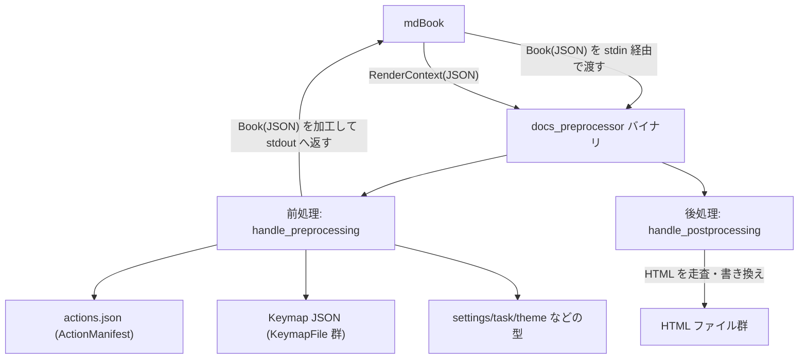
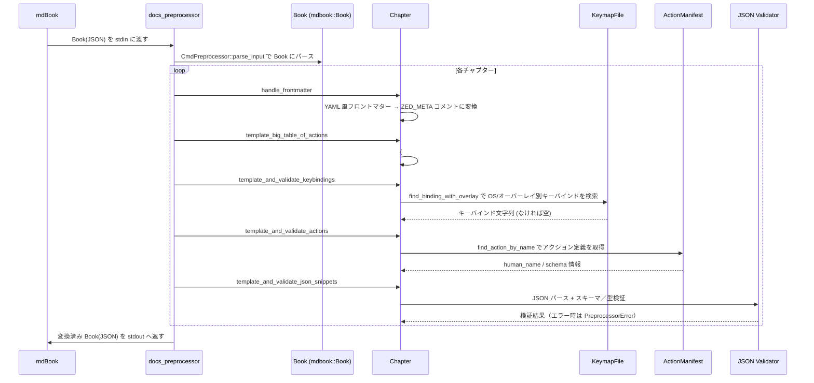

# docs_preprocessor/

## 1. ざっくり一言

Zed のドキュメント（mdBook）をビルドする際に使う **専用プリプロセッサ／ポストプロセッサのバイナリ**です。  
Markdown 内のカスタムマーカーを展開してアクション名・キーバインド・設定 JSON を検証し、生成された HTML にメタ情報や解析用キーを埋め込みます。

---

## 2. このモジュールの役割

### 2.1 概要

この crate は、mdBook に統合されるコマンドラインバイナリ `docs_preprocessor` を提供します。主な役割は次のとおりです。

- Markdown 先頭の YAML 風フロントマターを解析し、**メタデータコメント**として埋め直す
- `{#kb ...}` や `{#action ...}` といった **カスタムマーカーを HTML に展開**しつつ、参照されるアクション・キーバインドが有効か検証する
- ```json [settings]``` などの **ラベル付き JSON コードブロックを型・スキーマに従って検証**する
- mdBook が生成した HTML ファイルを後処理し、**SEO メタデータや解析用キー、タイトル**を差し込む

### 2.2 アーキテクチャ内での位置づけ

主なコンポーネント間の関係を、簡略化した図で示します。



- mdBook はプリプロセッサとして `docs_preprocessor` を呼び出し、JSON 形式の `Book` を stdin で渡します。
- `handle_preprocessing` が Book を変換し、再び JSON で mdBook に返します。
- HTML 生成後、mdBook はレンダラー／ポストプロセッサとして `docs_preprocessor postprocess` を呼び出し、`handle_postprocessing` が HTML を最終調整します。
- `actions.json` と各種 Keymap/Settings/Task/Theme 型は、ドキュメント内のコード例やアクション参照の **検証ソース**として使われます。

### 2.3 設計上のポイント

- **単一バイナリで前処理・後処理を両方担当**
  - 引数 `"postprocess"` の有無でモードを切り替えます。
- **遅延初期化されたグローバル状態**
  - `LazyLock` を使って Keymap やアクションマニフェストを一度だけ読み込みます。
- **エラーは重複をまとめて収集**
  - `HashSet<PreprocessorError>` に集約し、全チャプターを走査し終わってから失敗させます。
- **正規表現ベースのテンプレート展開**
  - `{#kb ...}`, `{#action ...}`, `{#ACTIONS_TABLE#}` などのプレースホルダを `regex` で置換します。
- **JSON スニペットの厳格な検証**
  - `jsonschema` と `settings`/`task`/`theme` の型を用いて、ドキュメント中の JSON 例が実際の設定・キー設定スキーマに合致するかをチェックします。
- **mdBook バージョンの固定**
  - `mdbook = "= 0.4.40"` にピン止めされており、コメントに「二重にネストしたサブディレクトリの問題を避けるため」と記載されています。

---

## 3. 主要な機能一覧

この crate が提供する主な機能を列挙します。

- フロントマター処理:
  - Markdown 先頭の `--- ... ---` ブロックをパースし、`<!-- ZED_META {...} -->` 形式のコメントに変換
- アクション一覧テンプレート:
  - `{#ACTIONS_TABLE#}` マーカーを、`actions.json` 由来の **アクション一覧 HTML** に置換
- キーバインドテンプレートと検証:
  - `{#kb [:[overlay]] action_name}` マーカーを、OS 別キーバインド `<kbd>` 要素に展開
  - 存在しないアクションや廃止エイリアスの使用を検出
- アクション名テンプレートと検証:
  - `{#action action_name}` マーカーを、人間向けのアクション名 `<code>` に変換
  - 未定義・廃止アクションを検出
- JSON スニペット検証:
  - ```json [settings]``` / `[keymap]` / `[debug]` / `[tasks]` / `[icon-theme]` / `[semantic_token_rules]`  
    といったラベル付き JSON コードブロックを、対応するスキーマ・型で検証
- HTML ポストプロセス:
  - フロントマター由来のタイトル・説明を抽出し、HTML の `<title>` や `#description#` プレースホルダを差し替え
  - 環境変数 `DOCS_AMPLITUDE_API_KEY` と `DOCS_CONSENT_IO_INSTANCE` を `#amplitude_key#` / `#consent_io_instance#` に埋め込む

---

## 4. 関数・構造体の解説

### 4.1 型一覧（構造体・列挙体など）

#### 列挙体・構造体

| 名前 | 種別 | 役割 / 用途 |
|------|------|-------------|
| `Os` | enum | キーマップを取得する対象 OS を表す（`MacOs` / `Linux` / `Windows`）。 |
| `KeymapOverlay` | enum | キーマップのオーバーレイ種別（現在は `JetBrains` のみ）。 `{#kb:jetbrains ...}` で指定。 |
| `PreprocessorError` | enum | 前処理中に発生しうる論理エラーを種類別に表現し、`HashSet` で重複排除するために使われます。 |
| `ActionDef` | struct | `actions.json` 内の各アクション定義を表現。名前・表示名・スキーマ・廃止エイリアス・ドキュメントなどを保持。 |
| `ActionManifest` | struct | `actions.json` 全体（アクション一覧と共通スキーマ定義）を表現します。 |

`PreprocessorError` の主なバリアント:

- `ActionNotFound { action_name }`  
  未定義のアクション名が使われた場合。
- `DeprecatedActionUsed { used, should_be }`  
  廃止エイリアスを参照している場合。新しい名前が `should_be` に入ります。
- `InvalidFrontmatterLine(String)`  
  フロントマター内の行に `:` 区切りが含まれない場合。
- `InvalidSettingsJson { file, line, snippet, error }`  
  JSON スニペットがパースまたは検証に失敗した場合。ファイルパスと行番号付き。
- `UnknownKeymapOverlay { overlay_name }`  
  `{#kb:... ...}` で未対応のオーバーレイ名を指定した場合。

#### グローバル静的値

| 名前 | 種別 | 役割 |
|------|------|------|
| `KEYMAP_MACOS` / `KEYMAP_LINUX` / `KEYMAP_WINDOWS` | `LazyLock<KeymapFile>` | 各 OS 用のデフォルトキーマップ。初アクセス時に JSON アセットからパース。 |
| `KEYMAP_JETBRAINS_MACOS` / `KEYMAP_JETBRAINS_LINUX` | `LazyLock<KeymapFile>` | JetBrains 風キーマップオーバーレイ用。 |
| `ALL_ACTIONS` | `LazyLock<ActionManifest>` | crate ルート `actions.json` から読み込んだアクション定義とスキーマ定義。 |
| `FRONT_MATTER_COMMENT` | `&'static str` | `<!-- ZED_META {} -->` というプレースホルダコメント。`{}` に JSON を埋め込む。 |

### 4.2 重要な関数の詳細

#### `handle_preprocessing() -> Result<()>`

**概要**

- stdin から mdBook の `Book` JSON を読み込み、各種前処理（フロントマター展開・テンプレート展開・JSON 検証）を行い、結果を stdout に JSON で書き出します。
- エラーが一つでもあれば標準エラーに一覧表示し、非 0 終了します。

**引数**

| 引数名 | 型 | 説明 |
|--------|----|------|
| なし | - | stdin / stdout / stderr を通じてやり取りします。 |

**戻り値**

- `Result<()>`  
  - 正常終了時: `Ok(())`
  - 何らかのエラーが検出された場合や I/O 失敗時: `Err(anyhow::Error)`

**内部処理の流れ**

1. `stdin` をすべて読み込み `String` として保持。
2. `CmdPreprocessor::parse_input` で `(ctx, book)` をパース（`ctx` は未使用）。
3. 空の `HashSet<PreprocessorError>` を用意し、次の順番で処理を適用:
   - `handle_frontmatter`
   - `template_big_table_of_actions`
   - `template_and_validate_keybindings`
   - `template_and_validate_actions`
   - `template_and_validate_json_snippets`
4. `errors` が空でなければ:
   - 各エラーを ANSI 赤で `stderr` に出力。
   - `Err(anyhow!("Found {} errors in docs", errors.len()))` を返す。
5. 問題なければ `serde_json::to_writer(stdout, &book)` で書き出し、`Ok(())` を返す。

**Examples（使用例）**

mdBook を経由せず、単体で処理を試したい場合のイメージです（擬似コード）。

```bash
# 既に用意された book.json を前処理
cat book.json | docs_preprocessor > book.processed.json
```

**Errors / Panics**

- JSON 形式が mdBook の `CmdPreprocessor::parse_input` で解釈できない場合、`Err` を返します。
- 内部処理で `PreprocessorError` が一つでも生成されると、`Err(anyhow::Error)` で全体が失敗します。

**Edge cases（エッジケース）**

- どのチャプターにもテンプレートや JSON スニペットが存在しない場合でも、単に変換せずにそのまま Book を出力します。
- `actions.json` や Keymap アセットが存在せず、`LazyLock` の初期化が失敗すると、該当箇所で panic する可能性があります（特に CI 環境では `actions.json` が無いと即 panic）。

**使用上の注意点**

- この関数は直接呼び出すのではなく、バイナリ `docs_preprocessor` を mdBook からプリプロセッサとして呼び出す想定です。
- エラーはまとめて出力されるため、修正後も複数のエラーが残っていないか確認する必要があります。

---

#### `handle_postprocessing() -> Result<()>`

**概要**

- mdBook のレンダリングコンテキスト（`RenderContext`）を JSON で受け取り、HTML を生成した後、生成された `.html` ファイルを走査して以下を行います。
  - フロントマター由来のタイトル・説明を HTML から抽出・置換
  - 環境変数から解析用キーを埋め込み
  - `<title>` タグを書き換え

**引数**

| 引数名 | 型 | 説明 |
|--------|----|------|
| なし | - | stdin / ファイルシステム / 環境変数を利用します。 |

**戻り値**

- `Result<()>`

**内部処理の流れ**

1. `RenderContext::from_json(stdin)` でコンテキストを読み込み。
2. `ctx.config["output"]["zed-html"]` を取り出し、`default-description` と `default-title` を取得。
3. 環境変数 `DOCS_AMPLITUDE_API_KEY` と `DOCS_CONSENT_IO_INSTANCE` を取得（なければ空文字）。
4. `output["html"]` として `zed-html` セクションを再登録し、`HtmlHandlebars` で HTML をレンダリング。
5. 出力ディレクトリ配下の `.html` ファイルを再帰的に列挙 (`toc.html` は除外)。
6. 各 HTML ファイルについて:
   - `<!-- ZED_META {...} -->` コメントを正規表現で見つけ、JSON としてパース。
   - `description` と `title` を抽出し、コメントを削除。
   - `<title>...</title>` から元ページタイトルを抽出し、末尾の `- Zed` を取り除く。
   - `meta_description` / `meta_title` にフォールバック値を適用し、`"{page_title} | {meta_title}"` 形式の新しいタイトルを生成。
   - 本文中の `#description#` / `#amplitude_key#` / `#consent_io_instance#` を置換。
   - `<title>` タグを上書き。
   - ファイルに書き戻し。

**Examples（使用例）**

CI などで mdBook がこのコマンドを呼び出す場合のイメージです。

```bash
# RenderContext(JSON) を stdin に渡し、HTML の後処理を実行
cat context.json | docs_preprocessor postprocess
```

**Errors / Panics**

- `Config` に `output.zed-html.default-description` や `default-title` が無い、あるいは文字列でない場合に `.expect` で panic します。
- HTML に `<title>` タグが存在しない場合も `.expect("Page has <title> element")` で panic します。
- `<!-- ZED_META ... -->` 内の JSON 解析に失敗すると `expect("Failed to deserialize metadata")` により panic します。

**Edge cases**

- メタコメントが存在しないファイルでは、デフォルト説明が使われ、warn ログが出力されます。
- `DOCS_AMPLITUDE_API_KEY` / `DOCS_CONSENT_IO_INSTANCE` が未設定でも、空文字として処理されます。

**使用上の注意点**

- HTML テンプレート側で `#description#` / `#amplitude_key#` / `#consent_io_instance#` / `<title>` のプレースホルダが存在する前提です。
- フロントマターから生成された `<!-- ZED_META {...} -->` コメントが HTML に残っていることが、メタ情報を反映する前提条件です。

---

#### `handle_frontmatter(book: &mut Book, errors: &mut HashSet<PreprocessorError>)`

**概要**

- 各チャプターの先頭にある `---` で囲まれたブロックを YAML 風にパースし、キー・値を JSON に変換して `<!-- ZED_META {...} -->` コメントに置き換えます。
- 不正な行は `InvalidFrontmatterLine` として記録します。

**引数**

| 引数名 | 型 | 説明 |
|--------|----|------|
| `book` | `&mut Book` | すべてのチャプターの内容を書き換え対象。 |
| `errors` | `&mut HashSet<PreprocessorError>` | パースエラーを追記する集合。 |

**戻り値**

- なし（`book` と `errors` をインプレースに更新）

**内部処理の流れ**

1. 正規表現 `(?s)^\s*---(.*?)---` でチャプター先頭のフロントマターを検索。
2. マッチした内容から外側の `---` を除き、さらに前後の空白・`-`・改行をトリム。
3. 各行を `:` で分割し、`name: value` として `HashMap<String, String>` に格納。
   - `:` が含まれない行は `InvalidFrontmatterLine` として `errors` に追加。
4. `metadata` を `serde_json::to_string` で JSON 文字列に変換し、
   `FRONT_MATTER_COMMENT` (`<!-- ZED_META {} -->`) に埋め込む。
5. 元の `--- ... ---` ブロックをこのコメントで置き換え。

**Examples（使用例）**

入力となる Markdown のイメージ:

```markdown
---
title: Getting Started
description: Zed のインストール方法
---

# Getting Started

本文...
```

処理後のチャプター先頭（概念的なイメージ）:

```markdown
<!-- ZED_META {"title":"Getting Started","description":"Zed のインストール方法"} -->

# Getting Started

本文...
```

**Errors / Panics**

- フロントマターの行に `:` が含まれない場合、`InvalidFrontmatterLine` を `errors` に追加します。
- JSON へのシリアライズは `expect("Failed to serialize metadata")` で panic する可能性がありますが、通常の `HashMap<String,String>` であれば問題は起きにくい構造です。

**Edge cases**

- フロントマターが存在しないチャプターはそのままです（置換は行われません）。
- 同一ファイル内に複数の `--- ... ---` ブロックがあっても、正規表現が先頭にアンカーされているため、**先頭の 1 つだけ**が対象になります。
- `title` や `description` 以外のキーも JSON に含まれますが、後処理では未知のキーとして warn ログに出力されるだけです。

**使用上の注意点**

- キーと値は `:` の前後に空白があっても正しくトリムされます。
- 複数行にわたる値（YAML のような折り返し）はサポートしておらず、1 行 1 キー想定です。

---

#### `template_and_validate_keybindings(book: &mut Book, errors: &mut HashSet<PreprocessorError>)`

**概要**

- チャプター本文中の `{#kb ...}` マーカーを、プラットフォーム別のキーバインド `<kbd>` HTML 要素に置き換えます。
- アクションが未定義／廃止エイリアスの場合や、未対応のオーバーレイが指定された場合にエラーを記録します。

**対象の記法**

- 基本形: `{#kb workspace::Save}`
- オーバーレイ付き: `{#kb:jetbrains workspace::Save}`

**引数**

| 引数名 | 型 | 説明 |
|--------|----|------|
| `book` | `&mut Book` | テンプレート展開対象のチャプター群。 |
| `errors` | `&mut HashSet<PreprocessorError>` | アクション未定義やオーバーレイ不明時のエラーを追加。 |

**戻り値**

- なし

**内部処理の流れ**

1. 正規表現 `\{#kb(?::(\w+))?\s+(.*?)\}` で `{#kb ...}` をすべて検索。
2. 各マッチについて:
   - オーバーレイ名（例: `"jetbrains"`）を抽出（任意）。
   - アクション名をトリムして取得。
3. `is_missing_action(action)` でアクション存在チェック。
   - `actions.json` が読み込まれていて、アクションが見つからなければ  
     `PreprocessorError::new_for_not_found_action` を追加し、空文字列を返す。
   - 廃止エイリアスであれば `DeprecatedActionUsed` が記録されます。
4. オーバーレイ名がある場合は `KeymapOverlay::parse` で解釈。
   - 未知のオーバーレイなら `UnknownKeymapOverlay` を追加し、空文字列を返す。
5. `find_binding_with_overlay(Os::MacOs, action, overlay)` と `Os::Linux` を使って、それぞれのデフォルトキーバインドを検索。
   - オーバーレイのキーマップに見つからなければ、通常の OS キーマップをフォールバックとして使用。
6. Mac / Linux 双方でバインディングが見つからなければ `<div>No default binding</div>` を返す。
7. 見つかった場合は `format_binding` でバックスラッシュをエスケープした上で、
   `<kbd class="keybinding">{mac}&#124;{linux}</kbd>` 形式の HTML を返す。

**Examples（使用例）**

Markdown 上の使用例:

```markdown
デフォルトの保存ショートカット: {#kb workspace::Save}

JetBrains 風キーマップ向けの表記: {#kb:jetbrains workspace::Save}
```

処理後のイメージ:

```html
デフォルトの保存ショートカット: <kbd class="keybinding">⌘S&#124;Ctrl+S</kbd>

JetBrains 風キーマップ向けの表記: <kbd class="keybinding">⌘S&#124;Ctrl+S</kbd>
```

※ 実際のキー名は Keymap JSON の内容に依存し、このコードからは具体的な文字列までは分かりません。

**Errors / Panics**

- 未定義のアクション名が使われた場合:
  - `actions.json` が読み込まれていれば `ActionNotFound` または `DeprecatedActionUsed` が `errors` に追加されます。
- 未知のオーバーレイ（例: `{#kb:vim ...}`）の場合:
  - `UnknownKeymapOverlay` が追加されます。

**Edge cases**

- `actions.json` が読み込めず `ALL_ACTIONS.actions` が空の場合、`is_missing_action` は常に `false` になり、アクション名の存在チェックは **スキップ** されます。その場合、バインディングが見つからなければ単に「No default binding」と表示されます。
- JetBrains オーバーレイは macOS と Linux の 2 種類のみで、Windows は Linux 用オーバーレイを共有しています。

**使用上の注意点**

- アクション名は Keymap 内で `name_for_action` が返す名前（オプションを除いた純粋なアクション名）と一致させる必要があります。
- オーバーレイ名は現状 `"jetbrains"` 以外はサポートされていません。

---

#### `template_and_validate_actions(book: &mut Book, errors: &mut HashSet<PreprocessorError>)`

**概要**

- `{#action action_name}` テンプレートを、人間向けのアクション名に変換しつつ、アクションの存在を検証します。

**引数**

| 引数名 | 型 | 説明 |
|--------|----|------|
| `book` | `&mut Book` | テンプレート展開対象。 |
| `errors` | `&mut HashSet<PreprocessorError>` | 未定義アクションなどのエラーを追加。 |

**内部処理の流れ**

1. 正規表現 `\{#action (.*?)\}` ですべての `{#action ...}` を検索。
2. 各マッチごとにアクション名をトリムして取得。
3. `find_action_by_name(name)` で `ALL_ACTIONS.actions` から二分探索。
4. 見つかった場合:
   - `action.human_name` を `<code class="hljs">...</code>` 内に埋め込んで返す。
5. 見つからなかった場合:
   - `actions_available()`（`ALL_ACTIONS.actions` が空でないか）を確認。
   - 利用可能なら `PreprocessorError::new_for_not_found_action` を追加。
   - 展開結果は `<code class="hljs">元の name</code>` のまま。

**Examples（使用例）**

```markdown
アクション {#action workspace::Save} を実行するとファイルを保存します。
```

処理後のイメージ（例）:

```html
アクション <code class="hljs">Save workspace</code> を実行するとファイルを保存します。
```

`"Save workspace"` という実際の表示名は `actions.json` に依存します。

**使用上の注意点**

- `actions.json` が存在しない場合、エラーは発生せず、`{#action ...}` は単に元のアクション名を `<code>` で囲んだものになります。
- 廃止エイリアス名を指定した場合は `DeprecatedActionUsed` が発生しますが、展開される文字列自体は元の（エイリアス）名です。

---

#### `template_and_validate_json_snippets(book: &mut Book, errors: &mut HashSet<PreprocessorError>)`

**概要**

- ```json [settings]``` のようなラベル付き JSON コードブロックを検出し、ラベルに応じて **JSON パース＋スキーマ検証 or 型へのデシリアライズ**を行います。
- いずれかの検証に失敗すると、詳細な位置情報付きで `InvalidSettingsJson` エラーを記録します。

**対象となるラベル**

- `"settings"`
- `"keymap"`
- `"debug"`
- `"tasks"`
- `"icon-theme"`
- `"semantic_token_rules"`

**JSON ブロックの形式**

```markdown
```json [settings]
{
  "some_setting": true
}
```

```

※ `settings` 部分が「ラベル」です。

**引数**

| 引数名 | 型 | 説明 |
|--------|----|------|
| `book` | `&mut Book` | JSON スニペットを含むチャプター群。 |
| `errors` | `&mut HashSet<PreprocessorError>` | 検証エラーを `InvalidSettingsJson` として追加。 |

**内部処理の流れ（概要）**

1. 設定用 JSON スキーマを取得:
   - `SettingsStore::json_schema(&Default::default())` → `settings_validator`
2. アクション定義とスキーマ定義から Keymap 用 JSON スキーマを生成:
   - `keymap_schema_for_actions(&ALL_ACTIONS.actions, &ALL_ACTIONS.schema_definitions)` → `keymap_validator`
3. 内部ヘルパ `for_each_labeled_code_block_mut` を使い、以下を行う:
   1. 文字列 `"```json ["` を基準にブロックを見つける。
   2. `[...]` 内のラベルと、後続の JSON 本体部分を切り出す。
   3. 終了の ``` が見つからなければ `InvalidSettingsJson` を追加してスキップ。
   4. `tag` と `snippet_json` をクロージャに渡す。
   5. 処理後、行頭の `[label]` 部分だけを削除し、通常の ```json ブロックとして残す。
4. クロージャ側の処理:
   - 先頭の `">"`（引用ブロック用）を除去。
   - 先頭の行頭コメント `//...` を削除（複数行対応）。
   - ラベルに応じて処理:
     - `"settings"`: 必要なら `{ ... }` で囲み、`serde_json::Value` としてパース → `settings_validator` で `iter_errors` を確認。
     - `"keymap"`: 必要なら `[ ... ]` で囲み、`serde_json::Value` としてパース → `keymap_validator` で検証。
     - `"debug"`: 必要なら `[ ... ]` で囲み、`task::DebugTaskFile` にデシリアライズ。
     - `"tasks"`: 必要なら `[ ... ]` で囲み、`task::TaskTemplates` にデシリアライズ。
     - `"icon-theme"`: 必要なら `{ ... }` で囲み、`theme::IconThemeFamilyContent` にデシリアライズ。
     - `"semantic_token_rules"`: 必要なら `[ ... ]` で囲み、`settings::SemanticTokenRules` にデシリアライズ。
     - その他のラベル: `Unexpected JSON code block tag` として `anyhow::bail!` → `InvalidSettingsJson`。
   - いずれかでエラーが起きれば、その `error.to_string()` と対象スニペット全文を `InvalidSettingsJson` に含めて `errors` に追加。

**Examples（使用例）**

設定スニペットの検証例:

```markdown
```json [settings]
{
  "some_setting": true
}
```

```

- 上記は一度文字列として収集され、コメントや `>` があれば取り除かれます。
- 必要に応じて `{ ... }` / `[ ... ]` が補われた上でパース・検証されます。

**Errors / Panics**

- ラベル付きコードブロックが `]` で閉じられていない場合:
  - `Unclosed JSON block tag` というメッセージで `InvalidSettingsJson` が追加されます。
- 閉じ ``` が見つからない場合:
  - `Missing closing code block` のメッセージ。
- JSON パースやスキーマ検証に失敗すると、その詳細メッセージが `error` フィールドに格納されます。

**Edge cases**

- JSON 本体に先頭コメント `//` が複数行続いている場合でも、先頭から順に削除されていきます。
- ラベルは 1 行に収まる必要があり、改行が含まれていると「タグ未クローズ」とみなされます。
- 内容は一切書き換えず、**ラベル部分 `[settings]` だけが除去**されます。

**使用上の注意点**

- ラベルは上記の既知 6 種類のみサポートされています。それ以外を使うと必ずエラーになります。
- JSON スキーマは実際のアプリケーションが使うものと同じため、ここで通らない設定は実際の設定ファイルとしても無効である可能性が高いです。

---

#### `load_all_actions() -> ActionManifest`

**概要**

- crate ルートにある `actions.json` を読み込み、`ActionManifest` にデシリアライズして返します。
- 読み込んだアクション一覧はソートされ、`find_action_by_name` での二分探索に使われます。

**戻り値**

- `ActionManifest`  
  - `actions`: アクション定義の配列（名前順にソート済み）。
  - `schema_definitions`: 追加の JSON スキーマ定義。

**内部処理の流れ**

1. `asset_path = concat!(env!("CARGO_MANIFEST_DIR"), "/actions.json")` からファイルパスを決定。
2. `read_to_string(asset_path)` に成功した場合:
   - `serde_json::from_str` で `ActionManifest` にパース。
   - `manifest.actions.sort_by(|a, b| a.name.cmp(&b.name))` で名前順にソート。
   - `manifest` を返す。
3. 失敗した場合:
   - 環境変数 `CI` が設定されていれば `panic!("actions.json not found ...")`。
   - そうでなければ標準エラーに warning を出力し、空の `ActionManifest` を返す。

**使用上の注意点**

- CI 環境では `actions.json` が存在しないとビルドが中断されます。
- ローカル開発では警告にとどまり、アクション検証機能が無効になります（`ALL_ACTIONS.actions` が空になるため）。

---

### 4.3 その他の関数

主要なヘルパ関数の役割一覧です。

| 関数名 | 役割（1 行） |
|--------|--------------|
| `main()` | 引数に応じて `"supports"` / `"postprocess"` / 前処理を切り替え、`zlog` を初期化するエントリポイント。 |
| `PreprocessorError::new_for_not_found_action` | 未定義アクションが廃止エイリアスかどうかを確認し、適切なエラー種別を生成。 |
| `PreprocessorError::new_for_invalid_settings_json` | JSON スニペット内のエラー位置から行番号付きの `InvalidSettingsJson` を生成。 |
| `name_for_action(action_as_str: String)` | 文字列化されたアクション定義から、カンマ以降のオプションと両端の `"` を除いた純粋なアクション名を抽出。 |
| `chapter_breadcrumbs(chapter: &Chapter)` | `source_path` と親チャプター名から「パンくず」文字列を生成し、エラーメッセージに利用。 |
| `load_keymap(asset_path: &str)` | `util::asset_str::<SettingsAssets>` で指定アセットを読み込み、`KeymapFile::parse` でパース。 |
| `for_each_chapter_mut(book: &mut Book, func: F)` | `Book` 内の `BookItem::Chapter` のみを抽出してクロージャを適用するユーティリティ。 |
| `find_action_by_name(name: &str)` | ソート済みの `ALL_ACTIONS.actions` から二分探索でアクションを取得。 |
| `actions_available()` | `ALL_ACTIONS.actions` が空でないかをチェック。 |
| `is_missing_action(name: &str)` | アクション一覧が利用可能な場合に、指定名が一覧に存在しないかを判定。 |
| `find_binding_in_keymap` / `find_binding` / `find_binding_with_overlay` | keymap ファイルからアクションに対応するキーバインドを検索（後勝ち）。 |
| `title_regex()` | `<title>...</title>` を抽出する正規表現を `OnceLock` 経由で初期化・再利用。 |
| `generate_big_table_of_actions()` | `actions.json` の中身からアクション一覧の HTML `<dl>` を生成。 |
| `keymap_schema_for_actions(...)` | アクション定義とスキーマ定義を基に、Keymap 用 JSON スキーマを構築。 |

---

## 5. データフロー

ここでは、**前処理時に 1 つのチャプターがどのように変換されるか**を例に、データの流れを示します。

### 代表的なシナリオ: 1 チャプターの処理

- 入力: フロントマター、`{#kb ...}`、`{#action ...}`、ラベル付き JSON ブロックを含む Markdown チャプター。
- 出力: それらが HTML フレンドリな構造に変換され、JSON が検証された `Book` オブジェクト。



この時点では HTML 生成は行われておらず、後処理 (`handle_postprocessing`) で HTML がさらに書き換えられます。

---

## 6. 使い方（How to Use）

### 6.1 基本的な使用方法

※ `book.toml` での mdBook 設定方法はこのチャンクには含まれていませんが、一般的には「プリプロセッサ」「カスタムレンダラー」として `docs_preprocessor` バイナリが登録されます。

ここでは、**ドキュメント執筆者側が使う記法**に絞って例を示します。

#### フロントマター

チャプター先頭に `---` で囲まれたブロックを書きます。

```markdown
---
title: Getting Started
description: Zed のインストール方法
---

# Getting Started

本文...
```

- ビルド時に `handle_frontmatter` により `<!-- ZED_META {...} -->` コメントに変換され、後処理で HTML の `<title>` や説明文に反映されます。

#### アクション名テンプレート `{#action ...}`

```markdown
Zed でファイルを保存するには、{#action workspace::Save} を実行します。
```

- `actions.json` に `workspace::Save` が定義されていれば、人間向けの名前（例: "Save workspace"）が `<code>` 要素として展開されます。

#### キーバインドテンプレート `{#kb ...}`

```markdown
保存のキーボードショートカットは {#kb workspace::Save} です。

JetBrains 風キーマップを使う場合は {#kb:jetbrains workspace::Save} と表示されます。
```

- Mac / Linux のデフォルトキーバインドが `<kbd class="keybinding">Mac&#124;Linux</kbd>` 形式で表示されます。
- JetBrains 風キーマップがある場合は、オーバーレイの定義が優先されます。

#### アクション一覧 `{#ACTIONS_TABLE#}`

```markdown
# アクション一覧

{#ACTIONS_TABLE#}
```

- 最後に書かれた `{#ACTIONS_TABLE#}` が、`actions.json` の内容に基づく HTML 定義リスト (`<dl>`) に置き換えられます。

#### ラベル付き JSON コードブロック

設定 JSON 例:

```markdown
```json [settings]
// ここは設定ファイルの一部例
{
  "some_setting": true
}
```

```

Keymap JSON 例（中身は本モジュールからは不明）:

```markdown
```json [keymap]
// KeymapFile の JSON 定義例をここに記述
[
  /* ... */
]
```

```

- ラベルに応じて、対応する型・スキーマで検証されます。
- JSON 内で `//` コメントや引用ブロック `>` を使っていても、パース前に取り除かれます。

### 6.2 よくある使用パターン

- **新しいアクションのドキュメント追加**
  - `actions.json` に新アクションを追加。
  - ドキュメント中で `{#action new::Action}` や `{#kb new::Action}` を使用。
  - ビルド時にアクション名やキーバインドが自動展開され、存在しない場合はエラーで検知されます。

- **設定オプションの変更に追従**
  - `SettingsStore` 側でスキーマが更新された場合、ドキュメント中の ```json [settings]``` スニペットが古い形式だとビルドエラーになります。
  - ドキュメントに書いた JSON 例を「実際に通る設定」に保つための仕組みとして使われます。

- **CI でのドキュメント検証**
  - CI 環境（`CI` 環境変数がセットされる環境）では `actions.json` が存在しないと panic するため、ドキュメントとコードベースを同じリポジトリ／アーティファクト内で管理する前提になります。
  - 逆に言えば、CI でビルドが通れば、アクション・Keymap・設定の整合性がある程度保証されます。

### 6.3 使用上の注意点（まとめ）

- **アクション定義ファイル `actions.json`**
  - crate ルートに存在しないと、ローカルでは警告付きで検証がスキップされ、CI では panic します。
  - アクション名・表示名・スキーマ・ドキュメントなどを正しく管理する必要があります。

- **Keymap アセット**
  - `keymaps/default-*.json` や `keymaps/*/jetbrains.json` から `KeymapFile::parse` しています。
  - パースに失敗すると `KEYMAP_*` の初期化時に panic するため、Keymap JSON の整合性も重要です。

- **テンプレートの書き方**
  - `{#kb ...}` のオーバーレイ名は現在 `"jetbrains"` のみ有効です。それ以外を使うと `UnknownKeymapOverlay` エラーになります。
  - `{#action ...}` / `{#kb ...}` のアクション名は、`actions.json` に記述された名前と一致させる必要があります（Keymap 内のオプション付き表現とは `name_for_action` を通じて比較されます）。

- **JSON ラベル**
  - ラベル付き JSON ブロックは **ラベル名が厳密にチェック**されます。タイプミス（例: `[setting]`）は `Unexpected JSON code block tag` エラーになります。
  - JSON 内のコメントや引用記号 `>` はパース前に取り除かれますが、その後の JSON は厳密に検証されます。

- **HTML テンプレートとの依存関係**
  - HTML 内に `#description#` / `#amplitude_key#` / `#consent_io_instance#` といったプレースホルダが存在する前提で postprocess が動作します。
  - `<title>` タグは必須です。存在しないと postprocess 中に panic します。

---

## 7. 関連ファイル

このディレクトリおよび密接に関連するファイルをまとめます。

| パス | 役割 / 関係 |
|------|------------|
| `docs_preprocessor/Cargo.toml` | 本バイナリ crate の設定。mdBook を `= 0.4.40` に固定し、`settings` / `task` / `theme` / `util` / `zlog` などへの依存を定義。 |
| `docs_preprocessor/src/main.rs` | すべてのロジックが含まれるメインソースファイル（前処理・後処理・テンプレート展開・検証など）。 |
| `docs_preprocessor/actions.json` | コードから読み込まれるアクション定義ファイル（`load_all_actions` が参照）。このチャンクには中身は含まれていません。 |
| `keymaps/default-macos.json` ほか | `load_keymap` で利用される Keymap JSON アセット（`SettingsAssets` 経由）。このチャンクには実体は含まれませんが、パスはコード内に文字列として現れます。 |

この crate 単体で、Zed ドキュメントの **構造的な一貫性（アクション・キーバインド・設定例の整合性）** を担保する役割を果たしています。
