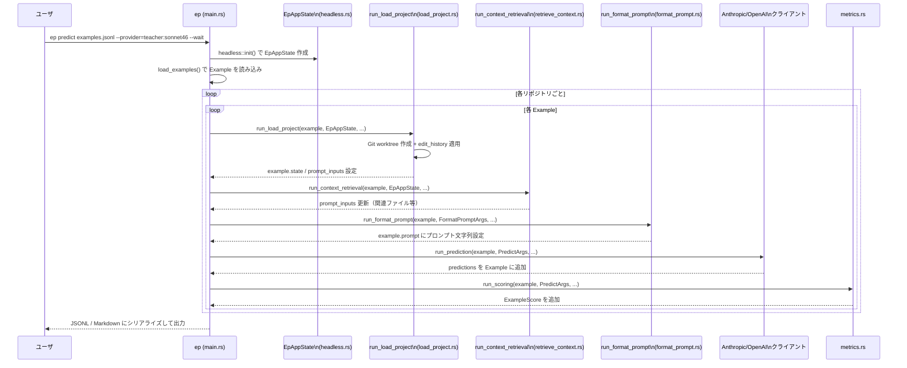

# edit_prediction_cli/ ディレクトリ解説

## 1. ざっくり一言

`edit_prediction_cli` は、Zed の「編集予測」データセットを扱うためのコマンドラインツールです。  
JSONL/Markdown 形式の例を読み込み、プロジェクトのチェックアウト・コンテキスト取得・プロンプト生成・LLM 推論・スコアリング・フィルタリングなど、一連のパイプラインをバッチで実行します。

---

## 2. このモジュールの役割

### 2.1 概要

- このクレートは、**編集予測の学習・評価用データセット**を加工・生成・評価する CLI を提供します。
- Zed 本体のコンポーネント（`client`, `project`, `language` など）や `edit_prediction` クレート、`zeta_prompt`、Anthropic/OpenAI クライアントと連携して動作します。
- コマンドごとに「プロジェクトをチェックアウト → コンテキスト収集 → プロンプト整形 → 予測実行 → メトリクス計算」のような処理を並列に実行します。

### 2.2 アーキテクチャ内での位置づけ

Zed ワークスペース全体の中での位置づけを、主要モジュールに絞って図示します。

```mermaid
graph TD
    subgraph CLI["edit_prediction_cli（このクレート）"]
        main["main.rs\nEpArgs / Command"]
        ex["example.rs\nExample*"]
        loader["load_project.rs\nrun_load_project"]
        ctx["retrieve_context.rs\n(run_context_retrieval) ※定義は別ファイル"]
        fmtp["format_prompt.rs\nrun_format_prompt\nTeacherPrompt*"]
        predict["predict.rs\nrun_prediction ※定義は別ファイル"]
        metrics["metrics.rs\ndelta_chr_f / compute_kept_rate"]
        filter["filter_languages.rs\nrun_filter_languages"]
        kept["kept_rate.rs\ncompute_kept_rate"]
        llmA["anthropic_client.rs\nAnthropicClient"]
        llmO["openai_client.rs\n(Plain/BatchingOpenAiClient)"]
        headless["headless.rs\nEpAppState"]
    end

    epcore["edit_prediction クレート\nExampleSpec, udiff など"]
    zeta["zeta_prompt クレート\nZetaFormat, ZetaPromptInput"]
    zedcore["Zed 本体クレート群\nclient, project, language, ..."]
    grammars["grammars クレート\nconfig.toml (言語設定)"]

    main --> ex
    main --> loader
    main --> ctx
    main --> fmtp
    main --> predict
    main --> metrics
    main --> filter
    main --> kept
    main --> llmA
    main --> llmO
    main --> headless

    loader --> epcore
    loader --> zedcore
    loader --> zeta
    fmtp --> zeta
    fmtp --> epcore
    metrics --> kept
    filter --> grammars
```



### 2.3 設計上のポイント

コードから読み取れる主な設計方針は次のとおりです。

- **パイプライン分割**
  - `Command` 列挙体でサブコマンドを定義し、`main.rs` でパイプラインを組み立てています。
  - `load_project` → `retrieve_context` → `format_prompt` → `predict` → `score` など、ステップごとにモジュールが分割されています。
- **Zed ランタイムの再利用**
  - `headless::EpAppState` で Zed の `Client`, `Project`, `LanguageRegistry` などをヘッドレスモードで初期化し、エディタと同等の解析・LSP 機能を CLI から利用しています。
- **LLM 呼び出しのバッチ化**
  - `anthropic_client.rs` / `openai_client.rs` で、単発呼び出し（Plain）と、SQLite（`sqlez`）ベースのキャッシュ＋バッチ API（Batch）を切り替え可能にしています。
- **評価メトリクスの分離**
  - `metrics.rs` と `kept_rate.rs` に、編集品質評価用のメトリクス（delta-chrF や kept_rate 等）を集約しています。
  - ライブラリとして再利用しやすいよう、`lib.rs` から `kept_rate` を公開しています。
- **大規模データセット対応**
  - JSONL をストリーム処理（`BufRead::lines`）する設計や、Snowflake からの段階的取得（`pull_examples` モジュール、定義は別ファイル）で大量データに対応しています。
  - `max_parallelism` で並列度を制御しつつ、リポジトリ単位にグルーピングして処理する構造になっています。
- **Git 操作の安全性**
  - `git::lock_repo` でリポジトリごとに非同期ロックを取りつつ、`worktree` 機能を用いて例ごとに独立した作業ツリーを作成しています。
  - ただし `git` のロックファイル削除など、注意が必要な処理も含まれます（詳細は後述）。

---

## 3. 主要な機能一覧

このディレクトリが提供する主な機能を列挙します。

- **CLI サブコマンド（`main.rs`）**
  - `read`：ファイルや Snowflake から例を読み込み、正規化して JSONL で出力。
  - `load-project`：各 Example に対して Git worktree を作り、Zed の `Project` に読み込む。
  - `context`：カーソル周辺のコンテキストや関連ファイルを収集し、`ZetaPromptInput` を構築。
  - `format-prompt`：Teacher / Zeta2 などのフォーマットでプロンプト文字列を生成。
  - `predict`：LLM を呼び出して `predictions` を埋める（Anthropic / OpenAI / Mercury など）。
  - `parse-output`：モデル出力（生テキスト）から unified diff を抽出し、`actual_patch` とカーソルを復元。
  - `score`：expected/actual patch から各種メトリクスを計算し、`ExampleScore` を生成。
  - `eval`：各例のスコアを集計してレポート出力（平均スコア等）。
  - `distill`：expected patch を prediction としてコピーし、蒸留用データセットを作る。
  - `synthesize`：Git のコミット履歴から新しい評価用 Example を自動生成。
  - `split-commit`：1 つのコミットから評価用 Example を 1 件生成。
  - `truncate-patch`：expected patch を条件に応じて短縮する。
  - `split`：JSONL データセットを複数ファイルに分割（リポジトリ単位でストラタ化）。
  - `filter-languages`：`cursor_path` の拡張子に基づいて、指定言語の例だけにフィルタ。
  - `import-batch`：Anthropic / OpenAI バッチ API の結果をローカル DB にインポート。
  - `qa`：LLM をジャッジとして使い、予測品質を評価（定義は別ファイル）。
  - `repair`：QA で悪いと判定された予測を再生成して修復（定義は別ファイル）。
  - `clean`：データディレクトリ（リポジトリやキャッシュ）を削除。
  - `print-zeta-formats`：使用可能な `ZetaFormat` 列挙値を列挙。
- **データモデル（`example.rs`）**
  - `Example`：1 例の全情報（`ExampleSpec`, prompt/predictions/score/qa など）を保持。
  - `ExamplePrompt` / `ExamplePrediction` / `ExampleScore` / `ActualCursor` などの補助構造体。
  - `read_example_files`：`.json` / `.jsonl` / `.md` から Example を読み込む。
- **プロジェクト読み込み（`load_project.rs`）**
  - Git worktree の作成、`edit_history` の適用、カーソル位置の解決、`ZetaPromptInput` の構築。
- **プロンプト整形（`format_prompt.rs`）**
  - Teacher / TeacherMultiRegion / Zeta2 向けのプロンプト生成と、Teacher 応答のパース。
- **メトリクス（`metrics.rs`, `kept_rate.rs`）**
  - `delta_chr_f`：expected/actual 編集の差分に基づいた文字 n-gram Fβ スコア。
  - `compute_kept_rate`：モデル提案部分のうち、最終版にどれだけ残ったか（kept rate）を計算。
  - `braces_disbalance` / `exact_lines_match` / `has_isolated_whitespace_changes` /
    `is_editable_region_correct` / `count_patch_token_changes` など多様なメトリクス。
- **LLM クライアント**
  - `AnthropicClient`（`anthropic_client.rs`）：Plain / Batch モード、ストリーミング対応。
  - Plain/Batching OpenAI クライアント（`openai_client.rs`）：OpenAI の Batch API 対応。
- **ユーティリティ**
  - `git.rs`：Git リポジトリのクローン、worktree 作成、`fetch_if_needed` など。
  - `headless.rs`：Zed のアプリケーション状態をヘッドレスに初期化 (`EpAppState`)。
  - `filter_languages.rs`：言語設定 (`grammars` crate の `config.toml`) から拡張子→言語マップを構築。

---

## 4. 関数・構造体の解説

### 4.1 主要な型一覧

| 名前 | 種別 | 定義ファイル | 役割 / 用途 |
|------|------|--------------|-------------|
| `Example` | 構造体 | `src/example.rs` | 1 つの編集予測例の主要データ。`ExampleSpec` に加えプロンプト・予測・スコア・QA 結果・Zed 状態などを保持します。 |
| `ExamplePrompt` | 構造体 | `example.rs` | 実際に LLM に渡す入力文字列と expected/rejected 出力を表現します。 |
| `ExamplePrediction` | 構造体 | `example.rs` | LLM の予測結果（`actual_output`、パース済み `actual_patch`、カーソル位置など）を保持します。 |
| `ExampleScore` | 構造体 | `example.rs` | 1 予測に対する各種メトリクス（delta_chr_f 系、kept_rate、トークン増減など）をまとめた結果。 |
| `ActualCursor` | 構造体 | `example.rs` | 実際のカーソル位置（行・列・オフセット等）を保持し、editable region からの復元も担当します。 |
| `ExampleState` | 構造体 | `example.rs` | Zed の `Project` や `Buffer` など、Example 処理中のアプリ状態を一緒に保持します。 |
| `EpArgs` | 構造体 | `main.rs` | `clap` ベースのコマンドライン引数全体。サブコマンドや出力設定などを含みます。 |
| `Command` | enum | `main.rs` | `read`, `predict`, `score` などのサブコマンド定義。 |
| `PredictionProvider` | enum | `main.rs` | `mercury`, `zeta1`, `zeta2:<format>`, `teacher:<backend>` など、予測プロバイダの指定を表現します。 |
| `TeacherBackend` | enum | `main.rs` | Teacher モデルのバックエンド（`claude-sonnet-4-5`/`4-6`/`gpt-5.2`）を表します。 |
| `EpAppState` | 構造体 | `headless.rs` | ヘッドレスモードの Zed アプリ状態（`Client`, `UserStore`, `LanguageRegistry` 等）をまとめたものです。 |
| `FilterLanguagesArgs` | 構造体 | `filter_languages.rs` | `ep filter-languages` サブコマンド用の CLI 引数。言語名・拡張子・統計モードなど。 |
| `KeptRateResult` | 構造体 | `kept_rate.rs` | kept rate 計算の詳細結果（新規文字数、保持/破棄文字数、コンテキスト文字数など）。 |
| `TokenAnnotation` | enum | `kept_rate.rs` | （テスト用）各トークンが Context/Kept/Discarded のどれかを表します。 |
| `ClassificationMetrics` | 構造体 | `metrics.rs` | TP/FP/FN と precision/recall/F1 の計算を行う基本メトリクス型。 |
| `DeltaChrFMetrics` | 構造体 | `metrics.rs` | delta-chrF のスコア・β・分類カウント・平均 precision/recall を保持します。 |
| `TokenChangeCounts` | 構造体 | `metrics.rs` | パッチのトークン単位変更量（挿入/削除トークン数）を保持します。 |
| `AnthropicClient` | enum | `anthropic_client.rs` | Plain / Batch / Dummy の 3 形態の Anthropic クライアントをまとめる enum。 |
| `PlainLlmClient` | 構造体 | `anthropic_client.rs` | 単発で Anthropic API を呼び出すクライアント。ストリーミングにも対応します。 |
| `BatchingLlmClient` | 構造体 | `anthropic_client.rs` | Anthropic の batch API 用に、リクエストをローカル DB にためて一括送信するクライアント。 |
| `PlainOpenAiClient` | 構造体 | `openai_client.rs` | 単発で OpenAI API を呼び出すクライアント。 |
| `BatchingOpenAiClient` | 構造体 | `openai_client.rs` | OpenAI の batch API に対応するバッチングクライアント。後半の実装はこのチャンクでは一部省略されています。 |
| `TeacherPrompt` | 構造体（フィールドなし） | `format_prompt.rs` | Teacher フォーマットのプロンプト生成と応答パース用の関連関数を集約した名前空間的構造体。 |
| `TeacherMultiRegionPrompt` | 構造体（フィールドなし） | `format_prompt.rs` | マルチリージョン Teacher フォーマットの整形/パースを提供します。 |

### 4.2 重要な関数の詳細

#### `compute_kept_rate(base: &str, predicted: &str, final_text: &str) -> KeptRateResult`

**概要**

- モデル予測 `predicted` が、元のテキスト `base` からどの程度採用されて最終テキスト `final_text` になったかを、トークンベースの LCS に基づいて評価します。
- 提案部分（コンテキスト以外）のうち、最終版に残った文字数の割合を `kept_rate`（0.0〜1.0）として返します。

**引数**

| 引数名 | 型 | 説明 |
|--------|----|------|
| `base` | `&str` | 編集前のテキスト（元コード全体など）。 |
| `predicted` | `&str` | モデルが提案した編集後テキスト。 |
| `final_text` | `&str` | 実際にユーザが受け入れた最終テキスト。 |

**戻り値**

- `KeptRateResult`：新規文字数・保持/破棄文字数・コンテキスト文字数・`kept_rate` を含む詳細な結果を返します。

**内部処理の流れ**

1. `base == predicted == final_text` の完全一致であれば、「新規編集なし」とみなし、`kept_rate = 1.0` で早期リターンします。
2. `word_diff::tokenize` で `base` / `predicted` / `final_text` をトークン列に分割します。
3. `lcs_keep_masks` を用いて
   - `predicted` vs `base`
   - `predicted` vs `final_text`
   の両方で LCS マスク（共通部分の位置）を求め、コンテキストトークン（両方に共通する部分）を特定します。
4. コンテキスト以外のトークンだけを抜き出し（`analyze_masked_tokens`）、それぞれの新規文字数を集計します。
5. 新規部同士（`predicted` 新規部分 vs `final_text` 新規部分）で再度 LCS を取り、どの新規トークンが保持されたかを確認します。
6. その結果から
   - `predicted_new_chars`
   - `kept_chars`
   - `discarded_chars`
   - `context_chars`
   を計算し、`kept_rate = kept_chars / predicted_new_chars` として返します（新規文字が 0 の場合の特例あり）。

**Examples（使用例）**

```rust
use edit_prediction_cli::kept_rate::compute_kept_rate; // Kept rate 関数をインポート

fn main() {
    let base = "fn foo() { old_name(); }\n";         // 元のコード
    let predicted = "fn foo() { new_name(); }\n";    // モデルの予測
    let final_text = "fn foo() { new_name(); }\n";   // 実際の最終コード

    let result = compute_kept_rate(base, predicted, final_text); // 指標を計算
    println!("kept_rate = {}", result.kept_rate);                // 1.0 が期待される
}
```

**Errors / Panics**

- この関数自身は `Result` を返さず、パニックも発生しない実装になっています（インデックス計算は境界チェック済み）。
- `tokenize` の実装に依存しますが、このチャンクのコードからはパニック条件は見当たりません。

**Edge cases（エッジケース）**

- `base == predicted == final_text`：新規文字がないため、`kept_rate = 1.0` として扱います。
- `predicted` が空文字列：`predicted_new_chars == 0` で、`final_new_chars` が 0 なら 1.0、そうでなければ 0.0。
- すべての新規トークンが破棄された場合：`kept_chars = 0` なので `kept_rate = 0.0`。
- 非常に重複の多いトークン列（`repetitive_tokens` テスト）：LCS による整合性が保たれていることをテストで確認しています。

**使用上の注意点**

- 行単位ではなくトークン＋文字数ベースの指標のため、視覚的な「行の残り方」と直感が異なる場合があります。
- `word_diff::tokenize` の定義に依存するため、対象言語が変わるとトークン分割の粒度も変わります。
- 大きなテキストに対しては LCS ベースの DP が計算コストを持つため、ベンチマーク（`benches/kept_rate.rs`）で確認のうえ利用することが推奨されます。

---

#### `delta_chr_f(original: &str, expected: &str, actual: &str) -> DeltaChrFMetrics`

**概要**

- 「元テキスト `original` から expected 編集を行った結果」と、「元テキストから actual 編集を行った結果」の差分を比較し、どれだけ expected の編集を再現できているかを **文字 n-gram ベース**で評価します。
- chrF 系のスコアで、スコアは 0.0〜100.0。100.0 が完全一致です。

**引数**

| 引数名 | 型 | 説明 |
|--------|----|------|
| `original` | `&str` | 編集前のテキスト。 |
| `expected` | `&str` | 期待される編集後テキスト。 |
| `actual` | `&str` | モデルなどが生成した編集後テキスト。 |

**戻り値**

- `DeltaChrFMetrics`：スコア、β 値、TP/FP/FN カウント、平均 precision/recall を含みます。

**内部処理の流れ**

1. 完全一致 (`original == expected == actual`) の場合、スコア 100.0 で早期リターン。
2. `filter_whitespace_chars` でテキストを前処理（この実装では空白を collapse してから `Vec<char>` にします）。
3. `extract_changed_regions` で
   - `original` vs `expected`
   - `original` vs `actual`
   のそれぞれについて、「差分がある部分＋文脈（`CONTEXT_CHARS`）だけ」を取り出します。
4. n = 1 〜 `CHR_F_CHAR_ORDER` までの各 n-gram について
   - `count_ngrams_from_chars` で original/expected/actual それぞれの n-gram カウントを取得。
   - `compute_ngram_delta` で original→expected, original→actual の「増減」を算出。
   - `ngram_delta_to_counts` で増減を「追加」/「削除」用の疑似トークンに変換し、`ClassificationMetrics::from_counts` から TP/FP/FN, precision, recall を求めます。
5. n ごとの precision/recall を平均し、chrF の式（β=0.5）で最終スコア（0〜100）を計算します。

**Examples（使用例）**

```rust
use edit_prediction_cli::metrics::delta_chr_f; // chrF 系メトリクスをインポート

fn main() {
    let original = "fn greet() { println!(\"Hello\"); }";            // 元コード
    let expected = "fn greet() { println!(\"Hello, world!\"); }";    // 期待される編集
    let actual   = "fn greet() { println!(\"Hello, world!\"); }";    // 実際の編集

    let metrics = delta_chr_f(original, expected, actual);           // メトリクスを計算
    println!("delta_chrF = {:.2}", metrics.score);                   // おおむね 100.0 に近い値
}
```

**Errors / Panics**

- `delta_chr_f` 本体は `Result` を返さず、通常はパニックしない実装です。
- 内部のベクタ操作は境界チェック付きで行われており、テストで幅広いケースが検証されています。

**Edge cases**

- 変更なし（`original == expected == actual`）：`score = 100.0`。
- expected だけ変更され、actual は元のまま：expected の変更がすべて FN とみなされ、スコアは低くなります。
- expected と actual の両方が original から大きくずれている場合：FP/FN が増大し、スコアは小さくなります。
- 長大なテキストで局所的な変更のみ存在する場合：`extract_changed_regions` により、変更周辺だけに計算対象が絞られます。

**使用上の注意点**

- スコアは 0〜100 スケールであり、通常の F1（0〜1）と混同しないよう注意が必要です。
- 空白の取り扱い（collapse / ignore など）は `CHR_F_WHITESPACE` の設定に依存します（現状は collapse）。
- expected/actual が大きく書き換えられている場合、スコア解釈は直感とずれることがあります（エディタ画面での見た目とは異なるため）。

---

#### `run_filter_languages(args: &FilterLanguagesArgs, inputs: &[PathBuf], output: Option<&PathBuf>) -> Result<()>`

**概要**

- `ep filter-languages` サブコマンドの実体です。
- JSONL 形式のデータセットを 1 行ずつ読み、`cursor_path` フィールドの拡張子・ファイル名から言語を推定し、指定された言語名・拡張子条件に合う行だけを出力します。
- `--list` や `--stats` モードではフィルタせずに情報を表示します。

**引数**

| 引数名 | 型 | 説明 |
|--------|----|------|
| `args` | `&FilterLanguagesArgs` | CLI から構築された引数。対象言語名・拡張子・統計モード・未知言語の扱い等を含みます。 |
| `inputs` | `&[PathBuf]` | 入力ファイルパス配列。先頭が `"-"` の場合は stdin を読むという慣習に従います。 |
| `output` | `Option<&PathBuf>` | 出力先ファイル。`None` の場合は stdout に出力します。 |

**戻り値**

- `Result<()>`：IO エラーや引数不足（`--languages` も `--extensions` も指定されていない場合）などは `Err` になります。

**内部処理の流れ**

1. `build_extension_to_language_map` で拡張子→言語名のマップを構築します。
   - `dynamic_prompts` feature 無効時は `rust-embed` で `../grammars/src/*/config.toml` を埋め込み読み込み。
   - 有効時はファイルシステムから同じパスを走査。
2. `--list` が指定されていれば、`get_all_languages` で言語一覧を取得し stdout に表示して終了します。
3. 入力ファイル（または stdin）を決定し、`--stats` の場合は `run_stats` に渡して統計情報を表示します。
4. それ以外では
   - `args.languages` と `args.extensions` から許可する言語名・拡張子の集合を作成。
   - 入力 JSONL を `read_lines_streaming` で 1 行ずつ読み取り、`get_cursor_path` で `cursor_path` を抽出。
   - `detect_language` / `get_extension` で言語名と拡張子を推定。
   - 条件に合致する行だけを出力バッファに書き込みます（未知言語の扱いは `include_unknown` に依存）。
5. 終了時にフィルタ統計と、必要なら「除外された拡張子の上位 N 件」を stderr に出力します。

**Examples（使用例）**

シェルからの典型的な実行例です。

```bash
# Rust / Python / Go の例だけに絞って新しい JSONL を作成
ep filter-languages input.jsonl --languages rust,python,go -o filtered.jsonl

# 拡張子だけでフィルタし、統計も表示
ep filter-languages input.jsonl --extensions cs,java --stats --show-top-excluded 20
```

**Errors / Panics**

- `--languages` も `--extensions` も指定されていない場合：`bail!(...)` によりエラー終了します。
- 入力ファイルのオープン・読み込み・出力ファイルの作成に失敗した場合も `Err` を返します。
- JSON のパースに失敗した行は単にスキップされ、エラーにはなりません（`get_cursor_path` 内で `serde_json::from_str` を `ok()?` で無視）。

**Edge cases**

- 行が空白のみのとき：スキップします。
- `cursor_path` フィールドが存在しない行：
  - `include_unknown` が `true` の場合はそのまま通過。
  - そうでない場合は除外。
- 拡張子ではなくファイル名でマッチする言語（`PKGBUILD`, `.env` など）もサポートされています。
- `--list` / `--stats` と stdin の組み合わせ：
  - `--stats` ではファイルパスが必須で、stdin はサポートされません（エラーメッセージあり）。

**使用上の注意点**

- 入力 JSONL は 1 行 1 Example 形式であることが前提です（`cursor_path` がトップレベルにある想定）。
- 言語名は `config.toml` 由来の名前に依存し、大文字小文字は無視されます。
- 大きなファイルでもストリーム処理で対応できますが、除外拡張子の統計用に `HashMap` を保持するため、メモリ消費がゼロではない点に注意が必要です。

---

#### `run_load_project(example: &mut Example, app_state: Arc<EpAppState>, example_progress: &ExampleProgress, mut cx: AsyncApp) -> Result<()>`

**概要**

- `ep load-project` や、その後続ステップで使われる「プロジェクト準備」処理の中心関数です。
- Git リポジトリの worktree を作成し、`ExampleSpec` の `edit_history` を適用して、カーソル位置を解決し、`ZetaPromptInput` を構築して `example.prompt_inputs` と `example.state` を埋めます。

**引数**

| 引数名 | 型 | 説明 |
|--------|----|------|
| `example` | `&mut Example` | 対象の Example。処理結果として `state` と `prompt_inputs` が更新されます。 |
| `app_state` | `Arc<EpAppState>` | ヘッドレス Zed アプリ状態（言語レジストリ・クライアントなど）。 |
| `example_progress` | `&ExampleProgress` | 進捗表示用。サブステップのステータス更新に使われます。 |
| `cx` | `AsyncApp` | `gpui` の非同期アプリケーションコンテキスト。 |

**戻り値**

- `Result<()>`：Git 操作、ファイル I/O、Zed プロジェクト操作などに失敗すると `Err` を返します。

**内部処理の流れ（簡略）**

1. 既に `example.state` が存在する場合は何もせず終了（再実行を避ける）。
2. `setup_project` を呼び出し、`Project` エンティティを初期化し、Git worktree を準備します。
   - `setup_worktree` 内で `git::lock_repo` によるリポジトリロック、`git fetch`、`git worktree add` などを実行。
   - `edit_history` を `git apply` 相当で適用します。
3. `apply_edit_history` で `ExampleSpec.edit_history` を (Zed の `Project` 上で) 実際のファイルに反映します。
4. `EditPredictionStore` から該当プロジェクトの `recent_paths` を更新し、コンテキスト構築に備えます。
5. `cursor_position` でカーソル位置を解決します。
   - 既に開いているバッファ群 (`OpenedBuffers`) からカーソルファイルを探し、なければ worktree 内のファイルを開きます。
   - `ExampleSpec.cursor_excerpt()` の戻り値とバッファのテキストを照合し、正しいカーソルオフセットを決定します。
6. `EditPredictionStore` から edit history イベントを取得し、`ZetaPromptInput` を組み立てます。
   - `compute_cursor_excerpt` / `compute_syntax_ranges` などを用いて、カーソル抜粋とシンタックス情報を計算。
   - `excerpt_ranges` などのフィールドを埋めます。
7. `example.prompt_inputs` に `ZetaPromptInput` をセットし、`example.state` に `ExampleState`（`project`, `buffer`, `cursor_position`, `_open_buffers`）を保存します。

**Examples（使用例）**

この関数は内部用であり、通常は `ep` CLI 経由でのみ利用されます。直接呼び出す場合は Zed のヘッドレス環境と `AsyncApp` の初期化が必要です。

**Errors / Panics**

- Git コマンド実行に失敗した場合：`anyhow::ensure!` などにより詳細な stderr/stdout を含むエラーが返ります。
- `cursor_excerpt` がバッファ内に 0 件または 2 件以上見つかる場合：`anyhow::ensure!` でエラーになります（曖昧なカーソル位置を許容しないため）。
- 言語ロードで `LanguageNotFound` 以外のエラーが出た場合はそのまま伝播されます。

**Edge cases**

- 古い Example で `cursor_path` に余計なプレフィックスが含まれている場合（例: `"zed/crates/foo.rs"`）：
  - 先頭コンポーネントを落としたパスでもバッファ検索を行います。
- worktree が壊れている/不完全な場合：
  - `.git/worktrees/<name>` 内のロックファイルや不正ディレクトリを削除し、`git worktree remove` を試みた上で再作成します。
- `uncommitted_diff` が空でない場合：
  - `git apply -` で適用し、失敗すると詳細なエラーとともに処理が中断します。

**使用上の注意点**

- 多数の Example を処理すると、その分だけ Git worktree が作成されます。`Command::Clean` で不要なデータを削除できます。
- 外部の `git` コマンドに依存しているため、環境に `git` がインストールされている必要があります。
- `git` のロックファイル（`index.lock` 等）を削除する処理を含むため、**同じリポジトリに対し複数の CLI プロセスを並行実行しない**ことが推奨されます。

---

#### `run_format_prompt(example: &mut Example, args: &FormatPromptArgs, app_state: Arc<EpAppState>, example_progress: &ExampleProgress, cx: AsyncApp) -> Result<()>`

**概要**

- `ep format-prompt` サブコマンドのコア処理です。
- `Example` に対してコンテキスト取得（`run_context_retrieval`）を行い、その結果をもとに Teacher / TeacherMultiRegion / Zeta2 など指定プロバイダに応じたプロンプト文字列を `example.prompt` に設定します。

**引数**

| 引数名 | 型 | 説明 |
|--------|----|------|
| `example` | `&mut Example` | 対象 Example。`prompt_inputs` が必要で、結果として `prompt` が更新されます。 |
| `args` | `&FormatPromptArgs` | `provider` フィールドで Teacher / Zeta2 などのフォーマットを指定します。 |
| `app_state` | `Arc<EpAppState>` | コンテキスト取得に必要なヘッドレスアプリ状態。 |
| `example_progress` | `&ExampleProgress` | 進捗表示用。 |
| `cx` | `AsyncApp` | 非同期コンテキスト。 |

**戻り値**

- `Result<()>`：コンテキスト取得やプロンプト生成中にエラーがあれば `Err`。

**内部処理の流れ**

1. まず `run_context_retrieval` を呼び出し、`prompt_inputs` を埋めます。
2. `example.prompt_inputs` の存在を確認し、なければ `"prompt_inputs must be set after context retrieval"` というコンテキスト付きエラー。
3. `args.provider` に応じて分岐：
   - `Teacher` / `TeacherNonBatching`：
     - `TeacherPrompt::format_prompt` を用いて単一リージョンの Teacher プロンプトを構築。
   - `TeacherMultiRegion` / `TeacherMultiRegionNonBatching`：
     - `TeacherMultiRegionPrompt::format_prompt` を用いてマルチリージョン版を構築。
   - `Zeta2(zeta_format)`：
     - `format_zeta_prompt` と `zeta_prompt::get_prefill` で入力と prefill を構築。
     - `expected_patches_with_cursor_positions` の先頭要素から `zeta2_output_for_patch` を呼び出し、`expected_output` を事前生成。
     - `rejected_patch` があれば同様に `rejected_output` を生成。
4. `_`（それ以外の provider）については `panic!("Cannot format prompt for {:?}", args.provider);` として明示的に未対応としています。

**Examples（使用例）**

通常は CLI 経由で利用します。

```bash
# Teacher フォーマットでプロンプトを生成
ep format-prompt --provider=teacher:sonnet46 examples.jsonl -o with_prompts.jsonl

# Zeta2 既定フォーマットでプロンプト生成
ep format-prompt --provider=zeta2 examples.jsonl -o with_zeta_prompts.jsonl
```

**Errors / Panics**

- `prompt_inputs` が未設定のまま呼ばれた場合：`context("prompt_inputs must be set after context retrieval")` 付きのエラー。
- `args.provider` が Teacher / Zeta2 系以外の場合：`panic!` によって異常終了します（今のところ Mercury/Zeta1 用のフォーマッタは実装されていません）。
- `zeta2_output_for_patch` や `udiff::apply_diff_to_string_with_hunk_offset` 内でパッチ適用が失敗すると、そのエラーが伝播します。

**Edge cases**

- editable region の先頭に空行があるが、モデル応答側では削られている場合：
  - TeacherPrompt/TeacherMultiRegionPrompt 内で、先頭の改行を補正するロジックがあります。
- `expected_patches_with_cursor_positions` が空だった場合：
  - `expected_output` は空文字列になります（Zeta2 のスコアリング用 expected 出力なし）。

**使用上の注意点**

- `run_format_prompt` を呼ぶ前に、`run_load_project` および `run_context_retrieval` を行っておく必要があります（`prompt_inputs` が必須）。
- provider によって生成されるプロンプト形式が異なるため、後続のパーサ（`parse_output` や TeacherPrompt::parse）と整合している必要があります。

---

#### `deduplicate_examples(examples: &mut Vec<Example>, max_per_cluster: usize)`

**概要**

- 大量の Example の中から、「カーソル位置が重複するもの」「テキストが類似しすぎるもの」を除去するための関数です。
- 完全重複（同じ `cursor_position`）を除去した後、MinHash による近似クラスタリングで near-duplicate をまとめ、各クラスタから最大 `max_per_cluster` 件だけを残します。

**主な処理の流れ**

1. `cursor_position` で完全重複フィルタ。
2. `code_token_ngrams` でカーソル位置文字列からトークン n-gram（デフォルト 5-gram）を生成。
3. `MinHasher32` と `MinHashIndex` で LSH インデックスを構築。
4. 各 Example をクラスタリングし、クラスタごとに `greedy_max_min_diverse` でできるだけ互いに遠い例を `max_per_cluster` 件選ぶ。
5. 選択された Example のみを残し、結果をログ出力します。

**使用上の注意点**

- 近似アルゴリズムのため、完全に決定論的なクラスタリングではありませんが、テストやログから挙動を追跡可能です。
- `cursor_position` フィールドを重複判定のキーにしているため、同じ位置でも別のファイルや別のコンテキストであれば残したい、といったケースでは注意が必要です。

---

#### `extract_last_codeblock(text: &str) -> Option<String>`

**概要**

- Markdown 風のテキストから、**最後に出現するコードブロック（バッククォートで囲まれた部分）**の中身を抽出します。
- `TeacherPrompt::parse` や QA のレスポンス処理で、「モデルが最後に出力したコードブロック」を取り出す用途で使われています。

**主な処理の流れ**

1. テキストを行ごとに分割し、後ろから走査して「閉じ側のフェンス」（` ``` ` 以上の長さのバッククォートのみの行）を探す。
2. 見つかったフェンスの長さ N に対し、前方向へ同じ長さ N の「開きフェンス」を探す（後続に余計なバッククォートが続かないことを確認）。
3. 開きフェンスと閉じフェンスの間の行を結合し、末尾に改行を付けて返す。
4. 見つからない場合は `None`。

**Edge cases**

- ネストしたコードブロック（内部に ``` を含む）：
  - 外側のフェンス長さに基づいて検出するため、内側の ``` は単なるテキストとして扱われます（テスト `test_extract_codeblock_with_nested_fences` 等）。
- 閉じフェンスが存在しない場合：
  - `None` を返します（`test_extract_codeblock_no_valid_block` 参照）。
- フェンス行に言語指定（例: ```bibtex ）が付いている場合：
  - 開きフェンスとして認識され、行の残りは無視します。

**使用上の注意点**

- フェンスの長さを必ず一致させる実装なので、「```」で開いて「````」で閉じるような不正な Markdown には対応していません。
- 戻り値は末尾に改行を含む場合があります（テストではこの挙動を前提としています）。

---

### 4.3 その他の関数（例）

| 関数名 | 定義ファイル | 役割（1 行） |
|--------|--------------|--------------|
| `run_stats` | `filter_languages.rs` | 入力 JSONL の言語分布と「未知拡張子」の統計を表示します。 |
| `braces_disbalance` | `metrics.rs` | 丸括弧/波括弧/角括弧の開きと閉じの不均衡度を整数で返します。 |
| `extract_changed_lines_from_diff` | `metrics.rs` | unified diff から追加・削除行だけを multiset として抽出します。 |
| `exact_lines_match` | `metrics.rs` | 2 つの diff の変更行 multiset を比較し TP/FP/FN を計算します。 |
| `has_isolated_whitespace_changes` | `metrics.rs` | パッチ内に「孤立した空白のみの変更」が含まれるか判定します。 |
| `is_editable_region_correct` | `metrics.rs` | editable region を大きく削るようなパッチを検出する簡易チェックです。 |
| `count_patch_token_changes` | `metrics.rs` | パッチ中のトークンレベルの挿入/削除数を LCS ベースで数えます。 |
| `lock_repo` | `git.rs` | リポジトリパスごとに非同期ロックを取得し、並行 `git` 操作の衝突を防ぎます。 |
| `ensure_repo_cloned` | `git.rs` | リポジトリのクローンと `fetch` を行い、HEAD を正しく設定して返します。 |
| `fetch_if_needed` | `git.rs` | 指定リビジョンの commit SHA を取得し、なければ `git fetch` してから解決します。 |

---

## 5. データフロー

ここでは代表的なシナリオとして、`ep predict` による **教師付きデータセット生成の流れ**を示します。

### 5.1 概要（テキスト）

1. `main.rs` で CLI 引数を解釈し、入力ファイルや Snowflake から `Example` の配列を構築します（`load_examples`）。
2. `headless::init` で Zed のヘッドレスアプリを初期化し、`EpAppState` を作成します。
3. Example をリポジトリ単位でグルーピングし、最大 `max_parallelism` 並列で処理します。
4. 各 Example について
   - `run_load_project` で Git worktree と `Project` を用意。
   - `run_context_retrieval` で周辺コンテキストと関連ファイルを集め、`prompt_inputs` を構築。
   - `run_format_prompt` で指定プロバイダ用のプロンプト文字列を生成。
   - `run_prediction` で適切な LLM クライアント（Anthropic/OpenAI 等）から予測を取得し `predictions` に格納。
   - 必要に応じて `run_scoring` で `ExampleScore` を計算します。
5. 結果を JSONL または Markdown として出力し、必要ならバッチ API の完了を待って再処理します。

### 5.2 シーケンス図



この流れの中で、Anthropic/OpenAI バッチモードを利用する場合は、`run_prediction` 内でリクエストをローカル DB に貯め、`predict::sync_batches`・`predict::wait_for_batches` で後からバッチ送信・結果取得を行います。

---

## 6. 使い方（How to Use）

### 6.1 基本的な使用方法

#### 6.1.1 ローカル JSONL データセットから Teacher ラベルを生成する

1. Example を JSONL で用意する（`ExampleSpec` 形式）。
2. Teacher モデルでプロンプトを生成し、予測を取得。
3. 予測と expected patch を用いてスコア計算。

```bash
# 1. プロンプト生成（Teacher フォーマット）
ep format-prompt --provider=teacher:sonnet46 input.jsonl -o with_prompts.jsonl

# 2. Teacher で予測実行（バッチモード・完了待ち）
ep predict --provider=teacher:sonnet46 --wait with_prompts.jsonl -o predicted.jsonl

# 3. スコアリング（delta_chrF / kept_rate 等）
ep score --provider=teacher:sonnet46 predicted.jsonl -o scored.jsonl

# 4. 集計レポート
ep eval --provider=teacher:sonnet46 scored.jsonl --summary-json summary.json
```

#### 6.1.2 言語ごとにデータセットをフィルタする

```bash
# Rust / Python / Go のファイルだけにフィルタ
ep filter-languages input.jsonl --languages rust,python,go -o filtered.jsonl

# 利用可能な言語を一覧表示
ep filter-languages --list
```

#### 6.1.3 ライブラリとしてメトリクスを使う（`compute_kept_rate`）

```rust
use edit_prediction_cli::kept_rate::compute_kept_rate; // Kept rate 計算関数

fn main() {
    let base = "value += old_name + 1;\n";                   // 元の式
    let predicted = "value += very_long_predicted_name + 1;\n"; // モデルの予測
    let final_text = "value += new_name + 1;\n";             // 実際の最終式

    let result = compute_kept_rate(base, predicted, final_text); // 指標を計算
    println!("kept_rate = {:.3}", result.kept_rate);             // 0〜1 の値
}
```

### 6.2 よくある使用パターン

- **Snowflake からのデータ取り込み → ローカル保存**
  - `captured-after:...` / `rejected-after:...` / `settled-after:...` 等の入力指定を用いて、Snowflake からデータを取得し、`ep read` で JSONL として保存します（実処理は `load_examples` 内で行われます）。
- **DPO 用データセットの作成**
  - `rejected-after:` で negative 例を収集し、`distill` コマンドで expected→predicted としてコピーしたデータセットを作ることで、DPO 学習用のペアを構築できます。
- **QA と Repair のループ**
  - `ep qa` で LLM-as-a-judge による QA スコアを付け、その結果の悪いものだけを `ep repair` で再予測し、品質改善を図るパイプラインを構成できます。
- **Zeta2 フォーマットの実験**
  - `--provider=zeta2:<version>` を用いて、異なる Zeta2 フォーマットを一括比較し、`ep eval` でスコアを確認する、といった使い方が可能です。

### 6.3 使用上の注意点（まとめ）

- **環境変数**
  - Anthropic:
    - `ANTHROPIC_API_KEY` が必要です。未設定の場合、`PlainLlmClient::new` / `BatchingLlmClient::new` はエラーになります。
  - OpenAI:
    - `OPENAI_API_KEY` が必要です。同様に未設定だと OpenAI クライアントの初期化に失敗します。
  - Snowflake 関連（`load_examples` で使用される旨がヘルプに記載）:
    - `EP_SNOWFLAKE_API_KEY`, `EP_SNOWFLAKE_BASE_URL`（必須）、`EP_SNOWFLAKE_ROLE`（任意）。
- **Git / ファイルシステムへの影響**
  - `load_project` / `synthesize` などで Git worktree を作成・削除します。`paths` モジュールが管理する専用ディレクトリ配下を使いますが、ディスク容量には注意が必要です。
  - `Command::Clean` は `paths::DATA_DIR` 以下をまるごと削除します。再利用したいデータがある場合は事前にバックアップが必要です。
- **並列実行**
  - `max_parallelism` の値によっては、多数の Git プロセスや LLM リクエストが同時に走ります。環境に応じて適切な値に調整してください。
- **バッチモード**
  - `predict` / `eval` / `qa` / `repair` の一部は LLM バッチ API を利用します。
    - `--wait` を付けない場合、その場ではバッチ結果が反映されず、後で `import-batch` や再実行時の `sync_batches` で反映される設計です。
    - 学習データセットとして利用する前に、バッチが完了しているか確認することが重要です。
- **Markdown 出力（`--markdown`）**
  - `--markdown` を指定すると、出力は `ExampleSpec::to_markdown` による仕様部分のみで、`prompt` や `predictions`、`score` は含まれません。
  - JSONL と Markdown を混同しないよう、用途に応じて使い分けてください。
- **`--in-place`**
  - 入力ファイルを上書きするモードです。内部的には一度 `.tmp` ファイルに書き出してから rename していますが、処理途中に中断すると `.tmp` が残る可能性があります。

---

## 7. 関連ファイル

このディレクトリと密接に関連する他のファイル・ディレクトリをまとめます。

| パス | 役割 / 関係 |
|------|------------|
| `crates/edit_prediction/src` | `ExampleSpec` や `udiff`、edit history の適用ロジックなど、編集予測のコア機能を提供します。`example.rs` / `load_project.rs` などから利用されています。 |
| `crates/grammars/src/*/config.toml` | 各言語の名前と `path_suffixes` を定義する設定ファイル群です。`filter_languages.rs` が拡張子→言語名マップを構築するために参照します（埋め込み or ファイルシステム）。 |
| `crates/zed/Cargo.toml` | `build.rs` が読み取り、`ZED_PKG_VERSION` 環境変数として埋め込むことで、Zed 本体と同じバージョン情報を CLI に付与します。 |
| `crates/edit_prediction_cli/src/prompts/teacher.md` | `TeacherPrompt::format_prompt` 用のプロンプトテンプレートです。`{{context}}`, `{{edit_history}}`, `{{cursor_excerpt}}` のプレースホルダを持ちます。 |
| `crates/edit_prediction_cli/src/prompts/teacher_multi_region.md` | マルチリージョン版 Teacher プロンプトテンプレート。`TeacherMultiRegionPrompt` から使用されます。 |
| `crates/edit_prediction_cli/evals/*.md` | 実際の評価用 Example を Markdown で記述したファイル群です。`ExampleSpec::from_markdown` を通じて `Example` に変換され、各サブコマンドの入力として利用できます。 |
| `crates/edit_prediction_cli/benches/kept_rate.rs` | `compute_kept_rate` の性能を様々な入力パターン（リネーム・追加・反復トークンなど）で評価する Criterion ベンチマークです。 |

このディレクトリのコードは、上記の関連ファイル・クレートと組み合わせることで、Zed の編集予測エコシステム全体のバッチ処理・評価ワークフローを構成しています。
