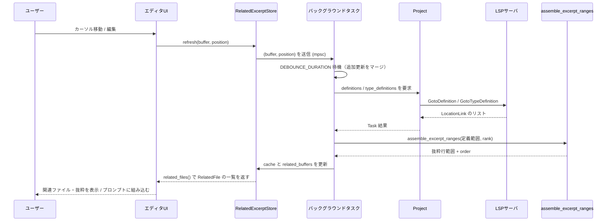

# crates/edit_prediction_context ディレクトリ解説

## 1. ざっくり一言

`edit_prediction_context` クレートは、**カーソル周辺の識別子から LSP の定義 / 型定義情報を取得し、関連するファイルの「抜粋(Excerpt)」を組み立てるストア**を提供します。  
エディタやプロンプトエンジンが「いまの編集に関係が深いコード断片」を効率的に利用できるようにするためのモジュールです。

---

## 2. このモジュールの役割

### 2.1 概要

- このモジュールは **カーソル位置から見て関連性が高い定義・型定義を持つファイルとその抜粋範囲を求める**ために存在します。
- LSP（Language Server Protocol）経由で `GotoDefinition` / `GotoTypeDefinition` を呼び出し、得られた位置を **アウトライン情報とテキスト情報を使って読みやすい抜粋に整形**します。
- 結果は `zeta_prompt::RelatedFile` / `RelatedExcerpt` として提供され、プロンプト生成や UI 表示に利用できます。
- テスト用に、tree-sitter を用いた簡易 LSP 実装（`fake_definition_lsp`）も含まれています。

### 2.2 アーキテクチャ内での位置づけ

主なコンポーネントの関係は次の通りです。

- `RelatedExcerptStore`
  - `Project` エンティティを参照し、LSP 経由で定義/型定義を取得します。
  - `Buffer`（編集中ファイル）と `BufferSnapshot` を通じてテキスト/アウトライン情報を参照します。
  - `assemble_excerpts::assemble_excerpt_ranges` を使って抜粋範囲を組み立てます。
- テスト時:
  - `fake_definition_lsp::register_fake_definition_server` が `FakeLanguageServer` を登録し、`Project` 経由で使われます。

```mermaid
graph TD
    UI["エディタUI / 呼び出し元"]
    Store["RelatedExcerptStore"]
    Project["Project (gpui Entity)"]
    Buffer["Buffer / BufferSnapshot"]
    Lsp["LSP サーバ<br/>(本番: 実サーバ / テスト: fake_definition_lsp)"]
    Assemble["assemble_excerpt_ranges"]
    Prompt["zeta_prompt::RelatedFile / RelatedExcerpt"]

    UI -->|refresh(...)| Store
    Store --> Project
    Store --> Buffer
    Project -->|definitions<br/>type_definitions| Lsp
    Store --> Assemble
    Store --> Prompt
```

### 2.3 設計上のポイント

- **非同期＋デバウンス**
  - `RelatedExcerptStore::new` で mpsc チャネルとバックグラウンドタスクを立ち上げ、
  - `refresh` が短時間に何度呼ばれても、`DEBOUNCE_DURATION`（100ms）で最新の 1 件だけを処理するようになっています。
- **キャッシュ**
  - `Identifier`（名前＋ Anchor 範囲）をキーに `CacheEntry` を `HashMap` で保持し、
  - 同じ識別子の定義/型定義を再取得しないようにしています。
- **カーソルからの距離による順位付け**
  - `identifiers_for_position` でカーソル周辺の識別子を抽出し、
  - カーソルからのバイト距離で「順位（rank）」を決め、これを抜粋の `order` に反映します。
- **アウトラインとハイライトの利用**
  - `BufferSnapshot::outline_items_*` とハイライト用 query（identifier captures）を用いて、
  - 「どの識別子を拾うか」「大きなブロックからどの行を抜粋するか」を決めています。
- **テスト容易性**
  - `fake_definition_lsp` により、実際の LSP サーバがなくても
    `GotoDefinition` / `GotoTypeDefinition` の挙動を再現したテストを行えるようにしています。

---

## 3. 主要な機能一覧

- **カーソル周辺の識別子抽出**
  - `identifiers_for_position` で、カーソル行の前後数行＋アウトラインヘッダから識別子を抽出します。
- **LSP による定義 / 型定義の取得**
  - `Project::definitions` / `Project::type_definitions` を通じて、各識別子の定義/型定義位置を取得します。
- **定義位置から関連ファイル／抜粋の構築**
  - `rebuild_related_files` で、取得した位置をファイル単位にまとめ、
  - `assemble_excerpt_ranges` で「読みやすい抜粋行範囲」に変換します。
- **抜粋のマージと順位付け**
  - `assemble_excerpt_ranges` / `merge_ranges` で抜粋範囲をマージし、
  - カーソルからの距離に応じて `order` を付与します。
- **結果のキャッシュと再利用**
  - `RelatedExcerptStore` 内の `cache` により、同じ識別子への再アクセス時に LSP 呼び出しを省略します。
- **テスト用 fake LSP サーバ**
  - `fake_definition_lsp::register_fake_definition_server` と `DefinitionIndex` で、
  - tree-sitter ベースの簡易な定義／型定義解決を提供します（テスト専用）。

---

## 4. 関数・構造体の解説

### 4.1 型一覧（構造体・列挙体など）

| 名前 | 種別 | 公開範囲 | 役割 / 用途 |
|------|------|----------|-------------|
| `RelatedExcerptStore` | 構造体 | `pub` | プロジェクトとバッファから関連ファイル・抜粋を計算し保持するストア。イベントを発火します。 |
| `RelatedExcerptStoreEvent` | 列挙体 | `pub` | 抜粋再計算の開始・終了イベントと、その統計情報を表します。 |
| `RelatedBuffer` | 構造体 | crate 内部 | 1 ファイル分の `Buffer` と、対応するアンカー範囲・キャッシュ済み抜粋を保持します。 |
| `CachedRelatedFile` | 構造体 | crate 内部 | 1 ファイル分の `RelatedExcerpt` とバッファバージョンをキャッシュします。 |
| `Identifier` | 構造体 | crate 内部 | 抽出された識別子（名前＋アンカー範囲）を表すキー。ハッシュマップのキーに使われます。 |
| `DefinitionTask` | 列挙体 | crate 内部 | 定義解決をキャッシュヒット/ミスで分岐させるための内部状態。 |
| `CacheEntry` | 構造体 | crate 内部 | 1 つの識別子の定義・型定義の一覧を保持します。 |
| `CachedDefinition` | 構造体 | crate 内部 | 1 つの定義位置（ProjectPath, Buffer, Anchor 範囲）の情報。 |
| `DefinitionIndex` | 構造体 | `fake_definition_lsp.rs` 内部 | fake LSP 用のインデックス。定義と型注釈を管理します。 |
| `FileEntry` | 構造体 | `fake_definition_lsp.rs` 内部 | 1 ファイルの内容と「バッファで開かれているか」のフラグ。 |

他クレートから再エクスポートされている主な型:

| 名前 | 出所 | 役割 |
|------|------|------|
| `RelatedFile` | `zeta_prompt` | パスと複数の `RelatedExcerpt` から成る関連ファイル情報。 |
| `RelatedExcerpt` | `zeta_prompt` | 行範囲・抜粋テキスト・order を持つ 1 個の抜粋。 |

### 4.2 重要な関数・メソッド詳細（7 件）

#### 1. `RelatedExcerptStore::new(project: &Entity<Project>, cx: &mut Context<Self>) -> Self`

**概要**

- `RelatedExcerptStore` のインスタンスを生成し、  
  カーソル更新要求を受け取って非同期に抜粋を再計算するバックグラウンドタスクを起動します。

**引数**

| 引数名 | 型 | 説明 |
|--------|----|------|
| `project` | `&Entity<Project>` | 対象プロジェクトの gpui エンティティ。定義/型定義を取得するために使われます。 |
| `cx` | `&mut Context<Self>` | `RelatedExcerptStore` 用の gpui コンテキスト。タスク生成・イベント発火に利用します。 |

**戻り値**

- `RelatedExcerptStore` インスタンス。  
  初期状態では `related_buffers` は空で、`identifier_line_count` はデフォルト値 `IDENTIFIER_LINE_COUNT`（3 行）に設定されます。

**内部処理の流れ**

1. `mpsc::unbounded` で `(Entity<Buffer>, Anchor)` を送るチャネルを作成。
2. `cx.spawn` で非同期タスクを起動。
   - チャネルから更新要求（`buffer, position`）を受信。
   - `DEBOUNCE_DURATION`（100ms）のタイマーをセット。
   - その間に新たな更新要求が来たら、`buffer` と `position` を更新し、タイマーをリセット。
   - 一定時間新しい要求が来なければ、最新の `buffer, position` で `fetch_excerpts` を呼び出す。
3. `RelatedExcerptStore` のフィールドを初期化して返す。

**Examples（使用例）**

テストコードに近い形での利用例です。

```rust
use gpui::{Context, Entity};
use project::Project;
use edit_prediction_context::RelatedExcerptStore;

// gpui のコンテキスト内でストアを生成する例
fn create_store(project: &Entity<Project>, cx: &mut Context<RelatedExcerptStore>) {
    // RelatedExcerptStore を新規作成し、gpui のエンティティとして登録
    let store = RelatedExcerptStore::new(project, cx);

    // ここでは単に store を返す / 保持する想定
    // 実際には cx.new(...) でエンティティ化するパターンが多いです。
}
```

テストでは次のように `cx.new` を使っています。

```rust
// TestAppContext 内での例（edit_prediction_context_tests.rs より）
let related_excerpt_store = cx.new(|cx| RelatedExcerptStore::new(&project, cx));
```

**Errors / Panics**

- 内部の `cx.spawn` 内で `fetch_excerpts` が `anyhow::Error` を返す可能性がありますが、
  タスクは `detach_and_log_err` でデタッチされ、エラーはログに出力されます。
- `new` 自体は `Result` を返さないため、呼び出し時にエラーは発生しません。

**Edge cases（エッジケース）**

- `project` が後でドロップされると、`WeakEntity` へのアップグレードが失敗し、
  以降の `fetch_excerpts` はすぐに `Ok(())` を返して何もしなくなります。

**使用上の注意点**

- `RelatedExcerptStore` は gpui のエンティティとして運用されることを前提としています。
- `project` は長期間生存する前提で渡されているため、短命の `Project` を渡すと後続処理でアップグレードに失敗します。

---

#### 2. `RelatedExcerptStore::refresh(&mut self, buffer: Entity<Buffer>, position: Anchor, cx: &mut Context<Self>)`

**概要**

- 現在のカーソル位置（バッファとアンカー）をストアに通知し、  
  バックグラウンドタスクに「抜粋を更新してほしい」という要求を送ります。
- 実際の計算は非同期で行われ、その場ではブロックしません。

**引数**

| 引数名 | 型 | 説明 |
|--------|----|------|
| `buffer` | `Entity<Buffer>` | カーソル位置が属するバッファ。 |
| `position` | `Anchor` | カーソル位置を表すアンカー。 |
| `cx` | `&mut Context<Self>` | gpui コンテキスト。ここでは未使用（`_` 引数）ですが、シグネチャ上受け取ります。 |

**戻り値**

- なし（`()`）。  
  更新要求がチャネルに送信されるだけで、すぐに制御が返ります。

**内部処理の流れ**

1. `self.update_tx.unbounded_send((buffer, position))` を呼び出し、
   更新要求をバックグラウンドタスクへ送る。
2. 送信エラー（チャネルクローズ）は `ok()` で無視されます。

**Examples（使用例）**

テストで使われているパターンです。

```rust
use language::Anchor;
use gpui::{Entity, Context};
use language::Buffer;

// カーソル位置から refresh を呼ぶ例
related_excerpt_store.update(cx, |store, cx| {
    // カーソル位置の Anchor を取得
    let position = {
        let buffer_ref = buffer.read(cx);
        let offset = buffer_ref.text().find("todo").unwrap(); // "todo" の位置
        buffer_ref.anchor_before(offset)
    };

    // 近傍行数を設定（0 行 → 同一行のみを見る）
    store.set_identifier_line_count(0);

    // 抜粋更新を要求
    store.refresh(buffer.clone(), position, cx);
});
```

**Errors / Panics**

- チャネルがすでに閉じている場合、`unbounded_send` は `Err` を返しますが、
  戻り値に対して `ok()` しか呼んでいないため、エラーは無視されます。
- 明示的な `panic!` 呼び出しはありません。

**Edge cases（エッジケース）**

- 非同期でデバウンスされるため、`refresh` を連続で多く呼んでも、
  実際に計算されるのは最後に呼ばれた位置のみになる場合があります。
- `buffer` が後で閉じられたり再利用されたりした場合の挙動は、
  `Buffer` / `Project` 側の実装に依存します（このチャンクからは詳細不明）。

**使用上の注意点**

- `refresh` を呼んだ直後に `related_files` を呼んでも、まだ結果が反映されていない可能性があります（非同期）。
- テストでは `cx.executor().advance_clock(DEBOUNCE_DURATION);` のように、
  疑似時間を進めてデバウンス待ちを行っています。

---

#### 3. `async fn fetch_excerpts(...) -> Result<()>`

```rust
async fn fetch_excerpts(
    this: WeakEntity<Self>,
    buffer: Entity<Buffer>,
    position: Anchor,
    cx: &mut AsyncApp,
) -> anyhow::Result<()>
```

**概要**

- `refresh` から呼ばれる内部のメイン処理です。
- カーソル位置から識別子を抽出し、LSP 経由で定義/型定義を取得し、  
  `rebuild_related_files` を通じて `RelatedBuffer` のリストとキャッシュを構築します。

**引数**

| 引数名 | 型 | 説明 |
|--------|----|------|
| `this` | `WeakEntity<RelatedExcerptStore>` | ストア自身への弱参照。循環参照を避けるために WeakEntity になっています。 |
| `buffer` | `Entity<Buffer>` | 抜粋の基点となるバッファ。 |
| `position` | `Anchor` | カーソル位置。 |
| `cx` | `&mut AsyncApp` | 非同期コンテキスト。バックグラウンドタスク生成や `read_with` / `update` に使われます。 |

**戻り値**

- `anyhow::Result<()>`  
  - 正常終了: `Ok(())`  
  - エラー時: `Err(anyhow::Error)`（内部で `?` を通して伝播）

**内部処理の流れ（要約）**

1. `this.read_with` で
   - `project`（`WeakEntity<Project>` を upgrade）,
   - `buffer.snapshot()`（`BufferSnapshot`）,
   - `identifier_line_count`
   を取得。
   - `project` が無ければそのまま `Ok(())` を返す。
2. ファイルパスがあればログに開始メッセージを出力。
3. `StartedRefresh` イベントを発火。
4. `cx.background_spawn` でカーソルからの距離計算を実行:
   - `identifiers_for_position` で識別子一覧を取得。
   - カーソルオフセットとの差の絶対値を距離とし、距離順にソート。
   - 同じ距離に同じ rank（0,1,2,…）を割り当て、`cursor_distances` を作る。
5. `this.update`内で、各識別子に対して
   - 既存キャッシュにあれば `DefinitionTask::CacheHit`
   - なければ `Project::definitions` と `Project::type_definitions` への非同期リクエスト（`Task`) を作成し `CacheMiss`
   を組み立て、非同期タスク（`async move { ... }`）のベクタを返す。
6. `future::join_all` で全タスクを待ち、
   - キャッシュミスは LSP 結果から `CachedDefinition` を生成（`process_definition` 使用）。
   - 定義と型定義で同じ位置（ファイル＋範囲）のものは型定義側から除外。
   - `new_cache: HashMap<Identifier, Arc<CacheEntry>>` を構築。
   - ヒット/ミス件数と平均/最大レイテンシを集計。
7. `rebuild_related_files` を呼び出し、
   - キャッシュに含まれる全定義をバッファごとにまとめ、
   - 抜粋行範囲を計算し、`Vec<RelatedBuffer>` を得る。
8. ログに完了メッセージを出力。
9. `this.update` で
   - `self.cache` と `self.related_buffers` を更新し、
   - `FinishedRefresh` イベントを発火。

**Examples（使用例）**

- `fetch_excerpts` は内部実装であり、直接呼び出す想定ではありません。
- 利用者は `RelatedExcerptStore::refresh` を呼び出すことで、この処理が間接的に実行されます。

**Errors / Panics**

- `this.read_with` や `this.update` が `Err` を返した場合、`?` により `anyhow::Error` として返ります。
  - 具体的な失敗条件は gpui の実装に依存しており、コードからは詳細は分かりません。
- LSP 呼び出し（`definitions`, `type_definitions`）のエラーは `log_err()` でログされ、結果は空ベクタとして扱われるため、この関数自体のエラーにはなりません。
- 明示的な `panic!` はありません。

**Edge cases（エッジケース）**

- `identifiers_for_position` が空を返した場合:
  - `identifiers_with_distance` が空になり、`rebuild_related_files` に渡されるエントリも空なので、
  - `related_buffers` は空のままになります。
- すべての LSP 結果が `process_definition` で `None` になる（大きすぎる範囲や単一ファイルワークツリー等）の場合も、同様に関連ファイルは生成されません。

**使用上の注意点**

- 非同期関数であり、呼び出しは `RelatedExcerptStore` 内部からのみ行われます。
- 大量の識別子／ファイルがある場合、`rebuild_related_files` に渡される前に全バッファの `parsing_idle` + `snapshot` を行うため、CPU 時間が増えます。

---

#### 4. `async fn rebuild_related_files(...) -> Result<(HashMap<Identifier, Arc<CacheEntry>>, Vec<RelatedBuffer>)>`

```rust
async fn rebuild_related_files(
    project: &Entity<Project>,
    mut new_entries: HashMap<Identifier, Arc<CacheEntry>>,
    cursor_distances: &HashMap<Identifier, usize>,
    cx: &mut AsyncApp,
) -> anyhow::Result<(HashMap<Identifier, Arc<CacheEntry>>, Vec<RelatedBuffer>)>
```

**概要**

- `fetch_excerpts` で構築した `new_entries`（識別子 → 定義群）から、
  **バッファごとの抜粋一覧 (`RelatedBuffer`) とワークツリー相対パス** を計算します。
- 各ファイルに対し、カーソルからの rank に基づいて抜粋の order を付け、ファイル順を決めます。

**引数**

| 引数名 | 型 | 説明 |
|--------|----|------|
| `project` | `&Entity<Project>` | ワークツリーや `ProjectPath` を解決するためのプロジェクト。 |
| `new_entries` | `HashMap<Identifier, Arc<CacheEntry>>` | 識別子ごとの定義／型定義キャッシュ。 |
| `cursor_distances` | `&HashMap<Identifier, usize>` | 各識別子の rank。小さいほどカーソルに近い。 |
| `cx` | `&mut AsyncApp` | 非同期コンテキスト。バッファの `parsing_idle` / `snapshot`、`project.read_with` に利用。 |

**戻り値**

- `(new_entries, related_buffers)` のタプル。
  - `new_entries` は同じマップ（`iter_mut` により一部可変アクセスがありますが、論理的には再構築されたもの）を返します。
  - `related_buffers` は新しく構築された `Vec<RelatedBuffer>` です。

**内部処理の流れ**

1. すべての `CachedDefinition` を走査し、必要なバッファごとに:
   - `buffer.parsing_idle().await` でパースのアイドル化を待つ。
   - `buffer.snapshot()` を取得し、`snapshots` に保存。
   - `project.worktree_for_id` でワークツリーを取得し、`root_name` を文字列で `worktree_root_names` に保存。
2. `cursor_distances` をクローンし、`background_spawn` に渡す。
3. バックグラウンドタスク内で:
   - `ranges_by_buffer: EntityId -> (buffer, Vec<(Range<Point>, rank)>)` を構築。
   - `paths_by_buffer: EntityId -> ProjectPath` を構築。
   - `min_rank_by_buffer: EntityId -> usize` に各バッファの最小 rank を記録。
   - 各 `CachedDefinition` について、アンカー範囲を `to_point(snapshot)` で `Range<Point>` に変換し、`ranges_by_buffer` に追加。
4. 各バッファごとに:
   - `assemble_excerpt_ranges(snapshot, ranges)` を呼び、行範囲＋order を得る。
   - `worktree_root_names` と `ProjectPath` から `"root_name/relative_path"` 形式の `Path` を組み立てる。
   - 行範囲を `Anchor` 範囲に変換し、`RelatedBuffer` を生成し `fill_cache` でキャッシュを作る。
5. 生成された `related_buffers` を
   - `min_rank_by_buffer` の rank 昇順、
   - 次いでパス文字列順
   でソート。
6. `(new_entries, related_buffers)` を返す。

**Examples（使用例）**

- 内部関数であり、直接呼び出す想定はありません。  
  利用者は `RelatedExcerptStore::refresh` を介して間接的に使用します。

**Errors / Panics**

- `project.read_with` や `buffer.read_with` の内部でエラーが返された場合、`?` で `anyhow::Error` として返ります。
- `assemble_excerpt_ranges` の内部に `panic` はありませんが、外部依存（`BufferSnapshot` 等）がパニックを起こすかどうかはこのチャンクからは分かりません。

**Edge cases**

- `new_entries` が空の場合: `snapshots` も `ranges_by_buffer` も空のままになり、`related_buffers` は空になります。
- ある `CachedDefinition` に対応する `snapshot` や `worktree_root_names` のエントリが存在しない場合、その定義はスキップされます（`filter_map` により `None`）。

**使用上の注意点**

- `assemble_excerpt_ranges` への入力となる `ranges` は、定義/型定義のアンカー範囲に対して rank を付けたものです。
  rank の意味が変わるような変更（距離計算変更など）を行う場合、この関数の前後のロジックも確認する必要があります。

---

#### 5. `pub fn assemble_excerpt_ranges(buffer: &BufferSnapshot, input_ranges: Vec<(Range<Point>, usize)>) -> Vec<(Range<u32>, usize)>`

**概要**

- 複数のポイント範囲（`Range<Point>`）とその order（rank）を受け取り、  
  **アウトライン情報を利用して抜粋向けの行範囲（`Range<u32>`）に整形・マージ**します。
- 大きなアウトラインアイテム（長い `impl` ブロック等）では、ヘッダとフッタだけを抜き出し、
  中身はスキップして子アイテム（メソッドなど）を個別の抜粋として扱います。

**引数**

| 引数名 | 型 | 説明 |
|--------|----|------|
| `buffer` | `&BufferSnapshot` | 抜粋対象のバッファスナップショット。アウトラインとテキスト長にアクセスします。 |
| `input_ranges` | `Vec<(Range<Point>, usize)>` | 定義/型定義などの範囲（ポイント座標）と、その order（小さいほど重要）。 |

**戻り値**

- `Vec<(Range<u32>, usize)>`  
  - `Range<u32>` は開始・終了行（`row`）の範囲（終了は開区間）を表します。
  - `usize` は継承された order（rank）です。

**内部処理の流れ**

1. `clip_range_to_lines` を用いて、各 `input_range` を行単位の範囲に揃える（先頭行はカラム 0、末尾行は最終カラム）。
2. `merge_ranges` で重なっている／すぐ隣接している範囲をマージし、order は最小値を採用。
3. `buffer.outline_items_as_points_containing(0..buffer.len(), false, None)` で全アウトラインアイテムを取得。
4. 各 `input_range` について、それ以前のアウトラインアイテムを走査し:
   - アイテム範囲が `input_range` と重なる場合、
   - `outline_item.body_range` を取得し、大きなボディ（長さが `MAX_OUTLINE_ITEM_BODY_SIZE` を超える）であれば
     - ヘッダー／フッターを別々の抜粋として `add_outline_item` で追加。
     - さらに、そのボディ内の子アイテム（`depth == parent.depth + 1`）を個別抜粋として追加。
   - ボディが小さい／存在しない場合はアイテム全体を 1 つの抜粋として追加。
5. 元の `input_ranges` にアウトライン由来の `outline_ranges` を付け足し、再度 `merge_ranges` でマージ。
6. 最後に、各 `Range<Point>` を `range.start.row..range.end.row` に変換して返す。

**Examples（使用例）**

テスト `test_assemble_excerpts` の簡略版です。

```rust
use language::{Point, Buffer, ToPoint as _};
use edit_prediction_context::assemble_excerpts::assemble_excerpt_ranges;

// 何らかのテキストから Buffer を作成
let text = r#"
struct User {
    first_name: String,
    last_name: String,
    age: u32,
}
"#;

let buffer = Buffer::local(text.into(), cx).with_language(rust_lang(), cx);
buffer.read_with(cx, |buffer, _| {
    // ここでは [last_name] の行を抜粋したいとする
    let snapshot = buffer.snapshot();
    let start = Point::new(2, 0); // 行番号はテキストに応じて調整
    let end = Point::new(3, 0);
    let ranges = vec![(start..end, 0)];

    let assembled = assemble_excerpt_ranges(&snapshot, ranges);

    for (row_range, order) in assembled {
        // row_range.start .. row_range.end の行が抜粋対象
        // order は 0（今回の例）
    }
});
```

**Errors / Panics**

- 明示的な `panic!` はありません。
- `buffer.outline_items_as_points_containing` や `buffer.line_len` など外部メソッドによるパニック可能性については、このチャンクからは不明です。

**Edge cases**

- アウトライン情報がない言語の場合:
  - `outline_items_as_points_containing` が空に近くなり、ほぼ元の `input_ranges` だけが返る形になります。
- `input_ranges` が互いに近接している場合:
  - `merge_ranges` により 1 つの広い抜粋に統合されます。
- アウトラインアイテムのボディが `MAX_OUTLINE_ITEM_BODY_SIZE` 以下の場合:
  - ヘッダとボディを分割せず、アイテム全体を抜粋として扱います。

**使用上の注意点**

- order（rank）は「どの識別子から見つかったか」によって受け継がれます。
  - 親の `impl` ヘッダやフッタは、子メソッドたちの最小 order を継承するため、
    どのメソッドが近かったかによって順番が変わります（`test_definitions_ranked_by_cursor_proximity` 参照）。
- 戻り値の行範囲は **開区間**（`start..end`）である点に注意してください。

---

#### 6. `fn identifiers_for_position(buffer: &BufferSnapshot, position: Anchor, identifier_line_count: u32) -> Vec<Identifier>`

**概要**

- 指定したカーソル位置を中心に、前後 `identifier_line_count` 行と、  
  カーソルが含まれるアウトラインアイテムのヘッダ範囲から識別子を抽出します。
- 識別子の抽出には、言語側のハイライト設定（identifier captures）を利用します。

**引数**

| 引数名 | 型 | 説明 |
|--------|----|------|
| `buffer` | `&BufferSnapshot` | 検索対象のバッファスナップショット。 |
| `position` | `Anchor` | カーソル位置。 |
| `identifier_line_count` | `u32` | カーソル行の前後何行を見るか（0 の場合は同一行のみ）。 |

**戻り値**

- `Vec<Identifier>`  
  - 各 `Identifier` は `name: String` と、アンカー範囲 `range: Range<Anchor>` を持ちます。

**内部処理の流れ**

1. `position.to_offset(buffer)` と `buffer.offset_to_point` からカーソルのオフセットとポイントを計算。
2. `point.row` を中心に、前後 `identifier_line_count` 行（＋1 行分の終端）からなる `line_range` を作成し、オフセット範囲に変換。
3. `buffer.outline_items_as_offsets_containing(offset..offset, false, None)` を呼び、
   - カーソルを含むアウトラインアイテムのうち、
   - ボディがあるものは「ヘッダ〜ボディ開始」の範囲、
   - ボディがないものはアイテム全体の範囲
   を `ranges` に追加。
4. `ranges` を開始オフセット昇順、終了オフセット降順でソート。
5. 隣接・重複する範囲をマージして非重複の範囲列にする。
6. `outer_range`（`ranges` 全体を覆う最小～最大オフセット）を決め、
   `buffer.captures(outer_range, ...)` でハイライトキャプチャイテレータを作成。
7. 各 `range` について:
   - `captures.set_byte_range(range.start..outer_range.end)` でスキャン範囲を設定。
   - `captures.peek()` しながら
     - キャプチャされたノード範囲が `range` に含まれているか、
     - ハイライト設定が identifier capture としてマークしているか、
     - 同じノード範囲を連続で重複していないか
     をチェック。
   - 条件を満たすものを `Identifier` として `identifiers` ベクタに追加。

**Examples（使用例）**

```rust
use language::{BufferSnapshot, Anchor};
use edit_prediction_context::Identifier;

// snapshot と position は既に得られているとする
let identifiers = identifiers_for_position(&snapshot, position, 1);

for id in identifiers {
    println!("name={} range=({:?}..{:?})", id.name, id.range.start, id.range.end);
}
```

**Errors / Panics**

- 明示的な `panic!` はなく、基本的に空ベクタを返す方向の実装です。
- `buffer.captures` やハイライト設定が存在しない場合、`config` が `None` になり、そのキャプチャはスキップされます。

**Edge cases**

- ハイライト設定に identifier capture が定義されていない言語の場合:
  - `config.identifier_capture_indices` にマッチしないため、結果は空か少数になります。
- `identifier_line_count == 0` の場合:
  - カーソル行のみに限定されますが、アウトラインヘッダ範囲も追加されるため、
    関数シグネチャなどのヘッダ部分も対象になります。

**使用上の注意点**

- 抽出範囲は「行ベース＋アウトラインヘッダ」であり、ファイル全体から無差別に識別子を拾うわけではありません。
- ハイライト設定（tree-sitter query）に依存するため、言語側の設定変更がこの関数の結果にも影響します。

---

#### 7. `pub fn register_fake_definition_server(...) -> UnboundedReceiver<FakeLanguageServer>`

```rust
pub fn register_fake_definition_server(
    language_registry: &Arc<LanguageRegistry>,
    language: Arc<Language>,
    fs: Arc<dyn Fs>,
) -> UnboundedReceiver<FakeLanguageServer>
```

**概要**

- テスト用の fake LSP サーバを `LanguageRegistry` に登録します。
- tree-sitter のアウトライン情報と簡易なテキスト解析に基づき、
  `GotoDefinition` / `GotoTypeDefinition` を実装します。
- `Project::test` と組み合わせることで、LSP の応答を伴うテストが可能になります。

**引数**

| 引数名 | 型 | 説明 |
|--------|----|------|
| `language_registry` | `&Arc<LanguageRegistry>` | 対象言語を登録するレジストリ。 |
| `language` | `Arc<Language>` | tree-sitter Grammar とアウトライン設定を含む言語情報。 |
| `fs` | `Arc<dyn Fs>` | ファイルシステム抽象。テストでは `FakeFs` が利用されます。 |

**戻り値**

- `UnboundedReceiver<FakeLanguageServer>`  
  - 登録された fake サーバインスタンスを受け取るためのチャネル。

**内部処理の流れ**

1. `DefinitionIndex` を `Arc<Mutex<_>>` で包んだインスタンスを生成。
2. `language_registry.register_fake_lsp` で fake LSP アダプタを登録。
   - LSP 能力として
     - `definition_provider = true`
     - `type_definition_provider = true`
     - `text_document_sync = FULL`
     を設定。
3. `initializer` 内で各種ハンドラを登録:
   - `DidOpenTextDocument`: バッファ内容を `DefinitionIndex::open_buffer` に渡してインデックス化。
   - `DidCloseTextDocument`: バッファを閉じ、実ファイル内容で再インデックス（`fs.load`）。
   - `DidChangeWatchedFiles`: 監視対象ファイルの作成/変更/削除に応じて再インデックスまたは削除。
   - `DidChangeTextDocument`: 最後の内容変更でインデックスを更新。
   - `DidChangeWorkspaceFolders`: 追加されたフォルダ配下のファイルを対象にインデックス構築。
   - `GotoDefinition`: `DefinitionIndex::get_definitions` を呼び出す。
   - `GotoTypeDefinition`: `DefinitionIndex::get_type_definitions` を呼び出す。

**Examples（使用例）**

テストコード中での使用例です。

```rust
use project::{Project, FakeFs};
use language::rust_lang;
use settings::SettingsStore;
use edit_prediction_context::fake_definition_lsp::register_fake_definition_server;

// プロジェクトの test 環境を用意
let project = Project::test(fs.clone(), [path!("/root").as_ref()], cx).await;
let (language_registry, fs) = project.read_with(cx, |project, _| {
    (project.languages().clone(), project.fs().clone())
});
let language = rust_lang();
language_registry.add(language.clone());

// fake LSP を登録
let servers = register_fake_definition_server(&language_registry, language, fs);
// servers.next().await で FakeLanguageServer インスタンスが取得される
```

**Errors / Panics**

- `register_fake_lsp` が内部でどのような失敗を起こし得るかはこのチャンクからは不明ですが、本関数内で明示的に `Result` を返したり `panic!` を呼んだりはしていません。

**Edge cases**

- `Fs` 実装が `as_fake().files()` に対応していない場合、
  `DidChangeWorkspaceFolders` の中で想定通りにファイル列挙ができない可能性があります（テストでは `FakeFs` を使う前提）。
- tree-sitter の `outline_config` がない言語に対して `DefinitionIndex::index_file_inner` が呼ばれると、`outline_config` が `None` になり、
  そのファイルの定義はインデックスされません。

**使用上の注意点**

- この fake サーバはテスト用であり、本番運用で使うことは想定されていません。
- 名前が一意であること、変数の型が明示的に書かれていることなど、簡略化された仮定に基づいて動作します。

---

### 4.3 その他の補助関数（一覧）

| 関数名 | 所在 | 役割（1 行） |
|--------|------|--------------|
| `clip_range_to_lines` | `assemble_excerpts.rs` | `Range<Point>` を行の先頭・末尾に揃えた範囲にクリップします。 |
| `add_outline_item` | 同上 | アウトラインアイテムのヘッダ/フッタから抜粋範囲を追加します。 |
| `merge_ranges` | 同上 | 近接・重複する範囲をマージし、order の最小値を保持します。 |
| `RelatedBuffer::related_file` | `edit_prediction_context.rs` | キャッシュを利用して `RelatedFile` を生成します。 |
| `RelatedBuffer::fill_cache` | 同上 | `anchor_ranges` から `RelatedExcerpt` を作り `CachedRelatedFile` を埋めます。 |
| `process_definition` | 同上 | LSP から得た `LocationLink` をフィルタして `CachedDefinition` に変換します。 |
| `DefinitionIndex::index_file_inner` | `fake_definition_lsp.rs` | tree-sitter でファイルを解析し、定義名と型注釈をインデックスします。 |
| `extract_type_annotations` | 同上 | フィールドや変数宣言行から「名前 → 型名」の対応を抽出します。 |
| `extract_base_type_name` | 同上 | `Arc<Person>`, `Box<dyn Trait>` などから最終的な型名を取り出します。 |
| `extract_declarations_from_tree` | 同上 | アウトライン query に基づき、宣言名と byte 範囲を取り出します。 |
| `word_at_position` | 同上 | LSP 位置からソース上の単語（識別子名）を取得します。 |

---

## 5. データフロー

ここでは、エディタでカーソルを動かしたときに関連抜粋がどのように計算されるかを示します。

### 5.1 処理の流れ（概観）

1. ユーザーがバッファを編集したりカーソルを移動する。
2. エディタ側が `RelatedExcerptStore::refresh(buffer, position, cx)` を呼び出す。
3. バックグラウンドタスクが `DEBOUNCE_DURATION` だけ待ち、最新の位置で `fetch_excerpts` を実行。
4. `fetch_excerpts` は
   - `identifiers_for_position` で識別子を抽出、
   - LSP を通じて定義/型定義を取得し、
   - `rebuild_related_files` でファイルごとの抜粋リストを構築。
5. エディタ UI は `related_files` を呼び、`RelatedFile` のリストとして表示やプロンプト生成に用いる。

### 5.2 シーケンス図



---

## 6. 使い方（How to Use）

### 6.1 基本的な使用方法

ここでは、エディタの一部として `RelatedExcerptStore` を利用する典型的な流れを示します。  
（実際のアプリケーションでは gpui の初期化コードなどが別に存在します。）

```rust
use gpui::{App, Context, Entity};
use project::Project;
use language::{Buffer, Anchor};
use edit_prediction_context::{RelatedExcerptStore, RelatedFile};

fn setup_store(project: &Entity<Project>, cx: &mut Context<RelatedExcerptStore>) {
    // ストアを初期化
    let _store = RelatedExcerptStore::new(project, cx);
}

// カーソル位置が更新されたときに呼ばれる想定の関数
fn on_cursor_moved(
    store: &Entity<RelatedExcerptStore>,
    buffer: &Entity<Buffer>,
    anchor: Anchor,
    cx: &mut Context<RelatedExcerptStore>,
) {
    store.update(cx, |store, cx| {
        // 必要であれば identifier_line_count を調整
        store.set_identifier_line_count(1);
        // 非同期で関連抜粋の更新を要求
        store.refresh(buffer.clone(), anchor, cx);
    });
}

// どこかのタイミングで関連ファイルを取得する
fn get_related_files(
    store: &Entity<RelatedExcerptStore>,
    app: &App,
) -> Vec<RelatedFile> {
    store.update(app, |store, app| store.related_files(app))
}
```

テストでは、`cx.executor().advance_clock(DEBOUNCE_DURATION);` を使用して時間を進めた後に `related_files` を取得しています。

### 6.2 よくある使用パターン

#### パターン 1: 近傍行数の調整

- シンボルが密集している場所では、`identifier_line_count` を小さくするとより局所的な関連を取れます。
- 逆に、少し広めに見たい場合は増やします。

```rust
store.update(cx, |store, cx| {
    // カーソル行のみを対象にする
    store.set_identifier_line_count(0);
    store.refresh(buffer.clone(), anchor, cx);
});
```

テスト `test_type_definitions_in_related_files` では `0` を指定し、  
カーソル位置の行だけから識別子を拾っています。

#### パターン 2: 既知の `RelatedFile` をストアに反映する

- すでに別のコンポーネントで `RelatedFile` を計算済みの場合、
  `set_related_files` を使って `RelatedExcerptStore` に適用できます。
- このとき、パスから `ProjectPath` を逆算し、対応する `Buffer` と `Anchor` 範囲を再構築します。

```rust
use edit_prediction_context::RelatedFile;

store.update(cx, |store, app| {
    // どこかから既存の RelatedFile のリストを取得したと仮定
    let files: Vec<RelatedFile> = obtain_related_files_somehow();

    // ストア内部の RelatedBuffer を構築
    store.set_related_files(files, app);
});
```

#### パターン 3: 抜粋テキストと order を合わせて利用する

- `related_files_with_buffers` を使うと、`RelatedFile` と元の `Buffer` を一緒に取得できます。
- 描画時に `order` を元に並び替えたり、`Buffer` を開いてハイライトするなどの操作が可能です。

```rust
store.update(app, |store, app| {
    for (file, buffer) in store.related_files_with_buffers(app) {
        println!("path = {:?}", file.path);
        for excerpt in &file.excerpts {
            println!("order = {}, text = {:?}", excerpt.order, excerpt.text);
        }
        // buffer を使って追加の情報を取得することも可能
    }
});
```

### 6.3 使用上の注意点（まとめ）

- **非同期・デバウンス**
  - `refresh` 呼び出し後すぐに結果が反映されるとは限りません。
  - 短時間に何度も呼ばれる場合、最後の呼び出しのみが有効になることがあります。
- **キャッシュの性質**
  - 識別子単位で `CacheEntry` がキャッシュされるため、
    ソースコードが大きく変更されたときには一時的に古い定義に基づいた結果が返る可能性があります。
  - ただし、再度 `definitions` / `type_definitions` が呼ばれたタイミングで更新されます。
- **バッファの変更とキャッシュ**
  - `RelatedBuffer::related_file` はバッファの `version()` と `CachedRelatedFile` の `buffer_version` を比較し、
    変更がある場合は再度 `fill_cache` します。
  - そのため、バッファ内容を編集した後は、次回 `related_file` 呼び出し時に抜粋テキストが自動で更新されます。
- **fake LSP の前提**
  - `fake_definition_lsp` はテスト用であり、すべての Rust 構文を正しく解釈するわけではありません。
  - テストコード内のコメントにもある通り、「すべての名前が一意」「型が明示されている」といった仮定に依存しています。

---

## 7. 関連ファイル

このディレクトリ内で、本モジュールと密接に関係するファイル一覧です。

| パス | 役割 / 関係 |
|------|------------|
| `edit_prediction_context/Cargo.toml` | クレート定義。`language`, `project`, `lsp`, `gpui`, `zeta_prompt` などへの依存が記載されています。 |
| `edit_prediction_context/src/edit_prediction_context.rs` | メイン実装ファイル。`RelatedExcerptStore` と周辺の型・関数 (`fetch_excerpts`, `rebuild_related_files`, `identifiers_for_position`, `process_definition` など) が定義されています。 |
| `edit_prediction_context/src/assemble_excerpts.rs` | 抜粋行範囲の構築ロジック (`assemble_excerpt_ranges`, `merge_ranges` 等) を提供するユーティリティモジュールです。 |
| `edit_prediction_context/src/fake_definition_lsp.rs` | テスト用の fake LSP サーバ実装。`register_fake_definition_server` と `DefinitionIndex` を提供し、`Project::definitions` / `type_definitions` の応答を模倣します。 |
| `edit_prediction_context/src/edit_prediction_context_tests.rs` | 本クレート全体の挙動を検証するテストコード。`RelatedExcerptStore` の典型的な使用例や、`assemble_excerpt_ranges` の出力例、fake LSP の使い方が含まれています。 |

これらのファイルを合わせて読むことで、

- どのように識別子 → 定義 → 抜粋 というデータフローが構成されているか、
- どのような条件で抜粋が生成・マージされるか、

を把握することができます。
