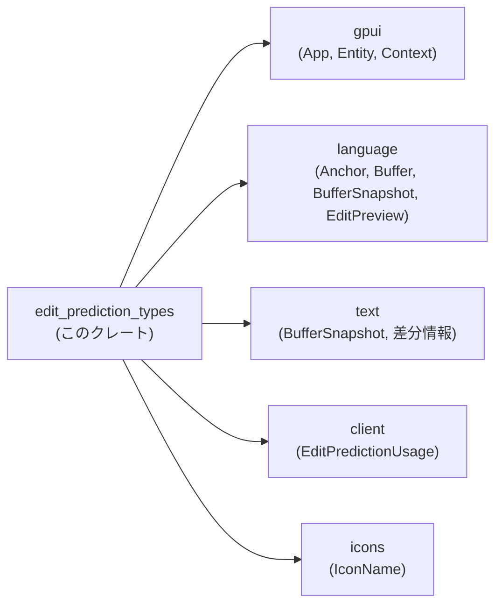
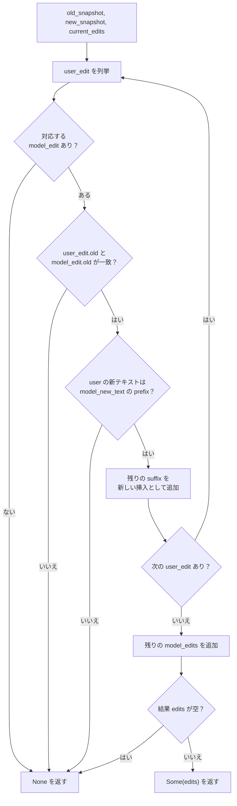
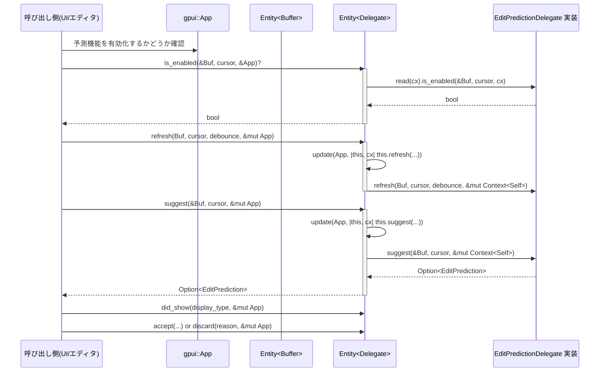

### 1. ざっくり一言

`edit_prediction_types` クレートは、エディタ内の「編集予測」（コード補完や編集候補）のための **共通データ型・トレイト・補助関数** を定義するモジュールです。  
予測結果の表現、プロバイダとのインターフェース、ユーザー編集との整合性をとるための処理をまとめています。

---

### 2. このモジュールの役割

#### 2.1 概要

- このモジュールは **「編集予測」機能の共通インターフェースとデータ構造** を提供します。
- 具体的には次を扱います。
  - 予測結果（ローカルな編集・他ファイルへのジャンプ）の表現
  - 予測プロバイダ（モデル・サービス）を抽象化するトレイト
  - 予測の表示方法・アイコン・利用状況・データ収集状態の表現
  - ユーザー編集とモデル予測を付き合わせて更新するための補助関数

#### 2.2 アーキテクチャ内での位置づけ

全体の中では、UI / エディタと、具体的な編集予測プロバイダ実装との **「境界レイヤー」** として機能します。  
依存関係は次のようになっています。



- 上位のエディタ／UI モジュールはこのクレートの型・トレイトを利用して予測を扱います。
- 実際のテキスト内容や差分は `language` / `text` クレートに委譲されています。
- メトリクスやデータ収集状態は `client::EditPredictionUsage` と `DataCollectionState` で扱います。

#### 2.3 設計上のポイント

- **責務の分離**
  - 予測の「意味的な型」（`EditPrediction`, `PredictedCursorPosition` 等）と、
    「プロバイダとのやりとり」（`EditPredictionDelegate` / `EditPredictionDelegateHandle`）を分離しています。
- **状態管理の委譲**
  - プロバイダ自身の状態（ロード中かどうか、データ収集フラグなど）は `EditPredictionDelegate` 実装側に任せ、
    このクレートではそれを問い合わせるためのトレイトのみを定義しています。
- **UI フレームワークへの依存を薄く保持**
  - `gpui::Entity<T>` を `EditPredictionDelegateHandle` として扱うことで、
    呼び出し側は `Entity<T>` を直接意識せず、トレイト経由で操作できます。
- **差分・スナップショット指向**
  - `interpolate_edits` は `text::BufferSnapshot` の差分 API を利用し、
    「ユーザー編集」と「モデル予測」の整合性をとるための補助を行います。

---

### 3. 主要な機能一覧

このモジュールが提供する主な機能は次の通りです。

- **編集予測の種別表現**
  - `EditPrediction`：同一バッファ内の編集 (`Local`) と、他ファイルへのジャンプ (`Jump`) を表現。
- **カーソル位置の予測**
  - `PredictedCursorPosition`：編集後の予測カーソル位置（元バッファ上のアンカー＋挿入テキスト内オフセット）を保持。
- **UI 表示関連**
  - `EditPredictionIconSet`：予測機能のアイコンセット（通常／無効／上下ナビゲーション／エラー）をまとめて管理。
  - `SuggestionDisplayType`：ゴーストテキスト、差分ポップオーバー、ジャンプなど、表示形態を分類。
  - `Direction`：予測の前後移動の方向（Prev / Next）。
- **データ収集・利用状況**
  - `DataCollectionState`：データ収集のサポート有無・オン／オフと、プロジェクトが OSS かどうかを表現。
  - `client::EditPredictionUsage` へのアクセスをラップする `usage` メソッド群。
- **プロバイダの抽象化**
  - `EditPredictionDelegate`：予測プロバイダ実装が満たすべきインターフェース。
  - `EditPredictionDelegateHandle`：呼び出し側から使いやすいハンドルトレイト。
  - `impl<T> EditPredictionDelegateHandle for Entity<T>`：`gpui::Entity<T>` をハンドルとして扱う実装。
- **補助的な情報**
  - `EditPredictionDiscardReason`：ユーザーが予測を捨てた理由（Rejected / Ignored）。
  - `EditPredictionGranularity`：予測の粒度（Word / Line / Full）。
- **予測とユーザー編集の整合性を取る処理**
  - `interpolate_edits`：旧スナップショットと新スナップショット、既存予測から、
    ユーザーが予測テキストの「先頭部分だけ打ち込んだ」ときの予測更新を行う。

---

### 4. 関数・構造体の解説

#### 4.1 型一覧

| 名前 | 種別 | 役割 / 用途 |
|------|------|-------------|
| `EditPredictionDiscardReason` | enum | 予測を破棄した理由を区別する（Rejected / Ignored）。 |
| `EditPredictionIconSet` | struct | 予測機能のアイコンセット（通常・無効・上下移動・エラー）をまとめて管理する。 |
| `PredictedCursorPosition` | struct | 予測適用後のカーソル位置（元バッファのアンカー＋挿入テキスト内オフセット）を表現する。 |
| `SuggestionDisplayType` | enum | 予測の表示モード（ゴーストテキスト、差分ポップオーバー、ジャンプ）を表現する。 |
| `Direction` | enum | 予測候補の前後移動を表す方向（Prev / Next）。 |
| `EditPrediction` | enum | 予測内容そのものを表現する（同一バッファ内の編集 / 他ファイルへのジャンプ）。 |
| `DataCollectionState` | enum | データ収集のサポート／オン／オフ状態と、プロジェクトが OSS かどうかを保持する。 |
| `EditPredictionDelegate` | trait | 予測プロバイダ実装が満たすべきインターフェース。 |
| `EditPredictionDelegateHandle` | trait | 呼び出し側からプロバイダを操作するためのハンドルインターフェース。 |
| `EditPredictionGranularity` | enum | 予測の粒度（単語 / 行 / 全体）を表す。 |
| `interpolate_edits` | 関数 | ユーザー編集と予測編集の関係を更新し、残りの予測を補間する。 |

以降では、特に重要な型・関数を詳しく説明します。

---

#### 4.2 重要な型・関数の詳細

##### `EditPrediction`

**概要**

- 編集予測の本体を表す列挙体です。
- 2 つのバリアントがあります。

```rust
#[derive(Clone)]
pub enum EditPrediction {
    /// 予測を要求したバッファ内で完結する編集
    Local {
        id: Option<SharedString>,
        edits: Vec<(Range<language::Anchor>, Arc<str>)>,
        cursor_position: Option<PredictedCursorPosition>,
        edit_preview: Option<language::EditPreview>,
    },
    /// 予測元とは別のファイルへジャンプする予測
    Jump {
        id: Option<SharedString>,
        snapshot: language::BufferSnapshot,
        target: language::Anchor,
    },
}
```

**フィールドの意味（Local）**

- `id`: 予測の ID（メトリクス・ロギング用と思われますが、コードからは詳細不明です）。
- `edits`: 予測されたテキスト編集のリスト。
  - `Range<Anchor>`: 元のバッファ上のアンカー範囲（どの範囲を置き換えるか）。
  - `Arc<str>`: その範囲に挿入される新しいテキスト。
- `cursor_position`: 予測適用後のカーソル位置（詳細は `PredictedCursorPosition` 参照）。
- `edit_preview`: 差分表示などに使うためのプレビュー情報（`language::EditPreview`。実体はこのチャンクにはありません）。

**フィールドの意味（Jump）**

- `id`: Local と同様、予測 ID。
- `snapshot`: ジャンプ先ファイルのスナップショット。
- `target`: ジャンプ先ファイル内のターゲット位置（アンカー）。

**使用上のポイント**

- `Local` は「元バッファ内の編集予測」、`Jump` は「他ファイルへの移動」を表すため、
  呼び出し側は `match` でバリアントを分岐して処理することになります。
- `edits` 内の `Range<Anchor>` は `OffsetRangeExt` の `to_offset` などでオフセットに変換できます。

---

##### `PredictedCursorPosition`

```rust
#[derive(Copy, Clone, Debug)]
pub struct PredictedCursorPosition {
    pub anchor: language::Anchor,
    pub offset: usize,
}
```

**概要**

- 予測適用後のカーソル位置を表現します。
- 元のバッファ上の位置（`Anchor`）と、そこから挿入テキスト内へのオフセットを組み合わせています。

**関連メソッド**

```rust
impl PredictedCursorPosition {
    pub fn new(anchor: language::Anchor, offset: usize) -> Self {
        Self { anchor, offset }
    }

    /// アンカー位置ちょうどのカーソル（offset = 0）
    pub fn at_anchor(anchor: language::Anchor) -> Self {
        Self { anchor, offset: 0 }
    }
}
```

**エッジケース**

- `offset` は挿入テキスト内のオフセットとして解釈されますが、
  その妥当性（挿入テキストの長さ以内かどうか）はこの型では検証していません。
  妥当性チェックは呼び出し側で行う必要があります。

---

##### `EditPredictionIconSet`

```rust
#[derive(Debug, Clone, Copy, PartialEq, Eq)]
pub struct EditPredictionIconSet {
    pub base: IconName,
    pub disabled: IconName,
    pub up: IconName,
    pub down: IconName,
    pub error: IconName,
}
```

**概要**

- 予測機能に関連するアイコンをひとまとめにした構造体です。
- デフォルトセットを基に、必要に応じて個別に上書きできます。

**コンストラクタとビルダー的メソッド**

```rust
impl EditPredictionIconSet {
    pub fn new(base: IconName) -> Self {
        Self {
            base,
            disabled: IconName::ZedPredictDisabled,
            up: IconName::ZedPredictUp,
            down: IconName::ZedPredictDown,
            error: IconName::ZedPredictError,
        }
    }

    pub fn with_disabled(mut self, disabled: IconName) -> Self { ... }
    pub fn with_up(mut self, up: IconName) -> Self { ... }
    pub fn with_down(mut self, down: IconName) -> Self { ... }
    pub fn with_error(mut self, error: IconName) -> Self { ... }
}
```

**使用例**

```rust
use icons::IconName;
use edit_prediction_types::EditPredictionIconSet;

fn make_icons_for_my_delegate() -> EditPredictionIconSet {
    // 基本アイコンを指定してデフォルトセットを生成する
    EditPredictionIconSet::new(IconName::ZedPredictUp)
        // 必要に応じて個別に差し替える
        .with_disabled(IconName::ZedPredictDisabled)
        .with_error(IconName::ZedPredictError)
}
```

---

##### `DataCollectionState`

```rust
pub enum DataCollectionState {
    Unsupported,
    Enabled { is_project_open_source: bool },
    Disabled { is_project_open_source: bool },
}
```

**概要**

- 予測プロバイダがデータ収集をサポートしているか、かつ現在オンかオフかを表現する型です。
- プロジェクトがオープンソースかどうかも、状態と一緒に保持します。

**メソッド**

```rust
impl DataCollectionState {
    pub fn is_supported(&self) -> bool {
        !matches!(self, DataCollectionState::Unsupported)
    }

    pub fn is_enabled(&self) -> bool {
        matches!(self, DataCollectionState::Enabled { .. })
    }

    pub fn is_project_open_source(&self) -> bool {
        match self {
            Self::Enabled { is_project_open_source }
            | Self::Disabled { is_project_open_source } => *is_project_open_source,
            _ => false,
        }
    }
}
```

**エッジケース・注意点**

- `Unsupported` の場合、`is_project_open_source` は常に `false` を返します。
  これは「情報がない」という意味であり、必ずしも「非オープンソース」を意味するわけではありません。
- 呼び出し側で UI を作る際は、
  - `is_supported()` を確認してからオン／オフ切り替え UI を出すかどうかを決定する、
  - `is_enabled()` で現在の状態を表示する、
  という使い方が想定されます（コード上のインターフェースから読み取れる範囲の説明です）。

---

##### `EditPredictionDelegate` トレイト

```rust
pub trait EditPredictionDelegate: 'static + Sized {
    fn name() -> &'static str;
    fn display_name() -> &'static str;
    fn show_predictions_in_menu() -> bool;
    fn show_tab_accept_marker() -> bool { false }
    fn supports_jump_to_edit() -> bool { true }

    fn icons(&self, cx: &App) -> EditPredictionIconSet;

    fn data_collection_state(&self, _cx: &App) -> DataCollectionState {
        DataCollectionState::Unsupported
    }

    fn usage(&self, _cx: &App) -> Option<EditPredictionUsage> {
        None
    }

    fn toggle_data_collection(&mut self, _cx: &mut App) {}

    fn is_enabled(
        &self,
        buffer: &Entity<Buffer>,
        cursor_position: language::Anchor,
        cx: &App,
    ) -> bool;

    fn is_refreshing(&self, cx: &App) -> bool;

    fn refresh(
        &mut self,
        buffer: Entity<Buffer>,
        cursor_position: language::Anchor,
        debounce: bool,
        cx: &mut Context<Self>,
    );

    fn accept(&mut self, cx: &mut Context<Self>);
    fn discard(&mut self, reason: EditPredictionDiscardReason, cx: &mut Context<Self>);
    fn did_show(&mut self, _display_type: SuggestionDisplayType, _cx: &mut Context<Self>) {}

    fn suggest(
        &mut self,
        buffer: &Entity<Buffer>,
        cursor_position: language::Anchor,
        cx: &mut Context<Self>,
    ) -> Option<EditPrediction>;
}
```

**概要**

- 具体的な編集予測プロバイダ（LLM ベースのモデルなど）が実装するインターフェースです。
- UI やエディタ側は、このトレイトを実装した型を `gpui::Entity<T>` として保持し、`EditPredictionDelegateHandle` を通じて操作します。

**主な責務**

- メタ情報:
  - `name`, `display_name`: 内部名・表示名。
  - `show_predictions_in_menu`: メニューに表示するかどうか。
  - `show_tab_accept_marker`: Tab 受け入れマーカーを表示するかどうか。
  - `supports_jump_to_edit`: `EditPrediction::Jump` をサポートするかどうか。
- 表示:
  - `icons`: UI で使うアイコンセットを返す。
- データ収集・メトリクス:
  - `data_collection_state`: 現在のデータ収集状態。
  - `usage`: 利用状況（`EditPredictionUsage`）を返す。
  - `toggle_data_collection`: データ収集のオン／オフ切り替え。
  - `did_show`: どの表示モードで予測が表示されたかを通知。
- 予測のライフサイクル:
  - `is_enabled`: 現在のバッファ・カーソル位置・App 状態から予測を有効にするかどうか。
  - `is_refreshing`: 予測取得中かどうか。
  - `refresh`: 予測の再取得を開始（またはスケジュール）する。
  - `suggest`: 予測を返す（`Option<EditPrediction>`）。
  - `accept`: ユーザーが予測を受け入れたことを通知。
  - `discard`: 破棄されたことを通知（理由付き）。

**エッジケース・注意点**

- トレイトには `Sized + 'static` 制約がついているため、`EditPredictionDelegate` は
  - `'static` なライフタイム（プロセス全体と同じ寿命）を持つ必要があります。
  - trait オブジェクト（`dyn EditPredictionDelegate`）ではなく具体型で扱われる前提です。
- `refresh` / `suggest` の引数として渡される `Context<Self>` は `gpui` 由来の型であり、
  プロバイダの内部状態更新や非同期処理のスケジューリングなどに使われると考えられますが、
  このチャンクから具体的な挙動までは分かりません。

---

##### `EditPredictionDelegateHandle` と `Entity<T>` への実装

```rust
pub trait EditPredictionDelegateHandle {
    fn name(&self) -> &'static str;
    fn display_name(&self) -> &'static str;
    fn is_enabled(
        &self,
        buffer: &Entity<Buffer>,
        cursor_position: language::Anchor,
        cx: &App,
    ) -> bool;
    // ... 省略（アイコン・データ収集・refresh/accept/discard/suggest など）
}
```

`Entity<T>` に対する実装は、すべてのメソッドを `EditPredictionDelegate` 実装に委譲します。

```rust
impl<T> EditPredictionDelegateHandle for Entity<T>
where
    T: EditPredictionDelegate,
{
    fn name(&self) -> &'static str {
        T::name()
    }

    fn icons(&self, cx: &App) -> EditPredictionIconSet {
        self.read(cx).icons(cx)
    }

    fn refresh(
        &self,
        buffer: Entity<Buffer>,
        cursor_position: language::Anchor,
        debounce: bool,
        cx: &mut App,
    ) {
        self.update(cx, |this, cx| {
            this.refresh(buffer, cursor_position, debounce, cx)
        })
    }

    // ... 他メソッドも同様に委譲
}
```

**ポイント**

- 読み取り系メソッド（`is_enabled`, `is_refreshing`, `usage` など）は `self.read(cx)` 経由で delegate へ。
- 変更を伴うメソッド（`toggle_data_collection`, `refresh`, `accept`, `discard`, `did_show`, `suggest`）は
  `self.update(cx, |this, cx| ...)` を使って delegate を更新します。
- 呼び出し側は `Entity<T>` をそのまま `EditPredictionDelegateHandle` として扱えるため、
  「エンティティ実装を意識せずに予測プロバイダを操作する」ことができます。

---

##### `EditPredictionGranularity`

```rust
#[derive(Clone, Copy, Debug, PartialEq, Eq)]
pub enum EditPredictionGranularity {
    Word,
    Line,
    Full,
}
```

**概要**

- 予測の粒度を表す enum です。
  - `Word`: 単語単位の予測
  - `Line`: 行単位の予測
  - `Full`: より大きな単位（ファイル全体など）の予測
- このチャンクでは直接の利用箇所はありませんが、
  他モジュールから「どの粒度で予測するか」を指定するために使用されると考えられます。（用途は命名からの推測であり、コード上の利用はこのチャンクにはありません。）

---

##### `interpolate_edits(...) -> Option<Vec<(Range<Anchor>, Arc<str>)>>`

```rust
pub fn interpolate_edits(
    old_snapshot: &text::BufferSnapshot,
    new_snapshot: &text::BufferSnapshot,
    current_edits: &[(Range<Anchor>, Arc<str>)],
) -> Option<Vec<(Range<Anchor>, Arc<str>)>> { /* ... */ }
```

**概要**

- 旧スナップショット `old_snapshot` に対して計算された「モデル予測の編集」`current_edits` があり、
  その後にユーザー編集が行われた結果 `new_snapshot` になっている状況を想定しています。
- ユーザー編集が「予測された挿入テキストの先頭部分」を入力した場合に、
  残りの予測テキストだけを新しい編集として再構成します。
- 上記の条件から外れるユーザー編集が含まれている場合は `None` を返し、
  「予測はそのまま保持できない」と判断します。

**引数**

| 引数名 | 型 | 説明 |
|--------|----|------|
| `old_snapshot` | `&text::BufferSnapshot` | モデル予測を計算した以前のバッファスナップショット。 |
| `new_snapshot` | `&text::BufferSnapshot` | ユーザー編集が適用された後の最新スナップショット。 |
| `current_edits` | `&[(Range<Anchor>, Arc<str>)]` | `old_snapshot` に対するモデル予測編集のリスト。アンカー範囲と新テキストのペア。 |

**戻り値**

- `Some(edits)`:
  - ユーザー編集をすべてうまく取り込めた場合に返される。
  - `edits` は「ユーザーが入力した分を除いた、残りの予測編集」を表します。
- `None`:
  - どこかのユーザー編集が、モデル予測と整合しなかった場合（たとえば、予測と異なるテキストが入力された場合）に返されます。
  - また、結果として編集リストが空になった場合も `None` になります。

**内部処理の流れ（アルゴリズム）**

1. `current_edits.iter().peekable()` から `model_edits` を作成し、モデル予測を順番に参照できるようにします。
2. `new_snapshot.edits_since::<usize>(&old_snapshot.version)` で、
   旧スナップショットからのユーザー編集の列挙を開始します。
3. 各 `user_edit` ごとに、次を行います。
   - `model_edits` の先頭が `user_edit.old.start` より完全に前にある（`end < user_edit.old.start`）場合、そのモデル編集はユーザー編集の影響を受けないため、**そのまま結果リストに追加** して次へ進みます。
   - 次に、現在の `user_edit` と重なりうる `model_edits` 先頭（`model_old_range`）を確認します。
     - アンカー範囲をオフセット範囲に変換し（`to_offset(old_snapshot)`）、`user_edit.old` と**完全に一致**するか確認します。
     - 一致すれば、`user_edit.new` 範囲の実際のテキストを `new_snapshot.text_for_range(...).collect::<String>()` で取得します（ユーザーが実際に入力したテキスト）。
     - そのテキストが `model_new_text` の**先頭部分**である（`strip_prefix` が成功する）場合、
       - 残りのサフィックス `model_suffix` を求め、
       - もし空でなければ、`old_snapshot.anchor_after(user_edit.old.end)` で新たな挿入位置のアンカーを求め、`anchor..anchor` に `model_suffix` を挿入する編集として結果リストに追加します。
       - 対応する `model_edits` の要素を消費して、次のユーザー編集へ進みます。
     - どこかの条件が満たされなかった場合（範囲不一致、prefix 不一致など）は、その場で `None` を返して終了します。
4. すべての `user_edit` を処理し終えた後、まだ残っている `model_edits` をすべて結果リストにコピーします。
5. 最終的に `edits` が空なら `None`、そうでなければ `Some(edits)` を返します。

**イメージ（簡易フロー図）**



**エッジケース**

- `current_edits` が空の場合:
  - ループは実行されず `edits` も空のままなので、最終的に `None` を返します。
- ユーザー編集が 1 つでもモデル予測と整合しない場合:
  - 途中で `None` が返されます。
- 複数のモデル予測に対する複数のユーザー編集:
  - モデル予測は `current_edits` の順に処理され、ユーザー編集はスナップショットの差分順に処理されます。
  - コード上では「モデル編集の old 範囲がユーザー編集の old 範囲と完全一致する」という前提でマッチングしています。

**使用上の注意点**

- `old_snapshot` と `current_edits` は必ず対応している必要があります（`current_edits` は `old_snapshot` に対する予測であること）。
- `new_snapshot` は `old_snapshot` からの変更を累積したものになっている必要があります。
- `current_edits` 内の `Range<Anchor>` は `old_snapshot` に基づく範囲である必要があります。
- `edits_since::<usize>(&old_snapshot.version)` の戻り値の型や順序は、このチャンクだけでは正確には分かりませんが、
  コードから「old/new というオフセット範囲を持ち、順序はバッファの変化順」であることが読み取れます。

---

#### 4.3 その他の関数・メソッド（概要）

| 関数 / メソッド名 | 役割（1 行） |
|-------------------|-------------|
| `EditPredictionIconSet::with_disabled` | 無効状態アイコンを差し替えた新しいセットを返す。 |
| `EditPredictionIconSet::with_up` | 「上方向」アイコンを差し替えた新しいセットを返す。 |
| `EditPredictionIconSet::with_down` | 「下方向」アイコンを差し替えた新しいセットを返す。 |
| `EditPredictionIconSet::with_error` | エラー時アイコンを差し替えた新しいセットを返す。 |
| `DataCollectionState::is_supported` | データ収集がサポートされているかどうかを返す。 |
| `DataCollectionState::is_enabled` | データ収集が有効かどうかを返す。 |
| `DataCollectionState::is_project_open_source` | 状態に埋め込まれた OSS フラグを返す（Unsupported の場合は false）。 |

---

### 5. データフロー

#### 5.1 予測取得〜表示〜反応の典型的な流れ

このクレート単体では UI 実装は含まれていませんが、  
`EditPredictionDelegateHandle` を通じて、予測の取得〜表示〜ユーザーの反応処理がおこなわれる典型フローは次のように整理できます。



- `is_enabled` で「この場所で予測を出すべきか」を問い合わせます。
- `refresh` で必要に応じて新しい予測の取得を開始します。
- `suggest` で実際の `EditPrediction` を受け取り、UI に表示します。
- 予測が表示されたら `did_show` を送り、ユーザーの選択に応じて `accept` または `discard` を呼び出します。

#### 5.2 ユーザー編集と予測の整合性（`interpolate_edits` の利用）

`interpolate_edits` を用いる代表的なシナリオは次のように整理できます。

1. モデルが `old_snapshot` に対する予測編集 `current_edits` を返す。
2. ユーザーがその予測テキストの先頭部分を実際に入力し、`new_snapshot` になる。
3. 呼び出し側は `interpolate_edits(old_snapshot, new_snapshot, &current_edits)` を呼び、
   「ユーザー入力を先頭に含んだ新しい予測編集」を再計算する。
4. 戻り値が `Some(new_edits)` であれば、UI 側で `EditPrediction::Local { edits: new_edits, ... }` に置き換えることで、
   「ユーザーが入力した部分は確定テキストとして残し、残りだけをゴーストテキストとして表示する」といった振る舞いを実現できます。

---

### 6. 使い方（How to Use）

#### 6.1 基本的な使用方法

ここでは、簡単な予測プロバイダを実装し、それを `Entity<T>` 経由で利用するまでの流れのイメージを示します。  
`gpui::App` や `Entity` の具体的な生成方法はこのチャンクからは分からないため、コメントで補足しています。

```rust
use std::sync::Arc;                                      // Arc を使って文字列共有を行う
use gpui::{App, Context, Entity};                        // UI フレームワークの基本型
use language::{Anchor, Buffer};                          // テキストバッファとアンカー
use edit_prediction_types::{                             // このクレートの型をインポート
    EditPredictionDelegate, EditPrediction,
    EditPredictionIconSet, EditPredictionDiscardReason,
    SuggestionDisplayType, DataCollectionState,
};

/// 単純なダミー予測プロバイダ
struct DummyPredictor {                                   // 状態を持つ場合はフィールドを追加
    enabled: bool,                                       // ここでは ON/OFF の状態だけ持つ例
}

impl DummyPredictor {
    fn new() -> Self {
        Self { enabled: true }
    }
}

impl EditPredictionDelegate for DummyPredictor {
    fn name() -> &'static str {
        "dummy_predictor"                                // 内部用の名前
    }

    fn display_name() -> &'static str {
        "Dummy Predictor"                                // UI に表示する名前
    }

    fn show_predictions_in_menu() -> bool {
        true                                             // メニューに表示する
    }

    fn icons(&self, _cx: &App) -> EditPredictionIconSet {
        // 実際には適切な IconName を指定する
        EditPredictionIconSet::new(icons::IconName::ZedPredictUp)
    }

    fn data_collection_state(&self, _cx: &App) -> DataCollectionState {
        DataCollectionState::Unsupported                 // デフォルト実装と同じ
    }

    fn is_enabled(
        &self,
        _buffer: &Entity<Buffer>,
        _cursor_position: Anchor,
        _cx: &App,
    ) -> bool {
        self.enabled                                     // 状態に応じて有効/無効を返す
    }

    fn is_refreshing(&self, _cx: &App) -> bool {
        false                                            // この例では非同期処理なし
    }

    fn refresh(
        &mut self,
        _buffer: Entity<Buffer>,
        _cursor_position: Anchor,
        _debounce: bool,
        _cx: &mut Context<Self>,
    ) {
        // 実装例: 非同期でモデルに問い合わせて内部状態を更新するなど
        // この例では何もしない
    }

    fn accept(&mut self, _cx: &mut Context<Self>) {
        // 予測が受け入れられたときの処理（メトリクス記録など）
    }

    fn discard(
        &mut self,
        _reason: EditPredictionDiscardReason,
        _cx: &mut Context<Self>,
    ) {
        // 予測がキャンセルされたときの処理
    }

    fn suggest(
        &mut self,
        _buffer: &Entity<Buffer>,
        _cursor_position: Anchor,
        _cx: &mut Context<Self>,
    ) -> Option<EditPrediction> {
        // 非常に単純な例として、常に None（予測なし）を返す
        None
    }
}

// どこかの初期化コードのイメージ
fn setup_predictor(app: &mut App) -> Entity<DummyPredictor> {
    // 実際の Entity 生成方法は gpui クレート側の API に依存します。
    // ここでは「何らかの手段で Entity<DummyPredictor> を作る」ことだけを示します。
    let entity: Entity<DummyPredictor> = /* app 側の API で生成 */ todo!();
    entity
}
```

このように、`EditPredictionDelegate` を実装した型を `Entity<T>` として保持すれば、  
呼び出し側は `EditPredictionDelegateHandle` トレイト経由で、予測機能を一貫した形で扱えます。

#### 6.2 よくある使用パターン

1. **予測を出す前に is_enabled を確認する**

```rust
fn maybe_request_predictions(
    app: &mut App,                                      // アプリケーションコンテキスト
    delegate: &Entity<impl EditPredictionDelegate>,     // 予測プロバイダ
    buffer: &Entity<Buffer>,                            // 対象バッファ
    cursor: Anchor,                                     // 現在のカーソル位置
) {
    // まず、この位置で予測を出すべきかを確認する
    if !delegate.is_enabled(buffer, cursor, app) {
        return;                                         // 無効なら何もしない
    }

    // 必要なら refresh で予測更新を要求する
    delegate.refresh(buffer.clone(), cursor, true, app);

    // その後 suggest で予測を取得する
    if let Some(prediction) = delegate.suggest(buffer, cursor, app) {
        // prediction を UI に表示するなど
        // ...
    }
}
```

2. **表示モードごとのメトリクス記録（did_show の利用）**

```rust
use edit_prediction_types::SuggestionDisplayType;

fn show_prediction_as_ghost_text(
    app: &mut App,
    delegate: &Entity<impl EditPredictionDelegate>,
) {
    // ゴーストテキストとして表示したことを通知
    delegate.did_show(SuggestionDisplayType::GhostText, app);

    // 実際の表示処理は別のモジュールが担当
}
```

3. **データ収集設定のトグル**

```rust
use edit_prediction_types::DataCollectionState;

fn toggle_data_collection_ui(
    app: &mut App,
    delegate: &Entity<impl EditPredictionDelegate>,
) {
    let state = delegate.data_collection_state(app);

    if !state.is_supported() {
        // サポートされていない場合は何もしない／グレーアウト表示など
        return;
    }

    // トグル処理（実際には UI から呼ばれることが多い）
    delegate.toggle_data_collection(app);
}
```

#### 6.3 使用上の注意点（まとめ）

- **スナップショットと予測編集の対応**
  - `interpolate_edits` を使うときは、`current_edits` が `old_snapshot` に対する予測であることが前提です。
  - `new_snapshot` は `old_snapshot` からの更新を反映したスナップショットである必要があります。
- **予測とユーザー編集の整合性**
  - `interpolate_edits` は「ユーザー編集が予測された挿入の prefix である」場合のみ成功します。
  - それ以外の編集が混じると `None` が返されるため、その場合は既存の予測を破棄する（など）の対処が必要になります。
- **トレイト実装の前提**
  - `EditPredictionDelegate` は `Sized + 'static` 制約があるため、ライフタイムや所有権設計をそれに合わせる必要があります。
  - `is_refreshing` が `true` の間に複数回 `refresh` を呼ぶかどうかなどのポリシーは、このクレートでは定義されていません。
    呼び出し側と実装側で整合の取れた設計を行う必要があります。
- **UI 側の責務**
  - `EditPrediction` の `Local` / `Jump` バリアントは UI 側で別々に処理する必要があります。
  - `PredictedCursorPosition` の `offset` は挿入テキスト長と整合している前提で利用されるため、
    実際のカーソル移動時にはテキスト長との整合性チェックを行うことが望ましいです（このクレートでは強制していません）。

---

### 7. 関連ファイル

このディレクトリおよび周辺で、密接に関係するファイル・モジュールは次の通りです。

| パス / クレート | 役割 / 関係 |
|-----------------|------------|
| `edit_prediction_types/Cargo.toml` | このクレートの設定ファイル。ライブラリのエントリポイントを `src/edit_prediction_types.rs` に設定し、依存クレート（`client`, `gpui`, `icons`, `language`, `text`）を宣言しています。 |
| `edit_prediction_types/src/edit_prediction_types.rs` | 本レポートの対象となっているメイン実装ファイル。すべての型・トレイト・関数がここに定義されています。 |
| `client` クレート | `EditPredictionUsage` 型を提供し、予測機能の利用状況メトリクスに関する情報を扱います（このチャンクには具体実装は含まれません）。 |
| `gpui` クレート | `App`, `Context`, `Entity`, `SharedString` など、UI フレームワークに関わる基本型を提供します。`EditPredictionDelegate` のライフサイクル管理と密接に関係します。 |
| `language` クレート | `Anchor`, `Buffer`, `BufferSnapshot`, `EditPreview` など、テキストバッファと位置情報の表現を提供します。予測編集の範囲指定やジャンプ先の位置表現に利用されています。 |
| `text` クレート | `BufferSnapshot` とその差分取得 API を提供します。`interpolate_edits` がユーザー編集を追跡するために使用します。 |
| `icons` クレート | `IconName` 列挙体を提供し、`EditPredictionIconSet` の各アイコンに利用されています。 |

これら外部クレートの内部実装や追加の関連ファイルは、このバッチには含まれていないため、具体的な内容はこのレポートの範囲外です。
