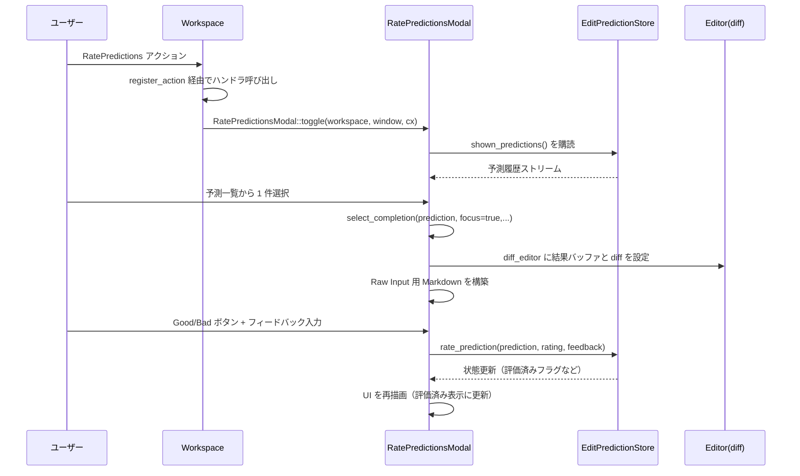

# crates/edit_prediction_ui ディレクトリ解説

## 1. ざっくり一言

`edit_prediction_ui` クレートは、Zed の「Edit Predictions（編集予測）」機能のための UI をまとめたモジュールです。ステータスバーのボタン、コンテキスト取得のデバッグビュー、予測の評価（Good/Bad）モーダル、プロバイダ設定メニューなどを提供します。

---

## 2. このモジュールの役割

### 2.1 概要

- このクレートは **AI による編集提案機能の UI レイヤ** を担当します。
- 具体的には、次のような機能を提供します。
  - ステータスバーの「Edit Prediction」ボタンと、そのコンテキストメニュー
  - 予測がどの文脈（関連ファイルやイベント）から生成されたかを見るデバッグビュー
  - 生成された編集提案を「良い/悪い」と評価し、フィードバックを送るモーダル

Zed 本体側の `EditPredictionStore` などのロジックと、ユーザー操作をつなぐ「橋渡し」をする位置づけです。

### 2.2 アーキテクチャ内での位置づけ

`edit_prediction_ui` 内の主要コンポーネントと、外部クレートとの関係を図示します。

```mermaid
graph TD
  WS[Workspace] -->|ステータスバー| EPB[EditPredictionButton]
  WS -->|モーダル| RPM[RatePredictionsModal]
  WS -->|右ペイン| EPCV[EditPredictionContextView]

  EPB --> ALS[AllLanguageSettings]
  EPB --> SET[SettingsStore]
  EPB --> EPS[EditPredictionStore]
  EPB --> FF[Feature Flags]

  RPM --> EPS
  RPM --> ED[Editor (diff/feedback)]
  EPCV --> EPS
  EPCV --> ED

  EPB --> AP[各種 AI Provider<br/>(Zed, Copilot, Codestral, Ollama, Mercury...)]
```

- `EditPredictionButton`  
  - ステータスバーに配置されるボタン兼メニュー。
  - `AllLanguageSettings` / `SettingsStore` / `EditPredictionStore` / 各種プロバイダ状態を参照し、表示内容やメニュー項目を切り替えます。
- `RatePredictionsModal`  
  - `EditPredictionStore` に記録された予測履歴を一覧表示し、選択中の予測の diff 表示・フィードバック送信を行います。
- `EditPredictionContextView`  
  - `EditPredictionStore` が発行するデバッグイベント（文脈取得開始/終了）を購読し、それぞれの run ごとに関連ファイルの抜粋をまとめて表示します。
- `edit_prediction_ui::init`  
  - アプリ起動時に呼ばれる想定の初期化関数で、Workspace にアクションやビューを登録します。

### 2.3 設計上のポイント

- **状態管理は gpui の Entity / Context ベース**
  - `EditPredictionButton`, `RatePredictionsModal`, `EditPredictionContextView` はいずれも gpui コンポーネントとして実装され、`Context` 経由でグローバルストアや他コンポーネントを監視します。
- **プロバイダ切り替えは設定ファイルベース**
  - `EditPredictionProvider`（Copilot / Zed / Codestral / Ollama / Mercury / OpenAI 互換 API 等）の切り替えは、`settings.json` 相当のファイルを `update_settings_file` で更新することで行います。
- **Feature Flag による機能ゲート**
  - 予測評価モーダルは `PredictEditsRatePredictionsFeatureFlag` を通じて有効化されます。
- **エラーハンドリングとアップセル**
  - API キー未設定や利用上限超過、サインインしていない場合などに応じて、ツールチップ・トースト・メニュー項目で状態や次のアクション（サインイン、課金ページ等）を案内します。
- **デバッグ用途のビューを分離**
  - 通常利用の UI（ボタン・モーダル）とは別に、`EditPredictionContextView` というデバッグ専用 Item を用意し、文脈取得処理の中身を確認できるようになっています。

---

## 3. 主要な機能一覧

- ステータスバーの Edit Prediction ボタンの表示と状態管理
- プロバイダごとのステータス表示（アイコン/インジケータ）とコンテキストメニュー
- 言語ごと / ファイルごとの「Edit Predictions の有効/無効」設定 UI
- Edit Predictions の表示モード（Eager / Subtle）切り替え UI
- トレーニングデータ収集（オープンソース限定）のオン/オフ UI
- 機密ファイルパス (`disabled_globs`) 設定をエディタで開くヘルパー
- Edit Prediction コンテキストビュー（関連ファイルや excerpt の一覧表示）
- 予測履歴の一覧表示と、個々の予測の diff プレビュー
- 予測に対する Good / Bad 評価とテキストフィードバック送信
- フィードバック用の補完 (`@malformed`, `@context` などの失敗モードタグ) 提供
- Edit Prediction 機能関連アクションの Command Palette 表示制御（AI 無効時・フラグ未有効時に非表示）

---

## 4. 関数・構造体の解説

### 4.1 型一覧（構造体・列挙体など）

| 名前 | 定義場所 | 種別 | 役割 / 用途 |
|------|----------|------|-------------|
| `EditPredictionButton` | `edit_prediction_button.rs` | 構造体 | ステータスバーに表示される「Edit Prediction」ボタン。プロバイダ状態に応じてアイコンやメニューを切り替える。 |
| `CopilotErrorToast` | `edit_prediction_button.rs` | 構造体 | Copilot 起動エラー時のトースト通知を一意に識別するための型タグ。 |
| `EditPredictionContextView` | `edit_prediction_context_view.rs` | 構造体 | コンテキスト取得 run ごとの関連ファイル・excerpt をまとめて表示するデバッグ用ビュー。 |
| `RetrievalRun` | `edit_prediction_context_view.rs` | 構造体（非公開） | コンテキスト取得の 1 回の実行（開始時刻・終了時刻・メタデータ・表示用 Editor）を表す。 |
| `RatePredictionsModal` | `rate_prediction_modal.rs` | 構造体 | Edit Prediction 履歴の一覧・選択・評価を行うモーダルビュー。 |
| `ActivePrediction` | `rate_prediction_modal.rs` | 構造体（非公開） | モーダル内で現在選択されている予測と、その diff / フィードバックエディタ / 入力 Markdown を束ねる。 |
| `RatePredictionView` | `rate_prediction_modal.rs` | 列挙体 | モーダルの右ペインの表示モード（Suggest Edits / Raw Input）を表す。 |
| `PredictEditsRatePredictionsFeatureFlag` | `rate_prediction_modal.rs` | 構造体 | フィーチャーフラグ。予測評価モーダル機能の ON/OFF を制御。 |
| `FeedbackCompletionProvider` | `rate_prediction_modal.rs` | 構造体 | フィードバックエディタ用の補完プロバイダ。`@malformed` などの失敗モード候補を提供。 |

その他、`RatePredictions`, `CaptureExample`, `OpenEditPredictionContextView` などのアクション型が `actions!` マクロで定義されています。

### 4.2 関数詳細（最大 7 件）

#### `init(cx: &mut App)`

**概要**

- アプリケーション起動時に呼ばれる想定の初期化関数です。
- Edit Prediction 関連のアクションを Command Palette に登録/制御し、各 Workspace に対してモーダルやコンテキストビューを開く処理を組み込みます。

**引数**

| 引数名 | 型 | 説明 |
|--------|----|------|
| `cx` | `&mut App` | gpui アプリケーションコンテキスト。グローバルなオブザーバや Workspace 生成時のフック登録に使用します。 |

**戻り値**

- なし。副作用として、グローバル状態と Workspace 初期化ロジックを設定します。

**内部処理の流れ**

1. `feature_gate_predict_edits_actions(cx)` を呼び出し、Edit Prediction 関連アクションの Command Palette 表示ロジックを設定します。
2. `cx.observe_new` で、今後生成されるすべての `Workspace` を監視します。
3. 各 Workspace に対して:
   - `RatePredictions` アクションを登録し、フラグ有効時に `RatePredictionsModal::toggle` を開くようにします。
   - `CaptureExample` アクションを登録し、`capture_example_as_markdown` を実行します。
   - `OpenEditPredictionContextView` アクションで右ペインに `EditPredictionContextView` を開く Action ハンドラを登録します。

**Examples（使用例）**

```rust
// アプリケーションのエントリポイントなど
fn main() {
    gpui::App::run(|cx| {
        // Edit Prediction UI を初期化する
        edit_prediction_ui::init(cx);

        // 他の機能の初期化 …（省略）
    });
}
```

**Errors / Panics**

- `init` 自体は `Result` を返さず、コード上で明示的な `unwrap` も行っていません。
- gpui の `observe_new` / `register_action` の使用は通常の前提が満たされていれば panic しない前提です。

**Edge cases（エッジケース）**

- AI がグローバル設定で無効化されている場合でも、`init` は呼ばれますが、`feature_gate_predict_edits_actions` 内で該当アクションは Command Palette から非表示になります。

**使用上の注意点**

- アプリケーションの起動時に **一度だけ** 呼び出す前提です。複数回呼ぶと、オブザーバやアクション登録が重複する可能性があります。
- この関数が呼ばれていないと、Workspace から Edit Prediction のモーダル・コンテキストビューを開くアクションが登録されません。

---

#### `EditPredictionButton::new(fs: Arc<dyn Fs>, user_store: Entity<UserStore>, popover_menu_handle: PopoverMenuHandle<ContextMenu>, project: Entity<Project>, cx: &mut Context<Self>) -> Self`

**概要**

- ステータスバーに表示する `EditPredictionButton` コンポーネントを生成します。
- Copilot や各種 AI プロバイダの初期化・トークンロード・設定ストアの監視などもここで開始します。

**引数**

| 引数名 | 型 | 説明 |
|--------|----|------|
| `fs` | `Arc<dyn Fs>` | 設定ファイルなどを読み書きするためのファイルシステム抽象。 |
| `user_store` | `Entity<UserStore>` | 現在のユーザー情報（サインイン状態、支払い状態など）を管理するストア。 |
| `popover_menu_handle` | `PopoverMenuHandle<ContextMenu>` | ボタンに紐づくポップオーバーメニューのハンドル。 |
| `project` | `Entity<Project>` | 現在のプロジェクト。EditPredictionStore との結びつけなどに利用。 |
| `cx` | `&mut Context<Self>` | このボタンコンポーネント自身の UI コンテキスト。 |

**戻り値**

- 初期化済みの `EditPredictionButton` インスタンス。

**内部処理の流れ**

1. `EditPredictionStore::try_global` からストアを取得し、必要なら Copilot を当該プロジェクト用に起動します。
2. Copilot ストア、および `SettingsStore` / `EditPredictionStore` を `cx.observe_global` で監視し、変更があれば `cx.notify()` で再描画をトリガします。
3. `edit_prediction::ollama::ensure_authenticated` 等により、Ollama / Mercury / OpenAI 互換 API 用の認証トークン読み込みタスクを起動し、完了後に UI 再描画を行います。
4. `CodestralEditPredictionDelegate::ensure_api_key_loaded(cx)` で Codestral 用 API キーの読み込みを開始します。
5. 初期状態（エディタ未接続・プロバイダ未設定）でフィールドを埋めて `Self` を返します。

**Examples（使用例）**

```rust
use std::sync::Arc;
use fs::Fs;
use gpui::Context;
use ui::ContextMenu;
use ui::PopoverMenuHandle;
use client::UserStore;
use project::Project;
use edit_prediction_ui::EditPredictionButton;

// ステータスバーの初期化時など
fn create_button(
    fs: Arc<dyn Fs>,                 // 既存の Fs 実装
    user_store: gpui::Entity<UserStore>,
    project: gpui::Entity<Project>,
    cx: &mut Context<EditPredictionButton>,
) -> EditPredictionButton {
    let handle = PopoverMenuHandle::<ContextMenu>::default(); // メニュー共有用ハンドル
    EditPredictionButton::new(fs, user_store, handle, project, cx)
}
```

**Errors / Panics**

- 非同期タスクの結果（API トークン読み込みなど）は `_ = futures::join!(...)` で無視しており、失敗しても panic にはつながりません。
- Copilot ストアが存在しない場合は `try_global` が `None` を返し、そのまま何もせず進むため、panic しません。

**Edge cases（エッジケース）**

- `EditPredictionStore` がまだグローバルに登録されていない場合、Copilot 関連の初期化はスキップされます。
- API トークンの読み込みに失敗しても、UI は表示されますが、後続の `render` で「Missing API key」等の状態が表示されます。

**使用上の注意点**

- `EditPredictionButton` は `StatusItemView` を実装しており、通常はステータスバーなどの「アクティブペインアイテム」に紐づけて使用します。単体で生成しただけでは Editor との連動は行われません。
- `fs` / `user_store` / `project` はアプリケーション側で一貫して管理されている必要があります。

---

#### `EditPredictionButton::build_language_settings_menu(&self, menu: ContextMenu, window: &Window, cx: &mut App) -> ContextMenu`

**概要**

- コンテキストメニューの中に、「どの範囲で Edit Predictions を表示するか」と「表示モード」「プライバシー関連設定」などをまとめたセクションを構築します。
- 1 バッファ / 言語 / 全ファイル単位の ON/OFF や、Eager/Subtle モードの切り替え、トレーニングデータ収集の設定などが含まれます。

**引数**

| 引数名 | 型 | 説明 |
|--------|----|------|
| `menu` | `ContextMenu` | 既存のメニュー。ここに項目を足していきます。 |
| `window` | `&Window` | 行高さやスタイル取得用に使用。 |
| `cx` | `&mut App` | グローバル設定取得・更新用コンテキスト。 |

**戻り値**

- 設定系の項目が追加された `ContextMenu`。

**内部処理の流れ（要約）**

1. 「Show Edit Predictions For」セクションを追加。
   - 現在の Editor があれば「This Buffer」のトグルを追加（バッファ単位の ON/OFF）。
   - 現在の言語が分かれば、その言語単位のトグルも追加。
   - グローバル設定としての「All Files」トグルも追加。
2. 「Display Modes」セクションで `EditPredictionsMode::Eager` / `Subtle` を切り替えるエントリを追加。
3. プロバイダが Zed の場合、トレーニングデータ収集設定（オープンソースかどうかなどに応じた説明付き）を追加。
4. 「Configure Excluded Files」ボタンで `open_disabled_globs_setting_in_editor` を呼び出し、設定ファイル内の `edit_predictions.disabled_globs` 編集位置を開くエントリを追加。
5. 「View Docs」でプライバシードキュメントの URL を開くエントリを追加。
6. 現在のファイルが除外対象の場合は「This file is excluded.」メッセージを追加。
7. Editor が存在する場合、「Predict Edit at Cursor」などのアクションを「Actions」セクションとして追加。

**Examples（使用例）**

通常は `EditPredictionButton` 内部からのみ呼び出されるため、直接利用する場面は想定されていません。カスタムメニューを拡張したい場合のイメージは以下の通りです。

```rust
// 既存の ContextMenu に Edit Prediction 用の表示設定を追加する例
fn extend_menu(
    button: &EditPredictionButton,
    base_menu: ui::ContextMenu,
    window: &gpui::Window,
    app: &mut gpui::App,
) -> ui::ContextMenu {
    button.build_language_settings_menu(base_menu, window, app)
}
```

**Errors / Panics**

- 設定取得・更新には `AllLanguageSettings::get_global` / `update_settings_file` などを使用していますが、コード上での `unwrap` はありません。
- Editor が存在しない場合は、その部分のメニュー項目がスキップされるだけで、panic にはなりません。

**Edge cases**

- 言語単位の設定が存在しない場合は、`LanguageSettings::resolve` がデフォルト値を返し、それを元にトグル状態が決まります。
- プロジェクトがオープンソースと判定できない場合、トレーニングデータ収集を有効にしても説明文上「No data captured.」と表示されます。

**使用上の注意点**

- この関数は UI 上の表示状態と `settings` ファイルを直接結びつけているため、設定スキーマを変更する場合は合わせて見直す必要があります。

---

#### `EditPredictionButton::build_edit_prediction_context_menu(&self, provider: EditPredictionProvider, window: &mut Window, cx: &mut Context<Self>) -> Entity<ContextMenu>`

**概要**

- Zed / Mercury / OpenAI 互換 API など、一般の Edit Prediction プロバイダ向けのコンテキストメニューを構築します。
- サインイン・利用制限・支払い状況などに応じて表示内容を切り替えます。

**引数**

| 引数名 | 型 | 説明 |
|--------|----|------|
| `provider` | `EditPredictionProvider` | 現在選択されているプロバイダ種別。 |
| `window` | `&mut Window` | メニュー構築・サブタスク起動に利用。 |
| `cx` | `&mut Context<Self>` | ボタン自身の UI コンテキスト。ストアやユーザー情報の参照に使用。 |

**戻り値**

- 構築された `ContextMenu` の `Entity`。

**内部処理の流れ（要約）**

1. サインインが必要かどうかを判定（Zed プロバイダかつユーザー未ログインの場合など）。
2. サインインが必要な場合：
   - アニメーション付きの簡単な説明を表示するカスタム行を追加。
   - 「Sign In & Start Using」「Learn More」エントリを追加。
3. すでにサインイン済みの場合：
   - Mercury で支払い上限に達している場合は注意メッセージを表示。
   - `provider.usage(cx)` から取得した使用量に応じて ProgressBar と残量を表示。
   - 上限超過時には「Subscribe to increase your limit」リンクを表示。
   - GitHub アカウントの年齢が短い / 未払いインボイスがある場合など、状況に応じたメッセージ・リンクを表示。
4. その後、`build_language_settings_menu` で共通の表示設定 UI を追加。
5. `add_provider_switching_section` で他のプロバイダへの切り替えメニューを追加。
6. スタッフアカウントの場合、`EditPredictionStore` の実験フラグを切り替えるためのサブメニュー「Experiment」を追加。
7. 最後に「Configure Providers」で設定画面の `edit_predictions.providers` にジャンプするエントリを追加。

**Examples（使用例）**

これも内部からのみ呼び出されるのが前提ですが、カスタムで使うなら次のようなイメージです。

```rust
// 既存の EditPredictionButton から特定プロバイダ用メニューを明示的に構築する例
let menu_entity = button.build_edit_prediction_context_menu(
    EditPredictionProvider::Zed,
    window,
    cx,
);
```

**Errors / Panics**

- `EditPredictionStore::try_global(cx)` が `None` の場合、実験メニューなど一部は単にスキップされます。
- `user_store` の状態が取得できないケースでも `None` として扱われ、メッセージが変わるだけで panic はしません。

**Edge cases**

- 使用量情報 (`usage`) が存在しない場合でも、アカウント年齢や請求状態に応じてメッセージが表示されます。
- スタッフ以外のユーザーでは実験メニューは表示されません。

**使用上の注意点**

- メニュー内容は `EditPredictionStore` / `UserStore` / プロバイダ種別に強く依存します。ストア側の仕様変更時はこの関数の表示ロジックも確認が必要です。

---

#### `EditPredictionContextView::handle_context_retrieval_finished(&mut self, info: ContextRetrievalFinishedDebugEvent, window: &mut Window, cx: &mut Context<Self>)`

**概要**

- `EditPredictionStore` からの「コンテキスト取得完了」デバッグイベントを処理し、関連ファイル・excerpt を MultiBuffer / Editor 上に反映します。
- 各 excerpt に `order` 情報付きのブロックを挿入して、取得順が分かるように表示します。

**引数**

| 引数名 | 型 | 説明 |
|--------|----|------|
| `info` | `ContextRetrievalFinishedDebugEvent` | 完了イベント。タイムスタンプやメタデータ、プロジェクト ID を含む。 |
| `window` | `&mut Window` | Editor 更新用。 |
| `cx` | `&mut Context<Self>` | ビュー自身の UI コンテキスト。 |

**戻り値**

- なし。ビュー内部の状態（`runs`）と関連 Editor を更新します。

**内部処理の流れ（要約）**

1. `runs` の末尾（直近の run）が存在しなければ何もせず終了。
2. 対象の run に `finished_at` と `metadata` を埋めます。
3. `EditPredictionStore` から `context_for_project_with_buffers(&self.project, cx)` を取得。
4. 非同期タスクを起動し、以下の処理を行います。
   - 各関連ファイルについて、excerpt の `order` と行範囲を取得。
   - `order` の最小値で `PathKey` を作り、`paths` ベクタに `(PathKey, buffer, ranges, orders, min_order)` を積む。
   - `min_order` で `paths` をソートし、表示順を決定。
   - MultiBuffer をクリアし、各 buffer の excerpt を `set_excerpts_for_path` で登録。
   - excerpt ごとにアンカーを求め、`order` とのペアを `excerpt_anchors_with_orders` に記録。
   - Editor に対し、各アンカーの上に「order: {order}」というラベル付きブロックを挿入。
   - Editor のカーソルを先頭に移動。
5. 完了後 `cx.notify()` でビューの再描画を依頼。

**Examples（使用例）**

直接呼ぶのではなく、`EditPredictionContextView::new` 内でデバッグイベントストリームから間接的に呼び出されます。

```rust
// handle_store_event 内での利用
match event {
    DebugEvent::ContextRetrievalFinished(info) => {
        if info.project_entity_id == self.project.entity_id() {
            self.handle_context_retrieval_finished(info, window, cx);
        }
    }
    _ => {}
}
```

**Errors / Panics**

- run が存在しない場合は早期 return します。
- excerpt や関連ファイルが 0 件の場合でも、MultiBuffer はクリアされるだけで panic はしません。

**Edge cases**

- excerpt が 1 つもない関連ファイルの場合、そのファイルは MultiBuffer に追加されない可能性があります（`ranges` が空のため）。
- `order` が一切設定されていない場合、`min_order` は `usize::MAX` となり、ソート上末尾に回ります。

**使用上の注意点**

- この関数を直接呼び出す必要は通常ありません。デバッグイベントの流れを変えたい場合は `EditPredictionStore` 側のイベント発行ロジックと合わせて確認する必要があります。

---

#### `RatePredictionsModal::toggle(workspace: &mut Workspace, window: &mut Window, cx: &mut Context<Workspace>)`

**概要**

- 現在の Workspace で、Edit Prediction 評価モーダルを開く / 閉じるトグル操作を行います。
- `EditPredictionStore` が存在する場合にのみモーダルを表示します。

**引数**

| 引数名 | 型 | 説明 |
|--------|----|------|
| `workspace` | `&mut Workspace` | モーダルを表示する対象の Workspace。 |
| `window` | `&mut Window` | モーダル表示のための Window。 |
| `cx` | `&mut Context<Workspace>` | Workspace 用 UI コンテキスト。 |

**戻り値**

- なし。モーダルの開閉は `workspace.toggle_modal` の副作用として行われます。

**内部処理の流れ**

1. `EditPredictionStore::try_global(cx)` でストアを取得できなければ何もせず終了。
2. ストアと `language_registry` をキャプチャし、`workspace.toggle_modal` を呼びます。
3. モーダル生成時は `RatePredictionsModal::new(ep_store, language_registry, window, cx)` を使ってインスタンスを作成します。
4. モーダルを開いたタイミングで telemetry イベント `"Rate Prediction Modal Open"` を送信します。

**Examples（使用例）**

```rust
// Workspace 内のアクションハンドラとしての利用例（実際のコードと同様）
workspace.register_action(|workspace, _: &RatePredictions, window, cx| {
    if cx.has_flag::<PredictEditsRatePredictionsFeatureFlag>() {
        RatePredictionsModal::toggle(workspace, window, cx);
    }
});
```

**Errors / Panics**

- `EditPredictionStore` が未登録の場合、モーダルは開かれませんが panic にはなりません。
- `language_registry` の取得は Workspace の AppState 経由で行われ、ここでも明示的な `unwrap` は使われていません。

**Edge cases**

- フィーチャーフラグが無効 (`PredictEditsRatePredictionsFeatureFlag` なし) の場合、呼び出し元のアクションハンドラ側で `toggle` 自体が呼ばれないようになっています。
- 評価対象の予測が 0 件の場合、モーダル左側のリストには「No completions yet...」メッセージが表示されます。

**使用上の注意点**

- `toggle` はモーダルを閉じる動作も兼ねるため、呼び出す前に自前で「開いているかどうか」を追跡する必要はありません。
- 呼び出しは **UI スレッド（Window コンテキスト）** 上で行う必要があります。

---

#### `RatePredictionsModal::select_completion(&mut self, prediction: Option<EditPrediction>, focus: bool, window: &mut Window, cx: &mut Context<Self>)`

**概要**

- モーダル内でアクティブな予測を切り替え、diff 表示用 Editor とフィードバックエディタ、Raw Input 用 Markdown を更新します。
- 既に選択されている予測を再度選択した場合は、フィードバックエディタへのフォーカスのみ行います。

**引数**

| 引数名 | 型 | 説明 |
|--------|----|------|
| `prediction` | `Option<EditPrediction>` | 新たに選択する予測。`None` の場合は選択を解除。 |
| `focus` | `bool` | true の場合、選択後にフィードバックエディタへフォーカスする。 |
| `window` | `&mut Window` | Editor 初期化やフォーカス制御に利用。 |
| `cx` | `&mut Context<Self>` | モーダル自身の UI コンテキスト。 |

**戻り値**

- なし。内部状態（`selected_index` / `active_prediction` / `diff_editor` 等）を更新します。

**内部処理の流れ（要約）**

1. `prediction` が `Some` の場合：
   - `ep_store.read(cx).shown_predictions()` から対応する ID を持つ予測を探し、`selected_index` をそのインデックスに更新（見つからない場合は元の `selected_index` を保持）。
   - 既に `active_prediction` として同じ ID が選択されている場合、`focus` が true ならフィードバックエディタにフォーカスして終了。
2. diff 表示の更新：
   - `prediction.edit_preview.build_result_buffer(cx)` で新しい結果バッファを生成。
   - `edit_preview.compute_visible_range(&prediction.edits)` で可視範囲を計算し、その前後 5 行を含めた範囲を excerpt として MultiBuffer にセット。
   - `BufferDiff` を作成し、旧テキストとの差分を非同期で計算、Editor に差分表示を追加。
   - カーソル位置情報がある場合、結果バッファ上のアンカーに `Inlay::edit_prediction` を挿入してカーソル位置を示す。
3. Raw Input 用 Markdown の組み立て：
   - `prediction.inputs.events` から diff 形式のイベントを Markdown で書き出し。
   - 関連ファイル (`related_files`) の excerpt をコードブロックとして追加。
   - カーソル excerpt を `<CURSOR>` マーカー付きで出力。
4. フィードバックエディタの生成：
   - `Editor::multi_line` で multi-line エディタを作成し、スクロールバーや補助 UI を無効化。
   - ソフトラップや placeholder、`FeedbackCompletionProvider` を設定。
5. `active_prediction` にこれらをまとめて保存し、必要に応じてフォーカス。
6. `prediction` が `None` の場合は `active_prediction = None` にする。
7. 最後に `cx.notify()` を呼ぶ。

**Examples（使用例）**

```rust
// モーダル内でクリックされた予測を選択するハンドラの一部（実際のコード）
.on_click(cx.listener(move |this, _, window, cx| {
    this.select_completion(Some(completion.clone()), true, window, cx);
}))
```

**Errors / Panics**

- `write!` / `writeln!` は `String` への書き込みであり、失敗しない前提で `unwrap` されています（標準ライブラリの仕様に依存）。
- `compute_visible_range` が `None` を返した場合は `0..0` 範囲が代わりに使われるため、panic はしません。

**Edge cases**

- `prediction.edits` が空の場合でも、結果バッファは作成され、Raw Input にはイベントやカーソル excerpt が表示されます（UI 上は「No edits produced.」と示されます）。
- `prediction.inputs.related_files` が `None` または空の場合、そのセクションは空になります。

**使用上の注意点**

- `select_completion` は UI と状態を一括で更新する「中心的な関数」です。予測の選択ロジックを変更したい場合、ここを起点に読むと全体像を把握しやすくなります。
- `focus` フラグを true にすると、ユーザーの入力フォーカスがフィードバックエディタに移る点に注意が必要です。

---

#### `capture_example_as_markdown(workspace: &mut Workspace, window: &mut Window, cx: &mut Context<Workspace>) -> Option<()>`

**概要**

- 現在アクティブな Editor の状態と Edit Prediction の履歴から ExampleSpec を生成し、それを Markdown として新規バッファ（またはファイル）に書き出します。
- ユーザーが自分で例を保存したり、他の場所に共有する用途を想定しています。

**引数**

| 引数名 | 型 | 説明 |
|--------|----|------|
| `workspace` | `&mut Workspace` | アクティブ Editor やプロジェクト、AppState へのアクセスに使用。 |
| `window` | `&mut Window` | 非同期タスクで新規 Editor を開くために使用。 |
| `cx` | `&mut Context<Workspace>` | Workspace の UI コンテキスト。 |

**戻り値**

- `Option<()>`。  
  - 途中で前提が満たせない場合（Editor がない、`EditPredictionStore` がない、ExampleSpec 生成に失敗など）は `None` を早期に返します。
  - 成功しても最後に `None` を返す（副作用だけを目的とした関数）ため、戻り値はほとんど使用されません。

**内部処理の流れ（要約）**

1. Markdown 言語オブジェクトの Future を取得。
2. アクティブ Editor を取得できなければ `None` を返す。
3. カーソル位置から対応する `buffer` と `cursor_anchor` を取得。
4. `EditPredictionStore::try_global(cx)` からストアを取得し、`edit_history_for_project` でイベント列を取得。
5. `capture_example(project.clone(), buffer, cursor_anchor, events, true, cx)` で ExampleSpec を生成する Future を得る。
6. 設定から `examples_dir` を取得。
7. 非同期タスクを `window` 上に spawn し、以下を実行：
   - Markdown 言語と ExampleSpec の Future を await。
   - `examples_dir` が設定されていればその下にファイルを作成し、なければ一時バッファをプロジェクト側で作成。
   - `example_spec.to_markdown()` をバッファに書き込み、言語を Markdown に設定。
   - 新しい Editor を作成し、アクティブペインに追加。
8. エラーは `detach_and_log_err` でログに残すのみで、呼び出し元には伝播しません。

**Examples（使用例）**

```rust
// Workspace に対するアクションとして登録する（実際のコードと同様）
workspace.register_action(|workspace, _: &CaptureExample, window, cx| {
    capture_example_as_markdown(workspace, window, cx);
});
```

**Errors / Panics**

- 失敗は基本的に `None` で表現され、panic は行われていません。
- 非同期タスク内の IO エラーなどは `detach_and_log_err` によりログ出力されます。

**Edge cases**

- `examples_dir` が設定されていない場合は、一時バッファとして Example を開きます（ファイルには保存されません）。
- アクティブ Editor からカーソル位置に対応する `buffer` / `cursor_anchor` が取得できない場合は何もせず終了します。

**使用上の注意点**

- 戻り値 `Option<()>` は主に「前提条件を満たさない場合に早期リターンする」ためだけに使われています。通常は戻り値を無視して問題ありません。
- ExampleSpec の生成ロジック自体は `edit_prediction` クレート側にあり、この関数はその結果を Markdown として開くだけです。

---

### 4.3 その他の関数

代表的な補助関数・メソッドを一覧します（詳細なアルゴリズム説明は省略）。

| 関数名 / メソッド名 | 定義場所 | 役割（1 行） |
|---------------------|----------|--------------|
| `EditPredictionButton::render` | `edit_prediction_button.rs` | 現在のプロバイダ・設定・ユーザー状態に応じてボタンアイコンとメニューを描画します。 |
| `EditPredictionButton::update_enabled` | 同上 | アクティブ Editor の言語・ファイルに基づき、予測の有効/無効・プロバイダなどの状態を更新します。 |
| `open_disabled_globs_setting_in_editor` | 同上（free 関数） | 設定ファイルを開き、`edit_predictions.disabled_globs` の中身を選択状態にします。 |
| `set_completion_provider` | 同上 | `settings` ファイルを更新して、全言語共通の Edit Prediction プロバイダを変更します。 |
| `get_available_providers` | 同上 | 認証状態や設定内容に基づいて、選択可能な `EditPredictionProvider` の一覧を返します。 |
| `toggle_show_edit_predictions_for_language` | 同上 | 特定言語に対する Edit Predictions の ON/OFF をトグルします。 |
| `toggle_edit_prediction_mode` | 同上 | `Eager` / `Subtle` など表示モードを切り替えます。 |
| `copilot_settings_url` | 同上 | Copilot Enterprise URI から設定ページの URL を構築します（末尾スラッシュの有無に対応）。 |
| `EditPredictionContextView::new` | `edit_prediction_context_view.rs` | デバッグイベントストリームを購読しつつ、空の run リストでビューを初期化します。 |
| `RatePredictionsModal::new` | `rate_prediction_modal.rs` | ストア購読や diff 用 Editor の初期設定を行い、モーダルを初期状態で作成します。 |
| `RatePredictionsModal::thumbs_up_active` / `thumbs_down_active` | 同上 | 現在の予測に評価とフィードバックを送信し、次の予測にフォーカスを進めます。 |
| `FeedbackCompletionProvider::completions` | 同上 | `@` で始まる単語に対して失敗モード候補の補完を返します。 |

---

## 5. データフロー

### 5.1 代表的な処理シナリオ

ここでは、ユーザーが Edit Prediction を評価するまでの流れを例に、データフローを説明します。

1. ユーザーがエディタで編集を行い、Edit Prediction 機能により編集提案が生成・記録されます（ロジックは `edit_prediction` クレート側）。
2. ユーザーが `RatePredictions` アクションを実行すると、`RatePredictionsModal` が開きます。
3. モーダルは `EditPredictionStore` から `shown_predictions()` を購読し、履歴一覧を左ペインに表示します。
4. ユーザーがリストから 1 件選択すると、右ペインに diff と入力コンテキストが表示されます。
5. ユーザーが Good/Bad ボタンを押すと、フィードバックテキストとともに `rate_prediction` が `EditPredictionStore` に送信されます。
6. ストアの状態更新を受けて、モーダルは一覧や評価済み状態を再描画します。

### 5.2 シーケンス図



このほか、`EditPredictionContextView` では `EditPredictionStore` からの `ContextRetrievalStarted/Finished` イベントを購読し、各 run の Editor に関連ファイルの excerpt を MultiBuffer 経由で流し込んでいます。

---

## 6. 使い方（How to Use）

### 6.1 基本的な使用方法

#### 1. アプリケーション初期化時に `init` を呼ぶ

```rust
use edit_prediction_ui;
use gpui::App;

// アプリケーションのエントリポイント
fn main() {
    App::run(|cx| {
        // Edit Prediction UI 全体を初期化する
        edit_prediction_ui::init(cx);

        // 他の機能の初期化 …（省略）
    });
}
```

- これにより、各 `Workspace` で以下が自動的に有効になります。
  - `RatePredictions` / `CaptureExample` / `OpenEditPredictionContextView` アクションの登録
  - フィーチャーフラグや AI 無効設定に応じた Command Palette 表示制御

#### 2. ステータスバーに `EditPredictionButton` を置く

`EditPredictionButton` 自体は `edit_prediction_ui` から公開されています。ステータスバー用コンポーネントの中で生成して利用します。

```rust
use std::sync::Arc;
use fs::Fs;
use client::UserStore;
use project::Project;
use ui::{ContextMenu, PopoverMenuHandle};
use edit_prediction_ui::EditPredictionButton;

// 例: ステータスバーアイテムの構築中
fn make_status_item(
    fs: Arc<dyn Fs>,                         // どこかで用意した Fs 実装
    user_store: gpui::Entity<UserStore>,     // グローバル UserStore
    project: gpui::Entity<Project>,          // 現在の Project
    cx: &mut gpui::Context<EditPredictionButton>,
) -> EditPredictionButton {
    let handle = PopoverMenuHandle::<ContextMenu>::default(); // メニュー共有用
    EditPredictionButton::new(fs, user_store, handle, project, cx)
}
```

- `StatusItemView` を実装しているため、Workspace 側でアクティブ Editor が変わると `set_active_pane_item` 経由でボタン状態が更新されます。

#### 3. コンテキストビューを開く

`OpenEditPredictionContextView` アクションは `init` 内で Workspace に登録されています。

```rust
use edit_prediction_ui::OpenEditPredictionContextView;
use gpui::Action;

// どこかの UI から明示的に開きたい場合の例
window.dispatch_action(OpenEditPredictionContextView.boxed_clone(), cx);
```

- 実装上は、右側ペインに `EditPredictionContextView` が分割表示されます。

### 6.2 よくある使用パターン

#### プロバイダをコードから切り替える

ユーザー操作ではなく、特定の条件でプロバイダを切り替えたい場合に `set_completion_provider` が使えます。

```rust
use std::sync::Arc;
use fs::Fs;
use language::language_settings::EditPredictionProvider;
use edit_prediction_ui::set_completion_provider;

fn force_use_ollama(fs: Arc<dyn Fs>, app: &mut gpui::App) {
    // すべての言語で Ollama を使用する設定を書き込む
    set_completion_provider(fs, app, EditPredictionProvider::Ollama);
}
```

#### 利用可能なプロバイダの一覧を得る

現在の環境（サインイン状態・API キー有無など）で何が使えるか知りたい場合は `get_available_providers` を利用します。

```rust
use language::language_settings::EditPredictionProvider;
use edit_prediction_ui::get_available_providers;

fn show_providers(app: &mut gpui::App) {
    let providers: Vec<EditPredictionProvider> = get_available_providers(app);
    // providers に Zed / Copilot / Codestral / Ollama / Mercury / OpenAI 互換 API など、
    // 利用可能なものだけが入っています。
}
```

#### 予測の例を Markdown として保存する

`CaptureExample` アクションを実行すると、`capture_example_as_markdown` が呼ばれます。

```rust
use edit_prediction_ui::CaptureExample;

// Command Palette やキーバインドから CaptureExample を実行すると、
// 現在のカーソル位置周辺の編集履歴から ExampleSpec が生成され、
// Markdown バッファとして開かれます。
```

### 6.3 よくある間違い

```rust
// 間違い例: init を呼ばずに RatePredictionsModal::toggle を直接呼ぶ
fn open_modal_directly(workspace: &mut Workspace, window: &mut Window, cx: &mut Context<Workspace>) {
    RatePredictionsModal::toggle(workspace, window, cx);
    // init が呼ばれていないと、EditPredictionStore がグローバルに
    // 登録されていなかったり、FeatureFlag が設定されていない場合があります。
}

// 正しい例: アプリ起動時に init を呼び、アクションから開く
fn main() {
    gpui::App::run(|cx| {
        edit_prediction_ui::init(cx); // これにより Workspace にアクションが登録される
    });
}
```

```rust
// 間違い例: AI が無効なのに RatePredictions アクションを Command Palette から出そうとする
CommandPaletteFilter::update_global(cx, |filter, _cx| {
    filter.show_action_types(&[TypeId::of::<RatePredictions>()]);
});

// 正しい例: feature_gate_predict_edits_actions に任せる
edit_prediction_ui::init(cx); // 内部でフィーチャーフラグと DisableAiSettings を考慮して制御される
```

### 6.4 使用上の注意点（まとめ）

- **AI 無効設定**  
  - `DisableAiSettings::get_global(cx).disable_ai` が true の場合、Edit Prediction 関連アクションは Command Palette から隠され、ステータスバーのボタンも `render` 側で非表示になります。
- **フィーチャーフラグ依存の機能**  
  - 予測評価モーダル（`RatePredictionsModal`）は `PredictEditsRatePredictionsFeatureFlag` が有効な場合のみ利用可能です。
- **グローバルストア依存**  
  - `EditPredictionStore` / `SettingsStore` / `UserStore` などが gpui のグローバルとして登録されている前提で動きます。これらが存在しないと一部機能は黙って何もしない形になります。
- **非同期タスク**  
  - トークン読み込みや diff 計算などは非同期で行われ、完了時に `cx.notify()` で UI が更新されます。呼び出し側で await する必要はありませんが、UI の変化がワンテンポ遅れることがあります。
- **設定ファイルのスキーマ変更**  
  - `set_completion_provider` や `toggle_show_edit_predictions_for_language` などは `settings` の構造に強く依存しているため、スキーマを変更する場合はこのクレートのコードと合わせて更新する必要があります。

---

## 7. 関連ファイル

このクレートと密接に関係する他クレート・ファイルをまとめます（パスは概念的なものも含みます）。

| パス / クレート | 役割 / 関係 |
|-----------------|------------|
| `edit_prediction` クレート | `EditPredictionStore`, `EditPrediction`, `capture_example`, コンテキスト取得・予測履歴・評価ロジックを提供。UI 側はこれを参照・更新します。 |
| `edit_prediction_types` クレート | `EditPredictionDelegateHandle` や `EditPredictionIconSet` など、プロバイダ抽象やアイコンセットを提供します。 |
| `editor` クレート | `Editor`, `MultiBuffer`, `Inlay` など、テキスト編集 UI を提供。diff 表示やフィードバック入力に使用されます。 |
| `language::language_settings` | `AllLanguageSettings`, `EditPredictionProvider`, 言語別設定やプロバイダ設定を提供し、ボタンやメニューの状態決定に利用されます。 |
| `workspace` クレート | `Workspace`, `Item`, `ModalView`, ステータスバーや右ペイン、モーダル管理などのコンテナ役。`edit_prediction_ui::init` から操作されます。 |
| `settings` クレート | `SettingsStore`, `update_settings_file`, 設定ファイルの読み書き。プロバイダ選択や表示モードなどを永続化します。 |
| `copilot`, `copilot_ui`, `copilot_chat` | GitHub Copilot 連携用。Copilot 状態の表示やサインイン/サインアウト、設定ページへのリンクなどに使用されます。 |
| `codestral`, `cloud_llm_client` | Codestral プロバイダ関連。API キーの読み込み・使用量表示などに関係します。 |
| `edit_prediction::ollama`, `edit_prediction::mercury`, `edit_prediction::open_ai_compatible` | Ollama/Mercury/OpenAI 互換 API の利用可否・トークン取得等を UI から参照します。 |
| `zeta_prompt` クレート | Raw Input 表示用 Markdown に書き出すイベントのフォーマットに使用されます。 |

これらのクレートを組み合わせることで、`edit_prediction_ui` は Edit Prediction 機能の UI 全体を構成しています。
