以下のチャンクに含まれている `editor` クレートのコードについて、ざっくり役割を整理します。

---

## このチャンクで見えている主なコンポーネント

### 1. クレート定義とベンチマーク

- **`editor/Cargo.toml`**
  - `editor` クレート本体の定義です。
  - ライブラリ本体は `src/editor.rs`（このチャンクでは未提供）にあります。
  - 多数のワークスペース内クレートに依存しており、エディタ本体（UI, LSP, Git, テーマ, 設定, ふたつの MultiBuffer など）を統合する中核クレートであると分かります。
  - `[[bench]]` によって
    - `benches/editor_render.rs`
    - `benches/display_map.rs`
    を Criterion ベンチマークとして登録しています。

- **`benches/display_map.rs`**
  - `display_map` における **タブ位置変換処理** のベンチマークです。
  - ランダム文字列から `MultiBuffer` を作成し、
    - `InlayMap` → `FoldMap` → `TabMap`
    というパイプラインでスナップショットを構築した上で、
    - `fold_point_to_tab_point`
    - `tab_point_to_fold_point`
    の性能を測っています。
  - エディタ内部で「折りたたみ・インレイ・タブ幅」が絡む座標変換が高頻度で行われることを前提にした計測です。

- **`benches/editor_render.rs`**
  - `Editor` の描画や入力処理のベンチマーク群です。
  - 主なシナリオ:
    - `editor_render`  
      - ランダムなテキスト（またはランダム構造の `MultiBuffer`）に対して、エディタビューの
        - レイアウト計算
        - prepaint
        - paint
        を繰り返し実行して、レンダリング時間を測定。
    - `open_editor_with_one_long_line`  
      - 非常に長い 1 行のバッファを開いた時のコスト測定。
    - `editor_input_with_1000_cursors`  
      - 1000 個のカーソルを持つ状態で
        - `handle_input("hello world", ...)`
        - `DeleteToPreviousWordStart` を複数回
        実行するマルチカーソル編集のベンチマーク。
  - `TestAppContext`・`SettingsStore::test`・`assets::Assets.load_test_fonts`・`theme_settings::init`・`editor::init` などを利用し、実際のアプリケーションに近いコンテキストで測定しています。

---

### 2. エディタ操作アクション定義

- **`src/actions.rs`**
  - `Editor` がサポートする **ほぼ全ての「アクション型」** を定義しています。
  - `#[derive(Action, Deserialize, JsonSchema, Default, PartialEq, Clone)]` などにより、
    - メニュー／キーバインドから呼び出せるアクション
    - 設定ファイルや RPC などからシリアライズ／デシリアライズ可能なアクション
    を一括定義する「データ構造カタログ」のようなモジュールです。
  - 代表例:
    - カーソル移動: `MoveToBeginningOfLine`, `MoveToEndOfLine`, `MoveToNextWordEnd`, `MovePageUp` など
    - 選択操作: `SelectToBeginningOfLine`, `SelectUpByLines`, `SplitSelectionIntoLines` など
    - 削除・編集: `DeleteToNextWordEnd`, `DeleteToPreviousSubwordStart`, `CutToEndOfLine`, `HandleInput(String)` など
    - コードアクション・補完系: `ToggleCodeActions`, `ConfirmCompletion`, `ConfirmCodeAction`, `InsertSnippet`, `FindAllReferences` など
    - Git / デバッグ / LSP / 表示切り替え: `ToggleGitBlameInline`, `ToggleDiagnostics`, `ToggleInlayHints`, `ToggleSemanticHighlights`, `RunFlycheck`, `ToggleBreakpoint` など
  - `actions!` マクロで
    - `editor::LineDown`
    - `editor::CopyFileLocation`
    - `go_to_line::ToggleGoToLine`
    - `debugger::RunToCursor`
    といった **名前空間付きアクション ID** をまとめて登録しています。
  - このファイルには実装ロジックはほぼなく、**「どの操作にどんなパラメータがあるか」だけを表現する層** です（実際の処理は `Editor` のメソッド群側）。

---

### 3. カーソル点滅制御

- **`src/blink_manager.rs`**
  - カーソルの **点滅状態** を管理する小さなステートマシンです。
  - 主なフィールド:
    - `blink_interval: Duration`  
      - 点滅周期。
    - `blink_epoch: usize`  
      - 非同期タスクの世代管理（古いタイマーからのコールバックを無視するため）。
    - `blinking_paused`, `visible`, `enabled`
  - 主なメソッド:
    - `new`:  
      - `SettingsStore` の変化を監視し、設定変更時に `blink_cursors` を呼び直します。
    - `pause_blinking`:
      - 入力中など、一時的に点滅を止める。一定時間後に `resume_cursor_blinking` を非同期タスクで呼び出し。
    - `blink_cursors`:
      - `blink_enabled_in_settings` の結果と `enabled`/`blinking_paused` を見て `visible` をトグルし、`cx.notify()` で再描画を促す。
      - 再度タイマーをセットして、一定周期で自身を再呼び出し。
    - `enable` / `disable` / `show_cursor` / `visible`
  - `Editor` からは「カーソルの表示／非表示フラグ」のソースとして利用される位置づけです。

---

### 4. 括弧のレインボーハイライト

- **`src/bracket_colorization.rs`**
  - いわゆる **Rainbow Brackets** 機能の実装です。
  - `Editor` に対する拡張メソッド `colorize_brackets(&mut self, invalidate: bool, cx: &mut Context<Editor>)` を提供し、
    - `tree-sitter` 由来の `fetch_bracket_ranges` で括弧ペアを取得
    - 深さごとに `accent` 色を割り当て
    - `HighlightKey::ColorizeBracket(accent_index)` でハイライトを設定
    を行います。
  - 仕組みのポイント:
    - **可視範囲の excerpt のみ** を対象とし、巨大ファイルでも全体を解析しない。
    - `bracket_fetched_tree_sitter_chunks: HashMap<Range<Anchor>, HashSet<Range<BufferRow>>>` で
      - どの tree-sitter チャンクを既に処理したかをキャッシュし、再解析を抑制。
    - `cx.background_spawn` で解析をバックグラウンド実行し、完了後に UI スレッドで `highlight_text_key` を更新。
    - テーマの `accents` と `ensure_minimum_contrast` を使い、背景に対して見やすい色に調整。
  - テストが非常に豊富で、以下のようなシナリオがカバーされています（すべて `bracket_colors_markup` でマークアップ化して検証）:
    - Rust/Markdown での基本的な色分け
    - マルチバッファ・excerpt 跨ぎの括弧ペア
    - 画面スクロールや折りたたみ (`FoldMap`) と組み合わせた場合の一貫性
    - 言語切り替え（Markdown → Rust）時の再色付け
    - テーマアクセント変更時の色更新
  - 実務で「括弧ハイライト」周りをいじる場合、このファイルが中心になります。

---

### 5. Clangd 拡張: ソース／ヘッダ切替

- **`src/clangd_ext.rs`**
  - C/C++ ファイルで、対応する **ヘッダ／ソースファイルを切り替えるアクション** の実装です。
  - `switch_source_header`:
    - 現在のエディタ状態から:
      - `project` / `workspace` を取得
      - カーソル位置周辺のバッファと言語サーバ（clangd）を特定 (`find_specific_language_server_in_selection`)
    - LSP 拡張プロトコル `LspExtSwitchSourceHeader` または `project.request_lsp` を通じて
      - 対応するファイルの URI/パスを取得
    - `workspace.open_abs_path` でそのファイルを開きます。
  - `apply_related_actions`:
    - カレントバッファのいずれかの言語が「C or C++」の場合のみ、UI に `switch_source_header` アクションを登録。
  - LSP との橋渡し役であり、C/C++ 向けのナビゲーション機能がここに集約されています。

---

### 6. コード補完のマッチ・ソートのテスト

- **`src/code_completion_tests.rs`**
  - 補完候補 (`Completion`) の **フィルタリング・ソートロジック** を検証するためのユニットテスト群です。
  - `CompletionBuilder` ヘルパで、`Completion` を簡単に構築:
    - `constant`, `function`, `method`, `variable`, `snippet` など
    - 内部では `CompletionItemKind`, `sort_text`, `filter_text` 付きの LSP `CompletionItem` を生成。
  - `filter_and_sort_matches`:
    - `fuzzy::match_strings` で `StringMatchCandidate` 群に対し非同期 fuzzy マッチ。
    - その結果を `CompletionsMenu::sort_string_matches` に渡して最終並び順を得る。
  - テスト内容:
    - 種類（変数・定数・関数）による優先度 (`test_sort_kind`)
    - fuzzy スコアと sort_text の優先関係 (`test_fuzzy_score`, `test_sort_text`, `test_sort_exact`)
    - スニペットの優先度設定 (`SnippetSortOrder`) の挙動 (`test_sort_snippet`)
    - 文字位置ベースのスコアリング（`test_sort_positions`, `test_fuzzy_over_sort_positions`）
    - semver をラベルに含む場合の「最新バージョン優先」ソート (`test_semver_label_sort_by_latest_version`)
  - 実際の UI 実装は `code_context_menus.rs` 内の `CompletionsMenu` ですが、そのロジックをこのテストが支えています。

---

### 7. コードコンテキストメニュー（補完／コードアクション）

- **`src/code_context_menus.rs`**
  - エディタの「コードコンテキストメニュー」周辺の UI/状態管理の中核モジュールです。
  - 上位 enum:
    - `CodeContextMenu`:
      - `Completions(CompletionsMenu)`
      - `CodeActions(CodeActionsMenu)`
      - 共通操作: `select_first/prev/next/last`, `visible`, `origin`, `render`, `render_aside`, `primary_scroll_handle` など。
  - `CompletionsMenu`
    - 役割:
      - 補完候補一覧の表示・選択・スクロール
      - 非同期 fuzzy フィルタリング
      - LSP からの詳細情報解決 (`resolve_completions`)
      - 右側に出るドキュメントペイン（Markdown）のキャッシュ管理
    - 主なフィールド:
      - `completions: Rc<RefCell<Box<[Completion]>>>`
      - `match_candidates: Arc<[(Option<Anchor>, Vec<StringMatchCandidate>)]>`  
        - `match_start` ごとに候補をグルーピング。
      - `entries: Rc<RefCell<Box<[StringMatch]>>>`  
        - フィルタ後の候補。
      - 非同期制御:
        - `filter_task: Task<()>`
        - `cancel_filter: Arc<AtomicBool>`
      - スクロール・ドキュメント:
        - `scroll_handle: UniformListScrollHandle`
        - `scroll_handle_aside: ScrollHandle`
      - Markdown キャッシュ:
        - `markdown_cache: VecDeque<(MarkdownCacheKey, Entity<Markdown>)>`
        - 近傍エントリのみ事前パースし、ちらつきを減らす。
    - 重要なメソッド:
      - `filter` / `do_async_filtering`  
        - 背景 executor 上で fuzzy マッチを行い、結果をメインスレッドに戻す。
      - `sort_string_matches`  
        - fuzzy スコア、スニペット種別、sort_text、kind などから最終的な優先度を決定。
      - `render`  
        - `uniform_list` + `ListItem` でメニュー描画。
        - 選択したエントリには `ConfirmCompletion { item_ix: Some(...) }` アクションを発火。
      - `render_aside`  
        - 選択中エントリの MultiLine Markdown / PlainText を右側に表示。
  - `CodeActionsMenu`
    - `CodeActionContents`（コードアクション + タスク + デバッグシナリオ）のリストを表示。
    - 選択中の項目に対して `ConfirmCodeAction { item_ix: Some(...) }` を発火。
    - ラベルが横幅で省略される場合、右側にフルテキストを表示する補助ポップオーバーを提供。
  - UI は `ui` クレートの `Popover`, `ListItem`, `uniform_list`, スクロールバー設定などと密接に結合しています。

---

### 8. Display Map の BlockMap（行外ブロックの挿入・変換）

- **`src/display_map/block_map.rs`**
  - このファイルは非常に大きく（約 4,400 行）、エディタの「表示行（wrap 行）」上に
    - カスタムブロック（診断メッセージ、レビューコメントなど）
    - 折りたたみ行（folded buffer header）
    - excerpt 境界・バッファヘッダー
    - diff ビューなどのためのスペーサ
    を **追加・変形するためのレイヤ** を提供しています。
  - 概要:
    - 元の `WrapSnapshot`（折り返し後の行情報）に対して、`SumTree<Transform>` を使って
      - 入力: `WrapRow`
      - 出力: `BlockRow`（ブロック挿入後の行）
      の対応を表現。
    - `BlockPlacement<Anchor>` で
      - `Above`, `Below`, `Near`, `Replace`（行を丸ごと置き換える）
      を指定可能。
    - `BlockMapWriter` で
      - カスタム block の挿入／リサイズ／削除
      - バッファヘッダーの折り畳み (`fold_buffers`, `unfold_buffers`)
      を行い、そのたびに `sync` で `SumTree` を更新。
    - `BlockMapReader` / `BlockSnapshot` で
      - 指定行レンジのテキスト (`chunks`)
      - `BlockRow` ↔ `WrapRow` の座標変換 (`to_block_point`, `to_wrap_point`, `clip_point`)
      - 特定の `BlockId` に対応する block 情報
      を取得可能。
    - diff ビューや二画面表示向けに `CompanionView` / `CompanionViewMut` を用いて
      - 「自分の BlockMap 変更」に対応する「相手側の Spacer block」を自動生成するロジックも含みます（`balancing_block`, `spacer_blocks`）。
  - テストでは
    - 基本的な block 挿入 (`test_basic_blocks`)
    - MultiBuffer でのヘッダー挙動 (`test_multibuffer_headers_and_footers`)
    - replace block の高さ変更・折り返しとの組み合わせ
    - diff 対応（LHS/RHS 変換）  
    など、多数のシナリオを検証しています。
  - このチャンクではファイル末尾まで全ては掲載されていませんが、見えている範囲から
    - **行変換のコアアルゴリズム**
    - `BlockMapWriter` / `BlockMapReader` の主要インターフェース
    が把握できます。

---

このチャンクだけでも、`editor` クレートのうち:

- **ユーザー操作（actions）**
- **描画・補完 UI（code_context_menus, bracket_colorization, block_map）**
- **ベンチマーク（display_map, editor_render）**
- **LSP 拡張（clangd_ext）**
- **補完ソートロジックのテスト（code_completion_tests）**

といった「エディタ体験の中核部分」がかなり含まれています。

後続のチャンクで `editor.rs` 本体や他の display_map / scroll / inlays 関連が出てくると、全体の構造がさらに明確になるはずです。

---

# editor/src/display_map ディレクトリ

## 0. ざっくり一言

エディタ内のテキストを「そのままのバッファ座標」から、「インレイ・コードフォールド・タブ展開・ソフトラップ・カスタムブロック・ハイライト」を反映した**表示座標**へ段階的に変換するレイヤ群と、その総合窓口である `DisplayMap` の実装です。

---

## 1. このモジュールの役割

### 1.1 概要

- このディレクトリは、`MultiBuffer` に入っているソースコードを、エディタに表示するための**表示用ビュー**に変換する役割を持ちます。
- 具体的には、次のような処理をレイヤごとに行います。
  - インレイ（ヒント / 予測）挿入 (`InlayMap`)
  - コードフォールド (`FoldMap`)
  - ハードタブのスペース展開 (`TabMap`)
  - ソフトラップ（見た目上の行折り返し） (`WrapMap`)
  - 診断等のカスタムブロック挿入 (`BlockMap`)
  - それらの結果に対するハイライト・座標変換 (`DisplayMap` / `DisplaySnapshot`)

### 1.2 アーキテクチャ内での位置づけ

`MultiBuffer` から `DisplaySnapshot` までのデータフローは、ほぼ一方向のパイプラインになっています。

```mermaid
graph TD
    MB[MultiBufferSnapshot<br>バッファ本体] --> I[InlayMap<br>InlaySnapshot]
    I --> F[FoldMap<br>FoldSnapshot]
    F --> T[TabMap<br>TabSnapshot]
    T --> W[WrapMap<br>WrapSnapshot]
    W --> B[BlockMap<br>BlockSnapshot]
    B --> D[DisplaySnapshot<br>表示スナップショット]

    subgraph Highlights & Invisibles
      H[テキスト/インレイ/セマンティック<br>ハイライト] --> D
      Inv[is_invisible / replacement<br>(invisibles.rs)] --> D
    end
```

`DisplayMap` 構造体は上記すべてを束ね、編集通知の購読・`sync` 呼び出し・スナップショット生成を行います。  
描画側は通常、`DisplayMap::snapshot()` で `DisplaySnapshot` を取得し、その API だけを使ってテキスト描画や座標変換を行います。

### 1.3 設計上のポイント

コードから読み取れる主な設計上の特徴は次の通りです。

- **レイヤごとのスナップショット設計**
  - `InlaySnapshot` / `FoldSnapshot` / `TabSnapshot` / `WrapSnapshot` など、各レイヤは「ある時点の状態」を表すスナップショット型を持ちます。
  - スナップショットは基本的にイミュータブルで、クローンしても内部は共有される前提です。
- **SumTree による変換の表現**
  - 各レイヤは `Transform` とその `TransformSummary` を `sum_tree::SumTree` で管理し、
    - 入力テキスト（下位レイヤ）に対する変換
    - 出力テキスト（上位レイヤ）での位置・長さ
    を効率的に計算できるようになっています。
- **座標空間の明確な分離**
  - バッファ座標 (`MultiBufferOffset` / `MultiBufferPoint`) のほか、
    - インレイ座標: `InlayOffset` / `InlayPoint`
    - フォールド座標: `FoldOffset` / `FoldPoint`
    - タブ展開後座標: `TabPoint`
    - ラップ後座標: `WrapRow` / `WrapPoint`
    - ブロック・表示座標: `BlockRow` / `DisplayRow` / `DisplayPoint`（定義はこのチャンク外）
  - というように層ごとに別の座標型を定義し、それぞれ変換関数を持ちます。
- **Bias による境界の挙動制御**
  - `Bias::Left` / `Bias::Right` を各種 `clip_point`・座標変換に渡し、
    - インレイ直前/直後
    - フォールド境界
    - タブ内部
  - など「境界上での揺らぎ」を決めています。
- **テストとランダムテスト**
  - ほぼすべてのレイヤに対し、集中的なユニットテストと乱択テスト（`test_random_*`）が用意され、内部の invariants (`check_invariants`) を検証しています。

---

## 2. 主要な機能一覧

このディレクトリが提供する主な機能を列挙します。

- インレイ関連
  - `InlayMap` / `InlaySnapshot`: バッファ上のインレイ（ヒント・編集予測など）を管理し、インレイ挿入後のテキストと座標変換を提供する。
- コードフォールド関連
  - `FoldMap` / `FoldSnapshot`: 折りたたみ範囲と折りたたみプレースホルダを管理し、フォールド後のテキストと座標変換を提供する（このチャンクには本体定義はありません）。
- タブ展開関連
  - `TabMap` / `TabSnapshot`: ハードタブを指定幅のスペース列に展開し、折りたたみ座標とタブ展開後座標の相互変換とチャンク走査を行う。
- ソフトラップ関連
  - `WrapMap` / `WrapSnapshot`: フォントと表示幅に基づいて行折り返しを決め、タブ展開後座標からラップ後座標への変換と、ラップ済みテキストのチャンク・行情報を提供する。
- カスタムブロック関連
  - `BlockMap` / `BlockSnapshot`: 診断や見出しなどのブロックをテキスト行の間に挿入 / 折りたたみし、ラップ後座標を最終的な表示座標に変換する（このチャンクには本体は登場しませんが、`DisplayMap` から利用されています）。
- 表示マップ総合制御
  - `DisplayMap` / `DisplaySnapshot`:
    - 上記すべてのレイヤを束ねて同期 (`sync_through_wrap`) し、
    - 折りたたみ / ブロック / インレイの追加削除、
    - ハイライト設定、
    - 各種座標変換（バッファ ↔ 表示）、
    - 描画用チャンクの列挙
    を提供する。
- インビジブル文字の扱い
  - `is_invisible` / `replacement`: 制御文字や一部の空白・非表示文字を検出し、可視化用の記号や固定幅スペースへの置き換えを定義する。
- ハイライト関連
  - `HighlightKey`, `HighlightStyles`, `HighlightedChunk` など:
    - テキスト・インレイ・セマンティックトークンのハイライトを統合し、
    - `highlighted_chunks` で描画に直接使える情報を提供する。

---

## 3. 公開 API と詳細解説

### 3.1 型一覧（構造体・列挙体など）

主要な公開型の概要です（このチャンクに定義が現れるものに限定しています）。

| 名前 | 種別 | モジュール | 役割 / 用途 |
|------|------|-----------|-------------|
| `InlayMap` | 構造体 | `inlay_map` | バッファ上の `Inlay` を管理し、`InlaySnapshot` を更新する可変レイヤ。 |
| `InlaySnapshot` | 構造体 | `inlay_map` | インレイ適用後テキストのスナップショット。座標変換・チャンク列挙を提供する。 |
| `InlayOffset` | newtype | `inlay_map` | インレイ適用後テキストのオフセット（`MultiBufferOffset` に対応）。 |
| `InlayPoint` | newtype | `inlay_map` | インレイ適用後の行・列座標。 |
| `InlayChunks` | イテレータ | `inlay_map` | 指定範囲のテキストを、インレイ挿入込みでチャンク単位に列挙する。 |
| `InlayBufferRows` | イテレータ | `inlay_map` | インレイ挿入後の行と元バッファ行の対応を列挙する。 |
| `TabMap` | 構造体 | `tab_map` | `FoldSnapshot` とタブ幅から `TabSnapshot` を構築・更新する可変レイヤ。 |
| `TabSnapshot` | 構造体 | `tab_map` | タブ展開後テキストのスナップショット。チャンク・行情報・座標変換を提供。 |
| `TabPoint` | newtype | `tab_map` | タブ展開後の行・列座標。 |
| `TabEdit` | 型エイリアス | `tab_map` | `text::Edit<TabPoint>`。タブ展開後座標での「無効化すべき範囲」。 |
| `TextSummary` | 構造体 | `tab_map` | 行数・1行目/最終行の文字数・最長行などを表す集約情報（タブ / ラップ用）。 |
| `TabChunks` | イテレータ | `tab_map` | タブ展開後テキストをチャンク列挙する。 |
| `WrapMap` | 構造体 | `wrap_map` | `TabSnapshot` からソフトラップ情報を計算する可変レイヤ。非同期再ラップも制御。 |
| `WrapSnapshot` | 構造体 | `wrap_map` | ソフトラップ適用後テキストのスナップショット。 |
| `WrapRow` | newtype | `wrap_map` | ラップ後の行番号。 |
| `WrapPoint` | newtype | `wrap_map` | ラップ後の行・列座標。 |
| `WrapChunks` | イテレータ | `wrap_map` | ラップ後のテキストをチャンク列挙する。 |
| `WrapRows` | イテレータ | `wrap_map` | ラップ後行と元バッファ行の対応を列挙する。 |
| `DisplayMap` | 構造体 | `display_map` | MultiBuffer 全体の表示状態（インレイ / フォールド / タブ / ラップ / ブロック / ハイライト）を統合的に管理する。 |
| `DisplaySnapshot` | 構造体 | `display_map` | 描画側が参照する最終的な表示スナップショット。 |
| `HighlightedChunk` | 構造体 | `display_map` | 1 行のテキストの一部（スタイル・タブ情報・インレイフラグ付き）。描画に直接利用。 |
| `HighlightKey` | enum | `display_map` | 各種ハイライトの識別キー（検索結果・選択範囲・ブレークポイントなど）。 |
| `HighlightStyles` | 構造体 | `display_map` | インレイヒントや編集予測用のスタイルセット。 |
| `EditPredictionStyles` | 構造体 | `display_map` | 編集予測インレイのスタイル（挿入文字用 / 空白用）。 |
| `is_invisible` | 関数 | `invisibles` | 「見えない」文字かどうかを判定する。 |
| `replacement` | 関数 | `invisibles` | 見えない文字に対する表示用の置換文字列を返す。 |

他にも多数の補助型（`Transform` / `TransformSummary` / `TabStopCursor` / `WrapPointCursor` など）が定義されていますが、基本的には各レイヤ内部の実装詳細です。

### 3.2 関数詳細（代表 7 件）

#### 1. `InlayMap::sync(&mut self, buffer_snapshot: MultiBufferSnapshot, buffer_edits: Vec<text::Edit<MultiBufferOffset>>) -> (InlaySnapshot, Vec<InlayEdit>)`

**概要**

- 下位レイヤ（`MultiBuffer`）で発生した編集を取り込み、インレイを再配置したうえで新しい `InlaySnapshot` を生成します。
- 返り値の `Vec<InlayEdit>` は「インレイ適用後テキスト内で、再計算・再描画が必要な範囲」です。

**引数**

| 引数名 | 型 | 説明 |
|--------|----|------|
| `buffer_snapshot` | `MultiBufferSnapshot` | 編集後のバッファスナップショット。 |
| `buffer_edits` | `Vec<Edit<MultiBufferOffset>>` | 旧スナップショットから `buffer_snapshot` までの変更範囲（バッファ座標）。空のときはメタデータの変化のみを扱う。 |

**戻り値**

- `(InlaySnapshot, Vec<InlayEdit>)`
  - 新しいインレイ適用後スナップショット。
  - インレイ座標 (`InlayOffset`) で表現された無効化範囲のリスト。

**内部処理の流れ（簡略）**

1. `buffer_edits` が空であっても、`trailing_excerpt` などのカウンタが変化していれば、末尾 0 長さ edit を追加して処理を進める。
2. `buffer_edits` が完全に空の場合は、
   - バッファの編集カウンタ・非テキスト状態更新カウンタの差分だけを見て、`snapshot.version` を増やすかどうか決め、
   - `snapshot.buffer` を更新して終了。
3. 1 件以上の編集がある場合は、
   - 旧 `snapshot.transforms` を `cursor` で走査しながら、新しい `SumTree<Transform>` を構築。
   - 各 `Edit<MultiBufferOffset>` について、
     - 編集範囲前の isomorphic 部分をそのままコピー。
     - 編集範囲に含まれる `Transform::Inlay` をすべて除去。
     - 新しいバッファテキストに基づいて isomorphic な `Transform` を再構築。
     - 旧の inlay 出力範囲 (`old_start..old_end`) と、新しい inlay 出力範囲 (`new_start..new_end`) を記録して `InlayEdit` として `Patch` に push。
   - 最後に残りのサフィックスをコピーし、空ならダミーの `Isomorphic(Default)` を 1 個追加。
4. `snapshot.transforms` と `snapshot.buffer` を新しいものに差し替え、`version` をインクリメントし、`check_invariants` で整合性を確認。

**Examples（使用例）**

```rust
// buffer: MultiBuffer のエンティティ（この例では既に存在しているとする）
let mut buffer_snapshot = buffer.read(cx).snapshot(cx);
// InlayMap の初期化
let (mut inlay_map, mut inlay_snapshot) = InlayMap::new(buffer_snapshot.clone());

// バッファを編集し、その差分を subscription から取得する
let subscription = buffer.update(cx, |buffer, _| buffer.subscribe());
buffer.update(cx, |buffer, cx| {
    buffer.edit([(MultiBufferOffset(0)..MultiBufferOffset(0), "/* header */\n")], None, cx);
});
buffer_snapshot = buffer.read(cx).snapshot(cx);
let buffer_edits = subscription.consume().into_inner();

// InlayMap に同期
let (new_inlay_snapshot, inlay_edits) =
    inlay_map.sync(buffer_snapshot, buffer_edits);

// new_inlay_snapshot には最新のインレイ適用後テキストが入り、
// inlay_edits は再描画すべき範囲を表す。
```

**Errors / Panics**

- コード上、明示的な panic はありませんが、`SumTree` の内部不変条件が崩れると `check_invariants` の `debug_assert!` などがテスト環境で失敗します。
- 与えた `buffer_edits` が実際の `buffer_snapshot` と整合しない場合の挙動は、コードからは明示されていません（ライフサイクル上、`MultiBuffer` からの通知をそのまま伝える前提です）。

**Edge cases**

- `buffer_edits` が空だが、`trailing_excerpt_update_count` だけが増えた場合にも `version` は更新されます。
- `self.inlays` 内の position が `is_valid(&buffer_snapshot)` でない（例: 編集によりアンカーが無効化された）ものは、`sync` 処理中にスキップされます。
- インレイのテキスト長が 0 の場合、その `Transform::Inlay` は summary 上は `output.len = 0` になり、事実上表示に影響しません。

**使用上の注意点**

- `buffer_snapshot` は常に `MultiBuffer` の最新状態から取得したものを渡す前提です。古いスナップショットと新しい `buffer_edits` を混在させると、内部の SumTree と不整合になります。
- `buffer_edits` は、`MultiBuffer::subscribe()` から得られる Edit 群をそのまま渡すのが想定された使い方です。
- テスト用の `randomly_mutate` と組み合わせる場合を除き、`InlayMap` の内部状態 (`self.inlays`) を直接操作することは想定されていません。

---

#### 2. `InlaySnapshot::buffer_offset_to_inlay_ranges(&self, range: Range<MultiBufferOffset>) -> impl Iterator<Item = Range<InlayOffset>>`

**概要**

- バッファオフセットの範囲を、「インレイテキストを除外した状態」での inlay 座標範囲列に変換します。
- つまり、「バッファに実在するテキストだけ」を辿るための inlay 側の区間列を返します。

**引数**

| 引数名 | 型 | 説明 |
|--------|----|------|
| `range` | `Range<MultiBufferOffset>` | バッファ座標で指定された範囲。 |

**戻り値**

- `Iterator<Item = Range<InlayOffset>>`
  - `range` に対応する inlay 側の範囲（1 個とは限らず、インレイが挟まると複数区間に分かれる）。

**内部処理の流れ（要約）**

1. `transforms.cursor::<Dimensions<MultiBufferOffset, InlayOffset>>()` を取得し、`range.start` に `seek`。
2. カーソルを進めながら、`Transform::Isomorphic` だけを対象として、
   - その transform のバッファ範囲（`seg_buffer_start..seg_buffer_end`）と `range` の重なりを計算。
   - 重なりがあれば、その部分を inlay オフセットに線形対応させて `InlayOffset` 範囲を計算。
3. `Transform::Inlay` はスキップすることで、「実際のバッファテキストのみ」をカバーする inlay 範囲を列挙。

**Examples（使用例）**

```rust
let inlay_snapshot: InlaySnapshot = /* どこかで取得 */;
let buffer_range = MultiBufferOffset(10)..MultiBufferOffset(30);

// バッファ範囲 10..30 に対応する「インレイ込みのテキスト上での、
// 実テキストだけの inlay 範囲」列を得る。
let inlay_ranges: Vec<_> = inlay_snapshot
    .buffer_offset_to_inlay_ranges(buffer_range)
    .collect();
```

この結果は `DisplaySnapshot::isomorphic_display_point_ranges_for_buffer_range` から利用されています。

**Edge cases**

- 範囲内にインレイだけがあり、実テキストが全く含まれない場合、その部分の inlay 範囲は返されません（size 0 範囲）。
- 範囲終端がテキスト末尾を超える場合、実際には `buffer.len()` までにクリップされます（`cmp::min`）。

**使用上の注意点**

- 戻り値の各 `Range<InlayOffset>` は、元のバッファ範囲と 1 対 1 対応していません。インレイによって分割されるため、複数要素をすべて処理する必要があります。
- 通常は、`DisplaySnapshot` 経由で間接的に利用する想定です。

---

#### 3. `TabMap::sync(&mut self, fold_snapshot: FoldSnapshot, fold_edits: Vec<FoldEdit>, tab_size: NonZeroU32) -> (TabSnapshot, Vec<TabEdit>)`

**概要**

- フォールドレイヤの変化（`FoldSnapshot` + `FoldEdit` 群）とタブ幅の変更を取り込み、タブ展開後の `TabSnapshot` を更新します。
- タブの表示幅はその列位置によって変化するため、編集範囲よりも広い影響範囲を `TabEdit` として返します。

**引数**

| 引数名 | 型 | 説明 |
|--------|----|------|
| `fold_snapshot` | `FoldSnapshot` | フォールド適用後テキストのスナップショット。 |
| `fold_edits` | `Vec<FoldEdit>` | フォールド座標での無効化範囲。 |
| `tab_size` | `NonZeroU32` | タブ幅（空白何桁分として扱うか）。内部では `MAX_TABS` でクリップされる。 |

**戻り値**

- `(TabSnapshot, Vec<TabEdit>)`
  - 新しいタブ展開スナップショット。
  - タブ展開座標での無効化範囲リスト。

**内部処理の流れ（要約）**

1. `tab_size` が前回と異なる場合
   - 既存の `TabSnapshot` 全体が影響を受けるので、全行を含む 1 つの `TabEdit` を返す。
2. `fold_snapshot.version` が変わっていれば `version` をインクリメント。
3. `fold_edits` が空の場合
   - スナップショットだけ差し替えて終了。
4. 各 `fold_edit` について、
   - 編集範囲の行末までを `fold_snapshot.chunks` で走査し、`chunk.tabs` ビットマップを使って次のタブ位置を見つける。
   - 編集によってタブの位置が変わることで、
     - タブが `max_expansion_column` の境界を越えたか、
     - あるいは元々 expand 対象だったか否か
     を比較し、「表示幅が変わりうるタブ」を編集範囲に含める。
   - この結果を使って `fold_edit.old.end`／`fold_edit.new.end` を前進させる。
5. オーバーラップする `fold_edit` をマージし、まとめて `TabEdit` に変換：
   - `fold_*` 座標を `fold_point_to_tab_point` で `TabPoint` に変換し、`TabEdit` を生成。

**Examples（使用例）**

```rust
let (_, inlay_snapshot) = InlayMap::new(buffer_snapshot);
let (mut fold_map, fold_snapshot) = FoldMap::new(inlay_snapshot);

// どこかで fold_map に編集が加わり、fold_edits を得たとする。
let (fold_snapshot, fold_edits) = fold_map.read(inlay_snapshot, vec![]);

let tab_size = NonZeroU32::new(4).unwrap();
let (mut tab_map, tab_snapshot) = TabMap::new(fold_snapshot, tab_size);

// fold_map の変化を tab_map に反映する
let (tab_snapshot, tab_edits) = tab_map.sync(fold_snapshot, fold_edits, tab_size);
```

**Edge cases**

- `fold_edits` が編集行の途中で終わっていても、その行の後続タブまで影響範囲が延長されます。
- タブが `max_expansion_column` より右にあり、編集前後とも「非展開」領域であれば、それ以降は早期終了します。

**使用上の注意点**

- `FoldEdit` は `FoldMap` から得たものをそのまま渡す前提です。手書きする場合は編集境界とタブの関係を理解しておく必要があります。
- `max_expansion_column` をテスト用に変更するメソッド（`set_max_expansion_column`）は `#[cfg(test)]` 付きであり、本番コードでは固定値を使います。

---

#### 4. `TabSnapshot::chunks(&self, range: Range<TabPoint>, language_aware: bool, highlights: Highlights<'a>) -> TabChunks<'a>`

**概要**

- タブ展開後座標の範囲を指定し、そのテキストをチャンクとして順に列挙します。
- チャンクには、もともとタブであった部分かどうか（`is_tab`）、文字・タブ・改行のビットマップなどが含まれます。

**引数**

| 引数名 | 型 | 説明 |
|--------|----|------|
| `range` | `Range<TabPoint>` | タブ展開後座標での範囲（開始・終了行/列）。 |
| `language_aware` | `bool` | 下位レイヤのハイライト取得を言語依存にするかどうか。 |
| `highlights` | `Highlights<'a>` | テキスト/インレイ/セマンティックのハイライト情報。 |

**戻り値**

- `TabChunks<'a>`（イテレータ）
  - 各 `Chunk` は `text: &str` のほか、`is_tab` / `chars` / `tabs` / `newlines` を持ちます。

**内部処理の流れ（簡略）**

1. `tab_point_to_fold_point(range.start, Bias::Left)` で入力開始位置をフォールド座標に変換し、
   - 「開始点がタブの途中なら、そこから次のタブストップまでのスペース数」を `to_next_stop` として求める。
2. 同様に `range.end` をフォールドオフセットに変換し、入力終端を決定。
3. `fold_snapshot.chunks(input_start..input_end, language_aware, highlights)` から `FoldChunks` を生成。
4. 出力の先頭は、`to_next_stop` 分のスペース文字列（`SPACES[..to_next_stop]`）をタブ展開チャンクとして返す。
5. 以降、`TabChunks::next()` で
   - 先頭チャンクのタブ 1 文字を消費して、その分のスペース列を新たなチャンクとして返す。
   - タブのない連続部分は元のチャンクをそのまま返し、`is_tab = false` とする。
   - 改行の位置・文字数をビットマップから計算して `column` / `input_column` / `output_position` を更新。

**Examples（使用例）**

```rust
let tab_snapshot: TabSnapshot = /* TabMap::new や sync から取得 */;
let range = TabPoint::zero()..tab_snapshot.max_point();

// タブ展開後の全テキストを 1 本の String にする
let text: String = tab_snapshot
    .chunks(range, false, Highlights::default())
    .map(|chunk| chunk.text)
    .collect();
```

**Edge cases**

- `range.start` がタブ展開中の途中列（1 タブの中の 2 文字目など）の場合、
  - そのタブの残り部分だけを `SPACES` から切り出して最初に返します。
- 出力範囲がタブ展開しきる前に終わる場合、
  - `to_next_stop` は `range.end.column - range.start.column` でクリップされます。

**使用上の注意点**

- `Chunk::text` の長さは最大 128 バイトであるという前提でビットマップを扱っています（テストで検証済み）。
- `TabChunks` の `Chunk` は参照を返すので、イテレータのライフタイムに注意します（`TabSnapshot` より短い必要があります）。

---

#### 5. `WrapMap::sync(&mut self, tab_snapshot: TabSnapshot, edits: Vec<TabEdit>, cx: &mut Context<Self>) -> (WrapSnapshot, WrapPatch)`

**概要**

- タブ展開後テキストの更新（`TabSnapshot` + `TabEdit`）を受けて、ソフトラップの状態を更新します。
- ラップ幅が設定されている場合、変更部分だけを再ラップし、背景タスクによる遅延再ラップも扱います。
- ラップ幅が `None` の場合は「ラップなし」として直線的な `WrapSnapshot` を構築します。

**引数**

| 引数名 | 型 | 説明 |
|--------|----|------|
| `tab_snapshot` | `TabSnapshot` | 最新のタブ展開スナップショット。 |
| `edits` | `Vec<TabEdit>` | タブ展開座標での無効化範囲。 |
| `cx` | `&mut Context<Self>` | `WrapMap` をホストする Entity の gpui コンテキスト。 |

**戻り値**

- `(WrapSnapshot, WrapPatch)`
  - 新しいラップ後スナップショット。
  - ラップ後行番号 (`WrapRow`) で表現された無効化パッチ。

**内部処理の流れ（要約）**

1. ラップ幅が `Some(..)` のとき
   - `(tab_snapshot, edits)` を `pending_edits` に積み、`flush_edits` を呼び出す。
   - `flush_edits` 内で、
     - すでに `WrapSnapshot` に反映済みの `tab_snapshot.version` までの edits をスキップ。
     - 1 行だけの小さな変更なら同期的に `update` を実行。
     - 大きな変更なら背景タスクで `update` を走らせ、その間は `interpolate` による近似処理を使う。
2. ラップ幅が `None` のとき
   - `WrapSnapshot::new(tab_snapshot)` でラップなしの Transform を作り直し、
   - 旧行数から新行数への `WrapEdit` を 1 つ返す（行数の変化のみ通知）。

**Examples（使用例）**

通常は `DisplayMap` 内部から呼ばれますが、テストでは直接利用されています。

```rust
let (wrap_map_entity, mut wrap_snapshot) =
    WrapMap::new(tab_snapshot, font, font_size, Some(px(400.0)), cx);

let edits: Vec<TabEdit> = vec![]; // ここでは編集無しとする
let (wrap_snapshot, wrap_patch) = wrap_map_entity.update(cx, |map, cx| {
    map.sync(tab_snapshot, edits, cx)
});
```

**Edge cases**

- 背景タスクが動作中（`background_task.is_some()`）の場合でも、`sync` は `interpolate` を使って暫定的な `WrapSnapshot` を返します。
- ラップ幅変更時（`set_wrap_width` 呼び出し）には `rewrap` が走り、既存の `pending_edits` や `interpolated_edits` は初期化されます。

**使用上の注意点**

- 通常は `DisplayMap` 経由で利用し、`WrapMap` を直接操作しないのが前提です。
- `WrapSnapshot` は内部で `check_invariants` を持っており、テストモードではソフトラップ結果の整合性をかなり厳密にチェックします。

---

#### 6. `WrapSnapshot::chunks(&self, rows: Range<WrapRow>, language_aware: bool, highlights: Highlights<'a>) -> WrapChunks<'a>`

**概要**

- ソフトラップ済みテキストの指定行範囲に対応するチャンク列を返します。
- 内部的には `TabSnapshot::chunks` を呼び、`Transform::wrap` による「疑似改行 + インデント」をテキストに挿入します。

**引数**

| 引数名 | 型 | 説明 |
|--------|----|------|
| `rows` | `Range<WrapRow>` | 取得したいラップ後行範囲。 |
| `language_aware` | `bool` | 下位レイヤのハイライトに言語情報を使うか。 |
| `highlights` | `Highlights<'a>` | ハイライト情報。 |

**戻り値**

- `WrapChunks<'a>`（イテレータ）
  - 各 `Chunk` はタブ展開後チャンクを元にしつつ、ソフトラップ由来の `'\n'` やインデントを含む場合があります。

**内部処理の流れ（簡略）**

1. `Transforms<WrapPoint, TabPoint>` のカーソルを `rows.start` に `seek` し、
   - その位置に対応する `TabPoint` の開始行を計算。
2. 指定範囲終端のラップ位置 `output_end` を `to_tab_point` で `TabPoint` 終了位置に変換。
3. `TabSnapshot::chunks(input_start..input_end, language_aware, highlights)` から `input_chunks` を取得。
4. `WrapChunks::next()` で、
   - `display_text` を持つ `Transform::wrap` の場合は、用意された `WRAP_TEXT`（`\n` + 空白列）をチャンクとして返す。
   - isomorphic 変換の場合は、`input_chunk.text` を文字単位で区切りながら、`Transform` 境界でカーソルを進める。
   - 出力位置 `output_position` を更新し、指定範囲外に出たら終了。

**Examples（使用例）**

```rust
let wrap_snapshot: WrapSnapshot = /* WrapMap::sync から取得 */;
let start = WrapRow(0);
let end = wrap_snapshot.max_point().row() + WrapRow(1);

let text: String = wrap_snapshot
    .chunks(start..end, false, Highlights::default())
    .map(|chunk| chunk.text)
    .collect();
```

**Edge cases**

- `rows` が 0 行（`start == end`）の場合、何も返しません。
- 範囲がファイル末尾を超える場合、内部で `max_point()` までにクリップされます。

**使用上の注意点**

- `WrapSnapshot::text()`（テスト用）も内部でこの `chunks` を使っており、実装の基盤になっています。
- 上位レイヤ（`BlockMap`）は `WrapSnapshot` 側では意識されません。ブロック挿入はさらに上のレイヤで行われます。

---

#### 7. `DisplaySnapshot::highlighted_chunks(&self, display_rows: Range<DisplayRow>, language_aware: bool, editor_style: &EditorStyle) -> impl Iterator<Item = HighlightedChunk<'a>>`

**概要**

- 指定された表示行範囲について、描画に必要なすべての情報（テキスト / スタイル / タブ / インレイ / 置換文字など）を持つ `HighlightedChunk` の列を返します。
- ここで、ツリーシッターのシンタックスハイライト・セマンティックトークン・テキスト/インレイハイライト・診断ハイライト・インビジブル文字の可視化が統合されます。

**引数**

| 引数名 | 型 | 説明 |
|--------|----|------|
| `display_rows` | `Range<DisplayRow>` | 表示行範囲。 |
| `language_aware` | `bool` | 下位レイヤに言語情報を使うか。通常 `true`。 |
| `editor_style` | `&EditorStyle` | エディタ全体のスタイル設定（フォント・色・下線設定など）。 |

**戻り値**

- `Iterator<Item = HighlightedChunk<'a>>`
  - `text: &str` に加え、`style: Option<HighlightStyle>`、`is_tab`、`is_inlay`、`replacement` を含む。

**内部処理の流れ（要約）**

1. `self.chunks(display_rows, language_aware, HighlightStyles { .. })` を呼び、
   - `BlockMap` → `WrapMap` → `TabMap` → `FoldMap` → `InlayMap` → `MultiBuffer` のチャンク列挙を行う。
2. 各チャンクについて、
   - シンタックスハイライト: `chunk.syntax_highlight_id` を `EditorStyle` のテーマから引く。
   - テキストハイライト: `chunk.highlight_style`。
   - 診断ハイライト: `chunk.diagnostic_severity` と `is_unnecessary` から下線やフェードを生成。
   - これらを `HighlightStyle::highlight` で合成し、最終 `style` を決定。
3. `HighlightedChunk { text, style, is_tab, is_inlay, replacement: renderer }` を作成し、
   - `highlight_invisibles(editor_style)` を通してインビジブル文字の可視化：
     - `invisibles::is_invisible` で検出。
     - `replacement` 関数で表示文字（C0 コントロール記号など）を決め、
     - 背景色＋下線付きのスタイルを重ねる。

**Examples（使用例）**

```rust
let snapshot: DisplaySnapshot = display_map.snapshot(cx);

let row = DisplayRow(10);
let chunks = snapshot.highlighted_chunks(
    row..row.next_row(),
    true,
    &editor_style,
);

// 実際の描画ループ例（擬似コード）
for chunk in chunks {
    let text_to_draw = if let Some(ChunkReplacement::Str(repl)) = &chunk.replacement {
        &**repl
    } else {
        chunk.text
    };
    // chunk.style や chunk.is_tab, chunk.is_inlay を見て描画する
}
```

**Edge cases**

- 行末の `'\n'` は `layout_row` 内で取り除かれます（レイアウト用テキストからは除外）。
- インビジブル文字が置換される場合、
  - `text` と `replacement` の長さが異なる可能性があるため、描画側は `replacement` を優先して表示し、一方でカーソル位置は元のテキスト長に基づいて計算する設計になっています。

**使用上の注意点**

- `editor_style.show_underlines` が `false` の場合、診断やハイライト下線は描画されません。
- 透過色のインレイ（例: カラーピッカー）では、背景色とブレンドして見やすくしています（`color.is_opaque()` 判定）。

---

### 3.3 その他の関数（抜粋）

補助的だが、利用頻度の高い関数を一覧で示します。

| 関数名 | 所属 | 役割（1 行） |
|--------|------|--------------|
| `InlaySnapshot::to_point` / `to_offset` | `inlay_map` | InlayOffset ↔ InlayPoint の相互変換。 |
| `InlaySnapshot::to_buffer_point` / `to_buffer_offset` | `inlay_map` | インレイ座標から元バッファ座標への変換。 |
| `InlaySnapshot::clip_point` | `inlay_map` | インレイ座標を有効な位置にクリップ（インレイ境界の Bias を考慮）。 |
| `TabSnapshot::line_len` | `tab_map` | タブ展開後の 1 行の表示幅（列数）を取得。 |
| `TabSnapshot::point_to_tab_point` / `tab_point_to_point` | `tab_map` | バッファ座標 ↔ タブ展開後座標の変換。 |
| `WrapSnapshot::line_len` | `wrap_map` | ソフトラップ後の 1 行の幅を取得。 |
| `WrapSnapshot::soft_wrap_indent` | `wrap_map` | ソフトラップ行に追加されるインデント幅（スペース数）を取得。 |
| `DisplaySnapshot::point_to_display_point` | `display_map` | バッファ座標 (`MultiBufferPoint`) を表示座標に変換。 |
| `DisplaySnapshot::display_point_to_point` | `display_map` | 表示座標をバッファ座標に変換（Bias を考慮）。 |
| `DisplaySnapshot::row_infos` | `display_map` | 表示行から対応する `RowInfo` 列（バッファ行・差分情報など）を取得。 |

---

## 4. データフロー

ここでは、**「DisplaySnapshot から描画用テキストチャンクを取得する」**典型的なシナリオの流れを示します。

### 処理の要点（テキスト）

1. UI 側は `DisplayMap::snapshot()` を呼び出して `DisplaySnapshot` を取得します。
   - 内部で `sync_through_wrap()` が呼ばれ、
     - `MultiBuffer` から編集通知 (`BufferSubscription`) を消費。
     - `InlayMap::sync` → `FoldMap::read` → `TabMap::sync` → `WrapMap::sync` という順で各レイヤを更新。
     - 最後に `BlockMap::read` でブロックレイヤを適用し、`BlockSnapshot` を得ます。
2. 描画側は `DisplaySnapshot::highlighted_chunks(display_rows, ..)` を呼び、
   - `BlockSnapshot::chunks` → `WrapSnapshot::chunks` → `TabSnapshot::chunks` → `FoldSnapshot::chunks` → `InlaySnapshot::chunks` → `MultiBufferSnapshot` という順でテキストをチャンク列挙します。
   - その途中で、ハイライト・インビジブル文字の置換・診断強調を反映させた `HighlightedChunk` を生成します。

### シーケンス図（Mermaid）

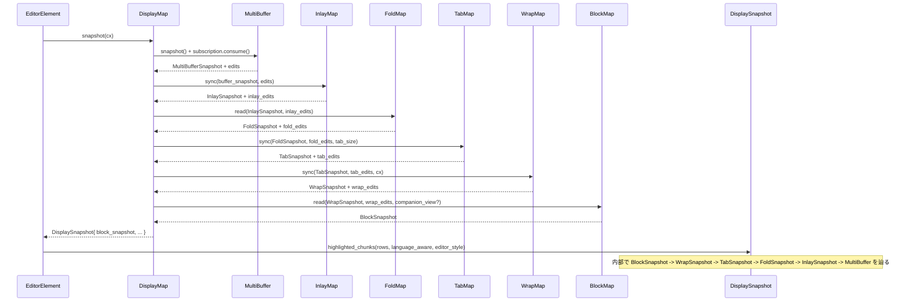

---

## 5. 使い方（How to Use）

### 5.1 基本的な使用方法

通常の利用者（エディタの描画コード）は、`DisplayMap` と `DisplaySnapshot` だけを意識すれば十分です。

```rust
use crate::{
    MultiBuffer,
    display_map::{DisplayMap, FoldPlaceholder},
};
use gpui::{Font, Pixels};

// 初期化フェーズ
let buffer: Entity<MultiBuffer> = /* 既存の MultiBuffer エンティティ */;
let font: Font = /* 使用フォント */;
let font_size: Pixels = /* フォントサイズ */;
let wrap_width: Option<Pixels> = Some(px(800.0)); // 例: ビュー幅に応じた値
let buffer_header_height = 0;
let excerpt_header_height = 0;
let fold_placeholder = FoldPlaceholder::default();
let diagnostics_max_severity = DiagnosticSeverity::Error;

let mut display_map = cx.new(|cx| {
    DisplayMap::new(
        buffer.clone(),
        font,
        font_size,
        wrap_width,
        buffer_header_height,
        excerpt_header_height,
        fold_placeholder,
        diagnostics_max_severity,
        cx,
    )
});

// 描画ループごとにスナップショットを取得
let snapshot = display_map.update(cx, |dm, cx| dm.snapshot(cx));

// ある行をレイアウトして描画
let row = DisplayRow(0);
let layout = snapshot.layout_row(row, &text_layout_details);
let chunks = snapshot.highlighted_chunks(row..row.next_row(), true, &editor_style);
// chunks を走査してテキスト・装飾を描画する
```

ポイント:

- `DisplayMap::snapshot` を呼ぶだけで、内部の `InlayMap` / `FoldMap` / `TabMap` / `WrapMap` / `BlockMap` が最新の `MultiBuffer` 状態に同期されます。
- 描画側は `DisplaySnapshot` を通じて座標変換・テキスト取得を行います。

### 5.2 よくある使用パターン

#### ソフトラップのオン・オフ切り替え

```rust
// wrap_width を None にするとラップ無し表示になる
display_map.update(cx, |dm, cx| {
    dm.set_wrap_width(None, cx);
});

// wrap_width を設定するとその幅でラップが有効になる
display_map.update(cx, |dm, cx| {
    dm.set_wrap_width(Some(px(600.0)), cx);
});
```

#### 位置変換（クリック位置 → バッファ座標）

```rust
// 画面上のクリック位置 (row, x) からバッファ座標を求める例
let display_row = DisplayRow(clicked_row);
let display_column = snapshot.display_column_for_x(display_row, clicked_x, &text_layout_details);
let display_point = DisplayPoint::new(display_row, display_column);

// Bias::Left / Bias::Right は境界上の揺らぎを制御
let buffer_point = snapshot.display_point_to_point(display_point, Bias::Left);
```

#### フォールドの挿入・解除

```rust
// ある範囲を折りたたむ（Crease は MultiBufferAnchor の範囲）
let creases = vec![
    Crease::simple(
        buffer_anchor_start..buffer_anchor_end,
        fold_placeholder.clone(),
    )
];
display_map.update(cx, |dm, cx| {
    dm.fold(creases, cx);
});

// 範囲と交差するフォールドを解除
display_map.update(cx, |dm, cx| {
    dm.unfold_intersecting(
        [buffer_anchor_start..buffer_anchor_end],
        true, // inclusive
        cx,
    );
});
```

#### インレイのスプライス

```rust
display_map.update(cx, |dm, cx| {
    // 既存インレイをすべて削除し、新しいインレイを挿入する例
    let current_ids: Vec<_> = dm.current_inlays().map(|i| i.id).collect();
    let new_inlays: Vec<Inlay> = /* 作成 */;
    dm.splice_inlays(&current_ids, new_inlays, cx);
});
```

### 5.3 よくある間違い

```rust
// 間違い例: バッファ編集後に InlayMap だけを直接 sync している
let (inlay_snapshot, _) = inlay_map.sync(buffer_snapshot, buffer_edits);
// FoldMap / TabMap / WrapMap / BlockMap が古いままになる

// 正しい例: DisplayMap 経由で snapshot を取得する。
// 内部で全レイヤが順番に sync される。
let display_snapshot = display_map.update(cx, |dm, cx| dm.snapshot(cx));
```

```rust
// 間違い例: DisplayRow / DisplayPoint を直接 MultiBufferRow と混同する
let buffer_row = MultiBufferRow(display_row.0); // 表示行番号をそのまま使ってしまう

// 正しい例: DisplaySnapshot の座標変換を使う
let display_point = DisplayPoint::new(display_row, 0);
let buffer_point = snapshot.display_point_to_point(display_point, Bias::Left);
let buffer_row = MultiBufferRow(buffer_point.row);
```

### 5.4 使用上の注意点（まとめ）

- **座標型を混同しない**
  - `MultiBufferPoint` / `InlayPoint` / `FoldPoint` / `TabPoint` / `WrapPoint` / `BlockPoint` / `DisplayPoint` はそれぞれ別の空間を表します。変換関数を経由することが前提です。
- **Bias の扱い**
  - 境界上（例: インレイの直前/直後、タブ内部の途中）でのクリップや座標変換では `Bias` によって結果が変わるため、クリック処理などでは一貫したバイアスを使用する必要があります。
- **ランダムテスト用関数の扱い**
  - `randomly_mutate` などの関数は `#[cfg(test)]` でのみ有効であり、本番コードでの使用は想定されていません。
- **タブ・ラップのパフォーマンス**
  - タブ展開は `max_expansion_column` で頭打ちにし、ソフトラップは大きな変更時に背景タスクで再計算するなど、パフォーマンスを意識した設計になっています。  
    直接 `TabSnapshot::expand_tabs` / `collapse_tabs` などを頻繁に呼ぶとコストが高くなる場合があります。
- **インビジブル文字のハイライト**
  - `is_invisible` / `replacement` の判定により、通常の空白と区別しにくい空白や制御文字が可視化されます。フォントによってはグリフの表示が変わるため、スタイルとの組み合わせに注意が必要です。

---

## 6. 変更の仕方（How to Modify）

### 6.1 新しい機能を追加する場合

#### 例: 新しい表示レイヤを追加したい場合

1. **レイヤ専用モジュールを作成**
   - `editor/src/display_map/new_layer_map.rs` のようなファイルを追加し、
   - 既存レイヤと同様に
     - `Transform`（enum か struct）
     - `TransformSummary`（`input: TextSummary` / `output: TextSummary`）
     - `Snapshot` 型
     - `Map` 型（`sync` / `chunks` / `row_infos`）
     を定義します。

2. **座標型の導入**
   - 必要に応じて新しい座標型（例: `NewLayerPoint`）を定義し、`sum_tree::Dimension` / `SeekTarget` の実装を追加します。

3. **display_map.rs への組み込み**
   - `mod new_layer_map;` を追加し、`DisplayMap` のフィールドに新レイヤを追加。
   - `DisplayMap::new` と `sync_through_wrap` 内に、新レイヤの `new` / `sync` 呼び出しを挿入します。
   - `DisplaySnapshot` にも対応する accessor（例: `new_layer_snapshot()`）を追加します。

4. **テスト**
   - 既存レイヤを参考に、単体テスト・ランダムテスト・`check_invariants` 的な検証ロジックを追加します。

### 6.2 既存の機能を変更する場合

- **Tab 展開の挙動を変えたいとき**
  - `TabSnapshot::expand_tabs` / `collapse_tabs` と、それを利用する `TabMap::sync` / `TabSnapshot::fold_point_to_tab_point` / `tab_point_to_fold_point` を中心に読む必要があります。
  - 変更後は、`tab_map.rs` のランダムテスト（`test_collapse_tabs_random` など）が通ることを確認します。

- **インビジブル文字の扱いを変えたいとき**
  - `invisibles.rs` の `FORMAT` / `OTHER` / `PRESERVE` テーブルと `is_invisible` / `replacement` の条件を更新します。
  - `DisplaySnapshot::highlighted_chunks` → `HighlightedChunk::highlight_invisibles` が利用箇所です。

- **ソフトラップ戦略を変えたいとき**
  - `WrapSnapshot::update`（非同期再ラップ）と `flush_edits` / `interpolate` のロジックに影響します。
  - 背景タスクと `pending_edits` の処理順序が変わると、再描画タイミングに影響するため注意が必要です。

- **ハイライトの優先順位を変えたいとき**
  - `HighlightKey` の並び順が優先度に影響する（コメントに明記）ので、順序を変更する場合は意図を確認します。
  - `DisplaySnapshot::highlighted_chunks` 内でのスタイル合成順も確認します。

---

## 7. 関連ファイル

このディレクトリ外で、ここに定義されたレイヤと密接に関わるファイルの例です。

| パス | 役割 / 関係 |
|------|------------|
| `editor/src/editor.rs` など | `DisplayMap` / `DisplaySnapshot` を利用してエディタの描画と入力処理を行う（このチャンクには登場しませんが、利用側として想定されます）。 |
| `editor/src/inlays.rs` | `Inlay` / `InlayContent` の定義。`InlayMap` が保持するインレイ実体。 |
| `multi_buffer/src/lib.rs` | `MultiBuffer`, `MultiBufferSnapshot`, `MultiBufferOffset`, `MultiBufferPoint` など、元テキストのデータ構造と座標型。 |
| `language/src/lib.rs` | `Point`, `Chunk`, `TextSummary` などのテキスト表現・要約情報。 |
| `sum_tree` クレート | `SumTree`, `Cursor`, `Dimensions`, `ContextLessSummary` など、変換レイヤの中核となる木構造。 |
| `theme` / `ui` 関連モジュール | `EditorStyle`, `HighlightStyle`, `LineLayout`, inlay のカスタムレンダリング等を提供し、`DisplaySnapshot::layout_row` や inlay の `ChunkRenderer` で利用。 |

このディレクトリ自体にも、ここで説明していない `block_map.rs` / `crease_map.rs` / `custom_highlights.rs` などが含まれます。これらはそれぞれ:

- `block_map.rs`: カスタムブロック（診断・見出しなど）の表示・折りたたみと、`BlockSnapshot` / `BlockRows` / `BlockChunks` を提供。
- `crease_map.rs`: 折りたたみ候補（クリーズ）を管理し、`DisplayMap::fold` などから利用。
- `custom_highlights.rs`: text / semantic token ハイライトを統合・提供する補助レイヤ。

のような役割を持つとコードから読み取れますが、詳細は該当ファイルのチャンクに依存します。

---

# editor/src ディレクトリ コード解説（edit prediction 周辺）

## 1. ざっくり一言

editor/src ディレクトリは Zed のエディタ本体を実装しており、このチャンクでは特に **編集予測（Edit Prediction）機能とそのテスト** に関する実装が中心に含まれています。  
AI/LLM などから届く編集候補を、インライン表示やメニュー表示、キーバインド、プレビューと連携させる部分です。

---

## 2. このモジュールの役割

### 2.1 概要

このチャンクに含まれる主な役割は次のとおりです。

- `Editor` 型における **編集予測の状態管理・表示・受理/破棄処理** の実装
- 編集予測用プロバイダ (`EditPredictionDelegate`) とのインターフェース実装
- 編集予測を **インライン表示 / カーソルポップオーバ / メニュー** でどう見せるかの決定ロジック
- 編集予測の **キーバインド（accept / preview / 表示用）選択ロジック**
- それらの挙動を検証するためのテスト (`edit_prediction_tests.rs`) とテスト用フェイクプロバイダの実装

### 2.2 アーキテクチャ内での位置づけ

このチャンク内で見える主なコンポーネント間の関係を簡略化すると、次のようになります。

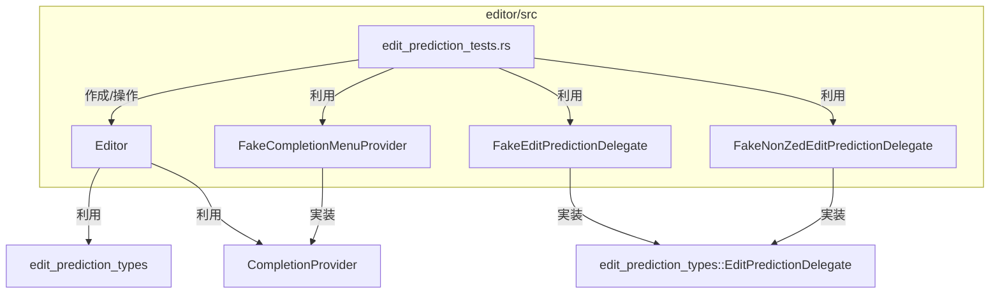

- `Editor` はエディタ UI 全体の中心であり、この中に **編集予測の状態 (`active_edit_prediction` など)** や設定が組み込まれています。
- `EditPredictionDelegate` を実装した `FakeEditPredictionDelegate` / `FakeNonZedEditPredictionDelegate` は、テスト時に編集候補を供給するフェイクプロバイダです。
- `FakeCompletionMenuProvider` は、補完メニューと編集予測の優先度・競合をテストするための簡易な補完プロバイダです。
- `edit_prediction_tests.rs` は `EditorTestContext` を通じて `Editor` を操作し、キー入力やモディファイア、プロバイダからの通知に対する挙動を検証します。

### 2.3 設計上のポイント

コードから読み取れる設計上の特徴を挙げます。

- **責務分割**
  - 編集予測の「生成」は `EditPredictionDelegate` 実装（本チャンクではフェイク）に委譲。
  - `Editor` 側は「いつリクエストするか」「どう表示するか」「ユーザー入力とどう連携するか」に集中しています。
- **状態管理**
  - `active_edit_prediction`：現在表示中/適用可能な編集予測
  - `stale_edit_prediction_in_menu`：メニュー表示用に残しておきたいが、エディタ本体上では無効になった予測
  - `edit_prediction_preview`：モディファイアキーによるプレビュー状態（Active / Inactive + 「短く押しすぎ」フラグ）
  - `edit_prediction_settings`：有効/無効や「Subtle（モディファイア必須）/Eager」等のモード
- **キーバインドとの連携**
  - `KeyContext` に `edit_prediction` / `edit_prediction_mode` / `showing_completions` / `in_leading_whitespace` などのコンテキストを追加し、キー定義ファイルから適切なバインディングを選択する仕組みになっています。
  - 表示面（インライン or カーソルポップオーバ）ごとに `EditPredictionKeybindSurface` を分け、`EditPredictionKeybindDisplay` で「accept / preview / 表示用キー / action」をまとめています。
- **テスト容易性**
  - フェイクプロバイダは非常に単純な API（`set_edit_prediction` / `suggest` / `discard`）を持ち、テストがインタラクションの境界条件に集中できるようになっています。
  - 多数のテストケース（キー設定の違い、モードの違い、completion メニューとの競合、stale 状態のクリーンアップなど）が用意されています。

---

## 3. 主要な機能一覧

このチャンクが提供・検証している主な機能は次のとおりです。

- 編集予測プロバイダの登録・監視
- 編集予測の有効/無効判定（設定・スコープ・ファイル種類・AI無効設定など）
- 編集予測の取得・再表示 (`refresh_edit_prediction` / `update_visible_edit_prediction`)
- 編集予測のプレビュー管理（モディファイア押下検知・プレビュー中のスクロール復元など）
- 編集予測の受理（全文 / 次の単語 / 次の行）とカーソル位置の決定
- 編集予測の破棄と delegate 側への通知 (`discard`)
- インライン / カーソルポップオーバ向けのキーバインド表示ロジック
- 編集予測と通常の補完（completions）メニューとの優先順位・競合処理
- テスト用フェイク delegate / completion プロバイダ・各種テストユーティリティ

---

## 4. 関数・構造体の解説

### 4.1 型一覧（構造体・列挙体など）

このチャンクに現れる編集予測関連の主な型を整理します。

| 名前 | 種別 | 役割 / 用途 |
|------|------|-------------|
| `EditDisplayMode` | enum | 編集予測をどの UI 形態で表示するか（`TabAccept` / `DiffPopover` / `Inline`）を表します。 |
| `EditPrediction` | enum | 実際の「予測内容」を表現する型。テキスト編集 (`Edit`) と場所移動 (`MoveWithin` / `MoveOutside`) をまとめています。 |
| `EditPredictionState` | 構造体 | 現在の編集予測 1 件分の状態を保持（`inlay_ids`・`completion`・`completion_id`・`invalidation_range`）。 |
| `EditPredictionSettings` | enum | 編集予測が有効かどうか、および「メニュー表示」「モディファイア必須」などの設定をまとめた内部状態。 |
| `MenuEditPredictionsPolicy` | enum | 編集予測を補完メニューに出すかどうかの方針（`Never` / `ByProvider`）。 |
| `EditPredictionPreview` | enum | 編集予測プレビューの状態（モディファイア未押下/押下中）と、「すぐ離したかどうか」を保持します。 |
| `EditPredictionKeybindSurface` | enum | キーバインド表示対象の UI 面（インライン / カーソルポップオーバ）を区別するためのタグ。 |
| `EditPredictionKeybindAction` | enum | 表示するキーバインドが「accept 用」か「preview 用」かを示します。 |
| `EditPredictionKeybindDisplay` | 構造体 | 選択された accept / preview キー、実際に UI に表示するキー、action、ラベル表示有無などをまとめた構造体です。テストでは `accept_keystroke` / `preview_keystroke` にもアクセスします。 |
| `RegisteredEditPredictionDelegate` | 構造体 | `EditPredictionDelegate` をエディタに登録した際のラッパ。delegate 実体と、それを監視する `Subscription` を保持します。 |
| `FakeEditPredictionDelegate` | 構造体 | テスト用の編集予測 delegate 実装。任意の `EditPrediction` を外からセットし、`suggest` で返す簡易プロバイダです。 |
| `FakeNonZedEditPredictionDelegate` | 構造体 | `FakeEditPredictionDelegate` と類似ですが、`show_predictions_in_menu` / `supports_jump_to_edit` が `false` のパターンをテストするための delegate。 |
| `FakeCompletionMenuProvider` | 構造体 | 1 つだけ固定の completion を返すテスト用 `CompletionProvider`。編集予測と completion の優先順位をテストするのに使われます。 |
| `InlineKeybindState` | enum (テスト内) | インライン edit prediction キーバインドテストの「状態」（通常 / completion 表示中 / 先頭空白など）を表します。 |
| `ExpectedKeystroke` | enum (テスト内) | テストで期待するキーストローク（「デフォルト accept」「デフォルト preview」「指定文字列」）の区別用。 |
| `InlineKeybindCase` | struct (テスト内) | インラインキーバインドテスト 1 ケース分の設定・期待値をまとめた構造体。 |
| `CursorPopoverPredictionKind` | enum (テスト内) | カーソルポップオーバの種類（単行/複数行/プレビューあり/改行削除など）を表し、それに応じて action が accept/preview かどうかをテストします。 |
| `CursorPopoverCase` | struct (テスト内) | カーソルポップオーバテスト 1 ケースの設定と期待 action をまとめた構造体。 |

### 4.2 関数詳細（代表的なもの）

#### `Editor::set_edit_prediction_provider<T>(provider: Option<Entity<T>>, window, cx)`

**概要**

- 編集予測 delegate（`EditPredictionDelegate` を実装したエンティティ）を `Editor` に登録します。
- delegate の状態変化を監視し、変化時に `update_visible_edit_prediction` を呼び出すための subscription も張ります。

**引数**

| 引数名 | 型 | 説明 |
|--------|----|------|
| `provider` | `Option<Entity<T>>` | 登録する delegate エンティティ。`None` の場合は解除。`T: EditPredictionDelegate`。 |
| `window` | `&mut Window` | UI コンテキスト。subscription の登録に使用されます。 |
| `cx` | `&mut Context<Editor>` | `Editor` の状態を更新するためのコンテキスト。 |

**戻り値**

- なし。`self.edit_prediction_provider` と関連する設定が更新されます。

**内部処理の流れ**

1. `provider` が `Some` なら `RegisteredEditPredictionDelegate` を生成し、`self.edit_prediction_provider` に保存。
   - `cx.observe_in(&provider, window, ...)` で delegate エンティティの変更を監視。
   - フォーカス中のエディタで delegate が更新された場合に `update_visible_edit_prediction` を呼びます。
2. `provider` が `None` の場合は `self.edit_prediction_provider` を `None` にし、設定を「Disabled」にします（後述の `update_edit_prediction_settings` 内）。
3. `update_edit_prediction_settings` を呼び出し、現在のカーソル位置・言語設定・スコープ等に基づき `edit_prediction_settings` を更新します。
4. `refresh_edit_prediction(false, false, window, cx)` を呼び出し、必要であれば新しい予測をリクエストします。

**Examples（使用例）**

テストコードでは、フェイク delegate を次のように登録しています。

```rust
// フェイク delegate を生成して Editor に登録する例（テスト用）
let provider = cx.new(|_| FakeEditPredictionDelegate::default());   // delegate Entity を生成
assign_editor_completion_provider(provider.clone(), &mut cx);       // ラッパー関数内で set_edit_prediction_provider を呼ぶ

// assign_editor_completion_provider の中身（簡略）
fn assign_editor_completion_provider(
    provider: Entity<FakeEditPredictionDelegate>,
    cx: &mut EditorTestContext,
) {
    cx.update_editor(|editor, window, cx| {
        editor.set_edit_prediction_provider(Some(provider), window, cx);
    })
}
```

**Errors / Panics**

- この関数自体は `Result` を返さず、内部でパニックを起こす条件もコードからは見当たりません。

**Edge cases（エッジケース）**

- `provider = None` のとき：既存の `edit_prediction_provider` は解除され、設定が `Disabled` になり、既存の予測は破棄されます。
- delegate が通知を送らない場合：`update_visible_edit_prediction` は呼ばれず、`refresh_edit_prediction` の結果のみで状態が変化します。

**使用上の注意点**

- delegate 側は `EditPredictionDelegate` を正しく実装している必要があります（特に `refresh`・`suggest`・`discard`）。
- `set_edit_prediction_provider` 呼び出し後に、delegate の状態変更だけで予測を更新したい場合は、delegate エンティティで `update` を呼ぶことで `observe_in` がトリガーされます。

---

#### `Editor::refresh_edit_prediction(&mut self, debounce, user_requested, window, cx)`

**概要**

- 現在のカーソル位置・設定に基づき、編集予測の再リクエストを行います。
- 実際の候補表示は `update_visible_edit_prediction` が担当し、この関数は「delegate に refresh を依頼する」までです。

**引数**

| 引数名 | 型 | 説明 |
|--------|----|------|
| `debounce` | `bool` | delegate 側に「デバウンスしてよいか」を伝えるフラグ。 |
| `user_requested` | `bool` | 明示的なユーザー操作によるリクエストかどうか。 |
| `window` | `&mut Window` | UI コンテキスト。 |
| `cx` | `&mut Context<Self>` | `Editor` 更新用コンテキスト。 |

**戻り値**

- `Option<()>`：delegate に refresh を依頼した場合は `Some(())`、依頼しなかった場合は `None`。

**内部処理の流れ**

1. 「リーダーモード中（協調編集で他人がリーダー）」の場合は予測を破棄して `None` を返します。
2. カーソル位置から `buffer` と `buffer_position` を取得できなければ `None`。
3. `DisableAiSettings::is_ai_disabled_for_buffer` でバッファ単位の AI 無効設定を確認し、有効でなければ `None`。
4. `edit_predictions_enabled_in_buffer` で言語設定・スコープ・ファイル種別などを確認し、無効なら `discard_edit_prediction(Ignored)` を呼んで `None`。
5. `update_visible_edit_prediction(window, cx)` を呼んで、既に delegate が持っている候補を表示します。
6. `user_requested` でなく、かつ以下の条件のいずれかを満たす場合は **新しい refresh を投げない**。
   - `should_show_edit_predictions()` が偽（設定や snippet 中などで非表示）
   - エディタがフォーカスされていない
   - バッファが空
7. `edit_prediction_provider` が存在し、有効な場合に `provider.refresh(buffer, cursor_buffer_position, debounce, cx)` を呼びます。

**Examples（使用例）**

テストからの間接的利用例：

```rust
// ユーザー操作として予測を表示したいケース
cx.update_editor(|editor, window, cx| {
    editor.show_edit_prediction(&ShowEditPrediction, window, cx); // 内部で refresh_edit_prediction(false, true, ...) を呼ぶ
});
```

**Errors / Panics**

- 内部で `?` や `unwrap` は使用されていないため、この関数単体ではパニック条件は見当たりません。

**Edge cases**

- delegate が存在しない・無効化されている場合：何もせずに `None` を返します。
- AI が無効なバッファ（プロジェクト設定）では常に `None`。
- `user_requested = false` かつ `show_edit_predictions_override = Some(false)` の場合など、設定状況によっては「候補を取得しても表示しない」パスになります。

**使用上の注意点**

- `refresh_edit_prediction` は「delegate に新しい予測を作らせる」だけであり、即座に `active_edit_prediction` が更新されるとは限りません。実際の表示更新は delegate の通知経由で `update_visible_edit_prediction` が動くタイミングになります。
- ユーザー操作に応じた呼び出しでは、`user_requested = true` を渡す API（`show_edit_prediction` など）を使うのが安全です。

---

#### `Editor::update_visible_edit_prediction(&mut self, window, cx) -> Option<()>`

**概要**

- 現在のカーソル位置・選択状態・補完メニューの状態などを見て、
  delegate からの `suggest()` 結果を `active_edit_prediction` に反映し、必要に応じて inlay やポップオーバ用状態を更新します。

**引数**

| 引数名 | 型 | 説明 |
|--------|----|------|
| `window` | `&mut Window` | UI コンテキスト。 |
| `cx` | `&mut Context<Self>` | `Editor` 更新用コンテキスト。 |

**戻り値**

- `Option<()>`：新しい編集予測を取り込んだ場合は `Some(())`、そうでない場合は `None`。

**内部処理の前半（このチャンクから読み取れる範囲）**

1. IME 入力中 (`ime_transaction.is_some()`) の場合は予測を破棄して `None` を返す。
2. カーソル位置から `buffer` / `cursor_text_anchor` を取得できない場合は `None`。
3. `edit_predictions_enabled_in_buffer` が false なら `discard_edit_prediction(Ignored)` して `None`。
4. 選択範囲が空でない、あるいは既存の `active_edit_prediction` の `invalidation_range` からカーソルが外れている場合は、予測を破棄して `None`。
5. 補完メニューが開いており、かつ「メニュー内に edit prediction を表示しない」設定の場合は、completion を優先して予測を破棄。
6. `self.take_active_edit_prediction(true, cx)` で既存の予測を `stale_edit_prediction_in_menu` に退避。
7. `edit_prediction_provider.suggest(&buffer, cursor_text_anchor, cx)` を呼び、`EditPrediction::Local` / `Jump` のどちらかの結果を取得。
8. `EditPrediction::Jump` の場合は `EditPrediction::MoveOutside` として `active_edit_prediction` を設定し、`Some(())` を返す。
9. `EditPrediction::Local` の場合は
   - 各 `(Range<language::Anchor>, text)` を multi-buffer のアンカー範囲に変換。
   - 空なら `None`。
   - 先頭行・末尾行を見て、編集範囲の前後数行を `invalidation_range` として計算。
   - 「ジャンプとして扱うか（MoveWithin）」か「編集として扱うか（Edit）」を `supports_jump_to_edit` と行範囲、Vim モードの設定などから判定。
   - `EditDisplayMode` を決定（挿入/削除だけなら `TabAccept` / `Inline`、それ以外は diff 用 popover など）。

**後半（このチャンクに含まれていない部分）**

- この後、`EditPrediction::Edit { ... }` の具体的な生成と
  - inlay 挿入 (`inlay_ids`)
  - エディタ上のハイライト (`HighlightKey::EditPredictionHighlight`)
  - メニュー表示用状態の更新
  などが行われていると推測できますが、実際のコードはこのチャンクには含まれていません。

**Examples（使用例）**

テストでは、delegate 側に予測をセットした後に次のように呼び出しています。

```rust
// delegate に編集候補をセット
propose_edits(&provider, vec![(8..8, "42")], &mut cx);

// Editor 側で可視の edit prediction を更新
cx.update_editor(|editor, window, cx| {
    editor.update_visible_edit_prediction(window, cx);
});
```

**Errors / Panics**

- このチャンク内では `unwrap` などによるパニックは利用されていません。
- `EditPrediction::Local` から anchor 変換できなかった場合は単にスキップします（`flat_map` + `?` で `None` のものを捨てる）。

**Edge cases**

- 選択範囲が非空のとき：予測は必ず破棄されます（「候補を上書きせず、自分で打つ」意図）。
- completion メニューが開いているとき：設定や surface に応じて completion 優先／prediction 優先が切り替わります。
- Vim モードで edit prediction を非表示 (`edit_predictions_hidden_for_vim_mode`) にしているとき：`MoveWithin` として扱われる場合があります。

**使用上の注意点**

- delegate 側の `EditPrediction::Local` は **必ず multi-buffer 上で有効な anchor に変換できる範囲** を返す必要があります。変換できない範囲は無視されます。
- カーソルが `invalidation_range` から外れた場合には、自動的に予測が破棄される点に注意します。

---

#### `Editor::accept_partial_edit_prediction(&mut self, granularity, window, cx)`

**概要**

- 現在の `active_edit_prediction` を「部分的に」または「全体を」適用します。
- granularity によって「単語単位」「行単位」「全体」の 3 パターンを扱います。

**引数**

| 引数名 | 型 | 説明 |
|--------|----|------|
| `granularity` | `EditPredictionGranularity` | `Word` / `Line` / `Full` のいずれか。 |
| `window` | `&mut Window` | UI コンテキスト。 |
| `cx` | `&mut Context<Self>` | `Editor` 更新用コンテキスト。 |

**戻り値**

- なし。内部でバッファと selection を更新します。

**内部処理の流れ（主要な分岐）**

1. メニューに prediction を表示している場合は、`hide_context_menu` で completion メニューを閉じます。
2. `active_edit_prediction` がない場合は何もしません。
3. granularity が `Word`/`Line` かつ selection 数が複数の場合は「部分受理」はサポートされないので何もしません。
4. `match active_edit_prediction.completion` で 3 パターンに分岐：
   - `MoveWithin`：同エディタ内の移動
   - `MoveOutside`：他エディタへのジャンプ
   - `Edit`：テキスト編集

5. `MoveWithin`：
   - `Full` のとき：
     - 現在の表示状態から対象位置が可視かどうかをチェック。
     - 可視ならその位置へ selection を移動し、ハイライトをクリア。
     - 不可視かつ Subtle モード（モディファイア必須）なら、一旦対象行をハイライトし、スクロール要求だけ行います。
   - `Word` / `Line` のとき：単純にその anchor に selection を移動。
6. `MoveOutside`：
   - `workspace` を取得し、対象バッファの anchor を含むエディタを新規に開いてそこで該当位置へジャンプします。
7. `Edit`：
   - `Full` のとき：
     1. 編集適用前に fallback カーソル位置（最後の edit の末尾）を計算。
     2. `buffer.edit(edits, None, cx)` で一括適用。
     3. delegate の `accept` を呼ぶ。
     4. `cursor_position` が指定されていればそれを優先し、なければ fallback にカーソルを移動。
     5. selection 履歴に反映し、`update_visible_edit_prediction` / `refresh_edit_prediction` を必要に応じて呼びます。
   - `Word` / `Line` のとき：
     - カーソル直後（挿入のみなど）の編集だけを取り出し、単語/行の単位で text を切り出して selection に挿入。
     - 対象が見つからない場合は `Full` と同じ挙動になります。

**Examples（使用例）**

テストから間接的に呼ばれる例：

```rust
// Tab で全文受理するケース
cx.simulate_keystroke("tab");
cx.run_until_parked();
// 内部で AcceptEditPrediction アクションが発火し、accept_edit_prediction -> accept_partial_edit_prediction(Full) が呼ばれる
```

**Errors / Panics**

- 型マッチで `EditPrediction::Edit` の中身に依存しますが、このチャンク内では `unwrap` 等は使っていません。
- delegate の `accept` 実装が安全であることが前提です。

**Edge cases**

- granularity ≠ Full かつ selection が複数：何も起こらない（部分適用は単一カーソル前提）。
- `Word` 受理時に先頭が非アルファベットの場合：
  - まずアルファベット連続部分を取り、それが空なら空白＋非アルファベット連続を取り出す、という順序でテキストを切り出しています。
- `cursor_position` が指定されていても anchor が無効になるケースは、このチャンクだけでは確認できません（外部条件次第）。

**使用上の注意点**

- delegate 側は、同一編集を繰り返し適用されても破綻しない設計（idempotent）であることが望ましいですが、これはコードからは保証されていません。
- `MoveOutside` を使う場合は `workspace` が存在する前提になるため、単独のエディタ（workspace を持たない）ではこの経路は利用できません。

---

#### `Editor::edit_prediction_keybind_display(&self, surface, window, cx) -> EditPredictionKeybindDisplay`

**概要**

- 現在の `KeyContext` とキー設定に基づき、編集予測の accept / preview / 表示用のキーバインドを決定します。
- インライン表示とカーソルポップオーバ表示で、どの action（Accept/Preview）を前面に出すかが異なります。

**引数**

| 引数名 | 型 | 説明 |
|--------|----|------|
| `surface` | `EditPredictionKeybindSurface` | `Inline` / `CursorPopoverCompact` / `CursorPopoverExpanded`。 |
| `window` | `&mut Window` | キーバインド検索に使用。 |
| `cx` | `&mut App` | `KeyContext`・設定取得に使用。 |

**戻り値**

- `EditPredictionKeybindDisplay`：内部には
  - （テスト時のみ）`accept_keystroke` / `preview_keystroke`
  - UI に実際に表示する `displayed_keystroke`
  - `action`（Accept or Preview）
  - `missing_accept_keystroke` / `show_hold_label`
  などが含まれます。

**内部処理の流れ**

1. `accept_edit_prediction_keystroke(EditPredictionGranularity::Full, ...)` で accept 用候補を取得。
2. `preview_edit_prediction_keystroke(...)` で preview 用候補（修飾キー付き）を取得。
3. `surface` ごとに `action` を決定：
   - `Inline` / `CursorPopoverCompact`：
     - Subtle モード (`edit_prediction_requires_modifier() == true`) なら `Preview`。
     - それ以外は `Accept`。
   - `CursorPopoverExpanded`：
     - `active_edit_prediction` が multi-line の場合（`edit_prediction_cursor_popover_prefers_preview` が `true`）は `Preview`。
     - それ以外は `Accept`。
4. `displayed_keystroke` を surface に応じて決定：
   - `Inline`：`action` に対応する keystroke をそのまま表示。
   - `CursorPopover*`：`Preview` の場合でも、preview キーがなければ accept キーを fallback として使用。
5. `missing_accept_keystroke` フラグは `displayed_keystroke.is_none()` かどうかで決定。
6. `CursorPopoverCompact` かつ `EditPredictionPreview::Inactive { released_too_fast: true }` のときは `show_hold_label = true` にして「長押ししてプレビュー」を促すラベルが表示されるようにします。

**Examples（使用例）**

テストの一部（インラインキーバインド）：

```rust
let keybind_display = editor.edit_prediction_keybind_display(
    EditPredictionKeybindSurface::Inline,
    window,
    cx,
);
let accept_keystroke = keybind_display.accept_keystroke.as_ref().unwrap().clone();
let preview_keystroke = keybind_display.preview_keystroke.as_ref().unwrap().clone();
```

**Errors / Panics**

- キーバインドが 1 つも見つからない場合でも `EditPredictionKeybindDisplay` 自体は返されますが、
  テスト側で `unwrap_or_else(|| panic!(...))` を使っている箇所があり、そこでパニックになる可能性があります。

**Edge cases**

- accept 用バインディングがなく preview のみ存在する場合：
  - `CursorPopoverExpanded` で action が `Preview` のとき、`displayed_keystroke` は preview キーになります。
  - テストケース “removing default tab binding still displays tab” などで、この挙動が検証されています。
- Subtle モード (`EditPredictionsMode::Subtle`) のとき：
  - `Inline` surface では preview キーが優先され、表示も preview キーになります。

**使用上の注意点**

- `edit_prediction_keybind_display` は keymap 全体やコンテキストに依存するため、テストでは `load_default_keymap` / `KeyBinding::new(...)` を使って環境を固定しています。
- 実運用コードで新しい action を追加する場合、`KeyContext` のタグ（`EDIT_PREDICTION_KEY_CONTEXT` など）との整合性に注意が必要です。

---

#### `FakeEditPredictionDelegate::set_edit_prediction(&mut self, completion)`

**概要**

- テスト用 delegate の内部に保持している `completion` をセットします。
- これにより `suggest` の返り値が変わります。

**引数**

| 引数名 | 型 | 説明 |
|--------|----|------|
| `completion` | `Option<edit_prediction_types::EditPrediction>` | 次回 `suggest` で返したい編集予測。`None` でクリア。 |

**戻り値**

- なし。`self.completion` フィールドを更新します。

**内部処理の流れ**

1. `self.completion = completion;` という 1 行のみです。

**Examples（使用例）**

テスト用ヘルパーからの利用例：

```rust
provider.update(cx, |provider, _| {
    provider.set_edit_prediction(Some(edit_prediction_types::EditPrediction::Local {
        id: None,
        edits: provider_edits,
        cursor_position: None,
        edit_preview: Some(edit_preview),
    }))
})
```

**Errors / Panics**

- なし。

**Edge cases**

- `completion = None`：`suggest` は `None` を返すようになり、`Editor` 側では予測が表示されなくなります。

**使用上の注意点**

- 本番用 delegate では、`set_edit_prediction` 相当のロジックを非同期処理の完了ハンドラなどで呼ぶことが想定されます。その際、`gpui::Entity` の `update` 経由で呼び出す形になります。

---

#### `propose_edits_with_preview(provider, edits, cx)`

**シグネチャ**

```rust
async fn propose_edits_with_preview<T: ToOffset + Clone>(
    provider: &Entity<FakeEditPredictionDelegate>,
    edits: Vec<(Range<T>, &str)>,
    cx: &mut EditorTestContext,
)
```

**概要**

- テスト用のユーティリティ関数で、指定したテキスト範囲と文字列から `EditPrediction::Local` を生成し、
  delegate に設定します。
- さらに `Buffer::preview_edits` を使って `EditPreview` を作成し、`edit_preview` にもセットします。

**引数**

| 引数名 | 型 | 説明 |
|--------|----|------|
| `provider` | `&Entity<FakeEditPredictionDelegate>` | 編集予測 delegate エンティティ。 |
| `edits` | `Vec<(Range<T>, &str)>` | バッファオフセット（`T: ToOffset`）と置き換え文字列のペア。 |
| `cx` | `&mut EditorTestContext` | テスト用コンテキスト。バッファアクセスと delegate 更新に使用。 |

**戻り値**

- `()`（`async` 関数）。エラーは返さず、失敗時は panic の可能性がありますが、このチャンクからは詳細不明です。

**内部処理の流れ**

1. `cx.buffer_snapshot()` から現在の `MultiBufferSnapshot` を取得。
2. `edits` を multi-buffer anchor 範囲に変換：
   - `snapshot.anchor_after(range.start.clone())..snapshot.anchor_before(range.end)`
   - 文字列は `Arc<str>` に変換。
3. 変換した `(Range<Anchor>, Arc<str>)` の配列を `preview_edits` として `Arc<[...]>` にまとめる。
4. `buffer.preview_edits(preview_edits, app).await` を呼び、`EditPreview` を取得。
5. `provider_edits` として `(Range<Anchor>, Arc<str>)` の `Vec` を `collect()`。
6. `provider.update(...)` 内で `set_edit_prediction(Some(EditPrediction::Local{...}))` を呼び、
   - `id: None`
   - `edits: provider_edits`
   - `cursor_position: None`
   - `edit_preview: Some(edit_preview)`
   を設定。

**Examples（使用例）**

カーソルポップオーバテストの一部：

```rust
propose_edits_with_preview(&provider, vec![(8..8, "42\n43")], &mut cx).await;
cx.update_editor(|editor, window, cx| {
    editor.update_visible_edit_prediction(window, cx)
});
```

**Errors / Panics**

- この関数自体は `Result` を返さず、`await` 先 (`buffer.preview_edits`) のエラー処理はこのチャンクには記述されていません。
- 失敗時の挙動はテスト実行時に panic となる可能性がありますが、詳細は `preview_edits` 実装に依存します。

**Edge cases**

- `edits` が空の場合：`provider_edits` が空の `EditPrediction::Local` となり、`Editor` 側では `update_visible_edit_prediction` 中の `if edits.is_empty() { return None; }` により無視されます。
- 範囲がバッファ外の場合：`anchor_after` / `anchor_before` の挙動に依存しますが、通常はクリップされるため「予測内容と実際の編集範囲がずれる」可能性があります。

**使用上の注意点**

- この関数はテスト専用です。実運用コードで同様の処理を行う場合は、`EditPredictionDelegate` 実装内で同等の変換・`preview_edits` 呼び出しを行う必要があります。

---

### 4.3 その他の関数（テストユーティリティなど）

| 関数名 | 役割（1 行） |
|--------|--------------|
| `load_default_keymap` | デフォルト keymap ファイルを読み込み、テスト用 `TestAppContext` にバインドします。 |
| `assert_editor_active_edit_completion` | `active_edit_prediction` が `Edit` であること・その `edits` の内容をアサートします。 |
| `assert_editor_active_move_completion` | `active_edit_prediction` が `MoveWithin` であること・`target` を検証します。 |
| `propose_edits` | `propose_edits_with_cursor_position` の簡易版で、カーソル位置なしの `EditPrediction::Local` を delegate にセットします。 |
| `propose_edits_with_cursor_position` | 編集範囲と「予測カーソル位置」をまとめて `EditPrediction::Local` にセットするテストユーティリティです。 |
| `propose_edits_with_cursor_position_in_insertion` | 挿入テキスト内のオフセットを含む cursor_position を指定するテストユーティリティです。 |
| `propose_edits_non_zed` | `FakeNonZedEditPredictionDelegate` 用に `EditPrediction::Local` をセットします。 |
| `assign_editor_completion_menu_provider` | `FakeCompletionMenuProvider` を `Editor` の completion プロバイダとして登録します。 |
| `accept_completion` | `Editor::accept_edit_prediction` をラップする簡易テスト用ヘルパーです。 |

---

## 5. データフロー

ここでは、代表的なシナリオ「モディファイア押下中に予測が届き、プレビュー → 受理される」場合のデータフローを説明します。

### 概要

1. ユーザーが補完/編集予測用のモディファイア（例: `Alt+Tab`）を押し続ける。
2. `Editor` はモディファイア変化を検知し、`edit_prediction_preview` を `Active` にする。
3. delegate 側が `set_edit_prediction` を呼び、フェイクの場合は `suggest` が `Some(EditPrediction::Local{...})` を返すようになる。
4. `Editor` は `update_visible_edit_prediction` を呼び、`active_edit_prediction` を更新し、インラインプレビューを表示。
5. ユーザーが Tab などの accept キーを押すと、`accept_edit_prediction` 経由で `accept_partial_edit_prediction(Full)` が呼ばれ、テキストがバッファに適用される。

### シーケンス図

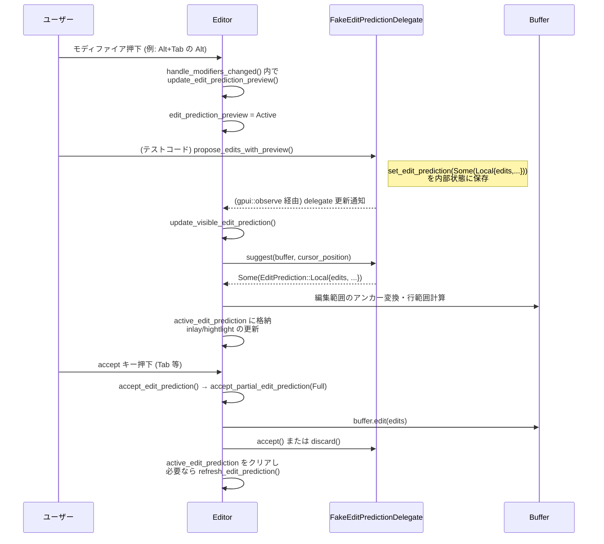

この流れに対して、テストでは

- プレビューがモディファイア押下中に有効化されること (`test_edit_prediction_preview_activates_when_prediction_arrives_with_modifier_held`)
- Tab が completion より edit prediction を優先すること (`test_tab_accepts_edit_prediction_over_completion`)
- stale な multi-line 予測から single-line に切り替えた際の action が適切に戻ること

などを細かく検証しています。

---

## 6. 使い方（How to Use）

### 6.1 基本的な使用方法

このチャンクを元にした「最小構成」の利用例として、シングルバッファ・フェイク delegate を使った簡単なシナリオを示します（テスト環境風）。

```rust
use gpui::{App, Window, Entity};
use editor::Editor;
use editor::edit_prediction_types;
use editor::test::EditorTestContext;

// 1. アプリ・エディタのセットアップ（テスト風の簡易例）
fn setup_editor(app: &mut App, window: &mut Window) -> (Entity<Editor>, Entity<FakeEditPredictionDelegate>) {
    // Editor を生成
    let editor = window.new(app, |cx| Editor::multi_line(window, cx));

    // フェイク delegate を生成
    let provider = window.new(app, |_| FakeEditPredictionDelegate::default());

    // delegate を Editor に登録
    editor.update(app, |editor, cx| {
        editor.set_edit_prediction_provider(Some(provider.clone()), window, cx);
    });

    (editor, provider)
}

// 2. delegate に予測をセットして Editor に表示させる
fn show_prediction(
    editor: &Entity<Editor>,
    provider: &Entity<FakeEditPredictionDelegate>,
    window: &mut Window,
    app: &mut App,
) {
    // 編集候補を provider にセット
    provider.update(app, |provider, _| {
        provider.set_edit_prediction(Some(edit_prediction_types::EditPrediction::Local {
            id: None,
            edits: vec![],        // 実際は (Range<Anchor>, Arc<str>) を指定
            cursor_position: None,
            edit_preview: None,
        }));
    });

    // Editor 側で可視の予測を更新
    editor.update(app, |editor, cx| {
        editor.update_visible_edit_prediction(window, cx);
    });
}
```

上記はあくまで概念的な例であり、実際には `MultiBuffer` や anchor 範囲などの扱いを正しく行う必要があります。

### 6.2 よくある使用パターン

1. **Subtle モード（モディファイア必須）でのインライン表示**

   - 言語設定で `EditPredictionsMode::Subtle` を指定すると、`edit_prediction_requires_modifier()` が真になり、`edit_prediction_keybind_display` は preview キーをメインとして返します。
   - テスト `"subtle mode displays preview binding inline"` がこの挙動を確認しています。

2. **カスタム accept キーバインド**

   - デフォルトの Tab を無効化し、独自キー（例: `ctrl-enter`）にバインドし直すケース：

   ```rust
   cx.update(|cx| {
       cx.bind_keys(vec![KeyBinding::new(
           "ctrl-enter",
           AcceptEditPrediction,
           Some("Editor && edit_prediction"),
       )]);
   });
   ```

   - テスト `"custom-only rebound accept key uses replacement key"` は、この設定で accept・preview・表示用すべてが `ctrl-enter` になることを確認します。

3. **カーソルポップオーバでの multi-line 予測**

   - `CursorPopoverPredictionKind::MultiLine` などのケースでは、`edit_prediction_keybind_display` の `action` が `Preview` になることがテストで検証されています。
   - これにより、multi-line の大きな変更は「まず preview してから accept」という UX に誘導できます。

### 6.3 よくある間違い

```rust
// 間違い例: delegate の discard を考慮せず、
// dismiss 後に update_visible_edit_prediction を呼ぶだけ
cx.simulate_keystroke("escape");      // prediction を閉じる
cx.run_until_parked();
cx.update_editor(|editor, window, cx| {
    editor.update_visible_edit_prediction(window, cx); // ← discard されていない場合、同じ予測がまた出る可能性
});

// 正しい例: delegate 側 discard() で completion をクリアする
impl EditPredictionDelegate for FakeEditPredictionDelegate {
    fn discard(
        &mut self,
        _reason: edit_prediction_types::EditPredictionDiscardReason,
        _cx: &mut gpui::Context<Self>,
    ) {
        self.completion.take();       // ここで再出現しないようにする
    }
}

// テスト test_discard_clears_delegate_completion は、
// discard() 後に update_visible_edit_prediction しても prediction が戻らないことを確認している。
```

- `discard` 実装で `self.completion` をクリアしないと、
  ユーザーが escape で閉じた後に `update_visible_edit_prediction` が再度同じ候補を表示してしまいます。

### 6.4 使用上の注意点（まとめ）

- **delegate 実装の責務**
  - `refresh`：エディタからのリクエストに応じて非同期に予測を計算し、完了後に `set_edit_prediction` 相当を呼ぶ。
  - `suggest`：現在の内部状態（completion）を返すだけの軽量な関数であることが望ましい。
  - `discard`：ユーザーが予測を拒否した場合に再表示されないよう、内部状態を必ずクリアする。
- **設定との関係**
  - 言語別設定の `show_edit_predictions`、`edit_predictions_mode`、`edit_predictions_disabled_in` などにより、予測が完全に無効になることがあります。
  - プロジェクト側の `DisableAiSettings` によってもファイル単位で AI が無効化されます。
- **補完メニューとの競合**
  - completion メニューが開いているときは、設定に応じて edit prediction を抑制する場合があります。特に「メニューに edit prediction を入れる」モード (`show_predictions_in_menu`) との組み合わせに注意が必要です。
- **複数 selection と部分受理**
  - `Word` / `Line` granularity での accept は単一 selection 前提です。複数 selection の状態でこれらを叩いても何も起こりません。

---

## 7. 関連ファイル

このチャンクと密接に関係するファイル・モジュールを一覧にします。

| パス | 役割 / 関係 |
|------|------------|
| `editor/src/editor.rs` | `Editor` 本体の実装ファイル。本チャンクでは特に編集予測・補完・キーバインド関連のメソッドが含まれています。 |
| `editor/src/edit_prediction_tests.rs` | 編集予測機能（プレビュー、キーバインド、discard 挙動など）を検証するためのテストとフェイク delegate 実装が含まれます。 |
| `editor/src/actions.rs` | `AcceptEditPrediction` など、エディタのアクション定義を含むモジュール（このチャンクからは存在のみ参照）。 |
| `editor/src/editor_settings.rs` | `EditPredictionsMode` やカーソル形状など、エディタの設定を管理するモジュール。編集予測のモード判定に利用されます。 |
| `edit_prediction_types`（外部クレート） | `EditPrediction`・`EditPredictionDelegate`・`EditPredictionDiscardReason` など、編集予測の共通型・トレイトを提供します。 |
| `project` クレート内各モジュール | LSP 補完・コードアクション・タスク実行などを提供し、編集予測とは別系統の「補完」や「コードアクション」機能としてこのファイルから呼び出されています。 |

このディレクトリ全体では、他にも folding・semantic tokens・git blame 等多くの機能が実装されていますが、このチャンクに含まれるコードから確実に読み取れるのは主に **編集予測・補完・キーバインド・テスト** に関連する部分です。

---

# depth1-editor-59 / Editor モジュール コード解説（chunk 4/10）

## 0. ざっくり一言

このチャンクは、`Editor` 型のうち **テキスト操作・選択操作・移動・コメント／フォーマット・診断・折りたたみ・LSP ナビゲーション** など、ユーザー操作に対応するメソッド群をまとめた部分です。

---

## 1. このモジュールの役割

### 1.1 概要

- このモジュール（`Editor` の実装部）は、エディタ上で発生する **ほぼすべての編集操作** を受け取り、テキスト・選択・スクロール・補完・LSP 連携などを統合的に制御する役割を持ちます。
- 本チャンクでは特に、次のような操作のロジックが実装されています。
  - 行・選択・文字単位の **移動／選択／削除**
  - **コメントトグル・整形・インデント変換・大文字小文字変換** などのバッチ編集
  - **コードフォールド／展開・差分ハンクの操作・Git ステージング**
  - **Go to Definition / References / Diagnostics / シンボル移動** 等の LSP ナビゲーション
  - **診断の表示・インライン診断・言語サーバー制御**

### 1.2 アーキテクチャ内での位置づけ

このチャンクに現れる型・関数から読み取れる依存関係を図示します（実際のモジュール名・パスはこのチャンクだけでは分からないため抽象名で記載します）。

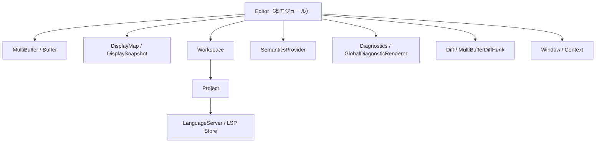

- `Editor` は内部に `MultiBuffer` と `DisplayMap` を保持し、テキストと表示状態（折りたたみ・ブロック・ミニマップ）を管理します。
- プロジェクト単位の処理（保存・フォーマット・LSP 呼び出し）は `Project`／`Workspace` に委譲されます。
- 診断、コードアクション、Go to Definition などは `SemanticsProvider` や LSP ストア経由で実行し、その結果を `Editor` が反映します。
- Git 差分 (`MultiBufferDiffHunk` 等) を用いて、ハンク単位のステージ／アンステージ・適用を行います。

### 1.3 設計上のポイント

コードから読み取れる設計上の特徴を列挙します。

- **コマンド → メソッドの 1:1 対応**
  - `MoveLeft`, `ToggleBreakpoint`, `Format`, `GoToDefinition` など、多数のアクション型に対応する `pub fn xxx(&mut self, action: &X, ...)` が用意され、UI やキーバインド層から直接呼び出しやすい構造です。
- **トランザクションと選択履歴**
  - `transact`, `start_transaction_at`, `end_transaction_at` により、編集単位をトランザクションとして扱い、`selection_history` に選択状態を紐づけています。これにより Undo/Redo で選択も復元できます。
- **表示とバッファの分離**
  - 実際のテキスト (`MultiBuffer`) と表示上の位置 (`DisplayMap` / `DisplaySnapshot`) を明確に分離し、折りたたみ・ミニマップ・ソフトラップ等を Display 側で吸収しています。
- **LSP との非同期連携**
  - Go to Definition / Rename / Format / Organize Imports / Diagnostics Pull 等は `Task` と `cx.spawn_in(...)` で非同期に実行し、完了時にエディタへ反映します。
- **多数のユーティリティ関数**
  - 行単位 (`manipulate_lines`), 文字列単位 (`manipulate_text`), 折りたたみ (`fold_creases`, `unfold_ranges`), Diff ハンク操作など、汎用ユーティリティを定義し、その上に具体的なコマンドを構成しています。
- **エディタ状態フラグの活用**
  - `read_only`, `delegate_expand_excerpts`, `delegate_stage_and_restore`, `diagnostics_enabled` などのフラグにより、操作の有効／無効や挙動の委譲を切り替えています。

---

## 2. 主要な機能一覧

このチャンクに含まれる主な機能を用途別に整理します（すべて `Editor` のメソッドです）。

- Git / diff 関連
  - 差分ハンクの復元・適用・ステージ／アンステージ・展開/折りたたみ
  - 変更ハンク・変更箇所へのジャンプ（`go_to_next_hunk`, `go_to_next_change` 等）
- ブレークポイント関連
  - 行・カーソル位置でのブレークポイント取得／編集 UI の表示
  - 有効化／無効化／トグル／ログブレークポイント編集
- 行・テキスト操作
  - 行の反転・シャッフル・移動・複製
  - 選択のローテーション（`rotate_selections`）
  - 行単位の任意変換 (`manipulate_lines`, `manipulate_immutable_lines`, `manipulate_mutable_lines`)
  - インデントのタブ／スペース変換
  - 大文字・小文字・スネークケース／ケバブケース等への変換、ROT13/ROT47
- クリップボード／キルリング
  - 通常のコピー／カット／ペースト
  - インデント除去付きコピー (`copy_and_trim`)
  - Emacs 風 Kill Ring (`kill_ring_cut`, `kill_ring_yank`)
  - クリップボードと選択範囲の Diff 表示
- カーソル移動・選択・削除
  - 文字単位・行単位・ページ単位の移動／選択
  - 単語／サブワード・段落・Excerpt（マルチバッファ部分）単位の移動／選択／削除
  - 行頭／行末／文頭／文末／文書先頭／文書末尾へのジャンプと選択
  - 選択履歴の Undo / Redo
  - マルチカーソル追加（上下に選択を追加）
  - 選択の行分割 (`split_selection_into_lines`)
- 検索・マルチ選択
  - 現在選択文字列の次／前の出現を選択（`select_next`, `select_previous`）
  - 全マッチを選択（`select_all_matches`）
  - 検索文字列のケース感度の設定 (`build_query`)
- コメント・書式関連
  - コメントトグル（行コメント／ブロックコメント／doc コメント等、言語設定準拠）
  - ハードラップ／リラップ (`rewrap`, `rewrap_impl`)
  - インライン診断のトグル・最大重大度の変更
  - コードフォーマット／選択範囲フォーマット
  - インポートの整理（`organize_imports`）
- 構文・シンボル単位の操作
  - 囲んでいるシンボル・構文ノードの選択／拡大／縮小／アンラップ
  - 次／前の構文ノードの選択
  - 構文ノード境界へのカーソル移動／選択
  - 括弧ペアへの移動（`move_to_enclosing_bracket`）
- LSP ナビゲーション
  - Go to Definition / Declaration / Type / Implementation（スプリット付き）
  - URL / ファイルパスを開く
  - Reference 間の移動（次／前）
  - すべての参照をマルチバッファで開く
  - LSP Rename（インライン小エディタで新しい名前を入力 → 一括変更）
- 診断・ハイライト
  - 次／前の診断へ移動（重大度フィルタ付き）
  - ドキュメントハイライト（read/write）の次／前へ移動
  - アクティブ診断グループの表示／解除
  - インライン診断の再計算・トグル
- 折りたたみ／Excerpt
  - 行・選択・レベル・関数本体単位のフォールド／アンフォールド
  - 全フォールド／全アンフォールド／再帰フォールド
  - マルチバッファにおけるバッファ単位のフォールド／アンフォールド
  - Excerpt の上下／両方向の拡張
- ビュー／設定関連
  - ミニマップの生成／表示切り替え／同期スクロール
  - ソフトラップモードの変更／トグル／折り返しガイド取得
  - 行番号・相対行番号・インデントガイド・Git diff gutter・コードアクション・runnables の表示切り替え
  - スクロールバーの表示制御
  - 文字パレット表示、タブバーのトグル など

---

## 3. 公開 API と詳細解説

### 3.1 型一覧（構造体・列挙体など）

このチャンク内で新たに定義されている、あるいは役割が読み取れる主な型をまとめます。

| 名前 | 種別 | 役割 / 用途 |
|------|------|-------------|
| `Editor` | 構造体 | テキストバッファ、表示状態、選択、LSP 連携などを統合するメインエディタ型（本チャンクはその実装の一部） |
| `CommentFormat` | `enum`（`rewrap_impl` 内ローカル） | コメント行の形式（行コメント、ブロックコメントの開始／終了行など）を表す一時的な判別用型 |
| `NavigationData` | 構造体 | ナビゲーション履歴エントリ用に、カーソル位置・スクロール位置等をまとめたデータ |
| `ActiveDiagnosticGroup` | 構造体 | 現在アクティブな診断グループの範囲・メッセージ・関連ブロック ID を保持 |
| `InlineDiagnostic` | 構造体 | 1 件のインライン診断（メッセージ、開始位置、重大度など）を表す |
| `ExpandExcerptDirection` | `enum`（外部定義） | Excerpt を上下どちらに拡張するか（Up / Down / UpAndDown） |
| `GotoDefinitionKind` | `enum`（外部定義） | Go to Definition の種類（Symbol / Declaration / Implementation / Type） |
| `SoftWrap` | `enum`（外部定義） | 表示上のソフトラップモード（なし・列・エディタ幅・Git diff 用など） |

※ 多くの型は他ファイルで定義されており、このチャンク単体からはフィールド構造までは読み取れません。

### 3.2 関数詳細（代表的な 7 件）

#### 1. `fn manipulate_text<Fn>(&mut self, window: &mut Window, cx: &mut Context<Self>, callback: Fn)`  

```rust
fn manipulate_text<Fn>(
    &mut self,
    window: &mut Window,
    cx: &mut Context<Self>,
    mut callback: Fn,
) where
    Fn: FnMut(&str) -> String,
```

**概要**

- 選択範囲（またはカーソル位置の単語）に対して任意の **文字列変換** を行うための共通ユーティリティです。
- 大文字小文字変換や ROT13 など、多数の `convert_to_xxx` 系メソッドがこの関数を利用しています。

**引数**

| 引数名 | 型 | 説明 |
|--------|----|------|
| `window` | `&mut Window` | スクロールやフォーカス変更など UI 操作に使用 |
| `cx` | `&mut Context<Self>` | エンティティ更新・イベント発火に用いるコンテキスト |
| `callback` | `FnMut(&str) -> String` | 各選択テキストをどのように変換するかを決定する関数 |

**戻り値**

- 明示的な戻り値はありません。エディタ内部のバッファと選択状態が更新されます。

**内部処理の流れ**

1. 現在のバッファスナップショットを取得。
2. `self.selections.all_adjusted(...)` で、ディスプレイスナップショットに基づく選択を走査。
3. 各選択について:
   - 空選択なら `buffer.surrounding_word` で周囲の単語範囲を自動選択。
   - 範囲から元テキストを取り出し、`callback` に渡して新テキストを得る。
   - 変換前後の長さの差に基づき、後続の選択位置を調整するため `selection_adjustment` を更新。
   - 新しい `Selection`（変換後の範囲）を `new_selections` に保存。
   - 編集内容 `(start..end, new_text)` を `edits` に追加。
4. `transact` でトランザクションを開始し、`buffer.edit(edits, ...)` で一括置換。
5. 変換後の `new_selections` を選択として反映し、`Autoscroll::fit()` を要求。

**Examples（使用例）**

大文字変換を行うメソッドは次のように `manipulate_text` を利用しています。

```rust
// 選択範囲または単語をすべて大文字に変換する
pub fn convert_to_upper_case(
    &mut self,
    _: &ConvertToUpperCase,
    window: &mut Window,
    cx: &mut Context<Self>,
) {
    self.manipulate_text(window, cx, |text| text.to_uppercase());
}
```

**Errors / Panics**

- コード上、明示的な `panic!` はありません。
- バッファや選択取得は既に存在している前提で呼び出されており、この前提が崩れた場合の挙動はこのチャンクからは読み取れません。

**Edge cases（エッジケース）**

- 選択が空の場合は「カーソル位置の単語」が対象（`surrounding_word`）。
- 変換後テキスト長が変わる場合、後続選択の位置が `selection_adjustment` によって調整されます。
- 文字列長はバイト数で計算しているため、多バイト文字を含む場合でも `String` としては整合しますが、**ディスプレイ上の幅**と一致するとは限りません。

**使用上の注意点**

- `callback` は純粋に入力文字列だけを見て新しい文字列を返す想定です。副作用を持つ場合は注意が必要です。
- バッファが `read_only` の場合は、呼び出し元で早期リターンしているパターンが多く、本関数自体には `read_only` チェックはありません（呼び出し側で確認する必要があります）。

---

#### 2. `fn manipulate_lines<M>(&mut self, window: &mut Window, cx: &mut Context<Self>, manipulate: M)`

```rust
fn manipulate_lines<M>(
    &mut self,
    window: &mut Window,
    cx: &mut Context<Self>,
    mut manipulate: M,
) where
    M: FnMut(&str) -> LineManipulationResult,
```

**概要**

- 行単位でテキストを変換するための共通ユーティリティです。
- 選択された行群をまとめて `&str` として渡し、結果のテキストと行数変化を返す `manipulate` 関数によって再構成します。
- 行の反転・シャッフル・インデント変換などの元になっている処理です。

**引数**

| 引数名 | 型 | 説明 |
|--------|----|------|
| `window` | `&mut Window` | UI 更新用 |
| `cx` | `&mut Context<Self>` | コンテキスト |
| `manipulate` | `FnMut(&str) -> LineManipulationResult` | 選択行テキストを変形する関数 |

`LineManipulationResult` は少なくとも以下のフィールドを持つことがコードから読み取れます（定義は別チャンク）:

- `new_text: String`
- `line_count_before: usize`
- `line_count_after: usize`

**戻り値**

- 返り値なし。内部でバッファと選択が更新されます。

**内部処理の流れ**

1. マウスカーソルを隠す（タイピング起因）。
2. `display_map.snapshot` と `buffer.snapshot` を取得。
3. 選択を `Point` ベースで取得し、`consume_contiguous_rows` を用いて「連続行を含む選択」をグルーピング。
4. 各グループについて:
   - グループ全体をカバーする `start_point`〜`end_point` のテキストを `String` として取得。
   - `manipulate(&text)` を呼び出し、変換後テキストと行数変化情報を受け取る。
   - `(start_point..end_point, new_text)` を `edits` に追加。
   - 行数の増減に応じて `added_lines`, `removed_lines` を更新し、新しい選択行範囲（`MultiBufferRow`）を計算して `new_selections` に追加。
5. トランザクション内で `buffer.edit(edits, ...)` を実行。
6. 変換後バッファのスナップショットを再取得し、行番号ベースの `new_selections` をオフセットに変換して再選択。
7. `Autoscroll::fit()` をリクエスト。

**Examples**

行の順序を逆転させるコマンドは `manipulate_immutable_lines` 経由でこの関数を使います。

```rust
// 行を逆順に並べ替える
pub fn reverse_lines(
    &mut self,
    _: &ReverseLines,
    window: &mut Window,
    cx: &mut Context<Self>,
) {
    self.manipulate_immutable_lines(window, cx, |lines| lines.reverse());
}
```

`manipulate_immutable_lines` の中身は:

```rust
fn manipulate_immutable_lines<Fn>(
    &mut self,
    window: &mut Window,
    cx: &mut Context<Self>,
    mut callback: Fn,
) where
    Fn: FnMut(&mut Vec<&str>),
{
    self.manipulate_lines(window, cx, |text| {
        let mut lines: Vec<&str> = text.split('\n').collect();
        let line_count_before = lines.len();
        callback(&mut lines);
        LineManipulationResult {
            new_text: lines.join("\n"),
            line_count_before,
            line_count_after: lines.len(),
        }
    });
}
```

**Edge cases**

- 行数が増減する場合、後続選択の行オフセットが `added_lines` / `removed_lines` で調整されます。
- 選択範囲が折りたたみを跨ぐ可能性がありますが、その扱いは `consume_contiguous_rows` や `DisplayMap` に依存しており、このチャンクだけでは詳細は不明です。

**使用上の注意点**

- `manipulate` の中で行数を大きく変えると、選択の変化も大きくなります。`line_count_before` / `line_count_after` の整合性が重要です。
- 改行コードは `'\n'` 前提で分割しています（CRLF を持つバッファとの対応は `DisplayMap` 側が担っていると考えられます）。

---

#### 3. `fn rotate_selections(&mut self, window: &mut Window, cx: &mut Context<Self>, reverse: bool)`

**概要**

- 複数選択の内容または行を「回転」させるコマンドです。
- 選択範囲が非空なら **選択テキスト自体** を回転、すべて空選択なら **行ごと** の回転を行います。

**引数**

| 引数名 | 型 | 説明 |
|--------|----|------|
| `window` | `&mut Window` | UI 更新 |
| `cx` | `&mut Context<Self>` | コンテキスト |
| `reverse` | `bool` | 回転方向（`false`: 前方向, `true`: 後ろ方向） |

**戻り値**

- なし。バッファと選択が書き換えられます。

**内部処理の流れ（概要）**

1. マウスカーソルを隠し、表示スナップショットと選択（`MultiBufferOffset`）を取得。
2. 選択数が 1 以下なら何もせず終了。
3. いずれかの選択が非空かどうかで分岐。
   - **選択ありの場合**
     1. 各選択範囲のテキストを `Vec<String>` に収集。
     2. `reverse` に応じて `rotate_left(1)` / `rotate_right(1)` でベクタを回転。
     3. 長さ差に応じて `offset_delta` を更新しつつ、選択開始・終了を調整した `new_selections` と編集 `edits` を作成。
   - **全て空選択の場合**
     1. 各選択の属する行番号を集めてソート＆重複削除。
     2. 対象行の範囲（全文）を `line_ranges` として取得し、そのテキストを回転。
     3. 回転後の行テキストを行ごとに置き換える `edits` を作成。
     4. CRLF 等を考慮して、新しい行頭オフセット `new_line_starts` を計算し、新しいカーソル位置（行と列）を元に `new_selections` を計算。
4. `transact` 内で `buffer.edit(edits)` を実行し、`new_selections` を反映。

**Examples**

```rust
// 選択内容を前方向に回転
pub fn rotate_selections_forward(
    &mut self,
    _: &RotateSelectionsForward,
    window: &mut Window,
    cx: &mut Context<Self>,
) {
    self.rotate_selections(window, cx, false);
}

// 選択内容を逆方向に回転
pub fn rotate_selections_backward(
    &mut self,
    _: &RotateSelectionsBackward,
    window: &mut Window,
    cx: &mut Context<Self>,
) {
    self.rotate_selections(window, cx, true);
}
```

**Edge cases**

- 選択が 1 つだけの場合は何もしません。
- 行ごと回転の際、CRLF のような複数文字改行を考慮して `newline_len` を計算しています。
- 異なる長さのテキストを回転する場合、オフセット計算を慎重に行っていますが、選択が重なっているようなケースには対応していません（そもそも `disjoint` な選択を前提）。

**使用上の注意点**

- 大量の選択や行に対して呼ぶと、一度に多くのテキストを書き換えるため、パフォーマンスへ影響する可能性があります（特に大きなファイル）。
- Diff ビューなど、マルチバッファの Excerpt 上での挙動は `DisplayMap` の実装に依存します。

---

#### 4. `fn toggle_comments(&mut self, action: &ToggleComments, window: &mut Window, cx: &mut Context<Self>)`

**概要**

- 選択された行またはカーソル行のコメント状態を **トグル** します。
- 言語ごとのコメント設定（行コメント・ブロックコメント・ドキュメントコメント）を参照して、コメント付与／解除を行います。

**引数**

| 引数名 | 型 | 説明 |
|--------|----|------|
| `action` | `&ToggleComments` | `ignore_indent` や `advance_downwards` などのオプションを含むアクション |
| `window` | `&mut Window` | UI 更新 |
| `cx` | `&mut Context<Self>` | コンテキスト |

**戻り値**

- なし。バッファと選択が変更されます。

**内部処理の要点**

1. `read_only` なら何もしない。
2. トランザクションを開始し、各選択を `MultiBufferPoint` として取得。
3. 各選択の開始行の言語 (`language_scope_at`) とインデントサイズを取得。
4. 言語のコメント設定に基づき、以下のいずれかのモードで処理:
   - 行コメント（`line_comment_prefixes`）
   - ブロックコメント（`BlockCommentConfig`：`start`, `end`, `prefix`）
5. 選択範囲の行を走査し、すべての行が既にコメント付きかどうか判定。
   - **すべてコメント付き** → コメントプレフィックス／サフィックスを削除。
   - そうでなければ → 行頭またはブロック開始／終了位置にコメントを挿入。
6. ブロックコメントの場合、末尾にサフィックスを挿入した行の選択範囲を調整。
7. `advance_downwards` が有効な場合、選択が 1 行で空カーソルであれば、コメント付与後にカーソルを 1 行下へ移動。

**Examples**

```rust
// 現在の行または選択範囲のコメントをトグル
editor.toggle_comments(
    &ToggleComments {
        ignore_indent: false,
        advance_downwards: true,
    },
    window,
    cx,
);
```

**Edge cases**

- 行が空行の場合の扱い（スキップ）や、ブロックコメントの開始行・終了行だけを含む選択など、さまざまなパターンをコードでケアしています。
- 言語が取得できない場合（`language_scope_at` が `None`）は、その選択はスキップされます。
- `ignore_indent` が `true` の場合、インデント位置に関係なくコメントプレフィックスを適用します。

**使用上の注意点**

- コメントスタイルは言語側の設定に依存します。独自の言語設定を追加している場合は、`BlockCommentConfig` や `line_comment_prefixes` の設定が正しいことが前提です。
- ブロックコメントトグルは、複数行に跨る場合や既にブロックコメントがある場合など、想定外パターンでは期待通りにならない可能性があります（コードはできる限り対処していますが、仕様上の細部は別ファイルに依存）。

---

#### 5. `fn go_to_definition_of_kind(&mut self, kind: GotoDefinitionKind, split: bool, window: &mut Window, cx: &mut Context<Self>) -> Task<Result<Navigated>>`

**概要**

- カーソル位置にあるシンボル等について、指定した種類（定義／宣言／実装／型定義）の位置へ移動するための共通関数です。
- LSP の `textDocument/definition` 相当の結果を取得し、シングルバッファまたはマルチバッファビューへ遷移します。

**引数**

| 引数名 | 型 | 説明 |
|--------|----|------|
| `kind` | `GotoDefinitionKind` | Symbol / Declaration / Implementation / Type のいずれか |
| `split` | `bool` | `true` の場合、隣接ペインに結果を開く（スプリットビュー） |
| `window` | `&mut Window` | UI 用 |
| `cx` | `&mut Context<Self>` | コンテキスト |

**戻り値**

- `Task<Result<Navigated>>`  
  非同期タスクで、実際にナビゲーションされたかどうか (`Navigated::Yes/No`) を返します。

**内部処理の流れ（概要）**

1. `semantics_provider` がなければ即座に `Navigated::No` を返すタスクを生成。
2. 現在のカーソル位置を `MultiBufferOffset` からテキストバッファ＋位置へ変換。
3. `provider.definitions(&buffer, head, kind, cx)` で非同期に定義位置を問い合わせ。
4. 現在位置を `navigation_entry` としてナビゲーション履歴に記録できるよう準備。
5. タスク本体内で:
   - 定義位置のリストを待ち受け。
   - `hover_links::exclude_link_to_position` で「現在位置そのものへのリンク」を除去。
   - `navigate_to_hover_links` を呼び出し、結果に応じて `Navigated` を返却。

**Examples**

```rust
// 通常の「Go to Definition」
let task = editor.go_to_definition(
    &GoToDefinition,  // アクション型
    window,
    cx,
);
// 非同期タスクとして実行される（呼び出し側で await するか detach）
task.detach();
```

**Edge cases**

- LSP からの結果が `None` または空リストの場合は `Navigated::No` となります。
- 現在位置へのリンクだけが返ってくるケース（定義と参照が同一位置）は除外されます。

**使用上の注意点**

- `semantics_provider` や `Project`、LSP の設定がない場合、この関数は実質 no-op になります。
- `split = true` の場合、ワークスペース側で隣接ペインを開くので、ペイン構成とプレビュータブ設定に影響されます。

---

#### 6. `fn go_to_diagnostic_impl(&mut self, direction: Direction, severity: GoToDiagnosticSeverityFilter, window: &mut Window, cx: &mut Context<Self>)`

**概要**

- 現在のカーソル位置を基準に、次／前の診断（エラー・警告等）へカーソルを移動し、その診断を「アクティブ診断」として表示します。

**引数**

| 引数名 | 型 | 説明 |
|--------|----|------|
| `direction` | `Direction` | `Next` / `Prev` |
| `severity` | `GoToDiagnosticSeverityFilter` | 対象とする最大／最小重大度に関するフィルタ |
| `window` | `&mut Window` | UI 用 |
| `cx` | `&mut Context<Self>` | コンテキスト |

**戻り値**

- なし。選択・アクティブ診断状態が変わります。

**内部処理の流れ（概要）**

1. バッファスナップショットを取得し、最新選択（`MultiBufferOffset`）を得る。
2. すでにアクティブな診断グループがあり、その先頭位置が現在選択と同じであれば、グループ ID を記録 (`active_group_id`)。
3. `filtered(...)` というローカル関数で、重大度・空レンジの除外・不要フラグ等を考慮した診断イテレータを作成。
4. `Direction::Prev` / `Next` に応じて、前方／後方の診断をラップアラウンド付きで探し、現在位置と同じグループを飛ばして次の診断を選択。
5. 見つかった診断について:
   - 折りたたみを解除（必要なら `unfold_ranges`）。
   - カーソルを診断開始位置へ移動し、`activate_diagnostics` で診断 UI を表示。
   - 編集予測を更新し、関連イベントを発火。

**使用上の注意点**

- `diagnostics_enabled()` が `false` の場合は早期 return します。
- 折りたたみや excerpt を跨ぐ場合は `unfold_ranges` により自動的に展開されます。

---

#### 7. `fn fold_creases<T: ToOffset + Clone>(&mut self, creases: Vec<Crease<T>>, auto_scroll: bool, window: &mut Window, cx: &mut Context<Self>)`

**概要**

- 与えられた `Crease`（折りたたみ可能範囲）を `DisplayMap` に適用し、実際にコードを折りたたみます。
- さまざまなフォールドコマンド（`fold`, `fold_all`, `fold_at_level` 等）の共通処理です。

**引数**

| 引数名 | 型 | 説明 |
|--------|----|------|
| `creases` | `Vec<Crease<T>>` | 折りたたむ範囲とプレースホルダを含む構造体のリスト |
| `auto_scroll` | `bool` | フォールド後に `Autoscroll::fit()` を行うかどうか |
| `window` | `&mut Window` | （ここでは直接は使用されていません） |
| `cx` | `&mut Context<Self>` | コンテキスト |

**戻り値**

- なし。

**内部処理の流れ**

1. `creases` が空なら何もせずリターン。
2. `display_map.update(..., |map, cx| map.fold(creases, cx))` で折りたたみを適用。
3. `auto_scroll` が `true` の場合、`request_autoscroll(Autoscroll::fit())` を呼び出し、フォールド後も選択が見えるよう調整。
4. `cx.notify()` で再描画を促す。
5. `scrollbar_marker_state.dirty = true`、`update_data_on_scroll(...)` でスクロールバーのマーカーを更新。
6. `folds_did_change(cx)` を呼び出し、折りたたみ変更の通知や関連処理を実行。

**使用上の注意点**

- `Crease` の範囲は `DisplayMap` におけるバッファ位置に基づく必要があります（マルチバッファや excerpt を跨ぐ場合は `DisplayMap` が適切に計算している前提）。
- フォールド状態を直接触るのではなく、フォールド系コマンドからこの関数を通すことで、スクロール・マーカー・イベント等が一貫して更新されます。

---

### 3.3 その他の関数（代表例）

本チャンクには多数のメソッドが存在するため、代表的なものだけを挙げます。

| 関数名 | 役割（1 行） |
|--------|--------------|
| `convert_indentation_to_spaces` / `convert_indentation_to_tabs` | 選択行の先頭インデントをタブ↔スペースに変換 |
| `convert_to_upper_case` / `convert_to_lower_case` / `convert_to_title_case` 等 | 選択テキストを各種ケース（大文字、小文字、スネーク、ケバブ、キャメルなど）へ変換 |
| `convert_to_rot13` / `convert_to_rot47` | 選択テキストに ROT13 / ROT47 変換を適用 |
| `duplicate_line_up` / `duplicate_line_down` / `duplicate_selection` | 行または選択範囲の複製 |
| `move_line_up` / `move_line_down` | 行単位の上下移動（折りたたみも追従） |
| `cut` / `copy` / `paste` / `do_paste` | 通常のコピペ・クリップボードメタデータ対応ペースト |
| `kill_ring_cut` / `kill_ring_yank` | Emacs 風キルリングによるカット＆ヤンク |
| `move_left` / `move_right` / `move_up` / `move_down` 系 | 文字・行・ページ単位のカーソル移動と対応する選択 (`select_...`) |
| `move_to_previous_word_start` / `move_to_next_word_end` 等 | 単語・サブワード単位の移動／削除系 |
| `select_enclosing_symbol` / `select_larger_syntax_node` / `select_smaller_syntax_node` | シンボル・構文ノード単位の選択範囲拡大／縮小 |
| `go_to_next_hunk` / `go_to_previous_hunk` | Git diff ハンク単位の移動 |
| `go_to_next_change` / `go_to_previous_change` | 変更リスト内の変更箇所へ移動 |
| `go_to_definition` / `go_to_implementation` / `go_to_type_definition` 等 | Go to Definition（種別別・split 有無違い）のラッパー |
| `find_all_references` / `go_to_next_reference` / `go_to_prev_reference` | 参照検索と参照間移動 |
| `toggle_fold` / `fold_all` / `unfold_all` / `fold_at_level_X` | 折りたたみのトグル・全体・レベル指定折りたたみ |
| `expand_excerpts` / `expand_excerpts_up` / `expand_excerpts_down` | Excerpt の上下方向への拡張 |
| `format` / `format_selections` / `perform_format` | LSP ベースのコード整形 |
| `organize_imports` / `perform_code_action_kind` | インポート整理等のコードアクション |
| `toggle_diagnostics` / `toggle_inline_diagnostics` / `refresh_inline_diagnostics` | 診断表示のオンオフとインライン再計算 |
| `restart_language_server` / `stop_language_server` / `cancel_language_server_work` | 言語サーバー管理 |
| `toggle_soft_wrap` / `set_soft_wrap_mode` / `wrap_guides` | ソフトラップモードと折り返しガイドの制御 |
| `toggle_minimap` / `set_minimap_visibility` / `create_minimap` | ミニマップの生成・表示制御 |
| `toggle_line_numbers` / `toggle_relative_line_numbers` | 行番号・相対行番号の切り替え |

---

## 4. データフロー

ここでは、**Go to Definition** の処理フローを例に、データの流れを説明します。

### 処理の要点（Go to Definition）

1. ユーザーが「Go to Definition」コマンドを実行すると、`Editor::go_to_definition` が呼ばれる。
2. `go_to_definition` は `go_to_definition_of_kind(GotoDefinitionKind::Symbol, split=false, ...)` を呼び出す。
3. `go_to_definition_of_kind` で:
   - 現在のカーソル位置を `MultiBuffer` 上のバッファ／位置に変換。
   - `semantics_provider.definitions(&buffer, head, kind, cx)` で LSP に問い合わせるタスクを取得。
   - ナビゲーション履歴エントリを作成。
4. 非同期タスク内で LSP から定義位置一覧を受け取り、`navigate_to_hover_links` に渡す。
5. `navigate_to_hover_links` で:
   - URI / ファイル / バッファ位置ごとの `Location` を整理。
   - `Workspace`／`Pane` を通じて、既存エディタを再利用 or 新しいタブ／マルチバッファを開く。
   - 対象エディタの `selections` を定義位置に移動し、ナビゲーション履歴を更新。

### Mermaid シーケンス図

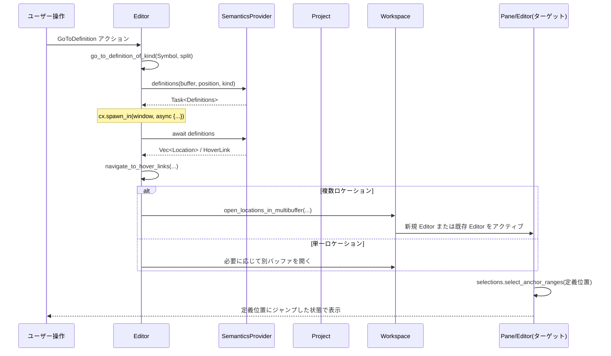

---

## 5. 使い方（How to Use）

このチャンクで定義されている機能は通常、エディタ UI やキーバインドから間接的に呼ばれますが、ここではコードから直接呼ぶ場合のイメージを示します。

### 5.1 基本的な使用方法

既に `Editor` エンティティを持っている前提で、ケース変換とコメントトグルを行う例です。

```rust
use crate::editor::Editor;
use crate::actions::{
    ConvertToUpperCase, ToggleComments, GoToDefinition,
};
use gpui::{Window, Context};

fn example_usage(
    editor: &mut Editor,
    window: &mut Window,
    cx: &mut Context<Editor>,
) {
    // 1. 選択範囲またはカーソル単語を大文字化
    let convert = ConvertToUpperCase; // 実際の型定義は別ファイル
    editor.convert_to_upper_case(&convert, window, cx);

    // 2. 現在行のコメントをトグル
    let toggle = ToggleComments {
        ignore_indent: false,
        advance_downwards: true,
    };
    editor.toggle_comments(&toggle, window, cx);

    // 3. カーソル位置のシンボル定義へジャンプ（非同期）
    let go_def = GoToDefinition;
    let task = editor.go_to_definition(&go_def, window, cx);
    task.detach(); // 結果は UI 側で反映される
}
```

※ `ConvertToUpperCase` や `ToggleComments` の具体的なフィールドはこのチャンクには出てこないため、上記はパターン例です。

### 5.2 よくある使用パターン

#### パターン1: 行操作（複製・移動・コメント）

```rust
// 行を複製（下方向）
editor.duplicate_line_down(&DuplicateLineDown, window, cx);

// 行を上に移動
editor.move_line_up(&MoveLineUp, window, cx);

// 選択行のコメントを一括トグル
editor.toggle_comments(
    &ToggleComments {
        ignore_indent: false,
        advance_downwards: false,
    },
    window,
    cx,
);
```

#### パターン2: マルチカーソル + マルチ変換

```rust
// カーソルを下方向に 3 回追加
for _ in 0..3 {
    editor.add_selection_below(
        &AddSelectionBelow { skip_soft_wrap: false },
        window,
        cx,
    );
}

// 4 つのカーソル位置の単語をすべてスネークケースに変換
editor.convert_to_snake_case(&ConvertToSnakeCase, window, cx);
```

#### パターン3: 診断／定義へのナビゲーション

```rust
// 次のエラーまたは警告へジャンプ
editor.go_to_diagnostic(
    &GoToDiagnostic {
        severity: GoToDiagnosticSeverityFilter::ErrorOrWarning,
    },
    window,
    cx,
);

// エラー箇所で Go to Definition
editor.go_to_definition(&GoToDefinition, window, cx);
```

### 5.3 よくある間違い

```rust
// 間違い例: read-only なエディタに対して編集操作を行う
if editor.read_only(cx) {
    // ここで何もしないのが正しいが…
}
editor.convert_to_upper_case(&ConvertToUpperCase, window, cx); // 実質 no-op になる

// 正しい例: read_only 状態をチェックしてから編集
if !editor.read_only(cx) {
    editor.convert_to_upper_case(&ConvertToUpperCase, window, cx);
}
```

```rust
// 間違い例: マルチバッファエディタに対して `set_text` を呼ぶ
editor.set_text("new text", window, cx); // シングルトン前提で panic する可能性がある

// 正しい例: set_text は単一バッファエディタにのみ使用
if editor.buffer().read(cx).is_singleton() {
    editor.set_text("new text", window, cx);
}
```

### 5.4 使用上の注意点（まとめ）

- **編集前提条件**
  - 多くの編集系メソッドは `read_only(cx)` をチェックしているか、呼び出し側でチェックすることが前提です。
- **シングルトン／マルチバッファ**
  - 一部のメソッド（`set_text`, 一部のフォールド、行移動など）は「シングルトンバッファ前提」で実装されています。`buffer().read(cx).is_singleton()` を確認してから使う必要があります。
- **LSP 依存機能**
  - Go to Definition / Rename / Format / Organize Imports / Diagnostics Pull などは、`Project` と LSP 設定が有効であることが前提です。そうでない場合、早期リターンします。
- **選択・トランザクション**
  - `transact` を通じて編集することで、Undo/Redo と選択復元、`EditorEvent::Edited` が適切に発火します。新しい編集コマンドを追加する場合も、このパターンに従うと一貫性が保てます。
- **折りたたみ・diff ハンクとの関係**
  - 行移動・行複製・go to 系コマンドは折りたたみや diff hunk を考慮しており、折りたたみを跨ぐような変更は自動的に展開 (`unfold_ranges`) される場合があります。

---

## 6. 変更の仕方（How to Modify）

### 6.1 新しい機能を追加する場合

このチャンクのスタイルに合わせて、新しい編集コマンドを追加する場合の一般的な手順です。

1. **アクション型の追加（必要なら）**
   - `crate::actions` 相当のモジュールに新しいアクション型（例: `struct ConvertToFooCase;`）を定義する（別ファイル）。
2. **Editor メソッドの追加**
   - `impl Editor` ブロック内に、アクションを受け取る `pub fn` を追加します。
   - 編集を伴う場合は、基本的に `self.transact(window, cx, |editor, window, cx| { ... })` を用いて実装します。
3. **既存ユーティリティの再利用**
   - 行単位変換なら `manipulate_lines` / `manipulate_immutable_lines` / `manipulate_mutable_lines`。
   - 文字列変換なら `manipulate_text`。
   - 折りたたみなら `fold_creases` / `unfold_ranges`。
   - 検索系なら `build_query` と `select_next_match_internal` などを参考にします。
4. **選択とスクロールの更新**
   - 選択変更には `self.change_selections(SelectionEffects::..., window, cx, |s| { ... })` を用いる。
   - スクロール位置調整が必要な場合は `Autoscroll::fit()` / `Autoscroll::newest()` を適切に指定します。
5. **イベント・履歴の更新**
   - Undo/Redo に選択を紐づけたい場合、`selection_history` を更新するトランザクションパターンを踏襲します。

### 6.2 既存の機能を変更する場合

変更の影響範囲を把握するためのポイントです。

- **選択の前後関係**
  - 多くの関数は「`Selection` が `disjoint` であること」を前提としています。分割・統合のロジックを変更する場合は、`selection_history` と `undo_selection / redo_selection` への影響に注意が必要です。
- **マルチバッファ対応**
  - フォールド・diff・diagnostics などはマルチバッファ対応のロジックを含んでいます。`buffer.snapshot().range_to_buffer_ranges(...)` などを使っている箇所では、Excerpt 境界を跨ぐケースに注意します。
- **LSP タスク**
  - `cx.spawn_in` / `cx.background_spawn` で起動しているタスクは、エディタやプロジェクトがドロップされるタイミングと競合し得ます。`editor.update_in` / `project.update` の戻り値チェックや `upgrade()` の有無など、現状のパターンを参考にする必要があります。
- **表示・設定フラグ**
  - `show_inline_diagnostics`, `diagnostics_max_severity`, `minimap_visibility` などのフラグは UI 表示に直結します。変更時には `cx.notify()` の呼び忘れがないか確認します。

---

## 7. 関連ファイル

このチャンクに登場する型・関数から推測できる関連モジュールをまとめます（正確なパスはこのチャンクからは分かりません）。

| パス（推定） | 役割 / 関係 |
|--------------|------------|
| `.../workspace.rs` | `Workspace` 型を定義し、ペインやエディタタブ、ナビゲーション履歴を管理。`open_locations_in_multibuffer` などで使用されています。 |
| `.../project.rs` | `Project` 型を定義し、LSP とのやり取り、フォーマット・コードアクション・診断取得などを提供。`perform_format`, `organize_imports` 等から呼ばれます。 |
| `.../multi_buffer.rs` | `MultiBuffer`, `MultiBufferSnapshot` を定義し、マルチバッファ構造（Excerpt 含む）のテキスト操作や diff 支援を提供。 |
| `.../display_map.rs` | `DisplayMap`, `DisplaySnapshot`, `Crease`, `CustomBlockId` 等を定義し、折りたたみ・ブロック・ソフトラップ・ミニマップ用の表示マッピングを管理。 |
| `.../language_settings.rs` | `LanguageSettings`, `RewrapBehavior`, コメント・ブロック設定、インデント設定などを管理。`toggle_comments`, `rewrap_impl` などで利用。 |
| `.../lsp/semantics_provider.rs` | `SemanticsProvider` を定義し、定義／参照／Rename／フォーマット等の LSP 機能をラップ。 |
| `.../diagnostics.rs` | `DiagnosticEntryRef`, `GlobalDiagnosticRenderer` 等を定義し、診断メッセージの取得とインライン表示をサポート。 |
| `.../git/diff.rs` | `MultiBufferDiffHunk` や diff 操作 (`stage_or_unstage_hunks`) を提供し、差分ハンクのステージ／アンステージ／適用に使用。 |

> 上記パスは、このチャンクに現れる型名とモジュール参照から推測したものであり、正確なファイル構成はこのチャンク単体からは分かりません。

---

# editor/ ディレクトリ解説（chunk 5/10 抜粋）

> このチャンクには `editor/src/editor.rs` の後半・`editor_settings.rs`・`editor_tests.rs`・`editor_tests/property_test.rs` の一部が含まれています。  
> `Editor` 型やテスト補助コードの前半はこのチャンクには含まれていません。

---

## 1. ざっくり一言

- アプリ内のメインテキストエディタ `Editor` の **入力処理・補完・LSP連携・フォールディング・差分表示・コラボレーション** など、高度な振る舞いを実装するコードと、その挙動を検証する包括的なテスト群です。
- あわせて、エディタ全体の挙動を制御する `EditorSettings` の設定構造体も定義されています。

---

## 2. このモジュールの役割

### 2.1 概要

- このディレクトリは **テキストエディタ UI コンポーネント `Editor` の実装と設定、テスト** をまとめたモジュール群です。
- 主に次の問題を解決します。
  - マルチバイト文字・ソフトラップ・フォールディングを含む **複雑なカーソル／選択・スクロール制御**
  - LSP・プロジェクトと統合された **補完・コードアクション・インレイヒント・差分表示**
  - IME／アクセシビリティキーボードなど OS からの **テキスト入力イベント処理**
  - コラボレーション（他ユーザーのカーソル表示等）やデバッガブレークポイント編集用 UI など周辺機能

### 2.2 アーキテクチャ内での位置づけ

このチャンクに現れる依存関係を簡略化すると、次のようになります。

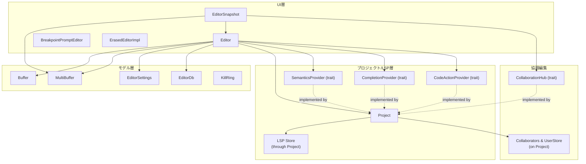

このチャンクでは特に次のレイヤ間連携が実装されています。

- `Editor` ⇔ `Buffer` / `MultiBuffer`  
  選択・編集・フォールディング・差分などの反映。
- `Editor` ⇔ `Project`（`SemanticsProvider` / `CompletionProvider` / `CodeActionProvider` 実装として）  
  補完・インレイヒント・シンボル情報・リネーム等の LSP/デバッガ連携。
- `EditorSnapshot` ⇔ `CollaborationHub`  
  他ユーザーの遠隔カーソルや選択範囲の描画。
- `Editor` ⇔ `EditorDb`  
  フォールド状態・選択範囲・スクロール位置の永続化・復元。

### 2.3 設計上のポイント

コードから読み取れる主な設計方針は次のとおりです。

- **状態の分離**
  - `Editor` 本体は UI 状態と編集操作を担当。
  - `EditorSnapshot` は描画用の静的スナップショット（fold・wrap・diff などの変換済み）を保持し、ビュー系の計算を集約。
- **マルチバッファ対応**
  - `MultiBuffer` による単一ファイル・複数ファイル／抜粋（excerpt）・差分ビューを同じ API で扱う。
  - `MultiBufferOffset` / `Anchor` / `DisplayPoint` など複数の座標系を使い分け、編集・描画・LSP それぞれに適切な変換を行う。
- **イベント駆動・非同期処理**
  - `EditorEvent` によるエディタ内部イベントの通知（Edited, BufferEdited, SelectionsChanged など）。
  - `Task` と `cx.background_spawn` による LSP 通信や diff 計算などのバックグラウンド処理。
- **拡張ポイントの明示**
  - `SemanticsProvider` / `CompletionProvider` / `CodeActionProvider` / `CollaborationHub` といった trait によって、LSP や協調編集などの実装を差し替え可能にしている。
  - `Editor::register_addon` によるプラグイン的な Addon の登録。
- **入力系のきめ細かな制御**
  - IME コンポジション、アクセシビリティキーボード、複数カーソル時の replacementRange の扱いなどを詳細に制御。
  - `NewlineConfig` やコメント／リスト検出関数による、言語ごとの改行時の自動整形。
- **テスト重視**
  - 巨大な `editor_tests.rs` によってカーソル移動・フォールディング・改行・削除・スクロールなど、多くの機能が振る舞いレベルで検証されている。
  - `property_test.rs` ではプロパティベーステストにより、ランダムな編集操作列に対する堅牢性を検証。

---

## 3. 主要な機能一覧

このチャンクに含まれる主な機能を挙げます（ディレクトリ全体の一部です）。

- テキスト入力・IME関連
  - IME コンポジション範囲の管理（`marked_text_ranges`、`replace_text_in_range`、`replace_and_mark_text_in_range`）
  - 保留中入力の下線ハイライト（`observe_pending_input`）
  - クリップボード連携（ハイライト情報付き JSON コピーなど）
- カーソル・選択・座標変換
  - UTF-16 オフセットと内部座標の相互変換（`selection_replacement_ranges` など）
  - 表示座標 ⇔ ピクセル座標変換（`to_pixel_point` / `display_to_pixel_point` / `bounds_for_range`）
  - 相対行番号計算や行番号幅の算出（`calculate_relative_line_numbers` / `max_line_number_width`）
- LSP・セマンティクス連携
  - LSP データの有効化／無効化、更新（`lsp_data_enabled` / `update_lsp_data` / `register_visible_buffers` / `register_buffer`）
  - `SemanticsProvider` trait によるホバー・インレイヒント・semantic tokens・rename 等のインターフェイス
  - `CompletionProvider` / `snippet_completions` による補完候補の取得・スニペット補完
  - `CodeActionProvider` によるコードアクション取得・適用
- 差分・git 連携
  - 編集中差分のロード・反映（`update_uncommitted_diff_for_buffer`）
  - フォールド & diff 状態の DB からの復元（`read_metadata_from_db` / `load_folds_from_db`）
  - 画面上の diff ハンク計算・操作 UI（`EditorSnapshot::hunks_for_ranges` / `display_diff_hunks_for_rows` / `render_diff_hunk_controls`）
- 折りたたみ・ガター・描画
  - フォールドトグルやトレーラーの描画（`render_crease_toggle` / `render_crease_trailer`）
  - ガター幅・ blame 情報の描画幅計算（`gutter_dimensions`）
  - 行ハイライト構造（`LineHighlight`）
- 自動整形・改行ロジック
  - コメント・ドキュメンテーションコメント・リスト・Markdown に対する改行時のプレフィックス付与（`comment_delimiter_for_newline` / `documentation_delimiter_for_newline` / `list_delimiter_for_newline` / `is_list_prefix_row`）
  - かっこ中改行や bracket 解析（`NewlineConfig` 内の `insert_extra_newline_*`）
  - 単語分割・折り返し処理（`WordBreakingTokenizer` / `wrap_with_prefix`）
- コラボレーション・デバッグ
  - 他ユーザーのリモート選択レンジ描画（`EditorSnapshot::remote_selections_in_range` と `CollaborationHub`）
  - ブレークポイント編集用エディタ（`BreakpointPromptEditor`）
- 設定・テーマ
  - エディタ全体の設定（`EditorSettings`）とガター・スクロールバーなどのサブ設定構造体
  - テーマやフォントに基づく `EditorStyle` の生成（`create_style`）
- テスト関連
  - `Editor` に対するプロパティベーステストのランダム操作適用（`apply_test_action`）
  - 多数の通常テストで、undo/redo・選択操作・改行・折りたたみ・スクロール等の挙動を検証

---

## 4. 関数・構造体の解説

### 4.1 主要な型一覧

このチャンクに現れる、外部からも把握しておくとよい主な型です（テスト専用を除く）。

| 名前 | 種別 | 役割 / 用途 |
|------|------|-------------|
| `Editor` | 構造体 | メインのテキストエディタコンポーネント。入力処理・選択・フォールディング・LSP 連携など多数のメソッドを持つ（本チャンクでは後半メソッドのみ）。 |
| `EditorSnapshot` | 構造体 | 表示用スナップショット。折り畳み・ラップ・diff を反映した状態で、行番号・diff ハンク・リモート選択などの計算に使う。 |
| `EditorSettings` | 構造体 | カーソル・スクロール・ミニマップ・ガター・検索などエディタ全体のユーザ設定。`Settings` トレイト経由で設定ファイルから生成。 |
| `WordBreakingTokenizer<'a>` | 構造体＋イテレータ | 文字列を「単語」「インライン空白」「改行」にトークン化する。グラフェムクラスタ・漢字系の句読点を考慮。 |
| `WordBreakToken<'a>` | enum | `Word` / `InlineWhitespace` / `Newline` のいずれか。`wrap_with_prefix` で使用。 |
| `NewlineConfig` | enum | 改行操作時の挙動（追加インデント・行クリア・アンインデント＋継続テキストなど）を表す内部設定。 |
| `CompletionEdit` | 構造体 | 補完を適用する際の挿入テキスト・置換レンジ・スニペット情報をまとめた結果。`process_completion_for_edit` が返す。 |
| `CollaborationHub` | trait | コラボレーション情報を提供する抽象インターフェイス。`Entity<Project>` が実装しており、`EditorSnapshot::remote_selections_in_range` から利用。 |
| `SemanticsProvider` | trait | hover / inlay hints / semantic tokens / rename など、言語サーバーベースのセマンティクス機能のインターフェイス。`WeakEntity<Project>` が実装。 |
| `CompletionProvider` | trait | 補完候補取得・補完後追加編集などのインターフェイス。`Entity<Project>` が実装。 |
| `CodeActionProvider` | trait | コードアクションの取得・適用インターフェイス。`Entity<Project>` が実装。 |
| `EditorEvent` | enum | エディタで発生するイベント（編集・保存・スクロール・選択変更など）。UI や他コンポーネントとの連携に利用。 |
| `ErasedEditorImpl` | 構造体 | `Editor` を `ui_input::ErasedEditor` として隠蔽し、共通テキスト入力コンポーネントとして扱うためのアダプタ。 |
| `BreakpointPromptEditor` | 構造体 | ブレークポイントのログメッセージや条件式を編集するための小さなエディタ＋UI。 |
| `LineHighlight` | 構造体 | 行背景・枠線・ガターへの適用範囲など、行単位のハイライトを表現。 |
| `KillRing` | 構造体（`Global`実装） | Emacs 的な kill-ring 風のテキスト保存に使うグローバルクリップボード（詳細はこのチャンク外）。 |

テスト専用として、`Direction` や `TestAction`、`EditorTestContext` など多数の補助型が登場しますが、ここでは割愛します。

---

### 4.2 重要な関数・メソッド詳細

このチャンクで特に重要と思われる代表的なものを 6 つ取り上げます。

#### 4.2.1 `Editor::replace_text_in_range`

```rust
fn replace_text_in_range(
    &mut self,
    range_utf16: Option<Range<usize>>,
    text: &str,
    window: &mut Window,
    cx: &mut Context<Self>,
)
```

**概要**

- OS からの「この UTF‑16 範囲のテキストを別の文字列で置き換えてほしい」という要求（主に IME やアクセシビリティキーボードの完了）を処理します。
- 単一カーソル／複数カーソル・IME コンポジション中・アクセシビリティキーボードの word completion など、さまざまなケースを安全に扱うための中心的なメソッドです。

**主な引数**

| 引数名 | 型 | 説明 |
|--------|----|------|
| `range_utf16` | `Option<Range<usize>>` | macOS などから渡される UTF‑16 オフセットでの置換範囲。`None` の場合は「現在の IME マーク範囲」を意味します。 |
| `text` | `&str` | 挿入するテキスト。空文字も可。 |
| `window` | `&mut Window` | UI コンテキスト。スクロール・再描画などに利用。 |
| `cx` | `&mut Context<Editor>` | エディタ用コンテキスト。バッファ更新・イベント発火などに利用。 |

**戻り値**

- 戻り値はなく、副作用としてバッファと選択状態を更新します。
- 併せて `EditorEvent::InputHandled` または `EditorEvent::InputIgnored` を発火します。

**内部処理の流れ（簡略）**

1. `self.input_enabled` が `false` なら `InputIgnored` を emit して即 return。
2. `self.transact` でトランザクションを開始し、その中で:
   - `new_selected_ranges` を決定:
     - IME コンポジション中（`marked_text_ranges` が存在）なら、そのマーク範囲を置換対象とする。
     - そうでなく `range_utf16` が非空なら、`selection_replacement_ranges` を使って **最新カーソル相対の差分を全カーソルに展開**。
     - `range_utf16` が空範囲（`start == end`）なら、「カーソル位置に挿入」と解釈し、選択範囲は変更しない。
   - `utf16_range_to_replace` を latest selection からの相対オフセットとして計算し、`EditorEvent::InputHandled` を emit。
   - `new_selected_ranges` があれば `change_selections` で選択範囲を更新し、少なくとも 1 つが非空なら `backspace` でそのテキストを削除。
   - 最後に `handle_input(text, window, cx)` で通常の文字入力として `text` を挿入（自動クオート補完などもここで処理）。
3. トランザクション ID を IME 用にグルーピング（`ime_transaction`）し、必要に応じてバッファ側で `group_until_transaction` を呼び、Undo/Redo で一塊として扱えるようにする。
4. IME ハイライトを `unmark_text` でクリア。

**Edge cases（代表例）**

- `range_utf16` が空範囲・IME コンポジション中でない場合:  
  → 単純な挿入として扱い、既存文字は削除しません。
- IME コンポジション中で `range_utf16` が `Some` の場合:  
  → `range_utf16` は「最初のマーク範囲からの相対」として扱われ、すべてのマーク範囲に相対的に適用されます。
- 複数カーソル＋アクセシビリティキーボードのように、OS が「最新カーソルだけを前提にした range」を送ってくる場合:  
  → `selection_replacement_ranges` が他カーソルの相対オフセットを計算し、それぞれに適切な範囲を割り当てます（テスト `test_accessibility_keyboard_word_completion` が挙動を確認）。

**使用上の注意点**

- このメソッドは通常 OS から呼ばれることを前提としているため、アプリケーションコードから直接呼ぶケースは少ないと考えられます（このチャンクでは明示的な外部呼び出しはありません）。
- `input_enabled` / `read_only` フラグに注意する必要があります。`read_only` はここでは見ていませんが、テキスト挿入全般では一貫して考慮されています。

---

#### 4.2.2 `Editor::replace_and_mark_text_in_range`

```rust
fn replace_and_mark_text_in_range(
    &mut self,
    range_utf16: Option<Range<usize>>,
    text: &str,
    new_selected_range_utf16: Option<Range<usize>>,
    window: &mut Window,
    cx: &mut Context<Self>,
)
```

**概要**

- IME コンポジション中に、編集中のマーク範囲を更新するためのメソッドです。
- マーク範囲への置換・新しいマーク範囲の指定・強調表示（下線）などを行います。

**ポイント**

- `replace_text_in_range` と似ていますが、「確定」ではなく「まだ変換中」のテキストを扱うため、`HighlightKey::InputComposition` で下線を引き、`use_autoclose` / `use_auto_surround` を一時的に無効化して自動クオート等を避けています。
- `new_selected_range_utf16` が指定されると、マーク範囲内でのカーソル位置（例えば候補中の一部を選択）を UTF‑16 オフセットで指定できます。これもすべてのカーソルに対して相対的に複製されます。
- トランザクション ID を `ime_transaction` に保持し、ハイライトが消えたタイミングでグルーピングを解除する処理もここで行われます。

**テストとの関係**

- `test_ime_composition` において、多段階の IME 編集・Undo/Redo・複数カーソルでのマーク範囲の扱いが詳細に検証されています。

---

#### 4.2.3 `process_completion_for_edit`

```rust
fn process_completion_for_edit(
    completion: &Completion,
    intent: CompletionIntent,
    buffer: &Entity<Buffer>,
    cursor_position: &text::Anchor,
    cx: &mut Context<Editor>,
) -> CompletionEdit
```

**概要**

- LSP 等から得られた `Completion` を、「実際にバッファにどう適用するか」に変換します。
- スニペット・挿入モード／置換モードの違い・`insert_range` と `replace_range` の扱いなどを統合し、`CompletionEdit` として返します。

**引数**

| 引数名 | 型 | 説明 |
|--------|----|------|
| `completion` | `&Completion` | LSP などから提供された補完候補。 |
| `intent` | `CompletionIntent` | ユーザーが「挿入モードで補完」するか「置換モードで補完」するかなどを表す意図。 |
| `buffer` | `&Entity<Buffer>` | 対象バッファ。スナップショットを取得して文脈・文字列を読む。 |
| `cursor_position` | `&text::Anchor` | カーソル位置。挿入／置換範囲の境界として利用。 |
| `cx` | `&mut Context<Editor>` | コンテキスト（言語設定の取得など）。 |

**戻り値**

- `CompletionEdit`:
  - `new_text`: 実際にバッファに挿入される文字列（スニペットなら整形後のプレーンテキスト）。
  - `replace_range`: `text::Anchor` ベースの置換範囲。
  - `snippet`: `Option<Snippet>`。スニペット補完の場合に利用。

**内部処理の流れ（簡略）**

1. バッファのスナップショットを取得。
2. スニペットかどうかで分岐:
   - `completion.is_snippet()` が true の場合:
     - まず `completion.new_text` を `snippet_source` とする。
     - TypeScript の特殊ケース回避として、`language_scope_at(previous_point)` が `prefers_label_for_snippet_in_completion()` を返し、かつ `CompletionItemKind` が FUNCTION/METHOD の場合は、`label` をスニペットとして使う。
     - `Snippet::parse` を試し、成功したら `snippet` にパース済みの `Snippet` を入れ、`new_text` はその `.text`。失敗したらスニペット扱いをやめ、生の `completion.new_text` を使用。
   - スニペットでない場合は `snippet = None`, `new_text = completion.new_text.clone()`。
3. 置換レンジの決定:
   - 基本は `completion.replace_range`。
   - ただし LSP 由来かつ `insert_range` を持つ場合は:
     - `insert_range.start` と `replace_range.start` が同じであること、どちらも `cursor_position` 以前であることを `debug_assert`。
     - `intent` と言語設定 (`LanguageSettings::for_buffer(...).completions.lsp_insert_mode`) に応じて「insert_range を使うか」「replace_range を使うか」を決定。
       - `LspInsertMode::ReplaceSubsequence` では、`replace_range` 内のテキストが `label.text` に subsequence として現れるかどうかで判定。
       - `LspInsertMode::ReplaceSuffix` では、カーソル以降のテキストが label のサフィックスになっているかどうかで判定。
   - 最終的な範囲を `range_to_replace` とする。
4. 安全のため、`range_to_replace.end` が `cursor_position` よりも後ろにならないように `end = cursor_position` でクリップ。
5. `CompletionEdit` を返す。

**Edge cases**

- `replace_range.end` がカーソルより前のケース:  
  → end をカーソルに切り詰めることで、カーソルより後ろを誤って消さないようにしています。
- サーバ側が `insert_range` と `replace_range` を分離している場合:
  - ユーザー設定や `CompletionIntent` に応じ、挿入モード／置換モードを自動で切り替えます。

**使用上の注意点**

- この関数は `Completion` 構造体の契約（`replace_range` / `insert_range` の意味）に依存しているため、`Completion` を生成する側はその前提を守る必要があります。
- 新しい `LspInsertMode` が追加された場合、ここのマッチングロジックを拡張する必要があります。

---

#### 4.2.4 `WordBreakingTokenizer<'a>` と `wrap_with_prefix`

```rust
struct WordBreakingTokenizer<'a> {
    input: &'a str,
}

impl<'a> Iterator for WordBreakingTokenizer<'a> {
    type Item = WordBreakToken<'a>;
    fn next(&mut self) -> Option<Self::Item> { ... }
}
```

```rust
fn wrap_with_prefix(
    first_line_prefix: String,
    subsequent_lines_prefix: String,
    unwrapped_text: String,
    wrap_column: usize,
    tab_size: NonZeroU32,
    preserve_existing_whitespace: bool,
) -> String
```

**概要**

- `WordBreakingTokenizer` は文字列を「単語」「インライン空白」「改行」に分解するトークナイザです。  
  Unicode のグラフェム境界と単語境界を組み合わせて扱います。
- `wrap_with_prefix` はこのトークナイザを使ってテキストを折り返し、  
  行頭にプレフィックス（コメント記号など）を付与しつつ wrap します。

**`WordBreakingTokenizer` の特徴**

- `unicode_segmentation::UnicodeSegmentation` により、**グラフェムクラスタ**単位で処理。
- 漢字・中国語などの **表意文字（ideographic）** を特別扱い:
  - `is_char_ideographic` と `should_stay_with_preceding_ideograph` により、  
    「原理，进而」のように句読点を前の漢字とまとめて 1 トークンにする。
- `split_word_bound_indices` を利用し、英語などでは一般的な単語境界で `Word` をまとめる。
- 出力トークンは:
  - `Word { token, grapheme_len }`
  - `InlineWhitespace { token, grapheme_len }`
  - `Newline`

**`wrap_with_prefix` の処理概要**

1. 先頭行／以降の行それぞれのプレフィックス幅を、タブ展開を考慮して計算（`char_len_with_expanded_tabs`）。
2. `WordBreakingTokenizer` で `unwrapped_text` を順に取り出す。
3. 各トークンに対して:
   - `Word`:
     - 現在行の長さ＋単語長が `wrap_column` を超える場合、かつ行がプレフィックスだけでない場合は改行し、新しい行を `subsequent_lines_prefix` から開始。
     - 単語を `current_line` に追加。
   - `InlineWhitespace`:
     - `preserve_existing_whitespace` が `false` のときは連続空白を 1 グラフェムに縮約（例: 連続スペースを 1 つに）。
     - wrap しきい値を超える場合は改行。
     - 行頭直後の空白は、`preserve_existing_whitespace` が `false` の時には挿入しない（不要な前置空白を避ける）。
   - `Newline`:
     - `preserve_existing_whitespace` が `true` の場合: 強制改行として現在行を flush。
     - そうでない場合: 前に空白があれば無視する・1 文字のスペースに変換する、など条件に応じて処理。
4. 最後の `current_line` を結果文字列に追加して返す。

**テストから読み取れる挙動**

- `"abcdefg"` を幅 4 で `#` プレフィックス付き wrap → `"# abcdefg"`（テスト `test_wrap_with_prefix`）。
- タブを含む文字列の wrap では、`tab_size` に基づいて見かけの幅が計算される。
- 中国語のような表意文字列 `"这是什么 \n 钢笔"` も意図通りに分割される（3 文字ごとに wrap）。

**使用上の注意点**

- `wrap_column` は「グラフェム数 + タブ展開」を基準にした幅であり、単純なバイト長ではありません。
- 既存空白を保つかどうか（`preserve_existing_whitespace`）で挙動が大きく変わります。  
  コメント整形など「見た目通りに空白を残したい」場合は `true` を使うとよいです。

---

#### 4.2.5 `snippet_completions`

```rust
fn snippet_completions(
    project: &Project,
    buffer: &Entity<Buffer>,
    buffer_anchor: text::Anchor,
    classifier: CharClassifier,
    cx: &mut App,
) -> Task<Result<CompletionResponse>>
```

**概要**

- 言語ごとのスニペットストアから、現在カーソル位置に適用可能なスニペット補完候補を計算する関数です。
- スニペットの prefix と、バッファ内の直前テキストの **word 境界に基づく suffix** を比較し、fuzzy マッチングで候補を選択します。

**主な処理**

1. 対象バッファの `languages_at(buffer_anchor)` を取得し、それぞれに対してスニペット一覧 `snippets_for(Some(language_name), cx)` を取得。
2. スニペットが存在する言語だけを集めて処理対象にする。該当言語がなければ空の `CompletionResponse` を即返す。
3. カーソル位置直前のテキスト最大 128 文字を抽出し、`snippet_candidate_suffixes` で単語境界ごとの suffix を列挙。
4. 各スニペットの各 prefix について「単語数」を数え、多いものから優先（長い prefix を優先的にマッチ）。
5. `fuzzy::match_strings` で buffer の suffix と prefix 候補を fuzzy マッチングし、最大 100 件まで `StringMatch` を集める。
6. 各マッチに対して `Completion` 構造体を組み立てる:
   - `replace_range` は buffer 内の `buffer_offset - buffer_window_len .. buffer_offset`。
   - LSP の `CompletionItem` 相当のメタ情報（ドキュメント、表示用ラベルなど）も組み立てる。
7. `CompletionResponse { completions, is_incomplete }` を返す。

**Edge cases**

- 最大結果数を超えた場合、`is_incomplete = true` として呼び出し側に「まだ候補があるかもしれない」ことを示します。
- プレフィックスの文字数だけでなく「単語数」を使って優先順位をつけているため、複数単語から成る prefix を優先的にマッチします。

**使用上の注意点**

- スニペット定義側（`Project::snippets()`）が prefix を適切に設定していることが前提です。
- `classifier.is_word` による「単語文字」判定に依存しているため、言語ごとに望ましい `CharClassifier` を渡す必要があります。

---

#### 4.2.6 `EditorSnapshot::remote_selections_in_range`

```rust
impl EditorSnapshot {
    pub fn remote_selections_in_range<'a>(
        &'a self,
        range: &'a Range<Anchor>,
        collaboration_hub: &dyn CollaborationHub,
        cx: &'a App,
    ) -> impl 'a + Iterator<Item = RemoteSelection> {
        ...
    }
}
```

**概要**

- 指定 anchor 範囲内にある、他のレプリカ（コラボレーター）の選択範囲を `RemoteSelection` として列挙します。
- コラボレーション（共同編集）時に、他人のカーソル・選択をエディタ上に描画する際に使われます。

**処理の要点**

1. `CollaborationHub` から:
   - `collaborators()`（peer ID → `Collaborator`）
   - `user_participant_indices()`（ユーザー ID → 色付け用インデックス）
   - `user_names()`（ユーザー ID → 表示名）
   を取得。
2. `buffer_snapshot().selections_in_range(range, false)` で範囲内の全レプリカの選択を列挙。
3. 各 `(replica_id, line_mode, cursor_shape, selection)` に対して:
   - `ReplicaId::AGENT` の場合: 特別な「Agent」名と agent 用の色を使用。
   - それ以外の場合:
     - `replica_id` から `Collaborator` を特定し、ユーザー ID から参加者インデックス・名前を引く。
     - 参加者インデックスがあれば `players().color_for_participant(index)` で色を決定。なければ `players().absent()` でデフォルト色。
4. `RemoteSelection` 構造体にまとめてイテレータとして返す。

**使用上の注意点**

- `CollaborationHub` の実装（ここでは `Entity<Project>`）が、参加者情報を正しく返していることが前提です。
- `ReplicaId::AGENT` は内部的な自動操作用のレプリカを表し、ユーザーとは別枠で扱われます。

---

#### 4.2.7 `comment_delimiter_for_newline` / `documentation_delimiter_for_newline` / `list_delimiter_for_newline`

これらはすべて「改行時に自動的に挿入するコメント・リスト記号等を決める」ための補助関数です。  
ここでは共通の観点だけ簡潔にまとめます。

- `comment_delimiter_for_newline`:
  - 行頭の空白数・コメントプレフィックス（`language.line_comment_prefixes()`）を解析し、
  - カーソル位置がコメントプレフィックスの後かどうかを見て、必要に応じて同じデリミタ（`//` など）を返す。
  - 特殊な REPL セパレータ（`%%` のようなもの）に対しては、空行を挿入したい場合はプレフィックスを抑制するなどの分岐も含まれる。
- `documentation_delimiter_for_newline`:
  - ドキュメント用ブロックコメント（例えば `/** ... */`）内かどうかを判定し、
  - 始端タグ（`/**`）・終端タグ（`*/`）の位置、cursor 位置などから、
    - 中央行では `*` を挿入
    - 終端直前では追加の空行やインデントを調整
  - といった `NewlineConfig::Newline` を返す。
- `list_delimiter_for_newline`:
  - 言語設定中の task list / unordered list / ordered list のプレフィックス情報を元に、
  - 行頭に `- [ ]` や `1.` などのマーカーがあるかを正規表現や文字列比較で確認。
  - カーソル位置とマーカーの位置・行内テキスト有無をもとに、
    - 新しいリスト項目のマーカーを返すか
    - 現在行をクリア／アンインデントするか
  - を決定。

**テストとの関係**

- `test_newline_comments` / `test_newline_comments_with_multiple_delimiters` / `test_newline_documentation_comments` / `test_newline_yaml` など多くのテストが、これらの関数を（間接的に）利用する `Editor::newline` の挙動を検証しています。

---

### 4.3 その他の補助関数・メソッド（抜粋）

このチャンクには多数の補助関数があり、すべてを列挙することはできないため、代表的なものだけを挙げます。

| 関数名 | 役割（1 行） |
|--------|--------------|
| `edit_for_markdown_paste` | 選択テキスト＋URL のペースト時に、`[text](url)` 形式に変換するかどうかを決定。 |
| `char_len_with_expanded_tabs` | タブを指定サイズで展開したときの表示幅を計算。 |
| `update_uncommitted_diff_for_buffer` | プロジェクトから未コミット差分を取得し、`MultiBuffer` に diff を適用。 |
| `edit_prediction_edit_text` / `edit_prediction_fallback_text` | Edit prediction（補完の一種）の内容を `HighlightedText` として整形。 |
| `diagnostic_style` | LSP 診断の severity に応じた色を選択。 |
| `styled_runs_for_code_label` | 補完メニュー用ラベル文字列に対してハイライトスタイルを与える。 |
| `snippet_candidate_suffixes` | 文字列末尾から単語境界ごとの suffix を列挙し、スニペット prefix マッチングに利用。 |
| `column_pixels` | 指定列数の文字をレンダリングしたときの幅（Pixels）を計算。行番号幅計算に使用。 |
| `multibuffer_context_lines` | 抜粋表示時のコンテキスト行数設定（`EditorSettings` から取得）。 |

---

## 5. データフロー

### 5.1 代表シナリオ: IME コンポジションの処理フロー

IME 編集（変換中の文字列入力）の流れは、OS → エディタ → バッファの間で次のように行われます。

1. OS の IME が `insertText:replacementRange:` 相当のイベントを発火。
2. フレームワークが `Editor` の `EntityInputHandler::replace_and_mark_text_in_range` または `replace_text_in_range` を呼び出す。
3. `Editor` は現在の選択・マーク範囲・UTF‑16 オフセットを解析し、マルチカーソルに展開した置換レンジを計算。
4. 実際のテキスト編集は `Editor::handle_input` 経由で `Buffer` に対して行われ、同時に IME 用ハイライトが付与／削除される。
5. 関連する編集は同一トランザクションとしてグルーピングされ、Undo/Redo で一括操作可能になる。

これをシーケンス図で表すと次のようになります。

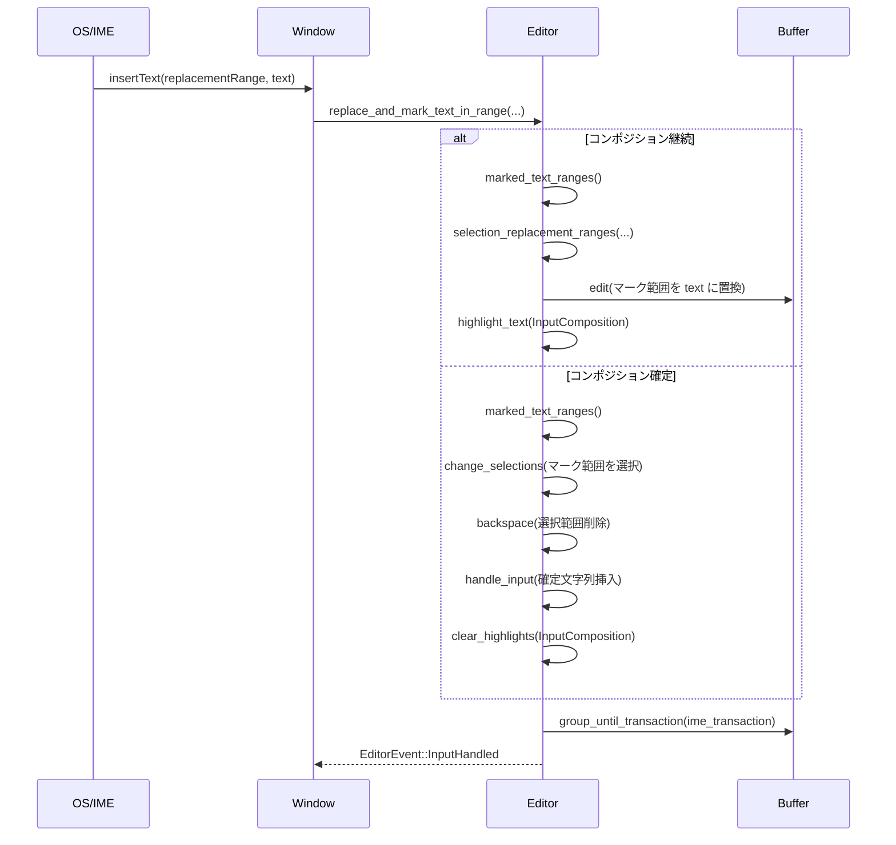

**要点**

- `selection_replacement_ranges` により、**最新カーソル基準の UTF‑16 範囲**を他カーソルに転写している点が重要です。
- `ime_transaction` によるトランザクショングルーピングのおかげで、IME で何回か中間変換しても Undo/Redo は 1 回の操作として扱われます（`test_ime_composition` 参照）。
- IME ハイライトが消えたタイミングで `ime_transaction` もクリアされます。

---

## 6. 使い方（How to Use）

### 6.1 基本的な使用方法

このチャンクだけでは `Editor` のコンストラクタ全体は見えませんが、テストと `BreakpointPromptEditor::new` から、典型的な使い方の一例が読み取れます。

#### 単一行エディタを作る

```rust
use gpui::{App, Window};
use multi_buffer::MultiBuffer;
use language::Buffer as LangBuffer;
use editor::Editor;

fn create_single_line_editor(window: &mut Window, cx: &mut App) -> Editor {
    // 空のバッファを作成する
    let buffer = cx.new(|cx| LangBuffer::local("", cx));               // テキストバッファ
    let multibuffer = cx.new(|cx| MultiBuffer::singleton(buffer, cx)); // 単一バッファの MultiBuffer

    // 単一行モードの Editor を作成する
    // `Editor::single_line` の定義はこのチャンク外ですが、テストから存在が確認できます。
    let mut editor = Editor::single_line(window, cx);                  // 1 行入力用エディタ

    // 必要に応じてテキストやプレースホルダを設定
    editor.set_text("初期値", window, cx);                              // 初期テキスト
    editor.set_placeholder_text("ここに入力...", window, cx);          // プレースホルダ

    editor
}
```

#### ブレークポイントメッセージ編集用の小さなエディタ

`BreakpointPromptEditor::new` は、`Editor` を使って UI 内に小さなオートハイトエディタを埋め込む例になっています。

```rust
// 抜粋: BreakpointPromptEditor::new より
let buffer = cx.new(|cx| Buffer::local(base_text, cx));           // 行内テキストを持つ Buffer
let buffer = cx.new(|cx| MultiBuffer::singleton(buffer, cx));     // MultiBuffer に包む

let prompt = cx.new(|cx| {
    let mut prompt = Editor::new(
        EditorMode::AutoHeight {                // 高さ自動調整モード
            min_lines: 1,
            max_lines: Some(Self::MAX_LINES as usize),
        },
        buffer,                                 // 編集対象 MultiBuffer
        None,                                   // Project とは未接続
        window,
        cx,
    );
    prompt.set_soft_wrap_mode(
        language::language_settings::SoftWrap::EditorWidth,
        cx,
    );
    prompt.set_show_cursor_when_unfocused(false, cx);
    prompt.set_placeholder_text(
        "Breakpoint hit 時のログメッセージ",
        window,
        cx,
    );
    prompt
});
```

**ポイント**

- `EditorMode::AutoHeight` により、最小／最大行数を指定しつつ高さを自動調整できます。
- LSP やプロジェクト連携が不要な場合は `project: None` でよいように見えます（このチャンクには `Editor::new` の全シグネチャはありませんが、呼び出しから読み取れる範囲です）。

### 6.2 よくある使用パターン（このチャンクから分かる範囲）

1. **補完や LSP 機能を `Project` から提供する**

   - `Entity<Project>` は `CompletionProvider` / `SemanticsProvider` / `CodeActionProvider` を実装しています。
   - エディタ側からは `project.completions(...)` や `project.hover(...)` などを通じて LSP ベースの機能を利用しています（呼び出しはこのチャンク外）。

   新しい `Project` 実装を導入する場合は、これらの trait を実装することで `Editor` との連携ができる構造になっています。

2. **コラボレーション情報の提供**

   - `CollaborationHub` trait を `Project` が実装することで、`EditorSnapshot::remote_selections_in_range` がユーザー名や色を解決できます。
   - 別のコラボレーションバックエンドを導入する場合、この trait を実装するのが入口になります。

3. **設定の参照**

   - `EditorSettings::get_global(cx)` でグローバル設定を取得し、スクロールバーやミニマップなどの挙動を決めています（`create_style` や `gutter_dimensions` 内で使用）。

   例:

   ```rust
   use editor::editor_settings::EditorSettings;

   fn scroll_beyond_last_line_enabled(cx: &App) -> bool {
       matches!(
           EditorSettings::get_global(cx).scroll_beyond_last_line,
           ScrollBeyondLastLine::OnePage | ScrollBeyondLastLine::HalfPage
       )
   }
   ```

### 6.3 使用上の注意点（まとめ）

このチャンクから読み取れる、共通の注意点を列挙します。

- **コンテキストオブジェクトの扱い**
  - 多くのメソッドは `&mut Window` と `&mut Context<Editor>` / `&mut App` を引数に取ります。  
    UI スレッド上でのみ呼び出される前提で設計されているため、非同期タスクから UI 操作を行う場合は `cx.spawn` / `cx.background_spawn` などの正しい API を通じる必要があります。
- **`input_enabled` / `read_only` フラグ**
  - テキスト入力関連メソッド（`replace_text_in_range` / `replay_insert_event` / `newline` など）は、これらのフラグを見て操作を拒否する場合があります。  
    テスト `test_newline_respects_read_only` が、読み取り専用エディタでの挙動を確認しています。
- **マルチカーソル時の範囲指定**
  - UTF‑16 ベースの `range` は OS の想定（単一カーソル）とエディタ内部の複数カーソル状態がズレることがあります。そのため `selection_replacement_ranges` による相対オフセットの適用が必須です。
- **Undo/Redo のグルーピング**
  - IME 入力・自動ペンディング入力・edit prediction など、複数の編集をまとめて 1 回分として扱うためにトランザクション ID を利用しています。  
    独自の連続編集を導入する場合も、`buffer.start_transaction_at` / `group_until_transaction` との整合を考える必要があります。
- **言語設定依存の挙動**
  - コメント・ドキュメントコメント・リスト・折りたたみ・インデントなどは、`Language` や `LanguageSettings`、各種クエリに強く依存しています。  
    新しい言語を追加する場合は、これら設定を正しく定義しないと `newline` 等の挙動が期待どおりにならない可能性があります。

---

## 7. 関連ファイル

このチャンク内で登場する、ディレクトリ内の主なファイルと役割です。

| パス | 役割 / 関係 |
|------|------------|
| `editor/src/editor.rs` | メインエディタ `Editor` の実装。本チャンクでは後半部（IME・LSP・diff・コメント改行・補完・コラボレーション・各種ユーティリティ・`EditorSnapshot` の一部など）を含みます。 |
| `editor/src/editor_settings.rs` | `EditorSettings` とそのサブ構造体（`Toolbar`・`Scrollbar`・`Minimap`・`Gutter` など）を定義し、設定ファイルからのロードロジック (`Settings` 実装) を持ちます。 |
| `editor/src/editor_tests.rs` | 非常に多くの振る舞いテストを含むテストモジュール。カーソル移動・選択・折りたたみ・改行・削除・スクロール・LSP 連携など `Editor` のほぼ全機能をカバーしています。 |
| `editor/src/editor_tests/property_test.rs` | プロパティベーステスト。`TestAction`（Type/Backspace/Move）列をランダム生成して `Editor::apply_test_action` で適用し、クラッシュしないことなどを検証します。 |
| （外部）`project` クレート | `Project` 型を提供し、LSP ストアやスニペットストア、コラボレーション情報、diff 取得などを管理。`SemanticsProvider` / `CompletionProvider` / `CodeActionProvider` / `CollaborationHub` の実装として登場します。 |
| （外部）`language` / `multi_buffer` クレート | `Buffer` / `MultiBuffer` / `Language` / `LanguageScope` など、テキスト構造と構文情報を提供。`Editor` の中核的依存先です。 |

> 注意: ここで説明していない `Editor` の前半実装や、テスト用ヘルパー（`EditorTestContext` など）は、別チャンクに含まれていると考えられます。このチャンクだけではそれらの詳細は分かりません。

---

# depth1-editor-59（エディタ機能テスト群・チャンク 6/10）

## 1. ざっくり一言

このチャンクは、エディタの **選択・カーソル・補完・整形・コメント・ペア自動補完・スニペット・シグネチャヘルプ** など、かなり広範囲な編集機能を検証するテスト群です。  
LSP（Language Server Protocol）やマルチバッファを含む実際のエディタ挙動を、統合的に確認しています。

---

## 2. このモジュールの役割

### 2.1 概要

- このテスト群は、エディタの編集機能が **ユーザー視点の期待どおりに動くか** を検証するために存在します。
- 特に以下を対象にしています。
  - マルチカーソル・マルチセレクションの追加/削除・undo/redo
  - 検索結果の一括選択（`select_next` / `select_all_matches` / `select_previous`）
  - 構文ノード単位の選択拡大/縮小（tree‑sitter ベース）
  - 自動インデント・括弧／コメントの自動補完・クォート補完
  - スニペットのプレースホルダ・タブストップ制御
  - LSP ベースのフォーマット・コードアクション・シグネチャヘルプ・補完
  - ドキュメント内単語によるワード補完
  - コメントトグル、ハイライト、構文強調 JSON コピー など

### 2.2 アーキテクチャ内での位置づけ

このチャンク単体ではモジュール階層は見えませんが、登場する型・関数名から、おおまかに次のような関係が読み取れます。

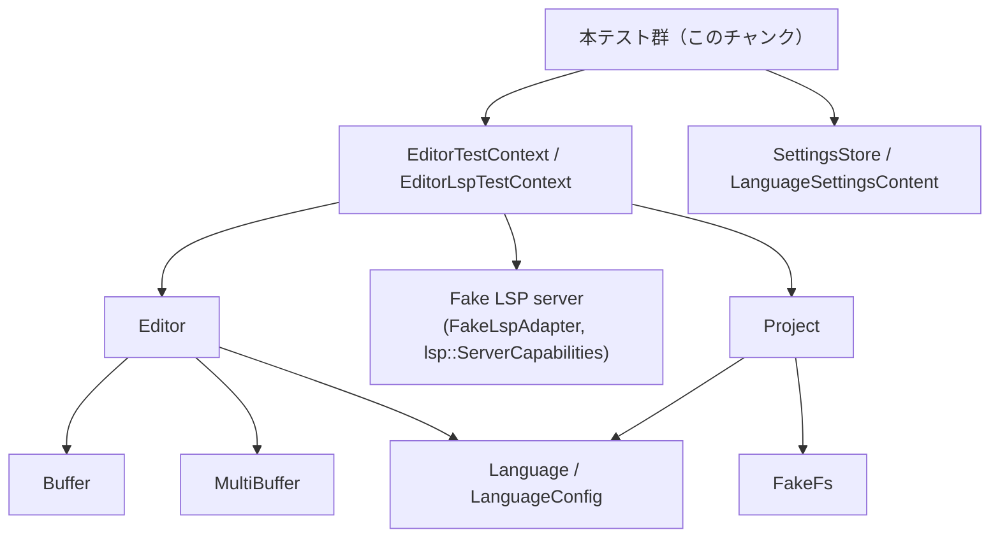

- `EditorTestContext` / `EditorLspTestContext`  
  テスト用のラッパーで、エディタの生成・状態設定・アサート・LSP サーバのハンドラ登録などを一括して扱います。
- `Editor`  
  実際の編集操作のメイン API で、テストから `update_editor(|editor, window, cx| { ... })` 経由で操作されます。
- `FakeFs` / `Project` / `FakeLspAdapter`  
  ファイルシステム・プロジェクト・LSP サーバとのやりとりをテスト環境でシミュレートするためのユーティリティです。

### 2.3 設計上のポイント

コードから読み取れる特徴を箇条書きにします。

- **テキスト状態のマークアップ表現**
  - `cx.set_state("abc\nˇabc")` のように、文字列内の特別な記号でカーソル・選択を表現しています。
    - `ˇ` … キャレット位置
    - `«` / `»` … 選択範囲の開始 / 終了
  - `EditorTestContext` がこのマークアップをパースして内部の `Selection` に変換していると解釈できます（実装はこのチャンクにはありません）。

- **非同期テストと LSP 連携**
  - 多くのテストが `#[gpui::test] async fn ...` となっており、`await` を使って LSP からのレスポンス（フォーマット・補完・コードアクション・シグネチャヘルプなど）を待ちます。

- **状態駆動の検証**
  - `cx.set_state(...)` → 各種操作 → `cx.assert_editor_state(...)` というパターンに統一されており、「ユーザーがこう入力するとこう表示されるべき」という観点で検証しています。

- **設定オブジェクトの差し替え**
  - `update_test_editor_settings` / `update_test_language_settings` などで、検索の大文字小文字、オートインデントモード、補完モード、フォーマッタの指定などを都度変更し、その違いをテストしています。

---

## 3. 主要な機能一覧

このチャンクに含まれるテストでカバーしている主な機能を列挙します。

- **選択・カーソル系**
  - 上下に選択を増やす（`add_selection_above` / `add_selection_below`）と undo/redo
  - マルチカーソルグループ（複数行にまたがるカーソルセット）の独立した拡大・縮小
  - 文字数とバイト数が異なる行（マルチバイト文字）のカーソル位置揃え

- **検索ベースの選択**
  - 現在の選択テキストと同じテキストを次に選択（`select_next`）
  - すべてのマッチを選択（`select_all_matches`）
  - 上方向にマッチをたどる `select_previous`
  - 大文字小文字の区別あり／なしでの挙動
  - 選択方向（左から右／右から左）の保持
  - スクロール位置を変えずに全マッチを選択・編集する挙動

- **構文選択**
  - `select_larger_syntax_node` / `select_smaller_syntax_node` による AST ノード単位の選択拡大／縮小
  - 折りたたみ（fold）と組み合わせた拡大
  - 文字列リテラル内での単語→文全体への段階的な拡大
  - `{mod3, mod4}` などの構文単位の選択
  - `unwrap_syntax_node` による構文ラッパーの取り外し（`mod2::{mod3, mod4}` → `mod2::mod3` のようなイメージ）

- **自動インデント**
  - `AutoIndentMode::None` / `PreserveIndent` / `SyntaxAware` の違い
  - tree‑sitter の indent クエリを使う場合／使わない場合の違い
  - 言語ごとの設定（Rust は SyntaxAware、ネストされた Python は None など）とネスト言語時の挙動

- **括弧・コメント・クォートの自動補完**
  - `{`, `(`, `"`, `/* ... */` などの自動補完、自動 surround、スキップ
  - `always_treat_brackets_as_autoclosed` 設定による「必ずスキップ対象とみなす」モード
  - 埋め込み言語（HTML の `<script>` 内 JavaScript など）で、外側・内側で異なるペア設定を使う例
  - override クエリを使った「文字列中ではクォートを補完しない」設定
  - Python のクォート補完（シングル／ダブル混在、マルチバイト絵文字含む）

- **スニペット**
  - 選択肢付きプレースホルダ（`${1|,i32,u32|}`）の展開と context menu 表示
  - タブストップの前後移動、最後のタブストップでのスニペット状態終了
  - 同一タブストップが複数箇所あるスニペットでのリンク編集
  - インデント付き複数行スニペットの挿入とインデント維持
  - プロジェクトスコープのスニペット（複数単語プレフィックス）の補完

- **フォーマット・保存**
  - LSP の `textDocument/formatting` と連動した保存（`format: true`）
  - フォーマットがハングした場合にタイムアウトして保存だけ行う動作
  - 言語別設定による tab_size の上書きと LSP に渡される `FormattingOptions` の検証
  - フォーマッタを持たないサーバをスキップし、次のサーバを使うテスト
  - range format (`document_range_formatting_provider`) のテストとタイムアウト
  - マルチバッファ（複数ファイルの抜粋）保存時に、dirty なバッファだけをフォーマット・保存する挙動
  - autosave で dirty なバッファだけファイル書き込みし、manual save では clean バッファは書き込まない挙動

- **複数フォーマッタ・コードアクション**
  - `FormatterList::Vec` で LSP フォーマット + CodeAction 複数を連続適用
  - CodeAction が LSP コマンド（`executeCommand`）を起動するケース
  - フォーマッタの一部が失敗しても、後続のフォーマッタを実行すること
  - 全フォーマッタの結果がひとつの undo トランザクションになること

- **シグネチャヘルプ**
  - 手動トリガー (`ShowSignatureHelp`) と自動表示（括弧入力／カーソル移動）時の挙動
  - `auto_signature_help` と `show_signature_help_after_edits` という 2 種類の設定の組み合わせと遅延時間
  - Escape キーによる一時的な非表示と、その後のカーソル移動で再表示する／しない条件
  - 複数シグネチャ（オーバーロード）間の next / prev ナビゲーション

- **補完（LSP + ワード補完）**
  - LSP 補完の insert/replace モード、`LspInsertMode` 設定：
    - `Insert` / `Replace` / `ReplaceSubsequence` / `ReplaceSuffix`
  - アクション別モード指定（`ConfirmCompletionInsert` / `ConfirmCompletionReplace`）
  - 追加テキスト編集（additionalTextEdits）の適用と重複除去
  - 補完選択で LSP コマンドを実行するケース
  - 不完全結果（`is_incomplete: true`）の再リクエストや、クエリ短縮時の再リクエスト
  - ワード補完（ドキュメント内単語）のしきい値、LSP 結果との重複除去、数字を含む単語の扱い
  - マルチカーソル補完（複数位置で共通の周辺テキストを置き換える）

- **コメントトグル**
  - 行コメント（`//`, `//!`, `///` など）のトグル
  - `ignore_indent` オプションあり／なしでの挙動
  - `advance_downwards` によるコメント後のカーソル移動
  - HTML のブロックコメント（`<!-- ... -->`）＋ JavaScript の `//` が混在するケース

- **その他**
  - マルチバッファで離れた excerpt を編集したときのカーソル・削除の挙動
  - syntax highlight の背景ハイライト範囲をソートして取得する機構
  - 現在のバッファ内容を「トークン＋ハイライト種別」の JSON にしてクリップボードへコピー

---

## 4. 関数・構造体の解説

このチャンクに含まれるテスト関数は非常に多いため、代表的なグループを 7 つ選んで詳しく説明し、それ以外は一覧で役割だけまとめます。  
いずれもシグネチャは概ね `async fn test_xxx(cx: &mut TestAppContext)` または類似のコンテキスト型です。

### 4.1 代表的なテスト関数（詳細）

#### `test_add_selection_above_below_multi_cursor(cx: &mut TestAppContext)`

**概要**

- `add_selection_above` / `add_selection_below` による **マルチカーソルの拡大・縮小・undo/redo** を検証するテストです。
- 同一行上のカーソル群が、上方向／下方向に拡大されるときに一貫したルールで動くことを確認します。

**主な引数**

- `cx: &mut TestAppContext`  
  テストアプリケーションコンテキスト。内部で `EditorTestContext::new(cx).await` を使い、エディタインスタンスを生成します。

**内部処理の流れ（要約）**

1. 初期状態として複数のカーソルを配置したテキストを `cx.set_state(...)` でセットします。
2. `editor.add_selection_below(&Default::default(), window, cx)` を呼び、新しいカーソル群が下に追加されることを期待して `cx.assert_editor_state(...)` で確認します。
3. 行末を超えるケース（overflow）でも、最後の行で停止し、それ以上カーソルが増えないことを確認します。
4. 上方向に `add_selection_above` を実行した際に、グループごとに「拡大するもの」と「縮小するもの」が独立して扱われることを確認します。
5. `editor.undo_selection` / `editor.redo_selection` を使い、選択状態の undo/redo が正しく復元されることも検証します。

**Examples（使用例）**

テスト内の典型パターンです（簡略化）。

```rust
cx.set_state(indoc!(
    r#"line onˇe
       liˇne two
       line three
       line four"#
));

// 下にカーソル追加
cx.update_editor(|editor, window, cx| {
    editor.add_selection_below(&Default::default(), window, cx);
});

// 期待される状態を検証
cx.assert_editor_state(indoc!(
    r#"line onˇe
       liˇne twˇo
       liˇne three
       line four"#
));
```

**Edge cases（エッジケース）**

- 最下行でさらに `add_selection_below` したとき、カーソル数が増えない（オーバーフローしない）。
- 途中で新たな単一カーソルを追加した場合（opt+クリック相当）、そのグループだけ拡大方向が変わること。
- 選択範囲を持つカーソル（`« ... ˇ»`）を含む場合でも、方向性の扱いが一貫していること。

**使用上の注意点**

- テストで使用している `«` / `ˇ` / `»` 記号は実際のバッファには残らず、`EditorTestContext` がパースして削除します。このパース処理の仕様は別チャンクにあります。
- `add_selection_above` / `add_selection_below` は **「最も古い選択のゴールカラム」を基準に新しいカーソル位置を決める** ことが後続テスト（goal column のテスト）で確認されています。

---

#### `test_select_next(cx: &mut TestAppContext)` と関連テスト群

**概要**

- `Editor::select_next` / `select_all_matches` / `select_previous` の挙動を通して、**検索ベースのマルチセレクション** の動きを検証します。
- 大文字小文字設定・選択方向・undo/redo・スクロール位置維持など、多数のバリエーションを含みます。

**主なポイント**

- `SearchSettingsContent::default()` に対して `case_sensitive` を設定し、ケースセンシティブ／インセンシティブの両方をテスト。
- caret のみ（空選択）からの検索と、すでに選択済みのテキストからの検索の違い。
- `UndoSelection` / `RedoSelection` による選択履歴の undo/redo。

**内部処理の流れ（代表ケース）**

1. 初期状態を `"abc\nˇabc abc\ndefabc\nabc"` のように設定。
2. `select_next` で、カーソル位置の単語 `abc` を選択し、次の一致を新しい選択として追加。
3. `select_all_matches` で、全行にある `abc` を一気に選択。
4. `select_previous` で逆方向に同様の処理を行い、「最後のマッチからまた最初へ」などのラップ挙動を確認。
5. スクロール位置を記録し、`select_all_matches` →編集後もスクロール位置が変わらないことを確認するテストもあります。

**Edge cases**

- 空バッファ（`"aˇ"` → `select_previous`）でも panic せず、選択が変化しない。
- 選択方向（`«abcˇ»` vs `«ˇabc»`）を維持したまま追加のマッチを選ぶ。
- case sensitive = true の場合に `foo` は `FOO` / `Foo` と一致しないこと、false の場合には一致すること。

**使用上の注意点**

- 連続で `select_next` / `select_previous` を呼ぶ場合、**最後に作られた選択の方向** が新しい選択の方向として使われます。
- スクロール位置のテストでは、`editor.scroll_position(cx)` を直接比較しているため、編集によるスクロールの副作用を避けるには `SelectionEffects::no_scroll()` を使う必要があります。

---

#### `test_select_larger_smaller_syntax_node(cx: &mut TestAppContext)` と派生テスト

**概要**

- tree‑sitter を用いた構文解析結果に基づき、**構文ノード単位で選択範囲を拡大／縮小する機能**のテストです。
- Rust や TSX（JavaScript/TypeScript + JSX）など複数言語で検証されています。

**主な引数**

- 内部で `Language::new(LanguageConfig::default(), Some(tree_sitter_rust::LANGUAGE.into()))` などで言語をセットし、`Buffer::local(text, cx).with_language(language, cx)` として構文木を有効にします。

**内部処理の流れ（代表ケース）**

1. Rust コードを用意し、`mod4` などの特定位置にカーソルまたは小さな選択を置く。
2. `editor.select_larger_syntax_node(&SelectLargerSyntaxNode, window, cx)` を呼ぶと、
   - 単語 → `{mod3, mod4}` のようなブロック → `fn fn_1(...) { ... }` 全体 → ファイル全体
     と段階的に選択が広がることを検証。
3. `select_smaller_syntax_node` を呼ぶと逆順で縮小され、元の単語単位に戻ることを確認。
4. fold された領域を含む場合（`editor.fold_creases(...)`）、折りたたみ内にノードの境界があっても、拡大できることを確認。
5. 文字列リテラル内でも、カーソル位置から単語→文字列全体→ステートメント全体への拡大が行えるテストも含まれています。

**Edge cases**

- すでにファイル全体が選択されている状態で `select_larger_syntax_node` を呼んでも、選択が変わらない。
- 逆に、最小単位（単語や最小ノード）を下回る縮小は無効。
- 文字列中での部分選択（`"h«elˇ»lo world"`）でも、次の拡大で `"hello"` → `"hello world"` へと自然に広がること。

**使用上の注意点**

- 構文選択は tree‑sitter のパース状態に依存するため、テストでは
  `editor.condition::<crate::EditorEvent>(..., |editor, cx| !editor.buffer.read(cx).is_parsing(cx))` でパース完了を待ってから操作しています。
- fold との組み合わせを試す場合、fold/unfold の手順が複雑になりやすいので、テストでは fold 用ヘルパ（`Crase`, `FoldPlaceholder`）を使っています。

---

#### `test_autoindent_*` 系（`test_autoindent`, `test_autoindent_disabled`, …）

**概要**

- 自動インデント機能が、設定値と言語の indent クエリに応じて正しく動くかを検証するテスト群です。
- 特に以下を確認しています。
  - `AutoIndentMode::None` … 改行時にインデントを一切つけない
  - `PreserveIndent` … 現在行のインデントだけコピーし、構文による増減は行わない
  - `SyntaxAware` … tree‑sitter の indent クエリに従ってインデントレベルを決める
  - 言語ごとの override（ネスト言語）で AutoIndent を上書きする

**典型的な処理フロー**

1. `LanguageConfig` に `BracketPairConfig` と `with_indents_query(...)` を設定し、`(` や `{` の対応をクエリで定義。
2. バッファにテキストをセットし、特定のオフセットにカーソルを置く：

   ```rust
   editor.change_selections(..., |s| {
       s.select_ranges([
           MultiBufferOffset(5)..MultiBufferOffset(5), // "fn a() {}" の '(' など
       ])
   });
   ```

3. `editor.newline(&Newline, window, cx)` を呼び、新しい行のインデントとカーソル位置を検証する。
4. AutoIndentMode を変更したテストでは、同じ位置での挙動が設定に応じて変わることを確認します。

**Edge cases**

- `AutoIndentMode::None` では、前行がインデントされていても、新行は常にカラム 0 から始まる。
- `PreserveIndent` モードでは、`{` の内側であっても tree‑sitter の indent クエリによるインデント増加は無視される。
- `SyntaxAware` モードで、言語に indent クエリが設定されていない場合は構文インデントが行われない。

**使用上の注意点**

- ネスト言語（例：Rust マクロ内に Python がインジェクトされる）では、親言語と子言語で `auto_indent` 設定が異なる可能性があり、本テストのように
  - 親言語：SyntaxAware
  - 子言語：None
  の組み合わせを扱う場合は、設定の優先順位に注意が必要です。

---

#### `test_autoclose_and_auto_surround_pairs(cx: &mut TestAppContext)` と関連テスト

**概要**

- 括弧・コメント・クォートなどの **ペア自動補完** と **選択範囲の surround**、および「自動補完されたペアをスキップして打鍵する」挙動を検証するテストです。
- また、`always_treat_brackets_as_autoclosed` 設定による挙動変更も別テストで検証しています。

**主なパターン**

- 空行で `{` を入力すると、`{ˇ}` が挿入され、複数カーソルでも同様に動く。
- すでに `}` がある位置で `}` を入力すると、入力せずにカーソルだけ右に移動する（スキップ）。
- 選択範囲がある場合、ペアの start を入力すると囲む（`«aˇ»` + `{` → `{«aˇ»}`）。
- `autoclose_before` に指定されていない文字が続く場合は自動補完しない。
- `close: false` が設定されたペア（例：`[` / `]`）は自動補完されないが、`surround: true` の場合は選択範囲を囲む挙動だけ有効。

**Edge cases**

- マルチバイト文字（絵文字など）が混ざる行でも、カーソル位置の論理カラムを保って補完・スキップが行われる。
- 同じ start/end を持つクォート（`"`）について、「単語の直後」では自動補完を抑制するなど、単語境界による条件分岐があります。
- `always_treat_brackets_as_autoclosed = true` のときは、明示的に補完していなくても閉じ括弧をスキップ・削除対象として扱う動作をテストしています。

**使用上の注意点**

- `BracketPairConfig` および `LanguageConfig.autoclose_before` によって挙動がかなり変わるため、テストを追加する際は必ず言語設定も確認する必要があります。
- 埋め込み言語（HTML + JavaScript）では、言語ごとにペア設定が異なるため、カーソル位置の言語判定（`snapshot.language_at(...)`）を利用したテストが行われています。

---

#### `test_document_format_during_save(cx: &mut TestAppContext)` と range format 系テスト

**概要**

- 保存時に LSP のフォーマッタを呼び出す処理 (`editor.save` + `format: true`) が、正常系・タイムアウト時・複数フォーマッタ／サーバ環境で **安全に動くこと** を検証します。
- `test_range_format_*` では `textDocument/rangeFormatting` のバリエーションを検証しています。

**内部処理の流れ（代表ケース）**

1. `FakeFs` にファイルを作成し、`Project::test` でプロジェクトを構築。
2. `language_registry.register_fake_lsp` で Rust 用の LSP サーバを登録し、`document_formatting_provider` を有効にする。
3. `editor.set_text(...)` でバッファを dirty にし、`editor.is_dirty(cx)` が true であることを確認。
4. LSP サーバ側で `set_request_handler::<lsp::request::Formatting, _, _>(...)` を設定し、特定範囲を `TextEdit` で置き換えるようにする。
5. `editor.save(SaveOptions { format: true, autosave: false }, ...)` を呼び、結果を await。
6. 保存後のバッファ内容と dirty フラグが期待どおりか確認。
7. 別ケースではフォーマットリクエストを `pending()` にして、`FORMAT_TIMEOUT` 経過後にフォーマットを諦めつつ保存だけを行うことも確認。

**Mermaid シーケンス（保存＋フォーマット）**

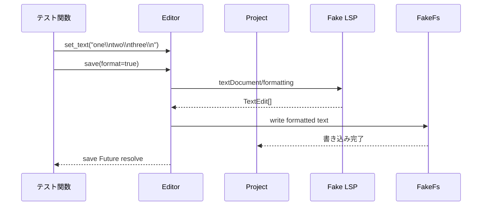

**Edge cases**

- LSP サーバがフォーマット機能を持たない場合（`document_formatting_provider: None`）、スキップされる。
- リクエストがタイムアウトした場合でも保存処理は行われ、エディタがロックしない。
- 言語ごとの tab_size override があれば、LSP に渡す `FormattingOptions.tab_size` がその値になる。

**使用上の注意点**

- テストでは `FakeLspAdapter` の `set_request_handler` を必ず save 呼び出しの **前** に設定しないと、フォーマットリクエストが行き先のないままタイムアウト扱いになる可能性があります。
- マルチバッファの場合、dirty でないバッファはフォーマットの対象から除外される設計（テストで確認済）であることに留意が必要です。

---

#### `test_completion_mode(cx: &mut TestAppContext)` と補完関連テスト

**概要**

- LSP 補完の挿入モード（Insert/Replace/ReplaceSubsequence/ReplaceSuffix）と、周囲のテキストをどこまで置き換えるかという **実際の挙動を細かく比較** するテストです。
- 他にも倍数の補完テストがあり、補完の再利用・ワード補完・コマンド実行などをカバーしています。

**代表的なパターン**

- `before ediˇtor after` + 補完 `"editor"` の組み合わせで、カーソル位置が単語の先頭・中間・末尾かによって、どこまで置換するかを比較。
- `LspInsertMode` をテストごとに設定：
  - `Insert` … 単純に補完テキストを挿入（後ろのテキストはそのまま）
  - `Replace` … 単語全体や指定範囲を丸ごと置換
  - `ReplaceSubsequence` … 補完テキスト内に含まれている部分文字列だけを消す
  - `ReplaceSuffix` … 末尾が一致する部分だけを置換する

**Edge cases**

- `completion_label` と `completion_text` が異なる場合（ラベルに基づいて suffix マッチングをする）。
- 大文字小文字を無視して subsequence/suffix を判定するケース。
- マルチカーソルで、最新のカーソル周辺テキストを基準に他カーソルの置換範囲を決めるケース。
- LSP 補完が `command` を持つ場合にのみ `executeCommand` を送出すること（登録されていないコマンドは送らない）を `test_completion_can_run_commands` で確認。

**使用上の注意点**

- 挿入モードのデフォルトは言語設定で変えられますが、テストでは `ConfirmCompletionInsert` / `ConfirmCompletionReplace` といった別アクションで上書き可能であることを確認しています。
- 追加テキスト編集（additionalTextEdits）は、主テキスト編集と重複する範囲を持つ場合はフィルタリングされるように実装されており、テストでその挙動を前提にしています。

---

### 4.2 その他の主なテスト関数（一覧）

| 関数名 | 役割（1 行概要） |
|--------|------------------|
| `test_add_selection_above_below_multibyte` | マルチバイト文字を含む行で上下選択追加時の列揃えを検証 |
| `test_select_all_matches` / `_does_not_scroll` | 全マッチ選択とスクロール位置不変での編集を検証 |
| `test_undo_format_scrolls_to_last_edit_pos` | フォーマットを undo した際にカーソルが最後の編集位置に戻ることを検証 |
| `test_undo_edit_prediction_scrolls_to_edit_pos` | 予測編集（EditPrediction）の undo でカーソルが予測編集位置に戻ることを検証 |
| `test_unwrap_syntax_nodes` | 構文ノードのラップを外す `unwrap_syntax_node` の挙動を検証 |
| `test_fold_function_bodies` | 関数本体だけを fold する `fold_function_bodies` の動作を検証 |
| `test_autoindent_*`（各種） | AutoIndent 設定の違いとネスト言語の扱いを検証 |
| `test_auto_replace_emoji_shortcode` | `:wave:` 等の絵文字ショートコードを自動変換する機能を検証 |
| `test_snippet_*` 系 | スニペット展開・タブストップ・プレースホルダ選択の挙動を検証 |
| `test_document_format_*` / `test_range_format_*` | 保存時フォーマット・範囲フォーマット・タイムアウト・タブ幅 override を検証 |
| `test_multiple_formatters` / `test_formatter_failure_does_not_abort_subsequent_formatters` | 複数フォーマッタと、1 つの失敗が他を止めないことを検証 |
| `test_signature_help*` 系 | シグネチャヘルプの自動・手動トリガー、遅延、複数シグネチャのナビゲーションなどを検証 |
| `test_completion_*` 系 | 各種補完の再利用、ワード補完、重複除去、ページアップダウンキーの挙動などを検証 |
| `test_toggle_comment*` | 行コメントのトグルとインデント無視／カーソル移動オプションの挙動を検証 |
| `test_toggle_block_comment` | HTML ブロックコメントと埋め込み JavaScript のコメントの組み合わせを検証 |
| `test_editing_disjoint_excerpts` | 離れた excerpt を持つ MultiBuffer での入力・削除の挙動を検証 |
| `test_highlighted_ranges` | `highlight_background` によるハイライト範囲のソート取得を検証 |
| `test_copy_highlight_json*` | バッファの構文強調情報を JSON としてクリップボードにコピーする機能を検証 |

---

## 5. データフロー

代表的なシナリオとして、「保存時フォーマット + LSP + FakeFs」の流れを示します。

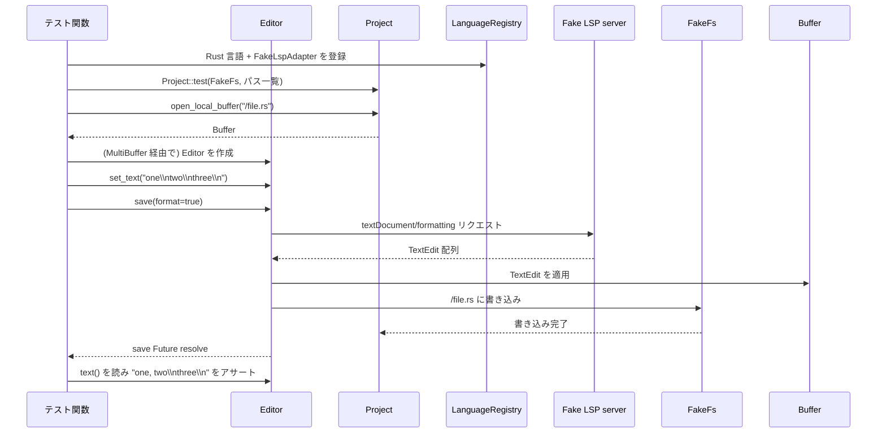

要点：

- フォーマットは **LSP レスポンスの TextEdit をバッファに適用するだけ** で、ファイル書き込みは通常の保存と同じ経路です。
- タイムアウト・サーバ不在の場合は、LSP 部分をスキップし、保存だけ行うことが別テストで確認されています。
- マルチバッファの場合は、`MultiBuffer` が複数 `Buffer` に対して excerpt を持っており、保存時には dirty な Buffer ごとに LSP フォーマットと書き込みが行われます。

---

## 6. 使い方（How to Use）

ここでは、このテスト群と同じスタイルで **新しいエディタ機能テストを書くときの基本パターン** をまとめます。

### 6.1 基本的な使用方法

**単純な編集機能のテスト**

```rust
#[gpui::test]
async fn test_my_editing_feature(cx: &mut TestAppContext) {
    // テスト環境の初期化（設定をいじりたい場合はクロージャで渡す）
    init_test(cx, |_| {});

    // EditorTestContext を作成
    let mut cx = EditorTestContext::new(cx).await;

    // 初期状態をマークアップ付きの文字列で指定
    cx.set_state("a.ˇ b"); // ˇ がキャレット位置

    // 編集操作を実行
    cx.update_editor(|editor, window, cx| {
        editor.handle_input("X", window, cx); // 1文字入力
    });

    // 結果の状態を検証
    cx.assert_editor_state("a.Xˇ b");
}
```

ポイント：

- **状態指定**：`set_state` / `assert_editor_state` に渡す文字列で `ˇ`, `«`, `»` を使い、カーソル・選択を表現します。
- **操作実行**：`update_editor` で `Editor` にアクセスし、実際の API（`handle_input` / `add_selection_below` / `format` など）を呼びます。
- **非同期処理**：LSP と連携する操作（フォーマット・補完・シグネチャヘルプなど）は `await` を伴う Future を返すことがあるため、テスト関数自体が `async` になっています。

### 6.2 よくある使用パターン

1. **LSP を使ったフォーマット・補完テスト**

   ```rust
   // LSP サーバを持つ EditorLspTestContext を利用
   let mut cx = EditorLspTestContext::new_rust(
       lsp::ServerCapabilities {
           document_formatting_provider: Some(lsp::OneOf::Left(true)),
           ..Default::default()
       },
       cx,
   ).await;

   cx.set_state("linˇe 1");
   // フォーマットリクエストのハンドラを fake サーバに登録
   cx.lsp
       .set_request_handler::<lsp::request::Formatting, _, _>(move |_, _| async move {
           Ok(Some(vec![lsp::TextEdit::new(
               // … ここで TextEdit を返す …
           )]))
       });

   let format = cx.update_editor(|editor, window, cx| editor.format(&Default::default(), window, cx))
       .unwrap();
   format.await.unwrap();

   cx.assert_editor_state("PREFIX linˇe 1");
   ```

2. **マルチバッファ（excerpts）での編集テスト**

   ```rust
   let buffer = cx.update_multibuffer(|mb, _| mb.as_singleton().unwrap());
   let multi_buffer = cx.new(|_| MultiBuffer::new(Capability::ReadWrite));
   cx.update(|_, cx| {
       multi_buffer.update(cx, |mb, cx| {
           mb.set_excerpts_for_path(
               PathKey::for_buffer(&buffer, cx),
               buffer,
               [Point::new(1, 0)..Point::new(1, 0)], // 抜粋位置
               3,                                    // 前後のコンテキスト行数
               cx,
           );
       });
   });

   let editor = cx.new_window_entity(|window, cx| {
       Editor::new(EditorMode::full(), multi_buffer, None, window, cx)
   });
   ```

   抜粋形態のバッファでも、通常の編集と同様に `handle_input` や `toggle_comments` を呼び出せます。

3. **補完モードを変えて挙動を確認**

   ```rust
   update_test_language_settings(&mut cx, &|settings| {
       settings.defaults.completions = Some(CompletionSettingsContent {
           lsp_insert_mode: Some(LspInsertMode::ReplaceSuffix),
           ..Default::default()
       });
   });

   cx.set_state("SubˇError");
   cx.update_editor(|editor, window, cx| {
       editor.show_completions(&ShowCompletions, window, cx);
   });
   // Fake LSP 側で completion ハンドラを設定し…
   ```

### 6.3 使用上の注意点

- **マークアップ文字の扱い**
  - `ˇ`, `«`, `»` はテスト専用であり、実際の編集操作には現れません。`set_state` / `assert_editor_state` の前後でのみ使用されます。
  - マルチバイト文字列（絵文字など）と組み合わせる場合、視覚的な列位置と内部のオフセット（バイト列）の違いに注意が必要です。テストでは `DisplayPoint` と `Point` を明確に使い分けています。

- **LSP ハンドラのライフサイクル**
  - `set_request_handler` で登録したハンドラは、通常「次のリクエスト 1 回」に対応している形のユーティリティが多いです（`next().await` で 1 回分を待機）。  
    テストで複数回呼ばれる想定なら、そのたびにハンドラを設定し直す必要があります。

- **タイムアウトの扱い**
  - フォーマット／コードアクションのテストでは、あえて `pending` な Future を返してタイムアウトをトリガーしています。実装側がタイムアウトを適切にハンドリングしている前提なので、実際のコードでも同じ `FORMAT_TIMEOUT` / `CODE_ACTION_TIMEOUT` を意識する必要があります。

- **設定変更のスコープ**
  - `update_test_editor_settings` / `update_test_language_settings` はテスト全体に影響するグローバル設定を変更するため、テスト間の干渉を避けるには、各テストで明示的に必要な設定を上書きしていることが重要です（このチャンクのテストはそうなっています）。

---

## 7. 関連ファイル

このチャンクだけでは正確なモジュールパスは分かりませんが、頻出する型・コンポーネントから、関係が深いと思われるファイル・モジュールを列挙します（パスは不明なものもあります）。

| パス / 型名（推定） | 役割 / 関係 |
|---------------------|------------|
| `Editor` | エディタ本体。カーソル移動・選択・補完・フォーマット・コメントトグルなど、ほぼすべての操作の窓口になります。 |
| `EditorTestContext` | テスト用ヘルパ。`set_state` / `assert_editor_state` / `update_editor` などを提供し、マークアップ文字列と内部状態の変換を行います。 |
| `EditorLspTestContext` | LSP を伴うテスト用ヘルパ。Fake LSP サーバの生成・ハンドラ登録・`cx.lsp.set_request_handler` などを一括管理します。 |
| `Buffer` / `MultiBuffer` | テキスト内容と複数ファイル抜粋を管理するデータ構造。構文解析（tree‑sitter）やハイライトとも連携します。 |
| `Language` / `LanguageConfig` / `BracketPairConfig` | 言語固有の設定（コメント・括弧ペア・インデントクエリ・インジェクション設定など）を保持し、自動インデントやペア補完の挙動を決めます。 |
| `Project` | ファイルシステム (`FakeFs`) と紐づいたプロジェクト全体を表し、バッファのオープン、LSP 言語レジストリの管理などを行います。 |
| `FakeFs` | テスト用インメモリファイルシステム。保存時の書き込み回数を数えるテストなどで使用されています。 |
| `FakeLspAdapter` / `lsp::FakeLanguageServer` | LSP サーバを模したテスト用コンポーネント。各種 request/notification のハンドラを登録し、フォーマット・補完・コードアクションなどのレスポンスを制御します。 |
| `SettingsStore` / `LanguageSettingsContent` / `CompletionSettingsContent` | エディタ・言語・補完設定を保持する設定ストア。テストでは個別の設定値（`auto_indent`, `lsp_insert_mode`, `words_min_length` など）を上書きして挙動を確認しています。 |
| `Snippet` | スニペットのパースと挿入を行う型。`Snippet::parse("type ${1|,i32,u32|} = $2")` のように文字列からプレースホルダ付きスニペットを構築します。 |

このチャンクはテストコードのみで、実際の実装は別ファイルにあります。実装詳細を確認したい場合は、上記の型名に対応するモジュール（例：`editor.rs` や `buffer.rs`、`language.rs` など）を参照する必要があります。

---

# depth1-editor-59 ディレクトリ コード解説

## 1. ざっくり一言

このチャンクは、`Editor` コンポーネントの振る舞いを網羅的に検証する **テスト群とテスト用ヘルパー関数** のまとまりです。  
折りたたみ・LSP ナビゲーション・インデント・ブレークポイント・Markdown 特有の貼り付け・レビューコメントなど、実装済みの機能が意図どおり動くかを高レベル動作として確認しています。

---

## 2. このモジュールの役割

### 2.1 概要

- このディレクトリ（チャンク）は、GUI エディタ `Editor` を中心とした機能の **統合テスト** を提供します。
- テキストバッファ（`Buffer` / `MultiBuffer`）、言語サービス（LSP）、ワークスペース（`Project` / `Workspace`）、設定（`SettingsStore`）などを組み合わせ、ユーザ操作に近い形でエディタを操作して期待結果を検証します。
- 多数のテスト用コンテキスト（`EditorTestContext`, `EditorLspTestContext`, `VisualTestContext` など）とヘルパー関数を用意し、テストコードを簡潔に書けるようにしています。

### 2.2 アーキテクチャ内での位置づけ

このチャンクから読み取れる主な依存関係を示します。

```mermaid
graph TD
  T[Testコード<br/>(gpui::test)] --> ETC[EditorTestContext<br/>EditorLspTestContext]
  T --> VTC[VisualTestContext]
  ETC --> E[Editor]
  VTC --> E
  E --> MB[MultiBuffer]
  MB --> B[Buffer]
  E --> P[Project]
  P --> FS[FakeFs]
  P --> LR[LanguageRegistry<br/>(Language, tree-sitter)]
  ETC --> LSP[FakeLspAdapter<br/>(擬似 LSP サーバ)]
```

- **Test コード**: `#[gpui::test]` で定義された非同期テスト関数。
- **EditorTestContext / EditorLspTestContext**:  
  テスト実行時のアプリケーションコンテキストと `Editor` をまとめて扱うラッパー。LSP 付き/無しの２バージョンがあります。
- **VisualTestContext**:  
  実際のウィンドウサイズや描画を伴う UI まわりのテストに使用します。
- **Editor**:  
  本体エディタ。カーソル移動・折りたたみ・LSP 連携・ブレークポイント・レビューコメントなどの機能を持ちます。
- **Project / FakeFs / LanguageRegistry / FakeLspAdapter**:  
  ファイルシステム・言語定義・LSP サーバをテスト向けに擬似実装したコンポーネントです。

### 2.3 設計上のポイント

このチャンクから読み取れるテスト設計上の特徴は次のとおりです。

- **高レベル API での検証**  
  低レベルにバッファを書き換えるのではなく、なるべく `Editor` の公開メソッド・アクション（`go_to_definition`, `fold_buffer`, `paste` など）を呼び出して期待結果を検証しています。
- **豊富なテストコンテキスト**  
  - 構文ハイライト・インデントなど **言語依存** の機能 → `Language`, `LanguageRegistry`, tree-sitter 言語を設定して検証  
  - LSP 依存の機能（定義ジャンプ・参照検索・インレイヒントなど） → `EditorLspTestContext` と `FakeLspAdapter` で擬似サーバを立てて検証
- **非同期処理・時間依存処理の明示的制御**  
  `cx.executor().advance_clock(...)` や `run_until_parked()` を用い、  
  デバウンスやタイムアウトなど時間依存の挙動を determinisitic にテストしています。
- **設定による分岐のテスト**  
  `SettingsStore` のグローバル設定を変更して、インデント・LSP タイムアウト・ファイル再オープン時の復元・AI 有効/無効などの振る舞いの違いを検証しています。
- **状態が別レイヤーにまたがる機能のテスト**  
  例:  
  - 「複数ペインで開いた同じファイルのスクロール/選択状態の復元」  
  - 「マルチバッファ上での折りたたみと選択」  
  - 「ワークツリー信頼状態と LSP 設定の適用」

---

## 3. 主要な機能一覧

このチャンクのテストで対象となっている主な機能を列挙します（テスト名から読み取れる粒度で整理しています）。

- **折りたたみ・表示制御**
  - `Crease` によるインライン折りたたみトグルのレンダリング
  - `fold_buffer` / `unfold_buffer` / `has_any_buffer_folded` によるマルチバッファ上のバッファ単位の折りたたみ
  - 折りたたまれたバッファの中での選択・入力時の自動展開
  - 折りたたまれた diff hunk（削除行）の展開と sticky scroll との連携

- **カーソル移動・スクロール**
  - `scroll_cursor_center_top_bottom` による Center → Top → Bottom の順送りとデバウンス
  - 折りたたみされた excerpt 間を上下キーで移動する際の選択挙動
  - `scroll_cursor_top` と `vertical_scroll_margin` の組み合わせ（マルチバッファの場合）

- **LSP ナビゲーション**
  - `go_to_definition` と `GoToDefinitionFallback` 設定に応じた参照 fallback
  - 複数定義が近接/遠距離/包含関係にある場合の挙動（単一エディタ内で選択・マルチバッファエディタを開く）
  - `find_all_references` のマルチバッファエディタ再利用・再生成判定
  - `go_to_reference_before_or_after_position` による前後参照への循環遷移
  - `go_to_next_document_highlight` / `go_to_prev_document_highlight` による LSP ドキュメントハイライト間の移動

- **補完・スニペット・シグネチャヘルプ**
  - `show_completions` / `confirm_completion` と LSP `Completion` / `ResolveCompletionItem` の連携
  - `handle_completion_request` / `handle_completion_request_with_insert_and_replace` を使った補完テスト用 LSP ハンドラ
  - LSP 補完とプロジェクトスニペットを統合した候補リストのフィルタ・順位づけ（複数単語プレフィックスのスニペット）
  - `handle_signature_help_request` による SignatureHelp 応答のモック

- **差分・予測編集の可視化**
  - `edit_prediction_edit_text` による編集予測結果のテキストとハイライト範囲生成
  - `preview_edits` を用いたアンカー付き編集シミュレーション

- **ブレークポイント関連**
  - 1 行単位のブレークポイントのトグル / 有効・無効化
  - ログブレークポイントの追加・編集・削除（`add_log_breakpoint_at_cursor`）
  - `BreakpointStore` からの `SourceBreakpoint` 一覧取得と `assert_breakpoint` による検証
  - 行ホバー時の仮想インジケータ（`PhantomBreakpointIndicator`）と実ブレークポイントの衝突状態更新

- **インデント・改行（Python / Bash / Markdown）**
  - Python:
    - `if/elif/else`, `try/except/else/finally`, `for/while/with/match/def` の Tab 時自動インデント
    - キーワード入力時（`else:`, `except:`, `finally:` など）の自動アウトデント
    - 丸括弧/波括弧内での改行インデント
    - Markdown コードブロック中の Python のインデント（複合言語）
  - Bash:
    - `if/elif/else/fi`, `while/do/done`, `for/do/done`, `case/esac` のインデント/アウトデント
    - コメント挿入・改行時のインデント
  - Markdown:
    - ネストした箇条書き・タスクリストの改行継続（`- [ ]`, `1.` など）の継承・解除ロジック
    - `Tab` によるリストアイテムのインデント/非インデント（設定に応じた動作）

- **Markdown における URL 貼り付け**
  - 他アプリ由来の URL を選択文字列に貼り付け → `[選択テキスト](URL)` へ変換
  - 既存 URL 選択部への貼り付け → 置換のみ（リンク化しない）
  - URL を Zed 自身でコピーしたケース（Markdown 内）と他言語/マルチバッファとの組み合わせの挙動

- **スティッキースクロール (sticky scroll)**
  - Rust コードに対する `fn`, `impl` などの上部固定ヘッダ検出
  - diff hunk 展開に伴うヘッダ範囲の変化
  - 画面上端付近のスクロールに応じたヘッダの位置補正
  - スティッキーヘッダクリックによるスクロール位置移動・カーソル位置更新・文字単位選択開始

- **マルチバッファ**
  - 複数ファイル抜粋（excerpt）の表示順と折りたたみ状態におけるカーソル移動
  - `display_text` を使った実際の表示内容（空行・折りたたみヘッダ）検証
  - マルチバッファ保存時、LSP フォーマットとの競合条件（レース）の再現

- **診断・インレイヒント**
  - DocumentDiagnosticRequest のデバウンス・ result_id 管理
  - LSP `diagnostic_provider` と Pull 型診断のタイミング制御
  - InlayHintRequest のタイムアウトをグローバル設定で可変化し、タイムアウト/成功ケースを確認

- **ワークツリー信頼・AI 無効化**
  - ローカル `.zed/settings.json` による LSP 設定上書きが **信頼済みワークツリー** でのみ有効になること
  - `DisableAiSettings` による AI 機能無効化時に、差分レビュー用ボタンが表示されないこと

- **レビューコメント / diff review オーバーレイ**
  - `DiffHunkKey` と `StoredReviewComment` を用いた hunk 単位のコメント管理
  - コメントの追加・更新・削除・全件取り出し（`take_all_review_comments`）と ID 再採番
  - バッファ編集に伴うアンカー無効化（orphan）コメントのクリーンアップ
  - 行範囲選択・ドラッグ操作から diff review オーバーレイを開く UI の状態管理

- **その他ユーティリティ的挙動**
  - シングルラインエディタにおける改行置換表示（`⋯` など）
  - 非 UTF-8 ファイル（UTF-16 BOM 含むバイナリ）の自動検出と `Editor` でのオープン
  - 行コピー/カット時の終端改行の扱い（1 行全体選択・複数カーソル時）
  - `key_context` としての `start_of_input` / `end_of_input` の判定

---

## 4. 関数・構造体の解説

ここでは、このチャンクの中で **テストから頻繁に利用され、再利用性も高いヘルパー関数** を中心に解説します。  
`EditorTestContext` や `EditorLspTestContext` 自体の定義はこのチャンクには含まれていませんが、利用方法から役割を説明します。

### 4.1 テスト用コンテキストの概要

#### `EditorTestContext`

- 役割: LSP を伴わない `Editor` のテストを簡便に書くためのラッパーです。
- 主なメソッド（このチャンクから読み取れるもの）:
  - `new(cx).await`: `TestAppContext` から初期化。
  - `set_state(&str)`: 特殊記号（`ˇ`, `« »`）付き文字列からバッファ内容と選択範囲をセット。
  - `update_editor(|editor, window, cx| { ... })`: `Editor` をミュータブルに更新するクロージャを実行。
  - `assert_editor_state(&str)`: 期待するテキスト＋選択状態と比較。
  - `wait_for_autoindent_applied().await`: 自動インデントが適用されるまで待機。

**使用イメージ**

```rust
#[gpui::test]
async fn test_simple_indent(cx: &mut TestAppContext) {
    init_test(cx, |_| {});
    let mut cx = EditorTestContext::new(cx).await;

    // 初期状態を設定（ˇ がカーソル位置）
    cx.set_state("if foo:\n    ˇbar\n");

    // 改行アクションを実行
    cx.update_editor(|editor, window, cx| {
        editor.newline(&Newline, window, cx);
    });
    cx.wait_for_autoindent_applied().await;

    // 期待状態を検証
    cx.assert_editor_state("if foo:\n    bar\n    ˇ\n");
}
```

#### `EditorLspTestContext`

- 役割: LSP サーバと連携する `Editor` のテスト用コンテキストです。
- `new_rust(capabilities, cx).await` のように、言語とサーバー能力を指定して初期化します。
- `lsp.set_request_handler::<Request, _, _>(handler)` で個々の LSP リクエストに対する応答をモックします。
- `to_lsp(MultiBufferOffset)` / `to_lsp_range(...)` など、バッファオフセットと LSP 座標の相互変換も内部で扱います。

---

### 4.2 代表的なヘルパー関数

#### `init_test(cx: &mut TestAppContext, f: fn(&mut AllLanguageSettingsContent))`

**概要**

テスト環境全体を初期化する関数です。フォント・テーマ・設定ストア・リリースチャネル・アプリ本体の初期化に加え、渡されたクロージャで言語ごとのデフォルト設定を上書きします。

**引数**

| 引数名 | 型 | 説明 |
|--------|----|------|
| `cx` | `&mut TestAppContext` | テスト用アプリケーションコンテキスト |
| `f` | `fn(&mut AllLanguageSettingsContent)` | すべての言語設定に対して初期上書きを行う関数 |

**内部処理の流れ**

1. テスト用フォントのロード (`assets::Assets.load_test_fonts`)。
2. `SettingsStore::test` でテスト用設定ストアを作成し、グローバルに登録。
3. テーマ・リリースチャネル・`crate::init` を呼んでエディタ本体を初期化。
4. `zlog::init_test()` でテスト用ロガーを初期化。
5. `update_test_language_settings` を呼び出し、引数 `f` で言語設定を上書き。

**使用上の注意点**

- すべての `gpui::test` の先頭で呼び出す前提になっています。呼ばないとテーマや設定が未初期化でテストが失敗する可能性があります。
- 同じテスト内で再度 `SettingsStore` を上書きする場合は、`update_test_language_settings` や `update_test_*_settings` を併用します。

---

#### `assert_highlighted_edits(...)`

```rust
async fn assert_highlighted_edits(
    text: &str,
    edits: Vec<(Range<Point>, String)>,
    include_deletions: bool,
    cx: &mut TestAppContext,
    assertion_fn: &dyn Fn(HighlightedText, &App),
)
```

**概要**

テキストと編集内容を指定し、`edit_prediction_edit_text` が返す `HighlightedText` の内容（テキストとハイライト範囲）を検証するためのヘルパーです。

**主な引数**

| 引数名 | 型 | 説明 |
|--------|----|------|
| `text` | `&str` | 元テキスト |
| `edits` | `Vec<(Range<Point>, String)>` | 行・列ベースの編集範囲と差し替え文字列 |
| `include_deletions` | `bool` | 削除部分もハイライトの対象とするか |
| `cx` | `&mut TestAppContext` | テストコンテキスト |
| `assertion_fn` | `&dyn Fn(HighlightedText, &App)` | 結果を検証するコールバック |

**内部処理の流れ**

1. `MultiBuffer::build_simple(text, cx)` でバッファを作成し、`Editor` を生成。
2. バッファのスナップショットを取り、`Point` 範囲をアンカー範囲に変換。
3. `preview_edits` で編集適用後の結果を非同期に取得。
4. `edit_prediction_edit_text(...)` に元スナップショット・編集内容・プレビュー結果を渡し、`HighlightedText` を得る。
5. 最後に `assertion_fn(highlighted_edits, cx)` を呼んで、テスト側で `text` と `highlights` を検証。

**使用例**

- テキスト挿入の例:

  ```rust
  assert_highlighted_edits(
      "Hello, world!",
      vec![(Point::new(0, 6)..Point::new(0, 6), " beautiful".into())],
      true,
      cx,
      &|highlighted_edits, cx| {
          assert_eq!(highlighted_edits.text, "Hello, beautiful world!");
          assert_eq!(highlighted_edits.highlights[0].0, 6..16);
          assert_eq!(
              highlighted_edits.highlights[0].1.background_color,
              Some(cx.theme().status().created_background)
          );
      },
  ).await;
  ```

**使用上の注意点**

- `edits` の `Range<Point>` は **行・列** ベースであることに注意します。アンカーへの変換は内部で行われます。
- 非同期関数なので `await` が必要です。
- `include_deletions` が `true` の場合、削除部分も削除色でハイライトされることを前提にアサートを書きます。

---

#### `handle_completion_request(...)`

```rust
pub fn handle_completion_request(
    marked_string: &str,
    completions: Vec<&'static str>,
    is_incomplete: bool,
    counter: Arc<AtomicUsize>,
    cx: &mut EditorLspTestContext,
) -> impl Future<Output = ()>
```

**概要**

補完テストで使う LSP `textDocument/completion` リクエストのハンドラをセットアップするヘルパーです。  
マーカー付き文字列から「補完開始位置」と「置換範囲」を決め、`CompletionItem` の一覧を返す擬似 LSP サーバを登録します。

**引数のポイント**

- `marked_string`:  
  - `|` … 補完トリガ位置  
  - `<...>` … 置換範囲  
- `completions`: 返したい補完文字列のリスト。
- `is_incomplete`: `CompletionList.is_incomplete` を立てるかどうか。
- `counter`: 何回リクエストされたかを数える `AtomicUsize`。
- `cx`: LSP テストコンテキスト。

**内部処理の流れ**

1. `marked_text_ranges_by` を使って `marked_string` から
   - `complete_from_marker` (`|`)
   - `replace_range_marker` (`< >`)
   の範囲を抽出。
2. それらを LSP の `Position` / `Range` に変換。
3. `cx.lsp.set_request_handler::<Completion, _, _>(...)` でハンドラを登録し、
   受信した `params` の位置が期待通りか `assert` で検証。
4. `CompletionList` として `completions` を `CompletionItem` に変換して返す。
5. `request.next().await` を待つ `Future` を返すので、テスト側で 1 回受信したことを確認できます。

**使用上の注意点**

- `marked_string` はテスト内のバッファ内容と一致させる必要があります（オフセット計算の前提）。
- `counter` を使ってデバウンスや再リクエスト回数のテストができます。

---

#### `handle_completion_request_with_insert_and_replace(...)`

**概要**

`handle_completion_request` の `InsertAndReplace` 版です。  
LSP の `CompletionTextEdit::InsertAndReplace` を使い、`insert` と `replace` を別々の範囲として返す補完テスト用ハンドラです。

**マーカー**

- `|` … カーソル位置（補完開始）
- `<...>` … `replace` 範囲
- `{...}` … `insert` 範囲（省略時は `replace.start..cursor` を利用）

**用途**

- 実際の LSP 実装（例: rust-analyzer）が `insert` / `replace` を使い分けるケースを再現し、  
  Editor の挙動（どこまでを置換し、どこまで追記するか）をテストするために使われます。

---

#### `handle_resolve_completion_request(...)`

```rust
fn handle_resolve_completion_request(
    cx: &mut EditorLspTestContext,
    edits: Option<Vec<(&'static str, &'static str)>>,
) -> impl Future<Output = ()>
```

**概要**

`ResolveCompletionItem` リクエストに応答し、`additional_text_edits` を持つ `CompletionItem` を返すモックハンドラを登録します。

**引数**

- `edits`: `("マーカー付き文字列", "new_text")` のリスト。  
  それぞれのマーカーで `<...>` 部分を置換範囲として解釈し、`TextEdit` を生成します。

**用途**

- 「補完確定後に別の位置に追加編集を行う」ケース（インポートの追加など）をエディタ側が正しく処理できるかを確認するテストで使われます。

---

#### `add_log_breakpoint_at_cursor(...)`

```rust
fn add_log_breakpoint_at_cursor(
    editor: &mut Editor,
    log_message: &str,
    window: &mut Window,
    cx: &mut Context<Editor>,
)
```

**概要**

カーソル位置の行にログブレークポイントを追加・編集するヘルパーです。  
既存のブレークポイントがあればそのログメッセージを更新し、なければ新規作成します。

**内部処理の流れ**

1. `editor.breakpoints_at_cursors(window, cx)` でカーソル位置にブレークポイントがあるか確認。
2. 見つかればその `anchor` と `Breakpoint` を取得。
3. なければ `editor.snapshot(window, cx)` からカーソル位置の行頭アンカーを計算し、`Breakpoint::new_log(log_message)` で新規作成。
4. `editor.edit_breakpoint_at_anchor` に `BreakpointEditAction::EditLogMessage` を渡してログメッセージを設定。

**使用上の注意点**

- `log_message` が空文字列の場合、ログブレークポイントを削除する挙動をテストで前提として利用しています（`test_log_breakpoint_editing`）。
- 通常ブレークポイント（ログではない）に対して空メッセージを指定しても削除されないこともテストで確認されています。

---

#### `set_linked_edit_ranges(opening, closing, editor, cx)`

**概要**

HTML/TSX のような「開始タグと終了タグ」を連動編集するための `LinkedEditingRanges` を手動で設定するテスト用ヘルパーです。

**引数**

| 引数名 | 型 | 説明 |
|--------|----|------|
| `opening` | `(Point, Point)` | 開始側のテキスト範囲（行・列） |
| `closing` | `(Point, Point)` | 対応する終了側のテキスト範囲 |
| `editor` | `&mut Editor` | 対象のエディタ |
| `cx` | `&mut Context<Editor>` | コンテキスト |

**内部処理**

1. カーソル位置 (`editor.selections.newest_anchor().start`) のバッファを取得。
2. `buffer.anchor_before/opening.0` などでアンカー範囲に変換。
3. `HashMap<buffer_id, Vec<(opening_range, Vec<closing_range>)>>` を構築し、
   `editor.linked_edit_ranges` に代入。

**用途**

- `test_html_linked_edits_on_completion` や `test_linked_edits_on_typing_punctuation` で、
  補完や入力に伴う開始タグ・終了タグの同時更新をシミュレートするために用います。

---

### 4.3 代表的なテストケース群（概要）

このチャンクには非常に多くの `#[gpui::test]` 関数が含まれているため、ここでは主なカテゴリごとに振る舞いを整理します。

- **LSP ナビゲーション系**
  - `test_goto_definition_with_find_all_references_fallback`  
    - 定義が見つかる場合 → その位置へジャンプ。  
    - `GoToDefinition` が `None` → `references` を fallback として呼び、結果を別エディタで開く。
  - `test_goto_definition_no_fallback`  
    - `GoToDefinitionFallback::None` 設定時には参照検索が呼ばれないこと。
  - `test_goto_definition_close_ranges_open_singleton` / `test_goto_definition_far_ranges_open_multibuffer`  
    - 複数定義が近い場合は同一エディタ内で excerpt を選択。  
    - 離れている場合はマルチバッファエディタで一覧表示。
  - `test_next_prev_reference`  
    - `go_to_reference_before_or_after_position` で前後の参照に循環移動できること。

- **インデント・改行系**
  - `test_tab_in_leading_whitespace_auto_indents_for_python` / `test_outdent_after_input_for_python`  
    - Python 特有のブロックキーワードに対するインデント + アウトデントの組み合わせを網羅的に検証。
  - `test_indent_on_newline_for_python`  
    - コメントや括弧内の改行インデント。
  - `test_tab_in_leading_whitespace_auto_indents_for_bash` / `test_indent_on_newline_for_bash`  
    - Bash の if/while/for/case/function など、構文ごとのインデントルール。
  - `test_markdown_indents` / `test_newline_task_list_continuation` / `test_newline_unordered_list_continuation` / `test_newline_ordered_list_continuation`  
    - Markdown のタスクリスト・番号付きリスト・ネスト構造の継続/解除ロジック。

- **Sticky Scroll / スクロール関連**
  - `test_sticky_scroll`, `test_sticky_scroll_with_expanded_deleted_diff_hunks`, `test_no_duplicated_sticky_headers`  
    - 構文木から親ノード（関数や impl）を抽出して上部固定するロジックを、通常行・削除行展開後・ネスト関数などで検証。
  - `test_scroll_by_clicking_sticky_header`, `test_clicking_sticky_header_sets_character_select_mode`  
    - スティッキーヘッダクリックによるスクロール位置・カーソル位置・選択モードの更新。

- **レビューコメント・diff review**
  - `test_review_comment_add_to_hunk` 〜 `test_orphaned_comments_cleanup_called_on_buffer_edit`  
    - Diff hunk キーごとのコメント追加・削除・更新・取得。
    - 複数ファイル/複数 hunk のコメント集計。
    - バッファ編集によりアンカーが無効になったコメントのクリーンアップ。
  - `test_diff_review_overlay_show_and_dismiss`, `test_diff_review_drag_state` など  
    - 行範囲選択から diff review オーバーレイを表示し、ドラッグ操作・キャンセル・コメント展開状態を制御する UI 状態のテスト。

---

## 5. データフロー

### 5.1 例: `go_to_definition` と `find_all_references` fallback の流れ

LSP 定義ジャンプにおいて、`GoToDefinition` の結果が空だった場合に参照検索へフォールバックする挙動を、テストでは次のように確認しています（`test_goto_definition_with_find_all_references_fallback`）。

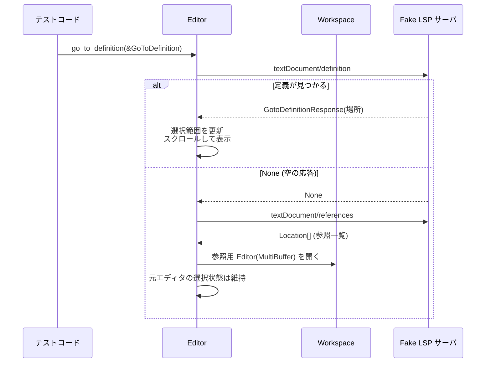

**要点**

- テスト側で `set_request_handler` を二度設定し、最初は定義を返し、次は `None` を返すようにしています。
- `GoToDefinitionFallback` が有効なケースでは、`None` のあとに `References` が呼ばれ、結果は新しいエディタで表示されることを期待しています。
- `GoToDefinitionFallback::None` のテストでは、`References` ハンドラ側で `panic!` を仕込むことで「呼ばれていないこと」を保証しています。

---

## 6. 使い方（How to Use）

### 6.1 基本的な使用方法

このチャンクのパターンにならい、新しいエディタ機能のテストを書く場合の基本フローは次のようになります。

```rust
#[gpui::test]
async fn test_my_feature(cx: &mut TestAppContext) {
    // 1. テスト環境の初期化
    init_test(cx, |_| {});

    // 2. EditorTestContext の作成（LSP 不要な場合）
    let mut cx = EditorTestContext::new(cx).await;

    // 3. 初期状態の設定（ˇ, « » などでカーソル・選択範囲をマーク）
    cx.set_state(indoc! {"
        fn main() {
            ˇlet x = 1;
        }
    "});

    // 4. Editor のメソッドを呼び出す
    cx.update_editor(|editor, window, cx| {
        editor.duplicate_line_down(&DuplicateLineDown, window, cx);
    });

    // 5. 非同期処理があれば待ち合わせ
    cx.run_until_parked();

    // 6. 期待するテキストとカーソル位置を検証
    cx.assert_editor_state(indoc! {"
        fn main() {
            ˇlet x = 1;
            let x = 1;
        }
    "});
}
```

### 6.2 よくある使用パターン

- **LSP と連携したテスト**

  ```rust
  #[gpui::test]
  async fn test_lsp_completion(cx: &mut TestAppContext) {
      init_test(cx, |_| {});
      let mut cx = EditorLspTestContext::new_rust(
          lsp::ServerCapabilities {
              completion_provider: Some(lsp::CompletionOptions::default()),
              ..Default::default()
          },
          cx,
      ).await;

      // LSP 側の応答をモック
      let counter = Arc::new(AtomicUsize::new(0));
      let handler_task = handle_completion_request(
          "fn main() { fo|<o> }",
          vec!["foo", "foobar"],
          false,
          counter.clone(),
          &mut cx,
      );

      cx.set_state("fn main() { foˇ }");

      // 補完のトリガ
      cx.update_editor(|e, window, cx| e.show_completions(&ShowCompletions, window, cx));
      handler_task.await;

      // 表示されている補完メニューの検証
      check_displayed_completions(vec!["foo", "foobar"], &mut cx);
  }
  ```

- **言語構成・インデントのテスト**

  ```rust
  let language = languages::language("python", tree_sitter_python::LANGUAGE.into());
  cx.update_buffer(|buffer, cx| buffer.set_language(Some(language), cx));
  cx.set_state("if x:\n    ˇpass\n");
  cx.update_editor(|e, window, cx| e.newline(&Newline, window, cx));
  cx.wait_for_autoindent_applied().await;
  ```

- **Diff review コメントのテスト**

  ```rust
  editor.update_in(cx, |editor, window, cx| {
      editor.show_diff_review_overlay(DisplayRow(1)..DisplayRow(3), window, cx);
  });
  editor.update(cx, |editor, window, cx| {
      if let Some(prompt) = editor.diff_review_prompt_editor().cloned() {
          prompt.update(cx, |pe, cx| pe.insert("LGTM", window, cx));
      }
      editor.submit_diff_review_comment(window, cx);
  });
  ```

### 6.3 よくある間違い

このチャンクから推測できる、テスト記述時に陥りやすいポイントをまとめます。

- **`init_test` を呼ばずにテストを書く**
  - テーマ・フォント・設定ストアが未初期化になり、描画や設定依存のテストが予期せず失敗します。
- **非同期処理の待ち忘れ**
  - 自動インデント・LSP 応答・インレイヒント・診断などは非同期であり、`wait_for_autoindent_applied`, `run_until_parked`, `advance_clock` を適切に呼ばないとテスト結果が安定しません。
- **言語設定の抜け**
  - インデントや bracket/linked editing は `Buffer::set_language(Some(language), cx)` が前提です。設定しないと一般テキスト扱いになります。
- **マーカー付き文字列と実バッファ内容の不整合**
  - `marked_text_ranges` / `handle_completion_request` のようなヘルパーは、マーカー付き文字列から位置情報を計算するため、実際に `set_state` した内容と一致していないと `assert_eq!` で落ちます。

### 6.4 使用上の注意点（まとめ）

- **テストコンテキストの選択**
  - LSP を使わない純粋なエディタ機能 → `EditorTestContext`  
  - LSP 機能を含む → `EditorLspTestContext`  
  - サイズや描画を含めた UI テスト → `VisualTestContext`
- **設定の変更タイミング**
  - `SettingsStore` を更新する場合、エディタやプロジェクト生成の **前に** 行うと一貫性が保ちやすくなります。
- **MultiBuffer / 折りたたみ**
  - マルチバッファ上での座標系は `Point`（バッファ座標）と `DisplayPoint`（描画座標）、`MultiBufferOffset` が混在するため、どの API がどの座標を要求しているかをコードから確認する必要があります。
- **Anchor ベースの構造**
  - Diff hunk やレビューコメント、LSP 結果などはアンカー（`Anchor`）に紐付いているため、バッファ編集を伴うテストでは「アンカーが有効かどうか」の扱いに注意が必要です（orphan cleanup のテスト参照）。

---

## 7. 関連ファイル

このチャンクにはテストコードのみが含まれており、実装本体は別ファイルにあります。型名・利用状況から推測できる関連ファイルを整理します（パスはこのチャンクからは読めないため、役割ベースの記述です）。

| パス（推定） | 役割 / 関係 |
|-------------|------------|
| `editor.rs` または `crate::editor::Editor` | 本チャンクでテスト対象となっているエディタ本体。折りたたみ・LSP ナビゲーション・ブレークポイント・diff review 等の実装を持つと考えられます。 |
| `text/buffer.rs` (`Buffer`) | 単一ファイルのテキストバッファ実装。`Buffer::local`, `snapshot`, `edit` などが利用されています。 |
| `text/multi_buffer.rs` (`MultiBuffer`) | 複数バッファの抜粋を 1 つの論理バッファとして扱うコンポーネント。`set_excerpts_for_path`, `display_text` などがこのチャンク内から呼ばれています。 |
| `project/mod.rs` (`Project`, `Worktree`) | ファイルツリー・LSP サーバ管理・言語レジストリを持つプロジェクト管理コンポーネント。`Project::test`, `open_buffer`, `languages`, `code_actions` 等が使用されています。 |
| `workspace/mod.rs` (`MultiWorkspace`, `Workspace`, `Pane`) | 複数エディタ・ペイン・ナビゲーション履歴を扱う UI レイヤー。ペイン分割・アイテムオープン/クローズ・モーダル表示などのテストが含まれています。 |
| `lsp/fake_lsp_adapter.rs` (`FakeLspAdapter`) | テスト用の擬似 LSP サーバ。`set_request_handler` 経由で各種 LSP リクエストに対する応答を注入しています。 |
| `settings/*.rs` (`SettingsStore`, `EditorSettings`, `ProjectSettings`) | エディタ・プロジェクト・言語ごとの設定。インデント幅・LSP タイムアウト・sticky scroll・restore_on_file_reopen などのテストで利用されています。 |
| `language/*.rs` (`Language`, `LanguageRegistry`) | tree-sitter 言語との結合や、言語ごとの brackets/linked editing/indent ルールの設定。Python/Bash/Markdown などのインデントテストで利用されています。 |

このチャンクのテストコードは、上記コンポーネントの契約（入力に対する挙動）を示す具体例として読むことができ、実装を変更する際のリグレッションテストとしても重要な役割を果たします。

---

# depth1-editor-59/chunk8 コード解説

※ 実際のファイルパスはこのチャンクからは分かりませんが、`EditorElement` のレイアウト／描画まわりの後半部分に相当するコードです。

---

## 1. ざっくり一言

- テキストエディタの **1 画面ぶんのレイアウト計算と描画処理**（行レイアウト・ガター・スクロールバー・ミニマップ・ポップオーバーなど）をまとめて実装している部分です。
- また、行内の不可視文字（スペース・タブ）表示や、背景ハイライトのマージ、スクロール位置とテキスト位置の対応など、エディタ描画の基礎機能も含まれています。

---

## 2. このモジュールの役割

### 2.1 概要

- このモジュール（断片）は、`EditorElement` の **レイアウト（prepaint）と描画（paint）フェーズ**を実装します。
- 具体的には、`Editor` から `EditorSnapshot` を取得し、`PositionMap` や `EditorLayout` といった中間構造体に展開した上で、`Window` に対してテキスト・ガター・ハイライト・スクロールバー・ミニマップ・各種ポップオーバーを描画します。
- 同時に、マウス・スクロール・ドラッグ等の **入力イベントを登録**し、スクロールや選択、コンテキストメニューなどの動作を制御します。

### 2.2 アーキテクチャ内での位置づけ

このチャンクから読み取れる範囲での主要コンポーネントの関係を図示します。

```mermaid
graph TD
  subgraph Model
    E[Editor]
    Snap[EditorSnapshot]
  end

  subgraph View
    EE[EditorElement]
    EL[EditorLayout]
    PM[PositionMap]
    LWI[LineWithInvisibles]
    SB[EditorScrollbars &<br/>ScrollbarLayout]
    MM[MinimapLayout]
  end

  subgraph UI
    W[Window(gpui)]
    App[App(Context)]
  end

  E -->|snapshot(window,cx)| Snap
  EE -->|update/read| E
  EE -->|構築| EL
  EL --> PM
  PM --> Snap
  EE -->|行レイアウト| LWI
  EE -->|スクロールバー計算| SB
  EE -->|ミニマップ計算| MM

  EE -->|prepaint/paint| W
  EE -->|設定・テーマ取得| App
```

- `EditorElement` は `Editor`（テキストモデル）と `Window`（描画先）の間に立ち、`EditorLayout` を構築した上で描画や入力ハンドリングを行います。
- `PositionMap` は「ピクセル座標 ⇔ テキスト位置」の変換や、各行の `LineWithInvisibles` を保持します。
- スクロールバーやミニマップは、`ScrollbarLayoutInformation` から導かれる `EditorScrollbars` / `ScrollbarLayout` / `MinimapLayout` を通じて配置されます。

### 2.3 設計上のポイント

コードから読み取れる特徴を列挙します。

- **レイアウトと描画の分離**
  - `impl Element for EditorElement` で
    - `request_layout` → サイズ決定
    - `prepaint` → `EditorLayout`（レイアウト状態）構築
    - `paint` → 実際の描画・イベント登録
  - という 3 段階にフェーズが分かれています。

- **PositionMap による座標変換の一元化**
  - `PositionMap` が
    - スクロール位置 (`scroll_position`, `scroll_pixel_position`)
    - 可視行範囲 (`visible_row_range`)
    - 各行の `LineWithInvisibles`
    - `EditorSnapshot`
  - をまとめて持ち、`point_for_position` などでピクセルと `DisplayPoint` の変換を行います。

- **行レイアウトのカプセル化**
  - 1 行ぶんの描画情報を `LineWithInvisibles` にまとめ、
    - テキストフラグメント（`LineFragment::Text`）
    - 埋め込み UI エレメント（`LineFragment::Element`）
    - 不可視文字情報（`Invisible`）
  - を一括管理しています。

- **背景ハイライトのマージとコントラスト調整**
  - `bg_segments_per_row` と `merge_overlapping_ranges` によって
    - 選択範囲やハイライトを 1 行ごとの非重複セグメントに分割
    - `split_runs_by_bg_segments` でテキスト色を最低コントラスト以上に補正
  - することで、複数のハイライトが重なっても読みやすい表示になるよう調整しています。

- **多数の layout_* / paint_* 関数による責務分割**
  - ガター・スクロールバー・ミニマップ・ポップオーバー・インライン診断などを、それぞれ専用の `layout_...` / `paint_...` 関数で処理しています。
  - これにより、特定の UI 要素の挙動を追いやすくなっています。

- **再レイアウトの深さ制限**
  - `EditorRequestLayoutState` が `prepaint_depth` を持ち、動的なブロック高さ変更による再レイアウトが **最大 5 回** までに制限されています（無限再帰防止）。

---

## 3. 主要な機能一覧

このチャンクで実装されている主な機能を簡単にまとめます。

- 行レイアウト:
  - シンタックスハイライト済みチャンクから `LineWithInvisibles` を生成 (`LineWithInvisibles::from_chunks`, `layout_lines`, `layout_line`).
  - 行内の不可視文字（スペース／タブ）を検出し、設定に応じて記号表示。

- 背景ハイライト:
  - 選択範囲・検索結果・単語 diff・ドキュメントカラーなどの背景色を、行ごとの連続セグメントに変換 (`bg_segments_per_row`, `merge_overlapping_ranges`, `HighlightedRange`).

- ガター（左端エリア）:
  - 行番号の描画・ホバー時の色変化 (`paint_line_numbers`).
  - diff ハンクの表示 (`paint_gutter_diff_hunks`, `diff_hunk_bounds`).
  - ブレークポイント・テストインジケータ・折りたたみトグルなどの配置と描画 (`paint_gutter_indicators`, `layout_breakpoints` 等は別チャンクで定義)。

- ブロック（カスタム UI 挿入）:
  - コードの途中に挿入される `Block`（カスタムブロック、折りたたみヘッダー、スペーサ等）のレイアウト (`render_block`, `render_blocks`, `layout_blocks`).
  - スペーサブロックの背景パターン生成 (`spacer_pattern_period`, `render_spacer_block`).

- ポップオーバー / コンテキストメニュー:
  - カーソル位置のコンテキストメニューや編集予測ポップオーバーの配置 (`layout_cursor_popovers`, `layout_popovers_above_or_below_line`, `layout_context_menu_aside`).
  - ガター由来のコンテキストメニュー (`layout_gutter_menu`, `layout_mouse_context_menu`).
  - ホバー情報・シグネチャヘルプのポップオーバー配置 (`layout_hover_popovers`, `layout_signature_help`).

- スクロールバーとミニマップ:
  - スクロールバーのレイアウト・描画・ドラッグ処理 (`EditorScrollbars`, `ScrollbarLayout`, `paint_scrollbars`).
  - スクロールバー上のカーソル・診断・検索結果などのマーカー (`collect_fast_scrollbar_markers`, `refresh_slow_scrollbar_markers`).
  - ミニマップのレイアウトとサムの描画・ドラッグ処理 (`MinimapLayout`, `paint_minimap`).

- スクロール・マウスイベント:
  - マウスホイールスクロールの処理とスクロール感度 (`paint_scroll_wheel_listener`).
  - クリック・ドラッグ・ホバーのハンドリング (`paint_mouse_listeners`).

- スティッキーヘッダー:
  - 「上部に張り付く」バッファヘッダーやコードブロックヘッダーのレイアウト (`layout_sticky_buffer_header`, `layout_sticky_headers`, `sticky_headers`).

- その他:
  - パンくずリスト（breadcrumb）の描画 (`render_breadcrumb_text`, `apply_dirty_filename_style`).
  - 行ハイライト／インライン診断／インライン blame／コードアクションなどの描画 (`paint_highlights`, `paint_inline_diagnostics`, `paint_inline_blame`, `paint_inline_code_actions`).
  - エディタ全体の `prepaint` / `paint` 実装（`impl Element for EditorElement`）。

---

## 4. 関数・構造体の解説

### 4.1 型一覧（主要な構造体・列挙体）

このチャンク内で定義されている、主要な型の一覧です。

| 名前 | 種別 | 役割 / 用途 |
|------|------|-------------|
| `EditorLayout` | 構造体 | `prepaint` フェーズで構築される、1 フレーム分のエディタ状態（行レイアウト、ガター情報、ハイライト、ブロック、スクロールバー等） |
| `PositionMap` | 構造体 | ピクセル座標と `DisplayPoint` の相互変換、可視行範囲、`LineWithInvisibles` の配列などを保持 |
| `LineWithInvisibles` | 構造体 | 1 行分の描画情報（テキストフラグメント＋埋め込みエレメント＋不可視文字情報、幅・長さなど） |
| `LineFragment` | enum | `LineWithInvisibles` 内のフラグメント。`Text(ShapedLine)` または埋め込み UI (`Element`) |
| `Invisible` | enum | 行内のタブ／空白の位置情報を表現（行オフセット範囲／位置） |
| `HighlightedRange` / `HighlightedRangeLine` | 構造体 | 複数行にまたがる背景ハイライトを、曲線付きの矩形パスとして描画するための中間表現 |
| `CursorLayout` | 構造体 | 1 つのカーソルの表示位置・形状（バー／ブロック／下線）と色、名前ラベルのエレメントを保持 |
| `CursorName` | 構造体 | マルチカーソル時に表示するカーソル名の文字列と色、行位置情報 |
| `StickyHeaders` / `StickyHeaderLine` | 構造体 | スクロールに追従する「スティッキーヘッダー」の行レイアウトと描画ロジック |
| `StickyHeader` | 構造体 | 1 つのスティッキーヘッダー対象ブロック（`sticky_row`, 範囲, offset）情報 |
| `ContextMenuLayout` | 構造体 | コンテキストメニューの配置結果（bounds, 上側配置かどうか） |
| `EditorScrollbars` | 構造体 | 縦横スクロールバーの `ScrollbarLayout` と表示フラグを保持 |
| `ScrollbarLayout` | 構造体 | スクロールバー 1 本分のトラック hitbox、表示範囲、thumb の bounds、ドラッグ状態など |
| `ScrollbarLayoutInformation` | 構造体 | ドキュメントサイズ／viewport サイズ／グリッドセルサイズなど、スクロールバーレイアウトの入力情報 |
| `MinimapLayout` | 構造体 | ミニマップのエレメント、サムの `ScrollbarLayout`、スクロールトップなど |
| `IndentGuideLayout` | 構造体 | インデントガイド 1 本の描画位置・長さ・階層 depth・アクティブ状態など |
| `BlockLayout` | 構造体 | 1 つの `Block`（カスタム UI ブロック）の X オフセット、行位置、エレメント、スタイル情報など |
| `CreaseTrailerLayout` | 構造体 | 折りたたみ閉じ行の右端に描画される “trailer” 要素のエレメントと bounds |
| `EditorRequestLayoutState` / `EditorPrepaintGuard` | 構造体 | `prepaint` 再帰呼び出しの深さ管理用（無限ループ防止） |
| `EditorScrollbars` | 構造体 | 縦横スクロールバーのレイアウトと可視状態をまとめるコンテナ |
| `ColoredRange<T>` | 構造体 | スクロールバー用マーカーなどで使う「色付きの範囲」汎用構造体 |
| `PointForPosition` | 構造体 | ピクセル座標から得たポイントの「前後の有効位置」「オーバーシュート列数」などを保持 |

※ `Editor`, `EditorSnapshot`, `Block`, `DisplayPoint`, `DisplayRow` などの型は別ファイルで定義されていますが、このチャンクから参照されています。

---

### 4.2 重要な関数・メソッドの詳細（抜粋）

#### `bg_segments_per_row(rows, selections, highlight_ranges, base_background) -> Vec<Vec<(Range<DisplayPoint>, Hsla)>>`

**概要**

- 選択範囲や背景ハイライト（検索結果・word diff など）を、表示行ごとの **非重複な背景色セグメント** に変換します。
- 後続の `LineWithInvisibles::from_chunks` で、文字ごとの描画色をコントラスト付きで補正するための前処理です。

**引数**

| 引数名 | 型 | 説明 |
|--------|----|------|
| `rows` | `Range<DisplayRow>` | 対象とする表示行範囲（半開区間） |
| `selections` | `&[(PlayerColor, Vec<SelectionLayout>)]` | 各プレイヤー（カーソル）の選択範囲レイアウトと色 |
| `highlight_ranges` | `&[(Range<DisplayPoint>, Hsla)]` | 任意のハイライト（word diff 等）の範囲と色 |
| `base_background` | `Hsla` | エディタの基本背景色 |

**戻り値**

- `Vec<Vec<(Range<DisplayPoint>, Hsla)>>`  
  - `per_row_map[row_index]` に、その行にかかる (開始/終了 DisplayPoint, 色) のリストが入ります。
  - 範囲は同じ行内で非重複かつ左から右にソート済みです。

**内部処理の流れ**

1. `rows` が空、または `base_background` が不透明でない場合は早期に空ベクタを返します。
2. `highlight_ranges` と `selections` を同一のイテレータにまとめ、(範囲, 色) の列を作ります。
3. 各範囲について、行ごとに分解します:
   - 選択範囲が `start.row..end.row` にまたがる際、行頭・行末で `DisplayPoint::new(row, 0)` や `u32::MAX` を使って「その行の全体」をカバーするようにクリップします。
4. 行インデックス（`row.minus(rows.start)`）で `per_row_map` に push します。
5. 各行ごとのリストに対して `merge_overlapping_ranges` を呼び出し、重なりを分割・マージして非重複化します。

**Errors / Panics**

- コード中では `debug_assert!(row >= rows.start && row < rows.end)` およびインデックスチェックの `debug_assert!(ix < per_row_map.len())` があり、デバッグビルドでのみ不整合を検出します。
- リリースビルドではパニックしない前提の書き方になっています。

**Edge cases**

- `rows.start >= rows.end` の場合 → 空ベクタを返します。
- 背景が透過 (`!base_background.is_opaque()`) の場合 → 背景色のブレンドが定義できないため、空ベクタを返してなにも描画しません。
- 範囲終端が行頭 (`end.column() == 0`) の場合 → 終端行は含めず、前の行までを対象とします。
- セグメントが 1 行もカバーしない場合 → そのセグメントは無視されます。

**使用上の注意点**

- `highlight_ranges` / `selections` は **行をまたいでよい** 前提で渡して構いませんが、この関数は内部で行ごとに切り分けます。
- 各 `(Range<DisplayPoint>, Hsla)` は「同一行内での分割」は行いますが、「行をまたぐ状態で渡される」ことは想定内です。
- `merge_overlapping_ranges` は「単一行内の範囲」を前提にしているので、複数行にまたがる範囲は必ずこの関数で行分割してから渡す必要があります（コード上もそうしています）。

---

#### `merge_overlapping_ranges(ranges, base_background) -> Vec<(Range<DisplayPoint>, Hsla)>`

**概要**

- 同一行内の複数の背景範囲を、**境界で分割しつつ色をブレンド**して 1 列にまとめる補助関数です。
- 結果は「左から右へ・互いに非重複な範囲の列」になります。

**引数**

| 引数名 | 型 | 説明 |
|--------|----|------|
| `ranges` | `Vec<(Range<DisplayPoint>, Hsla)>` | 単一行内の範囲と色 |
| `base_background` | `Hsla` | ブレンドのベースになる背景色 |

**戻り値**

- `Vec<(Range<DisplayPoint>, Hsla)>`  
  重なりをすべて解消し、必要に応じてブレンドした色を持つ範囲列。

**内部処理の流れ**

1. 各範囲の start/end を `Boundary` として収集 (`is_start` フラグ付き)。
2. 位置＋開始/終了フラグでソートします（同じ位置の場合、開始が先）。
3. 境界を左から走査し、現在「アクティブな範囲集合」を `active_ranges` として管理します。
4. 2 つの境界の間に `active_ranges` が非空であれば、すべての色を `Hsla::blend` で順にブレンドして 1 つの色を作り、その区間の範囲として `processed_ranges` に追加します。
5. 隣接する区間で色が同じ場合には、1 つにマージします。

**Errors / Panics**

- `debug_assert!(range.start.row() == range.end.row())` があり、複数行にまたがる範囲を渡すとデバッグビルドではアサート失敗します。

**Edge cases**

- `ranges` が空 → 空ベクタを返します。
- 長さ 0 の範囲（start == end）は無視されます。
- 完全に一致する範囲が複数ある場合 → ブレンド結果は同じになるため 1 つにマージされます。

**使用上の注意点**

- 引数 `ranges` は **同一行内** の範囲に限定されます。複数行にまたがる場合は `bg_segments_per_row` のように予め行ごとに分割する必要があります。
- 色のブレンド順は、`ranges` の順番に依存します（`active_ranges` にインデックス順で入れるため）。テストでは主に分割境界が想定通りかどうかを検証しています。

---

#### `layout_lines(rows, snapshot, style, editor_width, is_row_soft_wrapped, bg_segments_per_row, window, cx) -> Vec<LineWithInvisibles>`

**概要**

- 指定された表示行範囲 `rows` に対して、テキストやハイライト情報から `LineWithInvisibles` の配列を生成します。
- エディタが空の場合には placeholder テキストを描画する特殊処理も含みます。

**引数（主なもの）**

| 引数名 | 型 | 説明 |
|--------|----|------|
| `rows` | `Range<DisplayRow>` | レイアウト対象の表示行範囲 |
| `snapshot` | `&EditorSnapshot` | 現在のエディタ内容・表示状態のスナップショット |
| `style` | `&EditorStyle` | テキストフォントや色などのスタイル |
| `editor_width` | `Pixels` | テキスト描画領域の幅 |
| `is_row_soft_wrapped` | `impl Copy + Fn(usize) -> bool` | 指定インデックスの行がソフトラップ行かどうかの判定関数 |
| `bg_segments_per_row` | `&[Vec<(Range<DisplayPoint>, Hsla)>]` | 行ごとの背景ハイライトセグメント |
| `window`, `cx` | `&mut Window`, `&mut App` | フォント解決やテーマ取得のためのコンテキスト |

**戻り値**

- `Vec<LineWithInvisibles>`  
  - `rows.len()` と同じ長さになることが期待されます（placeholder の場合はやや挙動が異なりうる）。

**内部処理の流れ**

1. `rows` が空なら空ベクタを返します。
2. `snapshot.is_empty()` の場合:
   - placeholder テキスト（`snapshot.placeholder_text()`）を行単位に分割し、`rows` に応じてスライス／埋め草（空文字列）を行ごとに `ShapedLine` に変換します。
   - その結果をもとに `LineWithInvisibles` を構築します。
3. 非空の場合:
   - `use_tree_sitter` フラグを `snapshot.semantic_tokens_enabled` 等から決定。
   - `snapshot.highlighted_chunks(rows.clone(), use_tree_sitter, style)` でシンタックスハイライト済みチャンク列を取得。
   - `LineWithInvisibles::from_chunks(...)` を呼び出して行配列を生成します。このとき `bg_segments_per_row` により背景色も行単位で適用されます。

**Errors / Panics**

- 特段の `panic!` はありませんが、`LineWithInvisibles::from_chunks` 内での処理に依存します（後述）。

**Edge cases**

- placeholder テキストを複数行に設定した場合、エディタ表示行数と placeholder 行数の最大値まで描画します（`take(max(rows.len(), placeholder_line_count))`）。
- `rows.start` が placeholder 行数を越えている場合、以降の行は空文字列の placeholder として扱われます。

**使用上の注意点**

- `bg_segments_per_row` の長さは `rows.len()` 以上である必要があります（`LineWithInvisibles::from_chunks` では、`row` インデックスで `bg_segments_per_row.get(row)` を参照します）。
- `is_row_soft_wrapped` の判定は不可視文字の表示ロジックに影響します（ソフトラップ行の先頭の空白は特別扱い）。

---

#### `LineWithInvisibles::from_chunks(chunks, editor_style, max_line_len, max_line_count, editor_mode, text_width, is_row_soft_wrapped, bg_segments_per_row, window, cx)`

**概要**

- シンタックスハイライト済みのテキストチャンク列から、複数行の `LineWithInvisibles` を構築します。
- インライン要素（インレイヒントなど）の埋め込みや、不可視文字（スペース・タブ）の抽出、背景ハイライト色に応じた文字色の補正も行います。

**主な引数**

| 引数名 | 型 | 説明 |
|--------|----|------|
| `chunks` | `impl Iterator<Item = HighlightedChunk<'a>>` | 強調スタイル付きテキストチャンク列 |
| `editor_style` | `&EditorStyle` | テキストスタイル |
| `max_line_len` | `usize` | 1 行あたりの最大文字数（長すぎる行の表示制限用） |
| `max_line_count` | `usize` | 最大行数（結果ベクタの上限） |
| `editor_mode` | `&EditorMode` | エディタモード（フル／ミニマップ等） |
| `text_width` | `Pixels` | レイアウト幅 |
| `is_row_soft_wrapped` | Fn | 行がソフトラップかどうか（不可視文字表示に使用） |
| `bg_segments_per_row` | `&[Vec<(Range<DisplayPoint>, Hsla)>]` | 行ごとの背景色セグメント |
| `window`, `cx` | レイアウトコンテキスト |

**内部処理のポイント**

- チャンク列を改行で分割しながら 1 行ぶんの文字列 `line` と `TextRun` の列 `styles` を組み立て、行が終わるたびに `window.text_system().shape_line` で `ShapedLine` を生成し、`LineFragment::Text` として `fragments` に push します。
- `ChunkReplacement` があるチャンク（インラインレンダラーや置換文字列）は
  - それまでの行を flush してから、別途 `element.layout_as_root` でサイズを測り、`LineFragment::Element` として埋め込みます。
- 行長が `max_line_len` を超えそうになった場合、UTF-8 境界を考慮しつつ文字列を切り詰め、以降はその行を増やさないようにします。
- `bg_segments_per_row` が存在する場合、`split_runs_by_bg_segments` により `TextRun` を背景セグメント境界で分割しつつ、`ensure_minimum_contrast` で文字色を調整します。
- `editor_mode.is_full()` かつ `!is_inlay` のチャンクについて、スペースとタブの位置を `Invisible` 列に記録します。ソフトラップ行の先頭パディングは表示しないように制御しています。

**Errors / Panics**

- 特定の箇所で `expect("you can't prepaint LineWithInvisibles twice")` を用いており、`prepaint` 済みの `LineWithInvisibles` を再度 `prepaint` するとパニックします（後述の `prepaint` メソッド内）。

**Edge cases**

- チャンク末尾に改行がない場合でも、最後に人工的に改行チャンクを追加して処理しているため、行終端の flush は必ず行われます。
- `max_line_count` に達した時点で処理を打ち切ります。
- `bg_segments_per_row` が空の場合、背景色による文字色補正は行われません（そのままの `styles` を使用）。

**使用上の注意点**

- 1 フレームの間に同じ `LineWithInvisibles` に対して `prepaint` を複数回呼ぶことはできません（`LineFragment::Element` 内の `element: Option<AnyElement>` を `take()` してしまうため）。
- 行レイアウトを再利用したい場合は、新たに `from_chunks` を呼び出して作り直すのが前提です。

---

#### `layout_popovers_above_or_below_line(target_position, line_height, min_height, max_height, placement, text_hitbox, viewport_bounds, window, cx, make_sized_popovers) -> Option<(Vec<(CursorPopoverType, Bounds<Pixels>)>, bool)>`

**概要**

- カーソル行などの「基準位置」に対して、コンテキストメニューや編集予測ポップオーバー等を **行の上または下** に配置します。
- 利用可能なスペースや `placement` 指定に応じて、上下どちらに配置するかを決定し、その位置とサイズを返します。

**主な引数**

| 引数名 | 型 | 説明 |
|--------|----|------|
| `target_position` | `gpui::Point<Pixels>` | クリックやカーソルなど、基準となる画面上の位置 |
| `line_height` | `Pixels` | 1 行の高さ |
| `min_height`, `max_height` | `Pixels` | ポップオーバー群全体の最小／最大高さ |
| `placement` | `Option<ContextMenuPlacement>` | 明示的な上下指定（Above / Below） |
| `text_hitbox` | `&Hitbox` | テキスト領域の矩形（スクロール内） |
| `viewport_bounds` | `Bounds<Pixels>` | ビューポート全体の矩形（ウィンドウ境界） |
| `make_sized_popovers` | クロージャ | 実際に高さと最大幅が決まったあとに、ポップオーバーをレイアウトして返す関数 |

**戻り値**

- `Some((laid_out_popovers, y_flipped))`:
  - `laid_out_popovers`: 各ポップオーバーの `(種類, Bounds)` の配列。
  - `y_flipped`: `true` の場合は「行の上側」に配置したことを意味します。
- ポップオーバーが生成されない場合は `None`。

**内部処理の流れ**

1. 行の上側／下側で利用可能な高さを算出し、`max_height` が下側に収まらない場合かつ上側の方が広い場合は上側に反転 (`y_flipped = true`)。
2. 最低高さ `min_height` がテキスト内部に収まらない場合は、ビューポート全体を使って高さを再評価し、必要に応じて `y_flipped` を上書き。
3. 決定した高さと最大幅を `make_sized_popovers` に渡して実際のポップオーバーエレメントを生成・サイズ測定。
4. `y_flipped` に応じて、上から下／下から上に詰めて配置し、`window.defer_draw` で描画を遅延登録します。
5. 配置結果と `y_flipped` を返します。

**Edge cases**

- ポップオーバーが 1 つも生成されない場合 → `None` を返します。
- 非常に小さなウィンドウで `min_height` を満たせない場合でも、利用可能な高さに合わせて縮めます。

**使用上の注意点**

- 実際のコンテキストメニューや編集予測ポップオーバーの **中身のレイアウト** は `make_sized_popovers` に委ねられています。
- 上下での配置を切り替える条件を変えたい場合は、この関数ではなく呼び出し側（例えば `layout_cursor_popovers`）のロジックも合わせて確認する必要があります。

---

#### `EditorElement::prepaint(&mut self, ..., bounds, request_layout, window, cx) -> EditorLayout`

**概要**

- `EditorElement` の `Element` 実装における prepaint フェーズです。
- `Editor` から `EditorSnapshot` を取得し、可視範囲の行レイアウト、ガター情報、スクロールバー、ミニマップ、ポップオーバーなどをすべて計算し、`EditorLayout` としてまとめて返します。

**引数（代表）**

| 引数名 | 型 | 説明 |
|--------|----|------|
| `bounds` | `Bounds<Pixels>` | このエレメントに割り当てられた描画領域 |
| `request_layout` | `&mut EditorRequestLayoutState` | 再レイアウト深さ管理用 |
| `window`, `cx` | `&mut Window`, `&mut App` | 描画・フォント・テーマなど |

**戻り値**

- `EditorLayout`  
  - `paint` フェーズで使われるレイアウト状態。

**内部処理の大まかな流れ**

1. `EditorRequestLayoutState::increment_prepaint_depth` で深さ管理（Drop で自動デクリメント）。
2. テキストスタイル (`TextStyleRefinement`) を設定し、必要なら `Editor` の UI フォーカスも設定。
3. `editor.snapshot(window, cx)` を取得し、フォント情報から `line_height`, `em_width` などを算出。
4. `gutter_dimensions`, `editor_width` などを計算し、ソフトラップ幅の再計算が必要なら `editor.set_wrap_width` を行い snapshot を更新。
5. スクロール位置と最大スクロール位置 (`max_scroll_top`) を決定し、オートスクロール要求があれば処理。
6. 可視行範囲 `[start_row, end_row)` を求めて `row_infos` を取得。
7. 選択範囲・ハイライト・diff 情報・ガターハイライトなどを集約し、`bg_segments_per_row` を計算。
8. `layout_lines` で `LineWithInvisibles` の列を作成し、各種ブロック (`render_blocks`) やスティッキーヘッダー／buffer header／インデントガイドなどをレイアウト。
9. スクロールバー／ミニマップ／ポップオーバー類をレイアウトし、必要に応じてマウスコンテキストメニューも配置。
10. `PositionMap` と各種レイアウト情報から `EditorLayout` を構築し、`editor.last_position_map` を更新して返します。

**Errors / Panics**

- ブロックの高さ変更に伴う再レイアウトが繰り返し発生する場合、`MAX_PREPAINT_DEPTH`（5）を超えると `debug_panic!` で警告しますが、処理自体は継続します。

**Edge cases**

- ミニマップやスクロールバーが非表示設定の場合は、そのレイアウトをスキップします。
- diff レビュー用のドラッグ範囲や inline blame など、一部 UI はエディタが read-only の場合にはスキップされます。
- placeholder テキスト表示時（空バッファ＋非フォーカス）は、ブロックと placeholder の両方を考慮した行レイアウトを行います（テスト `test_layout_with_placeholder_text_and_blocks` 参照）。

**使用上の注意点**

- `prepaint` 内では多数の `editor.update(...)` 呼び出しで Editor 状態を読み書きするため、**他スレッドからの並行アクセスは想定されていません**。
- ブロックの renderer 幅が変わった場合に再レイアウトをトリガーするロジックがあり、その際 `prepaint` が再帰的に呼ばれます。ブロック renderer 側で極端に不安定なレイアウト（幅が毎回変わるなど）を行うと深さ制限に達する可能性があります。

---

#### `EditorElement::paint(&mut self, ..., bounds, layout, window, cx)`

**概要**

- `EditorLayout` をもとに、実際にエディタを描画するフェーズです。
- 背景・ガター・テキスト・ハイライト・ブロック・スクロールバー・ミニマップなど、描画順を制御しながら `Window` に対して描画命令を発行します。

**内部処理の流れ**

1. `Editor` のフォーカスハンドルとキーバインディングコンテキストを設定し、エディタに対する入力ハンドラやアクションを登録します（`register_actions`, `register_key_listeners`）。
2. `window.with_text_style(...)` と `with_content_mask` でテキストスタイルと描画範囲を設定。
3. `paint_mouse_listeners` によりスクロールやマウス関連イベントのハンドラを登録。
4. `paint_background` でガター背景・テキスト背景・アクティブ行・ラインハイライトなどを描画。
5. `paint_indent_guides` → ガター関連 (`paint_blamed_display_rows`, `paint_line_numbers`) → テキスト (`paint_text`) の順で描画。
6. ブロック・スティッキーヘッダー・ミニマップ・スクロールバー・編集予測ポップオーバー・マウスコンテキストメニューなどを描画。

**使用上の注意点**

- `paint` は `prepaint` の結果 (`EditorLayout`) に依存しており、`layout` 内の一部フィールドは `paint` 中で `take()` / `drain()` されるため、**同一 `EditorLayout` を複数回 `paint` に渡すことは想定されていません**。

---

### 4.3 その他の関数（抜粋）

すべてを列挙すると非常に多いため、代表的なもののみ記載します。

| 関数名 / メソッド名 | 役割（1 行） |
|----------------------|--------------|
| `layout_crease_toggles` | 行ごとの折りたたみトグル（「く」の字）ボタンをガターに配置する |
| `layout_crease_trailers` | 折りたたみ終端行に表示する「trailer」要素を生成する |
| `prepaint_lines` | `LineWithInvisibles` に含まれる埋め込みエレメントを prepaint し、行エレメントを収集する |
| `render_block` | `Block`（Custom/FoldedBuffer/Spacer等）から対応する UI エレメントと高さを算出する |
| `render_spacer_block` | diff スペーサ用の斜線パターン背景を持つブロックを生成する |
| `render_buffer_header`（メソッド） | 編集中のバッファヘッダー（ファイル名・ブレッドクラム等）を描画するためのラッパーメソッド |
| `render_buffer_header`（自由関数） | 上記ヘッダー実体の描画とコンテキストメニュー（右クリック）を構築する |
| `layout_sticky_buffer_header` | 現在スクロール位置に応じて、固定表示される buffer header をレイアウトする |
| `layout_sticky_headers` / `sticky_headers` | コード内の「スティッキー行」（折りたたみヘッダー等）を検出・レイアウトする |
| `layout_cursor_popovers` | カーソル位置に付随する編集予測ポップオーバー／コンテキストメニューのレイアウトを行う |
| `layout_hover_popovers` | シンボルホバー時のツールチップ群を行の上または下に配置し、メニューとの衝突を避ける |
| `layout_diff_hunk_controls` | diff ハンク単位のアクションボタン（ステージ／破棄など）をテキスト右側に配置する |
| `paint_background` | エディタ背景・アクティブ行ハイライト・wrap guide を描画する |
| `paint_highlights` | 選択範囲と追加ハイライト範囲を描画し、ローカル選択範囲の可視範囲を返す |
| `paint_lines` / `paint_lines_background` | 各行のテキストおよび背景の描画を行う |
| `paint_scrollbars` | スクロールバーのトラック、thumb、マーカー、ドラッグ処理を実装する |
| `paint_minimap` | ミニマップ本体と viewport サムの描画・ドラッグ処理を行う |
| `paint_scroll_wheel_listener` | スクロールホイールイベントを捕捉し、スクロール感度に基づいて縦横スクロールを行う |
| `shape_line_number` | 行番号を `ShapedLine` に変換し、ガター描画に利用する |
| `layout_line_numbers`（別チャンク定義） | このチャンク内のテストが期待値を検証している、行番号レイアウト関数 |
| `scale_vertical_mouse_autoscroll_delta` / `scale_horizontal_mouse_autoscroll_delta` | マウス位置からの距離に応じてオートスクロール量を非線形スケーリングする補助関数 |
| `calculate_wrap_width` | ソフトラップ設定（列数／エディタ幅）から wrap 幅（ピクセル）を決定する |
| `compute_auto_height_layout` | AutoHeight モードエディタの高さを、内容行数と min/max 行数制約から計算する |

---

## 5. データフロー

### 5.1 典型的な描画フロー

エディタが 1 フレーム分再描画される際のおおまかな流れは次のようになります。

1. `gpui` が `EditorElement` に対して `request_layout` → `prepaint` → `paint` を呼び出す。
2. `prepaint` 内で `EditorSnapshot` を取得し、可視行範囲・ガター・スクロールバー・ミニマップなどのレイアウトを計算し、`EditorLayout` を構築。
3. `paint` 内で `EditorLayout` をもとに、背景・テキスト・各種 UI を `Window` に描画する。

これを sequence 図で表すと次のようになります。

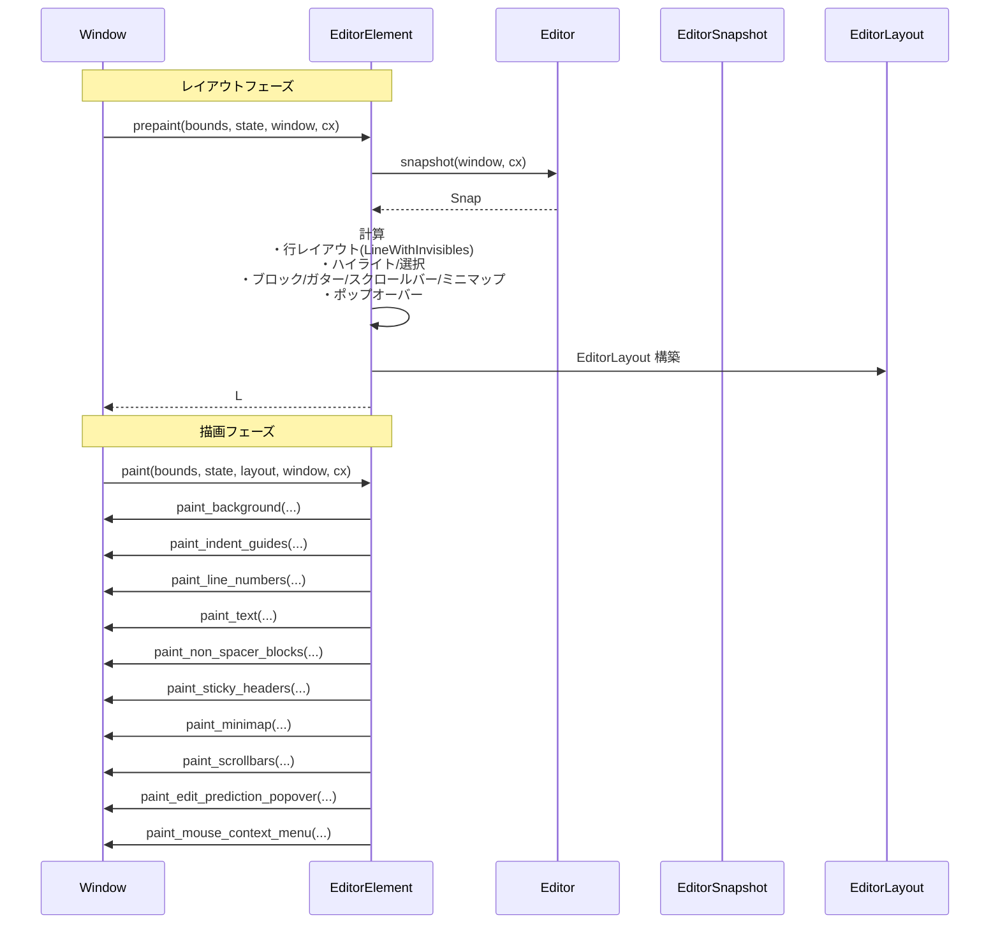

### 5.2 ポップオーバー配置のデータフロー（抜粋）

ポップオーバー（コンテキストメニュー等）の配置時の流れを簡略化すると以下のとおりです。

1. `layout_cursor_popovers` がカーソル位置とコンテキストメニュー設定を取得。
2. 必要最小／最大高さを計算し、`layout_popovers_above_or_below_line` を呼び出す。
3. `layout_popovers_above_or_below_line` は上下の空きスペースと `ContextMenuPlacement` をもとに配置方針を決定し、`make_sized_popovers` で実際のポップオーバーエレメントを生成。
4. 配置されたポップオーバーの `Bounds` が `ContextMenuLayout` に格納され、他ポップオーバー（hover や signature help）の配置時に衝突回避に使われます。

---

## 6. 使い方（How to Use）

このチャンクは主に `EditorElement` 内部の実装であり、外部コードが直接呼び出す API は限られています。ここでは、**`EditorElement` を UI として使う側**の視点で代表的な利用パターンを示します。

### 6.1 基本的な使用方法

テストコードから読み取れる最小構成の例です。

```rust
use gpui::{Window, App, size, px};
use crate::{Editor, EditorElement, MultiBuffer, EditorMode};

fn build_editor_element(window: &mut Window, cx: &mut App) -> EditorElement {
    // 1. バッファを用意する（単一ファイル用の簡単な MultiBuffer）
    let buffer = MultiBuffer::build_simple("fn main() {}\n", cx);

    // 2. Editor を生成する（ここではフルモード）
    let editor = Editor::new(EditorMode::full(), buffer, None, window, cx);

    // 3. スタイルを取得する
    let style = editor.style(cx).clone();

    // 4. EditorElement を生成する
    EditorElement::new(&editor, style)
}

// gpui のウィンドウに配置する例（テストコードに近い）
fn add_editor_window(cx: &mut gpui::TestAppContext) {
    let window = cx.add_window(|window, cx| {
        let editor_element = build_editor_element(window, cx);
        // Window のルート要素として EditorElement を返す
        editor_element
    });

    // VisualTestContext などで draw すると prepaint/paint が呼ばれる
    let mut vtc = gpui::VisualTestContext::from_window(*window, cx);
    let editor = window.root(&mut vtc).unwrap();
    let style = vtc.update(|_, cx| editor.update(cx, |editor, cx| editor.style(cx).clone()));

    let (_bounds, layout) = vtc.draw(
        Default::default(),
        size(px(500.), px(500.)),
        |_, _| EditorElement::new(&editor, style.clone()),
    );

    // layout.position_map などをテストで検査できる
    assert!(layout.position_map.visible_row_range.start.0 <= layout.position_map.visible_row_range.end.0);
}
```

- 実際のアプリケーションでは `Workspace` や `Project` と統合して `Editor` を管理しますが、このチャンクからは詳細は読み取れません。
- 重要なのは、`EditorElement` が `IntoElement` を実装しているため、通常の gpui エレメントと同様にツリーに組み込める点です。

### 6.2 よくある使用パターン

#### パターン 1: AutoHeight エディタ（コメント入力欄など）

`EditorMode::AutoHeight` を使うと、行数に合わせて高さが伸びるエディタが作られます。

```rust
use crate::{Editor, EditorElement, MultiBuffer, EditorMode};
use gpui::{Window, App, size, px};

fn build_auto_height_editor(window: &mut Window, cx: &mut App) -> EditorElement {
    let buffer = MultiBuffer::build_simple("", cx);
    let editor = Editor::new(
        EditorMode::AutoHeight { min_lines: 1, max_lines: Some(10) },
        buffer,
        None,
        window,
        cx,
    );
    let style = editor.style(cx).clone();
    EditorElement::new(&editor, style)
}
```

内部では `compute_auto_height_layout` が呼ばれ、実際のコンテンツ行数と `min_lines` / `max_lines` に基づいて高さが決まります。

#### パターン 2: ミニマップ付きフルエディタ

`EditorMode::full()` と、`EditorSettings::minimap` の設定を組み合わせることで、右側にミニマップを持つエディタになります。ミニマップの幅や表示条件は `MinimapLayout::MINIMAP_MIN_WIDTH_COLUMNS` 等で制御されます（定数値はこのチャンクから一部読み取れます）。

### 6.3 よくある間違い

**例 1: `LineWithInvisibles` の二重 prepaint**

```rust
// NG: 同じ line に対して prepaint を 2 回呼ぶ
let mut line = LineWithInvisibles::from_chunks(...).pop().unwrap();
let mut elements = smallvec::SmallVec::new();

line.prepaint(line_height, scroll_pos, scroll_px_pos, row, origin, &mut elements, window, cx);
// ここでもう一度呼ぶと...
line.prepaint(line_height, scroll_pos, scroll_px_pos, row, origin, &mut elements, window, cx);
// ↑ 内部で element.take().expect(..) が実行され、panic する
```

- 正しくは、1 フレーム中に各 `LineWithInvisibles` に対して `prepaint` を 1 度だけ呼び、その後 `draw` で描画します。

**例 2: `merge_overlapping_ranges` に複数行の範囲を渡す**

```rust
// NG: start.row != end.row の Range を渡すと debug_assert で落ちうる
let ranges = vec![(DisplayPoint::new(DisplayRow(0), 0)..DisplayPoint::new(DisplayRow(1), 5), color)];
let merged = EditorElement::merge_overlapping_ranges(ranges, base_bg);
```

- 行を跨いだ範囲は、必ず `bg_segments_per_row` のように行ごとに分割してから呼び出す必要があります。

### 6.4 使用上の注意点（まとめ）

- **再レイアウトの起こり方**
  - ブロック（`Block`）の高さ変更や、インラインエレメントの幅変更があると `prepaint` 内で再レイアウトが走ります。
  - `EditorRequestLayoutState` の `MAX_PREPAINT_DEPTH` (5) を超えると、これ以上の再レイアウトは行わず、`debug_panic!` を出します。

- **スクロール計算**
  - 縦方向スクロール位置は行単位 (`ScrollOffset`) で管理され、ピクセルに換算する際は常に `line_height` を通じて変換しています。
  - `ScrollBeyondLastLine` 設定により、最終行より下にどれだけスクロールできるかが変化します。

- **イベントハンドラの登録**
  - `paint_*` 系の関数内で多数の `window.on_mouse_event` が登録されます。レイアウトの扱いを変更する場合は、これらのイベントハンドラとの整合性も確認が必要です。

- **テキストレイアウトとフォント**
  - すべてのテキストは `window.text_system().shape_line` を通してレイアウトされます。フォントや行間を変えると、ガター幅・wrap ガイド・インデントガイドなど、多くの計算に影響します。

---

## 7. 関連ファイル

このチャンクから参照されている他モジュール／ファイル（推測できる範囲）をまとめます。

| パス / モジュール名 | 役割 / 関係 |
|---------------------|------------|
| `crate::Editor` | テキストバッファ・選択・スクロール状態などを管理するエディタ本体。`EditorElement` はこれを描画対象とする |
| `crate::MultiBuffer` | 単一または複数バッファ（マルチバッファ）を抽象化する構造体。diff ビューやマルチファイルビューで利用 |
| `crate::display_map::{Block, BlockStyle, BlockId, BlockPlacement, BlockProperties}` | エディタ内に挿入されるカスタムブロック（folded buffer, spacer, excerpt header など）の定義 |
| `crate::LineHighlight`, `LineHighlightSpec` | 行単位のハイライト設定（背景色・境界線など）を表す型 |
| `gpui` クレート (`Window`, `Bounds`, 各種イベント型) | 描画 API や UI イベント、エレメント実装のための基盤ライブラリ |
| `language::{Buffer, Point, DisplayPoint, DisplayRow}` | テキストバッファとテキスト位置（行・列）を表現する型 |
| `crate::settings::{EditorSettings, ProjectSettings, ItemSettings}` | エディタ全体の設定・プロジェクト設定（スクロールバー・ミニマップ・ガターなどの挙動に影響） |
| `crate::git::{GitBlame, FileStatus}` | blame 情報やファイルステータス（作成／変更／削除／コンフリクト）を取得するためのコンポーネント |
| `crate::markdown::Markdown` | blame ポップオーバー内のコミットメッセージ表示などに利用される Markdown レンダラー |
| `crate::workspace::{Workspace, TabBarSettings}` | ワークスペース全体のタブバーやプロジェクトパネルとの連携（ブレッドクラムや「Reveal In Project Panel」など） |
| `crate::editor_tests`（テストモジュール） | `EditorElement` のレイアウト・ハイライト・invisible 表示などを検証するためのテストユーティリティ |

※ これらの詳細な実装はこのチャンクには含まれていませんが、インターフェースや呼び出しから上記のような役割が読み取れます。

---

# editor/src ディレクトリ解説（hover/インレイ/インデント関連）

## 1. ざっくり一言

このチャンクに含まれるファイル群は、エディタ上での **補助的な視覚フィードバック** を扱う部分です。  
括弧のマッチングハイライト、シンボルや URL へのホバーリンク、LSP ホバーのポップオーバー、インデントガイド、LSP インレイヒント、Git blame などを通じて、コードの読み書きを支援します。

---

## 2. このモジュールの役割

### 2.1 概要

このディレクトリ配下のモジュールは、主に `Editor` 型にメソッドを追加する形で次の問題を扱います。

- カーソル位置に応じて、**対応する括弧** をハイライトする
- Cmd/Ctrl+ホバーやクリックで、**URL・ファイルパス・シンボル定義** へジャンプできるようにする
- LSP から返される **型情報やドキュメント** をホバーのポップオーバーで表示する
- カーソル周辺の **インデントレベル** をガイド線として表示・強調する
- LSP の **インレイヒント**（型ヒントなど）をキャッシュ・表示し、ホバーや定義ジャンプと連携させる
- バッファの編集に追従して **Git blame 情報** を維持する（blame.rs の本体は別チャンク）

### 2.2 アーキテクチャ内での位置づけ

主な関係を簡略化した依存関係図です。

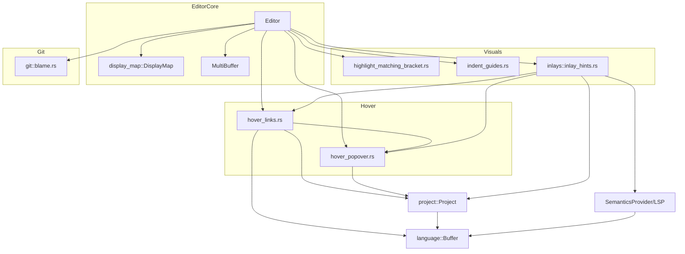

ポイント:

- すべての機能は `Editor` から呼び出され、`DisplaySnapshot` や `EditorSnapshot` を介して現在の表示状態を参照します。
- `hover_links` と `hover_popover` は密接に連携し、「どの範囲をリンクとして扱うか」と「その説明をどう表示するか」を分担しています。
- `inlay_hints` は LSP と `project::lsp_store` からインレイヒントを取得・キャッシュし、ホバー・リンク処理とも統合されています。
- `indent_guides` と `highlight_matching_bracket` はテキスト構造に基づく純粋なビジュアル表示です。
- `git::blame` はバッファの編集イベントに追従し、行ごとの blame 情報の整合性を保つテストが含まれています。

### 2.3 設計上のポイント

コードから読み取れる設計上の特徴は次の通りです。

- **Editor 拡張メソッド方式**
  - ほとんどの機能は `impl Editor` ブロックとして実装され、Editor 本体の状態（選択、バッファ、display_map など）に直接アクセスします。
- **非同期処理と UI スレッドの分離**
  - LSP 呼び出しや重めの計算（ブラケット探索、インデント解析、インレイ取得）は `background_spawn` / `spawn_in` を使ってバックグラウンドで実行し、結果のみ UI スレッドに適用します。
- **キャッシュとインクリメンタル更新**
  - インレイヒントは `LspInlayHintData` でキャッシュされ、編集・スクロール・設定変更ごとに **必要な部分だけ** 再取得するようになっています。
- **ハイライトキーによる責務分離**
  - `HighlightKey::MatchingBracket` / `HoveredLinkState` / `HoverState` など異なるキーでハイライトを管理し、機能ごとの表示が干渉しないようにしています。
- **豊富なテストでの振る舞い固定**
  - 各機能に詳細な gpui テストが付属し、カーソル位置、モディファイアキー、LSP の応答パターン、マルチバイト文字など多くのエッジケースがカバーされています。

---

## 3. 主要な機能一覧

このチャンクに含まれる主な機能です。

- 括弧ハイライト: カーソル位置から最も内側の対応する括弧ペアを検出し、背景色で強調する
- ホバーリンク検出:
  - Cmd/Ctrl+ホバーでシンボル定義・型定義の有無を調べ、範囲を下線付きでハイライトする
  - URL やファイルパスを検出してブラウザ起動・ファイルオープンを行う
  - Inlay hint（型ヒント等）の一部をリンクとして扱い、定義ジャンプやツールチップ表示を行う
- ホバーポップオーバー:
  - LSP `textDocument/hover` の結果や診断メッセージを Markdown としてポップオーバー表示
  - 不可視文字（例: 制御文字）のコードポイントを説明するポップオーバー
- インデントガイド:
  - バッファのインデント情報からガイド線を生成
  - カーソル行に対応する「アクティブな」インデントガイドを強調表示
- インレイヒント:
  - LSP の InlayHint をバッファ単位・行チャンク単位でキャッシュ
  - 編集/スクロール/設定変更/サーバーからの refresh 要求に応じて再取得
  - 種類（Type / Parameter / Other）やモディファイアキーに応じた表示切替
- Git blame（テストのみ確認可能な範囲）:
  - 行単位の blame エントリを保持
  - ランダム編集に対して `check_invariants` を用い整合性を検証

---

## 4. 関数・構造体の解説

### 4.1 主要な型一覧

| 型名 | 所属ファイル | 種別 | 役割 / 用途 |
|------|--------------|------|-------------|
| `HoveredLinkState` | `hover_links.rs` | 構造体 | 現在ホバー中のリンクの状態（トリガーポイント、種類、リンク一覧、ハイライト範囲、非同期タスク）を保持します。 |
| `RangeInEditor` | `hover_links.rs` / `hover_popover.rs` | enum | テキスト上の範囲かインレイ上の範囲かを区別して表現します。 |
| `HoverLink` | `hover_links.rs` | enum | URL / ファイル / LSP LocationLink / InlayHint を表現するリンク種別です。 |
| `InlayHighlight` | `hover_links.rs` / `hover_popover.rs` | 構造体 | どのインレイ（`InlayId`）のラベル中のどのバイト範囲がハイライト対象かを表します。 |
| `TriggerPoint` | `hover_links.rs` | enum | ホバーやクリックの起点（テキスト上のアンカー or InlayHint 部分）を表します。 |
| `HoverState` | `hover_popover.rs` | 構造体 | 情報ポップオーバー・診断ポップオーバーの表示状態および非表示タイマーを管理します。 |
| `InfoPopover` | `hover_popover.rs` | 構造体 | LSP hover や不可視文字説明などの一般情報ポップオーバー 1 個分の表示状態を管理します。 |
| `DiagnosticPopover` | `hover_popover.rs` | 構造体 | 診断メッセージ（エラー・警告等）のポップオーバー 1 個分を管理します。 |
| `ActiveIndentGuidesState` | `indent_guides.rs` | 構造体 | 現在のカーソル行に対応するアクティブなインデント範囲と、その再計算状態を保持します。 |
| `ActiveIndentedRange` | `indent_guides.rs` | 構造体 | あるインデントレベルに対応する連続行範囲とインデント情報をまとめた内部表現です。 |
| `LspInlayHintData` | `inlays/inlay_hints.rs` | 構造体 | インレイヒント機能の有効/無効状態、許可されている種類、キャッシュ・取得中チャンク等の管理を行います。 |
| `InlayHintRefreshReason` | `inlays/inlay_hints.rs` | enum | インレイヒント再取得の理由（編集、スクロール、設定変更、サーバーからの refresh 要求など）を表します。 |
| `VisibleExcerpts` | `inlays/inlay_hints.rs` | 構造体 | あるバッファについて、現在画面に見えているアンカー範囲とバージョン情報をまとめた内部型です。 |

### 4.2 重要関数の詳細

以下では特に重要な 7 つの関数を取り上げます。

---

#### 4.2.1 `Editor::refresh_matching_bracket_highlights`

```rust
impl Editor {
    #[ztracing::instrument(skip_all)]
    pub fn refresh_matching_bracket_highlights(
        &mut self,
        snapshot: &DisplaySnapshot,
        cx: &mut Context<Editor>,
    ) { /* ... */ }
}
```

**概要**

- 現在のカーソル位置周辺から **最も内側の対応する括弧ペア** を非同期に探索し、両方の括弧を `HighlightKey::MatchingBracket` でハイライトします。
- 選択が非空（範囲選択中）の場合は括弧ハイライトを消去します。

**引数**

| 引数名 | 型 | 説明 |
|--------|----|------|
| `snapshot` | `&DisplaySnapshot` | 現在の表示状態。バッファスナップショットや折り畳み情報を含みます。 |
| `cx` | `&mut Context<Editor>` | gpui のコンテキスト。非同期タスクの生成やハイライト操作に使用されます。 |

**戻り値**

- なし（副作用として Editor 内部のハイライト状態を変更します）。

**内部処理の流れ**

1. 最新の選択（`self.selections.newest::<MultiBufferOffset>`）を取得。
2. 選択が空でない場合:
   - `clear_highlights(HighlightKey::MatchingBracket)` を呼び、括弧ハイライトを消去して終了。
3. 選択ヘッドのオフセット `head` を取得し、`buffer_snapshot.len()` を超えていないかチェック。
4. ブロックカーソルまたは Hollow カーソルの場合は、`head` の位置の 1 文字分を含むように `tail` を進め、検索範囲を `head..tail` に設定。
5. バックグラウンドで `buffer_snapshot.innermost_enclosing_bracket_ranges(head..tail, None)` を実行するタスクを生成。
6. タスク完了後、得られた括弧範囲をアンカーに変換し、現在のハイライト範囲と比較して差分がある場合のみハイライトを更新。

**使用例**

カーソル移動やテキスト変更後に括弧ハイライトを更新する典型的な例です。

```rust
fn on_cursor_moved(editor: &mut Editor, window: &mut Window, cx: &mut Context<Editor>) {
    // 現在の表示スナップショットを取得する
    let snapshot = editor.snapshot(window, cx);

    // カーソル位置に応じて括弧ハイライトを更新
    editor.refresh_matching_bracket_highlights(&snapshot.display_snapshot, cx);
}
```

**Edge cases（エッジケース）**

- カーソルがバッファ末尾を超えている場合:
  - `log::error!` を出して静かに終了します（パニックはしません）。
- 選択が非空の場合:
  - 常にハイライトを消去し、新たな括弧探索は行いません。
- 対応する括弧が存在しない場合:
  - `innermost_enclosing_bracket_ranges` が `None` を返し、ハイライトは行われません。

**使用上の注意点**

- `DisplaySnapshot` は最新の状態を渡す必要があります。古いスナップショットを渡すと、ハイライト位置と実際のテキスト位置がずれる可能性があります。
- 長いファイルであっても探索自体はバックグラウンドで実行されるため、UI スレッドをブロックしません。

---

#### 4.2.2 `Editor::update_hovered_link` と `show_link_definition`

```rust
impl Editor {
    pub(crate) fn update_hovered_link(
        &mut self,
        point_for_position: PointForPosition,
        mouse_position: Option<gpui::Point<Pixels>>,
        snapshot: &EditorSnapshot,
        modifiers: Modifiers,
        window: &mut Window,
        cx: &mut Context<Self>,
    ) { /* ... */ }
}

pub fn show_link_definition(
    shift_held: bool,
    editor: &mut Editor,
    trigger_point: TriggerPoint,
    snapshot: &EditorSnapshot,
    window: &mut Window,
    cx: &mut Context<Editor>,
) { /* ... */ }
```

**概要**

- `update_hovered_link` はマウス移動イベントに応じて、Cmd/Ctrl+ホバー中にシンボルのリンクハイライトや URL/ファイルパスの下線表示を行う起点です。
- `show_link_definition` は、与えられた `TriggerPoint`（テキストアンカー or Inlay）に対して
  - URL 検出 (`find_url`)
  - ファイルパス検出 (`find_file`)
  - LSP 定義問い合わせ (`provider.definitions`)
  を順に試し、見つかった範囲を `HighlightKey::HoveredLinkState` として下線付きでハイライトします。

**主要引数**

`update_hovered_link`:

| 引数名 | 型 | 説明 |
|--------|----|------|
| `point_for_position` | `PointForPosition` | 画面座標から計算されたテキスト上の位置情報（前後の有効ポイントを含む）。 |
| `mouse_position` | `Option<gpui::Point<Pixels>>` | 必要に応じてホバー位置のピクセル座標。 |
| `snapshot` | `&EditorSnapshot` | 現在のエディタ状態（バッファ・ディスプレイの両方） |
| `modifiers` | `Modifiers` | Cmd/Ctrl/Shift などの修飾キー状態。 |
| `window` | `&mut Window` | ウィンドウ操作用。 |
| `cx` | `&mut Context<Self>` | Editor コンテキスト。 |

`show_link_definition`:

| 引数名 | 型 | 説明 |
|--------|----|------|
| `shift_held` | `bool` | Shift キーが押されているか（型定義優先かどうかに影響）。 |
| `trigger_point` | `TriggerPoint` | リンク探索の基点（テキスト or インレイ）。 |
| `snapshot` | `&EditorSnapshot` | エディタスナップショット。 |
| `window`, `cx` | 同上 | |

**内部処理（簡略）**

`update_hovered_link`:

1. Cmd/Ctrl 相当キーが押されていない、選択が保留中、またはマウスカーソルが非表示の場合は、`hide_hovered_link` して終了。
2. `point_for_position.as_valid()` から有効なテキスト位置が得られた場合:
   - その位置を `Anchor` に変換し、`TriggerPoint::Text` として `show_link_definition` を呼び出し。
3. 有効テキスト位置がない場合（インレイ領域など）は、
   - `update_inlay_link_and_hover_points` に処理を委譲。

`show_link_definition`:

1. Shift キー有無と `TriggerPoint` に応じて `GotoDefinitionKind::Symbol` / `Type` を決定。
2. 既存の `hovered_link_state` を取り出し、同じトリガー・同じ種別であればそのまま再利用して早期 return する（不要な LSP 再問い合わせを避ける）。
3. `TriggerPoint::Text` の場合:
   - `find_url` で URL を検出できれば URL とその範囲を返す。
   - 検出できなければ `find_file` でファイルパスを検出し、存在するファイルであれば `HoverLink::File` として返す。
   - どちらも無く、LSP セマンティクスプロバイダがあれば `definitions` を呼び、`LocationLink` 群を受け取る。
4. `TriggerPoint::InlayHint` の場合:
   - 対応する `InlayHighlight` をそのまま範囲として扱い、`HoverLink::InlayHint` を作る。
5. 結果があれば:
   - `hovered_link_state.links` に格納。
   - 強調すべき範囲（LSP が返した origin range / 周囲の単語 / Inlay 部分）を決定。
   - 該当範囲を `HighlightKey::HoveredLinkState` で下線付き・リンク色としてハイライト。
6. 結果がなければ `hide_hovered_link` を呼び、既存のリンクハイライトを除去。

**使用例（Cmd+ホバーでリンク表示）**

```rust
fn on_mouse_move(
    editor: &mut Editor,
    point: PointForPosition,
    mouse_px: gpui::Point<Pixels>,
    modifiers: gpui::Modifiers,
    window: &mut Window,
    cx: &mut Context<Editor>,
) {
    let snapshot = editor.snapshot(window, cx);
    editor.update_hovered_link(point, Some(mouse_px), &snapshot, modifiers, window, cx);
}
```

**Edge cases**

- 自分自身の定義位置にマウスがある場合:
  - `exclude_link_to_position` により、その `LocationLink` は無視されます。
- LSP が空の定義応答を返した場合:
  - 下線ハイライトは消されます（テストで検証されています）。
- URL / ファイルパスが長い場合:
  - 最大長 `LIMIT = 2048` バイトを超えるトークンは URL とみなさず `None` を返します。

**使用上の注意点**

- `update_hovered_link` は **マウス移動ごと** に呼ばれることを前提としており、内部でキャッシュを用いて不要な LSP リクエストを抑制しています。追加キャッシュを挟む必要はありません。
- テキストホバーとインレイホバーの両方を扱う場合は、`update_inlay_link_and_hover_points` も合わせて利用する必要があります（本モジュール内で既に行われています）。

---

#### 4.2.3 `hover_popover::hover_at` と `show_hover`

```rust
pub fn hover_at(
    editor: &mut Editor,
    anchor: Option<Anchor>,
    mouse_position: Option<gpui::Point<Pixels>>,
    window: &mut Window,
    cx: &mut Context<Editor>,
) { /* ... */ }

fn show_hover(
    editor: &mut Editor,
    anchor: Anchor,
    ignore_timeout: bool,
    window: &mut Window,
    cx: &mut Context<Editor>,
) -> Option<()> { /* ... */ }
```

**概要**

- `hover_at` は「ホバーすべきアンカー（または None）」を受け取り、LSP Hover とエラーポップオーバーの表示/非表示を統括します。
- `show_hover` は実際に
  - LSP の `textDocument/hover`、
  - ローカル診断メッセージ、
  - 不可視文字の説明
  を非同期に取得し、`HoverState` に `InfoPopover` / `DiagnosticPopover` を構築します。

**引数**

`hover_at`:

| 引数名 | 型 | 説明 |
|--------|----|------|
| `anchor` | `Option<Anchor>` | ホバー対象のアンカー。`None` の場合は「ホバー終了」を意味します。 |
| `mouse_position` | `Option<Point<Pixels>>` | マウス位置。ホバー解除ディレイ判断に利用されます。 |

`show_hover`:

| 引数名 | 型 | 説明 |
|--------|----|------|
| `anchor` | `Anchor` | ホバーの基点となるテキストアンカー。 |
| `ignore_timeout` | `bool` | true の場合、待ち時間なし（キーボードショートカット経由など）。 |

**内部処理の流れ（hover_at）**

1. グローバル設定 `hover_popover_enabled` が false なら何もしません。
2. まず `show_keyboard_hover` を呼び、既存ポップオーバーの「キーボードグレース」状態に応じて再表示するか判定。
3. `anchor` が `Some` の場合:
   - 非表示タイマーと距離情報をリセットし、`show_hover(editor, anchor, false, ...)` を呼びます。
4. `anchor` が `None` の場合:
   - `HoverState::is_mouse_getting_closer` によりポップオーバーに近づいているか判定。
   - 遠ざかっており、かつ既にタイマーが走っているなら何もしない。
   - そうでなければ 300ms のタイマーを張り、経過後に `hide_hover` を呼びます。

**内部処理の流れ（show_hover）**

1. ペンディングリネームがあれば即 return（ホバーを抑制）。
2. 既存ホバーと同じ範囲・同じ診断かどうかを `same_info_hover` / `same_diagnostic_hover` で判定し、同じなら再取得をスキップ。
3. 直前にリクエストした `triggered_from` アンカーと同じならスキップ。
4. 設定から `hover_popover_delay`（ミリ秒）を取得し、ignore_timeout でなければ
   - 前半分（delay/2）だけ待ってから LSP hover リクエストを投げ、
   - 残り delay/2 のタイマーをセット。
5. 非同期タスク内で:
   - アクティブな診断グループを探し、存在すれば `DiagnosticPopover` を構築。
   - `anchor` 付近の不可視文字（`is_invisible`）をチェックし、あれば専用の `InfoPopover` を追加。
   - LSP hover 応答リストに対し、それぞれの範囲（range または構文祖先）をアンカー範囲に変換し、Markdown テキストを `parse_blocks` でパース。
   - これらを `InfoPopover` として `hover_state.info_popovers` に格納し、同時に対象範囲を `HighlightKey::HoverState` の背景ハイライトとしてセット。

**使用例（キーボードトリガーでホバー表示）**

```rust
use crate::Hover;

fn on_hover_action(editor: &mut Editor, window: &mut Window, cx: &mut Context<Editor>) {
    // 現在の選択ヘッド位置からホバーを表示する
    hover(editor, &Hover, window, cx);
}
```

**Edge cases**

- LSP が複数の hover を返す場合:
  - 各 hover ごとに別の `InfoPopover` が生成され、同じアンカー付近に複数のポップオーバーが並ぶ可能性があります。
- Range が返されない hover の場合:
  - スナップショットから構文祖先範囲を推測し、そこをハイライトします。
- 不可視文字のみが対象の場合:
  - 通常の hover コンテンツがなくても、不可視文字の説明ポップオーバーが表示されます。

**使用上の注意点**

- `hover_at` と `update_hovered_link` は別機能です。前者はホバー情報ポップオーバー、後者は「下線付きリンク」用であり、両者を同じマウスイベントから呼び出す場合は順序や条件を整理する必要があります。
- ホバーは内部でディレイと再利用ロジックを持っているため、外側で追加のデバウンスやキャッシュを行う必要はありません。

---

#### 4.2.4 `Editor::indent_guides` と `indent_guides_in_range`

```rust
impl Editor {
    pub fn indent_guides(
        &self,
        visible_buffer_range: Range<MultiBufferRow>,
        snapshot: &DisplaySnapshot,
        cx: &mut Context<Editor>,
    ) -> Option<Vec<IndentGuide>> { /* ... */ }
}

pub fn indent_guides_in_range(
    editor: &Editor,
    visible_buffer_range: Range<MultiBufferRow>,
    ignore_disabled_for_language: bool,
    snapshot: &DisplaySnapshot,
    cx: &App,
) -> Vec<IndentGuide> { /* ... */ }
```

**概要**

- 現在画面に表示されている行範囲に対する **インデントガイド線** を算出します。
- 言語設定やバッファごとのフラグ、折り畳み状態に応じて、どのガイドを表示するかフィルタリングします。

**引数（indent_guides）**

| 引数名 | 型 | 説明 |
|--------|----|------|
| `visible_buffer_range` | `Range<MultiBufferRow>` | 画面に見えているバッファ行の範囲。 |
| `snapshot` | `&DisplaySnapshot` | 表示スナップショット。 |
| `cx` | `&mut Context<Editor>` | コンテキスト。 |

**戻り値**

- `Some(Vec<IndentGuide>)`: 表示すべきインデントガイド群。
- `None`: 設定や言語によりインデントガイドを表示しない場合。

**内部処理の要点**

1. `self.should_show_indent_guides()` が `Some` であればそれを優先し、`None` の場合は
   - シングルバッファなら `LanguageSettings::for_buffer(...).indent_guides.enabled` を参照、
   - それ以外はデフォルトで `true` とみなします。
2. 表示する場合のみ `indent_guides_in_range` を呼び、可視範囲に対するガイドを計算します。
3. `indent_guides_in_range` 内では:
   - 可視行範囲をオフセット・アンカー（start/end）に変換。
   - その範囲の折り畳み (`folds_in_range`) を収集し、重なりをマージ。
   - バッファスナップショットから `indent_guides_in_range` を呼び出し、全候補ガイドを取得。
   - 以下の条件でガイドを除外:
     - `editor.has_indent_guides_disabled_for_buffer` が true なバッファ
     - `editor.is_buffer_folded` なバッファ
     - 折り畳み範囲に完全に含まれているガイド

**使用例（描画レイヤーからの利用）**

```rust
fn render_indent_guides_layer(
    editor: &Editor,
    snapshot: &DisplaySnapshot,
    visible_rows: Range<MultiBufferRow>,
    cx: &mut Context<Editor>,
) {
    if let Some(guides) = editor.indent_guides(visible_rows, snapshot, cx) {
        for guide in guides {
            // guide.start_row .. guide.end_row と guide.indent_level() を使って描画する
        }
    }
}
```

**Edge cases**

- マルチバッファ（複数ファイルの excerpt）でも、折り畳みやバッファごとの無効化設定を考慮してガイドがフィルタされます。
- 折り畳みが重なっている場合は、`fold_ranges` 内で連結され、一つの大きな範囲として扱われます。

**使用上の注意点**

- インデントガイド自体は純粋なデータ（`IndentGuide`）であり、描画ロジックは別レイヤーにあります。UI 側でガイドの描画方向・スタイルを決定します。
- `find_active_indent_guide_indices` を併用することで、カーソル行に対応するガイドをハイライトできます（後述）。

---

#### 4.2.5 `Editor::find_active_indent_guide_indices`

```rust
impl Editor {
    pub fn find_active_indent_guide_indices(
        &mut self,
        indent_guides: &[IndentGuide],
        snapshot: &DisplaySnapshot,
        window: &mut Window,
        cx: &mut Context<Editor>,
    ) -> Option<HashSet<usize>> { /* ... */ }
}
```

**概要**

- 現在のカーソル行に対応する「アクティブな」インデント範囲をバックグラウンドで計算し、その範囲に重なるインデントガイドのインデックス集合を返します。
- これにより、複数あるガイド線の中から「今いるブロックのガイド」を強調表示できます。

**戻り値**

- `Some(HashSet<usize>)`: `indent_guides` 配列内でアクティブと判定されたガイドのインデックス集合。
- `None`: まだ計算中、またはアクティブ範囲が見つからない場合。

**内部処理の要点**

1. 最新のカーソル行（`self.selections.newest::<Point>`）から `cursor_row: MultiBufferRow` を取得。
2. 以前のカーソル行との比較、およびインデント内容・最終行かどうかなどの条件を `should_recalculate_indented_range` で判定し、必要なら `state.dirty = true` に設定。
3. `state.should_refresh()` が true なら
   - `enclosing_indent(buffer_row).await` をバックグラウンドで呼ぶ Future を用意。
   - 200μs のタイムアウト付きで同期的に待ち、それ以内に終われば `active_indent_range` を即時更新。
   - 間に合わなければ `spawn_in(window, ...)` でバックグラウンドタスクに委譲し、`pending_refresh` に保持して `None` を返す。
4. `active_indent_range` がある場合:
   - インデントレベルが一致し、かつその行範囲が `active_indent_range.row_range` と重なる `IndentGuide` のインデックスのみを `HashSet` に集めて返す。

**使用例（ガイド線の強調）**

```rust
fn render_active_indent_guides(
    editor: &mut Editor,
    guides: &[IndentGuide],
    snapshot: &DisplaySnapshot,
    window: &mut Window,
    cx: &mut Context<Editor>,
) {
    if let Some(active_indices) = editor.find_active_indent_guide_indices(guides, snapshot, window, cx) {
        for (i, guide) in guides.iter().enumerate() {
            let is_active = active_indices.contains(&i);
            // is_active に応じて線の色や太さを変えて描画する
        }
    }
}
```

**使用上の注意点**

- 高速な UI 応答性のため、計算が 200μs 以内に終わらない場合はバックグラウンドに切り離され、一時的に `None` が返ることがあります。その場合は次フレーム以降の再描画で値が入ることを想定します。
- マルチバッファ（`snapshot.buffer_snapshot().is_singleton() == false`）では常に再計算を行う設計になっています。

---

#### 4.2.6 `Editor::refresh_inlay_hints`

```rust
impl Editor {
    pub(crate) fn refresh_inlay_hints(
        &mut self,
        reason: InlayHintRefreshReason,
        cx: &mut Context<Self>,
    ) { /* ... */ }
}
```

**概要**

- LSP InlayHint の再取得を総合的に管理する関数です。
- トリガー理由（編集、スクロール、新規サーバー、設定変更など）に応じて
  - どのバッファのどの行チャンクを無効化するか
  - どの範囲について LSP へ問い合わせるか
  - デバウンス（edit/scroll）の待ち時間
  を決定し、必要な非同期タスクを生成します。

**引数**

| 引数名 | 型 | 説明 |
|--------|----|------|
| `reason` | `InlayHintRefreshReason` | 再取得の理由。バッファ編集、NewLinesShown、設定変更など。 |

**内部処理の主なステップ**

1. LSP データが無効、またはインレイヒントキャッシュ（`self.inlay_hints`）がない場合は何もしない。
2. セマンティクスプロバイダが存在するか確認し、なければ終了。
3. `refresh_editor_data(reason, cx)` を呼び、
   - 表示中のヒント（`visible_inlay_hints`）の削除/再挿入（設定変更やトグルなど）を行う。
   - その上で、キャッシュ無効化戦略 `InvalidationStrategy`（BufferEdited / None / RefreshRequested など）を決定。
4. `reason` に応じてデバウンス時間を選択:
   - 設定変更やトグルは即時（デバウンス無し）
   - 編集や NewLinesShown は設定値に基づくデバウンス。
5. 現在の可視バッファ範囲（`visible_buffer_ranges`）から、LSP 対象となる excerpt をフィルタ。
6. `reason` が `BufferEdited(buffer_id)` の場合:
   - 編集されたバッファの言語に応じて、同言語のバッファをすべて無効化対象に追加。
   - かつ `semantics_provider.invalidate_inlay_hints` を呼んで LSP 側キャッシュも無効化。
7. バッファごとに `VisibleExcerpts` を構築し、既に取得済みのチャンク (`hint_chunk_fetching`) と付き合わせて
   - まだ取得していないチャンクのみを `applicable_chunks` として残す。
8. 各バッファに対し `spawn_editor_hints_refresh(...)` を呼び、実際に LSP 呼び出し〜挿入を行うタスクを作成・登録。

**Edge cases**

- トグルや設定変更など、実際には LSP への新規問い合わせが不要なケースでは
  - 表示上のヒントの削除・再挿入のみを行い、`refresh_inlay_hints` は追加タスクを生成しません。
- `BufferEdited` と `NewLinesShown` が競合するようなレースケースもテストでカバーされており、
  - チャンク管理（`hint_chunk_fetching`）と `invalidate_hints_for_buffers` の整合性を保つようになっています。

**使用上の注意点**

- 外部からインレイヒントを手動で更新したい場合も、直接 LSP を叩くのではなくこの関数を通す設計になっています（`InlayHintRefreshReason::RefreshRequested` など）。
- 可視範囲外のヒントは原則として問い合わせの対象とならないため、スクロール位置や viewport の設定が重要です（テストでは `set_visible_line_count` / `set_visible_column_count` で明示的に設定）。

---

#### 4.2.7 `Editor::update_inlay_link_and_hover_points`

```rust
impl Editor {
    pub fn update_inlay_link_and_hover_points(
        &mut self,
        snapshot: &EditorSnapshot,
        point_for_position: PointForPosition,
        mouse_position: Option<gpui::Point<Pixels>>,
        secondary_held: bool,
        shift_held: bool,
        window: &mut Window,
        cx: &mut Context<Self>,
    ) { /* ... */ }
}
```

**概要**

- マウス位置がインレイヒント（型ヒントなど）の上にある場合に、
  - 対応する `ResolvedHint` を LSP キャッシュから取得し、
  - ラベル文字列のどの部分の上にいるかをバイトオフセットで判定し、
  - 必要に応じて
    - ホバーポップオーバー（ツールチップ）を表示
    - Cmd/Ctrl+ホバーの下線リンクを設定し、クリックで定義ジャンプ
  を行います。

**引数**

| 引数名 | 型 | 説明 |
|--------|----|------|
| `snapshot` | `&EditorSnapshot` | エディタ全体のスナップショット。 |
| `point_for_position` | `PointForPosition` | マウス位置に対応する display 側のポイント情報。 |
| `mouse_position` | `Option<Point<Pixels>>` | ポップオーバーの自動非表示処理に使う座標。 |
| `secondary_held` | `bool` | Cmd/Ctrl 相当の修飾キーが押されているか。 |
| `shift_held` | `bool` | Shift キー状態（型定義優先など）。 |

**内部処理の流れ**

1. LSP ストア（`lsp_store`）が取得できない場合は何もしない。
2. `display_point_to_inlay_offset` で、マウス位置をインレイオフセットに変換。
   - 行末を超えている場合（`column_overshoot_after_line_end != 0`）は処理を打ち切り。
3. バッファスナップショットを取得し、前後の有効アンカー（previous/next）の間にある Inlay のうち、
   - `snapshot.can_resolve(&hint.position)` が true、
   - 位置が `previous_valid`〜`next_valid` の範囲内
   のものを探索し、最大の `hint.id` を持つものを採用。
4. 対象 Inlay について LSP キャッシュから `ResolvedHint::Resolved(cached_hint)` を取得。
5. ヒントラベルの左右のパディング（`padding_left` / `padding_right`）を考慮して、実際の表示範囲を決定。
6. ラベル種別ごとに処理:
   - `InlayHintLabel::String`:
     - もし `tooltip` があれば、Inlay 全体を `InlayHighlight` として `hover_at_inlay` を呼びツールチップポップオーバーを表示。
   - `InlayHintLabel::LabelParts`:
     - `hover_popover::find_hovered_hint_part` で、マウスが乗っているパートとその InlayOffset 範囲を特定。
     - その範囲を `InlayHighlight` として構築。
     - パートに `tooltip` があれば `hover_at_inlay` でポップオーバー表示。
     - パートに `location`（定義位置）があり、`secondary_held` が true かつ選択が保留中でなければ、
       - `show_link_definition` に `TriggerPoint::InlayHint(highlight, location, server_id)` を渡して下線付きリンク表示＋定義ジャンプ連携。
7. 適切なリンクが見つからなかった場合:
   - `hide_hovered_link` を呼び、既存のリンクハイライトをクリア。
8. いずれの場合でも、ホバーが更新されなかったら `hover_popover::hover_at(editor, None, mouse_position, window, cx)` を呼び、既存のホバーポップオーバー非表示タイマーを進める。

**使用例（マウス移動イベントからの利用）**

```rust
fn on_mouse_move_over_inlay(
    editor: &mut Editor,
    point: PointForPosition,
    mouse_px: gpui::Point<Pixels>,
    modifiers: gpui::Modifiers,
    window: &mut Window,
    cx: &mut Context<Editor>,
) {
    let snapshot = editor.snapshot(window, cx);
    let secondary = Editor::is_cmd_or_ctrl_pressed(&modifiers, cx);
    let shift = modifiers.shift;

    editor.update_inlay_link_and_hover_points(
        &snapshot,
        point,
        Some(mouse_px),
        secondary,
        shift,
        window,
        cx,
    );
}
```

**Edge cases**

- ヒントがまだ `ResolveState::Resolving` の場合:
  - 何も表示されません（resolve 完了後に再ホバーが必要）。
- マルチバイト文字を含むラベル:
  - `find_hovered_hint_part` はテストでマルチバイトを考慮していることが確認されており、バイト境界を元にハイライト範囲を決定しています。

**使用上の注意点**

- 本関数は `update_hovered_link` と組み合わせて使われる前提になっており、テキストリンクとインレイリンクの両方を同じ UI ルール（Cmd/Ctrl+ホバーで下線）で扱います。
- InlayHintTooltip（文字列 or Markdown）は `HoverBlock` としてパースされるため、Markdown を返す LSP 実装とも連携可能です。

---

### 4.3 その他の主な関数（一覧）

| 関数名 | 所属 | 役割（1 行） |
|--------|------|--------------|
| `exclude_link_to_position` | `hover_links.rs` | 定義リンクがカーソル位置自身を指している場合に除外するフィルタ。 |
| `find_url` / `find_url_from_range` | `hover_links.rs` | 周囲のトークンから URL を抽出し、範囲と文字列を返す。 |
| `find_file` | `hover_links.rs` | 現在位置周辺のファイルパスらしき文字列から実在するファイルへのリンクを解決する。 |
| `link_pattern_file_candidates` | `hover_links.rs` | Markdown 風の `[title](path)` からパス候補を抽出する。 |
| `surrounding_filename` | `hover_links.rs` | 空白・クォート・エスケープを考慮して周囲の「ファイル名らしき」トークンを抽出する。 |
| `find_hovered_hint_part` | `hover_popover.rs` | Inlay のラベルパーツ配列から、指定オフセットが含まれるパートとその InlayOffset 範囲を求める。 |
| `hide_hover` | `hover_popover.rs` | すべての hover/diagnostic ポップオーバーと背景ハイライトを消去する。 |
| `parse_blocks` | `hover_popover.rs` | `HoverBlock` 配列を Markdown 要素（`Entity<Markdown>`）に変換する。 |
| `hover_markdown_style` / `diagnostics_markdown_style` | `hover_popover.rs` | ホバー用／診断用の Markdown 描画スタイルを構築する。 |
| `open_markdown_url` | `hover_popover.rs` | Markdown 内のファイル URL を開き、必要なら該当行にカーソルを移動する。 |
| `gen_blame_entries` / `blame_entry` | `git/blame.rs` | テスト用にランダム・固定の BlameEntry を生成するユーティリティ。 |

---

## 5. データフロー

ここでは代表的な 2 つの処理シナリオを示します。

### 5.1 Cmd+ホバー / Cmd+クリックによる定義ジャンプ

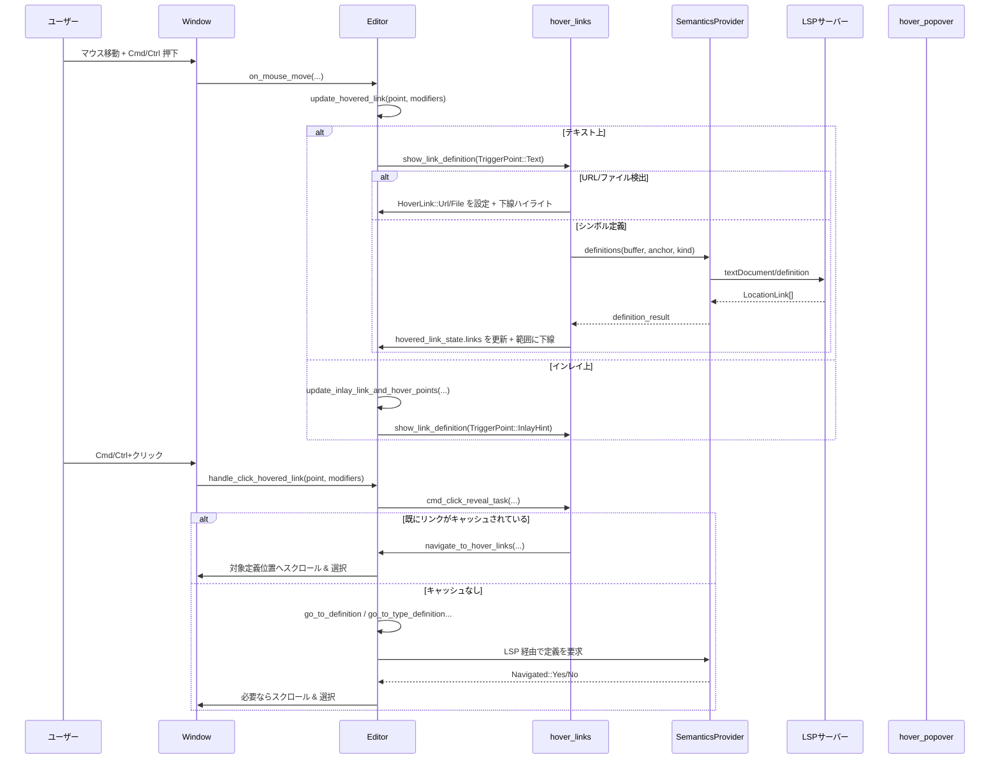

要点:

- まず `hover_links` でリンク候補とハイライトのみを更新し、クリック時には **可能な限りキャッシュされたリンク情報を使って** 定義ジャンプを行います。
- LSP へのリクエストは、ホバー時・クリック時の双方から行われますが、同じシンボル範囲にいる限り再利用されるようになっています。

### 5.2 編集・スクロールに応じたインレイヒント再取得

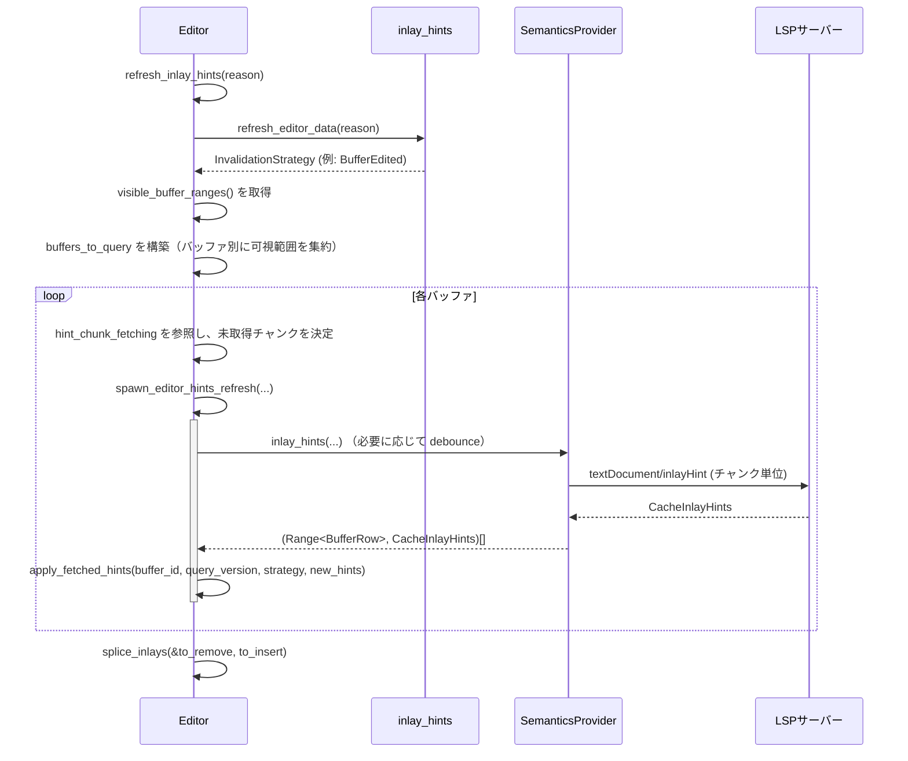

要点:

- インレイヒントは **行チャンク単位** で取得され、`hint_chunk_fetching` により重複取得が防がれています。
- `apply_fetched_hints` 内で
  - 重複テキスト・重複サーバーを考慮してヒントをデデュプリケートし、
  - マルチバッファ上の可視アンカーに変換して `DisplayMap` に挿入しています。
- 編集とスクロールが同時に起こるレースケースに対しても、テストで検証されたロジックが含まれています。

---

## 6. 使い方（How to Use）

ここでは、このチャンクの機能を他コードから利用・拡張する際の基本的な流れと注意点をまとめます。

### 6.1 基本的な使用方法

#### 括弧ハイライト

```rust
use crate::Editor;

fn on_cursor_or_text_change(
    editor: &mut Editor,
    window: &mut Window,
    cx: &mut Context<Editor>,
) {
    let snapshot = editor.snapshot(window, cx);
    editor.refresh_matching_bracket_highlights(&snapshot.display_snapshot, cx);
}
```

- カーソル移動・テキスト編集・バッファ切り替え後に呼び出すと、対応する括弧が自動的にハイライトされます。

#### ホバーリンクとホバーポップオーバー

```rust
fn on_mouse_move(
    editor: &mut Editor,
    point: PointForPosition,
    mouse_px: gpui::Point<Pixels>,
    modifiers: gpui::Modifiers,
    window: &mut Window,
    cx: &mut Context<Editor>,
) {
    let snapshot = editor.snapshot(window, cx);
    let secondary = Editor::is_cmd_or_ctrl_pressed(&modifiers, cx);

    // Cmd/Ctrl+ホバーでリンク下線を更新
    editor.update_hovered_link(point, Some(mouse_px), &snapshot, modifiers, window, cx);

    // マウスだけを動かしている場合の hover ポップオーバー
    // （エディタ内部では必要な箇所で hover_at が呼ばれています）
}
```

- Cmd/Ctrl を押しながら移動すると、定義ジャンプ可能な範囲に下線が付きます。
- 別途、キーボードショートカットから `hover` アクションを発火させれば、型情報などをポップオーバー表示できます。

#### インレイヒントの更新とトグル

```rust
use crate::{ToggleInlayHints, ToggleInlineValues};

fn on_toggle_inlay_hints(
    editor: &mut Editor,
    window: &mut Window,
    cx: &mut Context<Editor>,
) {
    editor.toggle_inlay_hints(&ToggleInlayHints, window, cx);
}

fn on_file_edited(editor: &mut Editor, cx: &mut Context<Editor>, buffer_id: BufferId) {
    editor.refresh_inlay_hints(
        InlayHintRefreshReason::BufferEdited(buffer_id),
        cx,
    );
}
```

- ファイル編集・スクロールなどのタイミングで `refresh_inlay_hints` を呼ぶことで、必要なインレイヒントが自動的に再取得されます。
- UI 側から一時的に非表示にしたい場合は `toggle_inlay_hints` を利用します（キャッシュは保持されます）。

### 6.2 よくある使用パターン

- **Cmd/Ctrl+ホバーでリンク、単独ホバーで情報ポップオーバー**
  - 既存実装は「Cmd/Ctrl+ホバー → 下線リンク」「Hover アクション / 一部のホバー → ポップオーバー表示」という役割分担になっています。
  - どちらの UX にも対応したい場合、マウスイベントハンドラから `update_hovered_link` と `hover_at` を条件付きで呼び分けます。
- **特定言語でのみインレイヒントを有効化**
  - `inlay_hint_settings(location, snapshot, cx)` で位置ごとの設定が取れるので、言語ごとに `enabled` フラグを変えることができます（テストでは Markdown と Rust を別々に扱っています）。
- **LSP からの `workspace/inlayHint/refresh` への対応**
  - LSP 側が refresh を要求してきた場合は、`InlayHintRefreshReason::RefreshRequested` を渡して `refresh_inlay_hints` を呼ぶことで、「キャッシュは残しつつ必要な再問い合わせだけ行う」動きになります。

### 6.3 使用上の注意点（まとめ）

- **非同期タスクと Editor 更新**
  - いずれの関数も `cx.spawn` / `cx.spawn_in` を通じて非同期タスクを生成し、その中で `editor.update(...)` で状態を更新します。
  - Editor 状態を操作するのは必ず `update` / `update_in` などのクロージャ内に限られているため、これを踏襲することが重要です。
- **マルチバッファ / excerpt 環境**
  - `MultiBuffer` を使った excerpt 表示では、インレイやインデントガイドの対象は「可視アンカーに変換できるもの」に限られます。
  - 新たな可視範囲を追加した場合は、`visible_buffer_ranges` を元にした更新パイプライン（インレイヒントなど）を再実行する必要があります。
- **設定変更との整合性**
  - インレイヒントや hover ポップオーバーなどは `EditorSettings` / `LanguageSettings` を参照しています。
  - 設定を変えた際は、テストと同様に `editor.refresh_inlay_hints(InlayHintRefreshReason::SettingsChange(...))` のように明示的な再計算を行うのが安全です。
- **レースコンディションへの配慮**
  - コード内には編集とスクロール、複数 LSP サーバーなどが絡むレースケースを考慮した処理が多数含まれています。
  - 既存の経路（`refresh_inlay_hints` → `spawn_editor_hints_refresh` → `apply_fetched_hints`）を再利用し、自前で `hint_chunk_fetching` や `added_hints` を直接操作しない方が安全です。

---

## 7. 関連ファイル

このチャンクに含まれないが、密接に関係するモジュール・ファイルの例です（パスは `use` 句などから推測できる範囲で記載します）。

| パス / モジュール | 役割 / 関係 |
|-------------------|------------|
| `crate::Editor` | エディタ本体。ここで解説したメソッド群（hover・インレイ・インデントなど）のレシーバです。定義ファイルはこのチャンクには含まれていません。 |
| `editor/src/display_map.rs`（推定） | `DisplaySnapshot` や `DisplayMap` を提供し、画面座標とテキスト座標・インレイオフセットの変換を担います。このチャンク内では型としてのみ参照されています。 |
| `language` クレート | `Buffer`, `BufferSnapshot`, `LanguageConfig`, 括弧ペア設定、診断情報などを提供します。括弧ハイライト・インデントガイド・hover の範囲計算に利用されています。 |
| `project` クレート | `Project`, `FakeFs`, `ResolvedPath`, LSP ストアなどを提供し、ファイル解決や InlayHint キャッシュと連携します。 |
| `lsp` クレート | LSP プロトコル型（`LocationLink`, `InlayHint`, `Hover` など）とフェイクサーバー実装を提供し、ユニットテストで利用されます。 |
| `markdown` クレート | Hover / 診断ポップオーバーで表示する Markdown コンテンツをパース・描画するために用いられます。 |
| `workspace` クレート | `Workspace::for_window` を通じて Markdown 内のファイル URL を開き、新しいエディタタブを作成するなどの操作を行います。 |
| `editor/src/editor_tests`, `test::editor_lsp_test_context` | 各機能の gpui テストを行うためのヘルパーモジュール。Hover/インレイ/インデントなどの振る舞いがここから検証されています。 |

このチャンク内のコードは、上記のモジュールと協調しながら、「エディタ上の補助的な視覚フィードバック」を実現するサブシステムを構成しています。

---

# editor/src ディレクトリ コード解説

## 1. ざっくり一言

- このディレクトリは、エディタ本体 `Editor` の **スクロール・カーソル移動・選択管理・LSP 連携・JSX タグ自動クローズ・セマンティックハイライト・実行タスク（runnables）** など、高度な編集機能を実装するモジュール群です。

---

## 2. このモジュールの役割

### 2.1 概要

- このディレクトリは「テキストを表示・編集する Editor を、実用レベルの IDE として成立させる」ための周辺機能を提供します。
- 具体的には、以下のような問題を解決します。
  - 複数カーソル・ソフトラップ・マルチバッファを考慮したカーソル移動や選択操作
  - スクロール位置の管理と自動スクロール
  - LSP を用いた実行タスクの取得、Rust Analyzer 拡張コマンドの実行
  - JSX タグの自動クローズや HTML/JSX タグ名の「連動編集」
  - セマンティックトークンによるハイライトの取得・表示
  - エディタ状態（スクロール位置・選択・折りたたみ）の DB 永続化

### 2.2 アーキテクチャ内での位置づけ

- `Editor` 型を中心に、各機能がサブモジュールとしてぶら下がる構造になっています。
- それぞれのモジュールは、概ね次のような依存関係を持ちます。

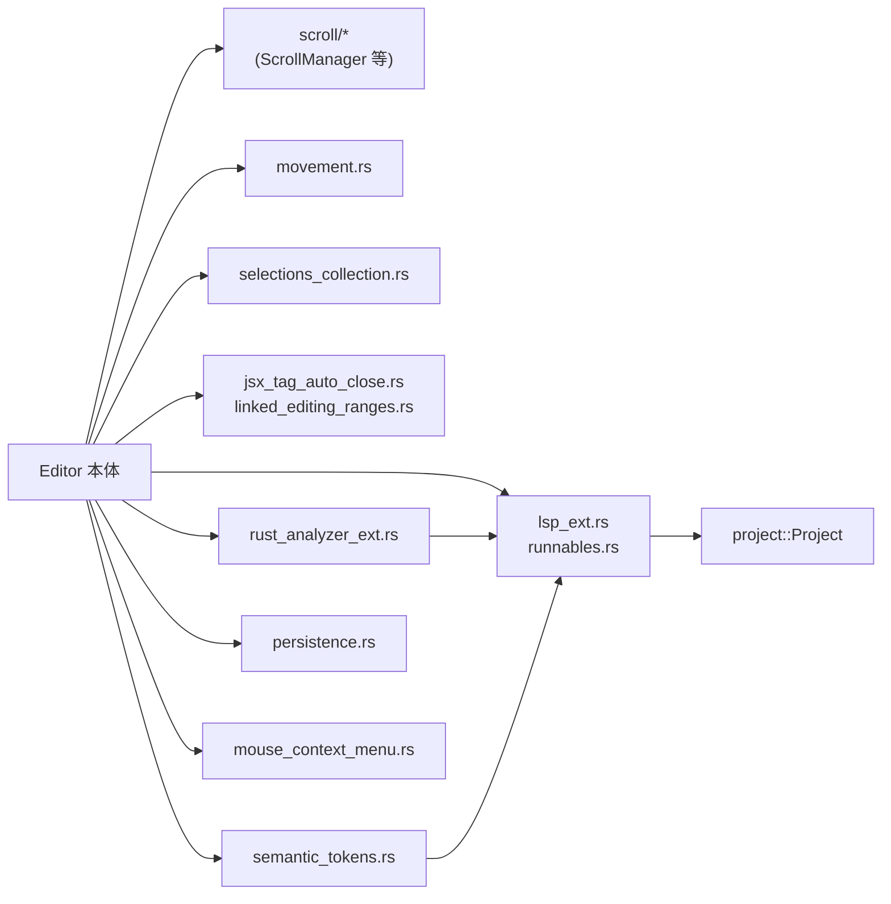

- 位置づけの概要
  - **低レベル座標系**: `movement.rs`, `scroll.rs`, `selections_collection.rs` が Display / MultiBuffer / Anchor 間の座標変換と移動ロジックを実装します。
  - **編集支援機能**: JSX 自動クローズ・リンク編集 (`jsx_tag_auto_close.rs`, `linked_editing_ranges.rs`) が構造的編集を担当します。
  - **LSP / Rust Analyzer 連携**: `lsp_ext.rs`, `runnables.rs`, `rust_analyzer_ext.rs`, `semantic_tokens.rs` が LSP ベースの機能を担当します。
  - **UI と永続化**: `mouse_context_menu.rs` がコンテキストメニュー、`persistence.rs` がエディタ状態の永続化を担当します。

### 2.3 設計上のポイント

- **スナップショット指向**
  - `DisplaySnapshot`, `BufferSnapshot`, `MultiBufferSnapshot` を渡して計算を行い、副作用を限定する設計になっています。
- **Anchor / Offset での位置管理**
  - `Anchor` や `MultiBufferOffset` を用いて、編集に強い座標を扱います。
  - 選択・ハイライト・スクロール位置などは、基本的にアンカーで記録し、必要な時にオフセットや表示座標に解決します。
- **非同期処理の分離**
  - LSP 呼び出しや重い解析は `gpui::Task` とバックグラウンドスレッドに委譲し、UI スレッドではスナップショットを読むだけにします。
- **機能単位の Editor 拡張**
  - 多くのファイルが `impl Editor` の形でメソッドを追加しており、Editor 本体が挙動のエントリポイントになります。
- **DB による永続化**
  - スクロール位置・選択・折りたたみなどは SQLite（`EditorDb`）に保存され、再起動後の復元に使われます。
- **LSP との疎結合**
  - LSP 関連コードは `project::Project` / `lsp_store` 経由で呼び出され、Editor からは抽象化された API (`semantic_tokens`, `linked_edits`, `runnables`) として扱われます。

---

## 3. 主要な機能一覧

- JSX タグ自動クローズ:
  - JSX/TSX などで `<div>` を入力すると自動で `</div>` を補完する機能。
- HTML/JSX タグのリンク編集:
  - 開始タグと終了タグなど、LSP が返す linked editing ranges を同期編集する機能。
- LSP runnables / 実行タスク:
  - Rust やその他言語の「テスト実行」「main 実行」などをコードから推定し、ガターアイコンやメニューから起動できるようにする。
- Rust Analyzer 拡張連携:
  - 親モジュールへのジャンプ、マクロ展開、ドキュメント URL 打開、flycheck の制御など RA 独自拡張の呼び出し。
- セマンティックトークン・ハイライト:
  - LSP の semantic tokens を取得し、通常のシンタックスハイライトに重ねる形で装飾を適用。
- 複雑なカーソル移動・削除:
  - 単語単位・サブワード単位の移動、段落単位移動、括弧や空白を考慮した削除幅の調整など。
- スクロール・オートスクロール:
  - 行/ページ/カラム単位のスクロール、カーソルを中心/上下に揃えるスクロール、複数カーソルに合わせた自動スクロールなど。
- 選択の管理・列選択:
  - 複数・非連続選択の管理、ペンディング選択、列（矩形）選択の構築、選択のマージ・反転など。
- コンテキストメニュー:
  - カーソル位置や選択状態・ファイル種別に応じて、定義ジャンプ・リネーム・フォーマット・Git 操作などを提示。
- エディタ状態の永続化:
  - ファイルパス・テキスト・スクロール位置・選択・折りたたみ・mtime を SQLite に保存/復元。

---

## 4. 関数・構造体の解説

### 4.1 主要な型一覧

| 名前 | 種別 | 定義ファイル | 役割 / 用途 |
|------|------|--------------|-------------|
| `LinkedEditingRanges` | 構造体 | `linked_editing_ranges.rs` | Buffer ごとに「ある範囲とそれにリンクした範囲の集合」を保持するマップ。 |
| `LinkedEdits` | 構造体 | `linked_editing_ranges.rs` | リンク編集対象の範囲と差し込む文字列をバッファ単位で蓄積し、一括適用するための型。 |
| `MenuPosition` | enum | `mouse_context_menu.rs` | コンテキストメニューが画面に固定されるか、エディタ座標に追従するかを表す。 |
| `MouseContextMenu` | 構造体 | `mouse_context_menu.rs` | 実際の UI::ContextMenu と、その表示位置・破棄条件（フォーカス・選択変更など）を管理。 |
| `FindRange` | enum | `movement.rs` | 単語境界探索範囲（単一行 / 複数行）を表す。 |
| `TextLayoutDetails` | 構造体 | `movement.rs` | 行高さやフォントなど、縦方向移動に必要な描画情報をまとめたコンテナ。 |
| `SerializedEditor` | 構造体 | `persistence.rs` | エディタのパス・テキスト・言語・mtime を DB に保存するためのシリアライズ用構造体。 |
| `EditorDb` | 構造体 | `persistence.rs` | SQLite との接続と、エディタ状態関連のクエリ群を提供するドメイン。 |
| `RunnableData` | 構造体 | `runnables.rs` | Buffer ごとの runnables キャッシュと更新タスクを保持する Editor 内部状態。 |
| `RunnableTasks` | 構造体 | `runnables.rs` | 1 行に紐づく実行テンプレート一覧と、その位置・文脈情報（extra_variables など）。 |
| `ResolvedTasks` | 構造体 | `runnables.rs` | 実際に実行可能な `ResolvedTask` とそのカーソル位置のペア。 |
| `Autoscroll` | enum | `scroll/autoscroll.rs` | Fit / Newest / Center などの自動スクロール戦略と、対象 Anchor を表す。 |
| `AutoscrollStrategy` | enum | `scroll/autoscroll.rs` | `Autoscroll::Strategy` 内部の具体的なスクロール方針。 |
| `ScrollAmount` | enum | `scroll/scroll_amount.rs` | 行/ページ/カラム単位のスクロール量を表す。 |
| `ScrollDirection` | enum | `scroll/scroll_amount.rs` | スクロール方向（上下左右）を表す。 |
| `ScrollAnchor` | 構造体 | `scroll.rs` | スクロール位置を「基準 Anchor + オフセット」で表現する。 |
| `SharedScrollAnchor` | 構造体 | `scroll.rs` | Split diff などで複数 Editor 間で共有される ScrollAnchor。 |
| `OngoingScroll` | 構造体 | `scroll.rs` | ホイール操作中の「縦/横どちらにロックするか」を判定するための状態。 |
| `ScrollManager` | 構造体 | `scroll.rs` | スクロール位置・スクロールバー状態・オートスクロール要求など、スクロール関連の全状態を管理。 |
| `ScrollbarThumbState` | enum | `scroll.rs` | スクロールバーのつまみ状態（Idle / Hovered / Dragging）。 |
| `ActiveScrollbarState` | 構造体 | `scroll.rs` | 現在アクティブなスクロールバー軸とその状態。 |
| `SelectionsCollection` | 構造体 | `selections_collection.rs` | 複数選択（disjoint + pending）を Anchor ベースで管理し、各種操作を提供。 |
| `PendingSelection` | 構造体 | `selections_collection.rs` | ドラッグ中など、確定前の一時的な選択。 |
| `MutableSelectionsCollection` | 構造体 | `selections_collection.rs` | `SelectionsCollection::change_with` の中で使う編集用ラッパー。 |
| `SemanticTokenState` | 構造体 | `semantic_tokens.rs` | セマンティックトークンの有効/無効状態、取得済みバージョン、更新タスクを保持。 |

### 4.2 代表的な関数詳細（抜粋）

#### `generate_auto_close_edits(buffer: &BufferSnapshot, ranges: &[Range<Anchor>], config: &JsxTagAutoCloseConfig, state: Vec<JsxTagCompletionState>) -> Result<Vec<(Range<Anchor>, String)>>`

**概要**

- 直前のキー入力（例: `>`）によって新しく入力された JSX オープンタグに対し、**まだクローズされていないタグ** だけを検出し、対応する `</tag>` 挿入用の編集リストを生成します。

**引数**

| 引数名 | 型 | 説明 |
|--------|----|------|
| `buffer` | `BufferSnapshot` | 現在のテキストと構文木のスナップショット。 |
| `ranges` | `&[Range<Anchor>]` | ユーザが行った編集（Anchor 範囲）の配列。 |
| `config` | `&JsxTagAutoCloseConfig` | JSX タグノード名など、言語依存の設定。 |
| `state` | `Vec<JsxTagCompletionState>` | 直前に `should_auto_close` で抽出された「自動クローズ候補タグ」の情報。 |

**戻り値**

- `Ok(Vec<(Range<Anchor>, String)>)`
  - 各要素は「挿入する位置（空範囲の Anchor Range）」と「挿入する文字列 `"</tag>"`」のペアです。
- `Err` は内部で `anyhow::Error` としてのみ使われ、呼び出し元でまとめて処理されます。

**内部処理の流れ**

1. `state` の各要素について、対応する `edited_range` と構文レイヤー（tree-sitter）を取得。
2. オープンタグノード (`config.open_tag_node_name`) を byte 範囲から再取得。
3. タグ名ノードを取り出し、`tag_name` 文字列を抽出。
4. 「すでに閉じられているか」の判定:
   - tree-sitter の祖先ノードをたどり、探索ルート `tree_root_node` を決定。
   - その部分木を走査し、`tag_name` に一致するオープンタグ・クローズタグの出現数をカウント。
   - `unclosed_open_tag_count <= 0`（= すでに閉じられている）ならスキップ。
5. クローズタグを挿入する位置として、`edited_range.end` の直後の Anchor を取得し、そこに `</tag_name>` を入れる編集を生成。
6. すべての候補について集計し、返却。

**Examples（使用例）**

```rust
// JSX タグ自動クローズ処理のバックグラウンドタスク内からの利用例
fn compute_auto_close_edits(
    buffer_snapshot: &language::BufferSnapshot, // バッファのスナップショット
    edited_ranges: &[Range<text::Anchor>],      // 直近の編集範囲
    config: &language::JsxTagAutoCloseConfig,   // JSX 用設定
    state: Vec<JsxTagCompletionState>,          // should_auto_close の結果
) -> anyhow::Result<Vec<(Range<text::Anchor>, String)>> {
    // generate_auto_close_edits を呼び出して編集リストを作る
    generate_auto_close_edits(buffer_snapshot, edited_ranges, config, state)
}
```

**Errors / Panics**

- 戻り値は `Result` ですが、内部処理ではほとんど `Ok(...)` を返しており、`anyhow::Error` は上位でまとめて処理されます。
- `assert!(open_tag.kind() == config.open_tag_node_name);` などの `assert!` によって、構文木と設定が一致しない場合に panic する可能性があります。

**Edge cases（エッジケース）**

- タグ名ノードが見つからない場合: `tag_name` は空文字列になり、`</>` のようなクローズタグが挿入されます（フラグメントに対応）。
- tree-sitter のエラー修正により、オープンタグやクローズタグが期待通りの親子関係になっていない場合:
  - コメント中の説明の通り、祖先ノードを歩いて「適切な探索ルート」を選んでいます。
- `config.erroneous_close_tag_node_name` が設定されている場合:
  - 間違ったクローズタグもクローズ数にカウントし、二重クローズを避けます。

**使用上の注意点**

- `state` は `should_auto_close` の結果をそのまま渡す前提で作られており、別の用途で再利用する場合は対応が必要です。
- 構文レイヤーや `config` が対象言語と一致していないと `assert!` が発火する可能性があります。

---

#### `impl LinkedEdits::apply(self, cx: &mut Context<Editor>)`

**概要**

- LSP から取得した「リンク編集範囲」（例: `<div>` と `</div>` のタグ名）に対して、蓄積しておいた文字列置換を一括で適用します。

**引数**

| 引数名 | 型 | 説明 |
|--------|----|------|
| `self` | `LinkedEdits` | バッファごとの `(Range<Anchor>, Arc<str>)` の一覧を保持したオブジェクト。 |
| `cx` | `&mut Context<Editor>` | Editor の UI コンテキスト。 |

**戻り値**

- なし（副作用として各バッファに `buffer.edit` を適用）。

**内部処理の流れ**

1. `self.0` の HashMap をイテレートし、バッファごとに処理。
2. 各バッファについて:
   - スナップショットを取得。
   - Anchor 範囲を `to_point(&snapshot)` で表示座標に変換。
   - 範囲が空の場合でも、そのまま `(start..end, text)` として並べる。
   - 行頭から順に並ぶよう `sorted_by_key` で開始位置でソート。
3. `buffer.edit(edits, None, cx)` を呼び出し、まとめて適用。

`apply_with_left_expansion` は `expand_empty_ranges_left = true` で `apply_inner` を呼ぶだけで、空範囲を 1 文字左に広げてから削除する用途（Backspace 用）です。

**Examples（使用例）**

```rust
// ある入力イベントで、現在のカーソル位置に対するリンク編集を反映する例
fn apply_linked_edits_for_input(editor: &mut Editor, inserted: &str, cx: &mut Context<Editor>) {
    use std::sync::Arc;
    let mut linked_edits = LinkedEdits::new();

    // 現在のカーソル（Anchor Range）に対して、同じテキストをリンク範囲にも適用
    let anchor_range = {
        let snapshot = editor.display_snapshot(cx);
        editor
            .selections
            .newest_anchor()
            .range()
            .map(|a| a) // Anchor Range をそのまま使う
    };

    linked_edits.push(
        editor,
        anchor_range,
        Arc::from(inserted.to_string().as_str()),
        cx.as_app(), // &gpui::App
    );

    // 収集した編集を適用
    linked_edits.apply(cx);
}
```

**Edge cases**

- Anchor がすでに無効になっているなどで `to_point` に失敗するケースは、上位で `linked_editing_ranges_for` を構築する際にフィルタされます。
- 同一バッファ内で範囲が重なる場合でも、LSP 側の仕様上「非重複・ソート済み」である前提を置いています。

**使用上の注意点**

- `LinkedEdits::push` は Editor 側の `linked_editing_ranges_for` を利用するため、事前に `refresh_linked_ranges` によって LSP の linked editing range を更新しておく必要があります。
- Backspace のような「1 文字左の削除」をリンク範囲にも適用したい場合は、`apply_with_left_expansion` を利用します。

---

#### `impl Editor::refresh_runnables(&mut self, invalidate_buffer_data: Option<BufferId>, window: &mut Window, cx: &mut Context<Self>)`

**概要**

- エディタ内の **Run/Debug 用ガターアイコンやメニューに表示する「実行タスク（runnables）」** を更新します。
- Tree-sitter による静的解析と LSP からの runnables を統合し、必要な範囲だけ再計算します。

**引数**

| 引数名 | 型 | 説明 |
|--------|----|------|
| `invalidate_buffer_data` | `Option<BufferId>` | 特定バッファのキャッシュを無効化したい場合の ID。`None` ならキャッシュを保ったまま更新。 |
| `window` | `&mut Window` | UI ウィンドウ。非同期タスクの起動に利用。 |
| `cx` | `&mut Context<Self>` | Editor コンテキスト。 |

**戻り値**

- なし（`self.runnables` 内部状態を更新し、副作用としてガターやメニューの表示が変わります）。

**内部処理の流れ（簡略）**

1. Editor モード・設定を確認し、runnables を表示すべきか判定。
2. シングルバッファかマルチバッファかに応じて、対象範囲（画面全体 or 可視範囲）を決定。
3. `lsp_task_sources` で LSP runnables を問い合わせるべきバッファ群とサーバーを決定。
4. `cx.spawn_in` で非同期タスクを起動:
   - `UPDATE_DEBOUNCE` 待機（一定時間のデバウンス）。
   - コラボレーションセッション（via_collab）の場合は runnables を抑制。
   - LSP runnables を取得 (`crate::lsp_tasks`)。
   - `MultiBufferSnapshot::runnable_ranges` で Tree-sitter 由来の runnable 候補（関数やテスト）を抽出。
   - LSP / Tree-sitter の結果を統合して `RunnableTasks` にまとめる。
5. メインスレッドに戻り、無効化対象バッファのキャッシュをクリアしつつ、各行ごとの `RunnableTasks` を `RunnableData` に挿入。

**Examples（使用例）**

```rust
// エディタがテキスト変更を検知したタイミングで runnables を更新する例
fn on_buffer_changed(editor: &mut Editor, window: &mut Window, cx: &mut Context<Editor>) {
    // 変更された buffer_id を指定して、そのバッファの runnables キャッシュだけ無効化
    let changed_buffer_id = editor
        .buffer()
        .read(cx)
        .as_singleton()
        .map(|buf| buf.read(cx).remote_id());

    editor.refresh_runnables(changed_buffer_id, window, cx);
}
```

**Edge cases**

- コラボレーションモード（`project.is_via_collab()`）では runnables 自体を表示しないため、この関数は早期 return します。
- バッファがマルチバッファの場合、現在の可視範囲のみを対象に Tree-sitter 解析を行い、パフォーマンスを確保します。

**使用上の注意点**

- `refresh_runnables` 自身が非同期タスクを起動するため、直後に `runnables` キャッシュを参照すると、まだ結果が入っていない可能性があります（テストでは `UPDATE_DEBOUNCE` 経過後に `run_until_parked` してから検証しています）。
- LSP 設定 (`ProjectSettings::lsp`) によって runnables が無効化されているサーバーは自動的にスキップされます。

---

#### `impl Editor::scroll_screen(&mut self, amount: &ScrollAmount, window: &mut Window, cx: &mut Context<Self>)`

**概要**

- 「1 行スクロール」「1 ページスクロール」「横方向スクロール」など、ユーザ入力に応じた **画面単位のスクロール** を行います。

**引数**

| 引数名 | 型 | 説明 |
|--------|----|------|
| `amount` | `&ScrollAmount` | 行/ページ/カラム単位のスクロール量。 |
| `window` | `&mut Window` | UI ウィンドウ。 |
| `cx` | `&mut Context<Self>` | Editor コンテキスト。 |

**戻り値**

- なし（`ScrollManager` を介してスクロール位置を更新）。

**内部処理の流れ**

1. シングルラインモードなら `cx.propagate()` して親に処理を委譲。
2. リネーム中 (`take_rename`) や他要因でスクロールすべきでない場合は早期 return。
3. 現在のスクロール位置と、可視行数・カラム数 (`visible_line_count`, `visible_column_count`) を取得。
4. 設定により、Preferred Line Length を横幅の上限として用いる場合がある。
5. `ScrollAmount::columns` / `ScrollAmount::lines` を用いて Δx, Δy を計算し、`set_scroll_position` で適用。

**Examples（使用例）**

```rust
use crate::scroll::ScrollAmount;
use gpui::Window;

// PageDown 相当の操作を行う例
fn page_down(editor: &mut Editor, window: &mut Window, cx: &mut Context<Editor>) {
    // 1 ページ分下にスクロール
    let amount = ScrollAmount::Page(1.0);
    editor.scroll_screen(&amount, window, cx);
}
```

**Edge cases**

- `visible_line_count` や `visible_column_count` が未設定（画面レイアウト未確定）の場合は何もしません。
- 横方向スクロールで、現在 x==0 かつ右方向スクロールする場合、ガター分のマージンを補うため、最初のスクロール量にマージンを加算しています。

**使用上の注意点**

- 連続スクロールの際は、通常は UI イベント（ホイール / ジェスチャー）から直接この関数が呼ばれるため、`OngoingScroll` との整合性に注意する必要があります（垂直/水平ロックは `apply_scroll_delta` 側で処理）。

---

#### `impl SelectionsCollection::change_with(&mut self, snapshot: &DisplaySnapshot, change: impl FnOnce(&mut MutableSelectionsCollection<'_, '_>) -> R) -> (bool, R)`

**概要**

- 選択集合 (`SelectionsCollection`) を **安全に変更するための唯一の入口** です。
- 内部不変条件（ソート順・非重複・ Anchor 有効性）を保ちながら、選択編集をカプセル化します。

**引数**

| 引数名 | 型 | 説明 |
|--------|----|------|
| `snapshot` | `&DisplaySnapshot` | 選択解決に使うスナップショット。 |
| `change` | クロージャ | `MutableSelectionsCollection` を介して選択を変更する処理。 |

**戻り値**

- `(bool, R)`
  - 第 1 要素: 選択が変化したかどうか。
  - 第 2 要素: `change` クロージャの戻り値。

**内部処理の流れ**

1. `MutableSelectionsCollection` を構築し、`snapshot` と `self` をラップ。
2. `change` クロージャを呼び出して、`disjoint`/`pending` を変更させる。
3. デバッグビルドでは:
   - 全ての selection について `start <= end` であること。
   - Anchor が `snapshot` によって解決可能であること。
   - `disjoint` がソート済み && 非重複であること。
   を検証。
4. `selections_changed` フラグと戻り値を返す。

**Examples（使用例）**

```rust
use crate::movement;
use language::SelectionGoal;

// 単語末尾までカーソルを進めるエディタアクションの例
fn move_cursors_to_next_word_end(editor: &mut Editor, cx: &mut Context<Editor>) {
    let display_snapshot = editor.display_snapshot(cx);

    editor
        .selections
        .change_with(&display_snapshot, |selections| {
            selections.move_cursors_with(&mut |map, point, goal| {
                // movement::next_word_end を使って新しい位置を計算
                let new_point = movement::next_word_end(map, point);
                (new_point, goal) // SelectionGoal はそのまま維持
            });
        });
}
```

**Edge cases**

- `change` 内で `clear_disjoint` などにより全ての selection を消してしまうと、最後に `assert!(... "There must be at least one selection")` で panic します。
- アンカーが無効（該当バッファがなくなったなど）の場合、デバッグビルドで panic しますが、通常はバッファ削除時に `remove_selections_from_buffer` が呼ばれる設計になっています。

**使用上の注意点**

- `SelectionsCollection` を直接書き換えるのではなく、必ず `change_with` を通じて変更するのが前提の設計です。
- `snapshot` には **最新状態の DisplaySnapshot** を渡す必要があります。古いスナップショットを渡すと、Anchor 解決で不整合が起こる可能性があります。

---

#### `pub fn next_word_end(map: &DisplaySnapshot, point: DisplayPoint) -> DisplayPoint`

**概要**

- VSCode 風の仕様に基づき、「次の単語末尾」までカーソルを進めるための位置を計算します。
- 言語ごとの `CharClassifier` を用いて、単語境界・記号・空白を区別します。

**引数**

| 引数名 | 型 | 説明 |
|--------|----|------|
| `map` | `&DisplaySnapshot` | 表示スナップショット。 |
| `point` | `DisplayPoint` | 現在のカーソル位置。 |

**戻り値**

- `DisplayPoint`: 次の単語末尾に相当する表示位置。

**内部処理の流れ**

1. `point` からバッファ座標に変換し、その位置の `CharClassifier` を取得。
2. `find_boundary` を呼び出し、`FindRange::MultiLine` で前方の境界を探索。
3. 最初のステップでは「記号列を飛ばす」ロジックが入り、例えば `"|.hello"` のようなケースで `.` の直後まで進むように調整。
4. 単語種別が変わったタイミング、かつ左側が空白でないとき、あるいは `'\n'` を跨ぐときに境界とみなす。

**Examples（使用例）**

```rust
use crate::movement;

// Editor 内で 1 つのカーソルだけを next_word_end に移動する例
fn move_one_cursor(editor: &mut Editor, cx: &mut Context<Editor>) {
    let snapshot = editor.display_snapshot(cx);
    editor
        .selections
        .change_with(&snapshot, |selections| {
            selections.move_cursors_with(&mut |map, point, goal| {
                let new_point = movement::next_word_end(map, point);
                (new_point, goal)
            });
        });
}
```

**Edge cases**

- 行末・ファイル末尾にいる場合は、そのまま末尾近くの位置が返されます。
- 改行をまたぐ場合 (`right == '\n'`) も境界として扱われます。

**使用上の注意点**

- 単語判定は `CharClassifier` に依存するため、CSS など特定言語では `-` を単語の一部とみなすなど、言語固有の挙動になります。

---

#### `impl Editor::refresh_semantic_tokens(&mut self, buffer_id: Option<BufferId>, for_server: Option<RefreshForServer>, cx: &mut Context<Self>)`

**概要**

- LSP の semantic tokens を使って、**セマンティックハイライト用データを更新**します。
- 可視バッファのみ、かつバージョンが変わったものだけを対象に LSP に問い合わせます。

**引数**

| 引数名 | 型 | 説明 |
|--------|----|------|
| `buffer_id` | `Option<BufferId>` | 特定バッファだけ更新したい場合の ID。`None` で可視バッファ全体。 |
| `for_server` | `Option<RefreshForServer>` | 特定サーバーの再接続などで「そのサーバー由来のトークンだけ無効化して再取得したい」場合に使用。 |
| `cx` | `&mut Context<Self>` | Editor コンテキスト。 |

**戻り値**

- なし（`display_map.semantic_token_highlights` を更新し、再描画をトリガする）。

**内部処理の流れ（要約）**

1. LSP データや semantic tokens が無効なら、すべてのハイライトをクリアして終了。
2. `for_server` が指定されている場合、そのサーバーで取得したトークンを全バッファで無効化。
3. 対象バッファ集合を決定:
   - 可視バッファ + `buffer_id` で指定されたもの。
   - 言語設定で semantic tokens が有効なものだけ残す。
4. すでに同じバージョンでトークンを取得済みのバッファはスキップ。
5. `cx.spawn` で非同期タスクを起動:
   - 50ms デバウンス後、`SemanticsProvider::semantic_tokens` を各バッファに対して呼び出す。
   - 結果の `BufferSemanticTokens` を集約。
6. メインスレッドに戻り:
   - 取得済みバージョン (`fetched_for_buffers`) を更新。
   - 各バッファごとに `buffer_into_editor_highlights` で `SemanticTokenHighlight` に変換し、`display_map.semantic_token_highlights` を更新。

**Examples（使用例）**

```rust
// 設定トグルアクションからの利用例（実際のコードに近い）
fn toggle_semantic_highlighting(editor: &mut Editor, window: &mut gpui::Window, cx: &mut Context<Editor>) {
    // Enabled フラグを反転し、全バッファのトークンを無効化したうえで再取得
    editor.semantic_token_state.toggle_enabled();
    editor.invalidate_semantic_tokens(None);
    editor.refresh_semantic_tokens(None, None, cx);
    // window はこの関数では直接使っていませんが、他のアクションと同形です。
}
```

**Edge cases**

- あるバッファの LSP が semantic tokens を返さなくなった場合（`tokens: None`）、そのバッファの semantic ハイライトはクリアされます。
- マルチバッファ（excerpts）の場合でも、`MultiBufferSnapshot::text_anchors_to_visible_anchors` を使って MultiBuffer 上の範囲に変換したうえでハイライトしています。

**使用上の注意点**

- semantic tokens が無効な状態で呼び出すと、ハイライトはクリアされるだけなので、「設定変更時には必ず enabled フラグと合わせて更新する」という形で呼ぶのが前提です。
- LSP 側のレスポンスエラーはログに記録されるだけで、ユーザには出ません。UI 上の失敗通知が必要な場合は上位で補う必要があります。

---

#### `impl EditorDb::save_editor_selections(&self, editor_id: ItemId, workspace_id: WorkspaceId, selections: Vec<(usize, usize)>) -> Result<()>`

**概要**

- エディタの選択範囲（start/end オフセット）を **`editor_selections` テーブルに保存**します。
- SQLite のプレースホルダ数制限を考慮し、多数の選択をチャンク分割して INSERT します。

**引数**

| 引数名 | 型 | 説明 |
|--------|----|------|
| `editor_id` | `ItemId` | エディタアイテム ID。 |
| `workspace_id` | `WorkspaceId` | ワークスペース ID。 |
| `selections` | `Vec<(usize, usize)>` | 各選択の開始・終了オフセット（バッファ内）を表すペア。 |

**戻り値**

- `Result<()>`: 成功時は `Ok(())`。DB エラー時は `Err(anyhow::Error)`。

**内部処理の流れ**

1. デバッグログを出力。
2. `MAX_QUERY_PLACEHOLDERS`（約 32000）に基づき、1 回の INSERT で扱える選択数を計算（4 プレースホルダ/選択）。
3. `selections` をチャンクごとに切り、各チャンクについて:
   - 対象エディタの既存選択を `DELETE FROM editor_selections` で削除。
   - `INSERT OR IGNORE INTO editor_selections (...) VALUES (?,?,?,?), ...` 形式のクエリ文字列を組み立て。
   - `Statement::prepare` でバインド・実行。
4. すべてのチャンクについて INSERT が成功したら `Ok(())` を返す。

**Examples（使用例）**

```rust
use std::sync::Arc;
use workspace::{WorkspaceDb, ItemId, WorkspaceId};

// エディタ状態保存処理の中からの利用例（簡約）
async fn persist_selections(
    editor_db: &EditorDb,
    item_id: ItemId,
    workspace_id: WorkspaceId,
    selection_ranges: Vec<(usize, usize)>,
) -> anyhow::Result<()> {
    editor_db
        .save_editor_selections(item_id, workspace_id, selection_ranges)
        .await?;
    Ok(())
}
```

**Edge cases**

- `selections` が空でも、1 回目のチャンク処理で `DELETE` のみ行われ、結果としてそのエディタの選択は 0 件になります。
- 非常に多い選択数（数千〜）でも、クエリ分割により SQLite のプレースホルダ制限を超えないようになっています。

**使用上の注意点**

- オフセットは **バッファの現在の内容に対応**している必要があります。内容とオフセットの整合性は呼び出し側で担保する設計です。
- `save_scroll_position` と同様、保存は非同期で行われるため、終了を待つかどうかは上位のライフサイクルに依存します。

---

### 4.3 その他の関数（概要）

| モジュール | 関数名 / グループ | 役割（1 行） |
|-----------|-------------------|--------------|
| `jsx_tag_auto_close.rs` | `refresh_enabled_in_any_buffer`, `handle_from` | JSX 自動クローズ機能の有効バッファ検出と、編集イベントから自動クローズ処理を起動するエントリポイント。 |
| `linked_editing_ranges.rs` | `refresh_linked_ranges` | LSP の linked editing ranges を取得して `Editor::linked_edit_ranges` に反映。 |
| `lsp_ext.rs` | `find_specific_language_server_in_selection`, `lsp_tasks` | カーソル位置に対応する特定言語サーバーの選択、および LSP runnables の収集。 |
| `mouse_context_menu.rs` | `deploy_context_menu` | 右クリック位置にコンテキストメニューを展開し、Editor とフォーカスの関係を維持。 |
| `movement.rs` | `left/right/up/down`, `previous_word_start`, `previous_subword_start`, `start_of_paragraph` など | 文字・単語・サブワード・段落単位のカーソル移動を提供。 |
| `scroll/autoscroll.rs` | `autoscroll_vertically`, `autoscroll_horizontally` | 選択位置やハイライトに合わせて自動スクロールするロジック。 |
| `scroll.rs` | `ScrollManager::set_scroll_position`, `Editor::apply_scroll_delta`, `Editor::read_scroll_position_from_db` | スクロール位置の計算・保存と、スクロールバー・ミニマップの状態管理。 |
| `selections_collection.rs` | `build_columnar_selection`, `find_next_columnar_selection_*` | 列選択の構築と、ソフトラップ/バッファ行ベースでの次の選択探索。 |
| `rust_analyzer_ext.rs` | `go_to_parent_module`, `expand_macro_recursively`, `open_docs` | Rust Analyzer 拡張コマンドのラッパー。 |
| `semantic_tokens.rs` | `buffer_into_editor_highlights`, `convert_token` | LSP からの semantic token を Editor 用の `HighlightStyle` に変換する処理。 |

---

## 5. データフロー

ここでは、**セマンティックトークン更新**のフローを例に、Editor 内外のやり取りを示します。

### セマンティックハイライト更新の流れ

1. ユーザがテキスト編集や設定変更（SemanticHighlight トグル）を行う。
2. Editor が `refresh_semantic_tokens(None, None, cx)` を呼び出す。
3. 対象バッファ集合と、再取得が必要なバッファ（バージョン差分）を絞り込む。
4. `SemanticsProvider::semantic_tokens` を通じて LSP にリクエストを送る。
5. LSP サーバーから返ってきた semantic tokens を `buffer_into_editor_highlights` で MultiBuffer 上の範囲とスタイルに変換。
6. `display_map.semantic_token_highlights` を更新し、再描画をトリガする。

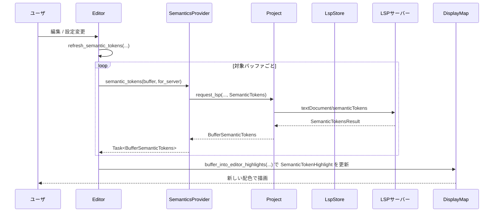

- MultiBuffer を使う場合でも、`text_anchors_to_visible_anchors` により「LSP の Buffer 内座標 → Editor の MultiBuffer 座標」に変換してからハイライトを適用しています。
- `SemanticTokenState::fetched_for_buffers` により、同一バージョンでの再取得を避けるキャッシュが効いています。

---

## 6. 使い方（How to Use）

### 6.1 基本的な使用方法

このディレクトリの多くの機能は `Editor` のメソッドとして公開されています。新しいエディタアクションを追加する場合、以下のようなパターンになります。

#### 例: 単語末尾までカーソルを移動するコマンドの追加

```rust
use gpui::{Context, Window};
use crate::{
    Editor,
    movement,
    Autoscroll, // scroll::autoscroll から再公開されている
};

impl Editor {
    // 単語末尾までカーソルを移動するカスタムアクション
    pub fn move_to_next_word_end_action(
        &mut self,
        window: &mut Window,             // 今回は使わないが、他アクションと揃えたシグネチャ
        cx: &mut Context<Editor>,        // Editor コンテキスト
    ) {
        // 現在の表示スナップショットを取得
        let display_snapshot = self.display_snapshot(cx);

        // SelectionsCollection を安全に変更
        self.selections.change_with(&display_snapshot, |selections| {
            selections.move_cursors_with(&mut |map, point, goal| {
                // movement::next_word_end で次の単語末尾を計算
                let new_point = movement::next_word_end(map, point);
                (new_point, goal) // SelectionGoal はそのまま維持
            });
        });

        // 新しいカーソル位置が画面外なら自動スクロール
        self.request_autoscroll(Autoscroll::Newest, cx);
    }
}
```

- ここでは `SelectionsCollection::change_with` と `movement::next_word_end` を組み合わせています。
- その後 `request_autoscroll` により、必要ならスクロールを行います。

#### 例: 近傍の runnable を実行する

```rust
use gpui::{Context, Window};
use crate::{Editor, SpawnNearestTask};

fn run_nearest_task(editor: &mut Editor, window: &mut Window, cx: &mut Context<Editor>) {
    // 近傍の runnable を 1 件探し、実行キューに追加
    let action = SpawnNearestTask {
        reveal: task::RevealStrategy::InPlace, // どこで結果を表示するか（例）
    };

    editor.spawn_nearest_task(&action, window, cx);
}
```

### 6.2 よくある使用パターン

- **スクロール関連**
  - マウスホイール: `apply_scroll_delta` を呼び出し、スクロール方向ロック (`OngoingScroll`) を尊重しながらスクロール。
  - PageUp/PageDown: `scroll_screen(&ScrollAmount::Page(±1.0), ...)` を使用。
  - カーソルを上下中央に持ってくる: `scroll_cursor_center_top_bottom` が内部で `scroll_cursor_center` / `scroll_cursor_top` / `scroll_cursor_bottom` を順番に呼び分けます。

- **選択の編集**
  - 何かしらのカーソル移動 / 選択拡張を行う場合、**必ず** `SelectionsCollection::change_with` を通して編集する。
  - 列選択を構築する場合は、`build_columnar_selection` / `find_next_columnar_selection_*` を用いる。

- **LSP 関連**
  - Rust 専用機能（親モジュールジャンプ・マクロ展開・ドキュメント表示など）は `rust_analyzer_ext.rs` の各アクションが `find_specific_language_server_in_selection` を用いて RA を選択します。
  - 一般的な LSP の runnables は `lsp_ext::lsp_tasks` → `runnables.rs` → `Editor::refresh_runnables` という流れで統合されます。

### 6.3 よくある間違い

```rust
// 間違い例: SelectionsCollection を直接書き換えてしまう
fn bad_move(editor: &mut Editor, cx: &mut Context<Editor>) {
    let snapshot = editor.display_snapshot(cx);
    // disjoint を直接書き換えると、ソート順やアンカーの有効性が崩れる可能性がある
    editor.selections.disjoint = Arc::new([]);
}

// 正しい例: change_with 経由で変更する
fn good_move(editor: &mut Editor, cx: &mut Context<Editor>) {
    let snapshot = editor.display_snapshot(cx);
    editor.selections.change_with(&snapshot, |selections| {
        // MutableSelectionsCollection の API を通じて編集する
        selections.clear_disjoint();
        // 少なくとも 1 つ選択を残す必要があることに注意
        selections.insert_range(snapshot.buffer_snapshot().len()..snapshot.buffer_snapshot().len());
    });
}
```

その他の典型的な誤用:

- `ScrollManager` を直接操作する（`offset` 等）:
  - → `Editor::set_scroll_position` / `set_scroll_anchor` を通すべきです。そうしないとスクロール位置の永続化やイベント通知が行われません。
- semantic tokens を無効にしているのに `refresh_semantic_tokens` だけ呼び出す:
  - → 有効でない場合、ハイライトは即時クリアされるため、設定トグルとセットで扱う必要があります。
- JSX 自動クローズを自前で再実装し、構文スナップショットとずれた情報を使う:
  - → 既存の `should_auto_close` / `generate_auto_close_edits` / `handle_from` の流れを使うことで、tree-sitter の誤補正を考慮した安全な判定が行われます。

### 6.4 使用上の注意点（まとめ）

- **スナップショットとアンカー**
  - `DisplaySnapshot` や `BufferSnapshot` と `Anchor` / `MultiBufferOffset` の組み合わせは「同じスナップショット」前提で設計されています。別のスナップショットと混在させないよう注意が必要です。
- **非同期タスク**
  - JSX auto close・runnables・semantic tokens・Rust Analyzer 拡張など、多くの機能は非同期タスクを使っています。
  - タスク完了前にバッファが編集されると、`has_edits_since` チェックで処理自体がキャンセルされる場合があります。
- **永続化**
  - スクロール位置・選択・折りたたみは DB に保存されますが、保存タイミングはデバウンスあり（例: 10ms 後）です。即時反映を前提にした外部コードを書くと齟齬が出る可能性があります。
- **マルチバッファ**
  - MultiBuffer では `Anchor` → `buffer_anchor` 変換、`excerpt` の拡張等が行われるため、「表示上のオフセット」と「元ファイルのオフセット」が異なります。`MultiBufferSnapshot` の API を通じて変換することが前提です。

---

## 7. 関連ファイル

このディレクトリ内で、とくに本チャンクのコードと密接に関係するファイルを挙げます。

| パス | 役割 / 関係 |
|------|------------|
| `editor\src\jsx_tag_auto_close.rs` | JSX タグ自動クローズの判定・編集適用ロジックを提供し、`handle_from` 経由で Editor の入力処理と統合されます。 |
| `editor\src\linked_editing_ranges.rs` | LSP の linked editing ranges を Editor に取り込み、`LinkedEdits` を通じてタグ名などの同期編集を行います。 |
| `editor\src\runnables.rs` | `RunnableData` / `RunnableTasks` と Editor のメソッド群を通じて、ガターの Run ボタンやタスクモーダルを支える実行タスク機構を提供します。 |
| `editor\src\scroll.rs` および `editor\src\scroll\*.rs` | スクロール位置の計算・保存・オートスクロール・スクロールバー UI など、スクロール周りの中核を担います。 |
| `editor\src\selections_collection.rs` | カーソル・選択の管理ロジックをまとめたモジュールで、movement や scroll、各種編集アクションから広く利用されます。 |
| `editor\src\semantic_tokens.rs` | LSP semantic tokens の取得・キャッシュ・スタイル変換と、`DisplayMap` への反映を行います。 |

※ `Editor` 本体や `DisplayMap` など、ここから参照される他のファイルも存在しますが、このチャンクには定義が含まれていないため詳細は不明です。
