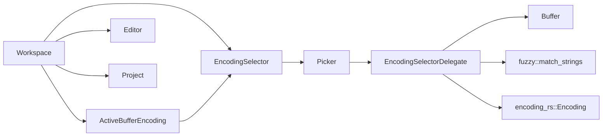
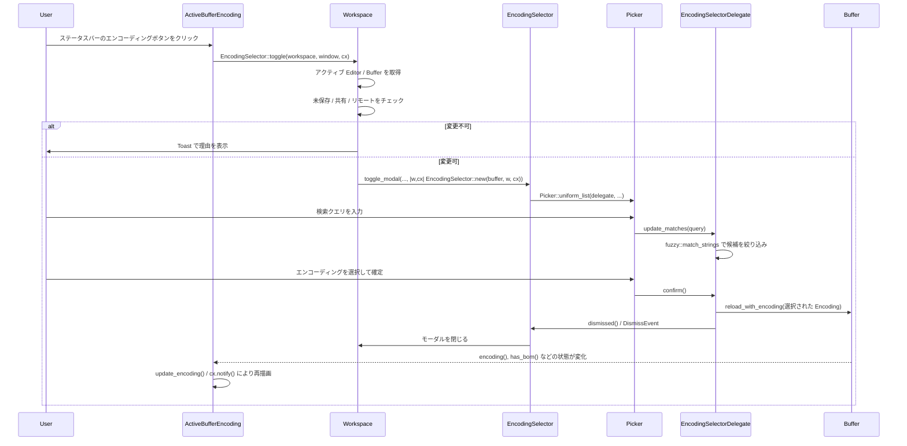

# crates/encoding_selector ディレクトリ解説

## 1. ざっくり一言

このクレートは、エディタ内の「現在のバッファの文字エンコーディング」を扱うための UI を提供します。  
ステータスバーにアクティブバッファのエンコーディングを表示するコンポーネントと、「Reopen with encoding...」モーダルでエンコーディングを選択し直すためのピッカーを実装しています。

---

## 2. このモジュールの役割

### 2.1 ディレクトリ全体の概要

- 解決したい問題  
  - 現在表示しているファイルがどの文字エンコーディングで開かれているかを視覚的に確認したい
  - 別のエンコーディングで「再読み込み」したい（例: Shift_JIS / EUC-JP / UTF-8 など）  
- 提供する機能  
  - ステータスバー上の「現在のエンコーディング」表示と、そのボタンからエンコーディング変更モーダルを呼び出す機能
  - 代表的なエンコーディング一覧の生成と、名称に対するファジー検索
  - 選択したエンコーディングでテキストバッファを再読み込みする処理

### 2.2 アーキテクチャ内での位置づけ

このクレートは、他のコアコンポーネント（`Workspace`, `Editor`, `Buffer`, `Project`, `Picker`, `encoding_rs` など）と連携して動作します。

主な関係は次のようになっています。



- `ActiveBufferEncoding`
  - `Workspace` のステータスバー項目として動作し、アクティブな `Editor` / `Buffer` / `Project` を監視して表示を更新します。
  - ボタンが押されたときに `EncodingSelector::toggle` を呼び出し、モーダル表示のトリガーになります。
- `EncodingSelector`
  - `Workspace` のモーダルビューとして表示されるエンコーディング選択 UI 本体です。
  - 内部に `Picker<EncodingSelectorDelegate>` を保持し、リスト表示と検索・選択処理を委譲します。
- `EncodingSelectorDelegate`
  - `PickerDelegate` 実装として、エンコーディング候補のリストや検索クエリに応じたマッチ結果を管理します。
  - 確定時に `Buffer::reload_with_encoding` を呼び出して、選択されたエンコーディングで再読み込みします。

### 2.3 設計上のポイント

コードから読み取れる設計上の特徴は次のとおりです。

- 責務の分割
  - ステータスバー表示 (`ActiveBufferEncoding`) とモーダル選択 UI (`EncodingSelector` + `EncodingSelectorDelegate`) が明確に分離されています。
  - エンコーディング候補の管理と検索ロジックは `EncodingSelectorDelegate` に集中しています。
- 状態管理
  - `ActiveBufferEncoding` は現在のエンコーディング・BOM の有無・未保存状態・コラボ状態・リモート状態などのフラグを内部に保持します。
  - `EncodingSelectorDelegate` は候補リスト・検索クエリに対するマッチ結果・選択中インデックスを保持します。
- エラーハンドリングの方針
  - 「未保存」「コラボレーション中」「リモートサーバー上のファイル」の場合は、エンコーディング変更を禁止し、トースト通知で理由を表示する構造になっています。
  - `Buffer::reload_with_encoding` の戻り値は `let _ = ...` として破棄されており、このモジュール側ではエラー詳細を扱っていません。
- UI 更新と非同期処理
  - ステータスバー表示の更新は `Context::notify` を通じて行われます。
  - ファジー検索 (`update_matches`) は `background_executor` 上で非同期に実行され、結果だけが UI スレッドに反映される構造になっています。

---

## 3. 主要な機能一覧

このクレートが提供する主な機能を列挙します。

- アクティブバッファのエンコーディング表示
  - `ActiveBufferEncoding` が `Buffer::encoding()` および `has_bom()` を参照し、ステータスバーに表示します。
- ステータスバーからのエンコーディング変更モーダル起動
  - ステータスバーのボタンをクリックすると `EncodingSelector::toggle` を呼び出し、モーダルを開閉します。
- エンコーディング変更の前提条件チェック
  - バッファが未保存 (`is_dirty()`)、コラボレーション中 (`Project::is_shared()`)、リモートサーバー経由 (`Project::is_via_remote_server()`) の場合は変更を禁止し、トーストで知らせます。
- エンコーディング候補リストの生成
  - `available_encodings()` が `encoding_rs` の代表的なエンコーディングを列挙し、名称順にソートします。
- ファジー検索による候補絞り込み
  - `EncodingSelectorDelegate::update_matches` が `fuzzy::match_strings` を使い、ユーザーの入力文字列にマッチするエンコーディング名を絞り込みます。
- バッファの再読み込み
  - `EncodingSelectorDelegate::confirm` が選択されたエンコーディングで `Buffer::reload_with_encoding` を呼び出し、同じファイルを別エンコーディングで再読み込みします。

---

## 4. 関数・構造体の解説

### 4.1 主要な型一覧

| 型名 | 定義ファイル | 種別 | 役割 / 用途 |
|------|--------------|------|-------------|
| `ActiveBufferEncoding` | `src/active_buffer_encoding.rs` | 構造体 | アクティブな `Editor` / `Buffer` / `Project` を監視し、ステータスバーに現在のエンコーディング情報を表示するステータスアイテムです。エンコーディング変更モーダル呼び出しボタンもここで描画します。 |
| `EncodingSelector` | `src/encoding_selector.rs` | 構造体 | 「Reopen with encoding...」モーダルのルートビューです。内部に `Picker<EncodingSelectorDelegate>` を保持し、モーダルとしてフォーカスや閉じるイベントを扱います。 |
| `EncodingSelectorDelegate` | `src/encoding_selector.rs` | 構造体 | `PickerDelegate` 実装で、エンコーディング候補一覧と検索マッチ結果を管理します。選択確定時に `Buffer` の再読み込みとモーダルの閉じ処理を行います。 |

補足的な要素:

- アクション `Toggle`
  - `actions!` マクロにより定義されるアクション型で、「エンコーディングセレクタの表示/非表示を切り替える操作」を表します。
- 自由関数 `available_encodings()`
  - 利用可能なエンコーディングの `Vec<&'static Encoding>` を構築するヘルパー関数です。

---

### 4.2 代表的な関数・メソッドの詳細（最大 7 件）

ここでは特に重要な 7 つの関数・メソッドについて詳しく説明します。

#### 4.2.1 `pub fn init(cx: &mut App)`

**概要**

- アプリケーション起動時に呼び出される初期化関数です。
- 新しく作成される `Workspace` ごとに、`EncodingSelector` 用のアクション登録（`Toggle`）を行います。

**引数**

| 引数名 | 型 | 説明 |
|--------|----|------|
| `cx` | `&mut App` | アプリケーション全体のコンテキストです。新規 `Workspace` を監視するために使用されます。 |

**戻り値**

- 戻り値はありません（`()`）。

**内部処理の流れ**

1. `cx.observe_new(EncodingSelector::register)` を呼び出し、新しい `Workspace` の生成を監視するオブザーバを登録します。
2. そのオブザーバを `.detach()` することで、戻り値のハンドルを保持せずにオブザーバを有効化します。
3. `Workspace` が新規作成されるたびに `EncodingSelector::register` が呼び出されます。

**Examples（使用例）**

```rust
use gpui::App;
use encoding_selector;

// アプリケーション初期化時に呼び出されると想定される関数
fn setup_plugins(app: &mut App) {
    // エンコーディングセレクタをワークスペースに組み込む
    encoding_selector::init(app);

    // 他のプラグインの init もここで呼び出すイメージ
    // other_plugin::init(app);
}
```

**Edge cases（エッジケース）**

- この関数自体には特別なエッジケースはありませんが、一度も呼び出されない場合:
  - 新しい `Workspace` に対して `Toggle` アクションが登録されないため、キーボードショートカットやアクション経由でエンコーディングセレクタを開くことができなくなります。

**使用上の注意点**

- アプリケーションの起動プロセスの中で一度だけ呼び出す前提の設計になっています。
- 既存の `Workspace` に対して遡って登録する処理は含まれていないため、「Workspace の生成より前」に呼び出す必要があります。

---

#### 4.2.2 `pub fn EncodingSelector::toggle(workspace: &mut Workspace, window: &mut Window, cx: &mut Context<Workspace>) -> Option<()>`

**概要**

- 現在の `Workspace` 内でエンコーディングセレクタモーダルを開閉するエントリポイントです。
- アクティブバッファの状態をチェックし、必要に応じてトースト通知を表示します。

**引数**

| 引数名 | 型 | 説明 |
|--------|----|------|
| `workspace` | `&mut Workspace` | アクティブアイテムやプロジェクト状態を取得し、モーダルやトーストを表示する対象です。 |
| `window` | `&mut Window` | モーダル表示や非同期タスクの紐付けに利用されるウィンドウです。 |
| `cx` | `&mut Context<Workspace>` | `Workspace` に対する UI コンテキストで、状態読み書きやエンティティ取得に利用されます。 |

**戻り値**

- `Option<()>`
  - `None`: アクティブな `Editor` や `Buffer` が取得できなかった（例: エディタ以外のペインがアクティブ）場合。
  - `Some(())`: トースト表示やモーダル表示など、何らかの処理を行った場合。

**内部処理の流れ**

1. `workspace.active_item(cx)?` から現在のアクティブアイテムを取得し、`Editor` として扱えるか `act_as::<Editor>(cx)?` で確認します。
2. `Editor::active_buffer(cx)?` からアクティブな `Buffer` を取得できなければ `None` を返します。
3. `buffer_handle.is_dirty()` を確認し、未保存なら:
   - `workspace.show_toast(...)` で「Save file to change encoding」のトーストを表示し、`Some(())` を返します。
4. `project.is_shared()` を確認し、コラボ中なら:
   - 「Cannot change encoding during collaboration」のトーストを表示し、`Some(())` を返します。
5. `project.is_via_remote_server()` を確認し、リモートファイルなら:
   - 「Cannot change encoding of remote server file」のトーストを表示し、`Some(())` を返します。
6. いずれの制限にも該当しない場合:
   - `workspace.toggle_modal(window, cx, move |window, cx| { EncodingSelector::new(buffer, window, cx) })` を呼び出し、モーダルの表示/非表示を切り替えます。
   - `Some(())` を返します。

**Examples（使用例）**

```rust
use gpui::Window;
use workspace::Workspace;
use encoding_selector::EncodingSelector;
use gpui::Context;

// 何らかのコマンドハンドラから呼び出す例
fn reopen_with_encoding_command(
    workspace: &mut Workspace,
    window: &mut Window,
    cx: &mut Context<Workspace>,
) {
    // 条件に応じてモーダルを開くか、トーストを表示する
    let _ = EncodingSelector::toggle(workspace, window, cx);
}
```

**Edge cases（エッジケース）**

- アクティブなペインが `Editor` 以外の場合
  - `act_as::<Editor>` が `None` を返し、最終的に `None` が返却されます。UI 上では何も起きません。
- `Editor` はあるがアクティブバッファが存在しない場合
  - `active_buffer(cx)?` により `None` になり、同様に何もしません。
- マルチカーソルや複数バッファが絡むケース
  - このコードからは詳細は分かりませんが、`Editor::active_buffer` が返す単一のバッファのみを対象にしています。

**使用上の注意点**

- この関数は「未保存」「共有中」「リモート」の場合に、必ずエンコーディング変更を拒否します。  
  これらの状態を意図的に無視するような変更は、他の機構（コラボ機能やリモート編集機能）との整合性に影響する可能性があります。
- 戻り値 `Option<()>` は主に「アクティブターゲットが存在するかどうか」を表すために使われており、エラー詳細は通知しません。

---

#### 4.2.3 `fn EncodingSelector::new(buffer: Entity<Buffer>, window: &mut Window, cx: &mut Context<Self>) -> Self`

**概要**

- モーダル用の `EncodingSelector` インスタンスを生成するコンストラクタです。
- 渡された `Buffer` を対象にする `EncodingSelectorDelegate` を生成し、それを `Picker` に組み込んだ状態で返します。

**引数**

| 引数名 | 型 | 説明 |
|--------|----|------|
| `buffer` | `Entity<Buffer>` | エンコーディングを変更したい対象テキストバッファです。 |
| `window` | `&mut Window` | `Picker` の初期化で使用されます。 |
| `cx` | `&mut Context<Self>` | `EncodingSelector` 自身の UI コンテキストです。内部エンティティ (`Picker`) の生成に使用されます。 |

**戻り値**

- `EncodingSelector`
  - 内部フィールド `picker: Entity<Picker<EncodingSelectorDelegate>>` に、適切に初期化された `Picker` を保持しています。

**内部処理の流れ**

1. `let delegate = EncodingSelectorDelegate::new(cx.entity().downgrade(), buffer);`
   - 自身 (`EncodingSelector`) への `WeakEntity` と対象 `Buffer` を使ってデリゲートを生成します。
2. `let picker = cx.new(|cx| Picker::uniform_list(delegate, window, cx));`
   - `Picker::uniform_list` を使って、均一なリスト表示を行うピッカーを生成します。
3. `Self { picker }` として新しい `EncodingSelector` を返します。

**Examples（使用例）**

`EncodingSelector::toggle` 内での使用が典型です。

```rust
workspace.toggle_modal(window, cx, move |window, cx| {
    // ここで buffer はクロージャ捕捉された Entity<Buffer>
    EncodingSelector::new(buffer, window, cx)
});
```

**Edge cases（エッジケース）**

- `buffer` がすでに無効になっているようなケース（例: モーダル表示中にバッファが閉じられた）は、この関数内からは分かりません。  
  そのようなケースの扱いは `Buffer` 側や上位の UI インフラに委ねられています。

**使用上の注意点**

- `EncodingSelector` は `ModalView` として使われる前提のため、通常は `Workspace::toggle_modal` 経由で生成されます。  
  任意の場所から直接 `new` を呼び出す場合も、同様のライフサイクル（モーダルとして閉じるなど）を考慮する必要があります。

---

#### 4.2.4 `fn EncodingSelectorDelegate::update_matches(&mut self, query: String, window: &mut Window, cx: &mut Context<Picker<Self>>) -> Task<()>`

**概要**

- ユーザーが入力した検索クエリに応じて、エンコーディング候補のマッチ結果を更新するメソッドです。
- ファジー検索をバックグラウンドスレッドで実行し、完了時に `matches` と `selected_index` を更新します。

**引数**

| 引数名 | 型 | 説明 |
|--------|----|------|
| `query` | `String` | ユーザーが入力した検索文字列です。 |
| `window` | `&mut Window` | 非同期タスクの実行・紐付けに使用されます。 |
| `cx` | `&mut Context<Picker<Self>>` | `Picker` に対する UI コンテキストで、背景実行キューや状態更新に使用されます。 |

**戻り値**

- `Task<()>`
  - 起動した非同期タスクを表すハンドルです（呼び出し側は通常これを明示的に利用しません）。

**内部処理の流れ**

1. `let background = cx.background_executor().clone();` でバックグラウンド実行用のエグゼキュータを取得します。
2. `let candidates = self.match_candidates.clone();` で候補の `Arc<Vec<StringMatchCandidate>>` をクローンします。
3. `cx.spawn_in(window, async move |this, cx| { ... })` で非同期タスクを生成します。
4. タスク内の処理:
   - `query` が空文字列の場合:
     - すべての候補を `StringMatch` に変換し、`positions` を空、`score` を `0.0` としたリストを構築します。
   - `query` が非空の場合:
     - `match_strings(&candidates, &query, false, true, 100, &Default::default(), background).await` を呼び出し、`matches` を取得します。
     - 引数の詳細な意味はこのコードからは分かりませんが、第 3〜6 引数でマッチングオプションや最大件数が指定されていると考えられます。
5. `this.update(cx, |this, cx| { ... })` で UI スレッド側に戻り:
   - `delegate.matches = matches;`
   - `delegate.selected_index = delegate.selected_index.min(delegate.matches.len().saturating_sub(1));`
     - マッチ件数に応じて選択インデックスを範囲内に収めます。
   - `cx.notify();` で UI の再描画を要求します。
6. `.log_err()` により、`update` 呼び出しで発生したエラーをログ出力します（エラー内容はここでは扱われません）。

**Examples（使用例）**

このメソッドは `Picker` から自動的に呼ばれることを前提としているため、通常アプリケーションコードから直接呼び出すことはありません。  
概念的には次のようなタイミングで呼び出されます。

```rust
// 疑似コード: Picker 内部からの呼び出しイメージ
fn on_query_changed(delegate: &mut EncodingSelectorDelegate, query: String, window: &mut Window, cx: &mut Context<Picker<EncodingSelectorDelegate>>) {
    let _task = delegate.update_matches(query, window, cx);
    // _task は破棄してもよい想定
}
```

**Edge cases（エッジケース）**

- マッチ結果が 0 件の場合
  - `delegate.matches.len()` は 0 となり、`saturating_sub(1)` は 0 を返します。
  - `selected_index` は `min(以前の selected_index, 0)` の結果になり、0 以上の値に保たれます。
  - その後の利用側では `self.matches.get(self.selected_index)` のように安全に `Option` として扱われているため、パニックは発生しません。
- `match_strings` の実行中に新たなクエリが入力された場合
  - 新しいクエリに対する `update_matches` が別タスクとして起動される可能性があります。  
    どのタスクの結果を採用するかは、このコードだけでは明示されていませんが、少なくとも最後に完了したタスクが `matches` を上書きします。

**使用上の注意点**

- ファジー検索のパラメータ（第 3〜6 引数）はこのモジュールではハードコードされており、外側から変更する方法は提供されていません。
- 1 回の呼び出しで最大 100 件に絞り込んでいると思われますが、その上限を変えたい場合はコード変更が必要です（定数などには分離されていません）。

---

#### 4.2.5 `fn EncodingSelectorDelegate::confirm(&mut self, _: bool, window: &mut Window, cx: &mut Context<Picker<Self>>)`

**概要**

- ユーザーが選択中のエンコーディングを確定したときに呼び出されるメソッドです。
- 対象 `Buffer` を選択されたエンコーディングで再読み込みし、その後モーダルを閉じます。

**引数**

| 引数名 | 型 | 説明 |
|--------|----|------|
| `_commit` | `bool` | 呼び出し元から渡されるフラグですが、この実装では未使用です。 |
| `window` | `&mut Window` | `dismissed` 呼び出しに渡されますが、実装内では参照のみです。 |
| `cx` | `&mut Context<Picker<Self>>` | `Buffer` の更新呼び出しに使用されます。 |

**戻り値**

- なし（`()`）。

**内部処理の流れ**

1. `self.matches.get(self.selected_index)` で、現在選択されているマッチ結果を取得します。
   - 取得できなかった場合（マッチ 0 件など）は何もせずに後続処理へ進みます。
2. マッチが存在する場合:
   - `let selected_encoding = self.encodings[mat.candidate_id];` で選択されたエンコーディングを取得します。
   - `self.buffer.update(cx, |buffer, cx| { let _ = buffer.reload_with_encoding(selected_encoding, cx); });`
     - 対象バッファに対して、選択されたエンコーディングでの再読み込みを依頼します。
     - 戻り値は `let _ = ...` として破棄され、ここでは成功・失敗を区別していません。
3. `self.dismissed(window, cx);` を呼び出し、モーダルを閉じるためのイベント（`DismissEvent`）を発行します。

**Examples（使用例）**

このメソッドも `Picker` が自動的に呼び出す想定で、通常は手動で呼び出しません。  
イメージとしては Enter キーやクリック確定時に次のように呼ばれます。

```rust
// 疑似コード: Picker 内部の確定処理から呼ばれる
fn on_confirm(delegate: &mut EncodingSelectorDelegate, window: &mut Window, cx: &mut Context<Picker<EncodingSelectorDelegate>>) {
    delegate.confirm(true, window, cx);
}
```

**Edge cases（エッジケース）**

- マッチが 0 件の場合
  - `self.matches.get(self.selected_index)` が `None` となり、バッファ再読み込みは行われません。
  - それでも `self.dismissed(window, cx);` は呼ばれるため、モーダルは閉じられます。
- `Buffer::reload_with_encoding` が失敗した場合
  - 戻り値が無視されているため、このモジュール側ではエラーをユーザーに通知しません。
  - 失敗時の挙動（例: 内容が変わらない、エラーダイアログが出るなど）は、`Buffer` 実装側に依存します。

**使用上の注意点**

- バッファ再読み込み後のエンコーディング状態は、`ActiveBufferEncoding` のオブザーバによって再取得されます。  
  そのため、`reload_with_encoding` が成功した場合はステータスバー表示も自然に更新される前提になっています。
- エラー通知が必要な場合は、`reload_with_encoding` の戻り値の扱いを変更する必要があります。

---

#### 4.2.6 `fn ActiveBufferEncoding::update_encoding(&mut self, editor: Entity<Editor>, _: &mut Window, cx: &mut Context<Self>)`

**概要**

- 現在アクティブな `Editor` / `Buffer` / `Project` の状態から、ステータスバー表示用の内部状態を更新するメソッドです。
- エンコーディング名、BOM の有無、未保存フラグ、コラボ状態、リモート状態を整えた上で、UI の再描画を要求します。

**引数**

| 引数名 | 型 | 説明 |
|--------|----|------|
| `editor` | `Entity<Editor>` | アクティブペインの `Editor` エンティティです。 |
| `_window` | `&mut Window` | オブザーバ API の都合で渡されていますが、このメソッド内では未使用です。 |
| `cx` | `&mut Context<Self>` | `ActiveBufferEncoding` に対する UI コンテキストで、`Project` や `Editor` の読み取り、`notify` 呼び出しに使用されます。 |

**戻り値**

- なし（`()`）。

**内部処理の流れ**

1. `self.active_encoding = None; self.has_bom = false; self.is_dirty = false;` で前回の状態をリセットします。
2. `let project = self.project.read(cx);` から `Project` を取得し:
   - `self.is_shared = project.is_shared();`
   - `self.is_via_remote_server = project.is_via_remote_server();`
3. `if let Some(buffer) = editor.read(cx).active_buffer(cx) { ... }` でアクティブバッファがある場合のみ:
   - `self.active_encoding = Some(buffer.encoding());`
   - `self.has_bom = buffer.has_bom();`
   - `self.is_dirty = buffer.is_dirty();`
4. 最後に `cx.notify();` を呼び出し、ステータスバー部分の再描画を要求します。

**Examples（使用例）**

`StatusItemView::set_active_pane_item` から呼び出されます。

```rust
if let Some(editor) = active_pane_item.and_then(|item| item.downcast::<Editor>()) {
    self._observe_active_editor =
        Some(cx.observe_in(&editor, window, Self::update_encoding));
    self.update_encoding(editor, window, cx);
}
```

**Edge cases（エッジケース）**

- アクティブバッファが存在しない場合
  - `self.active_encoding` は `None` のままになり、レンダリング側では「非表示 (`div().hidden()`)」となります。
- `Project` が共有状態またはリモート状態の場合
  - `self.is_shared` / `self.is_via_remote_server` が `true` になり、レンダリング時にボタンが無効化されます。
- エディタが読み取り専用かどうかなど
  - そのような情報はこのメソッドでは扱っていません。

**使用上の注意点**

- このメソッドは `cx.observe_in` によってエディタの変更時にも呼び出されるため、「重い処理」は避ける前提の設計になっています（実際の処理も軽量に留まっています）。
- `Project` の状態を毎回読み取っているため、コラボ状態やリモート状態の変化も即座に反映されます。

---

#### 4.2.7 `impl Render for ActiveBufferEncoding { fn render(&mut self, _: &mut Window, cx: &mut Context<Self>) -> impl IntoElement }`

**概要**

- ステータスバーに表示する「エンコーディングボタン」の見た目と振る舞いを定義するレンダリングメソッドです。
- エンコーディングや BOM の有無、変更可否フラグに応じて、ボタンの表示/非表示・有効/無効・ツールチップ内容を切り替えます。

**引数**

| 引数名 | 型 | 説明 |
|--------|----|------|
| `_window` | `&mut Window` | レンダリングコンテキストですが、このメソッドでは未使用です。 |
| `cx` | `&mut Context<Self>` | 設定 (`StatusBarSettings`) やアクション (`Toggle`) の取得に使用されます。 |

**戻り値**

- `impl IntoElement`
  - `gpui` の UI フレームワークで使用される要素型で、ここでは `div` コンテナの中に `Button` 要素が 1 つ入った構造、もしくは非表示の `div` を返します。

**内部処理の流れ**

1. `let Some(active_encoding) = self.active_encoding else { return div().hidden(); };`
   - エンコーディングが不明 (`None`) の場合はステータスバー項目自体を非表示にします。
2. `let display_option = StatusBarSettings::get_global(cx).active_encoding_button;`
   - グローバル設定から「エンコーディングボタンの表示オプション」を取得します。
3. `is_utf8` と `self.has_bom` を基に `display_option.should_show(is_utf8, self.has_bom)` を呼び出し:
   - `false` の場合は `div().hidden()` を返します（例: UTF-8 かつ BOM なしのときは隠す、といった挙動が想定されますが、詳細は設定側に依存します）。
4. ボタンラベル用のテキストを生成:
   - `let mut text = active_encoding.name().to_string();`
   - `if self.has_bom { text.push_str(" (BOM)"); }`
5. ボタンの有効/無効とツールチップ文言を決定:
   - 未保存 (`is_dirty`) : `disabled = true`, 「Save file to change encoding」
   - 共有中 (`is_shared`) : `disabled = true`, 「Cannot change encoding during collaboration」
   - リモート (`is_via_remote_server`) : `disabled = true`, 「Cannot change encoding of remote server file」
   - それ以外: `disabled = false`, 「Reopen with Encoding」
6. `Button::new("change-encoding", text)` を子に持つ `div` を返します。
   - `.label_size(LabelSize::Small)` で小さいラベルサイズを指定。
   - `.on_click(...)` でクリック時の挙動を定義:
     - `disabled` が `true` の場合は何もしません。
     - 有効な場合は `workspace.update(... EncodingSelector::toggle ...)` を呼び出してモーダル表示をトリガーします。
   - `.tooltip(...)` でツールチップを定義:
     - 無効状態では単純なテキストツールチップ (`Tooltip::text`)。
     - 有効状態ではアクション (`Toggle`) に紐づくショートカット表示つきツールチップ (`Tooltip::for_action`)。

**Examples（使用例）**

このメソッドは `StatusItemView` として自動的に呼び出される想定で、直接呼び出すことはありません。  
視覚的な挙動としては、次のように理解できます。

- 通常時: 「UTF-8」「Shift_JIS」などのボタンが表示される。
- BOM 付き: 「UTF-8 (BOM)」のように `(BOM)` が付く。
- 未保存・共有・リモート状態: ボタンがグレーアウト（無効）され、ツールチップに理由が表示される。

**Edge cases（エッジケース）**

- `active_encoding` が `None` の場合
  - ステータスバー項目は完全に非表示になります。
- 設定により UTF-8 のとき非表示にする場合
  - `StatusBarSettings::active_encoding_button.should_show` の結果に従って非表示になります。  
    具体的な設定値や UI はこのチャンクには現れていません。

**使用上の注意点**

- このメソッド内では `self.workspace.upgrade()` を行っているため、`Workspace` がすでに破棄された状態ではボタンを押しても何も起きません。
- `Toggle` アクションは `encoding_selector::init` によって `Workspace` に登録される前提のため、初期化を行わずにこのステータスアイテムだけを使うと、ツールチップ中のショートカットの意味が曖昧になる可能性があります。

---

### 4.3 その他の関数・メソッド一覧

詳細解説を割愛した補助的な関数・メソッドを一覧にまとめます。

| 名前 | 定義箇所 | 役割（1 行） |
|------|----------|--------------|
| `EncodingSelector::register` | `encoding_selector.rs` | 新しい `Workspace` に対して `Toggle` アクションを登録します。 |
| `EncodingSelector::render` | `encoding_selector.rs` | モーダル内レイアウト (`v_flex` + `Picker`) の描画を行います。 |
| `EncodingSelector::focus_handle` | `encoding_selector.rs` | モーダルのフォーカス制御を `Picker` に委譲します。 |
| `EncodingSelectorDelegate::new` | `encoding_selector.rs` | 利用可能エンコーディング一覧とマッチ候補を初期化します。 |
| `EncodingSelectorDelegate::render_data_for_match` | `encoding_selector.rs` | マッチ候補 1 件分の表示用テキストを生成します（現在のエンコーディングには `(current)` を付与）。 |
| `available_encodings` | `encoding_selector.rs` | `encoding_rs` の代表的なエンコーディングを列挙し、名前順にソートした `Vec<&'static Encoding>` を返します。 |
| `EncodingSelectorDelegate::placeholder_text` | `encoding_selector.rs` | ピッカーのプレースホルダ文字列「Reopen with encoding...」を返します。 |
| `EncodingSelectorDelegate::match_count` | `encoding_selector.rs` | 現在のマッチ件数（`matches.len()`）を返します。 |
| `EncodingSelectorDelegate::selected_index` / `set_selected_index` | `encoding_selector.rs` | 選択中のインデックスの取得・設定を行います。 |
| `EncodingSelectorDelegate::dismissed` | `encoding_selector.rs` | `EncodingSelector` に `DismissEvent` を emit し、モーダルを閉じるトリガーにします。 |
| `EncodingSelectorDelegate::render_match` | `encoding_selector.rs` | マッチ結果 1 件を `ListItem` + `HighlightedLabel` として描画します。 |
| `ActiveBufferEncoding::new` | `active_buffer_encoding.rs` | 初期状態の `ActiveBufferEncoding` を生成します（エンコーディング情報は空）。 |
| `StatusItemView for ActiveBufferEncoding::set_active_pane_item` | `active_buffer_encoding.rs` | アクティブペインの変更に応じて、`Editor` オブザーバの登録/解除と状態リセットを行います。 |

---

## 5. データフロー

ここでは、代表的な「ステータスバーからエンコーディングを変更する」シナリオのデータフローを説明します。

1. ユーザーがステータスバー上のエンコーディングボタンをクリックします。
2. `ActiveBufferEncoding` のボタンハンドラが `EncodingSelector::toggle` を呼び出します。
3. `EncodingSelector::toggle` がアクティブな `Editor` / `Buffer` / `Project` を取得し、未保存・共有・リモートなどの制約をチェックします。
   - 制約がある場合はトースト表示のみ行い、モーダルは開きません。
4. 制約がなければ `Workspace::toggle_modal` により `EncodingSelector` モーダルを開きます。
5. モーダル内の `Picker` が表示され、ユーザーは検索クエリを入力します。
6. `EncodingSelectorDelegate::update_matches` が呼ばれ、`fuzzy::match_strings` によるファジー検索結果が `matches` に反映されます。
7. ユーザーが候補を選択して確定すると、`EncodingSelectorDelegate::confirm` が呼ばれます。
8. `confirm` が `Buffer::reload_with_encoding` を呼び出し、選択されたエンコーディングでファイルを再読み込みします。
9. 再読み込み後、`EncodingSelectorDelegate::dismissed` が `DismissEvent` を emit し、モーダルが閉じられます。
10. バッファ内容やエンコーディングが変化したことにより、`ActiveBufferEncoding` のオブザーバ (`update_encoding`) が再度呼ばれ、ステータスバーの表示が更新されます。

これをシーケンス図で表すと次のようになります。



---

## 6. 使い方（How to Use）

### 6.1 基本的な使用方法

このクレートを利用する際の基本的な流れは次のようになります。

1. アプリケーション起動時に `encoding_selector::init` を呼び出し、`Workspace` に `Toggle` アクションを登録する。
2. `ActiveBufferEncoding` を `StatusItemView` としてワークスペースのステータスバーに組み込む（組み込み部分のコードはこのチャンクには含まれていません）。
3. ユーザーはステータスバーのボタンまたはショートカット経由で `Toggle` アクションを実行し、モーダルを開く。

初期化の例（アプリケーション側での利用）:

```rust
use gpui::App;
use encoding_selector;

/// アプリケーションのプラグイン初期化フェーズで呼び出す
fn setup_plugins(app: &mut App) {
    // エンコーディングセレクタ機能を Workspace に統合する
    encoding_selector::init(app);
}
```

コマンドなどから直接モーダルを開きたい場合の例:

```rust
use encoding_selector::EncodingSelector;
use workspace::Workspace;
use gpui::{Window, Context};

fn open_encoding_selector(
    workspace: &mut Workspace,
    window: &mut Window,
    cx: &mut Context<Workspace>,
) {
    // 条件に応じてモーダル表示 or トースト表示を行う
    let _ = EncodingSelector::toggle(workspace, window, cx);
}
```

### 6.2 よくある使用パターン

#### パターン 1: ステータスバーからの利用

- ステータスバーに `ActiveBufferEncoding` を配置している場合:
  - ボタンラベルに現在のエンコーディングが表示されます（例: `UTF-8`, `Shift_JIS`, `UTF-8 (BOM)`）。
  - ボタンをクリックすると `EncodingSelector::toggle` が呼ばれ、モーダルが開きます。
  - 未保存・共有中・リモートの場合はボタンが無効化され、ツールチップに理由が表示されます。

このパターンはコード上では次の流れになっています。

```rust
// ActiveBufferEncoding::render 内部のクリックハンドラの概念図
.on_click(cx.listener(move |this, _, window, cx| {
    if disabled {
        // 未保存・共有・リモートのときは何もしない
        return;
    }
    if let Some(workspace) = this.workspace.upgrade() {
        workspace.update(cx, |workspace, cx| {
            // 実際のモーダル表示トリガー
            EncodingSelector::toggle(workspace, window, cx)
        });
    }
}))
```

#### パターン 2: 「Reopen with encoding...」モーダルでの検索

- モーダルを開くと、最初はすべてのエンコーディングがソートされたリストとして表示されます（`query` が空文字のため）。
- 検索欄に「utf」「shift」「1252」などを入力すると、`update_matches` がバックグラウンドでマッチを更新します。
- 確定するとそのエンコーディングで `Buffer::reload_with_encoding` が呼ばれます。

検索ロジックの概念コード:

```rust
// EncodingSelectorDelegate 内部
fn update_matches(&mut self, query: String, window: &mut Window, cx: &mut Context<Picker<Self>>) {
    // query.is_empty() なら全件表示
    // そうでなければ fuzzy::match_strings でファジー検索
}
```

### 6.3 使用上の注意点（まとめ）

- **未保存のファイルは変更できない**
  - `Buffer::is_dirty()` が `true` の場合、エンコーディング変更は行われず、トーストで「Save file to change encoding」と表示されます。
  - エンコーディング変更前には保存が必要です。

- **コラボレーション中のファイルは変更できない**
  - `Project::is_shared()` が `true` の場合、「Cannot change encoding during collaboration」と表示されます。
  - コラボレーション機能とエンコーディング変更は同時に行えない前提になっています。

- **リモートサーバー上のファイルは変更できない**
  - `Project::is_via_remote_server()` が `true` の場合、「Cannot change encoding of remote server file」と表示されます。

- **ステータスバーへの表示条件**
  - `StatusBarSettings::active_encoding_button.should_show(is_utf8, has_bom)` の結果に従って表示/非表示が決まります。
  - 具体的な設定方法はこのチャンクにはありませんが、「UTF-8 + BOM なしなら隠す」といったポリシーを持てるような設計になっています。

- **エラー処理の前提**
  - `Buffer::reload_with_encoding` の戻り値は破棄されており、失敗時の挙動はこのモジュールでは扱われません。
  - もしユーザーにエラー内容を通知したい場合は、`reload_with_encoding` の戻り値をチェックするようにコード変更する必要があります。

- **アクティブバッファがない場合**
  - `EncodingSelector::toggle` は `None` を返し、何も起きません。
  - エンコーディング変更機能は「エディタのアクティブバッファ」が前提になっています。

---

## 7. 関連ファイル

このディレクトリおよび関連クレートとの関係を表にまとめます。

| パス / クレート名 | 役割 / 関係 |
|-------------------|------------|
| `encoding_selector/Cargo.toml` | `encoding_selector` クレートのマニフェストです。`encoding_rs`, `editor`, `workspace`, `picker`, `fuzzy` など、このモジュールが依存するクレートが宣言されています。 |
| `encoding_selector/src/encoding_selector.rs` | クレートのルートモジュールです。`EncodingSelector` モーダルと `EncodingSelectorDelegate`、`Toggle` アクション、`init` 関数、`available_encodings` など、この機能の中心となるロジックが定義されています。 |
| `encoding_selector/src/active_buffer_encoding.rs` | ステータスバー用の `ActiveBufferEncoding` コンポーネントと、その `StatusItemView` 実装が定義されています。モーダルを開くトリガーを提供します。 |
| クレート `editor` | `Editor` エンティティを提供し、`active_buffer` を通じて現在のテキストバッファを取得するために利用されています。 |
| クレート `language` | `Buffer` 型と `reload_with_encoding`, `encoding`, `has_bom`, `is_dirty` など、テキストバッファと文字エンコーディングに関する API を提供します。 |
| クレート `project` | `Project` 型を提供し、`is_shared`, `is_via_remote_server` など、コラボレーションやリモート状態を判定するために使われています。 |
| クレート `workspace` | `Workspace`, `ModalView`, `StatusBarSettings`, `StatusItemView`, `Toast`, `notifications::NotificationId` など、ワークスペース全体の UI と状態管理を提供します。 |
| クレート `picker` | `Picker` と `PickerDelegate` を提供し、エンコーディングピッカーのリスト表示・検索 UI の基盤になっています。 |
| クレート `fuzzy` | `StringMatch`, `StringMatchCandidate`, `match_strings` を提供し、エンコーディング名のファジー検索に使用されています。 |
| クレート `encoding_rs` | `Encoding` と多数の具体的なエンコーディング定数（`UTF_8`, `SHIFT_JIS` など）を提供し、再読み込みに使用するエンコーディングの実体を表します。 |

このように、`encoding_selector` クレートはエディタの基盤機能（バッファ、ワークスペース、プロジェクト）と UI コンポーネント（ステータスバー、モーダル、ピッカー）の間をつなぐ「エンコーディング変更用 UI モジュール」として位置づけられます。
