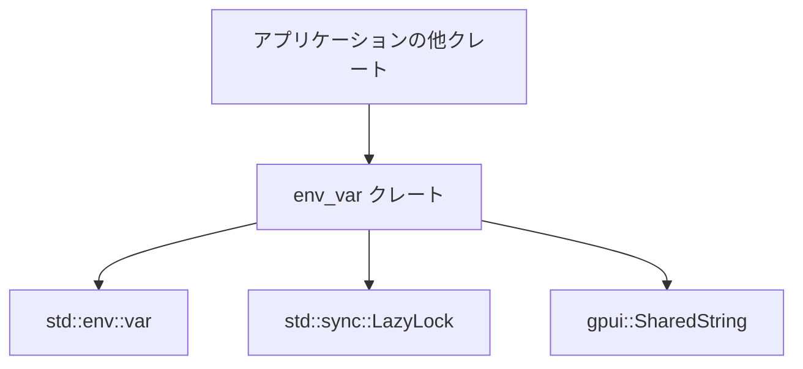
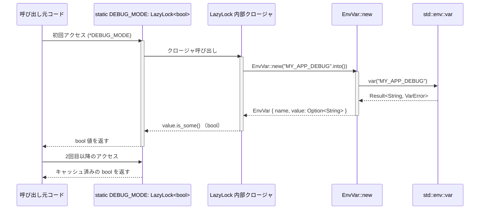

# env_var ディレクトリ

## 1. ざっくり一言

`env_var` クレートは、環境変数を「名前＋オプション値」の構造体として扱い、  
空文字列や取得エラーを `None` として正規化しつつ、`static` 用の遅延初期化マクロを提供する小さなユーティリティです。

---

## 2. このモジュールの役割

### 2.1 概要

- このモジュールは、**環境変数の取得とその結果の扱いを単純化**するために存在します。
- 環境変数を表す `EnvVar` 構造体と、`static` で使うための
  - `env_var!`（`LazyLock<EnvVar>`）
  - `bool_env_var!`（`LazyLock<bool>`）
  を提供します。
- 空文字列や非 Unicode の値も含めて、「値が有効かどうか」を `Option<String>` と `bool` で一貫して扱えるようにしています。

### 2.2 アーキテクチャ内での位置づけ

このクレート自体は非常に小さく、主に次のコンポーネントと関係します。



- 他のクレートから `EnvVar` 構造体およびマクロを利用します。
- `EnvVar::new` の内部で `std::env::var` を呼び出して環境変数を取得します。
- マクロ内部で `std::sync::LazyLock` を利用し、`static` な遅延初期化を行います。
- 環境変数名は `gpui::SharedString` 型で保持します。

### 2.3 設計上のポイント

- **責務の分割**
  - 環境変数の取得と正規化を `EnvVar::new` に集約しています。
  - `static` 用の遅延初期化ロジックはマクロ (`env_var!`, `bool_env_var!`) に隠蔽しています。
- **状態の扱い**
  - `EnvVar` は「名前」「値（存在しない・空・非 Unicode を含めた有無）」という**読み取り専用のデータ構造**です。
  - 値は `Option<String>` で表現し、「無い」「空文字」「非 Unicode」を `None` に統一しています。
- **エラーハンドリングの方針**
  - `std::env::var` のエラー（未定義・非 Unicode など）はすべて `None` に変換し、外にエラーを伝播させません。
  - 空文字列も `None` として扱うことで、「実質的に値が設定されているかどうか」に集中できます。
- **遅延初期化**
  - マクロは `LazyLock` を利用しており、**初回アクセス時に一度だけ**環境変数を読み取り、その後はキャッシュされた値を返します。

---

## 3. 主要な機能一覧

- `EnvVar` 構造体: 環境変数の名前と値（存在しない・空文字・非 Unicode を `None` とする）を保持する。
- `EnvVar::new(name: SharedString)`:
  - 指定した名前の環境変数を読み取り、`EnvVar` として構築する。
- `EnvVar::or(self, other: EnvVar) -> EnvVar`:
  - 自身に値があればそれを、なければ代替の `EnvVar` を返す。
- `env_var!($name: expr)` マクロ:
  - `static` で使うための `LazyLock<EnvVar>` を生成する。
- `bool_env_var!($name: expr)` マクロ:
  - 環境変数が「存在し、かつ非空・Unicode 文字列」であれば `true` となる `LazyLock<bool>` を生成する。

---

## 4. 関数・構造体の解説

### 4.1 型一覧

| 名前   | 種別     | 役割 / 用途 |
|--------|----------|------------|
| `EnvVar` | 構造体 | 環境変数の名前 (`SharedString`) と値 (`Option<String>`) をまとめて表現する。 |

`EnvVar` のフィールド:

- `name: SharedString`
  - 環境変数の名前。
  - `gpui::SharedString` 型で保持します。
- `value: Option<String>`
  - 環境変数の値。
  - `Some(String)` … 環境変数が存在し、**非空かつ Unicode 文字列**の場合。
  - `None` … 以下のいずれかの場合。
    - 環境変数が存在しない。
    - 環境変数の値が空文字列。
    - 環境変数の値が非 Unicode（`std::env::var` が `VarError::NotUnicode` を返すケース）。

---

### 4.2 関数 / メソッド / マクロ詳細

#### `EnvVar::new(name: SharedString) -> EnvVar`

**概要**

- 指定された名前の環境変数を読み取り、その結果を `EnvVar` として構築します。
- 環境変数が未定義・空文字列・非 Unicode のいずれかであれば、`value` は `None` になります。

**引数**

| 引数名 | 型             | 説明 |
|--------|----------------|------|
| `name` | `SharedString` | 取得したい環境変数名。内部で `name.as_str()` を通じて `&str` として利用します。 |

**戻り値**

- `EnvVar`:
  - `name`: 渡された名前をそのまま保持します。
  - `value`: 上記の条件に従って `Some(String)` または `None`。

**内部処理の流れ**

1. `std::env::var(name.as_str())` を呼び出し、`Result<String, VarError>` を取得します。
2. `.ok()` を呼び出して、成功時は `Some(String)`、失敗時（未定義・非 Unicode など）は `None` に変換します。
3. `value` が `Some("")`（空文字）であれば、`value` を `None` に上書きします。
4. それ以外（`None` または `Some(非空文字列)`）の場合は、そのまま `value` として保持します。

**Examples（使用例）**

基本的な使い方の例です。

```rust
use env_var::EnvVar;                      // このクレートの EnvVar 構造体をインポート
                                          // （"..." .into() で SharedString に変換されることを想定）

fn load_api_key() -> Option<String> {     // API キーを Option で返す関数
    let api_key = EnvVar::new("API_KEY".into()); // "API_KEY" 環境変数を取得
    api_key.value                          // Option<String> をそのまま返す
}
```

**Errors / Panics**

- このメソッド自体は `Result` を返さず、`panic!` も発生させません。
- `std::env::var` のエラー（未定義・非 Unicode など）はすべて `None` に変換されます。

**Edge cases（エッジケース）**

- 環境変数が未定義の場合:
  - `value` は `None` になります。
- 環境変数が空文字列（`""`）の場合:
  - `value` は `None` に強制的に変換されます。
- 環境変数の値が非 Unicode の場合:
  - `std::env::var` がエラーを返し、`value` は `None` になります。
- 環境変数の値に前後の空白が含まれている場合:
  - そのまま `Some("  value  ".to_string())` のように保持され、トリミングは行いません。

**使用上の注意点**

- 「空文字列」と「未定義」「非 Unicode」がすべて `None` として扱われるため、これらを区別する必要がある場合は、この型だけでは判別できません。
- `name` は検証されず、そのまま `std::env::var` に渡されます。無効な名前を渡した場合も、エラーは `None` に吸収されます。

---

#### `EnvVar::or(self, other: EnvVar) -> EnvVar`

**概要**

- 自身の `value` が `Some` であれば自身を返し、`None` であれば `other` を返します。
- 複数の環境変数に対して「優先順位付きフォールバック」を実現する用途を想定したメソッドです。

**引数**

| 引数名 | 型       | 説明 |
|--------|----------|------|
| `self` | `EnvVar` | 呼び出し元の `EnvVar`（所有権を移動します）。 |
| `other` | `EnvVar` | フォールバックとして使う `EnvVar`（所有権を移動します）。 |

**戻り値**

- `EnvVar`:
  - `self.value` が `Some` であれば `self` を返します。
  - そうでなければ `other` を返します。

**内部処理の流れ**

1. `self.value.is_some()` を評価します。
2. `true` であれば `self` をそのまま返します。
3. `false` であれば `other` を返します。

**Examples（使用例）**

優先順位付きで環境変数を選択する例です。

```rust
use env_var::EnvVar;                            // EnvVar をインポート

fn choose_db_url() -> Option<String> {          // DB URL を返す関数
    let primary = EnvVar::new("PRIMARY_DB_URL".into()); // 第一候補
    let fallback = EnvVar::new("DB_URL".into());        // フォールバック

    let selected = primary.or(fallback);        // primary に値があればそれを選ぶ

    selected.value                              // 最終的な Option<String> を返す
}
```

**Errors / Panics**

- エラーや `panic!` は発生しません。

**Edge cases（エッジケース）**

- `self.value` が `Some("")` になることは、`EnvVar::new` の仕様上ありません。
  - 空文字は `EnvVar::new` 内で `None` に変換されるためです。
- `self` も `other` も `value` が `None` の場合:
  - `other` がそのまま返されますが、`value` は `None` のままです。

**使用上の注意点**

- 引数はどちらも所有権を消費するため、同じ `EnvVar` インスタンスを複数回 `or` に渡して再利用することはできません。
  - 必要であれば都度 `EnvVar::new` で生成するか、`EnvVar` を `Clone` して使う必要があります（`EnvVar` は `#[derive(Clone)]` されています）。

---

#### `env_var!($name: expr) -> ::std::sync::LazyLock<EnvVar>`

**概要**

- 指定した名前の環境変数を表す `EnvVar` を、`LazyLock` で遅延初期化するマクロです。
- `static` 宣言での利用を想定しており、**初回アクセス時に一度だけ**環境変数を読み取ります。

**引数**

| 引数名 | 型        | 説明 |
|--------|-----------|------|
| `$name` | `expr`   | 環境変数名を表す式（`&'static str` など）。`Into<SharedString>` が実装されている必要があります。 |

**戻り値**

- 型: `::std::sync::LazyLock<EnvVar>`
  - 中身は `EnvVar::new(($name).into())` の結果です。
  - マクロ自身が `LazyLock::new` を使って遅延初期化します。

**内部処理の流れ**

1. 展開結果は `::std::sync::LazyLock::new(|| $crate::EnvVar::new(($name).into()))` という式になります。
2. `static` で使われると、`LazyLock` がそのクロージャを保持します。
3. 初めてその `LazyLock` にアクセスしたタイミングで、クロージャが呼ばれ `EnvVar::new` により環境変数が読み取られます。
4. 以後のアクセスでは、**同じ `EnvVar` インスタンスが再利用**されます（再度環境変数を読み取りません）。

**Examples（使用例）**

`static` で API キーを保持する例です。

```rust
use env_var::EnvVar;                                // EnvVar をインポート
use std::sync::LazyLock;                            // LazyLock の型をインポート

// "API_KEY" 環境変数を遅延評価で読み取る static 変数
static API_KEY: LazyLock<EnvVar> = env_var::env_var!("API_KEY");

fn current_api_key() -> Option<String> {
    API_KEY.value.clone()                           // EnvVar の value (Option<String>) をクローンして返す
}
```

**Errors / Panics**

- マクロ展開後のコードには `panic!` を起こす処理は含まれていません。
- `std::env::var` のエラーは `EnvVar::new` 内で `None` に変換されます。

**Edge cases（エッジケース）**

- プロセス実行中に `API_KEY` の値を変更しても、
  - **初回アクセス時の値のみ** が `LazyLock` にキャッシュされ、変更は反映されません。
- 空文字や非 Unicode の値の場合も、`EnvVar::new` の仕様により `value` は `None` になります。

**使用上の注意点**

- マクロ内部で `::std::sync::LazyLock` を完全修飾名で参照しているため、呼び出し側で `LazyLock` を `use` する必要はありませんが、`static` の型注釈を書くためには `LazyLock` をインポートするのが一般的です。
- 環境変数の再読み取りは行われないため、「起動時（または初回アクセス時）の設定を固定する」用途に向いています。

---

#### `bool_env_var!($name: expr) -> ::std::sync::LazyLock<bool>`

**概要**

- 指定した環境変数が「存在し、かつ非空・Unicode 文字列」であれば `true` となる `LazyLock<bool>` を生成するマクロです。
- フラグ用途の環境変数（例: `DEBUG=1` のような有無だけ見たいもの）に適しています。

**引数**

| 引数名 | 型      | 説明 |
|--------|---------|------|
| `$name` | `expr` | 環境変数名（`Into<SharedString>` 実装型）。 |

**戻り値**

- 型: `::std::sync::LazyLock<bool>`
  - 中身の `bool` は `EnvVar::new(($name).into()).value.is_some()` の結果です。
  - `true` … 環境変数が存在し、かつ非空・Unicode の場合。
  - `false` … 未定義・空文字列・非 Unicode のいずれかの場合。

**内部処理の流れ**

1. 展開結果は `::std::sync::LazyLock::new(|| $crate::EnvVar::new(($name).into()).value.is_some())` です。
2. `LazyLock` のクロージャ内で `EnvVar::new` が呼ばれます。
3. その `EnvVar` の `value.is_some()` の結果（`bool`）が `LazyLock` に保存されます。
4. 初回アクセスで一度だけ評価され、その後は同じ `bool` がキャッシュされます。

**Examples（使用例）**

デバッグフラグを環境変数で制御する例です。

```rust
use std::sync::LazyLock;                            // LazyLock の型
                                                    // マクロは env_var クレートから直接参照

// "MY_APP_DEBUG" が定義されていて非空なら true になるフラグ
static DEBUG_MODE: LazyLock<bool> = env_var::bool_env_var!("MY_APP_DEBUG");

fn is_debug_enabled() -> bool {
    *DEBUG_MODE                                      // LazyLock<bool> を参照解除して bool を得る
}
```

**Errors / Panics**

- エラーや `panic!` は発生しません。

**Edge cases（エッジケース）**

- `MY_APP_DEBUG` が未定義、空文字列、非 Unicode のいずれかの場合:
  - `DEBUG_MODE` は `false` になります。
- 値の内容（`"0"` / `"1"` / `"true"` など）は一切解釈されず、「存在して非空かどうか」だけを判定します。

**使用上の注意点**

- 真偽値として値の内容を解釈しない点に注意が必要です。
  - 例えば `"0"` や `"false"` も「非空である」ため `true` とみなされます。
- `LazyLock` により初回アクセス時の状態が固定されるため、プロセスの途中で環境変数を切り替えても反映されません。

---

### 4.3 その他の関数

- このディレクトリには、上記以外の公開関数・メソッド・マクロは定義されていません。

---

## 5. データフロー

ここでは、`bool_env_var!` を用いた `static` フラグへのアクセス時のデータフローを例に説明します。



要点:

- 環境変数の読み取りは **初回アクセス時に一度だけ** 行われます。
- そのときに構築された `EnvVar` の `value` の有無だけを見て `bool` が決まり、`LazyLock` にキャッシュされます。
- 2 回目以降は `std::env::var` は呼ばれず、キャッシュされた値が返されます。

---

## 6. 使い方（How to Use）

### 6.1 基本的な使用方法

#### 6.1.1 単純に値を取得する

`EnvVar::new` を直接使って、環境変数の値を 1 回だけ読む例です。

```rust
use env_var::EnvVar;                           // EnvVar 構造体をインポート

fn main() {
    // "API_ENDPOINT" 環境変数を読み取る
    let endpoint = EnvVar::new("API_ENDPOINT".into());

    match &endpoint.value {
        Some(value) => {
            // 環境変数が存在し、非空・Unicode の場合
            println!("API endpoint: {}", value);
        }
        None => {
            // 未定義・空文字・非 Unicode のいずれかの場合
            println!("API endpoint is not configured");
        }
    }
}
```

#### 6.1.2 `static` でキャッシュする

`env_var!` マクロを使って、環境変数を遅延初期化の `static` として定義する例です。

```rust
use env_var::EnvVar;                           // EnvVar 型
use std::sync::LazyLock;                       // LazyLock 型

// "API_KEY" 環境変数を EnvVar として保持する static
static API_KEY: LazyLock<EnvVar> = env_var::env_var!("API_KEY");

fn get_api_key() -> Option<String> {
    API_KEY.value.clone()                      // 値をクローンして呼び出し元に返す
}
```

### 6.2 よくある使用パターン

#### 6.2.1 フラグとしての存在チェック

`bool_env_var!` を使って、特定の機能をオン・オフする例です。

```rust
use std::sync::LazyLock;                       // LazyLock 型

// "MY_APP_DEBUG" が存在し非空なら true
static DEBUG_MODE: LazyLock<bool> = env_var::bool_env_var!("MY_APP_DEBUG");

fn log_debug(msg: &str) {
    if *DEBUG_MODE {                           // LazyLock<bool> を参照解除して判定
        eprintln!("[DEBUG] {}", msg);
    }
}
```

#### 6.2.2 環境変数のフォールバック

2 つの環境変数のどちらかを使い、なければデフォルト値に落とす例です。

```rust
use env_var::EnvVar;                           // EnvVar 型

fn database_url() -> String {
    let primary = EnvVar::new("PRIMARY_DB_URL".into()); // 第一候補
    let fallback = EnvVar::new("DB_URL".into());        // フォールバック

    // primary に値があれば primary を、なければ fallback を選ぶ
    let selected = primary.or(fallback);

    // どちらにも値がない場合はデフォルトを使う
    selected
        .value
        .clone()
        .unwrap_or_else(|| "sqlite::memory:".to_string())
}
```

### 6.3 使用上の注意点（まとめ）

- **空文字列・未定義・非 Unicode を区別しない**
  - いずれの場合も `EnvVar::value` は `None` になります。
  - 区別が必要な場合は、`std::env::var` を直接使う必要があります。
- **LazyLock によるキャッシュ**
  - `env_var!` / `bool_env_var!` で作成した `LazyLock` は、初回アクセス時の値を固定します。
  - プロセス実行中に `setenv` などで環境変数を変更しても、`LazyLock` の中身は更新されません。
- **`bool_env_var!` の判定条件**
  - 値の内容は解釈せず、「存在し非空かどうか」だけを見ます。
  - `"0"` や `"false"` でも非空であれば `true` になります。
- **`EnvVar::or` は所有権を消費する**
  - 同じ `EnvVar` インスタンスを何度も `or` の引数に使うことはできません。
  - 何度も同じ名前の環境変数を使う場合は、その都度 `EnvVar::new` を呼ぶか、別途自前でキャッシュする必要があります。

---

## 7. 関連ファイル

| パス                       | 役割 / 関係 |
|----------------------------|------------|
| `env_var/Cargo.toml`       | `env_var` クレートのメタデータと、`gpui` への依存、ライブラリのエントリポイント（`src/env_var.rs`）を定義します。 |
| `env_var/src/env_var.rs`   | `EnvVar` 構造体および `env_var!` / `bool_env_var!` マクロ本体を提供する、クレートの中核ファイルです。 |

このチャンクにはテストコードや他の補助モジュールは含まれておらず、`env_var.rs` がクレートの唯一の実装ファイルになっています。
