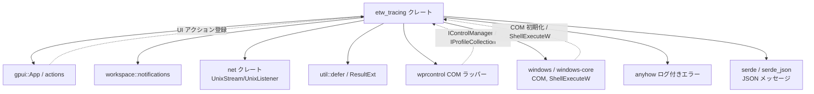
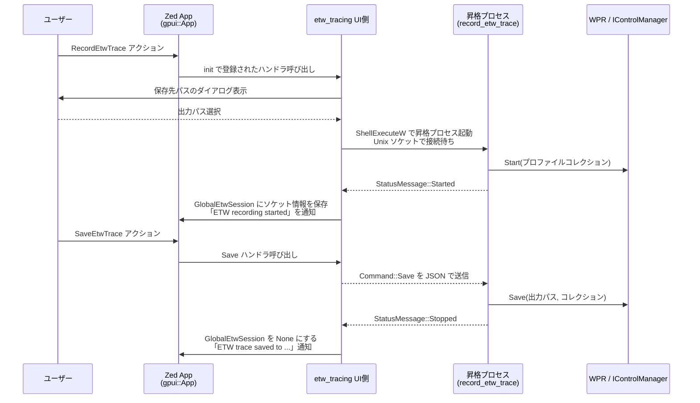

# etw_tracing/ ディレクトリ（C:\Drive\rust\zed-local\crates\etw_tracing）

## 1. ざっくり一言

Windows 環境で Zed を使っているときに、UI から ETW (Event Tracing for Windows) の記録を開始・保存・キャンセルできるようにするためのモジュールです。  
昇格プロセスと Unix ドメインソケット経由でやり取りし、WPR (Windows Performance Recorder) を使って `.etl` トレースを取得します。

---

## 2. このモジュールの役割

### 2.1 概要

- このモジュールは **Zed の UI から安全に ETW トレースを記録する** 問題を解決するために存在します。
- 主な機能は:
  - gpui のアクションとして「ETW 記録開始 / ヒープ付きで開始 / 保存 / キャンセル」を登録すること
  - Unix ドメインソケットと JSON メッセージを使った **親プロセス ↔ 昇格子プロセス** 間の IPC を行うこと
  - 昇格プロセス側で WPR COM API を用いて ETW セッションを開始・保存・キャンセルすること
  - 成功 / タイムアウト / キャンセル / エラーなどの状態を Zed UI の通知としてユーザーに伝えること

### 2.2 アーキテクチャ内での位置づけ

このクレート内の主な役割と、外部クレートとの依存関係は概ね次のようになっています。



- **UI 層**: `gpui::App` にアクションを登録し、ユーザー操作を受け付けます。
- **IPC 層**: `net::UnixListener` / `net::UnixStream` と `serde_json` を用いて、親子プロセス間のコマンド・ステータスをやり取りします。
- **ETW 制御層**: `wprcontrol` と Windows COM (`windows`, `windows-core`) を通じて WPR セッションを操作します。
- **通知層**: `workspace::notifications::MessageNotification` を使ってユーザーに状態を表示します。

### 2.3 設計上のポイント

コードから読み取れる設計上の特徴を挙げます。

- **単一セッション管理**
  - `GlobalEtwSession` という `Global` 実装を使い、アプリ全体で ETW セッションは **常に 1 つだけ** に制限されています。
- **UI と ETW 制御の分離**
  - UI 側 (`init`, `start_etw_recording`, 通知関連) と、昇格した子プロセス側 (`record_etw_trace`, `record_etw_trace_inner`) が明確に分かれています。
- **非同期 + バックグラウンド処理**
  - UI スレッドでは重い処理をしないように、`cx.spawn` や `background_spawn` を使ってバックグラウンドで ETW 記録処理を実行しています。
- **RAII によるリソース管理**
  - `EtwSessionHandle` の `Drop` 実装でソケットファイルを削除。
  - `util::defer` を使って、エラー経路でも必ず `Cancel` を呼ぶようにガードしています。
- **詳細なエラー文脈**
  - `WprContext` トレイトと `wpr_error_context` により、WPR 関連の HRESULT から詳細なメッセージ／パースエラー情報／制御オブジェクトのチェーンなどを組み立て、ユーザー向けのエラーメッセージに反映しています。
- **タイムアウトによるセーフティ**
  - 子プロセス側で `SO_RCVTIMEO` を設定し、親からのコマンドを一定時間受け取れなかった場合は「タイムアウト扱いの Save」として処理して、ETW セッションを放置しないようにしています。

---

## 3. 主要な機能一覧

このディレクトリ（クレート）が提供する主な機能を列挙します。

- **UI アクション登録 (`init`)**
  - `RecordEtwTrace`, `RecordEtwTraceWithHeapTracing`, `SaveEtwTrace`, `CancelEtwTrace` の gpui アクションを登録し、それぞれに対応する処理を紐づけます。
- **ETW セッションの開始 (`start_etw_recording`, `launch_etw_recording`)**
  - ユーザーに保存先パスを選ばせ、昇格プロセスを起動し、IPC 用のソケット接続を確立します。
- **ETW セッションの制御 (`SaveEtwTrace`, `CancelEtwTrace`)**
  - 進行中のセッションに対して JSON メッセージで `Command::Save` / `Command::Cancel` を送信し、セッションを保存または取り消します。
- **昇格プロセスによる WPR 制御 (`record_etw_trace`, `record_etw_trace_inner`)**
  - COM 初期化、WPR プロファイルの構成、セッション開始、保存／キャンセルの実行を行います。
- **WPR プロファイル構築 (`build_profile_collection`, `heap_tracing_profile`)**
  - CPU/GPU/DiskIO/FileIO のビルトインプロファイルに加え、オプションで特定 PID のヒープトレースを含むカスタムプロファイルを XML から構築します。
- **状態通知 (`StatusMessage`, `show_etw_status_notification`)**
  - `Started` / `Stopped` / `TimedOut` / `Cancelled` / `Error` といった状態を JSON でやり取りし、それに応じて UI 通知を表示します。
- **エラー文脈の整形 (`wpr_error_context`, `WprContext`)**
  - WPR 固有のエラー情報を読み取り、ユーザーが原因を把握しやすいテキストに変換します。

---

## 4. 関数・構造体の解説

### 4.1 主な構造体・列挙体

| 名前 | 種別 | 役割 / 用途 |
|------|------|-------------|
| `EtwNotification` | 構造体 (フィールドなし) | 通知 ID を一意化するためのマーカー型として利用されます。 |
| `EtwSessionHandle` | 構造体 | 親プロセス側での「進行中の ETW セッション」を表現します。ソケットの書き込み側とリスナ、ソケットパスを保持します。`Drop` でソケットファイルを削除します。 |
| `GlobalEtwSession` | 構造体 + `Global` 実装 | `Option<EtwSessionHandle>` をラップし、`gpui::App` のグローバル状態として登録されます。アプリ全体で一つのセッションのみを管理します。 |
| `EtwSession` | 構造体 | `launch_etw_recording` の戻り値として、親プロセス側に渡されるセッション情報です。Unix ソケットのストリームとリスナ、出力パスを含みます。 |
| `StatusMessage` | 列挙体 (Serialize/Deserialize) | 親子プロセス間でやり取りするステータスメッセージです。`Started`, `Stopped`, `TimedOut`, `Cancelled`, `Error { message }` を持ちます。 |
| `Command` | 列挙体 (Serialize/Deserialize) | 親プロセスから子プロセスへ送るコマンドです。`Save` または `Cancel` の 2 種類です。 |

### 4.2 代表的な関数の詳細

ここでは、特に重要な 7 個の関数について詳しく説明します。

---

#### `init(cx: &mut App)`

**概要**

- Zed アプリケーションの起動時などに呼び出される初期化関数です。
- ETW 関連のアクションをすべて `gpui::App` に登録し、`GlobalEtwSession` を初期化します。

**引数**

| 引数名 | 型 | 説明 |
|--------|----|------|
| `cx` | `&mut App` | Zed / gpui のアプリケーションコンテキストです。グローバル状態の設定やアクションハンドラの登録に使われます。 |

**戻り値**

- なし（`()`）。副作用としてグローバル状態とアクションハンドラを登録します。

**内部処理の流れ**

1. `cx.set_global(GlobalEtwSession(None));` で、まだセッションがない状態を登録します。
2. `RecordEtwTrace` アクションが発行されたときに `start_etw_recording(cx, None)` を呼ぶハンドラを登録します。
3. `RecordEtwTraceWithHeapTracing` アクションに対しては、`Some(std::process::id())` を渡してヒープトレース付きで開始するハンドラを登録します。
4. `SaveEtwTrace` アクションでは:
   - `GlobalEtwSession` から現在のセッションを取得。
   - なければ通知「No active ETW recording to stop」を表示。
   - あれば `send_json(&mut writer, &Command::Save)` を呼び、成功/失敗に応じて通知を表示します。
5. `CancelEtwTrace` アクションでは:
   - 上記と同様にセッションを取得し、`Command::Cancel` を送信してキャンセルを要求します。

**Examples（使用例）**

アプリケーション起動時に ETW 機能を有効にする基本的な例です。

```rust
use gpui::App;                        // gpui の App 型をインポート
use etw_tracing;                      // このクレートをインポート

fn main() {
    App::new(|cx| {                  // アプリケーションコンテキストのセットアップ
        etw_tracing::init(cx);       // ETW 関連アクション・グローバル状態を登録する
        // 他の初期化処理...
    })
    .run();                          // アプリケーションを実行
}
```

**Edge cases（エッジケース）**

- すでに他の場所で `GlobalEtwSession` が設定されている場合でも、`init` は上書きします。このファイル内ではそうした状況は想定されていません。
- アクション名そのもの（`RecordEtwTrace` など）は `actions!` マクロで定義されているため、`init` を呼び忘れるとハンドラが動作しないだけでコンパイルエラーにはなりません。

**使用上の注意点**

- この関数は **アプリの初期化フェーズで一度だけ呼ぶ** 想定です。複数回呼んだ場合、最後に登録したハンドラが有効になります。
- Windows のみでコンパイルされるモジュールなので、他 OS からはこの関数自体が存在しません（`#![cfg(target_os = "windows")]`）。

---

#### `start_etw_recording(cx: &mut App, heap_pid: Option<u32>)`

**概要**

- UI 側から ETW 記録を開始するための中心的な関数です。
- 保存先ダイアログの表示、昇格プロセスの起動、IPC セッションの確立、ステータス監視タスクの起動までを行います。

**引数**

| 引数名 | 型 | 説明 |
|--------|----|------|
| `cx` | `&mut App` | UI コンテキスト。ダイアログ表示や通知、グローバル状態へのアクセスに使用します。 |
| `heap_pid` | `Option<u32>` | ヒープトレース対象のプロセス ID。`Some(pid)` のときはヒーププロファイルを有効にし、`None` のときはヒープをトレースしません。 |

**戻り値**

- なし（`()`）。非同期タスクを起動し、副作用としてセッション開始や通知表示を行います。

**内部処理の流れ**

1. `has_active_etw_session` により、すでにセッションが存在する場合は何もせず「ETW recording is already in progress」を通知して終了します。
2. `cx.prompt_for_new_path` を使って、ユーザーに `.etl` ファイルの保存先パスを入力させます。
3. `cx.spawn(async move |cx| {...})` で非同期タスクを開始し、その中で:
   1. 保存ダイアログの結果を待ちます。
      - キャンセル → 即終了。
      - エラー → UI スレッドに戻りエラー通知。
   2. `cx.background_spawn` で `launch_etw_recording(heap_pid, &output_path)` をバックグラウンド実行し、昇格プロセスの起動とソケット接続を確立します。
   3. 成功時、`EtwSession { output_path, stream, listener, socket_path }` を受け取ります。
   4. ソケットストリームを `into_inner().into_split()` で読み書きに分割します。
   5. 読み込み側について:
      - さらに `cx.spawn` で非同期タスクを起動し、`background_spawn` で `recv_json::<StatusMessage>` を実行。
      - 結果を受け取ったら UI スレッドに戻り、`GlobalEtwSession` を `None` にし、`show_etw_status_notification` で最終結果を通知します。
   6. 書き込み側について:
      - `GlobalEtwSession` に `EtwSessionHandle { writer, _listener: listener, socket_path }` を格納します。
      - 「ETW recording started」を通知します。

**Examples（使用例）**

`RecordEtwTraceWithHeapTracing` アクションから呼ばれる例（実際のコードから要約）:

```rust
cx.on_action(|_: &RecordEtwTraceWithHeapTracing, cx: &mut App| {
    let current_pid = std::process::id();        // ヒープトレース対象の PID として現在プロセスの PID を取得
    start_etw_recording(cx, Some(current_pid));  // ヒープトレース有りで ETW 記録を開始
});
```

**Edge cases（エッジケース）**

- 既にセッションが存在するとき:
  - 新しいセッションは開始されず、「ETW recording is already in progress」と通知されます。
- 保存ダイアログ:
  - ユーザーがキャンセルした場合は何も起こりません（通知も出しません）。
  - エラーが起きた場合のみ「Failed to pick save location: ...」という通知が出ます。
- 昇格プロセス起動 / 接続失敗:
  - `launch_etw_recording` が `Err` を返すと「Failed to start ETW recording: ...」という通知を表示し、セッションは開始されません。
- 子プロセスからのステータスメッセージ受信に失敗した場合:
  - `show_etw_status_notification` の `Err` 分岐で「Failed to complete ETW recording: ...」という通知になります。

**使用上の注意点**

- この関数は UI スレッド上から呼ばれますが、内部で非同期タスクを起動するため、戻り値を待つ必要はありません。
- グローバル状態に `EtwSessionHandle` をセットするため、アプリ全体で「ETW 記録中かどうか」が共有されます。
- `heap_pid` に `Some(pid)` を渡すと、WPR のヒーププロファイルがその PID のみを対象とするように設定されます（詳細は `heap_tracing_profile` 参照）。

---

#### `launch_etw_recording(heap_pid: Option<u32>, output_path: &Path) -> Result<EtwSession>`

**概要**

- 親プロセス側で、昇格した子プロセスを起動し、Unix ソケット接続を確立して `EtwSession` を構築する関数です。
- 子プロセスが `StatusMessage::Started` を送ってくるまで待ちます。

**引数**

| 引数名 | 型 | 説明 |
|--------|----|------|
| `heap_pid` | `Option<u32>` | ヒープトレース対象の PID。`None` の場合は -1 として子プロセスに渡されます。 |
| `output_path` | `&Path` | 子プロセスが `.etl` を保存すべきファイルパスです。 |

**戻り値**

- `Result<EtwSession>`  
  成功時は `EtwSession` を返します。エラー時は `anyhow::Error` で詳細を含むエラーが返されます。

**内部処理の流れ**

1. 一時ディレクトリに `zed-etw-<親プロセスPID>.sock` 形式の Unix ソケットパスを作成します。
2. 既に同名のファイルがある場合は `_ = std::fs::remove_file(&sock_path);` で削除してから、`net::UnixListener::bind(&sock_path)` でバインドします。
3. `std::env::current_exe()` で現在の実行ファイルパスを取得し、子プロセスに渡す引数文字列を組み立てます。
   - `--record-etw-trace --etw-zed-pid <pid_arg> --etw-output "<path>" --etw-socket "<sock_path>"`
4. `ShellExecuteW` を `"runas"` オペレーションで呼び出し、昇格した同じ実行ファイルを非表示 (`SW_HIDE`) で起動します。
   - 戻り値が `32` 以下の場合はエラーとみなし、`bail!` で失敗します。
5. `listener.accept()` で子プロセスからの Unix ソケット接続を待ち受けます。
6. 接続が確立したら `EtwSession` を構築し、最初の `StatusMessage` を `recv_json` で受信します。
   - `StatusMessage::Started` → セッション成功、`Ok(session)` を返す。
   - `StatusMessage::Error { message }` → `bail!` でエラーメッセージを含んで返す。
   - それ以外のステータス → `bail!` で「Unexpected status from subprocess: ...」。

**Examples（使用例）**

`start_etw_recording` からの利用イメージ（簡略化）:

```rust
let result = cx
    .background_spawn(async move {
        launch_etw_recording(heap_pid, &output_path)  // 昇格プロセス起動 + セッション確立
    })
    .await;
```

**Edge cases（エッジケース）**

- ソケットパスが既に存在していて削除できない場合:
  - `UnixListener::bind` がエラーを返し、`"Bind Unix socket for ETW IPC"` という文脈付きで `Err` になります。
- `ShellExecuteW` が 32 以下のコードを返した場合:
  - 「ShellExecuteW failed to launch elevated process (code: X)」というメッセージで失敗します。
- 子プロセスが `Started` 以外のステータスを最初に返した場合:
  - その値に応じて `Error` か「Unexpected status...」で即座にエラーになります。

**使用上の注意点**

- この関数は **親プロセス側でのみ** 使用される想定です。昇格された子プロセス側では `record_etw_trace` を使用します。
- Windows 10 以降の Unix ドメインソケットを前提としているため、古い Windows では動作しない可能性があります（コードからはバージョン判定は読み取れませんが、そのように推測されます）。
- 戻り値の `EtwSession` から `StatusMessage::Started` 以外は返ってこない前提で、後続処理（`start_etw_recording`）が組まれています。

---

#### `record_etw_trace(heap_pid: Option<u32>, output_path: &Path, socket_path: &str) -> Result<()>`

**概要**

- 昇格された子プロセス側で呼び出されるメイン関数です（CLI エントリ等から呼ばれる想定）。
- COM を初期化し、親プロセスとのソケット接続を確立した上で、実際の ETW 記録処理 `record_etw_trace_inner` を実行します。

**引数**

| 引数名 | 型 | 説明 |
|--------|----|------|
| `heap_pid` | `Option<u32>` | ヒープトレース対象の PID。 |
| `output_path` | `&Path` | 記録結果を保存する `.etl` ファイルのパス。 |
| `socket_path` | `&str` | 親プロセスが待ち受けている Unix ソケットのパス。 |

**戻り値**

- `Result<()>`  
  成功時は `Ok(())` を返します。エラー時は、親プロセスに `StatusMessage::Error` を送信した後で `Err(...)` を返します。

**内部処理の流れ**

1. `CoInitializeEx(None, COINIT_MULTITHREADED)` で COM を多重スレッドモードで初期化します。失敗した場合は `"COM initialization failed"` としてエラーになります。
2. `net::UnixStream::connect(socket_path)` で親プロセスとのソケット接続を確立します。
3. `record_etw_trace_inner(heap_pid, output_path, &mut stream)` を呼び出します。
4. もし `record_etw_trace_inner` がエラーを返した場合:
   - `StatusMessage::Error { message: <エラーの詳細> }` を `send_json` で親に送信し（`log_err()` でログに失敗を記録）、最後にそのエラーを `Err(e)` として返します。

**Examples（使用例）**

CLI から呼び出すイメージ（このファイルには CLI 実装はありませんが、呼び出し方の例）:

```rust
fn main_record_etw(heap_pid: Option<u32>, output: &std::path::Path, socket: &str) -> anyhow::Result<()> {
    etw_tracing::record_etw_trace(heap_pid, output, socket)  // 昇格プロセス側で ETW を記録
}
```

**Edge cases（エッジケース）**

- COM 初期化失敗:
  - 即座に `"COM initialization failed"` で `Err` になります。親には `StatusMessage::Error` が送信されます。
- 親プロセスへの接続失敗:
  - `"Connect to parent socket"` 文脈付きでエラーになります。
- `record_etw_trace_inner` からのエラー:
  - 親に `StatusMessage::Error` を送った上で、同じエラーを再度返します。

**使用上の注意点**

- この関数は昇格プロセス側でのみ使用される想定です。親プロセス側から直接呼び出すべきではありません。
- 何らかの理由で `StatusMessage::Error` の送信に失敗した場合も、元のエラーはそのまま返されますが、親プロセス側では状況を正しく把握できない可能性があります。

---

#### `record_etw_trace_inner(heap_pid: Option<u32>, output_path: &Path, stream: &mut net::UnixStream) -> Result<()>`

**概要**

- 昇格プロセス側での **純粋な WPR 制御ロジック** を担う関数です。
- プロファイルコレクション作成、WPR セッション開始、コマンド受信、保存／キャンセルの実行、ステータスメッセージ送信までを行います。

**引数**

| 引数名 | 型 | 説明 |
|--------|----|------|
| `heap_pid` | `Option<u32>` | ヒープトレース対象 PID。 |
| `output_path` | `&Path` | `.etl` 保存先パス。 |
| `stream` | `&mut net::UnixStream` | 親プロセスとの IPC ソケットです。JSON メッセージの送受信に使用します。 |

**戻り値**

- `Result<()>`  
  WPR 操作や通信がすべて成功した場合に `Ok(())` を返します。

**内部処理の流れ**

1. `build_profile_collection(heap_pid)` を呼び出し、ビルトインプロファイル＋必要ならヒープトレースプロファイルを含む `IProfileCollection` を構築します。
2. `create_wpr(&CControlManager)` で `IControlManager` を生成します。
3. コメントにある通り、「同じ名前のセッションが残っている可能性がある」ため、`control_manager.Cancel(None)` を呼び出して既存セッションをキャンセルします（エラーは無視）。
4. `control_manager.Start(&collection)` を `wpr_context` 経由で呼び出し、WPR 記録を開始します。
5. `util::defer` を使って、関数のスコープを抜ける際に `control_manager.Cancel(None)` が自動的に呼ばれるようにガード (`cancel_guard`) を作ります。
6. 親プロセスへ `StatusMessage::Started` を `send_json` で送信します。
7. `receive_command(stream)` を呼び出して、親から `Command` と `timed_out` フラグを取得します。
8. コマンドに応じた処理:
   - `Command::Cancel`:
     - `control_manager.Cancel(None)` を実行し、`cancel_guard.abort()` でガードを解除。
     - `StatusMessage::Cancelled` を送信します。
   - `Command::Save`:
     - `control_manager.Save(出力パス, collection, None)` を実行し、`cancel_guard.abort()`。
     - `timed_out` が `true` なら `StatusMessage::TimedOut`、そうでなければ `StatusMessage::Stopped` を送信します。

**Examples（使用例）**

この関数は `record_etw_trace` からのみ呼ばれています。

```rust
match record_etw_trace_inner(heap_pid, output_path, &mut stream) {
    Ok(()) => Ok(()),
    Err(e) => {
        // エラーを親に通知しつつ、同じエラーを返す
    }
}
```

**Edge cases（エッジケース）**

- `build_profile_collection` が失敗した場合:
  - プロファイルロードエラーや XML パースエラーなどが `anyhow::Error` で返されます。
- `Start` / `Save` / `Cancel` の各 WPR 操作が失敗した場合:
  - `WprContext` により詳細なエラーコンテキストが生成され、`Err` として返されます。
- 親との通信:
  - `send_json(stream, &StatusMessage::Started)` 自体が失敗した場合、エラーが返され、`cancel_guard` により `Cancel` が呼ばれます。

**使用上の注意点**

- コメントにある通り、`Save` または `Cancel` を呼ばずに関数を抜けると **カーネルバッファがリークする** ため、それを防ぐために `util::defer` で `Cancel` が保証されています。
- ただし `cancel_guard.abort()` を呼んだ後は `Cancel` は実行されないため、ロジックを変更する場合は `abort()` するタイミングに注意が必要です。

---

#### `build_profile_collection(heap_pid: Option<u32>) -> Result<IProfileCollection>`

**概要**

- WPR で使用するプロファイルコレクション (`IProfileCollection`) を構築します。
- ビルトインプロファイル `BUILTIN_PROFILES` に加え、必要ならヒープトレース用のカスタムプロファイルを XML からロードして追加します。

**引数**

| 引数名 | 型 | 説明 |
|--------|----|------|
| `heap_pid` | `Option<u32>` | ヒープトレース対象 PID。`Some` の場合はカスタムヒーププロファイルを追加します。 |

**戻り値**

- `Result<IProfileCollection>`  
  成功時は WPR のプロファイルコレクション COM オブジェクトを返します。

**内部処理の流れ**

1. `create_wpr(&CProfileCollection)` で空の `IProfileCollection` を作成します。
2. 配列 `BUILTIN_PROFILES` に含まれる各プロファイル名について:
   1. `create_wpr(&CProfile)` で `IProfile` を作成。
   2. `profile.LoadFromFile(profile_name, "")` を `wpr_context` + `with_context` 付きで呼び出し、ビルトインプロファイルをロード。
   3. `collection.Add(&profile, VARIANT_FALSE)` でコレクションに追加します。
3. `heap_tracing_profile(heap_pid)` を呼び出して、必要に応じてヒープトレース用の XML を生成します。
4. `heap_profile.LoadFromString(&BSTR::from(heap_xml))` で XML から `IProfile` をロードし、`collection.Add(&heap_profile, VARIANT_BOOL(0))` で追加します。
5. 最終的な `collection` を返します。

**Examples（使用例）**

`record_etw_trace_inner` 内から:

```rust
let collection = build_profile_collection(heap_pid)?;  // ビルトイン + ヒーププロファイルのコレクションを構築
```

**Edge cases（エッジケース）**

- ビルトインプロファイルファイルが存在しない・読み込めない場合:
  - `"Load built-in profile '...'”` という文脈付きでエラーになります。
- XML 文字列の生成 (`heap_tracing_profile`) 自体は常に成功しますが、WPR の側で XML が不正と判断された場合:
  - `LoadFromString` でエラーとなり `"Load profile from XML string"` としてエラーになります。
- `heap_pid` が `None` の場合:
  - ヒープ用 XML には実質空の部分が入り、プロファイルは追加されますが、プロセス ID の絞り込みは行われません。

**使用上の注意点**

- ビルトインプロファイル名 (`"CPU.Verbose.Memory"` など) は WPR 環境依存なので、環境によっては存在しない可能性があります。その場合はロード時にエラーとなります。
- `heap_pid` の指定は PID ベースで行われるため、再起動後の別プロセスには自動的には適用されません。

---

#### `receive_command(stream: &mut net::UnixStream) -> Result<(Command, bool)>`

**概要**

- 子プロセス側で、親プロセスからの `Command` (`Save` または `Cancel`) を受信する関数です。
- ソケットに受信タイムアウトを設定し、トラブル時は「タイムアウト扱いの `Save`」として扱います。

**引数**

| 引数名 | 型 | 説明 |
|--------|----|------|
| `stream` | `&mut net::UnixStream` | 親プロセスと接続済みの Unix ソケットです。 |

**戻り値**

- `Result<(Command, bool)>`  
  - 第 1 要素: 受信した `Command`。タイムアウト時は `Command::Save` になります。
  - 第 2 要素: `bool` フラグ。`true` なら「タイムアウト等のエラーにより Save とみなした」という意味です。

**内部処理の流れ**

1. `AsSocket` / `AsRawSocket` を使って Windows ソケットハンドルを取り出し、`setsockopt` で `SO_RCVTIMEO` を設定します。
   - タイムアウト値は `RECORDING_TIMEOUT`（60 秒）をミリ秒に変換したものです。
2. `BufReader::new(&mut *stream)` でバッファリングされたリーダを作成します。
3. `recv_json::<Command>(&mut reader)` を呼び出して 1 行の JSON を読み込みます。
   - 成功した場合 → `(command, false)` を返します。
   - 失敗した場合:
     - `log::warn!("Failed to receive ETW command, treating as timed-out Save: ...")` を記録し、
     - `(Command::Save, true)` を返します。

**Examples（使用例）**

`record_etw_trace_inner` から:

```rust
let (command, timed_out) = receive_command(stream)?;  // 親からコマンドを受信、失敗時はタイムアウト扱いの Save
```

**Edge cases（エッジケース）**

- `setsockopt` が失敗した場合:
  - `"Failed to set socket receive timeout: setsockopt returned {ret}"` として `bail!` します。
- 親プロセスがコマンドを送らずにソケットを閉じた場合や、JSON が壊れている場合:
  - いずれも `recv_json` がエラーとなり、ログに警告が出た上で `(Command::Save, true)` が返されます。
  - つまり、「親が何も言わなくても Save を試みる」というフェイルセーフな挙動になっています。

**使用上の注意点**

- タイムアウト時・通信エラー時に `Command::Save` を返す設計のため、呼び出し側では `timed_out` フラグを見て「タイムアウトに起因する Save」であることを認識できます。
- `recv_json` がエラーになってもここでは `Err` ではなく `Ok((Command::Save, true))` が返る点に注意が必要です。

---

### 4.3 その他の関数・トレイト

| 名前 | 役割（1 行） |
|------|--------------|
| `has_active_etw_session` | `GlobalEtwSession` にアクティブなセッションがあるかをチェックします。 |
| `show_etw_notification` | 簡単なメッセージ通知を表示します。 |
| `show_etw_notification_with_action` | メッセージ＋ボタン（クリック時にパスを開くなど）の通知を表示します。 |
| `show_etw_status_notification` | `StatusMessage` の内容に応じた最終通知（エラー含む）を表示します。 |
| `heap_tracing_profile` | ヒープトレース用の WPR プロファイル XML 文字列を生成します。PID の有無で内容が変化します。 |
| `wpr_error_context` | WPR 関連の HRESULT とエラー情報を読み取り、詳細なテキストメッセージに整形します。 |
| `create_wpr` | `WPRCCreateInstanceUnderInstanceName` を使って、指定 CLSID の WPR COM オブジェクトを生成します。 |
| `WprContext` トレイト | `windows_core::Result<T>` に対して、WPR 用のエラー文脈を付けて `anyhow::Result<T>` に変換するメソッドを提供します。 |
| `send_json` | 任意の `serde::Serialize` 型を JSON 1 行として書き込み、フラッシュします。 |
| `recv_json` | 1 行の JSON を文字列として読み込んでパースし、デシリアライズします。 |

---

## 5. データフロー

ここでは「UI から ETW 記録を開始し、保存して完了する」一連の流れを説明します。

### 5.1 処理の要点

1. ユーザーが Zed の UI から「ETW 記録開始」アクションを実行します。
2. `init` で登録されたハンドラにより、`start_etw_recording` が呼ばれます。
3. ユーザーが `.etl` の保存場所を選択すると、`launch_etw_recording` が昇格プロセスを起動します。
4. 昇格プロセスは `record_etw_trace` → `record_etw_trace_inner` を通じて WPR セッションを開始し、`StatusMessage::Started` を親に送ります。
5. 親プロセスは `GlobalEtwSession` にソケットの書き込みハンドルを格納し、「記録中」状態になります。
6. ユーザーが「保存」アクションを実行すると、`Command::Save` が子プロセスに送られます。
7. 子プロセスは `Save` を実行し、完了後に `StatusMessage::Stopped` を親に送ります。
8. 親はステータスを受信してグローバルセッションをクリーンアップし、結果に応じた通知を表示します。

### 5.2 シーケンス図

以下の Mermaid 図は、上記の典型的なフローを表しています。



---

## 6. 使い方（How to Use）

### 6.1 基本的な使用方法

#### 1. アプリ起動時に ETW 機能を初期化する

Zed 本体や関連アプリケーションの起動コードから `init` を呼び出します。

```rust
use gpui::App;                        // gpui の App 型
use etw_tracing;                      // このクレート

fn main() {
    App::new(|cx| {                  // アプリケーションコンテキストを生成
        etw_tracing::init(cx);       // ETW 関連のアクションとグローバル状態を登録
        // 他のモジュールの初期化処理...
    })
    .run();                          // イベントループ開始
}
```

これにより、`RecordEtwTrace` / `RecordEtwTraceWithHeapTracing` / `SaveEtwTrace` / `CancelEtwTrace` アクションが有効になり、UI からこれらのアクションを発行できるようになります（アクションの発行方法は gpui 側の仕組みに依存します）。

#### 2. CLI 側から昇格プロセスの ETW 記録を担当する

`launch_etw_recording` が付与する CLI フラグに対応するコードはこのディレクトリには含まれていませんが、文字列から次のようなフラグが使用されていることが分かります。

- `--record-etw-trace`
- `--etw-zed-pid <pid_arg>`
- `--etw-output "<output_path>"`
- `--etw-socket "<socket_path>"`

別のクレート側でこれらのフラグを解釈し、最終的には `record_etw_trace` を呼び出す構成になっていると考えられます。

```rust
// 擬似コード: CLI 側で record_etw_trace を呼び出す例
fn main_record_etw_from_cli() -> anyhow::Result<()> {
    // ここで CLI 引数から heap_pid, output_path, socket_path を取得する
    let heap_pid: Option<u32> = /* ... */;
    let output_path: std::path::PathBuf = /* ... */;
    let socket_path: String = /* ... */;

    etw_tracing::record_etw_trace(heap_pid, &output_path, &socket_path)
}
```

### 6.2 よくある使用パターン

#### パターン 1: 通常の ETW 記録

- ヒープトレースなしで ETW を記録したい場合は、`RecordEtwTrace` アクションを発行します。
- 内部的には `start_etw_recording(cx, None)` が呼ばれ、CPU/GPU/ディスク/ファイル IO などのビルトインプロファイルが有効になります。

#### パターン 2: ヒープトレース付き記録

- メモリリーク調査などのためにヒープトレースを含めたい場合は、`RecordEtwTraceWithHeapTracing` アクションを発行します。
- 現在のプロセスの PID が `heap_pid` として渡され、`heap_tracing_profile` で生成した XML により、そのプロセスのみのヒープイベントが収集されます。

#### パターン 3: タイムアウトによる自動終了

- ユーザーが `Save` や `Cancel` を実行しないまま一定時間放置した場合、子プロセス側の `receive_command` に設定されたタイムアウト（60 秒）により、内部的に「タイムアウト扱いの `Save`」が選択されます。
- その結果、`StatusMessage::TimedOut` が送信され、親側では「ETW recording timed out. Trace saved to ...」という通知が表示されます。

### 6.3 使用上の注意点（まとめ）

- **Windows 限定**
  - ファイル先頭の `#![cfg(target_os = "windows")]` により、このクレートは Windows 以外ではコンパイルされません。
- **単一セッション制約**
  - `GlobalEtwSession` により、同時に記録できる ETW セッションは 1 つだけです。二重に開始しようとすると通知が表示されるのみです。
- **昇格プロセス**
  - `ShellExecuteW` の `"runas"` オペレーションにより UAC の昇格が行われます。ユーザーが UAC ダイアログを拒否すると、セッションは開始できません。
- **リソースリーク防止**
  - `record_etw_trace_inner` 内で `util::defer` により `Cancel` が保護されているため、通常のコードパスではカーネルバッファがリークしない設計になっています。ロジックを変更する際は、このガードを削除しないよう注意が必要です。
- **ソケットファイルの掃除**
  - `EtwSessionHandle` の `Drop` でソケットファイルを削除しますが、プロセスが異常終了した場合などは削除されない可能性があります。その場合でも `launch_etw_recording` は開始前に `remove_file` を試みるため、多くのケースで問題は回避されます。
- **エラー情報の扱い**
  - WPR の COM エラーは `wpr_error_context` によりかなり詳細なテキストになりますが、それでも内部的な HRESULT やオブジェクト種別など低レベルな情報が含まれます。ユーザーに直接見せるか、ログにのみ記録するかはアプリ側のポリシーに依存します。
- **パニックの可能性**
  - `WprContext` の実装内で `source.cast::<IUnknown>().expect("cast to IUnknown")` を行っているため、万一 `cast` が失敗するとパニックになります（通常 WPR のインターフェイスでは発生しない想定ですが、コード上はその可能性があります）。

---

## 7. 関連ファイル

| パス | 役割 / 関係 |
|------|------------|
| `etw_tracing/Cargo.toml` | クレート `etw_tracing` のパッケージ情報と依存関係を定義します。`lib.path = "etw_tracing.rs"` により、ライブラリ本体が `etw_tracing.rs` であることを指定しています。 |
| `etw_tracing/etw_tracing.rs` | 本クレートの実装ファイルです。UI 側のアクション登録・通知表示、昇格プロセスとの IPC、WPR を用いた ETW 記録ロジックをすべて含んでいます。 |

このディレクトリの外側（他クレート）には、`launch_etw_recording` が渡している CLI フラグ (`--record-etw-trace` など) を受け取り、`record_etw_trace` を呼び出すエントリポイントが存在すると考えられますが、そのコードはこのチャンクには含まれていないため、詳細は不明です。
