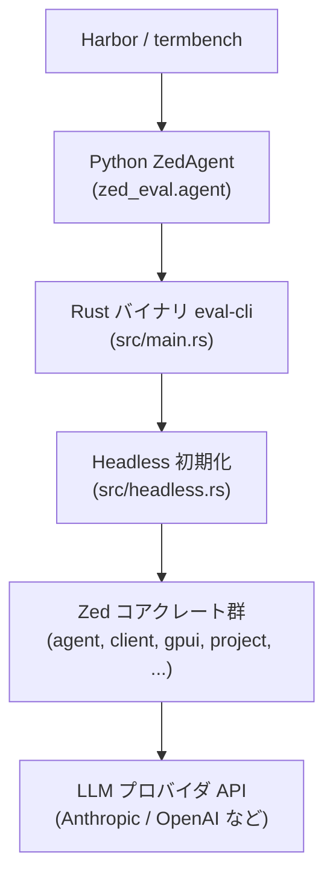
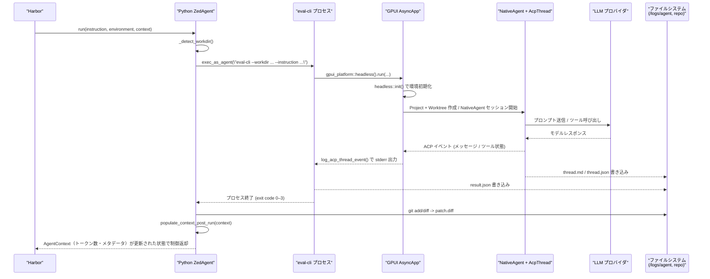

# eval_cli/ ディレクトリ解説

## 1. ざっくり一言

Zed エディタの AI エージェント（NativeAgent + AcpThread）を **GUI なしで headless 実行**する CLI バイナリ `eval-cli` と、そのバイナリを Harbor から扱うための **Python ラッパーエージェント (`ZedAgent`)** をまとめたディレクトリです。

---

## 2. このモジュールの役割

### 2.1 概要

- このディレクトリは、Zed の AI エージェントを **評価・ベンチマーク環境**で実行するための仕組みを提供します。
- Rust 製の `eval-cli` バイナリが、Zed 本体と同じ NativeAgent + AcpThread パイプラインを headless で起動し、モデル呼び出しやツール呼び出しを含む「エージェントループ」を実行します。
- Python パッケージ `zed_eval` は、Harbor の `BaseInstalledAgent` インターフェースを実装し、Harbor から `eval-cli` を呼び出してログ・結果・パッチを収集します。

### 2.2 アーキテクチャ内での位置づけ

`eval-cli` は Zed の内部クレート群（agent, client, gpui, language_model など）を再利用し、Python 側の `ZedAgent` からプロセスとして呼び出される構造になっています。



- Harbor 側は Python の `ZedAgent` を通して `eval-cli` を実行します。
- `eval-cli` は GPUI の headless ランタイム上で Zed のクライアントやエージェント、言語サーバなどを初期化します。
- LLM への問い合わせは `language_model` / `language_models` を経由して各プロバイダに転送されます。

### 2.3 設計上のポイント

コードから読み取れる設計上の特徴は次の通りです。

- **既存エディタロジックの再利用**
  - `NativeAgent`, `AcpThread`, `Project`, `LanguageRegistry` など、Zed 本体と同じコンポーネントをそのまま再利用しています。
  - これにより、CLI 実行時も GUI 版とほぼ同じ振る舞いになります。

- **headless GPUI アプリケーション**
  - `gpui_platform::headless()` で GUI なしのアプリケーションを起動しつつ、内部は GPUI イベントループやバックグラウンド executor を利用しています。

- **環境変数・コンテナ環境への最適化**
  - API キーは環境変数（`ANTHROPIC_API_KEY` など）から読み出す前提になっています（Python 側で設定）。
  - Python 側の `install` では、apt / apk / dnf / yum を自動検出し、curl, git などの最低限のツールと、Node.js や LSP を可能な範囲でセットアップします。

- **終了条件の明確化**
  - Rust 側では `AgentOutcome` によって「完了」「タイムアウト」「割り込み（SIGINT/SIGTERM）」を区別し、対応する exit code (0–3) と JSON ステータスに反映します。
  - タイムアウトは wall-clock（実時間）で測られ、SIGTERM/SIGINT は `ctrlc` + `AtomicBool` で監視されます。

- **出力の構造化**
  - CLI 実行の結果は `result.json`（ステータス・時間・トークン数）、`thread.md`（会話 Markdown）、`thread.json`（スレッドの内部状態）として出力されます。
  - Harbor 側の `populate_context_post_run` は `result.json` を読み取り、トークン数やメタデータを `AgentContext` に反映します。

---

## 3. 主要な機能一覧

このディレクトリ全体が提供する主な機能は次の通りです。

- **eval-cli バイナリ**
  - CLI 引数のパースとバリデーション（作業ディレクトリ、モデル名、タイムアウト、スタッフモードなど）。
  - headless GPUI アプリケーションの起動と、Zed エージェント環境の初期化。
  - 指定リポジトリへの `Project` / `Worktree` 作成とスキャン。
  - `NativeAgent` + `AcpThread` によるプロンプト実行と、LLM 呼び出し・ツール呼び出し。
  - タイムアウト・SIGTERM/SIGINT の監視とキャンセル処理。
  - `result.json`, `thread.md`, `thread.json` の出力。

- **ヘッドレス初期化 (`headless::init`)**
  - バージョン情報・リリースチャンネルの初期化。
  - プロキシ付き HTTP クライアント、Zed クライアント、アプリケーション DB の初期化。
  - ファイルシステム (`RealFs`)、言語レジストリ (`LanguageRegistry`)、Node.js 実行環境 (`NodeRuntime`) の構築。
  - 拡張ホスト、LSP 統合、言語モデル、プロンプトストア、ターミナルビュー、エージェント UI の登録。

- **Harbor 連携用 Python エージェント (`zed_eval.agent.ZedAgent`)**
  - コンテナ内でのパッケージマネージャ自動検出と、必要パッケージのインストール。
  - Node.js といくつかの LSP（basedpyright, TypeScript, Tailwind, eslint 等）の事前インストール（失敗しても non-fatal）。
  - `eval-cli` バイナリのアップロードまたはダウンロード、実行可能化、`--help` による動作確認。
  - リポジトリ作業ディレクトリの自動検出（`/app`, `/testbed`, `/repo`, もしくは `/` 直下 ～ depth 3 の `.git`）。
  - `eval-cli` の実行コマンド組み立て（モデル名、タイムアウト、スタッフモード、推論強度、thinking オプションなど）。
  - 実行ログの `eval-cli.txt` への保存と、`git diff` による `patch.diff` 作成。
  - `result.json` の読み取りと、Harbor の `AgentContext` へのトークン数・メタデータ反映。

- **ビルド関連**
  - `build.rs` による Zed 本体のバージョン (`crates/zed/Cargo.toml` の `version`) を `ZED_PKG_VERSION` 環境変数として埋め込む。
  - `Dockerfile` による Linux x86_64 用の静的リンクバイナリ（musl）ビルド（`cargo zigbuild`）。

---

## 4. 関数・構造体の解説

### 4.1 型一覧（構造体・列挙体など）

| 名前 | 種別 | 所属ファイル | 役割 / 用途 |
|------|------|--------------|-------------|
| `AgentCliAppState` | Rust 構造体 | `src/headless.rs` | 言語レジストリ、HTTP クライアント、ユーザストア、ファイルシステム、NodeRuntime など、eval-cli 実行に必要な共有状態を束ねます。 |
| `Args` | Rust 構造体 | `src/main.rs` | `clap::Parser` で CLI 引数を定義する型です。作業ディレクトリ、モデル名、タイムアウト、出力ディレクトリ、スタッフモード、thinking 設定などを持ちます。 |
| `AgentOutcome` | Rust enum | `src/main.rs` | エージェント実行の結果を「Completed」「Timeout {seconds}」「Interrupted」に分類するための列挙体です。 |
| `EvalResult` | Rust 構造体 | `src/main.rs` | `result.json` にシリアライズされる結果サマリです。ステータス、エラーメッセージ、実行時間、タイムアウト値、モデル名、トークン使用量などを保持します。 |
| `ZedAgent` | Python クラス | `zed_eval/agent.py` | Harbor の `BaseInstalledAgent` を継承し、`eval-cli` のインストール・実行・結果の取り込みを担当します。 |
| `BaseInstalledAgent`, `BaseEnvironment`, `AgentContext` | Python クラス（外部） | `harbor.*` | Harbor フレームワーク側の型です。このチャンクには定義はなく、インターフェースのみ利用されています。 |

### 4.2 関数詳細（主要 7 件）

#### `headless::init(cx: &mut App) -> Arc<AgentCliAppState>`

**概要**

- Zed のコアコンポーネントをすべて初期化し、headless 実行に必要な状態をまとめた `AgentCliAppState` を生成します。
- バージョン情報・プロキシ設定・言語レジストリ・NodeRuntime・拡張ホスト・エージェント UI までを一括で構成します。

**引数**

| 引数名 | 型 | 説明 |
|--------|----|------|
| `cx` | `&mut gpui::App` | GPUI アプリケーションコンテキスト。グローバル状態や HTTP クライアント、拡張などを登録するために用います。 |

**戻り値**

- `Arc<AgentCliAppState>`  
  headless 環境で共有されるアプリケーション状態（言語レジストリ、クライアント、ユーザストア、ファイルシステム、NodeRuntime）へのハンドルです。

**内部処理の流れ**

1. **バージョン情報の取得**
   - `option_env!("ZED_COMMIT_SHA")`, `option_env!("ZED_BUILD_ID")` と `env!("ZED_PKG_VERSION")` から `AppVersion` を構築します。
   - `ZED_PKG_VERSION` は `build.rs` で `crates/zed/Cargo.toml` から読み込まれています。

2. **リリースチャンネルと Tokio の初期化**
   - `release_channel::init(app_version.clone(), cx)` でリリースチャンネル関連のグローバル状態を設定。
   - `gpui_tokio::init(cx)` で GPUI から Tokio executor を利用できるようにします。

3. **設定ストアと HTTP クライアントの構成**
   - `SettingsStore::new(cx, &settings::default_settings())` を作成し、`cx.set_global` でグローバル設定として登録。
   - `ProxySettings::get_global(cx)` と `read_proxy_from_env` から HTTP プロキシ URL を決定。
   - `ReqwestClient::proxy_and_user_agent(proxy_url, &user_agent)` で User-Agent 付き HTTP クライアントを生成し、`cx.set_http_client` で登録。
   - `Client::production(cx)` から Zed クライアントを生成し、その `http_client()` を再度 `cx.set_http_client` します。

4. **DB・ファイルシステム・言語レジストリの初期化**
   - `AppDatabase::new()` をグローバルに登録。
   - `RealFs::new(git_binary_path=None, cx.background_executor().clone())` で実ファイルシステムアクセスを提供。
   - `LanguageRegistry::new` で言語レジストリを作成し、`paths::languages_dir()` をダウンロードディレクトリとして設定します。

5. **ユーザストアと拡張ホスト、NodeRuntime の構築**
   - `cx.new(|cx| UserStore::new(client.clone(), cx))` でユーザ情報ストアを作成。
   - `extension::init(cx)` で拡張システムを初期化。
   - `watch::channel(None)` と `cx.observe_global::<SettingsStore>` により、`ProjectSettings::get_global(cx).node` の変化に応じて `NodeBinaryOptions` を更新し、`NodeRuntime::new` に渡します。

6. **各種拡張・言語モデル・UI コンポーネントの初期化**
   - `ExtensionHostProxy::global(cx)` を取得し、`debug_adapter_extension::init`, `language_extension::init` を呼び出します。
   - `language_model::init`, `RefreshLlmTokenListener::register`, `language_models::init`, `languages::init`, `prompt_store::init`, `terminal_view::init` でそれぞれのサブシステムを有効化します。
   - `PromptBuilder::load(fs.clone(), stdout_is_a_pty=false, cx)` を使い、`agent_ui::init` に渡してエージェント UI（headless 版）を初期化します。

7. **`AgentCliAppState` の生成**
   - 上記で作成した `languages`, `client`, `user_store`, `fs`, `node_runtime` をまとめて `Arc<AgentCliAppState>` として返します。

**Examples（使用例）**

この関数は `main` 内で GPUI headless アプリケーション起動時に呼ばれます。

```rust
let http_client = Arc::new(reqwest_client::ReqwestClient::new());   // シンプルな HTTP クライアント
let app = gpui_platform::headless().with_http_client(http_client);  // headless GPUI アプリ

app.run(move |cx| {
    let app_state = headless::init(cx);                             // AgentCliAppState を初期化
    // app_state を使って Project や NativeAgent を作成していく
});
```

**Errors / Panics**

- HTTP クライアント生成時に `ReqwestClient::proxy_and_user_agent` が失敗すると `expect("could not start HTTP client")` により panic します。
- `NodeRuntime` 初期化やその他のサブシステムは `expect` を使っていないため、この関数内では明示的な `Result` は返しません。

**Edge cases**

- プロキシ設定文字列が不正な場合でも、`input.parse().ok()` で失敗すると環境変数からのプロキシ設定にフォールバックします。
- Node.js のパス (`settings.path` / `settings.npm_path`) が設定されていない場合、`use_paths` は `None` となり、NodeRuntime 側がデフォルト探索に任せられます。

**使用上の注意点**

- `headless::init` は GPUI アプリケーションのグローバル状態を多数設定するため、**アプリケーション起動時に一度だけ**呼び出す前提の構造になっています。
- バージョン情報 (`ZED_PKG_VERSION` など) がビルド時に埋め込まれているため、`crates/zed/Cargo.toml` の `version` が変更された場合は再ビルドが必要です。

---

#### `main()`

**概要**

- CLI エントリポイントです。引数のパース、環境設定、指示文の読み込み、出力ディレクトリの準備、GPUI headless アプリの起動、エージェント実行、結果の JSON 出力と exit code の決定を行います。

**引数**

- なし（`std::env::args` を通じて `Args` にパースされます）。

**戻り値**

- なし（`process::exit` によりプロセスを終了します）。

**内部処理の流れ**

1. **CLI 引数のパースと特殊モード**
   - `let args = Args::parse();` で `clap` により引数をパース。
   - `--printenv` が指定されている場合、`util::shell_env::print_env()` を呼び出して環境変数を JSON 出力し、即時終了します。

2. **ログとシグナルハンドラの設定**
   - `env_logger::init()` でログ出力を有効化。
   - `ctrlc::set_handler` で SIGINT / SIGTERM 受信時に `TERMINATED: AtomicBool` を `true` にするハンドラを登録します。

3. **指示文・パスのバリデーション**
   - `read_instruction(&args)` で `--instruction` か標準入力からプロンプトを読み取り、空文字の場合はエラーにします。
   - `args.workdir.canonicalize()` で作業ディレクトリを正規化し、失敗した場合はエラーメッセージを出して終了します。
   - `std::fs::create_dir_all(&output_dir)` で出力ディレクトリを作成し、失敗すると終了します。

4. **headless GPUI アプリケーションの起動**
   - 簡易 HTTP クライアントを作成し、`gpui_platform::headless().with_http_client(http_client)` で headless アプリを構築。
   - `app.run(move |cx| { ... })` で GPUI イベントループを開始します。

5. **アプリケーション初期化とモデル認証**
   - ルートクロージャ内で `let app_state = headless::init(cx);` を呼び出し、Zed 環境を初期化。
   - `cx.set_staff(!args.no_staff);` で「スタッフモード」を設定します（デフォルト ON、`--no-staff` で OFF）。
   - `LanguageModelRegistry::global(cx)` を通じて各 LLM プロバイダの `authenticate` を呼び出し、その Future のベクタを `auth_tasks` として確保します。

6. **非同期タスクの起動とエージェント実行**
   - `cx.spawn(async move |cx| { ... }).detach();` で非同期タスクを起動。
   - タスク内で `join_all(auth_tasks).await` により各プロバイダの認証を待機。
   - `run_agent(...)` を呼び出してエージェントを実行し、`AgentOutcome` とトークン使用量を取得します。

7. **結果の集約・JSON 出力・終了コード**
   - 結果にもとづいて `status`（"completed" / "timeout" / "interrupted" / "error"）、`error`、`exit_code` を決定。
   - `EvalResult` 構造体に duration（秒）、timeout 値、モデル名、トークン使用量などを詰め、`serde_json::to_string_pretty` で JSON 文字列に変換。
   - `result.json` を出力ディレクトリに書き出すとともに、標準エラーに `[eval-cli] result: ...` を出力。
   - `cx.update(|cx| cx.quit());` で GPUI イベントループを停止し、`process::exit(exit_code);` でプロセスを終了します。

**Examples（使用例）**

README に対応する最小例は次のようになります。

```bash
# リポジトリ /testbed に対して、Anthropic Sonnet モデルで 600 秒タイムアウト
eval-cli \
  --workdir /testbed \
  --model anthropic/claude-sonnet-4-6-latest \
  --instruction "Fix the bug described in..." \
  --timeout 600 \
  --output-dir /logs/agent
```

**Errors / Panics**

- `read_instruction` が空文字を検出した場合や標準入力からの読み取りに失敗した場合、`EXIT_ERROR` (1) で終了します。
- 作業ディレクトリの `canonicalize` や出力ディレクトリの作成に失敗した場合も `EXIT_ERROR` で終了します。
- `ctrlc::set_handler` に失敗した場合は `expect` により panic します。

**Edge cases**

- `--instruction` を省略すると、**標準入力全体**がプロンプトとして使用されます。標準入力が空の場合はエラーです。
- `--timeout` を指定しない場合、エージェント実行にタイムアウトは設定されません（`run_agent` 内で pending future を使っています）。
- `--printenv` が指定された場合、他の引数（`--workdir` など）は無視され、即座に環境変数の JSON 出力に切り替わります。

**使用上の注意点**

- `eval-cli` は **標準出力・標準エラー**に進捗やストリーミング応答を出力しつつ、結果のサマリは `result.json` に書き出します。
- CI や他ツールからの利用時には、終了コード 0–3 の意味（README 記載）に基づいて例外処理・リトライを設計する必要があります。

---

#### `run_agent(...) -> (Result<AgentOutcome>, Option<language_model::TokenUsage>)`

```rust
async fn run_agent(
    app_state: &Arc<AgentCliAppState>,
    workdir: &std::path::Path,
    instruction: &str,
    model_name: &str,
    timeout: Option<u64>,
    thinking_override: Option<bool>,
    reasoning_effort: Option<&str>,
    output_dir: Option<&std::path::Path>,
    cx: &mut AsyncApp,
) -> (Result<AgentOutcome>, Option<language_model::TokenUsage>)
```

**概要**

- 指定されたリポジトリとプロンプト・モデル設定を用いて `NativeAgent` を実行し、エージェントの完了・タイムアウト・割り込みを管理します。
- 結果として `AgentOutcome` と、可能であればトークン使用量（`TokenUsage`）を返します。`thread.md` と `thread.json` の保存もここで行います。

**引数**

| 引数名 | 型 | 説明 |
|--------|----|------|
| `app_state` | `&Arc<AgentCliAppState>` | `headless::init` で構築された共通アプリケーション状態。 |
| `workdir` | `&Path` | 対象リポジトリの作業ディレクトリ。すでに `canonicalize` 済みです。 |
| `instruction` | `&str` | ユーザからの指示（プロンプト）。 |
| `model_name` | `&str` | `provider/model` 形式のモデル指定文字列。 |
| `timeout` | `Option<u64>` | エージェント実行の最大時間（秒）。`None` の場合は無制限。 |
| `thinking_override` | `Option<bool>` | thinking 機能の有効/無効を明示的に上書きするフラグ。 |
| `reasoning_effort` | `Option<&str>` | thinking 有効時の effort レベル（"low", "medium", "high" などを想定）。 |
| `output_dir` | `Option<&Path>` | `thread.md` / `thread.json` を出力するディレクトリ。`None` の場合は出力しません。 |
| `cx` | `&mut AsyncApp` | 非同期 GPUI アプリケーションコンテキスト。 |

**戻り値**

- 第一要素: `Result<AgentOutcome>`  
  - `Ok(AgentOutcome::Completed)` / `Ok(AgentOutcome::Timeout { ... })` / `Ok(AgentOutcome::Interrupted)` のいずれか。
  - 設定不備・モデル未検出・ACP セッションエラーなどがあれば `Err(anyhow::Error)`。
- 第二要素: `Option<language_model::TokenUsage>`  
  - スレッド全体の累積トークン使用量が取得できた場合に `Some`。取得できなかった場合やトークン数が 0 の場合は `None`。

**内部処理の流れ**

1. **モデル選択と SettingsStore の更新**
   - `SelectedModel::from_str(model_name)` で `provider` / `model` に分解。
   - `LanguageModelRegistry::global(cx)` から利用可能モデル一覧を取得し、一致するものを検索。
   - 見つからない場合は、利用可能な `provider/model` の一覧を列挙したエラーを返します。
   - 見つかったモデルについて `model.supports_thinking()` を確認し、`thinking_override` があればそれを優先して `enable_thinking` を決定。
   - `reasoning_effort` が指定されていれば `"\"level\""` 形式の JSON 文字列、指定なしで thinking 有効なら `"\"high\""`, thinking 無効なら `"null"` を `effort` として設定。
   - `SettingsStore::update_global` を通じて、以下の JSON をユーザ設定に書き込みます（概略）：

     ```json
     {
       "agent": {
         "tool_permissions": { "default": "allow" },
         "default_model": {
           "provider": "<provider_id>",
           "model": "<model_id>",
           "enable_thinking": true/false,
           "effort": "high" | "medium" | "low" | null
         }
       },
       "autosave": "off",
       "format_on_save": "off"
     }
     ```

2. **Project / Worktree の作成とスキャン**
   - `Project::local(...)` でローカルプロジェクトを生成します（`init_worktree_trust: false`）。
   - `project.create_worktree(workdir, true, cx)` を実行し、指定パスに対する worktree を作成。
   - `local.scan_complete()` を呼び出してファイルスキャン完了まで待機します。

3. **NativeAgent と ACP セッションの構築**
   - `ThreadStore` を `cx.new` で生成。
   - `NativeAgent::new(thread_store, Templates::new(), None, app_state.fs.clone(), cx)` でエージェントを構築。
   - `NativeAgentConnection(agent.clone())` を `Rc` で包み、`connection.new_session(project, PathList::new(&[workdir]), cx)` で ACP スレッドを作成します。
   - `cx.subscribe` を用いて ACP スレッドイベントを購読し、`log_acp_thread_event` でログ出力を行うようにします。

4. **メッセージ送信とタイムアウト・シグナル処理**
   - `acp::ContentBlock::Text` から単一メッセージのリクエストを生成し、`acp_thread.send(message, cx)` の Future を `send_future` として保持します。
   - `timeout` が `Some` の場合は `timer(Duration::from_secs(timeout_secs))` を、`None` の場合は `pending` Future を `timeout_future` として準備。
   - 別途 `TERMINATED` フラグを 100ms ごとに監視する `sigterm_future` を準備します。
   - `select_biased!` で以下の 3 つを競合させます：
     - `send_future` 完了:
       - `Ok(Some(response))` の場合、`response.stop_reason` が `MaxTokens` ならエラー（「最大トークン数に到達」）、それ以外は `AgentOutcome::Completed`。
       - `Ok(None)` の場合はレスポンスなしで `Completed`。
       - `Err(e)` は `"agent run failed"` 文脈付きエラー。
     - `sigterm_future` 完了:
       - `"received SIGTERM, cancelling..."` を出力し、`acp_thread.cancel(cx)` を呼び出した上で `AgentOutcome::Interrupted`。
     - `timeout_future` 完了:
       - `acp_thread.cancel(cx)` を呼び出し、`AgentOutcome::Timeout { seconds: timeout.unwrap_or(0) }` を返します。

5. **スレッドとトークン使用量の取得**
   - `acp_thread.read(cx).session_id()` からセッション ID を取得し、`connection.thread(&session_id, cx)` でスレッド本体を取得します（`Option`）。
   - スレッドがあれば `thread.to_db(cx)` を呼び出して DB 表現を生成し、その `cumulative_token_usage` からトークン使用量を取得します（値が 0 の場合は `None`）。
   - 併せて `acp_thread.read(cx).token_usage()` から ACP スレッド側の使用量も取得し、`cumulative_usage.or(acp_usage)` でどちらかを採用します。

6. **`thread.md` / `thread.json` の保存**
   - `thread.to_markdown()` の結果を `thread.md` として書き出します。
   - `thread.to_db(cx)` の結果を `serde_json::to_string_pretty` で JSON 化し、`thread.json` として書き出します。

**Examples（使用例・疑似コード）**

通常は `main` から呼び出されるため、直接利用するケースは少ないですが、概念的には次のような流れです。

```rust
let (outcome, usage) = run_agent(
    &app_state,
    &workdir,
    &instruction,
    &model_name,
    Some(600),         // 600 秒タイムアウト
    Some(true),        // thinking を強制有効
    Some("high"),
    Some(&output_dir),
    cx,
).await?;
```

**Errors / Panics**

- モデル指定が不正、またはレジストリ内に存在しない場合、`Result` は `Err("Model ... not found. Available: ...")` になります。
- `Project::local` / `create_worktree` / `scan_complete` / ACP セッション作成 / メッセージ送信中のエラーは、それぞれ `context(...)` つきのエラーとして返されます。
- この関数内で `panic!` を直接呼び出している箇所はありません。

**Edge cases**

- `output_dir` が `None` の場合、`thread.md` と `thread.json` は生成されませんが、トークン使用量の計算や `AgentOutcome` は行われます。
- ACP スレッドからスレッド本体が取得できなかった場合（`connection.thread` が `None` を返した場合）、トークン使用量や `thread.*` は生成されません。
- `timeout` が未指定の場合、タイマーは `pending` となり、タイムアウトによる終了は発生しません。

**使用上の注意点**

- `run_agent` は `AsyncApp` と緊密に結合しており、GPUI 内のタスクとして実行する前提です。独立した async runtime から直接呼び出す設計にはなっていません。
- キャンセル（SIGTERM / タイムアウト）は ACP スレッドに対して `cancel` を送る形で行われるため、モデルやツール呼び出しの中断タイミングは ACP 実装に依存します。

---

#### `log_acp_thread_event(acp_thread, event, cx)`

```rust
fn log_acp_thread_event(
    acp_thread: &Entity<acp_thread::AcpThread>,
    event: &acp_thread::AcpThreadEvent,
    cx: &mut gpui::App,
)
```

**概要**

- ACP スレッドのイベントを監視し、エージェントの進捗（Assistant メッセージ、ツール呼び出し、停止理由、リトライ、サブエージェント生成など）を標準エラーにログ出力します。
- eval-cli 利用者が、コンソール上でエージェントの挙動を追えるようにするためのユーティリティです。

**引数**

| 引数名 | 型 | 説明 |
|--------|----|------|
| `acp_thread` | `&Entity<acp_thread::AcpThread>` | ACP スレッドエンティティ。エントリ一覧やトークン使用量にアクセスするために使用します。 |
| `event` | `&acp_thread::AcpThreadEvent` | 発生したイベント。`NewEntry`、`EntryUpdated`、`Stopped` など。 |
| `cx` | `&mut gpui::App` | GPUI アプリケーションコンテキスト。エントリ読み出しや Markdown 取得に使用します。 |

**内部処理の流れ**

- `match event` でイベント種別ごとに処理を行います。

1. **`NewEntry`**
   - `acp_thread.read(cx).entries()` から全エントリを取得。
   - 最後のエントリが `AgentThreadEntry::AssistantMessage` の場合、その `chunks` を走査。
   - `AssistantMessageChunk::Message { block }` かつ `ContentBlock::Markdown { markdown }` のとき、`markdown.read(cx).source()` から Markdown テキストを取得し、空でなければ `eprint!("{text}")` で標準エラーに出力します。

2. **`EntryUpdated(index)`**
   - 指定 index のエントリが `AgentThreadEntry::ToolCall` の場合、その `tool_name` と `status` に応じてメッセージを出力します：
     - `Completed` → `[tool] {name} ✓`
     - `Failed` → `[tool] {name} ✗`
     - `Rejected` → `[tool] {name} rejected`
     - `Canceled` → `[tool] {name} canceled`

3. **`Stopped(reason)`**
   - `eprintln!("\n[eval-cli] stopped: {reason:?}");` を出力します。

4. **`Error` / `Retry(status)` / `SubagentSpawned(session_id)`**
   - それぞれ `"[eval-cli] error event"`, `"[eval-cli] retry: ..."`, `"[eval-cli] subagent spawned: ..."` を出力します。

5. **その他のイベント**
   - 無視します（`_ => {}`）。

**Examples（使用例）**

`run_agent` 内で ACP スレッド購読時に利用されます。

```rust
let _subscription = cx.subscribe(&acp_thread, |acp_thread, event, cx| {
    log_acp_thread_event(&acp_thread, event, cx);  // イベントごとにログを出力
});
```

**使用上の注意点**

- 出力先は標準エラーです。Harbor との連携では `zed_eval.agent.run` 内で `tee` によって `/logs/agent/eval-cli.txt` にも保存されます。
- Markdown コンテンツはそのまま出力されるため、ターミナル側で改行やレンダリングに注意が必要です。

---

#### `ZedAgent.install(self, environment: BaseEnvironment) -> None`（Python）

**概要**

- Harbor のコンテナ内に `eval-cli` をインストールするメソッドです。
- OS のパッケージマネージャを検出して最低限のツールをインストールし、可能なら Node.js・LSP・Python ツール（uv, ruff）をセットアップします。
- 最後に eval-cli バイナリをアップロードまたはダウンロードして `/usr/local/bin/eval-cli` として配置し、`eval-cli --help` で動作確認を行います。

**引数**

| 引数名 | 型 | 説明 |
|--------|----|------|
| `environment` | `BaseEnvironment` | Harbor が提供するコンテナ環境。`exec_as_root`, `exec_as_agent`, `upload_file` などで操作されます。 |

**戻り値**

- なし（非同期メソッドで、副作用として環境を構成します）。

**内部処理の流れ**

1. **システムパッケージのインストール**
   - `exec_as_root` でシェルコマンドを実行し、`apt-get`, `apk`, `dnf`, `yum` のいずれかを検出します。
   - 見つかったパッケージマネージャで `ca-certificates`, `curl`, `git`（および Alpine の場合は `bash`, `coreutils`, `gcompat`, `libstdc++`）をインストールします。
   - 対応するパッケージマネージャが全く見つからない場合は警告メッセージを出力するだけで終了します。

2. **Node.js / LSP / uv・ruff のインストール（ベストエフォート）**
   - `_install_node(environment)` を呼び出し、Node.js を公式バイナリ（glibc）または非公式 musl ビルドからインストールします。すでに `node` が存在する場合はスキップします。
   - `_install_lsps(environment)` を呼び出し、npm ベースの LSP や eslint, gopls のインストールを試みます。いずれも失敗時は warning ログのみで処理続行します。
   - `_install_uv_and_ruff(environment)` を呼び出し、`uv` インストーラを実行して `uv` / `uvx` のシンボリックリンクを `/usr/local/bin` に張り、`uv tool install ruff` で ruff をインストールします（これも失敗時は warning のみ）。

3. **eval-cli バイナリの配置**
   - コンストラクタで渡された `binary_path` が設定されている場合：
     - ホスト側の `binary_path` を `Path` として確認し、存在しなければ `FileNotFoundError` を投げます。
     - `environment.upload_file(source_path=binary, target_path="/usr/local/bin/eval-cli")` でコンテナにアップロード。
     - `exec_as_root` で `chmod +x /usr/local/bin/eval-cli && eval-cli --help` を実行します。
   - `binary_path` がなく、`download_url`（コンストラクタ引数または `EVAL_CLI_DOWNLOAD_URL` 環境変数）がある場合：
     - `curl -fsSL <download_url> -o /usr/local/bin/eval-cli` でバイナリをダウンロードし、同様に `chmod +x` と `eval-cli --help` を実行します。
   - どちらも指定されていない場合：
     - `ValueError` を送出し、「binary_path か download_url のいずれかが必要」と案内します。

**Examples（使用例）**

Harbor の設定ファイル側から見ると、次のように利用される形になります（概念的な例）：

```python
from zed_eval.agent import ZedAgent

agent = ZedAgent(
    logs_dir=Path("/logs/agent"),
    binary_path="target/eval-cli",   # あるいは download_url="https://..."
)

await agent.install(environment)     # BaseEnvironment は Harbor 側から提供される
```

**Errors / 例外**

- `binary_path` が存在しない場合は `FileNotFoundError`。
- `download_url` からのダウンロードに失敗した場合や `eval-cli --help` コマンドが失敗した場合は、`exec_as_root` の実装に応じた例外が送出されると考えられます（このチャンクからは詳細は分かりません）。
- Node/LSP/uv/ruff のインストール失敗は `Exception` キャッチにより warning ログのみで継続します。

**Edge cases**

- パッケージマネージャが見つからない（コンテナが非常にミニマル）場合でも、`curl` や `git` のインストールがスキップされるだけで `binary_path` / `download_url` からのバイナリ配置は試行されます。
- Alpine など musl libc ベースのディストリでは `_install_node` 内で musl ビルドが使用されます。

**使用上の注意点**

- `binary_path` を使う場合、**ホスト側で事前に `cargo build --release -p eval_cli` または `script/build-linux` などでバイナリをビルドしておく必要**があります。
- 依存ツール（Node.js, LSP, uv, ruff）は必須ではなく「あると高速・快適になる」位置づけです。ネットワーク制限のある環境ではこれらのステップが失敗してもエージェント自体は動作しうる設計です。

---

#### `ZedAgent.run(self, instruction, environment, context) -> None`（Python）

**概要**

- Harbor から渡されたタスク（`instruction`）を `eval-cli` に渡して実行し、ログと結果ファイル・パッチを `/logs/agent` 以下に生成します。
- API キーなど必要な環境変数を設定しつつ、モデル名・タイムアウト・スタッフモード・thinking 関連オプションを CLI 引数として組み立てます。

**引数**

| 引数名 | 型 | 説明 |
|--------|----|------|
| `instruction` | `str` | Harbor から渡されるタスク説明文。`eval-cli` の `--instruction` 引数として渡されます。 |
| `environment` | `BaseEnvironment` | コンテナ環境。`exec_as_agent` でコマンドを実行します。 |
| `context` | `AgentContext` | Harbor 側のコンテキストオブジェクト。`run` 自体では直接変更していませんが、`populate_context_post_run` と組み合わせて利用されます。 |

**戻り値**

- なし（副作用としてコンテナ内で `eval-cli` を実行し、ログとパッチを生成します）。

**内部処理の流れ**

1. **前処理**
   - `escaped_instruction = shlex.quote(instruction)` でシェル向けにエスケープ。
   - `_get_api_env()` でモデルプロバイダに応じた API キー環境変数（例：`ANTHROPIC_API_KEY`）を収集。
   - `_detect_workdir(environment)` を呼び出して、コンテナ内のリポジトリ作業ディレクトリを決定します。

2. **eval-cli コマンドラインの組み立て**
   - 基本部分：

     ```text
     eval-cli --workdir <workdir> --output-dir /logs/agent
     ```

   - モデル指定：
     - `self.model_name` が設定されていれば `--model <model_name>` を追加。
   - タイムアウト：
     - `EVAL_CLI_TIMEOUT`（`self._extra_env`）があれば `--timeout <value>` を追加。
   - スタッフモード：
     - `EVAL_CLI_STAFF` が `"false"`（大文字小文字無視）のとき `--no-staff` を追加。
   - reasoning effort：
     - `EVAL_CLI_REASONING_EFFORT` があれば `--reasoning-effort <value>` を追加。
   - thinking：
     - `EVAL_CLI_ENABLE_THINKING` が `"true"` のとき `--enable-thinking`、`"false"` のとき `--disable-thinking` を追加します。  
       ※ Rust 側の CLI 定義では `thinking: Option<bool>` に `#[arg(long)]` が付いており、どのフラグ名と対応するかはこのチャンクからは確定できません。
   - 最後に `--instruction <escaped_instruction>` を追加します。

3. **eval-cli プロセスの実行とログの保存**
   - 上記の引数リスト `parts` を `" ".join(parts)` で一つのシェルコマンドにし、以下のようにパイプします：

     ```sh
     <eval-cli コマンド> 2>&1 | if command -v stdbuf >/dev/null 2>&1; then
       stdbuf -oL tee /logs/agent/eval-cli.txt;
     else
       tee /logs/agent/eval-cli.txt;
     fi
     ```

   - これにより、標準出力・標準エラーの両方がターミナルと `/logs/agent/eval-cli.txt` の両方にストリーミング保存されます。

4. **パッチファイルの生成**
   - `git add -A && git diff --cached HEAD > /logs/agent/patch.diff` を `cwd=workdir` で実行し、ステージ済み差分を `patch.diff` に保存します。
   - その後 `wc -c < /logs/agent/patch.diff` を用いてパッチサイズ（バイト数）を出力します。

**Examples（使用例）**

README に相当する Harbor 側の例に対応すると、次のように利用されます（概念的な CLI 例）：

```bash
harbor run -d "swebench_verified@latest" \
  --agent-import-path zed_eval.agent:ZedAgent \
  --ae binary_path=target/eval-cli \
  -m anthropic/claude-sonnet-4-6-latest
```

Harbor が `ZedAgent.run` を呼び出すと、内部で `eval-cli` が実行され `/logs/agent` 以下に結果ファイルが生成されます。

**使用上の注意点**

- `EVAL_CLI_TIMEOUT`, `EVAL_CLI_STAFF`, `EVAL_CLI_REASONING_EFFORT`, `EVAL_CLI_ENABLE_THINKING` などは、Harbor 側から `--ae` 引数で `self._extra_env` に渡される前提です。
- `workdir` が見つからない場合（`.git` ディレクトリがどこにも存在しない場合）、`_detect_workdir` が `RuntimeError` を送出します。

---

#### `ZedAgent._detect_workdir(self, environment) -> str`（Python）

**概要**

- コンテナ内でリポジトリの作業ディレクトリ（`.git` が存在するディレクトリ）を見つけるためのヘルパーです。
- 想定されるパス候補（`/app`, `/testbed`, `/repo`）を優先的に確認し、見つからなければ `/` 以下 depth 3 までを検索します。

**内部処理の流れ**

1. `_extra_env["EVAL_CLI_WORKDIR"]` が設定されていれば、その値をそのまま返します。
2. そうでなければ、`exec_as_agent` で以下のシェルスクリプトを実行します（概略）：

   ```sh
   for d in /app /testbed /repo; do
     if [ -d "$d/.git" ]; then echo "$d"; exit 0; fi;
   done;
   find / -maxdepth 3 -name .git -type d 2>/dev/null | head -1 | sed "s|/.git$||"
   ```

3. 標準出力からパスを取得し、空文字列であれば `RuntimeError` を送出します。

**使用上の注意点**

- 複数の `.git` が見つかった場合は、最初に見つかったもの（`head -1`）だけを採用します。
- ルートファイルシステム全体（depth 3）を検索するため、大規模なコンテナでは多少時間がかかる可能性があります。

---

#### `ZedAgent.populate_context_post_run(self, context: AgentContext) -> None`（Python）

**概要**

- `logs_dir` 以下の `result.json` を読み込み、Harbor の `AgentContext` にトークン数やステータス・実行時間・モデル名などのメタデータを反映します。
- Harbor 側から見て、`eval-cli` の実行結果を構造化して参照可能にする部分です。

**内部処理の流れ**

1. `self.logs_dir.rglob("result.json")` で最初に見つかった `result.json` を探します。
2. 見つかったファイルごとに `json.loads(json_file.read_text())` を試み、最初に成功したものを `result_data` とします（JSON パースエラーや IO エラーがあれば次を試す）。
3. `result_data` が `None` のままなら warning ログを出して戻ります。
4. `result_data["input_tokens"]`, `"output_tokens"`, `"cache_read_input_tokens"` が存在すれば、それぞれ `context.n_input_tokens`, `context.n_output_tokens`, `context.n_cache_tokens` に代入します。
5. `context.metadata` に以下の情報を格納します：

   ```python
   context.metadata = {
       "status": result_data.get("status"),
       "duration_secs": result_data.get("duration_secs"),
       "model": result_data.get("model"),
   }
   ```

**使用上の注意点**

- `result.json` が存在しない、または JSON として読み取れない場合は、トークン数やメタデータは更新されません（warning ログのみ）。
- `EvalResult` 構造体のフィールドに合わせてキー名が決まっているため、Rust 側の JSON スキーマを変更する場合はこのメソッドとの整合性が重要です。

---

### 4.3 その他の関数・メソッド一覧

| 名前 | 所属 | 役割（1 行） |
|------|------|--------------|
| `build::main()` | `build.rs` | `crates/zed/Cargo.toml` から version 行を読み取り、`ZED_PKG_VERSION` 環境変数をコンパイル時に設定します。 |
| `read_instruction(args: &Args) -> Result<String>` | `src/main.rs` | `--instruction` または標準入力から指示文を読み取り、空でないことを検証します。 |
| `_install_node(self, environment)` | `zed_eval/agent.py` | Node.js を公式/非公式バイナリからインストールします（既に node がある場合はスキップ）。 |
| `_install_lsps(self, environment)` | 同上 | npm ベースの LSP や eslint, gopls をベストエフォートでインストールします。 |
| `_install_uv_and_ruff(self, environment)` | 同上 | `uv` と `ruff` をインストールし、Python コードスタイルツールチェーンを整備します。 |
| `_get_api_env(self) -> dict[str, str]` | 同上 | `self.model_name` の先頭要素（プロバイダ名）に応じて、対応する API キー環境変数を取得・返却します。 |

---

## 5. データフロー

ここでは、「Harbor から `ZedAgent` を使って `eval-cli` を 1 回実行する」ケースのデータフローをまとめます。

1. Harbor は `ZedAgent` をインスタンス化し、`install` を実行してコンテナを準備します。
2. タスクごとに `ZedAgent.run(instruction, environment, context)` が呼ばれ、内部で `eval-cli` プロセスが起動されます。
3. Rust 側の `main` → `headless::init` → `run_agent` を通じて NativeAgent + AcpThread がセットアップされ、LLM に対する問い合わせやツール呼び出しが行われます。
4. ACP スレッドイベントは `log_acp_thread_event` により stderr にストリーミングされ、Harbor 側では `tee` を通じて `/logs/agent/eval-cli.txt` に保存されます。
5. エージェント終了後、`result.json`, `thread.md`, `thread.json` が出力され、Python 側では `populate_context_post_run` により `AgentContext` が更新されます。
6. 併せて `patch.diff` が `git diff --cached HEAD` として保存され、最終的な変更内容を評価できます。



---

## 6. 使い方（How to Use）

### 6.1 基本的な使用方法（直接 CLI を叩く）

#### Rust バイナリのビルド

ローカル環境（同一 OS 上）でのビルドは `README.md` の通りです。

```bash
# Zed リポジトリのルートから
cargo build --release -p eval_cli
```

Linux x86_64 用の静的バイナリが必要な場合は、`Dockerfile` とスクリプトが利用されます（README の説明を参照）。

#### eval-cli の起動例

```bash
# 環境変数で API キーを設定（例: Anthropic）
export ANTHROPIC_API_KEY=sk-ant-...

# リポジトリ /testbed に対して 600 秒タイムアウトで実行
eval-cli \
  --workdir /testbed \
  --model anthropic/claude-sonnet-4-6-latest \
  --instruction "Fix the bug described in..." \
  --timeout 600 \
  --output-dir /logs/agent
```

- `--workdir` : `.git` が存在するリポジトリルートを指定します。
- `--model` : `provider/model` 形式（例: `anthropic/claude-sonnet-4-6-latest`）。
- `--instruction` : プロンプト本文。省略すると標準入力から読み取ります。
- `--timeout` : 壁時計ベースのタイムアウト秒数。省略可。
- `--output-dir` : `result.json`, `thread.md`, `thread.json` を出力するディレクトリ。

### 6.2 よくある使用パターン

#### パターン 1: 標準入力から長いプロンプトを渡す

```bash
cat prompt.txt | eval-cli \
  --workdir . \
  --model anthropic/claude-sonnet-4-6-latest \
  --timeout 900 \
  --output-dir /logs/agent
```

- `prompt.txt` の内容全体がプロンプトとして使用されます。
- CLI 引数 `--instruction` を省略した場合の挙動です。

#### パターン 2: Harbor からローカルビルドバイナリを利用

README の「Harbor integration」に対応する形として、次のように利用されます（ディレクトリ名については README とこのチャンクで差異がありますが、ここでは README に記載の例をそのまま示します）。

```bash
# 1. eval-cli を Linux 用にビルド
crates/eval_cli/script/build-linux

# 2. Harbor から ZedAgent を呼び出す
harbor run -d "swebench_verified@latest" \
  --agent-import-path zed_eval.agent:ZedAgent \
  --ae binary_path=target/eval-cli \
  -m anthropic/claude-sonnet-4-6-latest
```

- `binary_path` はホスト側のパス（`crates/eval_cli/script/build-linux` の出力）です。
- `ZedAgent.install` がこのバイナリをコンテナ内 `/usr/local/bin/eval-cli` にアップロードします。

#### パターン 3: Harbor からダウンロード URL を利用

```bash
harbor run -d "swebench_verified@latest" \
  --agent-import-path zed_eval.agent:ZedAgent \
  --ae download_url=https://example.com/eval-cli \
  -m anthropic/claude-sonnet-4-6-latest
```

- CI などで事前にホストされた `eval-cli` バイナリを利用するケースです。
- `ZedAgent.install` がコンテナ内で `curl` によりダウンロードします。

#### パターン 4: タイムアウトや thinking 設定の調整（Harbor 経由）

`ZedAgent.run` は `self._extra_env` の値を参照して CLI 引数を構築します。Harbor では `--ae` 引数で次のように設定できます。

```bash
harbor run -d "dataset@version" \
  --agent-import-path zed_eval.agent:ZedAgent \
  --ae binary_path=target/eval-cli \
  --ae EVAL_CLI_TIMEOUT=600 \
  --ae EVAL_CLI_STAFF=false \
  --ae EVAL_CLI_REASONING_EFFORT=high \
  --ae EVAL_CLI_ENABLE_THINKING=true \
  -m anthropic/claude-sonnet-4-6-latest
```

- `EVAL_CLI_TIMEOUT` → `--timeout` に変換。
- `EVAL_CLI_STAFF=false` → `--no-staff` に変換。
- `EVAL_CLI_REASONING_EFFORT` → `--reasoning-effort` に変換。
- `EVAL_CLI_ENABLE_THINKING` → `"true"` なら `--enable-thinking`、`"false"` なら `--disable-thinking` を追加しようとします。  
  Rust 側の CLI との対応については、このチャンクだけでは詳細は分かりません。

### 6.3 使用上の注意点（まとめ）

- **指示文の必須性**
  - `read_instruction` で空文字チェックを行っているため、`--instruction` なし・標準入力も空の場合、`instruction is empty` エラーとなり exit code 1 で終了します。

- **作業ディレクトリ**
  - Rust 側では `workdir` は `canonicalize` 済みですが、Python 側の `_detect_workdir` は `.git` ディレクトリの存在に依存しています。
  - コンテナ内にリポジトリが存在しない場合、`RuntimeError` となります。

- **タイムアウトとキャンセル**
  - `timeout` が指定されている場合、壁時計ベースで測られ、到達すると ACP スレッドに `cancel` を送って `AgentOutcome::Timeout` となります。
  - SIGINT/SIGTERM（例: `docker stop`）は `ctrlc` ハンドラ経由で検知され、同様に `cancel` を送って `Interrupted` として扱われます。

- **結果ファイルの有無**
  - `run_agent` 内のファイル書き込み (`thread.md`, `thread.json`) に失敗しても、エラーはログ出力のみにとどまり、`AgentOutcome` 自体は変わりません。
  - `result.json` の書き込みは `main` で行われます。これが失敗した場合も exit code は変わらず、標準エラーにエラーが出力されます。
  - Python 側の `populate_context_post_run` は最初に読めた `result.json` にのみ基づいて `AgentContext` を更新します。見つからない場合は warning ログのみです。

- **API キー設定**
  - `ZedAgent._get_api_env` は `model_name` のプロバイダ部分から、次の環境変数を選択します（抜粋）：
    - `anthropic` → `ANTHROPIC_API_KEY`
    - `openai` → `OPENAI_API_KEY`
    - `google` / `gemini` → `GEMINI_API_KEY`
    - `deepseek` → `DEEPSEEK_API_KEY`
    - `mistral` → `MISTRAL_API_KEY`
  - これらの環境変数が設定されていない場合、eval-cli 側で認証エラーになる可能性があります（詳細はこのチャンクからは分かりません）。

- **パッケージインストールのベストエフォート性**
  - Node.js, LSP, uv, ruff のインストールはすべて `try/except` で包まれており、失敗しても non-fatal です。
  - ネットワーク制限やミニマルなコンテナであっても、eval-cli バイナリと必要な API キーさえあればエージェントは動作しうる設計です。

---

## 7. 関連ファイル

| パス | 役割 / 関係 |
|------|------------|
| `eval_cli/Cargo.toml` | Rust クレート `eval_cli` のメタデータと依存関係を定義します。`[[bin]]` で `eval-cli` バイナリを `src/main.rs` に紐づけています。多数の Zed 内部クレート（agent, client, gpui, language_model など）に依存します。 |
| `eval_cli/Dockerfile` | `rust:1.94.1` ベースで `cargo-zigbuild` と `zig` を使用し、`x86_64-unknown-linux-musl` 向けの静的リンクバイナリ `eval-cli` をビルドするための Dockerfile です。最終イメージは `FROM scratch` でバイナリのみを含みます。 |
| `eval_cli/README.md` | `eval-cli` の概要、ビルド方法、CLI の使用例、exit code 一覧、Harbor 連携方法（`zed_eval/` ディレクトリ利用）などを記述したドキュメントです。 |
| `eval_cli/build.rs` | ビルドスクリプトです。`../zed/Cargo.toml` から `version = ...` 行を読み取り、`ZED_PKG_VERSION` としてコンパイル時環境変数に設定します。`headless::init` で `AppVersion` を構築するのに使われます。 |
| `eval_cli/src/headless.rs` | headless GPUI アプリケーションとして Zed の各種サブシステムを初期化し、`AgentCliAppState` を提供するモジュールです。 |
| `eval_cli/src/main.rs` | `eval-cli` バイナリのエントリポイントです。CLI 引数パース、`headless::init` 呼び出し、`run_agent` によるエージェント実行、`result.json` の出力、exit code の決定などを行います。 |
| `eval_cli/zed_eval/__init__.py` | Python パッケージ `zed_eval` のエントリポイントです。`ZedAgent` クラスを `__all__` に公開します。 |
| `eval_cli/zed_eval/agent.py` | Harbor の `BaseInstalledAgent` を実装した `ZedAgent` を定義するモジュールです。`install`, `run`, `populate_context_post_run` などを通じて eval-cli と Harbor を橋渡しします。 |
| `eval_cli/zed_eval/pyproject.toml` | Python パッケージ `zed-eval` のメタデータ (`project.name`, `version`, 依存関係としての `harbor` 等) とビルドシステムを定義するファイルです。 |

このチャンクには `crates/eval_cli/script/build-linux` や Zed 本体の `crates/zed` 以下のコードは含まれていませんが、`build.rs` や `README.md` から、それらがビルドやバージョン管理に関係していることが分かります。
