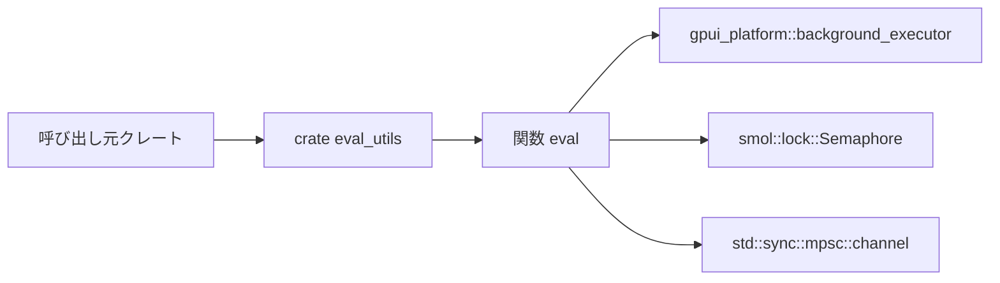

# eval_utils/ ディレクトリ解説

## 1. ざっくり一言

`eval_utils` は、エージェントなどの評価（eval）を多数回実行し、並列実行しながら合格率を集計・検証するための小さなユーティリティクレートです。

---

## 2. このモジュールの役割

### 2.1 概要

- このクレートは **評価関数を何度も実行して合格率を測る** ための仕組みを提供します。
- 評価ごとの結果は `EvalOutput` で表現され、`OutcomeKind` により `Passed` / `Failed` / `Error` に分類されます。
- 呼び出し側は `EvalOutputProcessor` トレイトを実装することで、個々の評価結果をカスタム集計・ログ出力できます。
- 期待する合格率を下回った場合は、失敗内容を出力したうえで `panic!` し、テストなどを失敗として扱えるようになっています。

### 2.2 アーキテクチャ内での位置づけ

`eval_utils` 自体は小さなクレートですが、内部で以下のコンポーネントに依存しています。

- `gpui_platform::background_executor()`  
  非同期タスクを実行するためのバックグラウンド実行基盤。
- `smol::lock::Semaphore`  
  並列実行数（デフォルト 32）を制限するための非同期セマフォ。
- `std::sync::mpsc`  
  各タスクからメインスレッドへ `EvalOutput` を渡すチャネル。

全体の関係を簡略化すると次のようになります。



- 呼び出し元は `eval_utils::eval` を使って評価を開始します。
- `eval` はバックグラウンド実行基盤とセマフォを使って、評価クロージャ `evalf` を並列に実行します。
- 各タスクの結果は `mpsc` チャネル経由でメインスレッド側に集約され、`EvalOutputProcessor` に渡されます。

### 2.3 設計上のポイント

コードから読み取れる主な設計上の特徴は次のとおりです。

- **責務の分離**
  - 「評価を何回どう並列実行するか」… `eval` 関数が担当。
  - 「各評価結果をどう処理・集計するか」… `EvalOutputProcessor` 実装が担当。
  - 「評価 1 回の内容（結果種別・メッセージ・メタデータ）」… `EvalOutput` が担当。
- **状態管理**
  - 並列で生成される `EvalOutput` はチャネルとローカル変数（`failed_evals` / `errored_evals` / カウンタ）で集約されます。
  - 呼び出し側固有の集計状態は `EvalOutputProcessor` の実装内に `&mut self` として保持します。
- **エラーハンドリング方針**
  - 個々の評価は `OutcomeKind::{Passed, Failed, Error}` に分類。
  - 期待合格率を下回った場合は、詳細を標準出力に書いたあとで `panic!`。
  - 結果処理用コールバック（`EvalOutputProcessor::assert`）も `panic!` により追加の失敗条件を表現できます。
- **並列実行**
  - `smol::lock::Semaphore::new(32)` により、同時に最大 32 件の評価が走るようになっています（この値はコード内に固定）。
  - 評価関数 `evalf` には `Send + Sync + 'static` 制約がついており、多スレッド環境でも安全に呼び出せることが前提です。

---

## 3. 主要な機能一覧

このクレートが提供する主な機能を列挙します。

- `eval` 関数:  
  評価クロージャを指定回数並列実行し、合格率を集計・しきい値と比較する。
- `EvalOutput<M>` 構造体:  
  1 回の評価の結果（結果種別・メッセージ・任意メタデータ）を表現する。
- `OutcomeKind` 列挙体:  
  各評価の結果が `Passed` / `Failed` / `Error` のどれかを示す。
- `EvalOutputProcessor` トレイト:  
  各評価結果を逐次処理し、最後に追加検証を行うためのフックを定義する。
- `NoProcessor` 構造体:  
  `EvalOutputProcessor` の「何もしない」実装。処理や追加検証が不要な場合に使う。
- 内部ユーティリティ `report_progress`:  
  標準出力に評価件数と現在の合格率を表示する。

---

## 4. 関数・構造体の解説

### 4.1 型一覧（構造体・列挙体・トレイト）

| 名前 | 種別 | 役割 / 用途 |
|------|------|-------------|
| `OutcomeKind` | 列挙体 | 1 回の評価の結果種別。`Passed` / `Failed` / `Error` の 3 種。 |
| `EvalOutput<M>` | 構造体 | 1 回の評価結果を表現する。結果種別、メッセージ文字列、任意のメタデータを持つ。 |
| `EvalOutputProcessor` | トレイト | 各評価結果を受け取って処理するコールバックと、最後に追加検証を行うためのインターフェース。 |
| `NoProcessor` | 構造体 | `EvalOutputProcessor` の空実装。`process` / `assert` ともに何も行わない。 |

#### `OutcomeKind`

```rust
#[derive(Clone, Debug, Eq, PartialEq)]
pub enum OutcomeKind {
    Passed,
    Failed,
    Error,
}
```

- `Passed`: 評価が期待どおり成功したことを表します。
- `Failed`: 評価は実行できたが、期待していた条件を満たさなかったことを表します。
- `Error`: 評価の実行自体がエラーになった場合（例: 例外発生、タイムアウトなど）を区別するために使われます。

`eval` 関数の内部では、`Failed` と `Error` の両方を「不合格」としてカウントしますが、`Error` はメッセージごとに個数を集計し、まとめて出力されます。

#### `EvalOutput<M>`

```rust
#[derive(Clone, Debug)]
pub struct EvalOutput<M> {
    pub outcome: OutcomeKind,
    pub data: String,
    pub metadata: M,
}
```

- `outcome`: この評価の結果種別（`OutcomeKind`）。
- `data`: 結果の詳細メッセージ。  
  - 成功時: ログや追加情報など任意の文字列。  
  - 失敗時/エラー時: 期待値と実測値の差分、エラーメッセージ等。
- `metadata`: 任意のメタデータ。型パラメータ `M` によって自由に決められます。  
  `EvalOutputProcessor::Metadata` と一致する必要があります。

`metadata` の型 `M` は、`EvalOutputProcessor` トレイトの関連型として定義され、`'static + Send` 制約が付きます。  
そのため、メタデータにはスレッド間で安全に送れる値（`Send`）かつ `'static` なライフタイムを持つ値のみを格納できます（参照は基本的に不可で、必要なら `Arc` などで包みます）。

#### `EvalOutputProcessor` トレイト

```rust
pub trait EvalOutputProcessor {
    type Metadata: 'static + Send;
    fn process(&mut self, output: &EvalOutput<Self::Metadata>);
    fn assert(&mut self);
}
```

- `type Metadata`:  
  評価結果に紐づくメタデータ型。`EvalOutput<Metadata>` と一致させます。
- `fn process(&mut self, output: &EvalOutput<Self::Metadata>)`:  
  各評価結果ごとに呼び出されるフックです。集計やログ出力などを行う場所になります。
- `fn assert(&mut self)`:  
  すべての評価が終わった後に一度だけ呼び出されるフックです。  
  最終的な統計値を元に `panic!` したり、まとめてログ出力したりできます。

このトレイト自体には `Send` / `Sync` 制約はありません。`process` / `assert` は `eval` 関数の受信ループ内（単一スレッド）でのみ呼ばれます。

#### `NoProcessor`

```rust
pub struct NoProcessor;

impl EvalOutputProcessor for NoProcessor {
    type Metadata = ();

    fn process(&mut self, _output: &EvalOutput<Self::Metadata>) {}
    fn assert(&mut self) {}
}
```

- どの評価結果に対しても何も処理を行いません。
- メタデータ型は `()` に固定されます。
- 最終的な追加検証も行いません。

「とりあえず合格率をチェックするだけで十分」という場面で簡単に使えるデフォルト実装です。

---

### 4.2 関数詳細

#### `eval<P>(iterations, expected_pass_ratio, processor, evalf)`

```rust
pub fn eval<P>(
    iterations: usize,
    expected_pass_ratio: f32,
    mut processor: P,
    evalf: impl Fn() -> EvalOutput<P::Metadata> + Send + Sync + 'static,
) where
    P: EvalOutputProcessor,
{ /* ... */ }
```

**概要**

- 評価用クロージャ `evalf` を `iterations` 回実行し、そのうち何回が `OutcomeKind::Passed` になったかを集計します。
- `Passed` 以外（`Failed` と `Error`）は不合格としてカウントされます。
- 実際の合格率が `expected_pass_ratio`（0.0〜1.0 で指定）を下回ると、エラーのまとめと失敗内容を標準出力に出力し、`panic!` します。
- 実行中は進捗と直近の合格率を 1 行で標準出力に表示します。

**引数**

| 引数名 | 型 | 説明 |
|--------|----|------|
| `iterations` | `usize` | 評価を何回実行するか。1 以上を想定しています。 |
| `expected_pass_ratio` | `f32` | 期待する合格率（0.0〜1.0 が一般的）。実測合格率がこれを下回ると `panic!`。 |
| `processor` | `P` | `EvalOutputProcessor` を実装したオブジェクト。各結果の処理と最終検証を担当します。 |
| `evalf` | `impl Fn() -> EvalOutput<P::Metadata> + Send + Sync + 'static` | 1 回分の評価を行う関数またはクロージャ。戻り値で `OutcomeKind` とメッセージ、メタデータを返します。 |

**戻り値**

- 戻り値は `()` です。
- 期待合格率を満たし、かつ `processor.assert()` 内で `panic!` が起きなければ、正常終了します。
- 条件を満たさない場合は `panic!` によりスレッドがパニックします（テストなどでは失敗として扱われます）。

**内部処理の流れ**

1. `evaluated_count`（評価済み件数）と `failed_count`（不合格件数）を 0 で初期化し、進捗を 0 件として表示します。
2. `std::sync::mpsc::channel()` で送信側 `tx` と受信側 `rx` のチャネルを確立します。
3. `gpui_platform::background_executor()` からバックグラウンド実行器を取得し、`smol::lock::Semaphore::new(32)` で同時実行数 32 のセマフォを作成します。
4. `evalf` を `Arc` で包み、**最初の 1 回だけ同期的に呼び出して結果を `tx` に送信**します（コメントに "Warm the cache once" とあるように、キャッシュのウォームアップ目的と考えられます）。
5. 残りの `iterations - 1` 回について、非同期タスクをバックグラウンド実行器に `spawn` します。
   - 各タスクはセマフォを `acquire().await` してから `evalf()` を 1 回実行し、結果を `tx` に送信します。
   - セマフォのおかげで同時に実行される評価の数は最大 32 件に制限されます。
6. すべてのタスク用の `tx` をクローズするために、`drop(tx)` で送信側のオリジナルを破棄します。
7. メインスレッド側で `while let Ok(output) = rx.recv()` ループを回し、チャネルから `EvalOutput` を 1 件ずつ受信します。
   - 各 `output` に対して `processor.process(&output)` を呼び出します。
   - `OutcomeKind` に応じて集計します：
     - `Passed`: 何もしません。
     - `Failed`: `failed_count` をインクリメントし、`failed_evals` ベクタに結果を保存します。
     - `Error`: `failed_count` をインクリメントし、`output.data` をキーとする `errored_evals: HashMap<String, usize>` のカウンタを増やします。
   - `evaluated_count` をインクリメントし、`report_progress` で進捗と合格率を表示します。
8. チャネルがクローズされ（全タスク終了）、ループを抜けたら、実測合格率 `actual_pass_ratio = (iterations - failed_count) as f32 / iterations as f32` を計算し、表示します。
9. `actual_pass_ratio < expected_pass_ratio` の場合：
   - `errored_evals` に溜めたエラーメッセージごとの回数を出力します。
   - `failed_evals` に保存した各失敗ケースの `data` を出力します。
   - その後、`panic!` で実測と期待の合格率を表示してパニックします。
10. 合格率が期待値以上であれば、最後に `processor.assert()` を呼び出し、追加の検証を行います。

**Examples（使用例）**

基本的な使い方として、`NoProcessor` を用いて単純に合格率だけを検証する例です。

```rust
use eval_utils::{eval, EvalOutput, NoProcessor}; // crate eval_utils から必要な型をインポート

fn main() {
    // 評価 1 回分のロジックをクロージャで定義する                         // 戻り値のメタデータ型は NoProcessor の Metadata=() に対応させる
    let evalf = || {
        // ここでは単純な例として、常に「成功」とする                       // 実際にはエージェントの応答検証などを行う
        EvalOutput::passed("OK")                                              // OutcomeKind::Passed, data="OK", metadata=()
    };

    let processor = NoProcessor;                                              // 何もしないプロセッサを使う

    // 100 回評価し、合格率 95% 以上を期待する                               // 期待値を下回ると panic! する
    eval(100, 0.95, processor, evalf);                                        // 評価の実行
}
```

カスタムの `EvalOutputProcessor` を定義して、簡単な統計を出す例です。

```rust
use eval_utils::{eval, EvalOutput, EvalOutputProcessor, OutcomeKind}; // 必要な型をインポート

// 集計用の構造体                                                           // 評価回数と不合格回数をカウントする
#[derive(Default)]
struct StatsProcessor {
    total: usize,                                                            // 評価総数
    failed: usize,                                                           // 不合格（Failed + Error）件数
}

impl EvalOutputProcessor for StatsProcessor {
    type Metadata = ();                                                      // メタデータは使わないので () にする

    fn process(&mut self, output: &EvalOutput<Self::Metadata>) {             // 各評価結果ごとに呼び出される
        self.total += 1;                                                     // 総数をインクリメント
        if !matches!(output.outcome, OutcomeKind::Passed) {                 // Passed 以外は不合格
            self.failed += 1;
        }
    }

    fn assert(&mut self) {                                                   // 全評価終了後に一度だけ呼び出される
        println!("Total: {}, Failed: {}", self.total, self.failed);         // 集計結果を表示する（必要ならここで panic! も可能）
    }
}

fn main() {
    // 評価ロジックを用意する                                                // ここではダミーで「常に成功」とする
    let evalf = || EvalOutput::passed("OK");

    let processor = StatsProcessor::default();                               // 集計用プロセッサを初期化

    eval(1000, 0.99, processor, evalf);                                      // 1000 回評価し、99% 以上の合格率を求める
}
```

**Errors / Panics**

- `actual_pass_ratio < expected_pass_ratio` の場合に必ず `panic!` します。
- `processor.assert()` 内で `panic!` を起こすように実装すると、その条件でも `eval` はパニックします。
- `iterations` が `0` の場合、`iterations - failed_count` の計算や 0 除算の可能性があり、コード上はパニックが発生しうる状態になっています。  
  → 実用上は **`iterations >= 1` を前提として使う** 必要があります。

**Edge cases（エッジケース）**

- `iterations = 0`:
  - コードから見る限り、想定外の入力です。失敗ケースがあると `0 - 1` のような減算で panic! になりえます。
- `expected_pass_ratio` が 0 未満または 1 を超える場合:
  - 特にバリデーションは行われておらず、そのまま比較に使われます。
  - 例: `expected_pass_ratio = 1.5` とした場合、どんなに全件成功でも合格率 (最大 1.0) がしきい値を超えられません。
- `evalf` が非常に重い処理を行う場合:
  - 最大 32 並列で実行されるため、CPU / メモリ / I/O に大きな負荷がかかる可能性があります。
- `OutcomeKind::Error` のメッセージ:
  - `errored_evals` は `output.data` 文字列全体をキーとしてカウントします。
  - メッセージに動的な情報（ID やタイムスタンプ）を含めると、同種エラーでも別々にカウントされます。

**使用上の注意点**

- `iterations` は 1 以上の値を指定することが前提です。
- `evalf` は `Send + Sync + 'static` である必要があり、多スレッドから呼び出されても安全な実装にする必要があります。
- `EvalOutputProcessor` は `eval` によって所有されるため、`eval` 呼び出し後にプロセッサの内部状態を直接参照することはできません。  
  そのため、最終的な集計結果を利用したい場合は、`assert` 内でログ出力や `panic!` を行う設計になります。
- この関数は内部で `println!` により進捗や結果を標準出力に表示します。ログとして扱いたい場合は、必要に応じて `stdout` の扱いを考慮する必要があります。

---

#### `EvalOutput<M>::passed(message)`

```rust
impl<M: Default> EvalOutput<M> {
    pub fn passed(message: impl Into<String>) -> Self { /* ... */ }
}
```

**概要**

- `OutcomeKind::Passed` の `EvalOutput` を簡単に生成するためのヘルパーメソッドです。
- `metadata` には `M::default()` が入ります。

**引数**

| 引数名 | 型 | 説明 |
|--------|----|------|
| `message` | `impl Into<String>` | 成功時のメッセージ文字列。`&str` / `String` などを渡せます。 |

**戻り値**

- `EvalOutput<M>`  
  - `outcome`: `OutcomeKind::Passed`  
  - `data`: `message.into()` の結果  
  - `metadata`: `M::default()`  

**Examples**

```rust
use eval_utils::{EvalOutput, OutcomeKind};                           // EvalOutput と OutcomeKind をインポート

fn example() {
    let output: EvalOutput<()> = EvalOutput::passed("OK");          // メタデータ型 M=() の成功結果を生成

    assert_eq!(output.outcome, OutcomeKind::Passed);                // outcome は Passed
    assert_eq!(output.data, "OK");                                  // data にはメッセージが入る
    assert_eq!(output.metadata, ());                                // metadata は Default=() が入る
}
```

**Edge cases / 使用上の注意点**

- `M: Default` 制約があるため、メタデータ型が `Default` を実装していない場合、このメソッドは利用できません。
- メタデータを個別に設定したい場合は、構造体リテラルで `EvalOutput { ... }` を直接構築する必要があります。

---

#### `EvalOutput<M>::failed(message)`

```rust
impl<M: Default> EvalOutput<M> {
    pub fn failed(message: impl Into<String>) -> Self { /* ... */ }
}
```

**概要**

- `OutcomeKind::Failed` の `EvalOutput` を簡単に生成するためのヘルパーメソッドです。
- `metadata` には `M::default()` が入ります。

**引数 / 戻り値**

`passed` と同様で、`outcome` が `OutcomeKind::Failed` になる点だけが異なります。

**Examples**

```rust
use eval_utils::{EvalOutput, OutcomeKind};                           // 型をインポート

fn example() {
    let output: EvalOutput<()> = EvalOutput::failed("mismatch");    // 失敗結果を生成

    assert_eq!(output.outcome, OutcomeKind::Failed);                // outcome は Failed
    assert_eq!(output.data, "mismatch");                            // data に失敗内容の説明
}
```

**Edge cases / 使用上の注意点**

- 失敗内容の詳細は `data` に自由に入れられますが、`eval` 関数は `Failed` のメッセージをそのまま標準出力に出力します。  
  → 出力量や情報量に注意する必要があります。

---

### 4.3 その他の関数

| 関数名 | 役割（1 行） |
|--------|--------------|
| `report_progress(evaluated_count, failed_count, iterations)` | 標準出力に「Evaluated x/y (z% passed)」形式で進捗を 1 行表示する内部ユーティリティです（非公開）。 |

---

## 5. データフロー

ここでは、`eval` を 1 回呼び出したときの代表的なデータフローを説明します。

1. 呼び出し元が `eval(iterations, expected_pass_ratio, processor, evalf)` を呼ぶ。
2. `eval` はまず `evalf` を 1 回同期実行し、その結果をチャネルに送信する。
3. 残りの回数分、バックグラウンド実行器上で非同期タスクを起動し、それぞれが `evalf` を実行して結果をチャネルに送信する。
4. メインスレッドはチャネルから `EvalOutput` を受信しつつ、`processor.process` で処理し、合格率を集計する。
5. 全件処理し終えたら実測合格率を確認し、しきい値を満たしていれば `processor.assert` を実行して終了する。

これをシーケンス図で表すと次のようになります。

```mermaid
sequenceDiagram
    participant Caller as 呼び出し元コード
    participant EvalFn as eval_utils::eval
    participant Exec as バックグラウンド実行基盤
    participant Evalf as evalf クロージャ
    participant Chan as MPSCチャネル
    participant Proc as EvalOutputProcessor

    Caller->>EvalFn: eval(iterations, expected_pass_ratio, processor, evalf)
    EvalFn->>Evalf: 最初の evalf() 呼び出し
    Evalf-->>EvalFn: EvalOutput
    EvalFn->>Chan: send(output)

    loop 残りの反復 (iterations - 1 回)
        EvalFn->>Exec: spawn(async { acquire semaphore; evalf(); send(output) })
        Exec->>Evalf: evalf()
        Evalf-->>Exec: EvalOutput
        Exec->>Chan: send(output)
    end

    loop 各結果を処理
        Chan-->>EvalFn: recv(EvalOutput)
        EvalFn->>Proc: process(&output)
        EvalFn->>EvalFn: 失敗数・進捗の更新
    end

    EvalFn->>Proc: assert()
    EvalFn-->>Caller: 正常終了 または panic
```

- `EvalOutput` はタスクからチャネル経由で順不同に到着しますが、集計と `process` は単一スレッドで逐次処理されます。
- 呼び出し元は、`eval` の戻り（または panic）によって評価全体の成否を知ることができます。

---

## 6. 使い方（How to Use）

### 6.1 基本的な使用方法

最も単純な使い方は、`NoProcessor` と `EvalOutput::passed` / `failed` を組み合わせて、合格率のみを検証する使い方です。

```rust
use eval_utils::{eval, EvalOutput, NoProcessor};           // eval とヘルパー型をインポート

fn main() {
    // 評価 1 回分のロジックを定義する                                    // ここでは「常に成功」とする単純な例
    let evalf = || {
        EvalOutput::passed("OK")                            // OutcomeKind::Passed の EvalOutput を返す
    };

    // 結果処理を行わないプロセッサ                                          // 単に合格率だけを見たい場合に使う
    let processor = NoProcessor;

    // 100 回実行し、合格率 95% 以上を求める                                  // 合格率が 95% 未満なら panic! する
    eval(100, 0.95, processor, evalf);
}
```

### 6.2 よくある使用パターン

#### パターン1: 独自のプロセッサで統計を集計する

評価結果を独自に集計したい場合は、`EvalOutputProcessor` を実装します。

```rust
use eval_utils::{eval, EvalOutput, EvalOutputProcessor, OutcomeKind};

// メタデータを使わない簡単な集計プロセッサ                               // Passed/Failed/Error の件数をカウントする
#[derive(Default)]
struct CountingProcessor {
    passed: usize,
    failed: usize,
    errored: usize,
}

impl EvalOutputProcessor for CountingProcessor {
    type Metadata = ();                                                     // メタデータは未使用なので ()

    fn process(&mut self, output: &EvalOutput<Self::Metadata>) {
        match output.outcome {
            OutcomeKind::Passed => self.passed += 1,                        // 成功件数
            OutcomeKind::Failed => self.failed += 1,                        // 失敗件数
            OutcomeKind::Error => self.errored += 1,                        // エラー件数
        }
    }

    fn assert(&mut self) {
        println!(
            "passed={}, failed={}, errored={}",
            self.passed, self.failed, self.errored
        );                                                                  // 最終統計を表示
        // 必要ならここで追加条件をチェックして panic! も可能
    }
}

fn main() {
    let evalf = || {
        // 実際の評価ロジック                                                // ここではダミーで常に成功とする
        EvalOutput::passed("OK")
    };

    let processor = CountingProcessor::default();                           // 集計プロセッサを作成
    eval(1000, 0.99, processor, evalf);                                     // 合格率 99% を期待して実行
}
```

#### パターン2: `Error` と `Failed` を使い分ける

- 入力や環境に依存した一時的なエラー（タイムアウトなど）は `OutcomeKind::Error`。
- ロジック上の「基準未達」は `OutcomeKind::Failed`。

のように使い分けることで、`eval` が出力するエラーレポートの見通しを良くできます。

```rust
use eval_utils::{EvalOutput, OutcomeKind};

// 例: Error を手動で構築する                                              // EvalOutput::passed / failed には Error 用のヘルパーはない
fn make_error_output(msg: &str) -> EvalOutput<()> {
    EvalOutput {
        outcome: OutcomeKind::Error,                                       // 結果種別は Error
        data: msg.to_string(),                                             // エラーメッセージ
        metadata: (),                                                      // メタデータは ()
    }
}
```

### 6.3 使用上の注意点

- **`iterations` は 1 以上を前提としている**  
  0 を渡すと、内部の計算過程で panic! となる可能性があります。
- **`evalf` は多スレッドから呼び出される**  
  `Send + Sync + 'static` 制約があるため、クロージャ内で共有ミュータブル状態を扱う場合は `Mutex` や `Arc` などを用いてスレッド安全にする必要があります。
- **`Metadata` は `'static + Send` 必須**  
  `EvalOutputProcessor::Metadata` はチャネルを介してスレッド間を移動するため、
  - 参照を直接持つことはできません（必要なら `Arc<T>` などを使う）。
  - ファイルディスクリプタなど `Send` でない型はそのままでは使えません。
- **プロセッサの状態は `eval` 呼び出し後に直接取り出せない**  
  `eval` は `processor` を所有し、戻り値として返しません。最終結果を外部から参照したい場合は、
  - `processor.assert()` 内でログ出力や `panic!` を行う、
  - もしくは `Arc<Mutex<...>>` といった共有オブジェクトを `processor` が内部的に参照する、といった設計が必要になります。
- **標準出力への出力が前提**  
  進捗や失敗内容は `println!` を通じて `stdout` に直接出力されます。テスト環境や CI 環境では、この出力を前提としたログ収集を行うことになります。
- **並列度は固定値（32）**  
  同時に最大 32 件の評価が実行される実装になっており、外部からは変更できません。  
  評価処理が重い場合は、リソース使用量を考慮する必要があります。

---

## 7. 関連ファイル

| パス | 役割 / 関係 |
|------|------------|
| `eval_utils/Cargo.toml` | クレート名 `eval_utils`、版数、ライセンス、および依存クレート（`gpui_platform`・`serde`・`smol`）を定義するマニフェストです。`serde` など一部の依存は、このファイルでは宣言されているものの、現時点のソースでは直接利用されていません。 |
| `eval_utils/README.md` | 「Utilities for evals of agents.」とだけ記載された簡潔な README で、このクレートがエージェント評価用ユーティリティであることを示しています。 |
| `eval_utils/src/eval_utils.rs` | 本レポートで解説した主要コードが含まれるファイルです。`eval` 関数、`EvalOutput`、`OutcomeKind`、`EvalOutputProcessor`、`NoProcessor` など、クレートの公開 API のほとんどがここに定義されています。 |
