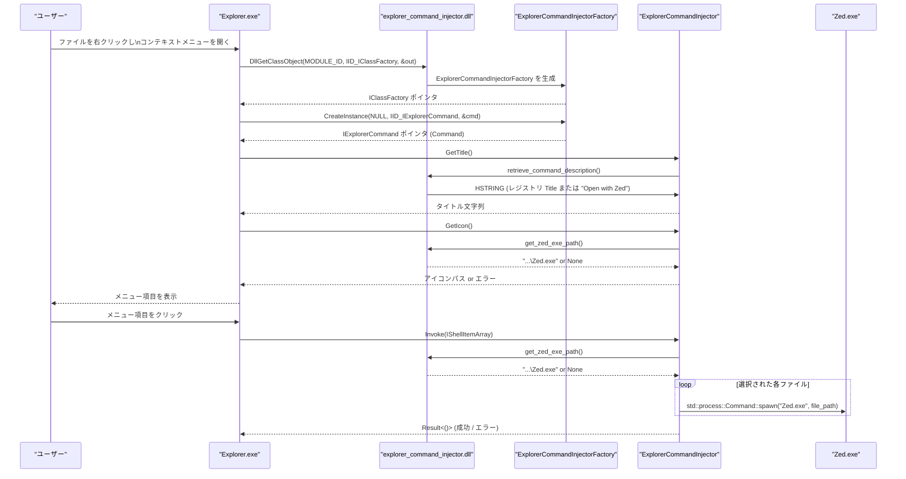

# explorer_command_injector/ コード解説

## 1. ざっくり一言

- Windows Explorer のコンテキストメニューに「Zed で開く」項目を追加し、選択したファイルを `Zed.exe` で起動するための **Windows シェル拡張 DLL（COM サーバー）** です。

---

## 2. このモジュールの役割

### 2.1 概要

- このクレートは Windows の **IExplorerCommand** インターフェイスを実装し、エクスプローラーの右クリックメニューに Zed 用の項目を提供します。
- メニューのタイトル文字列は Windows レジストリから読み込み、見つからない場合は `"Open with Zed"` にフォールバックします。
- メニューのアイコンと起動コマンドとして使用する `Zed.exe` のパスは、自身（DLL）の配置場所から推測して求めます。
- COM のクラスファクトリ（IClassFactory）と DLL エントリポイント（`DllMain`, `DllGetClassObject`）も定義し、Windows から直接呼び出される形になっています。

### 2.2 アーキテクチャ内での位置づけ

この DLL は、Windows Explorer と Zed 本体の間に入る「ブリッジ」として動作します。

```mermaid
graph TD
    Explorer["Windows Explorer<br/>(Shell)"]
    Dll["explorer_command_injector.dll"]
    IExplorerCmd["IExplorerCommand 実装<br/>ExplorerCommandInjector"]
    IClassFactory["IClassFactory 実装<br/>ExplorerCommandInjectorFactory"]
    Registry["Windows レジストリ<br/>HKCU\\Software\\Classes\\..."]
    ZedExe["Zed.exe<br/>(エディタ本体)"]

    Explorer -->|COM: CLSID = MODULE_ID<br/>DllGetClassObject| Dll
    Dll --> IClassFactory
    IClassFactory --> IExplorerCmd

    Explorer -->|GetTitle / GetIcon| IExplorerCmd
    IExplorerCmd -->|Title 取得| Registry
    IExplorerCmd -->|Zed.exe のパス取得| Dll

    Explorer -->|Invoke(選択ファイル群)| IExplorerCmd
    IExplorerCmd -->|std::process::Command::spawn| ZedExe
```

### 2.3 設計上のポイント

- **Windows 専用**
  - クレート全体が `#![cfg(target_os = "windows")]` でガードされており、Windows 以外ではコンパイルされません。
- **COM サーバー構造**
  - DLL エントリポイントとして `DllMain` と `DllGetClassObject` をエクスポートし、Windows の COM ローダーから直接呼ばれる前提の設計です。
  - `#[implement(IExplorerCommand)]` と `#[implement(IClassFactory)]` を利用し、`windows` クレートのマクロで COM 実装を生成しています。
- **状態管理**
  - `DLL_INSTANCE: HINSTANCE` というグローバルな静的変数で、自身の DLL ハンドルを保持し、インストールフォルダ推測に利用します。
- **ビルドフレーバー別の識別子**
  - `stable` / `preview` / `nightly` の各 feature に応じて `MODULE_ID`（COM CLSID）とレジストリパスを切り替える設計になっています（デフォルトは `nightly`）。
- **エラーハンドリング方針**
  - COM メソッドでは、失敗時に適切な `HRESULT`（`E_FAIL`, `E_INVALIDARG`, `E_NOTIMPL` など）を返します。
  - Zed のパスやレジストリ読み取りに失敗した場合でも、極力クラッシュせず「何も起きない」か「デフォルト文字列で表示する」挙動になります。

---

## 3. 主要な機能一覧

- **Explorer コマンドの実装**: `ExplorerCommandInjector` による `IExplorerCommand` 実装（タイトル・アイコン・有効状態・Invoke 処理）。
- **COM クラスファクトリ**: `ExplorerCommandInjectorFactory` による `IClassFactory` 実装と、`DllGetClassObject` エントリポイント。
- **DLL エントリポイント管理**: `DllMain` による DLL ロード時の初期化（`DLL_INSTANCE` の保存）。
- **Zed インストールフォルダの推測**: `get_zed_install_folder` / `get_zed_exe_path` による `Zed.exe` のパス解決。
- **コンテキストメニュータイトルの取得**: `retrieve_command_description` による Windows レジストリからのタイトル文字列読み込み。

---

## 4. 関数・構造体の解説

### 4.1 主な構造体・定数

| 名前 | 種別 | 役割 / 用途 |
|------|------|-------------|
| `DLL_INSTANCE` | `static mut HINSTANCE` | DLL のインスタンスハンドルを保持し、自身のパス解決に使用します。`DllMain` で設定されます。 |
| `ExplorerCommandInjector` | 構造体 | `IExplorerCommand` を実装するための空構造体です。実際の実装はマクロにより `ExplorerCommandInjector_Impl` として生成されます。 |
| `ExplorerCommandInjectorFactory` | 構造体 | `IClassFactory` を実装するクラスファクトリです。実装は `ExplorerCommandInjectorFactory_Impl` に生成されます。 |
| `MODULE_ID` | `const GUID` | COM クラスの CLSID に相当する GUID です。ビルド時の feature によって値が変わります。 |

補足:

- `ExplorerCommandInjector_Impl`, `ExplorerCommandInjectorFactory_Impl` は `#[implement(...)]` マクロにより自動生成される内部的な実装型です。
- feature の組み合わせごとに異なる `MODULE_ID` / `REG_PATH` が定義されており、通常は `stable` / `preview` / `nightly` のいずれか一つだけを有効にする前提になっています。

### 4.2 重要な関数・メソッド詳細（最大 7 件）

#### `DllMain(hinstdll: HINSTANCE, fdwreason: u32, _lpvreserved: *mut c_void) -> bool`

**概要**

- この DLL のエントリポイントで、Windows により DLL のロード／アンロードなどのタイミングで呼び出されます。
- `DLL_PROCESS_ATTACH` 時に DLL のインスタンスハンドルを `DLL_INSTANCE` に保存します。

**引数**

| 引数名 | 型 | 説明 |
|--------|----|------|
| `hinstdll` | `HINSTANCE` | この DLL のインスタンスハンドルです。 |
| `fdwreason` | `u32` | 呼び出し理由（`DLL_PROCESS_ATTACH` など）を表す値です。 |
| `_lpvreserved` | `*mut c_void` | 予約ポインタ（本コードでは未使用）です。 |

**戻り値**

- `bool`: 常に `true` を返し、DLL のロードを許可します。

**内部処理の流れ**

1. `fdwreason` が `DLL_PROCESS_ATTACH` かどうかを判定します。
2. `DLL_PROCESS_ATTACH` の場合、`DLL_INSTANCE` に `hinstdll` を保存します。
3. 常に `true` を返します。

**Edge cases（エッジケース）**

- `DLL_PROCESS_ATTACH` 以外（`DLL_THREAD_ATTACH` など）の理由では何もしません。
- `DLL_INSTANCE` は `static mut` のため、スレッドセーフではありませんが、通常 `DllMain` はプロセス初期化時に 1 回だけ呼ばれる想定です。

**使用上の注意点**

- この関数は Windows ローダーからのみ呼ばれることを想定しており、アプリケーションコードから呼ぶことは想定されていません。
- `DLL_INSTANCE` に依存する関数（`get_zed_install_folder` など）は、`DllMain` が実行されている前提で動作します。

---

#### `DllGetClassObject(class_id: *const GUID, iid: *const GUID, out: *mut *mut c_void) -> HRESULT`

**概要**

- COM の標準エントリポイントであり、指定された CLSID (`class_id`) に対応するクラスファクトリ（`IClassFactory`）を返します。
- Windows はこの関数を通じて `ExplorerCommandInjectorFactory` を取得し、その後 `CreateInstance` を呼び出して `IExplorerCommand` オブジェクトを作ります。

**引数**

| 引数名 | 型 | 説明 |
|--------|----|------|
| `class_id` | `*const GUID` | 要求されている COM クラスの CLSID へのポインタです。 |
| `iid` | `*const GUID` | 取得したいインターフェイスの IID（通常は `IID_IClassFactory`）へのポインタです。 |
| `out` | `*mut *mut c_void` | 結果として返すインターフェイス ポインタを書き込む先です。 |

**戻り値**

- `HRESULT`:
  - 正常時: `instance.query(iid, out)` の戻り値（通常は `S_OK`）。
  - `class_id` が本 DLL の `MODULE_ID` と異なる場合: `CLASS_E_CLASSNOTAVAILABLE`。
  - 引数が `NULL` の場合: `E_INVALIDARG`。

**内部処理の流れ**

1. `out`, `class_id`, `iid` のポインタが `NULL` であれば `E_INVALIDARG` を返します。
2. `*out` をいったん `NULL` に初期化します。
3. `*class_id` を値として読み出し、`MODULE_ID` と比較します。
4. `class_id == MODULE_ID` の場合:
   - `ExplorerCommandInjectorFactory {}` から `IClassFactory` を生成します。
   - `instance.query(iid, out)` を呼び出し、要求されたインターフェイスでクエリします。
   - その `HRESULT` をそのまま返します。
5. 一致しない場合は `CLASS_E_CLASSNOTAVAILABLE` を返します。

**Edge cases**

- 要求 CLSID が異なるときは、何も生成せず `CLASS_E_CLASSNOTAVAILABLE` を返します。
- `query` が失敗した場合（例: IID が `IClassFactory` でないなど）は、その HRESULT がそのまま呼び出し元に返ります。

**使用上の注意点**

- COM クラスの登録側（レジストリなど）で、使用する CLSID と `MODULE_ID` を一致させる必要があります（このチャンクには登録処理は含まれていません）。
- `out` は必ず一度 `NULL` にクリアされるため、中途半端なポインタが残ることはありません。

---

#### `ExplorerCommandInjector_Impl::GetTitle(&self, _: Ref<IShellItemArray>) -> Result<PWSTR>`

**概要**

- コンテキストメニューに表示するタイトル文字列を返します。
- レジストリからタイトル文字列を取得し、失敗した場合は `"Open with Zed"` にフォールバックします。

**引数**

| 引数名 | 型 | 説明 |
|--------|----|------|
| `_` | `Ref<IShellItemArray>` | 選択されたアイテムの配列ですが、この実装では使用していません。 |

**戻り値**

- `Result<PWSTR>`:
  - 正常時: `SHStrDupW` により複製された UNICODE 文字列へのポインタ（シェルが解放する責任を持ちます）。
  - 失敗時: `windows_core::Error` として、`HRESULT` に相当するエラーを返します。

**内部処理の流れ**

1. `retrieve_command_description()` を呼び出して `HSTRING` を取得します。
2. エラーの場合は `"Open with Zed"` というリテラルの `HSTRING` にフォールバックします（`unwrap_or`）。
3. `SHStrDupW` を使い、`HSTRING` の内容をシェル管理のバッファに複製します。
4. 得られたポインタを `Result` として返します。

**Edge cases**

- レジストリキーが存在しない、`Title` 値が存在しないなどで `retrieve_command_description` が失敗した場合でも、必ず `"Open with Zed"` が返されます。
- `SHStrDupW` が失敗した場合はエラーになります（この場合、メニューのタイトル取得に失敗します）。

**使用上の注意点**

- タイトル文字列をカスタマイズしたい場合は、コードではなくレジストリ側の `Title` 値を変更する前提の設計です。

---

#### `ExplorerCommandInjector_Impl::GetIcon(&self, _: Ref<IShellItemArray>) -> Result<PWSTR>`

**概要**

- メニュー項目に表示するアイコンの場所（`Zed.exe` のパス）をシェルに返します。
- 実際には `Zed.exe` のパスを文字列として返し、Windows シェルがその実行ファイルからアイコンを取得します。

**引数**

| 引数名 | 型 | 説明 |
|--------|----|------|
| `_` | `Ref<IShellItemArray>` | 選択されたアイテム配列ですが、この実装では使用していません。 |

**戻り値**

- `Result<PWSTR>`:
  - 正常時: `Zed.exe` のフルパス文字列を複製したポインタ。
  - `get_zed_exe_path` でパスが取得できない場合: `Err(E_FAIL)`。

**内部処理の流れ**

1. `get_zed_exe_path()` を呼び出して `Zed.exe` のパス文字列を取得します。
2. `None` の場合は `Err(E_FAIL.into())` を返します。
3. 取得できた場合は `HSTRING::from(zed_exe)` に変換します。
4. `SHStrDupW` で複製し、そのポインタを返します。

**Edge cases**

- DLL の配置が想定と異なり `get_zed_install_folder` が `None` を返す場合、この関数は常に `E_FAIL` で失敗し、アイコンが表示されません。
- `Zed.exe` が存在しなかった場合でも、ここでは存在確認は行っておらず、パス文字列だけを返します。

**使用上の注意点**

- `get_zed_exe_path` は DLL の配置場所からパスを推測するため、DLL を「想定されたフォルダ構造」に置く前提があります（詳細は後述）。

---

#### `ExplorerCommandInjector_Impl::Invoke(&self, psiitemarray: Ref<IShellItemArray>, _: Ref<IBindCtx>) -> Result<()>`

**概要**

- ユーザーがコンテキストメニューの項目をクリックしたときに呼ばれ、選択されたファイルごとに `Zed.exe` を起動します。

**引数**

| 引数名 | 型 | 説明 |
|--------|----|------|
| `psiitemarray` | `Ref<IShellItemArray>` | 選択されたアイテム群（ファイルやフォルダ）の配列です。 |
| `_` | `Ref<IBindCtx>` | バインドコンテキストですが、この実装では使用していません。 |

**戻り値**

- `Result<()>`:
  - 正常時: `Ok(())`。
  - 各種失敗時: `E_INVALIDARG` などの `HRESULT` に対応したエラー。

**内部処理の流れ**

1. `psiitemarray.ok()?` を呼び出し、有効な `IShellItemArray` インスタンスを取得します（無効ならエラー）。
2. `get_zed_exe_path()` を呼び出し、`Zed.exe` のパスを取得します。`None` の場合は何もせず `Ok(())` を返します（クリックしても何も起きない）。
3. `items.GetCount()?` で選択アイテム数を取得します。
4. `0..count` でループし、各インデックスに対して:
   - `items.GetItemAt(idx)?` で `IShellItem` を取得。
   - `item.GetDisplayName(SIGDN_FILESYSPATH)?` でファイルシステム上のパスを取得し、`.to_string()?` で Rust の `String` に変換。
   - `std::process::Command::new(&zed_exe).arg(&item_path).spawn()` で `Zed.exe` を非同期起動。
   - `spawn` が失敗した場合は `E_INVALIDARG` にマッピングしてエラーを返します。
5. すべてのアイテムについて起動を試みたら `Ok(())` を返します。

**Edge cases**

- `get_zed_exe_path` が `None` の場合: 何も実行せず、エラーも返さず終了します。
- 選択ファイル数が 0 の場合: 何も起動せず、そのまま `Ok(())` になります。
- `GetDisplayName(...).to_string()` が失敗した場合（パスが Unicode として表現できないなど）は、その時点でエラーとなり、それ以降のファイルは処理されません。
- `spawn` が失敗した場合（実行ファイルが見つからないなど）も、最初の失敗でエラー終了します。

**使用上の注意点**

- 各ファイルごとに `Command::spawn()` を呼ぶため、複数ファイル選択時は複数プロセスが起動されます（Zed 側での多重起動の扱いはこのコードからは分かりません）。
- `spawn` は非同期起動であり、起動した `Zed.exe` が終了するのを待ちません。

---

#### `get_zed_install_folder() -> Option<PathBuf>`

**概要**

- この DLL 自身のファイルパスから Zed のインストールフォルダを推測して返します。

**戻り値**

- `Option<PathBuf>`:
  - 正常に推測できた場合: Zed インストールフォルダと思われるパス。
  - 失敗した場合: `None`。

**内部処理の流れ**

1. `MAX_PATH` サイズの `Vec<u16>` バッファを作成します。
2. `GetModuleFileNameW(Some(DLL_INSTANCE.into()), &mut buf)` を呼び出し、この DLL のパスを UTF-16 で取得します。
3. `GetLastError()` が `ERROR_INSUFFICIENT_BUFFER` の間は、バッファサイズを倍に拡張して再試行します。
4. `u_strlen(buf.as_ptr())` で実際の文字列長を取得します。
5. `OsString::from_wide(&buf[..len])` で UTF-16 から `OsString` に変換し、`into_string().ok()?` で `String` に変換します（失敗時は `None`）。
6. その `String` を `PathBuf` に変換し、`parent()?.parent()?` で 2 階層上のディレクトリを取得します。
7. 得られたパスを `Some(...)` で返します。

**Edge cases**

- DLL のパスが Unicode として表現できない場合: `into_string().ok()?` が `None` になり `None` を返します。
- DLL のパスに親ディレクトリが 2 階層存在しない場合: `parent()?.parent()?` のどこかで `None` になり `None` を返します。
- `GetModuleFileNameW` の呼び出し自体が失敗した場合: 長さが 0 となり、最終的に `parent()` で `None` になる可能性があります。

**使用上の注意点**

- DLL が「Zed.exe の 2 階層下」に配置されているという前提に依存しています（例えば `.../Zed/xxx/explorer_command_injector.dll` のような配置）。
- DLL の配置場所を変更すると `get_zed_exe_path` が `None` を返すようになり、アイコンや起動が機能しなくなります。

---

#### `retrieve_command_description() -> Result<HSTRING>`

**概要**

- コンテキストメニューのタイトル文字列を Windows レジストリから読み込み、`HSTRING` として返します。

**戻り値**

- `Result<HSTRING>`:
  - 正常時: `REG_PATH` にある `Title` 値の文字列。
  - エラー時: `windows_core::Error`。

**内部処理の流れ**

1. feature の組み合わせに応じて `REG_PATH` をコンパイル時に決定します。
   - `stable` のみ: `"Software\\Classes\\ZedEditorContextMenu"`。
   - `preview` のみ: `"Software\\Classes\\ZedEditorPreviewContextMenu"`。
   - `nightly` のみ: `"Software\\Classes\\ZedEditorNightlyContextMenu"`。
   - 全部有効（特殊ケース）: `"Software\\Classes\\ZedEditorClippyContextMenu"`。
2. `windows_registry::CURRENT_USER.open(REG_PATH)?` で、`HKEY_CURRENT_USER` 配下の該当キーを開きます。
3. `key.get_hstring("Title")` で `Title` という名前の値を `HSTRING` として取得します。
4. いずれかの段階で問題があれば `Err(...)` を返します。

**Edge cases**

- レジストリキーが存在しない、またはアクセス権がない場合: `open` がエラーになります。
- `Title` 値が存在しない、文字列型でないなどの場合: `get_hstring` がエラーになります。
- これらのエラーは `GetTitle` 側でキャッチされ、最終的に `"Open with Zed"` へのフォールバックに使われます。

**使用上の注意点**

- 本関数は `GetTitle` の内部でのみ使用され、単体で外部から呼ばれることは想定されていません。
- レジストリのパスは feature によって変わるため、複数版（stable/preview/nightly）を共存させる場合は、それぞれ別のキーに設定できるようになっています。

---

### 4.3 その他の関数・メソッド一覧

| 関数 / メソッド名 | 役割（1 行） |
|-------------------|--------------|
| `ExplorerCommandInjector_Impl::GetToolTip` | `E_NOTIMPL` を返し、ツールチップは提供しません。 |
| `ExplorerCommandInjector_Impl::GetCanonicalName` | ゼロ初期化された `GUID` を返します（特別な識別名は持たせていません）。 |
| `ExplorerCommandInjector_Impl::GetState` | 常に `ECS_ENABLED` を返し、メニュー項目を常に有効化します。 |
| `ExplorerCommandInjector_Impl::GetFlags` | `ECF_DEFAULT` を返し、標準的な Explorer コマンドフラグを使用します。 |
| `ExplorerCommandInjector_Impl::EnumSubCommands` | `E_NOTIMPL` を返し、サブコマンド（階層メニュー）は提供しません。 |
| `ExplorerCommandInjectorFactory_Impl::CreateInstance` | 外部集約 (`punkouter`) がない場合に `ExplorerCommandInjector` の COM オブジェクトを生成し、`QueryInterface` で要求インターフェイスを返します。 |
| `ExplorerCommandInjectorFactory_Impl::LockServer` | 何も行わず、常に `Ok(())` を返します（サーバーロックは行いません）。 |
| `get_zed_exe_path` | `get_zed_install_folder` の返すパスに `"Zed.exe"` を連結し、`String` として返します。 |

---

## 5. データフロー

ここでは、ユーザーが Explorer のコンテキストメニューから「Zed で開く」（仮）を選択したときの代表的な処理フローを示します。



要点:

- CLSID（`MODULE_ID`）に基づいてクラスファクトリが取得され、その後 `IExplorerCommand` 実装が生成されます。
- 表示時には `GetTitle` と `GetIcon` が呼ばれ、レジストリと DLL の位置から情報を取得します。
- 実行時 (`Invoke`) には、選択されたファイルごとに `Zed.exe` を起動します。

---

## 6. 使い方（How to Use）

### 6.1 基本的な使用方法

このクレートは **通常のライブラリとしてではなく、Windows にロードされる DLL（COM サーバー）として使用される** 前提です。Rust コードから直接関数を呼び出す想定にはなっていません。

典型的な利用手順（コードから読み取れる範囲）は次の通りです。

1. **Windows 向けに DLL をビルドする**

```bash
# 例: nightly ビルド（デフォルト feature）
cargo build --release -p explorer_command_injector
# 例: stable 版 DLL をビルドする場合
cargo build --release -p explorer_command_injector --no-default-features --features stable
```

2. **ビルド済み DLL を Zed のインストールフォルダ配下に配置する**

- `get_zed_install_folder` は「DLL の 2 つ上のディレクトリ」を Zed インストールフォルダとみなすため、その前提を満たす位置に配置する必要があります。
- 正確なフォルダ構成はこのチャンクからは分かりませんが、「DLL の 2 階層上に `Zed.exe` が存在する」構造が必要です。

3. **Windows に COM サーバーとして登録する**

- `MODULE_ID` を CLSID として COM 登録する必要があります。
- 具体的なレジストリ登録内容（CLSID キー、InprocServer32 など）はこのチャンクには含まれていません。

4. **レジストリにタイトル文字列を用意する（任意）**

- `retrieve_command_description` が参照するパスは feature によって異なります（`HKCU\Software\Classes\ZedEditorContextMenu` など）。
- 各キーの `Title` 値が存在すれば、その文字列がコンテキストメニューの表示に使われます。存在しなくても `"Open with Zed"` にフォールバックします。

### 6.2 よくある使用パターン

**1. ビルドフレーバーごとの DLL 作成**

- `stable` / `preview` / `nightly` それぞれ別の `MODULE_ID` と `REG_PATH` を持ちます。
- 例えば、`stable` 版 DLL と `nightly` 版 DLL を別々に登録しておけば、それぞれ異なるメニュータイトルや CLSID を持たせることができます。

```bash
# stable 版
cargo build --release -p explorer_command_injector --no-default-features --features stable

# preview 版
cargo build --release -p explorer_command_injector --no-default-features --features preview

# nightly 版（デフォルト）
cargo build --release -p explorer_command_injector
```

**2. 複数ファイル選択時の起動**

- `Invoke` は選択されたファイルをすべて列挙し、各ファイルごとに `Zed.exe` を `spawn` します。
- Zed 側で「既存プロセスにファイルを渡す」ような仕組みがあれば、複数ファイルを連続で開くことができます。

**3. モジュール内関数のテスト的利用（イメージ）**

`get_zed_exe_path` や `retrieve_command_description` は private 関数ですが、同一ファイル内のテストモジュールから利用することは可能です。例として、「現在解決される Zed.exe のパス」を確認するテストコードイメージを示します。

```rust
// explorer_command_injector.rs 内にテストモジュールを追加する例
#[cfg(test)]                                                   // テスト時のみコンパイルされるモジュール
mod tests {                                                    // テスト用モジュール定義
    use super::*;                                              // 親モジュールのシンボルをインポート

    #[test]                                                    // 単体テストとしてマーク
    fn show_zed_exe_path_for_debug() {                         // Zed.exe のパスを表示するテスト
        // 通常は DllMain が DLL_INSTANCE をセットしますが、                        // DllMain が呼ばれていない環境では
        // テスト環境では未設定のままの可能性があります。                          // DLL_INSTANCE が無効なままの場合があります
        if let Some(path) = get_zed_exe_path() {               // Zed.exe のパスを取得できた場合のみ処理する
            println!("Zed.exe path: {path}");                  // パスを標準出力に表示する
        } else {                                               // パスが取得できなかった場合
            println!("Zed.exe path could not be resolved");    // 解決できなかった旨を表示する
        }
    }
}
```

※ 上記はあくまで「内部関数の挙動確認用」のイメージであり、実運用では Windows から COM 経由で呼び出される形になります。

### 6.3 使用上の注意点

- **Windows 以外では使用不可**
  - `#![cfg(target_os = "windows")]` のため、他 OS ではクレート自体がビルド対象になりません。
- **DLL の配置前提**
  - `get_zed_install_folder` が「DLL の 2 階層上」を Zed インストールフォルダとみなすため、その前提が崩れると `Zed.exe` のパス解決に失敗し、アイコンが表示されなかったり、メニューを押しても何も起きなくなります。
- **DLL_INSTANCE への依存**
  - `get_zed_install_folder` とそれに依存する関数は、`DllMain` が `DLL_PROCESS_ATTACH` で `DLL_INSTANCE` をセットしていることが前提です。テストや特殊なロード方法でこの前提が崩れると、パス解決に失敗します。
- **レジストリキーの存在**
  - `retrieve_command_description` はレジストリキーと `Title` 値を期待していますが、存在しなくても `"Open with Zed"` にフォールバックするため、致命的なエラーにはなりません。
- **多重起動**
  - 選択されたファイルごとに `std::process::Command::spawn` を呼んでいるため、ファイル数が多い場合には多くの Zed プロセス（あるいは Zed のインスタンス）が起動される可能性があります。

---

## 7. 関連ファイル

| パス | 役割 / 関係 |
|------|------------|
| `explorer_command_injector/Cargo.toml` | クレート名、ライブラリ種別（`cdylib`）、feature（`stable` / `preview` / `nightly`）や Windows 依存クレート（`windows`, `windows-core`, `windows-registry`）の設定を定義します。 |
| `explorer_command_injector/src/explorer_command_injector.rs` | 本ドキュメントで解説した COM 実装（`DllMain`, `DllGetClassObject`, `ExplorerCommandInjector`, `ExplorerCommandInjectorFactory` など）の本体コードです。 |
| `Zed.exe`（インストールフォルダ内の実行ファイル） | 本クレートから `std::process::Command::new` で起動されるエディタ本体です。パスは `get_zed_exe_path` により DLL の配置場所から推測されます（このバイナリ自体はこのチャンクには含まれていません）。 |
| `HKCU\Software\Classes\ZedEditor...`（レジストリキー） | `retrieve_command_description` が参照するコンテキストメニュー設定用のレジストリキーで、`Title` 値にメニュー表示名が格納されます。キー名はビルド時の feature により切り替わります。 |

このディレクトリ単体では、COM 登録処理や Zed 本体のインストール構成は含まれていませんが、上記のファイル・キーと連携することで、Windows Explorer のコンテキストメニュー統合が実現されます。
