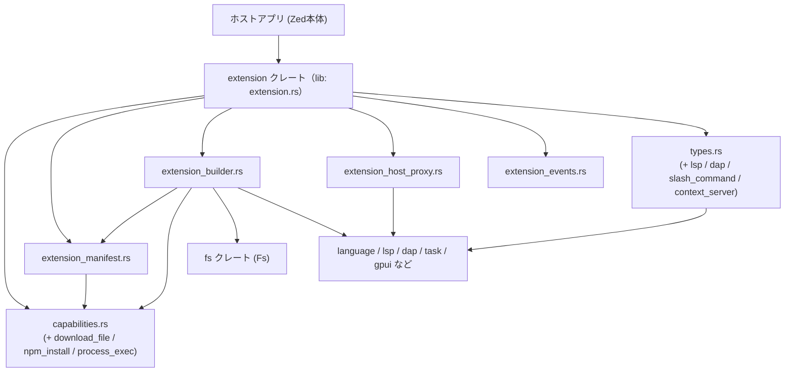
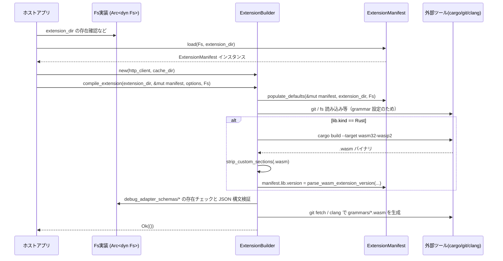

extension/ ディレクトリ解説
===========================

## 1. ざっくり一言

Zed の「拡張機能」を扱うための中核クレートで、拡張のマニフェストの読み込み・ビルド（Wasm 化）・実行権限チェック・ホスト側とのブリッジ（テーマ／言語／LSP／デバッガ／エージェント／スニペットなど）をまとめて提供するモジュール群です。

---

## 2. このモジュールの役割

### 2.1 概要

- このクレートは **Zed 拡張のライフサイクル**（定義 → ビルド → 読み込み → 実行時連携）を扱うために存在し、
- 具体的には次のような機能を提供します。
  - `extension.toml` / 旧 `extension.json` マニフェストの読み込み・互換変換
  - Rust 製拡張の Wasm（`wasm32-wasip2`）コンパイルと、Tree-sitter 文法の WASI SDK を用いたビルド
  - プロセス実行／ファイルダウンロード／npm インストールの **Capability（権限）表現とチェック**
  - 拡張が実装すべき `Extension` トレイト（LSP / DAP / コンテキストサーバ / スラッシュコマンドなどの API）
  - テーマ・言語・LSP・デバッグアダプタ等をホスト側へ登録するための **ExtensionHostProxy**
  - 拡張のインストール・アンインストールなどを通知するイベントバス

### 2.2 アーキテクチャ内での位置づけ

このディレクトリ内の主なモジュールと、他クレートとの関係を図示します。



特徴:

- クレートのエントリポイントは `src/extension.rs` で、そこから他のモジュールを再エクスポートしています。
- `extension_builder.rs` はマニフェスト (`ExtensionManifest`) とファイルシステム (`Fs`) を使って拡張をビルドします。
- `extension_host_proxy.rs` は、ホストアプリ側で実装される各種プロキシトレイトへの「窓口」として動作します。
- `capabilities` と `ExtensionManifest` は、危険な操作（プロセス起動・ダウンロードなど）に対する事前宣言と検査を担います。

### 2.3 設計上のポイント

- **単一クレートからの公開 API**
  - `extension.rs` で `pub use` を行うことで、利用側は `extension::ExtensionManifest` など一貫したパスで API を利用できます。
- **スキーマバージョン管理 & 後方互換**
  - `SchemaVersion` と `OldExtensionManifest` により、`extension.json` 形式 (v0) からの移行をサポートしています。
- **Capability ベースの権限管理**
  - `ExtensionCapability` とその各種構造体（`ProcessExecCapability` など）が、拡張が実行できる操作を明示的に制限します。
- **ホスト実装と拡張ロジックの分離**
  - `ExtensionHostProxy` は、実際の実装を `Arc<dyn ExtensionThemeProxy>` などとして差し替え可能に保持し、extension クレートはトレイト経由で間接的に操作します。
- **非同期 API**
  - `Extension` トレイトやビルド関連の処理は `async-trait` を使って非同期メソッドとして定義され、I/O・外部コマンド実行を前提とした設計になっています。
- **Wasm コンポーネントモデル対応**
  - Rust のターゲットを `wasm32-wasip2` に固定し、`zed:api-version` というカスタムセクションで API バージョンを取得する仕組みがあります。

---

## 3. 主要な機能一覧

- 拡張マニフェストの読み込み (`ExtensionManifest::load`) と旧形式からの変換
- 拡張機能のビルド:
  - Rust 拡張のコンパイル (`ExtensionBuilder::compile_extension` / `compile_rust_extension`)
  - Tree-sitter 文法の Clang + WASI SDK によるコンパイル (`compile_grammar`)
  - Wasm コンポーネントからのデバッグセクション除去と API バージョン抽出 (`strip_custom_sections`, `parse_wasm_extension_version`)
- Capability 管理:
  - プロセス実行権限 (`ProcessExecCapability`, `ExtensionManifest::allow_exec`)
  - ファイルダウンロード権限 (`DownloadFileCapability`)
  - npm パッケージインストール権限 (`NpmInstallPackageCapability`)
- 拡張の提供機能の列挙 (`ExtensionManifest::provides`)
- Extension ホストとの連携:
  - テーマ・アイコンテーマ・文法・言語・LSP・スニペット・コンテキストサーバ・デバッグアダプタ・言語モデルプロバイダなどの登録用トレイト (`Extension*Proxy`)
  - それらをまとめる `ExtensionHostProxy` とグローバル登録
- 拡張のイベント通知:
  - `ExtensionEvents` と `Event` によるインストール／アンインストール／設定要求などのイベントバス
- 拡張が実装すべき `Extension` トレイト:
  - LSP サーバ起動・設定
  - Slash コマンド・コンテキストサーバ・DAP の起動や構成
  - ドキュメントインデックスやデバッグシナリオの生成

---

## 4. 関数・構造体の解説

### 4.1 主要な型一覧

| 名前 | 種別 | 定義場所 | 役割 / 用途 |
|------|------|----------|-------------|
| `Extension` | トレイト | `extension.rs` | 拡張機能が実装するインターフェース。LSP / DAP / Context server / Slash コマンドなどの振る舞いを提供します。 |
| `WorktreeDelegate` / `ProjectDelegate` / `KeyValueStoreDelegate` | トレイト | `extension.rs` | 拡張から見た「ワークツリー」「プロジェクト」「KV ストア」への抽象化。ファイル読み出しや環境取得などを委譲します。 |
| `ExtensionManifest` | 構造体 | `extension_manifest.rs` | 拡張の ID・名前・バージョン・対応言語・LSP・デバッグアダプタ・Capability など、拡張のメタデータを保持します。 |
| `SchemaVersion` | newtype 構造体 | 同上 | マニフェストスキーマのバージョン。`0` が旧 `extension.json` 形式、その他は `extension.toml` 用です。 |
| `ExtensionCapability` | enum | `capabilities.rs` | マニフェストに記載される Capability の種類（プロセス実行／ファイルダウンロード／npm インストール）を表します。 |
| `ProcessExecCapability` | 構造体 | `capabilities/process_exec_capability.rs` | 実行可能なコマンドと引数のパターン（`*` / `**`）を表現し、`allows` で照合します。 |
| `DownloadFileCapability` | 構造体 | `capabilities/download_file_capability.rs` | 許可されたホスト名とパスパターン（`*` / `**`）を表し、URL をダウンロード可能か判定します。 |
| `NpmInstallPackageCapability` | 構造体 | `capabilities/npm_install_package_capability.rs` | インストール可能な npm パッケージ名（または `*`）を表します。 |
| `ExtensionBuilder` | 構造体 | `extension_builder.rs` | 拡張ディレクトリとマニフェストをもとに、Wasm や文法をビルドするビルダ。HTTP クライアントとキャッシュディレクトリを保持します。 |
| `CompileExtensionOptions` | 構造体 | 同上 | 拡張のビルドオプション（現在は `release` ビルドかどうかのみ）を表します。 |
| `ExtensionEvents` / `Event` | 構造体 / enum | `extension_events.rs` | 拡張のインストール／アンインストール／設定要求などをアプリ内にブロードキャストするイベントバス。 |
| `ExtensionHostProxy` | 構造体 | `extension_host_proxy.rs` | テーマ・文法・言語・LSP・スニペット・コンテキストサーバ・デバッグアダプタ・言語モデルプロバイダの各プロキシをまとめる窓口。グローバルに1つだけ共有されます。 |
| `ExtensionThemeProxy` 他 | トレイト群 | 同上 | テーマ・言語・LSP などをホストアプリ側に登録／削除するためのインターフェース。`ExtensionHostProxy` が実装を保持します。 |
| `Command` | 構造体 | `types.rs` | 外部コマンド実行に必要な `command`・`args`・`env` をまとめた構造体。`Debug` では秘匿すべき環境変数をマスクします。 |
| `CodeLabel` / `CodeLabelSpan` | 構造体 / enum | 同上 | LSP 補完やシンボル表示用の「コード断片ラベル」の表現。スパンごとにコード範囲やリテラルを区別します。 |
| `Completion` / `Symbol` など | 構造体 / enum | `types/lsp.rs` | LSP 補完・シンボルのシンプルな表現。拡張実装とホスト間の共通型として利用します。 |
| `SlashCommand`, `SlashCommandOutput` など | 構造体 | `types/slash_command.rs` | アシスタント用スラッシュコマンドと、その出力や引数補完を表す型です。 |
| `ContextServerConfiguration` | 構造体 | `types/context_server.rs` | コンテキストサーバのインストール手順・設定スキーマ・デフォルト設定テンプレートを保持します。 |

### 4.2 重要な関数・メソッドの詳細（7 件）

#### 1. `ExtensionManifest::load(fs: Arc<dyn Fs>, extension_dir: &Path) -> Result<Self>`

**概要**

- 拡張ディレクトリからマニフェストを読み込み、`ExtensionManifest` を構築する非同期関数です。
- `extension.toml` があればそれを優先し、なければ `extension.json`（旧形式）を読み込みます。

**引数**

| 引数名 | 型 | 説明 |
|--------|----|------|
| `fs` | `Arc<dyn Fs>` | 抽象化されたファイルシステム。`is_file` / `load` などのメソッドを持つと想定されます。 |
| `extension_dir` | `&Path` | 拡張のルートディレクトリパス。`extension.toml` などがこの直下にある想定です。 |

**戻り値**

- `Result<ExtensionManifest>`:
  - 正常時: 拡張のメタデータをすべて含んだ `ExtensionManifest`
  - エラー時: `anyhow::Error` による詳細なエラー（原因に応じたメッセージ付き）

**内部処理の流れ**

1. `extension_dir.file_name()` から拡張名を取得（UTF-8 でない場合は `"invalid extension name"` エラー）。
2. `extension_dir/extension.toml` の存在を `fs.is_file` で確認。
   - 存在する場合:
     - `fs.load` で内容を読み込み、`toml::from_str` で `ExtensionManifest` にデシリアライズ。
   - 存在しない場合:
     1. `extension.toml` の拡張子を `json` に変えたパスを生成。
     2. その JSON ファイルがあれば、`fs.load` → `serde_json::from_str::<OldExtensionManifest>` で旧形式を読み込み。
     3. `manifest_from_old_manifest` で新しい `ExtensionManifest` に変換。
3. 上記どちらも存在しない場合、`anyhow::bail!("No extension manifest found for extension {extension_name}")` でエラー終了。

**Examples（使用例）**

```rust
use std::{path::Path, sync::Arc};
use extension::ExtensionManifest;
use fs::Fs; // 別クレートで定義されているトレイト

async fn load_manifest(fs: Arc<dyn Fs>) -> anyhow::Result<ExtensionManifest> {
    let extension_dir = Path::new("/path/to/my_extension"); // 拡張のルート
    let manifest = ExtensionManifest::load(fs, extension_dir).await?;
    Ok(manifest)
}
```

**Errors / Panics**

- 拡張ディレクトリ名が UTF-8 でない場合: `"invalid extension name"`。
- `extension.toml` が存在しても TOML として不正な場合:
  - `"Invalid extension.toml for extension {extension_name}:\n{err}"`。
- `extension.json` の場合、JSON として不正な場合:
  - `"invalid extension.json for extension {extension_name}"` コンテキスト付き。
- いずれのマニフェストファイルもない場合:
  - `"No extension manifest found for extension {extension_name}"`。

**Edge cases**

- `extension.toml` と `extension.json` が両方ある場合:
  - コード上は `extension.toml` の存在チェックが先なので TOML が優先されます。
- 旧形式 (`extension.json`) では:
  - `themes` / `languages` / `grammars` は `BTreeMap<Arc<str>, PathBuf>` ですが、変換時に **PathBuf をソート・重複排除して `Vec<PathBuf>`/`BTreeMap` に変換**します。

**使用上の注意点**

- `ExtensionManifest::load` は、ディレクトリ内のファイル構成に強く依存するため、テスト等で使用する際は FakeFs などで正しいツリーを構築する必要があります。
- 読み込み直後の `ExtensionManifest` は、後続の `populate_defaults` によってさらに加工される前提になっています（v0 スキーマの grammars など）。

---

#### 2. `ExtensionManifest::allow_exec(&self, desired_command: &str, desired_args: &[impl AsRef<str> + std::fmt::Debug]) -> Result<()>`

**概要**

- 外部プロセス（例: `git`, `cargo` など）を実行する前に、マニフェストに宣言された `process:exec` Capability によって **許可されているかどうか** を検査します。
- 許可されていない場合は `Err` を返し、メッセージに否認されたコマンドと引数を含めます。

**引数**

| 引数名 | 型 | 説明 |
|--------|----|------|
| `desired_command` | `&str` | 実行しようとしているコマンド名（例: `"git"`）。 |
| `desired_args` | `&[impl AsRef<str> + Debug]` | コマンドライン引数の一覧。 |

**戻り値**

- `Ok(())`:
  - いずれかの `ExtensionCapability::ProcessExec` が `allows` で許可した場合。
- `Err(anyhow::Error)`:
  - どの Capability でも許可されなかった場合。

**内部処理の流れ**

1. `self.capabilities` を走査し、`ExtensionCapability::ProcessExec` のみを対象にします。
2. 各 `ProcessExecCapability` について `capability.allows(desired_command, desired_args)` を呼びます。
3. 一つでも `true` を返せば許可 (`is_allowed = true`)。
4. 一つも許可しなかった場合、`bail!` でエラー終了し、メッセージにコマンドと引数 (`{desired_args:?}`) を含めます。

**Examples（使用例）**

```rust
use extension::{ExtensionManifest, ExtensionCapability, ProcessExecCapability};

fn run_git_status_if_allowed(manifest: &ExtensionManifest) -> anyhow::Result<()> {
    // 「git 任意の1引数まで」を許可したマニフェストの例
    manifest.allow_exec("git", &["status"])?;
    // ここで実際のプロセス実行 (例: std::process::Command) を行う
    Ok(())
}
```

**Errors**

- 不許可の場合:
  - `"capability for process:exec {desired_command} {desired_args:?} was not listed in the extension manifest"` というメッセージで `Err` を返します。

**Edge cases**

- `self.capabilities` が空の場合:
  - 常にエラーになります（プロセス実行は一切許可されない）。
- 複数の `ProcessExecCapability` がある場合:
  - 一つでも `allows` が `true` を返せば許可されます（OR 条件）。

**使用上の注意点**

- 実際にプロセスを起動する前に、必ずこのメソッドを通してチェックすることで、拡張が宣言していない操作をブロックできます。
- `desired_args` を `["-la"]` など文字列スライスで渡す際、テストコードでは `&[] as &[&str]` のような書き方も使われています。

---

#### 3. `ProcessExecCapability::allows(&self, desired_command: &str, desired_args: &[impl AsRef<str> + std::fmt::Debug]) -> bool`

**概要**

- Capability に記述された「許可パターン」に対して、実際に実行しようとしているコマンドと引数がマッチするか判定します。
- 引数に `*`（1 引数ワイルドカード）と `**`（残り全ての引数を許可）を使用できます。

**引数 / 戻り値**

- 引数は `ExtensionManifest::allow_exec` と同じです。
- 戻り値 `bool`:
  - `true`: コマンド・引数が Capability にマッチし、実行を許可できる。
  - `false`: マッチしない。

**内部処理の流れ**

1. コマンド名をチェック:
   - `self.command != desired_command && self.command != "*"` なら即 `false`。
2. 各 Capability 側の引数 `self.args` をインデックス付きで走査:
   - 要素が `"**"` の場合:
     - 以降の引数を全て許可し、即 `true`。
   - `ix >= desired_args.len()` の場合:
     - Capability 側の方が長い → `false`。
   - それ以外の場合:
     - `"*"` なら任意の1引数を許可。
     - 文字列一致しないなら `false`。
3. ループ終了後、`self.args.len() < desired_args.len()` なら Capability 側が短すぎるので `false`。
4. それ以外は `true`。

**Examples（使用例）**

```rust
use extension::ProcessExecCapability;

fn example() {
    let cap = ProcessExecCapability {
        command: "cargo".into(),
        args: vec!["test".into(), "**".into()],
    };

    assert!(cap.allows("cargo", &["test"]));                 // 追加引数なし
    assert!(cap.allows("cargo", &["test", "--all"]));        // 追加引数あり
    assert!(!cap.allows("cargo", &["build"]));               // 最初の引数が違う
    assert!(!cap.allows("npm", &["test"]));                  // コマンド名が違う
}
```

**Edge cases**

- `self.command = "*"` の場合:
  - 任意のコマンドを許可し、引数だけで制限します。
- `self.args` が空:
  - 引数なしコマンドのみ許可されます（`desired_args` が空でないと `false`）。
- `"**"` は **途中に一度でも出てきたら即 `true` 戻り** となるため、後続のパターンは見ません。

**使用上の注意点**

- `"**"` を使うと、それ以降の引数に一切制限がなくなるため、慎重に使用する必要があります。
- Capability はマニフェストからデシリアライズされるため、ユーザーが記述を誤ると意図しない許可範囲になる可能性があります。

---

#### 4. `DownloadFileCapability::allows(&self, url: &Url) -> bool`

**概要**

- Capability に記述された `host` と `path` パターンに対して、与えられた URL からのダウンロードを許可してよいか判定します。
- パスパターンは `Vec<String>` の各要素が 1 セグメントに対応し、`*` / `**` を利用できます。

**引数**

| 引数名 | 型 | 説明 |
|--------|----|------|
| `url` | `&url::Url` | チェック対象の URL。 |

**戻り値**

- `true`: この Capability が URL を許可する。
- `false`: 許可しない。

**内部処理の流れ**

1. `url.host_str()` でホストを取得できなければ `false`。
2. `url.path_segments()` でパスセグメントを取得できなければ `false`。
3. Capability の `self.host` と比較:
   - `self.host != desired_host && self.host != "*"` なら `false`。
4. Capability の `self.path` をセグメントごとに走査:
   - `"**"` が出たら以降すべてのパスを許可 → `true`。
   - `ix >= desired_path.len()` なら URL の方が短い → `false`。
   - 要素が `"*"` なら任意の1セグメントを許可。
   - それ以外で文字列が一致しなければ `false`。
5. ループ終了後、`self.path.len() < desired_path.len()` なら URL の方が長すぎるので `false`。
6. それ以外は `true`。

**Examples（使用例）**

```rust
use extension::DownloadFileCapability;
use url::Url;

fn example() {
    let cap = DownloadFileCapability {
        host: "github.com".into(),
        path: vec!["specific-owner".into(), "*".into()],
    };

    let ok = Url::parse("https://github.com/specific-owner/repo").unwrap();
    let ng1 = Url::parse("https://github.com/other-owner/repo").unwrap();
    let ng2 = Url::parse("https://github.com/specific-owner/repo/extra").unwrap();

    assert!(cap.allows(&ok));
    assert!(!cap.allows(&ng1)); // owner が違う
    assert!(!cap.allows(&ng2)); // パスが長すぎる（"**" ではない）
}
```

**Edge cases**

- `host = "*"` の場合:
  - どのホストでも対象になります（パスパターンだけで制御）。
- `path = ["**"]` の場合:
  - すべてのパスを許可（ホスト制限だけが効きます）。
- パスパターンが URL より短いが `"**"` を使っていない場合:
  - `self.path.len() < desired_path.len()` で `false` になります。

**使用上の注意点**

- `"**"` を使うとそのパス以下を全て許可するため、特定リポジトリのみ許可したい場合は `"owner"`, `"repo"` のように具体的なセグメントを並べます。
- `url.path_segments()` は `/` で終わるかどうか等に影響されるため、意図したパターンと URL の対応をテストで確認しておくと安全です。

---

#### 5. `ExtensionBuilder::compile_extension(&self, extension_dir: &Path, extension_manifest: &mut ExtensionManifest, options: CompileExtensionOptions, fs: Arc<dyn Fs>) -> Result<()>`

**概要**

- 拡張ディレクトリとマニフェストをもとに、必要なビルド処理をまとめて行う高レベル関数です。
- 主な処理:
  - マニフェストの補完 (`populate_defaults`)
  - Rust 拡張のコンパイルと Wasm コンポーネント生成
  - デバッグアダプタスキーマ JSON の検証
  - Tree-sitter 文法（`grammars`）のコンパイル

**引数**

| 引数名 | 型 | 説明 |
|--------|----|------|
| `extension_dir` | `&Path` | 拡張のルートディレクトリ（絶対パスである必要があります）。 |
| `extension_manifest` | `&mut ExtensionManifest` | 事前に読み込まれたマニフェスト。関数内で各種フィールドが補完・更新されます。 |
| `options` | `CompileExtensionOptions` | `release` ビルドかどうかなどのオプション。 |
| `fs` | `Arc<dyn Fs>` | ファイルシステム操作用トレイト。文法設定やスキーマ JSON の読み出しに使用します。 |

**戻り値**

- 成功時: `Ok(())`
- 失敗時: エラー内容に応じた `anyhow::Error`

**内部処理の流れ**

1. `populate_defaults(manifest, extension_dir, fs.clone()).await?` で、マニフェスト中の `languages` / `grammars` / `themes` / `snippets` などをディレクトリ構造から補完。
2. `extension_dir.is_relative()` なら `"extension dir ... is not an absolute path"` でエラー。
3. `self.cache_dir` を作成。
4. `extension_manifest.lib.kind == Some(ExtensionLibraryKind::Rust)` の場合:
   - `compile_rust_extension` を呼び出して Rust 拡張をビルドし、`extension.wasm` を生成。
   - ここで `parse_wasm_extension_version` を使って Wasm の API バージョンを取得し、`manifest.lib.version` に設定。
5. `extension_manifest.debug_adapters` を走査:
   - `build_debug_adapter_schema_path` でスキーマパスを求め、`fs::read_to_string` で JSON を読み込み。
   - `serde_json::Value::from_str` で JSON 構文チェック。失敗した場合はエラー。
6. `extension_manifest.grammars` を走査:
   - 各 grammar 名を `snake_case` に変換し、元の名前と一致しなければエラー（snake_case を要求）。
   - `compile_grammar` を呼び、必要なら Clang + WASI SDK でコンパイル。
7. ログを出力しつつ `Ok(())` で終了。

**Examples（使用例）**

```rust
use std::{path::Path, sync::Arc};
use extension::{ExtensionBuilder, CompileExtensionOptions, ExtensionManifest};
use fs::Fs;
use http_client::HttpClient;

async fn build_extension(
    http: Arc<dyn HttpClient>,
    fs: Arc<dyn Fs>,
    extension_dir: &Path,
) -> anyhow::Result<ExtensionManifest> {
    // 1. マニフェスト読み込み
    let mut manifest = ExtensionManifest::load(fs.clone(), extension_dir).await?;

    // 2. ビルダ生成（キャッシュディレクトリは任意）
    let cache_dir = extension_dir.join(".zed-cache");
    let builder = ExtensionBuilder::new(http, cache_dir);

    // 3. コンパイル（ここで extension.wasm 等が生成される）
    builder
        .compile_extension(
            extension_dir,
            &mut manifest,
            CompileExtensionOptions::dev(),
            fs,
        )
        .await?;

    Ok(manifest)
}
```

**Errors**

- 拡張ディレクトリが相対パスの場合:
  - `"extension dir ... is not an absolute path"`.
- `compile_rust_extension` 内部でのエラー:
  - `cargo build` 失敗、Wasm 読み込み失敗、`parse_wasm_extension_version` 失敗など。
- `debug_adapters` 用スキーマ JSON が存在しない・不正な場合:
  - `"failed to read debug adapter schema for ..."` や `"is not a valid JSON"` といったコンテキスト付きエラー。
- 文法名が snake_case でない場合:
  - `"grammar name '...' must be written in snake_case: ..."`。

**Edge cases**

- `manifest.lib.kind` が `None` または `Rust` 以外の場合:
  - Rust 拡張のビルドはスキップされます（現状 `ExtensionLibraryKind` には `Rust` しかありません）。
- 文法ディレクトリ内の既存 `.wasm` がソースより新しい場合:
  - `file_newer_than_deps` により再コンパイルをスキップします。

**使用上の注意点**

- この関数は `cargo` や `git`、`clang` 等の外部コマンド・ネットワークアクセス（WASI SDK ダウンロード）を伴う可能性があるため、UI スレッドなどから直接呼ばず、ジョブ／タスクとして実行するのが前提です。
- エラーは `anyhow::Error` に包まれ、コンテキストも付与されるので、ログ出力時に `:?` などで詳細を確認できます。

---

#### 6. `parse_wasm_extension_version(extension_id: &str, wasm_bytes: &[u8]) -> Result<Version>`

**概要**

- Wasm バイナリからカスタムセクション `"zed:api-version"` を探し、その中に埋め込まれた API バージョン (`semver::Version`) を取り出します。
- バージョンはメジャー／マイナー／パッチそれぞれ 16bit の big-endian 整数として 6 バイトにエンコードされています。

**引数**

| 引数名 | 型 | 説明 |
|--------|----|------|
| `extension_id` | `&str` | エラーメッセージに表示する拡張 ID。 |
| `wasm_bytes` | `&[u8]` | Wasm コンポーネントの生バイト列。 |

**戻り値**

- `Ok(Version)`:
  - `"zed:api-version"` セクションが見つかり、かつ内容が 6 バイトのとき。
- `Err(anyhow::Error)`:
  - パースエラー、セクションがない、セクション内容が不正な場合。

**内部処理の流れ**

1. `wasmparser::Parser::new(0).parse_all(wasm_bytes)` で全セクションを順に走査。
2. 各 `Payload` について、`CustomSection` かどうかをチェック。
3. `CustomSection` の `name()` が `"zed:api-version"` の場合:
   - `parse_wasm_extension_version_custom_section(s.data())` を呼び、`Option<Version>` を取得。
   - `None` の場合は即 `bail!` で `"extension {extension_id} has invalid zed:api-version section: {data:?}"`。
   - `Some(version)` の場合は一旦 `version` 変数に保存し、引き続きパースを続行。
4. ループ終了後、`version` が `Some` ならそれを返し、`None` の場合は
   - `"extension {extension_id} has no zed:api-version section"` というメッセージでエラー。

**Examples（使用例）**

```rust
use extension::parse_wasm_extension_version;
use semver::Version;

// 実際には extension_builder が呼び出しますが、単独でも利用可能です。
fn check_version(bytes: &[u8]) -> anyhow::Result<Version> {
    let ver = parse_wasm_extension_version("my-extension", bytes)?;
    Ok(ver)
}
```

**Edge cases**

- `wasm_bytes` がそもそも Wasm になっていない場合:
  - `Payload` のパース中に `context("error parsing wasm extension")` 付きでエラーになります。
- `"zed:api-version"` が複数回出現する場合:
  - 最後に見つかったものが `version` 変数に残ります（コード上は「見つかるたびに上書き」する挙動）。

**使用上の注意点**

- コメントにもある通り、「全部パースし終わってから結果を返す」ことで、内部で Wasmtime が panic するケースをエラーとして早期検知する意図があります。
- カスタムセクションの形式は `parse_wasm_extension_version_custom_section` の実装に依存しており、現在は 6 バイト固定です（将来変更される可能性があります）。

---

#### 7. `ExtensionManifest::provides(&self) -> BTreeSet<ExtensionProvides>`

**概要**

- マニフェストの内容から、その拡張が提供している機能カテゴリ（テーマ／言語／LSP／コンテキストサーバ／エージェント／スニペット／デバッグアダプタなど）を列挙します。
- UI 等で「この拡張は何ができるか」を表示する用途を想定しています。

**戻り値**

- `BTreeSet<ExtensionProvides>`:
  - `ExtensionProvides::Themes`, `IconThemes`, `Languages`, `Grammars`, `LanguageServers`, `ContextServers`, `AgentServers`, `Snippets`, `DebugAdapters` のいずれか（複数）。

**内部処理の流れ**

1. 空の `BTreeSet` を生成。
2. 各フィールドの状態に応じて `ExtensionProvides` を追加:
   - `!self.themes.is_empty()` → `Themes`
   - `!self.icon_themes.is_empty()` → `IconThemes`
   - `!self.languages.is_empty()` → `Languages`
   - `!self.grammars.is_empty()` → `Grammars`
   - `!self.language_servers.is_empty()` → `LanguageServers`
   - `!self.context_servers.is_empty()` → `ContextServers`
   - `!self.agent_servers.is_empty()` → `AgentServers`
   - `self.snippets.is_some()` → `Snippets`
   - `!self.debug_adapters.is_empty()` → `DebugAdapters`
3. セットを返す。

**Examples（使用例）**

```rust
use extension::ExtensionManifest;
use cloud_api_types::ExtensionProvides;

fn describe(manifest: &ExtensionManifest) {
    let provides = manifest.provides();
    if provides.contains(&ExtensionProvides::Themes) {
        println!("この拡張はテーマを提供します");
    }
}
```

**Edge cases**

- どのフィールドも空／`None` の場合:
  - 空の `BTreeSet` が返ります。

**使用上の注意点**

- この関数は単純なフィールド状態の反映なので、`populate_defaults` などマニフェストの補完処理を行った後に呼び出した方が、より実態に即した結果になります。

---

### 4.3 その他の代表的な関数（概要のみ）

| 関数名 | 定義場所 | 役割（1 行） |
|--------|----------|--------------|
| `ExtensionManifest::allow_remote_load` | `extension_manifest.rs` | Language server / debug adapter / locator が定義されているかどうかを見て、「リモートロードを許可すべきか」を判定します。 |
| `build_debug_adapter_schema_path` | 同上 | デバッグアダプタ名とメタ情報からスキーマファイルのパスを構築します。 |
| `LanguageServerManifestEntry::languages` | 同上 | 単一 `language` と複数 `languages` フィールドを統一的に扱うためのイテレータを返します。 |
| `ExtensionBuilder::compile_rust_extension` | `extension_builder.rs` | `cargo build --target wasm32-wasip2` を実行し、Wasm モジュールを読み込んでコンポーネント化し、`extension.wasm` を生成します。 |
| `ExtensionBuilder::compile_grammar` | 同上 | 指定された Tree-sitter 文法リポジトリを `git` でクローンし、Clang + WASI SDK で `.wasm` オブジェクトを生成します。 |
| `ExtensionBuilder::install_rust_wasm_target_if_needed` | 同上 | Rust の sysroot を調べ、`wasm32-wasip2` ターゲットがなければ `rustup target add` で追加します。 |
| `ExtensionBuilder::install_wasi_sdk_if_needed` | 同上 | 適切な wasi-sdk アーカイブをダウンロード・展開し、`clang` バイナリのパスを返します。 |
| `ExtensionBuilder::strip_custom_sections` | 同上 | Wasm / コンポーネントのカスタムセクションをフィルタし、デバッグ情報等を削除した新しいバイト列を生成します。 |
| `populate_defaults` | 同上 | マニフェストの `languages` / `themes` / `icon_themes` / `grammars` / `snippets` をディレクトリ構造や `*.toml` ファイルから補完します（特に v0 スキーマ用）。 |
| `file_newer_than_deps` | 同上 | ターゲットファイルの更新時刻が依存ファイル群よりも新しいかどうかを判定し、再コンパイルの必要性を判断します。 |
| `ExtensionEvents::try_global` / `emit` | `extension_events.rs` | グローバルな `ExtensionEvents` エンティティを取得し、拡張関連イベントをコンテキストにブロードキャストします。 |
| `ExtensionHostProxy::global` / `default_global` | `extension_host_proxy.rs` | グローバルな `ExtensionHostProxy` を取得（なければ生成）し、そのインスタンスを共有します。 |
| `ExtensionHostProxy::register_*` 群 | 同上 | ホストアプリが実装した各種 `Extension*Proxy` を登録し、以降 extension クレートからの呼び出しをそこへ委譲できるようにします。 |

---

## 5. データフロー

ここでは代表的なシナリオとして、**拡張のマニフェスト読み込みとコンパイル** の流れを示します。

### 5.1 拡張コンパイルのシーケンス

- ホストアプリは `ExtensionManifest::load` でマニフェストを読み込みます。
- 続いて `ExtensionBuilder::compile_extension` を呼び出し、マニフェストの補完・Rust 拡張／文法のコンパイル・Wasm API バージョンの設定を行います。



このシーケンスの後、ホストアプリは `ExtensionManifest` に基づいて `ExtensionHostProxy` 経由でテーマや言語などを登録し、実際の拡張起動に進むことができます。

---

## 6. 使い方（How to Use）

### 6.1 基本的な使用方法

#### 6.1.1 ホスト側: マニフェストの読み込みと拡張コンパイル

```rust
use std::{path::Path, sync::Arc};
use extension::{ExtensionBuilder, CompileExtensionOptions, ExtensionManifest};
use fs::Fs;                  // ファイルシステム実装 (別クレート)
use http_client::HttpClient; // HTTP クライアント実装 (別クレート)

async fn build_extension_for_dir(
    http: Arc<dyn HttpClient>, // 実装はワークスペース側で用意する
    fs: Arc<dyn Fs>,
    extension_dir: &Path,
) -> anyhow::Result<ExtensionManifest> {
    // 1. マニフェストを読み込む
    let mut manifest = ExtensionManifest::load(fs.clone(), extension_dir).await?;

    // 2. ExtensionBuilder を初期化する
    let cache_dir = extension_dir.join(".zed-cache");
    let builder = ExtensionBuilder::new(http, cache_dir);

    // 3. 拡張をコンパイルする（extension.wasm 等が生成される）
    builder
        .compile_extension(
            extension_dir,
            &mut manifest,
            CompileExtensionOptions::dev(), // 必要に応じて release ビルドに切り替え
            fs,
        )
        .await?;

    Ok(manifest)
}
```

この関数は、拡張ディレクトリから `ExtensionManifest` を取得し、`extension.wasm` を含むビルド成果物を生成したうえで、更新済みのマニフェストを返します。

#### 6.1.2 ホスト側: プロセス実行前の Capability チェック

```rust
use extension::ExtensionManifest;

fn run_if_allowed(manifest: &ExtensionManifest) -> anyhow::Result<()> {
    // 事前に manifest.capabilities に対応する process:exec 設定があると仮定
    manifest.allow_exec("git", &["status"])?;

    // ここで実際のプロセス起動を行う（Pseudo code）
    // std::process::Command::new("git").arg("status").spawn()?;

    Ok(())
}
```

`allow_exec` で `Err` が返ってきた場合にはプロセスを実行しないようにすることで、マニフェストに記載されていないコマンド実行を防げます。

#### 6.1.3 拡張側: `Extension` トレイトの骨組み

拡張実装側は `Extension` トレイトを実装します（メソッド数が多いので雰囲気のみ）。

```rust
use std::{path::{Path, PathBuf}, sync::Arc};
use extension::{
    Extension, ExtensionManifest, Command,
    WorktreeDelegate, ProjectDelegate, ContextServerConfiguration,
    // DAP / LSP / SlashCommand 関連の型もここからインポートできる
};
use anyhow::Result;
use async_trait::async_trait;

pub struct MyExtension {
    manifest: Arc<ExtensionManifest>,
    work_dir: PathBuf,
}

#[async_trait]
impl Extension for MyExtension {
    fn manifest(&self) -> Arc<ExtensionManifest> {
        self.manifest.clone()
    }

    fn work_dir(&self) -> Arc<Path> {
        Arc::from(self.work_dir.as_path())
    }

    async fn language_server_command(
        &self,
        _language_server_id: ::lsp::LanguageServerName,
        _language_name: language::LanguageName,
        _worktree: Arc<dyn WorktreeDelegate>,
    ) -> Result<Command> {
        // LSP サーバ起動用の Command を返す
        unimplemented!()
    }

    // 他のメソッド (DAP, SlashCommand, Context server など) も必要に応じて実装
}
```

### 6.2 よくある使用パターン

#### パターン 1: Capability によるプロセス実行制御

```rust
use extension::{ExtensionManifest, ProcessExecCapability, ExtensionCapability};

fn manifest_with_git() -> ExtensionManifest {
    let base = /* ExtensionManifest::load(...) などで取得 */;
    ExtensionManifest {
        capabilities: vec![
            ExtensionCapability::ProcessExec(ProcessExecCapability {
                command: "git".into(),
                args: vec!["*".into()], // 任意の1引数までを許可
            }),
        ],
        ..base
    }
}

fn run_git(manifest: &ExtensionManifest) -> anyhow::Result<()> {
    manifest.allow_exec("git", &["status"])?;
    // 実行許可されたので、ここでプロセス起動
    Ok(())
}
```

#### パターン 2: ダウンロード許可のチェック

```rust
use extension::DownloadFileCapability;
use url::Url;

fn can_download_readme() -> bool {
    let cap = DownloadFileCapability {
        host: "github.com".into(),
        path: vec!["owner".into(), "repo".into(), "raw".into(), "**".into()],
    };

    let url = Url::parse("https://github.com/owner/repo/raw/main/README.md").unwrap();
    cap.allows(&url)
}
```

#### パターン 3: `ExtensionHostProxy` によるプロキシ登録

ホストアプリ初期化時に、`ExtensionHostProxy` に実装を登録します。

```rust
use std::sync::Arc;
use extension::{ExtensionHostProxy, ExtensionThemeProxy};
use fs::Fs;
use gpui::App;

struct MyThemeProxy;
impl ExtensionThemeProxy for MyThemeProxy {
    // 必要なメソッドを実装（ここでは省略）
    fn set_extensions_loaded(&self) {}
    // ...
}

fn init_extension_host(cx: &mut App, fs: Arc<dyn Fs>) {
    let host_proxy = ExtensionHostProxy::default_global(cx);
    host_proxy.register_theme_proxy(MyThemeProxy);
    // 他の proxy (grammar, language, language server 等) も同様に登録
}
```

### 6.3 使用上の注意点（まとめ）

- **マニフェスト読み込み**
  - `ExtensionManifest::load` は `extension.toml` → `extension.json` の順で探索します。どちらもない場合はエラーになるため、パスミスに注意が必要です。
  - 旧形式 (`extension.json`) からの変換では、`schema_version` が `0` (`SchemaVersion::ZERO`) に設定され、`languages` / `grammars` 等はデフォルト値から補完されます。
- **`populate_defaults` と v0 スキーマ**
  - `schema_version.is_v0()` の場合、既存の `languages` / `grammars` / `themes` をクリアした上で、ディレクトリ構造から再構築します。
  - `snippets` が `None` で `snippets.json` が存在する場合、自動的に `"snippets.json"` が設定されますが、明示的に指定されている場合はそのパスが尊重されます（テストで確認されています）。
- **Capability のパターン記法**
  - `ProcessExecCapability` と `DownloadFileCapability` のパス／引数パターンでは、`*` は「任意の1セグメント」、`**` は「残りすべて」を意味します。
  - `"**"` を用いた場合、以降の制約がなくなるため、セキュリティ上の影響を理解した上で使用する必要があります。
- **ExtensionHostProxy の登録タイミング**
  - `ExtensionHostProxy::global` が返すインスタンスに対して `register_*` を呼ぶ前は、各メソッドは「なにもしない」実装となります（`Task::ready(Ok(()))` を返すなど）。
  - 拡張のロードや登録処理を行う前に、ホスト側で必ず適切な proxy を登録する必要があります。
- **外部コマンド・ネットワークアクセス**
  - `compile_extension` / `compile_grammar` / `install_wasi_sdk_if_needed` などは `git` / `cargo` / `clang` / `tar` / HTTP ダウンロードなど外部依存が多いため、失敗可能性を前提としたリトライやエラーハンドリングが必要です。

---

## 7. 関連ファイル

| パス | 役割 / 関係 |
|------|------------|
| `extension/src/extension.rs` | クレートのエントリポイント。`Extension` トレイトや `init` 関数を定義し、他モジュールの公開アイテムを再エクスポートします。 |
| `extension/src/extension_manifest.rs` | 拡張マニフェスト (`ExtensionManifest`) とその関連型（`SchemaVersion`、`LanguageServerManifestEntry` など）を定義し、マニフェストの読み込み・変換・Capability チェックを提供します。 |
| `extension/src/capabilities.rs` および `src/capabilities/*_capability.rs` | 拡張が宣言する Capability (`process:exec`, ファイルダウンロード, npm インストール) の型と判定ロジック (`allows`) を提供します。 |
| `extension/src/extension_builder.rs` | 拡張をビルドする `ExtensionBuilder` と、その補助関数 (`populate_defaults`, `file_newer_than_deps` など) を実装します。 |
| `extension/src/extension_host_proxy.rs` | 拡張側とホストアプリ側の間で、テーマ／言語／LSP／スニペット／コンテキストサーバ／デバッグアダプタ／言語モデルプロバイダを登録・削除するための proxy トレイト群と、その集約である `ExtensionHostProxy` を定義します。 |
| `extension/src/extension_events.rs` | 拡張のインストール／アンインストールなどをアプリ全体に通知する `ExtensionEvents` と `Event` を定義します。 |
| `extension/src/types.rs` および `src/types/*` | 拡張実装とホスト間で共有される基本型（`Command`, `CodeLabel`, LSP 補完／シンボル, SlashCommand, DAP 関連型など）を定義・再エクスポートします。 |
| 依存クレート: `fs` | `Fs` トレイトを通じてファイルシステム操作を抽象化し、マニフェスト読み込みやビルドプロセスで利用されます。 |
| 依存クレート: `language`, `lsp`, `dap`, `task` | 言語名や LSP/LangServer 名、DAP の設定・シナリオ、タスク定義など、拡張が連携する各種プロトコル／ドメイン型を提供します。 |
| 依存クレート: `gpui` | `App` や `Task`, グローバル状態など、アプリケーションフレームワーク部分を提供し、`ExtensionEvents` や `ExtensionHostProxy` が利用します。 |

このディレクトリ全体として、拡張の仕様定義（マニフェスト・Capability）、ビルド、そしてホスト側との接着コード（proxy・イベント・共通型）を一手に担う構成になっています。
