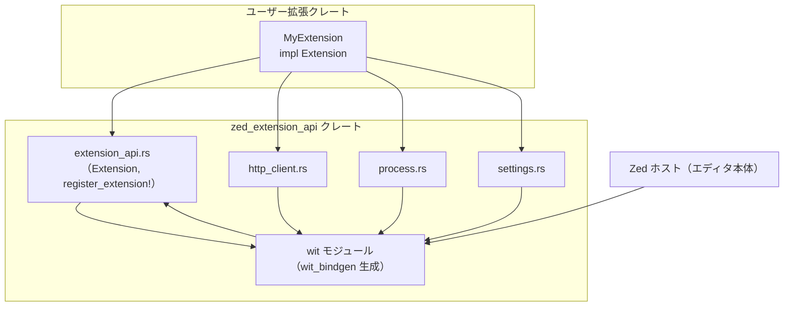
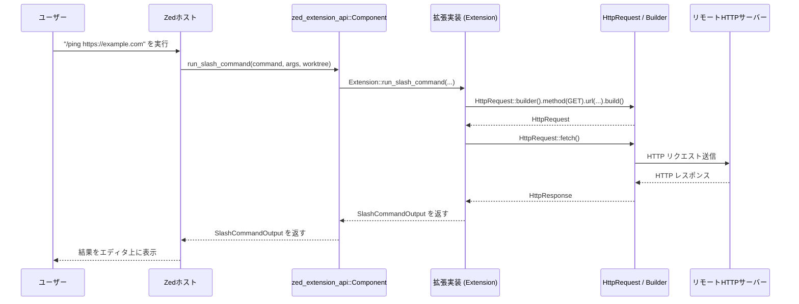

# extension_api/ ディレクトリ解説

## 1. ざっくり一言

Zed 向けの Rust 製拡張機能を書くための **公式ランタイム API** をまとめたクレートです。  
WIT で定義されたホスト API を Rust から扱いやすい形にラップし、拡張のエントリポイントや LSP／HTTP／プロセス実行／設定取得などを提供します。

---

## 2. このモジュールの役割

### 2.1 概要

- このディレクトリの `zed_extension_api` クレートは、Zed 本体と WebAssembly で動作する Rust 製拡張との間をつなぐ **ブリッジ** となるモジュール群です。
- WIT（WebAssembly Interface Types）で定義された Zed の拡張 API を Rust の型・関数として再エクスポートしつつ、以下を提供します。
  - 拡張のエントリポイントを登録するマクロ
  - LSP / Context Server / DAP 連携用の `Extension` トレイト
  - HTTP クライアント、プロセス実行、設定取得などのユーティリティ

### 2.2 アーキテクチャ内での位置づけ

このディレクトリの主なモジュールと関係を簡略化して示します。



- 拡張作者は、自分のクレートから `zed_extension_api` を依存として取り込みます。
- `extension_api.rs` が WIT 生成コード（`mod wit`）に対して `Component` 実装を与え、Zed ホストとの呼び出しを仲介します。
- `http_client`, `process`, `settings` は、それぞれ対応する WIT API を Rust らしいインターフェースでラップします。

### 2.3 設計上のポイント

コードから読み取れる設計上の特徴は次のとおりです。

- **WIT ベースの API 再エクスポート**
  - `mod wit { wit_bindgen::generate!(...) }` で生成された WIT バインディングから、拡張作者が主に使うシンボルだけを `pub use` で明示的に再エクスポートしています。
- **単一インスタンスの Extension**
  - グローバルな `static mut EXTENSION: Option<Box<dyn Extension>>` に拡張実装を 1 つ保持し、すべてのホスト呼び出しからこのインスタンス経由で処理します。
- **文字列ベースのエラー**
  - `pub type Result<T, E = String> = core::result::Result<T, E>;` として、エラー型に `String` を採用しています。API のほとんどが `Result<_, String>` を返します。
- **ビルド時に API バージョンを埋め込み**
  - `build.rs` で `CARGO_PKG_VERSION` を 6 バイトの `[u8;6]` にエンコードし、`ZED_API_VERSION` として WASM バイナリに埋め込みます。
- **バージョンごとの設定スキーマ**
  - `wit/since_vX.Y.Z/settings.rs` に API バージョンごとの設定構造体を保持し、現在の API バージョン (`0.8.0`) 用の定義を `src/settings.rs` から取り込んでいます。
- **ラッパーモジュールによる使いやすさ**
  - HTTP・プロセス・設定まわりは、builder パターンやヘルパーメソッドで WIT 構造体の直接操作を隠し、Rust から自然に扱えるようになっています。

---

## 3. 主要な機能一覧

このクレートが提供する主な機能を列挙します。

- 拡張のエントリポイント登録:
  - `register_extension!` マクロで WASM エクスポート `init-extension` を定義し、拡張型を Zed に登録する。
- 拡張本体のインターフェース:
  - `Extension` トレイトで、LSP・スラッシュコマンド・コンテキストサーバー・ドキュメントインデックス・DAP 連携を定義。
- LSP 連携:
  - `language_server_command`・`language_server_initialization_options` などで言語サーバーの起動・設定を提供。
- スラッシュコマンドの補完・実行:
  - `complete_slash_command_argument`・`run_slash_command` を通じて、`/` から始まるコマンドの補完と実行を行う。
- コンテキストサーバー連携:
  - `context_server_command`・`context_server_configuration`・`ContextServerSettings` によるコンテキストサーバー設定・起動。
- HTTP クライアント:
  - `http_client::HttpRequestBuilder` および `HttpRequest::fetch / fetch_stream` による HTTP リクエスト送信。
- 外部プロセス実行:
  - `process::Command` と `Command::output` による外部コマンド実行。
- 設定値の取得:
  - `LanguageSettings::for_worktree`・`LspSettings::for_worktree`・`ContextServerSettings::for_project` による JSON 設定の取得とデシリアライズ。
- DAP（Debug Adapter Protocol）連携:
  - `get_dap_binary`・`dap_request_kind`・`dap_config_to_scenario`・`dap_locator_create_scenario`・`run_dap_locator` によるデバッグ構成の解決。
- 補助 API:
  - `set_language_server_installation_status` で言語サーバーのインストール状態を Zed に通知。
  - `CodeLabelSpan::code_range` / `literal` でコードラベル用スパンを生成。
  - `From<Range<..>> for wit::Range` による範囲型の変換。

---

## 4. 関数・構造体の解説

### 4.1 主な型一覧

拡張作者が主に意識する型をまとめます。

| 名前 | 種別 | 定義場所 | 役割 / 用途 |
|------|------|----------|-------------|
| `Extension` | トレイト | `src/extension_api.rs` | 拡張本体のインターフェース。LSP やスラッシュコマンド、DAP などのフックを定義する。 |
| `LanguageServerId` | 構造体（newtype） | 同上 | 言語サーバーの ID を表す文字列ラッパー。`Display` / `AsRef<str>` 実装あり。 |
| `ContextServerId` | 構造体（newtype） | 同上 | コンテキストサーバーの ID を表す文字列ラッパー。 |
| `Result<T>` | 型エイリアス | 同上 | `core::result::Result<T, String>` の短縮形。エラーは文字列メッセージ。 |
| `Command` | 構造体 | `wit` 由来（LSP 用） | 言語サーバーやコンテキストサーバー起動などに使うコマンド設定（WIT 定義）。 |
| `process::Command` | 構造体 | `src/process.rs` | 任意の外部プロセス実行用コマンド。`command`/`args`/`env` フィールドを持つ。 |
| `process::Output` | 構造体 | `wit` 由来 | `process::Command::output` の結果。標準出力・終了ステータスなど（詳細は WIT 側）。 |
| `HttpRequest` | 構造体 | `wit` 由来 | HTTP リクエストを表現。`method`/`url`/`headers`/`body`/`redirect_policy` を持つ。 |
| `HttpRequestBuilder` | 構造体 | `src/http_client.rs` | `HttpRequest` を構築するための builder。 |
| `HttpMethod`/`HttpResponse`/`HttpResponseStream`/`RedirectPolicy` | 列挙体など | `wit` 由来 | HTTP クライアント関連の型。 |
| `LanguageSettings` | 構造体 | `wit/since_v0.8.0/settings.rs` | 言語ごとの設定（タブ幅・推奨行長など）。 |
| `LspSettings` | 構造体 | 同上 | LSP 設定。バイナリコマンド・初期化オプション・任意設定。 |
| `ContextServerSettings` | 構造体 | 同上 | コンテキストサーバーのコマンド・設定を表現。 |
| `CommandSettings` | 構造体 | 同上 | 汎用コマンド設定（`path` / `arguments` / `env`）。 |
| `Project` / `Worktree` / `SettingsLocation` | 構造体 | `wit` 由来 | プロジェクト構造や設定位置（ワークツリー単位など）を表す。 |

`CodeLabel`, `CodeLabelSpan`, `Range` などの型も `wit` から再エクスポートされていますが、ここでは利用頻度の高いものに絞っています。

---

### 4.2 重要な関数・メソッドの詳細（例）

ここでは代表的な API を 7 件選び、振る舞いと使い方を説明します。

#### 4.2.1 `Extension::language_server_command`

```rust
fn language_server_command(
    &mut self,
    language_server_id: &LanguageServerId,
    worktree: &Worktree,
) -> Result<Command>
```

**概要**

- 指定された言語サーバー ID に対応する **起動コマンド** を返します。
- Zed が LSP を起動する際に呼び出されます。

**引数**

| 引数名 | 型 | 説明 |
|--------|----|------|
| `language_server_id` | `&LanguageServerId` | 起動対象の言語サーバー ID。 |
| `worktree` | `&Worktree` | 対象ワークツリー。プロジェクトごとのパスや設定に応じてコマンドを変えたい場合に利用可能。 |

**戻り値**

- `Ok(Command)` の場合、そのコマンド設定で Zed が言語サーバーを起動します。
- `Err(String)` の場合、その言語サーバーは起動できなかったとみなされます（デフォルト実装は `"`language_server_command`not implemented"` を返します）。

**内部処理**

- トレイトのデフォルト実装は常に `Err` を返します。
- 実際の挙動は拡張側の実装に依存します。

**使用例**

```rust
use zed_extension_api as zed;

// 拡張本体
struct MyExtension;

// Extension トレイトの実装
impl zed::Extension for MyExtension {
    fn new() -> Self {
        Self
    }

    fn language_server_command(
        &mut self,
        language_server_id: &zed::LanguageServerId,
        _worktree: &zed::Worktree,
    ) -> zed::Result<zed::Command> {
        // ID に応じて起動コマンドを切り替える
        match language_server_id.as_ref() {
            "my-lang-server" => {
                // WIT 由来の Command 型（LSP 用）
                Ok(zed::Command {
                    // フィールド構成は WIT 定義に従う（詳細フィールドはこのチャンクには登場しません）
                    // ここでは例として最小限の構築を行うと想定しています。
                    ..Default::default() // 実際のフィールドは WIT コード側を参照
                })
            }
            _ => Err(format!("Unknown language server: {language_server_id}")),
        }
    }
}
```

※ 上記 `Command` のフィールド詳細はこのチャンクには含まれていません。実際には WIT 生成コード側の定義に従ってフィールドを設定する必要があります。

**Errors / Panics**

- デフォルト実装は常に `Err` を返します。
- 自前の実装では、未知の ID や設定不足など「起動できない」状態を `Err(String)` で返す想定です。

**Edge cases**

- 未対応の `language_server_id` が渡された場合は、`Err` を返すのが自然です。
- `worktree` がどのような値でも `LanguageServerId` のみで判定する実装も可能です。

**使用上の注意点**

- ここで返すコマンドは、実際にホスト上で実行されるため、パスや引数の設定ミスはユーザー体験に直結します。
- エラー文字列はユーザーに表示されうるため、できるだけ具体的なメッセージを返す方が有用です。

---

#### 4.2.2 `Extension::run_slash_command`

```rust
fn run_slash_command(
    &self,
    command: SlashCommand,
    args: Vec<String>,
    worktree: Option<&Worktree>,
) -> Result<SlashCommandOutput, String>
```

**概要**

- ユーザーが Zed で `/xxx` のようにスラッシュコマンドを実行した際に呼び出され、その結果表示を返します。

**引数**

| 引数名 | 型 | 説明 |
|--------|----|------|
| `command` | `SlashCommand` | 実行されたスラッシュコマンドの情報。 |
| `args` | `Vec<String>` | ユーザーが入力した引数のリスト。 |
| `worktree` | `Option<&Worktree>` | 対象ワークツリー（ない場合もある）。 |

**戻り値**

- `Ok(SlashCommandOutput)` を返すと、Zed がその内容に従って結果を表示します。
- デフォルト実装は `"run_slash_command not implemented"` というエラー文字列を返します。

**内部処理**

- トレイト側では何もせず `Err` を返すだけです。
- 実際のビジネスロジックは拡張作者が実装します。

**使用例（HTTP クライアントを用いた簡易実装のイメージ）**

```rust
use zed_extension_api as zed;

impl zed::Extension for MyExtension {
    fn new() -> Self { Self }

    fn run_slash_command(
        &self,
        command: zed::SlashCommand,
        args: Vec<String>,
        _worktree: Option<&zed::Worktree>,
    ) -> zed::Result<zed::SlashCommandOutput, String> {
        // コマンド名などの詳細は WIT 定義に依存するため、
        // ここでは「特定のコマンドで HTTP リクエストを投げる」という仮想的な例とします。

        // 例: /ping <url> のようなコマンドを想定（実際のフィールドは WIT を参照）
        if args.is_empty() {
            return Err("URL argument is required".to_string());
        }

        let url = &args[0];

        // HTTP リクエストを構築
        let request = zed::http_client::HttpRequest::builder()
            .method(zed::http_client::HttpMethod::Get)
            .url(url.clone())
            .build()?; // method / url が設定されていないと Err になる

        // リクエストを送信（レスポンスの詳細フィールドはこのチャンクでは不明）
        let _response = request.fetch()?;

        // 実際には SlashCommandOutput を生成して返す必要があります。
        Err("Not implemented".to_string())
    }
}
```

**Errors / Edge cases**

- 引数不足や無効なコマンドに対しては、`Err(String)` を返すことで、呼び出し元にエラーを伝えられます。

**使用上の注意点**

- この関数はユーザー操作に直接反応するため、実行時間が長い処理はユーザー体験に影響します。
- HTTP・プロセス実行などのエラーは適切に捕捉し、分かりやすいメッセージを返すことが望まれます。

---

#### 4.2.3 `Extension::context_server_command`

```rust
fn context_server_command(
    &mut self,
    context_server_id: &ContextServerId,
    project: &Project,
) -> Result<Command>
```

**概要**

- コンテキストサーバー（コード理解や検索などに使われるバックエンド）の起動コマンドを返します。

**引数**

| 引数名 | 型 | 説明 |
|--------|----|------|
| `context_server_id` | `&ContextServerId` | 起動するコンテキストサーバーの ID。 |
| `project` | `&Project` | 対象プロジェクト全体。ワークツリー情報などを間接的に参照可能。 |

**戻り値**

- `Ok(Command)` で起動コマンドを指定。
- デフォルトは `"context_server_command not implemented"` の `Err`。

**使用上の注意点**

- `ContextServerSettings::for_project` と組み合わせて、設定からコマンドパスを決定する実装が自然です（例は後述）。

---

#### 4.2.4 `Extension::get_dap_binary`

```rust
fn get_dap_binary(
    &mut self,
    adapter_name: String,
    config: DebugTaskDefinition,
    user_provided_debug_adapter_path: Option<String>,
    worktree: &Worktree,
) -> Result<DebugAdapterBinary, String>
```

**概要**

- 指定された DAP アダプター名と設定に対して、実際に利用する debug adapter バイナリを決定します。
- 例えば、ユーザーが手動で指定したパスがあればそれを優先し、なければ GitHub リリースからダウンロードするといったロジックを実装できます。

**引数（概略）**

| 引数名 | 型 | 説明 |
|--------|----|------|
| `adapter_name` | `String` | DAP アダプターの識別子。 |
| `config` | `DebugTaskDefinition` | デバッグタスク定義（WIT 型）。 |
| `user_provided_debug_adapter_path` | `Option<String>` | ユーザーが指定したアダプターパス。 |
| `worktree` | `&Worktree` | 対象ワークツリー。 |

**戻り値**

- `Ok(DebugAdapterBinary)` で利用するバイナリ情報（パスなど）を返します。
- デフォルト実装は `"get_dap_binary not implemented"` の `Err`。

**使用上の注意点**

- DAP 連携に関する他のメソッド（`dap_request_kind`, `dap_config_to_scenario` など）との整合性を保つ必要があります。
- 実際のフィールドや詳細は WIT 定義側にあり、このチャンクからは読み取れません。

---

#### 4.2.5 `HttpRequestBuilder::build`

```rust
pub fn build(self) -> Result<HttpRequest, String>
```

**概要**

- `HttpRequestBuilder` に設定された情報から `HttpRequest` を構築します。
- 必須情報が欠けている場合は `Err` になります。

**内部処理**

```rust
pub fn build(self) -> Result<HttpRequest, String> {
    let method = self.method.ok_or_else(|| "Method not set".to_string())?;
    let url = self.url.ok_or_else(|| "URL not set".to_string())?;

    Ok(HttpRequest {
        method,
        url,
        headers: self.headers,
        body: self.body,
        redirect_policy: self.redirect_policy,
    })
}
```

- HTTP メソッドまたは URL が設定されていない場合、それぞれ `"Method not set"`, `"URL not set"` というエラー文字列で失敗します。

**使用例**

```rust
use zed_extension_api::http_client::{HttpMethod, HttpRequest};

fn make_request() -> Result<(), String> {
    // ビルダーでリクエストを構築
    let request = HttpRequest::builder()
        .method(HttpMethod::Get)          // HTTP メソッドを指定
        .url("https://example.com")       // URL を指定
        .header("User-Agent", "MyExt/0.1")// ヘッダーを追加
        .build()?;                        // 必須項目がないと Err になる

    // 実行（レスポンスのフィールドは WIT 定義に依存）
    let _response = request.fetch()?;     // fetch_stream() も利用可能

    Ok(())
}
```

**Edge cases**

- `.method(...)` や `.url(...)` を呼び忘れると `Err` になります。
- `.headers(...)` で空イテレータを渡しても問題ありません（単に何も追加されません）。

**使用上の注意点**

- `body` に大きなバイナリデータを渡す場合、`Vec<u8>` へのコピーコストを考慮する必要があります。
- リダイレクトポリシーの初期値は `RedirectPolicy::NoFollow` です。必要に応じて `.redirect_policy(...)` で変更します。

---

#### 4.2.6 `process::Command::output`

```rust
pub fn output(&mut self) -> Result<Output, String>
```

**概要**

- `process::Command` に設定されたコマンドを実際に実行し、その結果を `Output` として返します。
- 内部では WIT の `process::run_command` を呼び出しています。

**内部処理**

```rust
pub fn output(&mut self) -> Result<Output, String> {
    process::run_command(self)
}
```

**使用例**

```rust
use zed_extension_api::process;

fn run_ls() -> Result<process::Output, String> {
    // "ls -la" を実行する例（Unix 系を想定した単純な例）
    let mut cmd = process::Command::new("ls")  // 実行するコマンド名
        .arg("-la");                           // 引数を追加

    let output = cmd.output()?;                // 実行して結果を取得

    Ok(output)                                 // Output の中身は WIT 定義を参照
}
```

**Edge cases**

- コマンドが存在しない・実行権限がない場合など、実行に失敗すると `Err(String)` が返る想定です（詳細なエラー内容は `run_command` 側の実装に依存します）。
- `Command` 構造体のフィールド `command` や `args` が空でも `run_command` は呼び出されますが、その挙動は WIT 側の実装次第です。

**使用上の注意点**

- 実行されるプロセスは拡張が動作している環境（ユーザーの環境）に依存します。
- ユーザー入力をそのままコマンドライン引数に渡すと危険な場合があるため、バリデーションやエスケープを検討する必要があります。

---

#### 4.2.7 `LanguageSettings::for_worktree`

```rust
impl LanguageSettings {
    pub fn for_worktree(language: Option<&str>, worktree: &Worktree) -> Result<Self>
}
```

**概要**

- 指定されたワークツリーにおける言語設定を取得し、`LanguageSettings` にデシリアライズします。

**内部処理**

```rust
pub fn for_worktree(language: Option<&str>, worktree: &Worktree) -> Result<Self> {
    get_settings("language", language, Some(worktree.id()))
}
```

- 実体は `get_settings` の薄いラッパーです。
- `get_settings` 内では `wit::get_settings(...)` を呼び出し、返された JSON 文字列を `serde_json::from_str` で `LanguageSettings` に変換します。

**使用例**

```rust
use zed_extension_api::{LanguageSettings, Worktree, Result};

fn show_tab_size(language: &str, worktree: &Worktree) -> Result<(), String> {
    // ワークツリー＋言語に紐づく設定を取得
    let settings = LanguageSettings::for_worktree(Some(language), worktree)?;

    // LanguageSettings は v0.8.0 では tab_size / preferred_line_length を持つ
    println!(
        "tab_size = {}, preferred_line_length = {}",
        settings.tab_size,
        settings.preferred_line_length,
    );

    Ok(())
}
```

**Errors / Edge cases**

- `wit::get_settings` が失敗した場合（設定が存在しない・読み込みエラーなど）、`Err(String)` が返ります。
- 返却された JSON が `LanguageSettings` 構造体と合わない場合、`serde_json::from_str` がエラーになり、そのエラー内容を `String` 化して返します。

**使用上の注意点**

- JSON との整合性を保つため、設定スキーマを変更した場合は `LanguageSettings` の定義も同期させる必要があります。
- `language` に `None` を渡すとどのような設定が返るかは `get_settings` の実装次第であり、このチャンクだけでは詳細は分かりません。

---

### 4.3 その他の補助的な関数・メソッド

| 関数名 / メソッド名 | 役割（1 行） |
|---------------------|--------------|
| `set_language_server_installation_status` | 言語サーバーのインストール状態を Zed に通知する。 |
| `Extension::complete_slash_command_argument` | スラッシュコマンド引数の補完候補を返す。デフォルトは空リスト。 |
| `Extension::suggest_docs_packages` | `/docs` 用に提案するパッケージ名リストを返す。デフォルトは空リスト。 |
| `Extension::index_docs` | 指定パッケージのドキュメントをインデックスするためのフック。デフォルトは未実装エラー。 |
| `Extension::dap_request_kind` | アダプター設定から debuggee を launch するか attach するか判定する。未判定なら `Err`。 |
| `Extension::dap_config_to_scenario` | 高レベルなデバッグ設定を具体的な `DebugScenario` に変換する。 |
| `Extension::dap_locator_create_scenario` | タスクをデバッグシナリオに変換する第一段階（オプション）。 |
| `Extension::run_dap_locator` | ロケーター第二段階で、ビルド結果からデバッグリクエストを生成する。 |
| `HttpRequest::builder` | `HttpRequestBuilder` を返すコンストラクタ。 |
| `HttpRequest::fetch` / `fetch_stream` | 同期／ストリーム方式で HTTP リクエストを実行する。 |
| `process::Command::new` | コマンド名から `process::Command` を生成する。 |
| `process::Command::arg` / `args` | コマンドライン引数を追加する。 |
| `process::Command::env` / `envs` | 環境変数を追加する。 |
| `LspSettings::for_worktree` | 言語サーバーの設定をワークツリー単位で取得する。 |
| `ContextServerSettings::for_project` | プロジェクト全体としてのコンテキストサーバー設定を取得する。 |
| `CodeLabelSpan::code_range` / `literal` | コードラベル用のスパンを簡便に生成する。 |
| `From<std::ops::Range<u32/usize>> for wit::Range` | Rust 標準の範囲型から `wit::Range` への変換。 |

---

## 5. データフロー

ここでは代表的なシナリオとして、**スラッシュコマンドから HTTP リクエストを行う拡張**のデータフローをイメージ図で示します。

### 5.1 処理の流れ（概要）

1. ユーザーが Zed で `/ping https://example.com` のようなコマンドを実行します。
2. Zed ホストは WIT を通じて `Component::run_slash_command` を呼び出します。
3. `Component::run_slash_command` はグローバルな `Extension` インスタンスに処理を委譲します。
4. 拡張実装の `run_slash_command` 内で `HttpRequestBuilder` によりリクエストを構築し、`fetch` を呼びます。
5. HTTP の結果から `SlashCommandOutput` を組み立てて Zed に返し、Zed がエディタ上に表示します。

### 5.2 シーケンス図（Mermaid）



- `C`（`Component`）と `E`（ユーザー実装の `Extension`）の間のやりとりは、`extension()` 関数と `EXTENSION` グローバルによって実現されています。
- HTTP クライアントは `wit::zed::extension::http_client` によるホスト側実装に依存し、拡張側からは `HttpRequest` と `fetch` を通じて利用します。

---

## 6. 使い方（How to Use）

### 6.1 基本的な使用方法

#### 6.1.1 最小限の拡張の骨組み

`README.md` にある内容を基に、Zed 拡張を Rust で実装する最小例を示します。

1. **拡張マニフェスト（extension.toml）**

```toml
# 拡張ディレクトリ直下に配置
id = "my-extension"                          # 拡張の一意な ID
name = "My Extension"                        # 表示名
description = "My first Zed extension"       # 説明
version = "0.0.1"                            # 拡張のバージョン
schema_version = 1                           # マニフェストスキーマのバージョン
authors = ["Your Name <you@example.com>"]    # 作者情報
repository = "https://github.com/your/repo"  # リポジトリ URL（任意）
```

2. **Cargo.toml（拡張側クレート）**

```toml
[package]
name = "my_zed_extension"            # 拡張クレート名
version = "0.0.1"
edition = "2021"

[dependencies]
# 実際のバージョンは利用する zed_extension_api に合わせる
zed_extension_api = "0.6.0"

[lib]
crate-type = ["cdylib"]              # WASM（cdylib）としてビルドする
```

> ※ このリポジトリ内の `Cargo.toml` では `zed_extension_api` のバージョンは `0.8.0` です。実際に利用する際は、使いたいバージョンに合わせて指定してください。

3. **拡張実装（src/lib.rs）**

```rust
use zed_extension_api as zed; // クレートに短い別名を付ける

// 拡張本体の型
struct MyExtension;

// Extension トレイトの実装
impl zed::Extension for MyExtension {
    // 必須: インスタンス生成
    fn new() -> Self {
        Self
    }

    // 任意: 言語サーバー起動コマンドを指定
    fn language_server_command(
        &mut self,
        language_server_id: &zed::LanguageServerId,
        _worktree: &zed::Worktree,
    ) -> zed::Result<zed::Command> {
        match language_server_id.as_ref() {
            "my-language-server" => {
                // ここで WIT 定義の Command を組み立てる
                Err("language_server_command not fully implemented".to_string())
            }
            _ => Err(format!("Unknown language server: {}", language_server_id)),
        }
    }
}

// エントリポイント登録マクロ
zed::register_extension!(MyExtension);
```

- `register_extension!` マクロにより、WASM エクスポート関数 `init-extension` が定義され、Zed が拡張をロードできるようになります。
- 実際に LSP やスラッシュコマンドなどを有効にするには、`Extension` トレイトの各メソッドを必要に応じてオーバーライドしていきます。

---

### 6.2 よくある使用パターン

#### 6.2.1 HTTP リクエストを送る

```rust
use zed_extension_api::http_client::{HttpMethod, HttpRequest};

fn fetch_example() -> Result<(), String> {
    // GET リクエストのビルド
    let request = HttpRequest::builder()
        .method(HttpMethod::Get)               // HTTP メソッド
        .url("https://example.com")            // アクセス先 URL
        .header("User-Agent", "my-ext/0.1")    // 任意のヘッダー追加
        .build()?;                             // 必須項目がないと Err

    // リクエストを同期的に送信
    let _response = request.fetch()?;          // レスポンスの詳細は WIT 定義に依存

    Ok(())
}
```

#### 6.2.2 外部プロセスを実行する

```rust
use zed_extension_api::process;

fn run_git_status() -> Result<process::Output, String> {
    // "git status" を実行するコマンドを構築
    let mut cmd = process::Command::new("git") // 実行するプログラム名
        .arg("status");                        // 引数を追加

    // 実行して結果を取得
    let output = cmd.output()?;                // Output の構造は WIT 側の定義に依存

    Ok(output)
}
```

#### 6.2.3 設定値を読み取る

```rust
use zed_extension_api::{LanguageSettings, LspSettings, Worktree, Result};

fn load_settings(worktree: &Worktree) -> Result<(), String> {
    // 言語設定の取得（言語名は例）
    let lang_settings = LanguageSettings::for_worktree(Some("rust"), worktree)?;
    println!(
        "tab_size={}, preferred_line_length={}",
        lang_settings.tab_size, lang_settings.preferred_line_length,
    );

    // LSP 設定の取得（言語サーバー名も例）
    let lsp_settings = LspSettings::for_worktree("rust-analyzer", worktree)?;
    // lsp_settings.binary / initialization_options / settings などが利用可能
    // （フィールドの詳細は wit/since_v0.8.0/settings.rs を参照）

    Ok(())
}
```

---

### 6.3 使用上の注意点（まとめ）

このディレクトリに含まれるモジュールを利用する際の共通の注意点をまとめます。

- **WASM / WASI 環境前提**
  - 拡張は `wasm32-wasip2` ターゲットでビルドされます。
  - `register_extension!` マクロ内で、WASI libc の `chdir` が上書きされ、常にエラーを返す実装になっています。  
    → 拡張内で CWD を変更することはできません（安全性・移植性のため）。

- **`Result<T, String>` ベースのエラー**
  - ほぼすべての API が `Result<_, String>` を返します。
  - エラー文字列はユーザー向けに表示される可能性があるため、可能な範囲で分かりやすいメッセージにすることが望まれます。

- **JSON 設定との整合性**
  - `settings.rs` の `get_settings` は `wit::get_settings` から受け取った JSON を `serde_json` で構造体にデコードします。
  - `LanguageSettings` などの構造体定義を変更する際は、Zed 側（ホスト）の設定 JSON との互換性を確認する必要があります。

- **HTTP / プロセス呼び出しのエラー処理**
  - ネットワークエラーやプロセス起動失敗などは `Err(String)` として返る想定です。
  - ユーザー操作から直接呼ばれるメソッド（`run_slash_command` など）では、これらのエラーを適切に捕捉し、必要に応じてメッセージを変換したうえで返すと扱いやすくなります。

- **必須フィールドのセット忘れ**
  - `HttpRequestBuilder::build` は `method` と `url` が未設定だとエラーになります。
  - `ContextServerSettings::for_project` はプロジェクト内すべてのワークツリーの設定を比較するため、頻繁に呼び出すとコストがかさむ場合があります。

---

## 7. 関連ファイル

このディレクトリ内の主なファイルと役割です。

| パス | 役割 / 関係 |
|------|------------|
| `extension_api/Cargo.toml` | `zed_extension_api` クレートのメタデータ。依存（`serde`, `serde_json`, `wit-bindgen`）やビルドターゲット（WIT パス）を定義。 |
| `extension_api/README.md` | 拡張の作り方（extension.toml, Cargo.toml 設定, `Extension` 実装, 開発時の Zed への読み込み方法）を説明するドキュメント。 |
| `extension_api/PENDING_CHANGES.md` | 将来の破壊的変更候補のメモ。スラッシュコマンド関連のフィールド名変更案などが記載されているが、このチャンクのコードにはまだ反映されていない。 |
| `extension_api/build.rs` | クレートのバージョンを 6 バイトにエンコードし、`OUT_DIR/version_bytes` に書き出す。`ZED_API_VERSION` で利用される。 |
| `extension_api/src/extension_api.rs` | クレートの中核。`Extension` トレイト、`register_extension!` マクロ、WIT バインディング (`mod wit`, `Component`) と各種再エクスポートを定義。 |
| `extension_api/src/http_client.rs` | HTTP クライアント API。`HttpRequest` の builder・実行メソッドを提供。 |
| `extension_api/src/process.rs` | 外部プロセス実行 API。`process::Command` への builder スタイルの拡張と `output` メソッドを提供。 |
| `extension_api/src/settings.rs` | 設定取得 API。現在のバージョン (`since_v0.8.0`) の設定型を利用し、`LanguageSettings` / `LspSettings` / `ContextServerSettings` の取得メソッドを定義。 |
| `extension_api/wit/since_v0.0.6/settings.rs` | v0.0.6 以降で利用されていた設定スキーマ（言語 / LSP の基本設定）。 |
| `extension_api/wit/since_v0.1.0/settings.rs` | v0.1.0 以降の設定スキーマ。内容は v0.0.6 と同等。 |
| `extension_api/wit/since_v0.2.0/settings.rs` 〜 `since_v0.6.0/settings.rs` | コンテキストサーバー設定 (`ContextServerSettings`, `CommandSettings`) などを含む、より拡張された設定スキーマ。 |
| `extension_api/wit/since_v0.8.0/settings.rs` | 現行 API バージョン用の設定スキーマ。`LanguageSettings` に `preferred_line_length` が追加されている。 |

以上が、このディレクトリ内のコードを拡張作者向けに理解・利用するための概要と詳細です。
