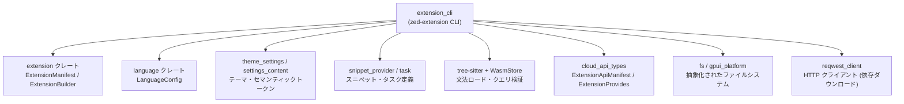
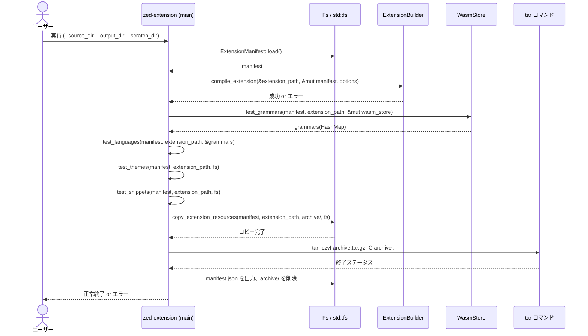

# extension_cli ディレクトリ解説

## 1. ざっくり一言

Zed エディタの拡張機能ディレクトリを入力として、**コンパイル・検証・パッケージング**を行い、配布用のアーカイブ (`archive.tar.gz`) と API 用 `manifest.json` を生成する CLI ツール `zed-extension` の実装です。

---

## 2. このモジュールの役割

### 2.1 概要

- このディレクトリは、Zed 拡張機能の **ビルドおよび検証 CLI** を提供します。
- 拡張ディレクトリ（`extension.toml` や `grammars/`, `languages/`, `themes/` 等を含む）を読み込み、
  - 拡張本体のコンパイル（Wasm 化など）
  - tree-sitter 文法・言語定義・テーマ・スニペットの検証
  - 必要なアセットのコピーと `tar.gz` へのアーカイブ
  - クラウド API で使う `manifest.json` の生成  
 までを自動で行います。

### 2.2 アーキテクチャ内での位置づけ

この CLI は、他のクレートが提供する型・ロジックを組み合わせる「オーケストレーター」の役割を持ちます。

主な依存関係のイメージです（ノード名はクレート・役割の概略です）:



- `extension_cli` 自体はロジックをあまり持たず、周囲のクレートの API を順番に呼び出す構造になっています。
- ファイル操作は `fs` クレートの `Fs` トレイト経由で行われ、一部で標準ライブラリの `std::fs` も併用しています。
- tree-sitter 文法は `wasmtime` の `Engine` と `tree_sitter::WasmStore` を使って読み込み・検証されます。

### 2.3 設計上のポイント

コードから読み取れる特徴をまとめます。

- **非同期処理ベース**
  - `#[tokio::main]` により非同期ランタイム上で動作し、ファイル I/O や外部コマンド呼び出しも非同期 API を利用しています（`tokio::process::Command` など）。
- **CLI 専用のバイナリクレート**
  - 公開 API を持つライブラリではなく、`main.rs` にロジックが集中したバイナリ (`zed-extension`) です。
- **ファイルシステムの抽象化**
  - `fs::Fs` トレイトと `RealFs` 実装を利用しており、テストや将来の差し替えを意識した構造になっています。
- **Wasm ベースの grammar 検証**
  - `wasmtime::Engine` と `tree_sitter::WasmStore` により、拡張に含まれる grammar `.wasm` を実際にロードして検証します。
- **拡張機能の整合性チェック**
  - `validate_extension_features` による提供機能の制約チェック
  - `test_grammars` / `test_languages` / `test_themes` / `test_snippets` による各種アセットの検証
- **外部コマンドへの依存**
  - アーカイブ作成に OS の `tar` コマンドを利用しています（Rust 内部実装ではなく、外部プロセスとして呼び出し）。

---

## 3. 主要な機能一覧

このディレクトリ（`extension_cli` クレート）が提供する主な機能です。

- **拡張マニフェストの読み込み**
  - `ExtensionManifest::load` を通じて `extension.toml` 相当の情報を取得します。
- **拡張のコンパイル**
  - `ExtensionBuilder::compile_extension` を呼び出し、Wasm などビルド済みアーティファクトを生成します。
- **提供機能（provides）の検証**
  - `validate_extension_features` により、テーマ専用・アイコンテーマ専用拡張の制約などをチェックします。
- **tree-sitter 文法の検証**
  - `test_grammars` で `.wasm` grammar をロードし、`tree_sitter::Language` として使用可能かを確認します。
- **言語定義・クエリファイルの検証**
  - `test_languages` で `language` ディレクトリ内の設定・クエリ `.scm`・セマンティックトークンルール・タスク定義の整合性をチェックします。
- **テーマファイルの検証**
  - `test_themes` でテーマファイルを読み込み、非推奨プロパティを使用していないか検証します。
- **スニペットファイルの検証**
  - `test_snippets` で VS Code 形式のスニペット JSON をパースし、個々のスニペットまで検証します。
- **パッケージング**
  - `copy_extension_resources` で必要なファイル・ディレクトリを `archive/` に集約し、その後 `tar` コマンドで `archive.tar.gz` を作成します。
- **クラウド API 用マニフェスト生成**
  - `cloud_api_types::ExtensionApiManifest` に変換し、`manifest.json` として出力します。

---

## 4. 関数・構造体の解説

### 4.1 型一覧

このクレート内で定義されている主な型は 1 つです。

| 名前  | 種別   | 役割 / 用途 |
|-------|--------|-------------|
| `Args` | 構造体 | CLI 引数 (`--source_dir`, `--output_dir`, `--scratch_dir`) を表現し、`clap` によるパースに利用されます。 |

#### `Args` 構造体

```rust
#[derive(Parser, Debug)]
#[command(name = "zed-extension")]
struct Args {
    /// The path to the extension directory
    #[arg(long)]
    source_dir: PathBuf,
    /// The output directory to place the packaged extension.
    #[arg(long)]
    output_dir: PathBuf,
    /// The path to a directory where build dependencies are downloaded
    #[arg(long)]
    scratch_dir: PathBuf,
}
```

- `clap::Parser` 派生により、コマンドラインから自動的に値が埋め込まれます。
- すべて `--xxx_dir` という **ロングオプションのみ** を受け取ります（ショートオプションは定義されていません）。

### 4.2 関数詳細

#### `main() -> Result<()>`

**概要**

- `zed-extension` CLI のエントリーポイントです。
- 拡張のロード → コンパイル → 検証 → リソースコピー → `tar.gz` 作成 → `manifest.json` 出力まで一連の処理を実行します。

**引数**

- なし（`Args::parse()` により `std::env::args()` から取得します）。

**戻り値**

- `anyhow::Result<()>`
  - 成功時は `Ok(())`。
  - 途中のどこかで失敗した場合は適切なコンテキスト付きエラーを返します。

**内部処理の流れ**

1. **ログの初期化**
   - `env_logger::init()` を呼び出し、ログ出力を有効化します。

2. **CLI 引数のパース**
   - `Args::parse()` により `source_dir`, `output_dir`, `scratch_dir` を取得します。

3. **依存オブジェクトの初期化**
   - `RealFs::new(None, gpui_platform::background_executor())` でファイルシステム抽象 `Fs` を用意（`Arc<dyn Fs>`）。
   - `wasmtime::Engine::default()` で Wasm 実行エンジンを生成。
   - `WasmStore::new(&engine)?` で tree-sitter 用の Wasm ストアを生成。

4. **パスの正規化**
   - `source_dir` と `scratch_dir` を `canonicalize()` で絶対パス化。
   - `output_dir` は相対パスならカレントディレクトリからの相対パスに変換。

5. **拡張マニフェストの読み込み**
   - `ExtensionManifest::load(fs.clone(), &extension_path).await?` で拡張設定を取得。

6. **拡張のコンパイル**
   - `ReqwestClient` をユーザーエージェント付きで生成。
   - `ExtensionBuilder::new(http_client, scratch_dir)` を作成し、
   - `compile_extension` を `release: true` オプションで実行。
     - ここで依存のダウンロードや Wasm 化などが行われると考えられます（詳細は他クレート側）。

7. **提供機能 (provides) の検証**
   - `manifest.provides()` で機能集合を取得。
   - `validate_extension_features` で妥当性チェック。

8. **各種アセットの検証**
   - `test_grammars` で grammar `.wasm` をロード。
   - `test_languages` で言語設定・クエリ・セマンティックトークン・タスクを検証。
   - `test_themes` でテーマファイルをロードし、非推奨プロパティをチェック。
   - `test_snippets` でスニペットファイルを検証。

9. **リソースのコピーとアーカイブの作成**
   - `archive` ディレクトリを `output_dir` 配下に作成（既存なら削除）。
   - `copy_extension_resources` で必要ファイルを `archive/` にコピー。
   - `tokio::process::Command::new("tar")` で `archive` ディレクトリを `archive.tar.gz` に固めます。
   - `tar` コマンドの終了ステータスが失敗なら `bail!` します。

10. **manifest.json の生成**
    - `cloud_api_types::ExtensionApiManifest` に必要なフィールドを詰めて `serde_json::to_string`。
    - `manifest.repository` が設定されていない場合はエラーになります。
    - `std::fs::remove_dir_all(&archive_dir)?` で `archive/` を削除した後、
      `std::fs::write(output_dir.join("manifest.json"), manifest_json.as_bytes())?` で JSON を出力。

**Examples（使用例）**

基本的には CLI として利用されるため、Rust コードから直接 `main` を呼ぶことは想定されていません。  
コマンドラインからの利用例は「6. 使い方」を参照してください。

**Errors / Panics**

- 代表的なエラー条件（いずれも `Err(anyhow::Error)` として返ります）:
  - `source_dir` / `scratch_dir` の `canonicalize` 失敗。
  - 拡張マニフェストの読み込み失敗。
  - 拡張コンパイルの失敗。
  - `test_*` 系検証のいずれかの失敗。
  - `tar` コマンドの起動失敗 or 非 0 終了ステータス。
  - `manifest.repository` が `None` の場合。
  - `archive/` の削除や `manifest.json` の書き込み失敗。

**Edge cases（エッジケース）**

- `output_dir` が相対パスの場合、**実行時のカレントディレクトリに依存**します。
- `archive` ディレクトリが既に存在していても、`remove_dir_all().ok()` で削除を試みるだけでエラーを無視します。
- `tar` コマンドが存在しない環境では `Command::new("tar")...output()` が失敗します。

**使用上の注意点**

- 実行環境に `tar` コマンドがインストールされている必要があります。
- `output_dir` は書き込み可能である必要があります。
- 実行に先立ち、拡張ディレクトリ内のファイル構成（`grammars/`, `languages/`, `themes/`, `snippets/` など）がマニフェストと矛盾しないようにしておく必要があります。

---

#### `copy_extension_resources(manifest, extension_path, output_dir, fs) -> Result<()>`

**概要**

- ビルド済み拡張から、配布に必要なファイル・ディレクトリを `output_dir`（通常は `archive/`）配下にコピーします。
- マニフェストや Wasm、grammars, themes, icon themes, languages, debug adapter schema, snippets, agent アイコンなどを対象とします。

**引数**

| 引数名          | 型                    | 説明 |
|----------------|-----------------------|------|
| `manifest`     | `&ExtensionManifest`  | 拡張のメタデータと構成情報。 |
| `extension_path` | `&Path`             | 元の拡張ディレクトリへのパス。 |
| `output_dir`   | `&Path`               | コピー先ルートディレクトリ。 |
| `fs`           | `Arc<dyn Fs>`         | 抽象化されたファイルシステム。 |

**戻り値**

- `Result<()>`  
  すべてのコピーが成功すれば `Ok(())`。いずれかのコピーが失敗すると `Err` を返します。

**内部処理の流れ**

1. `output_dir` を `fs::create_dir_all` で作成。
2. マニフェスト (`ExtensionManifest`) を `toml::to_string` でシリアライズし、`extension.toml` として書き込み。
3. `manifest.lib.kind` が `Some` の場合、`extension.wasm` をコピー。
4. `manifest.grammars` が非空の場合、`grammars/` ディレクトリを作成し、各 grammar 名に対応する `.wasm` ファイルをコピー。
5. `manifest.themes` が非空の場合、`themes/` ディレクトリにテーマファイルをコピー（ファイル名のみ保持）。
6. `manifest.icon_themes` が非空の場合、
   - `icon_themes/` にアイコンテーマ定義をコピー（ファイル名のみ保持）。
   - `icons/` ディレクトリ全体を `copy_recursive` でコピー。
7. `manifest.agent_servers` の各エントリについて、`icon` が設定されていれば、親ディレクトリを作成してからアイコンファイルをコピー（相対パス構造を保持）。
8. `manifest.languages` が非空の場合、`languages/` ディレクトリ配下に、各言語ディレクトリを `copy_recursive` でコピー。
9. `manifest.debug_adapters` が非空の場合、各エントリの `schema_path`（未指定なら `"debug_adapter_schemas/<name>.json"`）を元に、そのパスの親ディレクトリを作成し、そこに `copy_recursive` でコピー。
10. `manifest.snippets` が存在する場合、その `paths()` で得られるパスごとに、必要であれば親ディレクトリを作成し、`copy_recursive` でコピー。

**Examples（使用例）**

テストコードなどから単体で呼び出す場合のイメージです。

```rust
// 仮の ExtensionManifest と Fs 実装を用意する（詳細は他クレート）
let manifest: ExtensionManifest = /* ... */;
let fs = Arc::new(RealFs::new(None, gpui_platform::background_executor()));

let extension_path = Path::new("/path/to/extension");
let output_dir = Path::new("/path/to/archive");

tokio::runtime::Runtime::new()?.block_on(async {
    copy_extension_resources(&manifest, extension_path, output_dir, fs.clone()).await?;
    Ok::<_, anyhow::Error>(())
})?;
```

**Errors / Panics**

- ディレクトリ作成 (`create_dir_all`) やファイルコピー (`fs::copy`, `copy_recursive`) が失敗した場合に `Err`。
- パスが不正な場合（`file_name()` や `parent()` が `None` の場合）には `context` 付きのエラーを返します。

**Edge cases**

- `manifest.lib.kind` が `None` の場合は `extension.wasm` をコピーしません。
- `manifest.themes` / `icon_themes` / `languages` / `debug_adapters` / `snippets` が空の場合、それぞれに対応するブロックはスキップされます。
- `snippets` のパスで親ディレクトリが空 (`components().next().is_none()`) の場合は、ディレクトリ作成をスキップします。

**使用上の注意点**

- `extension_path` 以下に、マニフェストが期待するファイル・ディレクトリが存在している必要があります。
- `output_dir` 以下に既存のファイルがある場合、`CopyOptions { overwrite: true }` により上書きされる可能性があります。

---

#### `validate_extension_features(provides: &BTreeSet<ExtensionProvides>) -> Result<()>`

**概要**

- 拡張が提供する機能セット（`ExtensionProvides` の集合）の整合性をチェックします。
- 特にテーマ専用拡張・アイコンテーマ専用拡張の制約を確認します。

**引数**

| 引数名    | 型                                   | 説明 |
|----------|--------------------------------------|------|
| `provides` | `&BTreeSet<ExtensionProvides>` | マニフェストから得られる提供機能の集合。 |

**戻り値**

- `Result<()>`  
  制約を満たしていれば `Ok(())`。違反していれば `Err` を返します。

**内部処理**

1. `provides` が空なら `bail!("extension does not provide any features")`。
2. `ExtensionProvides::Themes` を含む場合で、集合サイズが 1 以外ならエラー。
3. `ExtensionProvides::IconThemes` を含む場合で、集合サイズが 1 以外ならエラー。

**Examples**

```rust
use cloud_api_types::ExtensionProvides;
use std::collections::BTreeSet;

let mut provides = BTreeSet::new();
provides.insert(ExtensionProvides::Themes);

// テーマ専用拡張なら OK
validate_extension_features(&provides)?;

// 複数機能を同時に持たせるとエラー
provides.insert(ExtensionProvides::IconThemes);
assert!(validate_extension_features(&provides).is_err());
```

**Errors / Panics**

- `provides` が空の場合。
- `Themes` または `IconThemes` を含み、かつ他の機能も含んでいる場合。

**Edge cases**

- `Languages` のみ等、テーマ以外の単機能拡張に対しては特別な制約は設けられていません（このコードから読み取れる範囲では）。

**使用上の注意点**

- 将来 `ExtensionProvides` に新しいバリアントが追加された場合、この関数の制約ロジックとの整合性に注意する必要があります。

---

#### `test_grammars(manifest, extension_path, wasm_store) -> Result<HashMap<String, Language>>`

**概要**

- マニフェストに記載された grammar 名に対応する `.wasm` ファイルを読み込み、`tree_sitter::Language` としてロードできるか検証します。
- 成功した grammar を `HashMap` として返し、後続の `test_languages` で再利用します。

**引数**

| 引数名          | 型                                | 説明 |
|----------------|-----------------------------------|------|
| `manifest`     | `&ExtensionManifest`             | grammar 一覧を含むマニフェスト。 |
| `extension_path` | `&Path`                        | 拡張ディレクトリのルート。 |
| `wasm_store`   | `&mut WasmStore`                 | grammar をロードするためのストア。 |

**戻り値**

- `Result<HashMap<String, Language>>`  
  - キー: grammar 名（文字列）
  - 値: `tree_sitter::Language` オブジェクト

**内部処理**

1. `grammars_dir = extension_path.join("grammars")` を基準ディレクトリとして扱います。
2. `manifest.grammars.keys()` を順に走査し、各 grammar 名から `<name>.wasm` のパスを組み立てます。
3. `std::fs::read` で `.wasm` バイト列を読み込みます。
4. `wasm_store.load_language(grammar_name, &wasm)?` で `Language` を生成します。
5. 成功したものを `HashMap` に格納し、最後に返します。

**Examples**

```rust
let mut wasm_store = WasmStore::new(&wasmtime::Engine::default())?;
let grammars = test_grammars(&manifest, Path::new("/path/to/extension"), &mut wasm_store)?;

// 例えば "rust" grammar がロードされているか確認
if let Some(lang) = grammars.get("rust") {
    // lang を使って Query を作成するなど
}
```

**Errors / Panics**

- `.wasm` ファイルの読み込み (`std::fs::read`) 失敗。
- `wasm_store.load_language` 失敗（不正な Wasm など）。

**Edge cases**

- `manifest.grammars` が空の場合は、空の `HashMap` が返されます。
- `.wasm` ファイル名は `manifest.grammars` の key をそのまま使用し、拡張子だけ `.wasm` にしています。

**使用上の注意点**

- `grammars` ディレクトリの構成と、マニフェストの grammar 名が一致している必要があります（`<name>.wasm`）。

---

#### `test_languages(manifest, extension_path, grammars) -> Result<()>`

**概要**

- マニフェストに記載された各言語ディレクトリを走査し、以下をチェックします。
  - 言語設定ファイル（`LanguageConfig::FILE_NAME`）
  - セマンティックトークンルール（`SemanticTokenRules::FILE_NAME`）
  - タスクテンプレート（`TaskTemplates::FILE_NAME`）
  - `.scm` 拡張子の tree-sitter クエリファイル
- grammar の有無と `.scm` ファイルとの整合性も検証します。

**引数**

| 引数名            | 型                                   | 説明 |
|------------------|--------------------------------------|------|
| `manifest`       | `&ExtensionManifest`                 | `languages` 配列を含むマニフェスト。 |
| `extension_path` | `&Path`                              | 拡張ディレクトリのルート。 |
| `grammars`       | `&HashMap<String, Language>`         | `test_grammars` で読み込んだ grammar 一覧。 |

**戻り値**

- `Result<()>`  
  いずれかのチェックに失敗した場合は `Err` を返します。

**内部処理**

1. 各 `relative_language_dir`（マニフェストの `languages` 要素）に対し:
   - `language_dir = extension_path.join(relative_language_dir)` を計算。
   - `config_path = language_dir.join(LanguageConfig::FILE_NAME)` を読み込み `LanguageConfig::load`。
   - `config.grammar` が `Some(name)` の場合、`grammars.get(name.as_ref())` で対応する grammar を取得し、存在しなければエラー。
2. `fs::read_dir(language_dir)?` でディレクトリ内のファイルを列挙。
   - ファイル名を `file_name` としてパターン分岐:
     - `LanguageConfig::FILE_NAME`: すでにロード済みなのでスキップ。
     - `SemanticTokenRules::FILE_NAME`: `SemanticTokenRules::load(&file_path)?`。
     - `TaskTemplates::FILE_NAME`:
       - `std::fs::read` でバイト列を読み込み。
       - `serde_json_lenient::from_slice::<TaskTemplates>` で JSON をパース。
     - `*.scm`:
       - `grammar` が `None` の場合は `"language {} provides query {} but no grammar"` というメッセージでエラー。
       - `fs::read_to_string` でクエリテキストを読み込み、`Query::new(grammar, &query_source)?` で構文チェック。
     - その他のファイル: 無視。
3. 各言語ごとに `log::info!("loaded language {}", config.name);` を出力。

**Examples**

```rust
let grammars = test_grammars(&manifest, extension_path, &mut wasm_store)?;
test_languages(&manifest, extension_path, &grammars)?;
```

**Errors / Panics**

- 言語設定ファイルのロード失敗。
- `config.grammar` で指定された grammar 名が `grammars` に存在しない場合。
- セマンティックトークンルールのロード失敗。
- タスクファイルの読み込み・JSON パース失敗。
- `.scm` ファイルが存在するにもかかわらず grammar が未指定 (`config.grammar.is_none()`) な場合。
- `.scm` の内容が `tree_sitter::Query` として不正な場合。

**Edge cases**

- 言語ディレクトリに `LanguageConfig::FILE_NAME` が存在しない場合、`LanguageConfig::load` が失敗します。
- ファイル名が UTF-8 ではない場合は `file_name.to_str()` が `None` となり、そのエントリはスキップされます。

**使用上の注意点**

- `.scm` クエリを追加した場合は、必ず対応する grammar を `config.grammar` として指定する必要があります。
- タスクファイルやセマンティックトークンルールのファイル名は、それぞれのクレートが定義する `FILE_NAME` に揃える必要があります。

---

#### `test_themes(manifest, extension_path, fs) -> Result<()>`

**概要**

- マニフェストに記載されたテーマファイルを読み込み、以下を確認します。
  - ファイルとして読み込めるか。
  - `theme_settings::deserialize_user_theme` によってパースできるか。
  - 個々のテーマで非推奨プロパティ `scrollbar_thumb.background` が使われていないか。

**引数**

| 引数名            | 型                  | 説明 |
|------------------|---------------------|------|
| `manifest`       | `&ExtensionManifest` | `themes` 配列を含むマニフェスト。 |
| `extension_path` | `&Path`              | 拡張ディレクトリのルート。 |
| `fs`             | `Arc<dyn Fs>`        | ファイル読み込みに使う抽象化 FS。 |

**戻り値**

- `Result<()>`  
  いずれかのテーマに問題があると `Err` を返します。

**内部処理**

1. 各 `relative_theme_path` に対し:
   - `theme_path = extension_path.join(relative_theme_path)` を計算。
   - `fs.load_bytes(&theme_path).await?` でバイト列を取得。
   - `theme_settings::deserialize_user_theme` でパースし、`theme_family` を得る。
   - `log::info!("loaded theme family {}", theme_family.name);` を出力。
2. `theme_family.themes` の各 `theme` について:
   - `theme.style.colors.deprecated_scrollbar_thumb_background.is_some()` なら `bail!` でエラー。
   - エラーメッセージにはテーマ名が含まれます。

**Examples**

```rust
test_themes(&manifest, extension_path, fs.clone()).await?;
```

**Errors / Panics**

- テーマファイルの読み込み失敗。
- `deserialize_user_theme` によるパース失敗。
- 非推奨プロパティ `scrollbar_thumb.background` が使用されている場合。

**Edge cases**

- `manifest.themes` が空の場合、ループは実行されず、そのまま `Ok(())` が返ります。

**使用上の注意点**

- 既存テーマからコピーする際などに、`deprecated_scrollbar_thumb_background` フィールドを残しているとエラーになります。
- テーマ構造そのものは `theme_settings` クレート側で定義されているため、その仕様に従う必要があります。

---

#### `test_snippets(manifest, extension_path, fs) -> Result<()>`

**概要**

- マニフェストに記載されたスニペットファイル（VS Code 形式の JSON）を読み込み、
  - JSON としてパースできるか
  - `file_to_snippets` によってスニペット定義として妥当か  
  を検証します。
- 失敗したスニペットがあれば、全件分のエラーメッセージをまとめて報告します。

**引数**

| 引数名            | 型                    | 説明 |
|------------------|-----------------------|------|
| `manifest`       | `&ExtensionManifest`   | `snippets` 情報を含むマニフェスト。 |
| `extension_path` | `&Path`                | 拡張ディレクトリのルート。 |
| `fs`             | `Arc<dyn Fs>`          | ファイル読み込みに使う抽象化 FS。 |

**戻り値**

- `Result<()>`  
  1 つでもスニペットエラーがあれば `Err` を返します。

**内部処理**

1. `manifest.snippets.as_ref()` から `ExtensionSnippets` を取り出し、`.paths()` で対象ファイルの相対パス群を取得。
2. 各 `relative_snippet_path` について:
   - `snippet_path = extension_path.join(relative_snippet_path)` を計算。
   - `fs.load_bytes(&snippet_path).await?` でバイト列を取得。
   - `serde_json_lenient::from_slice::<VsSnippetsFile>(&snippets_content)` で JSON をパース。失敗時は `Failed to parse snippet file ...` というメッセージ。
   - `file_to_snippets(snippets_file, &snippet_path)` が返すイテレータから `Err` のみを `collect` し、`snippet_errors` ベクタに格納。
   - `error_count = snippet_errors.len()` を計算。
   - `ensure!(error_count == 0, "...")` によって、1 件以上エラーがあればまとめてエラーにします。

**Examples**

```rust
test_snippets(&manifest, extension_path, fs.clone()).await?;
```

**Errors / Panics**

- スニペットファイルの読み込み失敗。
- スニペット JSON のパース失敗。
- 個々のスニペットが `file_to_snippets` によって不正と判断された場合（トリガーや本文のフォーマットなど）。

**Edge cases**

- `manifest.snippets` が `None` の場合、ループは実行されず、そのまま `Ok(())` が返ります。
- 1 ファイル中に複数のスニペットエラーがあっても、すべてのエラーを収集してから 1 回の `Err` で報告します。

**使用上の注意点**

- VS Code 形式スニペットの仕様に従って JSON を記述する必要があります。
- エラー時のメッセージには全スニペットのエラーが列挙されるため、順に修正して再実行することを想定した挙動になっています。

---

### 4.3 その他

上記 7 関数以外に、このクレート内で定義されている関数・構造体はありません（他はすべて外部クレートからのインポートです）。

---

## 5. データフロー

Zed 拡張を 1 回パッケージングする際の、代表的なデータフローです。

1. ユーザーが `zed-extension` CLI を引数付きで実行します。
2. CLI は拡張ディレクトリからマニフェストおよび各種設定ファイルを読み込みます。
3. `ExtensionBuilder` を用いて拡張をコンパイルします。
4. grammar / language / theme / snippet の各検証関数が、ファイルや Wasm を走査・パースします。
5. `archive/` ディレクトリに必要なファイルを集約し、外部 `tar` コマンドで `archive.tar.gz` を作成します。
6. マニフェスト情報から `manifest.json` を生成し、`archive/` を削除して処理を終了します。



この図から分かる通り、`main` 関数がすべてのステップを順に実行する司令塔として機能し、各検証関数は比較的独立したチェックを担当しています。

---

## 6. 使い方（How to Use）

### 6.1 基本的な使用方法

CLI としての利用方法です。  
ここでは、拡張ディレクトリが `./my_extension` にある場合を例にします。

```bash
# カレントディレクトリを拡張プロジェクトのルートと仮定
zed-extension \
  --source_dir ./my_extension \        # 拡張のルートディレクトリ
  --output_dir ./dist \               # 出力を配置するディレクトリ
  --scratch_dir ./target/extension    # 依存のダウンロード・ビルド用の作業ディレクトリ
```

- 実行が成功すると、`--output_dir` に以下が生成されます。
  - `archive.tar.gz` … 拡張の配布アーカイブ
  - `manifest.json` … クラウド API 用マニフェスト
- 一時的に `output_dir/archive/` が作成されますが、処理成功後は削除されます。

`output_dir` が相対パスの場合は、**実行時のカレントディレクトリ** からの相対パスとして解決されます。

### 6.2 よくある使用パターン

1. **CI での自動ビルド・配布物生成**

   ```bash
   # CI スクリプト内の一例
   zed-extension \
     --source_dir "$GITHUB_WORKSPACE/extension" \
     --output_dir "$GITHUB_WORKSPACE/out" \
     --scratch_dir "$RUNNER_TEMP/zed-extension-cache"
   ```

   - `scratch_dir` に CI ランナーの一時ディレクトリを指定することで、ビルドに必要な一時ファイルや依存のキャッシュを分離できます。

2. **テーマ専用拡張の検証**

   - マニフェストの `provides` を Themes のみとし、それ以外の機能を追加しない構成です。
   - `validate_extension_features` が、テーマと他機能を混在させていないかチェックします。

3. **アイコンテーマ専用拡張の検証**

   - 上記と同様に、`IconThemes` のみを `provides` に含める構成です。
   - アイコンテーマと他機能の混在を禁止するチェックがかかります。

### 6.3 使用上の注意点

- **`tar` コマンドが必要**
  - アーカイブ作成には OS の `tar` コマンドを使用します。
  - `tar` が PATH 上に存在しない環境ではアーカイブ作成に失敗します。

- **ディレクトリ構成の前提**
  - 拡張ディレクトリは少なくとも以下のような構成を満たしている必要があります（マニフェストに応じて）:
    - `extension.toml`（マニフェスト）
    - `grammars/` ディレクトリ（grammar `.wasm`）
    - `languages/` ディレクトリ（言語設定・`.scm`・タスク・セマンティックトークンなど）
    - `themes/`, `icon_themes/`, `icons/`（テーマ・アイコンテーマを提供する場合）
    - `debug_adapter_schemas/`（デバッグアダプタを提供する場合）
    - スニペットファイル（`manifest.snippets` が参照するパス）
  - 実際の名前やフォーマットは、それぞれのクレート（`extension`, `language`, `theme_settings` など）が定義する仕様に従います。

- **マニフェストの必須項目**
  - `manifest.repository` が設定されていない場合、`manifest.json` 生成時にエラーになります。
  - `manifest.provides` が空の拡張はエラーになります。

- **言語・grammar に関する注意**
  - `.scm` クエリファイルを配置した言語には、必ず `LanguageConfig` で `grammar` を指定する必要があります。
  - `config.grammar` に指定した名前に対応する grammar が `grammars` に存在しない場合、エラーになります。

- **テーマに関する注意**
  - テーマファイル内で `scrollbar_thumb.background` プロパティを使用しているとエラーになります。
  - 新スタイルの `scrollbar.thumb.background` に移行しておく必要があります。

- **スニペットに関する注意**
  - スニペット JSON は lenient パーサで読み込まれますが、`file_to_snippets` が要求する形式を満たさないとエラーになります。
  - エラー時にはファイル内の全スニペットエラーが列挙されるため、内容を確認して修正する必要があります。

---

## 7. 関連ファイル

このディレクトリ内で、本 CLI の動作に直接関係するファイル一覧です。

| パス                           | 役割 / 関係 |
|--------------------------------|-------------|
| `extension_cli/Cargo.toml`     | クレート名・バイナリ名 (`zed-extension`)・依存クレートなどの設定を行うマニフェスト。 |
| `extension_cli/src/main.rs`    | `zed-extension` CLI のエントリーポイントおよび全ロジック（コンパイル・検証・パッケージング）を実装するファイル。 |

他に登場する型・関数（`ExtensionManifest`, `ExtensionBuilder`, `LanguageConfig`, `SemanticTokenRules`, `TaskTemplates`, `VsSnippetsFile` など）は、いずれもワークスペース内または外部クレート側に定義されています。このチャンクにはそれらの実装は含まれていないため、詳細な挙動はコードからは分かりません。
