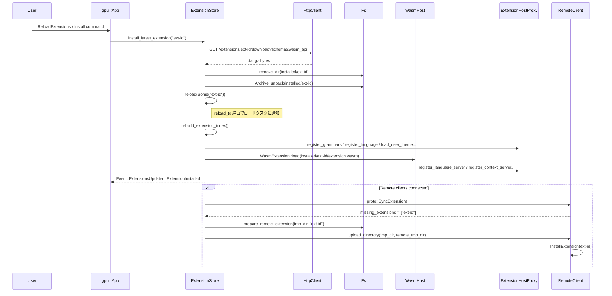

# crates/extension_host ディレクトリ解説

## 1. ざっくり一言

Zed エディタの拡張機能（extensions）を **インストール・アップデート・ロード・実行** するためのクレートです。  
ローカル／リモート双方で動く Wasm ベースの拡張ランタイムと、その上に載る拡張ストアを提供します。

---

## 2. このモジュールの役割

### 2.1 概要

- このクレートは **Zed 拡張のライフサイクル管理** を担当します。
- 拡張の
  - 取得（Zed API からのメタデータ取得・ダウンロード）
  - インストール／アンインストール
  - 更新チェックと自動アップデート
  - ローカル環境・SSH 先などリモート環境への同期
  - Wasm 拡張の起動・API バージョン互換
  を一括して扱います。
- また、ユーザ設定から読み出した **許可済み capability** に基づき、拡張からの外部コマンド実行やダウンロードを制御します。

### 2.2 アーキテクチャ内での位置づけ

主なコンポーネント間の関係を簡略化した図です。

```mermaid
graph TD
  subgraph UI/Host
    App[gpui::App]
    ExtensionStore
    HeadlessExtensionStore
  end

  subgraph Runtime
    WasmHost
    WasmExtension
  end

  subgraph Infra
    Fs[Fs (RealFs/FakeFs)]
    Http[HttpClientWithUrl / HttpClient]
    Node[NodeRuntime]
  end

  ExtensionStore --> WasmHost
  ExtensionStore --> ExtensionHostProxy
  ExtensionStore --> Fs
  ExtensionStore --> Http
  ExtensionStore --> Node
  ExtensionStore --> ExtensionSettings

  WasmHost --> Fs
  WasmHost --> Http
  WasmHost --> Node
  WasmHost --> CapabilityGranter

  HeadlessExtensionStore --> WasmHost
  HeadlessExtensionStore --> ExtensionHostProxy
  HeadlessExtensionStore --> Fs
  HeadlessExtensionStore --> Http

  ExtensionStore --> RemoteClient
```

- `ExtensionStore`
  - GUI 付きの通常の Zed セッションで使われる拡張ストアです。
  - インストール済み拡張のインデックス、HTTP/FS 操作、WasmHost をまとめて管理します。
- `WasmHost` / `wasm_host::wit::*`
  - Wasmtime を使った Wasm ランタイムのラッパです。
  - 拡張 API のバージョンごとの WIT バインディングをまとめ、古いバージョンも含めて実行できるようにします。
- `HeadlessExtensionStore`
  - SSH 先など GUI のないリモート側で拡張をロードするためのストアです。
  - `client::proto::SyncExtensions` / `InstallExtension` RPC に対応しています。

### 2.3 設計上のポイント

コードから読み取れる特徴を列挙します。

- **インデックス駆動**
  - `ExtensionIndex` に、拡張・テーマ・アイコンテーマ・言語を集約。
  - `index.json` をディスクに保存し、起動時の FS スキャンを最小限にする設計です。
- **イベント駆動・非同期**
  - `gpui::Task` と `futures` を用いて、拡張のインストール／再ロードをバックグラウンドで行います。
  - ファイルシステムのウォッチ結果や明示的な `reload` 要求を 1 つのタスクで直列処理し、競合を防いでいます。
- **Wasm API のバージョン互換**
  - `wasm_host::wit::*` で API バージョンごとにモジュールを分け、`Extension` enum でラップ。
  - 新 API から古い API への型変換を多数実装し、1 つのホストで幅広いバージョンを扱えるようにしています。
- **権限制御（capability）**
  - `ExtensionSettings.granted_capabilities` と `CapabilityGranter` により、
    - プロセス実行（`ProcessExec`）
    - ファイルダウンロード（`DownloadFile`）
    - `npm install`（`NpmInstallPackage`）
    をホワイトリスト方式で許可します。
- **リモートとの同期**
  - インストール済み拡張から、必要最小限のファイル（manifest, wasm, language config, debug schemas）を一時ディレクトリにコピーし、`RemoteClient` 経由でアップロードします。
- **安全な書き込みパス検証**
  - `WasmHost::writeable_path_from_extension` で、拡張から指定されたパスが拡張用作業ディレクトリを逸脱しないようチェックします（シンボリックリンクを含む）。

---

## 3. 主要な機能一覧

このクレートが提供する主な機能です。

- 拡張インデックス管理
  - `ExtensionIndex` による、インストール済み拡張・テーマ・言語の一覧管理
  - インデックスファイル (`index.json`) のロード／再構築
- 拡張のインストール／アップグレード／アンインストール
  - Zed クラウド API からの拡張メタデータ取得・ダウンロード
  - `.tar.gz` 展開と拡張ディレクトリへの展開
  - 開発用拡張（`install_dev_extension`）のビルド＋シンボリックリンク
- 自動インストール・自動アップデート
  - `ExtensionSettings` による auto-install / auto-update 設定
  - `auto_install_extensions` と `check_for_updates` による自動処理
- 拡張のロードと UI 連携
  - 拡張 manifest からテーマ・アイコンテーマ・言語・grammar を登録
  - 言語サーバ・コンテキストサーバ・デバッグアダプタの登録／解除
  - `EventEmitter<Event>` による「拡張更新」「インストール完了」「ロード失敗」通知
- Wasm ホスト・拡張ランタイム
  - `WasmHost` による Wasmtime エンジン管理・WASI コンテキスト構築
  - `WasmExtension` による個別拡張のメッセージループ
  - `wasm_host::wit` による WIT バインディングと API バージョンごとのディスパッチ
- リモート拡張（SSH 等）との同期
  - `ExtensionStore::sync_extensions_to_remotes` によるクライアント状態との整合性確保
  - リモート側 `HeadlessExtensionStore` による拡張ロード・言語サーバ登録
- Capability 管理
  - `CapabilityGranter` による exec / download / npm install 要求の検証
  - `ExtensionManifest` 側の manifest 許可と、ホスト側設定の両方を確認

---

## 4. 関数・構造体の解説

### 4.1 主な型一覧

| 名前 | 種別 | 役割 / 用途 |
|------|------|-------------|
| `ExtensionStore` | 構造体 | GUI 環境での拡張ストア本体。インデックス・WasmHost・HTTP/FS・リモートクライアントなどをまとめて管理します。 |
| `ExtensionIndex` | 構造体 | インストール済み拡張・テーマ・アイコンテーマ・言語の一覧情報を保持します。 |
| `ExtensionIndexEntry` | 構造体 | 単一拡張の manifest と dev フラグを保持します。 |
| `ExtensionIndexThemeEntry` / `ExtensionIndexIconThemeEntry` | 構造体 | テーマ名やアイコンテーマ名から、所属拡張 ID とパスを引けるようにするエントリです。 |
| `ExtensionIndexLanguageEntry` | 構造体 | 言語名→拡張 ID・パス・`LanguageMatcher`・ grammar 名などを保持します。 |
| `Event` | 列挙体 | `ExtensionStore` のイベント（拡張更新開始／完了、インストール／アンインストールなど）を表します。 |
| `WasmHost` | 構造体 | Wasmtime エンジン・WASI・HTTP クライアント・NodeRuntime・Fs を束ねる Wasm ホストです。 |
| `WasmExtension` | 構造体 | 単一の Wasm 拡張のランタイム。拡張 API 呼び出しをキュー経由でシリアライズします。 |
| `WasmState` | 構造体 | Wasmtime `Store` に入る状態。WASI コンテキスト・リソーステーブル・`WasmHost` 参照・`CapabilityGranter` を含みます。 |
| `HeadlessExtensionStore` | 構造体 | リモート（SSH 等）環境での拡張ストア。GUI に依存しない最小限のロード/アンロード機能を提供します。 |
| `ExtensionVersion` | 構造体 | リモート側との同期でやりとりする拡張 ID・バージョン・dev フラグです。 |
| `CapabilityGranter` | 構造体 | 拡張が要求する exec / download / npm install を manifest とホスト設定に基づいて検証します。 |
| `ExtensionSettings` | 構造体 | 拡張に関する設定（auto-install / auto-update / granted_capabilities）を表し、`Settings` として登録されます。 |

### 4.2 代表的な関数・メソッド

#### 4.2.1 `ExtensionStore::new(...) -> ExtensionStore`

**概要**

- 拡張ストアを初期化し、インデックス読み込み・必要ならインデックス再構築・自動インストール／更新チェック・FS ウォッチなど、バックグラウンドタスクを立ち上げます。

**引数（主なもの）**

| 引数名 | 型 | 説明 |
|--------|----|------|
| `extensions_dir` | `PathBuf` | 拡張ルートディレクトリ（`installed/`, `work/`, `build/`, `index.json` を含む） |
| `build_dir` | `Option<PathBuf>` | 開発拡張ビルドの出力先（未指定なら `extensions_dir/build`） |
| `extension_host_proxy` | `Arc<ExtensionHostProxy>` | テーマ・言語・言語サーバ・デバッグアダプタなど UI 側との橋渡し |
| `fs` | `Arc<dyn Fs>` | ファイルシステム抽象 |
| `http_client` | `Arc<HttpClientWithUrl>` | Zed 拡張 API への HTTP クライアント |
| `builder_client` | `Arc<dyn HttpClient>` | 拡張ビルド時（Rust 拡張のコンパイルなど）に使う HTTP クライアント |
| `telemetry` | `Option<Arc<Telemetry>>` | テレメトリ送信用（任意） |
| `node_runtime` | `NodeRuntime` | Node.js 実行環境（言語サーバ・ツールのインストール等に利用） |
| `cx` | `&mut Context<Self>` | `gpui` のエンティティコンテキスト |

**戻り値**

- 初期化済みの `ExtensionStore` インスタンス。

**内部処理の流れ（要約）**

1. 各種ディレクトリパス（`work`, `build`, `installed`, `index_path`）を計算。
2. `reload_tx` / `reload_rx` と `ssh_registered_tx` / `connection_registered_rx` のチャネルを構築。
3. `WasmHost::new` を呼び出し、Wasm ホストを初期化。
4. `fs.load` / `fs.metadata` で `index.json` と `installed/` の状態を読み、インデックスの有効性を判定。
5. 有効ならそのまま `extensions_updated` を呼んで拡張をロード。古い／不正なら非同期で `reload(None)` を走らせてインデックス再構築を準備。
6. `cx.spawn` で、`reload_rx` と FS ウォッチイベントを処理するメインループタスクを起動し、拡張の追加・削除・変更をバッファリングして一定時間後に再ロード。
7. 別タスクで `fs.watch(installed_dir)` を起動し、ディレクトリ変化を `reload_tx` に流す。
8. さらに別タスクで自動インストール (`auto_install_extensions`) と更新チェック (`check_for_updates`) を起動。

**使用例（簡略）**

```rust
use std::sync::Arc;
use std::path::PathBuf;
use extension::ExtensionHostProxy;
use fs::RealFs;
use gpui::{App, AppContext as _};
use http_client::HttpClientWithUrl;
use node_runtime::NodeRuntime;

fn init_extension_store(cx: &mut App) {
    let fs = Arc::new(RealFs::new(None, cx.background_executor())); // 実 FS
    let proxy = Arc::new(ExtensionHostProxy::new());                // UI との橋渡し
    let client = /* client::Client をどこかで構築済みとする */;

    // crate::extension_host::init を使うのが通常パターン
    extension_host::init(
        proxy,
        fs,
        client,
        NodeRuntime::unavailable(),
        cx,
    );
}
```

**Errors / Panics / Edge cases**

- `index.json` が壊れている場合
  - `serde_json::from_str` で失敗した場合でも、インデックスを空から再構築するため、致命的エラーにはなりません。
- `installed/` が存在しない場合
  - `fs.metadata` などが `None` を返しても、`fs.create_dir` によって生成されます。
- FS ウォッチ開始に失敗した場合
  - `fs.watch` のエラーは `await` 時に `let (mut paths, _) = fs.watch(...).await` で処理されます。エラー時の挙動は `Fs` 実装に依存します。

**使用上の注意点**

- `ExtensionStore::new` は `gpui` エンティティとして `cx.new(...)` から呼び出される前提です。
- 拡張のロード／アンロードはバックグラウンドタスクで行われるため、直後に状態を読む場合は適切に `executor.advance_clock` などで時間を進める必要があります（テストコード参照）。

---

#### 4.2.2 `ExtensionStore::install_latest_extension(extension_id, cx)`

**概要**

- 指定された拡張 ID の **最新バージョン** を Zed API からダウンロードしてインストールします。
- 拡張の schema version / wasm API version が現在の Zed でサポートされている範囲内になるようクエリパラメータを付与します。

**引数**

| 引数名 | 型 | 説明 |
|--------|----|------|
| `extension_id` | `Arc<str>` | インストールする拡張の ID（例: `"zed-ruby"`） |
| `cx` | `&mut Context<Self>` | `gpui` コンテキスト |

**戻り値**

- 返り値自体は `()`（`Task<Result<()>>` を内部で `detach_and_log_err` しており、メソッドは `()` を返します）。
- 実際のインストール処理はバックグラウンドで行われます。

**内部処理の流れ**

1. ログに `"installing extension {extension_id} latest version"` を出力。
2. `schema_version_range()` および `wasm_api_version_range(ReleaseChannel::global(cx))` から対応可能なバージョン範囲を求める。
3. `http_client.build_zed_api_url("/extensions/{id}/download", [...])` でダウンロード URL を生成。
4. URL の生成に失敗した場合は何も行わず戻る。
5. `install_or_upgrade_extension_at_endpoint` を `ExtensionOperation::Install` で呼び出し、`Task` を `detach_and_log_err` で実行する。

**Errors / Edge cases**

- URL 構築に失敗した場合
  - ログにエラーが記録され、インストールは実行されません。
- すでに同じ拡張 ID に対して別の操作（Install/Upgrade/Remove）が進行中の場合
  - `install_or_upgrade_extension_at_endpoint` 内で `outstanding_operations` をチェックし、すでにエントリがある場合は即 `Ok(())` を返します（重複実行防止）。

**使用上の注意点**

- `ExtensionStore` が `http_client` と `fs` を正しく初期化していることが前提です。
- 実際にインストールが完了したかどうかは、`Event::ExtensionInstalled` イベントや `extension_index` を監視して判定します。

---

#### 4.2.3 `ExtensionStore::uninstall_extension(extension_id, cx) -> Task<Result<()>>`

**概要**

- 指定された拡張 ID をアンインストールします。
- `installed/` 下の拡張ディレクトリと、`WasmHost` の `work_dir` 配下の作業ディレクトリを削除し、インデックスを再構築します。

**引数**

| 引数名 | 型 | 説明 |
|--------|----|------|
| `extension_id` | `Arc<str>` | アンインストール対象の拡張 ID |
| `cx` | `&mut Context<Self>` | gpui コンテキスト |

**戻り値**

- `Task<Result<()>>` — 非同期タスクハンドル。`await` するとアンインストール完了を待てます。

**内部処理の流れ**

1. `installed_dir/{extension_id}` と `wasm_host.work_dir/{extension_id}` のパスを計算。
2. `extension_manifest_for_id` で manifest のクローンを取得しておく（後でイベント通知用に使用）。
3. `outstanding_operations` に `ExtensionOperation::Remove` を追加。すでにエントリがある場合は `Task::ready(Ok(()))` を返して終了。
4. `cx.spawn` で非同期タスクを起動：
   - `_finish` ガードでタスク終了時に `outstanding_operations` のエントリを削除。
   - `fs.remove_dir` で拡張ディレクトリを再帰削除。
   - `reload(None, cx)` を呼び出し、インデックスを再構築。
   - `work_dir` の削除を最大 3 回試行（Windows でプロセスが残るケースを考慮）。
   - `Event::ExtensionUninstalled` を emit し、`ExtensionEvents` があれば `extension::Event::ExtensionUninstalled` も発火。

**Edge cases / 注意点**

- Windows 固有の問題に対応するため、`work_dir` は 0/100/200ms のディレイを挟みつつ最大 3 回削除を試みます。
- すでにアンインストールが進行中の場合は新しいタスクは作られません。
- `Task` を呼び出し側で `detach_and_log_err` するか `await` するかは利用側の責務です。

---

#### 4.2.4 `ExtensionStore::extensions_updated(new_index, cx) -> Task<()>`

**概要**

- 拡張インデックスが変化した時に呼ばれ、古いインデックスとの差分から
  - どの拡張を unload／load するか
  - どのテーマ／言語／grammar／言語サーバを登録／解除するか
  を決定し、適用します。

**引数**

| 引数名 | 型 | 説明 |
|--------|----|------|
| `new_index` | `ExtensionIndex` | 新しく構築したインデックス |
| `cx` | `&mut Context<Self>` | コンテキスト |

**戻り値**

- `Task<()>` — 差分適用処理を行うタスク。

**内部処理の概要**

1. `SUPPRESSED_EXTENSIONS` に含まれる拡張を `new_index.extensions` から削除。
2. 古いインデックスと新インデックスをマージしながら
   - 新規追加 → load
   - 削除 → unload
   - 更新／変更 → unload + load
   を判定。`modified_extensions` に記録された ID も reload 対象になります。
3. unload 対象拡張に紐づく
   - テーマ／アイコンテーマ／言語／grammar
   - 言語サーバ・コンテキストサーバ・デバッグアダプタ
   を `ExtensionHostProxy` 経由で解除。
   - Semantic token rules も `SettingsStore` から削除。
4. load 対象拡張について
   - grammar wasm パス・テーマパス・アイコンテーマパス・スニペットファイルパスを組み立てて登録。
   - 言語については `LanguageConfig` とインライン `queries` / `TaskTemplates` を読み込み、`register_language` にクロージャで渡す。
   - semantic token rules (`semantic_tokens.toml` など) があれば `SettingsStore` に登録。
5. 非同期タスクで
   - 不要になった言語サーバの removal タスクを join
   - テーマ・アイコンテーマ・スニペットを FS から読み込み／登録
   - `WasmExtension::load` で wasm 拡張をロードし、失敗したものはログ＋ `Event::ExtensionFailedToLoad`
6. ロードに成功した wasm 拡張について
   - 言語サーバ・コンテキストサーバ・デバッグアダプタ・デバッグロケータを `proxy` に登録
   - `wasm_extensions` に保持し、`proxy.set_extensions_loaded()` やテーマ・アイコンテーマの再ロード、`ExtensionEvents::ExtensionsInstalledChanged` を emit。

**使用上の注意点**

- この関数は内部で大量の I/O を行うため、直接呼び出すのではなく `reload` 経由で呼び出されます。
- `Task<()>` を呼び出し側で `await` することで、拡張ロード完了を待てます（テストなど）。

---

#### 4.2.5 `ExtensionStore::rebuild_extension_index(&self, cx) -> Task<ExtensionIndex>`

**概要**

- `installed/` ディレクトリをスキャンし、ディスク上の実態から `ExtensionIndex` を再構築します。
- 結果を `index.json` に保存します。

**主要な内部処理**

1. `fs.create_dir(&work_dir)` / `fs.create_dir(&extensions_dir)` で必要なディレクトリを作成。
2. `fs.read_dir(&extensions_dir)` で各拡張ディレクトリを列挙。
3. 各拡張ごとに `add_extension_to_index` を呼び出して index を構築。
4. 完成した index を `serde_json::to_string_pretty`で JSON に変換し、`fs.save(&index_path, ...)` で保存。
5. 経過時間をログに出力し、`ExtensionIndex` を返す。

**`add_extension_to_index` の役割（簡略）**

- `ExtensionManifest::load` で manifest をロード。
- `extension_dir` の symlink かどうかを見て dev 拡張か判定。
- `languages` ディレクトリを読み、`LanguageConfig` をパースして
  - manifest.languages にパスを追加
  - `index.languages` に `ExtensionIndexLanguageEntry` を登録
- `themes` / `icon_themes` ディレクトリを読み、`ExtensionHostProxy` 経由でテーマ名・アイコンテーマ名を抽出し index に登録。
- `extension.wasm` が存在する場合は `manifest.lib.kind` を `ExtensionLibraryKind::Rust` に設定。
- 最終的に `index.extensions.insert` で `ExtensionIndexEntry` を追加。

---

#### 4.2.6 `WasmHost::load_extension(wasm_bytes, manifest, cx) -> Task<Result<WasmExtension>>`

**概要**

- 生の Wasm バイト列から Wasmtime コンポーネントをコンパイルし、`WasmState` を持つ `Store` にバインドして `WasmExtension` を生成します。

**引数**

| 引数名 | 型 | 説明 |
|--------|----|------|
| `wasm_bytes` | `Vec<u8>` | `extension.wasm` のバイト列 |
| `manifest` | `&Arc<ExtensionManifest>` | 対応する拡張 manifest |
| `cx` | `&AsyncApp` | 非同期アプリケーションコンテキスト |

**戻り値**

- `Task<Result<WasmExtension>>` — バックグラウンドでロードされる拡張ランタイム。

**内部処理の流れ（要約）**

1. `parse_wasm_extension_version` で `zed:api-version` セクションから拡張 API バージョンを読み取る。
2. `Component::from_binary(&engine, &wasm_bytes)` で Wasm コンポーネントをコンパイル（背景 executor 上で実行）。
3. `build_wasi_ctx` で拡張用作業ディレクトリと WASI コンテキストを構築。
4. `Store<WasmState>` を作成し
   - `WasmState` に manifest, `ResourceTable`, `WasmHost` 参照, `CapabilityGranter` をセット。
   - `Store::set_epoch_deadline(1)` などで epoch interruption を設定。
5. `wit::Extension::instantiate_async` で API バージョンに応じたバインディングを生成し、`call_init_extension` を実行。
6. 拡張へのコールを受け付けるための `mpsc::unbounded::<ExtensionCall>` を作り、ループタスクを tokio 上で実行。
7. これらをまとめて `WasmExtension` として返す。

**使用上の注意点**

- 拡張 Wasm は必ず `zed:api-version` カスタムセクションを含んでいる必要があります（`parse_wasm_extension_version` 参照）。
- Wasm 内で行われる I/O は Wasmtime + tokio ランタイムに依存するため、`gpui_tokio` の初期化が必要です。

---

#### 4.2.7 `WasmHost::writeable_path_from_extension(id, path) -> Result<PathBuf>`

**概要**

- 拡張から指定されたパスに対し、そのパスが拡張用 `work_dir/{id}` 以下に収まっているか検査し、安全な絶対パスを返します。
- シンボリックリンクを含むパスも守備範囲で、外部へのエスケープを防ぎます。

**引数**

| 引数名 | 型 | 説明 |
|--------|----|------|
| `id` | `&Arc<str>` | 拡張 ID |
| `path` | `&Path` | 拡張が指定した書き込み先パス（相対／絶対どちらも可） |

**戻り値**

- `Ok(PathBuf)` — 実際に書き込むべき安全な絶対パス。
- `Err` — パスが拡張用ディレクトリから外に出る場合など。

**内部処理の要点**

1. `self.fs.canonicalize(&self.work_dir)` で work_dir の実パスを取得。
2. `extension_work_dir = canonical_work_dir.join(id.as_ref())` を計算。
3. 拡張指定パスが相対なら `extension_work_dir.join(path)`、絶対ならそのまま。
4. `util::paths::normalize_lexically` で `..` などを正規化。
5. 最も近い既存の祖先パスを `fs.canonicalize` で解決し、残りの tail コンポーネントを再付加。
6. 最終パスが `extension_work_dir` を prefix に持つか確認し、それ以外ならエラー。

**Edge cases**

- シンボリックリンクで work_dir の外を指す場合
  - canonicalize によりリンク先が解決され、その後 prefix チェックで弾かれます。
- 存在しない深い階層（例: `dir1/dir2/file`）に書き込む場合
  - 既存部分だけ canonicalize し、残りのコンポーネントを再追加することで対応しています。

**使用例（テストでの利用イメージ）**

```rust
let path = host
    .writeable_path_from_extension(&"test-extension".into(),
                                   Path::new("subdir/file.txt"))
    .await?;
assert!(path.starts_with("/work/test-extension"));
```

---

### 4.3 その他の主な関数・メソッド（一覧）

| 関数名 / メソッド名 | 役割（1 行） |
|---------------------|--------------|
| `ExtensionStore::init` | `gpui::App` にグローバルな `ExtensionStore` エンティティを登録し、`ReloadExtensions` アクションをハンドルします。 |
| `ExtensionStore::fetch_extensions` | Zed API `/extensions` から拡張一覧を取得します。 |
| `ExtensionStore::fetch_extensions_with_update_available` | インストール済み拡張のうち、アップデート可能なもののみを API から取得します。 |
| `ExtensionStore::install_extension` / `upgrade_extension` | 特定バージョンの拡張をインストール／アップグレードします。 |
| `ExtensionStore::install_dev_extension` | ローカルディレクトリから開発用拡張をビルドし、`installed/` へ symlink を張ってロードします。 |
| `ExtensionStore::rebuild_dev_extension` | 既存の dev 拡張を再ビルドし、必要なら reload します。 |
| `ExtensionStore::sync_extensions_to_remotes` | リモートクライアントにインストールされていない拡張を一時ディレクトリ経由でアップロードし、リモートにインストールさせます。 |
| `HeadlessExtensionStore::sync_extensions` | クライアント側から送られてきた拡張リストと比較し、リモートでのインストール／アンインストールを行います。 |
| `HeadlessExtensionStore::load_extension` | リモート側で manifest / languages / wasm を読み込み、言語・言語サーバを登録します。 |
| `CapabilityGranter::grant_exec` | プロセス実行を manifest とホスト設定の両方でチェックし、許可されない場合は `bail!` します。 |
| `CapabilityGranter::grant_download_file` | ダウンロード先 URL がホスト側で許可されているか検査します。 |
| `CapabilityGranter::grant_npm_install_package` | npm パッケージのインストール権限を検査します。 |
| `parse_wasm_extension_version` | Wasm バイト列から `zed:api-version` カスタムセクションを探し、`semver::Version` にデコードします。 |

---

## 5. データフロー

ここでは、「拡張をインストールし、ロードして利用可能にする」までの典型的なフローを示します。

### 5.1 処理の要点

1. ユーザまたは設定により、`ExtensionStore::install_latest_extension` や `auto_install_extensions` が呼ばれる。
2. `ExtensionStore` が Zed API から tar.gz 形式の拡張を取得し、`installed/{id}` に展開する。
3. 展開完了後、`reload(Some(id))` を経由して `extensions_updated` が呼ばれ、インデックスが更新される。
4. テーマ・言語・言語サーバなどが `ExtensionHostProxy` 経由で登録される。
5. Wasm 拡張が `WasmHost` にロードされ、言語サーバコマンドやスラッシュコマンドなどが実行可能になる。
6. （リモート接続があれば）`sync_extensions_to_remotes` を通じて SSH 先にも必要な拡張がコピーされる。

### 5.2 シーケンス図



---

## 6. 使い方（How to Use）

### 6.1 基本的な使用方法

Zed 本体のようなアプリケーションで `ExtensionStore` と `WasmHost` を組み込む基本パターンです。

```rust
use std::sync::Arc;
use extension::ExtensionHostProxy;       // 拡張と UI をつなぐプロキシ
use extension_host::ExtensionStore;      // このクレートのストア
use fs::RealFs;
use gpui::{App, AppContext as _};
use http_client::HttpClientWithUrl;
use node_runtime::NodeRuntime;

// アプリケーション起動時に呼び出す初期化関数の一例
fn init_extension_system(cx: &mut App, client: Arc<client::Client>) {
    let fs = Arc::new(RealFs::new(None, cx.background_executor())); // 実ファイルシステム
    let proxy = Arc::new(ExtensionHostProxy::new());                // UI との橋渡し
    let node_runtime = NodeRuntime::unavailable();                  // Node が不要なら unavailable

    // 推奨: extension_host::init を使用してグローバルに登録
    extension_host::init(
        proxy,
        fs,
        client.clone(),
        node_runtime,
        cx,
    );
}

// どこかのハンドラから拡張をインストールする例
fn install_extension_by_id(cx: &mut App, extension_id: &str) {
    let store = ExtensionStore::global(cx);               // グローバルストアを取得
    let id: Arc<str> = extension_id.into();
    store.update(cx, |store, cx| {
        store.install_latest_extension(id.clone(), cx);   // 非同期にインストール
    });
}
```

### 6.2 よくある使用パターン

#### パターン 1: 自動インストール・アップデートの設定

`ExtensionSettings` を通じて、自動インストール／自動アップデートの挙動を制御できます。

```rust
use extension_host::ExtensionSettings;
use settings::{SettingsStore, Settings};

fn configure_extension_settings(cx: &mut gpui::App) {
    SettingsStore::update_global(cx, |store, cx| {
        let mut settings = ExtensionSettings::from_settings(store.content());
        // "html" 拡張は常に自動インストール
        settings.auto_install_extensions.insert("html".into(), true);
        // "experimental-ext" は自動アップデートを無効化
        settings.auto_update_extensions.insert("experimental-ext".into(), false);

        store.set::<ExtensionSettings>(settings, cx);
    });
}
```

- これにより、`ExtensionStore::auto_install_extensions` / `check_for_updates` が動作する際の対象が変わります。

#### パターン 2: 開発中拡張のホットリロード

ローカルディレクトリからの dev 拡張を利用する場合の基本フローです。

```rust
use std::path::PathBuf;
use std::sync::Arc;
use extension_host::ExtensionStore;
use gpui::{App, AppContext as _};

fn install_dev_extension(cx: &mut App, dev_path: PathBuf) {
    let store = ExtensionStore::global(cx);

    store.update(cx, |store, cx| {
        // dev_path には extension.toml / extension.wasm などがあるディレクトリ
        store
            .install_dev_extension(dev_path.clone(), cx)
    })
    .detach_and_log_err(cx);
}
```

- `install_dev_extension` は
  - manifest 読み込み
  - 必要なら既存の非 dev 拡張のアンインストール
  - `ExtensionBuilder` でのビルド
  - `installed/{id}` への symlink 作成
  - `reload(None, cx)` による再ロード
  を行います。

#### パターン 3: リモート（SSH）先での headless 拡張管理

リモート側プロセスでは `HeadlessExtensionStore` を使います。

```rust
use std::sync::Arc;
use extension::ExtensionHostProxy;
use extension_host::headless_host::{HeadlessExtensionStore, ExtensionVersion};
use fs::RealFs;
use gpui::{App, AppContext as _};
use http_client::ReqwestClient;

fn init_headless_store(cx: &mut App, extension_dir: PathBuf) -> gpui::Entity<HeadlessExtensionStore> {
    let fs = Arc::new(RealFs::new(None, cx.background_executor()));
    let http: Arc<dyn http_client::HttpClient> =
        Arc::new(ReqwestClient::user_agent("Zed Remote").unwrap());
    let proxy = Arc::new(ExtensionHostProxy::new());

    HeadlessExtensionStore::new(
        fs,
        http,
        extension_dir,
        proxy,
        NodeRuntime::unavailable(),
        cx,
    )
}
```

- クライアント側からの `SyncExtensions` / `InstallExtension` RPC を処理するハンドラとして
  - `HeadlessExtensionStore::handle_sync_extensions`
  - `HeadlessExtensionStore::handle_install_extension`
  が用意されています。

### 6.3 使用上の注意点（まとめ）

- **非同期タスクと状態の整合性**
  - インストールや reload は `Task` で非同期に行われるため、状態を検証するテストやコードでは適切に `await` する、または `executor.advance_clock` などで時間を進める必要があります。
- **`outstanding_operations` による多重実行防止**
  - 同じ拡張に対する `Install` / `Upgrade` / `Remove` 操作は重複して投げても 1 つだけが実行されます。進行中かどうかを意識する場合は `outstanding_operations()` を参照できます。
- **Wasm API バージョン制限**
  - `wasm_host::wit::is_supported_wasm_api_version` と `wasm_api_version_range` によって、拡張の `wasm_api_version` がサポート外なら `is_version_compatible` が `false` を返します。
  - 未リリースの API を使う場合、`ReleaseChannel::Dev/Nightly` でのみ `authorize_access_to_unreleased_wasm_api_version` が許可します。
- **ファイルパスの安全性**
  - 拡張からファイルを書き込む際は、`download_file` や `make_file_executable` を通じて `writeable_path_from_extension` が必ず呼ばれます。独自に FS へ書き込む API は提供されていません。
- **Capability 設定**
  - 外部プロセス実行、HTTP ダウンロード、npm インストールは manifest とホスト側設定の双方に capability が必要です。
  - 設定で付与されていない場合、拡張コード側からはエラー（`String`）として見え、ホスト側では `extension_error` でラップされた `anyhow::Error` になります。
- **リモート拡張の制限**
  - `allow_remote_load()` を返さない拡張は、`sync_extensions_to_remotes` でリモートに送られません。
  - コンテキストサーバ設定など、バージョンによって未サポートな API もあるため、`wasm_host::wit::Extension` は古いバージョンでは `bail!` する実装になっています。

---

## 7. 関連ファイル

このクレート内の主要ファイルと役割の一覧です。

| パス | 役割 / 関係 |
|------|------------|
| `extension_host/Cargo.toml` | クレート名・依存関係・ベンチマーク設定など。`lib.path = "src/extension_host.rs"` によりメインモジュールが指定されています。 |
| `extension_host/build.rs` | `../extension_api/wit` から生成された Rust ファイルを `OUT_DIR` にコピーし、`wasm_host::wit` モジュールで `include!` できるようにします。 |
| `extension_host/src/extension_host.rs` | クレートのエントリーポイント。`ExtensionStore` とインデックス／インストール／更新／リモート同期などほぼ全ての拡張管理処理がここにあります。 |
| `extension_host/src/extension_settings.rs` | `ExtensionSettings` の定義と `Settings` 実装。auto-install / auto-update / granted_capabilities を扱います。 |
| `extension_host/src/capability_granter.rs` | `CapabilityGranter` の実装。拡張が要求する `ProcessExec` / `DownloadFile` / `NpmInstallPackage` を manifest とホスト設定に基づいて検証します。 |
| `extension_host/src/headless_host.rs` | `HeadlessExtensionStore` と RPC ハンドラ (`handle_sync_extensions`, `handle_install_extension`) の実装。リモート側で拡張をロードする際に使われます。 |
| `extension_host/src/wasm_host.rs` | `WasmHost`, `WasmExtension`, `WasmState` の実装。Wasm エンジン・WASI コンテキスト・安全な書き込みパス検査などを提供します。 |
| `extension_host/src/wasm_host/wit.rs` | 拡張 API のバージョンごとのバインディングを束ねるモジュール。`Extension` enum と各種 `call_...` メソッドを定義しています。 |
| `extension_host/src/wasm_host/wit/since_v*_*.rs` | それぞれの Wasm API バージョン（`v0.0.1`, `v0.0.4`, ..., `v0.8.0`）に対する WIT バインディングと、`latest` への型変換を実装したモジュールです。 |
| `extension_host/src/extension_store_test.rs` | `ExtensionStore` の統合テスト。FakeFs / FakeHttpClient / TestAppContext を使い、拡張インデックス構築・インストール・アンインストール・言語サーバ連携などを網羅的に検証します。 |
| `extension_host/benches/extension_compilation_benchmark.rs` | `ExtensionBuilder` と `WasmHost` を使って拡張のコンパイル・ロード性能を測る Criterion ベンチマークです。 |

このレポートは、このチャンクに含まれるコードだけをもとに作成しており、他クレート（`extension`, `client`, `language` 等）の詳細な実装については触れていません。
