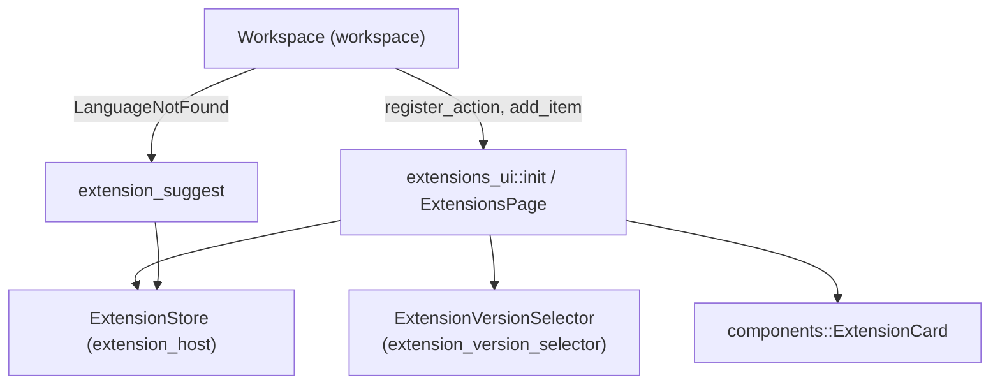
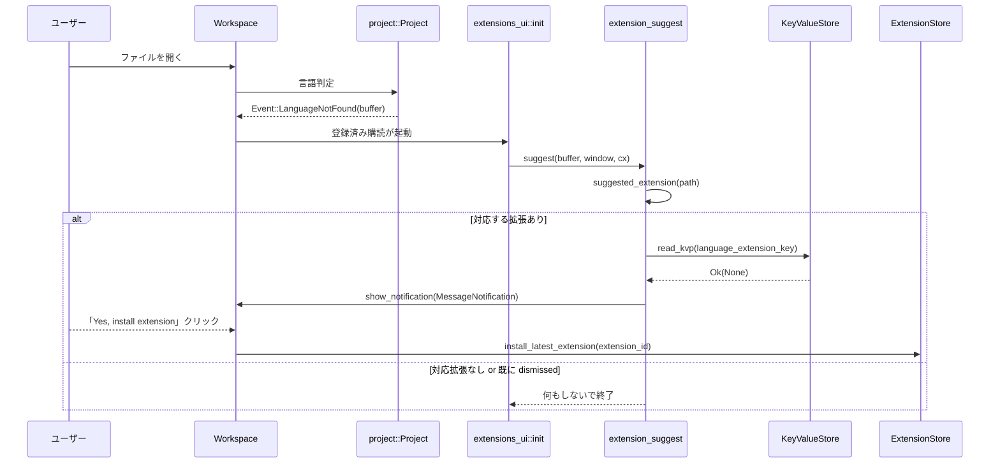

# extensions_ui/ コード解説

## 1. ざっくり一言

Zed の「拡張機能」ページと、その周辺機能（拡張のインストール・アップグレード・バージョン選択・言語拡張の自動提案・各種アップセルバナー）を実装する UI クレートです。

---

## 2. このモジュールの役割

### 2.1 概要

- `extensions_ui` クレートは、Zed の拡張機能を検索・閲覧・インストール・削除・アップグレードするための UI を提供します。
- 開発用拡張（ローカルディレクトリからの dev extension）のインストール／再ビルドも扱います。
- 開いているファイルから適切な言語拡張を推奨する通知、および拡張のバージョン選択モーダルも含まれます。

### 2.2 アーキテクチャ内での位置づけ

主なモジュール間・外部依存の関係は次のようになっています。



- `extensions_ui::init` が `Workspace` に対するアクション登録・イベント購読を行い、`ExtensionsPage` を開く経路を提供します。
- 実際の拡張メタデータやインストール処理は `extension_host::ExtensionStore` に委譲されます。
- `extension_suggest` は `project::Event::LanguageNotFound` をトリガーにして「おすすめ拡張」通知を出し、`ExtensionStore` にインストールを依頼します。
- `extension_version_selector` はモーダル内の `Picker` を使い、拡張の特定バージョンを選択・インストールします。
- `components::ExtensionCard` は拡張 1 件分のカード表示を担う UI コンポーネントです。

### 2.3 設計上のポイント

- **状態管理**
  - `ExtensionsPage` がフィルタ状態・検索クエリ・取得済み拡張リスト・アップセル状態などを一括管理します。
  - `ExtensionStore` は別クレート側にあり、ここでは `global(cx)` 経由で読み書きします。
- **非同期処理**
  - リモート拡張やバージョン情報の取得は `cx.spawn` / `cx.spawn_in` でバックグラウンド処理されます。
  - 検索クエリ入力に対する拡張リストの再取得には 250ms のデバウンスがあります。
- **UI コンポーネント化**
  - 汎用的なカードレイアウトを `ExtensionCard` に分離し、「開発拡張で上書き済み」の状態オーバーレイもこのコンポーネントで処理します。
  - バージョン選択 UI は `ExtensionVersionSelector` + `ExtensionVersionSelectorDelegate` に切り出され、`PickerDelegate` として再利用しやすい形になっています。
- **永続設定との連携**
  - `KeyValueStore` に「この拡張の提案は今後表示しない」フラグを書き込むことで、言語拡張の提案を抑制します。
  - 拡張バージョン選択時や Vim モード切り替えなどで `settings::update_settings_file` を用いて設定ファイルを更新します。

---

## 3. 主要な機能一覧

- 拡張一覧ページ (`ExtensionsPage`) の表示とタブとしての統合
- 拡張の検索（テキスト検索、インストール状態フィルタ、カテゴリフィルタ）
- 拡張のインストール・アンインストール・アップグレード・開発拡張の再ビルド
- 開発拡張（ローカルディレクトリ）インストール用アクション `InstallDevExtension`
- 開いているファイルに応じた言語拡張のインストール提案 (`extension_suggest`)
- 拡張の特定バージョンを選択してインストールするモーダル (`ExtensionVersionSelector`)
- 検索クエリに応じた機能アップセルバナー（Vim モード・言語機能・Git・エージェントなど）
- ACP Registry への誘導バナー（エージェント関連キーワードやカテゴリで表示）

---

## 4. 関数・構造体の解説

### 4.1 主な型一覧

| 名前 | 種別 | 役割 / 用途 |
|------|------|-------------|
| `ExtensionCard` | 構造体（UI） | 個々の拡張をカードとして表示するコンポーネント。開発拡張で上書きされている場合のオーバーレイ表示も担当します。 |
| `SuggestedExtension` | 構造体（内部） | ファイル名/拡張子に基づいて提案された拡張 ID と、そのマッチ元文字列を保持します。`extension_suggest` 内部でのみ使用されます。 |
| `ExtensionVersionSelector` | 構造体（UI） | 拡張バージョン選択用モーダルのルートビュー。`ModalView` として扱われます。 |
| `ExtensionVersionSelectorDelegate` | 構造体 | バージョン選択モーダル内の `PickerDelegate`。バージョンリストや検索マッチ結果を管理します。 |
| `ExtensionStatus` | enum | 拡張の状態（未インストール／インストール中／インストール済み／削除中など）を表します。 |
| `ExtensionFilter` | enum | 一覧に表示する拡張の種類（すべて／インストール済み／未インストール）フィルタを表します。 |
| `Feature` | enum | 検索クエリに応じて表示するアップセル対象機能（Python、Vim、Git など）を列挙します。 |
| `ExtensionCardButtons` | 構造体 | 1 つの拡張カードに表示するボタン群（インストール/アンインストール、アップグレード、設定）をまとめます。 |
| `ExtensionsPage` | 構造体（UI + 状態） | 拡張一覧ページ本体。検索・フィルタ・リスト表示と拡張操作の中心的コンポーネントです。 |

このほか、`keywords_by_feature` や `acp_registry_upsell_keywords` などのヘルパー関数がアップセル判定に利用されています。

---

### 4.2 重要な関数の詳細

#### `pub fn init(cx: &mut App)`

**概要**

- `extensions_ui` クレートのエントリポイントです。
- `Workspace` 生成時に、拡張ページ関連のアクション登録やイベント購読を設定します。

**主な処理の流れ**

1. `cx.observe_new` を使って、新しい `Workspace` が作られたタイミングでクロージャを実行。
2. `workspace.register_action` で `zed_actions::Extensions` に対するハンドラを登録。
   - `ExtensionCategoryFilter` を `ExtensionProvides` に変換して `ExtensionsPage` を開く/更新します。
3. `workspace.register_action` で `InstallDevExtension` アクションも登録。
   - ディレクトリ選択ダイアログを開き、選択したパスを `ExtensionStore::install_dev_extension` に渡します。
4. `cx.subscribe_in(workspace.project(), …)` で `project::Event::LanguageNotFound(buffer)` を購読し、`extension_suggest::suggest` を呼び出して言語拡張のインストールを提案します。

**使用例（概念的）**

```rust
// アプリケーション初期化時に一度だけ呼び出す
fn main() {
    gpui::App::new(|cx| {
        // 他の UI/拡張の初期化に続いて…
        extensions_ui::init(cx); // 拡張 UI を Workspace に組み込む
    });
}
```

**使用上の注意点**

- この関数は Zed 本体側から一度だけ呼び出される想定です。同じ `App` に対して複数回呼ぶとアクション登録が重複する可能性があります。
- `window` が `None` の場合は処理を中断するため、呼び出し側で特別なケアを行う必要はありません。

---

#### `impl ExtensionsPage { pub fn new(...) -> Entity<Self> }`

**概要**

- 新しい拡張ページを生成し、ストアとの購読や検索エディタのセットアップ、初期データのフェッチを行います。

**主な引数**

| 引数名 | 型 | 説明 |
|--------|----|------|
| `workspace` | `&Workspace` | ページを所属させる `Workspace` インスタンス。 |
| `provides_filter` | `Option<ExtensionProvides>` | 初期カテゴリフィルタ（Themes, Languages など）。 |
| `focus_extension_id` | `Option<&str>` | 初期表示時に特定拡張 ID を検索してフォーカスしたい場合に指定します。 |
| `window` | `&mut Window` | UI 要素作成に必要なウィンドウコンテキスト。 |
| `cx` | `&mut Context<Workspace>` | `Workspace` 用のコンテキスト。 |

**内部処理の要点**

1. `ExtensionStore::global(cx)` を取得し、`ExtensionsPage` からの購読をセットアップ。
   - `ExtensionsUpdated` → `fetch_extensions_debounced` を呼び、リスト更新。
   - `ExtensionInstalled` → `on_extension_installed` によりテーマ/アイコンテーマセレクタを開く。
2. 検索用 `Editor` を `cx.new` で生成し、`"Search extensions..."` のプレースホルダを設定。
   - `focus_extension_id` があれば `id:...` 形式の検索文字列で初期化。
   - `cx.subscribe(&query_editor, Self::on_query_change)` で編集イベントを購読。
3. スクロールハンドルや各フィールドを初期化し、`fetch_extensions` を呼び出して初回の拡張一覧を取得。

**エッジケース**

- `provides_filter` が `Some` の場合は、そのカテゴリの拡張のみを取得するよう `fetch_extensions` 呼び出し時に `BTreeSet` に包んで渡しています。
- `focus_extension_id` が指定されている場合、初期検索クエリに `id:xxx` をセットすることで、特定拡張だけを表示するモードになります。

---

#### `fn fetch_extensions(&mut self, search: Option<String>, provides_filter: Option<BTreeSet<ExtensionProvides>>, on_complete: Option<Box<dyn FnOnce(&mut Self, &mut Context<Self>) + Send>>, cx: &mut Context<Self>)`

**概要**

- 拡張ストアからリモート拡張と開発拡張の一覧を取得し、フィルタリングと UI 更新を行う中核メソッドです。

**主な処理フロー**

1. `is_fetching_extensions = true`, `fetch_failed = false` にしてローディング状態を通知。
2. `ExtensionStore::global(cx)` から開発拡張 (`dev_extensions()`) を先に取得。
3. リモート拡張取得タスクを準備:
   - 検索クエリが `Some("id:...")` なら、`fetch_extension_versions(id)` を呼び、もっとも新しい `published_at` のもの 1 件だけを選択。
   - それ以外は `store.fetch_extensions(search.as_deref(), provides_filter.as_ref(), cx)` を呼ぶ。
4. `cx.spawn` で非同期タスクを起動し、開発拡張のローカルフィルタ（`match_strings` による名前検索）とリモート取得結果を待機。
5. `this.update` 内で:
   - `dev_extension_entries` と `remote_extension_entries` を更新。
   - `filter_extension_entries(cx)` を呼んで現在のフィルタ条件に合わせてインデックスリストを作成。
   - `on_complete` コールバックがあればここで実行。
   - エラー時には `fetch_failed = true` にし、後段の空状態メッセージがエラー文言になるようにします。

**Errors / Panics**

- リモート取得でエラーが起きた場合は `fetch_failed` が `true` になり、UI 上では `"Failed to load extensions..."` メッセージが表示されます。
- エラー自体は `detach_and_log_err(cx)` でログ出力されます。

**エッジケース**

- 検索文字列に `id:` プレフィックスがある場合、「その ID に対応する拡張が1つもない」ケースでは `context("no extension found")?` によりエラーになります。
- 非同期タスク終了前に `ExtensionsPage` が破棄される場合、`this.update` は `Err` になり、`detach_and_log_err` でログに残るだけです。

---

#### `impl Render for ExtensionsPage { fn render(&mut self, window: &mut Window, cx: &mut Context<Self>) -> impl IntoElement }`

**概要**

- 拡張一覧ページ全体の UI レイアウトを構築します。
- 検索バー・フィルタボタン・カテゴリフィルタ・アップセルバナー・拡張リストを組み合わせたビューです。

**UI 構成（大まか）**

1. **ヘッダー行**
   - タイトル `Extensions`
   - 「Install Dev Extension」ボタン（`InstallDevExtension` アクションをディスパッチ）

2. **検索・状態フィルタ行**
   - 左: `render_search()` による検索入力（`Editor` ベース）。
   - 右: `ToggleButtonGroup` による `All / Installed / Not Installed` 切り替え。

3. **カテゴリフィルタ行**
   - `ExtensionProvides` 列挙体を元に、「All」＋各カテゴリ（Themes / Languages 等）のボタンを横スクロール可能な行として表示。
   - 選択状態によって `ButtonStyle::Filled` / `Subtle` を切り替え。

4. **アップセル領域**
   - AgentServers カテゴリや特定キーワードで `render_acp_registry_upsell` を表示。
   - 検索語に応じた `render_feature_upsells`（Vim、Python、Git などのバナー）を表示。

5. **拡張リスト**
   - `uniform_list("entries", count, cx.processor(Self::render_extensions))` で仮想リストを構築。
   - 要素 0 件のときは `render_empty_state` を表示。
   - スクロール位置は `UniformListScrollHandle` でトラッキングし、カスタムスクロールバーを表示。

**使用上の注意点**

- `render` 内で `self.render_feature_upsells(cx)` など状態に依存するメソッドを呼びますが、これらは描画と状態更新（`refresh_feature_upsells`）を分離しているため、描画中に追加の非同期処理を開始しません。
- 拡張の総数が多い場合も `uniform_list` により必要な範囲だけ `render_extensions` が呼ばれる構造になっています。

---

#### `pub(crate) fn suggest(buffer: Entity<Buffer>, window: &mut Window, cx: &mut Context<Workspace>)`

**概要**

- `project::Event::LanguageNotFound(buffer)` を受けて呼ばれ、開いているファイルに適した言語拡張をユーザーに提案します。

**処理の流れ**

1. `buffer.read(cx).file()` からファイル情報を取得できなければ何もしないで終了。
2. `suggested_extension(file.path())` を呼び、ファイル名または拡張子に対応する `SuggestedExtension` を探索。
   - 例: `Cargo.toml` → `toml` 拡張、`Dockerfile` → `dockerfile` 拡張。
3. `language_extension_key(extension_id)` をキーに `KeyValueStore::global(cx)` から値を読み取る。
   - `Ok(None)` のときだけ提案を表示。（既に「No」を選んでいる場合などは早期 return）
4. 次フレームで `Workspace` に対し `show_notification` を呼び、`MessageNotification` を表示。
   - Primary ボタン: 「Yes, install extension」
     - `ExtensionStore::global(cx)` を更新し、`install_latest_extension(extension_id)` を呼び出します。
   - Secondary ボタン: 「No, don't install it」
     - 非同期で `kvp.write_kvp(key, "dismissed".to_string())` を実行し、次回以降は提案しません。
5. 通知を出す前に、アクティブエディタのバッファが `buffer` と同一であることを確認し、別のファイルに切り替わっている場合は提案を行いません。

**エッジケース**

- ファイルパスの `file_name` と `extension` の両方が存在する場合、**ファイル名優先** でマッチ判定を行います（より具体的な提案のため）。
- `KeyValueStore::read_kvp` が `Ok(Some(_))` や `Err(_)` の場合はすべて「提案しない」扱いになります。

**テスト**

- `tests::test_suggested_extension` で `suggested_extension` の挙動が検証されています。
  - `Cargo.toml` → `"toml"`, `"toml"` など複数パターンがあります。

---

#### `fn update_matches(&mut self, query: String, window: &mut Window, cx: &mut Context<Picker<Self>>) -> Task<()>` （`ExtensionVersionSelectorDelegate`）

**概要**

- バージョン選択モーダルでの検索クエリに応じて、どのバージョンをどの順序で表示するかを計算します。

**処理の流れ**

1. 既存の `extension_versions` から `StringMatchCandidate` のベクタを生成（`"v{version}"` 形式の文字列）。
2. `cx.spawn_in(window, async move |this, cx| { ... })` で非同期タスクを開始。
3. 非同期タスク内で:
   - クエリが空文字列なら、全候補をスコア 0・positions 空でそのまま並べる。
   - それ以外なら `match_strings` を呼んでファジーマッチを実行し、スコア付きの `Vec<StringMatch>` を取得。
4. 結果を `this.update` 内で `delegate.matches` に反映し、`selected_index` が範囲外にならないように `min` / `saturating_sub(1)` で調整。

**エッジケース**

- クエリが空のときも必ず全候補が表示され、`positions` は空ベクタになるためハイライトは行われません。
- 非同期タスクが返す `matches` は `candidate_id` と実際の `extension_versions` のインデックスを紐付けており、`render_match` ではこの `candidate_id` を使って正しいバージョンを参照します。

---

#### `fn buttons_for_entry(&self, extension: &ExtensionMetadata, status: &ExtensionStatus, has_dev_extension: bool, cx: &mut Context<Self>) -> ExtensionCardButtons`

**概要**

- 1 つの拡張エントリに対して、現在の状態に応じた操作ボタンセットを生成します。

**主な分岐**

1. **`has_dev_extension == true`**
   - 該当拡張 ID の開発拡張が存在する場合、ボタンとしては「Install」プレースホルダを返します。
   - 実際のカード側でオーバーレイを表示してマウス入力をブロックするため、操作できない状態になります。

2. **`ExtensionStatus::NotInstalled`**
   - 「Install」ボタン（`Tinted(Accent)` スタイル）。
   - アイコンはダウンロードマーク。
   - クリックで `ExtensionStore::install_latest_extension` を呼び、`telemetry::event!("Extension Installed")` を記録。

3. **`ExtensionStatus::Installing`**
   - 同じ「Install」ボタンだが `disabled(true)`。
   - 進行中で再度クリックできない状態を表現。

4. **`ExtensionStatus::Installed(installed_version)`**
   - 「Uninstall」ボタン（`OutlinedGhost` スタイル）。
     - クリックで `uninstall_extension` を呼び、非同期タスクを `detach_and_log_err` で起動。
     - テレメトリ `"Extension Uninstalled"` を送信。
   - `manifest.provides` に `ContextServers` が含まれる場合のみ「Configure」ボタンを追加。
     - クリックで `ExtensionEvents::try_global(cx)` に `ConfigureExtensionRequested` を emit。
   - `installed_version != manifest.version` のときのみ「Upgrade」ボタンを追加。
     - バージョン互換性がないときは `disabled(true)` と警告ツールチップを付与。

5. **`ExtensionStatus::Upgrading` / `Removing`**
   - 表示はしますが、すべて `disabled(true)` にして操作できない状態にします。

**エッジケース**

- バージョン互換性は `extension_host::is_version_compatible(ReleaseChannel::global(cx), extension)` でチェックされ、互換性がない場合にはアップグレードボタンは無効化されます。
- `has_dev_extension` が `true` のときは、`ExtensionCard` 側のオーバーレイでクリック自体をブロックする前提のため、この関数の戻り値だけを別 UI で使う場合は注意が必要です。

---

### 4.3 その他の関数（代表）

| 関数名 | 所在 | 役割（1 行） |
|--------|------|--------------|
| `suggested_extension(path: &RelPath)` | `extension_suggest.rs` | ファイル名・拡張子から候補拡張 ID を検索し、`SuggestedExtension` を返します。 |
| `language_extension_key(extension_id: &str)` | 同上 | 言語拡張ごとの KeyValueStore キー文字列を生成します。 |
| `extension_provides_label(provides: ExtensionProvides)` | `extensions_ui.rs` | `ExtensionProvides` を UI 用ラベル文字列（"Languages" など）に変換します。 |
| `keywords_by_feature()` | 同上 | 検索クエリに対応するアップセル対象 `Feature` ごとのキーワード一覧を返します。 |
| `refresh_feature_upsells(&mut self, cx: &mut Context<Self>)` | 同上 | 検索クエリに応じて `upsells` と `show_acp_registry_upsell` を更新します。 |
| `render_acp_registry_upsell` | 同上 | ACP Registry への誘導バナー UI を構築します。 |
| `render_feature_upsell_banner` / `render_feature_upsells` | 同上 | 個々の機能アップセルバナーと、その集合を描画します。 |

---

## 5. データフロー

ここでは、**言語拡張の提案** のフローを例として説明します。

### 5.1 言語拡張提案の流れ

1. ユーザーがあるファイルを開く。
2. `project` がそのファイルに対応する言語定義を見つけられず、`project::Event::LanguageNotFound(buffer)` を発行。
3. `extensions_ui::init` 内で登録された購読により、`extension_suggest::suggest(buffer, window, cx)` が呼ばれる。
4. `suggest` がファイルパスから `SuggestedExtension` を計算。
5. `KeyValueStore` で過去の「No」選択をチェックし、未登録なら `MessageNotification` を表示。
6. ユーザーが「Yes」をクリックすると、`ExtensionStore::install_latest_extension` が呼び出され、拡張がインストールされる。
7. ユーザーが「No」をクリックすると、`KeyValueStore` に `"dismissed"` が書き込まれ、同じ言語拡張の提案は今後行われない。

### 5.2 シーケンス図



---

## 6. 使い方（How to Use）

### 6.1 基本的な使用方法

**アプリへの組み込み**

`extensions_ui` クレートは、`App` 初期化時に `init` を呼ぶことで `Workspace` に統合されます。

```rust
use gpui::App;
use workspace::Workspace;          // Workspace の定義は別クレート

fn main() {
    App::new(|cx| {
        // 他のモジュールの初期化に続いて…
        extensions_ui::init(cx);   // 拡張 UI / 提案機能を有効化する
        // Workspace のセットアップなど…
    });
}
```

**インタラクションの例**

- ユーザーがメニューやショートカットを通じて `zed_actions::Extensions` アクションを発火すると、`ExtensionsPage` タブが開きます。
- 「Install Dev Extension」ボタンは次のようなアクションを発火しています。

```rust
// ExtensionsPage::render 内のボタンクリック
Button::new("install-dev-extension", "Install Dev Extension")
    .on_click(|_event, window, cx| {
        // InstallDevExtension アクションを Workspace に投げる
        window.dispatch_action(Box::new(InstallDevExtension), cx)
    });
```

### 6.2 よくある使用パターン

1. **特定カテゴリの拡張だけを見たい**

   - `zed_actions::Extensions` に `category_filter` を指定して発火すると、該当 `ExtensionProvides` だけが表示された状態で `ExtensionsPage` が開きます。
   - ページ上部のカテゴリボタン（Themes / Languages など）をクリックしても同様の効果があります。

2. **特定の拡張 ID にフォーカスして開きたい**

   - `ExtensionsPage::focus_extension` は検索欄に `id:xxx` 形式のクエリをセットし、その拡張にジャンプします。
   - `new` の引数 `focus_extension_id` を使うと、ページ初期表示時から特定拡張のみが表示されます。

3. **特定バージョンを選んでインストールしたい**

   - 各拡張カード右下の「…」メニューから「Install Another Version...」を選ぶと、`ExtensionVersionSelector` モーダルが開きます。
   - モーダル内の検索欄で `v0.1` などと入力すると、`update_matches` によりバージョン名に対するファジーマッチ結果だけが表示されます。

4. **Vim モードや特定言語機能のドキュメントへ誘導**

   - 拡張一覧で「vim」「python」「git」などを検索すると、`Feature` に対応するアップセルバナーが表示されます。
   - Vim の場合、バナー内のスイッチから `settings.vim_mode` を直接切り替えることができます。

### 6.3 使用上の注意点

- **`id:` プレフィックス付き検索**
  - 検索クエリが `id:...` 形式の場合、サーバー側では「ID で拡張 1 件を特定する」モードとして扱われます。
  - 拡張が存在しない ID を指定すると内部的にはエラー扱いになり、`fetch_failed` フラグが立ちます。

- **開発拡張とリモート拡張の関係**
  - 同じ ID の開発拡張が存在する場合、リモート側カードは `ExtensionCard::overridden_by_dev_extension(true)` でオーバーレイされ、クリックできません。
  - `buttons_for_entry` を他所で単独利用する場合、この前提が外れると「Install」ボタンが実際に押せてしまうので注意が必要です。

- **KeyValueStore による提案抑制**
  - 言語拡張提案で「No, don't install it」を選ぶと、その拡張 ID に対して `"dismissed"` が書かれ、今後同じ提案は表示されません。
  - テストやデバッグで再度提案を見たい場合は、対応する KVP を削除する必要があります（削除方法はこのチャンクには含まれていません）。

- **設定更新 (`update_settings`) の前提**
  - `ToggleState::Selected` / `Unselected` 以外（例えばトライステートの中間状態）が渡された場合、コールバックは早期 return し設定は変更されません。
  - Vim モード切替などで正しく設定を更新したい場合は、`ToggleState` を適切に設定する必要があります。

- **非同期タスクとライフタイム**
  - 拡張一覧取得やバージョン一覧取得は非同期タスクで行われ、`ExtensionsPage` や `ExtensionVersionSelector` が破棄された後に結果が返る場合があります。
  - その場合 `this.update` は失敗し、ログにエラーが残るだけで UI は更新されませんが、パニックにはなりません。

---

## 7. 関連ファイル

| パス | 役割 / 関係 |
|------|------------|
| `extensions_ui/Cargo.toml` | クレートのメタデータと依存関係定義。`extension_host`, `workspace`, `ui`, `gpui` など UI・拡張実行関連のクレートに依存します。 |
| `extensions_ui/src/extensions_ui.rs` | ライブラリのルート。`init` 関数、`ExtensionsPage`、アップセルバナー、フィルタ・検索ロジック、拡張操作の UI が実装されています。 |
| `extensions_ui/src/components.rs` | サブモジュール `components::extension_card` を公開するモジュール。UI コンポーネントの集約ポイントです。 |
| `extensions_ui/src/components/extension_card.rs` | `ExtensionCard` コンポーネントの定義。拡張カード UI と「Overridden by dev extension.」オーバーレイを描画します。 |
| `extensions_ui/src/extension_suggest.rs` | ファイルパスから適切な言語拡張を推定し、インストールを提案する通知ロジックを提供します。`init` からプロジェクトイベントに紐付けられます。 |
| `extensions_ui/src/extension_version_selector.rs` | 拡張バージョン選択モーダル (`ExtensionVersionSelector`) と、そのデリゲート (`ExtensionVersionSelectorDelegate`) を実装します。`ExtensionsPage` のコンテキストメニューから利用されます。 |

このディレクトリ全体として、Zed の拡張機能エクスペリエンス（検索・インストール・提案・アップセル）を一括して提供する UI レイヤーになっています。
