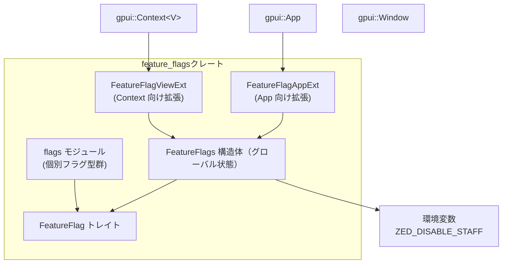

# feature_flags ディレクトリ解説

## 1. ざっくり一言

Zed 内で使われる「機能フラグ（feature flags）」を扱うためのクレートです。  
フラグの保存・判定ロジックと、`gpui::App` / `gpui::Context` から使うための拡張メソッド、および具体的なフラグ型がまとまっています。

---

## 2. このモジュールの役割

### 2.1 概要

- このクレートは、アプリケーション内の **機能の ON/OFF を動的に切り替える** ための仕組みを提供します。
- 機能フラグの名前やデフォルト挙動を表す `FeatureFlag` トレイトと、その具体実装型（`flags.rs`）を定義します。
- 実際の ON/OFF 状態は `FeatureFlags` というグローバル状態に保存され、`gpui::App` や `gpui::Context` から簡単に問い合わせ・監視ができるように拡張されています。
- Zed スタッフ向けの「スタッフモード」や、`ZED_DISABLE_STAFF` 環境変数による挙動の切り替えもここで扱います。

### 2.2 アーキテクチャ内での位置づけ

このクレート内での主な依存関係は次のようになっています。



- `FeatureFlags` は `gpui::Global` を実装しており、`App` / `Context` からグローバル状態として参照されます。
- `FeatureFlagAppExt` は `gpui::App` に対する拡張で、フラグの更新・判定・監視 API を提供します。
- `FeatureFlagViewExt` は `gpui::Context<'_, V>` に対する拡張で、ビュー側からフラグを監視して UI を更新するための API を提供します。
- `flags` モジュールには、実際に利用される個別のフラグ型が並んでいます（`"notebooks"`, `"agent-v2"` など）。

### 2.3 設計上のポイント

コードから読み取れる設計上の特徴は次の通りです。

- **型レベルでのフラグ識別**
  - 各フラグは `FeatureFlag` トレイトを実装した「空の構造体型」で表現されます（例: `NotebookFeatureFlag`）。
  - フラグ名は `const NAME: &'static str` として型に紐づくため、呼び出し側は文字列ではなく型を使って問い合わせます。

- **グローバル状態の一元管理**
  - 実際の「有効なフラグ一覧」と「スタッフかどうか」の状態は `FeatureFlags` 構造体に集約され、`Global` トレイトを通じて `App` / `Context` からアクセスされます。

- **スタッフ向けデフォルト有効化**
  - デフォルトでは「スタッフにはフラグを有効にする」というポリシーを `FeatureFlag::enabled_for_staff()` のデフォルト実装（`true`）で表現しています。
  - `ZED_DISABLE_STAFF` 環境変数が設定されていると、このスタッフ向けの自動有効化を無効化します。

- **デバッグビルドでの特別扱い**
  - `cfg!(debug_assertions)` によって、デバッグビルド時にはスタッフ扱いに近い挙動（多くのフラグを有効にする）が行われます。

- **リアクティブな監視 API**
  - フラグ変化に応じてコールバックを呼び出す `observe_flag` / `when_flag_enabled` が用意されており、UI 側のコードは「フラグが有効になったら〇〇する」といった書き方ができます。

---

## 3. 主要な機能一覧

このクレートが提供する主な機能は次の通りです。

- `FeatureFlag` トレイト: 各機能フラグの名前とデフォルト挙動（スタッフ向け / 全員向け）を定義する。
- `FeatureFlags` グローバル状態: 現在有効なフラグ一覧と「スタッフかどうか」の状態を保持し、`has_flag` で判定する。
- `FeatureFlagAppExt` トレイト:
  - `App::update_flags` でフラグ一覧とスタッフ状態を更新する。
  - `App::has_flag::<T>()` で任意のフラグの有効・無効を問い合わせる。
  - `App::observe_flag::<T>()` / `App::on_flags_ready()` でフラグやスタッフ状態の変化を監視する。
- `FeatureFlagViewExt` トレイト:
  - ビューコンテキスト (`Context<'_, V>`) からフラグを監視する `observe_flag::<T>()` を提供する。
  - フラグが有効になったタイミングで一度だけ処理を行う `when_flag_enabled::<T>()` を提供する。
- `flags` モジュール内の具体的なフラグ型群:
  - `NotebookFeatureFlag`, `AgentV2FeatureFlag`, `DiffReviewFeatureFlag` など、実際に使われるフラグを型として定義している。
- 環境変数制御:
  - `ZED_DISABLE_STAFF` 環境変数を読み取り、スタッフ自動有効化を抑制する。

---

## 4. 関数・構造体の解説

### 4.1 主要な型とトレイト

#### 4.1.1 グローバル状態と共通トレイト

| 名前 | 種別 | 役割 / 用途 |
|------|------|-------------|
| `FeatureFlags` | 構造体 | 現在有効なフラグ名のリストと、ユーザーがスタッフかどうかを保持するグローバル状態です。`Global` を実装しています。 |
| `FeatureFlag` | トレイト | 個々のフラグ型が実装するトレイトです。`NAME`（フラグ名）と、スタッフ・全員向けのデフォルト有効化ロジックを定義します。 |
| `OnFlagsReady` | 構造体 | `on_flags_ready` コールバックに渡される情報をまとめる構造体です。現在は `is_staff: bool` だけを持ちます。 |
| `ZED_DISABLE_STAFF` | `static LazyLock<bool>` | 環境変数 `ZED_DISABLE_STAFF` を元に、「スタッフ自動有効化を無効にするかどうか」を判定するフラグです。 |

#### 4.1.2 App / View 用拡張トレイト

| 名前 | 種別 | 役割 / 用途 |
|------|------|-------------|
| `FeatureFlagAppExt` | トレイト | `gpui::App` に対して実装される拡張トレイトです。フラグの更新・問い合わせ・監視 API を追加します。 |
| `FeatureFlagViewExt<V>` | トレイト | `gpui::Context<'_, V>` 向けの拡張トレイトです。ビューからフラグの状態を監視し、UI 更新や処理実行に利用します。 |

#### 4.1.3 個別フラグ型（`flags.rs`）

全て、空の構造体 + `FeatureFlag` 実装です。`NAME` によってサーバーなどと連携します。

| 型名 | `NAME` | `enabled_for_staff()` | 備考 |
|------|--------|----------------------|------|
| `NotebookFeatureFlag` | `"notebooks"` | デフォルト (`true`) | ノートブック機能用フラグと推測されます（コードから用途の詳細は分かりません）。 |
| `PanicFeatureFlag` | `"panic"` | デフォルト (`true`) | パニック関連機能用フラグと推測されます。 |
| `AgentV2FeatureFlag` | `"agent-v2"` | `true`（明示） | デフォルト通りスタッフには有効。 |
| `AcpBetaFeatureFlag` | `"acp-beta"` | デフォルト (`true`) | コメントにある通り、新しいベータ機能でも再利用されるフラグです。 |
| `AgentSharingFeatureFlag` | `"agent-sharing"` | デフォルト (`true`) | エージェント共有機能のフラグと推測されます。 |
| `DiffReviewFeatureFlag` | `"diff-review"` | `false` | スタッフ向けにも自動では有効にしません。 |
| `StreamingEditFileToolFeatureFlag` | `"streaming-edit-file-tool"` | `true` | スタッフには自動有効。 |
| `UpdatePlanToolFeatureFlag` | `"update-plan-tool"` | `false` | スタッフでも自動有効にはしない。 |
| `ProjectPanelUndoRedoFeatureFlag` | `"project-panel-undo-redo"` | `false` | 同上。 |

> 用途の詳細は他ファイルに依存するため、このチャンクからは分かりません。

### 4.2 重要なメソッド・関数の詳細

ここでは代表的な 7 個の API を詳しく説明します。

---

#### 4.2.1 `FeatureFlags::has_flag<T: FeatureFlag>(&self) -> bool`

**概要**

- 型 `T` で表されるフラグが有効かどうかを判定します。
- スタッフ向けのデフォルト有効化や、`enabled_for_all` による全員向け有効化を考慮します。

**内部処理の流れ**

1. `T::enabled_for_all()` が `true` なら常に `true` を返す。
2. それ以外の場合、
   - `cfg!(debug_assertions)`（デバッグビルド）または `self.staff` が `true` で、
   - かつ `! *ZED_DISABLE_STAFF` が `true`（スタッフ自動有効化が無効化されていない）で、
   - かつ `T::enabled_for_staff()` が `true`
   の全てを満たすとき `true` を返す。
3. 上記いずれでもない場合、`self.flags` の中に `T::NAME` と等しい文字列が含まれているかどうかを `iter().any(...)` で判定し、その結果を返す。

**Edge cases（エッジケース）**

- `self.flags` に同じ名前が複数回含まれていても、`any` を使っているため挙動は変わりません（1 回でもあれば `true`）。
- `T::NAME` と完全一致しない文字列（大文字小文字違いなど）は無視されます。
- `enabled_for_all()` が `true` のフラグは、フラグリストやスタッフ状態に関係なく常に有効です。
- `enabled_for_staff()` が `false` のフラグは、スタッフであっても自動有効にはなりません（`flags` リストに明示的に含まれていなければ無効）。

**使用上の注意点**

- フラグ名文字列（`T::NAME`）とサーバー等から渡されるフラグ名が厳密に一致している必要があります。
- スタッフ自動有効化は `ZED_DISABLE_STAFF` 環境変数で一括抑制されます。テスト時に「スタッフなのに無効になっている」場合は環境変数を確認する必要があります。

---

#### 4.2.2 `FeatureFlagAppExt::update_flags(&mut self, staff: bool, flags: Vec<String>)`

**概要**

- `App` に紐づく `FeatureFlags` グローバルを更新し、「スタッフかどうか」と「有効なフラグ名一覧」をまとめて設定します。

**引数**

| 引数名 | 型 | 説明 |
|--------|----|------|
| `staff` | `bool` | 現在のユーザーがスタッフかどうか。 |
| `flags` | `Vec<String>` | 有効なフラグ名を表す文字列のリスト。`FeatureFlag::NAME` と一致する値が有効になります。 |

**戻り値**

- 戻り値はありません。内部で `FeatureFlags` グローバルを書き換えます。

**内部処理の流れ**

1. `self.default_global::<FeatureFlags>()` を呼び出し、`FeatureFlags` グローバルへの可変参照を取得する。
2. `feature_flags.staff = staff;` でスタッフフラグを更新。
3. `feature_flags.flags = flags;` でフラグ名リストをまるごと置き換える。

**Edge cases**

- 以前設定されていたフラグリストは完全に上書きされます。差分更新ではありません。
- `flags` に同じ名前が複数含まれていても、判定は `any` によるため実害はありません。

**使用上の注意点**

- すべての有効フラグを毎回渡す前提の API です。部分的に追加・削除する用途には向きません（そうした用途には別のラッパーを用意する必要があります）。
- `default_global` の詳細実装はこのチャンクからは分かりませんが、`FeatureFlags: Default` であるため、初回呼び出し時にデフォルト値（`staff=false`, `flags=[]`）から初期化されると解釈できます。

---

#### 4.2.3 `FeatureFlagAppExt::has_flag<T: FeatureFlag>(&self) -> bool`

**概要**

- `App` 全体から見て、フラグ `T` が現在有効かどうかを問い合わせるためのショートカットです。
- `FeatureFlags` グローバルがまだ存在しない場合でも、デバッグビルド + スタッフ向けデフォルトなどを考慮したフォールバック挙動を持ちます。

**内部処理の流れ**

1. `self.try_global::<FeatureFlags>()` を呼び出し、`FeatureFlags` グローバルが存在するか試す。
2. 存在する場合は `flags.has_flag::<T>()` の結果をそのまま返す。
3. 存在しない場合は `unwrap_or_else` によるフォールバック:
   - `cfg!(debug_assertions) && T::enabled_for_staff() && !*ZED_DISABLE_STAFF` が `true` なら `true`。
   - または `T::enabled_for_all()` が `true` なら `true`。
   - それ以外は `false`。

**Edge cases**

- アプリ起動直後など、まだ `update_flags` が呼ばれていないタイミングでも使えます。その場合、デバッグビルドでは多くのフラグが「スタッフ扱い」で有効になる可能性があります。
- リリースビルドかつ `FeatureFlags` 未初期化の場合、`enabled_for_all()` が `true` のフラグ以外は `false` になります。

**使用上の注意点**

- 「本番と同じ条件で挙動を確認したい」場合、デバッグビルド特有のフォールバックが影響する可能性があります。必要に応じてリリースビルドで確認するか、`ZED_DISABLE_STAFF` を設定してスタッフ自動有効化を抑制する必要があります。
- `FeatureFlags` グローバルの状態を無視して `has_flag` の結果だけでロジックを書いて構いませんが、「いつ初期化されるか」はアプリ全体の設計に依存します（このチャンクからは詳細不明です）。

---

#### 4.2.4 `FeatureFlagAppExt::observe_flag<T: FeatureFlag, F>(&mut self, callback: F) -> Subscription`

**概要**

- `App` レベルで `FeatureFlags` の変化を監視し、フラグ `T` の現在の状態（`bool`）をコールバックに渡します。
- フラグ状態の変化のたびにコールバックが呼ばれる設計と解釈できます（`observe_global` に依存します）。

**引数**

| 引数名 | 型 | 説明 |
|--------|----|------|
| `callback` | `FnMut(bool, &mut App) + 'static` | 第 1 引数にフラグの有効/無効、第 2 引数に `App` への可変参照を受け取るコールバックです。 |

**戻り値**

- `Subscription` 型が返ります。これを保持している間、監視が有効で、`drop` されると監視が停止すると考えられます（`Subscription` の仕様自体はこのチャンクからは不明ですが、一般的な命名です）。

**内部処理の流れ**

1. `self.observe_global::<FeatureFlags>(move |cx| { ... })` を呼び出し、`FeatureFlags` グローバルの変化を監視します。
2. コールバック内で `let feature_flags = cx.global::<FeatureFlags>();` により現在の `FeatureFlags` を取得します。
3. `feature_flags.has_flag::<T>()` を計算し、その結果と `cx`（`&mut App`）をユーザーコールバックに渡します。

**使用例**

`App` からフラグを監視する簡単な例です。

```rust
use feature_flags::{FeatureFlagAppExt, FeatureFlag, NotebookFeatureFlag}; // フラグ関連のトレイトと型をインポート

fn setup_flag_logging(app: &mut gpui::App) {                    // App 初期化時などに呼ばれる関数だと仮定
    let _subscription = app.observe_flag::<NotebookFeatureFlag>(|enabled, app| {
        // enabled: "notebooks" フラグの現在の有効状態
        // app: gpui::App への可変参照（必要なら他の処理に利用可能）

        if enabled {
            // フラグが有効になったときの処理
            // 例: ログを出す、特定の設定を有効化する等
        } else {
            // フラグが無効になったときの処理
        }
    });                                                          // Subscription は _subscription に保持しておく
}                                                                // _subscription がドロップされると監視も終了すると考えられます
```

**エッジケース / 使用上の注意点**

- 戻り値の `Subscription` をどこにも保持しないと、すぐにドロップされ監視が効果を持たない可能性があります。フィールドなどに格納してライフタイムを管理する必要があります。
- コールバック内で重い処理を行うと、`FeatureFlags` の更新に対するレスポンスが遅くなる可能性があります。

---

#### 4.2.5 `FeatureFlagViewExt<V>::observe_flag<T, F>(&mut self, window: &Window, callback: F) -> Subscription`

**概要**

- ビュー側コンテキスト (`Context<'_, V>`) からフラグ `T` の状態を監視し、ビューとウィンドウに対してコールバックを行うための API です。

**引数**

| 引数名 | 型 | 説明 |
|--------|----|------|
| `window` | `&Window` | 対象のウィンドウ。`observe_global_in` に渡され、文脈付きで監視が行われます。 |
| `callback` | `Fn(bool, &mut V, &mut Window, &mut Context<V>) + 'static` | フラグの状態とビュー、ウィンドウ、コンテキストへの参照を受け取るコールバックです。 |

**戻り値**

- `Subscription`。保持している間、監視が継続されます。

**内部処理の流れ**

1. `self.observe_global_in::<FeatureFlags>(window, move |v, window, cx| { ... })` を呼び出し、`FeatureFlags` の変化を監視する。
2. コールバック内で `cx.global::<FeatureFlags>()` により `FeatureFlags` を取得。
3. `feature_flags.has_flag::<T>()` を計算し、その結果と `v`（ビュー）、`window`、`cx` をユーザーコールバックに渡す。

**使用例**

```rust
use feature_flags::{FeatureFlagViewExt, NotebookFeatureFlag};   // ビュー用拡張とフラグ型をインポート

struct MyView;                                                  // ビュー構造体（詳細は省略）

impl MyView {
    fn init(&mut self, window: &Window, cx: &mut gpui::Context<MyView>) {
        // "notebooks" フラグの状態を監視して UI を更新する
        let _subscription = cx.observe_flag::<NotebookFeatureFlag>(window, |enabled, view, window, cx| {
            // enabled: フラグの有効状態
            // view: &mut MyView（ビュー自身）
            // window: &mut Window
            // cx: &mut Context<MyView>

            if enabled {
                // ノートブック関連の UI を表示するなどの処理
            } else {
                // UI を隠すなどの処理
            }
        });

        // _subscription をビューのフィールドに保存しておくのが一般的です
    }
}
```

**使用上の注意点**

- `Subscription` のライフタイム管理は呼び出し側で行う必要があります（ビューのフィールドなどに保持する）。
- コールバックは `Send + Sync + 'static` 制約があるため、キャプチャするデータにもそれに対応した制約がかかります。

---

#### 4.2.6 `FeatureFlagViewExt<V>::when_flag_enabled<T>(...)`

```rust
fn when_flag_enabled<T: FeatureFlag>(
    &mut self,
    window: &mut Window,
    callback: impl Fn(&mut V, &mut Window, &mut Context<V>) + Send + Sync + 'static,
);
```

**概要**

- フラグ `T` が「有効になったタイミングで一度だけ」コールバックを実行するための API です。
- すでに有効なら即座（正確には `defer_in` 経由で）実行され、無効なら有効になるまで監視します。

**内部処理の流れ（簡略化）**

1. `self.try_global::<FeatureFlags>()` で既にグローバルがあるか確認。
2. あり、かつ `has_flag::<T>()` が `true` なら、
   - `self.defer_in(window, move |view, window, cx| { callback(view, window, cx); });` を呼んで終了。
3. そうでない場合、
   - `Rc<RefCell<Option<Subscription>>>` を用意し、
   - `observe_global_in::<FeatureFlags>` で `FeatureFlags` を監視。
   - 監視コールバック内で `feature_flags.has_flag::<T>()` が `true` になったらユーザーコールバックを実行し、`subscription.take()` で `Subscription` を `Option` から取り出し破棄（＝監視解除）する。

**Edge cases**

- フラグがずっと有効にならない場合、監視は継続したままになります。
- 一度有効になってコールバックが実行されると、監視は解除されるため、後でフラグが無効→再度有効になってもコールバックは再び実行されません。

**使用例**

```rust
use feature_flags::{FeatureFlagViewExt, DiffReviewFeatureFlag}; // フラグと拡張トレイトをインポート

impl MyView {
    fn init(&mut self, window: &mut Window, cx: &mut gpui::Context<MyView>) {
        // "diff-review" フラグが有効になったときに一度だけ UI を初期化する
        cx.when_flag_enabled::<DiffReviewFeatureFlag>(window, |view, window, cx| {
            // ここはフラグ有効時に一度だけ呼ばれる
            // Diff Review 用のパネルを作成するなどの処理を書く
        });
    }
}
```

**使用上の注意点**

- 「一度だけ」であることが重要です。繰り返しの変化に追従したい場合は `observe_flag` を使うべきです。
- 内部で `Rc<RefCell<Option<Subscription>>>` を使って自動で購読解除しているため、呼び出し側で `Subscription` を保持する必要はありません。

---

#### 4.2.7 `FeatureFlagAppExt::on_flags_ready<F>(&mut self, callback: F) -> Subscription`

**概要**

- `FeatureFlags` グローバルが利用可能になったタイミング（およびその後の更新）で、スタッフ状態情報をまとめた `OnFlagsReady` をコールバックに渡します。

**引数**

| 引数名 | 型 | 説明 |
|--------|----|------|
| `callback` | `FnMut(OnFlagsReady, &mut App) + 'static` | `OnFlagsReady`（現状 `is_staff` のみ）と `&mut App` を受け取るコールバックです。 |

**戻り値**

- `Subscription`。保持している間、`FeatureFlags` の変化に応じてコールバックが呼ばれます。

**内部処理の流れ**

1. `self.observe_global::<FeatureFlags>(move |cx| { ... })` で `FeatureFlags` を監視。
2. コールバック内で `let feature_flags = cx.global::<FeatureFlags>();` により現在の状態を取得。
3. `OnFlagsReady { is_staff: feature_flags.staff }` を構築し、`callback(on_flags_ready, cx)` を呼び出す。

**使用例**

```rust
use feature_flags::FeatureFlagAppExt;                           // App 向け拡張をインポート

fn setup_staff_dependent_behavior(app: &mut gpui::App) {
    let _subscription = app.on_flags_ready(|info, app| {
        // info.is_staff: 現在のユーザーがスタッフかどうか
        if info.is_staff {
            // スタッフ向けの設定やログを有効にする処理
        } else {
            // 非スタッフ向けの設定
        }
    });

    // _subscription をどこかに保持しておくと、後続更新にも追従できます
}
```

**使用上の注意点**

- 現状 `OnFlagsReady` に含まれるのは `is_staff` だけです。今後フィールドが増える可能性はありますが、このチャンクからは分かりません。
- スタッフ状態のみ必要な場合には便利ですが、個別フラグの状態も必要なら `observe_flag::<T>` と組み合わせて使う必要があります。

---

## 5. データフロー

`update_flags` → グローバル更新 → 観察 API → UI 更新、という典型的なデータフローを示します。

### 5.1 代表的なフロー

1. どこかのコードから `App::update_flags(staff, flags)` が呼ばれ、`FeatureFlags` グローバルの `staff` と `flags` が更新されます。
2. `gpui::App` / `Context` の `observe_global` / `observe_global_in` によって、`FeatureFlags` の変化が検知されます。
3. `FeatureFlagAppExt::observe_flag` や `FeatureFlagViewExt::observe_flag` を通じて登録されたコールバックが呼び出され、`has_flag::<T>()` の結果（`bool`）が渡されます。
4. ビューやアプリのコードはこの結果に応じて UI や振る舞いを更新します。

### 5.2 シーケンス図

```mermaid
sequenceDiagram
    participant Caller as 呼び出し側コード
    participant App as App（gpui::App）
    participant FF as FeatureFlags グローバル
    participant View as View（Context&lt;V&gt;）

    Caller->>App: update_flags(staff, flags)
    App->>FF: staff, flags を更新
    FF-->>App: グローバル更新が通知される（observe_global）
    App-->>View: observe_flag / when_flag_enabled のコールバックが呼ばれる
    View->>View: has_flag::<T>() の結果に応じて UI や状態を更新
```

- 実際の通知メカニズム (`observe_global`, `Subscription` の挙動) は `gpui` クレートに依存するため、このチャンクからは詳細は分かりませんが、上記のような流れでリアクティブな更新が行われます。

---

## 6. 使い方（How to Use）

### 6.1 基本的な使用方法

典型的な利用手順は次の通りです。

1. **フラグ型の定義（または既存フラグ型の利用）**
2. **`App::update_flags` でフラグ状態をセット**
3. **`App::has_flag::<T>()` で条件分岐**
4. **ビューから `observe_flag` / `when_flag_enabled` で UI を連動**

#### 1. フラグ型の定義

`flags.rs` の既存例と同様に、独自のフラグ型を定義できます。

```rust
use feature_flags::FeatureFlag;                                 // FeatureFlag トレイトをインポート

// 独自の機能フラグを表す空の構造体
pub struct MyExperimentalFeatureFlag;

// フラグ名とデフォルト挙動を定義
impl FeatureFlag for MyExperimentalFeatureFlag {
    const NAME: &'static str = "my-experimental-feature";       // サーバーなどと共有するフラグ名文字列

    fn enabled_for_staff() -> bool {
        true                                                    // スタッフにはデフォルトで有効
    }

    fn enabled_for_all() -> bool {
        false                                                   // 全員向けにはデフォルトでは無効
    }
}
```

#### 2. フラグ状態のセット

アプリケーションのどこかで、取得したフラグリストを `update_flags` に渡します。

```rust
use feature_flags::FeatureFlagAppExt;                           // App 向け拡張をインポート

fn apply_feature_flags(app: &mut gpui::App) {
    let staff = true;                                           // 例: ユーザーがスタッフであると判定された
    let flags = vec![
        "my-experimental-feature".to_string(),                  // 有効なフラグ名を列挙
    ];

    app.update_flags(staff, flags);                             // FeatureFlags グローバルを更新
}
```

#### 3. App レベルでの条件分岐

```rust
use feature_flags::{FeatureFlagAppExt, MyExperimentalFeatureFlag};

fn do_something(app: &gpui::App) {
    if app.has_flag::<MyExperimentalFeatureFlag>() {            // フラグが有効なときのみ実行
        // 実験的機能のコード
    } else {
        // 旧来のコード
    }
}
```

#### 4. ビューからの監視

```rust
use feature_flags::{FeatureFlagViewExt, MyExperimentalFeatureFlag};

struct MyView {
    // 必要なら Subscription をフィールドとして保持
    // subscription: Option<Subscription>,
}

impl MyView {
    fn init(&mut self, window: &mut gpui::Window, cx: &mut gpui::Context<MyView>) {
        let _subscription = cx.observe_flag::<MyExperimentalFeatureFlag>(window, |enabled, view, window, cx| {
            if enabled {
                // フラグ有効時の UI 更新
            } else {
                // 無効時の UI 更新
            }
        });

        // 実際には _subscription を self のフィールドに保存するのが一般的です。
    }
}
```

### 6.2 よくある使用パターン

#### パターン 1: 「フラグが有効になったタイミングで一度だけ初期化する」

`when_flag_enabled::<T>` を使うと、「フラグが有効になったときに一度だけ何かする」処理を書きやすくなります。

```rust
use feature_flags::{FeatureFlagViewExt, StreamingEditFileToolFeatureFlag};

impl MyView {
    fn init(&mut self, window: &mut gpui::Window, cx: &mut gpui::Context<MyView>) {
        cx.when_flag_enabled::<StreamingEditFileToolFeatureFlag>(window, |view, window, cx| {
            // "streaming-edit-file-tool" フラグが有効になったタイミングで一度だけ呼ばれる
            // 対応するツールバーボタンを追加するなどの初期化コードを書く
        });
    }
}
```

#### パターン 2: スタッフ向けのデバッグ機能をフラグで制御

`enabled_for_staff()` を `true` のままにしておくと、スタッフ（およびデバッグビルド）ではフラグが有効になります。

```rust
impl FeatureFlag for PanicFeatureFlag {
    const NAME: &'static str = "panic";

    // デフォルト実装の enabled_for_staff() == true を利用
}
```

- スタッフにだけ見せたいデバッグ機能などは、このパターンで制御できます。
- テストのためにスタッフ自動有効化を無効にしたい場合は、`ZED_DISABLE_STAFF` 環境変数を設定します（次節参照）。

### 6.3 使用上の注意点

- **フラグ名の厳密一致**
  - 判定は `f.as_str() == T::NAME` で行うため、大文字小文字やハイフン等まで完全一致している必要があります。

- **`update_flags` は全置き換え**
  - 渡した `Vec<String>` で内部のフラグリストは丸ごと置き換えられます。差分更新を行いたい場合は、呼び出し側でマージ処理を行う必要があります。

- **スタッフ自動有効化と `ZED_DISABLE_STAFF`**
  - `enabled_for_staff()` が `true` のフラグは、スタッフ（およびデバッグビルド）の場合、自動的に有効になる挙動があります。
  - ただし、環境変数 `ZED_DISABLE_STAFF` が **空でなく `"0"` 以外** に設定されていると、この自動有効化は無効になります。
  - 値の有無・文字列 `"0"` / `"1"` などを間違えると意図しない挙動になるため注意が必要です。

- **デバッグビルドとリリースビルドの違い**
  - `cfg!(debug_assertions)` により、デバッグビルドでは `App::has_flag` のフォールバックがより寛容（スタッフ扱い）になります。
  - 本番同等の検証をしたい場合は、リリースビルドでの挙動も確認する必要があります。

- **`Subscription` のライフタイム管理**
  - `observe_flag` や `on_flags_ready` などの戻り値である `Subscription` は、保持している間だけ監視が有効です。
  - ローカル変数に束縛するだけではスコープを抜けると同時にドロップされるため、ビューやアプリのフィールドに保存するなどしてライフタイムを延ばすことが一般的です。

- **`FeatureFlags` は直接触らない**
  - このクレートでは `FeatureFlags` を直接公開しておらず、`update_flags` や `set_staff` などの API 経由で更新する設計になっています。
  - 他のコードから直接 `FeatureFlags` を変更すると整合性が崩れる可能性があるため、公開された API を通じて操作する前提です。

---

## 7. 関連ファイル

| パス | 役割 / 関係 |
|------|------------|
| `feature_flags/Cargo.toml` | クレート `feature_flags` のメタデータと依存関係 (`gpui`) を定義します。ライブラリのエントリポイントは `src/feature_flags.rs` と指定されています。 |
| `feature_flags/src/feature_flags.rs` | クレートのメインモジュールです。`FeatureFlags` 構造体、`FeatureFlag` トレイト、`FeatureFlagAppExt` / `FeatureFlagViewExt`、`OnFlagsReady`、および `ZED_DISABLE_STAFF` の定義が含まれます。また、`mod flags;` と `pub use flags::*;` により `flags.rs` のフラグ型を再エクスポートしています。 |
| `feature_flags/src/flags.rs` | 個別のフラグ型（`NotebookFeatureFlag` など）を定義するモジュールです。各フラグは `FeatureFlag` トレイトを実装した空の構造体として表現されます。 |

この 3 ファイルで、「フラグの定義」「フラグ状態の保持」「App / View からの利用」という一連の機能フラグ機構が完結しています。
