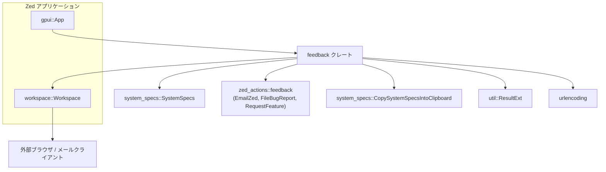
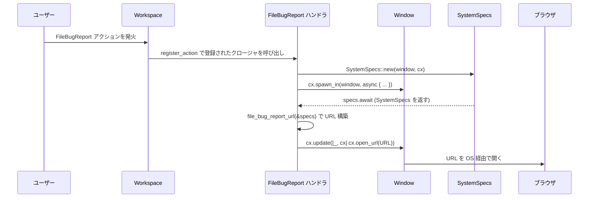

# feedback/ ディレクトリ解説

## 1. ざっくり一言

Zed エディタでのフィードバック送信（バグ報告・機能要望・メール送信など）に関連するアクションを登録し、必要に応じてシステム情報を付与した URL やメール本文を生成するクレートです。

---

## 2. このモジュールの役割

### 2.1 概要

- このクレートは Zed アプリケーション内で、
  - システム情報をクリップボードへコピーする
  - GitHub でバグ報告 issue を開く（環境情報付き）
  - GitHub で機能要望の Discussion を開く
  - Zed チーム宛のメール作成画面を開く（環境情報付き）
  - Zed の GitHub リポジトリを開く
- といったアクションを `workspace::Workspace` に登録するための初期化関数 `init` を提供します。

### 2.2 アーキテクチャ内での位置づけ

`feedback` クレートは、Zed アプリケーションの UI 基盤 (`gpui`)、ワークスペース管理 (`workspace`)、アクション定義 (`zed_actions`)、システム情報取得 (`system_specs`) をつなぐ位置にあります。



- `App` から `feedback::init` が呼ばれることで、`Workspace` へのアクション登録が行われます。
- 各アクションが発火すると、`SystemSpecs` を通じて環境情報を取得し、`urlencoding` を使って URL やメール本文に埋め込みます。
- 外部ブラウザやメールクライアントの起動は `gpui::App` / `Workspace` 経由で行われます。

### 2.3 設計上のポイント

- **状態を持たない構造**  
  - クレート内に構造体やグローバル状態はなく、`init` 関数といくつかのヘルパー関数のみで構成されています。
- **アクション駆動**  
  - すべての処理は `Workspace::register_action` で登録されたアクションハンドラから始まります。
- **非同期でのシステム情報取得**  
  - `SystemSpecs::new(window, cx)` から得られる値を `await` しているため、システム情報の取得は非同期処理として扱われています。
- **UI スレッドへの切り戻し**  
  - `cx.spawn_in(window, async move { ... })` 内で `cx.update(|_, cx| { ... })` を使って UI 更新（クリップボード書き込みや URL オープン）を行う構造になっています。
- **単純なエラーハンドリング**  
  - `cx.write_to_clipboard` や `cx.open_url` などの結果に対して `ResultExt::log_err` を呼び、エラーをログに出すのみで上位へは伝播しません。

---

## 3. 主要な機能一覧

このクレートが提供する主要な機能は次のとおりです。

- Zed ワークスペース用フィードバックアクションの初期化:
  - `feedback::init` を通じて、各種フィードバック関連アクションのハンドラを `Workspace` に登録します。
- システム情報のクリップボードへのコピー:
  - `CopySystemSpecsIntoClipboard` アクションに対応し、非同期に取得した `SystemSpecs` を文字列化してクリップボードにコピーし、確認用のプロンプトを表示します。
- 機能要望の送信:
  - `RequestFeature` アクションにより、GitHub Discussion の「新規作成」ページ（Zed 用）をブラウザで開きます。
- バグ報告の送信:
  - `FileBugReport` アクションにより、GitHub issue 作成ページを開き、URL パラメータ `environment` にシステム情報を URL エンコードして埋め込みます。
- メールによるフィードバック:
  - `EmailZed` アクションにより、`mailto:hi@zed.dev` の URL を生成し、本文にシステム情報を URL エンコードしたテキストを付与してメールクライアントを開きます。
- Zed リポジトリのオープン:
  - `OpenZedRepo` アクションにより、Zed の GitHub リポジトリトップページを開きます。

---

## 4. 関数・構造体の解説

### 4.1 型一覧（アクション型など）

このファイル内で直接定義・利用される主な型は次のとおりです。

| 名前 | 種別 | 定義元 | 役割 / 用途 |
|------|------|--------|-------------|
| `OpenZedRepo` | アクション型（構造体と推定） | `actions!` マクロ（本ファイル） | Zed の GitHub リポジトリを開くアクションを表します。可視性や内部構造はマクロ展開に依存し、このチャンクからは分かりません。 |
| `CopySystemSpecsIntoClipboard` | アクション型 | `system_specs` クレート | システム情報のコピー要求を表すアクションです。定義はこのチャンクにはありません。 |
| `SystemSpecs` | 構造体（推定） | `system_specs` クレート | システム情報を表す型です。`to_string` と `Display` 実装が利用されていますが、詳細なフィールド構成は不明です。 |
| `RequestFeature` | アクション型 | `zed_actions::feedback` | 機能要望送信アクション。定義はこのチャンクにはありません。 |
| `FileBugReport` | アクション型 | `zed_actions::feedback` | バグ報告送信アクション。定義はこのチャンクにはありません。 |
| `EmailZed` | アクション型 | `zed_actions::feedback` | メールによるフィードバック送信アクション。定義はこのチャンクにはありません。 |
| `App` | 構造体 | `gpui` クレート | アプリケーション全体のコンテキストを表す型で、`observe_new` などを通じて `Workspace` の監視・初期化を行います。 |
| `Workspace` | 構造体 | `workspace` クレート | アクションの登録先となるワークスペースコンテナです。ここに各種フィードバックアクションのハンドラが追加されます。 |

※ 「構造体（推定）」のように記載しているものは、名前と利用パターンからの推測であり、厳密な定義はこのチャンクには含まれていません。

### 4.2 重要な関数の詳細：`init`

#### `init(cx: &mut App)`

**概要**

- Zed アプリケーションの `App` に対し、`Workspace` が生成されるたびにフィードバック関連アクションを登録するオブザーバを設定する初期化関数です。
- この関数を呼び出すことで、各種フィードバック UI 操作（ショートカットやメニューなど）からアクションが発火できる状態になります。

**引数**

| 引数名 | 型 | 説明 |
|--------|----|------|
| `cx` | `&mut App` | Zed アプリケーション全体を表すコンテキストです。この関数内で新しい `Workspace` の監視を開始します。 |

**戻り値**

- `()`（ユニット）  
  何も返しません。副作用として `App` にオブザーバが登録されます。

**内部処理の流れ**

処理の高レベルな流れは次のとおりです。

1. `cx.observe_new(|workspace: &mut Workspace, _, _| { ... })` を呼び出し、新しい `Workspace` が生成されるたびにクロージャが実行されるようにします。
2. クロージャ内で、`Workspace` に対して `register_action` をチェーンして複数のアクションハンドラを登録します。
   - `CopySystemSpecsIntoClipboard`
   - `RequestFeature`
   - `FileBugReport`
   - `EmailZed`
   - `OpenZedRepo`
3. 各 `register_action` では、アクション発火時の挙動をクロージャで定義します。
   - `CopySystemSpecsIntoClipboard`  
     - `SystemSpecs::new(window, cx)` で非同期なシステム情報取得を開始
     - `cx.spawn_in(window, async move |_, cx| { ... })` でタスクを起動
     - `specs.await.to_string()` で取得した情報を文字列化
     - `cx.update` 内でクリップボードにコピー (`cx.write_to_clipboard`)
     - 情報メッセージのプロンプト (`cx.prompt`) を表示
   - `RequestFeature`  
     - 事前に定義された `REQUEST_FEATURE_URL` を `cx.open_url` でブラウザに渡す
   - `FileBugReport`  
     - `SystemSpecs` を非同期に取得
     - `file_bug_report_url(&specs)` でバグ報告用 URL を生成
     - `cx.update` 内で `cx.open_url` を呼び出しブラウザで開く
   - `EmailZed`  
     - `SystemSpecs` を非同期に取得
     - `email_zed_url(&specs)` で `mailto:` URL を生成
     - `cx.update` 内で `cx.open_url` を呼び出しメールクライアントを開く
   - `OpenZedRepo`  
     - 定数 `ZED_REPO_URL` を `cx.open_url` で開く
4. 観測と各アクション登録の結果に対して `.detach()` を呼び出し、戻り値のハンドルを保持せずに非同期的な監視・タスク実行を継続します。

**Examples（使用例）**

この関数は Zed アプリケーションの初期化処理の一部として呼び出されることを想定しています。`App` の具体的な生成方法はこのチャンクには現れないため、疑似コードとしての例になります。

```rust
use gpui::App;          // App 型をインポート
use feedback;           // このクレートをインポート

fn main() {
    // ここで実際には Zed / gpui 固有の方法で App を生成する
    let mut app: App = /* App を生成する処理（このチャンクからは不明） */;

    // feedback 機能を有効化する
    feedback::init(&mut app);

    // 以降、他のモジュールの初期化やアプリケーションの起動処理が続く想定です
}
```

このように一度 `init` を呼び出しておけば、新しく生成される `Workspace` ごとにフィードバックアクションが利用可能になります。

**Errors / Panics**

- `init` 自体は `Result` を返さず、コード上では `panic!` も明示的に呼び出していません。
- 内部で呼び出している `cx.write_to_clipboard` や `cx.open_url` の結果は、`ResultExt::log_err` によりエラーがログ出力されるのみで、エラーは呼び出し元に伝播しません。
- `gpui` や `workspace` 内部での失敗条件やパニックの有無は、このチャンクからは分かりません。

**Edge cases（エッジケース）**

- **アプリ起動後に複数回 `init` を呼ぶ場合**  
  - コード上は多重呼び出しを防ぐ仕組みはありません。`observe_new` や `register_action` の多重登録がどう扱われるかは `gpui` / `workspace` 側の仕様に依存し、このチャンクからは判断できません。
- **システム情報取得の失敗**  
  - `SystemSpecs::new(window, cx)` の内部で失敗した場合の挙動は不明ですが、少なくとも `cx.update(...).log_err()` によって、UI 更新フェーズで発生したエラーはログに記録されるようになっています。
- **クリップボードや URL オープンの失敗**  
  - クリップボードアクセスや URL オープンが OS 側で拒否された場合なども、`log_err` によってログに残るだけで、ユーザーへの追加通知は行われません。

**使用上の注意点**

- `init` はアプリケーションの初期化時に一度呼び出す前提の構造です。特に理由がない限り、同じ `App` に対して複数回呼び出すべきではないと考えられます。
- この関数は Zed / gpui / workspace / system_specs / zed_actions に強く依存しているため、これらが存在しない汎用的な Rust プロジェクトでは利用できません。
- 非同期処理（`spawn_in`）と UI 更新（`update`）の組み合わせが前提になっているため、`gpui` のランタイム外で呼び出すことは想定されていません。

### 4.3 その他の関数

`init` から利用される補助的な関数は、URL やメール本文の生成に特化したシンプルなものです。

| 関数名 | シグネチャ | 役割（1 行） |
|--------|------------|--------------|
| `file_bug_report_url` | `fn file_bug_report_url(specs: &SystemSpecs) -> String` | GitHub issue 新規作成ページの URL を生成し、`environment` クエリパラメータにシステム情報を URL エンコードして埋め込みます。 |
| `email_zed_url` | `fn email_zed_url(specs: &SystemSpecs) -> String` | `mailto:hi@zed.dev` の URL を生成し、本文 (`body` パラメータ) にシステム情報を URL エンコードした文字列を埋め込みます。 |
| `email_body` | `fn email_body(specs: &SystemSpecs) -> String` | プレーンなメール本文（先頭に空行と `"System Information:\n\n"` のラベル、続けてシステム情報）を作成し、それを URL エンコードした文字列を返します。 |

これらの関数はすべてプライベート関数であり、このモジュール内からのみ呼び出されています。

---

## 5. データフロー

ここでは代表的なシナリオとして、「バグ報告アクション `FileBugReport` が発火して GitHub の issue 作成ページが開かれるまで」のデータフローを示します。

1. ユーザーが UI から「バグ報告」操作を行うと、`FileBugReport` アクションが発火します。
2. `Workspace` がアクションを受け取り、`feedback::init` 内で登録されたハンドラを呼び出します。
3. ハンドラは `SystemSpecs::new(window, cx)` でシステム情報取得を開始し、`cx.spawn_in` で非同期タスクを起動します。
4. タスク内で `specs.await` により `SystemSpecs` が取得されます。
5. `file_bug_report_url(&specs)` を呼び出して、システム情報を含む GitHub issue 作成用 URL を生成します。
6. `cx.update` の中で `cx.open_url` が呼ばれ、ブラウザに URL が渡されます。
7. ブラウザが開き、システム情報を含むフォームが表示されます（実際のフォーム内容は GitHub 側のテンプレートに依存）。



この図は、非同期でシステム情報を取得しつつ、UI 更新（ブラウザを開く）だけを `cx.update` 内で行う、という典型的な gpui 上のデータフローを表しています。

---

## 6. 使い方（How to Use）

### 6.1 基本的な使用方法

基本的な使い方は「アプリケーション初期化時に `feedback::init` を呼び、各 Workspace にフィードバック関連アクションを登録する」ことです。

```rust
use gpui::App;      // App 型
use feedback;       // このクレート
// 他にも workspace, system_specs, zed_actions などが同一ワークスペース内にある想定

fn main() {
    // 実際の App 初期化方法はこのチャンクには現れないため、疑似コードです
    let mut app: App = /* gpui / Zed 固有の方法で App を生成 */;

    // フィードバック関連アクションを有効化
    feedback::init(&mut app);

    // 以降、アプリケーションのイベントループや他モジュールの初期化処理などが続きます
}
```

このように一度 `init` を呼び出しておくと、新しく作られる `Workspace` ごとに以下のアクションが利用可能になります。

- システム情報のコピー (`CopySystemSpecsIntoClipboard`)
- 機能要望の送信 (`RequestFeature`)
- バグ報告 (`FileBugReport`)
- メールでのフィードバック (`EmailZed`)
- Zed リポジトリのオープン (`OpenZedRepo`)

### 6.2 よくある使用パターン

#### パターン 1: 非同期処理 + UI 更新のアクション

`CopySystemSpecsIntoClipboard` / `FileBugReport` / `EmailZed` では、同じ構造の「非同期処理 → UI 更新」が使われています。このパターンを理解しておくと、新しいアクションを追加するときの参考になります。

```rust
workspace
    .register_action(move |_, _: &FileBugReport, window, cx| {
        // 1. 非同期に取得する値を用意する（ここでは SystemSpecs）
        let specs = SystemSpecs::new(window, cx);

        // 2. window コンテキスト内で非同期タスクを起動する
        cx.spawn_in(window, async move |_, cx| {
            // 3. 非同期結果を待つ
            let specs = specs.await;

            // 4. UI 更新や URL オープンは cx.update 内で行う
            cx.update(|_, cx| {
                let url = file_bug_report_url(&specs);  // URL 文字列を組み立てる
                cx.open_url(&url);                      // ブラウザで開く
            })
            .log_err();                                  // 失敗時はログに記録
        })
        .detach();                                      // タスクハンドルは保持しない
    });
```

上記は本ファイルの `FileBugReport` ハンドラとほぼ同じ構造です。非同期処理の結果を UI 更新に反映させたい場合、このパターンが再利用できます。

#### パターン 2: 単純な URL オープン系アクション

`RequestFeature` や `OpenZedRepo` のように、固定の URL を開くだけのアクションは、同期的なシンプルなクロージャで実装されています。

```rust
workspace
    // 機能要望ページを開くアクション
    .register_action(|_, _: &RequestFeature, _, cx| {
        cx.open_url(REQUEST_FEATURE_URL);  // 事前に定数として定義した URL を開く
    })
    // Zed リポジトリを開くアクション
    .register_action(|_, _: &OpenZedRepo, _, cx| {
        cx.open_url(ZED_REPO_URL);         // GitHub リポジトリの URL を開く
    });
```

単にブラウザやメールクライアントを開くだけであれば、このような同期アクションで十分です。

### 6.3 使用上の注意点

- **`init` の呼び出しタイミング**
  - `init` は `App` の初期化時、`Workspace` が生成される前に呼び出す構造になっています。
  - 途中から呼び出した場合、すでに存在する `Workspace` に対してアクションが登録されるかどうかは `observe_new` の仕様に依存し、このチャンクからは分かりません。
- **多重登録の可能性**
  - 同じ `App` に対して複数回 `init` を呼び出すと、`Workspace::register_action` の呼び出しも複数回行われます。多重登録の扱いは `Workspace` の実装依存であり、このコードからは安全性を判断できません。
- **システム情報の扱い（プライバシー）**
  - `SystemSpecs::to_string()` の内容はこのチャンクからは分かりませんが、型名から「システム情報（OS や CPU、メモリなど）」が含まれると考えられます。
  - バグ報告 URL の `environment` パラメータやメール本文にこの情報が自動で付与されるため、どの程度の情報が送信されるかは `system_specs` クレートの実装を確認する必要があります。
- **エラー処理**
  - クリップボードへの書き込みや URL オープンの失敗は `log_err` でログに出るだけで、ユーザーへの追加通知は行われません。
  - より詳細なエラー表示やリトライなどの振る舞いが必要な場合は、このクレートを拡張・変更する必要があります。
- **依存クレートへの依存性**
  - このクレートは `gpui`, `workspace`, `system_specs`, `zed_actions`, `urlencoding`, `util` に依存しているため、これらが同一ワークスペースに存在することが前提です。
  - 別のプロジェクトに切り出して使う場合は、これらの依存関係やアクションの仕組みを再構成する必要があります。

---

## 7. 関連ファイル

このディレクトリおよび密接に関係するファイル・クレートは次のとおりです。

| パス / クレート名 | 役割 / 関係 |
|-------------------|------------|
| `feedback/Cargo.toml` | 本クレートのパッケージ定義です。`lib` の `path = "src/feedback.rs"` により、ライブラリのエントリポイントがこのファイルであることが分かります。 |
| `feedback/src/feedback.rs` | 本レポートの対象となっているメイン実装ファイルです。`init` 関数とフィードバック関連アクションのハンドラが定義されています。 |
| `system_specs`（ワークスペース内の別クレート） | システム情報 (`SystemSpecs`) の取得と、`CopySystemSpecsIntoClipboard` アクションの定義を提供します。正確なファイル構成はこのチャンクには含まれていません。 |
| `workspace`（ワークスペース内の別クレート） | `Workspace` 型と `register_action` メソッドなど、アクションディスパッチの基盤を提供すると考えられますが、詳細は不明です。 |
| `zed_actions::feedback`（ワークスペース内の別クレート） | `RequestFeature`, `FileBugReport`, `EmailZed` など、フィードバック関連のアクション型を定義しています。 |
| `util`（ワークスペース内の別クレート） | `ResultExt` トレイトを通じて `.log_err()` メソッドを提供し、エラーのログ出力を簡潔に行えるようにしています。 |

これらの関連クレートの具体的な API や内部実装は今回のチャンクには含まれていないため、より詳細な挙動を確認するには各クレート側のコードやドキュメントを参照する必要があります。
