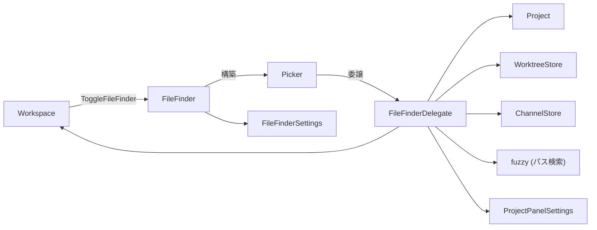
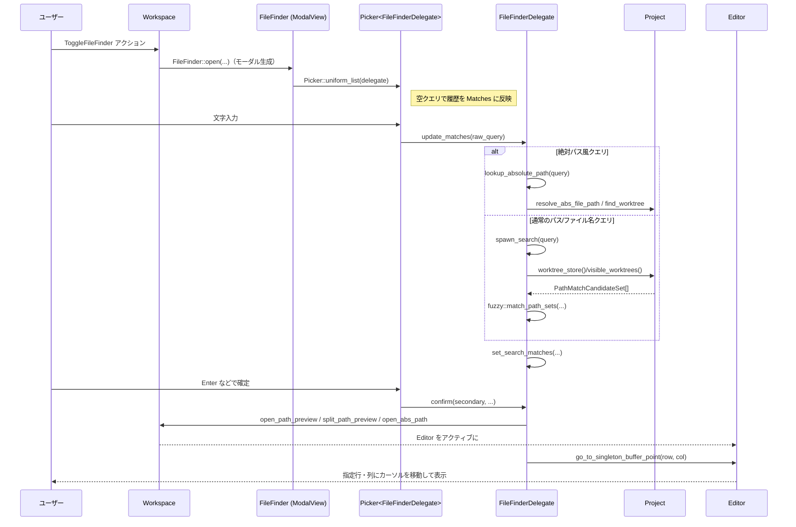

# file_finder/ コード解説

## 1. ざっくり一言

`file_finder` クレートは、Zed のワークスペース内でファイルを素早く検索・オープンするための「ファイルファインダ」モーダルと、その検索ロジックを提供するモジュールです。  
履歴や無視ファイル設定、行・列ジャンプ、チャンネルノートなども含めて一元的に扱います。

---

## 2. このモジュールの役割

### 2.1 概要

- このモジュールは **「プロジェクト内のファイルやチャンネルを高速に検索して開く UI」** を実装します。
- 主な機能は以下です。
  - 文字列クエリに基づくファイル名／パスのファジー検索
  - ナビゲーション履歴を使った最近ファイルの優先表示
  - `path:row:column` 形式による特定行・列へのジャンプ
  - 存在しないパスの「新規ファイル作成」候補の提示
  - `.gitignore` などに基づく無視ファイルのフィルタリング（オン／オフ／自動）
  - 「チャンネルノート」の名前による検索・オープン

### 2.2 アーキテクチャ内での位置づけ

ファイルファインダは、`Workspace` 上に表示される `ModalView` として実装されており、内部では汎用の `Picker` コンポーネントと `FileFinderDelegate` によって検索ロジックを委譲しています。



- `Workspace`  
  - `ToggleFileFinder` アクションでファイルファインダのモーダルを開閉します。
- `FileFinder`  
  - `ModalView` / `Focusable` / `Render` を実装する UI ルート。  
  - 内部に `Picker<FileFinderDelegate>` を持ちます。
- `Picker<FileFinderDelegate>`  
  - 共通のリスト UI。実際の検索・ソート・レンダリングは `FileFinderDelegate` が担当します。
- `FileFinderDelegate`  
  - プロジェクト (`Project`)・ワークツリー (`WorktreeStore`)・チャンネルストア (`ChannelStore`) と連携し、`fuzzy` クレートで検索を実行します。
- 設定 (`FileFinderSettings`, `ProjectPanelSettings`)  
  - モーダル幅、無視ファイルの扱い、履歴の見せ方などの挙動を制御します。

### 2.3 設計上のポイント

- **UI と検索ロジックの分離**
  - `FileFinder` はほぼ UI とイベント配線のみを担当し、検索ロジックは `FileFinderDelegate` と `Matches` に集約されています。
- **非同期検索とキャンセル**
  - 検索は `fuzzy::match_path_sets` による非同期処理として実行され、`AtomicBool` を用いてキャンセル可能になっています。
  - 新しいクエリが来たときに古い検索結果で UI を上書きしないよう、`search_id` で世代管理を行います。
- **履歴と検索結果の統合**
  - `Matches` 構造体で、履歴 (`History`) と検索結果 (`Search`) を一つのソート済みリストとして管理します。
  - 現在開いているファイルや履歴項目を上位に出すための独自の比較ロジック (`cmp_matches`) を持ちます。
- **柔軟なクエリ解釈**
  - 空文字、相対パス、絶対パス、先頭の `./` や `a/` `b/` の扱い、`path:row:column` のような行・列指定など、多様なパターンを一つのクエリパイプラインで処理します。
- **表示用情報の独立**
  - `labels_for_match` / `labels_for_path_match` と `PathComponentSlice` により、「どの文字をハイライトするか」「どのコンポーネントを省略するか」を検索ロジックとは独立に決定します。

---

## 3. 主要な機能一覧

- ファイルファインダ モーダルの初期化とアクション登録（`init`）
- `ToggleFileFinder` アクションによるモーダルの開閉と履歴サイクル
- プロジェクト内ファイルのファジー検索
- ナビゲーション履歴（最近開いたファイル）の表示と優先ソート
- 現在アクティブなファイルを検索結果の先頭に固定しつつ、次候補を自動選択
- `path:row:column` 形式で指定された場所へのジャンプ
- 絶対パスや `/file.txt` のような「プロジェクト外に見える」文字列からの解決
- 存在しないパスに対する「Create file: …」エントリの生成と新規ファイル作成
- `.gitignore` 等に基づく無視ファイルの検索対象化／除外（自動・オン・オフ）
- 複数ワークツリー（複数プロジェクトルート）にまたがる検索と履歴管理
- チャンネル名のファジー検索と `OpenChannelNotesById` アクションによるオープン
- スプリットビュー方向（上下左右）を指定してファイルを開く機能
- パス表示の省略（`PathComponentSlice` を用いた `…` 省略）

---

## 4. 関数・構造体の解説

### 4.1 主要な型一覧

| 名前 | 種別 | 役割 / 用途 |
|------|------|-------------|
| `FileFinder` | 構造体 | モーダルとして表示されるファイルファインダ本体。内部に `Picker<FileFinderDelegate>` を保持し、各種アクションをハンドリングします。 |
| `FileFinderDelegate` | 構造体 | `PickerDelegate` 実装。検索クエリの解釈・検索実行・結果マージ・表示用ラベル生成・確定処理を担当します。 |
| `Matches` | 構造体 | `Match` のソート済みリストと、履歴を分離して表示するかどうかのフラグを保持します。検索結果の更新・挿入ロジックも含みます。 |
| `Match` | 列挙体 | 1 行分の候補を表現する型。`History` / `Search` / `Channel` / `CreateNew` の 4 バリアントがあります。 |
| `ProjectPanelOrdMatch` | 構造体（`PathMatch` のラッパー） | ファイル候補のソート順を「スコア・距離・パス名」に基づいて決めるための `Ord` 実装を提供します。 |
| `FileSearchQuery` | 構造体 | ユーザー入力クエリのパース結果（生クエリ文字列、パス部分の終端位置、行・列情報を含む `PathWithPosition`）を保持します。 |
| `FoundPath` | 構造体 | 履歴に格納される「プロジェクト相対パス + 絶対パス」のペアです。プロジェクト内外のファイル両方に対応します。 |
| `Event` | 列挙体 | ファイルファインダから外部に通知されるイベント。`Selected(ProjectPath)` / `Dismissed`。 |
| `PathComponentSlice<'a>` | 構造体 | 文字列パスをコンポーネント単位に分解し、どの部分を `…` で省略するかを計算するためのユーティリティです。 |

### 4.2 重要な関数・メソッド詳細（最大 7 件）

#### 1. `pub fn init(cx: &mut App)`

**概要**

- アプリケーション起動時に呼び出し、`FileFinder` および `OpenPathPrompt` に関連するオブザーバを `App` に登録します。
- これにより、`Workspace` で `ToggleFileFinder` アクションを使ってファイルファインダを開けるようになります。

**引数**

| 引数名 | 型 | 説明 |
|--------|----|------|
| `cx` | `&mut App` | アプリケーション全体の GPUI コンテキスト。オブザーバの登録に使用します。 |

**戻り値**

- なし（副作用としてオブザーバを登録）。

**内部処理の流れ**

1. `cx.observe_new(FileFinder::register)` を登録し、`Workspace` が新しく生成されたときに `FileFinder::register` が呼ばれるようにします。
2. `OpenPathPrompt::register` / `OpenPathPrompt::register_new_path` も同様に登録します。

**使用上の注意点**

- テストコード (`init_test`) では、`AppState::test(cx)` や `editor::init(cx)` 等と並んで呼び出されています。  
  実アプリでも、ワークスペースやエディタなどの初期化と同じタイミングで呼ぶ前提の設計です。

---

#### 2. `fn open(workspace: &mut Workspace, separate_history: bool, window: &mut Window, cx: &mut Context<Workspace>) -> Task<()>`

**概要**

- `ToggleFileFinder` アクションから呼ばれ、ファイルファインダモーダルを開きます。
- 現在アクティブなエディタ・ナビゲーション履歴から履歴項目を準備し、`FileFinderDelegate` を初期化します。

**引数**

| 引数名 | 型 | 説明 |
|--------|----|------|
| `workspace` | `&mut Workspace` | 現在のワークスペース。アクティブアイテムやプロジェクト情報を取得します。 |
| `separate_history` | `bool` | 履歴と検索結果をセクション分けして表示するかどうか。 |
| `window` | `&mut Window` | 現在のウィンドウ。モーダル表示に使用します。 |
| `cx` | `&mut Context<Workspace>` | `Workspace` 用コンテキスト。非同期タスクの生成に使用します。 |

**戻り値**

- `Task<()>`  
  - 履歴項目の解決（ファイル存在確認など）と、最終的なモーダル生成までを行う非同期タスク。

**内部処理の流れ**

1. `workspace.project()` から `Project` を取得し、`workspace.active_item` から現在開いているファイル (`FoundPath`) を構築します（存在すれば）。
2. `Workspace::recent_navigation_history` から最近のナビゲーション履歴を取得し、`FoundPath` の `Vec<Task<Option<FoundPath>>>` として準備します。
   - ローカルプロジェクトの場合はファイルシステム (`project.fs()`) に問い合わせて「まだ存在するファイルか」を確認します。
   - リモートの場合は存在チェックをスキップします。
3. これらのタスクを `join_all` で完了させた後、`workspace.toggle_modal` を使って `FileFinder` モーダルを開きます。
   - `FileFinderDelegate::new` に `currently_opened_path` と履歴 (`history_items.collect()`) を渡します。

**Edge cases（代表例）**

- 履歴に含まれるパスがプロジェクトから削除されている場合  
  → ローカルプロジェクトではファイル存在確認で弾かれ、履歴に含まれなくなります（`test_nonexistent_history_items_not_shown` 参照）。
- リモートプロジェクトの場合  
  → ファイルシステムによる存在確認を行わず、そのまま履歴として扱います。

**使用上の注意点**

- `open` 自体は `FileFinder::register` を通じて `ToggleFileFinder` アクションから間接的に呼ばれます。  
  外部から直接呼ぶ想定の API ではなく、`init` → アクションディスパッチという経路で利用します。

---

#### 3. `fn update_matches(&mut self, raw_query: String, window: &mut Window, cx: &mut Context<Picker<Self>>) -> Task<()>`  

（`FileFinderDelegate` のメソッド）

**概要**

- ユーザーが入力した検索クエリを解釈し、それに応じて検索を実行します。
- 空クエリのときは履歴表示、非空クエリのときは `FileSearchQuery` を構築して絶対パス解決 or ファジー検索を起動します。

**引数**

| 引数名 | 型 | 説明 |
|--------|----|------|
| `raw_query` | `String` | ユーザーが入力したクエリ文字列。スペースや末尾の `:` などはここで正規化されます。 |
| `window` | `&mut Window` | 非同期タスク生成時に必要なウィンドウ。 |
| `cx` | `&mut Context<Picker<Self>>` | `Picker` 用のコンテキスト。非同期タスクや UI 更新に使用します。 |

**戻り値**

- `Task<()>`  
  - 空クエリ時は即時完了の `Task::ready(())`。  
  - 非空クエリ時は、`lookup_absolute_path` / `spawn_search` を実行する非同期タスク。

**内部処理の流れ**

1. クエリ前処理
   - 全てのスペースを削除し、前後の空白を `trim`。
   - 先頭 2 文字が以下の場合はプレフィックスを削除（テストより、Windows 風のパスや `./` の便宜的処理と考えられます）。
     - `".\"` / `"./"` → 2 文字削除
     - `"a\"`, `"a/"`, `"b\"`, `"b/"` → すべてのワークツリーでそのディレクトリが存在しない（またはディレクトリでない）場合のみ 2 文字削除
2. 空クエリの場合
   - 直前にもクエリがなかった場合と、初回更新時にだけ、`history_items` から `Matches` を再構築します。
   - `Matches::push_new_matches` を `query = None` で呼び出し、履歴だけを表示します。
3. 非空クエリの場合
   - `PathWithPosition::parse_str` で `path:row:column` 形式をパースし、末尾のコロンを除去した `raw_query` を再構成します。
   - `FileSearchQuery` を組み立てます。
   - `cx.spawn_in(window, …)` で非同期タスクを起動し、以下を行います。
     1. `path.is_absolute()` なら `lookup_absolute_path` を試みる。
     2. 絶対パスとして解決できなかった場合のみ `spawn_search`（ファジー検索）を実行する。

**Edge cases**

- クエリが `"foo:"` のように末尾コロンで終わる場合  
  → `raw_query.trim_end_matches(':')` により末尾コロンは検索対象から除外されますが、`PathWithPosition` には `row` が設定されるため、後続の `confirm` で行ジャンプに利用されます（`test_matching_paths_with_colon`）。
- `"path:row"` / `"path:row:column"` の形式  
  → `FileSearchQuery.file_query_end` に「パス部分の終端インデックス」が記録されます（`test_row_column_numbers_query_inside_file` 等参照）。
- `"/file1.txt"` のようなクエリ  
  → `path.is_absolute()` が真になり、`lookup_absolute_path` によってプロジェクト内のファイルに解決される場合があります（`test_paths_with_starting_slash`）。

**使用上の注意点**

- 呼び出しは `Picker` 側から自動的に行われる前提です。利用者が直接呼び出すのはテストくらいです。
- 戻り値の `Task<()>` を保持しなくても、`cx.spawn_in` の中で完了まで自己管理されます。

---

#### 4. `fn set_search_matches(&mut self, search_id: usize, did_cancel: bool, query: FileSearchQuery, matches: impl IntoIterator<Item = ProjectPanelOrdMatch>, cx: &mut Context<Picker<Self>>)`  

（`FileFinderDelegate` のメソッド）

**概要**

- 非同期検索から返ってきた `PathMatch` の集合を `Matches` に反映するメソッドです。
- キャンセルされた検索の結果を拡張的に利用したり、履歴・チャンネル・`CreateNew` 項目を追加し、選択インデックスを更新します。

**引数（主なもの）**

| 引数名 | 型 | 説明 |
|--------|----|------|
| `search_id` | `usize` | 検索世代 ID。古い検索結果を無視するために利用されます。 |
| `did_cancel` | `bool` | 検索がキャンセルされたかどうか。キャンセル済みなら「前回の結果を拡張」する挙動を取ります。 |
| `query` | `FileSearchQuery` | この検索で使われたクエリ情報。`latest_search_query` として保存されます。 |
| `matches` | `IntoIterator<Item = ProjectPanelOrdMatch>` | ファジー検索から得られたマッチの列。 |
| `cx` | `&mut Context<Picker<Self>>` | UI 更新用コンテキスト。 |

**戻り値**

- なし（`self.matches` / `self.selected_index` / `self.latest_search_query` などを更新し、`cx.notify()` で UI 再描画を促します）。

**内部処理の流れ（要約）**

1. `search_id` が `latest_search_id` 以上でなければ何もしません（より新しい検索結果が既に反映済みの場合）。
2. `query_changed` を判定し、前回クエリと同じであれば現在選択中の `Match` を保持しようとします。
3. `path_style` を取得し、`Matches::push_new_matches` により
   - 履歴 (`history_items`) のうちクエリにマッチするものを `Match::History` として追加
   - 新しい `matches` を `Match::Search` として追加
   - 必要に応じて前回の検索結果を拡張的に利用（キャンセル時）
   を行います。
4. チャンネル検索の追加
   - `channel_store` が存在し、クエリ文字列にマッチするチャンネル名があれば、`Match::Channel` を作成して `Matches` に挿入します。
5. `CreateNew` エントリの追加
   - クエリから `RelPath` を生成し、対応するパスが既存のエントリに存在しない場合は `Match::CreateNew(ProjectPath)` を末尾に追加します。
6. `selected_index` の決定
   - クエリ変更時は `calculate_selected_index`（現在ファイルを一つ飛ばすかどうかの設定を考慮）を使用。
   - クエリが変わっていない場合は、以前選択していた `Match` に対応する位置を `Matches::position` で再計算します。

**Edge cases**

- キャンセルされた検索結果を扱うケース  
  → `did_cancel == true` かつクエリが変わっていない場合、`extend_old_matches = true` となり、過去の検索結果を保持しつつ新しい結果をマージします（`test_matching_cancellation`）。
- 複数ワークツリー + 履歴の重複  
  → `matching_history_items` と `push_new_matches` の組み合わせにより、同じ `ProjectPath` に対する検索結果が重複しないようにしています（`test_history_items_uniqueness_for_multiple_worktree` など）。
- `CreateNew` が既存ファイルと重複する場合  
  → パスが既に `Matches` に含まれているときは追加されないため、`CreateNew` は「まだ存在しないパス」に対してのみ出現します（`test_matching_paths` シリーズ）。

**使用上の注意点**

- 検索結果は最大 100 件に制限されています（`Matches::push_new_matches` 内で `len() == 100` で打ち切り）。
- `Matches::cmp_matches` によって、履歴・現在開いているファイル・チャンネル・`CreateNew` の順序や優先度が決まります。並び方を変えたい場合はこの比較ロジックを参照する必要があります。

---

#### 5. `fn confirm(&mut self, secondary: bool, window: &mut Window, cx: &mut Context<Picker<FileFinderDelegate>>)`  

（`FileFinderDelegate` のメソッド）

**概要**

- 現在選択中の `Match` を確定し、対応するファイルまたはチャンネルを開きます。
- `FileSearchQuery` に行・列が含まれていれば、エディタ内のカーソル位置も移動します。

**引数**

| 引数名 | 型 | 説明 |
|--------|----|------|
| `secondary` | `bool` | 二次アクション（例: スプリットで開く）かどうか。`true` ならスプリット、`false` なら通常のオープン。 |
| `window` | `&mut Window` | アクションディスパッチ用のウィンドウ。 |
| `cx` | `&mut Context<Picker<FileFinderDelegate>>` | `Picker` 用コンテキスト。ワークスペース更新や非同期処理に使用します。 |

**戻り値**

- なし（ファイルを開く非同期タスクを起動し、その完了後にカーソル移動とモーダル閉鎖を行います）。

**内部処理の流れ（ファイルの場合）**

1. 選択中の `Match` と `workspace`（`WeakEntity`）を取り出します。  
   `workspace` が解決できなければ何もしません。
2. `Match` の種類に応じて開くパスを決定します。
   - `Match::Channel`  
     → `OpenChannelNotesById{ channel_id }` アクションをディスパッチし、モーダルを閉じる（ファイルは開かない）。
   - `Match::CreateNew(ProjectPath)`  
     → `Workspace::open_path_preview` または `split_path_preview` を呼んで新規ファイルとして開きます。
   - `Match::History { path, .. }`  
     → まだ対応するワークツリーが存在すれば `ProjectPath` として開き、なければ `open_abs_path` / `split_abs_path` を使って絶対パスとして開きます。
   - `Match::Search(ProjectPanelOrdMatch)`  
     → `ProjectPath` を組み立てて `open_path_preview` または `split_path_preview` を呼びます。
3. 行・列指定
   - `latest_search_query.path_position.row` / `.column` から 1-origin の行・列を取得します。
   - ファイルオープン完了後、アクティブアイテムが `Editor` であれば `go_to_singleton_buffer_point` を呼んでカーソル移動します。
4. 最後に `cx.emit(DismissEvent)` を送り、ファイルファインダモーダルを閉じます。

**Edge cases**

- 行／列がファイルの範囲外の場合  
  → バッファ側の `point_from_external_input` が範囲内にクリップし、最終行末尾にカーソルが移動します（`test_row_column_numbers_query_outside_file`）。
- Unicode を含むファイルでの列指定  
  → テストでは「ユーザーの列番号（コードポイント単位）から UTF-8 バイトオフセットへの変換」が検証されています（`test_row_column_numbers_query_inside_unicode_file`）。実際の変換は `buffer_snapshot.point_from_external_input` 側の実装に依存します。
- `Match::Channel`  
  → ファイルを開かずにチャンネルノートを開く挙動になります（`confirm` 内で早期 return）。

**使用上の注意点**

- `secondary` フラグは `SplitDirection` を伴う別メニュー（フッターの「Split…」ボタン）からの呼び出しでも利用されます。  
  モディファイアキーとの組み合わせで「セカンダリ操作になる」かどうかを変えたい場合は、呼び出し元のアクション定義も確認する必要があります。

---

#### 6. `fn labels_for_match(&self, path_match: &Match, window: &mut Window, cx: &App) -> (HighlightedLabel, HighlightedLabel)`  

（`FileFinderDelegate` のメソッド）

**概要**

- 1 つの `Match` から「ファイル名ラベル」と「パスラベル」を生成し、ファジーマッチ箇所のハイライト情報も付加します。
- 長いパスはウィンドウ幅に応じて中央を `…` で省略します。

**引数**

| 引数名 | 型 | 説明 |
|--------|----|------|
| `path_match` | `&Match` | 履歴・検索結果・チャンネル・作成候補のいずれか。 |
| `window` | `&mut Window` | テキストスタイル・フォントサイズから EM 幅を取得するために必要です。 |
| `cx` | `&App` | パススタイルやホームディレクトリなどの情報取得に使用します。 |

**戻り値**

- `(HighlightedLabel, HighlightedLabel)`  
  - 1 つ目: ファイル名（大きめのラベル）。  
  - 2 つ目: ディレクトリパス等（小さめ・ミュートカラーのラベル）。

**内部処理の流れ**

1. `Match` の種別に応じて基礎情報を構築します。
   - `History` / `Search`  
     → `labels_for_path_match` を使って `(file_name, file_name_positions, full_path, full_path_positions)` を生成します。  
     履歴のみで `panel_match` がない場合はワークツリー名や絶対パスから手動で組み立てます。
   - `Channel`  
     → ファイル名 = チャンネル名、パス = `"Channel Notes"`。
   - `CreateNew`  
     → ファイル名 = `"Create file: <path>"`, パスは空文字列。
2. ユーザーのホームディレクトリの展開
   - `full_path` の先頭がホームディレクトリであれば `"~"` に置き換え、ハイライト位置も調整します。
3. パス省略処理
   - パスが ASCII の場合のみ、表示幅に応じて `full_path_budget` を計算します。
   - 予算が 0 でなく、かつ `full_path.len() > budget` なら `PathComponentSlice::new(&full_path)` を用いて「省略すべきコンポーネントのレンジ」を求め、中央を `"…"` に置換します。  
   - ハイライト位置も省略による文字数の変化に合わせて再計算します。
4. `HighlightedLabel::new` でラベルを生成し、ファイル名はデフォルトサイズ、パスは `LabelSize::Small` + `Color::Muted` に設定します。

**Edge cases**

- `full_path` が ASCII でない場合（日本語や絵文字など）  
  → 省略ロジックはスキップされ、パスはフルで表示されます（テスト `test_complex_path` では Unicode パスが扱われています）。
- 履歴のみで `panel_match` がない場合  
  → `ProjectPanelSettings::hide_root` とワークツリー数に応じて、ルート名を含めるかどうかが変わります（`should_hide_root_in_entry_path` および関連テスト参照）。

**使用上の注意点**

- ここでの「ハイライト位置」は `PathMatch.positions` を前提としているため、`fuzzy` 側の仕様変更の影響を受けます。
- ASCII 前提の列計算を行っているため、`full_path` に非 ASCII 文字が混ざる場合は省略処理を行わないようになっています。

---

#### 7. `fn elision_range(&self, budget: usize, matches: &[usize]) -> Option<Range<usize>>`  

（`PathComponentSlice` のメソッド）

**概要**

- 与えられたパス文字列をコンポーネント単位に分解し、「ファジーマッチ位置を避けつつ、表示予算 (`budget`) に収まるように最も長い中間部分を省略する」ための文字列範囲を計算します。
- 返された `Range<usize>` を `"…"` で置き換えることで、中央を省略したパス表示が実現されます。

**引数**

| 引数名 | 型 | 説明 |
|--------|----|------|
| `budget` | `usize` | 省略後の文字数上限（おおよそ）。 |
| `matches` | `&[usize]` | 元のパス文字列中のマッチ位置（インデックス）の昇順リスト。 |

**戻り値**

- `Option<Range<usize>>`  
  - 省略すべき **バイト位置** の範囲（`self.path_str` に対する `start..end`）。  
  - 省略不要または `budget` を満たせない場合は `None`。

**内部処理の流れ（ざっくり）**

1. コンポーネント列のうち、「先頭の通常コンポーネント」「末尾」「マッチを含む部分」「プレフィックス等」を除いた、最長の連続区間を探索します。
2. 得られた「候補区間」について、パスの中央付近に近い側からコンポーネントを順に省き、`len_with_elision <= budget` となる地点を探します。
3. それでも予算に収まらない場合は `None` を返し、省略しません。
4. 省略可能であれば、そのコンポーネント範囲に対応するバイトレンジを返します。

**使用上の注意点**

- テスト `test_path_elision` では複数のパターンが検証されており、「マッチを含む部分は残す」「予算を満たせないときは省略しない」といった挙動が確認できます。
- `matches` は昇順であることを前提とし、`assert!(matches.windows(2).all(|w| w[0] <= w[1]));` で検証しています。  
  呼び出し側でソートされていないと panic になる可能性があります。

---

### 4.3 その他の主な関数・メソッド

| 関数名 / メソッド名 | 役割（1 行） |
|---------------------|--------------|
| `FileFinder::register` | `Workspace` に `ToggleFileFinder` アクションを登録し、モーダルの開閉と履歴サイクルを実装します。 |
| `FileFinder::handle_modifiers_changed` | モディファイアキーの押下状態変化を監視し、「選択が変わった後に指定のモディファイアが解除されたら自動確定する」挙動を制御します。 |
| `FileFinder::go_to_file_split_*` | 選択中のエントリを指定方向（左・右・上・下）にスプリットして開くヘルパー群です。 |
| `FileFinder::modal_max_width` | `FileFinderWidth` 設定とウィンドウ幅からモーダルの最大幅（Pixels）を決定します。 |
| `matching_history_items` | 履歴 (`FoundPath`) の集合に対してクエリのファジーマッチを行い、`Match::History` の `HashMap<ProjectPath, Match>` を構築します。 |
| `Matches::push_new_matches` | 履歴マッチと検索マッチ、既存マッチを統合し、ソートされた `matches: Vec<Match>` を再構築します（最大 100 件）。 |
| `Matches::cmp_matches` | `Match` 同士の優先度比較（履歴 vs 検索、現在開いているファイル、ファイル名マッチの優先、チャンネルなど）を定義します。 |
| `should_hide_root_in_entry_path` | `ProjectPanelSettings::hide_root` とワークツリー数を元に、ラベル表示でルート名を省くかどうかを判定します。 |
| `FileFinderDelegate::subscribe_to_updates` | プロジェクトのワークツリー更新イベントを購読し、エントリリストを自動的にリフレッシュします。 |

---

## 5. データフロー

ここでは、「ユーザーがショートカットでファイルファインダを開き、クエリを入力してファイルを開き、必要なら特定行へジャンプする」までの流れを説明します。

### 概要

1. ユーザーが `ToggleFileFinder` ショートカットを押す。
2. `Workspace` が `FileFinder` モーダルを開き、`Picker<FileFinderDelegate>` が生成される。
3. ユーザーがクエリをタイプし、そのたびに `update_matches` → `spawn_search / lookup_absolute_path` → `set_search_matches` が走る。
4. ユーザーが候補を選択して確定すると、`confirm` が呼ばれファイルが開かれ、必要なら行・列ジャンプが行われる。

### シーケンス図



---

## 6. 使い方（How to Use）

### 6.1 基本的な使用方法

アプリケーション側での典型的な利用フローは以下のようになります。

1. アプリ初期化時に `file_finder::init` を呼び出す。
2. `Workspace` に対して `ToggleFileFinder` アクションをディスパッチすると、ファイルファインダモーダルが開く。
3. ユーザーが入力・選択すると、`FileFinderDelegate` が自動的に検索とオープンを行う。

以下は概念的なコード例です（実際には Zed の他コンポーネント初期化も併せて行います）。

```rust
use gpui::App;
use workspace::ToggleFileFinder;
use file_finder::init as init_file_finder;

fn init_app(cx: &mut App) {
    // ファイルファインダを含む各サブシステムの初期化
    init_file_finder(cx);
    // editor::init(cx); theme_settings::init(...); などもテストコードで併用されています。
}

// どこかのキーバインドから呼ばれる想定
fn open_file_finder(cx: &mut gpui::Context<workspace::Workspace>, window: &mut gpui::Window) {
    // Workspace 側で ToggleFileFinder がハンドルされ、FileFinder モーダルが開く
    window.dispatch_action(ToggleFileFinder::default().boxed_clone(), cx);
}
```

モーダルが開いたあとは、ユーザー入力に応じて `Picker` と `FileFinderDelegate` が自動的に検索・表示・確定を行うため、呼び出し側コードで個別の関数を叩く必要はありません。

---

### 6.2 よくある使用パターン

#### パターン 1: ファイル名の一部で検索して開く

- 入力: `"bna"`  
  → `"banana"`, `"bandana"` のようなファイルがスコアに基づいて候補になります（`test_matching_paths` 参照）。
- 空クエリから `"bna"` と入力すると、履歴 + 検索結果が混在したリストが表示されます。

#### パターン 2: `path:row:column` で特定位置にジャンプ

- 入力例: `"first.rs:1:3"`  
  → `first.rs` にマッチするファイルを開き、1 行 3 列目にカーソルを移動します（`test_row_column_numbers_query_inside_file`）。
- Unicode を含むファイルでも、「ユーザーの列指定」と内部のバイトオフセットが正しく対応するように処理されます（`test_row_column_numbers_query_inside_unicode_file`）。

#### パターン 3: 存在しないパスで新規ファイルを作成

- 入力: `"dir/new_file.rs"` など、まだ存在しないパス
- 検索結果の末尾に `"Create file: dir/new_file.rs"` のような `CreateNew` エントリが現れます。
- それを選択して確定すると、そのパスで新しいファイルが開かれます（`test_create_file_*` 系テスト）。

#### パターン 4: 無視ファイルの表示切り替え

- フッターのフィルターボタン、または `ToggleIncludeIgnored` アクションにより、以下を切り替えできます。
  - 自動（ワークツリーのルートが無視されているかどうかに応じて振る舞いが変わる）
  - 無視ファイルも含める
  - 無視ファイルを完全に除外する
- 具体的な挙動は `test_ignored_root*` のテストで確認されています。

#### パターン 5: チャンネル名で検索してチャンネルノートを開く

- 設定で `include_channels` が有効な場合、チャンネル名も検索対象になります。
- `Match::Channel` が選択されると、ファイルではなく `OpenChannelNotesById` アクションがディスパッチされます。

---

### 6.3 使用上の注意点（まとめ）

- **初期化順序**
  - テストコードでは `AppState::test(cx)` → `theme_settings::init` → `file_finder::init` → `editor::init` の順に呼ばれています。  
    他コンポーネントに依存した挙動（ナビゲーション履歴、テーマ、エディタの存在など）があるため、実アプリでも同様に「アプリ初期化フェーズ」で `init` する前提です。
- **検索結果上限**
  - ファイル候補は最大 100 件に制限されます。非常に大きなプロジェクトでは、クエリを絞り込む必要があります。
- **非同期・キャンセル**
  - 新しいクエリが入力されると古い検索はキャンセルされますが、キャンセル済みの結果も `extend_old_matches` により徐々に補完される場合があります（`test_matching_cancellation`）。
- **履歴と検索結果の混在**
  - 履歴と検索結果は `Matches` で一体管理されます。`separate_history` フラグが true の場合、履歴と検索結果の間にセパレータが挿入されます。
- **ライン・カラム指定のインデックス**
  - クエリ中の行番号・列番号は 1-origin（人間向け）で解釈され、内部では `point_from_external_input` で適切に変換されます。
- **モディファイアキーによる自動確定**
  - 「特定のモディファイア（例: セカンダリキー）を押しながらファイルファインダを開き、選択を変更したあと、そのモディファイアを離したタイミングで自動的に確定する」モードがあります（`handle_modifiers_changed` およびテスト群参照）。
  - 他のモディファイアに切り替えた場合は自動確定しないように制御されています。

---

## 7. 関連ファイル

このディレクトリ内で、`file_finder` モジュールと密接に関係するファイルは以下の通りです。

| パス | 役割 / 関係 |
|------|------------|
| `file_finder/Cargo.toml` | クレート名 `file_finder` の定義と、`project`・`picker`・`workspace`・`fuzzy` など外部クレートへの依存関係を定義します。 |
| `file_finder/src/file_finder.rs` | ファイルファインダ本体の実装。`FileFinder`・`FileFinderDelegate`・`Matches`・`PathComponentSlice` など、すべてのロジックがここに含まれています。 |
| `file_finder/src/file_finder_tests.rs` | GPUI テスト・ユニットテスト群。パス省略、検索順序、履歴管理、行列ジャンプ、無視ファイル処理、多ワークツリー、モディファイア挙動など、主要機能の挙動が網羅的に検証されています。 |

このクレートは、ワークスペース全体のインフラストラクチャ（`Workspace`・`Project`・`Editor` など）に強く依存しているため、挙動を変更する際は関連クレートの API やイベント（`project::Event::WorktreeUpdatedEntries` など）も併せて確認する必要があります。
