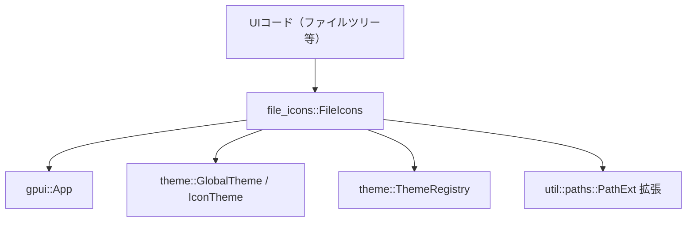
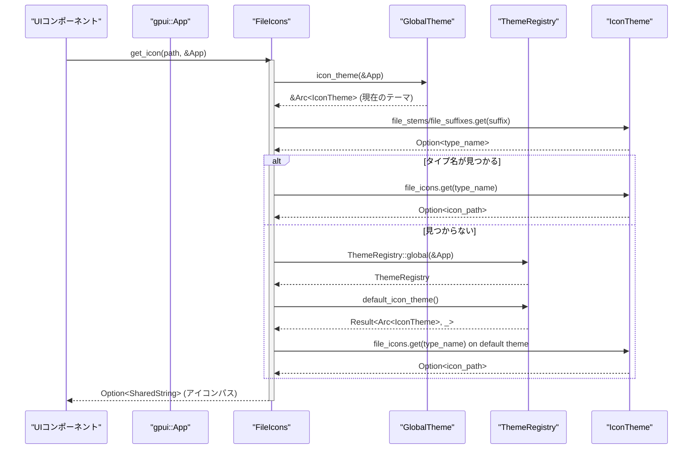

# file_icons/

## 0. ざっくり一言

`file_icons` クレートは、**ファイルやフォルダのパスと現在の UI テーマ情報から、対応するアイコン（パス文字列）を取得するためのヘルパ**を提供します。

---

## 1. このモジュールの役割

### 1.1 概要

- このクレートは、**ファイルシステム上のパス (`std::path::Path`) を入力として、テーマ定義 (`IconTheme`) に基づくアイコンパスを返す**ために存在します。
- ファイル名・拡張子・複数拡張子・隠しファイル名など、いくつかのパターンを順に試し、最適なアイコンを選択します。
- フォルダ用アイコン（開いている／閉じている状態）や、ツリービュー用のシェブロン（開閉矢印）アイコンも取得できます。

### 1.2 アーキテクチャ内での位置づけ

このディレクトリに含まれるコードから分かる依存関係は以下の通りです。

- 上位（呼び出し元）:  
  - ファイルツリーやタブバーなど、UI でファイル・フォルダアイコンを表示したいコード
- このクレート:
  - `file_icons::FileIcons` 構造体と、その関連メソッド群
- 下位（依存先）:
  - `gpui::App` / `gpui::SharedString`  
  - `theme::{GlobalTheme, IconTheme, ThemeRegistry}`  
  - `util::paths::PathExt` （`Path` 拡張メソッド）

Mermaid 図で表すと次のようになります。



※ `theme` クレートと `util::paths` の実装は、このチャンクには含まれていません。

### 1.3 設計上のポイント

コードから読み取れる設計上の特徴は次の通りです。

- **状態の保持**:
  - `FileIcons` は内部に `Arc<IconTheme>` を 1 つ保持します。
  - `FileIcons::get(&App)` で現在のグローバルアイコンテーマを取得し、そのスナップショットを構造体として持ちます。
- **グローバルテーマとデフォルトテーマのフォールバック**:
  - まず `GlobalTheme::icon_theme(cx)` からアイコン取得を試み、見つからない場合は `ThemeRegistry::default_icon_theme()` にフォールバックします。
- **エラーハンドリング方針**:
  - すべて `Option<SharedString>` を返す形で、「見つからない」場合を `None` で表現します。
  - `Result` のエラーは `ok()` で捨てて `Option` に変換しており、ここでは詳細なエラー種別は扱いません。
- **ファイル名／拡張子の多段マッチング**:
  - フルファイル名、ドット以降のサフィックス、複数拡張子、拡張子、隠しファイル名、といった順に複数のパターンを試すようになっています。
- **テーマ非依存のラッパー**:
  - 実際のアイコン定義（マップ）を持つのは `IconTheme` であり、このクレートはそれに対する検索ロジックのみを提供しています。

---

## 2. 主要な機能一覧

このクレートが提供する主要な機能は次の通りです。

- **ファイルアイコン取得**:  
  `FileIcons::get_icon(path, &App)` で、ファイルパスから最適なアイコンパスを取得する。
- **フォルダアイコン取得**:  
  `FileIcons::get_folder_icon(expanded, path, &App)` で、フォルダ名と開閉状態に応じたアイコンパスを取得する。
- **汎用フォルダアイコン取得**:  
  `FileIcons::get_generic_folder_icon(expanded, &App)`（非公開）で、特定フォルダ名が見つからない場合の汎用フォルダアイコンを取得する。
- **シェブロン（開閉矢印）アイコン取得**:  
  `FileIcons::get_chevron_icon(expanded, &App)` で、ツリービューの展開状態ごとの矢印アイコンを取得する。
- **タイプ名からアイコン取得**:  
  `FileIcons::get_icon_for_type(&self, typ, &App)` で、言語や種別を表すタイプ名からアイコンパスを取得する。
- **デフォルトアイコンテーマの取得**:  
  `FileIcons::default_icon_theme(&App)`（非公開）で、テーマレジストリが提供するデフォルトのアイコンテーマにアクセスする。

---

## 4. 関数・構造体の解説

### 4.1 型一覧（構造体）

| 名前       | 種別     | フィールド                    | 役割 / 用途 |
|------------|----------|-------------------------------|-------------|
| `FileIcons` | 構造体 | `icon_theme: Arc<IconTheme>` | 現在のアイコンテーマを保持し、ファイル／フォルダ／シェブロンのアイコンパスを引き当てるためのラッパーです。 |

`IconTheme` 自体の定義は `theme` クレート側にありますが、このコードからは以下のようなフィールドを利用していることが分かります。

- `file_stems`: ファイル名（またはその一部）からタイプ名を引くマップ的なコレクション
- `file_suffixes`: 拡張子などからタイプ名を引くマップ的なコレクション
- `file_icons`: タイプ名からアイコン定義（`path` を持つオブジェクト）を引くマップ的なコレクション
- `named_directory_icons`: フォルダ名から、展開／折りたたみ別のアイコン定義を引くマップ
- `directory_icons`: 汎用フォルダアイコン（展開／折りたたみ）の定義
- `chevron_icons`: シェブロンアイコン（展開／折りたたみ）の定義

（正確なフィールド型は、このチャンクには含まれていません。）

---

### 4.2 主要な関数の詳細

#### `FileIcons::get(cx: &App) -> FileIcons`

**概要**

- 現在のグローバルアイコンテーマを取得し、それを内部に保持した `FileIcons` インスタンスを生成します。

**引数**

| 引数名 | 型      | 説明 |
|--------|---------|------|
| `cx`   | `&App`  | `gpui` のアプリケーションコンテキスト。グローバルテーマ取得に利用されます。 |

**戻り値**

- `FileIcons`  
  現在のグローバルアイコンテーマ（`Arc<IconTheme>`）を内部に保持したインスタンスです。

**内部処理の流れ**

1. `GlobalTheme::icon_theme(cx)` を呼び出して現在のアイコンテーマへの参照（`&Arc<IconTheme>`）を取得します。
2. `clone()` により `Arc<IconTheme>` のクローンを作成します（参照カウントのみ増加）。
3. その `Arc<IconTheme>` をフィールドに持つ `FileIcons` を返します。

**Examples**

```rust
use std::path::Path;                               // Path 型を使うためにインポートする
use file_icons::FileIcons;                         // このクレートの FileIcons をインポートする
use gpui::App;                                     // gpui::App 型をインポートする

fn example(cx: &App) {                             // App コンテキストを引数に取る関数の例
    let file_icons = FileIcons::get(cx);          // 現在のグローバルテーマから FileIcons を生成する
    let _ = file_icons;                           // ここでは使わないが、以降のアイコン取得に利用できる
}
```

**Edge cases**

- `GlobalTheme::icon_theme(cx)` が返す値は `Arc<IconTheme>` として必ず存在すると仮定されています。  
  この関数内では `Option` や `Result` を返していないため、ここでは失敗ケースは扱われていません。
  （実際に失敗しうるかどうかは `GlobalTheme` 側の実装次第で、このチャンクからは分かりません。）

**使用上の注意点**

- `FileIcons` 自体は `App` を保持しないため、`FileIcons::get(cx)` 呼び出し時のテーマ状態を反映したスナップショットとして扱うと理解できます。

---

#### `FileIcons::get_icon(path: &Path, cx: &App) -> Option<SharedString>`

**概要**

- ファイルパスから、そのファイルに対応するアイコンのパス（`SharedString`）を返します。
- ファイル名、複数拡張子、単一拡張子、隠しファイル名など、複数のパターンを試し、最終的には「default」タイプのアイコンにフォールバックします。

**引数**

| 引数名 | 型         | 説明 |
|--------|------------|------|
| `path` | `&Path`    | 対象ファイルのパスです。ファイル名や拡張子からアイコンタイプを推定します。 |
| `cx`   | `&App`     | テーマ情報取得に使う `gpui::App` コンテキストです。 |

**戻り値**

- `Option<SharedString>`  
  - `Some(icon_path)` : 見つかったアイコンのパス（`SharedString`）  
  - `None` : テーマ内に該当するアイコン定義が見つからなかった場合

**内部処理の流れ（アルゴリズム）**

処理の大まかな流れは次のようになります。

1. `FileIcons::get(cx)` で現在のテーマを保持した `this: FileIcons` を生成します。
2. 内部クロージャ `get_icon_from_suffix(&str)` を定義します。
   - `icon_theme.file_stems.get(suffix)` でファイル名／サフィックスからタイプ名を取得。
   - 見つからなければ `icon_theme.file_suffixes.get(suffix)` を試す。
   - 見つかったタイプ名を `this.get_icon_for_type(typ, cx)` に渡し、実際のアイコンパスを取得。
3. **フルファイル名でのマッチ**:
   - `path.file_name().and_then(|n| n.to_str())` でファイル名を UTF-8 文字列として取得できた場合、その全文字列を `get_icon_from_suffix` に渡してマッチを試みる。
4. **ドット区切りによるサフィックスの段階的マッチ**:
   - 上記のファイル名から、`split_once('.')` により「最初の `.` より後ろ」の部分を繰り返し切り出し、
     例: `eslint.config.js` → `"eslint.config.js"`, `"config.js"`, `"js"`  
     と変化させながら `get_icon_from_suffix` を試す。
5. **複数拡張子のマッチ**:
   - `path.multiple_extensions()`（`PathExt` トレイト）を利用し、複数拡張子を考慮したサフィックス（例: `"stories.tsx"` のような形を想定）を取得し、`get_icon_from_suffix` を試す。  
     （正確な返り値の形式は `PathExt` の実装に依存し、このチャンクには含まれていません。）
6. **拡張子／隠しファイル名でのマッチ**:
   - `path.extension_or_hidden_file_name()`（`PathExt`）で、通常の拡張子または隠しファイル名を表すサフィックス文字列を取得し、`get_icon_from_suffix` を試す。
7. **最後の拡張子のみを使ったマッチ**:
   - 上記までで見つからない場合、`path.extension().and_then(|ext| ext.to_str())` で通常の拡張子だけを取り出し、`get_icon_from_suffix` を試す。  
     コメントでは、`.data.json` → `json` のようなケースを想定していることが分かります。
8. **デフォルトアイコンへのフォールバック**:
   - ここまででいずれの方法でも見つからない場合、`this.get_icon_for_type("default", cx)` を呼んで「default」タイプのアイコンパスを返します。

**簡易フローチャート**

```mermaid
flowchart TD
    A["path を受け取る"] --> B["FileIcons::get(cx) で this 作成"]
    B --> C["フルファイル名でマッチ"]
    C --> D{"見つかった？"}
    D -- Yes --> Z["アイコンパスを返す"]
    D -- No --> E["split_once('.') でサフィックスを繰り返しマッチ"]
    E --> F{"見つかった？"}
    F -- Yes --> Z
    F -- No --> G["multiple_extensions() でマッチ"]
    G --> H{"見つかった？"}
    H -- Yes --> Z
    H -- No --> I["extension_or_hidden_file_name() でマッチ"]
    I --> J{"見つかった？"}
    J -- Yes --> Z
    J -- No --> K["extension() で拡張子のみマッチ"]
    K --> L{"見つかった？"}
    L -- Yes --> Z
    L -- No --> M["get_icon_for_type(\"default\") を返す"]
    M --> Z
```

**Examples**

```rust
use std::path::Path;                                   // Path 型を使うためにインポートする
use file_icons::FileIcons;                             // FileIcons をインポートする
use gpui::App;                                         // gpui::App をインポートする

fn print_file_icon(path_str: &str, cx: &App) {         // ファイルパス文字列と App を受け取る関数の例
    let path = Path::new(path_str);                    // &str から Path を生成する
    if let Some(icon) = FileIcons::get_icon(path, cx) {// ファイルに対応するアイコンパスを取得する
        println!("icon for {}: {}", path_str, icon);   // 見つかった場合は標準出力に表示する
    } else {
        println!("no icon for {}", path_str);          // 見つからない場合の処理例
    }
}
```

**Errors / Panics**

- この関数自体は `Result` を返さず、`panic!` も使用していません。
- テーマや `PathExt` の内部実装でパニックが起きる可能性は、このチャンクからは分かりません。

**Edge cases（代表的なケース）**

- **複雑なファイル名**:
  - `eslint.config.js` のような名前は、まずフルファイル名、次に `"config.js"`、最後に `"js"` という順でマッチが試されます。
- **複数拡張子**:
  - `Component.stories.tsx` のような名前は、`multiple_extensions()` により `"stories.tsx"` のような単位でマッチを試みる設計であることがコメントから読み取れます。
- **隠しファイル**:
  - `.eslint.config.js` などの隠しファイルは、前半のロジックで「通常のファイル名に見立てて」マッチさせることを意図しているコメントがあります。
  - それでも見つからない場合は、最終的に `"default"` タイプのアイコンにフォールバックします。
- **非 UTF-8 なファイル名**:
  - `file_name().and_then(|n| n.to_str())` の部分では UTF-8 変換に失敗すると `None` になり、その枝の処理はスキップされます。
  - その場合も後続の `multiple_extensions()` などの処理が行われ、最終的に "default" アイコンにフォールバックする可能性があります。

**使用上の注意点**

- 戻り値が `Option` であるため、呼び出し側では `None` を考慮した処理（フォールバックアイコンを用意するなど）が必要です。
- ファイル名・拡張子と `IconTheme` 内のマップ定義（`file_stems` / `file_suffixes`）の内容が合致していることが前提になります。  
  マップ定義がない拡張子に対しては、"default" アイコンか `None` になります。

---

#### `FileIcons::get_icon_for_type(&self, typ: &str, cx: &App) -> Option<SharedString>`

**概要**

- タイプ名（例: `"rust"`, `"javascript"`, `"default"` など）をキーとして、`IconTheme` から該当するファイルアイコンのパスを取得します。
- 現在のグローバルアイコンテーマと、デフォルトアイコンテーマの両方を順番に試します。

**引数**

| 引数名 | 型      | 説明 |
|--------|---------|------|
| `typ`  | `&str`  | ファイルや言語などを表すタイプ名。`file_icons` マップのキーとして使われます。 |
| `cx`   | `&App`  | グローバル／デフォルトのアイコンテーマを取得するためのコンテキストです。 |

**戻り値**

- `Option<SharedString>`  
  - `Some(icon_path)` : 見つかったアイコンパス  
  - `None` : 現在のテーマにもデフォルトテーマにも定義がない場合

**内部処理の流れ**

1. 内部関数 `get_icon_for_type(icon_theme: &Arc<IconTheme>, typ: &str)` を定義します。
   - `icon_theme.file_icons.get(typ)` でアイコン定義を取得し、その `path.clone()` を返します。
2. 現在のグローバルアイコンテーマ `GlobalTheme::icon_theme(cx)` を使って `get_icon_for_type` を呼びます。
3. 見つからない場合は `Self::default_icon_theme(cx)` でデフォルトテーマを取得し、同様に `get_icon_for_type` を呼びます。
4. どちらでも見つからなければ `None` を返します。

**Examples**

```rust
use file_icons::FileIcons;                               // FileIcons をインポートする
use gpui::App;                                           // gpui::App をインポートする

fn show_rust_icon(cx: &App) {                            // App コンテキストを受け取る関数の例
    let icons = FileIcons::get(cx);                      // 現在のテーマから FileIcons を生成する
    if let Some(icon) = icons.get_icon_for_type("rust", cx) { // "rust" タイプのアイコンを取得する
        println!("Rust icon path: {}", icon);            // 見つかったアイコンパスを表示する
    }
}
```

**Edge cases**

- `typ` に存在しないキーを渡した場合、`file_icons.get(typ)` は `None` になり、最終的に `None` が返ります。
- グローバルテーマにもデフォルトテーマにも `file_icons` 自体が存在しない、あるいは該当するキーがない場合も `None` です。

**使用上の注意点**

- `typ` 文字列はテーマ側で定義されたキーと一致している必要があります。  
  例えば `"rust"` と `"Rust"` のように大文字小文字が異なると一致しない可能性がありますが、実際の比較方法はマップの実装に依存し、このチャンクからは分かりません。

---

#### `FileIcons::get_folder_icon(expanded: bool, path: &Path, cx: &App) -> Option<SharedString>`

**概要**

- 特定のフォルダ名に対して、展開状態（開いている／閉じている）に応じたアイコンパスを取得します。
- フォルダ名ごとの専用アイコンが見つからない場合は、汎用フォルダアイコンにフォールバックします。

**引数**

| 引数名    | 型       | 説明 |
|-----------|----------|------|
| `expanded`| `bool`   | フォルダが展開済み (`true`) か折りたたみ状態 (`false`) かを示します。 |
| `path`    | `&Path`  | 対象フォルダのパスです。末尾のディレクトリ名からフォルダ名を取得します。 |
| `cx`      | `&App`   | テーマ取得のためのコンテキストです。 |

**戻り値**

- `Option<SharedString>`  
  - `Some(icon_path)` : 専用フォルダアイコン、または汎用フォルダアイコンのパス  
  - `None` : グローバル／デフォルトテーマいずれにもアイコンが定義されていない場合

**内部処理の流れ**

1. 内部関数 `get_folder_icon(icon_theme, path, expanded)` を定義します。
   - `path.file_name()?` で末尾コンポーネント（フォルダ名）を取得。
   - `to_str()?` で UTF-8 文字列に変換し、`trim()` で前後の空白を除去。
   - 空文字列であれば `None` を返します。
   - `icon_theme.named_directory_icons.get(name)?` でフォルダ名に対応するアイコン定義を取得。
   - `expanded` が `true` なら `directory_icons.expanded.clone()`、`false` なら `collapsed.clone()` を返します。
2. 現在のグローバルテーマに対して `get_folder_icon` を実行します。
3. 見つからなければ、デフォルトテーマに対して `get_folder_icon` を実行します。
4. それでも見つからない場合、`Self::get_generic_folder_icon(expanded, cx)` の結果を返します。

**Examples**

```rust
use std::path::Path;                                        // Path 型をインポートする
use file_icons::FileIcons;                                  // FileIcons をインポートする
use gpui::App;                                              // gpui::App をインポートする

fn folder_row_icon(path_str: &str, expanded: bool, cx: &App) { // フォルダ行のアイコンを取得する例
    let path = Path::new(path_str);                         // 文字列から Path を生成する
    if let Some(icon) = FileIcons::get_folder_icon(expanded, path, cx) { // フォルダアイコンを取得する
        println!("folder icon: {}", icon);                  // 見つかったフォルダアイコンパスを表示する
    } else {
        println!("no folder icon");                         // どのテーマにもフォルダアイコンがない場合の例
    }
}
```

**Edge cases**

- **ルートディレクトリなど、`file_name()` がないパス**:
  - `file_name()?` により `None` となり、そのテーマでは `None` を返します。
  - その後、デフォルトテーマや汎用フォルダアイコンにフォールバックします。
- **非 UTF-8 なフォルダ名**:
  - `to_str()?` が失敗した場合、そのテーマでは `None` を返します。
- **空白のみの名前**:
  - `trim()` 後に空文字列になると `None` を返します。
- **`named_directory_icons` に該当エントリがない場合**:
  - そのテーマでは `None` となり、次のテーマ／汎用フォルダアイコンにフォールバックします。

**使用上の注意点**

- フォルダ名に応じた専用アイコンは、`IconTheme::named_directory_icons` に設定されている必要があります。
- すべてのフォルダ名が専用アイコンを持つとは限らないため、呼び出し側は汎用フォルダアイコンか `None` を前提に実装する必要があります。

---

#### `FileIcons::get_generic_folder_icon(expanded: bool, cx: &App) -> Option<SharedString>`

※ このメソッドは `pub` ではなく、`FileIcons` 内部でのみ使用されます。

**概要**

- フォルダ名に依存しない汎用フォルダアイコン（展開／折りたたみ）を返します。
- グローバルテーマとデフォルトテーマの双方を試します。

**引数**

| 引数名    | 型      | 説明 |
|-----------|---------|------|
| `expanded`| `bool`  | 展開状態フラグです。 |
| `cx`      | `&App`  | テーマ取得用コンテキストです。 |

**戻り値**

- `Option<SharedString>` : 見つかったフォルダアイコンパス、または `None`。

**内部処理の流れ**

1. 内部関数 `get_generic_folder_icon(icon_theme, expanded)` を定義。
   - `expanded == true` なら `icon_theme.directory_icons.expanded.clone()` を返す。
   - `false` なら `icon_theme.directory_icons.collapsed.clone()` を返す。
2. グローバルテーマに対して `get_generic_folder_icon` を実行。
3. 見つからなければ、デフォルトテーマに対して同じ処理を行う。

**使用上の注意点**

- `get_folder_icon` からのフォールバックとしてだけ使われる設計であり、外部から直接呼び出されることはありません。

---

#### `FileIcons::get_chevron_icon(expanded: bool, cx: &App) -> Option<SharedString>`

**概要**

- フォルダツリービューなどで使う「展開／折りたたみ」のシェブロンアイコンのパスを返します。

**引数**

| 引数名    | 型      | 説明 |
|-----------|---------|------|
| `expanded`| `bool`  | 展開状態フラグ。展開時／折りたたみ時で異なるアイコンを返します。 |
| `cx`      | `&App`  | テーマ取得用コンテキストです。 |

**戻り値**

- `Option<SharedString>` : シェブロンアイコンのパス、または `None`。

**内部処理の流れ**

1. 内部関数 `get_chevron_icon(icon_theme, expanded)` を定義。
   - `expanded` に応じて `icon_theme.chevron_icons.expanded` または `collapsed` を選択し、`clone()` した値を返します。
2. グローバルテーマの `IconTheme` に対して `get_chevron_icon` を実行。
3. 見つからなければ、デフォルトテーマに対して同じ処理を実行します。

**Examples**

```rust
use file_icons::FileIcons;                                 // FileIcons をインポートする
use gpui::App;                                             // gpui::App をインポートする

fn chevron_for_row(expanded: bool, cx: &App) {             // 行の展開状態に応じたシェブロンを取得する例
    if let Some(icon) = FileIcons::get_chevron_icon(expanded, cx) { // シェブロンアイコンを取得する
        println!("chevron icon: {}", icon);                // 見つかったアイコンパスを表示する
    }
}
```

**使用上の注意点**

- テーマによってはシェブロンアイコンが定義されていない可能性があり、その場合 `None` が返ります。
- UI 側では `None` の場合の表示（アイコン無し、あるいは代替表示）を考慮する必要があります。

---

#### `FileIcons::default_icon_theme(cx: &App) -> Option<Arc<IconTheme>>`（非公開）

**概要**

- `ThemeRegistry::global(cx)` からデフォルトのアイコンテーマを取得し、`Option` として返します。

**内部処理の流れ**

1. `ThemeRegistry::global(cx)` を呼び出し、グローバルなテーマレジストリを取得します。
2. `theme_registry.default_icon_theme()` を呼び出します。
3. 返り値が `Result` 型であることが分かるため、`.ok()` によって `Option<Arc<IconTheme>>` に変換し、エラー時は `None` を返します。

**使用上の注意点**

- エラー内容は破棄され、`None` として扱われます。このため、呼び出し元では「デフォルトテーマが取得できない場合がある」ことのみが分かり、原因の詳細はここでは扱いません。

---

### 4.3 その他の関数

- 上記以外に、各メソッド内にローカル関数（`fn`）やクロージャが定義されていますが、いずれも当該メソッド内の検索ロジックを整理するためのヘルパーであり、外部からは直接呼び出されません。

---

## 5. データフロー

ここでは、代表的なシナリオとして「UI がファイルアイコンを取得する流れ」を示します。

1. UI コンポーネントが `Path` と `&App` を持っており、`FileIcons::get_icon(path, cx)` を呼び出します。
2. `FileIcons` は `GlobalTheme::icon_theme(cx)` から現在の `IconTheme` を取得します。
3. ファイル名や拡張子などからサフィックス文字列を作り、`IconTheme.file_stems` / `file_suffixes` からタイプ名を探します。
4. 見つかったタイプ名を `get_icon_for_type` に渡し、`IconTheme.file_icons` からアイコンパスを取得します。
5. 見つからない場合はデフォルトテーマや `"default"` タイプにフォールバックし、その結果を UI に返します。

これをシーケンス図で表すと以下のようになります。



---

## 6. 使い方（How to Use）

### 6.1 基本的な使用方法

もっとも単純な使い方は、「ファイルパスと `&App` を渡してアイコンパスを取得する」です。

```rust
use std::path::Path;                                       // Path 型をインポートする
use file_icons::FileIcons;                                 // FileIcons 型をインポートする
use gpui::App;                                             // gpui::App 型をインポートする

fn render_file_row(path_str: &str, cx: &App) {             // ファイル行をレンダリングする関数の例
    let path = Path::new(path_str);                        // &str から Path を生成する
    let icon = FileIcons::get_icon(path, cx);              // ファイルに対応するアイコンパスを取得する（Option）
    
    match icon {                                           // 戻り値の Option をマッチさせる
        Some(icon_path) => {                               // アイコンパスが見つかった場合
            println!("show icon {} for {}", icon_path, path_str); // 実際の UI ではここでアイコンを描画する
        }
        None => {                                          // アイコンが見つからない場合
            println!("show default UI icon for {}", path_str); // 代替の表示を行う例
        }
    }
}
```

### 6.2 よくある使用パターン

#### パターン 1: ファイルツリービューでフォルダとファイルを描画する

- フォルダ行:
  - `FileIcons::get_folder_icon(expanded, path, cx)` でフォルダアイコンを取得
  - `FileIcons::get_chevron_icon(expanded, cx)` で展開／折りたたみの矢印アイコンを取得
- ファイル行:
  - `FileIcons::get_icon(path, cx)` でファイルアイコンを取得

```rust
use std::path::Path;                                           // Path 型をインポートする
use file_icons::FileIcons;                                     // FileIcons 型をインポートする
use gpui::App;                                                 // gpui::App 型をインポートする

fn render_tree_row(path_str: &str, is_dir: bool, expanded: bool, cx: &App) { // ツリービューの 1 行を描画する例
    let path = Path::new(path_str);                            // 文字列から Path を生成する

    if is_dir {                                                // ディレクトリかどうかで分岐する
        let folder_icon = FileIcons::get_folder_icon(expanded, path, cx); // フォルダアイコンを取得する
        let chevron_icon = FileIcons::get_chevron_icon(expanded, cx);     // シェブロンアイコンを取得する

        println!("dir: {:?}, folder_icon: {:?}, chevron: {:?}", // デバッグ用途に情報を表示する
                 path_str, folder_icon, chevron_icon);          
    } else {
        let file_icon = FileIcons::get_icon(path, cx);          // ファイルアイコンを取得する
        println!("file: {:?}, icon: {:?}", path_str, file_icon);// デバッグ用途に情報を表示する
    }
}
```

#### パターン 2: タイプ名から直接アイコンを取得する

- たとえば、ファイル言語の判定結果などから `"rust"`, `"python"` といったタイプ名を得て、それに対応するアイコンを直接取得する使い方です。

```rust
use file_icons::FileIcons;                                     // FileIcons 型をインポートする
use gpui::App;                                                 // gpui::App 型をインポートする

fn render_language_badge(language_type: &str, cx: &App) {      // 言語バッジのアイコンを描画する例
    let icons = FileIcons::get(cx);                            // テーマから FileIcons を生成する
    let icon = icons.get_icon_for_type(language_type, cx);     // 言語タイプ名からアイコンを取得する
    println!("language: {}, icon: {:?}", language_type, icon); // デバッグ用途に情報を表示する
}
```

### 6.3 使用上の注意点

- **`Option` の扱い**  
  すべての取得メソッドが `Option<SharedString>` を返します。  
  テーマに定義がない、あるいはテーマの取得に失敗した場合などは `None` になり得るため、呼び出し側で必ず `None` を考慮する必要があります。
- **テーマ定義との同期**  
  このクレートは、`IconTheme` 内のマップ（`file_stems`, `file_suffixes`, `file_icons`, `named_directory_icons` など）の定義に強く依存します。  
  新しい拡張子やフォルダ名に対してアイコンを表示したい場合は、テーマ側で対応するエントリを追加する必要があります（テーマの実装はこのチャンクには含まれていません）。
- **文字コード（UTF-8）**  
  ファイル名やフォルダ名を `to_str()` で UTF-8 に変換している箇所があります。UTF-8 に変換できない名前は、そのステップではマッチング対象外となりますが、最終的には `"default"` タイプアイコンなどへのフォールバックが行われます。
- **内部キャッシュの有無**  
  `FileIcons` は `Arc<IconTheme>` を保持していますが、個々のファイルパスに対するアイコン結果をキャッシュする仕組みはこのコードにはありません。  
  同じパスに対して繰り返し呼び出す場合、呼び出し側でキャッシュを用意するかどうかを検討できます。

---

## 7. 関連ファイル

このディレクトリおよび周辺で、本モジュールと密接に関係するファイル・クレートは次の通りです。

| パス / クレート                          | 役割 / 関係 |
|------------------------------------------|-------------|
| `file_icons/Cargo.toml`                  | `file_icons` クレートのメタデータと依存関係（`gpui`, `theme`, `util` など）を定義します。ライブラリ本体は `src/file_icons.rs` にあります。 |
| `file_icons/src/file_icons.rs`           | 本レポートで解説した `FileIcons` 構造体と、そのアイコン取得ロジックが定義されています。 |
| `theme` クレート（ワークスペース依存）   | `GlobalTheme`, `IconTheme`, `ThemeRegistry` などを提供し、アイコン定義やテーマ管理を担います。このチャンクには実装は含まれていません。 |
| `util::paths` モジュール（ワークスペース依存） | `PathExt` トレイトを提供し、`multiple_extensions()` や `extension_or_hidden_file_name()` といった追加のパスメソッドを定義しています。実装はこのチャンクには含まれていません。 |
| `gpui` クレート（ワークスペース依存）   | `App` や `SharedString` を提供し、UI アプリケーションコンテキストや文字列型として利用されています。 |

このチャンクにはテストコード等は含まれていませんが、実際のワークスペース内には本クレートを使用する UI コンポーネントやテーマ定義ファイルが存在すると考えられます（具体的な構成は、このチャンクからは分かりません）。
