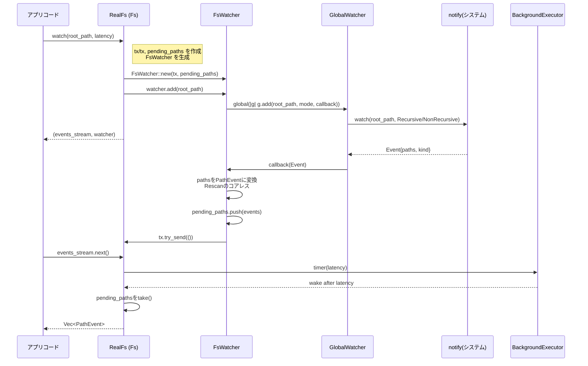

# crates/fs ディレクトリ

## 1. ざっくり一言

`fs` クレートは、

- 実システム上のファイルシステムを扱う `RealFs`
- テスト用のインメモリ実装 `FakeFs`
- ファイル監視・Git リポジトリアクセスの薄い抽象

をまとめて提供するファイルシステム抽象レイヤーです。

---

## 2. このモジュールの役割

### 2.1 概要

このディレクトリは、Zed のようなアプリケーションから OS 依存の詳細を隠しつつ、次の機能を提供するために存在しています。

- 非同期 API を持つファイルシステムインターフェイス `Fs` の定義
- OS ごとの実装を含む実ファイルシステム `RealFs`
- テスト用の完全な疑似ファイルシステム `FakeFs` と、その上で動作する疑似 Git リポジトリ `FakeGitRepository`
- `notify` クレートを使ったファイルシステム監視 (`FsWatcher` / `GlobalWatcher`)
- ディレクトリの再帰コピーなどのユーティリティ関数

アプリケーション側は `Fs` トレイトを介してこれらを利用することで、テスト時に実装を差し替えやすくなっています。

### 2.2 アーキテクチャ内での位置づけ

主要な型・モジュール間の関係を概観すると、次のような構造になっています。

```mermaid
graph TD
    subgraph crate::fs
        FsTrait["trait Fs"]
        RealFs["RealFs (実ファイルシステム)"]
        FakeFs["FakeFs (テスト用)"]
        FileHandleT["trait FileHandle"]
        FsWatcher["FsWatcher (1プロセス内の watcher)"]
        GlobalWatcher["GlobalWatcher (notify ラッパー)"]
        FakeGitRepo["FakeGitRepository (GitRepository 実装)"]
    end

    subgraph external
        Notify["notify クレート"]
        GitRepoTrait["git::repository::GitRepository"]
        RealGitRepo["git::repository::RealGitRepository"]
    end

    RealFs -->|impl| FsTrait
    FakeFs -->|impl (feature=test-support)| FsTrait
    RealFs --> RealGitRepo
    FakeFs --> FakeGitRepo
    FakeGitRepo -->|impl| GitRepoTrait

    RealFs --> FsWatcher
    FsWatcher --> GlobalWatcher
    GlobalWatcher --> Notify

    RealFs --> FileHandleT
    FakeFs --> FileHandleT
```

- アプリコードは `Fs` トレイト・`GitRepository` トレイトだけを見ればよい設計になっています。
- テスト時には `FakeFs` + `FakeGitRepository` に差し替えることで、実際のディスク・Git バイナリに依存しない検証ができます。
- ファイル監視は `Fs.watch` → `FsWatcher` → `GlobalWatcher` → `notify` の階層で実装されています。

### 2.3 設計上のポイント

コードから読み取れる設計上の特徴をまとめると、次の通りです。

- **インターフェイスと実装の分離**
  - 主要な操作は `Fs` トレイトで抽象化され、`RealFs` / `FakeFs` がそれぞれ実装しています。
  - Git も同様に `git::repository::GitRepository` トレイトで抽象化し、実環境では `RealGitRepository`、テストでは `FakeGitRepository` を利用します。

- **非同期・バックグラウンド実行**
  - `RealFs` は `BackgroundExecutor` を通してブロッキングな `std::fs` 操作をスレッドプールに投げています。
  - `FakeFs` も `simulate_random_delay` でランダムな遅延を入れ、遅延・並行実行シナリオのテストをしています。

- **プラットフォーム依存処理のカプセル化**
  - シンボリックリンク・ゴミ箱・rename の挙動など、OS ごとの差異は `cfg` 属性付きのメソッドで分岐しています。
  - Windows の `canonicalize` や atomic 書き込みなど、OS 固有の挙動に対するワークアラウンドが含まれます。

- **テスト支援機能の豊富さ**
  - `FakeFs` には JSON からのツリー挿入・実ファイルシステムからのコピー・メタデータカウント・watch の監視パス取得など、多数のテスト専用 API が用意されています。
  - `FakeGitRepositoryState` により、ブランチ・リモート・ステータス・blame・コミットグラフなど Git 状態を細かく制御できます。

- **イベント駆動のファイル監視**
  - `Fs.watch` は通知チャネルと `Watcher` オブジェクトを返し、一定遅延で `PathEvent` のバッチを流すインターフェイスになっています。
  - `FsWatcher` は「Rescan」イベントを含めたイベントのコアレス（マージ）戦略を実装し、負荷を抑えつつ「見逃しがあれば Rescan を要求する」設計になっています。

---

## 3. 主要な機能一覧

このディレクトリが提供する主な機能を列挙します。

- **`Fs` トレイト**: 非同期ファイル操作・監視・Git リポジトリ操作の統一インターフェイス。
- **`RealFs`**: 実 OS ファイルシステム上で `Fs` を実装する型。  
  ファイル作成/削除、再帰コピー、atomic 書き込み、ゴミ箱送り、`git init`/`git clone` など。
- **`FakeFs`（`test-support` feature）**:
  - インメモリの疑似ファイルシステム。
  - JSON からのツリー構築、メタデータの模擬、通知イベントの発火など、テスト用ユーティリティを多数提供。
- **`FakeGitRepository`（`test-support` feature）**:
  - `FakeFs` 上の `.git` ディレクトリに紐づく Git 状態を保持し、`GitRepository` トレイトを実装するテスト用 Git リポジトリ。
  - ステータス計算、ブランチ・リモート・ワークツリーの操作、チェックポイント（差分）機能などを実装。
- **ファイル監視 (`FsWatcher` / `GlobalWatcher`)**:
  - `notify` クレートを利用した OS ネイティブファイル監視のラッパー。
  - 監視パス追加・削除、Rescan イベントのコアレス。
- **ユーティリティ関数**
  - `copy_recursive`: ディレクトリ／ファイルを再帰的にコピー。
  - `read_dir_items`: ディレクトリ以下の全パスを (path, is_dir) 形式で取得。

---

## 4. 関数・構造体の解説

### 4.1 主要な型一覧

#### インターフェイス・メイン実装

| 名前 | 種別 | 役割 / 用途 |
|------|------|-------------|
| `Fs` | トレイト | ファイル操作・監視・Git 操作をまとめた抽象インターフェイス。 |
| `RealFs` | 構造体 | 実 OS 上で `Fs` を実装する型。`BackgroundExecutor` 上で動作。 |
| `FakeFs` | 構造体（test-support） | テスト用のインメモリファイルシステム。`Fs` を実装。 |
| `FileHandle` | トレイト | OS や FakeFs のハンドルから「現在のパス」を取得する抽象。 |

#### ファイルシステムメタデータ・オプション

| 名前 | 種別 | 役割 / 用途 |
|------|------|-------------|
| `CreateOptions` | 構造体 | ファイル作成時の上書き・存在時挙動の設定。 |
| `CopyOptions` | 構造体 | ファイルコピー時の上書き・存在時挙動の設定。 |
| `RenameOptions` | 構造体 | rename 時の上書き・親ディレクトリ作成可否など。 |
| `RemoveOptions` | 構造体 | 削除時の再帰 / 存在しない場合の扱い。 |
| `Metadata` | 構造体 | inode, mtime, is_symlink, is_dir などを含むメタデータ。|
| `MTime` | newtype (`SystemTime`) | mtime を包む型。比較誤用を避けるため `<` / `>` を実装していません。|

#### ジョブ通知関連

| 名前 | 種別 | 役割 / 用途 |
|------|------|-------------|
| `JobId` | 別名 (`usize`) | git clone など長時間ジョブの ID。 |
| `JobInfo` | 構造体 | ジョブ ID・開始時刻・メッセージ。 |
| `JobEvent` | 列挙体 | Started / Completed のイベント。 |
| `JobEventSender` / `JobEventReceiver` | 型別名 | ジョブイベントを通知する mpsc チャンネル。 |
| `JobTracker` | 構造体（内部用） | Drop 時に Completed イベントを送る RAII ヘルパ。 |

#### ファイル監視関連

| 名前 | 種別 | 役割 / 用途 |
|------|------|-------------|
| `Watcher` | トレイト | 監視パスの add/remove を行うインターフェイス。 |
| `PathEventKind` | enum | `Removed` / `Created` / `Changed` / `Rescan` の区別。 |
| `PathEvent` | 構造体 | `path: PathBuf` と `kind` を持つイベント。 |
| `FsWatcher` | 構造体 | 単一 `Fs` インスタンスに紐づく watcher 実装。 |
| `GlobalWatcher` | 構造体 | プロセス全体で共有する `notify` watcher ラッパー。 |
| `WatcherRegistrationId` | newtype | `GlobalWatcher` 内の登録 ID。 |

#### FakeFs / FakeGitRepository 関連（test-support）

| 名前 | 種別 | 役割 / 用途 |
|------|------|-------------|
| `FakeFsState` | 構造体 | `FakeFs` 内部状態（ツリー、イベント、カウンタなど）。 |
| `FakeFsEntry` | enum | File / Dir / Symlink のいずれか。FakeFs のノード。 |
| `FakeWatcher` | 構造体 | `FakeFs` 用 `Watcher` 実装。 |
| `FakeHandle` | 構造体 | inode に紐づき、移動後のパスを追跡する fake handle。 |
| `FakeGitRepositoryState` | 構造体 | HEAD/index/unmerged/refs/branches/remotes/graphなど Git 状態。 |
| `FakeGitRepository` | 構造体 | `GitRepository` を実装する fake リポジトリ。 |

### 4.2 代表的な関数・メソッドの詳細

ここでは、このディレクトリを理解・利用する上で重要度の高い関数・メソッドを 7 件に絞って解説します。

#### 4.2.1 `Fs` トレイトの概要

`Fs` トレイトは多数のメソッドを持ちますが、主なカテゴリは次の通りです。

- **ファイル・ディレクトリ操作**
  - `create_dir`, `create_file`, `create_symlink`, `remove_dir`, `remove_file`, `trash_dir`, `trash_file`
  - `write`, `save`, `atomic_write`, `load`, `load_bytes`
  - `copy_file`, `rename`, `read_dir`, `canonicalize`, `is_file`, `is_dir`, `metadata`, `read_link`
- **監視**
  - `watch(path, latency)`:
    - `Stream<Item = Vec<PathEvent>>` と `Arc<dyn Watcher>` を返す。
    - latency 経過後にペンディングしているパスイベントをまとめて流します。
- **Git 関連**
  - `open_repo(abs_dot_git, system_git_binary_path) -> Arc<dyn GitRepository>`
  - `git_init(abs_work_directory, fallback_branch_name)`
  - `git_clone(repo_url, abs_work_directory)`

これらは全て非同期メソッド（`async fn`）で定義されており、`RealFs` / `FakeFs` の両方で整合した挙動を持つように実装されています。

---

#### 4.2.2 `RealFs::rename(&self, source, target, options)` 

**概要**

- ファイル／ディレクトリをリネーム（移動）します。
- 上書き禁止時には OS の「no-replace rename」を優先的に利用し、可能な限り原子的に実行します。

**引数**

| 引数名 | 型 | 説明 |
|--------|----|------|
| `source` | `&Path` | 移動元パス。 |
| `target` | `&Path` | 移動先パス。 |
| `options` | `RenameOptions` | 上書き可否・存在時の扱い・親ディレクトリ作成など。 |

`RenameOptions` のフィールド:

- `overwrite: bool` … `true` のとき、target の上書きを許可。
- `ignore_if_exists: bool` … target が存在してもエラーにしない。
- `create_parents: bool` … target の親ディレクトリが無い場合に作成するか。

**戻り値**

- `Result<()>`  
  成功時は `Ok(())`。失敗時は `anyhow::Error` 経由で OS エラーなどを返します。

**内部処理の流れ**

1. `create_parents` が `true` であれば、`target.parent()` に対して `create_dir` を実行。
2. `options.overwrite == true` の場合:
   - 単純に `smol::fs::rename(source, target).await?` を呼び出して終了。
3. `options.overwrite == false` の場合:
   - OS がサポートしていれば、`rename_without_replace`（macOS: `renamex_np`, Linux: `renameat2(RENAME_NOREPLACE)`, Windows: `MoveFileExW`）を `BackgroundExecutor` 上で実行。
   - 成功すれば終了。`AlreadyExists` エラーなら `ignore_if_exists` に従って戻り値を決定。
   - OS が no-replace rename をサポートしないエラー（ENOSYS, ENOTSUP など）の場合は「メタデータで存在確認 → 通常 rename」というフォールバックに切り替え。
4. フォールバックパスでは、`target` のメタデータを取得し、存在する場合の挙動を `ignore_if_exists` にしたがって決定。
5. 最後に `smol::fs::rename(source, target)` を実行。

**Edge cases（エッジケース）**

- `target` が既に存在し、`overwrite = false`, `ignore_if_exists = false` の場合はエラーになります。
- `create_parents = false` で target の親ディレクトリが存在しない場合はエラーになります。
- 一部の FUSE ファイルシステム（例: NTFS via ntfs-3g）では `RENAME_NOREPLACE` が `EINVAL` で失敗し、メタデータフォールバック経路が使われます。

**使用上の注意点**

- 「同じ target に対する並列 rename」を行うと、一方が成功し一方が `AlreadyExists` で失敗する前提で書かれています（テスト `test_realfs_parallel_rename_without_overwrite_preserves_losing_source` で検証）。
- `ignore_if_exists = true` のときは「何も変更されない」可能性がある点に注意が必要です。

---

#### 4.2.3 `RealFs::watch(&self, path, latency)` と `FsWatcher::add`

**概要**

- `RealFs::watch` は指定パスを監視し、変更があれば一定遅延ごとにイベントバッチ（`Vec<PathEvent>`）をストリームとして流します。
- `FsWatcher::add` は内部で `GlobalWatcher` に登録し、`notify` のイベントから `PathEvent` を生成・蓄積します。

**`RealFs::watch` の引数・戻り値**

| 引数名 | 型 | 説明 |
|--------|----|------|
| `path` | `&Path` | 監視対象パス（ファイルまたはディレクトリ）。 |
| `latency` | `Duration` | イベントをまとめる遅延時間。 |

戻り値:

```rust
(
    Pin<Box<dyn Send + Stream<Item = Vec<PathEvent>>>>,
    Arc<dyn Watcher>,
)
```

- 第 1 要素: イベントバッチのストリーム。
- 第 2 要素: 監視パス追加・削除に使う `Watcher` 実装（`FsWatcher`）。

**処理の流れ（要約）**

- `smol::channel::unbounded()` で「バッチ到着通知」用の `tx: Sender<()>` と `rx: Receiver<()>` を用意。
- `pending_paths: Arc<Mutex<Vec<PathEvent>>>` を作成し、これにイベントを溜めます。
- `FsWatcher::new(tx, pending_paths.clone())` で watcher を生成。
- `watcher.add(path)` を呼び出し、パスが存在しない場合は親ディレクトリも監視します。
- パスがシンボリックリンクの場合、リンク先およびその親ディレクトリも追加監視します。
- 返却するストリーム側では、`rx` からシグナルを受け取るたびに:
  1. `executor.timer(latency).await` で遅延を待つ。
  2. `pending_paths` を取り出し、空でなければ `Vec<PathEvent>` として流す。

**`FsWatcher::add` の内部**

- Windows / macOS の場合:
  - 既に監視されている祖先パスがあれば再利用し、無駄な登録を避けます（メモリ削減）。
- Linux の場合:
  - パス毎に `INotify` watcher を追加し、重複登録はスキップします。
- 実際の登録は `global(|g| g.add(watch_path, mode, callback))` 経由で `GlobalWatcher` に依頼。
- callback では:
  - `notify::EventKind` から `PathEventKind` を決定（Create → Created, Modify → Changed, Remove → Removed）。
  - `SanitizedPath` でパスを正規化し、root_path 配下のパスのみ `PathEvent` に変換。
  - `event.need_rescan()` が `true` の場合、Rescan イベントをパス単位で付与し、`coalesce_pending_rescans` で既存の Rescan とマージ。
  - `pending_paths` が空だった場合のみ `tx.try_send(())` でシグナルを送信し、「バッチ準備完了」を通知。

**Edge cases**

- `notify` が「watcher の同期を失った」と判断した場合 (`need_rescan()`)、`Rescan` イベントが発行されます。
  - Rescan は同一パスや祖先・子孫関係でコアレスされ、不要な全走査回数を抑制します。
- `FsWatcher::Drop` 時には `GlobalWatcher` の登録解除が行われます。

**使用上の注意点**

- `watch` が返す `Watcher` は drop されるまで監視を維持します（テストコードでは `_watcher` を変数に保持しています）。
- Rescan イベントを受け取った側は「再スキャンを行う」というプロトコルを前提に実装する必要があります。

---

#### 4.2.4 `copy_recursive(fs, source, target, options)`

```rust
pub async fn copy_recursive<'a>(
    fs: &'a dyn Fs,
    source: &'a Path,
    target: &'a Path,
    options: CopyOptions,
) -> Result<()>
```

**概要**

- `Fs` を通じて `source` 以下を再帰的に走査し、`target` 以下にコピーします。
- `CopyOptions` により既存ファイルの扱いを制御できます。

**引数**

| 引数名 | 型 | 説明 |
|--------|----|------|
| `fs` | `&dyn Fs` | どの `Fs` 実装を使うか（`RealFs` / `FakeFs`）。 |
| `source` | `&Path` | コピー元パス（ファイルまたはディレクトリ）。 |
| `target` | `&Path` | コピー先パス。 |
| `options` | `CopyOptions` | 上書き・既存時挙動の設定。 |

**戻り値**

- `Result<()>`  
  成功時 `Ok(())`。例外的状況（既存で上書き禁止など）ではエラー。

**内部処理の流れ**

1. `read_dir_items(fs, source).await?` で source 以下の全ての `(path, is_dir)` を取得。
2. 各 `(item, is_dir)` について:
   - `item_relative_path = item.strip_prefix(source)` を計算し、`target_item` を決定。
   - ディレクトリの場合:
     - `options.overwrite == false` かつ `fs.metadata(&target_item).await?.is_some()` なら:
       - `options.ignore_if_exists` に応じてスキップまたはエラー。
     - いったん `RemoveOptions{recursive: true, ignore_if_not_exists: true}` で削除し、`fs.create_dir(&target_item)` で作り直す。
   - ファイルの場合:
     - `fs.copy_file(&item, &target_item, options)` を呼び出す。
3. すべての項目処理が終われば `Ok(())` を返す。

**Edge cases**

- `source` が単一ファイルの場合でも動作します（テスト `test_copy_recursive_with_single_file`）。
- 既存ディレクトリに対して `overwrite = true` の場合、再作成前に再帰削除が走るため、ディレクトリ内容は上書きされます。
- `ignore_if_exists = true` の場合は、既存ディレクトリがあればその下を再帰コピーせずスキップされます。

**使用上の注意点**

- ファイル／ディレクトリの区別や存在チェックは `Fs` に委ねられているため、`FakeFs` でも同じロジックで動作します。
- 「自分自身の下に自分をコピーする」ようなケースでは、構造が入れ子に増殖するので注意が必要です（テストでその振る舞いが確認されています）。

**使用例（FakeFs を用いたテスト）**

```rust
// FakeFs を作成し、初期ツリーを挿入
let fs = FakeFs::new(executor);
fs.insert_tree(
    path!("/outer"),
    json!({
        "inner1": { "a": "A" },
        "inner2": { "b": "B" },
    }),
).await;

// /outer の内容を /outer/inner1/outer 以下にコピー
copy_recursive(
    fs.as_ref(),
    Path::new(path!("/outer")),
    Path::new(path!("/outer/inner1/outer")),
    CopyOptions::default(),
).await.unwrap();
```

---

#### 4.2.5 `FakeFs::insert_tree` / `insert_tree_from_real_fs`

**概要**

- テスト用に `FakeFs` のルート以下にディレクトリツリーを一括挿入するユーティリティです。
- `serde_json::Value` または実ファイルシステムからツリーを構築します。

**`insert_tree` のシグネチャ**

```rust
pub fn insert_tree<'a>(
    &'a self,
    path: impl 'a + AsRef<Path> + Send,
    tree: serde_json::Value,
) -> futures::future::BoxFuture<'a, ()>
```

**内部処理のイメージ**

- `serde_json::Value` の構造に応じて分岐:
  - `Object(map)`:
    - `create_dir(&path)` でディレクトリを作成。
    - 各 (name, contents) に対して、`path.join(name)` を再帰的に `insert_tree`。
  - `Null`:
    - 空ディレクトリを作成。
  - `String(contents)`:
    - ファイルとして `contents.into_bytes()` を書き込む。
  - それ以外は panic（`Object` / `Null` / `String` のみサポート）。

**使用例**

```rust
let fs = FakeFs::new(executor);
fs.insert_tree(
    path!("/root"),
    json!({
        "dir1": {
            "a": "A",
            "b": "B",
        },
        "dir2": {
            "c": "C",
        },
    }),
).await;

// /root/dir1/a の内容は "A"
assert_eq!(
    fs.load(path!("/root/dir1/a").as_ref()).await.unwrap(),
    "A"
);
```

**使用上の注意点**

- `json!` でオブジェクト・文字列・null 以外（数値、配列など）を入れると panic します。
- `insert_tree_from_real_fs` は実ファイルシステムの内容をそのまま FakeFs にミラーリングするため、「テストが実データに依存するかどうか」に留意する必要があります。

---

#### 4.2.6 `FakeGitRepository::status(&self, path_prefixes: &[RepoPath])`

**概要**

- `FakeGitRepositoryState` に格納された `head_contents` / `index_contents` / `unmerged_paths` と、`FakeFs` 上の実際のファイル内容を組み合わせて、`git status` に相当する `GitStatus` を計算します。
- 主にテストで `set_status_for_repo` と組み合わせて使用されます。

**引数**

| 引数名 | 型 | 説明 |
|--------|----|------|
| `path_prefixes` | `&[RepoPath]` | どのパス配下の状態を返すかを絞り込むプレフィックス。 |

**戻り値**

- `Task<Result<GitStatus>>`  
  `gpui::Task` で即時完了する `GitStatus` を返しています。

**内部処理の流れ（簡略）**

1. `.git` の親ディレクトリ（ワークツリー）から `.gitignore` を上位ディレクトリまで辿って読み込み、`ignore::gitignore::GitignoreBuilder` で `ignores` を構築。
2. `FakeFs::files()` で `FakeFs` 上の全ファイルを列挙し:
   - `.git` 配下のものを除外。
   - `.gitignore` にマッチするものを `is_ignored` フラグ付きで保持。
   - ファイル内容を `String` として読み込み、`RepoPath` に変換。
3. `with_git_state` で `FakeGitRepositoryState` を読み出し、`head_contents` / `index_contents` / `unmerged_paths` / `git_files` を総ざらいして `paths` セットを作る。
4. 各 `path` について、`path_prefixes` と `.starts_with` でフィルタリング。
5. `(unmerged, head, index, fs)` の組み合わせに応じて `FileStatus` を決定。
   - `Unmerged` があれば最優先。
   - HEAD / index / worktree の有無と内容一致を比較して `TrackedStatus`（Added, Modified, Deleted…）を構成。
   - worktree にのみ存在するファイルで `is_ignored == false` のものは `Untracked`。
6. 完全に Unmodified なものは除外。
7. パスでソートし、`GitStatus { entries }` として返す。

**Edge cases**

- `.gitignore` の扱いは行単位で実装されており、再帰的に親ディレクトリを遡って読み込みます。
- `.git` ディレクトリそのものは `is_ignored = true` として扱われます。

**使用上の注意点**

- `FakeFs` を直接操作しても `FakeGitRepositoryState` の HEAD / index 状態は自動では更新されません。  
  テストでは `set_head_for_repo` / `set_index_for_repo` / `set_status_for_repo` などを用いて明示的に状態を設定しています。
- 大量のファイルの場合、`FakeFs::files()` が全走査になるため、テスト用としての使い方に留める設計になっています。

---

#### 4.2.7 チェックポイント関連 (`checkpoint`, `restore_checkpoint`, `diff_checkpoints`)

`FakeGitRepository` にはファイルシステムスナップショット機能があり、テスト `test_checkpoints` で使用されています。

**`checkpoint`**

```rust
fn checkpoint(&self) -> BoxFuture<'static, Result<GitRepositoryCheckpoint>>
```

- `.git` の親ディレクトリ（= リポジトリルート）の `FakeFsEntry` を取得し、ランダムな `Oid` をキーに `self.checkpoints` に保存します。
- `GitRepositoryCheckpoint { commit_sha: oid }` を返します。

**`restore_checkpoint`**

- 指定された checkpoint に対応する `FakeFsEntry` を取り出し、リポジトリルートに `insert_entry` で戻します。
- テストでは:
  - checkpoint1: 変更前
  - checkpoint2: 変更後  
  のように保存し、`restore_checkpoint(checkpoint1)` で状態が戻ることを確認しています。

**`diff_checkpoints`**

- checkpoint 間の差分を「簡易 unified diff 形式」の文字列として返します。
- 内部では:
  - `collect_files(entry, prefix, out)` で（FakeFs 上の）ファイル一覧と内容を `BTreeMap<String, String>` に収集。
  - キー（パス）の集合を取って比較し、内容変更 / 追加 / 削除のそれぞれに対して diff 風のテキストを構築します。

**Edge cases**

- 同一状態の checkpoint 同士を diff すると空文字列を返します（テストで確認済み）。
- シンボリックリンクは `collect_files` 内で無視されています。

**使用上の注意点**

- checkpoint は `FakeFs` 上のツリーを丸ごとコピーするため、大きなツリーではメモリを多く消費します。
- あくまでテスト用（`FakeGitRepository` 専用）機能であり、本番環境の `RealGitRepository` にはこの機能はありません。

---

### 4.3 その他の代表的な関数・メソッド一覧

詳細は割愛しますが、よく使われる補助的 API の一覧です。

| 関数 / メソッド名 | 役割（1 行） |
|-------------------|--------------|
| `Fs::atomic_write` | 一時ファイル＋置換を用いた atomic 書き込み（RealFs/FakeFs で実装）。 |
| `Fs::is_case_sensitive` | ファイル名の大小文字を変えた 2 ファイルが共存できるかで FS のケース感度を判定。 |
| `FakeFs::touch_path` | 指定パスの mtime / inode を進めて変更を疑似的に発生させる。 |
| `FakeFs::pause_events` / `unpause_events_and_flush` | ファイルシステムイベントのバッファリング・まとめて送出。 |
| `FakeFs::paths` / `files` / `directories` | FakeFs 内の全パスを列挙（`.git` を含むかどうかも選択可）。 |
| `FakeFs::set_head_for_repo` / `set_index_for_repo` / `set_status_for_repo` | `FakeGitRepositoryState` の Git 状態を一括設定。 |
| `FsWatcher::remove` | 特定パスの watch 登録を解除。 |
| `GlobalWatcher::add` / `remove` | `notify` watcher への低レベル登録・解除。 |
| `RealFs::git_init` / `git_clone` | 外部 `git` コマンドを呼び出してリポジトリを初期化・クローン。 |

---

## 5. データフロー

ここでは、典型的な「ファイル監視 → アプリへのイベント通知」フローを例に、データの流れを示します。

### 5.1 ファイル監視のシーケンス



要点:

- `GlobalWatcher` はプロセス内で 1 つだけ存在し、`notify::recommended_watcher` の結果を保持します。
- `FsWatcher` ごとに「監視対象パス → 登録 ID」のマップを持ち、Drop 時に `GlobalWatcher.remove` を呼び出します。
- 実際のイベント処理（Rescan コアレスなど）は `FsWatcher` 側の callback 内で完結しています。
- `latency` によりイベントはバッチ化され、頻繁な変化でもアプリ側の負担を軽減します。

---

## 6. 使い方（How to Use）

### 6.1 基本的な使用方法

#### 6.1.1 RealFs をグローバルに設定して使う

アプリケーションからは `Fs` トレイトを通して操作するのが基本です。

```rust
use fs::{Fs, RealFs};
use gpui::{App, BackgroundExecutor};
use std::sync::Arc;
use std::path::Path;

fn init_fs(cx: &mut App, executor: BackgroundExecutor) {
    // 実ファイルシステム実装を作成する
    let real_fs = RealFs::new(None, executor); // bundled git バイナリなし
    let fs_arc: Arc<dyn Fs> = Arc::new(real_fs);

    // グローバル Fs として登録
    <dyn Fs>::set_global(fs_arc, cx);
}

async fn example_use(cx: &App) -> anyhow::Result<()> {
    // グローバル Fs を取得
    let fs = <dyn Fs>::global(cx);

    // ファイルを書き込む
    fs.write(Path::new("example.txt"), b"Hello").await?;

    // 読み出す
    let text = fs.load(Path::new("example.txt")).await?;
    assert_eq!(text, "Hello");

    Ok(())
}
```

ポイント:

- `GlobalFs` を通じて `Fs` 実装をアプリ全体で共有します。
- 実装は `Arc<dyn Fs>` として扱い、FakeFs と差し替えることも可能です。

#### 6.1.2 FakeFs + FakeGitRepository を用いたテスト

`test-support` feature を有効にすると、テストから `FakeFs` / `FakeGitRepository` を利用できます。

```rust
use fs::{FakeFs, Fs};
use gpui::BackgroundExecutor;
use serde_json::json;
use std::path::Path;

// executor はテストコンテキストから渡される
async fn test_git_status(executor: BackgroundExecutor) {
    let fs = FakeFs::new(executor);

    // プロジェクトと .git ディレクトリを作成
    fs.insert_tree(
        "/project",
        json!({
            ".git": {},
            "file.txt": "content",
        }),
    ).await;

    // Git リポジトリを開く (FakeGitRepository)
    let repo = fs.open_repo(Path::new("/project/.git"), None).unwrap();

    // HEAD / index 状態を設定
    fs.set_head_and_index_for_repo(
        Path::new("/project/.git"),
        &[("file.txt", "content".to_string())],
    );

    // status を取得
    let status = repo.status(&[]).await.unwrap();
    assert!(status.entries.is_empty()); // すべて Unmodified
}
```

### 6.2 よくある使用パターン

#### 6.2.1 ディレクトリの再帰コピー

```rust
use fs::{Fs, FakeFs, copy_recursive, CopyOptions};
use serde_json::json;
use std::path::Path;

async fn copy_example(fs: &dyn Fs) -> anyhow::Result<()> {
    let source = Path::new("/source");
    let target = Path::new("/target");

    copy_recursive(fs, source, target, CopyOptions::default()).await?;
    Ok(())
}

async fn test_copy(executor: gpui::BackgroundExecutor) {
    let fs = FakeFs::new(executor);
    fs.insert_tree(
        "/source",
        json!({"a": "A", "dir": { "b": "B" }}),
    ).await;

    copy_example(fs.as_ref()).await.unwrap();
}
```

#### 6.2.2 ファイル監視

```rust
use fs::{Fs, PathEventKind};
use std::{path::Path, time::Duration};
use futures::StreamExt;

async fn watch_example(fs: &dyn Fs) -> anyhow::Result<()> {
    let root = Path::new("/path/to/watch");

    let (mut events, watcher) = fs.watch(root, Duration::from_millis(50)).await;

    // 必要に応じて追加監視
    watcher.add(root)?;

    while let Some(batch) = events.next().await {
        for event in batch {
            match event.kind {
                Some(PathEventKind::Created) => println!("created: {}", event.path.display()),
                Some(PathEventKind::Changed) => println!("changed: {}", event.path.display()),
                Some(PathEventKind::Removed) => println!("removed: {}", event.path.display()),
                Some(PathEventKind::Rescan) => println!("rescan requested at {}", event.path.display()),
                None => {}
            }
        }
    }

    Ok(())
}
```

### 6.3 よくある間違い

#### 6.3.1 FakeFs に対して `as_fake` を呼ばない

```rust
// 誤り: dyn Fs から FakeFs 固有 API に直接アクセスしようとしている
fn wrong(fs: Arc<dyn Fs>) {
    // コンパイルエラー / 実行時パニック
    // fs.insert_tree(...); // trait Fs には存在しない
}
```

```rust
// 正しい例: FakeFs であることが分かっている場合に as_fake() を使う
fn correct(fs: Arc<dyn Fs>) {
    #[cfg(feature = "test-support")]
    {
        let fake = fs.as_fake(); // FakeFs へのダウンキャスト
        fake.buffered_event_count();
    }
}
```

- `Fs::as_fake` は `#[cfg(feature = "test-support")]` かつ FakeFs 実装にのみ定義されており、RealFs で呼び出すと panic します（`panic!("called as_fake on a real fs")`）。

#### 6.3.2 `RenameOptions::create_parents` を設定し忘れる

```rust
// 間違い: 親ディレクトリが存在しないのに create_parents=false
fs.rename(
    Path::new("/root/src/file.txt"),
    Path::new("/root/newdir/file.txt"),
    RenameOptions::default(), // create_parents = false
).await.unwrap(); // → エラー
```

```rust
// 正しい: 新しいディレクトリを作りつつ rename
fs.rename(
    Path::new("/root/src/file.txt"),
    Path::new("/root/newdir/file.txt"),
    RenameOptions { create_parents: true, ..Default::default() },
).await.unwrap();
```

### 6.4 使用上の注意点（まとめ）

- **RealFs と FakeFs の違い**
  - `FakeFs` はインメモリであり、パスは `util::path!` マクロで生成される UNIX ライクな形式を前提にしています。
  - RealFs では OS 固有の制限やエラー（パス長、パーミッションなど）をそのまま返すため、テストと本番の差異に注意が必要です。

- **Git 関連機能**
  - `FakeGitRepository` の多くのメソッドはテスト用に簡略化されています（`stash_*` や `push` などは `unimplemented!()`）。
  - 本番コードで使用する Git 機能は `RealGitRepository` 側の実装に依存します。

- **ファイル監視**
  - `watch` の第二戻り値 `Watcher` を早期に drop すると監視が止まります。  
    テストコードのように `_watcher` 変数に保持しておくのが前提です。
  - `Rescan` イベントを受け取った場合に「再スキャンを行わない」と、変更漏れが起こる設計になっています。

- **MTime 比較**
  - `MTime` は「比較は危険である」とのコメント通り、`Ord` を実装していません。
  - `bad_is_greater_than` は過去の挙動を保つための一時的メソッドとして提供されているので、新規コードでの多用には注意が必要です。

---

## 7. 関連ファイル

このディレクトリと密接に関係するファイルをまとめます。

| パス | 役割 / 関係 |
|------|------------|
| `fs/Cargo.toml` | このクレートの設定。`test-support` feature で FakeFs / FakeGitRepository を有効化します。 |
| `fs/src/fs.rs` | `Fs` トレイト、`RealFs` 実装、`FakeFs` 実装（`test-support`）および各種ユーティリティ関数の中心ファイルです。 |
| `fs/src/fake_git_repo.rs` | `FakeGitRepository` とその状態 `FakeGitRepositoryState` の実装。`FakeFs::open_repo` から利用されます。 |
| `fs/src/fs_watcher.rs` | `FsWatcher` と `GlobalWatcher` の実装。`RealFs::watch` で利用されます。 |
| `fs/tests/integration/fs.rs` | FakeFs / RealFs の挙動（再帰コピー、rename、atomic write、watch など）を検証する統合テスト。 |
| `fs/tests/integration/fake_git_repo.rs` | FakeGitRepository のワークツリーライフサイクル・checkpoint 機能を検証する統合テスト。 |
| `fs/tests/integration/main.rs` | 上記テストモジュールのエントリポイント。 |

この構成により、アプリケーション本体は `Fs` / `GitRepository` の抽象を利用しつつ、テスト用には Fake 実装を容易に差し替えられるようになっています。
