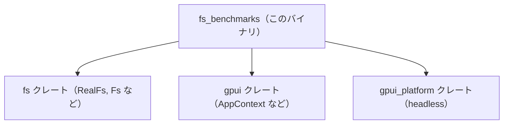
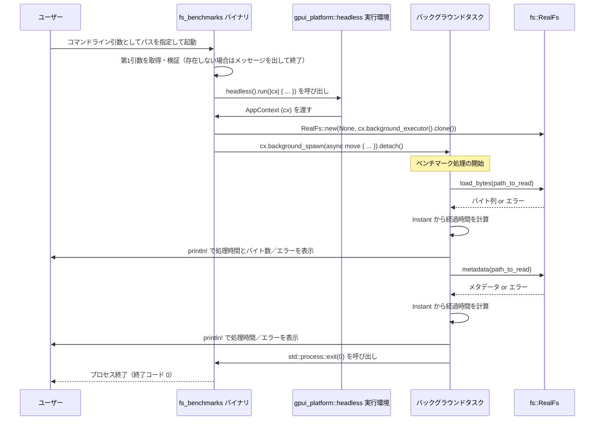

## 0. ざっくり一言

`fs_benchmarks` は、コマンドラインで指定したパスに対して `fs::RealFs` の `load_bytes` と `metadata` を実行し、その処理時間をヘッドレスな `gpui` 実行環境の上で計測・表示するための小さなベンチマーク用バイナリです。

---

## 1. このモジュールの役割

### 1.1 概要

- このディレクトリ（クレート）は、ファイルシステム抽象（`fs` クレート）の実装 `RealFs` を使った I/O の **実行時間計測** を行うコマンドラインツールです。
- コマンドライン引数として渡されたパスに対し、
  - ファイル内容の読み込み（`load_bytes`）
  - メタデータ取得（`metadata`）
  を順に実行し、それぞれにかかった時間を標準出力に表示します。
- 実行環境として `gpui_platform::headless` を利用し、`gpui` の背景タスク実行基盤（`background_executor`）上で I/O を行う構成になっています。

### 1.2 アーキテクチャ内での位置づけ

このクレートはワークスペース内の 1 つのバイナリクレートとして存在し、他のクレートに対してライブラリ API を提供するのではなく、自身が実行ファイルになります。依存関係の概略は次のようになります。



- `fs_benchmarks`  
  - エントリポイント `main` を持つバイナリクレートです。
- `fs` クレート  
  - `RealFs` 型および `Fs` トレイトを提供していると考えられますが、詳細実装はこのチャンクには含まれていません。
- `gpui` クレート  
  - アプリケーションコンテキスト型（`AppContext`）や背景タスク実行のための API を提供します。
- `gpui_platform` クレート  
  - `headless()` 関数により、GUI を持たないヘッドレス実行環境を構築します。

### 1.3 設計上のポイント

コードから読み取れる設計上の特徴は次のとおりです。

- **単一のエントリポイントのみ**
  - 独自の構造体・モジュールは定義せず、すべての処理が `main` 関数内に収まっています。
- **ヘッドレス gpui 実行環境の利用**
  - `headless().run(|cx| { ... })` で `gpui` のアプリケーションコンテキスト（`AppContext`）を取得し、そのコンテキストの `background_executor` を `RealFs::new` に渡しています。
- **非同期タスクとして I/O を実行**
  - `cx.background_spawn(async move { ... })` を使用し、非同期タスク内で `load_bytes` と `metadata` を順に await する構造になっています。
- **時間計測はシンプルな `Instant` ベース**
  - `std::time::Instant::now()` と `elapsed()` を用いて処理時間をナノ秒精度で計測しています。
- **エラー処理はログ出力のみ**
  - I/O エラーは `println!` でメッセージを表示するだけで、プロセスの終了コードなどには反映していません（常に `exit(0)` を呼びます）。
- **明示的なプロセス終了**
  - ベンチマークタスク終了後、`std::process::exit(0)` によりプロセス全体を即時終了させます。これにより、`headless().run` が内部で持つイベントループなどを明示的に停止する必要がありません。

---

## 2. 主要な機能一覧

このクレートが提供する主要な機能は次のとおりです。

- コマンドライン引数から読み取り対象のパスを取得し、入力チェックを行う。
- `gpui_platform::headless` を使ってヘッドレス実行環境を起動する。
- `fs::RealFs` を `AppContext` の背景実行エグゼキュータ上に構築する。
- 指定パスに対して `load_bytes` を実行し、その処理時間と読み込んだバイト数を表示する。
- 指定パスに対して `metadata` を実行し、その処理時間を表示する。
- ベンチマーク完了後に `std::process::exit(0)` でプロセスを終了する。

---

## 3. 公開 API と詳細解説

このディレクトリはバイナリクレートであり、外部に再利用されるライブラリ API（関数や型）は公開していません。実質的な「API」は OS から呼び出される `main` 関数と、コマンドラインインターフェースです。

### 3.1 型一覧（構造体・列挙体など）

このディレクトリ内では新しい型は定義されていませんが、主要な役割を持つ外部定義の型を整理します。

| 名前 | 種別 | 定義元 | 役割 / 用途 |
|------|------|--------|-------------|
| `RealFs` | 型 | `fs` クレート | 実ファイルシステムに対する実装として使用され、`load_bytes` と `metadata` などの I/O 操作を提供します。 |
| `Fs` | トレイト | `fs` クレート | `RealFs` が実装していると考えられるファイルシステム用の抽象トレイトです（このチャンクでは定義は確認できません）。 |
| `AppContext` | 型 | `gpui` クレート | `background_executor` や `background_spawn` など、アプリケーション実行環境へのインターフェースを提供します。 |

> 上記の型はいずれも他クレートで定義されており、このチャンクには実装は含まれていません。

### 3.2 関数詳細

このクレート内に定義されている関数は `main` の 1 つです。

#### `fn main()`

**概要**

- コマンドライン引数から 1 つ目のユーザー指定引数（ファイルパス）を取得し、それを対象としてファイル読み込みとメタデータ取得の 2 つの I/O 操作の処理時間を計測・表示するエントリポイントです。
- 実行は `gpui_platform::headless` が提供するヘッドレス実行環境の中で、背景タスクとして行われます。

**引数**

- なし（OS から呼び出されるエントリポイントであり、引数は `std::env::args()` から取得します）。

**戻り値**

- `()`（戻り値はありません）。
- 実際のプロセス終了は `std::process::exit(0)` で制御されます。

**内部処理の流れ**

ソースコードに沿った処理の概略は次のとおりです。

1. **コマンドライン引数からパスを取得**

   ```rust
   let Some(path_to_read) = std::env::args().nth(1) else {
       println!("Expected path to read as 1st argument.");
       return;
   };
   ```

   - `std::env::args().nth(1)` で「プログラム名に続く 1 番目の引数」を取得します。
   - 引数が存在しない場合はメッセージを出力して即座に `return` し、何も計測せずに終了します。

2. **ヘッドレス実行環境の起動**

   ```rust
   let _ = headless().run(|cx| {
       // ...
   });
   ```

   - `headless()` は `gpui_platform` 由来の関数で、GUI を持たないアプリケーション環境を構築します。
   - `.run(|cx| { ... })` でアプリケーションを実行し、クロージャには `AppContext` に相当するコンテキスト `cx` が渡されます。
   - 戻り値（おそらく `Result` 型）は `let _ =` により無視されています。

3. **ファイルシステム実装の生成**

   ```rust
   let fs = fs::RealFs::new(None, cx.background_executor().clone());
   ```

   - `RealFs::new` に対し第 1 引数に `None`、第 2 引数に `cx.background_executor().clone()` を渡しています。
   - 第 1 引数（`None`）の意味は、このチャンクだけでは不明です。
   - 第 2 引数には `background_executor` をクローンして渡しており、`RealFs` がそのエグゼキュータ上で非同期タスクを実行する設計と解釈できます。

4. **背景タスクの起動**

   ```rust
   cx.background_spawn(async move {
       // ベンチマーク本体
   })
   .detach();
   ```

   - `background_spawn` で非同期タスクを起動し、そのハンドルに対して `.detach()` を呼び、結果を待たずに「投げっぱなし」で実行します。
   - `async move` により、`fs` と `path_to_read` はタスクのクローズオーバにムーブされます。

5. **`load_bytes` の時間計測と表示**

   ```rust
   let timer = std::time::Instant::now();
   let result = fs.load_bytes(path_to_read.as_ref()).await;
   let elapsed = timer.elapsed();
   if let Err(e) = result {
       println!("Failed `load_bytes` after {elapsed:?} with error `{e}`");
   } else {
       println!("Took {elapsed:?} to read {} bytes", result.unwrap().len());
   };
   ```

   - `Instant::now()` で時刻を取得し、その後 `fs.load_bytes(...)` を await します。
   - 完了後、`elapsed()` で経過時間を求めます。
   - 結果が `Err` の場合は、経過時間とエラーメッセージを表示します。
   - 成功 (`Ok`) の場合は、経過時間と読み込んだバイト列の長さ（`len()`）を表示します。  
     `result.unwrap()` は `else` ブロック内でのみ呼ばれるため、このパスでは panic は発生しない構造になっています。

6. **`metadata` の時間計測と表示**

   ```rust
   let timer = std::time::Instant::now();
   let result = fs.metadata(path_to_read.as_ref()).await;
   let elapsed = timer.elapsed();
   if let Err(e) = result {
       println!("Failed `metadata` after {elapsed:?} with error `{e}`");
   } else {
       println!("Took {elapsed:?} to query metadata");
   };
   ```

   - 上記と同様に、今度はメタデータ取得（`metadata`）の処理時間を計測して表示します。
   - 正常系ではバイト数などは表示せず、時間のみを出力します。

7. **プロセスの終了**

   ```rust
   std::process::exit(0);
   ```

   - ベンチマーク処理が終わったら、終了コード `0`（正常終了）でプロセスを即時終了させます。
   - これにより、`headless().run` の外側に記述されたコードは実行されず、他のタスクがまだ動いていても終了します。

**Examples（使用例）**

CLI から `main` を呼び出す代表的な方法は次のようになります（ワークスペースルートからの実行例）。

```bash
# fs_benchmarks クレートを指定し、計測対象のファイルパスを引数として渡す
cargo run -p fs_benchmarks -- path/to/file.txt
#              ^^^^^^^^^^^^   ^^^^^^^^^^^^^^^^^
#              実行するクレート  プログラムに渡す第1引数（計測対象パス）
```

実行に成功すると、出力のイメージは次のようになります（数値は例です）。

```text
Took 2.34ms to read 12345 bytes
Took 0.80ms to query metadata
```

`main` 内の処理イメージをコメント付きで抜粋すると、次のようになります。

```rust
use fs::Fs;                         // Fs トレイトをスコープに入れる（RealFs のメソッド解決に利用される）
use gpui::AppContext;               // AppContext 型をスコープに入れる（cx の型推論に利用される）
use gpui_platform::headless;        // ヘッドレスな gpui 実行環境を作る関数をインポートする

fn main() {
    // コマンドラインの第1引数（プログラム名の次の引数）を取得する
    let Some(path_to_read) = std::env::args().nth(1) else {
        // 引数がなければメッセージを出して終了する
        println!("Expected path to read as 1st argument.");
        return;
    };

    // ヘッドレス実行環境を起動し、アプリケーションコンテキスト cx を受け取る
    let _ = headless().run(|cx| {
        // RealFs を背景エグゼキュータ上に構築する
        let fs = fs::RealFs::new(None, cx.background_executor().clone());

        // 背景タスクとしてベンチマーク処理を起動する
        cx.background_spawn(async move {
            // --- load_bytes の計測 ---
            let timer = std::time::Instant::now();                    // 計測開始時刻
            let result = fs.load_bytes(path_to_read.as_ref()).await;  // ファイル内容を読み込む（非同期）
            let elapsed = timer.elapsed();                            // 経過時間を取得
            if let Err(e) = result {
                // 読み込みに失敗した場合はエラーと時間を表示
                println!("Failed `load_bytes` after {elapsed:?} with error `{e}`");
            } else {
                // 成功した場合は経過時間と読み込んだバイト数を表示
                println!("Took {elapsed:?} to read {} bytes", result.unwrap().len());
            };

            // --- metadata の計測 ---
            let timer = std::time::Instant::now();                    // 計測開始時刻を取り直す
            let result = fs.metadata(path_to_read.as_ref()).await;    // メタデータを取得（非同期）
            let elapsed = timer.elapsed();                            // 経過時間を取得
            if let Err(e) = result {
                // 失敗時はエラーと時間を表示
                println!("Failed `metadata` after {elapsed:?} with error `{e}`");
            } else {
                // 成功時は経過時間のみ表示
                println!("Took {elapsed:?} to query metadata");
            };

            // ベンチマーク終了後、プロセスを正常終了コード 0 で即時終了する
            std::process::exit(0);
        })
        .detach(); // タスクの完了を待たずにハンドルを破棄する
    });
}
```

**Errors / Panics**

- `main` 自身は `Result` を返さないため、呼び出し元（OS）には常に終了コード 0 が返されます（`std::process::exit(0)` による）。
- 明示的な panic を起こすコードはありません。
  - `result.unwrap()` は `else` ブロック（`result` が `Ok` であることが分かっている場合）でのみ呼ばれるため、`load_bytes`／`metadata` の戻り値に対する unwrap で panic する可能性はありません。
- ただし、次のようなケースではライブラリ側でエラー（`Err`）が返る可能性があります。
  - 指定パスが存在しない。
  - 権限不足で読み込み・メタデータ取得ができない。
  - パスが不正な形式である。  
  これらの挙動の詳細は `fs` クレートの実装に依存し、このチャンクだけでは確定的な説明はできません。

**Edge cases（エッジケース）**

- **引数なしで起動した場合**
  - `"Expected path to read as 1st argument."` と表示され、何も計測せずに終了します。
- **ディレクトリを指定した場合**
  - `load_bytes` や `metadata` の挙動は `fs::RealFs` の実装に依存します。このチャンクでは、ディレクトリに対して `Err` を返すのか、特定の扱いをするのかは分かりません。
- **非常に大きなファイルを指定した場合**
  - 読み込み時間やメモリ使用量が増加し、計測結果も大きな値となります。メモリ不足などが発生した場合の挙動は `fs` の実装に依存します。
- **パスにマルチバイト文字（日本語など）が含まれる場合**
  - `path_to_read` は `String` として扱われており、`as_ref()` で `&str` に変換されて `load_bytes` / `metadata` に渡されます。文字コードやファイルシステムとの対応は `fs` クレートの内部実装に依存します。

**使用上の注意点**

- **終了コードは常に 0**
  - I/O の成否に関わらず、最後に `std::process::exit(0)` を呼ぶため、シェルから見ると常に「正常終了」となります。ベンチマーク結果をスクリプトから機械的に判定したい場合は、標準出力のメッセージ内容をパースする必要があります。
- **プロセスが即時終了する**
  - `std::process::exit(0)` により、他に動作中のスレッドやタスクがあってもプロセス全体が終了します。このバイナリは単独で使うことを前提としており、別のアプリケーションから埋め込みで呼び出す用途には適していません。
- **背景タスクの結果を待たない**
  - `cx.background_spawn(...).detach()` という形でタスクを起動しているため、`headless().run` の戻り値側ではタスクの終了を待ちません。実際にはタスク側の `std::process::exit(0)` によってプロセスが終了するため、タスクの完了を同期的に待つ必要がない前提の設計です。

### 3.3 その他の関数

- このディレクトリ内には `main` 以外の関数は定義されていません。

---

## 4. データフロー

代表的なシナリオとして、「ユーザーがファイルパスを指定して実行し、`load_bytes` と `metadata` の処理時間が表示される」までのデータフローを示します。



要点としては次の通りです。

- `main` は単に **環境のセットアップとタスク起動** を担当し、実際の I/O と時間計測は背景タスク内で行われます。
- ファイルパス文字列は `async move` によりタスクへムーブされ、その中で `path_to_read.as_ref()` として参照されます。
- `RealFs` への I/O 要求はすべて背景タスクから行われ、結果は標準出力に出力されるだけで、他の構造体には渡されません。

---

## 5. 使い方（How to Use）

### 5.1 基本的な使用方法

#### コマンドラインからの実行

ワークスペースルート（`Cargo.toml` 群がある場所）から、次のように実行します。

```bash
# fs_benchmarks クレートを指定してビルド・実行し、
# 計測対象のファイルパスを第1引数として渡す
cargo run -p fs_benchmarks -- path/to/file.txt
#                           ^^
#     cargo のオプションとプログラム引数を区切るための -- が必要
```

- `path/to/file.txt` の部分を、計測したい実際のファイルパスに置き換えます。
- パスは相対パス・絶対パスのどちらでも構いませんが、解釈される場所（カレントディレクトリ）は `cargo run` を実行したディレクトリになります。

#### 実行結果のイメージ

```text
Took 2.34ms to read 12345 bytes
Took 0.80ms to query metadata
```

- 1 行目: `load_bytes` にかかった時間と、読み込んだバイト数。
- 2 行目: `metadata` にかかった時間。

### 5.2 よくある使用パターン

1. **異なるファイルサイズの比較**

   ```bash
   # 小さな設定ファイルの計測
   cargo run -p fs_benchmarks -- config/small.toml

   # 中くらいのログファイルの計測
   cargo run -p fs_benchmarks -- logs/middle.log

   # 大きなデータファイルの計測
   cargo run -p fs_benchmarks -- data/big.bin
   ```

   - ファイルサイズによる `load_bytes` の時間差を確認する用途が考えられます（挙動の正確な評価は利用者側で行います）。

2. **同じファイルを複数回計測**

   ```bash
   # 同じファイルに対して複数回実行し、キャッシュの影響などを観察する
   cargo run -p fs_benchmarks -- data/sample.bin
   cargo run -p fs_benchmarks -- data/sample.bin
   cargo run -p fs_benchmarks -- data/sample.bin
   ```

   - OS キャッシュやファイルシステムの挙動により、1 回目と 2 回目以降で時間が変わる場合がありますが、その詳細は環境依存です。

### 5.3 よくある間違い

1. **`--` を付け忘れる**

```bash
# 間違い例: cargo run とプログラム引数を -- で区切っていない
cargo run -p fs_benchmarks path/to/file.txt
#                      ^^^^^^^^^^^^^^^^^^^
# ここが cargo コマンドのオプションとして解釈されてしまう

# 正しい例
cargo run -p fs_benchmarks -- path/to/file.txt
#                          ^^
# ここで cargo のオプションとプログラム引数を明確に区切る
```

2. **引数を渡し忘れる**

```bash
# 間違い例: 引数を付けずに実行
cargo run -p fs_benchmarks --

# 出力例:
# Expected path to read as 1st argument.
```

- この場合、ファイル I/O は一切行われず、すぐに終了します。

3. **存在しないパスを指定する**

```bash
cargo run -p fs_benchmarks -- path/to/nonexistent.txt
```

- 実際の挙動は `fs::RealFs` の実装に依存しますが、少なくともこのバイナリ側では
  - `load_bytes` や `metadata` が返す `Err` を検出し、
  - 「Failed `load_bytes` after ... with error `...`」などのメッセージを表示した上で
  - 最後に `std::process::exit(0)` で終了する形になります。

### 5.4 使用上の注意点（まとめ）

- **終了コードは常に 0**
  - 成功・失敗に関わらず `std::process::exit(0)` で終了します。スクリプトなどから成功／失敗を判定したい場合は標準出力を解析する必要があります。
- **実行するとプロセス全体が終了する**
  - ベンチマーク処理後に `std::process::exit(0)` が呼ばれるため、このバイナリを他のプロセスからライブラリ的に埋め込む用途には適していません。
- **パスの意味はカレントディレクトリに依存**
  - 相対パスは `cargo run` を実行したディレクトリ基準で解釈されます。意図しないファイルが対象にならないよう注意が必要です。
- **指定パスの種類による挙動は `fs` 実装依存**
  - ディレクトリやシンボリックリンクなどを指定した場合の詳細な挙動は、このチャンクでは判断できません。`fs` クレートのドキュメントや実装を併せて確認する必要があります。

---

## 7. 関連ファイル

このディレクトリおよび周辺クレートとの関係をまとめます。

| パス / クレート名 | 役割 / 関係 |
|-------------------|------------|
| `fs_benchmarks/Cargo.toml` | `fs_benchmarks` バイナリクレートのパッケージ情報と依存関係（`fs`, `gpui`, `gpui_platform`）を定義します。 |
| `fs_benchmarks/src/main.rs` | 本クレートのエントリポイント。コマンドライン引数の処理、ヘッドレス実行環境の構築、`RealFs` を使ったベンチマーク処理の実装が含まれます。 |
| `fs` クレート（同ワークスペース内と想定） | `RealFs` 型および `Fs` トレイトなど、ファイルシステム抽象とその実装を提供します（このチャンクにはコードは含まれていません）。 |
| `gpui` クレート（同ワークスペース内と想定） | `AppContext` 型や背景タスク実行機能を提供し、`headless().run` のクロージャで受け取る `cx` の型に関係します（詳細はこのチャンクからは不明です）。 |
| `gpui_platform` クレート（同ワークスペース内と想定） | `headless()` 関数により、GUI を持たない実行環境を提供します。`fs_benchmarks` はこの環境上でベンチマークを実行します。 |

このチャンクでは `fs` / `gpui` / `gpui_platform` の詳細な実装は確認できないため、より深い理解や拡張を行う場合は、それぞれのクレートのコードやドキュメントを参照する必要があります。
