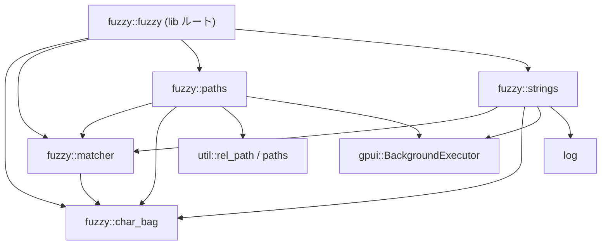
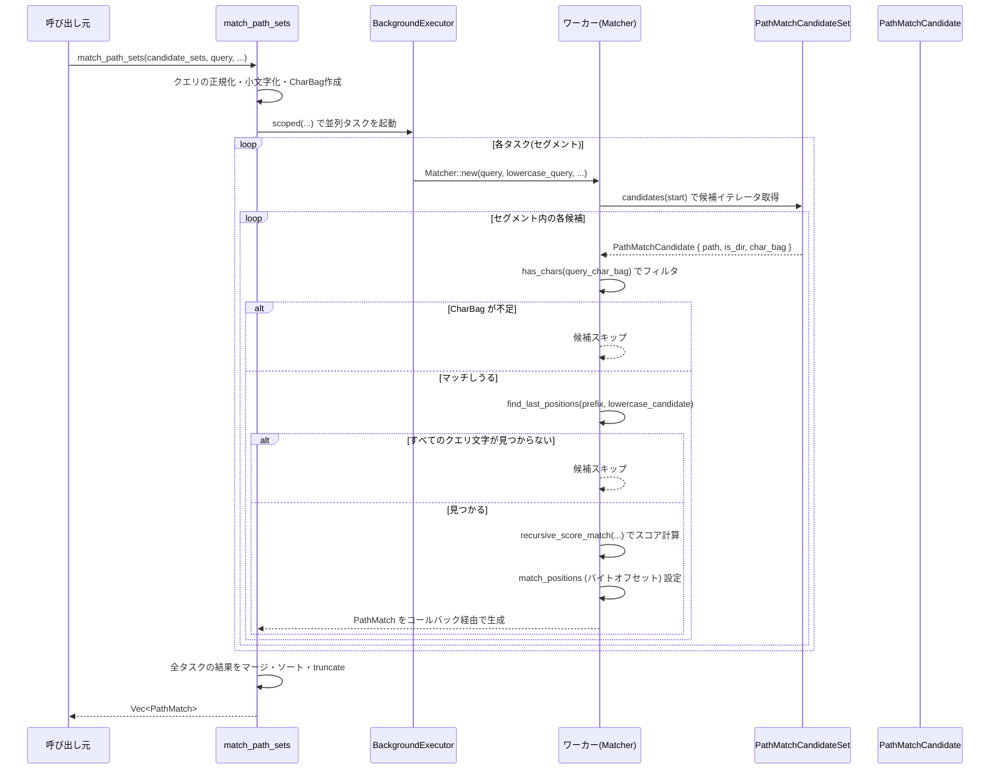

# crates/fuzzy ディレクトリ解説

## 1. ざっくり一言

`fuzzy` クレートは、**文字列およびファイルパス向けのファジーマッチングエンジン**です。  
簡易な文字集合フィルタ (`CharBag`) とスコアリング用の `Matcher` を中心に、パス検索用 (`paths`) と汎用文字列検索用 (`strings`) の API を提供します。

---

## 2. このモジュールの役割

### 2.1 概要

- このクレートは **ファイルパスや任意の文字列に対するファジーマッチ検索** を行うために存在し、以下の機能を提供します。
  - クエリに含まれる文字を使った高速な事前フィルタ (`CharBag`)
  - 部分一致・キャメルケース・パス区切りなどを考慮したスコアリング (`Matcher`)
  - 検索結果のバイトオフセット（ハイライト位置）算出
  - 複数 CPU を使った並列検索（`gpui::BackgroundExecutor` 経由）

### 2.2 アーキテクチャ内での位置づけ

このディレクトリ内のモジュールの依存関係は概ね次のようになっています。



- `matcher` は **スコアリングコア** であり、`paths` と `strings` から共通利用されます。
- `char_bag` は **文字集合フィルタ** として `matcher` の前段で使われます。
- `paths` と `strings` は、用途別の **高レベル API**（パス検索／文字列検索）を提供します。
- `fuzzy.rs` はこれらを再エクスポートし、クレートの公開 API をまとめる役割です。

### 2.3 設計上のポイント

コードから読み取れる設計上の特徴をまとめます。

- **責務分離**
  - スコアリングアルゴリズム（`Matcher`）と、候補データの形（パス／文字列）は `MatchCandidate` トレイトで分離されています。
  - パス固有の情報（`RelPath`, `PathStyle` など）は `paths` モジュールに閉じ込められています。
- **状態管理**
  - `Matcher` は再利用前提の構造体であり、クエリと内部バッファ（`score_matrix`, `best_position_matrix` など）を保持して、複数候補を連続して評価します。
- **エラーハンドリング／安全性**
  - インデックス計算は `safe_limit` や `saturating_sub` で保護されており、テストでも「インデックス範囲外が発生しない」ことが確認されています。
  - UTF-8 文字境界を意識したバイトオフセット計算が行われており、テストでもマルチバイト文字に対する境界チェックが行われています。
- **パフォーマンス**
  - `CharBag` によるビットセットフィルタで「そもそもクエリに必要な文字を含まない候補」を早期除外します。
  - `Matcher` は再帰＋メモ化（`score_matrix`）でスコアを計算し、不要な探索をカットする仕組み（`min_score`）も備えています。
  - `match_path_sets` / `match_strings` は CPU 数に応じて候補を分割し、`BackgroundExecutor` で並列処理します。
- **Unicode とケース変換**
  - `simple_lowercase` は `char::to_lowercase` の結果の先頭 1 文字だけを使う「簡易小文字化」であり、**文字数が増えるケース（例: トルコ語の İ）を避ける**ようになっています。
  - マッチングは小文字化したクエリ／候補を使いつつ、スコアリング時には元の大文字小文字も考慮します（`smart_case` フラグ）。

---

## 3. 主要な機能一覧

このクレートが提供する主な機能を列挙します。

- `CharBag`:  
  クエリや候補文字列の「含まれる英小文字・数字・ハイフン」の情報を `u64` ビットセットで表現し、  
  「必要な文字をすべて含んでいるか」を高速に判定します。

- `simple_lowercase(c: char) -> char`:  
  1 文字だけの簡易小文字化。`Matcher` や `CharBag` 用の前処理に利用されます。

- `Matcher<'a>` と `MatchCandidate` トレイト:  
  - `Matcher` はクエリに対して候補をスコアリングする汎用エンジンです。
  - `MatchCandidate` を実装すると、任意の型をファジーマッチの候補として扱えます。

- パス検索 API（`paths` モジュール）
  - `PathMatchCandidate<'a>`: パス 1 件分の情報（`RelPath`, `CharBag`, `is_dir`）を保持する候補。
  - `PathMatch`: 検索結果（スコア・マッチ位置・パス・ワークツリー ID など）。
  - `PathMatchCandidateSet<'a>` トレイト: 複数パスをまとめて提供するインターフェース。
  - `match_fixed_path_set`: 単一の候補ベクタに対して同期的にマッチング。
  - `match_path_sets`: 複数の候補セットを並列に検索する非同期 API。

- 文字列検索 API（`strings` モジュール）
  - `StringMatchCandidate`: ID 付きの文字列候補。
  - `StringMatch`: 検索結果（候補 ID, スコア, ハイライト位置など）。
  - `StringMatch::ranges`: `positions` から連続したマッチ範囲 (`Range<usize>`) を計算。
  - `match_strings`: 任意の `StringMatchCandidate` のスライスに対する非同期ファジーマッチ。

---

## 4. 関数・構造体の解説

### 4.1 主な型一覧

| 名前 | 種別 | 定義モジュール | 役割 / 用途 |
|------|------|----------------|-------------|
| `CharBag` | 構造体 | `char_bag` | 英小文字・数字・`-` の出現情報を `u64` ビットセットで表現し、「必要な文字を含むか」のフィルタに使います。 |
| `Matcher<'a>` | 構造体 | `matcher` | クエリ文字列（`[char]`）に対して候補をスコアリングし、マッチ位置を求めるコアエンジンです。 |
| `MatchCandidate` | トレイト | `matcher` | `Matcher` が扱う「候補」のインターフェース。文字集合チェックと文字イテレータを提供します。 |
| `PathMatchCandidate<'a>` | 構造体 | `paths` | 1 つのパス候補。`RelPath` への参照と `CharBag`、`is_dir` を持ちます。 |
| `PathMatch` | 構造体 | `paths` | パス検索の結果。スコア・マッチ位置・ワークツリー ID・パスなどを含みます。 |
| `PathMatchCandidateSet<'a>` | トレイト | `paths` | パス候補の集合を提供するインターフェース。ワークツリー ID やプレフィックス、`PathStyle` を返します。 |
| `StringMatchCandidate` | 構造体 | `strings` | 文字列検索用の候補。`id` と `String` 本体、`CharBag` を保持します。 |
| `StringMatch` | 構造体 | `strings` | 文字列検索の結果。候補 ID・スコア・マッチ位置・文字列・マッチ範囲計算メソッドを持ちます。 |

### 4.2 代表的な関数・メソッド（詳細）

#### `CharBag::is_superset(self, other: CharBag) -> bool`

**概要**

- `self` が `other` に含まれる文字をすべて（おおよそ）含んでいるかを、ビット演算で判定します。
- ファジーマッチ前の **粗いフィルタ** として使用されます。

**引数 / 戻り値**

- 引数
  - `self`: 評価対象の文字集合。
  - `other`: クエリ側の文字集合など、「必要な文字の集合」。
- 戻り値
  - `true`: `self` が `other` に含まれるビットをすべて持っている。
  - `false`: 少なくとも 1 文字分のビットが足りない。

**内部処理**

- 内部フィールドは `u64` です。
- `self.0 & other.0 == other.0` で判定します。

**Edge cases**

- 非 ASCII 小文字・非 ASCII 数字・`'-'` 以外の文字は `CharBag` に反映されません。
  - そのため、そうした文字だけからなるクエリでは、フィルタとしては常に通過します（`other` が 0 になるため）。
  - 実際のマッチングは `Matcher` が行うので、正しさには影響しませんが、フィルタの絞り込み効果は弱くなります。

**使用上の注意点**

- `CharBag` は **精密な文字数** ではなく、「その文字を（最大で一定回数まで）含んでいるか」をビットで表現しています。
- 重複文字を多用するクエリに対し、フィルタは少し粗くなる可能性がありますが、その後の `Matcher` が正しく判定します。

---

#### `Matcher::new(query, lowercase_query, query_char_bag, smart_case, penalize_length) -> Matcher`

**概要**

- クエリに対して候補をスコアリングする `Matcher` を初期化します。
- クエリ文字とその小文字版、`CharBag` は呼び出し側で事前に用意します。

**引数**

| 引数名 | 型 | 説明 |
|--------|----|------|
| `query` | `&'a [char]` | 元のクエリ文字列（大文字小文字を保持）。 |
| `lowercase_query` | `&'a [char]` | `query` を `simple_lowercase` で小文字化したもの。 |
| `query_char_bag` | `CharBag` | クエリに含まれる文字集合。 |
| `smart_case` | `bool` | 大文字小文字の一致をスコアに反映するかどうか。 |
| `penalize_length` | `bool` | パスの長さやマッチ位置をスコアに反映してペナルティを与えるかどうか。 |

**戻り値**

- 初期化された `Matcher` インスタンス。内部の `score_matrix` などは空ベクタとして準備されます。

**内部処理の流れ**

1. フィールドをそのまま格納。
2. `last_positions` を `lowercase_query.len()`、`match_positions` を `query.len()` の長さで 0 初期化。
3. スコアマトリクス（`score_matrix`, `best_position_matrix`）は空のまま作成。

**使用上の注意点**

- `query` と `lowercase_query` の長さは一致している前提で使われています。異なる長さを渡すと内部のインデックス計算が前提と異なります。
- `query_char_bag` は通常、`lowercase_query` から `CharBag::from_iter` で作成します。

---

#### `Matcher::match_candidates`

```rust
pub(crate) fn match_candidates<C, R, F, T>(
    &mut self,
    prefix: &[char],
    lowercase_prefix: &[char],
    candidates: impl Iterator<Item = T>,
    results: &mut Vec<R>,
    cancel_flag: &AtomicBool,
    build_match: F,
) where
    C: MatchCandidate,
    T: Borrow<C>,
    F: Fn(&C, f64, &Vec<usize>) -> R,
```

**概要**

- クエリに対して複数の候補を評価し、マッチした候補についてコールバック `build_match` で結果を構築し `results` に追加します。
- 結果の順序は入力候補の順序を保ちます（ここではソートしません）。

**主な引数**

| 引数名 | 型 | 説明 |
|--------|----|------|
| `prefix` | `&[char]` | 各候補の前に論理的についているプレフィックス（例: ワークツリールートパス）。 |
| `lowercase_prefix` | `&[char]` | `prefix` を `simple_lowercase` したもの。 |
| `candidates` | `Iterator<Item = T>` | 評価対象の候補列。`T: Borrow<C>`。 |
| `results` | `&mut Vec<R>` | 生成されたマッチ結果が追加されます。 |
| `cancel_flag` | `&AtomicBool` | `true` になると処理を途中で打ち切ります。 |
| `build_match` | クロージャ | `(&C, score, &match_positions)` から任意の結果型 `R` を作る関数。 |

**戻り値**

- なし（`results` に副作用で蓄積）。

**内部処理の流れ（簡略）**

1. 一時ベクタ `candidate_chars`, `lowercase_candidate_chars` を再利用しながら候補ごとにループ。
2. 各候補について:
   1. `has_chars(query_char_bag)` で `CharBag` による事前フィルタ。
   2. `cancel_flag` が立っていればループを中断。
   3. `candidate_chars` に候補の文字列、`lowercase_candidate_chars` に `simple_lowercase` 済み文字列を収集。
   4. `find_last_positions` で、クエリ各文字が出現しうる最後の位置を計算。なければスキップ。
   5. クエリ長とパス長に応じて `score_matrix` と `best_position_matrix` をリサイズ。
   6. `score_match` を呼んでスコアと `match_positions`（バイトオフセット列）を取得。
   7. スコアが正（`> 0.0`）であれば `build_match` で結果型 `R` を生成して `results` に push。

**Edge cases**

- `cancel_flag` は候補単位でチェックされます。非常に大きな候補 1 個を処理中の場合、即時には停止しません。
- `score_match` が 0 以下を返す場合、その候補は「マッチしない」と見なされます。
- `prefix` と候補文字列の長さが大きいと、`score_matrix` のサイズは `query.len * (prefix.len + candidate.len())` になります。

**使用上の注意点**

- この関数自体はソートや結果数の制限を行いません。呼び出し側（`paths` / `strings`）でソート・truncate しています。
- `build_match` では `positions`（バイトオフセット）をそのまま `clone` して結果に埋め込むのが一般的なパターンです。

---

#### `match_fixed_path_set`

```rust
pub fn match_fixed_path_set(
    candidates: Vec<PathMatchCandidate>,
    worktree_id: usize,
    worktree_root_name: Option<Arc<RelPath>>,
    query: &str,
    smart_case: bool,
    max_results: usize,
    path_style: PathStyle,
) -> Vec<PathMatch>
```

**概要**

- 単一のパス候補ベクタに対して同期的にファジーマッチを行い、スコア順に上位 `max_results` 件の `PathMatch` を返します。
- ワークツリールート名を `prefix` として扱うことができ、表示用の `path_prefix` にも反映されます。

**主な引数**

| 引数名 | 型 | 説明 |
|--------|----|------|
| `candidates` | `Vec<PathMatchCandidate>` | 検索対象のパス候補。 |
| `worktree_id` | `usize` | 結果のソート時などに使われるワークツリー ID。 |
| `worktree_root_name` | `Option<Arc<RelPath>>` | プレフィックスとして扱うルートパス。`None` の場合は空。 |
| `query` | `&str` | 検索クエリ。 |
| `smart_case` | `bool` | ケースに基づくスコア調整を行うかどうか。 |
| `max_results` | `usize` | 返す最大件数。 |
| `path_style` | `PathStyle` | Windows/Unix など、パス表示スタイル。 |

**戻り値**

- スコア順にソートされ、最大 `max_results` 件までに絞り込んだ `Vec<PathMatch>`。

**内部処理の流れ**

1. `query` から `lowercase_query` と `query_char_bag` を生成。
2. `Matcher::new` を初期化。
3. `worktree_root_name` がある場合は:
   - `display(path_style)` で表示用文字列に変換し、末尾に区切り文字（`primary_separator`）を付加。
   - これを `prefix` / `lowercase_prefix` として `Matcher::match_candidates` に渡す。
4. `match_candidates` で候補を評価し、`build_match` クロージャで `PathMatch` を構築。
5. `util::truncate_to_bottom_n_sorted_by` で `max_results` 件に絞り込み。

**Edge cases**

- `query` が空文字列の場合、`Matcher` 側のロジック上、スコアは 0 になり、`score > 0.0` 条件を満たさないため、結果は空になります。
- `worktree_root_name` が `None` の場合、`path_prefix` は空の `RelPath` になります。

**使用上の注意点**

- `PathMatchCandidate::char_bag` は `CharBag::from(&str)` などから生成しておく必要があります。
- `max_results` が 0 の場合でも、内部では一旦ベクタを構築してから truncate されます（`truncate_to_bottom_n_sorted_by` の挙動依存）。

---

#### `match_path_sets`

```rust
pub async fn match_path_sets<'a, Set: PathMatchCandidateSet<'a>>(
    candidate_sets: &'a [Set],
    query: &str,
    relative_to: &Option<Arc<RelPath>>,
    smart_case: bool,
    max_results: usize,
    cancel_flag: &AtomicBool,
    executor: BackgroundExecutor,
) -> Vec<PathMatch>
```

**概要**

- 複数の `PathMatchCandidateSet` にまたがるパス候補を、CPU 数に応じて並列にファジーマッチする非同期関数です。
- 相対パス `relative_to` からの距離を加味してソート順を調整します。

**主な引数**

| 引数名 | 型 | 説明 |
|--------|----|------|
| `candidate_sets` | `&[Set]` | パス候補集合群。各集合は `PathMatchCandidateSet` を実装。 |
| `query` | `&str` | 検索クエリ。Windows の場合 `\` は `/` に正規化されます。 |
| `relative_to` | `&Option<Arc<RelPath>>` | ソート時に「近さ」を評価する基準パス。なければ最大距離扱い。 |
| `smart_case` | `bool` | 大文字小文字をスコアに反映するかどうか。 |
| `max_results` | `usize` | 上位何件まで返すか。 |
| `cancel_flag` | `&AtomicBool` | true にセットされると処理を中断して空ベクタを返します。 |
| `executor` | `BackgroundExecutor` | 並列処理を実行する実行基盤。 |

**戻り値**

- ソート済みの `Vec<PathMatch>`。`cancel_flag` が立っていれば空ベクタ。

**内部処理の流れ（要約）**

1. `path_count = Σ candidate_set.len()` を計算し、0 なら即空ベクタを返す。
2. `path_style` を先頭の `candidate_set` から取得し、クエリ中の `\` を `/` に正規化（Windows の場合）。
3. 正規化したクエリから `lowercase_query` と `query_char_bag` を生成。
4. `num_cpus = executor.num_cpus().min(path_count)` とし、`segment_size = path_count.div_ceil(num_cpus)` で候補を分割。
5. `executor.scoped` で `num_cpus` 個のタスクを起動し、それぞれ:
   - 対応する候補インデックス範囲 `[segment_start, segment_end)` を計算。
   - その範囲に重なる `candidate_set` ごとに `candidates(start)` から必要数だけ取得。
   - `prefix`（`candidate_set.prefix()` と、必要に応じて末尾 `/`）とその小文字化から `Matcher::match_candidates` を呼ぶ。
   - `distance_between_paths` で `relative_to` からの距離を計算し、`PathMatch.distance_to_relative_ancestor` に格納。
6. `cancel_flag` が立っていれば空ベクタを返す。
7. 各タスクの結果を結合し、`truncate_to_bottom_n_sorted_by` で `max_results` 件に絞り込み。

**Examples（使用例・概要のみ）**

`PathMatchCandidateSet` はアプリ側で実装する必要があります。以下はイメージです（細部は環境依存のため擬似コードです）。

```rust
use fuzzy::{PathMatch, PathMatchCandidate, PathMatchCandidateSet, match_path_sets};
use gpui::BackgroundExecutor;
use std::sync::{
    Arc,
    atomic::{AtomicBool, Ordering},
};
use util::rel_path::{RelPath, rel_path};
use util::paths::PathStyle;

// 簡易実装例: 固定の Vec<RelPath> を候補として持つセット
struct SimpleSet {
    id: usize,
    paths: Vec<Arc<RelPath>>,
    style: PathStyle,
}

impl<'a> PathMatchCandidateSet<'a> for SimpleSet {
    type Candidates = std::vec::IntoIter<PathMatchCandidate<'a>>;

    fn id(&self) -> usize { self.id }

    fn len(&self) -> usize { self.paths.len() }

    fn root_is_file(&self) -> bool { false }

    fn prefix(&self) -> Arc<RelPath> { RelPath::empty().into() }

    fn candidates(&'a self, start: usize) -> Self::Candidates {
        let slice = &self.paths[start..];
        let v: Vec<_> = slice
            .iter()
            .map(|p| PathMatchCandidate {
                is_dir: false,
                char_bag: p.as_unix_str().into(), // &str -> CharBag
                path: p,
            })
            .collect();
        v.into_iter()
    }

    fn path_style(&self) -> PathStyle { self.style }
}

// 実際の呼び出し（executor の取得方法は環境依存で、このコードからは分かりません）
async fn search_paths(
    sets: &[SimpleSet],
    executor: BackgroundExecutor,
) {
    let cancel_flag = AtomicBool::new(false);
    let results: Vec<PathMatch> = match_path_sets(
        sets,
        "src/main",
        &None,
        false,
        20,
        &cancel_flag,
        executor,
    ).await;

    for m in results {
        println!("score: {} path: {}", m.score, m.path);
    }
}
```

※ `BackgroundExecutor` や `RelPath` の具体的な生成方法は、このチャンクには現れないため詳細は不明です。

**使用上の注意点**

- `candidate_sets` のすべての要素は `Send + Sync` である必要があります（トレイト境界により）。
- `cancel_flag` を `true` にすると、処理途中でも最終的に空ベクタが返されます。
- `relative_to` を指定すると、`PathMatch` の `Ord` 実装で距離がソート順に反映されます。

---

#### `StringMatch::ranges(&self) -> impl Iterator<Item = Range<usize>>`

**概要**

- `StringMatch.positions` に保持されている **先頭文字のバイトオフセット列** から、連続するマッチ部分を `Range<usize>` の列として返します。
- 例えば `positions = [0, 1, 2, 5]` のような場合、`0..3` と `5..6` の 2 つの範囲を返します。

**内部処理の流れ**

1. `self.positions.iter().peekable()` で位置列を先読み可能なイテレータにする。
2. 1 つ位置 `start` を取り出す。
3. `char_len_at_index(start)` で、その位置の UTF-8 文字のバイト長を取得。
   - 取得できなければ `log::error!` を出力して `None` を返し、以降のイテレータも停止します。
4. `end = start + char_len` として開始し、次の位置が `end` と連続している限り同様に `char_len_at_index` を呼び出して `end` を伸ばしていく。
5. `start..end` を返す。
6. 繰り返し。

**Edge cases**

- `positions` がソートされていない場合や、重複がある場合の挙動は仕様としては定義されていませんが、コード上はそのまま順番をなぞります。
- 位置が UTF-8 の途中バイトを指している場合、`char_len_at_index` が `None` となり、エラーログを出してイテレータを打ち切ります。

**使用上の注意点**

- `StringMatch.positions` は、`match_strings` が生成したものをそのまま使うことを前提としています。手動で編集する場合は、必ず UTF-8 文字境界に揃えてください。
- `ranges` は `StringMatch.string` のバイトオフセットを返すので、`&self.string[range]` のようにして部分文字列を切り出すことができます。

---

#### `match_strings`

```rust
pub async fn match_strings<T>(
    candidates: &[T],
    query: &str,
    smart_case: bool,
    penalize_length: bool,
    max_results: usize,
    cancel_flag: &AtomicBool,
    executor: BackgroundExecutor,
) -> Vec<StringMatch>
where
    T: Borrow<StringMatchCandidate> + Sync,
```

**概要**

- `StringMatchCandidate` の列に対して、非同期でファジーマッチを行い、スコア順に上位 `max_results` 件を返します。

**主な引数**

| 引数名 | 型 | 説明 |
|--------|----|------|
| `candidates` | `&[T]` | 検索対象の候補。`T: Borrow<StringMatchCandidate>`。 |
| `query` | `&str` | 検索クエリ。空の場合は全候補をスコア 0 で返します。 |
| `smart_case` | `bool` | ケースをスコアに反映するかどうか。 |
| `penalize_length` | `bool` | 長さに基づくペナルティを適用するかどうか。 |
| `max_results` | `usize` | 返す最大件数。 |
| `cancel_flag` | `&AtomicBool` | true でキャンセル。 |
| `executor` | `BackgroundExecutor` | 並列処理用の実行基盤。 |

**戻り値**

- ソート済みの `Vec<StringMatch>`。

**内部処理の流れ（要約）**

1. `candidates.is_empty()` または `max_results == 0` の場合は空ベクタを返す。
2. `query.is_empty()` の場合は、すべての候補を `score = 0.` かつ空の `positions` でそのまま返す（ソートも truncate もしません）。
3. 非空クエリの場合:
   - `lowercase_query` と `query`（`Vec<char>`）を作る。
   - `query_char_bag` を `CharBag::from(&lowercase_query[..])` で作成。
4. `num_cpus` と `segment_size` を計算し、`executor.scoped` で候補配列を複数セグメントに分割して処理。
5. 各タスク内で `Matcher::new` を作り、`match_candidates` を呼び出して `StringMatch` を構築。
6. `cancel_flag` が立っていれば空ベクタを返す。
7. 結果を結合し、`truncate_to_bottom_n_sorted_by` で `max_results` 件に絞る。

**簡単な使用例**

```rust
use fuzzy::{StringMatchCandidate, match_strings};
use gpui::BackgroundExecutor;
use std::sync::atomic::AtomicBool;

async fn search_strings(executor: BackgroundExecutor) {
    // 候補の準備
    let candidates = vec![
        StringMatchCandidate::new(0, "src/main.rs"),
        StringMatchCandidate::new(1, "src/lib.rs"),
        StringMatchCandidate::new(2, "README.md"),
    ];

    let cancel_flag = AtomicBool::new(false);

    let results = match_strings(
        &candidates,
        "smr",             // クエリ
        false,             // smart_case
        true,              // penalize_length
        10,                // max_results
        &cancel_flag,
        executor,          // 具体的な取得方法はこのチャンクからは不明
    ).await;

    for m in results {
        println!("id={} score={} string={}", m.candidate_id, m.score, m.string);
        for range in m.ranges() {
            println!("  highlight bytes: {}..{}", range.start, range.end);
        }
    }
}
```

**使用上の注意点**

- `query.is_empty()` のときは全候補がそのまま返るため、`max_results` は無視されます。
- `cancel_flag` は処理の途中で true にすると、最終的に空ベクタが返されます。
- `executor` の取得方法は、`gpui` を利用するアプリケーション側のコードに依存します（このクレート内からは分かりません）。

---

### 4.3 その他の関数・補助ロジック

| 関数 / メソッド名 | 定義 | 役割（1 行） |
|-------------------|------|--------------|
| `simple_lowercase(c: char)` | `char_bag.rs` | `char.to_lowercase()` の先頭 1 文字だけを取り出す簡易小文字化。 |
| `CharBag::insert(&mut self, c: char)` | `char_bag.rs` | 1 文字を `CharBag` 内部のビットセットに反映します（英小文字・数字・`-` を対象）。 |
| `Matcher::find_last_positions` | `matcher.rs` | クエリ各文字がパス中に出現しうる最後のインデックスを計算し、探索範囲を制限します。 |
| `Matcher::score_match` | `matcher.rs` | 再帰スコア計算を起動し、`match_positions` にバイトオフセットを設定します。 |
| `Matcher::recursive_score_match` | `matcher.rs` | メモ化付き再帰でクエリとパスの最適スコアを計算します。 |
| `distance_between_paths` | `paths.rs` | 2 つの `RelPath` の共通プレフィックスを除いた残りコンポーネント数をもとに距離を計算します。 |
| `StringMatch::char_len_at_index` | `strings.rs` | 指定バイトオフセットが文字境界であれば、その文字の UTF-8 バイト長を返します。 |

---

## 5. データフロー

ここでは、代表的な処理として **`match_path_sets` を用いたパス検索** のデータフローを説明します。

### 5.1 処理の要点（文章）

1. 呼び出し元が `PathMatchCandidateSet` の配列とクエリ文字列を `match_path_sets` に渡します。
2. `match_path_sets` はクエリを正規化・小文字化し、`CharBag` を作成します。
3. 全候補数を数え、CPU 数に応じてセグメントに分割し、`BackgroundExecutor` で並列タスクを起動します。
4. 各タスクは担当セグメント内のパス候補について `Matcher::match_candidates` を呼び、マッチのたびに `PathMatch` を生成します。
5. 並列タスクの結果をマージし、スコア順にソートして `max_results` までを返します。

### 5.2 シーケンス図



---

## 6. 使い方（How to Use）

### 6.1 基本的な使用方法

#### 6.1.1 文字列検索 (`match_strings`)

```rust
use fuzzy::{StringMatchCandidate, match_strings};
use gpui::BackgroundExecutor;
use std::sync::atomic::AtomicBool;

// executor の具体的な生成方法はこのコードチャンクからは分かりません。
// ここではすでに BackgroundExecutor を持っている前提です。
async fn search_strings(executor: BackgroundExecutor) {
    // 1. 候補の準備
    let candidates = vec![
        StringMatchCandidate::new(0, "open_file"),
        StringMatchCandidate::new(1, "save_all"),
        StringMatchCandidate::new(2, "close_window"),
    ];

    // 2. キャンセルフラグ
    let cancel_flag = AtomicBool::new(false);

    // 3. ファジーマッチの実行
    let results = match_strings(
        &candidates,
        "of",      // クエリ
        false,     // smart_case
        true,      // penalize_length
        10,        // max_results
        &cancel_flag,
        executor,
    ).await;

    // 4. 結果の利用
    for m in results {
        println!("id={} score={} string={}", m.candidate_id, m.score, m.string);
        for range in m.ranges() {
            println!("  match bytes: {}..{}", range.start, range.end);
        }
    }
}
```

#### 6.1.2 パス検索（固定セット）`match_fixed_path_set`

```rust
use fuzzy::{PathMatchCandidate, match_fixed_path_set};
use util::rel_path::{RelPath, rel_path};
use util::paths::PathStyle;
use std::sync::Arc;

fn search_fixed_paths() {
    // 1. RelPath を用意（実際にはアプリ側で持っていることが多い想定です）
    let raw_paths = vec!["src/main.rs", "src/lib.rs", "README.md"];
    let path_arcs: Vec<Arc<RelPath>> = raw_paths
        .iter()
        .map(|p| Arc::from(rel_path(p)))
        .collect();

    // 2. PathMatchCandidate を構築
    let candidates: Vec<PathMatchCandidate> = path_arcs
        .iter()
        .map(|p| PathMatchCandidate {
            is_dir: false,
            char_bag: p.as_unix_str().into(), // &str -> CharBag
            path: p,
        })
        .collect();

    // 3. 検索の実行
    let results = match_fixed_path_set(
        candidates,
        0,                  // worktree_id
        None,               // worktree_root_name
        "smr",              // クエリ
        false,              // smart_case
        10,                 // max_results
        PathStyle::Unix,    // パススタイル
    );

    // 4. 結果の利用
    for m in results {
        println!("score={} path={}", m.score, m.path);
        println!("positions(bytes)={:?}", m.positions);
    }
}
```

### 6.2 よくある使用パターン

1. **コマンドパレットや補完候補への適用**
   - 候補ごとに `StringMatchCandidate` を作成し、ユーザ入力に応じて `match_strings` を再実行する。
   - `StringMatch::ranges` を使って UI 上でハイライトするバイト範囲を求める。

2. **ファイル検索ダイアログ**
   - プロジェクト内のパスを `PathMatchCandidateSet` としてアプリ側で構築。
   - `match_path_sets` を使い、相対パス `relative_to`（現在開いているファイルなど）を指定して近いファイルを優先表示する。

3. **キャンセル可能なインクリメンタルサーチ**
   - ユーザがタイプするたびに新しい `query` で検索を開始し、以前の検索の `cancel_flag` を `true` にして中断する。

### 6.3 よくある間違い

```rust
// 間違い例: CharBag を小文字化せずに作っている（フィルタ精度が落ちる）
let candidate = StringMatchCandidate {
    id: 1,
    string: "MainFile.rs".into(),
    char_bag: "MainFile.rs".into(), // 大文字のまま
};

// 正しい例: simple_lowercase を通した文字列から作る (From<&str> 内部で使用)
let candidate = StringMatchCandidate::new(1, "MainFile.rs");
```

```rust
// 間違い例: PathMatchCandidate の path に一時値を渡す（ライフタイムが足りない）
let candidate = PathMatchCandidate {
    is_dir: false,
    char_bag: "src/main.rs".into(),
    path: &rel_path("src/main.rs"),   // 一時値への参照
};

// 正しい例: RelPath をどこかに保持し、それへの参照を渡す
let rp = rel_path("src/main.rs");
let candidate = PathMatchCandidate {
    is_dir: false,
    char_bag: rp.as_unix_str().into(),
    path: &rp,
};
```

### 6.4 使用上の注意点（まとめ）

- **UTF-8 文字境界**
  - `match_positions` や `StringMatch::ranges` は UTF-8 のバイトオフセットを扱います。
  - 独自に `positions` を変更する場合は、必ず文字境界に揃える必要があります。

- **クエリが空の場合**
  - `match_strings` は全候補をスコア 0 で返します（`max_results` による制限はかかりません）。
  - パス検索 (`match_fixed_path_set` / `match_path_sets`) は空クエリだと結果が返らない実装になっています。

- **CharBag の対象文字**
  - `CharBag` は ASCII 英小文字・数字・ハイフンのみを対象にしています。
  - 非 ASCII 文字だけからなるクエリでは、CharBag フィルタの効果が弱くなりますが、最終的なマッチは `Matcher` が正しく行います。

- **キャンセル処理**
  - `cancel_flag` は候補ごとにチェックされるため、大きな候補 1 つの処理中には即時停止できない場合があります。
  - それでも、長時間にわたる検索をユーザ操作で中断できる仕組みとして機能します。

- **並列処理**
  - `match_path_sets` / `match_strings` は `BackgroundExecutor` の `num_cpus()` を利用してセグメント数を決めます。
  - `candidate_sets` や `candidates` の要素型は `Sync` である必要があります。

---

## 7. 関連ファイル

| パス | 役割 / 関係 |
|------|------------|
| `fuzzy/src/fuzzy.rs` | クレートのルートモジュール。`CharBag`, パス検索 API, 文字列検索 API を公開します。 |
| `fuzzy/src/char_bag.rs` | 文字集合を `u64` ビットセットで表現する `CharBag` と、簡易小文字化 `simple_lowercase` を定義します。 |
| `fuzzy/src/matcher.rs` | ファジーマッチングのコアエンジン `Matcher` と、候補インターフェース `MatchCandidate` を定義します。 |
| `fuzzy/src/paths.rs` | パス検索用の型 (`PathMatchCandidate`, `PathMatch`, `PathMatchCandidateSet`) と API (`match_fixed_path_set`, `match_path_sets`) を提供します。 |
| `fuzzy/src/strings.rs` | 文字列検索用の型 (`StringMatchCandidate`, `StringMatch`) と API (`match_strings`) を提供します。 |
| `util::rel_path`（外部クレート） | `RelPath`, `rel_path` 等を提供し、パス表現として `paths`・`matcher` のテストで利用されています。 |
| `util::paths::PathStyle`（外部クレート） | パスの表示スタイル（Unix/Windows など）を表し、クエリの正規化や表示に使用されます。 |
| `gpui::BackgroundExecutor`（外部クレート） | 非同期・並列検索に用いられる実行基盤です。 |
| `log`（外部クレート） | `StringMatch::ranges` などで異常なインデックスが検出された際のログ出力に使用されます。 |

このディレクトリ全体としては、「`Matcher` を中心としたファジーマッチングロジックを、パスと任意文字列に対して再利用可能な形で提供する」構成になっています。
