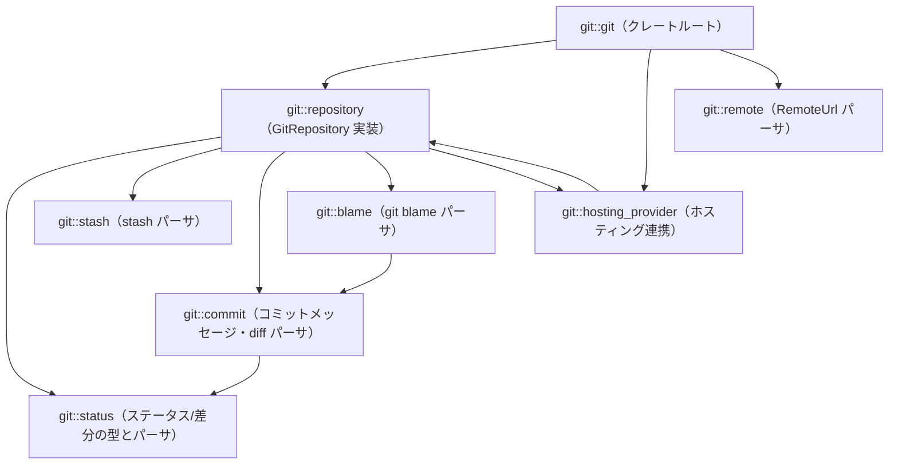
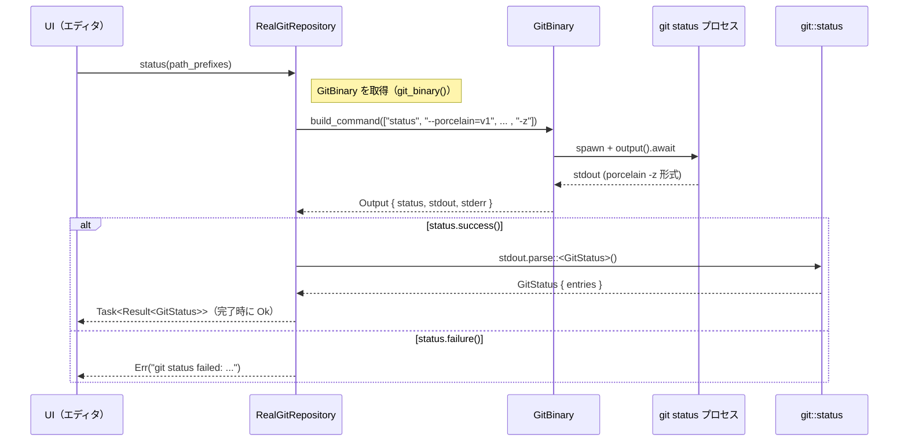

# git/ ディレクトリ解説

## 1. ざっくり一言

Zed 内で Git リポジトリを操作するためのクレートです。  
`git` コマンドと `libgit2` を組み合わせて、ステータス取得・コミット・ブランチ・stash・blame・履歴などを高レベル API として提供します。

---

## 2. このモジュールの役割

### 2.1 概要

このクレートは次のような問題を解決します。

- Git を安全に外部プロセスとして実行しつつ、UI から扱いやすい API を提供する
- `git status`/`git diff`/`git blame`/`git log` などの出力を、構造化された Rust 型にパースする
- GitHub などのホスティングサービスと連携し、パーマリンク・PR 情報・アバター URL を扱う
- スタッシュやチェックポイントなど、エディタ特化のワークフローを実現する

主に次のレイヤを持ちます。

- **ドメイン型レイヤ**: `Oid`, `RepoPath`, `FileStatus`, `GitStatus`, `GitStash` など
- **Git 実行レイヤ**: `GitBinary`（安全な `git` プロセスラッパ）
- **リポジトリ抽象レイヤ**: `GitRepository` トレイトと実装 `RealGitRepository`
- **UI 連携レイヤ**: `gpui::Action` を使ったアクション定義、`GitHostingProvider` を通じた Web 連携

### 2.2 アーキテクチャ内での位置づけ

主要モジュール間の依存関係は概ね次のようになっています。



- `git::git`  
  クレートのエントリポイント。モジュール公開、`Oid` 型、各種 `gpui::Action` の定義を行います。
- `git::repository`  
  実際の Git リポジトリ操作（ステータス、ブランチ、push/pull、checkpoint など）の中核です。
- `git::status` / `git::commit` / `git::blame` / `git::stash`  
  各種 Git コマンドの**出力パーサ**と、それに対応するドメイン型を定義します。
- `git::hosting_provider` / `git::remote`  
  Git ホスティングサービスとの連携（URL パース・パーマリンク・PR 情報・アバター）を扱います。

### 2.3 設計上のポイント

コードから読み取れる特徴を箇条書きでまとめます。

- **非同期・バックグラウンド実行**
  - 多くの操作は `BoxFuture` や `Task` として返され、`gpui::BackgroundExecutor` 上で実行されます。
  - 資格情報プロンプト（credential helper）が関わるコマンド（`commit`/`push`/`pull`/`fetch` など）は、コメントの通り「メインスレッド側」でブロック実行されます。

- **安全な Git 実行**
  - `GitBinary` がすべての `git` コマンド生成を集中管理します。
  - `clippy.toml` で `smol::process::Command::new` や `util::command::Command::new` の直接使用を禁止し、必ず `GitBinary::build_command` 経由にしています。
  - `is_trusted` フラグに応じて、`core.hooksPath=/dev/null` などのセキュリティ関連設定を強制します。

- **CLI と libgit2 の併用**
  - `RealGitRepository` は `git2::Repository` を保持し、インデックスアクセス・Blob 読み出し・ブランチ操作などに利用します。
  - 履歴・diff・ステータスなど「出力のパースで十分なもの」は Git CLI を呼び出して処理します。

- **テキストベースのパーサ**
  - `GitStatus::from_str`, `TreeDiff::from_str`, `GitStash::from_str`, `parse_git_diff_name_status`, `parse_git_blame` など、Git 標準の出力形式（`--porcelain` や `--numstat` 等）に対応した純 Rust パーサが多数定義されています。
  - blame 出力は golden JSON（`test_data/golden/*.json`）を用いたスナップショットテストで検証されています。

- **パスの抽象化**
  - `RepoPath` は `RelPath`（別クレート）に基づいた**リポジトリ相対パス**です。
  - Git の出力が OS に関係なく `/` 区切りである前提を組み込み、内部で `RelPath::unix` を使って統一しています。

- **ホスティングプロバイダのプラグイン的設計**
  - `GitHostingProvider` トレイトと `GitHostingProviderRegistry` により、GitHub など個別実装を差し替え・追加できるようになっています。
  - `parse_git_remote_url` はこの registry を走査して、URL をどのプロバイダが扱えるかを判定します。

---

## 3. 主要な機能一覧

このクレートが提供する主な機能を列挙します。

- **リポジトリ操作 API**
  - `GitRepository` トレイトと実装 `RealGitRepository` による:
    - ファイル内容の取得（HEAD / index）、Blob 読み出し
    - ステータス取得 (`status`, `diff_tree`, `diff`, `diff_stat`)
    - ステージング／アンステージング (`stage_paths`, `unstage_paths`, `set_index_text`)
    - stash 操作 (`stash_entries`, `stash_paths`, `stash_pop`, `stash_apply`, `stash_drop`)
    - ブランチ・リモート・ワークツリー操作（`branches`, `create_branch`, `worktrees`, `create_worktree`, など）
    - push / pull / fetch、`RunHook` を使ったフック呼び出し
    - コミット・ファイル履歴・コミットグラフ・検索 (`show`, `file_history`, `initial_graph_data`, `search_commits`, `commit_data_reader`)

- **Git CLI 出力のパース**
  - `GitStatus::from_str`: `git status --porcelain=v1 -z` のパース
  - `TreeDiff::from_str`: `git diff-tree -z` のパース
  - `parse_git_diff_name_status`: `git diff --name-status -z` のパース
  - `GitDiffStat` / `parse_numstat`: `git diff --numstat` のパース
  - `GitStash::from_str`: `git stash list` のカスタムフォーマットをパース
  - `Blame` / `parse_git_blame`: `git blame --incremental` 出力のパース

- **ホスティングプロバイダ連携**
  - `GitHostingProvider` トレイト:
    - コミット／ファイル行範囲のパーマリンク生成
    - PR 作成 URL の生成
    - コミットメッセージからの PR 情報抽出
    - コミットの著者アバター URL 取得
  - `GitHostingProviderRegistry`:
    - プロバイダの登録・上書き・列挙
  - `parse_git_remote_url`:
    - リモート URL からプロバイダと `ParsedGitRemote`（owner/repo）を特定
  - `ParsedCommitMessage::parse`:
    - クラウドホスティング情報を付加したコミットメッセージ構造体を生成

- **リモート URL の正規化**
  - `RemoteUrl`:
    - `git@github.com:user/repo.git` のような SCP 形式を `ssh://` URL に変換して扱いやすくする

- **チェックポイント機能**
  - `GitRepositoryCheckpoint` と `GitRepository::checkpoint` / `restore_checkpoint` / `compare_checkpoints` / `diff_checkpoints`:
    - 作業ツリーの一時的な「スナップショット」を commit として保存し、後で復元・比較・差分取得する機能
  - `exclude_files` と `GitExcludeOverride` による:
    - 一時的な `.git/info/exclude` の書き換え（大きな／不要なファイルを除外）

- **UI アクション**
  - `actions!` マクロによる `Blame`, `FileHistory`, `StageFile`, `Commit`, `Push` など多数の `gpui::Action` 定義
  - `RenameBranch`, `RestoreFile` のようなアクション用パラメータ型

---

## 4. 関数・構造体の解説

### 4.1 主要な型一覧

代表的な型をモジュール横断でまとめます。

| 名前 | 所属 | 種別 | 役割 / 用途 |
|------|------|------|-------------|
| `Oid` | `git::git` | 構造体 | `git2::Oid` の薄いラッパ。SHA1 を短縮表示・`u32`/`usize` への変換・シリアライズなどを提供します。 |
| `RunHook` | `git::git` | enum | 実行可能な Git フックの列挙（現状 `PreCommit` のみ）。`as_str` でスクリプト名を得ます。 |
| `GitRepository` | `git::repository` | トレイト | Git リポジトリに対する高レベルな操作のインターフェース。UI 側はこのトレイト越しに操作します。 |
| `RealGitRepository` | `git::repository` | 構造体 | 実際の `git2::Repository` と `GitBinary` を用いた `GitRepository` の実装。 |
| `GitBinary` | `git::repository` | 構造体（`pub(crate)`） | `git` コマンドを安全な設定で実行するためのラッパ。`build_command` や一時インデックス操作を提供します。 |
| `RepoPath` | `git::repository` | 構造体 | リポジトリ相対パスの表現。`RelPath` を内包し、`as_std_path` や `as_unix_str` を通じて OS パスに変換します。 |
| `GitStatus` | `git::status` | 構造体 | （`RepoPath`,`FileStatus`）の配列として、`git status --porcelain -z` の結果を表現します。 |
| `FileStatus` / `TrackedStatus` / `UnmergedStatus` | `git::status` | enum / 構造体 | 各ファイルの状態（Untracked, Ignored, Tracked, コンフリクト）と、その内訳（index/worktree）の表現。 |
| `GitSummary` / `TrackedSummary` | `git::status` | 構造体 | 追加・変更・削除・コンフリクト・未追跡の件数を集計するサマリ。`sum_tree::ContextLessSummary` を実装。 |
| `TreeDiff` / `TreeDiffStatus` | `git::status` | 構造体 / enum | `git diff-tree -z` の結果を表現し、ファイルごとの Added/Modified/Deleted（旧 SHA 付き）を保持します。 |
| `GitDiffStat` / `DiffStat` | `git::status` | 構造体 | `git diff --numstat` の結果をパースした 1 ファイルあたりの追加行数・削除行数。 |
| `GitStash` / `StashEntry` | `git::stash` | 構造体 | `git stash list` の結果をパースした一連の stash。`index`, `oid`, `branch`, `timestamp` を持ちます。 |
| `Blame` / `BlameEntry` | `git::blame` | 構造体 | 1 ファイルの blame 結果全体と、各行範囲ごとの commit 情報を表現します。 |
| `CommitDetails` / `CommitDiff` / `CommitFile` | `git::repository` | 構造体 | コミットのメタ情報や、ファイル単位の diff 内容（テキスト・バイナリフラグ）を表現します。 |
| `Branch` / `Upstream` / `UpstreamTracking*` | `git::repository` | 構造体 / enum | ローカル／リモートブランチ、追跡ブランチと ahead/behind の状態を表します。 |
| `Worktree` | `git::repository` | 構造体 | `git worktree list --porcelain` の結果を表現。パス・ブランチ名・HEAD SHA・メインかどうかを含みます。 |
| `Remote` / `FetchOptions` | `git::repository` | 構造体 / enum | リモート名と、`git fetch` の対象指定（全リモート or 特定リモート）。 |
| `GitRepositoryCheckpoint` | `git::repository` | 構造体 | チェックポイントとなる commit の `Oid` を保持します。 |
| `GraphCommitData` / `InitialGraphCommitData` | `git::repository` | 構造体 | コミットグラフ描画用の情報（親コミット・著者・サマリ・ref 名など）。 |
| `GitHostingProvider` | `git::hosting_provider` | トレイト | GitHub などホスティングサービスへの依存を抽象化します。 |
| `GitHostingProviderRegistry` | `git::hosting_provider` | 構造体 | 利用可能な `GitHostingProvider` 実装の登録・列挙を行うレジストリ。 |
| `ParsedGitRemote` | `git::hosting_provider` | 構造体 | リモートの owner/repo を表現します。 |
| `GitRemote` | `git::hosting_provider` | 構造体 | プロバイダ実装と owner/repo 名をまとめた UI 向けのリモートハンドル。 |
| `RemoteUrl` | `git::remote` | 構造体 | `url::Url` のラッパ。SCP 形式 (`git@github.com:user/repo`) を正規化します。 |
| `ParsedCommitMessage` | `git::commit` | 構造体 | コミットメッセージ本文に加え、パーマリンクや PR 情報・リモート情報を付加します。 |

このほかにも補助的な構造体・列挙体がありますが、上記が主要な公開 API です。

---

### 4.2 代表的な関数 / メソッド詳細（7 件）

ここでは、挙動理解に重要な関数・メソッドを 7 つ選んで詳しく説明します。

#### 4.2.1 `GitBinary::build_command<S>(&self, args: &[S]) -> util::command::Command`

**概要**

`git` サブコマンドを実行するための共通の `Command` を構築します。  
信頼できないリポジトリに対しても安全にコマンドを実行できるよう、いくつかの設定を強制します。

**主な処理内容**

1. `new_command(&self.git_binary_path)` でプロセスを作成し、`current_dir` を `working_directory` に設定。
2. `-c core.fsmonitor=false`、`--no-optional-locks`、`--no-pager` を常に付与。
3. `self.is_trusted == false` の場合、さらに:
   - `core.hooksPath=/dev/null`
   - `core.sshCommand=ssh`
   - `credential.helper=`
   - `protocol.ext.allow=never`
   - `diff.external=`
   を `-c` オプションとして付与。
4. 引数 `args` を `command.args(args)` で追加。
5. `args` に `"diff"` が含まれていて、かつ `!is_trusted` の場合は `--no-ext-diff` を追加。
6. 一時インデックスが設定されていれば `GIT_INDEX_FILE` 環境変数を設定。
7. `self.envs` に登録されている環境変数群も `envs` として設定。

**戻り値**

- `util::command::Command`: 呼び出し側が `spawn()` や `output().await` で実行するコマンドオブジェクト。

**Errors / Panics**

- この関数自体は `Result` を返さず、パニックもしません。  
  実際のエラーは、返された `Command` の実行時に扱われます。

**Edge cases**

- `is_trusted == false` のときは Git のフックや外部 diff が実行されないため、ユーザー環境に依存した処理は一切行われません。
- `index_file_path` が `Some` の場合は、そのファイルを `GIT_INDEX_FILE` として使用するため、既存のインデックスとは別の一時インデックス上で操作できます（`with_temp_index` で利用）。

**使用上の注意点**

- クレート外部からは原則として `GitBinary` は直接使えず、代わりに `RealGitRepository` のメソッド経由で Git 操作を行います。
- 新たに Git コマンドを追加する場合は、必ず `GitBinary::build_command` を経由し、`clippy.toml` の disallowed-methods に従う必要があります。

---

#### 4.2.2 `impl FromStr for GitStatus`（`GitStatus::from_str(s: &str)`）

**概要**

`git status --porcelain=v1 --untracked-files=all --no-renames -z` の出力をパースし、  
ファイルごとの状態 `FileStatus` を持つ `GitStatus` を生成します。

**入力フォーマット**

- ヌル区切り（`'\0'`）されたエントリ列。
- 各エントリは `[XY] path` の形式で先頭 2 バイトにステータスコード、3 バイト目にスペース、4 バイト目以降にパスという形式を取ります。
- `??`（未追跡ディレクトリ）のようなディレクトリエントリも含まれますが、末尾 `/` が付いているものはスキップされます。

**内部処理の流れ**

1. `s.split('\0')` でエントリごとに分割。
2. 各エントリについて:
   - `entry.get(2..3)` が `" "` でないものはスキップ（想定外形式）。
   - `path` 部分を取得し、末尾 `/` ならスキップ（ディレクトリ）。
   - 先頭 2 バイトを `[u8; 2]` にコピーし、`FileStatus::from_bytes` で `FileStatus` に変換。
   - パス文字列を `RelPath::unix` に渡し、`RepoPath::from_rel_path` に変換。
   - `(RepoPath, FileStatus)` をベクタに追加。
3. ベクタをパス順にソート。
4. 重複パスを `dedup_by` で統合:
   - 片方が「index で削除 (`D`)」、片方が「未追跡 (`??`)」なら、`Deleted` + `Added` とみなし `TrackedStatus` に変換。
   - その他の組み合わせで異なるステータスがあれば `log::warn!` で警告。

**戻り値**

- `Ok(GitStatus { entries })`  
  `entries` は `Arc<[(RepoPath, FileStatus)]>` で、パス順にソートされ重複は統合済みです。

**Errors**

- `RelPath::unix(path)` や `FileStatus::from_bytes` が失敗したエントリは `log_err()` によりログ出力され、該当エントリのみスキップされます。
- そのため `FromStr` 実装は `Result<Self, Error>` を返しますが、通常のフォーマットであれば `Ok` になります。

**Edge cases**

- Git が同じパスに対し重複行を出力するケース（HEAD に在り・index で削除・worktree に再作成）は、`dedup_by` の特別処理で `Deleted + Added` 状態に正規化されます。
- テスト `test_duplicate_untracked_entries` にあるように、未追跡ファイルの重複行も問題なく dedup されます。

**使用上の注意点**

- 入力文字列は `-z` オプション付きの出力をそのまま渡すことが前提です。`'\n'` 区切りの出力とは互換性がありません。
- ディレクトリ（末尾 `/`）は無視されるため、ディレクトリ単位でのステータスが必要な場合は、呼び出し側で `entries` を集約する必要があります。

---

#### 4.2.3 `impl FromStr for TreeDiff`（`TreeDiff::from_str(s: &str)`）

**概要**

`git diff-tree -r -z` の出力をパースして、ファイルごとの差分種別を `TreeDiffStatus` としてマッピングします。

**入力フォーマット（簡略化）**

- 2 つずつのフィールドで `status` と `path` が交互に `'\0'` 区切りで並びます。
- `status` フィールドは `:<mode1> <mode2> <sha1_old> <sha1_new> <status_letter>` の形式です。

**内部処理の流れ**

1. `fields = s.split('\0')` とし、`while let Some((status, path)) = fields.next().zip(fields.next())` でペアを取り出す。
2. `RepoPath::from_rel_path(RelPath::unix(path)?)` でパスを構築。
3. `status.split(" ").skip(2)` で `old_sha` / `new_sha` / `status` を順に取り出す。
4. `old_sha` を `Oid` にパース。
5. ステータス文字 (`b'A'`, `b'M'`, `b'D'` など) を `StatusCode::from_byte` で解釈。
6. `StatusCode` に応じて:
   - `Modified` → `TreeDiffStatus::Modified { old: old_sha }`
   - `Added` → `TreeDiffStatus::Added`
   - `Deleted` → `TreeDiffStatus::Deleted { old: old_sha }`
   - その他 → スキップ
7. `HashMap<RepoPath, TreeDiffStatus>` に登録。

**戻り値**

- `Ok(TreeDiff { entries })`  
  `entries` は `HashMap<RepoPath, TreeDiffStatus>` です。

**Errors**

- パスのパースや SHA のパースに失敗した場合は `Err` を返します。
- ステータス文字が未知の場合も `StatusCode::from_byte` が `Err` を返します。

**Edge cases**

- 未使用のステータスコード（`R` など）は `StatusCode::from_byte` で `Ok` になりますが、`TreeDiffStatus` へのマッピングでは `Modified/Added/Deleted` 以外は `continue` で無視されます。
- 入力が空の場合は空の `entries` を持つ `TreeDiff` が返されます。

**使用上の注意点**

- 呼び出し側は `git diff-tree` 実行時に `-z` を付け、`--no-renames` など `TreeDiff` に合わせたオプションを指定する必要があります（`RealGitRepository::diff_tree` がその役割を担っています）。
- `TreeDiffStatus::Modified` には旧 SHA のみが格納されている点に注意が必要です（新 SHA は不要なため捨てています）。

---

#### 4.2.4 `Blame::for_path(git: &GitBinary, path: &RepoPath, content: &Rope, line_ending: LineEnding) -> Result<Blame>`

**概要**

指定したファイルパスと内容に対して `git blame --incremental --contents -` を実行し、その結果を `Vec<BlameEntry>` とコミットメッセージのマップにまとめます。

**引数**

| 引数名 | 型 | 説明 |
|--------|----|------|
| `git` | `&GitBinary` | 実行に用いる Git バイナリラッパ。 |
| `path` | `&RepoPath` | リポジトリ内のファイルパス。 |
| `content` | `&text::Rope` | blame 対象とするテキスト内容（エディタバッファの現在内容）。 |
| `line_ending` | `LineEnding` | 改行コードの種類（LF/CRLF）を指定。 |

**戻り値**

- `Ok(Blame { entries, messages })`:
  - `entries`: `BlameEntry` の配列（行範囲順にソート済み）
  - `messages`: `HashMap<Oid, String>`（コミット SHA → コミットメッセージ）

**内部処理の流れ**

1. `run_git_blame` を呼び出し、`git` プロセスを起動:
   - 引数: `["blame", "--incremental", "--contents", "-"]` + パス
   - stdin を `piped` にし、`contents` を `text::chunks_with_line_ending` でチャンクに分けて書き込む。
   - 結果を `String` として取得。
   - エラー時に `fatal: no such ref: HEAD` / `fatal: no such path` なら空結果を返す。
2. `parse_git_blame(&output)` で `Vec<BlameEntry>` にパース。
3. `entries` を `range.start`（行番号）でソート。
4. `entries` から SHA を集めて一意化し、`Vec<Oid>` を作成。
5. `get_messages(git, &shas)`（`commit.rs`）でコミットメッセージを一括取得。
6. `Blame { entries, messages }` を構築して返す。

**`parse_git_blame` の要点**

- `git blame --incremental` の出力フォーマットに従い、エントリごとに:
  - 先頭行 `<sha> <source-line> <result-line> <num-lines>` で `BlameEntry` を初期化。
  - 同じ `sha` が以前に登場していれば、署名情報（author/committer など）を既存エントリからコピー。
  - `filename` 行が来たらエントリを確定し、`sha.is_zero()` でないものだけを `entries` に追加。

**Errors**

- `git` プロセスの起動・実行に失敗した場合は `anyhow::Error` でラップされます。
- blame 出力のパース（数値のパースや時間帯オフセットのパースなど）が失敗した場合も `Err` になります。

**Edge cases**

- HEAD が存在しない（コミットがない）場合や、指定パスがない場合は `run_git_blame` が空文字列を返し、結果として `entries` も空になります。
- 未コミット行に対して `sha` がゼロ値（`Oid::default()`）のエントリは作られますが、`parse_git_blame` 内で `sha.is_zero()` なものは `entries` には追加されません（署名情報も出力されません）。
- `BlameEntry::author_offset_date_time` は `author_time` も `author_tz` もない場合、現在の UTC 時刻を返します（その旨がコード内コメントで明示されています）。

**使用上の注意点**

- `GitBinary` は `pub(crate)` なので、この関数は同一クレート内（`RealGitRepository::blame`）からのみ利用されます。外部利用時は `RealGitRepository::blame` を通じて呼び出されます。
- `content` にはエディタ上の最新内容を渡せるため、未保存変更の blame を行う用途を想定しています。

---

#### 4.2.5 `impl FromStr for GitStash`（`GitStash::from_str(s: &str)`）

**概要**

`git stash list` を特定の `--pretty` フォーマットで出力させた結果（`\0` 区切り）をパースし、`GitStash`（`Arc<[StashEntry]>`）に変換します。

**期待される 1 行のフォーマット**

`"stash@{N}\0<oid>\0<timestamp>\0<message>"`

この 1 行が複数行にわたって存在する想定です（LF 区切り）。

**内部処理の流れ**

1. 入力全体 `s` が空白のみなら `Ok(Self::default())`（entries 0 件）。
2. 各行について:
   - 空行はスキップ。
   - `parse_stash_line(line)` を実行。
     - 失敗した場合はエラーメッセージを `Vec<String>` に追加。
     - 成功した場合は `entries` に `StashEntry` を追加。
3. 最終的に:
   - `errors` が空で `entries` も空 → 空の `GitStash`。
   - `errors` が非空で `entries` も非空 → `log::warn!` で警告を出しつつ、`entries` はそのまま利用。
   - `errors` が非空で `entries` が空 → `Err(anyhow!(...))` を返す。

**`parse_stash_line` の要点**

- `line.splitn(4, '\0')` で `[ref, oid_str, ts_str, msg_str]` を取り出す。  
  4 つに満たなければエラー。
- `parse_stash_index("stash@{N}")` で `N` を `usize` に変換。
- `Oid::from_str` で `oid` を生成。
- `timestamp` を `i64` にパース。
- `parse_stash_message(msg_str)` で:
  - `"WIP on <branch>: <message>"` or `"On <branch>: <message>"` の場合、branch と message を抽出。
  - それ以外は branch なし・message 全体。

**戻り値**

- `Ok(GitStash { entries: Arc<[StashEntry]> })` または `Err(anyhow::Error)`。

**Edge cases**

- 一部の行だけフォーマットがおかしい場合でも、他の行が正しくパースできていれば `GitStash` は返され、失敗行については警告ログでのみ通知されます。
- `"WIP on : empty message"` のように branch 部分が空のケースは branch 抽出に失敗し、メッセージ全体が 1 つのメッセージとして扱われます（テストで確認されています）。

**使用上の注意点**

- 実際の `RealGitRepository::stash_entries` は `git stash list --pretty=format:%gd%x00%H%x00%ct%x00%s` のように `\0` 区切りになるフォーマットで出力させています。その前提が崩れるとパースに失敗します。
- エラーを完全に検知したい場合は、警告レベルログではなく `Result` の方を確認してください（すべての行が失敗した場合のみ `Err` になります）。

---

#### 4.2.6 `parse_git_diff_name_status(content: &str) -> impl Iterator<Item = (&str, StatusCode)>`

**概要**

`git diff --name-status -z` の出力をパースし、パスごとの `StatusCode` を返すイテレータを生成します。

**入力フォーマット**

- ヌル区切り（`\0`）でステータス文字列とパスが交互に並ぶ形式：
  - `"M\0Cargo.lock\0M\0crates/project/Cargo.toml\0..."`

**内部処理の流れ**

1. `let mut parts = content.split('\0');`
2. `std::iter::from_fn` を使い、以下を繰り返すクロージャを返す:
   - `status_str = parts.next()?`
   - `path = parts.next()?`
   - `status_str` に応じて `StatusCode` を選択:
     - `"M"` → `StatusCode::Modified`
     - `"A"` → `StatusCode::Added`
     - `"D"` → `StatusCode::Deleted`
     - それ以外 → `continue`（スキップ）
   - `(path, status)` を `Some` で返す。

**戻り値**

- `Iterator<Item = (&str, StatusCode)>`  
  元の `content` の寿命に依存する参照イテレータです（`path` は `&str`）。

**Edge cases**

- `status_str` が `"R"`（rename）や `"C"`（copy）などの場合は、`continue` でスキップされます。
- パス名に `'\0'` が含まれることは想定していません（Git 側も禁止）。

**使用上の注意点**

- 実際には `RealGitRepository::load_commit` の中で、`git show --name-status -z` の出力に対して使用されています。そのため rename/copy は `--no-renames` により出力されない前提になっています。
- イテレータを 1 度消費すると再利用できないので、必要なら別途 `collect::<Vec<_>>()` などで保持します。

---

#### 4.2.7 `fn checkpoint(&self) -> BoxFuture<'static, Result<GitRepositoryCheckpoint>>`（`GitRepository for RealGitRepository`）

**概要**

現在の作業ツリーを一時的な commit（チェックポイント）として作成し、その SHA を `GitRepositoryCheckpoint` として返します。  
後で `restore_checkpoint`/`compare_checkpoints`/`diff_checkpoints` により復元・比較が可能です。

**内部処理の流れ（大まかに）**

1. `let git_binary = self.git_binary();` で `GitBinary` を取得し、`checkpoint_author_envs()` で著者・コミッタ情報を `"Zed" <hi@zed.dev>` に固定。
2. `git.with_temp_index(async |git| { ... }).await` で一時インデックスファイルを作成し、その中で checkpoint を作成:
   1. `head_sha = git.run(&["rev-parse", "HEAD"]).await.ok();`（HEAD がない場合も許容）
   2. `let mut excludes = exclude_files(git).await?;`
      - `.git/info/exclude` を一時的に変更し、不要ファイル・大きすぎる untracked ファイルを無視する。
   3. `git.run(&["add", "--all"]).await?;` で一時インデックスに全ファイル追加。
   4. `let tree = git.run(&["write-tree"]).await?;` でツリーオブジェクトを作成。
   5. `checkpoint_sha = if let Some(head) = head_sha { git.run(&["commit-tree", &tree, "-p", head, "-m", "Checkpoint"]) } else { git.run(&["commit-tree", &tree, "-m", "Checkpoint"]) }`
   6. `excludes.restore_original().await?;` で `.git/info/exclude` を元に戻す。
   7. `GitRepositoryCheckpoint { commit_sha: checkpoint_sha.parse()? }` を返す。
3. `with_temp_index` の内部で作られた一時インデックスは自動的に削除されます。

**戻り値**

- `Ok(GitRepositoryCheckpoint { commit_sha })`  
  `commit_sha` は checkpoint commit の `Oid` です。

**Errors**

- `git` コマンドが失敗した場合や SHA のパースに失敗した場合は、その時点で `Err` が返されます。

**Edge cases**

- リポジトリが空（HEAD なし）の場合でも、親 commit なしの checkpoint が作られます。
- 大きな untracked ファイル（2MB 以上）は `exclude_files` により `checkpoint.gitignore` の内容と組み合わせて自動的に除外されます。
- `gc` 実行後でも checkpoint を参照できるよう、テストでは `repo.gc().await.unwrap();` の後に `restore_checkpoint` を行っている点から、checkpoint commit は通常の commit と同じくリポジトリに残ります。

**使用上の注意点**

- checkpoint 機能はユーザーに直接見せない内部状態として使われることを前提としており、テストでは「checkpoint 作成後に `branches().len() == 1`（ユーザーから checkpoint が見えない）」ことを確認しています。
- checkpoint の SHA は通常のコミットと同様に `gc` の対象になりうるため、長期的なスナップショット用途というより短期的な「作業用退避」として設計されています（コードからはこの程度まで読み取れます）。

---

### 4.3 その他の補助的な関数（抜粋）

| 関数名 | 所属 | 役割（1 行） |
|--------|------|--------------|
| `RepoPath::new` | `repository` | リポジトリ内の UNIX 形式パス文字列から `RepoPath` を生成します。 |
| `RepoPath::from_std_path` | `repository` | OS 依存の `Path` と `PathStyle` から `RepoPath` を生成します。 |
| `original_repo_path` / `original_repo_path_from_common_dir` | `repository` | worktree や submodule を考慮して元のリポジトリルートパスを推定します。 |
| `parse_worktrees_from_str` | `repository` | `git worktree list --porcelain` の出力を `Vec<Worktree>` にパースします。 |
| `parse_branch_input` | `repository` | `git for-each-ref` のカスタムフォーマット出力から `Vec<Branch>` を構築します。 |
| `parse_upstream_track` | `repository` | `[ahead X, behind Y]` や `[gone]` のようなトラッキング情報を `UpstreamTracking` に変換します。 |
| `is_binary_content` | `repository` | 先頭 8000 バイト内に NUL があるかどうかでバイナリ判定を行います（Git の heuristics に倣う）。 |
| `exclude_files` | `repository` | チェックポイント用に `.git/info/exclude` を一時拡張し、特定パターンや大きな untracked ファイルを除外します。 |
| `get_messages` / `get_messages_impl` | `commit` | 複数の SHA に対して `git show -s --format` を実行し、コミットメッセージをまとめて取得します。 |
| `parse_git_remote_url` | `hosting_provider` | 各 `GitHostingProvider` の `parse_remote_url` を試し、マッチしたプロバイダと `ParsedGitRemote` を返します。 |
| `RemoteUrl::from_str` | `remote` | SCP 形式かどうかを判定し、必要に応じて `ssh://` URL に変換して `Url` パースします。 |

---

## 5. データフロー

ここでは、「リポジトリのステータスを取得して UI に表示する」典型的なフローを例に、データの流れを説明します。

1. UI（Zed のフロントエンド）は `RealGitRepository` を保持しているか、`GitRepository` トレイトオブジェクトとして受け取っています。
2. ファイルツリーやステージングビューの更新が必要になると、`repository.status(&path_prefixes)` を呼び出します。
3. `RealGitRepository::status` は内部で `GitBinary` を用いて `git status --porcelain=v1 ... -z` を実行します。
4. コマンドの stdout を文字列として読み、`stdout.parse::<GitStatus>()` により `GitStatus` に変換します。
5. `GitStatus.entries` を UI 側で走査し、`FileStatus` に応じたアイコンや色を決定します。
6. ディレクトリごとの集計や件数表示には `GitSummary` / `TrackedSummary` が活用できます。

これをシーケンス図で表すと次のようになります。



---

## 6. 使い方（How to Use）

ここでは、このクレート内の主要 API をどのように利用するかの例を示します。  
Zed 本体ではより大きな文脈の中で使われていますが、ここでは簡略化した例にとどめます。

### 6.1 基本的な使用方法

#### 6.1.1 `git status` の出力をパースする

`git status --porcelain=v1 -z` の出力を直接 `GitStatus` に変換する最小例です。

```rust
use git::status::{GitStatus, FileStatus};
use std::str::FromStr;

fn parse_status_output(raw_status: &str) -> anyhow::Result<GitStatus> {
    // `FromStr` 実装があるので `parse()` も利用可能
    let status: GitStatus = GitStatus::from_str(raw_status)?;
    Ok(status)
}

fn show_changed_files(raw_status: &str) -> anyhow::Result<()> {
    let status = parse_status_output(raw_status)?;
    for (path, file_status) in status.entries.iter() {
        if file_status.has_changes() {
            println!("{:?}: {:?}", path, file_status);
        }
    }
    Ok(())
}
```

ここでは `GitBinary` や `RealGitRepository` を使わず、純粋に**文字列パーサとしての側面**だけを利用しています。

#### 6.1.2 `RealGitRepository` を使ってリポジトリを開き、ステータスを取得する

以下はテストコードに近い形での基本的な使い方の例です（エラーハンドリングを簡略化しています）。

```rust
use git::repository::{RealGitRepository, GitRepository, repo_path};
use git::status::GitStatus;
use gpui::BackgroundExecutor;
use std::{path::PathBuf, sync::Arc};
use collections::HashMap;

// これは gpui のコンテキストなどから取得される想定です。
fn get_background_executor() -> BackgroundExecutor {
    // 実際には gpui::App や TestAppContext から取得する
    unimplemented!()
}

async fn open_repo_and_print_status(dotgit: &PathBuf) -> anyhow::Result<()> {
    let executor = get_background_executor();

    // system_git_binary_path には "git" を指定（PATH 上の git を利用）
    let repo = RealGitRepository::new(dotgit, None, Some("git".into()), executor)?;

    // ルート配下全体のステータスを取得（空スライスでプレフィクスなしを表す）
    let status_task = repo.status(&[]);
    let git_status: GitStatus = status_task.await?; // Task<Result<...>> を await

    for (path, file_status) in git_status.entries.iter() {
        if file_status.has_changes() {
            println!("{:?}: {:?}", path, file_status);
        }
    }

    Ok(())
}
```

ポイント:

- `RealGitRepository::new` には:
  - `.git` ディレクトリパス（`dotgit`）
  - バンドルされた git バイナリパス（ここでは `None`）
  - `PATH` 上の git バイナリ名（`Some("git".into())`）
  - `BackgroundExecutor`
  を渡します。
- `status` は `Task<Result<GitStatus>>` を返すので、`await` して結果を取り出します。

### 6.2 よくある使用パターン

#### 6.2.1 ファイル履歴の取得

ファイルのコミット履歴をページングして取得する例です。

```rust
use git::repository::{GitRepository, RealGitRepository, repo_path};
use gpui::BackgroundExecutor;
use std::sync::Arc;
use collections::HashMap;

async fn show_file_history(repo: &RealGitRepository, rel_path: &str) -> anyhow::Result<()> {
    let path = repo_path(rel_path);

    // 先頭 20 件だけ取得する
    let history = repo
        .file_history_paginated(path, /* skip = */ 0, /* limit = */ Some(20))
        .await?;

    println!("History for {}:", rel_path);
    for entry in &history.entries {
        println!(
            "- {} {}: {}",
            entry.sha,
            entry.author_name,
            entry.subject
        );
    }

    Ok(())
}
```

`file_history_paginated` は内部で `git log --follow` を実行し、commit ごとに SHA・サマリ・本文・タイムスタンプ・著者情報を `FileHistoryEntry` として返します。

#### 6.2.2 チェックポイントの作成と復元

一時的に作業状態を保存して復元する:

```rust
use git::repository::{RealGitRepository, GitRepository, GitRepositoryCheckpoint, repo_path};
use collections::HashMap;
use std::sync::Arc;

async fn demo_checkpoint(repo: &RealGitRepository) -> anyhow::Result<()> {
    // 現在の作業状態を checkpoint として保存
    let checkpoint = repo.checkpoint().await?;

    // ファイルを書き換えたりコミットしたりする処理がここに入る…

    // checkpoint 時点に戻す
    repo.restore_checkpoint(checkpoint).await?;

    Ok(())
}
```

テストコードから分かるように、チェックポイント復元後は:

- テキストファイルは checkpoint 時点の内容に戻る
- checkpoint 作成後に追加されたファイルは（現在の実装では）そのまま残る場合があります

という挙動になります。

### 6.3 使用上の注意点（まとめ）

このクレートを使用する際に共通して注意すべき点をまとめます。

- **Git コマンドの呼び出しは必ず `GitBinary` 経由**
  - `clippy.toml` で `smol::process::Command::new` や `util::command::Command::new` の直接使用が禁止されています。
  - セキュリティフラグ（fsmonitor 無効化、hooks 無効化、credential.helper 無効化など）を確実に付与するためです。

- **信頼フラグ `is_trusted` の扱い**
  - `RealGitRepository` の `set_trusted` / `is_trusted` で管理されます。
  - 信頼されていないリポジトリではフックと外部 diff を無効化し、ssh コマンドや credential helper を制限します。
  - 未検証のリポジトリに対して `trusted = true` にすると、ユーザー環境依存の Git 設定（フックなど）が実行される可能性があるため注意が必要です。

- **テキストパーサの前提条件**
  - `GitStatus::from_str` は `--porcelain=v1 -z` 出力を前提としています。
  - `TreeDiff::from_str` は `git diff-tree -z` の特定フォーマットを前提としています（`RealGitRepository::diff_tree` が適切に呼び出します）。
  - `parse_numstat` はタブ区切り `"<added>\t<deleted>\t<path>"` を想定し、バイナリファイル（`-`）の行はスキップします。

- **パスの扱い**
  - Git CLI の出力は OS を問わず `/` 区切りであるため、`RepoPath::new` や `RelPath::unix` を介して内部表現に変換しています。
  - 逆に OS パスから変換する場合は `RepoPath::from_std_path` を使い、`PathStyle` を明示する必要があります。

- **非同期実行と UI スレッド**
  - 多くのメソッドは `BackgroundExecutor` 上で実行されますが、`commit` / `push` / `pull` / `fetch` / `run_hook` などはコメントに示される通り、「credential helper を適切に動作させるため」メインスレッド側で実行されることを想定しています。
  - `AskPassDelegate` / `AskPassSession` を用いた認証対話は `select_biased!` で Git プロセスとの並行実行を行い、タイムアウトやユーザーキャンセルをエラーとして返します。

- **blame / stash / history の入力フォーマット**
  - `Blame` / `GitStash` / `FileHistory` などのパーサは、このクレート内で `GitBinary` を使って正しいオプションでコマンドを呼んだ場合にのみ正常動作する前提です。外部から手動で文字列を与える場合は、そのフォーマットが一致しているか確認が必要です。

---

## 7. 関連ファイル

最後に、このディレクトリ内の各ファイルと役割を一覧します。

| パス | 役割 / 関係 |
|------|------------|
| `git/Cargo.toml` | クレート `git` の定義。依存として `git2`, `gpui`, `smol`, `collections`, `util` などを指定し、`lib` のエントリポイントを `src/git.rs` に設定しています。 |
| `git/clippy.toml` | Clippy の設定ファイル。特に Git コマンド実行に関する `disallowed-methods` を定義し、必ず `GitBinary::build_command` を経由させるように制約しています。 |
| `git/src/git.rs` | クレートルートモジュール。サブモジュールの公開、`Oid` 型、`RunHook` enum、`DOT_GIT` などの定数、`gpui::Action` ベースの Git アクション群、`RenameBranch` / `RestoreFile` 型などを定義しています。 |
| `git/src/repository.rs` | 本クレートの中核。`GitRepository` トレイト、`RealGitRepository` 実装、`GitBinary`、`RepoPath`、ブランチ・ワークツリー・checkpoint・diff・push/pull などの実装が含まれます。テストも多数含まれており、checkpoint や worktree 操作の挙動が検証されています。 |
| `git/src/status.rs` | ファイルステータス関連の型 (`FileStatus`, `StatusCode`, `GitStatus`, `GitSummary` など) と、`git status` / `git diff-tree` / `git diff --numstat` 出力パーサ (`GitStatus::from_str`, `TreeDiff::from_str`, `parse_numstat`) を提供します。 |
| `git/src/stash.rs` | stash に関する構造体 (`StashEntry`, `GitStash`) と、それらへのパース (`GitStash::from_str`, `parse_stash_line`, `parse_stash_index`, `parse_stash_message`) を提供します。 |
| `git/src/blame.rs` | `Blame` と `BlameEntry` 構造体、`Blame::for_path`、`parse_git_blame` を定義し、`git blame --incremental` 出力のパースと `git show` を用いたメッセージ取得を行います。 |
| `git/src/commit.rs` | `ParsedCommitMessage` 構造体とコミットメッセージ解析・パーマリンク生成 (`ParsedCommitMessage::parse`)、`git diff --name-status -z` のパーサ `parse_git_diff_name_status` を提供します。 |
| `git/src/hosting_provider.rs` | `GitHostingProvider` トレイトと、そのグローバルレジストリ `GitHostingProviderRegistry`、パーマリンク用パラメータ型 (`BuildCommitPermalinkParams`, `BuildPermalinkParams`)、`parse_git_remote_url` など、ホスティングサービス連携に関するロジックをまとめています。 |
| `git/src/remote.rs` | `RemoteUrl` 型と `FromStr` 実装により、SCP 形式を含む Git リモート URL を `url::Url` に正規化します。テストで代表的な形式（HTTPS/SSH/file）への対応が検証されています。 |
| `git/test_data/golden/blame_incremental_simple.json` | `blame.rs` のテストで使用される、`git blame --incremental` のシンプルなケースの期待値 JSON です。 |
| `git/test_data/golden/blame_incremental_not_committed.json` | 未コミット行を含む blame 出力のパースを検証するための golden JSON です。 |
| `git/test_data/golden/blame_incremental_complex.json` | より複雑な blame 出力（多くのコミット・複数範囲）に対するパース結果の期待値 JSON です。 |

以上が `git/` ディレクトリの主要な構造と役割の概要です。この情報を基に、必要な型・関数の位置やデータフローを辿りやすくなるよう設計されています。
