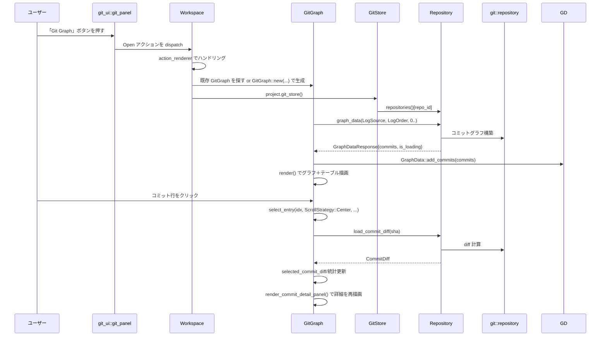

# git_graph ディレクトリ

## 0. ざっくり一言

`git_graph` は、Git リポジトリのコミット履歴を **グラフ（ブランチ線）＋テーブル＋詳細パネル** で表示する UI アイテムと、そのための **レーン計算ロジック**・**永続化** を提供するクレートです。

---

## 1. このモジュールの役割

### 1.1 概要

- このモジュールは、Git リポジトリのコミット履歴を視覚的に理解しやすくするために、
  - ブランチ構造を表す「線（レーン）」の計算
  - コミット一覧テーブルと同期したグラフ描画
  - 選択コミットの詳細（著者・メッセージ・diff・変更ファイル一覧等）の表示
  - コミットメッセージ全文検索
  を提供します。
- また、`workspace::Item` としてワークスペースに統合され、開いている Git リポジトリごとに「Git Graph」タブを扱えるようにします。
- `db` を使った簡易な永続化により、「どのリポジトリの Git Graph を開いていたか」をワークスペース DB に保存します。

### 1.2 アーキテクチャ内での位置づけ

`GitGraph` は Zed のようなエディタのワークスペース UI の一部として動作し、`project::git_store` 経由で Git 情報にアクセスします。

```mermaid
graph TD
    subgraph Crate "git_graph クレート"
        GG["GitGraph<br/>(UIアイテム)"]
        GD["GraphData<br/>(レーン計算)"]
        Persist["persistence::GitGraphsDb"]
    end

    WS["workspace::Workspace"]
    Proj["project::Project"]
    GS["project::git_store::GitStore"]
    Repo["git_store::Repository"]
    Git["git::repository<br/>(ログ/差分)"]
    GPUI["gpui / ui<br/>(描画・イベント)"]
    GitPanel["git_ui::git_panel"]

    GitPanel -->|Open / OpenAtCommit| WS
    WS -->|Itemとして生成| GG
    GG -->|repositories()| GS
    GS --> Repo
    Repo -->|graph_data / search_commits / load_commit_diff| Git
    GG --> GD
    GG --> GPUI
    GG --> Persist
```

要点:

- Git データ取得はすべて `GitStore` / `Repository` に委譲され、`git_graph` 自身は **描画とレーン計算に専念** しています。
- `GitGraph` は `workspace::Item + SerializableItem` を実装しており、タブとして表示されつつ、DB に状態を保存します。
- 描画は `gpui::canvas` と `ui` クレートの部品（`Table`, `Button`, `Chip` 等）で実現されています。

### 1.3 設計上のポイント

- **レーン計算の分離**  
  コミットをレーンに割り当て、親子関係を線分に分解する処理を `GraphData` / `LaneState` / `CommitLine` などに分離しています。UI からは `GraphData` の結果だけを参照します。
- **インクリメンタルな読み込み**  
  `RepositoryEvent::GraphEvent::CountUpdated` に応じてコミットを追加 (`GraphData::add_commits`) し、スクロール位置付近の追加データだけをフェッチするなど、全履歴を一度に読む必要がない構造になっています。
- **UI とスクロールの同期**  
  左側のグラフ（canvas）と右側のテーブルを共通の `TableInteractionState` のスクロールオフセットで同期させています。
- **非同期検索と UI 状態管理**  
  コミット検索はチャネル＋`Task` で非同期に行い、`SearchState` がクエリ・マッチ結果・選択インデックスを保持します。
- **ワークスペース連携と永続化**  
  `workspace::SerializableItem` により、どのリポジトリの GitGraph かを DB に保存し、再起動後に復元できます（`persistence::GitGraphsDb`）。

---

## 2. 主要な機能一覧

- Git グラフ描画:  
  コミットの親子関係からレーンと線分 (`CommitLineSegment`) を計算し、キャンバス上に円と線として描画します。
- コミットテーブル表示:  
  コミットメッセージ・日時・著者・SHA を表形式で表示し、グラフと連動して hover/選択状態を同期します。
- コミット詳細パネル:  
  選択されたコミットについて、著者情報、日付、メッセージ、ホスティングサービスへのリンク、変更ファイル一覧、diff 統計を表示します。
- コミットメッセージ検索:  
  テキストボックスからコミットメッセージを検索し、マッチしたコミットにハイライト・移動する機能を提供します。
- グラフ/テーブルのカラムリサイズ:  
  グラフ列とテーブル列の幅をドラッグで変更でき、その状態を `RedistributableColumnsState` として保持します。
- スプリットビュー（詳細ペイン）のリサイズ:  
  コミット一覧と詳細パネルの幅比率をドラッグやダブルクリックで調整できます（`SplitState`）。
- ワークスペースへの統合と永続化:  
  `git_ui::git_panel::Open` / `OpenAtCommit` から GitGraph を開き、どのリポジトリのグラフかを DB に保存・復元します。

---

## 3. 関数・構造体の解説

### 3.1 型一覧（構造体・列挙体など）

主要な型を抜粋して一覧にします。

| 名前 | 種別 | 役割 / 用途 |
|------|------|-------------|
| `GitGraph` | 構造体 | Git グラフ UI タブ本体。`workspace::Item + Render + SerializableItem` を実装 |
| `GraphData` | 構造体 | コミットごとのレーン割り当てと、コミット間の線 (`CommitLine`) を管理 |
| `CommitEntry` | 構造体 | 1 コミット分のグラフ情報（`InitialGraphCommitData` + lane + color_idx） |
| `LaneState` | enum | 各レーンの「現在このレーンでどの親子間の線を伸ばしているか」の状態 |
| `CommitLine` | 構造体 | ある子コミットから親コミットまでの線を、直線／曲線のセグメント列として表現 |
| `CommitLineSegment` | enum | 線分の種類（縦線 `Straight` / 横に寄っていく曲線 `Curve`） |
| `CurveKind` | enum | 曲線の種類（マージ線か `Merge`、ブランチ／チェックアウト線か `Checkout`） |
| `AllCommitCount` | enum | コミット総数がロード済みかどうかの状態 |
| `SearchState` | 構造体 | 検索クエリ、マッチしたコミットの Oid 集合、選択中のマッチなど |
| `QueryState` | enum | 検索クエリの状態（未入力／送信済み＋Task／再検索待ちなど） |
| `SplitState` | 構造体 | コミット一覧と詳細パネルの幅比率およびドラッグ中の一時値 |
| `ChangedFileEntry` | 構造体 | コミット diff に含まれる 1 ファイルに対する表示用情報（ステータス・パスなど） |
| `CopiedState` | 構造体 | 「コピー済み」状態を一定時間保持し、ボタンのアイコン変更に使う |
| `GitGraphsDb` | 構造体 | `db` クレート上のドメイン。GitGraph のワークスペース内状態を永続化 |

### 3.2 関数詳細（最大 7 件）

#### 1. `GraphData::add_commits(&mut self, commits: &[Arc<InitialGraphCommitData>])`

**概要**

- Git リポジトリから取得したコミット列（新しい順）を `GraphData` に追加し、
  - 各コミットにレーン番号と色を割り当て
  - 親コミットへの線 (`CommitLine`) を生成
  します。

**引数**

| 引数名 | 型 | 説明 |
|--------|----|------|
| `commits` | `&[Arc<InitialGraphCommitData>]` | `git::repository::InitialGraphCommitData` の配列。新しい順で並んでいることが前提 |

**戻り値**

- なし（`self` のフィールド `commits`, `lines`, `lane_states`, `parent_to_lanes`, `max_lanes`, `max_commit_count` が更新されます）。

**内部処理の流れ**

1. `self.commits` と `self.lines` の容量を、追加コミット数に合わせて増やします。
2. 配列を先頭から順に（新しいコミットから古いコミットへ）走査します。  
   各コミットについて:
   1. そのコミットの行番号 `commit_row` を `self.commits.len()` から決定。
   2. すでにこのコミットを親として待機しているレーンがあるか `parent_to_lanes` を確認し、あればその先頭のレーン番号を、なければ `first_empty_lane_idx()` で空きレーンを割り当てます。
   3. レーンに対応する色 (`BranchColor`) を `get_lane_color` で取得します。
   4. `parent_to_lanes` にこのコミットを親として待っていたレーンがあれば、それぞれの `LaneState` を `to_commit_lines(...)` で `CommitLine` に変換し、`self.lines` に追加します。このとき、マージ線が他のコミットと重ならないように、曲線の行・列を調整します。
   5. コミットの各親 (`parents`) について:
      - 第 1 親は「直線の継続」として、`commit_lane` 上で `Straight` な線分を起点に `LaneState::Active` を設定し、`parent_to_lanes[parent]` に `commit_lane` を追加します。
      - 2 番目以降の親は「マージ元」として、新しいレーンを `first_empty_lane_idx()` で確保し、`CurveKind::Merge` な `Curve` セグメントから始まる `LaneState::Active` を設定し、`parent_to_lanes[parent]` にこのレーンを追加します。
   6. レーン数の最大値 `max_lanes` を更新し、`self.commits` に `CommitEntry`（コミットデータ＋lane＋color_idx）を追加します。
3. 最後に `max_commit_count` を `AllCommitCount::Loaded(self.commits.len())` に更新します。

**Examples（使用例）**

純粋ロジックとして単体利用する場合の例です（テストコードに近いパターン）。

```rust
use git::repository::InitialGraphCommitData;
use git::Oid;
use smallvec::smallvec;
use std::sync::Arc;

// (1) コミット DAG を newest-first で構築する            // 頭が一番新しいコミットになるように並べる
let commits: Vec<Arc<InitialGraphCommitData>> = vec![
    Arc::new(InitialGraphCommitData {              // HEAD
        sha: Oid::from_hex("...").unwrap(),        // 仮の SHA
        parents: smallvec![/* 親の Oid */],
        ref_names: vec!["HEAD".into(), "main".into()],
    }),
    // 以降、古いコミット...
];

// (2) GraphData を初期化し、add_commits でレーン計算    // アクセントカラー数は適当な値
let mut graph_data = GraphData::new(8);
graph_data.add_commits(&commits);                  // commits / lines / lanes が埋まる

// (3) graph_data.lines を使って描画座標に変換する      // 実際には GitGraph::render_graph 内で使用
```

**Errors / Panics**

- この関数自体は `Result` を返さず、明示的なエラー処理は行いません。
- 想定と異なる順番（古い順など）でコミットを渡すと、テストが保証しているようなレーンの不変条件が崩れる可能性があります。

**Edge cases（エッジケース）**

- 親が 0 個（root コミット）の場合:  
  `parents` が空のため、新たな `LaneState::Active` は追加されず、`lines` だけが増えます（直前の Active を閉じた結果）。
- 親が複数（マージ / オクトパス マージ）の場合:  
  2 個目以降の親ごとに新規レーンが割り当てられ、`CurveKind::Merge` の曲線として表現されます。
- 同じ親を複数の子が指す場合:  
  `parent_to_lanes` がその親に対応するレーン一覧を持ち、親コミットを処理するタイミングでまとめて線が確定します。

**使用上の注意点**

- 引数 `commits` は **「新しいコミットが先頭」** の順序で渡す必要があります。テストコードのコメントにも「newest-first」と明記されています。
- `GraphData` の状態を一度クリアしたい場合は、`clear()` を呼んでから `add_commits()` し直します（`invalidate_state` 内でそのように使用しています）。

---

#### 2. `GitGraph::new(repo_id, git_store, workspace, window, cx) -> Self`

**概要**

- 指定されたリポジトリ ID の Git グラフ UI (`GitGraph`) を初期化し、初期のコミットグラフを読み込みます。
- フォーカス・イベント購読・検索エディタ・テーブル状態・スプリット状態など、UI に必要な全ての内部状態をセットアップします。

**引数**

| 引数名 | 型 | 説明 |
|--------|----|------|
| `repo_id` | `RepositoryId` | 表示対象となる Git リポジトリの ID |
| `git_store` | `Entity<GitStore>` | 全リポジトリを管理する Git ストア |
| `workspace` | `WeakEntity<Workspace>` | 所属するワークスペースの弱参照 |
| `window` | `&mut Window` | このビューが表示されるウィンドウ |
| `cx` | `&mut Context<Self>` | `GitGraph` 用の gpui コンテキスト |

**戻り値**

- 初期化済みの `GitGraph` インスタンス。

**内部処理の流れ**

1. フォーカスハンドルを作成し、フォーカス時に `cx.notify()` する購読を設定。
2. テーマのアクセントカラー数から `GraphData::new(...)` を初期化。
3. デフォルトの `LogSource` / `LogOrder` を設定。
4. `GitStore` への購読を設定し、対象リポジトリの `RepositoryEvent`（特に `GraphEvent`, `BranchChanged`）を受け取って `on_repository_event` に委譲。
5. 検索用のシングルラインエディタ `Editor` を生成し、プレースホルダテキストを設定。
6. `TableInteractionState` / `RedistributableColumnsState` を初期化し、カラム幅の初期値・リサイズ可否を設定。
7. 設定ストア (`SettingsStore`) の変更を購読し、フォントサイズに応じて `row_height` を動的に更新。
8. `GitGraph` のフィールドを埋めてインスタンスを構築。
9. `fetch_initial_graph_data` を呼び出し、対象リポジトリから初期グラフデータを読み込みます。

**Examples（使用例）**

テストコードに近い形で、プロジェクトとワークスペースから GitGraph を生成する例です。

```rust
use project::Project;
use workspace::Workspace;
use gpui::{App, Window};

// （前提）Project / Workspace / Window はすでに作成済みとする           // Zed 本体側で用意されている想定

fn open_git_graph_for_active_repo(
    project: &Entity<Project>,       // プロジェクトハンドル
    workspace: &WeakEntity<Workspace>,
    window: &mut Window,
    cx: &mut App,
) {
    // GitStore とアクティブリポジトリ ID を取得                      // GitStore 経由でリポジトリへアクセス
    let git_store = project.read(cx).git_store().clone();

    let repo_id = project
        .read(cx)
        .active_repository(cx)
        .expect("repository must exist")
        .read(cx)
        .id;

    // GitGraph を生成                                                  // ここで GraphData なども初期化される
    let git_graph = cx.new(|cx| GitGraph::new(repo_id, git_store, workspace.clone(), window, cx));

    // Workspace のタブとして追加                                      // 実際には workspace::Workspace::add_item_to_active_pane を使う
    workspace
        .upgrade()
        .unwrap()
        .update(cx, |ws, window_cx| {
            ws.add_item_to_active_pane(Box::new(git_graph), None, true, window_cx, cx);
        })
        .ok();
}
```

**Errors / Panics**

- 渡した `repo_id` に対応するリポジトリが `GitStore` に存在しない場合、`fetch_initial_graph_data` 内の `get_repository` が `None` を返し、単にコミット 0 件の状態になります（この関数自体は panic しません）。

**Edge cases**

- `GitStore` にまだリポジトリがロードされていない場合:  
  `fetch_initial_graph_data` では何も追加されず、後続の `RepositoryEvent::GraphEvent` によって徐々に埋まっていきます。
- テーマや設定が変わって行の高さが変わる場合:  
  設定購読によって `row_height` とテーブルのスクロールハンドルがリセットされます。

**使用上の注意点**

- `GitGraph::new` は gpui コンテキスト内で呼ぶ必要があります（`cx.new(|cx| ...)` のような形）。
- `repo_id` は `GitStore::repositories()` に含まれる ID を渡す必要があります。そうでない場合、UI は空のままです。

---

#### 3. `GitGraph::render_graph(&self, window: &Window, cx: &mut Context<GitGraph>) -> impl IntoElement`

**概要**

- 左側のグラフ領域（canvas）を構築し、現在ロードされているコミットに対応する円と線を描画する `gpui::canvas` 要素を返します。
- テーブルのスクロール位置に基づいて、可視範囲だけを描画します。

**引数**

| 引数名 | 型 | 説明 |
|--------|----|------|
| `window` | `&Window` | 描画対象ウィンドウ |
| `cx` | `&mut Context<GitGraph>` | コンテキスト。`table_interaction_state` やテーマ情報を参照 |

**戻り値**

- グラフ領域の UI 要素。`render` の中で `child(self.render_graph(...))` されます。

**内部処理の流れ**

1. テーブルのビューポート高さ・スクロールオフセットを `TableInteractionState` から取得。
2. `row_height` とスクロール位置から、表示すべき行インデックスの範囲 (`viewport_range`) を計算。
3. `GraphData::commits` からその範囲のコミットを取り出し、また `GraphData::lines` から表示範囲にかかる `CommitLine` だけを抽出。
4. `gpui::canvas` を生成し、描画クロージャ内で:
   - フォーカス・ホバー・選択状態に応じて行背景を塗り分け。
   - 各コミットに対して円（`draw_commit_circle`）を描画。
   - 各 `CommitLine` について、可視範囲内の最初の線分インデックスを求め (`get_first_visible_segment_idx`)、`PathBuilder` で直線・曲線を組み立てて描画。
   - 色ごとにレイヤーを分けて描画し、異なる色の線が重なって色が変わらないようにしています。
5. グラフ領域の実際の `Bounds` を `graph_canvas_bounds` に保存し、マウス座標→行インデックスの変換に使います。

**Examples（使用例）**

この関数は内部専用で、外部から直接呼び出す想定ではありません。利用は `impl Render for GitGraph` 内で行われています。

**Errors / Panics**

- `GraphData` にコミットが 0 件の場合でも、描画処理は成立するように実装されています（何も描かれないだけ）。

**Edge cases**

- コミット数が少なく、ビューポートより内容の高さが小さい場合:  
  スクロールオフセットは 0 にクランプされます。
- レーン数が少ない／多い場合:  
  `graph_canvas_content_width` がレーン数に応じて変化しますが、テーブル側との比率に応じて `graph_width` が調整されます。

**使用上の注意点**

- `GraphData` の内容を変更した後は `cx.notify()` を呼び、`render_graph` を含む再描画をトリガーする必要があります（この関数自身は状態を変更しません）。

---

#### 4. `GitGraph::select_entry(&mut self, idx, scroll_strategy, cx)`

```rust
fn select_entry(
    &mut self,
    idx: usize,
    scroll_strategy: ScrollStrategy,
    cx: &mut Context<Self>,
)
```

**概要**

- 指定した行インデックスのコミットを「選択状態」にし、
  - テーブルのスクロール位置を更新
  - コミット diff の非同期ロードを開始
  - 詳細パネルの内容を更新
 します。

**引数**

| 引数名 | 型 | 説明 |
|--------|----|------|
| `idx` | `usize` | 選択したいコミットの行インデックス |
| `scroll_strategy` | `ScrollStrategy` | 行をビューポート内のどこにスクロールして表示するか（Top/Center/Nearest 等） |
| `cx` | `&mut Context<Self>` | コンテキスト |

**戻り値**

- なし。

**内部処理の流れ**

1. すでにその行が選択済みなら何もしません。
2. `selected_entry_idx` を更新し、既存の diff と統計をクリアし、変更ファイルリストのスクロール位置を先頭に戻します。
3. `TableInteractionState` に対して `scroll_to_item(idx, scroll_strategy)` を呼び、テーブルとグラフが選択行を含むようにスクロールします。
4. 対応する `CommitEntry` を `graph_data.commits[idx]` から取得し、その SHA 文字列を用意します。
5. `get_repository` から `Repository` を取得し、`load_commit_diff(sha)` を呼び出して diff 取得用の future/チャネルを取得。
6. 非同期タスク（`Task<()>`）を `cx.spawn` で起動し、diff が届いたら:
   - `compute_diff_stats` で追加行数・削除行数を計算
   - `selected_commit_diff` / `selected_commit_diff_stats` に保存し、`cx.notify()` で再描画を行います。

**Examples（使用例）**

`render` やグラフ／テーブルのクリックハンドラから使われています。

```rust
// テーブル行クリック内の例                                    // map_row 内
.on_click(move |event, window, cx| {
    let click_count = event.click_count();
    weak.update(cx, |this, cx| {
        this.select_entry(index, ScrollStrategy::Center, cx);   // index 行を選択し、中央にスクロール
        if click_count >= 2 {
            this.open_commit_view(index, window, cx);           // ダブルクリックで CommitView を開く
        }
    })
    .ok();
})
```

**Errors / Panics**

- 指定インデックスが `graph_data.commits` の範囲外の場合は `return` して何もせず終了します。

**Edge cases**

- diff ロード中に別のコミットを選択した場合:  
  新しい選択で diff ロードが上書きされます。古い diff が終わっても UI 状態を上書きしないように、タスク内で `this.update(...)` が `Ok` なら実際に上書きされます。
- リポジトリが存在しない場合:  
  `get_repository` が `None` となり、diff ロードは行われません。

**使用上の注意点**

- `select_entry` を呼んだ後に UI を更新するには、関数内部で `cx.notify()` を呼んでいるため追加の通知は不要です。
- プログラムから特定のコミットを選択したい場合は、SHA を使う `select_commit_by_sha` の方が便利です。

---

#### 5. `GitGraph::search(&mut self, query: SharedString, cx: &mut Context<Self>)`

**概要**

- コミットメッセージに対する検索を開始します。
- `Repository::search_commits` を使って非同期にマッチしたコミットの `Oid` を受信し、`SearchState` に保存・ハイライトします。

**引数**

| 引数名 | 型 | 説明 |
|--------|----|------|
| `query` | `SharedString` | 検索文字列 |
| `cx` | `&mut Context<Self>` | コンテキスト |

**戻り値**

- なし。

**内部処理の流れ**

1. リポジトリが取得できなければ何もせず終了。
2. 既存のマッチと選択インデックス、エディタのテキストスタイルをリセット。
3. クエリが空なら `QueryState::Empty` にして終了。
4. `smol::channel::unbounded::<Oid>()` で検索結果用チャネルを作成。
5. `Repository::search_commits(...)` を呼び出し、`query`・`case_sensitive` 設定・送信側チャネルを渡して検索を開始。
6. 受信側チャネルを使って `cx.spawn` で非同期タスクを起動し、受信した `Oid` をまとめて `SearchState::matches` に追加。
   - 最初の結果が来たとき、もし `selected_index` が `None` なら 0 にし、そのコミットを `select_commit_by_sha` で選択。
   - 結果が 1 つもなかった場合、検索エディタのテキスト色を `Color::Error` に変更。
7. `search_state.state` を `QueryState::Confirmed((query, search_task))` にセット。

**Examples（使用例）**

`enter` キーなどでの検索確定は `confirm_search` 経由で行われます。

```rust
fn confirm_search(&mut self, _: &menu::Confirm, _window: &mut Window, cx: &mut Context<Self>) {
    let query = self.search_state.editor.read(cx).text(cx).into(); // エディタの文字列を取得
    self.search(query, cx);                                        // 検索開始
}
```

**Errors / Panics**

- 検索自体のエラーは `search_commits` 内部で処理されます。この関数は明示的なエラー値を返しません。

**Edge cases**

- クエリが空文字列:  
  ただちに `QueryState::Empty` とし、マッチも選択もクリアします。
- 検索結果が 0 件:  
  `matches` が空のままになり、エディタのテキスト色がエラー色になります。
- 大量の結果:  
  チャネルからの受信では一定バッチで `IndexSet` に追加しており、1 件ごとに `cx.notify()` を呼ぶのではなく、ある程度まとめて UI を更新します。

**使用上の注意点**

- 大文字小文字の区別は `self.search_state.case_sensitive` で制御され、`ToggleCaseSensitive` アクションで切り替わります。
- 検索はコミットログに対して行われ、ファイル内容検索ではありません。

---

#### 6. `impl Render for GitGraph::render(...)`

```rust
impl Render for GitGraph {
    fn render(&mut self, window: &mut Window, cx: &mut Context<Self>) -> impl IntoElement { ... }
}
```

**概要**

- GitGraph 全体の UI を構築します。
- 検索バー・グラフ＋テーブル・（任意の）コミット詳細パネル・コンテキストメニューなどを組み合わせたレイアウトを返します。

**主な処理フロー**

1. `QueryState::Pending` の場合は再検索を走らせる（ブランチ変更などでグラフが再ロードされた後）。
2. `GraphData::max_commit_count` の状態に応じて、コミットが全くない／ロード中／一部ロード済みを判定し、必要に応じて `repository.graph_data(...)` を呼んで `GraphData::add_commits` を行います。
3. コミット数が 0 の場合:
   - `"Loading"` または `"No commits found"` のラベルと必要ならスピナーを表示。
4. コミットがある場合:
   - カラム幅情報から、Graph 列とテーブル列の幅割合を計算。
   - テーブルヘッダを描画（Graph/Description/Date/Author/Commit）。
   - 本体は左右に `h_flex` で分割:
     - 左側: `render_graph` を呼び出したグラフ canvas。
     - 右側: `Table` でコミット一覧を表示。`map_row` で選択／hover 状態やクリック時の動作を定義。
   - カラムリサイズハンドルを `render_redistributable_columns_resize_handles` で描画。
5. 選択中のコミットがある場合:
   - コミット一覧の右にスプリット用のリサイズハンドル (`render_commit_view_resize_handle`) と詳細パネル (`render_commit_detail_panel`) を追加。
6. ルートの `div` に対して:
   - キーコンテキスト `"GitGraph"` を設定し、フォーカス追跡。
   - 多数のアクションハンドラ（OpenCommitView, Cancel, FocusSearch, SelectNext/Previous, ToggleCaseSensitive 等）をバインド。
   - 上部に検索バー (`render_search_bar`)、下部にメインコンテンツを配置。
   - 必要に応じてコンテキストメニューを `deferred` で重ねて描画。

**使用上の注意点**

- `render` 内部で `repository.graph_data(...)` を呼ぶことがあるため、描画時にある程度 I/O が発生する可能性があります（ただし GitStore 側でキャッシュされている前提です）。
- `render` は状態を変える（`GraphData::add_commits` 等）ので、gpui のフレームワークが想定するレンダリングモデルに従って使用されます。

---

#### 7. `init(cx: &mut App)`

**概要**

- アプリケーションの起動時に一度呼び出して、`GitGraph` をワークスペースに統合します。
- `workspace::Workspace` が新たに作成されるたびに、「Git パネルから Git Graph を開くためのアクション」を登録します。

**引数**

| 引数名 | 型 | 説明 |
|--------|----|------|
| `cx` | `&mut App` | アプリケーション全体の gpui コンテキスト |

**内部処理の流れ**

1. `workspace::register_serializable_item::<GitGraph>(cx)` を呼び、`GitGraph` をシリアライズ可能なアイテムとして登録。
2. すべての新しい `workspace::Workspace` に対して `observe_new` を行い、各ワークスペース内に:
   - `git_ui::git_panel::Open` アクション:  
     - アクティブリポジトリに対して既存の GitGraph があればアクティブ化、なければ新規作成してタブとして追加。
   - `git_ui::git_panel::OpenAtCommit` アクション:  
     - 指定された SHA のコミットを選択した状態で GitGraph を開く（既存があれば再利用）。
   を行う `action_renderer` を登録します。

**Examples（使用例）**

アプリケーション初期化コードの一部として:

```rust
use gpui::App;

fn main() {
    App::run(|cx| {
        // 他のモジュールの初期化...
        git_graph::init(cx);  // GitGraph を Workspace/Project に統合する
    });
}
```

**使用上の注意点**

- `git_graph::init` を呼ばないと、`git_ui::git_panel` から GitGraph タブを開くことができません。
- 通常はアプリケーション起動時に 1 回だけ呼び出されることを想定しています。

---

### 3.3 その他の関数

関数数が多いため、カテゴリごとに主要なものをまとめます。

| 関数名 / メソッド名 | 役割（1 行） |
|---------------------|--------------|
| `GitGraph::invalidate_state` | GraphData/検索マッチをクリアし、再読み込みを促す |
| `GitGraph::fetch_initial_graph_data` | 初回に `Repository::graph_data` を呼び、GraphData を埋める |
| `GitGraph::on_repository_event` | `RepositoryEvent` に応じて GraphData を追加更新したり、ブランチ変更でリセットしたりする |
| `GitGraph::get_repository` | `repo_id` から `Entity<Repository>` を取得するヘルパー |
| `GitGraph::render_table_rows` | 指定行範囲のコミット情報をテーブル用の `Vec<AnyElement>` に変換 |
| `GitGraph::render_search_bar` | 検索欄と検索オプション・マッチ数表示などを描画 |
| `GitGraph::render_commit_detail_panel` | 選択コミットの詳細情報・変更ファイル・ボタン類を描画 |
| `GitGraph::open_selected_commit_view` / `open_commit_view` | 選択中または指定インデックスのコミットを `CommitView` で開く |
| `GitGraph::row_at_position` | グラフキャンバス上の y 座標から行インデックスを計算 |
| `GitGraph::handle_graph_mouse_move` / `handle_graph_click` / `handle_graph_scroll` | グラフ領域のホバー・クリック・スクロールイベントを処理 |
| `GitGraph::set_repo_id` | GitGraph に紐付くリポジトリ ID を変更し、GraphData をリセット |
| `GitGraph::select_commit_by_sha` | SHA からコミット index を検索し、`select_entry` を呼ぶ |
| `GitGraph::select_previous_match` / `select_next_match` | 検索結果の前後マッチに移動 |
| `GitGraph::render_commit_view_resize_handle` | 詳細パネルとのスプリッターを描画し、ドラッグイベントを設定 |
| `SplitState::on_drag_move` / `commit_ratio` / `on_double_click` | スプリット比率の変更・確定・リセットを制御 |
| `ChangedFileEntry::from_commit_file` | `CommitFile` から表示用のエントリを構築 |
| `ChangedFileEntry::render` | 変更ファイルリスト内の 1 行を描画 |
| `compute_diff_stats` | `CommitDiff` 内の行追加・削除数を集計 |
| `format_timestamp` | Unix タイムスタンプをローカルタイムの文字列に変換 |
| `persistence::GitGraphsDb::save_git_graph` | GitGraph が開いているリポジトリの作業ディレクトリを DB に保存 |
| `persistence::GitGraphsDb::get_git_graph` | ワークスペース＋アイテム ID から保存済みパスを取得 |
| `SerializableItem::deserialize` | 保存済みパスから対応する `RepositoryId` を探し、GitGraph を復元 |
| `SerializableItem::serialize` | 現在の `repo_id` に対応するリポジトリのパスを DB に保存 |

---

## 4. データフロー

ここでは、「Git パネルから GitGraph を開き、コミットを選択して詳細を見る」までの典型的なフローを示します。



要点:

- `graph_data(...)` 呼び出しは、初回の `render` または `GitGraph::new` 時に行われ、`GraphData::add_commits` によってレーン情報が準備されます。
- コミット diff は、コミット選択のたびに `load_commit_diff` で非同期に取得され、完了後に詳細パネルのみ再描画されます。
- 検索はこのフローに追加で重なっており、検索結果から `select_commit_by_sha` 経由で同じ `select_entry` が呼ばれます。

---

## 5. 使い方（How to Use）

### 5.1 基本的な使用方法

1. アプリケーション起動時に `git_graph::init` を呼び、GitGraph をワークスペースに登録します。
2. `git_ui::git_panel` から `Open` アクションを発行すると、アクティブリポジトリの GitGraph タブが開きます。
3. テーブルまたはグラフ上の行をクリック／ダブルクリックすると、選択・詳細表示・CommitView の表示が行われます。

アプリケーション側から見た典型的な初期化例:

```rust
use gpui::App;

fn main() {
    App::run(|cx| {
        // 1. 他クレートの初期化など                                     // 設定、テーマ、プロジェクトなど
        // project::init(cx); 等

        // 2. GitGraph をワークスペースに統合                           // git_panel から開けるようになる
        git_graph::init(cx);

        // 3. メインウィンドウやマルチワークスペースの構築             // workspace::MultiWorkspace など
    });
}
```

ユーザー操作側の基本フロー:

- 「Git パネル」からリポジトリを選択。
- 「Git Graph」ボタンを押す → GitGraph タブが開く。
- 行をクリック → 選択・詳細パネル更新。
- 行をダブルクリック → `CommitView` が開き、ファイルの差分を確認できる。
- 右側の詳細パネルの「Changed Files」から各ファイルをクリック → 特定ファイルの diff を含む `CommitView` が開く。

### 5.2 よくある使用パターン

#### パターン 1: 特定コミットの位置にジャンプして GitGraph を開く

`git_ui::git_panel::OpenAtCommit` アクション経由で、指定 SHA のコミットにフォーカスした GitGraph を開くパターンです。コード上では `init` 内でハンドリングされています。

概念的なコード:

```rust
// どこかの UI から "このコミットをグラフで見る" アクションを実行
window.dispatch_action(
    Box::new(git_ui::git_panel::OpenAtCommit { sha: target_sha }),
    cx,
);
```

- 既存 GitGraph があれば `select_commit_by_sha` でそのコミットを選択し、タブをアクティブにします。
- なければ新規に GitGraph を作成し、`select_commit_by_sha` を呼んだ上でタブに追加します。

#### パターン 2: リポジトリ切り替え時に GitGraph の内容を更新

`GitGraph::set_repo_id` を使うと、同じ GitGraph インスタンスを別リポジトリに切り替えられます（テスト `test_graph_data_repopulated_from_cache_after_repo_switch` で使用）。

```rust
// ある GitGraph インスタンスに対して、リポジトリを差し替える
git_graph_entity.update(cx, |graph, cx| {
    graph.set_repo_id(new_repo_id, cx);   // GraphData がクリアされ、次の render 時に新リポジトリの graph_data が読み込まれる
});
```

#### パターン 3: 検索でマッチを巡回

- 検索欄にクエリを入力し Enter → `search` が実行される。
- 左右矢印ボタンまたは `SelectNextMatch` / `SelectPreviousMatch` アクションで検索結果を順送り／逆送りし、`select_commit_by_sha` 経由でコミット選択を更新します。

### 5.3 よくある間違い

```rust
// 間違い例: init を呼ばずに GitGraph を期待する
fn main() {
    App::run(|_cx| {
        // git_graph::init を呼んでいない
    });
}
// → git_ui::git_panel から GitGraph を開くアクションが登録されないため、UI から GitGraph を開けない
```

```rust
// 正しい例: 起動時に init を呼ぶ
fn main() {
    App::run(|cx| {
        git_graph::init(cx);  // Workspace に GitGraph を登録
    });
}
```

```rust
// 間違い例: 存在しない repo_id を渡して GitGraph::new を呼ぶ
let fake_repo_id = RepositoryId::from_raw(9999);       // 仮の ID
let git_graph = cx.new(|cx| {
    GitGraph::new(fake_repo_id, git_store.clone(), workspace_weak.clone(), window, cx)
});
// → GraphData は永遠に空のまま（get_repository が None を返す）
```

```rust
// 正しい例: GitStore が持っている repo_id を使う
let repo_id = git_store.read(cx)
    .repositories()
    .keys()
    .next()
    .copied()
    .expect("repository must exist");

let git_graph = cx.new(|cx| {
    GitGraph::new(repo_id, git_store.clone(), workspace_weak.clone(), window, cx)
});
```

### 5.4 使用上の注意点（まとめ）

- **コミット順序の前提**  
  `GraphData::add_commits` は「新しいコミットが先頭」の順序（`git log` 風）を前提にしています。別の順序で渡すとレーン計算の不変条件が成り立たなくなります。
- **リポジトリの存在**  
  `GitGraph::new` や `set_repo_id` に渡す `RepositoryId` は、`GitStore::repositories()` に含まれるものに限る必要があります。
- **UI コンテキスト**  
  `GitGraph` の生成・更新は gpui の UI スレッド・コンテキスト内で行う必要があります。`cx.new`, `entity.update` などの仕組みに従って呼び出します。
- **非同期処理と再描画**  
  diff ロードや検索は非同期に行われるため、結果に依存した UI は `cx.notify()` を通じて更新されます。独自に状態を変更する場合も、必要に応じて `cx.notify()` が必要です。
- **検索クエリの再発行**  
  ブランチ変更などでグラフが再ロードされたとき、`QueryState::Pending` により「同じクエリで再度検索」が自動的に行われます。これにより、ブランチを変えても検索条件は継承されます。

---

## 6. 変更の仕方（How to Modify）

### 6.1 新しい機能を追加する場合

例: コミット詳細パネルに「特定ツールへのリンクボタン」を追加したい場合。

1. **場所の特定**  
   - UI 変更ならほとんどの場合 `GitGraph::render_commit_detail_panel` 内に追加するのが自然です。
2. **必要な依存をインポート**  
   - 追加で開きたい URL やサービスに応じて、必要なヘルパー関数やクレート（既存の `parse_git_remote_url` に近いもの）があれば `use` に追加します。
3. **UI 要素の追加**  
   - 既存の `Button::new("view-on-provider", ...)` を参考に、新たな `Button` や `IconButton` を `render_commit_detail_panel` の最後のボタン群内に追加します。
4. **イベントハンドラの実装**  
   - ボタンの `.on_click` で `cx.open_url` のような関数を呼び出すか、別のアクションを dispatch します。
5. **テストの追加**  
   - UI の詳細まではテストから確認しにくい場合がありますが、必要であれば `gpui::test` を用意し、`draw` を呼んでクラッシュしないことなどを確認します。

### 6.2 既存の機能を変更する場合

例: レーン計算ロジックを変更したい場合（`GraphData::add_commits`）。

- **影響範囲の確認**
  - レーン計算の不変条件は `tests` モジュール内の多数のテスト（`verify_*` 系）により検証されています。
  - 変更するとこれらのテスト（`test_git_graph_random_commits` など）が落ちる可能性が高いので、テスト結果を必ず確認します。
- **前提条件**
  - コミットの並びは newest-first。
  - `InitialGraphCommitData` の `parents` は 0 個以上で、親のインデックスは必ず子より大きい（= 古い）。
- **変更時に注意する契約**
  - `CommitLine::full_interval` の `start` は子コミットの行、`end` は親コミットの行。
  - 最後のセグメントの終端行は `full_interval.end` と一致する必要がある。
  - 各線分は「コミットのあるセル」を避けて描画される（`verify_line_overlaps` が検証）。
- **関連箇所**
  - `LaneState::to_commit_lines` と `GraphData::add_commits` がレーン計算の中核です。
  - 描画側では `CommitLineSegment` の解釈に依存しています（`render_graph` 内）。

---

## 7. 関連ファイル

| パス / モジュール | 役割 / 関係 |
|------------------|------------|
| `git_graph/Cargo.toml` | このクレートの設定ファイル。依存クレート（`git`, `git_ui`, `project`, `workspace`, `db`, `gpui`, `ui` など）と `test-support` feature を定義 |
| `git_graph/src/git_graph.rs` | 本ドキュメントで説明している GitGraph UI・レーン計算・永続化・テストをすべて含むメインファイル |
| `project::git_store` モジュール | `GitStore` / `Repository` を定義し、GitGraph がコミットグラフ・diff・検索結果を取得する窓口 |
| `git_ui::git_panel` モジュール | `Open` / `OpenAtCommit` アクションを定義し、GitGraph を開く UI 側のトリガーとなる |
| `ui` クレートの各モジュール | `Table`, `Button`, `Chip`, `DiffStat` など、GitGraph の UI 部品を提供 |
| `db` / `WorkspaceDb` | `persistence::GitGraphsDb` から利用される DB 層。GitGraph の開いているリポジトリパスを保存する |

このチャンクには他クレートの実装コードは含まれていませんが、型名や `use` 句から上記のような関係が確認できます。
