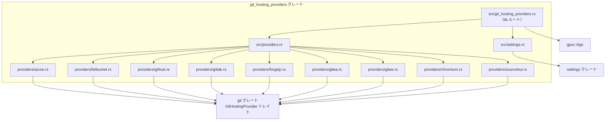
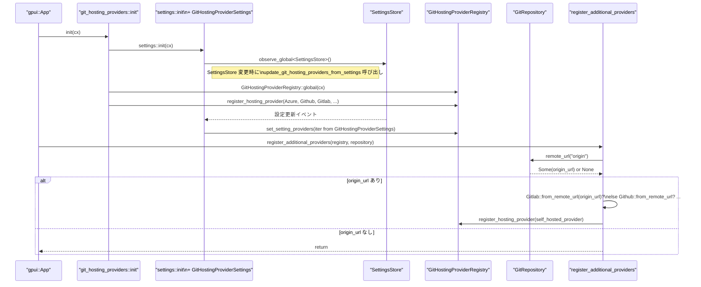

# git_hosting_providers ディレクトリ解説

## 1. ざっくり一言

`git_hosting_providers` クレートは、GitHub / GitLab / Bitbucket など複数の Git ホスティングサービスに対して、**リモート URL の解析・パーマリンク生成・PR/MR 抽出・アバター取得** を行う共通インターフェース実装群と、その登録・設定連携ロジックを提供します。

---

## 2. このモジュールの役割

### 2.1 概要

- このクレートは、エディタ本体から使われる `GitHostingProvider` 実装をまとめて提供するモジュールです。
- リモート URL 文字列から「オーナー名・リポジトリ名」を解析し、コミットやファイル・行番号へリンクする **Web URL（パーマリンク）** を構築します。
- コミットメッセージから PR/MR 番号を抽出し、その Web UI への URL を生成します。
- 一部のホスティングサービスでは、コミット著者の **アバター画像 URL** を REST API から取得します。
- ユーザー設定・ワークスペース設定から任意の Git ホスティングプロバイダを追加し、アプリ内のレジストリに登録します。

### 2.2 アーキテクチャ内での位置づけ

主な構成要素と依存関係を簡略化した図です。



- `git::GitHostingProvider` トレイトは別クレートですが、このクレート内の各構造体（`Github`, `Gitlab` など）がこれを実装します。
- `GitHostingProviderRegistry`（`git` クレート側）に対して、ここで定義したプロバイダを登録します。
- `settings` クレートとの連携により、ユーザー設定から追加プロバイダを読み込みます。

### 2.3 設計上のポイント

- **プロバイダごとに別モジュール**  
  各ホスティングサービス（GitHub, GitLab, Bitbucket, …）を別ファイルに分割し、`GitHostingProvider` 実装としてまとめています。
- **共通インターフェース (`GitHostingProvider`)**  
  - `parse_remote_url`・`build_permalink`・`build_commit_permalink`・`extract_pull_request`・`commit_author_avatar_url` などを通じて、サービスごとの差異を吸収します。
- **自動登録 + 追加登録**  
  - 起動時に「パブリックなホスティングサービス（github.com など）」を一括登録。
  - リポジトリの `origin` URL から **自動的に自社ホスティング (self-hosted)** を検出して追加登録。
  - ユーザー設定から任意のインスタンスも追加可能。
- **HTTP ベースのアバター取得**  
  - 一部プロバイダでは、非同期 HTTP クライアント経由で REST API を叩き、JSON をデシリアライズしてアバター URL を取得します。
- **URL 解析のバリエーションに対応**  
  - SSH (`git@host:owner/repo.git`) と HTTPS (`https://host/owner/repo.git`) の両方をサポート。
  - Bitbucket Server の `scm/` 付きパスや Azure DevOps の `v3` / `DefaultCollection` など、各サービス固有の URL パターンに対応しています。

---

## 3. 主要な機能一覧

- Git ホスティングプロバイダの初期化・レジストリ登録
- `origin` リモート URL からの **self-hosted インスタンス検出と追加登録**
- SSH / HTTPS 形式の Git リモート URL からホスト名を抽出（`get_host_from_git_remote_url`）
- 各サービスごとのリモート URL 解析（`parse_remote_url`）
  - `owner`（組織・ユーザー名）と `repo` 名の抽出
- コミット・ファイルに対する **パーマリンク URL の生成**
  - コミット URL (`build_commit_permalink`)
  - ファイル + 行範囲 URL (`build_permalink` + `format_line_number(s)`)
- コミットメッセージから PR/MR / Gerrit Change などの番号と URL を抽出（`extract_pull_request`）
- コミット著者の **アバター画像 URL 取得**
  - GitHub / GitLab / Bitbucket / Gitea / Forgejo / Gitee / Chromium など
  - Gravatar / 自サービスホスト向けのクエリパラメータ付与
- 設定 (`SettingsStore`) から追加 Git ホスティングプロバイダを読み込み、レジストリへ反映

---

## 4. 関数・構造体の解説

### 4.1 主な構造体・型一覧

| 名前 | 種別 | 役割 / 用途 |
|------|------|-------------|
| `Azure` | 構造体（フィールドなし） | Azure DevOps / `*.visualstudio.com` 用の `GitHostingProvider` 実装 |
| `Bitbucket` | 構造体 `{ name: String, base_url: Url }` | Bitbucket Cloud / Server （self-hosted を含む）の実装。REST API からアバター取得も行います。 |
| `Chromium` | 構造体（フィールドなし） | `chromium.googlesource.com` + Gerrit (`chromium-review.googlesource.com`) 用の実装。Gerrit Change 情報からアバターを取得します。 |
| `Forgejo` | 構造体 `{ name, base_url }` | Forgejo / Codeberg (public + self-hosted) の実装。REST API からアバター取得。 |
| `Gitea` | 構造体 `{ name, base_url }` | Gitea (public + self-hosted) の実装。REST API からアバター取得。 |
| `Gitee` | 構造体（フィールドなし） | gitee.com 用の実装。REST API からアバター取得。 |
| `Github` | 構造体 `{ name, base_url }` | GitHub.com と self-hosted GitHub Enterprise の実装。アバター URL は CDN 方式や REST API で取得。 |
| `Gitlab` | 構造体 `{ name, base_url }` | GitLab.com と self-hosted GitLab の実装。コミット API + avatar API 連携でアバター取得。 |
| `SourceHut` | 構造体 `{ name, base_url }` | SourceHut (`git.sr.ht` および self-hosted) の実装。アバターはサポートしません。 |
| `GitHostingProviderSettings` | 構造体 | 設定ファイルから読み込まれた `GitHostingProviderConfig` のリストを保持します。 |
| 各種 `CommitDetails`, `Author`, `User`, `AvatarInfo` など | 構造体（`Deserialize`） | 各ホスティング API の JSON レスポンスを受け取るための内部用型です（外部 API 用）。 |

`GitHostingProvider` トレイト自体は `git` クレート側にあり、このクレート内の各プロバイダ構造体がそれを実装しています。

---

### 4.2 重要な関数・メソッド詳細（抜粋）

ここでは全体の挙動理解に重要な 7 つの関数・メソッドを取り上げます。

#### `pub fn init(cx: &mut App)`

**概要**

- アプリケーション起動時に呼ばれ、Git ホスティングプロバイダを初期化・登録します。
- 設定連携 (`settings` モジュール) と、標準プロバイダの登録を行います。

**引数**

| 引数名 | 型 | 説明 |
|--------|----|------|
| `cx` | `&mut App` | gpui アプリケーションコンテキスト。グローバル状態へのアクセスやオブザーバ登録に使われます。 |

**戻り値**

- なし（副作用として `GitHostingProviderRegistry` にプロバイダを登録します）。

**内部処理の流れ**

1. `crate::settings::init(cx)` を呼び出し、設定ストアのオブザーバ登録と設定ベースのプロバイダ登録を行う仕組みを初期化します。
2. `GitHostingProviderRegistry::global(cx)` を通じて、グローバルなプロバイダレジストリを取得します。
3. 以下の標準プロバイダを生成し、`register_hosting_provider` で登録します。
   - `Azure`
   - `Bitbucket::public_instance()`
   - `Chromium`
   - `Forgejo::public_instance()`（Codeberg）
   - `Gitea::public_instance()`
   - `Gitee`
   - `Github::public_instance()`
   - `Gitlab::public_instance()`
   - `SourceHut::public_instance()`

**エッジケース / 注意点**

- 各 `public_instance` 内部で `Url::parse(...).unwrap()` を呼んでいるため、定数 URL が不正でないことが前提です（通常は問題になりません）。
- レジストリは `Arc` で保持されるため、複数箇所から共有されます。

---

#### `pub async fn register_additional_providers(provider_registry: Arc<GitHostingProviderRegistry>, repository: Arc<dyn GitRepository>)`

**概要**

- 実際の Git リポジトリが利用可能になったタイミングで呼び出され、`origin` リモートから **self-hosted なホスティングサービス** を検出し、追加のプロバイダを登録します。

**引数**

| 引数名 | 型 | 説明 |
|--------|----|------|
| `provider_registry` | `Arc<GitHostingProviderRegistry>` | 既に存在するプロバイダレジストリ。 |
| `repository` | `Arc<dyn GitRepository>` | `git` クレート側の抽象化された Git リポジトリ。 |

**戻り値**

- なし（`async fn` ですが戻り値は `()`）。

**アルゴリズム**

1. `repository.remote_url("origin").await` を呼び、`origin` リモートの URL を取得。  
   - `None` の場合は何もせず終了。
2. `origin_url` を用いて、以下の順に `from_remote_url` を試します（`Result` で成功したものだけ登録）。
   - `Gitlab::from_remote_url`
   - `Github::from_remote_url`
   - `Forgejo::from_remote_url`
   - `Gitea::from_remote_url`
   - `Bitbucket::from_remote_url`
   - `SourceHut::from_remote_url`
3. 最初に `Ok(self_hosted)` を返したプロバイダのみを `register_hosting_provider` で登録し、それ以降は試しません（`else if` チェーン）。

**エッジケース**

- `from_remote_url` が `Err` を返すケース:
  - 対応するホスティングサービスでない（例: `!host.contains("gitlab")` の場合）。
  - 公式インスタンス（`gitlab.com` など）の場合は「self-hosted ではない」としてエラーにする実装があります。
- いずれの `from_remote_url` も成功しなければ、追加プロバイダは登録されません。

**使用上の注意点**

- `GitRepository::remote_url` は `async` なので、この関数も `async` です。呼び出し側で `await` が必要です。
- 追加プロバイダは **1 種類だけ** 登録されます（最初にマッチしたもの）。

---

#### `pub fn get_host_from_git_remote_url(remote_url: &str) -> Result<String>`

**概要**

- SSH / HTTPS いずれの形式の Git リモート URL からも **ホスト名部分のみ** を抽出して `String` として返します。
- self-hosted 検出に使われます（`Github::from_remote_url` など）。

**引数**

| 引数名 | 型 | 説明 |
|--------|----|------|
| `remote_url` | `&str` | Git リモート URL 文字列（SSH または HTTP(S)）。 |

**戻り値**

- `Result<String>`: 抽出したホスト名。  
  `Err` の場合、「ホストが取得できなかった」ことを表します。

**処理の流れ**

1. `maybe!` マクロで `Option<String>` を `Result<String>` に変換しています。
2. まず SSH 形式を判定:
   - `"git@"` で始まる場合に、
   - `remote_url.trim_start_matches("git@").split_once(':')` で `host:残り` に分割。
   - `host` 部分をそのまま `String` として返します。
3. SSH でなければ HTTP(S) とみなして:
   - `Url::parse(remote_url)` を試行 (`url` クレート)。
   - 解析成功なら `host_str()` から `&str` を取得し、`String` にして返します。
4. いずれでも `host` が取れなかった場合、`None` となり `maybe!` により `Err` に変換され、最後に `.context("URL has no host")` でエラーメッセージが追加されます。

**エッジケース**

- `"git@my.super.long.subdomain.com:..."` のような多階層サブドメインもそのまま返ります。
- `Url::parse` できない文字列や、スキームがなくホストも認識できない文字列はエラーになります。

**使用上の注意点**

- `from_remote_url` 系の関数から呼ばれ、`Err` の場合は `bail!` で早期リターンするため、**「self-hosted かどうか」を判定する前提としてホストが必須** です。
- Git リモート URL の形式が標準的であることが前提です（ここでは SCP 形式 `user@host:path` と HTTP(S) のみを扱っています）。

---

#### `impl Bitbucket { pub fn from_remote_url(remote_url: &str) -> Result<Self> }`

**概要**

- Git リモート URL から self-hosted Bitbucket インスタンス用の `Bitbucket` 構造体を生成します。
- `bitbucket.org` そのものは self-hosted とみなさず、エラーにします。

**引数**

| 引数名 | 型 | 説明 |
|--------|----|------|
| `remote_url` | `&str` | Git リモートの URL。SSH / HTTPS いずれも可。 |

**戻り値**

- `Result<Bitbucket>`: self-hosted Bitbucket 用のプロバイダインスタンス。

**内部処理**

1. `get_host_from_git_remote_url(remote_url)?` でホスト名を取得。
2. `host == "bitbucket.org"` の場合、`bail!("the BitBucket instance is not self-hosted")` でエラー。
3. `if !host.contains("bitbucket")` の場合、「Bitbucket ではない」としてエラー。
4. それ以外（例: `bitbucket.company.com`）は self-hosted とみなし、
   - `Bitbucket::new("BitBucket Self-Hosted", Url::parse(&format!("https://{}", host))?)`
   を返します。

**エッジケース**

- `host.contains("bitbucket")` という単純な判定のため、`mybitbucket.example.com` なども Bitbucket とみなされる点がコメントで言及されています。
- `Url::parse("https://{host}")` が失敗した場合もエラーになりますが、通常のホスト名であれば問題ありません。

**使用上の注意点**

- 公式インスタンス (`bitbucket.org`) に対して呼び出すとエラーになります（self-hosted 専用）。
- 戻り値の `Bitbucket` インスタンスは `name` / `base_url` 以外の状態を持たず、`parse_remote_url` 等のメソッドで self-hosted 向けフォーマットを扱います。

---

#### `impl Gitlab { pub fn parse_remote_url(&self, url: &str) -> Option<ParsedGitRemote> }`

**概要**

- GitLab 系ホスティング（`gitlab.com` または self-hosted）向けに、リモート URL から `owner` と `repo` を解析します。
- サブグループ（`group/subgroup/repo.git`）にも対応しています。

**引数**

| 引数名 | 型 | 説明 |
|--------|----|------|
| `&self` | `&Gitlab` | 呼び出し元インスタンス。`base_url` のホストと比較に使用。 |
| `url` | `&str` | Git リモートの URL。 |

**戻り値**

- `Option<ParsedGitRemote>`: 判定に成功すれば `Some(ParsedGitRemote { owner, repo })`、  
  サポート対象外のホストやパス形式なら `None`。

**処理の流れ**

1. `RemoteUrl::from_str(url)` で URL をパース（`git` クレートの URL ラッパー）。
2. `host_str()` が `self.base_url.host_str()` と一致しなければ `None`。
3. パスセグメントを `Vec<_>` に収集し、最後の要素を `repo` として取り出し `.trim_end_matches(".git")`。
4. 残りのセグメントを `'/'` で結合して `owner` とする（例: `["group", "subgroup"]` → `"group/subgroup"`）。
5. `ParsedGitRemote { owner: owner.into(), repo: repo.into() }` を返す。

**エッジケース**

- 自身 (`self.base_url`) と異なるホストの URL は `None` になります。
- サブグループを含む URL (`https://gitlab.example.com/group/subgroup/repo.git`) もサポートされます。

**使用上の注意点**

- `Gitlab::from_remote_url` で生成した self-hosted インスタンスでは、`base_url` のホストが self-hosted 側になるため、`parse_remote_url` もそのホスト専用になります。
- `RemoteUrl::from_str` によるパースが失敗すると `None` です（この実装ではエラーは Result にせず握りつぶしています）。

---

#### `impl Gitlab { pub fn build_create_pull_request_url(&self, remote: &ParsedGitRemote, source_branch: &str) -> Option<Url> }`

**概要**

- 与えられたリモートとブランチ名から、GitLab の「新規 Merge Request 作成」ページへの URL を生成します。

**引数**

| 引数名 | 型 | 説明 |
|--------|----|------|
| `&self` | `&Gitlab` | インスタンス。`base_url` を使用。 |
| `remote` | `&ParsedGitRemote` | `owner` と `repo` を持つパース済みリモート。 |
| `source_branch` | `&str` | マージ元ブランチ名。URL エンコードされます。 |

**戻り値**

- `Option<Url>`: `Url::join` に失敗すれば `None`、成功すれば `Some(Url)`。

**処理の流れ**

1. `self.base_url().join(&format!("{owner}/{repo}/-/merge_requests/new"))` でベース URL を構築。
2. `merge_request%5Bsource_branch%5D=` というクエリキーに `urlencoding::encode(source_branch)` した値を設定します。
   - 例: `feature/cool stuff` → `feature%2Fcool%20stuff`。
3. クエリを `url.set_query(Some(&query));` で設定し、`Some(url)` を返します。

**使用上の注意点**

- `source_branch` はそのまま encode されるため、既にエンコード済みの文字列を渡すと二重エンコードになります。
- `base_url` によって GitLab.com と self-hosted の両方に対応します。

---

#### `impl Github { async fn commit_author_avatar_url(&self, repo_owner: &str, repo: &str, commit: SharedString, author_email: Option<SharedString>, http_client: Arc<dyn HttpClient>) -> Result<Option<Url>> }`

**概要**

- GitHub 上のコミットの著者アバター URL を取得します。
- 可能なら **メールアドレスベースの CDN アバター URL** を即座に返し、それがない場合は GitHub API から取得します。

**引数**

| 引数名 | 型 | 説明 |
|--------|----|------|
| `&self` | `&Github` | プロバイダインスタンス。`base_url`・`name` により挙動が変わる部分もあります。 |
| `repo_owner` | `&str` | リポジトリのオーナー名。 |
| `repo` | `&str` | リポジトリ名。 |
| `commit` | `SharedString` | コミット SHA。 |
| `author_email` | `Option<SharedString>` | 著者メールアドレス。ある場合は HTTP を使わず CDN URL を構築します。 |
| `http_client` | `Arc<dyn HttpClient>` | 非同期 HTTP クライアント。 |

**戻り値**

- `Result<Option<Url>>`:
  - `Ok(Some(url))`: アバター URL を取得できた場合。
  - `Ok(None)`: 情報が得られなかった場合。
  - `Err(_)`: HTTP 通信や JSON パース等でエラーが発生した場合。

**処理の流れ**

1. `author_email` が `Some` の場合:
   - `build_cdn_avatar_url(&email)?` を呼び出し、`https://avatars.githubusercontent.com/...` 形式の URL を構築してすぐ返します。
2. それ以外の場合:
   1. `commit` を `String` に変換。
   2. `fetch_github_commit_author(repo_owner, repo, &commit, &http_client).await?` で GitHub API `repos/{owner}/{repo}/commits/{sha}` を叩き、JSON を `CommitDetails` → `User` にデシリアライズ。
      - `GITHUB_TOKEN` 環境変数が設定されていれば Authorization ヘッダを付与。
   3. `author.avatar_url` を `Url::parse` し、`?size=128` クエリを付与して返します（`transpose()` により `Option<Result<Url>>` を `Result<Option<Url>>` に変換）。

**エッジケース**

- self-hosted GitHub (`GitHub Self-Hosted`) の場合、`supports_avatars()` は `false` を返しますが、このメソッド自体は self-hosted でも呼べるようになっています（呼び出し側が `supports_avatars` を見て制御する想定）。
- API が 4xx を返した場合は `bail!` でエラーになります（レスポンスボディもエラーメッセージに含めます）。

**使用上の注意点**

- `author_email` を渡せる場合（`git log` などから取得可能な場合）は、HTTP を使わず CDN URL を組み立てるため高速です。
- HTTP 側では `GITHUB_TOKEN` の設定が推奨されます（レートリミット対策）。環境変数が無くても動作しますが、匿名リクエストになります。
- このメソッドの有無とは別に、`supports_avatars()` が `false` の場合は呼び出し側でアバター機能自体を無効化する必要があります。

---

#### `fn update_git_hosting_providers_from_settings(cx: &mut App)`

**概要**

- 現在の設定ストア（グローバル + ローカル）からホスティングプロバイダ設定を読み取り、`GitHostingProviderRegistry` に「設定由来のプロバイダ一覧」を再設定します。

**引数**

| 引数名 | 型 | 説明 |
|--------|----|------|
| `cx` | `&mut App` | アプリケーションコンテキスト。 |

**戻り値**

- なし。

**処理の流れ**

1. `cx.global::<SettingsStore>()` で設定ストアを取得。
2. `GitHostingProviderSettings::get_global(cx)` でグローバル設定を取得。
3. `GitHostingProviderRegistry::global(cx)` でレジストリを取得。
4. `settings_store.get_all_locals::<GitHostingProviderSettings>()` でローカル設定（プロジェクト・フォルダなど）を列挙し、その中の `git_hosting_providers` をすべて集約。
5. グローバル設定側 `settings.git_hosting_providers` とローカル値を連結 (`chain`)。
6. 各 `GitHostingProviderConfig` について:
   - `Url::parse(&provider.base_url).log_err()?` で URL をパースし、失敗したものはスキップ。
   - `provider.provider`（`GitHostingProviderKind`）に応じて、対応するプロバイダ構造体 (`Bitbucket`, `Github`, `Gitlab`, `Gitea`, `Forgejo`, `SourceHut`) を `Arc` で生成。
7. 作成したイテレータを `provider_registry.set_setting_providers(iter)` に渡し、レジストリ内の「設定由来プロバイダ」を一括置き換え。

**エッジケース / 注意点**

- `Url::parse` に失敗した設定は `.log_err()` でエラーをログ出力しつつスキップされます（`log_err` の実装はこのチャンクにはありませんが、そのような用途のトレイトです）。
- `GitHostingProviderSettings::from_settings` 内で `content.project.git_hosting_providers.clone().unwrap()` を呼んでいるため、プロジェクト設定に `git_hosting_providers` が存在しない場合は `panic` する可能性があります。  
  → このクレート外（設定の初期値側）で必ず値が入るように構成されている前提です。

---

### 4.3 その他の関数・メソッドの役割（概要）

代表的なものを簡単にまとめます。

| 関数 / メソッド | 役割（1 行） |
|-----------------|--------------|
| `Azure::parse_dev_azure_com_url` / `parse_visualstudio_com_url` | Azure DevOps 向け HTTPS/SSH URL から `owner` (`organization/project`) と `repo` を抽出します。 |
| `Azure::build_permalink` / `build_commit_permalink` | Azure DevOps の URL 仕様に従って commit / file permalink を構築します。 |
| `Azure::extract_pull_request` | コミットメッセージ先頭行から `"Merged PR 123:"` パターンを探し、PR URL を生成します。 |
| `Bitbucket::parse_remote_url` | Bitbucket Cloud / Server 用の URL から `owner` と `repo` を抽出します（self-hosted の `scm/` パスにも対応）。 |
| `Bitbucket::build_permalink` / `build_commit_permalink` | Cloud / Server で異なる URL フォーマットに対応しつつパーマリンクを生成します。 |
| `Bitbucket::extract_pull_request` | `"Merged in ... (pull request #123)"` のようなパターンから PR 番号と URL を生成します。 |
| `Chromium::parse_remote_url` | `chromium.googlesource.com` 上のパス (`chromium/src` など) を `repo` として保持します。 |
| `Chromium::extract_pull_request` | Gerrit の `Reviewed-on: https://chromium-review.googlesource.com/.../+/123` 行から Change 番号と URL を抽出します。 |
| `Forgejo::from_remote_url` / `Gitea::from_remote_url` / `Gitlab::from_remote_url` / `Github::from_remote_url` / `SourceHut::from_remote_url` | 各サービスについて、self-hosted インスタンスを検出し `base_url` を切り替えるコンストラクタです。 |
| `build_permalink`（各プロバイダ実装） | ファイルパスとコミット SHA、行範囲を受け取り、そのサービス特有の URL 形式とフラグメント（`#Lx-y` など）を組み立てます。 |

---

## 5. データフロー

ここでは、典型的な 2 つのシナリオを 1 つの sequence diagram で示します。

1. アプリケーション起動時に **標準プロバイダ + 設定由来プロバイダ** を登録する流れ。
2. リポジトリが開かれた後に、`origin` URL から **self-hosted プロバイダ** を自動登録する流れ。



**要点**

- 起動時に `init` を一度だけ呼ぶことで、標準プロバイダと設定由来プロバイダの両方がレジストリに登録される仕組みになっています。
- 設定変更は `SettingsStore` の監視を通じて自動的に再反映されます。
- リポジトリ単位の self-hosted プロバイダは、`register_additional_providers` を呼び出したタイミングで初めて登録されます。

---

## 6. 使い方（How to Use）

### 6.1 基本的な使用方法

#### 1. アプリケーション起動時に初期化する

アプリ側の初期化処理の中で `git_hosting_providers::init` を呼び出し、プロバイダの登録と設定連携を有効にします。

```rust
use gpui::App;                                  // アプリケーションコンテキスト
use git_hosting_providers::init as init_git_hosting_providers;

fn app_main(cx: &mut App) {
    // 他のサブシステム初期化 ...
    
    // Git ホスティングプロバイダを初期化する
    init_git_hosting_providers(cx);             // 設定監視 + 標準プロバイダ登録

    // 残りの初期化処理 ...
}
```

#### 2. リポジトリが利用可能になったら self-hosted プロバイダを登録する

リポジトリが open されたタイミング（ここはアプリ側の設計によります）で、`register_additional_providers` を呼び出します。

```rust
use std::sync::Arc;
use git::GitHostingProviderRegistry;                   // レジストリ型（git クレート側）
use git::repository::GitRepository;                    // 抽象 Git リポジトリ
use git_hosting_providers::register_additional_providers;

async fn on_repository_ready(
    cx: &mut App,
    repository: Arc<dyn GitRepository>,               // すでに用意された GitRepository
) {
    // グローバルレジストリを取得
    let registry = GitHostingProviderRegistry::global(cx);
    let registry = Arc::new(registry);                // register_additional_providers が Arc を要求するため

    // origin URL から self-hosted プロバイダを登録
    register_additional_providers(registry, repository).await;
}
```

### 6.2 よくある使用パターン

#### パターン 1: あるサービス向けにパーマリンクを生成する

ここでは GitHub を例に、特定のファイルへのパーマリンクを生成するパターンです。

```rust
use git::repository::repo_path;                       // リポジトリ内パスを表現するヘルパ
use git::{BuildPermalinkParams, ParsedGitRemote};
use git_hosting_providers::Github;

fn build_github_permalink_example() {
    // GitHub のパブリックインスタンスを用意
    let github = Github::public_instance();           // base_url = https://github.com

    // Git リモート URL から owner/repo を抽出
    let remote_url = "https://github.com/zed-industries/zed.git";
    let parsed_remote = github
        .parse_remote_url(remote_url)                // Option<ParsedGitRemote>
        .expect("GitHub リモートとして解釈できること");

    // パーマリンクのパラメータを組み立てる（SHA, ファイルパス, 選択行）
    let params = BuildPermalinkParams::new(
        "e6ebe7974deb6bb6cc0e2595c8ec31f0c71084b7",  // 対象コミット SHA
        &repo_path("crates/editor/src/git/permalink.rs"), // リポジトリ内パス
        Some(6..6),                                  // 7 行目（0-based なので 6..6）
    );

    // 実際の URL を生成
    let permalink = github.build_permalink(parsed_remote, params);

    println!("{}", permalink.as_str());              // https://github.com/...#L7
}
```

他のプロバイダでも、基本的な流れは同じです。

1. プロバイダインスタンスを用意（`public_instance` または `from_remote_url` / `new`）。
2. `parse_remote_url` で `ParsedGitRemote` を得る。
3. `BuildPermalinkParams` を作成。
4. `build_permalink` または `build_commit_permalink` を呼ぶ。

#### パターン 2: self-hosted インスタンスからパーマリンクを生成する

self-hosted GitLab の例です。

```rust
use git::repository::repo_path;
use git::{BuildPermalinkParams, ParsedGitRemote};
use git_hosting_providers::Gitlab;

fn build_gitlab_self_hosted_permalink_example() {
    // リモート URL から self-hosted GitLab インスタンスを判定
    let remote_url = "https://gitlab.my-enterprise.com/zed-industries/zed.git";
    let gitlab = Gitlab::from_remote_url(remote_url)
        .expect("self-hosted GitLab として判定できること");

    // 同じ remote_url から owner/repo を抽出
    let parsed_remote = gitlab
        .parse_remote_url(remote_url)
        .expect("GitLab リモートとして解釈できること");

    // パーマリンクパラメータを組み立てて URL を生成
    let permalink = gitlab.build_permalink(
        parsed_remote,
        BuildPermalinkParams::new(
            "b2efec9824c45fcc90c9a7eb107a50d1772a60aa",
            &repo_path("crates/zed/src/main.rs"),
            None,                                     // 行指定なし
        ),
    );

    println!("{}", permalink.as_str());              // https://gitlab.my-enterprise.com/.../blob/...
}
```

#### パターン 3: コミットメッセージから PR/MR URL を抽出する

GitHub の PR を例にします。

```rust
use git::{ParsedGitRemote, PullRequest};
use git_hosting_providers::Github;

fn extract_github_pr_from_message() {
    let github = Github::public_instance();

    // リモート情報（通常は parse_remote_url の結果）
    let remote = ParsedGitRemote {
        owner: "zed-industries".into(),
        repo: "zed".into(),
    };

    let message = r#"project panel: ... (#10687)"#;  // 1 行目に "(#番号)" があるコミットメッセージ

    // 先頭行から PR 番号を抽出し、URL を構築
    if let Some(pr) = github.extract_pull_request(&remote, message) {
        println!("PR #{} at {}", pr.number, pr.url);
    } else {
        println!("PR は見つかりませんでした");
    }
}
```

他のプロバイダ（Bitbucket, GitLab, Azure, Chromium 等）も、それぞれのコミットメッセージパターンに合わせて `extract_pull_request` を実装しています。

### 6.3 使用上の注意点（まとめ）

- **ホスト名による判定に依存**
  - `from_remote_url` は `get_host_from_git_remote_url` の結果に基づき、`host.contains("github")` などの文字列判定で self-hosted を検出します。
  - サービス名を含まない独自ドメイン (`code.example.com` など) は self-hosted として認識されません。
- **`parse_remote_url` はホスト一致が前提**
  - ほとんどの実装で `url.host_str() == self.base_url.host_str()` を要求します。
  - base_url を設定する際は、実際のリモート URL とホスト名が一致するようにする必要があります。
- **`.git` 接尾辞の扱いがサービスによって異なる**
  - 多くのサービスでは `repo.git` → `repo` にトリムしますが、SourceHut は `.git` 付きリポジトリを別物として扱うため、トリムしません。
- **HTTP API 呼び出しとトークン**
  - GitHub: `GITHUB_TOKEN`（任意）
  - Codeberg (Forgejo): `CODEBERG_TOKEN`（任意）
  - これらが設定されていない場合でも動作はしますが、レートリミットや一部 API アクセスで制限がかかる可能性があります。
- **エラーと `bail!`**
  - HTTP 4xx などクライアントエラーは `bail!` によって `Err(anyhow::Error)` で返されます。
  - 呼び出し側で `Result` を適切にハンドリングする必要があります。
- **設定からの読み込み**
  - `GitHostingProviderSettings::from_settings` では `unwrap` が使われているため、プロジェクト設定に `git_hosting_providers` が存在しない場合はパニックになる可能性があります。設定スキーマと初期値の整合性が前提です。

---

## 7. 関連ファイル

このクレート内の主なファイルと役割をまとめます。

| パス | 役割 / 関係 |
|------|------------|
| `git_hosting_providers/Cargo.toml` | クレート定義と依存関係。`git`, `gpui`, `http_client`, `settings` などに依存します。 |
| `git_hosting_providers/src/git_hosting_providers.rs` | ライブラリのエントリポイント。`init`, `register_additional_providers`, `get_host_from_git_remote_url` を公開し、`providers` / `settings` を再エクスポートします。 |
| `git_hosting_providers/src/providers.rs` | 各プロバイダモジュール (`azure`, `github`, など) を `pub use` する集約モジュールです。 |
| `git_hosting_providers/src/providers/azure.rs` | Azure DevOps / `*.visualstudio.com` 用の `GitHostingProvider` 実装。PR 抽出とパーマリンク生成を担当します。 |
| `git_hosting_providers/src/providers/bitbucket.rs` | Bitbucket Cloud / Server 用実装。リモート解析、パーマリンク生成、PR 抽出、アバター取得（REST API）を行います。 |
| `git_hosting_providers/src/providers/chromium.rs` | Chromium / Gerrit 用実装。`chromium.googlesource.com` と `chromium-review.googlesource.com` の連携。 |
| `git_hosting_providers/src/providers/forgejo.rs` | Forgejo / Codeberg 用実装。self-hosted 判定と REST API 経由でのアバター取得。 |
| `git_hosting_providers/src/providers/gitea.rs` | Gitea 用実装。self-hosted 判定と REST API 経由でのアバター取得。 |
| `git_hosting_providers/src/providers/gitee.rs` | gitee.com 用実装。REST API からのアバター取得。 |
| `git_hosting_providers/src/providers/github.rs` | GitHub 用実装。自社ホスティング対応、PR 抽出、CDN ベース or API ベースのアバター取得など。 |
| `git_hosting_providers/src/providers/gitlab.rs` | GitLab 用実装。サブグループ対応リモート解析、Merge Request URL 生成、アバター取得（2 段階 API）。 |
| `git_hosting_providers/src/providers/sourcehut.rs` | SourceHut 用実装。`.git` 接尾辞を区別したリポジトリ名処理とパーマリンク生成を行います。 |
| `git_hosting_providers/src/settings.rs` | `GitHostingProviderSettings` 定義と、`SettingsStore` からの設定読み込み・`GitHostingProviderRegistry` への反映ロジック。 |

外部クレートとの関連としては、特に以下が重要です。

- `git` クレート: `GitHostingProvider` トレイト・`GitHostingProviderRegistry`・`ParsedGitRemote` などのコア型を提供します。
- `settings` クレート: `SettingsStore`, `GitHostingProviderConfig`, `GitHostingProviderKind` を通じてユーザー設定を扱います。
- `http_client` クレート: 各ホスティングサービスの REST API 呼び出しに使用します。

このクレートを理解しておくと、エディタ内で「リンクをコピー」「PR を開く」「コミッターのアバターを表示する」といった機能が、どのように各ホスティングサービスと連携しているかを把握しやすくなります。
