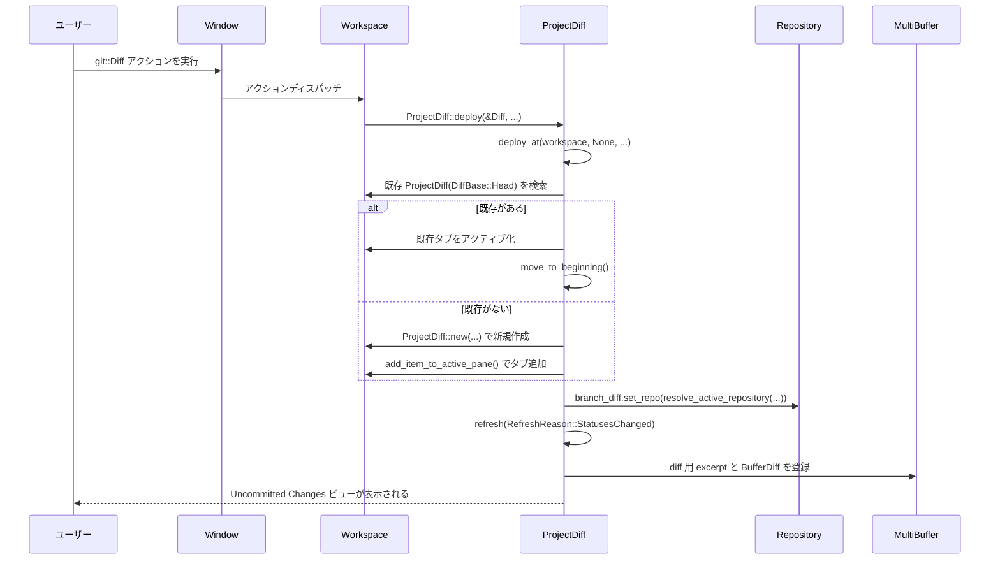

このメッセージでは、`git_ui` クレート配下のコード（chunk 1/2, mode: code）が提示されていますが、「何をしてほしいか」（例: ディレクトリ全体の解説レポートを作る / 特定ファイルを説明する / リファクタ提案を出す 等）の明示的な依頼は含まれていません。

- 現時点で把握しているのは、`git_ui` クレート内に以下のような UI コンポーネントが含まれているということです（ごく粗い分類）:
  - Git 認証用モーダル（`askpass_modal.rs`）
  - Git blame 表示 UI（`blame_ui.rs`）
  - ブランチ選択・作成・リモート設定 UI（`branch_picker.rs`）
  - リポジトリの clone ダイアログ / ワークツリー追加処理（`clone.rs`）
  - コミットメッセージ生成プロンプト（`commit_message_prompt.txt`）
  - コミットモーダル（`commit_modal.rs`）
  - コミットツールチップ（`commit_tooltip.rs`）
  - コミットビュー（差分＋メタデータ表示, `commit_view.rs`）
  - マージコンフリクト表示と解決支援（`conflict_view.rs`）
  - 単一ファイルの diff ビュー（`file_diff_view.rs`）
  - ファイルごとのコミット履歴ビュー（`file_history_view.rs`）
  - 大規模な Git パネル本体（`git_panel.rs`）

このあと想定されるパターンとしては、例えば次のようなものがあります。

- chunk 2/2 のコードが送られたあとで  
  「このディレクトリ全体の解説レポートを書いてほしい」  
  「特に `git_panel.rs` の構造と主要なフローを説明してほしい」  
  といった具体的な依頼が来る
- ある特定ファイル（例: `branch_picker.rs` や `conflict_view.rs`）だけを詳しく解説してほしい、などの依頼が来る

そのため、次のいずれかを教えていただければ、ガイドラインに沿った日本語の解説レポートを作成できます。

1. **どの範囲を対象にするか**
   - `git_ui` ディレクトリ全体
   - あるいは特定ファイル（例: `git_panel.rs` だけ、`branch_picker.rs` だけ など）

2. **どのレベルの解説が必要か**
   - 「ざっくり概要だけでよい」
   - 「主要な型・関数の役割と、典型的なフローまで詳しく」
   - 「実際にどう呼び出して使うかのコード例が欲しい」 など

3. もし chunk 2/2 がまだであれば  
   - 「まず全チャンクを読み込んでから、ディレクトリ全体の解説をしてほしい」  
   といった指示をいただければ、次チャンクも踏まえた上でまとめます。

ご希望の対象範囲と深さを指定していただければ、それに合わせた構成（0. ざっくり一言〜7. 関連ファイル）で解説レポートを作成します。

---

# git_ui/ ディレクトリ

## 0. ざっくり一言

`git_ui` ディレクトリは、エディタ内の Git 連携 UI をまとめたモジュール群です。  
Git パネル、プロジェクト全体の差分ビュー、ブランチ／ワークツリー／スタッシュのピッカー、リモート操作の結果表示など、Git 操作に関わる画面とロジックを提供します。

---

## 1. このモジュールの役割

### 1.1 概要

- このディレクトリは、エディタにおける **Git 操作 UI 一式** を実装しています。
- 具体的には以下のような用途を担います。
  - 作業ツリーの変更一覧とステージング／コミットを行う Git パネル
  - プロジェクト全体の diff を表示する `ProjectDiff` ビュー
  - ブランチ／ワークツリー／スタッシュ選択用の各種ピッカー
  - クリップボードと選択範囲の差分表示 (`TextDiffView`)
  - リモート操作（fetch/pull/push）の結果メッセージ整形とトースト表示

### 1.2 アーキテクチャ内での位置づけ

このディレクトリ内の主なコンポーネントと外部モジュールとの関係を、簡略化した依存関係図で示します。

```mermaid
graph TD
    App[gpui::App / Window] -->|init 時に登録| git_ui_init[git_ui::init]

    git_ui_init --> GitPanel
    git_ui_init --> ProjectDiff
    git_ui_init --> GitPicker
    git_ui_init --> RepositorySelector
    git_ui_init --> StashList
    git_ui_init --> WorktreeList
    git_ui_init --> TextDiffView
    git_ui_init --> MultiDiffView

    Workspace -->|panel() / toggle_modal()| GitPanel
    Workspace --> ProjectDiff
    Workspace --> GitPicker
    Workspace --> RepositorySelector
    Workspace --> StashList
    Workspace --> WorktreeList

    GitPanel -->|ステータス取得| Repository
    ProjectDiff -->|diff 元データ| Repository
    GitPicker --> Repository
    RepositorySelector --> Repository

    ProjectDiff --> GitPanelSettings
    ProjectDiff --> GitPanelAddon
    ProjectDiff --> BufferDiff
    TextDiffView --> BufferDiff
    MultiDiffView --> BufferDiff

    GitPanel --> remote_output
```

※ `Repository` は `project::git_store::Repository` 型を表します。

### 1.3 設計上のポイント

コードから読み取れる設計上の特徴は次の通りです。

- **Workspace 中心の登録**
  - `git_ui::init` が `Workspace` に対して複数の Git 関連アクションを登録し、そこから各 UI コンポーネントへ処理を委譲する構造になっています。
- **ビュー単位の `Item` 実装**
  - `ProjectDiff`, `MultiDiffView`, `TextDiffView` は `workspace::Item` を実装し、タブとして扱える独立したビューになっています。
- **非同期・バックグラウンド処理の活用**
  - リポジトリ状態の取得や diff 計算は `window.spawn` / `cx.spawn_in` を用いてバックグラウンドで行われ、刷新時も UI スレッドを極力ブロックしないようになっています。
- **設定連動**
  - `GitPanelSettings` や `SettingsStore` を参照し、ソート方法（`sort_by_path`）、ツリービュー表示、スクロールバー表示など UI の挙動をユーザー設定に応じて切り替えています。
- **エディタ Addon の利用**
  - `ProjectDiff` は `GitPanelAddon` や `ConflictAddon`、`BranchDiffAddon` などをエディタに登録し、diff 表示やコンフリクト状態に応じた動作をカスタマイズしています。
- **エラー表示の一元化**
  - Git 操作失敗時のトースト表示・ログ表示を `show_error_toast` / `remote_output::format_output` でまとめて扱う設計になっています。

---

## 2. 主要な機能一覧

このディレクトリが提供する主な機能を列挙します。

- Git パネル (`GitPanel`)
  - 変更ファイル一覧の表示、ステージング／アンステージング、コミット、fetch/pull/push などの操作。
- プロジェクト diff ビュー (`ProjectDiff`)
  - 現在の HEAD と作業ツリー／インデックスの差分表示、およびブランチ差分表示（`DiffBase::Merge`）。
- ブランチ／ワークツリー／スタッシュ ピッカー
  - `GitPicker`（タブ切り替え型ピッカー）
  - `WorktreeList`（ワークツリー選択・作成・削除）
  - `StashList`（スタッシュの一覧表示・適用・pop・削除）
- リポジトリセレクタ (`RepositorySelector`)
  - マルチリポジトリ環境でアクティブな Git リポジトリを切り替える。
- クリップボード diff ビュー (`TextDiffView`)
  - 選択範囲とクリップボード内容とのテキスト差分表示。
- 複数ファイル diff ビュー (`MultiDiffView`)
  - 複数のファイルペアの差分を 1 つのビューに集約して表示。
- リモート操作結果の整形 (`remote_output`)
  - fetch/pull/push 実行結果から成功メッセージや PR/MR のリンクを抽出。
- 汎用オプション選択ダイアログ (`PickerPrompt`)
  - 文字列リストから fuzzy 検索付きで 1 つを選択するモーダル。
- ブランチリネーム／クローンモーダル
  - `RenameBranchModal`, `GitCloneModal` によるブランチ名の変更・リポジトリ clone UI。
- Git ステータスアイコン (`GitStatusIcon` / `git_status_icon`)
  - ファイルの Git 状態（追加／変更／削除／コンフリクト）に応じたアイコン描画。

---

## 4. 関数・構造体の解説

### 4.1 型一覧（構造体・列挙体など）

代表的な公開型を一覧にします。

| 名前 | 種別 | 役割 / 用途 |
|------|------|-------------|
| `GitPanel` | 構造体 | Git パネル（変更一覧・ステージング・コミットなど）を表すメイン UI コンポーネント。|
| `GitPanelSettings` | 構造体 | Git パネルの表示・動作に関する設定（ソート方法、スクロールバー、アイコン表示など）。|
| `GitPicker` | 構造体 | ブランチ／ワークツリー／スタッシュをタブで切り替えるピッカー UI。|
| `GitPickerTab` | 列挙体 | `Worktrees`, `Branches`, `Stash` のいずれのタブかを表す。|
| `RepositorySelector` | 構造体 | アクティブな Git リポジトリを選択するモーダル。|
| `WorktreeList` | 構造体 | ワークツリー一覧＋新規作成・削除・オープン操作を提供するピッカー。|
| `StashList` | 構造体 | スタッシュ一覧＋適用／pop／diff 表示／削除操作を提供するピッカー。|
| `ProjectDiff` | 構造体 | プロジェクト全体の diff ビュー（HEAD / default branch との diff）。|
| `ProjectDiffToolbar` | 構造体 | `ProjectDiff` 用のツールバー。ステージ／アンステージ、次／前の hunk、Commit ボタンなどを提供。|
| `BranchDiffToolbar` | 構造体 | ブランチ diff ビュー用ツールバー。差分行数・レビュー関連ボタンを提供。|
| `MultiDiffView` | 構造体 | 複数ファイルの diff を 1 画面にまとめるビュー。|
| `TextDiffView` | 構造体 | クリップボードと選択範囲の差分を表示するビュー。|
| `RemoteAction` | 列挙体 | `Fetch` / `Pull` / `Push` などリモート操作の種別と対象を表す。|
| `SuccessMessage` | 構造体 | リモート操作成功時のメッセージと表示スタイル（トースト／ログ／PRリンク）を保持。|
| `GitStatusIcon` | コンポーネント構造体 | ファイルの `FileStatus` に応じたステータスアイコンを描画する UI コンポーネント。|
| `PickerPrompt` | 構造体 | 汎用的な文字列選択モーダル。|
| `WorktreeListDelegate` / `StashListDelegate` / `RepositorySelectorDelegate` | 構造体 | 各 `Picker` の挙動（マッチング、確定時の処理、描画）を実装するデリゲート。|

この他にもテスト専用補助型や内部用型がありますが、ここでは主に外部から利用される／他モジュールと連携する型に絞っています。

---

### 4.2 関数詳細（最大 7 件）

#### 1. `git_ui::init(cx: &mut App)`

**概要**

- アプリケーション起動時に呼び出される初期化関数です。
- Editor／Workspace の生成をフックし、Git 関連 UI コンポーネントとアクション（コマンド）を登録します。

**引数**

| 引数名 | 型 | 説明 |
|--------|----|------|
| `cx` | `&mut gpui::App` | アプリケーション全体のコンテキスト。新しい `Workspace` や `Editor` を監視し、グローバル設定を参照するために使われます。 |

**戻り値**

- 戻り値はありません。副作用としてアプリケーションに対し Git 関連機能を登録します。

**内部処理の流れ**

1. `editor::set_blame_renderer` により、エディタのブレーム表示用レンダラを Git 用に差し替えます。
2. `commit_view::init(cx)` を呼び出し、コミットビュー関連の初期化を行います。
3. `cx.observe_new(|editor: &mut Editor, _, cx| { ... })` により、新規に作成される `Editor` に対してコンフリクト表示用の `conflict_view::register_editor` を登録します。
4. `cx.observe_new(|workspace: &mut Workspace, _, cx| { ... })` により、新しい `Workspace` ごとに以下を登録します。
   - `ProjectDiff::register(workspace, cx)`
   - `CommitModal::register(workspace)`
   - `git_panel::register(workspace)`
   - `repository_selector::register(workspace)`
   - `git_picker::register(workspace)`
   - `conflict_view::register_conflict_notification(workspace, cx)`
5. `Workspace` に紐付く `Project` が read-only か、コラボ経由かを確認し、条件に応じて以下のアクションを登録します。
   - 通常プロジェクト向け: `CreatePullRequest`, `Fetch`, `FetchFrom`, `Push`, `PushTo`, `ForcePush`, `Pull`, `PullRebase` → `GitPanel` 上のメソッドを呼び出す。
   - 共通: `StashAll`, `StashPop`, `StashApply`, `StageAll`, `UnstageAll`, `Uncommit`, `Init`, `Clone`, `OpenModifiedFiles`, `RenameBranch`, `FileHistory`, `DiffClipboardWithSelectionData` など。

**Examples（使用例）**

アプリケーションの起動時に Git UI を有効化する例です。

```rust
use gpui::App;
use crate::git_ui; // git_ui モジュールへのパスはプロジェクト構成に応じて調整する

fn main() {
    gpui::run(|mut cx: App| {
        // ... ほかのサブシステムの初期化 ...

        git_ui::init(&mut cx); // Git 関連 UI を登録する
        // 以降、新しい Workspace が作られるたびに Git パネル等が利用可能になる
    });
}
```

**Edge cases（エッジケース）**

- `Project::is_read_only(cx)` が `true` の場合、Git 操作系アクション（fetch/pull/push など）は登録されません。
- `project.is_via_collab()` が `true` の場合は、コラボレーション環境での制約のため、一部アクションが登録されません。

**使用上の注意点**

- この関数は通常アプリケーション起動時に **一度だけ** 呼び出します。
- すでに `Workspace` が存在する状態で追加で呼び出すと、期待しない重複登録が起きる可能性があります（コード上は制御していません）。

---

#### 2. `resolve_active_repository(workspace: &Workspace, cx: &App) -> Option<Entity<Repository>>`

**概要**

- Git 操作の対象となる `Repository`（リポジトリ）を、Workspace の状態（アクティブワークツリーのオーバーライドなど）を考慮して解決します。
- `git_picker`, `ProjectDiff`, `GitPanel` など、複数のコンポーネントから共通して利用されます。

**引数**

| 引数名 | 型 | 説明 |
|--------|----|------|
| `workspace` | `&Workspace` | 対象ワークスペース。アクティブな worktree や project を参照します。 |
| `cx` | `&App` | グローバルコンテキスト。`Project` や `GitStore` を読むために使用されます。 |

**戻り値**

- `Some(Entity<Repository>)` : Git 操作対象のリポジトリ。
- `None` : 適切なリポジトリが見つからなかった場合。

**内部処理の流れ**

1. `project = workspace.project().read(cx)` で `Project` を取得します。
2. `workspace.active_worktree_override()` が設定されている場合:
   - 対応する worktree を `project.worktree_for_id` で取得。
   - その worktree の絶対パス `worktree_abs_path` を取得。
   - `project.git_store().read(cx).repositories().values()` から全リポジトリを列挙。
   - `repo.work_directory_abs_path` が `worktree_abs_path` と一致、もしくは `worktree_abs_path` を prefix に持つリポジトリのみを対象にし、その中から **パス長が最長のもの**（=最も深い階層のリポジトリ）を選択。
3. 上記で見つからなかった場合は `project.active_repository(cx)` を使用。
4. いずれも見つからなければ `None` を返します。

**Examples（使用例）**

`GitPicker` からアクティブリポジトリを取得する例です（実際のコードとほぼ同じ構造）。

```rust
use project::git_store::Repository;
use workspace::Workspace;
use gpui::{App, Entity};

fn active_repo(workspace: &Workspace, cx: &App) -> Option<Entity<Repository>> {
    crate::git_ui::resolve_active_repository(workspace, cx)
}
```

**Edge cases（エッジケース）**

- Workspace に複数の worktree / repository が存在する場合:
  - `active_worktree_override` が設定されていれば、それに対応するリポジトリを優先します。
  - その worktree 配下に nested なリポジトリが複数ある場合、最も深いパスのものが選ばれます。
- `active_worktree_override` が未設定か、対応するリポジトリが存在しない場合は、単に `Project::active_repository` にフォールバックします。

**使用上の注意点**

- `None` が返る可能性があるため、呼び出し側では必ず `Option` をチェックする必要があります。
- 大きなモノレポで複数の Git リポジトリが混在する場合、この関数の選択基準（最長パス）に依存する点を意識しておく必要があります。

---

#### 3. `ProjectDiff::deploy_at(workspace, entry, window, cx)`

```rust
pub fn deploy_at(
    workspace: &mut Workspace,
    entry: Option<GitStatusEntry>,
    window: &mut Window,
    cx: &mut Context<Workspace>,
)
```

**概要**

- プロジェクト diff ビュー (`ProjectDiff`) を開き、必要に応じて既存ビューを再利用し、指定されたファイルエントリ位置へスクロールします。
- Git パネルからの「Diff を開く」操作や `git::Diff` アクションから呼ばれます。

**引数**

| 引数名 | 型 | 説明 |
|--------|----|------|
| `workspace` | `&mut Workspace` | アクティブなワークスペース。タブの追加やアクティブ化に利用します。 |
| `entry` | `Option<GitStatusEntry>` | Git パネルのステータスエントリ。`Some` の場合、そのファイル位置にスクロールします。 |
| `window` | `&mut Window` | ウィンドウコンテキスト。フォーカスやアクションディスパッチに利用します。 |
| `cx` | `&mut Context<Workspace>` | Workspace 用の gpui コンテキスト。 |

**戻り値**

- 戻り値はありません。`ProjectDiff` タブを開いたり、既存タブを再利用したりします。

**内部処理の流れ**

1. Telemetry イベントを送信し、呼び出し元の情報（Git パネルからか、アクションからか）を記録します。
2. `resolve_active_repository` を使って、意図したリポジトリ (`intended_repo`) を取得します。
3. すでに `DiffBase::Head` の `ProjectDiff` が開かれているか確認します。
   - あればそれをアクティブ化し、`move_to_beginning` で先頭にスクロール。
   - なければ `ProjectDiff::new` で新規インスタンスを作成し、アクティブペインに追加。
4. `intended_repo` が `Some` の場合:
   - 現在の `branch_diff.repo()` と異なるリポジトリであれば `branch_diff.set_repo(Some(intended_repo))` で切り替えます。
5. `entry` が `Some` の場合:
   - `move_to_entry(entry, window, cx)` を呼び出し、該当ファイルの diff 位置にスクロールします。

**Examples（使用例）**

Git パネルから diff ボタンを押した際に呼ぶイメージです（簡略化）。

```rust
use workspace::Workspace;
use gpui::{Window, Context};
use crate::git_panel::GitStatusEntry;
use crate::project_diff::ProjectDiff;

fn open_diff_for_entry(
    workspace: &mut Workspace,
    status_entry: GitStatusEntry,
    window: &mut Window,
    cx: &mut Context<Workspace>,
) {
    ProjectDiff::deploy_at(workspace, Some(status_entry), window, cx);
}
```

**Edge cases（エッジケース）**

- アクティブなリポジトリが見つからない場合でも、既存 `ProjectDiff` があればそれを再利用します（`intended_repo` が `None` なだけです）。
- `entry` の repo_path が、`branch_diff` 側でまだロードされていない場合は、`move_to_entry` 内で `pending_scroll` に記録され、後続の `refresh` 完了時にスクロールされます。

**使用上の注意点**

- `Workspace` と `Window` の両方がミューテーブルで必要になるため、呼び出し側で同時に他の UI 更新を行う場合は borrow の衝突に注意します。
- `entry` を渡さない (`None`) 場合、単に `ProjectDiff` タブを開くだけの挙動になります。

---

#### 4. `ProjectDiff::refresh(this: WeakEntity<Self>, reason: RefreshReason, cx: &mut AsyncWindowContext) -> Result<()>`

**概要**

- リポジトリのステータス・diff 情報を取得し直し、`ProjectDiff` の `MultiBuffer` と diff 表示を更新する非同期タスクです。
- ステータス変更・diff の更新・保存イベント（`EditorSaved`）に応じて呼ばれます。

**引数**

| 引数名 | 型 | 説明 |
|--------|----|------|
| `this` | `WeakEntity<ProjectDiff>` | 対象となる `ProjectDiff` の弱参照。 |
| `reason` | `RefreshReason` | 更新の理由（`DiffChanged` / `StatusesChanged` / `EditorSaved`）。 |
| `cx` | `&mut AsyncWindowContext` | 非同期ウィンドウコンテキスト。UI 更新やバックグラウンド処理を行うために使用されます。 |

**戻り値**

- `anyhow::Result<()>` : 成功／失敗を表します。失敗時は呼び出し側でログや通知を行います。

**内部処理の流れ（簡略）**

1. `this.update` により `branch_diff.load_buffers(cx)` を呼び、ロードすべきファイル群と、現在のリポジトリ (`repo`) を取得します。
2. 現在 `MultiBuffer` に登録されているパス一覧（`previous_paths`）を取得し、新しいエントリ群と比較して、「削除すべきパス」を計算します。
3. 削除対象パスごとに:
   - 対応する `Buffer` が存在し、`reason` が `DiffChanged` / `EditorSaved` で、かつその buffer が `is_dirty()` の場合は削除をスキップ（ローカル編集を保護）。
   - それ以外は `buffer_diff_subscriptions` を解除し、`editor.remove_excerpts_for_path` で diff を削除。
4. 次に、`buffers_to_load` 内の各エントリに対して `entry.load.await` を実行し、`(buffer, diff)` ペアを取得します。
   - 遅延や多数のファイルに対応するため、各ループ毎に `yield_now().await` で他タスクに処理を譲ります。
   - すでに同じ buffer / diff が登録済みで、かつ `DiffChanged` / `EditorSaved` かつ buffer が dirty な場合はスキップします。
   - そうでなければ `register_buffer` で `MultiBuffer` とエディタに excerpt / diff を登録します。必要に応じて fold 対象 buffer を収集します。
5. 最後に、fold すべき buffer の一覧を `editor.fold_buffers` で畳み、`pending_scroll` があればスクロールを実施し、`cx.notify()` で再描画を通知します。

**Examples（使用例）**

この関数は通常、内部からのみ呼び出されます（例: `handle_editor_event` や `BranchDiffEvent::FileListChanged`）。呼び出しイメージは以下の通りです。

```rust
// EditorEvent::Saved ハンドラ内（簡略化）
self._task = cx.spawn_in(window, async move |this, cx| {
    ProjectDiff::refresh(this, RefreshReason::EditorSaved, cx).await
});
```

**Errors / Panics**

- `branch_diff.load_buffers` や `entry.load.await` がエラーを返すと、そのエラーを `Result` として上位へ返します。
- 非同期更新中に `ProjectDiff` が破棄された場合（`WeakEntity` から `upgrade` できない場合）は `this.update` が `Err` となり、そのまま戻り値に反映されます。

**Edge cases（エッジケース）**

- **dirty buffer の扱い**:
  - `DiffChanged` / `EditorSaved` の場合、dirty な buffer に対しては既存 excerpt を削除しない設計です。これにより、保存していないローカル編集が diff 更新で失われることを防ぎます。
- **大量ファイル**:
  - `yield_now().await` により、非常に多くのファイルの diff を扱う場合でも UI スレッドが占有されにくくなるよう配慮されています。
- **pending_scroll**:
  - diff がまだ準備できていない状態（`move_to_path` が失敗した場合）では `pending_scroll` に記録し、この `refresh` 完了後にスクロールが実行されます。

**使用上の注意点**

- 外部コードから直接呼び出すよりも、`ProjectDiff` が自分でスケジューリングするパターンに従うことが想定されています。
- `AsyncWindowContext` を用いるため、呼び出し側は `window.spawn` / `cx.spawn_in` 経由でタスクとして実行する必要があります。

---

#### 5. `TextDiffView::open(diff_data, workspace, window, cx) -> Option<Task<Result<Entity<Self>>>>`

**概要**

- アクティブエディタの選択範囲とクリップボード内容との diff ビューを開きます。
- 選択範囲が空の場合は、その buffer 全体を対象として diff を表示します。

**引数**

| 引数名 | 型 | 説明 |
|--------|----|------|
| `diff_data` | `&DiffClipboardWithSelectionData` | クリップボードのテキストと対象エディタのハンドル。 |
| `workspace` | `&Workspace` | ビューを追加する対象ワークスペース。 |
| `window` | `&mut Window` | ウィンドウコンテキスト（タブ追加・フォーカス用）。 |
| `cx` | `&mut App` | グローバルコンテキスト。 |

**戻り値**

- `Some(Task<Result<Entity<TextDiffView>>>)` : diff ビュー生成を行う非同期タスク。
- `None` : 選択範囲に対応する buffer が特定できないなどの理由で diff を生成できない場合。

**内部処理の流れ（概略）**

1. `source_editor.update` で現在の選択範囲を取得し、`MultiBuffer` 上の anchor を単一 buffer の `Range<Point>` に変換します。
   - 選択範囲が空の場合は buffer 全体 (`0,0` 〜 `max_point`) を対象とします。
   - 選択範囲が存在する場合は、行頭〜行末単位まで拡張します。
2. エディタの選択状態も、計算した範囲に合わせて更新します（ユーザーに「ここが diff 対象範囲」であることを示すため）。
3. `source_buffer.snapshot()` と クリップボードテキストから `BufferDiff` と `clipboard_buffer` を構築します。
4. `window.spawn` で非同期タスクを起動し、`update_diff_buffer` で diff 計算を実行した後、`TextDiffView::new` を呼んで `SplittableEditor` ベースの diff ビューを作成し、アクティブペインにタブとして追加します。
5. `TextDiffView` 内では `watch::channel` で source buffer の変更を監視し、250ms デバウンス (`RECALCULATE_DIFF_DEBOUNCE`) しながら diff を再計算します。

**Examples（使用例）**

`DiffClipboardWithSelectionData` を受け取るアクションハンドラから呼び出す典型例です（実際の `git_ui::init` 内と同様）。

```rust
use workspace::Workspace;
use gpui::{Window, Context};
use editor::actions::DiffClipboardWithSelectionData;
use crate::text_diff_view::TextDiffView;

fn handle_diff_clipboard(
    workspace: &mut Workspace,
    action: &DiffClipboardWithSelectionData,
    window: &mut Window,
    cx: &mut Context<Workspace>,
) {
    if let Some(task) = TextDiffView::open(action, workspace, window, cx.app()) {
        task.detach(); // 非同期に diff ビューを開く
    }
}
```

**Edge cases（エッジケース）**

- 選択範囲が `MultiBuffer` 上で複数 buffer にまたがっている場合など、`anchor_range_to_buffer_anchor_range` が `None` を返すと `None` を返して終了します。
- クリップボードテキストが改行で終わっていない場合、自動的に末尾に `\n` が追加されます（diff が行単位で安定するようにするため）。

**使用上の注意点**

- 戻り値が `Option` である点に注意し、`None` の場合は UI 側で何もしない等の処理が必要です。
- diff 再計算は source buffer の編集／reparse に反応して自動で行われるため、呼び出し側で明示的に更新する必要はありません。

---

#### 6. `MultiDiffView::open(diff_pairs, workspace, window, cx) -> Task<Result<Entity<Self>>>`

**概要**

- 指定された複数のファイルペア（旧パス／新パス）について diff を作成し、1 つのビューにまとめて表示します。
- 例として、「ある操作で変更されたファイル群の diff をまとめて確認する」といった用途を想定しています。

**引数**

| 引数名 | 型 | 説明 |
|--------|----|------|
| `diff_pairs` | `Vec<[String; 2]>` | `[旧ファイルパス, 新ファイルパス]` のペア一覧。パスはプロジェクトルートからの相対または絶対パス文字列。 |
| `workspace` | `&Workspace` | ビューを追加するワークスペース。 |
| `window` | `&mut Window` | ウィンドウコンテキスト。 |
| `cx` | `&mut App` | グローバルコンテキスト。 |

**戻り値**

- `Task<Result<Entity<MultiDiffView>>>` : diff ビューを構築してタブに追加する非同期タスク。

**内部処理の流れ**

1. `project = workspace.project().clone()` と `workspace.weak_handle()` を取得します。
2. 背景の context lines 設定を `multibuffer_context_lines(cx)` から取得します。
3. `window.spawn` で非同期タスクを起動し、その中で:
   - `load_entries(diff_pairs, &project, cx)` を呼び出して各ペアについて:
     - `Project::open_local_buffer` で旧／新 buffer を開く。
     - `build_buffer_diff` で diff を計算。
     - `Entry { index, new_path, new_buffer, diff }` のベクタと共通ルートパス（`common_root`）を構築。
   - `workspace.update_in` で UI スレッドに戻り:
     - `MultiBuffer::new` を作成し、全 diff hunk を excerpt として登録（`register_entry`）。
     - `Editor::for_multibuffer` で diff 用エディタを作成し、`MultiDiffView` を生成。
     - アクティブペインにタブを追加。
     - 左ドック（ファイルツリー）を閉じて diff に集中できるようにする。

**Examples（使用例）**

複数ファイルの diff ビューを開く簡単な例です。

```rust
use workspace::Workspace;
use gpui::{Window, App};
use crate::multi_diff_view::MultiDiffView;

fn show_multi_diff(
    workspace: &Workspace,
    window: &mut Window,
    cx: &mut App,
) {
    // 旧→新ファイルのペアを指定
    let pairs = vec![
        ["src/old_a.rs".to_string(), "src/new_a.rs".to_string()],
        ["src/old_b.rs".to_string(), "src/new_b.rs".to_string()],
    ];

    let task = MultiDiffView::open(pairs, workspace, window, cx);
    task.detach(); // 非同期に開く
}
```

**Edge cases（エッジケース）**

- 各ペアの旧パス／新パスが存在しない、または buffer のオープンに失敗した場合は `Err` を返します。
- `common_prefix` の計算結果により、タブ内で表示される相対パスは以下のように決まります。
  - 共通ルートが見つかれば、その配下の相対パス。
  - 見つからなければ、ファイル名のみ。

**使用上の注意点**

- `diff_pairs` の順序が、そのままビュー内のソート順（`PathKey::with_sort_prefix(index, ...)`）になります。
- 非同期タスクなので、呼び出し直後にはビューが存在しない可能性があります。必要であれば `await` して `Entity<MultiDiffView>` を取得してください。

---

#### 7. `remote_output::format_output(action: &RemoteAction, output: RemoteCommandOutput) -> SuccessMessage`

**概要**

- Git のリモート操作コマンド（fetch / pull / push）の標準出力／標準エラーを解析し、ユーザーに表示する成功メッセージとそのスタイルを決定します。
- PR/MR 作成リンクなどもここで検出されます。

**引数**

| 引数名 | 型 | 説明 |
|--------|----|------|
| `action` | `&RemoteAction` | 実行したリモート操作 (`Fetch`, `Pull`, `Push`) と対象リモートなど。 |
| `output` | `RemoteCommandOutput` | `stdout` と `stderr` を含むコマンド実行結果。 |

**戻り値**

- `SuccessMessage { message: String, style: SuccessStyle }`
  - `message` : トーストなどに表示するメインメッセージ。
  - `style` :
    - `SuccessStyle::Toast` : 短いトーストのみ。
    - `SuccessStyle::ToastWithLog { output }` : トーストと、必要に応じてログビューにフル出力を表示できるようにする。
    - `SuccessStyle::PushPrLink { text, link }` : push 後に PR/MR 作成・閲覧リンクを提示する。

**内部処理の主な分岐**

1. **Fetch**
   - `stderr` が空 → 「Fetch: Already up to date」+ `Toast`
   - `stderr` が非空 → `message` は「Synchronized with {remote.name}」などにし、`ToastWithLog`。
2. **Pull**
   - `stdout` が `"Already up to date.\n"` で終了 → 「Pull: Already up to date」+ `Toast`
   - `stdout` が `"Updating..."` で始まる:
     - 最終行の先頭数値を `files_changed` としてパースし、`"Received {n} file change(s) from {remote.name}"` といったメッセージを生成（パース失敗時は `"Fast forwarded from ..."`）。
   - `stdout` が `"Merge"` で始まる: `"Merged ... from {remote.name}"` 形式。
   - `stdout` に `"Successfully rebased"` を含む: `"Successfully rebased from {remote.name}"`。
   - それ以外: `"Successfully pulled from {remote.name}"`。
3. **Push**
   - `stderr` が `"Everything up-to-date\n"` で終わる:
     - 「Push: Everything is up-to-date」+ `Toast`。
   - それ以外:
     - `stderr` に `"\nremote: "` を含む場合、`linkify` を用いて `remote:` 行の URL を抽出。
       - テキストに以下のようなヒント文字列が含まれていれば、対応する `PushPrLink` を返す。
         - `"Create a pull request"` → `"Create Pull Request"`
         - `"Create pull request"` → `"Create Pull Request"`
         - `"create a merge request"` → `"Create Merge Request"`
         - `"View merge request"` → `"View Merge Request"`
     - リンクが見つからなければ `ToastWithLog { output }`。

**Examples（使用例）**

```rust
use git::repository::{Remote, RemoteCommandOutput};
use crate::remote_output::{RemoteAction, format_output, SuccessStyle};

fn handle_push_result(remote: RemoteCommandOutput) {
    let action = RemoteAction::Push("main".into(), Remote { name: "origin".into() });
    let success = format_output(&action, remote);

    match success.style {
        SuccessStyle::Toast => {
            // 短いトーストのみ表示
        }
        SuccessStyle::ToastWithLog { output } => {
            // トーストのほか、詳細ログビュー（GitPanel の出力ウィンドウなど）に output を表示
        }
        SuccessStyle::PushPrLink { text, link } => {
            // 「Create Pull Request」ボタンなどを表示し、link をブラウザで開く
        }
    }
}
```

**Edge cases（エッジケース）**

- `get_changes` の中で最終行のパースに失敗した場合（フォーマットが変わった等）、ログにエラーを出しつつ `files_changed` は `None` となり、フォールバックメッセージが使われます。
- push 時の PR/MR リンク検出は、`remote:` で始まる行のうち URL を含む最初のリンクを対象にしています。SSH 警告など `remote:` 以外の行に含まれる URL は無視されます（テストから確認できます）。

**使用上の注意点**

- この関数は純粋にメッセージとスタイルを決めるだけで、実際のトースト表示やログビューの管理は呼び出し側の責務です。
- Git の出力フォーマットに依存しているため、将来フォーマット変更があった場合はこの関数のロジック更新が必要になります。

---

### 4.3 その他の関数・メソッド（抜粋）

| 関数名 / メソッド名 | 所属 | 役割（1 行） |
|---------------------|------|--------------|
| `show_error_toast` | `git_panel.rs` | Git 操作失敗時にエラートーストを表示し、「View Log」で詳細ログエディタを開く。 |
| `GitPanel::compress_commit_diff` | `git_panel.rs` | コミット diff を指定バイト数に収まるように行単位／hunk 単位でトリミングする。 |
| `GitPanel::suggest_commit_message` | `git_panel.rs` | ステージ済み／未ステージ状態に応じて「Update foo」等のコミットメッセージを提案する。 |
| `GitPicker::new` / `open_with_tab` | `git_picker.rs` | ブランチ／ワークツリー／スタッシュ用ピッカーを指定タブで開く。 |
| `open_modified_files` | `git_ui.rs` | GitPanel の `active_repository` から変更ファイルを列挙し、すべてエディタで開く。 |
| `git_status_icon` | `git_ui.rs` | `FileStatus` から `GitStatusIcon` コンポーネントを構築するヘルパー。 |
| `rename_current_branch` | `git_ui.rs` | 現在チェックアウト中のブランチ名変更用モーダルを開く。 |
| `PickerPrompt::prompt` | `picker_prompt.rs` | 文字列リストから 1 つを選ぶモーダルを開き、選択インデックスを `Task<Option<usize>>` として返す。 |
| `RepositorySelector::new` | `repository_selector.rs` | プロジェクト内の全 `Repository` を並べ、アクティブリポジトリにチェックを付けて表示する。 |
| `StashList::handle_show_stash` / `handle_drop_stash` | `stash_picker.rs` | 選択中スタッシュエントリの diff 表示・削除操作を行う。 |
| `WorktreeListDelegate::create_worktree` | `worktree_picker.rs` | 新しいワークツリーを作成し、ローカル／リモート環境に応じて新規ウィンドウや既存ウィンドウで開く。 |

---

## 5. データフロー

ここでは代表的なシナリオとして、「`git::Diff` アクションによる ProjectDiff ビューのオープン」と、その後の diff 更新フローを説明します。

### 5.1 Diff ビューを開くフロー



このフローの要点:

- Workspace に対して `git::Diff` がディスパッチされると、`ProjectDiff::deploy` → `deploy_at` が呼ばれます。
- 既存の `ProjectDiff`（`DiffBase::Head`）があれば再利用し、なければ新規タブを生成します。
- その後、アクティブなリポジトリを `resolve_active_repository` で取得し、branch diff の対象リポジトリに設定します。
- `refresh` によりリポジトリのステータスを読み込み、`MultiBuffer` に diff excerpt が並べられます。

### 5.2 diff 更新（保存／ステータス変化）フロー

- `EditorEvent::Saved` などが発生すると、`ProjectDiff::handle_editor_event` から `refresh(RefreshReason::EditorSaved)` が起動されます。
- `branch_diff.load_buffers` が現在のステータスに応じたファイル一覧と `load` タスクを返し、`refresh` がそれらを消化して `MultiBuffer` を更新します。
- dirty な buffer に対しては、上書きによるローカル変更の喪失を避けるため、既存 excerpt の削除／再登録が慎重に制御されています。

---

## 6. 使い方（How to Use）

### 6.1 基本的な使用方法

ここでは、アプリケーションに `git_ui` を組み込み、Git パネルと ProjectDiff を利用する最小構成の例を示します。

```rust
use gpui::{App, Window};
use workspace::Workspace;
use project::Project;

// アプリケーションのエントリポイント
fn main() {
    gpui::run(|mut app: App| {
        // Git UI サブシステムを初期化する
        crate::git_ui::init(&mut app);

        // 例: プロジェクトと Workspace の生成（実際にはもっと複雑な初期化が入る）
        let project = app.new(|cx| {
            // 仮のローカルプロジェクトを作成する
            Project::local(/* ルートパスなど */, cx)
        });

        app.open_window(Default::default(), move |window: &mut Window, cx| {
            cx.new(|cx| {
                // Workspace を作成し、project と紐づける
                let workspace = Workspace::new(None, project.clone(), /* app_state */ todo!(), window, cx);

                // 必要に応じて GitPanel は git_ui::init 内で自動的に登録される
                workspace
            })
        });
    });
}
```

上記のように `git_ui::init` を呼び出しておけば、`Workspace` 上で以下のようなアクションが利用可能になります。

- `git::Diff` : `ProjectDiff` を開く
- `git::StageAll` / `git::UnstageAll` : GitPanel で全ファイルをステージ／アンステージ
- `zed_actions::git::Branch` : ブランチピッカー (`GitPicker`) を開く
- `zed_actions::git::SelectRepo` : リポジトリセレクタを開く
- `DiffClipboardWithSelectionData` : `TextDiffView` を開く

### 6.2 よくある使用パターン

#### パターン 1: Git パネルから ProjectDiff を連携して使う

1. Git パネルで特定ファイルを選択。
2. 「Diff を開く」相当のアクションから `ProjectDiff::deploy_at(Some(entry), ...)` が呼ばれます。
3. `ProjectDiff` 上で hunk 単位のステージ／アンステージを行った後、ツールバーの `Commit` ボタンでコミットします。
4. Git パネルと ProjectDiff は `GitPanelAddon` を経由して連携しているため、どちらから操作してもステージ状態が同期されます。

#### パターン 2: クリップボードとのテキスト diff

1. 任意のファイルを開き、変更対象となる行をドラッグ選択します。
2. クリップボードに別バージョンのテキストをコピー。
3. `DiffClipboardWithSelectionData` アクション（ショートカット）を実行すると、`TextDiffView::open` が呼ばれ、選択範囲とクリップボードの差分が新しいタブに表示されます。
4. 元の buffer を編集すると、一定時間（250ms）ごとに diff が自動再計算されます。

#### パターン 3: ワークツリー管理

1. `zed_actions::git::Worktree` アクションで `WorktreeList` を開きます（あるいは `GitPicker` の Worktrees タブから）。
2. 既存のワークツリーを選んで `Enter` → 現在のウィンドウで開く。
3. `Shift+Enter` などのセカンダリアクションで新しいウィンドウにオープン。
4. 検索欄に新しいブランチ名を入力することで「Create Worktree: `<name>`…」エントリが表示され、そこから新規ワークツリーを作成可能です。

### 6.3 よくある間違い

```rust
// 間違い例: アクティブなリポジトリが無い状態で強制的に diff を開こうとする
fn wrong_open_diff(workspace: &mut Workspace, window: &mut Window, cx: &mut Context<Workspace>) {
    // resolve_active_repository を無視して何かしらの repo に依存した処理を書くと、
    // マルチリポジトリ・マルチワークツリー環境で動作が不正になる可能性がある。
    let _ = workspace.project().read(cx).git_store().read(cx).active_repository(); // 直接読む
    // ...
}

// 正しい例: ProjectDiff::deploy_at / resolve_active_repository に委譲する
fn correct_open_diff(workspace: &mut Workspace, window: &mut Window, cx: &mut Context<Workspace>) {
    crate::project_diff::ProjectDiff::deploy_at(workspace, None, window, cx);
}
```

```rust
// 間違い例: TextDiffView::open の戻り値を無視して unwrap する
let task = TextDiffView::open(&diff_data, workspace, window, cx).unwrap(); // パニックの可能性

// 正しい例: Option をチェックする
if let Some(task) = TextDiffView::open(&diff_data, workspace, window, cx) {
    task.detach();
}
```

### 6.4 使用上の注意点（まとめ）

- **アクティブリポジトリの存在**
  - 多くの機能（ProjectDiff, GitPicker, WorktreeList, StashList など）は `Repository` の存在を前提とします。`resolve_active_repository` や `Project::active_repository` が `None` の場合は、UI 側で適切に何もしない（ボタン無効など）の処理を行う必要があります。
- **非同期処理**
  - diff 計算やリポジトリ状態取得は非同期で行われるため、「操作直後に結果が出ていない」タイミングが存在します。呼び出し側は `Task` を `await` する、あるいは `detach` して UI イベントループに任せる設計になっています。
- **dirty buffer の保護**
  - `ProjectDiff::refresh` や `TextDiffView` の再計算では、dirty な buffer が不要に上書きされたり、excerpt が消えたりしないよう条件分岐が組まれています。外部から diff を強制的に再生成するようなコードを書く場合は、この挙動との整合性に注意が必要です。
- **設定との連動**
  - `GitPanelSettings` の `sort_by_path` / `tree_view` / `collapse_untracked_diff` などにより、GitPanel／ProjectDiff の並び順や折りたたみ挙動が変化します。テストコードでもこれらの設定を切り替えながら挙動を検証しているため、設定を増やす場合は ProjectDiff 側のロジックも合わせて確認する必要があります。

---

## 7. 関連ファイル

このディレクトリ内外で、Git UI モジュールと密接に関係するファイル・モジュールをまとめます。

| パス / モジュール | 役割 / 関係 |
|-------------------|------------|
| `git_ui/src/git_panel.rs` | Git パネル本体。変更一覧、ステージング／アンステージング、コミット、リモート操作トースト表示 (`show_error_toast`) などを提供。`GitPanelAddon` 経由で `ProjectDiff` と連携。 |
| `git_ui/src/git_panel_settings.rs` | `GitPanelSettings` の定義と `Settings` 実装。Git パネルの UI 設定を `SettingsStore` と紐付ける。 |
| `git_ui/src/project_diff.rs` | `ProjectDiff` ビュー、対応ツールバー、diff の永続化（DB）などを実装。Git パネルとステージング状態を共有。 |
| `git_ui/src/git_picker.rs` | ブランチ／ワークツリー／スタッシュ ピッカー (`GitPicker`) と、それぞれの embedded リスト（`BranchList` / `WorktreeList` / `StashList`）との橋渡し。 |
| `git_ui/src/worktree_picker.rs` | `WorktreeList` とそのデリゲート。ワークツリーの一覧／検索／新規作成／削除／オープンを扱う。削除エラー時には `show_error_toast` を利用。 |
| `git_ui/src/stash_picker.rs` | `StashList` と `StashListDelegate`。スタッシュ一覧、適用、pop、削除、diff 表示 (`CommitView::open`) を行う。 |
| `git_ui/src/repository_selector.rs` | マルチリポジトリ環境でアクティブリポジトリを切り替えるモーダルセレクタ。リポジトリごとの `FileStatus` 集約アイコンを表示。 |
| `git_ui/src/text_diff_view.rs` | `TextDiffView` 実装。`DiffClipboardWithSelectionData` アクションから呼ばれ、選択範囲とクリップボードの diff を表示。 |
| `git_ui/src/multi_diff_view.rs` | `MultiDiffView` 実装。複数ファイルペアの diff を 1 つのビューに集約する。 |
| `git_ui/src/remote_output.rs` | `RemoteAction` と `format_output` を定義。fetch/pull/push の CLI 出力からユーザー向けメッセージと PR/MR リンクを抽出。 |
| `git_ui/src/picker_prompt.rs` | 汎用的な文字列選択モーダル (`PickerPrompt`) とそのデリゲート。Git 機能に限らず、他の UI からも再利用可能な形で定義。 |
| `project` クレート / モジュール | `Project`, `FakeFs`, `git_store::Repository`, `branch_diff` などを提供し、Git UI 側のデータソースとなる。 |
| `git` クレート / モジュール | `status::FileStatus`, `repository::RepoPath`, `stash::StashEntry`, `repository::Remote` など、低レベル Git 操作用 API を提供。 |
| `editor` クレート | `Editor`, `SplittableEditor`, `MultiBuffer`, `EditorSettings` など、テキストエディタと diff 表示の基盤を提供する。 |
| `workspace` クレート | `Workspace`, `Item`, `ToolbarItemView`, 各種アクション登録など、タブ／パネル管理の基盤を提供。 |

これらのモジュールの上に `git_ui` ディレクトリのコンポーネントが構築されており、エディタに統合された Git ユーザーインターフェイスを形成しています。
