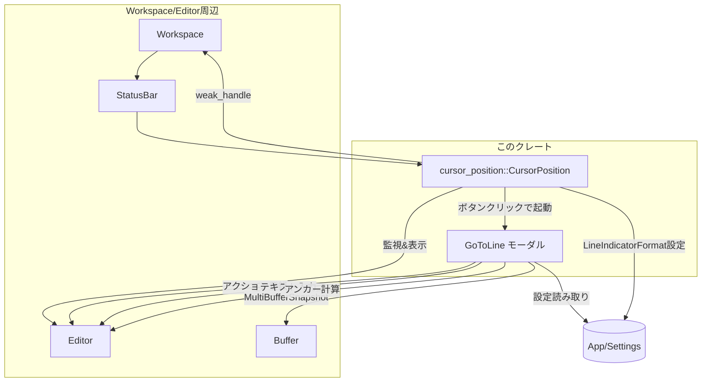
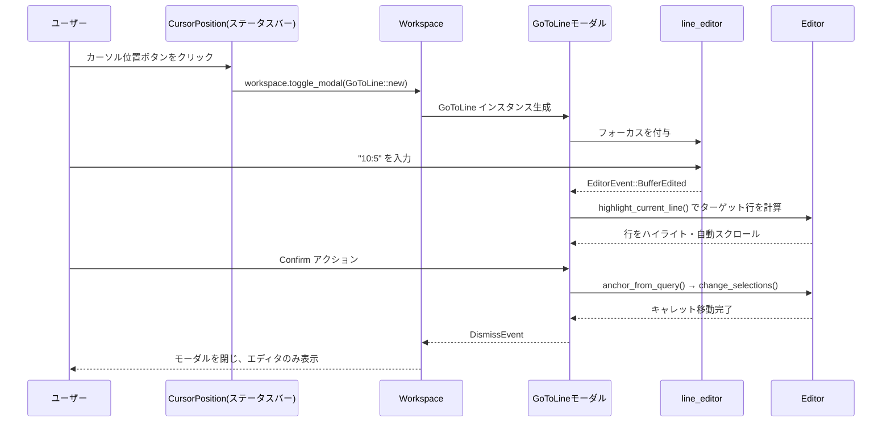

# go_to_line ディレクトリ解説

## 1. ざっくり一言

`go_to_line` クレートは、エディタ内の「行／列へ移動」モーダルと、ステータスバーに表示されるカーソル位置・選択範囲統計の表示を提供するモジュール群です。

---

## 2. このモジュールの役割

### 2.1 概要

- このクレートは、エディタで現在のカーソル位置や選択範囲の情報をユーザーに示し、  
  さらに「行／列番号」や「相対行指定」によって素早く移動するための UI を提供します。
- ステータスバーに「行:列」のボタンを表示し、そのクリックやキーボードショートカットから  
  「Go to Line/Column」モーダルを表示して、エディタのキャレットを変更します。
- 行・列や選択文字数は、マルチバッファ対応のスナップショットを用いて算出され、Unicode 文字も考慮されています。

### 2.2 アーキテクチャ内での位置づけ

主な関係を簡略化して示します。



- `Workspace` と `Editor` は外部クレートから提供されるエディタ本体です。
- `CursorPosition` は `Workspace` のステータスバーに配置され、アクティブな `Editor` の状態を監視します。
- `GoToLine` は `Editor` にアクションとして登録され、ショートカットやステータスバーから呼び出されるモーダルです。
- どちらのコンポーネントも `MultiBufferSnapshot` などを介してテキストバッファ状態を参照します。

### 2.3 設計上のポイント

- **責務分離**
  - `cursor_position.rs`:
    - カーソル位置と選択範囲統計を計算し、ステータスバーに表示する責務を持ちます。
  - `go_to_line.rs`:
    - 「行／列へ移動」モーダルの表示と、ユーザー入力に基づくカーソル移動／ハイライトを担当します。
- **状態管理**
  - `CursorPosition` は現在の `UserCaretPosition` と選択範囲の統計 (`SelectionStats`) を内部状態として保持します。
  - `GoToLine` はモーダル表示中のみ存在し、入力用 `Editor`・対象 `Editor`・スクロール位置などを保持します。
- **非同期更新とデバウンス**
  - カーソル位置の更新は `Task` と `Duration` を用いたデバウンス付き非同期処理で行われます（`UPDATE_DEBOUNCE` = 50ms）。
- **1 始まりのインデックス**
  - ユーザーに見せる行／列番号は `NonZeroU32` で表現され、常に 1 から始まります。
- **設定連携**
  - 行・選択情報の表示形式は `LineIndicatorFormat` 設定で Short/Long を切り替え可能です。

---

## 3. 主要な機能一覧

- ステータスバーに「行{区切り}列」のカーソル位置表示を行う
- ステータスバーに選択範囲の統計（行数／文字数／選択数）を表示する
- ステータスバーのボタンから「Go to Line/Column」モーダルを開く
- エディタアクション `editor::actions::ToggleGoToLine` を通じてモーダルを開く
- モーダルで下記形式の入力を解釈し、カーソルを移動する
  - 絶対行: `"10"`
  - 絶対行＋列: `"10{FILE_ROW_COLUMN_DELIMITER}5"`（テストでは `10:5`）
  - 相対行: `"+5"`, `"-3"`, `"f10"`, `"b2"` など
- 入力中のターゲット行をハイライトし、自動スクロールで画面中央に表示する
- モーダルを閉じた後も、新しいスクロール位置を維持する
- Unicode 文字を含むテキストで正しい「文字数」とカーソル位置を扱う

---

## 4. 関数・構造体の解説

### 4.1 型一覧（構造体・列挙体など）

| 名前 | 種別 | 可視性 | 役割 / 用途 |
|------|------|--------|-------------|
| `SelectionStats` | 構造体 | `pub(crate)` | 選択範囲の行数・文字数・選択数を保持します。 |
| `CursorPosition` | 構造体 | `pub` | ステータスバーにカーソル位置と選択統計を表示するビューです。 |
| `UserCaretPosition` | 構造体 | `pub` | ユーザーに見せる「行・列位置」を 1 始まりで保持します。 |
| `LineIndicatorFormat` | enum | `pub` | 行・選択情報表示のフォーマット（Short/Long）を表します。設定として登録されます。 |
| `GoToLine` | 構造体 | `pub` | 「行／列へ移動」モーダルのビューとロジックをまとめた型です。 |
| `GoToLineRowHighlights` | enum | `enum`（中身なし） | 行ハイライトのタグとして使う空 enum です（型パラメータ用）。 |

### 4.2 重要な関数・メソッドの詳細（7 件）

#### 4.2.1 `UserCaretPosition::at_selection_end(selection, snapshot) -> UserCaretPosition`

```rust
impl UserCaretPosition {
    pub(crate) fn at_selection_end(
        selection: &Selection<Point>,
        snapshot: &MultiBufferSnapshot,
    ) -> Self { /* ... */ }
}
```

**概要**

- エディタの選択範囲の「末尾」に対応するユーザー向けカーソル位置（1 始まりの行・列）を計算します。
- マルチバッファ対応のスナップショットから、行頭からの文字数を数えて列番号を求めます。

**引数**

| 引数名 | 型 | 説明 |
|--------|----|------|
| `selection` | `Selection<Point>` | 対象となる選択範囲（head 側がカーソル位置） |
| `snapshot` | `MultiBufferSnapshot` | 表示中のマルチバッファスナップショット |

**戻り値**

- `UserCaretPosition`  
  選択末尾の行・列を 1 始まりの整数 (`NonZeroU32`) で表した構造体です。

**内部処理の流れ**

1. `selection.head()` から選択の終端 `Point` を取得します。
2. `snapshot.point_to_buffer_point(selection_end)` で、マルチバッファ座標を実バッファ上の座標に変換できるかを確認します。
   - 変換できる場合: 対応する `buffer_snapshot` と `point` を使います。
   - できない場合: `selection_end` をそのまま使い、`snapshot` の範囲で計算します。
3. 行頭を `Point::new(row, 0)` とし、`text_summary_for_range` を用いて
   - 行頭から `selection_end` までの文字数 (`chars`) を取得します。
4. 行番号・文字数に 1 を足して `NonZeroU32` に変換し、`UserCaretPosition { line, character }` を返します。

**Edge cases（エッジケース）**

- 選択範囲が空（キャレットのみ）の場合でも、その位置の行・列が返されます。
- マルチバッファ変換ができない場合でも、`MultiBufferSnapshot` 全体から文字数を数えるフォールバックがあります。
- 行番号・列番号は 0 にならないよう、必ず 1 を加えて `NonZeroU32` を生成しています。

**使用上の注意点**

- この関数は `pub(crate)` ではなく `pub(crate)` 相当の用途で使われており、主に内部から呼び出されます。
- ユーザーに見せる 1 始まりの行・列を一貫して求めたい場合に利用されます。

---

#### 4.2.2 `CursorPosition::new(workspace: &Workspace) -> CursorPosition`

```rust
impl CursorPosition {
    pub fn new(workspace: &Workspace) -> Self {
        Self {
            position: None,
            context: None,
            selected_count: Default::default(),
            workspace: workspace.weak_handle(),
            update_position: Task::ready(()),
            _observe_active_editor: None,
        }
    }
}
```

**概要**

- `Workspace` に紐づいた `CursorPosition` ビューを初期化します。
- ステータスバーに追加するためのインスタンス生成に使われます（テストコードでもこのパターンが登場します）。

**引数**

| 引数名 | 型 | 説明 |
|--------|----|------|
| `workspace` | `&Workspace` | 所属するワークスペースの参照 |

**戻り値**

- `CursorPosition`  
  ステータスバーに配置可能な新しいビューです。

**内部処理の流れ**

1. 現在位置 `position` と `context`（フォーカス用）を `None` に初期化します。
2. 選択統計 `selected_count` をデフォルト値（すべて 0）で初期化します。
3. `workspace.weak_handle()` を保持し、後から `Workspace` を参照できるようにします。
4. `update_position` は完了済みタスク (`Task::ready(())`) で初期化されます。
5. エディタ監視用の `Subscription` はまだ設定されていないので `None` です。

**Examples（使用例）**

`Workspace` のステータスバーに追加する例（テストから簡略化）。

```rust
// Workspace のコンテキスト内で CursorPosition を作成してステータスバーに追加する例
workspace.update(cx, |workspace, cx| {
    // CursorPosition ビューを新規作成
    let cursor_position = cx.new(|_| CursorPosition::new(workspace));

    // ステータスバーに右側アイテムとして追加
    workspace.status_bar().update(cx, |status_bar, cx| {
        status_bar.add_right_item(cursor_position, window, cx);
    });
});
```

**使用上の注意点**

- `CursorPosition` 自体はアクティブな `Editor` を直接知らず、`StatusItemView::set_active_pane_item` 経由で紐付けられます。
- `Workspace` は `weak_handle` で保持されるため、ガーベジコレクション的に解放されても安全です。

---

#### 4.2.3 `CursorPosition::update_position(&mut self, editor, debounce, window, cx)`

```rust
impl CursorPosition {
    fn update_position(
        &mut self,
        editor: &Entity<Editor>,
        debounce: Option<Duration>,
        window: &mut Window,
        cx: &mut Context<Self>,
    ) { /* ... */ }
}
```

**概要**

- アクティブな `Editor` から、カーソル位置と選択範囲の統計情報を再計算し、内部状態を更新します。
- エディタの選択変更イベント (`EditorEvent::SelectionsChanged`) に応じて呼び出されます。
- マルチバッファの大きさによっては、指定されたデバウンス時間だけ待ってから更新します。

**引数**

| 引数名 | 型 | 説明 |
|--------|----|------|
| `editor` | `&Entity<Editor>` | 対象エディタのエンティティ |
| `debounce` | `Option<Duration>` | 更新を遅延させる時間（マルチバッファが複数のときに使用） |
| `window` | `&mut Window` | UI ウィンドウ |
| `cx` | `&mut Context<Self>` | このビューのコンテキスト |

**戻り値**

- 返り値はなく、副作用として `self.position`, `self.selected_count`, `self.context` を更新します。
- 非同期 `Task` を `self.update_position` に格納します。

**内部処理の流れ（簡略）**

1. `editor.downgrade()` で弱い参照を取得し、非同期タスク内で使えるようにします。
2. タスク内で `buffer().read(cx).is_singleton()` を確認し、マルチバッファではないかを調べます。
3. マルチバッファかつ `debounce` が指定されている場合、デバウンス時間だけ `timer` で待機します。
4. `editor.display_snapshot(cx)` と `editor.selections.all_adjusted(&snapshot)` を用いて全選択範囲を走査します。
5. 各選択について
   - `text_summary_for_range` で文字数 (`chars`) を集計
   - 選択範囲が非空の場合、行数を `(end.row - start.row)` に、末尾列が 0 でなければ +1 して加算
   - 最後（もっとも ID が大きい）選択を `last_selection` として保持
6. エディタモードに応じて
   - `Full` 以外（`AutoHeight`, `SingleLine`, `Minimap`）では、位置表示を無効 (`position = None`) にし、`context` も消去
   - `Full` の場合、`last_selection` の終端から `UserCaretPosition` を生成し、`position` と `context`（フォーカスハンドル）を更新
7. `cx.notify()` で再レンダリングを促します。

**Edge cases**

- アクティブなバッファに excerpt が 0 の場合（空のときなど）、`position` は `None` のままになります。
- 選択範囲が 1 つで、かつ空（キャレットのみ）の場合、統計は 0 行・0 文字・1 選択になりますが、後述の `write_position` で表示が抑制されます。
- エディタが `Full` モードでない場合は、カーソル位置ボタン自体を非表示にする挙動になります。

**使用上の注意点**

- この関数は `StatusItemView::set_active_pane_item` やイベント購読から内部的に呼ばれ、通常は直接呼びません。
- 長大なテキストや複数 excerpt を持つバッファの場合、デバウンスによって更新がわずかに遅延することがあります。

---

#### 4.2.4 `GoToLine::init(cx: &mut App)`

```rust
pub fn init(cx: &mut App) {
    cx.observe_new(GoToLine::register).detach();
}
```

**概要**

- アプリケーション起動時に呼び出し、`Editor` が生成されるたびに `GoToLine` アクションを登録する設定を行います。
- これにより `editor::actions::ToggleGoToLine` アクションが有効になり、ショートカットやメニューからモーダルを開けるようになります。

**引数**

| 引数名 | 型 | 説明 |
|--------|----|------|
| `cx` | `&mut App` | アプリケーションコンテキスト |

**戻り値**

- 戻り値はありません。副作用として `App` に `GoToLine::register` のオブザーバを登録します。

**内部処理の流れ**

1. `cx.observe_new(GoToLine::register)` を呼び出し、新しく作られる `Editor` に対して `GoToLine::register` を適用するように登録します。
2. 返ってくる `Subscription` を `.detach()` して、`init` 呼び出し側のライフタイムに縛られない永続的な購読にします。

**Examples（使用例）**

テストコードに倣った、起動処理の一部としての使用例です。

```rust
fn init_app(cx: &mut App) {
    // 本クレートの GoToLine 機能を初期化
    go_to_line::init(cx);

    // editor クレートなど、他のコンポーネントも初期化
    editor::init(cx);
}
```

**使用上の注意点**

- `GoToLine` を利用するアプリケーションでは、`editor::init(cx)` と同様に、起動時に一度だけ `go_to_line::init(cx)` を呼び出す必要があります。
- 呼び出し順序は大きな制約は見えませんが、少なくとも `Editor` が使われ始める前に初期化されている必要があります。

---

#### 4.2.5 `GoToLine::new(active_editor, active_buffer, window, cx) -> GoToLine`

```rust
impl GoToLine {
    pub fn new(
        active_editor: Entity<Editor>,
        active_buffer: Entity<Buffer>,
        window: &mut Window,
        cx: &mut Context<Self>,
    ) -> Self { /* ... */ }
}
```

**概要**

- 現在アクティブな `Editor` とその `Buffer` を元に、「Go to Line/Column」モーダルのインスタンスを生成します。
- 開いた時点のカーソル位置、最終行番号、スクロール位置を取得し、プレースホルダやヘルプテキストに反映します。

**引数**

| 引数名 | 型 | 説明 |
|--------|----|------|
| `active_editor` | `Entity<Editor>` | 対象となるエディタ |
| `active_buffer` | `Entity<Buffer>` | エディタでアクティブなバッファ |
| `window` | `&mut Window` | UI ウィンドウ |
| `cx` | `&mut Context<Self>` | `GoToLine` ビューのコンテキスト |

**戻り値**

- 新しく構築された `GoToLine` インスタンス。

**内部処理の流れ（主要部分）**

1. `active_editor.update` 内で
   - `UserCaretPosition::at_selection_end` を使い、現在のキャレット位置をユーザー座標として取得します。
   - `active_buffer.read(cx).snapshot()` からスナップショットを取り、`excerpts_for_buffer` を用いてそのバッファの最終行番号 (`last_line`) を算出します。
   - 現在のスクロール位置 `editor.scroll_position(cx)` を取得します。
2. 行・列値からプレースホルダ用の文字列（例: `"行{区切り}列"`）を組み立て、単一行エディタ `line_editor` を作成します。
   - `Tab` アクションが押されたとき、プレースホルダテキストをそのまま入力欄にコピーする挙動も登録されています。
3. `line_editor` の変更イベントを購読し、`Self::on_line_editor_event` でハイライト更新やモーダル dismiss を行えるようにします。
4. 現在位置とファイル全体行数から `current_text`（`"Current Line: X of Y (column Z)"`）を作成します。
5. スクロール位置を `prev_scroll_position: Some(scroll_position)` として保持します。
6. ウィンドウリリース時のハンドラ `Self::release` を `cx.on_release_in` で登録し、モーダル破棄時に後処理を行えるようにします。

**Edge cases**

- `excerpts_for_buffer(...).max()` が `None` の場合（バッファが空など）は `last_line` を 0 とし、`last_line + 1` を使って 1 行として扱います。
- プレースホルダに使う区切り文字は `FILE_ROW_COLUMN_DELIMITER` です。このチャンク内に定義はありませんが、テストでは `:` を使用しています。

**使用上の注意点**

- 通常は `Workspace::toggle_modal` や `CursorPosition` のボタンハンドラから呼び出され、直接 `new` するケースは限定的です。
- `active_editor` と `active_buffer` は一致している必要があります。コード内では `active_editor.read(cx).active_buffer(cx)` によって取得されたものが渡されています。

---

#### 4.2.6 `GoToLine::relative_line_from_query(&self, cx: &App) -> Option<i32>`

```rust
impl GoToLine {
    fn relative_line_from_query(&self, cx: &App) -> Option<i32> {
        let input = self.line_editor.read(cx).text(cx);
        let trimmed = input.trim();
        // ... 略 ...
    }
}
```

**概要**

- モーダルの入力欄のテキストが「相対行移動」の形式かどうかを解析します。
- `+10`, `-5`, `f3`, `b2` といった形式の場合、現在行からの相対オフセット（正・負の `i32`）を返します。

**引数**

| 引数名 | 型 | 説明 |
|--------|----|------|
| `cx` | `&App` | アプリケーションコンテキスト（`line_editor` 読み取り用） |

**戻り値**

- `Some(offset)` : 相対オフセット。正は下方向、負は上方向。
- `None` : 相対形式ではなかった、またはパース失敗。

**内部処理の流れ**

1. 入力文字列を取得し、`trim()` で前後の空白を除去します。
2. 文字列を頭から走査し、以下の文字を方向指定として認識します。
   - 下方向: `'+'`, `'f'`, `'F'`
   - 上方向: `'-'`, `'b'`, `'B'`
3. 最後に見つかった方向文字の直後の位置を `number_start_index` として記録します。
4. `trimmed[number_start_index..]` を取り出し、`FILE_ROW_COLUMN_DELIMITER`（例: `:`）でスプリットして最初の要素を取り出します。
5. それを `u32` としてパースし、方向に応じて
   - 下方向: `Some(value as i32)`
   - 上方向: `Some(-(value as i32))`
   を返します。
6. 途中で方向文字が一つも見つからない・数値パースに失敗した場合は `None` を返します。

**Edge cases**

- 入力が `" +10"` のように先頭に空白があり、`trim()` の結果が `"+10"` となるため正常に動作します。
- 方向文字の後に数字がない（例: `"+"`）場合、数値パースに失敗し `None` になります。
- 区切り文字 `{FILE_ROW_COLUMN_DELIMITER}` が含まれていても、相対行の解釈では行部分のみを見ます。

**使用上の注意点**

- 相対形式として認識されると、列指定は無視されます（行のみの移動）。
- 戻り値は「オフセット」であり、実際のターゲット行は `self.current_line` と組み合わせて決まります（`anchor_from_query` 内で処理）。

---

#### 4.2.7 `GoToLine::anchor_from_query(&self, snapshot, cx) -> Option<Anchor>`

```rust
impl GoToLine {
    fn anchor_from_query(
        &self,
        snapshot: &MultiBufferSnapshot,
        cx: &Context<Editor>,
    ) -> Option<Anchor> {
        // ... 略 ...
    }
}
```

**概要**

- 入力欄の文字列を解析し、「移動先の行・列」に対応する `Anchor` を計算します。
- 相対形式・絶対形式のどちらにも対応し、マルチバッファスナップショット内で最適な位置にクリップします。

**引数**

| 引数名 | 型 | 説明 |
|--------|----|------|
| `snapshot` | `&MultiBufferSnapshot` | 対象エディタのマルチバッファスナップショット |
| `cx` | `&Context<Editor>` | `Editor` 用コンテキスト |

**戻り値**

- `Some(Anchor)` : 移動先を表すアンカー。
- `None` : 入力が不正・または範囲外で位置を決定できないとき。

**内部処理の流れ**

1. まず `relative_line_from_query(cx.app())` を試し、相対オフセットが得られれば
   - `target = current_line ± offset` を計算し、列は `None`（= 行頭）とします。
2. 相対形式でない場合は `line_and_char_from_query(cx.app())` を呼び出し、
   - `(row, Option<column>)` を取得します。
3. ユーザーの行番号・列番号を 1 始まりとみなして、内部 0 始まりへ変換します。
   - `row0 = row.saturating_sub(1)`
   - `character0 = column.unwrap_or(0).saturating_sub(1)`
4. マルチバッファ全体での行を `MultiBufferRow(row0)` として扱い、
   - `snapshot.max_row()` を使って最後の行を超えないよう `min` でクリップします。
5. `snapshot.point_to_buffer_point(Point::new(target_row, 0))` で、マルチバッファ座標を実バッファ座標に変換します。変換できない場合は `None`。
6. `buffer_snapshot.point_from_external_input(target_in_buffer.row, character0)` で、ユーザー指定列（文字数ベース）をバッファ内の `Point` に変換します。
7. 最終的に `snapshot.anchor_before(target_point)` を返します。

**Edge cases**

- 行数がファイル最終行より大きい場合でも、`min(snapshot.max_row())` により最終行にクリップされます（テストで検証済み）。
- 列番号が行末よりも大きい場合は、`point_from_external_input` 側で適切なクリップが行われます（詳細実装はこのチャンクにはありません）。
- ユーザーが 0 行・0 列を指定した場合でも `saturating_sub(1)` により行 0・列 0 に丸められます。

**使用上の注意点**

- `GoToLine::confirm` や `highlight_current_line` から内部的に呼び出され、通常は直接利用しません。
- 戻り値が `None` の場合、移動・ハイライトとも行われませんが、モーダル自体は閉じられる実装になっています（`confirm` 内）。

---

#### 4.2.8 `GoToLine::highlight_current_line(&mut self, cx)`

```rust
impl GoToLine {
    fn highlight_current_line(&mut self, cx: &mut Context<Self>) {
        // ... 略 ...
    }
}
```

**概要**

- 入力欄に現在入力されている内容をもとにターゲット行を解釈し、その行全体をハイライトして自動スクロールします。
- 入力が変わるたび（`EditorEvent::BufferEdited`）に呼ばれます。

**引数**

| 引数名 | 型 | 説明 |
|--------|----|------|
| `cx` | `&mut Context<Self>` | `GoToLine` ビューのコンテキスト |

**戻り値**

- 返り値はなく、副作用としてアクティブな `Editor` にハイライトを設定します。

**内部処理の流れ**

1. `active_editor.update` 内で処理を行います。
2. まず既存の `GoToLineRowHighlights` タグの行ハイライトをすべて消去します。
3. `editor.buffer().read(cx).snapshot(cx)` でスナップショットを取り、`anchor_from_query` に渡してアンカーを算出します。
   - アンカーが得られない場合（`None`）は何もせず終了します。
4. アンカーを `to_point(&snapshot)` で `Point` に変換し、その行の行頭 (`column = 0`) を開始位置とします。
5. `Point::new(0, 1)` を足すなどして「非空の範囲」になるように終了位置を調整し、`snapshot.clip_point` でファイル内にクリップします。
6. 開始・終了位置から新たな `Anchor` 範囲を作り、`editor.highlight_rows::<GoToLineRowHighlights>` でハイライトを設定します。
   - `RowHighlightOptions { autoscroll: true, .. }` によりハイライト行が自動的にスクロールされます。
7. `editor.request_autoscroll(Autoscroll::center(), cx)` で、ターゲット行が画面中央付近に来るようスクロールを要求します。
8. 最後に `cx.notify()` を呼んで描画を更新します。

**Edge cases**

- 行末に位置するアンカーでも、強制的に 1 行分（または最低 1 文字分）の範囲を確保してハイライトを付けます。
- 入力が無効で `anchor_from_query` が `None` の場合、ハイライトは行われません（前回のハイライトは手順 2 で消去されます）。

**使用上の注意点**

- この関数はモーダル表示中の視覚的フィードバック専用です。`confirm` とは独立しており、ハイライト行に必ず移動するわけではありません。
- ハイライトには `GoToLineRowHighlights` タグを使っているため、他の機能のハイライトとは干渉しにくい設計になっています。

---

### 4.3 その他の主な関数・メソッド一覧

| 関数 / メソッド名 | 役割（1 行） |
|-------------------|--------------|
| `CursorPosition::write_position` | `SelectionStats` を `" (3 lines, 10 characters, 2 selections)"` のような文字列に整形します。 |
| `CursorPosition::render` | ステータスバーに行／列ボタンを描画し、クリック時に `GoToLine` モーダルを開きます。 |
| `impl StatusItemView for CursorPosition::set_active_pane_item` | アクティブ `Editor` 切り替え時に選択変更イベントを購読し、カーソル位置更新を開始します。 |
| `GoToLine::register` | 各 `Editor` に `editor::actions::ToggleGoToLine` アクションを登録します。 |
| `GoToLine::line_and_char_from_query` | `"line{区切り}column"` 形式の絶対座標を解析します。 |
| `GoToLine::confirm` | モーダルの「確定」アクションハンドラです。アンカー計算 → `Editor` の選択変更 → フォーカス戻し → モーダル閉鎖を行います。 |
| `GoToLine::cancel` | モーダルの「キャンセル」アクションハンドラです。位置変更は行わずモーダルを閉じます。 |
| `impl Render for GoToLine::render` | 入力欄とヘルプテキストを含むモーダル UI を描画します。 |
| `impl ModalView for GoToLine::on_before_dismiss` | モーダル閉鎖前に `prev_scroll_position` を無効化し、スクロールを元に戻さないようにします。 |
| `GoToLine::release` | ビューが破棄されるときに呼ばれます。現在はハイライト解除とスクロール復元（ただし `prev_scroll_position` がある場合のみ）を担当します。 |

---

## 5. データフロー

ここでは、「ステータスバーのボタンからモーダルを開き、行:列を入力して移動を確定する」一連の流れを説明します。

1. ユーザーがステータスバー右側のカーソル位置ボタンをクリックします。
2. `CursorPosition::render` の `on_click` ハンドラが呼ばれ、アクティブな `Editor` と `Buffer` を取得します。
3. `workspace.toggle_modal` により、`GoToLine::new(active_editor, buffer, window, cx)` を使ってモーダルが生成されます。
4. モーダルは `line_editor` にフォーカスを当てて表示されます。
5. ユーザーが `"10:5"`（`FILE_ROW_COLUMN_DELIMITER` で区切った行・列）を入力すると、`EditorEvent::BufferEdited` によって `GoToLine::on_line_editor_event` が呼ばれます。
6. `on_line_editor_event` は `highlight_current_line` を呼び、`anchor_from_query` を通じて行 10 をハイライトし自動スクロールします。
7. ユーザーが「Confirm」アクションを実行すると、`GoToLine::confirm` が呼ばれ、`anchor_from_query` の結果を用いて `Editor::change_selections` が実行されます。
8. キャレットがターゲット位置に移動し、モーダルが閉じられます。

この流れを sequence diagram で表します。



---

## 6. 使い方（How to Use）

### 6.1 基本的な使用方法

#### 6.1.1 アプリ起動時に GoToLine を有効化する

```rust
use gpui::App;

fn main() {
    gpui::App::new(|cx| {
        // GoToLine 機能を登録
        go_to_line::init(cx);

        // Editor や Workspace など他コンポーネントも初期化
        editor::init(cx);
        // Workspace の作成・ウィンドウ追加などはアプリ側の責務
    });
}
```

- `go_to_line::init(cx)` を呼ぶことで、各 `Editor` に `ToggleGoToLine` アクションが登録されます。

#### 6.1.2 ステータスバーに CursorPosition を追加する

テストコードから簡略化した基本パターンです。

```rust
use go_to_line::cursor_position::CursorPosition;
use workspace::Workspace;

fn add_cursor_position_to_status_bar(workspace: &Entity<Workspace>, cx: &mut gpui::App, window: &mut ui::Window) {
    workspace.update(cx, |workspace, cx| {
        // CursorPosition ビューを生成
        let cursor_position = cx.new(|_| CursorPosition::new(workspace));

        // ステータスバー右側に追加
        workspace.status_bar().update(cx, |status_bar, cx| {
            status_bar.add_right_item(cursor_position, window, cx);
        });
    });
}
```

- これにより、ステータスバーに「行{区切り}列」のボタンが表示されます。
- クリックすると `GoToLine` モーダルが開きます。

### 6.2 よくある使用パターン

#### パターン 1: 絶対行へのジャンプ

- 入力例: `"15"` → 15 行目の先頭へ移動
- 入力例: `"15:8"` → 15 行目の 8 文字目へ移動（`:` はテストからの例で、実際には `FILE_ROW_COLUMN_DELIMITER`）

ユーザー操作のイメージ:

1. `ToggleGoToLine` ショートカットを押してモーダルを開く。
2. `"15"` または `"15:8"` と入力。
3. Enter / Confirm で確定。
4. エディタのキャレットが指定行に移動し、その行が画面中央に表示されます。

#### パターン 2: 相対行移動

- 入力例: `"+5"` または `"f5"` → 現在行から 5 行下へ
- 入力例: `"-3"` または `"b3"` → 現在行から 3 行上へ

内部処理:

- `relative_line_from_query` がこれらの入力を検出し、`±5` や `±3` のオフセットを返します。
- `anchor_from_query` が現在行 (`current_line`) にオフセットを加算し、最終的なターゲット行を決定します。

#### パターン 3: 選択範囲情報を確認する

- テキストを複数選択している状態で、ステータスバーのカーソル位置ボタンを見ると
  - 例: `"10:5 (2 lines, 20 characters, 3 selections)"` のような表示になります。
- `LineIndicatorFormat::Short` 設定の場合は短縮形 (`"2 l, 20 c, 3 s"` のような形式) で表示されます。

### 6.3 使用上の注意点

- **行・列の基準**
  - ユーザーに見える行・列番号は 1 始まりです。
  - 内部では 0 始まりで扱われるため、`anchor_from_query` などで `saturating_sub(1)` が行われています。
- **区切り文字**
  - 行と列の区切りには `FILE_ROW_COLUMN_DELIMITER` 定数が使われます。
  - このチャンクには定義がありませんが、テストコードでは `:` を使用しており、それに対応していると考えられます。
- **単一の空選択**
  - 選択が 1 つだけで、かつ空（キャレットのみ）の場合、`SelectionStats` は `(0 lines, 0 characters, 1 selection)` となりますが、`CursorPosition::write_position` によりステータスバーには括弧内の統計は表示されません。
- **モーダル確定時の挙動**
  - 入力が不正で `anchor_from_query` が `None` となった場合、キャレット位置は変わりませんが、Confirm によってモーダルは閉じられます。
- **スクロール位置の扱い**
  - モーダルを開いた時点のスクロール位置は `prev_scroll_position` として保持されますが、`on_before_dismiss` や `confirm` 等で `take()` されるため、テストにある通り、キャンセル・確定・外側クリックいずれの場合も「新しいスクロール位置」が維持されます。
- **Unicode 文字**
  - 文字数やカーソル位置は `text_summary_for_range` による `chars` カウントを用いており、テストからは `"ēlo你好"` に対して期待通りのカウントが行われていることが確認できます。
  - 1 文字が複数バイトで表現される場合でも、ユーザーにとっての「文字数」が反映されます。

---

## 7. 関連ファイル

| パス | 役割 / 関係 |
|------|------------|
| `go_to_line/Cargo.toml` | このクレートのメタデータと依存関係を定義します。`editor`, `workspace`, `ui` など多数のワークスペースクレートに依存しています。 |
| `go_to_line/src/cursor_position.rs` | ステータスバーに現在のカーソル位置と選択範囲統計を表示する `CursorPosition` コンポーネントと関連型（`SelectionStats`, `UserCaretPosition`, `LineIndicatorFormat`）を定義します。 |
| `go_to_line/src/go_to_line.rs` | `GoToLine` モーダルの実装本体と、その初期化関数 `init`、テストコードを含みます。`cursor_position` モジュールもここから公開されます。 |

- テスト内では `project`, `workspace`, `FakeFs` などを用いて実際のエディタ操作に近いシナリオで `GoToLine` と `CursorPosition` の挙動が検証されていますが、それらの詳細実装はこのチャンクには含まれていません。
