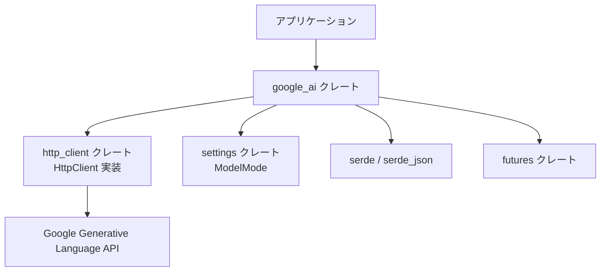
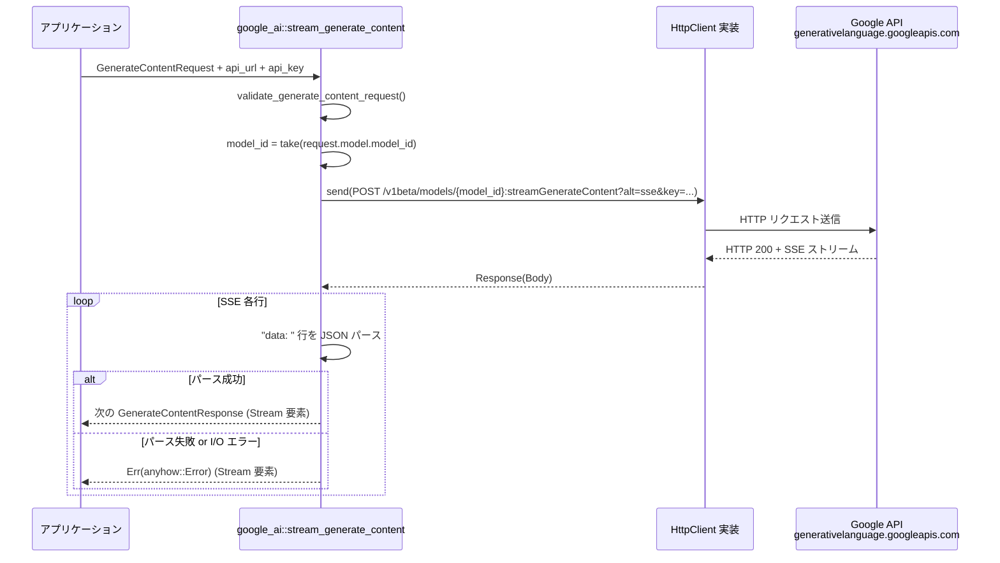

## 1. ざっくり一言

`google_ai` クレートは、Google Generative Language API（Gemini 系モデル）の `generateContent` / `streamGenerateContent` / `countTokens` エンドポイントを、Rust から扱いやすくするための **型定義と HTTP 呼び出しユーティリティ** をまとめたモジュールです。

---

## 2. このモジュールの役割

### 2.1 概要

- このディレクトリは `google_ai` というライブラリクレートを定義します。
- 主な目的は、Google の Generative Language API（`https://generativelanguage.googleapis.com`）に対する
  - リクエスト・レスポンス JSON のための Rust 構造体
  - 非同期 HTTP クライアントを用いた `streamGenerateContent` / `countTokens` の呼び出し関数
  - モデル ID やトークン上限などのメタ情報
  を提供することです。
- HTTP 通信自体は外部の `http_client` クレートの `HttpClient` トレイトに委譲し、ここでは API 仕様に沿ったデータ構造と最低限のバリデーションを担当しています。

### 2.2 アーキテクチャ内での位置づけ

このクレートは「Google API の型とエンドポイントをラップした中間層」という位置づけです。依存関係は概ね次のようになります。



- アプリケーションは `google_ai` の型と関数を使ってリクエストを構築し、非同期に API を呼び出します。
- 実際の HTTP 実装（TLS, コネクション管理など）は `http_client` クレート側に任せています。
- JSON のシリアライズ／デシリアライズは `serde` / `serde_json` によって行われます。
- ストリーミングレスポンスは `futures` クレートの `Stream` として公開されます。
- モデルの「モード」（通常モード／thinking モードなど）は、`settings::ModelMode`（`GoogleModelMode` として再エクスポート）に依存しています。

### 2.3 設計上のポイント

コードから読み取れる主な設計の特徴は次のとおりです。

- **責務の分離**
  - API の型（リクエスト・レスポンス・モデル・ツール定義など）はすべて `src/google_ai.rs` に集約されています。
  - HTTP 通信や接続設定は `http_client::HttpClient` トレイトに依存し、このクレートは実装には立ち入りません。

- **JSON 互換性を重視した型定義**
  - `#[serde(rename = "...")]` や `#[serde(rename_all = "camelCase")]` を多用し、Google API の JSON スキーマとフィールド名を一致させています。
  - `#[serde(skip_serializing_if = "Option::is_none")]` などで、API 仕様どおり不要なフィールドは省略されます。
  - `Part` は `#[serde(untagged)]` で複数の型にマッピングされ、API 仕様に近い形で表現されています。

- **モデル ID の扱いを型でラップ**
  - `ModelName` 構造体が `"models/..."` というプレフィックス付きの文字列をカプセル化し、シリアライズ／デシリアライズ時に自動で付与・検査します。

- **エラーハンドリング**
  - 公開関数は `anyhow::Result` を返し、`anyhow::bail!` / `anyhow::ensure!` で早期リターンする形で実装されています。
  - ストリーミング中の JSON パースエラー／I/O エラーは、ストリーム要素の `Err` として通知されます。

- **非同期ストリーム**
  - `stream_generate_content` は SSE（`alt=sse`）レスポンスを 1 行ずつ読み、`BoxStream<'static, Result<GenerateContentResponse>>` として呼び出し側に渡します。

---

## 3. 主要な機能一覧

このクレートが提供する主な機能は次のとおりです。

- `stream_generate_content`:
  - Google Generative Language API の `models/{model}:streamGenerateContent` を呼び出し、SSE ストリームを `Stream` として受け取る。
- `count_tokens`:
  - `models/{model}:countTokens` エンドポイントを呼び出し、トークン数を取得する。
- `validate_generate_content_request`:
  - `GenerateContentRequest` に対する簡易な事前バリデーション（モデル指定・contents の有無・User コンテンツの部品数）を行う。
- API 対応の型定義:
  - `GenerateContentRequest` / `GenerateContentResponse` / `Content` / `Part` / `FunctionCallPart` など、API の JSON スキーマに対応する構造体・列挙体群。
- モデル情報の管理:
  - `ModelName` による `"models/{id}"` 形式のラップ。
  - `Model` 列挙体による代表的な Gemini モデルとカスタムモデルの表現、トークン上限や表示名の取得。
  - モード（thinking / default）情報の取得（`Model::mode`）。
- ツール呼び出し・セーフティ設定:
  - 関数ツール定義 (`FunctionDeclaration`, `Tool`, `ToolConfig`, `FunctionCallingConfig`)。
  - ハームカテゴリやブロック閾値 (`HarmCategory`, `HarmBlockThreshold`, `SafetySetting`, `SafetyRating`)。
- トークン・使用量メタ情報:
  - `CountTokensRequest` / `CountTokensResponse`。
  - `UsageMetadata` によるトークン消費量のレポート。

---

## 4. 関数・構造体の解説

### 4.1 公開関数（API 呼び出し）

#### 一覧

| 関数名 | 役割 |
|--------|------|
| `stream_generate_content` | `streamGenerateContent` エンドポイントを呼び出し、SSE ストリームを `Stream` で返す |
| `count_tokens` | `countTokens` エンドポイントを呼び出し、トークン数を取得する |
| `validate_generate_content_request` | `GenerateContentRequest` の事前バリデーションを行う |

以下では特に重要な 3 関数を詳しく説明します。

---

#### `stream_generate_content(client, api_url, api_key, request)`

```rust
pub async fn stream_generate_content(
    client: &dyn HttpClient,
    api_url: &str,
    api_key: &str,
    mut request: GenerateContentRequest,
) -> Result<BoxStream<'static, Result<GenerateContentResponse>>>
```

**概要**

- Google API の `POST /v1beta/models/{model}:streamGenerateContent?alt=sse&key={API_KEY}` を呼び出します。
- レスポンス（SSE 形式）を 1 行ごとに読み取り、`GenerateContentResponse` のストリームとして返します。

**引数の意味**

- `client`:  
  `http_client::HttpClient` トレイトを実装した HTTP クライアントへの参照です。実際の実装（reqwest ベースなど）は利用側が用意します。
- `api_url`:  
  API のベース URL です。通常は `API_URL` 定数（`https://generativelanguage.googleapis.com`）を渡します。
- `api_key`:  
  Google API キーの文字列です。関数内部で `trim()` されます。
- `request`:  
  `GenerateContentRequest`。モデル・コンテンツ・ツール設定などを含むリクエスト本体です。

**処理の流れ**

1. `validate_generate_content_request(&request)` で簡易バリデーションを実施。
2. `mem::take(&mut request.model.model_id)` でモデル ID を取り出し、`request.model` を空にする。
   - これにより、JSON ボディからは `model` フィールドが省略され、URL パス側でモデルを指定します。
3. `POST {api_url}/v1beta/models/{model_id}:streamGenerateContent?alt=sse&key={api_key}` を組み立てる。
4. `serde_json::to_string(&request)` でリクエストボディを JSON にシリアライズし、`Content-Type: application/json` ヘッダ付きで送信。
5. HTTP レスポンスのステータスコードを判定。
   - 成功の場合:
     - ボディを `BufReader` でラップし、`AsyncBufReadExt::lines()` で 1 行ずつ読み取る。
     - 各行について:
       - `data:` というプレフィックスを持たない行は無視。
       - `data:` 以降の文字列を JSON として `GenerateContentResponse` にパース。
       - パース成功時は `Ok(response)`、失敗時は `Err(anyhow!(...))` をストリーム要素として返す。
   - 失敗の場合:
     - ボディ全体を文字列として読み取り、ステータスコードと共に `Err(anyhow!(...))` を返して終了。

**戻り値**

- `Ok(BoxStream<'static, Result<GenerateContentResponse>>)`:
  - ストリームの各要素が 1 回分の `GenerateContentResponse` です。
  - ストリーム要素ごとに `Ok` / `Err` が混在し得ます。
- `Err(anyhow::Error)`:
  - HTTP レベルでの失敗（非 2xx）や、リクエストシリアライズ失敗など、ストリーム開始前に起きたエラーです。

**エッジケース**

- `request.model` が空 (`model_id == ""`) の場合:
  - `validate_generate_content_request` が `"Model must be specified"` でエラーにします。
- `request.contents` が空の場合:
  - `"Request must contain at least one content item"` でエラー。
- SSE ストリーム中の JSON パースエラー:
  - その行に対するストリーム要素が `Err(anyhow!(...))` となりますが、ストリーム自体は継続します。
- SSE 以外の行（`data:` で始まらない行）はすべて無視されます。

**使用上の注意点**

- 関数が `mut request` を受け取るのは内部で `model_id` を `mem::take` するためです。ただし引数は値渡しなので、呼び出し側の変数は変更されません。
- ストリーム中のエラーは各要素の `Err` として返るため、呼び出し側で必ず `match` 等でハンドリングする必要があります。

---

#### `count_tokens(client, api_url, api_key, request)`

```rust
pub async fn count_tokens(
    client: &dyn HttpClient,
    api_url: &str,
    api_key: &str,
    request: CountTokensRequest,
) -> Result<CountTokensResponse>
```

**概要**

- `POST /v1beta/models/{model}:countTokens?key={API_KEY}` を呼び出し、プロンプト等に含まれるトークン数を取得します。

**処理の流れ**

1. `validate_generate_content_request(&request.generate_content_request)` で内部の `GenerateContentRequest` を検証。
2. URL を `"{api_url}/v1beta/models/{model_id}:countTokens?key={api_key}"` 形式で構築。
   - `model_id` には `request.generate_content_request.model.model_id` を使用します。
3. `CountTokensRequest` を JSON にシリアライズし、`Content-Type: application/json` で POST。
4. レスポンスボディを全て文字列として読み込み。
5. `anyhow::ensure!(response.status().is_success(), "...{status}, body: {text}")` でステータスチェック。
6. 成功時は `serde_json::from_str::<CountTokensResponse>(&text)` でパースして返却。

**戻り値**

- `Ok(CountTokensResponse { total_tokens })`:
  - 合計トークン数が `total_tokens` に入ります。
- `Err(anyhow::Error)`:
  - バリデーション失敗、HTTP ステータスエラー、レスポンス JSON パース失敗など。

**エッジケース**

- `generate_content_request` が不正（モデルなし・contents 空など）の場合、`validate_generate_content_request` で事前にエラーとなります。
- API 側がエラーを返した場合、そのボディ内容を含んだエラーメッセージになります。

---

#### `validate_generate_content_request(request)`

```rust
pub fn validate_generate_content_request(request: &GenerateContentRequest) -> Result<()>
```

**概要**

- API 呼び出し前に、最低限の条件を満たしているかをチェックするヘルパー関数です。

**チェック内容**

1. `request.model.is_empty()` ならエラー:
   - `"Model must be specified"`.
2. `request.contents.is_empty()` ならエラー:
   - `"Request must contain at least one content item"`.
3. `Role::User` の `Content` が存在し、かつその `parts` が空であればエラー:
   - `"User content must contain at least one part"`。

  ```rust
  if let Some(user_content) = request
      .contents
      .iter()
      .find(|content| content.role == Role::User)
      && user_content.parts.is_empty()
  {
      bail!("User content must contain at least one part");
  }
  ```

**エッジケース**

- `contents` 内に `Role::User` の要素が一つもない場合:
  - 上記 3 つ目の条件には引っかからず、その点について追加のチェックは行っていません（仕様意図はコードからは分かりません）。
- チェックはあくまでクライアント側の簡易検証であり、API 仕様のすべてを網羅しているわけではありません。

---

### 4.2 主要なリクエスト／レスポンス型

#### 一覧（抜粋）

| 型名 | 種別 | 役割 |
|------|------|------|
| `GenerateContentRequest` | 構造体 | `generateContent` / `streamGenerateContent` リクエスト本体 |
| `GenerateContentResponse` | 構造体 | 生成結果・安全性情報・使用量など |
| `GenerateContentCandidate` | 構造体 | 単一の候補（テキスト等） |
| `Content` | 構造体 | 役割（User/Model）と複数 `Part` の集合 |
| `Part` | enum（untagged） | テキスト・インラインデータ・関数コールなどのいずれか |
| `SystemInstruction` | 構造体 | システムプロンプト用の `Part` 集合 |
| `UsageMetadata` | 構造体 | 使用トークン数のメタ情報 |
| `GenerationConfig` | 構造体 | 温度・max tokens など生成設定 |
| `SafetySetting` ほか | 構造体／enum | コンテンツセーフティ関連設定 |
| `CountTokensRequest` / `CountTokensResponse` | 構造体 | トークン数計測用の入出力 |
| `FunctionCallPart` / `FunctionResponsePart` / `ThoughtPart` | 構造体 | ツール実行・thinking モード関連のパーツ |

以下では、代表的な型を抜粋して説明します。

---

#### `GenerateContentRequest`

```rust
#[derive(Debug, Serialize, Deserialize)]
#[serde(rename_all = "camelCase")]
pub struct GenerateContentRequest {
    #[serde(default, skip_serializing_if = "ModelName::is_empty")]
    pub model: ModelName,
    pub contents: Vec<Content>,
    #[serde(skip_serializing_if = "Option::is_none")]
    pub system_instruction: Option<SystemInstruction>,
    #[serde(skip_serializing_if = "Option::is_none")]
    pub generation_config: Option<GenerationConfig>,
    #[serde(skip_serializing_if = "Option::is_none")]
    pub safety_settings: Option<Vec<SafetySetting>>,
    #[serde(skip_serializing_if = "Option::is_none")]
    pub tools: Option<Vec<Tool>>,
    #[serde(skip_serializing_if = "Option::is_none")]
    pub tool_config: Option<ToolConfig>,
}
```

**役割**

- `generateContent` / `streamGenerateContent` に渡されるメインのリクエストです。
- モデル、会話内容、システム指示、生成パラメータ、ツール、セーフティ設定を包含します。

**フィールドのポイント**

- `model: ModelName`:
  - `"models/{id}"` 形式のラップ。空の場合はシリアライズ時に省略されます。
- `contents: Vec<Content>`:
  - 少なくとも 1 要素が必要（`validate_generate_content_request` がチェック）。
  - 通常はユーザーのメッセージや、過去のモデルの返答が含まれます。
- `system_instruction`:
  - システムレベルの指示（role がない、全体方針のようなもの）を `Part` 群として表現します。
- `generation_config`:
  - 温度（`temperature`）、`max_output_tokens`、`top_p`、`top_k`、Thinking 設定など。
- `tools` / `tool_config`:
  - 関数ツールを利用する場合に定義します。

**エッジケース**

- `model` がデフォルト値（空の `ModelName`）の場合、JSON に `model` フィールドは出ません。その場合は URL パスでモデルが指定される前提になります。
- `contents` が空のまま API に送信すると、サーバー側でエラーになる可能性がありますが、このクライント側コードでは事前に弾いています。

---

#### `GenerateContentResponse` / `GenerateContentCandidate`

```rust
#[derive(Debug, Serialize, Deserialize)]
#[serde(rename_all = "camelCase")]
pub struct GenerateContentResponse {
    #[serde(skip_serializing_if = "Option::is_none")]
    pub candidates: Option<Vec<GenerateContentCandidate>>,
    #[serde(skip_serializing_if = "Option::is_none")]
    pub prompt_feedback: Option<PromptFeedback>,
    #[serde(skip_serializing_if = "Option::is_none")]
    pub usage_metadata: Option<UsageMetadata>,
}
```

- `candidates`:
  - 実際の生成結果が `GenerateContentCandidate` として入ります。
- `prompt_feedback`:
  - プロンプトに対するブロック理由等のフィードバック。
- `usage_metadata`:
  - トークン数などの使用情報。

```rust
#[derive(Debug, Serialize, Deserialize)]
#[serde(rename_all = "camelCase")]
pub struct GenerateContentCandidate {
    #[serde(skip_serializing_if = "Option::is_none")]
    pub index: Option<usize>,
    pub content: Content,
    #[serde(skip_serializing_if = "Option::is_none")]
    pub finish_reason: Option<String>,
    #[serde(skip_serializing_if = "Option::is_none")]
    pub finish_message: Option<String>,
    #[serde(skip_serializing_if = "Option::is_none")]
    pub safety_ratings: Option<Vec<SafetyRating>>,
    #[serde(skip_serializing_if = "Option::is_none")]
    pub citation_metadata: Option<CitationMetadata>,
}
```

---

#### `Content` と `Role`

```rust
#[derive(Debug, Serialize, Deserialize)]
#[serde(rename_all = "camelCase")]
pub struct Content {
    #[serde(default)]
    pub parts: Vec<Part>,
    pub role: Role,
}

#[derive(Debug, PartialEq, Deserialize, Serialize)]
#[serde(rename_all = "camelCase")]
pub enum Role {
    User,
    Model,
}
```

- `role`:
  - `User`: ユーザーからの入力。
  - `Model`: モデルからの出力。
- `parts`:
  - `Part` 列挙体のベクタです。テキスト以外にも関数コールなどを含み得ます。
- `validate_generate_content_request` は、`Role::User` のコンテンツが存在する場合、その `parts` が空でないことを要求します。

---

#### `Part` とそのバリアント

```rust
#[derive(Debug, Serialize, Deserialize)]
#[serde(untagged)]
pub enum Part {
    TextPart(TextPart),
    InlineDataPart(InlineDataPart),
    FunctionCallPart(FunctionCallPart),
    FunctionResponsePart(FunctionResponsePart),
    ThoughtPart(ThoughtPart),
}
```

- `#[serde(untagged)]` により、JSON 上ではバリアント名は出ず、中身のフィールド構造から自動的に判別されます。
- バリアントの概要:

| バリアント | 中身 | 用途の目安 |
|-----------|------|------------|
| `TextPart` | `{ "text": String }` | 通常のテキストメッセージ |
| `InlineDataPart` | `{ "inlineData": { mimeType, data } }` | 画像などのバイナリを base64 文字列で埋め込む |
| `FunctionCallPart` | `{ "functionCall": {...}, "thoughtSignature"?: ... }` | モデルからツール実行を指示する |
| `FunctionResponsePart` | `{ "functionResponse": {...} }` | ツールの実行結果をモデルに返す |
| `ThoughtPart` | `{ "thought": bool, "thoughtSignature": ... }` | thinking モード関連の内部情報（詳細はコードからは不明） |

`FunctionCallPart` に関するテストがモジュール末尾にあり、`thought_signature` が `None` の場合には JSON にフィールドが出ないことが確認されています。

---

### 4.3 モデル関連の型

#### `ModelName`

```rust
#[derive(Debug, Default)]
pub struct ModelName {
    pub model_id: String,
}
```

**シリアライズ**

```rust
impl Serialize for ModelName {
    fn serialize<S>(&self, serializer: S) -> Result<S::Ok, S::Error>
    where
        S: Serializer,
    {
        serializer.serialize_str(&format!("{MODEL_NAME_PREFIX}{}", &self.model_id))
    }
}
```

- `MODEL_NAME_PREFIX` は `"models/"` です。
- `model_id = "gemini-2.5-flash"` の場合、JSON 上の値は `"models/gemini-2.5-flash"` になります。

**デシリアライズ**

```rust
impl<'de> Deserialize<'de> for ModelName {
    fn deserialize<D>(deserializer: D) -> Result<Self, D::Error>
    where
        D: Deserializer<'de>,
    {
        let string = String::deserialize(deserializer)?;
        if let Some(id) = string.strip_prefix(MODEL_NAME_PREFIX) {
            Ok(Self {
                model_id: id.to_string(),
            })
        } else {
            Err(serde::de::Error::custom(format!(
                "Expected model name to begin with {}, got: {}",
                MODEL_NAME_PREFIX, string
            )))
        }
    }
}
```

- `"models/..."` で始まらない文字列はエラーになります。
- 内部では `"models/"` を取り除いた部分だけを `model_id` として保持します。

**使用上の注意**

- アプリ側で設定するのは `"models/..."` ではなく **素のモデル名**（例: `"gemini-2.5-flash"`）です。
- `GenerateContentRequest` 側では `ModelName::is_empty()` が `true` の場合シリアライズされないため、URL パスでモデルを指定するスタイルとも共存できます。

---

#### `Model`

```rust
#[cfg_attr(feature = "schemars", derive(schemars::JsonSchema))]
#[derive(Clone, Default, Debug, Deserialize, Serialize, PartialEq, Eq, strum::EnumIter)]
pub enum Model {
    #[serde(
        rename = "gemini-2.5-flash-lite",
        alias = "gemini-2.5-flash-lite-preview-06-17",
        alias = "gemini-2.0-flash-lite-preview"
    )]
    Gemini25FlashLite,
    #[serde(
        rename = "gemini-2.5-flash",
        alias = "gemini-2.0-flash-thinking-exp",
        alias = "gemini-2.5-flash-preview-04-17",
        alias = "gemini-2.5-flash-preview-05-20",
        alias = "gemini-2.5-flash-preview-latest",
        alias = "gemini-2.0-flash"
    )]
    #[default]
    Gemini25Flash,
    #[serde(
        rename = "gemini-2.5-pro",
        alias = "gemini-2.0-pro-exp",
        alias = "gemini-2.5-pro-preview-latest",
        alias = "gemini-2.5-pro-exp-03-25",
        alias = "gemini-2.5-pro-preview-03-25",
        alias = "gemini-2.5-pro-preview-05-06",
        alias = "gemini-2.5-pro-preview-06-05"
    )]
    Gemini25Pro,
    #[serde(rename = "gemini-3-flash-preview")]
    Gemini3Flash,
    #[serde(rename = "gemini-3.1-pro-preview", alias = "gemini-3-pro-preview")]
    Gemini31Pro,
    #[serde(rename = "custom")]
    Custom {
        name: String,
        /// The name displayed in the UI, such as in the assistant panel model dropdown menu.
        display_name: Option<String>,
        max_tokens: u64,
        #[serde(default)]
        mode: GoogleModelMode,
    },
}
```

**主なメソッド**

- `default_fast()`:  
  - 速さ優先のデフォルトとして `Gemini25FlashLite` を返します。
- `id()` / `request_id()`:
  - 現状どちらも同じ実装で、API に渡すモデル ID 文字列（例: `"gemini-2.5-flash"`) を返します。
- `display_name()`:
  - UI 用の人間向け表示名（例: `"Gemini 2.5 Flash"`）を返します。
  - `Custom` の場合は `display_name` が `Some` ならそちら、`None` なら `name` を返します。
- `max_token_count()`:
  - 既知モデル: `1_048_576` トークン固定。
  - `Custom`: 各インスタンスに設定された `max_tokens` を返します。
- `max_output_tokens()`:
  - 既知モデル: `Some(65_536)`。
  - `Custom`: `None`（クライアント側では上限不明）。
- `supports_tools()` / `supports_images()`:
  - 現状はすべてのバリアントで `true` が返ります。
- `mode()`:
  - `Gemini25FlashLite` / `Gemini25Flash` / `Gemini25Pro`:
    - `GoogleModelMode::Thinking { budget_tokens: None }` を返します。
  - `Gemini3Flash`:
    - `GoogleModelMode::Default`。
  - `Gemini31Pro`:
    - `GoogleModelMode::Thinking { budget_tokens: None }`。
  - `Custom`:
    - フィールド `mode` の値をそのまま返します。

`GoogleModelMode` は `settings::ModelMode` の再エクスポートであり、thinking モードの有無や予算トークン数などを表現していると考えられます（詳細はこのチャンクからは分かりません）。

---

### 4.4 ツール・thinking 関連の型

#### 関数ツール呼び出し

```rust
#[derive(Debug, Serialize, Deserialize)]
pub struct FunctionCall {
    pub name: String,
    pub args: serde_json::Value,
}

#[derive(Debug, Serialize, Deserialize)]
pub struct FunctionResponse {
    pub name: String,
    pub response: serde_json::Value,
}
```

- 任意の JSON 値を `args` / `response` に入れられます。

```rust
#[derive(Debug, Serialize, Deserialize)]
#[serde(rename_all = "camelCase")]
pub struct Tool {
    pub function_declarations: Vec<FunctionDeclaration>,
}

#[derive(Debug, Serialize, Deserialize)]
#[serde(rename_all = "camelCase")]
pub struct FunctionDeclaration {
    pub name: String,
    pub description: String,
    pub parameters: serde_json::Value,
}
```

- ツールとして公開する関数を宣言します。`parameters` の形式は自由な JSON です（一般的には JSON Schema 風の形式が想定されますが、このコードからは詳細は分かりません）。

```rust
#[derive(Debug, Serialize, Deserialize)]
#[serde(rename_all = "camelCase")]
pub struct ToolConfig {
    pub function_calling_config: FunctionCallingConfig,
}

#[derive(Debug, Serialize, Deserialize)]
#[serde(rename_all = "camelCase")]
pub struct FunctionCallingConfig {
    pub mode: FunctionCallingMode,
    #[serde(skip_serializing_if = "Option::is_none")]
    pub allowed_function_names: Option<Vec<String>>,
}

#[derive(Debug, Serialize, Deserialize)]
#[serde(rename_all = "lowercase")]
pub enum FunctionCallingMode {
    Auto,
    Any,
    None,
}
```

- `mode` によってモデルのツール利用の方針（自動／任意／禁止など）を指定します。

#### thinking 関連

```rust
#[derive(Debug, Serialize, Deserialize)]
#[serde(rename_all = "camelCase")]
pub struct ThoughtPart {
    pub thought: bool,
    pub thought_signature: String,
}

#[derive(Debug, Serialize, Deserialize)]
#[serde(rename_all = "camelCase")]
pub struct ThinkingConfig {
    pub thinking_budget: u32,
}
```

- `ThoughtPart` は thinking モード関連の情報を保持しているようですが、サーバ側の仕様まではこのコードからは分かりません。
- `ThinkingConfig` は `GenerationConfig` 内の `thinking_config` フィールドとして利用され、thinking に使えるトークン予算を指定していると解釈できます。

`FunctionCallPart` には `thought_signature: Option<String>` があり、テストにより以下が確認されています。

- `Some("...")` の場合: `thoughtSignature` フィールドが JSON に出る。
- `None` の場合: `thoughtSignature` フィールドは省略される。
- 空文字列 `Some("")` の場合: 空文字としてシリアライズされる。

---

### 4.5 セーフティ・トークン関連

```rust
#[derive(Debug, Serialize, Deserialize)]
#[serde(rename_all = "camelCase")]
pub struct SafetySetting {
    pub category: HarmCategory,
    pub threshold: HarmBlockThreshold,
}
```

- `HarmCategory` は各種有害カテゴリを `#[serde(rename = "...")]` 付きで列挙しています（侮辱、暴力、性的など）。
- `HarmBlockThreshold` は `BlockLowAndAbove` などのブロック閾値を SCREAMING_SNAKE_CASE でシリアライズします。
- `SafetyRating` はレスポンス側で harm の `probability` を `HarmProbability` で表現します。

```rust
#[derive(Debug, Serialize, Deserialize, Default)]
#[serde(rename_all = "camelCase")]
pub struct UsageMetadata {
    #[serde(skip_serializing_if = "Option::is_none")]
    pub prompt_token_count: Option<u64>,
    #[serde(skip_serializing_if = "Option::is_none")]
    pub cached_content_token_count: Option<u64>,
    #[serde(skip_serializing_if = "Option::is_none")]
    pub candidates_token_count: Option<u64>,
    #[serde(skip_serializing_if = "Option::is_none")]
    pub tool_use_prompt_token_count: Option<u64>,
    #[serde(skip_serializing_if = "Option::is_none")]
    pub thoughts_token_count: Option<u64>,
    #[serde(skip_serializing_if = "Option::is_none")]
    pub total_token_count: Option<u64>,
}
```

- 主にレスポンス側で利用されるメタ情報です。

```rust
#[derive(Debug, Serialize, Deserialize)]
#[serde(rename_all = "camelCase")]
pub struct CountTokensRequest {
    pub generate_content_request: GenerateContentRequest,
}

#[derive(Debug, Serialize, Deserialize)]
#[serde(rename_all = "camelCase")]
pub struct CountTokensResponse {
    pub total_tokens: u64,
}
```

- `CountTokensRequest` は中に `GenerateContentRequest` をそのまま持つ形になっています。

---

## 5. データフロー

ここでは、`stream_generate_content` を使ってストリーミングレスポンスを受け取る典型的なフローを示します。

### 5.1 処理の流れ（テキスト説明）

1. アプリケーションが `GenerateContentRequest` を組み立て、`ModelName` と `Contents` を設定します。
2. アプリケーションが `stream_generate_content(&client, API_URL, api_key, request)` を呼び出します。
3. 関数内部で `validate_generate_content_request` による事前チェックが行われます。
4. モデル ID が `request.model.model_id` から取り出され、URL パス `/v1beta/models/{id}:streamGenerateContent` が構築されます。
5. 残りのフィールドを JSON として `http_client::HttpClient` に渡し、HTTP リクエストが送信されます。
6. Google API からのレスポンスボディは SSE 形式のテキストストリームです。
7. `BufReader` で 1 行ずつ読み取り、`data:` で始まる行だけを `GenerateContentResponse` にパースします。
8. 各 `GenerateContentResponse` はストリーム要素としてアプリケーション側に流れ、アプリケーションは `candidates` の `Content` から生成されたテキストなどを取り出して利用します。

### 5.2 シーケンス図



`count_tokens` の場合は、ストリームではなく単一の JSON レスポンスとして `CountTokensResponse` を返すだけなので、より単純なフローになります。

---

## 6. 使い方（How to Use）

### 6.1 基本的な使用方法

ここでは、最小構成で `stream_generate_content` を使う例を示します。  
HTTP クライアント実装（`MyHttpClient`）はダミー名で、実際には `http_client` クレートが提供する具体型に置き換える必要があります。

```rust
use futures::StreamExt;                                    // Stream を操作するために必要
use http_client::HttpClient;                               // HTTP クライアントのトレイト
use google_ai::{
    stream_generate_content,                               // ストリーミング API 呼び出し関数
    GenerateContentRequest, Content, Part, TextPart, Role, // 主なリクエスト型
    ModelName, Model, API_URL,                             // モデル関連・デフォルト API URL
};

// 仮の HTTP クライアント実装を用意したと仮定する
struct MyHttpClient;                                       // 実際には http_client クレートの実装を使用する
impl HttpClient for MyHttpClient {                         // 必要なメソッドを実装する（ここでは省略）
    // ...
}

#[tokio::main]                                             // 非同期コンテキストを用意する
async fn main() -> anyhow::Result<()> {                    // anyhow::Result でエラーをまとめて扱う
    let client = MyHttpClient;                             // HttpClient 実装を生成する

    let api_key = "YOUR_API_KEY";                          // Google API キー（実際の値に置き換える）
    let model = Model::Gemini25Flash;                      // 使用するモデルを選択する

    // GenerateContentRequest を構築する
    let request = GenerateContentRequest {
        model: ModelName {                                 // ModelName に素のモデル ID を指定
            model_id: model.request_id().to_string(),      // "gemini-2.5-flash" など
        },
        contents: vec![
            Content {
                role: Role::User,                          // ユーザーからの入力
                parts: vec![
                    Part::TextPart(TextPart {
                        text: "こんにちは、自己紹介してください。".to_string(), // プロンプト本文
                    }),
                ],
            },
        ],
        system_instruction: None,                          // ここではシステム指示なし
        generation_config: None,                           // デフォルト設定
        safety_settings: None,                             // セーフティ設定もデフォルト
        tools: None,                                       // ツール呼び出しなし
        tool_config: None,                                 // ツール設定なし
    };

    // ストリーミング生成を開始する
    let mut stream = stream_generate_content(
        &client,                                           // HttpClient への参照
        API_URL,                                           // ベース URL（デフォルト定数）
        api_key,                                           // API キー
        request,                                           // 構築したリクエスト
    )
    .await?;                                               // HTTP レベルのエラーをここで検知

    // ストリームから順にレスポンスを受け取る
    while let Some(item) = stream.next().await {           // 1 イベントずつ待ち受ける
        match item {
            Ok(response) => {                              // 正常な GenerateContentResponse
                if let Some(candidates) = response.candidates {
                    for cand in candidates {
                        for part in cand.content.parts {
                            if let Part::TextPart(text_part) = part {
                                println!("モデルの出力: {}", text_part.text); // テキスト出力を表示
                            }
                        }
                    }
                }
            }
            Err(e) => {                                    // JSON パースエラー・I/O エラーなど
                eprintln!("ストリーム要素の処理中にエラー: {e}");
            }
        }
    }

    Ok(())                                                 // 正常終了
}
```

### 6.2 よくある使用パターン

#### パターン 1: トークン数だけ先に知りたい（`count_tokens`）

```rust
use google_ai::{
    count_tokens, CountTokensRequest, GenerateContentRequest,
    Content, Part, TextPart, Role, ModelName, Model, API_URL,
};
use http_client::HttpClient;

async fn show_token_count(client: &dyn HttpClient, api_key: &str) -> anyhow::Result<()> {
    let model = Model::Gemini25FlashLite;                      // 軽量モデルを選択
    let generate_request = GenerateContentRequest {
        model: ModelName {
            model_id: model.request_id().to_string(),          // "gemini-2.5-flash-lite"
        },
        contents: vec![
            Content {
                role: Role::User,
                parts: vec![Part::TextPart(TextPart {
                    text: "この文章は何トークンですか？".to_string(),
                })],
            },
        ],
        system_instruction: None,
        generation_config: None,
        safety_settings: None,
        tools: None,
        tool_config: None,
    };

    let request = CountTokensRequest {
        generate_content_request: generate_request,            // 中にそのまま詰める
    };

    let response = count_tokens(client, API_URL, api_key, request).await?; // API 呼び出し
    println!("推定トークン数: {}", response.total_tokens);   // トークン数を表示

    Ok(())
}
```

#### パターン 2: カスタムモデル（`Model::Custom`）を使う

```rust
use google_ai::{Model, GoogleModelMode};

fn build_custom_model() -> Model {
    Model::Custom {
        name: "my-custom-model".to_string(),                   // サーバ側で定義したモデル名
        display_name: Some("My Custom Model".to_string()),     // UI 表示用の名前
        max_tokens: 200_000,                                   // クライアント側で把握している上限
        mode: GoogleModelMode::Default,                        // thinking ではない通常モード
    }
}
```

この `Model` から `model.request_id()` を呼び出し、`ModelName` に詰めることで、他のモデルと同様に扱うことができます。

#### パターン 3: ツール（関数）を定義してリクエストに添付する

```rust
use serde_json::json;
use google_ai::{
    GenerateContentRequest, Content, Part, TextPart, Role,
    ModelName, Tool, FunctionDeclaration, ToolConfig, FunctionCallingConfig, FunctionCallingMode,
};

fn add_tool_to_request(mut req: GenerateContentRequest) -> GenerateContentRequest {
    // 関数ツールの宣言を作成
    let decl = FunctionDeclaration {
        name: "get_weather".to_string(),                       // 関数名
        description: "現在の天気を取得する".to_string(),           // 説明
        parameters: json!({                                    // パラメータ (JSON Schema のような形式を想定)
            "type": "object",
            "properties": {
                "city": { "type": "string" }
            },
            "required": ["city"]
        }),
    };

    // Tool と ToolConfig を設定
    req.tools = Some(vec![Tool {
        function_declarations: vec![decl],
    }]);

    req.tool_config = Some(ToolConfig {
        function_calling_config: FunctionCallingConfig {
            mode: FunctionCallingMode::Auto,                   // モデルが自動でツールを使うか判断
            allowed_function_names: None,                      // 制限なし
        },
    });

    req
}
```

### 6.3 使用上の注意点（まとめ）

- **モデルの指定**
  - `ModelName` に設定するのは `"models/..."` を除いた **素の ID** です。
  - 例: `"gemini-2.5-flash"` → JSON では `"models/gemini-2.5-flash"` に自動変換されます。
- **必須フィールド**
  - `GenerateContentRequest` は
    - `model.model_id` が非空
    - `contents` が非空
    - `Role::User` の `Content` がある場合、その `parts` が非空
    である必要があります。これを満たさないと `validate_generate_content_request` でエラーになります。
- **ストリーミング中のエラー処理**
  - `stream_generate_content` の HTTP レベルエラー（認証失敗など）は関数の `Err` として返ります。
  - ストリーム中の JSON パースエラーや I/O エラーは、各ストリーム要素が `Err` になります。ループ内で必ず `match` して処理する必要があります。
- **ModelName のデシリアライズ**
  - サーバから返された JSON に `"models/"` プレフィックスが付いていない場合、`ModelName` のデシリアライズはエラーになります。
- **thinking / ツールモード**
  - `Model::mode()` は `GoogleModelMode` を返しますが、その具体的な意味やサーバ側の挙動は、このコードだけからは分かりません。利用する場合は `settings` クレート側の定義や公式ドキュメントを確認する必要があります。
- **ライセンス**
  - `Cargo.toml` より、このクレートは `GPL-3.0-or-later` でライセンスされています。

---

## 7. 関連ファイル

| パス | 役割 / 関係 |
|------|------------|
| `google_ai/Cargo.toml` | `google_ai` クレートのパッケージメタデータ・依存関係・ライブラリパス（`src/google_ai.rs`）を定義します。`anyhow`, `futures`, `http_client`, `serde`, `serde_json`, `settings`, `strum` などに依存し、`schemars` はオプション機能として指定されています。 |
| `google_ai/src/google_ai.rs` | クレート本体。Google Generative Language API 向けのすべての構造体・列挙体・関数（`stream_generate_content`, `count_tokens`, バリデーション、モデル情報など）を定義し、テスト (`mod tests`) もこのファイル内に含まれています。 |

このディレクトリ外では、`settings` クレートが `ModelMode` を提供し、`http_client` クレートが `HttpClient` の具体実装を提供していると考えられますが、それらの詳細はこのチャンクには含まれていません。
