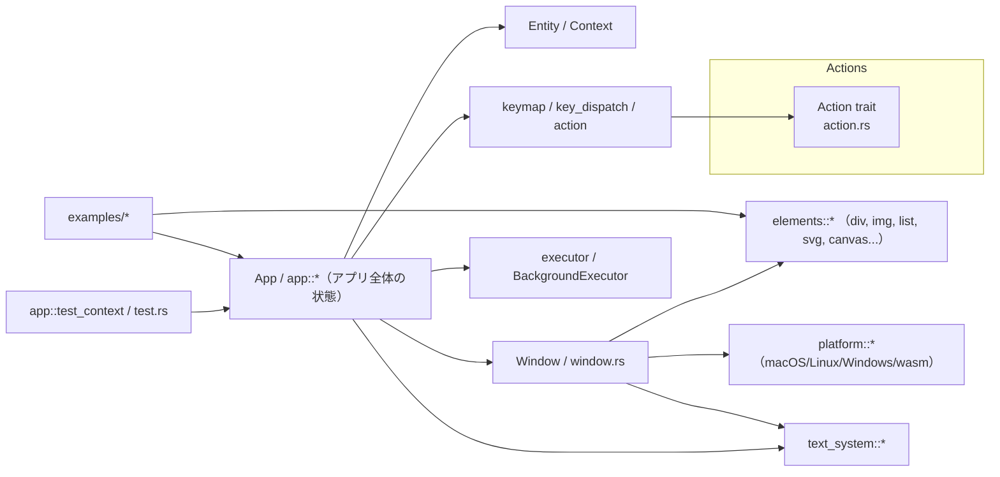
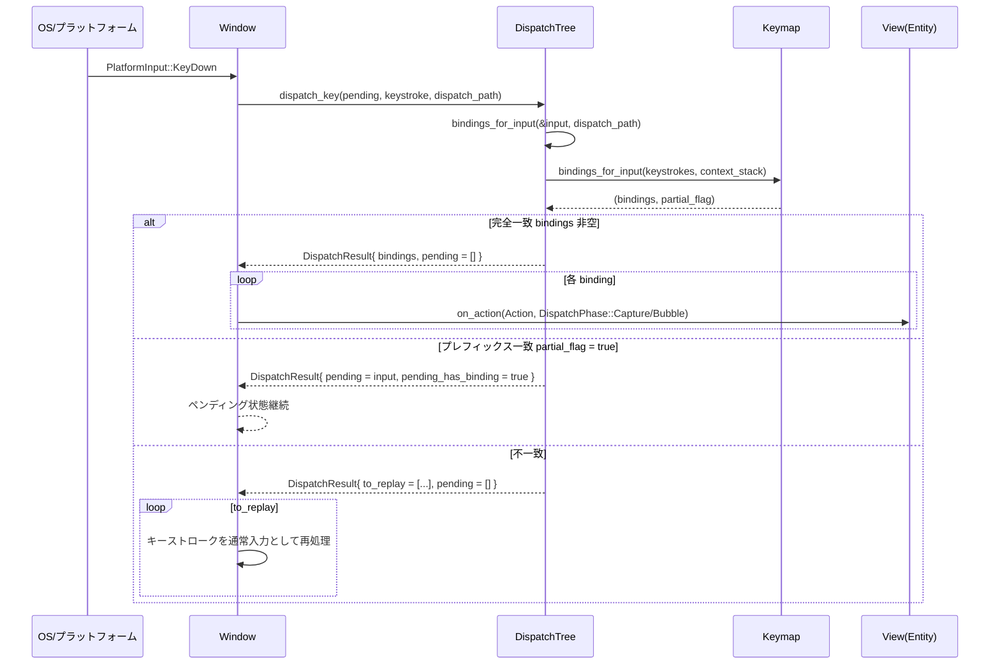
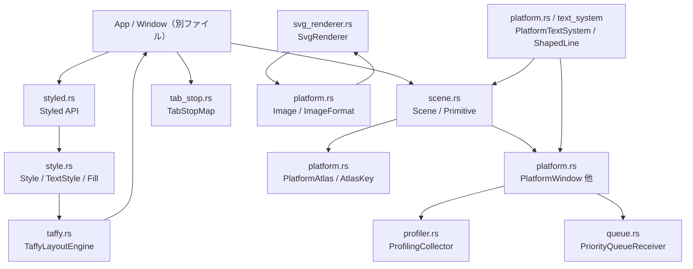
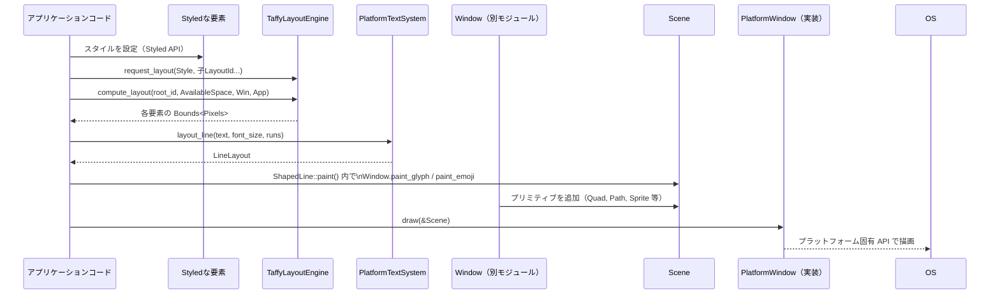

# gpui ディレクトリ解説

## 1. ざっくり一言

- `gpui` は、Zed エディタでも使われている **GPU アクセラレーテッドな Rust 向け UI フレームワーク**です。
- 即時モード的な API（`div().bg(...).child(...)`）と保持モード的な状態管理（`Entity<T>` / `Context<T>`）を組み合わせて、デスクトップ／Web（wasm）向けのリッチ UI を構築します。

---

## 2. このモジュールの役割

### 2.1 概要

- このディレクトリは `gpui` クレート本体で、次を提供します。
  - アプリ全体の状態を管理する `App` と、`Entity<T>` / `Context<T>` ベースの状態管理モデル
  - `Render` トレイトと `div`, `img`, `svg`, `canvas` などの **要素 DSL** による宣言的 UI
  - キーマップ＋アクション (`actions!` マクロ, `ActionRegistry`) によるキーボード駆動 UI
  - マルチプラットフォームなウィンドウ／プラットフォーム抽象 (`platform`, `window` など)
  - テキストレイアウト、画像キャッシュ、アニメーション、テスト用インフラなど

### 2.2 アーキテクチャ内での位置づけ

`gpui` は Zed のワークスペース内で、UI レイヤを担当するクレートです。プラットフォーム依存部分は `gpui_platform` / `gpui_web` などの別クレートに委譲されます。

主要コンポーネント間の依存関係（ファイル名・ドキュメントから読める範囲）を簡略化すると次のようになります。



> 注: `App` / `Window` / `elements` / `platform` / `text_system` の実装本体はこのチャンクには現れませんが、ファイル一覧や README から存在は確認できます。

### 2.3 設計上のポイント（コードから読み取れる範囲）

- **単一オーナー型 `App` とハンドル `Entity<T>` による状態管理**
  - `_ownership_and_data_flow.rs` と `docs/contexts.md` に詳しい説明があります。
  - 実体（モデル／ビュー）の所有権は `App` が持ち、利用側は `Entity<T>` ハンドル越しに `update` / `read` などでアクセスします。
- **コンテキスト（`App`, `Context<T>`, `AsyncApp`, `TestAppContext`）の多層構造**
  - 同じ API（`new`, `update` など）をコンテキストごとに提供しつつ、同期／非同期／テストなど用途を切り替えます。
- **宣言的な要素 DSL と Tailwind 風スタイル**
  - `div().flex().bg(...).child(...)` というチェーンでレイアウトとスタイルを宣言します。
- **アクション／キーマップ中心のキーボード操作**
  - `actions!` マクロと `Action` トレイト、`ActionRegistry` により、型安全なアクションと JSON キーマップの橋渡しを行います。
- **非同期実行とイベントループの統合**
  - `executor.rs` / `AsyncApp` / 各種 `spawn` メソッドを通じて、UI イベントループとバックグラウンドタスクを統合します。
- **テスト専用のコンテキストとマクロ**
  - `#[gpui::test]`, `TestAppContext`, `VisualTestContext` を使い、UI を含むコードの単体テスト／統合テストをサポートします。
- **豊富な実行例**
  - `examples/` 以下に、アニメーション／ウィンドウ制御／テキスト／描画／入力などのサンプルが多数あります。実装を読む際の重要な参考資料になっています。

---

## 3. 主要な機能一覧

このディレクトリ全体が提供する主な機能を、コードとドキュメントから読み取れる範囲で列挙します。

- アプリケーション状態管理
  - `App` と `Entity<T>`, `Context<T>` による集中管理とオブザーバ／イベントの仕組み
- コンテキスト API
  - `App`, `Context<T>`, `AsyncApp`, `AsyncWindowContext`, `TestAppContext` などのコンテキスト型
- ウィンドウ管理
  - `Window`, `WindowOptions`, `WindowBounds`, `WindowKind` などによるマルチウィンドウ管理
  - レイヤーシェル（Wayland）、ポップアップ、ダイアログなどの特殊ウィンドウ (`examples/layer_shell.rs`, `window.rs`)
- 宣言的 UI 要素
  - `div`, `img`, `svg`, `canvas`, `list`, `uniform_list`, `pattern_slash` など `elements::*` モジュール
  - Flexbox／グリッド／スクロール／パターン／グラデーション／ボックスシャドウなどのスタイル API
- テキスト／フォント機能
  - `text_system::*`, `StyledText`、テキスト折り返し／装飾／フォントサイズ・行間管理 (`examples/text.rs`, `text_layout.rs`, `text_wrapper.rs`)
- 入力・フォーカス・アクセシビリティ
  - マウス／ドラッグ＆ドロップ／ペン圧 (`MousePressureEvent`)／キーボードインプット (`TextInput` 例)／フォーカスと `tab_stop` (`examples/tab_stop.rs`, `focus_visible.rs`)
- キーマップとアクション
  - `actions!` マクロ、`Action` トレイト、`ActionRegistry` による型付きアクション
  - `keymap`, `key_dispatch`, `KeyBinding`, `.key_context()` によるキーボードショートカット
- 非同期とアセット
  - `AsyncApp`, `BackgroundExecutor`, `Asset` / `AssetSource`, `ImageAssetLoader`, `ImageCache` など
  - 画像読み込み／キャッシュ (`examples/image*.rs`, `image_cache.rs`)
- プラットフォーム抽象
  - `platform.rs` と配下のモジュール（macOS / Linux / Windows / tests / wasm）
  - ウィンドウ装飾・タイトルバー／レイヤーシェル／スクリーンキャプチャ
- テストインフラ
  - `#[gpui::test]`, `TestAppContext`, `VisualTestContext`, `tests/action_macros.rs`, `examples/testing.rs`
- プロファイリング・ユーティリティ
  - `profiler.rs`, `queue.rs`, `geometry.rs`, `util.rs` など

---

## 4. 関数・構造体の解説

このセクションでは、特に重要な型と API を、コードに現れている範囲で整理します。

### 4.1 主要な型一覧

| 名前 | 種別 | 役割 / 用途（このチャンクから読み取れる範囲） |
|------|------|---------------------------------------------|
| `App` | 構造体（`crate::App`） | アプリケーション全体の状態とサービス（ウィンドウ、エンティティ、キーマップ、実行器など）を管理します。`application().run(|cx: &mut App| { ... })` で渡されます。 |
| `Entity<T>` | 構造体 | `T` 型のモデル／ビューへのハンドル。実体は `App` が所有し、`update` / `read` などでアクセスします。 |
| `Context<T>` | 構造体 | `Entity<T>` に紐づいたコンテキスト。`App` への参照に加え、`notify` / `observe` / `subscribe` / `emit` などエンティティ固有の操作を提供します。 |
| `AsyncApp` | 構造体（`app/async_context.rs`） | 非同期タスク用の `App` コンテキスト。`Weak<AppCell>` を内部に持ち、`AppContext` を実装して `cx.spawn` 内から `new` / `update_entity` などを呼べるようにします。 |
| `Window` | 構造体 | 1 つのウィンドウの状態・描画・入力処理を担当します。`Render` 実装の第一引数として渡されます。 |
| `WindowOptions` / `WindowBounds` / `WindowKind` | 構造体 / 列挙体 | ウィンドウの作成・配置・種類（通常／ダイアログ／ポップアップ／レイヤーシェルなど）を指定します。例から存在が分かります。 |
| `Render` | トレイト | ビュー（`Entity<T>` の中身）が実装するトレイト。`fn render(&mut self, window: &mut Window, cx: &mut Context<Self>) -> impl IntoElement` の形で要素ツリーを構築します。 |
| `RenderOnce` | トレイト | 一度きりレンダリングされる要素（`TableRow` など）用トレイト。`render(self, &mut Window, &mut App)` を実装します。 |
| `Action` | トレイト（`src/action.rs`） | キーボードアクションの共通インターフェース。名前の取得・JSON からの構築・クローン・非推奨メタデータなどを定義します。 |
| `ActionRegistry` | 構造体 | `Action` 実装を名前や `TypeId` から引けるレジストリ。`inventory` に登録された `MacroActionBuilder` を読み込みます。 |
| `MacroActionBuilder` / `MacroActionData` | 構造体 | `gpui_macros` が生成するメタデータを `inventory` 経由で渡すための型。アクション名・型 ID・ビルダ関数・スキーマ等を保持します。 |
| `NoAction` / `Unbind` | 構造体 | キーマップ上で「このキーを無効化する」「別アクションをアンバインドする」意味をもつ特別なアクション。`no_action` モジュールで定義されています。 |
| `TestAppContext` | 構造体 | `#[gpui::test]` でテスト関数に渡されるコンテキスト。同期／非同期テストや複数アプリの並行テストをサポートします（`examples/testing.rs`）。 |
| `VisualTestContext` | 構造体 | 実際にウィンドウを開いた上でレンダリング依存のテストを行うためのコンテキスト。 |
| 各種 Example 型 | 構造体 | `examples/` 以下の `HelloWorld`, `ImageShowcase`, `DataTable`, `PaintingViewer` 等。特定機能（画像、リスト、描画、ウィンドウ制御など）のサンプル実装です。 |

> `App` / `Window` 本体など、このチャンクに定義が出てこない型については、例やドキュメントから分かる範囲でのみ記述しています。

### 4.2 代表的な API 詳細

ここでは、コードに頻出する代表的な API を 5 件取り上げます。**正確なシグネチャはこのチャンクから完全には分からないため、おおよその形と挙動だけ**説明します。

#### 4.2.1 `actions!(namespace, [Name1, Name2, ...])` マクロ

**概要**

- 単純な「ユニット構造体」アクションをまとめて定義し、`Action` として登録するためのマクロです。
- キーマップ JSON から呼び出されるアクション名と、Rust の型を対応付けます。

**使用例（コード中）**

```rust
use gpui::actions;
actions!(editor, [MoveUp, MoveDown, MoveLeft, MoveRight, Newline]);

// 名前空間を省略した形も可能
actions!(example, [Tab, TabPrev, Quit]);
```

**内部で生成されるもの（コードから読み取れる範囲）**

- 各名前について以下のような構造体と実装を生成します（概略）。

```rust
#[derive(Clone, PartialEq, Default, Debug, gpui::Action)]
#[action(namespace = editor)]
pub struct MoveUp;
```

- `gpui::Action` 派生マクロにより、`Action` トレイト実装や `MacroActionBuilder` の登録コードが生成されます。

**Edge cases / 使用上の注意点**

- 同じ `name` / `namespace` のアクションを複数回登録すると、`ActionRegistry::insert_action` で panic します。
- Zed 本体では名前空間の指定が必須ですが、このクレート単体では名前空間を省略した形も使われています（例: `actions!(text_input, [...])` など）。
- パラメータ付きアクションを定義したい場合は、このマクロではなく `#[derive(Action)]` を使います（`docs/key_dispatch.md` の `Move { direction, select }` 例）。

---

#### 4.2.2 `AppContext::new<T>(build_entity)`（`cx.new(|cx| T { ... })`）

**概要**

- `App` や `AsyncApp`, `TestAppContext` などが実装する `AppContext` トレイトのメソッドで、新しいエンティティを作成して `App` に所有させます。
- 戻り値として `Entity<T>` ハンドルを返します。

**引数（観察からの推測）**

| 引数名 | 型（概略） | 説明 |
|--------|-----------|------|
| `build_entity` | `FnOnce(&mut Context<T>) -> T` | エンティティ本体 `T` を構築するクロージャ。`Context<T>` を使って `observe`/`subscribe` 設定なども行えます。 |

**戻り値**

- `Entity<T>`：アプリに登録された `T` のハンドル。

**内部処理（`AsyncApp` 実装から）**

```rust
fn new<T: 'static>(&mut self, build_entity: impl FnOnce(&mut Context<T>) -> T) -> Entity<T> {
    let app = self.app();        // Weak<AppCell> を Rc にアップグレード（失敗時 panic）
    let mut app = app.borrow_mut();
    app.new(build_entity)        // 実際の App 実装に委譲
}
```

**使用例**

```rust
// アプリ起動時にカウンタを登録
gpui_platform::application().run(|cx: &mut App| {
    let counter: Entity<Counter> = cx.new(|_cx| Counter { count: 0 });
    // ...
});
```

**Edge cases**

- 非同期文脈（`AsyncApp`）では、内部で保持している `Weak<AppCell>` が無効になっていると `app()` 内の `expect` で panic します。
  - `AsyncApp` は通常 `cx.spawn` 内で使われるため、アプリ終了前にタスクが完了する前提で設計されています。

**使用上の注意点**

- `build_entity` クロージャ内で `cx.observe` / `cx.subscribe` を呼ぶことで、エンティティ生成時に購読をセットアップできます（`_ownership_and_data_flow.rs` 参照）。
- `T` は `'static` 制約があり、基本的には `Send` である必要はありません（UI スレッド内で完結する前提）。

---

#### 4.2.3 `Entity<T>::update(&self, cx, |value, cx| { ... })`

**概要**

- `Entity<T>` の指す実体 `T` を可変アクセスして更新するためのメソッドです。
- 更新の際に、そのエンティティ専用の `Context<T>` もクロージャに渡されます。

**使用例（コードから）**

```rust
counter.update(cx, |counter, cx| {
    counter.count += 1;
    cx.notify();  // オブザーバ／ビューに変更を知らせる
});
```

**処理の流れ（概略）**

1. `Entity<T>` ハンドルと `App` から、対象エンティティ `T` のミュータブル参照を取り出す。
2. 同時に、その `T` に紐づく `Context<T>` を生成する。
3. ユーザー定義クロージャ `FnOnce(&mut T, &mut Context<T>)` を呼び出す。
4. クロージャ内で `cx.notify()` や `cx.emit(...)` などが呼ばれていれば、それに応じた副作用（再描画など）をスケジュールする。

**Errors / Panics（このチャンクからは不明）**

- 同一エンティティへの再入可能な `update` が禁止されているかどうか（ロック競合など）は、このチャンクだけでは分かりません。

**Edge cases**

- `Entity<T>` が既に `App` から削除されているケースでの挙動（panic / 無視 / Result を返す）は、コードがこのチャンクにないため不明です。
- テストコンテキスト（`TestAppContext`）では、`read(cx)` が使えず `read_with` を使う必要があることが `examples/testing.rs` に記載されています。

**使用上の注意点**

- 状態を変更したあと再描画が必要な場合は、**明示的に `cx.notify()` を呼ぶ**必要があります（`_ownership_and_data_flow.rs` の解説も同様）。
- `update` 内で長時間ブロックする処理（ファイル IO・ネットワーク）を実行すると UI が固まるため、重い処理は `cx.background_executor()` などに渡います。

---

#### 4.2.4 `Context<T>::observe` / `Context<T>::subscribe` / `Context<T>::emit`

**概要**

- `observe`：他の `Entity<U>` の「状態変化通知」（`notify`）を購読し、コールバックを実行します。
- `subscribe`：`EventEmitter<E>` を実装したエンティティが `emit(E)` で発火する **型付きイベント** を購読します。
- `emit`：`EventEmitter<E>` を実装しているエンティティからイベントを送出します。

**コードから分かる使用例**

`observe` の例（状態変化を追従）：

```rust
let first_counter: Entity<Counter> = cx.new(|_cx| Counter { count: 0 });

let second_counter = cx.new(|cx: &mut Context<Counter>| {
    cx.observe(&first_counter, |second: &mut Counter, first: Entity<Counter>, cx| {
        second.count = first.read(cx).count * 2;
    }).detach();  // Subscription を破棄せず保持

    Counter { count: 0 }
});
```

`subscribe` / `emit` の例（イベントバス）：

```rust
struct CounterChangeEvent { increment: usize }
impl EventEmitter<CounterChangeEvent> for Counter {}

let first_counter: Entity<Counter> = cx.new(|_cx| Counter { count: 0 });

let second_counter = cx.new(|cx: &mut Context<Counter>| {
    cx.subscribe(&first_counter, |second: &mut Counter, _first: Entity<Counter>, event, _cx| {
        second.count += event.increment * 2;
    }).detach();

    Counter { count: first_counter.read(cx).count * 2 }
});

first_counter.update(cx, |first, cx| {
    first.count += 2;
    cx.emit(CounterChangeEvent { increment: 2 });
    cx.notify();
});
```

**戻り値**

- `observe` / `subscribe` は `Subscription` を返し、`detach()` するとコンテキストのライフタイムとは独立して購読を維持できます。

**Edge cases / 使用上の注意点**

- `detach` しない場合、`Context<T>` の破棄とともに購読も解除されると考えられますが、詳細はこのチャンクだけでは分かりません。
- `observe` のコールバックでは、引数のエンティティ（例では `first: Entity<Counter>`）を経由して `read(cx)` する必要があります。直接 `&mut first` などは得られません。
- `emit` は同期的に購読者を呼び出します。`examples/testing.rs` では「更新が終わった直後に副作用が走る」ことが明示されています。

---

#### 4.2.5 `ActionRegistry::build_action(name, params)` / `build_action_type(type_id)`

**概要**

- 文字列名と JSON パラメータから `Box<dyn Action>` を構築する内部ユーティリティです。
- キーマップのロードや、Zed での静的解析・ドキュメント生成に使われます。

**主要メソッド（コードから読み取れる挙動）**

```rust
pub fn build_action_type(&self, type_id: &TypeId) -> Result<Box<dyn Action>> {
    let name = self.names_by_type_id
        .get(type_id)
        .with_context(|| format!("no action type registered for {type_id:?}"))?;
    Ok(self.build_action(name, None)?)
}

pub fn build_action(
    &self,
    name: &str,
    params: Option<serde_json::Value>,
) -> Result<Box<dyn Action>, ActionBuildError> {
    let build_action = self.by_name
        .get(name)
        .ok_or_else(|| ActionBuildError::NotFound { name: name.to_owned() })?
        .build;
    (build_action)(params.unwrap_or_else(|| json!({})))
        .map_err(|e| ActionBuildError::BuildError { name: name.to_owned(), error: e })
}
```

**代表的なエラー**

- `ActionBuildError::NotFound { name }`  
  → 指定された名前のアクションが登録されていない場合。
- `ActionBuildError::BuildError { name, error }`  
  → JSON を使ったアクション構築中に `anyhow::Error` が発生した場合（通常は `serde` デシリアライズエラー）。

**Edge cases / 使用上の注意点**

- `deprecated_aliases` で古い名前を登録すると、その名前も `by_name` から引けるようになりますが、同名のアクションが重複すると `insert_action` が panic します。
- `Action::build` が `no_json` 指定のアクションでは常にエラーを返す可能性がある旨、コメントに記載があります（実装は `gpui_macros` 側）。

---

#### 4.2.6 `#[gpui::test]` マクロと `TestAppContext`

**概要**

- `#[gpui::test]` を付けた関数／`async fn` は、通常の `#[test]` ではなく **GPUI のテストランナー**で実行されます。
- 第一引数として `&mut TestAppContext` が渡され、必要に応じて複数引数（別の `TestAppContext`, `StdRng` など）も受け取れます。

**使用例（抜粋）**

```rust
#[gpui::test]
fn basic_testing(cx: &mut TestAppContext) {
    let counter = cx.new(|cx| Counter::new(cx));

    counter.update(cx, |counter, _| {
        counter.count = 42;
    });
    let updated = counter.read_with(cx, |counter, _| counter.count);
    assert_eq!(updated, 42);
}

#[gpui::test]
async fn test_async_operations(cx: &mut TestAppContext) {
    let counter = cx.new(|cx| Counter::new(cx));
    counter.update(cx, |counter, cx| counter.load(cx)).await;

    cx.run_until_parked();
}
```

**特徴的な挙動**

- `TestAppContext` は通常の `App` とは異なり、`read(cx)` ではなく `read_with(cx, |value, app| ...)` を使う必要があります。
- 非同期テストでは **タスク実行が明示的** で、`cx.run_until_parked()` を呼ぶまでバックグラウンドタスクは完了しません。
- デフォルトでは、外部 IO に依存する Future を `await` すると「スケジューラがやることを失った」状態として panic します。`cx.executor().allow_parking()` で無効化できます。

**使用上の注意点**

- UI を伴うテスト（ウィンドウ生成・描画確認など）は `VisualTestContext` を使う必要があります。
- 複数アプリの分散テストでは、複数の `TestAppContext` を引数にとり、`run_until_parked` 時にランダムな実行順序でタスクが進むことが `examples/testing.rs` に明示されています。

---

## 5. データフロー

### 5.1 代表的な処理フロー：キーボードイベント → アクション → ビュー更新

README と `docs/key_dispatch.md`, `examples/testing.rs` などから読み取れる「キー入力からビュー更新まで」の流れを、シーケンス図にまとめると次のようになります。

```mermaid
sequenceDiagram
    participant OS as OS / プラットフォーム
    participant Platform as gpui_platform
    participant App as App
    participant Window as Window
    participant Keymap as Keymap / KeyDispatch
    participant ActionReg as ActionRegistry
    participant View as Root View（Entity<T>）
    participant Elements as Element ツリー

    OS->>Platform: キーイベント（KeyDown）
    Platform->>Window: プラットフォーム依存イベントを Window に転送
    Window->>Keymap: キーストローク解析・コンテキスト解決
    Keymap->>ActionReg: アクション名 + JSON から Action を構築
    ActionReg-->>Keymap: Box&lt;dyn Action>
    Keymap->>View: 該当する on_action リスナー呼び出し
    View->>App: Entity::update(..., |state, cx| { state変更; cx.notify(); })
    App->>Window: 次フレームで root view の Render をスケジュール
    Window->>Elements: Render::render() の戻り値（要素ツリー）をレイアウト・描画
```

このフローの要点:

- キー入力はまず OS／`gpui_platform` に届き、`Window` を経由して `Keymap` に流れます。
- `Keymap` は `key_context("menu")` などで指定されたコンテキストに応じて、`ActionRegistry` から `Action` を構築します。
- ビューの `on_action` ハンドラ内で `Entity::update` を呼び、`cx.notify()` で再描画を要求します。
- 次のフレームで `Render::render` が呼ばれ、スタイルチェーンで宣言された要素ツリーが再構築されます。

### 5.2 エンティティ間の状態連携（notify / observe / subscribe）

`_ownership_and_data_flow.rs` で説明されているように、エンティティ間の状態伝播は次のような流れになります（簡略図）。

```mermaid
sequenceDiagram
    participant App as App
    participant A as Entity<Counter A>
    participant B as Entity<Counter B>
    participant CxB as Context<Counter B>

    App->>A: new(|cx| Counter { count: 0 })
    App->>B: new(|cx_B| { cx_B.observe(&A, callback); Counter { count: 0 } })

    A->>App: update(cx_A, |a, cx_A| { a.count += 1; cx_A.notify(); })
    App->>B: B に対する observe コールバック呼び出し
    B->>B: callback 内で B.count を A.read(&cx_B).count * 2 に更新
```

- `notify` は「このエンティティの状態が変化した」ことを伝えるために使われます。
- `observe` / `subscribe` で登録されたコールバックは、`update` 完了直後に実行されるため、副作用の順序が予測しやすい設計になっています（`examples/testing.rs` のコメント）。

---

## 6. 使い方（How to Use）

### 6.1 基本的な使用方法

最も単純な「Hello World」アプリの流れは、`examples/hello_world.rs` に近い形になります。

```rust
use gpui::{
    App, Bounds, Context, SharedString, Window, WindowBounds, WindowOptions,
    div, prelude::*, px, rgb, size,
};
use gpui_platform::application;

// ビューの状態
struct HelloWorld {
    text: SharedString,          // 表示するテキスト
}

// ビューは Render トレイトを実装する
impl Render for HelloWorld {
    fn render(&mut self, _window: &mut Window, _cx: &mut Context<Self>) -> impl IntoElement {
        // div() は要素 DSL の開始点
        div()
            .flex()             // flex レイアウト
            .flex_col()
            .bg(rgb(0x505050))
            .size(px(500.0))    // 正方形のボックス
            .justify_center()
            .items_center()
            .text_xl()
            .text_color(rgb(0xffffff))
            .child(format!("Hello, {}!", &self.text)) // 子要素にテキスト
    }
}

fn run_example() {
    // application() はプラットフォーム依存の Application を返す（gpui_platform 側）
    application().run(|cx: &mut App| {
        // ウィンドウの位置とサイズを中央に設定
        let bounds = Bounds::centered(None, size(px(500.), px(500.)), cx);

        // ウィンドウを開き、root view として HelloWorld を登録
        cx.open_window(
            WindowOptions {
                window_bounds: Some(WindowBounds::Windowed(bounds)),
                ..Default::default()
            },
            |_, cx| {
                cx.new(|_| HelloWorld {
                    text: "World".into(),    // 初期状態
                })
            },
        )
        .unwrap();

        // アプリを前面に出す
        cx.activate(true);
    });
}
```

この例での典型的フロー:

1. `application().run` で `App` コンテキストが提供される。
2. `cx.open_window` でウィンドウを開き、`cx.new` で `HelloWorld` エンティティを root view として登録。
3. 各フレームで `HelloWorld::render` が呼ばれ、`div()` チェーンで UI を宣言。
4. 状態が変わったときは `Entity::update` 内で `cx.notify()` を呼んで再描画。

### 6.2 よくある使用パターン

#### 6.2.1 キーボードショートカットとアクション

- `actions!(namespace, [...])` でアクションを定義。
- `cx.bind_keys([KeyBinding::new("cmd-q", Quit, None)])` でキーバインド。
- ビュー側で `.on_action(cx.listener(Self::on_quit))` のようにハンドラを登録。

```rust
actions!(example, [Quit]);

impl Render for Example {
    fn render(&mut self, _window: &mut Window, cx: &mut Context<Self>) -> impl IntoElement {
        div()
            .on_action(cx.listener(Self::on_quit))
    }
}

fn run_example() {
    application().run(|cx: &mut App| {
        cx.bind_keys([KeyBinding::new("cmd-q", Quit, None)]);
        // ...
    });
}
```

#### 6.2.2 非同期処理とアセット

- `Asset` / `AssetSource` を実装して画像やその他リソースをロード（`examples/image*.rs`, `image_loading.rs`）。
- `cx.background_executor().spawn(...)` や `cx.spawn(async move |this, cx| { ... })` でバックグラウンドタスクを起動。
- `window.use_asset::<MyAsset>(&params, cx)` でキャッシュ付きアセット読み込み（`examples/image_loading.rs`）。

#### 6.2.3 カスタム入力コンポーネント

- `EntityInputHandler` / `ElementInputHandler` を実装したエンティティ・要素で、テキスト入力や IME 範囲を扱う（`examples/input.rs` の `TextInput`）。
- `Window::handle_input` でフォーカスに応じたハンドラを登録し、キー入力に応じて選択範囲・キャレットを更新。

### 6.3 使用上の注意点（まとめ）

- **所有権とライフタイム**
  - 実体は常に `App` が所有し、ビューやサービスは `Entity<T>` を介してアクセスします。
  - `Context<T>` は短命で、`update` や `render` の呼び出し期間にだけ有効です。外部に保持しない前提です。
- **非同期コンテキスト**
  - `AsyncApp` / `AsyncWindowContext` は内部に `Weak<AppCell>` / `Weak<Window>` を持ち、対象が破棄されたあとにアクセスすると失敗（このチャンクでは `expect` による panic が確認できます）。
  - 長寿命タスクを起動する場合は、アプリ終了前に完了する設計にするか、エラーを適切に処理する必要があります。
- **再描画のトリガ**
  - 状態を変更しただけでは自動的に再描画されません。`cx.notify()` を呼び、依存関係に応じて `observe` / `subscribe` を活用する必要があります。
- **テスト実行時の制約**
  - `TestAppContext` では、外部 IO に依存する Future を安易に `await` すると panic する設計になっています（`test_allow_parking` のコメント）。必要なら `cx.executor().allow_parking()` を呼びます。
  - 非同期テストでは `cx.run_until_parked()` を呼ばないとバックグラウンドタスクが実行されません。
- **キーマップとアクション名**
  - `ActionRegistry` は名前衝突に対して panic します。`deprecated_aliases` による別名定義も含め、アクション名が一意になるように注意する必要があります。

---

## 7. 関連ファイル

このチャンクおよびファイル一覧から、`gpui` ディレクトリ内で本テーマと密接に関連するファイルをまとめます。

| パス | 役割 / 関係（このチャンクから読み取れる範囲） |
|------|----------------------------------------------|
| `gpui/Cargo.toml` | クレートのメタデータ・依存関係・feature 定義。`font-kit`, `wayland`, `x11`, `screen-capture` などの機能を切り替えます。 |
| `gpui/README.md` | フレームワークの概要、`Application::run` / `App::open_window` / `Render` / `elements` / `actions` といった基本コンセプトの導入。 |
| `gpui/docs/contexts.md` | `App`, `Context<T>`, `AsyncApp`, `AsyncWindowContext`, `TestAppContext`, `Window`, `Entity<T>` の役割や関係の説明ドキュメント。 |
| `gpui/docs/key_dispatch.md` | キー入力からアクションへマッピングする仕組みの説明。`actions!` マクロと `key_context` の使い方が示されています。 |
| `gpui/src/_ownership_and_data_flow.rs` | `App` / `Entity<T>` / `Context<T>` / `observe` / `subscribe` / `EventEmitter` の設計コンセプトを解説するドキュメント風コード。 |
| `gpui/src/action.rs` | `Action` トレイトと `actions!` マクロ、`ActionRegistry`、`NoAction`/`Unbind` などアクションシステムの中心実装。 |
| `gpui/src/app/async_context.rs` | `AsyncApp` および非同期コンテキストの実装。`AppContext` を実装し、非同期タスクから `new` / `update_entity` などを呼べるようにします（このチャンクでは途中まで）。 |
| `gpui/src/app.rs` | アプリケーション本体 `App` の実装と、ウィンドウ管理・エンティティ管理・実行器との連携（コードはこのチャンクには含まれていませんが、ファイル一覧から存在が分かります）。 |
| `gpui/src/window.rs` | `Window` 型とウィンドウの描画・イベント処理・ウィンドウオプションの処理（同上、一覧からのみ確認）。 |
| `gpui/src/elements/*.rs` | `div`, `img`, `list`, `uniform_list`, `svg`, `canvas` など、宣言的 UI 要素を提供するモジュール群。多くの examples で直接使用されています。 |
| `gpui/src/text_system/*.rs` | テキストレイアウト・行折り返し・フォント機能などを担当するモジュール群。`examples/text.rs`, `text_layout.rs`, `text_wrapper.rs` から利用されています。 |
| `gpui/src/platform.rs` および配下 | macOS / Linux / Windows / wasm 向けのウィンドウ・入力・ディスプレイ関連のプラットフォーム抽象。 |
| `gpui/src/test.rs`, `gpui/src/app/test_context.rs` | `#[gpui::test]`, `TestAppContext`, `VisualTestContext` などテスト用インフラの実装（examples/testing.rs から参照されています）。 |
| `gpui/examples/*.rs` | 機能別のサンプル集。描画（`painting.rs`, `paths_bench.rs`）、レイアウト（`grid_layout.rs`, `list_example.rs`）、入力（`input.rs`, `drag_drop.rs`）、ウィンドウ制御（`window.rs`, `window_shadow.rs`, `window_positioning.rs`）など。 |

> この回答は、提示されたチャンクとファイル一覧から読み取れる情報に基づいています。`app.rs` や `window.rs` など、中身が提示されていないファイルについては、名称と他ファイルから推測できる範囲に留めています。

---

コードチャンク 2/4 を受信しました。  
残りのチャンク（3/4, 4/4）の送信をお待ちしています。

---

# gpui/src ディレクトリ コード解説（このチャンクに含まれる部分）

## 0. ざっくり一言

このチャンクに含まれるファイル群は、GPUI の中核となる「ジオメトリ」「非同期実行」「入力イベント／キーバインド」「テキスト・SVG・リスト要素」「グローバル状態」といった基盤機能を実装しています。

---

## 1. このモジュールの役割

### 1.1 概要

- このディレクトリは GPUI のアプリケーションランタイムと UI プリミティブをまとめたものです。
- テキストや SVG、仮想スクロールリストなどの `Element` 実装を提供し、それらをジオメトリ型（`Point`, `Size`, `Bounds`, `Pixels` など）で表現します。
- キーボード・マウス・ジェスチャなどの入力イベントモデルと、`Keymap` によるアクションディスパッチを実装します。
- `BackgroundExecutor` / `ForegroundExecutor` による非同期タスク実行と、`Global` によるアプリ全体のグローバル状態を扱います。
- `gpui.rs` がこれらをひとつのクレートとしてまとめ、外部からの公開 API を再エクスポートします。

### 1.2 アーキテクチャ内での位置づけ

このチャンクに現れる主なモジュール間の依存関係は次のようになっています。

```mermaid
graph LR
    subgraph Core
        GPUI["gpui::gpui (クレートルート)"]
        Geometry["geometry.rs<br/>Point/Size/Bounds/..."]
        Executor["executor.rs<br/>Background/ForegroundExecutor"]
        Global["global.rs<br/>Global/BorrowAppContext"]
    end

    subgraph Input & Keys
        Interactive["interactive.rs<br/>入力イベント"]
        InputMod["input.rs<br/>EntityInputHandler"]
        KeyDispatch["key_dispatch.rs<br/>DispatchTree"]
        Keymap["keymap::binding/context<br/>KeyBinding/KeyContext"]
        Inspector["inspector.rs"]
    end

    subgraph Elements
        Elements["elements::*"]
        TextEl["elements::text.rs"]
        SvgEl["elements::svg.rs"]
        SurfaceEl["elements::surface.rs(一部)"]
        UniformListEl["elements::uniform_list.rs"]
    end

    GPUI --> Geometry
    GPUI --> Executor
    GPUI --> Global
    GPUI --> Elements
    GPUI --> Interactive
    GPUI --> KeyDispatch
    GPUI --> Keymap
    GPUI --> InputMod
    GPUI --> Inspector

    Elements --> Geometry
    Elements --> Interactive
    Elements --> InputMod
    Elements --> Executor

    Interactive --> Geometry
    Interactive --> KeyDispatch

    KeyDispatch --> Keymap
    KeyDispatch --> Interactive

    InputMod --> Geometry
    InputMod --> Interactive

    Inspector --> Elements
```

- `gpui.rs` がクレート全体の窓口であり、このチャンクにある多くのモジュールを `pub use` します。
- `geometry.rs` は座標・サイズ・長さといったすべてのレイアウト/描画処理の基盤です。
- `interactive.rs`, `input.rs`, `key_dispatch.rs`, `keymap::*` は入力・キーバインディング処理のレイヤーを構成します。
- `elements::*` は画面に描画される実際の UI コンポーネントです（テキスト、SVG、仮想リストなど）。
- `executor.rs` と `global.rs`, `AppContext` はアプリケーションレベルのタスク実行と状態管理を担います。

### 1.3 設計上のポイント

- **単位付きジオメトリによる安全性**
  - `Pixels`, `DevicePixels`, `ScaledPixels`, `Rems`, `AbsoluteLength`, `DefiniteLength`, `Length` などを個別の型として定義し、`Point<T>`, `Size<T>`, `Bounds<T>` と組み合わせて「どの座標系か／どの単位か」を型レベルで区別しています。
  - 各種変換メソッド（`to_pixels`, `to_device_pixels`, `scale` など）を明示的に呼び出す設計です。

- **Element ベースの描画パイプライン**
  - すべての UI 要素は `Element` トレイトを実装し、`request_layout` → `prepaint` → `paint` の3段階で処理されます。
  - `Svg`, `StyledText`, `InteractiveText`, `UniformList`, `Surface`（一部）などが、このモデルに従って実装されています。

- **インタラクティブ要素の共通基盤**
  - `Interactivity`（定義は別ファイル）を通じて、スタイル・ヒットボックス・入力ハンドラを要素に付加します（`Svg`, `UniformList` など）。

- **非同期実行の分離**
  - バックグラウンド処理は `BackgroundExecutor`（`Send + 'static` な Future）で、メインスレッド上の処理は `ForegroundExecutor` を通じて行うよう分離されています。
  - `Task<T>` は `scheduler::Task<T>` の薄いラッパーとして統一インターフェイスを提供します。

- **コンテキストベースのキーバインディング**
  - `KeyBinding` はアクション・キーストローク列・コンテキスト（`KeyContext`）を持ちます。
  - `DispatchTree` は Element ツリー上のコンテキストスタックとフォーカス情報を保持し、実際の `Keystroke` 列を `Keymap` と照合します。

- **型安全なグローバル状態**
  - `Global` マーカートレイトと `BorrowAppContext` により、型ごとのグローバル値を `App` に格納し、安全に読み書きできます。

---

## 2. 主要な機能一覧

このチャンクに含まれる主な機能を箇条書きで示します。

- **ジオメトリ・長さ表現 (`geometry.rs`)**
  - `Axis`, `Point<T>`, `Size<T>`, `Bounds<T>`, `Edges<T>`, `Corners<T>` と各種演算。
  - 単位型 `Pixels`, `DevicePixels`, `ScaledPixels`, `Rems`, `AbsoluteLength`, `DefiniteLength`, `Length` と相互変換。
  - `GridLocation`, `GridPlacement` などグリッドレイアウト関連の型。
  - 補助トレイト `Half`, `IsZero`, `Along` など。

- **非同期実行 (`executor.rs`)**
  - `BackgroundExecutor`, `ForegroundExecutor` によるバックグラウンド/メインスレッドでのタスク実行。
  - `Task<T>` と `FallibleTask<T>` によるタスクハンドル。
  - スコープ付きタスク実行 `Scope<'_>` とテスト用の各種ヘルパ (`tick`, `run_until_parked` など)。

- **グローバル状態 (`global.rs`, `gpui.rs`)**
  - `Global`, `ReadGlobal`, `UpdateGlobal`, `BorrowAppContext` による型付きグローバルの管理。
  - `AppContext`, `VisualContext`, `EventEmitter` などコンテキスト抽象化。

- **テキスト要素 (`elements/text.rs`)**
  - `&'static str` と `SharedString` に対する `Element` 実装（単純なテキスト表示）。
  - スタイル付きテキスト `StyledText` と、そのレイアウトを保持する `TextLayout`。
  - テキストインデックスとピクセル位置の変換 (`index_for_position`, `position_for_index`)。
  - インタラクティブなテキスト要素 `InteractiveText`（クリック・ホバー・ツールチップなど）。

- **SVG 要素 (`elements/svg.rs`)**
  - `Svg` 要素と、その変換を表す `Transformation`。
  - ローカルパスと外部ファイル (`external_path`) からの SVG 読み込み (`SvgAsset` を通じた非同期ロード)。
  - `window.paint_svg` を使った SVG の描画。

- **仮想スクロールリスト (`elements/uniform_list.rs`)**
  - `uniform_list` 関数と `UniformList` 要素。
  - `UniformListScrollHandle`, `ScrollStrategy`, `DeferredScrollToItem` によるスクロール制御。
  - `UniformListDecoration` によるガイド線などの装飾要素。

- **入力と IME 連携 (`input.rs`, `interactive.rs`)**
  - `EntityInputHandler` トレイトと `ElementInputHandler` により、ビューをプラットフォームのテキスト入力ハンドラに接続。
  - 各種入力イベント (`KeyDownEvent`, `MouseDownEvent`, `ScrollWheelEvent`, `PinchEvent`, `FileDropEvent` 等) と、それらをまとめる `PlatformInput`。

- **インスペクタ (`inspector.rs`)**
  - `InspectorElementId`, `InspectorElementPath` による要素の一意な識別。
  - `Inspector` による選択中／ホバー中の要素管理と、拡張用の `InspectorElementRegistry`。

- **キーバインディングとディスパッチ (`key_dispatch.rs`, `keymap/binding.rs`, `keymap/context.rs` 一部)**
  - `KeyBinding`, `KeyBindingMetaIndex` によるキーバインド定義。
  - `KeyContext`, `ContextEntry` による「Editor && os=macos」などのコンテキスト表現。
  - `DispatchTree` と `DispatchNode` が Element ツリー上のキーイベントリスナ・アクションリスナ・フォーカス情報を保持し、`dispatch_key` でキーバインドを解決。

---

## 3. 関数・構造体の解説

### 3.1 型一覧（構造体・列挙体など）

代表的な型をまとめます（このチャンクに現れる範囲）。

| 名前 | 種別 | 役割 / 用途 |
|------|------|-------------|
| `Point<T>` | 構造体 | 2 次元座標 (x, y)。単位型 `T` によって Pixels などを表現。 |
| `Size<T>` | 構造体 | 幅と高さ。最大値・最小値取得や中心座標計算など。 |
| `Bounds<T>` | 構造体 | 原点とサイズを持つ矩形。交差・包含判定、膨張/収縮など。 |
| `Edges<T>` / `Corners<T>` | 構造体 | パディングやマージン・角丸半径など、箱の周囲・角の値。 |
| `Pixels` / `DevicePixels` / `ScaledPixels` | 新タイプ | 各種ピクセル単位。表示スケールや物理ピクセルとの変換を持つ。 |
| `Rems`, `AbsoluteLength`, `DefiniteLength`, `Length` | 列挙体/構造体 | px/rem/%/auto を含む CSS 風の長さ表現。 |
| `BackgroundExecutor`, `ForegroundExecutor` | 構造体 | バックグラウンド／メインスレッド用のタスク実行器。 |
| `Task<T>` | 構造体 (Future) | `scheduler::Task<T>` のラッパー。`Future` として使用可能。 |
| `Scope<'a>` | 構造体 | 同じ Executor 上でいくつかのタスクをまとめて起動し、ドロップ時に完了を待つ。 |
| `Global` | トレイト | 型をグローバルとして `App` に登録できることを示す marker trait。 |
| `ReadGlobal`, `UpdateGlobal`, `BorrowAppContext` | トレイト | グローバル値の読み取り・更新を行うための API を定義。 |
| `AppContext`, `VisualContext` | トレイト | App/Window/Entity/Task へのアクセスを抽象化。 |
| `Svg`, `Transformation`, `SvgAsset` | 構造体/列挙体 | SVG の描画と変換、外部ファイルの非同期ロード。 |
| `StyledText`, `TextLayout`, `InteractiveText` | 構造体 | スタイル付きテキストとそのレイアウト、マウスインタラクション付きテキスト要素。 |
| `UniformList`, `UniformListScrollHandle`, `ScrollStrategy`, `DeferredScrollToItem`, `UniformListDecoration` | 構造体/列挙体/トレイト | 仮想スクロールリストと、そのスクロール制御・装飾。 |
| `EntityInputHandler`, `ElementInputHandler` | トレイト/構造体 | View をプラットフォームのテキスト入力システムに接続するためのインターフェイス。 |
| `InspectorElementId`, `Inspector`, `InspectorElementRegistry` | 構造体 | インスペクタで要素を選択・追跡するための ID と状態保持。 |
| `KeyBinding`, `KeyBindingMetaIndex` | 構造体 | キーバインド（アクションとキーストローク列）と、そのメタデータ参照キー。 |
| `KeyContext`, `ContextEntry` | 構造体 | `Editor`, `os=macos` など、バインド適用条件を表すコンテキスト。 |
| `DispatchTree`, `DispatchNode`, `DispatchNodeId`, `DispatchResult`, `Replay` | 構造体 | キー入力をコンテキスト付きのアクションに解決するディスパッチ機構。 |
| `PlatformInput` と各種 `*Event` 型 | 列挙体 / 構造体 | キー・マウス・スクロール・ピンチ・ファイルドロップなど、すべての入力イベントのモデル。 |

### 3.2 重要な関数・メソッド（最大 7 件）

#### 1. `BackgroundExecutor::spawn<R>(&self, future) -> Task<R>`

**概要**

- `Send + 'static` な `Future` をバックグラウンドスレッドで実行し、その結果を表す `Task<R>` を返します。

**引数**

| 引数名 | 型 | 説明 |
|--------|----|------|
| `future` | `impl Future<Output = R> + Send + 'static` | バックグラウンドで完了させたい非同期処理。 |

**戻り値**

- `Task<R>`: 結果 `R` を表す `Future`。`await` でき、`detach()` で投げっぱなし実行も可能。

**内部処理**

1. `spawn_with_priority(Priority::default(), future.boxed())` を呼び出す。
2. 内部では `scheduler::BackgroundExecutor` を通じて実行キューに登録。
3. 得られた `scheduler::Task<R>` を `Task::from_scheduler` でラップして返す。

**使用例**

```rust
fn start_background(exec: &BackgroundExecutor) -> Task<u32> {
    exec.spawn(async move {
        1 + 2 + 3
    })
}
```

**注意点**

- UI 更新はメインスレッドで行う必要があるため、`ForegroundExecutor` 経由で戻す必要があります。

---

#### 2. `BackgroundExecutor::await_on_background<R>(&self, future) -> impl Future<Output = R>`

**概要**

- 呼び出し元タスクを中断しつつ、別スレッドで `future` を実行して完了を待ちます。
- `future` に `'static` は不要で、スコープからの借用を含む Future に対応します。

**引数・戻り値**

| 引数名 | 型 | 説明 |
|--------|----|------|
| `future` | `impl Future<Output = R> + Send` | バックグラウンドで実行したい Future。 |

- 戻り値: `Future<Output = R>`。`await` すると `future` の結果が得られます。

**内部処理（概要）**

- `Condvar` と `Mutex<bool>` を使って完了シグナルを管理。
- `async_task::Builder::spawn_unchecked` で runnable を生成し、`dispatcher.dispatch` で実行。
- runnable 側で `future.await` が終わるとフラグを立てて `notify_all`。
- 呼び出し元は Drop ガードで Condvar を待機し、その後 `task.await` で結果を取得。

**注意点**

- `future` が完了するまで呼び出し元タスクは再開されないため、高頻度 UI ループ内で多用すると応答性に影響し得ます。

---

#### 3. `uniform_list(id, item_count, f) -> UniformList`

**概要**

- 一様な高さの要素から成る大きなリストを、可視範囲だけ描画する仮想リストとして構築します。

**引数**

| 引数名 | 型 | 説明 |
|--------|----|------|
| `id` | `impl Into<ElementId>` | リスト要素の ID。 |
| `item_count` | `usize` | 全アイテム数。 |
| `f` | `Fn(Range<usize>, &mut Window, &mut App) -> Vec<R>` | 可視範囲インデックスから要素を生成する関数。`R: IntoElement`。 |

**戻り値**

- `UniformList`: スクロール・スタイル・インタラクティブ機能を持つ `Element` 実装。

**内部処理**

- `StyleRefinement::default()` に `overflow.y = Scroll` を設定。
- `f` を `render_items` クロージャとして `UniformList` に格納。
- `Interactivity` に `element_id` と `base_style` を設定して返却。

**使用例**

```rust
let handle = UniformListScrollHandle::new();
let list = uniform_list("entries", 1000, |range, _window, _cx| {
    range.map(|ix| gpui::div().child(format!("Item {ix}"))).collect()
}).track_scroll(&handle);
```

---

#### 4. `UniformListScrollHandle::scroll_to_item(&self, ix, strategy)`

**概要**

- 次回レイアウト時にリストが `ix` 番目のアイテムを可視範囲に収めるようスクロールを要求します。

**引数**

| 引数名 | 型 | 説明 |
|--------|----|------|
| `ix` | `usize` | 対象アイテムのインデックス。 |
| `strategy` | `ScrollStrategy` | Top/Center/Bottom/Nearest のいずれか。 |

**動作**

- 内部の `UniformListScrollState` に `DeferredScrollToItem` をセットし、`UniformList::prepaint` 内で解釈されます。

**注意点**

- アイテムがすでに可視の場合、`ScrollStrategy::Nearest` ではスクロールが行われないことがあります。
- 厳密な位置合わせには `scroll_to_item_strict` 系メソッドを使います。

---

#### 5. `TextLayout::layout(&self, text, runs, window, cx) -> LayoutId`

**概要**

- テキストと TextRun を `text_system` でシェイプ・改行し、レイアウト結果を内部キャッシュに保持します。

**引数**

| 引数名 | 型 | 説明 |
|--------|----|------|
| `text` | `SharedString` | レイアウト対象の文字列。 |
| `runs` | `Option<Vec<TextRun>>` | スタイル付きテキストラン。`None` の場合は単一 run を生成。 |
| `window` | `&mut Window` | テキストスタイル・テキストシステム取得に使用。 |
| `cx` | `&mut App` | この関数内では未使用。 |

**戻り値**

- `LayoutId`: Window 側レイアウトエンジンへのハンドル。

**内部処理ポイント**

- `window.request_measured_layout` にクロージャを渡し、その中で:
  - 折り返し幅 (`wrap_width`) やトランケーション幅 (`truncate_width`) をテキストスタイルと `AvailableSpace` から決定。
  - 既存キャッシュと同条件なら再シェイプを省略。
  - `text_system().shape_text` によるシェイプと行サイズ計算を実行。
  - 結果を `TextLayoutInner` として `Rc<RefCell<Option<...>>>` に保存。

**注意点**

- 測定前 (`layout` 未実行) や `prepaint` 前に `bounds()`/`index_for_position` を呼ぶと `expect` により panic します。

---

#### 6. `TextLayout::index_for_position(&self, position) -> Result<usize, usize>`

**概要**

- ピクセル座標からテキストのバイトインデックス（UTF-8）を取得します。
- 文字選択やクリック位置に対応する文字を調べるのに使用されます。

**引数/戻り値**

| 引数名 | 型 | 説明 |
|--------|----|------|
| `position` | `Point<Pixels>` | ウィンドウ座標系でのポインタ位置。 |

- `Ok(usize)`: ヒットした文字のインデックス。
- `Err(usize)`: ヒットしなかった場合の最も近い挿入位置。

**内部処理**

- キャッシュ済みの `TextLayoutInner` と `bounds` を取得。
- 行ごとに Y 範囲をチェックし、該当行なら `line.index_for_position` でバイトオフセットを取得し、行開始オフセットと合成して返します。

**注意点**

- `TextLayout::layout` → `TextLayout::prepaint` が完了していることが前提です。

---

#### 7. `DispatchTree::dispatch_key(&mut self, input, keystroke, dispatch_path) -> DispatchResult`

**概要**

- ペンディング中のキーストローク列 `input` に新しい `keystroke` を追加し、現在のディスパッチパスに対するキーバインドを解決します。
- 完全一致・プレフィックス一致・不一致（リプレイ）を判定します。

**引数**

| 引数名 | 型 | 説明 |
|--------|----|------|
| `input` | `SmallVec<[Keystroke; 1]>` | これまでのペンディング入力（前回の `pending`）。 |
| `keystroke` | `Keystroke` | 今押されたキー。 |
| `dispatch_path` | `&SmallVec<[DispatchNodeId; 32]>` | フォーカスノードからルートまでのノード ID 列。 |

**戻り値**

- `DispatchResult`:
  - `bindings`: 実行すべき `KeyBinding` 群。
  - `pending`: 次回以降のキー入力を待つためのプレフィックス。
  - `pending_has_binding`: `pending` が何らかのバインドにマッチするプレフィックスかどうか。
  - `to_replay`: マッチしなかったプレフィックス部分として再送信すべきキーストローク列。
  - `context_stack`: 解決に使われた `KeyContext` スタック。

**内部処理（簡略）**

1. `input.push(keystroke)`。
2. `bindings_for_input(&input, dispatch_path)` で、コンテキストに基づき `Keymap` からマッチングバインドと `partial` フラグを取得。
3. `partial == true` → プレフィックス一致として `pending = input` を返す。
4. 完全一致バインドがあれば `bindings` を返す。
5. それ以外の場合、`input.len() == 1` なら何もしない／長い場合は `replay_prefix` で古いキーを再解釈用に取り出し、残りに対して再帰的に `dispatch_key` を呼び出す。

**注意点**

- 複数キーシーケンス（例: `"ctrl-b h"`）と単キーの混在状況での挙動理解に重要な関数です。
- 実際のアクション実行は別レイヤー（`Window` 側）で行われます。

---

### 3.3 その他の関数

このチャンクに含まれる主な補助関数・メソッドを簡潔に一覧します。

| 関数名 / メソッド | 役割（1 行） |
|-------------------|--------------|
| `svg()` | デフォルト設定で `Svg` 要素を生成するコンストラクタ。 |
| `Svg::path` / `external_path` | 内部パス/外部パスとして描画対象の SVG ファイルを指定。 |
| `Svg::with_transformation` | `Transformation` を設定し、描画時にスケール・平行移動・回転を適用。 |
| `Transformation::scale/translate/rotate` | 各要素のみを指定した変換を構築。 |
| `StyledText::new` | `SharedString` からスタイル付きテキスト要素を構築。 |
| `StyledText::with_default_highlights` / `with_highlights` / `with_runs` | ハイライトや既存 TextRun を設定。 |
| `InteractiveText::new` | `ElementId` と `StyledText` からインタラクティブなテキスト要素を構築。 |
| `InteractiveText::on_click` / `on_hover` / `tooltip` | クリック・ホバー・ツールチップ用リスナを登録。 |
| `UniformList::with_sizing_behavior` | リスト全体の縦方向サイズの決定方法を変更。 |
| `UniformList::with_horizontal_sizing_behavior` | アイテムの水平方向サイズ・オーバーフロー挙動を設定。 |
| `UniformList::with_decoration` | 装飾用 `UniformListDecoration` を追加。 |
| `UniformList::track_scroll` | `UniformListScrollHandle` とバインドしスクロール位置を共有。 |
| `Point::map`, `Size::map`, `Bounds::map` | 内部値に変換関数を適用し、別単位・型に変換。 |
| `Bounds::{intersects, intersect, union, contains}` | 矩形同士の交差・和・包含判定。 |
| `px`, `rems`, `relative`, `auto` | `Pixels`, `Rems`, `DefiniteLength`, `Length::Auto` のコンストラクタ。 |
| `KeyBinding::new` | `"cmd-z"` のような文字列と `Action` から `KeyBinding` を構築。 |
| `KeyBinding::match_keystrokes` | 入力されたキー列がこのバインドにマッチするか、プレフィックスかを判定。 |
| `KeyContext::new_with_defaults` | OS 名 (`os=macos` など) を含むコンテキストを生成。 |
| `KeyContext::parse` | `"Editor mode=insert"` のような文字列から `KeyContext` を解析。 |
| `ElementInputHandler::new` | Element の bounds と `Entity<V>` から標準的なテキスト入力ハンドラを生成。 |

---

## 4. データフロー（代表シナリオ）

ここでは、キーボード入力がアクションに変換される流れをシーケンス図で示します。



要点:

- フォーカスを持つ要素は `Render` ないし `Element::paint` 内で `window.set_key_context` や `window.handle_input` を呼び、`DispatchTree` に自分のノードとコンテキストを登録します（`key_dispatch` のテスト参照）。
- `DispatchTree` は `dispatch_path`（フォーカスノードからルートまでのノード列）を辿りながら、`KeyContext` スタックを構築し、`Keymap` に問い合わせます。
- `DispatchResult` の `pending` と `pending_has_binding` を使うことで、複数キーシーケンスの途中状態を表現できます。

---

## 5. 使い方（How to Use）

### 5.1 基本的な使用方法

このチャンクの要素を組み合わせて簡単なビューを構成する例です。

```rust
use gpui::{
    self as gpui, AppContext, Context, Render, Window,
    div, px, uniform_list, UniformListScrollHandle,
    StyledText, InteractiveText,
};

struct MyView {
    scroll: UniformListScrollHandle,
}

impl Render for MyView {
    fn render(&mut self, window: &mut Window, cx: &mut Context<Self>) -> impl gpui::IntoElement {
        let list = uniform_list("items", 1000, |range, _window, _cx| {
            range.map(|ix| {
                let text = StyledText::new(format!("Item {ix}"));
                InteractiveText::new(format!("item-{ix}").into(), text)
            }).collect()
        }).track_scroll(&self.scroll);

        div()
            .size_full()
            .child(list)
    }
}
```

- `uniform_list` で仮想リストを作り、`InteractiveText` で各行をインタラクティブにしています。
- 実際には `InteractiveText::on_click` やキー入力バインドを追加して動作を拡張していきます。

### 5.2 よくある使用パターン

1. **SVG アイコンの描画と変換**

```rust
use gpui::{svg, Transformation, size, point, px, radians};

fn svg_icon() -> impl gpui::IntoElement {
    let transform = Transformation::scale(size(1.5, 1.5))
        .with_translation(point(px(4.0), px(4.0)))
        .with_rotation(radians(0.25));

    svg()
        .path("assets/icon.svg")
        .with_transformation(transform)
}
```

2. **テキストの一部をクリック可能にする**

```rust
use gpui::{StyledText, HighlightStyle, InteractiveText, TextStyle, Window, App};

fn clickable_text() -> InteractiveText {
    let default_style = TextStyle::default();
    let text = "Click here to open docs";
    let highlight = HighlightStyle::default();

    let styled = StyledText::new(text)
        .with_default_highlights(&default_style, [(6..10, highlight)]);

    InteractiveText::new("link".into(), styled)
        .on_click(vec![6..10], |ix, window: &mut Window, _cx: &mut App| {
            if ix == 0 {
                window.open_url("https://example.com/docs");
            }
        })
}
```

3. **バックグラウンドタスクと UI 更新**

```rust
use gpui::{App, BackgroundExecutor};

fn start_loading(app: &App) {
    let bg = app.background_executor();
    let fg = app.foreground_executor();

    bg.spawn(async move {
        let data = fetch_data().await;
        fg.spawn(async move {
            // data を使ってビューを更新する処理
        }).detach();
    }).detach();
}
```

（`fetch_data` はこのチャンクには定義されていません。あくまで利用イメージです。）

### 5.3 使用上の注意点（まとめ）

- **ジオメトリ型**
  - `Bounds::contains` などは境界の扱い（左上を含み、右下は含まない等）が決まっているため、ヒットテストの前提を合わせる必要があります。
  - `is_empty` は幅または高さが `<= 0` の場合に `true` を返します。

- **TextLayout**
  - `layout` → `prepaint` → `paint` の順で呼び出す前提で設計されており、測定前に `bounds()` や `index_for_position` を呼ぶと panic します。
  - 同一 `TextLayout` インスタンスは最後にレイアウトしたテキスト状態のみを保持するため、使い回し方に注意が必要です。

- **UniformList**
  - アイテムの高さが一様である前提でスクロール範囲を計算しているため、高さが可変の要素を混ぜるとスクロール位置と実際の描画位置にずれが生じる可能性があります。

- **Executor**
  - `BackgroundExecutor::spawn` に渡す Future は `Send + 'static` である必要があります。
  - メインスレッドの UI 更新は `ForegroundExecutor` を介して行うことが前提です。

- **グローバル状態**
  - 同じ型に対して複数箇所で `set_global` / `update_global` を行うと、アプリ全体に影響が及ぶため、用途ごとに型を分ける・アクセス範囲をモジュールに閉じるなどの設計が重要です。

---

## 6. 変更の仕方（How to Modify）

### 6.1 新しい機能を追加する場合

- **新しい UI 要素を追加**
  1. `gpui/src/elements/` 配下に新しいファイルを作成し、`Element` トレイトを実装します。
  2. `request_layout` / `prepaint` / `paint` の 3 フェーズを実装し、必要に応じて `Interactivity` や `Styled` を利用します。
  3. 公開する場合は `elements/mod.rs` と `gpui.rs` で `pub use` を追加します（これらはこのチャンクには含まれません）。

- **新しい入力イベントを定義**
  1. `interactive.rs` に構造体を追加し、`Sealed` と `InputEvent` 及び `MouseEvent` / `KeyEvent` / `GestureEvent` のいずれかを実装します。
  2. `PlatformInput` 列挙体に新しいバリアントを追加し、`mouse_event` / `keyboard_event` の分岐を更新します。

- **新しいジオメトリ機能を追加**
  - `geometry.rs` に新しい型やトレイトを追加し、既存の `Half`, `IsZero`, `Along` などが必要であればその実装も行います。

### 6.2 既存の機能を変更する場合

- **テキストレイアウト**
  - 折り返しやトランケーションの挙動を変えたい場合は `TextLayout::layout` 内の `wrap_width`, `text_overflow`, `line_clamp` の扱いを参照します。
  - 変更後は `index_for_position`, `wrapped_text` などが期待する前提と矛盾しないか確認します。

- **UniformList のスクロールロジック**
  - `UniformList::prepaint` 内で `DeferredScrollToItem` を解釈している箇所を変更します。
  - `ScrollStrategy::Nearest` などの動作はテスト `test_scroll_strategy_nearest`（このファイル末尾）でチェックされているため、あわせてテストを更新します。

- **キーバインディングの解決**
  - `DispatchTree::dispatch_key`, `bindings_for_action`, `highest_precedence_binding_for_action` を変更する場合は、`Keymap` 側の仕様と整合を保つ必要があります。
  - Unbind (`Unbind` アクション) の扱いについてはテストで確認されている範囲のみコードから読み取れます。

---

## 7. 関連ファイル

このチャンクには含まれませんが、ここで解説したモジュールと密接に関係するファイルを、`use` などから分かる範囲で列挙します。

| パス | 役割 / 関係 |
|------|------------|
| `gpui/src/app.rs` | `App`, `Context<T>` などアプリケーション本体。`AppContext`・`BorrowAppContext` から参照されます。 |
| `gpui/src/element.rs` | `Element`, `AnyElement` など全要素の共通インターフェイス。`Svg`, `StyledText`, `UniformList` 等が実装。 |
| `gpui/src/elements/mod.rs` | `surface`, `svg`, `text`, `uniform_list` など要素モジュールの公開。 |
| `gpui/src/style.rs`, `gpui/src/styled.rs` | `Style`, `StyleRefinement`, `Styled` によるスタイル指定。`Svg`, `UniformList`, テキスト要素から利用されます。 |
| `gpui/src/window.rs` | `Window` 型と `request_layout`, `paint_svg`, `insert_hitbox`, `handle_input` などUI操作の中心。多くの要素・入力ハンドラから参照されます。 |
| `gpui/src/text_system.rs` | `TextLayout` が利用する `text_system().shape_text` や `line_wrapper` の実装。 |
| `gpui/src/interactive` 関連ファイル | `Interactivity` 型本体など。`Svg` や `UniformList` で使用されています。 |
| `gpui/src/keymap/mod.rs` 他 | キーマップのロード・マージなど。`KeyBinding`, `KeyContext` と連携します。 |

`keymap/context.rs` の後半など、このチャンクに含まれていない部分の詳細はコードがないため不明です。必要に応じて実際のソースを参照する必要があります。

---

# gpui/src ディレクトリ コード解説

## 0. ざっくり一言

このディレクトリは、GPUI の「土台」にあたるレイヤーです。  
プラットフォーム抽象（ウィンドウ・フォント・画像・クリップボード）、レイアウト（Taffy）、スタイル（Tailwind 風 API）、テキスト描画、シーン組み立て、優先度付きキュー、プロファイラ、テスト基盤など、UI を描画・テストするための共通機能がまとまっています。

---

## 1. このモジュールの役割

### 1.1 概要

このディレクトリは、次のような問題を解決するために存在し、対応する機能を提供します。

- **プラットフォーム差異の吸収**  
  - `PlatformWindow`, `PlatformDispatcher`, `PlatformTextSystem`, `PlatformAtlas` などのトレイトを通じて、macOS / Windows / Linux / FreeBSD などの差異を隠蔽します。
- **レイアウト・スタイル・シーンの分離**  
  - `Style` / `Styled` で CSS 風のスタイルを表現し、`TaffyLayoutEngine` でレイアウトを計算し、`Scene` で描画プリミティブを管理します。
- **テキスト描画パイプライン**  
  - `FontFeatures`, `FontFallbacks`, `ShapedLine`, `WrappedLine` などを用いて、テキストの字形選択・装飾・折り返し・描画を行います。
- **入出力とテスト支援**  
  - クリップボード (`ClipboardItem`, `Image`)、フォーカスナビゲーション (`TabStopMap`)、サブスクリプション (`SubscriberSet`)、テストランナー (`run_test` など) を提供します。

### 1.2 アーキテクチャ内での位置づけ

主なモジュール同士の依存関係を簡略図で表すと次のようになります。



この図は、以下の関係を示します（コード上の `use` やメソッドシグネチャが根拠です）。

- `Style` と `Styled` でスタイルを定義し、それを `TaffyLayoutEngine` がレイアウト計算に使います。
- `Window`（別ファイル）が `Scene` に描画プリミティブを積んでいき、最終的に `PlatformWindow::draw(&Scene)` を通じてプラットフォーム実装に渡されます。
- テキストは `PlatformTextSystem` でレイアウトされた `LineLayout` を `ShapedLine` / `WrappedLine` 経由で描画します。
- 画像や SVG は `Image` / `SvgRenderer` により `RenderImage` に変換され、`PlatformAtlas` にタイルとして登録されます。
- スケジューラ (`PlatformScheduler`) や優先度付きキュー、プロファイラは内部実装から利用され、描画やイベント処理を駆動します。

### 1.3 設計上のポイント

コードから読み取れる設計上の特徴を列挙します。

- **トレイトベースのプラットフォーム抽象**
  - `PlatformWindow`, `PlatformDispatcher`, `PlatformTextSystem`, `PlatformAtlas` などのトレイトを介して、OS ごとの実装を差し替え可能にしています。
  - デフォルト実装（`NoopTextSystem` など）により、テストや非 GUI 環境でも動作できるようになっています。

- **スタイル・レイアウト・描画の分離**
  - `Style` で CSS 風のスタイル情報を保持し、`Style::paint` で背景・ボーダーなどを描画します。
  - レイアウトは `TaffyLayoutEngine` + `taffy` クレートに委譲し、`LayoutId` でツリーを管理します。
  - 実際の描画は `Scene` と `Primitive`（`Quad`, `Path`, `Sprite` 等）のリストとして保持されます。

- **テキスト描画の多段構成**
  - フォント機能 (`FontFeatures`, `FontFallbacks`) → テキストシステム（`PlatformTextSystem`）→ 行レイアウト（`LineLayout`）→ 装飾付き行（`ShapedLine`, `WrappedLine`）→ `Window.paint_*` の順に処理が進む構造になっています。

- **優先度付きタスク実行**
  - `PriorityQueueSender/Receiver` と `PlatformDispatcher` / `PlatformScheduler` により、優先度（High / Medium / Low / RealtimeAudio）を持つタスクを公平にスケジュールする設計になっています。

- **テストとプロファイリングの組み込み**
  - `TestDispatcher`, `run_test`, `Observation` などのテスト支援機能が組み込まれており、並行処理を含むテストを決定的に実行することを意図しています。
  - `profiler.rs` では、タスク単位のタイミングをスレッドごとに蓄積し、シリアライズ可能な形に変換する仕組みが用意されています。

---

## 2. 主要な機能一覧

このディレクトリが提供する主な機能を、用途別にまとめます。

- **ウィンドウとプラットフォーム抽象**
  - `PlatformWindow` トレイトによるウィンドウ操作（リサイズ、フルスクリーン切り替え、イベントコールバック登録、`draw(&Scene)` など）。
  - `WindowOptions`, `WindowBounds`, `TitlebarOptions`, `WindowKind`, `WindowAppearance`, `WindowBackgroundAppearance` によるウィンドウ作成・外観の指定。
  - `WindowButtonLayout` による Linux/FreeBSD のタイトルバーのボタン配置のパース。

- **スケジューリングとキュー**
  - `PlatformDispatcher` トレイトと、それをラップする `PlatformScheduler` によるタスク実行・タイマ。
  - `queue.rs` の `PriorityQueueSender/Receiver` による優先度付き MPMC キュー。

- **スタイル・レイアウト**
  - `Style`, `TextStyle`, `HighlightStyle` などの構造体による CSS ライクなスタイル表現。
  - `Styled` トレイトと多数のメソッド（`flex_row`, `items_center`, `text_sm` など）による Tailwind 風のビルダー API。
  - `TaffyLayoutEngine`, `LayoutId`, `AvailableSpace` による Taffy ベースのレイアウト計算。

- **描画シーンとスプライト**
  - `Scene` と `Primitive`（`Quad`, `Shadow`, `Path`, `Underline`, `MonochromeSprite`, `SubpixelSprite`, `PolychromeSprite`, `PaintSurface`）による描画内容の表現。
  - `AtlasKey`, `AtlasTile`, `AtlasTextureId`, `AtlasTextureKind`, `PlatformAtlas` によるテクスチャアトラス管理。

- **テキストシステム**
  - `PlatformTextSystem` トレイトと `NoopTextSystem` 実装。
  - `FontFallbacks`, `FontFeatures` によるフォント設定。
  - `ShapedLine`, `WrappedLine`, `DecorationRun` による 1 行単位のテキスト描画・装飾。
  - `TextRenderingMode`, サブピクセルレンダリング用の `get_gamma_correction_ratios`。

- **画像・SVG・クリップボード**
  - `ImageFormat`, `Image` による画像フォーマットとバイト列の管理。
  - `SvgRenderer` による SVG のラスタライズ。
  - `ClipboardItem`, `ClipboardEntry`, `ClipboardString` による複合的なクリップボードコンテンツ管理（テキスト / 画像 / ファイルパス）。
  - `Image::to_image_data` による `RenderImage` への変換。

- **入力・IME・フォーカス**
  - `InputHandler` トレイトと `PlatformInputHandler` による IME とテキスト入力（UTF-16 ベースの範囲指定）。
  - `CursorStyle` によるマウスカーソルのスタイル指定。
  - `TabStopMap` による `tab` キーでのフォーカス移動順制御。

- **イベント購読とサブスクリプション**
  - `SubscriberSet` と `Subscription` による購読管理（購読のアクティブ化 / 自動解除 / join）。

- **テスト支援**
  - `seed_strategy`, `run_test_once`, `run_test` による決定的なテスト実行。
  - `Observation` と `observe` によるエンティティ更新のストリーム化。
  - `PlatformHeadlessRenderer`, `PlatformWindow::render_to_image` によるヘッドレス描画テスト（test / feature = "test-support" 時）。

- **共通ユーティリティ**
  - `SharedString`, `SharedUri` による安価にクローン可能な文字列型。
  - `PathPromptOptions`, `PromptLevel`, `PromptButton` によるダイアログ・ファイル選択のボタン表現。
  - `Tiling`, `RequestFrameOptions` など、ウィンドウ状態を表現する小さな構造体群。

---

## 4. 関数・構造体の解説

### 4.1 主要な型・トレイト一覧

代表的な型・トレイトをファイル単位で整理します。

| 名前 | 種別 | 定義ファイル | 役割 / 用途 |
|------|------|--------------|-------------|
| `PlatformWindow` | トレイト | `platform.rs` | OS ごとのネイティブウィンドウ操作（描画、イベント、フルスクリーン、IME 位置など）を抽象化します。 |
| `PlatformDispatcher` | トレイト | `platform.rs` | スレッド・優先度付きタスクのディスパッチとタイマ解像度制御を抽象化します。 |
| `PlatformTextSystem` / `NoopTextSystem` | トレイト / 構造体 | `platform.rs` | フォント登録・メトリクス取得・行レイアウトなどのテキスト処理を抽象化し、`NoopTextSystem` はテスト用の簡易実装です。 |
| `WindowOptions` / `WindowBounds` / `TitlebarOptions` | 構造体 / 列挙体 | `platform.rs` | 新しいウィンドウの作成時に指定するオプション類（位置・サイズ・タイトルバー・外観など）を表現します。 |
| `ImageFormat` / `Image` | 列挙体 / 構造体 | `platform.rs` | 画像フォーマット（PNG, JPEG, SVG 等）とそのバイト列・ID を保持し、`to_image_data` でレンダリング用に変換します。 |
| `ClipboardItem` / `ClipboardEntry` / `ClipboardString` | 構造体 / 列挙体 | `platform.rs` | テキスト・画像・ファイルパスを含むクリップボード内容を抽象化します。 |
| `Scene` / `Primitive` 系 | 構造体 / 列挙体 | `scene.rs` | 描画すべきプリミティブ（四角形、パス、スプライトなど）を z オーダー順に蓄積・ソートするシーングラフです。 |
| `Quad`, `Shadow`, `Underline`, `Path`, `MonochromeSprite` 等 | 構造体 | `scene.rs` | `Scene` に登録される個別の描画プリミティブを表現します。 |
| `TransformationMatrix` | 構造体 | `scene.rs` | 2D の回転・拡大縮小・平行移動を表す 2x2 行列 + 平行移動ベクトルです。 |
| `Style` / `TextStyle` / `HighlightStyle` | 構造体 | `style.rs` | 1 要素のボックスモデルとテキストスタイルを表す CSS 風の構造体群です。 |
| `Fill` | 列挙体 | `style.rs` | 背景塗りつぶし（現在は単色 `Color`）を表します。 |
| `Styled` | トレイト | `styled.rs` | 要素に Tailwind 風のスタイルメソッド（`flex_row`, `text_sm` 等）を適用可能にするトレイトです。 |
| `GridTemplate`, `TemplateColumnMinSize` | 構造体 / 列挙体 | `style.rs` | CSS Grid の `grid-template-rows/columns` を簡略化した表現です。 |
| `TaffyLayoutEngine` / `LayoutId` / `AvailableSpace` | 構造体 / 列挙体 | `taffy.rs` | Taffy の `TaffyTree` をラップし、`Style` からレイアウトを計算して `Bounds<Pixels>` を取得するエンジンです。 |
| `FontFallbacks` | 構造体 | `text_system/font_fallbacks.rs` | フォントファミリ名のリストを共有所有 (`Arc<Vec<String>>`) で管理します。 |
| `FontFeatures` | 構造体 | `text_system/font_features.rs` | OpenType フォント機能（タグ + 値）を管理し、JSON と相互変換します。 |
| `ShapedLine` / `WrappedLine` / `DecorationRun` | 構造体 | `text_system/line.rs` | 1 行分の字形情報と装飾情報を持ち、`paint` で `Window` に描画します。 |
| `SubscriberSet` / `Subscription` | 構造体 | `subscription.rs` | 任意のキーごとの購読者集合と、その寿命管理（Drop 時に自動解除）を行います。 |
| `TabStopMap` | 構造体 | `tab_stop.rs` | `FocusHandle` のタブ順序を表現し、`next` / `prev` でフォーカス移動先を計算します。 |
| `PriorityQueueSender` / `PriorityQueueReceiver` | 構造体 | `queue.rs` | 高・中・低優先度のキューをまとめた MPMC キューで、ランダム性を用いつつ重み付きで要素を取り出します。 |
| `ProfilingCollector` / `TaskTiming` / `ThreadTaskTimings` | 構造体 | `profiler.rs` | スレッドごとのタスクタイミングを収集し、差分取得やシリアライズに使う構造体です。 |
| `SvgRenderer` / `RenderSvgParams` | 構造体 | `svg_renderer.rs` | SVG バイト列を `RenderImage` やアルファマスクに変換するレンダラーです。 |
| `SharedString` / `SharedUri` | 構造体 | `shared_string.rs`, `shared_uri.rs` | `Arc<str>` 相当の共有文字列と、その URI 版です。 |
| `Observation` | 構造体 | `test.rs` | エンティティ更新の通知を `Stream` として受け取るためのテスト補助構造体です。 |

### 4.2 重要な関数・メソッド詳細（抜粋）

ここでは特に重要度の高い API を 7 件程度取り上げ、やや詳しく説明します。

---

#### 4.2.1 `WindowButtonLayout::parse(layout_string: &str) -> Result<Self>`

定義: `platform.rs`（Linux / FreeBSD 向け）

**概要**

- GNOME などで使用される `button-layout` 文字列（例: `"close,minimize:maximize"`）をパースして、タイトルバー左右に並べるボタンの配置 (`WindowButtonLayout`) を生成します。
- 既知のボタンは `"minimize"`, `"maximize"`, `"close"` の 3 種類で、それぞれ一度だけ登場します（左右をまたいで重複しない）。

**引数**

| 引数名 | 型 | 説明 |
|--------|----|------|
| `layout_string` | `&str` | `"left1,left2:right1,right2"` 形式のレイアウト文字列。`:` が無い場合は右側のみとして扱われます。 |

**戻り値**

- `Result<WindowButtonLayout>`  
  - 成功時: `left` / `right` に `Option<WindowButton>` を格納したレイアウト。
  - 失敗時: 文字列に有効なボタンが 1 つも含まれていない場合にエラー（`bail!`）になります。

**内部処理の流れ**

1. `layout_string.split_once(':')` で左・右部分の文字列に分割（`:` が無ければ左は空文字、右は全体）。
2. `parse_side` 内部関数で、それぞれの側を処理:
   - `,` で分割し、`trim()` して空文字をスキップ。
   - `"minimize"`, `"maximize"`, `"close"` のいずれかであれば `WindowButton` に変換し、それ以外は `unrecognized` ベクタに保存しつつ無視。
   - `WindowButton::index()` に対応する `seen_buttons` フラグを立て、すでに見たボタンはスキップ（左右問わず一度だけ配置）。
   - `MAX_BUTTONS_PER_SIDE` (= 3) を超える分は無視。
3. 両側の `left` / `right` がすべて `None` で、`unrecognized` が空でない場合は
   - 「認識できないボタンしかない」→ エラーを返す。
4. それ以外の場合は `Ok(layout)` を返す。

**Examples（使用例）**

```rust
use gpui::platform::WindowButtonLayout;

fn read_layout_from_setting() -> gpui::Result<WindowButtonLayout> {
    // GNOME の設定値から読んだと仮定
    let raw = "close,minimize:maximize";
    let layout = WindowButtonLayout::parse(raw)?;

    // 左側: Close, Minimize / 右側: Maximize
    assert!(matches!(layout.left[0], Some(gpui::WindowButton::Close)));
    assert!(matches!(layout.right[0], Some(gpui::WindowButton::Maximize)));

    Ok(layout)
}
```

**Errors / Panics**

- すべてのトークンが未認識で、かつ左右とも空になる場合に `Err` を返します。
- それ以外（未知のトークンを含むが有効なボタンも含まれる場合）は、未知のトークンを無視して成功します。

**Edge cases（エッジケース）**

- `""` や `":"` のような空レイアウト → 左右とも `[None; 3]` で成功。
- `"close,invalid,minimize:maximize,foo"` → `invalid`, `foo` は無視され、既知ボタンだけが配置されます。
- `"asdfghjkl"` → 有効なボタンがないため `Err`。
- 同じボタンが複数回指定された場合は、最初の出現だけが使われ、以降は無視されます（左右をまたいでも同じ）。

**使用上の注意点**

- この関数自体は Linux / FreeBSD 向けに `cfg` されているため、他 OS ではコンパイルされません。
- 未知のボタン名が含まれても、少なくとも 1 つ有効なボタンがあれば成功する点に注意が必要です（設定文字列のバリデーションには不向きです）。

---

#### 4.2.2 `PlatformScheduler::timer(&self, duration: Duration) -> Timer`

定義: `platform_scheduler.rs`

**概要**

- 指定した時間後に完了する `Timer` を生成します。
- 内部では `PlatformDispatcher::dispatch_after` を使って、指定時間後に `oneshot::Sender` にシグナルを送るタスクをスケジュールしています。

**引数**

| 引数名 | 型 | 説明 |
|--------|----|------|
| `duration` | `Duration` | タイマの待ち時間。 |

**戻り値**

- `Timer`（`scheduler` クレート側の型）  
  - 完了すると `Future<Output = ()>` として解決し、待機中にキャンセルする API（`Scheduler` 実装側）と組み合わせて使用します。

**内部処理の流れ**

1. `oneshot::channel()` で送受信チャネル `(tx, rx)` を作成。
2. `async_task::Builder::new().metadata(RunnableMeta { location })` で位置情報付きのタスクを生成。
3. タスク本体は「`tx.send(())` を実行するだけの非同期関数」。
4. スケジューラ関数として `dispatcher.dispatch_after(duration, runnable)` を登録。
5. `runnable.schedule()` でタスクをスケジュールし、`Timer::new(rx)` に `rx` を渡して `Timer` を構築。

**Examples（使用例）**

```rust
use gpui::{PlatformScheduler};
use std::time::Duration;
use futures::FutureExt as _;

// `scheduler` はどこかで構築された `PlatformScheduler`
async fn wait_100ms(scheduler: &PlatformScheduler) {
    let timer = scheduler.timer(Duration::from_millis(100));
    timer.await; // 100ms 後に戻る
}
```

**Errors / Panics**

- `async_task::Builder::spawn` や `dispatch_after` 自体は `Result` を返していないため、通常はエラーになりません。
- `Timer` 完了前に `PlatformDispatcher` が落ちるようなケースはコードからは読み取れません。そうした場合の挙動は `scheduler` クレートの実装依存です。

**使用上の注意点**

- タイマは `PlatformDispatcher` 実装に依存するため、タイマ解像度や精度は OS / 実装に依存します。
- テスト用の `TestScheduler` では別の実装になるため、`as_test()` は `None` を返すことに注意してください（`PlatformScheduler` 自身はテスト用スケジューラを持ちません）。

---

#### 4.2.3 `TaffyLayoutEngine::compute_layout(&mut self, id: LayoutId, available_space: Size<AvailableSpace>, window: &mut Window, cx: &mut App)`

定義: `taffy.rs`

**概要**

- 与えられたルート `LayoutId` を起点に Taffy ツリーのレイアウトを計算します。
- `Style::to_taffy` で事前に登録したスタイルに基づき、各ノードの大きさと位置を決定します。
- ノードが `measure` 関数を持つ場合（`request_measured_layout` で登録された葉）は、その関数を呼び出して実寸を決定します。

**引数**

| 引数名 | 型 | 説明 |
|--------|----|------|
| `id` | `LayoutId` | レイアウト計算のルートとなるノード ID。 |
| `available_space` | `Size<AvailableSpace>` | 利用可能な幅・高さ（確定ピクセルまたは `MinContent` / `MaxContent`）。 |
| `window` | `&mut Window` | 測定関数で利用する `Window`。 |
| `cx` | `&mut App` | 測定関数で利用するアプリケーションコンテキスト。 |

**戻り値**

- 戻り値はありませんが、内部の `taffy` ツリーにレイアウト結果が保存され、後で `layout_bounds` で `Bounds<Pixels>` を取得できます。

**内部処理の流れ**

1. `computed_layouts` セットに `id` がすでに含まれている場合、  
   - その `id` を根とするサブツリーの `absolute_layout_bounds` キャッシュを再帰的に削除します。
2. `window.scale_factor()` を取得し、`available_space` をデバイスピクセル相当にスケーリング。
3. `taffy.compute_layout_with_measure` を呼び出し、  
   - 各ノードのサイズや位置を計算。
   - ノードがコンテキスト (`NodeContext`) を持つ場合、そこにある `measure` 関数を呼び出す。
     - `known_dimensions` と `available_space` をスケールダウンして `Size<Pixels>` / `Size<AvailableSpace>` に戻す。
     - 測定関数から返ってきた `Size<Pixels>` をスケールアップして Taffy に渡す。
4. エラーは `expect(EXPECT_MESSAGE)` でパニックする設計になっており、「レイアウトエラーは設計上起こらない前提」です。

**Examples（使用例）**

```rust
use gpui::{TaffyLayoutEngine, Style, AvailableSpace, size, px};

fn layout_example(engine: &mut TaffyLayoutEngine, window: &mut gpui::Window, cx: &mut gpui::App) {
    let style = Style::default();
    // 子要素がない単純なノード
    let root = engine.request_layout(style, window.rem_size(), window.scale_factor(), &[]);

    // 親の利用可能サイズを 800x600 ピクセルと仮定
    let available = size(AvailableSpace::from(px(800.0)), AvailableSpace::from(px(600.0)));
    engine.compute_layout(root, available, window, cx);

    let bounds = engine.layout_bounds(root, window.scale_factor());
    // bounds.origin / size に計算結果が入る
}
```

**Edge cases（エッジケース）**

- 同じ `LayoutId` に対して `compute_layout` を複数回呼ぶと、2 回目以降はキャッシュがクリアされて再計算されます。
- `request_measured_layout` で登録したノードの測定関数が高コストな場合、頻繁な `compute_layout` 呼び出しは性能に影響します。

**使用上の注意点**

- `Style::display == Display::None` のようなケースでは、Taffy 側の挙動（ノードがレイアウト対象外になるなど）に依存するため、スタイル変換 (`to_taffy`) の意味を理解しておく必要があります。
- `window.scale_factor()` により内部的にスケーリングされるため、`layout_bounds` を取得するときも同じスケールファクターを渡す必要があります。

---

#### 4.2.4 `Scene::insert_primitive(&mut self, primitive: impl Into<Primitive>)`

定義: `scene.rs`

**概要**

- 四角形・影・パス・スプライトなどのプリミティブをシーンに追加します。
- 追加時に、現在のレイヤースタックや内容マスクに基づいて描画順（`order`）と `id` を設定します。

**引数**

| 引数名 | 型 | 説明 |
|--------|----|------|
| `primitive` | `impl Into<Primitive>` | `Quad`, `Shadow`, `Path<ScaledPixels>` など `Primitive` に変換可能な値。 |

**戻り値**

- ありません。内部の `Scene` フィールド（`shadows`, `quads`, `paths` 等）と `paint_operations` が更新されます。

**内部処理の流れ**

1. `primitive.into()` で `Primitive` に変換。
2. `primitive.bounds()` と `primitive.content_mask().bounds` の交差を計算し、空なら何もせず return。
3. レイヤースタック（`layer_stack`）の一番上に値があればそれを `order` とし、ない場合は `primitive_bounds.insert(clipped_bounds)` で新しい順序値を割り当て。
4. プリミティブの種類に応じて処理:
   - `Shadow` / `Quad` / `Underline` / `MonochromeSprite` / `SubpixelSprite` / `PolychromeSprite` / `Surface`:
     - `order` を設定して対応するベクタに `clone()` して追加。
   - `Path`:
     - `order` を設定し、`id` に現在の `paths.len()` を `PathId` として付与してから追加。
5. `paint_operations.push(PaintOperation::Primitive(primitive))` で操作ログにも記録。

**Examples（使用例）**

```rust
use gpui::{
    Scene, Primitive, Quad, BorderStyle, Bounds, ContentMask, Background,
    Corners, Edges, ScaledPixels, point, size, px,
};

fn add_simple_quad(scene: &mut Scene) {
    let quad = Quad {
        order: 0, // insert_primitive 内で上書きされるので 0 で良い
        border_style: BorderStyle::Solid,
        bounds: Bounds::new(
            point(px(10.0), px(10.0)).scale(1.0), // ScaledPixels 前提
            size(px(100.0), px(50.0)).scale(1.0),
        ),
        content_mask: ContentMask::default(),
        background: Background::default(),
        border_color: Default::default(),
        corner_radii: Corners::default(),
        border_widths: Edges::default(),
    };
    scene.insert_primitive(quad);
}
```

※ 実際には `ScaledPixels` 型に合わせたコンストラクタを利用する必要があります。

**Edge cases（エッジケース）**

- 内容マスクにより完全にクリップされる場合は、シーンに何も追加されません。
- レイヤースタックが空の状態で `insert_primitive` すると、新しい `order` が自動採番されます。

**使用上の注意点**

- `Scene::finish` を呼ぶと、各プリミティブベクタが `order`（とタイル ID）でソートされます。描画前に必ず `finish` を呼び出す前提の設計です。
- `Scene::replay` は `paint_operations` をもとに再度 `insert_primitive` / `push_layer` / `pop_layer` を呼ぶため、`PaintOperation` の記録順序への依存が生じます。

---

#### 4.2.5 `Style::paint(&self, bounds: Bounds<Pixels>, window: &mut Window, cx: &mut App, continuation: impl FnOnce(&mut Window, &mut App))`

定義: `style.rs`

**概要**

- 1 要素の背景・影・ボーダーを描画し、その内側で子要素の描画処理（`continuation`）を実行します。
- デバッグ時には赤枠のアウトライン描画や「下位にもデバッグを適用する」機能も含まれます。

**引数**

| 引数名 | 型 | 説明 |
|--------|----|------|
| `bounds` | `Bounds<Pixels>` | 要素の外枠の矩形。 |
| `window` | `&mut Window` | 描画先ウィンドウ。`paint_quad`, `paint_shadows` などを呼びます。 |
| `cx` | `&mut App` | グローバル状態や rem サイズ取得に使用します。 |
| `continuation` | `impl FnOnce(&mut Window, &mut App)` | この要素のコンテンツ（子要素など）を描画する処理。 |

**内部処理の流れ（簡略）**

1. （デバッグビルドのみ）`debug_below` が true なら `cx.set_global(DebugBelow)` を設定。
2. （デバッグビルドのみ）`debug` またはグローバルに `DebugBelow` が立っている場合、赤いアウトラインを `window.paint_quad` で描画。
3. `rem_size = window.rem_size()` を取得し、`corner_radii` をピクセル単位に変換・クランプ。
4. `window.paint_shadows(bounds, corner_radii, &self.box_shadow)` でボックスシャドウを描画。
5. 背景色が不透明（`fill.color().is_some_and(|color| !color.is_transparent())`）であれば:
   - ボーダーカラーを背景色に基づいて決定し（グラデーションの場合は最初のストップ色）、
   - `window.paint_quad(quad(...))` で背景を塗りつぶし。
6. `continuation(window, cx)` を呼び出し、子要素などを描画。
7. `is_border_visible()` が true なら:
   - ボーダーを 4 辺それぞれ別の `ContentMask` を使って描画。
   - 内部では `Bounds::from_corners` を使い、要素の周囲にボーダー領域を計算し直しています。
8. （デバッグビルドのみ）`debug_below` が true だった場合は `cx.remove_global::<DebugBelow>()` で元に戻す。

**Examples（使用例）**

通常は GPUI の内部で利用されるメソッドですが、単体で使う例を示します。

```rust
use gpui::{Style, Window, App, Bounds, ContentMask, BorderStyle, px, point, size};

fn paint_box(style: &Style, window: &mut Window, cx: &mut App) {
    let bounds = Bounds::new(point(px(10.0), px(10.0)), size(px(100.0), px(40.0)));

    style.paint(bounds, window, cx, |window, _cx| {
        // 子要素の描画（ここでは何もしない例）
        let _ = window; // 未使用抑制
    });
}
```

**Edge cases（エッジケース）**

- `border_color` が透明、または `border_widths` がすべて 0 の場合、ボーダーは描画されません。
- 背景色が透明（または `background` が `None`）の場合、背景塗りつぶしは行われませんが、`box_shadow` は描画されます。
- クリッピング（`overflow`）は `Style::overflow_mask` 側で計算され、`Window` 側で `with_content_mask` を使って適用される設計です。`paint` 自体はオーバーフローを直接扱いません。

**使用上の注意点**

- `continuation` 内でさらに `Style::paint` を呼ぶことで、入れ子のボックスモデルを構築できますが、`Bounds` の更新は呼び出し側の責任です。
- デバッグ用の `debug` / `debug_below` は `cfg(debug_assertions)` でのみ有効なため、リリースビルドでは影響しません。

---

#### 4.2.6 `ShapedLine::paint(&self, origin: Point<Pixels>, line_height: Pixels, align: TextAlign, align_width: Option<Pixels>, window: &mut Window, cx: &mut App) -> Result<()>`

定義: `text_system/line.rs`

**概要**

- 1 行分のテキスト（`LineLayout` + 装飾情報）を、指定位置に描画します。
- テキストの水平位置は `TextAlign` と `align_width` によって決まり、必要に応じて折り返し (`WrappedLine` では `wrap_boundaries`) に対応します。

**引数**

| 引数名 | 型 | 説明 |
|--------|----|------|
| `origin` | `Point<Pixels>` | 行の左上基準位置。 |
| `line_height` | `Pixels` | 行高さ（レイアウト上の高さ）。 |
| `align` | `TextAlign` | 左寄せ・中央寄せ・右寄せ。 |
| `align_width` | `Option<Pixels>` | 整列幅。`None` の場合は行幅 (`layout.width`) を使用。 |
| `window` | `&mut Window` | `paint_glyph`, `paint_emoji`, `paint_underline` 等を呼び出します。 |
| `cx` | `&mut App` | `text_system()` などの取得に使用します。 |

**戻り値**

- `Result<()>`（`crate::Result`）  
  - グリフ描画中にエラーが起きた場合に `Err` となる可能性があります（`window.paint_emoji` / `paint_glyph` が `Result` を返すため）。

**内部処理の流れ（`paint_line` 抜粋）**

1. `line_bounds` を計算し、`window.paint_layer(line_bounds, |window| { ... })` でレイヤーを開始。
2. 行のベースライン位置を計算（`padding_top` と `ascent` を用いて縦位置を決定）。
3. `decoration_runs`（色・下線・取り消し線など）と `wrap_boundaries` を走査しつつ、各グリフを処理:
   - `text_system.bounding_box(run.font_id, font_size)` から最大グリフサイズを取得（下線位置・背景計算に利用）。
   - グリフ位置を前のグリフとの相対位置から加算。
   - 折り返し位置に達したら、現在の下線・取り消し線をそこまで描画し、新しい行に移動。
   - `DecorationRun` の境界に達するたびに、色・下線・取り消し線スタイルを切り替え。
4. 各グリフについて:
   - `max_glyph_bounds` と `window.content_mask().bounds` が交差する場合のみ描画。
   - `glyph.is_emoji` で絵文字かどうかを判定し、`paint_emoji` または `paint_glyph` を呼ぶ。
5. 最終行の終端で、残っている下線・取り消し線を最後まで描画。

**Examples（使用例）**

`ShapedLine` の生成は通常テキストシステム側で行われますが、テストコードと同様の簡易例を示します。

```rust
use gpui::{
    ShapedLine, DecorationRun, TextAlign, SharedString,
    LineLayout, ShapedRun, ShapedGlyph, FontId, GlyphId,
    point, px,
};
use smallvec::SmallVec;
use std::sync::Arc;

fn simple_shaped_line() -> ShapedLine {
    // "hi" を想定した簡易 LineLayout
    let glyphs = vec![
        ShapedGlyph {
            id: GlyphId(0),
            position: point(px(0.0), px(0.0)),
            index: 0, // 'h' のバイトオフセット
            is_emoji: false,
        },
        ShapedGlyph {
            id: GlyphId(1),
            position: point(px(10.0), px(0.0)),
            index: 1, // 'i' のバイトオフセット
            is_emoji: false,
        },
    ];

    let layout = LineLayout {
        font_size: px(16.0),
        width: px(20.0),
        ascent: px(12.0),
        descent: px(4.0),
        runs: vec![ShapedRun { font_id: FontId(0), glyphs }],
        len: 2,
    };

    ShapedLine {
        layout: Arc::new(layout),
        text: SharedString::new("hi".to_string()),
        decoration_runs: SmallVec::from([DecorationRun {
            len: 2,
            color: gpui::black(),
            background_color: None,
            underline: None,
            strikethrough: None,
        }]),
    }
}
```

**Edge cases（エッジケース）**

- `decoration_runs` が空の場合、デフォルト色は `black()` です。
- 折り返し境界がない（単一行）場合は、`wrap_boundaries` は空で、単純な描画になります。
- グリフインデックス (`glyph.index`) と `DecorationRun.len` は UTF-8 バイト単位で扱われます。マルチバイト文字を含む場合の境界計算に注意が必要です。

**使用上の注意点**

- `ShapedLine::split_at` を使うと、1 行を 2 つに分割して別々に描画できますが、分割位置は UTF-8 バイトインデックスである点に注意してください。
- IME 入力など別の箇所では UTF-16 インデックス（`UTF16Selection` 等）が使われているため、両者を混同しないようにする必要があります。

---

#### 4.2.7 `TabStopMap::next(&self, focused_id: Option<&FocusId>) -> Option<FocusHandle>`

定義: `tab_stop.rs`

**概要**

- 現在フォーカス中の `FocusId` から見て、次に `Tab` キーで移動すべきフォーカス先を返します。
- タブストップではない要素（`tab_stop = false`）はスキップされ、必要に応じて先頭へのラップアラウンドも行います。

**引数**

| 引数名 | 型 | 説明 |
|--------|----|------|
| `focused_id` | `Option<&FocusId>` | 現在フォーカス中の要素 ID。`None` の場合は「最初のタブストップ」を返します。 |

**戻り値**

- `Option<FocusHandle>`  
  - 次にフォーカスすべきハンドル。存在しない場合は `None`。

**内部処理の流れ**

1. `focused_id` が `None` の場合:
   - `order.first()` で最も小さい順序の `TabStopNode` を取得。
   - それが `tab_stop == true` なら対応する `FocusHandle` を返す。
   - そうでない場合は `next_inner(first)` で次のタブストップを探索。
2. `focused_id` が `Some` の場合:
   - `tab_node_for_focus_id` で対応する `TabStopNode` を取得。
   - `next_inner(node)` で次のタブストップを探索。
   - 見つからない場合は `next(None)` を再帰的に呼び、先頭から探し直す。
3. `next_inner` の中では:
   - `order.cursor::<TabStopNode>(())` を作成し、`cursor.seek(node, Bias::Left)` で現在位置へ。
   - `cursor.next()` で次のノードに進み、`tab_stop == true` のノードまでループ。
   - 見つかったノードを `cursor.item()` で返す。

**Examples（使用例）**

テストコードに近い形で、簡単なタブ順序を構築する例です。

```rust
use gpui::{FocusMap, FocusHandle, TabStopMap};
use std::sync::Arc;

fn example_tab_order() {
    let focus_map = Arc::new(FocusMap::default());
    let mut tab_map = TabStopMap::default();

    let a = FocusHandle::new(&focus_map).tab_stop(true).tab_index(0);
    let b = FocusHandle::new(&focus_map).tab_stop(true).tab_index(1);
    let c = FocusHandle::new(&focus_map).tab_stop(false).tab_index(2); // タブ停⽌しない

    tab_map.insert(&a);
    tab_map.insert(&b);
    tab_map.insert(&c);

    // 何もフォーカスされていない場合は最初のタブストップ a
    let next = tab_map.next(None).unwrap();
    assert_eq!(next.id, a.id);

    // a から次は b（c は tab_stop=false なのでスキップ）
    let next = tab_map.next(Some(&a.id)).unwrap();
    assert_eq!(next.id, b.id);
}
```

**Edge cases（エッジケース）**

- 1 つも `tab_stop == true` の要素がない場合は `None` を返します。
- `focused_id` が `TabStopMap` に存在しない ID の場合は、`next(None)` と同様に「先頭から検索」します。
- `begin_group` / `end_group` でグルーピングされたパス（ネストした `TabStopPath`）により、タブ順序は単純な `tab_index` の昇順ではなく、パス + 挿入順に基づいて決定されます。

**使用上の注意点**

- `FocusHandle` の `tab_index` はグループ内の順序づけにも利用されるため、UI 設計時に一貫したルールを決めておくと扱いやすくなります。
- グループの入れ子や複数グループ間の相対順序は `TabStopPath` の並び順に依存します。詳細はテストケース（`test_tab_group_functionality` など）が良い参考になります。

---

### 4.3 その他の代表的な API

詳細な説明は割愛しますが、よく使われる API をいくつか挙げます。

| 関数 / メソッド | 所属 | 役割（1 行） |
|-----------------|------|--------------|
| `Style::overflow_mask` | `style.rs` | `overflow` と `border_widths` に基づき、コンテンツをクリップする `ContentMask` を計算します。 |
| `HighlightStyle::highlight` | `style.rs` | 2 つのハイライトスタイルを合成し、色はブレンド・その他プロパティは上書きします。 |
| `combine_highlights` | `style.rs` | `[Range, HighlightStyle]` の 2 つのリストをマージし、重なり部分には合成スタイルを適用した連続区間を返します。 |
| `PriorityQueueReceiver::pop / try_pop / spin_try_pop` | `queue.rs` | 優先度付きキューから要素を取り出します。`spin_*` 系はロック取得待ちをスピンで行います。 |
| `SvgRenderer::render_single_frame` | `svg_renderer.rs` | SVG バイト列を 1 フレームの `RenderImage`（BGRA）に変換します（内部で 2 倍スケール描画）。 |
| `SvgRenderer::render_alpha_mask` | `svg_renderer.rs` | SVG をグレイスケールのアルファマスクとして描画し、サイズとアルファ値配列を返します。 |
| `ProfilingCollector::collect_unseen` | `profiler.rs` | 各スレッドのタスクタイミングから「まだ返していない分」だけを `ThreadTimingsDelta` として収集します。 |
| `Subscription::join` | `subscription.rs` | 2 つのサブスクリプションをまとめ、Drop 時に両方の解除処理を呼び出します。 |
| `AvailableSpace::min_size` | `taffy.rs` | 幅・高さとも `MinContent` の `Size<AvailableSpace>` を返す補助関数です。 |

---

## 5. データフロー

ここでは「スタイル付きテキストをウィンドウに描画する」典型的な流れを、レイアウトから描画まで追います。

### 5.1 処理の要点

1. アプリケーションコードが、`Styled` トレイトを実装した要素に対してスタイル（`flex_row`, `text_sm`, `bg(...)` など）を設定します。
2. レイアウトフェーズで、各要素の `Style` を `TaffyLayoutEngine::request_layout` 経由で Taffy ツリーに登録し、`compute_layout` によって `Bounds<Pixels>` が決まります。
3. テキスト要素では、`PlatformTextSystem::layout_line` により `LineLayout` が生成され、それを `ShapedLine` / `WrappedLine` にラップします。
4. ペイントフェーズで、`Style::paint` がボックス背景・ボーダーを描画し、その中の `continuation` で `ShapedLine::paint` が `Window.paint_glyph` などを呼んで `Scene` にプリミティブを積みます。
5. 最後に、プラットフォーム固有実装が `PlatformWindow::draw(&Scene)` を呼び出し、`PlatformAtlas` などを使って実際の GPU / OS ウィンドウに描画します。

### 5.2 シーケンス図

コードから読み取れる関係と一般的な UI ワークフローに基づいたシーケンス図です。



`Window` 型の実装はこのディレクトリの別ファイルにあると考えられますが、`Style::paint` や `ShapedLine::paint` が `window.paint_*` を呼んでいることから、内部で `Scene` にプリミティブを蓄積し、最終的に `PlatformWindow::draw(&Scene)` に渡す構造になっていると解釈できます。

---

## 6. 使い方（How to Use）

### 6.1 基本的な使用方法

#### 6.1.1 独自要素で `Styled` を使う

`Styled` トレイトを実装した自前の要素に対して、Tailwind 風のメソッドでスタイルを設定する例です。

```rust
use gpui::{Styled, StyleRefinement, TextAlign, px};

/// 独自の UI 要素
struct MyLabel {
    style: StyleRefinement,
    text: String,
}

impl MyLabel {
    fn new(text: impl Into<String>) -> Self {
        MyLabel {
            style: StyleRefinement::default(),
            text: text.into(),
        }
        // ここでメソッドチェーンによるスタイル設定
        .text_sm()                // 小さめのフォントサイズ
        .text_center()            // 中央揃え
        .flex_row()               // 子要素を横並びにする（ここでは子はいないが例として）
        .items_center()           // クロス軸で中央揃え
        .padding(px(4.0))         // すべての辺に 4px padding（マクロ由来メソッド）
    }
}

impl Styled for MyLabel {
    fn style(&mut self) -> &mut StyleRefinement {
        &mut self.style
    }
}
```

`StyleRefinement` は「差分スタイル」を表す型で、`Styled` のメソッドはここに値を詰めていく仕組みになっています。実際の `Style` への反映は、別の箇所（要素ツリー構築時）で行われます。

#### 6.1.2 SVG を `RenderImage` に変換する

`SvgRenderer` を使って、手元の SVG バイト列をレンダリング用の `RenderImage` に変換する例です。

```rust
use gpui::{SvgRenderer, RenderImage};
use std::sync::Arc;

fn svg_to_render_image(bytes: &[u8]) -> Result<Arc<RenderImage>, usvg::Error> {
    // AssetSource の実装はこの断片には出てきませんが、
    // テストコードでは `()` に対して実装が提供されている前提で `Arc::new(())` を使っています。
    let renderer = SvgRenderer::new(Arc::new(()));

    // スケールファクタ 1.0（内部で 2 倍描画される）
    renderer.render_single_frame(bytes, 1.0)
}
```

戻り値の `RenderImage` は、この後 `PlatformAtlas` に登録されてスプライトとして描画に使われます。

#### 6.1.3 クリップボード文字列にメタデータを付与する

`ClipboardItem` / `ClipboardString` で、テキストと JSON メタデータをまとめてクリップボードに載せる例です。

```rust
use gpui::{ClipboardItem, ClipboardString};
use serde::{Serialize, Deserialize};

#[derive(Serialize, Deserialize)]
struct MyMetadata {
    kind: String,
    version: u32,
}

fn make_clipboard_item() -> ClipboardItem {
    let text = "Hello, clipboard!".to_string();
    let metadata = MyMetadata {
        kind: "example".to_string(),
        version: 1,
    };

    ClipboardItem::new_string_with_json_metadata(text, metadata)
}
```

逆側で `ClipboardString::metadata_json::<MyMetadata>()` を呼ぶと、メタデータを復元できます（JSON デコードに失敗した場合は `None`）。

---

### 6.2 よくある使用パターン

- **ウィンドウ作成時のオプション指定**
  - `WindowOptions::default()` から開始し、必要なフィールドだけ上書きするのが基本です。
    - 例えば最小サイズだけ変えたい場合:

      ```rust
      use gpui::{WindowOptions, Size, Pixels, px};

      let mut opts = WindowOptions::default();
      opts.window_min_size = Some(Size::new(px(400.0), px(300.0)));
      ```

- **タブ順序の制御**
  - `FocusHandle::new(&FocusMap)` でフォーカスハンドルを作成し、`.tab_stop(true).tab_index(n)` を設定したうえで `TabStopMap::insert` に渡すと、タブキーでの移動順序を制御できます。
  - グループ化したい場合は `begin_group(tab_index)` / `end_group()` を使います。

- **優先度付きタスクの処理**
  - バックグラウンドスレッドで `PriorityQueueReceiver::pop()` をループし、高優先度のタスクが入ったらすぐ処理する、といった使い方が想定されています。
  - 送信側は `PriorityQueueSender::send(priority, item)` でタスクを追加します。

- **フォント機能の設定**
  - JSON で `{"calt": false, "liga": true}` のようなマップを読み込むと、自動で `FontFeatures` に変換されます。
  - `FontFeatures::disable_ligatures()` を使うと `calt` を 0 に設定するショートカットになります。

---

### 6.3 使用上の注意点（まとめ）

このディレクトリの機能を利用する際の共通の注意点をまとめます。

- **インデックス単位の違い**
  - IME 関連（`InputHandler` 等）は UTF-16 インデックス（`Range<usize>` が UTF-16 コード単位）を使います。
  - `ShapedLine` / `DecorationRun` は UTF-8 バイトインデックスを使います。
  - 双方向に変換する必要がある場合は、その点を意識して設計する必要があります。

- **OS / feature ごとの `cfg`**
  - 多くの API が `#[cfg(target_os = "...")]` や `#[cfg(feature = "test-support")]` でガードされています。
  - 例えば `WindowButtonLayout::parse` は Linux / FreeBSD 専用、`PlatformWindow::get_raw_handle` は Windows 専用です。
  - クロスプラットフォームなコードを書く場合は、`cfg` を使った分岐や、対応 OS でのみ呼び出す設計が必要です。

- **スレッド安全性**
  - `PlatformDispatcher` は `Send + Sync` で、内部でスレッド間ディスパッチを行います。
  - `SubscriberSet` は `Rc<RefCell<...>>` ベースでシングルスレッド前提の設計です。別スレッドから直接触るべきではありません。
  - `PriorityQueueSender/Receiver` は `Arc` + `parking_lot` でスレッドセーフに設計されています。

- **キャッシュ・再計算の扱い**
  - `TaffyLayoutEngine::compute_layout` は、同じ `LayoutId` に対する二重呼び出し時にキャッシュをクリアするため、レイアウトを変更した場合は再度 `compute_layout` を呼ぶだけでよく、手動でキャッシュをクリアする必要はありません。
  - `ProfilingCollector::collect_unseen` は内部でカーソルを持っており、呼び出すたびに「前回以降のイベント」だけを返します。リセットしたい場合は `reset` を明示的に呼ぶ必要があります。

- **テスト環境特有の挙動**
  - `run_test` は `ITERATIONS` / `SEED` 環境変数で挙動が変わります。CI などでテストを安定させるときは、この変数の設定に注意が必要です。
  - `NoopTextSystem` は仮のメトリクスを返すため、実際のフォントと見た目が異なることがあります。外観のテストにはプラットフォーム固有の `PlatformTextSystem` を利用する必要があります。

---

## 7. 関連ファイル

このディレクトリ内で、ここまでの解説と特に関係が深いファイルを一覧にします。

| パス | 役割 / 関係 |
|------|------------|
| `gpui/src/platform.rs` | プラットフォーム抽象の中心。`PlatformWindow`, `PlatformDispatcher`, `PlatformTextSystem`, 各種ウィンドウオプションや画像・クリップボード型を定義します。 |
| `gpui/src/platform_scheduler.rs` | `PlatformDispatcher` をラップし、`scheduler` クレートとつなぐ `PlatformScheduler` / `PlatformClock` を提供します。 |
| `gpui/src/scene.rs` | 描画シーンとプリミティブ（四角形・パス・スプライトなど）の定義、およびバッチング処理を実装します。 |
| `gpui/src/style.rs` | ボックスモデル・テキストスタイル・ハイライト・オーバーフロー処理など、スタイルシステムのコアを提供します。 |
| `gpui/src/styled.rs` | `Styled` トレイトと、Tailwind CSS 風の多数のスタイルメソッド（`flex_row`, `items_center`, `text_sm` など）を定義します。 |
| `gpui/src/taffy.rs` | `Style` を Taffy に変換し、レイアウトを計算する `TaffyLayoutEngine` と `LayoutId`, `AvailableSpace` を定義します。 |
| `gpui/src/text_system/line.rs` | 1 行分のテキストレイアウト (`ShapedLine`, `WrappedLine`) と、その描画処理（下線・背景含む）を実装します。 |
| `gpui/src/text_system/font_features.rs` | `FontFeatures` 型と、その JSON シリアライズ・バリデーション（タグ・値のチェック）を実装します。 |
| `gpui/src/text_system/font_fallbacks.rs` | `FontFallbacks` 型を定義し、フォントファミリのフォールバックリストを共有所有します。 |
| `gpui/src/svg_renderer.rs` | `SvgRenderer` と `RenderSvgParams` を定義し、SVG → ピクセルバッファへの変換とアルファマスク生成を行います。 |
| `gpui/src/queue.rs` | 優先度付きキュー (`PriorityQueueSender/Receiver`) を実装し、バックグラウンドタスクの優先順制御に利用されます。 |
| `gpui/src/profiler.rs` | タスクタイミングの記録・シリアライズ可能な形式への変換・差分収集 (`ProfilingCollector`) を提供します。 |
| `gpui/src/subscription.rs` | `SubscriberSet` と `Subscription` により、任意のキーに対するコールバック購読と RAII による購読解除を実現します。 |
| `gpui/src/tab_stop.rs` | フォーカスハンドルのタブ順序計算 (`TabStopMap`) と、内部で用いる `SumTree` ベースの順序付けを実装します。 |
| `gpui/src/test.rs` | `gpui::test` / `gpui::property_test` マクロが利用するテストランナー (`run_test`, `run_test_once`) と観測補助 (`Observation`) を提供します。 |
| `gpui/src/shared_string.rs` / `gpui/src/shared_uri.rs` | 安価にクローン可能な共有文字列型と、その URI 版です。文字列を多用する API の基盤として利用されます。 |
| `gpui/src/prelude.rs` | よく使うトレイト・型（`Styled`, `IntoElement` など）を一括インポートするためのプレリュードモジュールです。 |

ここに挙げていないファイル（`App`, `Window` の定義など）も、このディレクトリ内に存在すると考えられますが、提示されたコード断片には含まれていないため、詳細は不明です。
