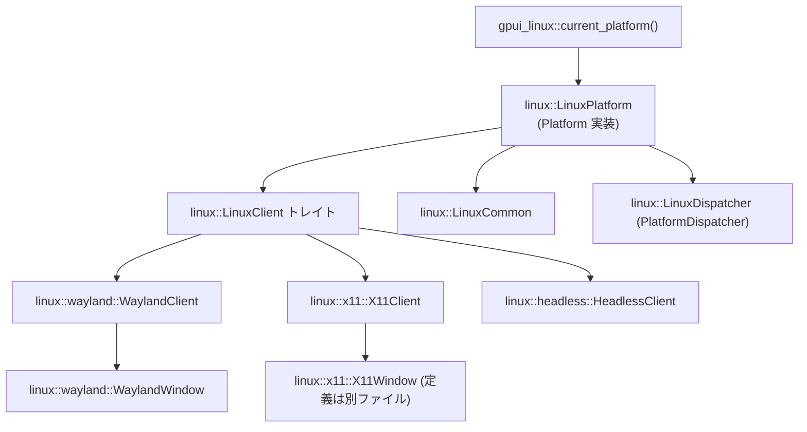
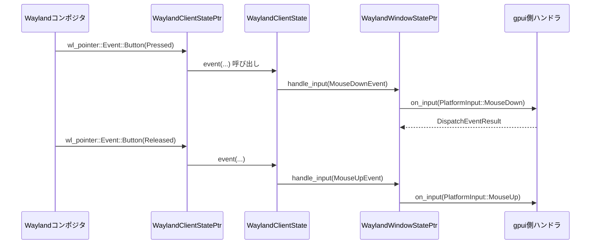

# crates/gpui_linux ディレクトリ解説

## 1. ざっくり一言

`gpui_linux` は、`gpui` フレームワーク向けの **Linux / FreeBSD 用プラットフォーム実装**です。Wayland / X11 / ヘッドレスの各クライアントをまとめ、ウィンドウ・入力・クリップボード・IME・GPU 描画などを OS に合わせて扱えるようにします。

---

## 2. このモジュールの役割

### 2.1 概要

- このディレクトリは、`gpui` の抽象的な `Platform` / `PlatformWindow` / `PlatformDispatcher` などのトレイトを、Linux 系 OS 上で実際に動作させるための実装を提供します。
- Wayland・X11・ディスプレイなし（ヘッドレス）という **3 種類のクライアント**を共通の `LinuxClient` トレイトで抽象化し、`LinuxPlatform<P>` として `gpui` に渡せる形にまとめます。
- また、入力（キーボード・マウス・IME・ジェスチャ）、クリップボードやドラッグ＆ドロップ、ファイルダイアログ（xdg-desktop-portal）、URL/パスのオープン、GPU デバイスヒント、資格情報の保存など、Linux 特有のプラットフォーム機能を一箇所に集約しています。

### 2.2 アーキテクチャ内での位置づけ

全体像を簡略化した依存関係は次のようになっています（ノード数を 10 個以内に絞っています）。



- クレートの公開 API は `src/gpui_linux.rs` の `pub use linux::current_platform;` のみです。
  - `current_platform` の定義は `src/linux.rs` にありますが、このチャンクにはコードが含まれていません。
  - 名前から、適切な `LinuxPlatform<...>` を組み立てて返す工場関数であると考えられます（詳細は `linux.rs` を確認する必要があります）。
- `LinuxPlatform<P>` は `gpui::Platform` を実装し、実際の OS とのやり取りは `P: LinuxClient` （Wayland/X11/Headless のいずれか）に委譲します。
- `LinuxCommon` と `LinuxDispatcher` は、Wayland / X11 / Headless 共通のスレッド実行・テキストシステム・外観情報などを保持します。
- Wayland 側は `linux::wayland::*` モジュール群、X11 側は `linux::x11::*` モジュール群でそれぞれ表示サーバ固有の処理を行います。

### 2.3 設計上のポイント

コードから読み取れる設計上の特徴を列挙します。

- **Backend 抽象化**
  - `LinuxClient` トレイトで Wayland / X11 / Headless を統一し、`LinuxPlatform<P>` からは同じインターフェースで扱える構造になっています。
  - これにより `gpui` 側は「Linux である」ことだけを意識し、Wayland / X11 の違いを意識せずに利用できます。

- **共通インフラの集中**
  - `LinuxCommon` に
    - `BackgroundExecutor` / `ForegroundExecutor`
    - テキストシステム（Wayland/X11 時は `CosmicTextSystem`、それ以外は `NoopTextSystem`）
    - アプリ外観（`WindowAppearance`）、ボタンレイアウト、アプリメニュー用コールバック群
    - calloop の `LoopSignal`
  が集約され、各クライアントから `with_common` で共有されます。

- **イベントループ統合**
  - Wayland / X11 どちらも `calloop::EventLoop` を使い、そこに
    - 「GPUI のメインスレッドキュー」 (`PriorityQueueCalloopReceiver`)
    - OS のイベントソース（WaylandSource や XCB の file descriptor）
    - xdg-desktop-portal からのイベント (`XDPEventSource`)
  を統合しています。

- **スレッド実行と優先度**
  - `LinuxDispatcher` は `gpui::PlatformDispatcher` を実装し、
    - バックグラウンドタスク用のスレッドプール
    - 遅延実行タスク用のタイマースレッド
    - メインスレッド向けの優先度付きキュー
  を管理します。
  - `spawn_realtime` で POSIX `SCHED_FIFO` を使ったリアルタイムスレッドも生成できます。

- **入力処理の共通化**
  - キーボード入力は `xkbcommon` で扱い、`keystroke_from_xkb` / `modifiers_from_xkb` / `capslock_from_xkb` 等で共通の `gpui::Keystroke` / `gpui::Modifiers` に変換します。
  - Dead key / compose 状態も `get_xkb_compose_state` と `keystroke_underlying_dead_key` で扱います。
  - マウスクリックの多重クリック判定は `is_within_click_distance` と `DOUBLE_CLICK_INTERVAL` を Wayland/X11 共通で利用します。

- **クリップボードと DnD**
  - Wayland 側は `wl_data_device` / `zwp_primary_selection` プロトコルを用いて、テキスト・画像・ファイルドロップを `ClipboardItem` にマッピングします。
  - X11 側は `x11rb` ベースの独自 `Clipboard` 実装で PRIMARY/CLIPBOARD を扱い、Xdnd を使ったファイルドロップに対応しています。

- **GPU 関連**
  - `compositor_gpu_hint_from_dev_t`（Wayland, X11 から利用）で compositor が使用している GPU の PCI ID を sysfs / DRI3 から取得し、`gpui_wgpu::CompositorGpuHint` として `WgpuRenderer` の選択にヒントを与えます。
  - Wayland では GPU デバイスロスト時に `WgpuRenderer::recover` を呼び、1 フレームスキップした後に再描画するフローを取っています。

- **ポータル連携**
  - `prompt_for_paths` / `prompt_for_new_path` / `open_uri_internal` / `reveal_path_internal` で `ashpd`（xdg-desktop-portal クライアント）を使い、サンドボックス環境でも動作するファイルダイアログや URI オープンを実装しています。

---

## 3. 主要な機能一覧

このディレクトリが提供する主な機能を箇条書きでまとめます。

- `current_platform` による Linux 用 `Platform` 実装の生成（詳細は `linux.rs` に定義）
- Wayland / X11 / Headless それぞれの **ウィンドウクライアント**の実装
  - ウィンドウ作成・リサイズ・フルスクリーン・最小化・クローズなど
  - 画面スケーリング（HiDPI, Fractional scaling）
  - クライアントサイド/サーバサイド装飾、レイヤーシェル (`layer_shell` モジュール)
- **入力イベント処理**
  - キーボード（修飾キー、レイアウト変更検知、dead key・compose 文字）
  - マウス（クリック、ドラッグ、スクロール、ホイールのスムーズスクロール）
  - タッチパッドのピンチジェスチャー（Wayland: `zwp_pointer_gesture_pinch_v1`, X11: XInput 2.4）
  - IME / テキスト入力（Wayland: text-input-v3, X11: XIM）
- **クリップボード / プライマリ選択 / 画像転送**
  - Wayland: `Clipboard` 構造体で `wl_data_offer` / `zwp_primary_selection_offer_v1` をラップ
  - X11: `linux::x11::clipboard::Clipboard` で PRIMARY / CLIPBOARD を扱い、アプリ内コピーのメタデータも保持
- **ドラッグ＆ドロップ（ファイルドロップ）**
  - Wayland: `wl_data_device` / `text/uri-list` を通じて `FileDropEvent` に変換
  - X11: XDnD プロトコルを利用して `FileDropEvent` を生成
- **ディスプレイ管理**
  - 接続されたモニタの列挙・プライマリディスプレイの取得 (`WaylandDisplay` / `X11Display`)
  - モニタの位置・サイズに応じた座標変換
- **URL / パスのオープン**
  - `open_url` / `reveal_path`（`xdg-open` + xdg-desktop-portal のフォールバック）
- **ファイルダイアログ**
  - `prompt_for_paths` / `prompt_for_new_path` で xdg-desktop-portal の `FileChooser` を利用
- **資格情報（パスワード）保存**
  - `write_credentials` / `read_credentials` / `delete_credentials` が `oo7` キーリングを用いて GitHub アカウントなどの認証情報を保存・取得・削除
- **スクリーンキャプチャ**
  - `screen-capture` feature 有効時に `scap` 経由でスクリーンキャプチャソースを取得（X11 のみサポート実装あり）
- **アプリケーションメニュー・URL スキームなどの OS 連携**
  - メニュー設定、URL オープンイベント、再起動、最近使ったファイル登録など（Linux では一部未実装）

---

## 4. 関数・構造体の解説

### 4.1 型一覧（主要な構造体・列挙体・トレイト）

ここでは、このディレクトリ内で重要度の高い型を抜粋して一覧にします。

| 名前 | 種別 | 役割 / 用途 |
|------|------|-------------|
| `LinuxClient` | トレイト | Wayland / X11 / Headless クライアントに共通のインターフェース。ウィンドウ作成・ディスプレイ列挙・クリップボード操作・`run` などを定義。 |
| `LinuxPlatform<P>` | 構造体 | `P: LinuxClient` を内包し、`gpui::Platform` を実装するラッパー。`gpui` から見た Linux プラットフォームの実体。 |
| `PlatformHandlers` | 構造体 | アプリケーションメニューや URL オープン、Quit などのコールバック群を保持。 |
| `LinuxCommon` | 構造体 | `BackgroundExecutor` / `ForegroundExecutor`、テキストシステム、外観やメニュー等、Wayland / X11 / Headless で共通利用する状態。 |
| `LinuxDispatcher` | 構造体 | `gpui::PlatformDispatcher` の Linux 実装。バックグラウンドスレッドプール・タイマースレッド・メインスレッドキューを管理。 |
| `PriorityQueueCalloopSender<T>` | 構造体 | 優先度付きキュー (`PriorityQueueSender`) と calloop の Ping を組み合わせた送信側ラッパー。送信成功時に EventLoop を起こす。 |
| `PriorityQueueCalloopReceiver<T>` | 構造体 | `PriorityQueueReceiver` を `calloop::EventSource` として扱えるようにした受信側ラッパー。 |
| `LinuxKeyboardLayout` | 構造体 | 現在のキーボードレイアウト名を保持し、`PlatformKeyboardLayout` を実装。 |
| `WaylandClientState` | 構造体 | Wayland クライアントの内部状態：wl_seat, wl_pointer, ウィンドウ一覧、キーボード状態、クリップボード、IME 状態などを保持。 |
| `WaylandClientStatePtr` | 構造体 | `Rc<RefCell<WaylandClientState>>` への弱参照を保持する薄いラッパー。Wayland の `Dispatch` 実装で利用。 |
| `WaylandClient` | 構造体 | Wayland クライアントの公開ラッパー。`LinuxClient` を実装し、ウィンドウ作成や `run` を提供。 |
| `WaylandWindowState` | 構造体 | 特定の Wayland ウィンドウの状態（サーフェス、xdg_toplevel/layer_shell、スケール、描画用 `WgpuRenderer`、入力ハンドラ等）を保持。 |
| `WaylandWindowStatePtr` | 構造体 | `Rc<RefCell<WaylandWindowState>>` と各種コールバックをまとめたハンドル。`WaylandWindow` から操作される。 |
| `WaylandWindow` | 構造体 | `PlatformWindow` を実装する Wayland 用ウィンドウラッパー。 |
| `WaylandDisplay` | 構造体 | Wayland の `wl_output` を `PlatformDisplay` としてラップしたもの。ディスプレイ ID や bounds を提供。 |
| `Clipboard` (Wayland) | 構造体 | Wayland の data offer / primary selection を `ClipboardItem` にマッピングし、読み書きやキャッシュを行う。 |
| `DataOffer<T>` | 構造体 | `WlDataOffer` / `ZwpPrimarySelectionOfferV1` と、その MIME タイプ一覧を一緒に管理するためのラッパー。 |
| `Cursor` | 構造体 | Wayland のカーソルテーマをロードし、`CursorStyle` からアイコンを選択して `wl_pointer` に適用する。 |
| `SerialKind` | enum | Wayland の各種シリアル（マウスクリック、キーボード、DataDevice 等）を識別する列挙体。 |
| `SerialTracker` | 構造体 | 種類別に最新の Wayland シリアル値を保持し、ウィンドウ操作やアクティベーションで再利用する。 |
| `X11ClientState` | 構造体 | X11 クライアントの内部状態（`XCBConnection`、XKB 状態、ウィンドウ一覧、IME 状態、スケールファクタ等）を保持。 |
| `X11ClientStatePtr` | 構造体 | `Weak<RefCell<X11ClientState>>` を保持するラッパー。ウィンドウ側からクライアント状態へアクセスするのに使用。 |
| `X11Client` | 構造体 | X11 クライアントの公開ラッパー。`LinuxClient` を実装し、X11 イベントループやウィンドウ生成を担当。 |
| `HeadlessClientState` | 構造体 | ヘッドレスモードでの EventLoop と `LinuxCommon` を保持する状態。 |
| `HeadlessClient` | 構造体 | ディスプレイのない環境向け `LinuxClient` 実装。ウィンドウ作成は常にエラーを返す。 |

### 4.2 主要な関数・メソッドの詳細

ここでは特に重要な 7 つの関数・メソッドを詳しく説明します。

---

#### `LinuxCommon::new(signal: LoopSignal) -> (Self, PriorityQueueCalloopReceiver<RunnableVariant>)`

**概要**

- GPUI ランタイム側と共通で使う Linux 向け状態 (`LinuxCommon`) を初期化し、メインスレッド用の優先度付きキュー受信側を生成します。
- Wayland / X11 / Headless すべてで共通に使われ、各クライアントの `new` 内から呼ばれます。

**引数**

| 引数名 | 型 | 説明 |
|--------|----|------|
| `signal` | `LoopSignal` | `calloop::EventLoop` から取得した停止シグナル。`quit()` 時などに利用されます。 |

**戻り値**

- `(LinuxCommon, PriorityQueueCalloopReceiver<RunnableVariant>)`
  - `LinuxCommon` はバックグラウンド/フォアグラウンド executor、テキストシステム、外観、メニューなどを含みます。
  - `PriorityQueueCalloopReceiver<RunnableVariant>` は、メインスレッド用タスクキューを calloop イベントループに統合するための `EventSource` です。

**内部処理の流れ**

1. `PriorityQueueCalloopReceiver::new()` で `(main_sender, main_receiver)` を作成。
2. feature に応じてテキストシステムを選択:
   - Wayland / X11 の場合: `CosmicTextSystem::new("IBM Plex Sans")`
   - それ以外: `gpui::NoopTextSystem::new()`
3. `PlatformHandlers::default()` でコールバック群を初期化。
4. `LinuxDispatcher::new(main_sender)` を `Arc` で包み、`BackgroundExecutor` / `ForegroundExecutor` を作成。
5. `LinuxCommon` に各フィールド（executor, text_system, appearance, button_layout, callbacks, signal, menus）をセットし、`(common, main_receiver)` を返します。

**Examples（使用例）**

Wayland クライアント側での利用例（簡略化）です。

```rust
// calloop の EventLoop を作成
let event_loop = calloop::EventLoop::try_new().unwrap(); // イベントループ本体
let signal = event_loop.get_signal();                    // 停止用シグナル

// Linux 共通状態とメインスレッドタスク受信側を初期化
let (common, main_receiver) = LinuxCommon::new(signal);

// EventLoop にメインスレッドタスクの受信を統合
let handle = event_loop.handle();
handle
    .insert_source(main_receiver, move |event, _, _state: &mut _| {
        if let calloop::channel::Event::Msg(runnable) = event {
            runnable.run(); // ここで GPUI の Runnable を実行
        }
    })
    .unwrap();
```

**Errors / Panics**

- この関数自体は `Result` を返さず、内部で `unwrap()` などは使用していません。
- ただし `CosmicTextSystem::new` や `WindowButtonLayout::linux_default()` の内部でパニックする可能性は、コード上からは判断できません。

**Edge cases（エッジケース）**

- `signal` がどの EventLoop から来たかは気にせずに保存するだけなので、誤った `LoopSignal` を渡すと `quit()` が期待通りに動かない可能性があります。

**使用上の注意点**

- `LinuxCommon::new` は各クライアント（Wayland/X11/Headless）の `new` から 1 回だけ呼び出される想定であり、複数の EventLoop に共有するような設計にはなっていません。
- 戻り値の `main_receiver` は必ずどこかの EventLoop に `insert_source` しておく必要があります。そうしないとメインスレッド向けタスクが処理されません。

---

#### `LinuxDispatcher::new(main_sender: PriorityQueueCalloopSender<RunnableVariant>) -> Self`

**概要**

- GPUI のタスクディスパッチャを Linux 向けに構築します。
- バックグラウンド処理用のスレッドプールと、遅延実行用のタイマースレッドを起動します。

**引数**

| 引数名 | 型 | 説明 |
|--------|----|------|
| `main_sender` | `PriorityQueueCalloopSender<RunnableVariant>` | メインスレッド向けタスクキューの送信側。 |

**戻り値**

- `LinuxDispatcher` インスタンス。

**内部処理の流れ**

1. `PriorityQueueReceiver::new()` でバックグラウンド用の `(background_sender, background_receiver)` を作成。
2. 利用可能な並列度からスレッド数を計算（最低 2 スレッド）。
3. スレッド数分のバックグラウンドワーカーを生成:
   - `receiver.iter()` から `RunnableVariant` を取り出し、
   - 実行前後の `Instant` を取得して `TaskTiming` を記録（`profiler::add_task_timing`）。
   - `runnable.run()` を呼ぶ。
4. タイマー用の calloop EventLoop を持つ専用スレッドを生成:
   - `TimerAfter { duration, runnable }` を受け取る `calloop::channel` を作成。
   - メッセージを受け取ったら `calloop::timer::Timer::from_duration(duration)` を EventLoop に登録し、タイマー満了時に `runnable` を実行して `TaskTiming` を記録。
5. バックグラウンドスレッド群とタイマースレッドを `_background_threads` に保持。
6. 現在のスレッド ID を `main_thread_id` として保存。

**Examples（使用例）**

通常は `LinuxCommon::new` 経由で利用されるため、単体で使うことはあまりありませんが、概念的には次のようになります。

```rust
// メインスレッド向けの優先度付きキューを作成
let (main_sender, main_receiver) = PriorityQueueCalloopReceiver::new();

// Dispatcher を作成（バックグラウンドスレッドとタイマースレッドが起動する）
let dispatcher = LinuxDispatcher::new(main_sender);

// BackgroundExecutor / ForegroundExecutor で dispatcher を利用
let bg_exec = gpui::BackgroundExecutor::new(Arc::new(dispatcher));
```

**Errors / Panics**

- バックグラウンドスレッドやタイマースレッドの生成に `std::thread::Builder::spawn(...).unwrap()` を使用しているため、スレッド生成に失敗するとパニックします。
- タイマースレッド内で `EventLoop::try_new().expect("Failed to initialize timer loop!")` を使っているため、calloop の初期化失敗時もパニックします。

**Edge cases**

- `dispatch_on_main_thread` で送信に失敗した場合（メインキューが drop 済みなど）は、`std::mem::forget(runnable);` で runnable を「忘却」します。
  - コメントにある通り、`RunnableVariant` が `!Send` な Future を内包している可能性があり、誤ったスレッドで drop しないための措置です（アプリ終了中である前提）。

**使用上の注意点**

- `LinuxDispatcher` 自体は `Arc` 経由で executor に渡される想定なので、スコープから早期に drop しないことが重要です（drop するとバックグラウンドスレッドも終了します）。
- `spawn_realtime` は `pthread_setschedparam` を使ってリアルタイム優先度を設定しますが、権限が足りない場合は警告ログが出るだけで通常スレッドとして実行されます。

---

#### `impl<P: LinuxClient + 'static> Platform for LinuxPlatform<P>::run(&self, on_finish_launching: Box<dyn FnOnce()>)`

**概要**

- `gpui::Platform` トレイトの `run` 実装です。
- アプリケーションの起動処理（初期化完了コールバック）を実行し、その後 `LinuxClient::run` に処理を委譲して OS のイベントループを開始します。

**引数**

| 引数名 | 型 | 説明 |
|--------|----|------|
| `on_finish_launching` | `Box<dyn FnOnce()>` | プラットフォーム初期化が完了したタイミングで 1 度だけ呼ばれるコールバック。 |

**戻り値**

- 戻り値は `()`（何も返しません）。

**内部処理の流れ**

1. `on_finish_launching()` を即座に呼び出す。
2. `LinuxClient::run(&self.inner)` を呼び出し、Wayland/X11/Headless それぞれのイベントループを開始。
3. イベントループ終了後、`LinuxCommon.callbacks.quit` に登録されているコールバックがあれば呼び出す。

**Examples（使用例）**

`LinuxPlatform` を通じてアプリケーションを起動する概念的な例です（`current_platform` の定義はこのチャンクには無いので、挙動は仮定です）。

```rust
use gpui::Platform;
use gpui_linux::current_platform;

fn main() {
    // Linux 用 Platform 実装を取得（戻り値型は実装コードを参照）
    let platform = current_platform();

    // `run` に起動完了時の処理を渡す
    platform.run(Box::new(|| {
        // ここでウィンドウ作成などの初期処理を行う想定
        println!("Application launched");
    }));

    // `run` が返るのはイベントループが終了した後
}
```

**Errors / Panics**

- `run` 自体はエラーを返しませんが、内部の `LinuxClient::run` 実装（Wayland/X11/Headless）内で `unwrap` や `expect` が使われており、環境依存でパニックする可能性はあります。
- `quit` コールバック実行中にパニックした場合はそのまま伝播します。

**Edge cases**

- 同じ `LinuxPlatform` に対して `run` を複数回呼ぶとどうなるかは、各クライアントの `run` 実装に依存します。
  - Headless / Wayland では `event_loop: Option<_>` を `take()` しているため、2 回目以降の `run` 呼び出しは `"App is already running"` でパニックします。
  - X11 では `take()` 失敗時にログを出して `return` しているため、2 回目以降は何もしません（`log_err` でエラーを記録）。

**使用上の注意点**

- `run` は通常 1 回だけ呼び出すことを前提としています。`run` から戻った後はプラットフォームインスタンスを再利用しない方が安全です。
- 終了処理（リソースの解放・設定の保存など）が必要な場合は、`on_quit` コールバックを利用して行う設計になっています。

---

#### `LinuxPlatform<P>::prompt_for_paths(&self, options: PathPromptOptions) -> oneshot::Receiver<Result<Option<Vec<PathBuf>>>>`

**概要**

- 「ファイル/ディレクトリを開く」ダイアログを表示するための API で、結果を `oneshot::Receiver` 経由で非同期に受け取ります。
- Wayland/X11 の場合は xdg-desktop-portal の `FileChooser`（`ashpd` クレート）を利用します。

**引数**

| 引数名 | 型 | 説明 |
|--------|----|------|
| `options` | `PathPromptOptions` | 複数選択可否、ディレクトリ選択かどうか、ボタンラベルなどのオプション。 |

**戻り値**

- `oneshot::Receiver<Result<Option<Vec<PathBuf>>>>`
  - `Ok(Some(paths))` : ユーザーが 1 個以上のパスを選択した場合。
  - `Ok(None)` : ユーザーがダイアログをキャンセルした場合。
  - `Err(e)` : ポータルが存在しない・DBus エラーなどで失敗した場合。

**内部処理の流れ（Wayland/X11 feature 有効時）**

1. `oneshot::channel()` で `(done_tx, done_rx)` を生成。
2. `inner.window_identifier()` で、現在のアクティブウィンドウの `ashpd::WindowIdentifier` を非同期に取得する Future を開始。
3. `ForegroundExecutor` 上で async タスクを spawn:
   1. `options` からタイトルやラベルを決める。
   2. `ashpd::desktop::file_chooser::OpenFileRequest::default()` に対して
      - `identifier(identifier.await)`
      - `modal(true)`
      - `title(...)`
      - `accept_label(...)`
      - `multiple(...)`
      - `directory(...)`
      などを設定し、`send().await`。
   3. エラーが `PortalNotFound` の場合は定数メッセージ `FILE_PICKER_PORTAL_MISSING` を `Err` として返す。
   4. `request.response()` から URIs を取得し、`file://` などの URI を `PathBuf` に変換して `Vec<PathBuf>` を構築。
4. 最終結果を `done_tx.send(result)` で送信。
5. 呼び出し側には `done_rx` を返す。

**Examples（使用例）**

```rust
use gpui::PathPromptOptions;
use std::path::PathBuf;

// Platform を実装する型を持っていると仮定
fn open_files<P: gpui::Platform>(platform: &P) {
    let options = PathPromptOptions {
        prompt: Some("Open".into()),
        multiple: true,
        directories: false,
        ..Default::default()
    };

    let rx = platform.prompt_for_paths(options);

    // ForegroundExecutor 上などで非同期に待つイメージ
    platform.foreground_executor().spawn(async move {
        match rx.await {
            Ok(Ok(Some(paths))) => {
                for path in paths {
                    println!("Selected: {:?}", path);
                }
            }
            Ok(Ok(None)) => {
                println!("User cancelled");
            }
            Ok(Err(e)) | Err(e) => {
                eprintln!("Error while opening file dialog: {:?}", e);
            }
        }
    }).detach();
}
```

**Errors / Panics**

- ポータルが見つからない場合は `Err(FILE_PICKER_PORTAL_MISSING.into())` が返されます。
- `ashpd::Error::Response`（ユーザキャンセル） は `Ok(None)` に変換されます。
- `foreground_executor().spawn(...).detach()` 内の処理でパニックした場合は、そのスレッド（またはタスク）に限定されて伝播します。

**Edge cases**

- `#[cfg(not(any(feature = "wayland", feature = "x11")))]` の場合、`done_tx.send(Ok(None))` されるだけで、実際のダイアログは表示されません。
- ウィンドウ識別子が `None` の場合は、ポータル側でウィンドウ無しのダイアログになるか、環境によってはエラーになる可能性があります（コード側では特別扱いはしていません）。

**使用上の注意点**

- `prompt_for_paths` 自体は非同期 API であり、戻り値の `Receiver` を必ずどこかで `await` する必要があります。`await` しない場合、ダイアログの結果は無視されます。
- XDG ポータルがインストールされていない環境では失敗するため、その場合のエラー（`FILE_PICKER_PORTAL_MISSING`）をユーザーに分かりやすく表示する必要があります。

---

#### `WaylandClient::new() -> Self`

**概要**

- Wayland 環境への接続・グローバルオブジェクトの探索・calloop EventLoop の初期化・`LinuxCommon` の構築・各種 Wayland ソース登録など、Wayland クライアントの初期化を行います。
- `LinuxClient` を実装する `WaylandClient` のコンストラクタです。

**引数**

- なし。

**戻り値**

- `WaylandClient` インスタンス。

**内部処理の流れ（要約）**

1. `Connection::connect_to_env().unwrap()` で Wayland に接続。
2. `registry_queue_init::<WaylandClientStatePtr>(&conn)` で GlobalList と EventQueue を初期化し、`wl_seat` や `wl_output` を列挙。
3. `calloop::EventLoop::<WaylandClientStatePtr>::try_new().unwrap()` で EventLoop を作成。
4. `LinuxCommon::new(event_loop.get_signal())` を呼び出して共通状態とメインキュー受信側を準備。
5. EventLoop へ
   - メインキュー（`main_receiver`）: `insert_source` し、Runnable を idle として実行
   - `XDPEventSource` : appearance, button_layout, cursor theme/size の更新イベントを登録
6. compositor GPU ヒント検出 (`detect_compositor_gpu`)
7. `WaylandClientState` を構築:
   - `Globals::new(...)` で各 Wayland グローバル（compositor, shm, wm_base, layer_shell 等）をバインド。
   - `data_device` / `primary_selection` / `Cursor` / `Clipboard` 等を初期化。
   - 各種フィールド（ウィンドウマップ・IME 状態・スクロール状態など）を初期値に設定。
8. `WaylandSource::new(conn, event_queue).insert(handle)` で Wayland イベントを calloop に統合。
9. `WaylandClient(Rc::new(RefCell::new(state)))` を返す。

**Examples（使用例）**

`LinuxPlatform` の内部で利用されるイメージです（外部から直接呼び出すことは想定されていません）。

```rust
// WaylandClient を作成
let client = crate::linux::WaylandClient::new();

// LinuxPlatform に包むことで gpui::Platform として扱える
let platform = crate::linux::LinuxPlatform { inner: client };

// 以降、platform を gpui に渡してアプリケーションを駆動する
```

**Errors / Panics**

- 多数の `unwrap()` / `expect()` が使われています。代表的なもの:
  - `Connection::connect_to_env().unwrap()` : Wayland に接続できないとパニック。
  - `EventLoop::try_new().unwrap()` や `insert_source(...).unwrap()` : calloop の初期化失敗時。
  - `seat.unwrap()` : `wl_seat` が見つからない環境ではパニック。
- 実運用上は、Wayland を利用する前提の環境でのみこのコードが動く想定です。

**Edge cases**

- 複数シート（multi-seat）には対応しておらず、`wl_seat` は 1 つだけを前提にしています（`// TODO: Multi seat support` のコメントあり）。
- Output の情報 (`InProgressOutput`) は `wl_output::Event::Done` まで中間状態に保存され、そこで初めて `outputs` に反映されます。

**使用上の注意点**

- `WaylandClient::new()` は `Rc<RefCell<WaylandClientState>>` を内部に持つため、コピー（`Clone`）は軽量ですが、循環参照が起きないように `Weak` を使う設計（`WaylandClientStatePtr`）になっています。
- 外部ユーザーが直接 `WaylandClient::new` を呼ぶことは通常想定されておらず、`current_platform` や `LinuxPlatform` を介して利用されます。

---

#### `WaylandWindow::new(...) -> anyhow::Result<(Self, ObjectId)>`

```rust
pub fn new(
    handle: AnyWindowHandle,
    globals: Globals,
    gpu_context: gpui_wgpu::GpuContext,
    compositor_gpu: Option<CompositorGpuHint>,
    client: WaylandClientStatePtr,
    params: WindowParams,
    appearance: WindowAppearance,
    parent: Option<WaylandWindowStatePtr>,
    target_output: Option<wl_output::WlOutput>,
) -> anyhow::Result<(Self, ObjectId)>
```

**概要**

- 単一の Wayland ウィンドウを作成し、`PlatformWindow` を実装する `WaylandWindow` と、その `wl_surface` の `ObjectId` を返します。
- xdg-shell または layer-shell を用いてウィンドウのロールを設定し、`WgpuRenderer` を初期化します。

**引数（要点のみ）**

| 引数名 | 型 | 説明 |
|--------|----|------|
| `handle` | `AnyWindowHandle` | GPUI 側でウィンドウを識別するためのハンドル。 |
| `globals` | `Globals` | compositor / shm / wm_base / layer_shell 等の Wayland グローバル。 |
| `gpu_context` | `GpuContext` | `WgpuRenderer` を構築するためのコンテキスト。 |
| `compositor_gpu` | `Option<CompositorGpuHint>` | compositor が使っている GPU のヒント（優先的にその GPU を使うため）。 |
| `client` | `WaylandClientStatePtr` | クライアント状態へのポインタ。ウィンドウ閉鎖時などに使用。 |
| `params` | `WindowParams` | 初期バウンズ、タイトル、ウィンドウ種別（Floating/Dialog/LayerShell など）。 |
| `appearance` | `WindowAppearance` | 初期のライト/ダークテーマなど。 |
| `parent` | `Option<WaylandWindowStatePtr>` | 親ウィンドウ（ダイアログなどのモーダルで使用）。 |
| `target_output` | `Option<wl_output::WlOutput>` | 表示先となるモニタ（指定があれば）。 |

**戻り値**

- `Ok((WaylandWindow, ObjectId))` : 成功時。`ObjectId` は `wl_surface` の ID。
- `Err(e)` : layer-shell 未サポートなどでウィンドウ作成に失敗した場合。

**内部処理の流れ**

1. `globals.compositor.create_surface(&globals.qh, ())` で `wl_surface` を生成。
2. `WaylandSurfaceState::new(...)` で
   - `WindowKind::LayerShell` の場合: `zwlr_layer_surface_v1` を作成し、anchor・keyboard interactivity・margin/exclusive_zone を設定。
   - それ以外: `xdg_surface` / `xdg_toplevel` を作成し、親ウィンドウ設定や最小サイズ・装飾 (`zxdg_toplevel_decoration_v1`) を設定。
3. `fractional_scale_manager` があれば `wp_fractional_scale_v1` を要求。
4. `viewporter` があれば `wp_viewport` を生成。
5. `WaylandWindowState::new(...)` を呼び出し:
   - `RawWindow`（Wayland surface/display のポインタ）から `WgpuRenderer::new` を構築。
   - タイトルや最大テクスチャサイズ（ウィンドウの最大サイズ）を設定。
6. `WaylandWindowStatePtr` / `WaylandWindow` を構築し、`surface.commit()` で初期コミット。
7. `(WaylandWindow, surface.id())` を返す。

**Examples（使用例）**

Wayland クライアントからの利用例（実際のコードに近い形）です。

```rust
// WaylandClient::open_window 内の処理イメージ

let mut state = self.0.borrow_mut();

// display_id から target_output を解決（省略）

let appearance = state.common.appearance;
let compositor_gpu = state.compositor_gpu.take();

let (window, surface_id) = WaylandWindow::new(
    handle,                  // AnyWindowHandle
    state.globals.clone(),   // Wayland Globals
    state.gpu_context.clone(),
    compositor_gpu,
    WaylandClientStatePtr(Rc::downgrade(&self.0)),
    params,                  // WindowParams
    appearance,
    parent,
    target_output,
)?;

// クライアント側のウィンドウマップに登録
state.windows.insert(surface_id, window.0.clone());

Ok(Box::new(window) as Box<dyn PlatformWindow>)
```

**Errors / Panics**

- `LayerShellNotSupportedError` が返される可能性があります（layer-shell 用のグローバルが存在しない場合）。
- `WgpuRenderer::new` が `Err` を返した場合、そのまま `anyhow::Result` として伝播します。
- `xkb` や compositor グローバルが見つからない場合など、内部で `unwrap` / `expect` を呼んでいる箇所はこのコンストラクタより前の初期化段階にあります。

**Edge cases**

- `WindowKind::Dialog` の場合、`XdgDialogV1` を作成し `set_modal()` を呼び、`parent` に対して `add_child` することでモーダルの親子関係を管理します。
- `WindowKind::LayerShell` の場合、ウィンドウ位置は compositor に委ねられ、`set_geometry` はサイズのみ設定し位置は無視します。

**使用上の注意点**

- `WaylandWindow` の `Drop` 実装では、blur / decoration / xdg_surface / layer_surface / viewport / wl_surface などを **正しい順序で破棄**し、最後にクライアント側のウィンドウマップから削除します。この順序を変えると Wayland のプロトコル要件を満たせなくなる可能性があります。
- `WaylandWindowStatePtr::is_blocked()` により、子ウィンドウが開いている間は親ウィンドウへの入力がブロックされる設計になっています。

---

#### `X11Client::new() -> anyhow::Result<Self>`

**概要**

- X11 接続・XInput/XKB/RandR/Render の拡張確認・XKB 状態の初期化・XIM クライアントの初期化・calloop EventLoop への X11 イベント統合など、X11 クライアントの立ち上げ処理を行います。

**引数**

- なし。

**戻り値**

- `Ok(X11Client)` : 成功時。
- `Err(anyhow::Error)` : XCB 接続や拡張初期化に失敗した場合。

**内部処理の流れ（要約）**

1. `calloop::EventLoop::try_new()?` で EventLoop を生成。
2. `LinuxCommon::new(event_loop.get_signal())` で共通状態とメインキュー受信側を準備し、EventLoop に挿入。
3. `XCBConnection::connect(None)?` で X サーバに接続し、必要な拡張（XKB, RandR, Render, XInput）情報を prefetch。
4. XInput 2.4 をサポートしているかを確認（ジェスチャイベント用）。
5. `current_pointer_device_states` で現在のポインタデバイスのスクロール情報を初期化。
6. XCB の Atom 群（`XcbAtoms`）を取得。
7. Compositor の存在・GTK frame extents サポートを調べ、クライアントサイド装飾の可否を判断。
8. XKB 拡張を有効化し、監視するイベント種別を設定。
9. `xkb_context` / `xkb_state` / compose state / キーボードレイアウトを初期化。
10. X リソース DB から DPI (`Xft.dpi`) を取得し、`get_scale_factor` でスケールファクタを決定。
11. `cursor::Handle` を初期化。
12. `linux::x11::clipboard::Clipboard::new()` でクリップボードを初期化。
13. DRI3 経由で compositor の GPU を推測 (`detect_compositor_gpu`)。
14. XIM クライアント `X11rbClient` を初期化（失敗しても継続可）。
15. XCB の FD を `calloop::generic::Generic` に包み、EventLoop に登録し、`process_x11_events` を呼ぶコールバックを設定。
16. `XDPEventSource` を登録し、外観やボタンレイアウト変更に応じてウィンドウへ反映。
17. `X11ClientState` を構築し、`X11Client(Rc::new(RefCell::new(...)))` を返す。

**Examples（使用例）**

```rust
// X11Client を作成
let client = crate::linux::X11Client::new()?;

// LinuxPlatform に包む
let platform = crate::linux::LinuxPlatform { inner: client };

// 以後、gpui 側に `platform` を渡して利用
```

**Errors / Panics**

- 多くが `anyhow::Result` としてエラーを返します。例:
  - `XCBConnection::connect` 失敗
  - XKB 拡張が利用不可
  - `XcbAtoms::new` 失敗
  - `resource_manager::new_from_default` 失敗
- 一部 `assert!` があり、XInput バージョンや XKB 拡張のサポート不足が見つかるとパニックします。

**Edge cases**

- XIM サーバが存在しない・途中でクラッシュした場合は、`has_xim()` やエラーハンドリングによりフォールバックとして直接 `handle_event` を呼ぶ流れになっています。
- スムーズスクロール用の valuator が存在しないマウスでは、ボタンベースのスクロールのみになります。

**使用上の注意点**

- X11 環境でしか動作しないコードなので、Wayland セッションでは `current_platform` 側で X11Client が選ばれないようになっていると考えられます（そのロジックは `linux.rs` にありますが、このチャンクには含まれていません）。
- `X11Client::run` は一度 `event_loop` を `take()` するため、複数回呼び出さないようにする必要があります。

---

### 4.3 その他の関数（抜粋）

| 関数名 | 役割（1 行） |
|--------|--------------|
| `open_uri_internal` | `open::commands` と xdg-desktop-portal を用いて URI を外部アプリで開く。 |
| `reveal_path_internal` | パスをファイルマネージャで開く。まず portal、失敗したら `open` クレートでフォールバック。 |
| `is_within_click_distance` | 2 点間の距離がダブルクリック判定用の閾値（5px）以内かどうかを判定。Wayland/X11 両方で使用。 |
| `get_xkb_compose_state` | 環境変数 `LC_CTYPE` 等からロケールを推測し、`xkb::compose::State` を生成。 |
| `cursor_style_to_icon_names` | `CursorStyle` を複数のカーソルアイコン名候補（文字列配列）に変換する。Wayland/X11 共通。 |
| `log_cursor_icon_warning` | カーソルテーマロードに失敗したとき、`XCURSOR_PATH` の値を含めた警告ログを出す。 |
| `keystroke_from_xkb` | `xkb::State` と `Keycode` から `gpui::Keystroke`（キー名・文字・修飾）を組み立てる。 |
| `keystroke_underlying_dead_key` | Dead key に対応する見た目上の文字（アクセント記号など）を返す。 |
| `modifiers_from_xkb` | XKB の modifier 状態から `gpui::Modifiers` を生成。 |
| `capslock_from_xkb` | XKB の capslock 状態から `gpui::Capslock` を生成。 |
| `compositor_gpu_hint_from_dev_t` | `dev_t` から `/sys/dev/char` を辿り、GPU の vendor/device ID を `CompositorGpuHint` に変換。 |
| `mode_refresh_rate` (X11) | RandR の `ModeInfo` からリフレッシュレートを推定し、描画更新間隔 `Duration` を返す。 |
| `get_scale_factor` (X11) | 環境変数 / Xft.dpi / RandR の情報から X11 のスケールファクタを決定。 |

---

## 5. データフロー

ここでは一例として、**Wayland 上でのマウスクリックイベントが GPUI に届くまで**の流れを説明します。

1. ユーザがウィンドウ内をマウスクリックすると、Wayland compositor からクライアントへ `wl_pointer::Event::Button` が送られます。
2. `WaylandClientStatePtr` の `Dispatch<wl_pointer::WlPointer, ()>` 実装が呼ばれ、`wl_pointer::Event::Button` をマッチして `MouseDownEvent` / `MouseUpEvent` を組み立てます。
3. `WaylandClientState` 内でクリック回数（ダブルクリック判定）や修飾キーを更新し、`WaylandWindowStatePtr` に対して `window.handle_input(PlatformInput::MouseDown(...))` を呼びます。
4. `WaylandWindowStatePtr::handle_input` は登録済みの `on_input` コールバックに `PlatformInput` を渡し、上位の GPUI アプリケーションロジックにイベントを伝播します。

これをシーケンス図で表します。



要点:

- クリック回数の判定には `ClickState`（`last_click`, `last_mouse_button`, `last_location`, `current_count`）と `is_within_click_distance` が利用されます。
- ウィンドウが「ブロック中」（モーダルダイアログが開いているなど）であれば、`WaylandWindowStatePtr::is_blocked()` により入力が無視される設計になっています。
- X11 側も同様に `X11Client::handle_event` 内で `MouseDownEvent` / `MouseUpEvent` を生成し、`X11Window` に伝えています。

---

## 6. 使い方（How to Use）

### 6.1 基本的な使用方法

外部からこのクレートを利用する場合、公開されているのは `gpui_linux::current_platform` だけです。定義は `src/linux.rs` にあり、このチャンクには含まれていませんが、名前から「Linux 用の `gpui::Platform` 実装を返す」関数であると想定されます。

概念的な使用例は次のようになります（実際の戻り値型や `gpui` 側 API は実コードを確認してください）。

```rust
use gpui_linux::current_platform;
// gpui 側には Platform トレイトと、それを受け取るランナーがあると仮定
use gpui::Platform;

fn main() {
    // Linux 向け Platform 実装を取得
    let platform = current_platform(); // 戻り値型は実装に依存

    // 以降、gpui のランタイムに platform を渡してアプリを起動する想定です。
    // 例:
    // let app = gpui::Application::new(platform);
    // app.run();
}
```

**ポイント**

- Wayland / X11 / Headless のどれを使うかは `current_platform` 内（`linux.rs`）で環境変数 (`WAYLAND_DISPLAY` / `DISPLAY`) などを見て決めていると考えられますが、このチャンクからは実装を確認できません。
- `gpui` 側から見ると「`Platform` を 1 つもらうだけ」で OS とのやり取りが抽象化されます。

### 6.2 よくある使用パターン

#### パターン 1: Headless モードの利用（内部コード側）

ディスプレイがない環境（CI・テストなど）向けには `HeadlessClient` が用意されています。内部での利用イメージは次の通りです。

```rust
use crate::linux::{LinuxPlatform};
use crate::linux::headless::HeadlessClient;

// headless 専用の Platform を組み立てる例（クレート内コード想定）
fn make_headless_platform() -> LinuxPlatform<HeadlessClient> {
    let client = HeadlessClient::new(); // EventLoop と LinuxCommon を初期化
    LinuxPlatform { inner: client }
}
```

- `HeadlessClient::open_window` は `anyhow::bail!` で
  > "Headless mode does not support screen capture."（screen-capture 時）や
  > "neither DISPLAY nor WAYLAND_DISPLAY is set..."
  
  といったエラーを返し、ウィンドウ表示はできません。
- `run` を呼ぶと EventLoop が回り、メインキュー経由の Runnable は実行されます。

#### パターン 2: URL やファイルパスのオープン

`Platform::open_url` / `reveal_path` は `LinuxPlatform` 側で `LinuxClient` に委譲され、Wayland / X11 両方で内部的には同じヘルパー関数が使われます。

```rust
fn open_docs<P: gpui::Platform>(platform: &P) {
    platform.open_url("https://example.com/docs");
}

fn reveal_logs<P: gpui::Platform>(platform: &P, path: std::path::PathBuf) {
    platform.reveal_path(&path);
}
```

- Wayland/X11 の場合は `open_uri_internal` / `reveal_path_internal` が呼ばれ、
  - まず `open::commands`（`xdg-open` など）での起動を試み、
  - 失敗した場合は xdg-desktop-portal の `OpenFileRequest` / `OpenDirectoryRequest` で DBus 経由のオープンを試みます。
- Headless の場合は何もしない（X11 / Wayland 特化のヘルパーは呼ばれません）。

#### パターン 3: 資格情報の保存と読み出し

`LinuxPlatform` は `Platform` の `write_credentials` / `read_credentials` / `delete_credentials` を実装しており、`oo7` キーリングを使ってパスワードなどを OS の秘密情報ストアに保存します。

```rust
use gpui::Platform;
use anyhow::Result;

async fn store_token<P: Platform>(platform: &P) -> Result<()> {
    let task = platform.write_credentials(
        "https://github.com",
        "user@example.com",
        b"secret-token",
    );
    task.await?; // Task<T> の await 方法は gpui の定義に依存
    Ok(())
}
```

※ `Task` の具体的な操作（`await` メソッドなど）は `gpui` の実装に依存するため、このチャンクからは詳細を確認できません。

### 6.3 よくある間違い

コードから推測できる「やりがちな誤用」とその結果をいくつか挙げます。

```rust
// 間違い例 1: Platform::run を複数回呼ぶ

let platform = current_platform();

// 1 回目は OK
platform.run(Box::new(|| {
    // 初期化処理
}));

// 2 回目の run 呼び出し
platform.run(Box::new(|| {
    // ここで Headless/Wayland では "App is already running" パニック、
    // X11 ではログだけ出して何も起きない。
}));

// 正しい例: run は 1 度だけ呼び出す
let platform = current_platform();
platform.run(Box::new(|| {
    // ここですべての初期化を行い、イベントループ終了まで戻らない前提で設計する
}));
```

```rust
// 間違い例 2: HeadlessClient でウィンドウを開こうとする

let client = crate::linux::headless::HeadlessClient::new();
let platform = crate::linux::LinuxPlatform { inner: client };

// どこかで:
let result = platform.open_window(/* ハンドルとパラメータ */);
// => "neither DISPLAY nor WAYLAND_DISPLAY is set. You can run in headless mode"
//    というエラーになる

// この場合は「ウィンドウを使わない」形のテスト／処理に限定する必要がある
```

```rust
// 間違い例 3: Wayland クリップボードを前提にしすぎる

let item = platform.read_from_clipboard().unwrap(); // unwrap してしまう
// => 他アプリがクリップボードを保持していない／タイミング次第で None が返ってパニック

// 正しい例
if let Some(item) = platform.read_from_clipboard() {
    if let Some(text) = item.text() {
        println!("Clipboard text: {}", text);
    }
}
```

### 6.4 使用上の注意点（まとめ）

- **`run` は 1 回だけ**
  - Headless / Wayland クライアントは `run` を 2 回呼ぶとパニックする設計です。アプリケーションのライフサイクルを 1 回の `run` に収める必要があります。
- **環境変数と feature に依存**
  - Wayland / X11 の有効化は Cargo feature（`wayland`, `x11`）と OS 環境変数（`WAYLAND_DISPLAY`, `DISPLAY`）に依存します。
  - xdg-desktop-portal を利用する機能（ファイルダイアログ・URI オープン）は、ポータルがインストールされていない環境ではエラーになります。
- **リアルタイムスレッド**
  - `spawn_realtime` を使う場合、システム側でリアルタイム優先度が許可されているか、権限に注意が必要です。失敗すると警告が出るだけで通常スレッドとして実行されます。
- **IME / XIM の存在**
  - X11 側では XIM サーバがない場合やクラッシュした場合に IME が使えなくなり、ログにエラーが出ますが、そのままフォールバックでキーボードイベント処理が続行されます。
- **GPU デバイスロスト**
  - Wayland の `WaylandWindow::draw` は GPU デバイスロスト時に `recover` を試み、1 フレームスキップしてから再描画します。復旧に失敗した場合はパニックする設計です（アプリ再起動が必要になる想定）。
- **スクロールの取り扱い**
  - X11 のスムーズスクロールは XInput 2 の valuator に依存しており、デバイスが変更されたりフォーカスが外れた場合にはスクロール値をリセットしています。スクロールイベントの欠落が起きることがありますが、大きなジャンプスクロールを避けるためのトレードオフです。

---

## 7. 関連ファイル

このディレクトリと密接に関係するファイルや他クレートを列挙します。

| パス / クレート | 役割 / 関係 |
|----------------|------------|
| `gpui_linux/src/linux.rs` | `mod linux;` の本体。`current_platform` の定義や、Wayland/X11/Headless どれを使うかの選択ロジックがあると考えられます（このチャンクには未収録）。 |
| `gpui_linux/src/linux/x11/window.rs` | X11 用の `X11Window` 実装。`PlatformWindow` の X11 版。X11Client から使用されています（内容はこのチャンクには登場しません）。 |
| `gpui_linux/src/linux/x11/clipboard.rs` | X11 用の `Clipboard` 実装。PRIMARY / CLIPBOARD の読み書きや Xdnd 連携を提供します。 |
| `gpui_linux/src/linux/x11/xim_handler.rs` | XIM (X Input Method) のコールバックや状態管理を行うヘルパー。`X11Client` から利用。 |
| `gpui_linux/src/linux/xdg_desktop_portal.rs` | `XDPEventSource` と `XDPEvent` を提供し、xdg-desktop-portal からの外観やボタンレイアウト変更イベントを受け取るモジュール（インポートはされていますが、このチャンクには定義がありません）。 |
| `crates/gpui` | このクレートが実装する `Platform` / `PlatformWindow` / `PlatformDispatcher` / `BackgroundExecutor` / `ForegroundExecutor` などのトレイト・型を定義するコアライブラリ。 |
| `crates/gpui_wgpu` | `WgpuRenderer` や `CosmicTextSystem`、`CompositorGpuHint` など、GPU 描画・テキストレンダリング関連の実装を提供。Wayland/X11 ウィンドウから利用されます。 |
| `crates/util` | `ResultExt` トレイトや `command::new_command` / `new_std_command` など、ログ付きエラーハンドリングやプロセス起動のユーティリティを提供。 |
| `crates/scap` | `screen-capture` feature 有効時に利用されるスクリーンキャプチャ用クレート。X11 での画面キャプチャソース取得に使われます。 |

このディレクトリは、上記のクレート・モジュールと連携しながら、Linux 向けのプラットフォーム層を構成しています。
