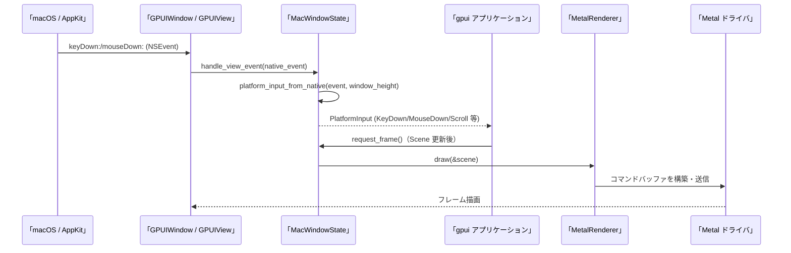

# crates/gpui_macos ディレクトリ解説

## 1. ざっくり一言

`gpui_macos` は、Zed の `gpui` クレートに対する **macOS 専用プラットフォーム実装**です。  
AppKit / CoreGraphics / CoreText / Metal などのネイティブ API をラップし、ウィンドウ・入力・描画・クリップボード・スクリーンキャプチャなどを `gpui::Platform` の実装として提供します。

---

## 2. このモジュールの役割

### 2.1 概要

- このディレクトリは **「macOS 上で GPUI を動かすためのすべて」** を提供します。
- 具体的には、以下を担当します。
  - アプリケーションライフサイクルとメニュー (AppKit)
  - ウィンドウとビュー、入力イベントの受け取り (NSWindow / NSView)
  - Metal による 2D 描画パイプライン
  - フォントロード・テキストレイアウト・グリフラスタライズ (CoreText + font-kit)
  - クリップボード／検索ペーストボード
  - キーボードレイアウトとショートカットの正規化
  - スクリーンキャプチャ (ScreenCaptureKit; オプション機能)
  - Keychain を用いた認証情報の保存・取得

### 2.2 アーキテクチャ内での位置づけ

`gpui_macos` は、`gpui` クレートが定義する抽象トレイト (`Platform`, `PlatformWindow`, `PlatformTextSystem`, `PlatformAtlas` など) の **macOS 向け実装**です。

主要モジュール間の依存関係は次のようになっています。

```mermaid
graph TD
    subgraph crate "gpui_macos"
        Platform["platform.rs\nMacPlatform (gpui::Platform 実装)"]
        Window["window.rs\nMacWindow (gpui::PlatformWindow 実装)"]
        Renderer["metal_renderer.rs\nMetalRenderer"]
        Atlas["metal_atlas.rs\nMetalAtlas (gpui::PlatformAtlas)"]
        Text["text_system.rs\nMacTextSystem (gpui::PlatformTextSystem)"]
        Events["events.rs\nNSEvent → PlatformInput 変換"]
        Keyboard["keyboard.rs\nMacKeyboardLayout / MacKeyboardMapper"]
        Display["display.rs\nMacDisplay (gpui::PlatformDisplay)"]
        Paste["pasteboard.rs\nPasteboard"]
        ScreenCap["screen_capture.rs\nScreenCaptureSource 実装 (任意)"]
        Dispatcher["dispatcher.rs\nMacDispatcher (PlatformDispatcher)"]
    end

    Platform --> Window
    Platform --> Display
    Platform --> Paste
    Platform --> Text
    Platform --> Keyboard
    Platform --> Renderer
    Platform --> ScreenCap
    Platform --> Dispatcher

    Window --> Renderer
    Renderer --> Atlas
    Window --> Events
```

外部クレートとしては `gpui`, `util`, `metal`, `cocoa`, `core-foundation`, `core-text`, `core-graphics`, `Security` などを使用しています。

### 2.3 設計上のポイント

コードから読み取れる設計上の特徴をまとめると以下の通りです。

- **トレイトベースの分離**
  - `MacPlatform` が `gpui::Platform` を実装し、その下で
    - `MacWindow` (`PlatformWindow`)
    - `MacTextSystem` (`PlatformTextSystem`)
    - `MetalAtlas` (`PlatformAtlas`)
    - `MetalHeadlessRenderer` (`PlatformHeadlessRenderer`)
    などが役割ごとに分かれています。

- **Objective-C / C API との橋渡し**
  - `objc`, `cocoa`、そして多数の `unsafe` 呼び出しで AppKit / CoreText / CoreGraphics / Security などと連携します。
  - `ctor` を使ってカスタム Objective-C クラス (`GPUIApplication`, `GPUIWindow`, `GPUIView` など) を **起動時に登録**しています。

- **非同期実行モデルの統合**
  - `MacDispatcher` が `gpui::PlatformDispatcher` を実装し、`dispatch2` と `async_task::Runnable` を使ってバックグラウンド／フォアグラウンドの実行キューを統合しています。
  - タスク実行時間測定も `GLOBAL_THREAD_TIMINGS` を通じて組み込まれています。

- **GPU レンダリングのカプセル化**
  - Metal によるレンダリングは `MetalRenderer` に集約され、`Scene` から `PrimitiveBatch` を順番に処理する構造になっています。
  - テクスチャアトラス管理は `MetalAtlas` + `etagere` に分離されており、レンダリング側は `AtlasTextureId` のみを扱います。

- **OS リソースの寿命管理を Rust 側に閉じ込める**
  - `DisplayLink`, `Pasteboard`, `MacScreenCaptureStream` などが Drop 実装を持ち、内部で `release` や `stop` を呼び出します。
  - 一部では CoreVideo の `DisplayLink` を `std::mem::forget` することでクラッシュを回避するなど、寿命管理が慎重に行われています。

- **キーボード／ロケール依存処理の明示的扱い**
  - `keyboard.rs` に大量のレイアウト別マッピングを持ち、macOS の「キーボードショートカットのローカライズ」を模倣しています。
  - `events.rs` では Carbon API (`UCKeyTranslate`, `TISCopyCurrentKeyboardLayoutInputSource` など) を使ってキーコード→文字列の変換を行っています。

---

## 3. 主要な機能一覧

このディレクトリが提供する主な機能を列挙します。

- **アプリケーション実行環境**
  - `MacPlatform` による `gpui::Platform` 実装
  - AppKit イベントループ (`NSApplication`) の開始・終了管理
  - Dock メニュー、アプリメニュー、URL ハンドリング

- **ウィンドウ管理**
  - `MacWindow` による `PlatformWindow` 実装
  - NSWindow/NSPanel の生成、リサイズ／移動／フルスクリーン・最大化状態の管理
  - タブウィンドウ操作（タブバー表示切り替え、タブの新規ウィンドウへの移動等; 実装は window.rs 後半にあります）

- **入力イベント処理**
  - `events::platform_input_from_native` による `NSEvent` → `gpui::PlatformInput` 変換
  - マウス（クリック、ドラッグ、スクロール、圧力）、タッチパッドジェスチャ（ピンチ、ナビゲーションスワイプ）、キーボード（修飾キー／キー押下）対応

- **キーボードレイアウト・ショートカット**
  - `MacKeyboardLayout` による現在のキーボードレイアウト ID・名称取得
  - `MacKeyboardMapper` によるショートカットキーの「キー等価」変換（QWERTY 以外のレイアウト対応）

- **ディスプレイ管理**
  - `MacDisplay` (`PlatformDisplay`) によるプライマリ／全ディスプレイ列挙、UUID 取得、表示領域・可視領域の取得
  - `DisplayLink` によるリフレッシュレートに同期したフレーム駆動

- **GPU レンダリング (Metal)**
  - `MetalRenderer` による `Scene` → Metal コマンドバッファへの描画
  - `MetalAtlas` によるモノクロ／カラーのテクスチャアトラス管理
  - オフスクリーン描画 (`render_scene_to_image`) とヘッドレスレンダリング (`MetalHeadlessRenderer`)

- **テキストシステム**
  - `MacTextSystem` によるフォント列挙／選択、メトリクス取得 (`PlatformTextSystem`)
  - CoreText ベースの行レイアウト (`layout_line`) と glyph ラスタライズ (`rasterize_glyph`)
  - OpenType フィーチャ・フォントフォールバック設定 (`open_type::apply_features_and_fallbacks`)

- **クリップボード**
  - `Pasteboard` による通常クリップボード／検索クリップボード（Find pasteboard）への読み書き
  - 文字列 + メタデータ（独自の hash と JSON 相当文字列）の保存・復元
  - 画像 (PNG/JPEG/TIFF/WebP/GIF/BMP/SVG/ICO) の読み書き
  - Finder 等からのファイルパス貼り付け (`ExternalPaths`)

- **スクリーンキャプチャ（オプション機能）**
  - `MacScreenCaptureSource` (ScreenCaptureKit) によるディスプレイごとのソース列挙
  - `MacScreenCaptureStream` による連続フレーム取得 (`ScreenCaptureFrame`)

- **認証情報ストレージ**
  - macOS Keychain を利用した URL ごとの資格情報 (ユーザ名・パスワード) の保存・取得・削除

---

## 4. 関数・構造体の解説

### 4.1 主な構造体・型一覧

| 名前 | 定義ファイル | 役割 / 用途 |
|------|--------------|-------------|
| `MacPlatform` | `platform.rs` | `gpui::Platform` の macOS 実装。アプリ起動、ウィンドウ生成、メニュー、クリップボード、スクリーンキャプチャ、Keychain などを束ねます。 |
| `MacPlatformState` | `platform.rs` | `MacPlatform` の内部状態。Executor・TextSystem・メニュー・コールバック群・Dock メニュー・キーボードマッパなどを保持します。 |
| `MacWindow` | `window.rs` | `PlatformWindow` を実装する macOS ウィンドウラッパ。内部で `NSWindow` / `NSView` と `MetalRenderer` を管理します。 |
| `MacWindowState` | `window.rs` | `MacWindow` の実体。イベントコールバック、表示リンク、レンダラ、ウィンドウ状態（フルスクリーン・シート親など）を保持します。 |
| `MacDispatcher` | `dispatcher.rs` | `PlatformDispatcher` 実装。`dispatch2` のグローバルキューを利用し、優先度付きのタスク実行・リアルタイムオーディオスレッド設定を行います。 |
| `MacDisplay` | `display.rs` | `PlatformDisplay` 実装。`CGDirectDisplayID` を包み、ディスプレイ ID / UUID / Bounds / visible bounds を返します。 |
| `DisplayLink` | `display_link.rs` | CoreVideo の `CVDisplayLink` を安全な Rust ラッパにしたもの。DispatchSource 経由でフレーム通知を行います。 |
| `Pasteboard` | `pasteboard.rs` | NSPasteboard ラッパ。テキスト、画像、外部パスを `ClipboardItem` として読み書きします。 |
| `MacKeyboardLayout` | `keyboard.rs` | 現在のキーボードレイアウトの ID・表示名を取得します。 |
| `MacKeyboardMapper` | `keyboard.rs` | レイアウト固有の「キー等価」マッピング（例: cmd-[ → cmd-ö）を適用し、`KeybindingKeystroke` に変換します。 |
| `MetalAtlas` | `metal_atlas.rs` | `PlatformAtlas` 実装。`AtlasKey`→`AtlasTile` の管理、Metal テクスチャの確保・解放・アップロードを行います。 |
| `MetalRenderer` | `metal_renderer.rs` | Metal ベースの描画エンジン。`Scene` を `PrimitiveBatch` ごとに描画し、`CAMetalLayer` またはオフスクリーンテクスチャに出力します。 |
| `InstanceBufferPool` / `InstanceBuffer` | `metal_renderer.rs` | インスタンス用 Metal バッファの再利用プールとその 1 枚分。大きさ自動拡張ロジックを持ちます。 |
| `MacTextSystem` | `text_system.rs` | `PlatformTextSystem` 実装。System フォント + メモリ内フォントの管理、行レイアウト、グリフ描画を担当します。 |
| `FontKey` / `MacTextSystemState` | `text_system.rs` | フォントファミリ＋フィーチャ＋フォールバックのキー、および内部状態。`font_ids_by_font_key` などのキャッシュを保持します。 |
| `MacScreenCaptureSource` | `screen_capture.rs` | `ScreenCaptureSource` 実装（gpui 側トレイト）。ScreenCaptureKit の display オブジェクトをラップします。 |
| `MacScreenCaptureStream` | `screen_capture.rs` | `ScreenCaptureStream` 実装。1 ディスプレイの連続フレームストリームを表します。 |
| `PointF`, `PathRasterizationVertex`, `PathSprite`, `SurfaceBounds` | `metal_renderer.rs` | Metal シェーダと共有する頂点・インデックス用の C 互換構造体。`build.rs` から cbindgen で C ヘッダにエクスポートされます。 |

### 4.2 代表的な関数・メソッド

#### `MacPlatform::new(headless: bool) -> Self`（`platform.rs`）

**概要**

- macOS 向けの `Platform` 実装を初期化します。
- headless モード（ウィンドウを持たずに CFRunLoop だけ回す）かどうかを切り替えられます。

**引数**

| 引数名 | 型 | 説明 |
|--------|----|------|
| `headless` | `bool` | `true` で GUI なしのヘッドレスモード。`run` 時に AppKit を起動せず CFRunLoop をまわします。 |

**戻り値**

- `MacPlatform` インスタンス。内部に `MacPlatformState` を `Mutex` で保持します。

**内部処理の流れ**

1. `MacDispatcher` を `Arc` で生成。
2. フォント機能の有無 (`font-kit` feature) に応じて `text_system` を `MacTextSystem` または `NoopTextSystem` に設定。
3. 現在の `MacKeyboardLayout` を読み、`MacKeyboardMapper` を作成。
4. `BackgroundExecutor` / `ForegroundExecutor` を `MacDispatcher` ベースで作成。
5. `Pasteboard::general()` / `Pasteboard::find()` を生成。
6. `renderer_context: renderer::Context::default()` を確保。
7. これらをまとめて `MacPlatformState` を構築し、それを `Mutex` でラップした `MacPlatform` を返します。

**使用例**

```rust
use gpui_macos::MacPlatform;

fn main() {
    // GUI ありで起動する MacPlatform を生成する
    let platform = MacPlatform::new(false); // false = headless ではない

    // gpui 側のエントリポイントから `run` を呼び出す想定です
    platform.run(Box::new(|| {
        // ここでアプリケーション固有の初期化処理を実行する
        // 例: ウィンドウの作成や状態の初期化など
    }));
}
```

**エッジケース・注意点**

- `headless == true` の場合、`run` 内で AppKit の `NSApplication::run` は呼ばれず、`CFRunLoopRun` のみ実行されます。
- `MacPlatform` は多くの macOS API を使うため、**必ず macOS 上でビルド・実行**する必要があります（`#![cfg(target_os = "macos")]` が付いています）。

---

#### `MacPlatform::run(&self, on_finish_launching: Box<dyn FnOnce()>)`（`platform.rs`）

**概要**

- アプリケーションのメインイベントループを開始します。
- GUI モードの場合、`NSApplication` と `GPUIApplicationDelegate` を設定し、起動完了時に `on_finish_launching` を呼びます。

**引数**

| 引数名 | 型 | 説明 |
|--------|----|------|
| `on_finish_launching` | `Box<dyn FnOnce()>` | AppKit の起動が完了した直後（`applicationDidFinishLaunching:`）に実行されるコールバック。 |

**戻り値**

- なし。呼び出しは AppKit のループが終了するまで戻りません。

**内部処理（非ヘッドレス時）**

1. `MacPlatformState` に `finish_launching` としてコールバックを格納。
2. `NSApplication` を `GPUIApplication` クラスとして生成 (`APP_CLASS`)。
3. `GPUIApplicationDelegate` を作成し、`APP_DELEGATE_CLASS` をデリゲートとして設定。
4. 両方のオブジェクトに `MAC_PLATFORM_IVAR` として `MacPlatform` のポインタを ivar で埋め込む。
5. `NSAutoreleasePool` を作成し、`app.run()` を呼ぶ。
6. イベントループ終了後、ivar を `null_mut` に戻してクリーンアップ。

**内部処理（ヘッドレス時）**

1. `headless == true` の場合は `on_finish_launching` を即座に呼び出す。
2. その後 `CFRunLoopRun()` を呼び、CFRunLoop ベースのイベント待ちに入ります。

**使用例**

上記 `MacPlatform::new` の例参照。

**エッジケース・注意点**

- UI モードでは `on_finish_launching` は **AppKit の通知ハンドラ内から**呼ばれます (`did_finish_launching`)。
- `quit()` は DispatchQueue 経由で非同期に `terminate:` を呼ぶ設計になっており、`run` 内での借用再入を避けています。

---

#### `MacPlatform::open_window(&self, handle: AnyWindowHandle, options: WindowParams) -> Result<Box<dyn PlatformWindow>>`（`platform.rs`）

**概要**

- 新しい gpui ウィンドウを macOS ウィンドウとして開きます。
- 内部で `MacWindow::open` を呼び出し、Metal レンダラ付きの `NSWindow` / `NSView` を構成します。

**引数**

| 引数名 | 型 | 説明 |
|--------|----|------|
| `handle` | `AnyWindowHandle` | gpui 側のウィンドウハンドル。イベントルーティングなどで使用されます。 |
| `options` | `WindowParams` | サイズ、種別 (`WindowKind`)、可動／リサイズ可否、初期表示位置、タブ ID などウィンドウ作成時の各種パラメータ。 |

**戻り値**

- `Result<Box<dyn PlatformWindow>>`  
  成功時には `MacWindow` を `Box<dyn PlatformWindow>` として返します。

**内部処理の流れ**

1. `renderer_context` を `MacPlatformState` からクローン。
2. `MacWindow::open` に
   - `handle`
   - `options`
   - `self.foreground_executor()`
   - `self.background_executor()`
   - `renderer_context`
   を渡してウィンドウを生成。
3. 生成に成功すれば `Ok(Box::new(MacWindow))` を返します。

**使用例（概念的なコード）**

```rust
use gpui_macos::MacPlatform;
use gpui::{AnyWindowHandle, WindowParams, WindowKind, px, size};

fn create_main_window(platform: &MacPlatform, handle: AnyWindowHandle) {
    let params = WindowParams {
        bounds: Some(gpui::WindowBounds::Windowed(
            // 原点 (100, 100), サイズ (800, 600) のウィンドウ
            gpui::Bounds::new(
                gpui::point(px(100.0), px(100.0)),
                size(px(800.0), px(600.0)),
            ),
        )),
        kind: WindowKind::Normal,
        // 他のフィールドはデフォルト値と仮定（詳細はこのチャンクには未登場）
        ..Default::default() // 実際に Default が実装されているかは、このチャンクからは不明です
    };

    let _window = platform.open_window(handle, params).unwrap();
    // _window は gpui 側で保持し、イベントや描画の呼び出しに利用されます。
}
```

※ `WindowParams` の完全なフィールド構成や `Default` 実装の有無は、このチャンクには出てこないため推測です。具体的な使い方は `gpui` 側のコードに依存します。

**エッジケース・注意点**

- `renderer_context` は `renderer::Context = Arc<Mutex<InstanceBufferPool>>` であり、すべてのウィンドウで共有されます。
- `open_window` 自身はスレッドセーフに設計されていますが、macOS の制約上 **ウィンドウ操作はメインスレッドで行う**必要があります（`NSApplication` の制約）。

---

#### `MetalRenderer::draw(&mut self, scene: &Scene)`（`metal_renderer.rs`）

**概要**

- ウィンドウに紐づく `CAMetalLayer` の次の drawable を取得し、渡された `Scene` を Metal で描画して画面に表示します。

**引数**

| 引数名 | 型 | 説明 |
|--------|----|------|
| `scene` | `&Scene` | gpui が構築した描画命令列。`PrimitiveBatch` の配列として四角形・影・パス・スプライトなどを含みます。 |

**戻り値**

- なし。描画は非同期に GPU に送信されます。

**内部処理の流れ（概要）**

1. `self.layer` から `drawable_size` を読み、`Size<DevicePixels>` に丸めます。
2. `next_drawable()` で描画先テクスチャを取得。失敗時はログを出して終了。
3. ループを開始し、以下を試みます。
   1. `InstanceBufferPool` からバッファを `acquire`。
   2. `draw_primitives(scene, &mut instance_buffer, drawable, viewport_size)` を呼び出し、`CommandBuffer` を構築。
   3. 成功 (`Ok(command_buffer)`) なら:
      - `add_completed_handler` で描画完了時にバッファを `release` するブロックを登録。
      - `presents_with_transaction` に応じて
        - `command_buffer.commit(); wait_until_scheduled(); drawable.present();` または
        - `command_buffer.present_drawable(drawable); command_buffer.commit();`
        を実行し、描画を完了。
      - 関数を終了。
   4. 失敗 (`Err(err)`) なら:
      - ログ出力。
      - `InstanceBufferPool::buffer_size` を 2 倍に増やし、256MB を超えたらログを出して終了。
      - ループを継続し再トライ。

**エッジケース**

- `layer.next_drawable()` が `None` を返した場合は描画せずエラーをログ出力します。
- `scene` が巨大すぎてインスタンスバッファに収まらない場合、バッファサイズを段階的に増やして再描画を試行します。256MB を超えると諦めます。

**使用例（テスト・サポート用途でのイメージ）**

通常は `MacWindow` が内部で `MetalRenderer::draw` を呼び出すため、直接呼ぶことは想定されていません。  
オフスクリーン描画を行いたい場合には、同ファイルの `render_scene_to_image` または `MetalHeadlessRenderer` を使用します（後述）。

---

#### `MacTextSystem::layout_line(&self, text: &str, font_size: Pixels, font_runs: &[FontRun]) -> LineLayout`（`text_system.rs`）

**概要**

- CoreText を利用して 1 行分のテキストをレイアウトし、`ShapedRun` / `ShapedGlyph` の列と基本メトリクスを返します。

**引数**

| 引数名 | 型 | 説明 |
|--------|----|------|
| `text` | `&str` | レイアウト対象の UTF-8 文字列。 |
| `font_size` | `Pixels` | 実際の描画に使うフォントサイズ。 |
| `font_runs` | `&[FontRun]` | 文字列の一部範囲にどの `FontId` を割り当てるかの情報。`len` は UTF-8 バイト数です。 |

**戻り値**

- `LineLayout`  
  - `runs: Vec<ShapedRun>`（フォント単位の run）
  - `width`, `ascent`, `descent`, `len` などを含みます。

**内部処理の流れ（要約）**

1. `CFMutableAttributedString` を作成。
2. `font_runs` を順に走査し、それぞれのテキスト片を UTF-16 に変換して attributed string に追加。
3. 各 run ごとに:
   - 対応する `FontKitFont` を取得。
   - Font のメトリクスから ascent / descent をスケールし、全体の最大値を更新。
   - `clone_with_font_size(font_size)` した `CTFont` を attribut に設定。
4. CoreText の `CTLine::new_with_attributed_string` から `CTLine` を作り、`glyph_runs()` を列挙。
5. 各 glyph_run について:
   - その `CTFont` を `id_for_native_font` で `FontId` に変換（なければ登録）。
   - 同じ FontId が続く場合は直前の `ShapedRun` に glyph を追加。
6. 各 glyph について:
   - `glyph_id`, `position (CGPoint)`, `string_index (UTF-16)` を取得。
   - `StringIndexConverter` により UTF-16 index → UTF-8 index に変換し、`ShapedGlyph::index` として保存。
7. `CTLine::get_typographic_bounds` で typographic bounds を取得し、`LineLayout` に組み立てて返す。

**テストから読み取れるエッジケース**

- `\u{feff}`（BOM）を含む文字列:
  - BOM 自体には glyph が存在しないため、レイアウト結果ではスキップされるが、`LineLayout::len` は元の文字列長を維持します。
- ZWNJ 等の特殊文字を含むケースでも、`glyph.index < text.len()` が成り立つようにインデックス計算が行われます（テスト `test_layout_line_zwnj_insertion`）。

**使用例（概念的）**

```rust
use gpui_macos::MacTextSystem;
use gpui::{font, FontRun, PlatformTextSystem, px};

fn layout_example() {
    // テキストシステムを構築
    let text_system = MacTextSystem::new();

    // フォント ID を取得（"Helvetica" は例。実際の存在可否は環境によります）
    let font_id = text_system.font_id(&font("Helvetica")).unwrap();

    let text = "Hello, world!";
    let font_runs = [FontRun {
        font_id,
        len: text.len(), // UTF-8 バイト長
    }];

    // 1 行レイアウト
    let layout = text_system.layout_line(text, px(16.0), &font_runs);

    // layout.runs[0].glyphs から glyph ごとの位置や文字インデックスを参照できます。
}
```

---

#### `Pasteboard::read(&self) -> Option<ClipboardItem>` / `Pasteboard::write(&self, item: ClipboardItem)`（`pasteboard.rs`）

**概要**

- macOS の `NSPasteboard` から `ClipboardItem` を読み出す／書き込むラッパです。
- テキスト、画像、外部ファイルパスを `ClipboardEntry` の列として扱います。

**`read` の内部処理（優先順位）**

1. **ファイルパス (`NSFilenamesPboardType`)**
   - `propertyListForType` でパスの配列を取得。
   - 1 個以上存在すれば `PathBuf` の配列に変換し、`ClipboardEntry::ExternalPaths` として格納。
   - さらに、テキストとしてパスの文字列表現がペーストボードにあれば、それも `ClipboardEntry::String` として追加。
2. **プレーンテキスト**
   - `public.utf8-plain-text` を持っているか確認。
   - `NSData` を取り出し、0 長や `bytes() == NULL` のケースを考慮しつつ `String` に変換。
   - 追加で、`zed-text-hash` と `zed-metadata` という独自 UTI からメタデータを復元可能であれば `ClipboardString::metadata` に設定。
3. **画像**
   - `ImageFormat::iter()` で各フォーマットに対応する UTI (`UTType`) を調べ、最初に見つかったフォーマットのデータを `ClipboardEntry::Image` として返す。

**`write` の挙動**

- `item.entries` のパターンに応じて分岐:
  - `[]`: `clearContents()` してクリップボードを空にする。
  - `[String]`: `write_plaintext` により UTF-8 テキストとメタデータ（あれば）を独自 UTI 付きで書き込む。
  - `[Image]`: `write_image` により画像バイト列を書き込む。
  - `[ExternalPaths]`: 現状、書き込みは行われません（コメントに「今は文字列のみ」と明記）。
  - 混在する場合: 文字列だけを連結して一つの `ClipboardString` として書き込みます（既存の挙動を踏襲）。

**使用例（テキストのコピー＆ペースト）**

```rust
use gpui_macos::pasteboard::Pasteboard;
use gpui::{ClipboardItem, ClipboardEntry, ClipboardString};

fn clipboard_example() {
    let pb = Pasteboard::general();

    // テキストを書き込む
    let item = ClipboardItem::new_string("hello".to_string());
    pb.write(item);

    // テキストを読み出す
    if let Some(read_item) = pb.read() {
        for entry in read_item.entries {
            if let ClipboardEntry::String(s) = entry {
                println!("clipboard text = {}", s.text());
            }
        }
    }
}
```

**エッジケース・注意点**

- 他アプリが書き込んだテキストについては、`zed-text-hash` / `zed-metadata` が存在しないため `metadata` は `None` になります。
- `data.bytes()` が `NULL` かつ `length == 0` の `NSData` については空文字列として扱っています（Apple のドキュメントの仕様に対応）。
- 外部パス読み取りでは、パスと同時に `NSPasteboardTypeString` がある場合、テキストとしてのパスも返します（テスト参照）。

---

#### `MacScreenCaptureSource::stream(&self, ..., frame_callback: Box<dyn Fn(ScreenCaptureFrame) + Send>)`（`screen_capture.rs`）

**概要**

- ScreenCaptureKit の `SCStream` を開始し、選択されたディスプレイの画面フレームをコールバックで受け取るストリームを生成します。

**戻り値**

- `oneshot::Receiver<Result<Box<dyn ScreenCaptureStream>>>`  
  ストリーム開始の完了・失敗が非同期で返ります。成功時は `MacScreenCaptureStream` が `Box<dyn ScreenCaptureStream>` として返ります。

**内部処理の流れ**

1. `SCStream`, `SCContentFilter`, `SCStreamConfiguration`, `GPUIStreamDelegate`, `GPUIStreamOutput` を `alloc` / `init`。
2. `SCContentFilter` に `initWithDisplay:excludingWindows:` で対象ディスプレイを設定。
3. `SCStreamConfiguration` に対して:
   - `setScalesToFit: true`
   - `setPixelFormat: 0x42475241`（'BGRA'）
   - `setWidth` / `setHeight` に `metadata().resolution` を設定。
4. `GPUIStreamOutput` の ivar `FRAME_CALLBACK_IVAR` に `frame_callback` を `Box` の生ポインタとして保存。
5. `stream.initWithFilter:configuration:delegate:` でストリームを構築。
6. `addStreamOutput:type:sampleHandlerQueue:error:` で `output` を登録し、エラーなら即座に `Err` を返して終了。
7. `startCaptureWithCompletionHandler:` にブロックを渡し、開始完了時に
   - 成功: `MacScreenCaptureStream` を生成して `Ok(Box<dyn ScreenCaptureStream>)` を送信。
   - 失敗: `stream` / `output` を `release` し、`Err` を送信。

**フレーム処理**

- `GPUIStreamOutput` の `stream:didOutputSampleBuffer:ofType:` 実装で:
  - `buffer_type != SCStreamOutputTypeScreen` の場合は無視。
  - `CMSampleBufferRef` から `image_buffer()` を取得できた場合のみ:
    - `FRAME_CALLBACK_IVAR` から `Box<Box<dyn Fn(ScreenCaptureFrame)>>` を取り出す。
    - `ScreenCaptureFrame(buffer)` としてコールバックを呼び出し、`mem::forget` で Box を保持したままにする（次のフレームでも使うため）。

**エッジケース・注意点**

- `MacPlatform::is_screen_capture_supported` が macOS 12.3 以上かをチェックしています。古い macOS ではこの機能は利用できません。
- `GPUIStreamOutput` に保存されるコールバックポインタの寿命はストリームの寿命に依存するため、`MacScreenCaptureStream` の Drop で `stopCaptureWithCompletionHandler:` を呼び出して正しく終了させています。

---

## 5. データフロー

ここでは、**ユーザー入力イベントが gpui まで届き、描画が行われる典型的な流れ**を説明します。

1. ユーザーがキーボードやマウス操作を行うと、AppKit が `NSEvent` を `NSWindow` / `NSView` にディスパッチします。
2. カスタムクラス `GPUIView`（`VIEW_CLASS`）の各種メソッド (`mouseDown:`, `keyDown:` など) が `handle_view_event` や `handle_key_down` 等に転送されます（これらの実装は `window.rs` 後半にあり、このチャンクでは途中までです）。
3. `MacWindowState` は `platform_input_from_native(native_event, window_height)` を通じて `NSEvent` を `PlatformInput` に変換します（`events.rs`）。
4. 登録済みの `event_callback: Option<Box<dyn FnMut(PlatformInput)>>` を通じて、gpui のアプリケーションロジックにイベントが渡ります。
5. アプリケーションロジックは状態を更新し、必要に応じて `request_frame` を呼び出します（`MacWindowState` 内のコールバック）。
6. `MacWindowState` は `MetalRenderer::draw(scene)` を呼び、最新の `Scene` を GPU に送信します。
7. `MetalRenderer` は `CAMetalLayer` の drawable に対して描画し、ウィンドウに反映します。

これをシーケンス図で表すと次のようになります（gpui 側は概念的なコンポーネントとして記載します）。



※ `handle_view_event` / `request_frame` の具体的な実装は `window.rs` の後半にありますが、このチャンクでは途中までのため詳細は不明です。ただし、フィールドや呼び出し関係から上記のような流れになっていると解釈できます。

---

## 6. 使い方（How to Use）

### 6.1 基本的な使用方法

#### 6.1.1 MacPlatform を使ったアプリ起動

このクレートは通常、`gpui` クレートから呼び出されますが、単純化した例として、`MacPlatform` を直接使って macOS アプリを起動するコードを示します。

```rust
use gpui_macos::MacPlatform;

fn main() {
    // headless = false で通常の GUI アプリとして起動する
    let platform = MacPlatform::new(false);

    // アプリ起動完了時に呼ばれるコールバックを登録して run する
    platform.run(Box::new(|| {
        // ここで gpui アプリケーション側の初期化を行う想定
        // 例: ウィンドウの作成やドキュメントの読み込みなど
    }));
}
```

実際には `gpui` 側で `MacPlatform` を受け取って `App` や `Workspace` を初期化するコードが存在するはずですが、その詳細はこのチャンクには含まれていません。

#### 6.1.2 ヘッドレスレンダリング（テスト・サーバー用途）

テストやスクリーンショット生成など、ウィンドウなしでシーンを画像にレンダリングしたい場合は `MetalHeadlessRenderer` を利用できます。

```rust
use gpui_macos::metal_renderer::MetalHeadlessRenderer;
use gpui::{Scene, Size, DevicePixels, px, size};

fn render_scene_offscreen(scene: &Scene) {
    // ヘッドレスレンダラを作成する
    let mut renderer = MetalHeadlessRenderer::new();

    // 描画サイズを指定する (例: 800x600)
    let image_size = Size {
        width: DevicePixels(800),
        height: DevicePixels(600),
    };

    // Scene を画像にレンダリングする
    let image = renderer
        .render_scene_to_image(scene, image_size)
        .expect("render failed");

    // image は image::RgbaImage なので、PNG として保存するなどができます
    // image.save("output.png").unwrap();
}
```

### 6.2 よくある使用パターン

#### 6.2.1 クリップボードの利用（Platform 経由）

通常は `Pasteboard` を直接使うのではなく、`Platform` 実装経由でクリップボードにアクセスします。

```rust
use gpui_macos::MacPlatform;
use gpui::{ClipboardItem, ClipboardEntry, ClipboardString};

fn clipboard_via_platform(platform: &MacPlatform) {
    // 文字列を書き込む
    let item = ClipboardItem::new_string("hello from gpui".to_string());
    platform.write_to_clipboard(item);

    // 読み出す
    if let Some(item) = platform.read_from_clipboard() {
        for entry in item.entries {
            if let ClipboardEntry::String(s) = entry {
                println!("clipboard text = {}", s.text());
            }
        }
    }
}
```

#### 6.2.2 スクリーンキャプチャ（feature = "screen-capture"）

`screen-capture` フィーチャが有効な場合、`Platform` からスクリーンキャプチャソースを取得できます。

```rust
use gpui_macos::MacPlatform;
use futures::executor::block_on;

fn list_screen_sources(platform: &MacPlatform) {
    #[cfg(feature = "screen-capture")]
    {
        // 非同期にディスプレイ一覧を取得する
        let rx = platform.screen_capture_sources();
        let result = block_on(rx).unwrap(); // oneshot::Receiver<Result<...>>

        match result {
            Ok(sources) => {
                for source in sources {
                    let meta = source.metadata().unwrap();
                    println!(
                        "display id={} label={:?} size={}x{}",
                        meta.id,
                        meta.label,
                        meta.resolution.width.0,
                        meta.resolution.height.0
                    );
                }
            }
            Err(err) => eprintln!("failed to list screen capture sources: {err}"),
        }
    }
}
```

#### 6.2.3 テキストレイアウト・グリフ描画

テキストレイアウト単体をテストしたい場合、`MacTextSystem` を直接生成して利用できます。

```rust
use gpui_macos::MacTextSystem;
use gpui::{PlatformTextSystem, font, FontRun, px};

fn layout_text() {
    let text_system = MacTextSystem::new();
    let font_id = text_system.font_id(&font("Helvetica")).unwrap();
    let text = "Hello, world!";
    let font_runs = [FontRun {
        font_id,
        len: text.len(),
    }];
    let layout = text_system.layout_line(text, px(16.0), &font_runs);

    println!("line width (px) = {}", layout.width.as_f32());
}
```

### 6.3 使用上の注意点（まとめ）

このディレクトリのモジュールを利用する際の共通の注意点をまとめます。

- **macOS 専用**
  - すべてのモジュールは `target_os = "macos"` に依存しています。他 OS ではコンパイルできません。
- **メインスレッド制約**
  - AppKit の API (`NSApplication`, `NSWindow`, `NSView`, `NSOpenPanel` など) は **メインスレッドからのみ**呼び出す必要があります。
  - このため、多くの操作は `ForegroundExecutor`／`DispatchQueue::main()` 経由で行われています。
- **unsafe 呼び出しのカプセル化**
  - Objective-C / C API は `unsafe` ブロックでラップされています。`MacPlatform` や `MacWindow` を経由して利用する限り、利用側では `unsafe` を書かずに済みます。
- **ゼロサイズテクスチャの扱い**
  - `update_path_intermediate_textures` では、サイズが 0 の場合にテクスチャ作成を避けています。レイアウト前に描画が走った場合などにクラッシュを防ぐためです。
- **巨大シーン／大量テキスト**
  - `MetalRenderer` のインスタンスバッファは動的に拡張されますが、256MB を超えるとエラーとしてログが出ます。極端に大きな Scene をレンダリングしないことが前提です。
  - テキストレイアウトは UTF-8/UTF-16 インデックス変換を行うため、非常に長い文字列では計算コストも増えます。
- **フォント／キーボードレイアウト依存**
  - `MacTextSystem::load_family` は、`'m'` グリフが存在しないフォントなど一部のフォントをスキップします。ログに警告が出る場合があります。
  - キーボードレイアウト変更時には `on_keyboard_layout_change` が呼ばれ、`MacKeyboardMapper` が差し替えられます。ショートカット解決は常に最新レイアウトを前提とします。
- **スクリーンキャプチャ**
  - `screen-capture` 機能は macOS 12.3 以降＋権限設定が前提です。エラー時には `localizedDescription` がログ／エラーに含まれます。

---

## 7. 関連ファイル

`gpui_macos` ディレクトリと密接に関係するファイル・モジュールをまとめます。

| パス | 役割 / 関係 |
|------|------------|
| `crates/gpui_macos/src/gpui_macos.rs` | このクレートの lib ルート。各モジュール (`platform`, `window`, `metal_renderer` など) を宣言・再エクスポートし、`MacPlatform` を公開します。 |
| `crates/gpui_macos/src/window_appearance.rs` | `NSAppearance` から `gpui::WindowAppearance` への変換ロジックを提供します（`platform.rs::window_appearance()` から使用）。このチャンクには実装コードは含まれていません。 |
| `crates/gpui/src/scene.rs` | `build.rs` で cbindgen の入力として参照される `Scene` 関連型を定義します。Metal シェーダと共有される構造体の元定義です（このチャンクにはコードはありませんが、パスは `build.rs` に明示されています）。 |
| `crates/gpui/src/geometry.rs` | `Bounds`, `Size`, `Point` などジオメトリ型の定義。`scene.h` に出力される構造体の元定義です（`build.rs` 参照）。 |
| `crates/gpui/src/color.rs` | `Hsla` などの色表現型を定義し、Metal シェーダと共有されます（`build.rs` 参照）。 |
| `crates/gpui/src/window.rs` | `gpui` 側のウィンドウ抽象 (`Window` / `PlatformWindow` 利用側) を定義します。`build.rs` からシェーダ向けに一部型がエクスポートされています。コード自体はこのチャンクにはありません。 |
| `crates/gpui/src/platform.rs` | `gpui::Platform` や `PlatformWindow` などのトレイト定義が含まれていると考えられます。`MacPlatform` はこれらのトレイトを実装していますが、定義コードはこのチャンクには含まれていません。 |
| `crates/util/src/command.rs` | `platform.rs` 内の `util::command::{new_command, new_std_command}` で参照されるコマンド起動ユーティリティです。`open` コマンドや再起動スクリプトの実行に用いられます。 |

このように `gpui_macos` は、`gpui` 本体のジオメトリ／シーン／プラットフォーム抽象と密接に連携しつつ、macOS 固有機能をラップする役割を担っています。
