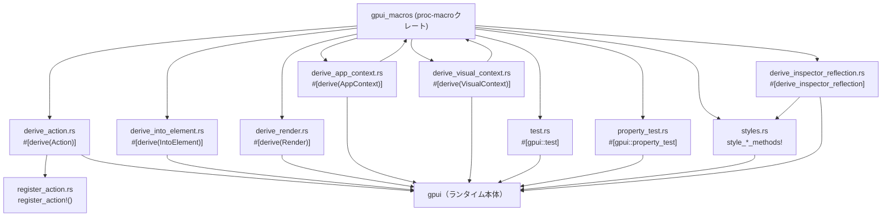
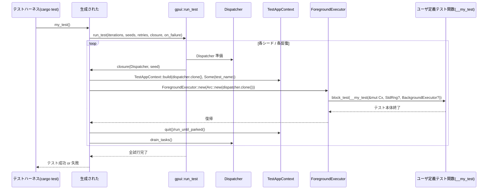

# gpui_macros/ コード解説

## 1. ざっくり一言

`gpui_macros` は、GUI ランタイム `gpui` 向けの **proc-macro クレート**です。  
アクションの自動登録、アプリ／ウィンドウコンテキストの委譲、スタイル用メソッド群、テスト・プロパティテスト・インスペクタ用リフレクションなどをまとめて生成します。

---

## 2. このモジュールの役割

### 2.1 概要

- このクレートは、`gpui` を使ったアプリケーション開発で頻出するパターンを **マクロで自動生成**するために存在します。
- 主な機能は次のとおりです。
  - `Action` 実装と登録ロジックの自動生成
  - `AppContext` / `VisualContext` / `Render` / `IntoElement` などのトレイト実装の自動生成
  - Tailwind ライクなスタイルメソッドの大量生成
  - `#[gpui::test]` / `#[gpui::property_test]` によるテストハーネスの生成
  - `#[derive_inspector_reflection]` によるメソッドリフレクションモジュールの生成

### 2.2 アーキテクチャ内での位置づけ

このクレート自身はランタイムを持たず、**ユーザーコードのコンパイル時にのみ動作**します。生成されたコードは `gpui` 本体クレートの型・関数に依存します。



### 2.3 設計上のポイント

- **公開 API はほぼすべて proc-macro**  
  通常の `pub struct` / `pub enum` はユーザーから直接使う想定ではなく、マクロから内部的に使われます。
- **委譲ベースの derive**  
  `AppContext` / `VisualContext` derive は、構造体内にある `&mut App` / `&mut Window` 相当のフィールドへメソッド呼び出しをそのまま委譲する形になっています。
- **Action の静的登録**  
  `Action` derive は `register_action` ロジックと連携し、`inventory` を通じてアクションメタデータを静的に登録できるコードを生成します。
- **テストの統一ハーネス**  
  `#[gpui::test]` / `#[gpui::property_test]` は、シード管理・反復・リトライ・コンテキスト構築を一箇所に集約し、ユーザーはテスト本体に集中できるようになっています。
- **スタイルはデータ駆動生成**  
  スタイルメソッドは prefix / suffix テーブル（`BoxStylePrefix` 等）から一括生成され、Tailwind のスケールに対応した多数のメソッドが自動的に定義されます。
- **インスペクタ用リフレクション**  
  `#[derive_inspector_reflection]` は `fn method(self) -> Self` 形式のメソッドを抽出し、ランタイムから名前で呼び出せるラッパーとメタデータを生成します。

---

## 3. 主要な機能一覧

- `#[derive(Action)]`: 構造体に対する `gpui::Action` 実装と、（必要に応じて）アクション登録ロジックを生成する。
- `register_action!`: 手書きの `Action` 実装に対して、登録ロジックだけを生成する。
- `#[derive(AppContext)]`: `&mut App` 相当のフィールドを持つ型に `gpui::AppContext` を実装する。
- `#[derive(VisualContext)]`: `&mut Window` と `&mut App` 相当のフィールドを持つ型に `gpui::VisualContext` を実装する。
- `#[derive(IntoElement)]`: 型を `gpui::Component<Self>` に変換する `IntoElement` 実装を生成する。
- `#[derive(Render)]`: `Render` トレイトのデフォルト実装（何も描画しない）を生成する。
- `style_helpers!` / `*_style_methods!`: Tailwind 風のスタイルメソッド（`m_4`, `rounded_full` 等）を大量に生成する。
- `#[gpui::test]`: gpui ランタイム上で動くシード付きテスト関数を生成する。
- `#[gpui::property_test]`: proptest ベースのプロパティテストを gpui のテストハーネスと統合する。
- `#[derive_inspector_reflection]`: トレイトに対して、`fn self -> Self` 型のメソッドを反射的に列挙・呼び出しできるモジュールを生成する。

---

## 4. 関数・構造体の解説

### 4.1 公開マクロ一覧

このクレートの「公開 API」は主に proc-macro です。ユーザーが直接使うのは次のマクロ群です。

| マクロ名 | 種別 | 役割 / 用途 |
|---------|------|-------------|
| `#[derive(Action)]` | derive マクロ | `gpui::Action` 実装とアクション登録用メタデータを自動生成する |
| `register_action!` | 関数風マクロ | 手書きの `Action` 実装を `gpui` に登録する補助コードを生成する |
| `#[derive(AppContext)]` | derive マクロ | `&mut App` 相当のフィールドを持つ型に `gpui::AppContext` を実装する |
| `#[derive(VisualContext)]` | derive マクロ | `&mut Window` と `&mut App` を持つ型に `gpui::VisualContext` を実装する |
| `#[derive(IntoElement)]` | derive マクロ | 型を `gpui::Component<Self>` に変換する `IntoElement` を実装する |
| `#[derive(Render)]` | derive マクロ | 何も描画しない `Render` 実装を生成する（プレースホルダ） |
| `style_helpers!` | 関数風マクロ | ベースとなるサイズ／余白／角丸などのスタイルメソッド群を生成する |
| `visibility_style_methods!` | 関数風マクロ | `visible()`, `invisible()` などの可視性スタイルメソッドを生成する |
| `margin_style_methods!` | 関数風マクロ | `m_4()`, `mt_2()` などマージン関連メソッドを生成する |
| `padding_style_methods!` | 関数風マクロ | パディング関連メソッドを生成する |
| `position_style_methods!` | 関数風マクロ | `relative()`, `absolute()`, `top_4()` 等を生成する |
| `overflow_style_methods!` | 関数風マクロ | `overflow_hidden()` 等のオーバーフロースタイルを生成する |
| `cursor_style_methods!` | 関数風マクロ | マウスカーソル関連のスタイルメソッドを生成する |
| `border_style_methods!` | 関数風マクロ | 境界線の太さ・色を設定するメソッドを生成する |
| `box_shadow_style_methods!` | 関数風マクロ | `shadow_md()` 等のボックスシャドウメソッドを生成する |
| `#[gpui::test]` | 属性マクロ | シード付き／多重実行／リトライ機能を持つ gpui テストを生成する |
| `#[gpui::property_test]` | 属性マクロ | proptest と `gpui` のテストハーネスを統合するプロパティテストを生成する |
| `#[derive_inspector_reflection]` | 属性マクロ（feature gated） | トレイトの `fn(self)->Self` メソッドを反射的に列挙・実行するモジュールを生成する |

内部の補助 struct (`StyleableMacroInput` など) はすべて非公開で、ユーザーは意識する必要はありません。

---

### 4.2 重要なマクロの詳細（7件）

#### `#[derive(Action)]`

**概要**

- 構造体に対して `gpui::Action` トレイト実装を生成します。
- オプションで JSON からの生成・JSON Schema・非推奨名・ドキュメント文字列などのメタデータと、`inventory` を用いたアクション登録コードを生成します。

**対応する属性（`#[action(...)]`）**

| 引数名 | 型 | 説明 |
|--------|----|------|
| `name` | 文字列リテラル | アクションのベース名。指定がなければ型名を使用する。`"NS::name"` のように `::` を含めることは不可。 |
| `namespace` | 識別子 | 名前空間。`namespace = my_ns` のように指定し、最終名は `"my_ns::name"` となる。 |
| `no_json` | フラグ | JSON からの生成や JSON Schema 生成を無効化する。 |
| `no_register` | フラグ | `inventory` を使った自動登録コードを生成しない。 |
| `deprecated_aliases` | `["...", "..."]` | 旧アクション名の配列。`deprecated_aliases = ["old1", "old2"]` のように指定。 |
| `deprecated` | 文字列リテラル | 非推奨メッセージ。`"use NewAction instead"` など。 |

**生成される主なメソッド**

`impl gpui::Action for YourType { ... }` として次を実装します。

- `fn name(&self) -> &'static str`  
  - `namespace` があれば `"namespace::name"`, なければ `"name"` を返す。
- `fn name_for_type() -> &'static str`  
  - 同じくフルネームを返す関連関数。
- `fn partial_eq(&self, action: &dyn gpui::Action) -> bool`  
  - `as_any().downcast_ref::<Self>()` でダウンキャストして `==` 比較。
- `fn boxed_clone(&self) -> Box<dyn gpui::Action>`  
  - `self.clone()` を箱詰めする。
- `fn build(_value: serde_json::Value) -> gpui::Result<Box<dyn gpui::Action>>`  
  - 単位構造体の場合: `Ok(Box::new(Self))`  
  - それ以外: `serde_json::from_value::<Self>` でデシリアライズ  
  - `no_json` の場合: `Err(anyhow!("... cannot be built from JSON"))`。
- `fn action_json_schema(...) -> Option<Schema>`  
  - `no_json` または単位構造体: `None`  
  - それ以外: `Some(<Self as JsonSchema>::json_schema(...))`。
- `fn deprecated_aliases() -> &'static [&'static str]`  
  - 指定した別名のスライス。未指定なら空スライス参照。
- `fn deprecation_message() -> Option<&'static str>`  
  - `deprecated` メッセージ。
- `fn documentation() -> Option<&'static str>`  
  - 構造体に付いている `///` ドキュメントコメントを連結した文字列。

さらに `no_register` でなければ、`register_action` モジュールを通じて `inventory::submit!` による登録用の隠し関数も生成されます。

**Examples（使用例）**

```rust
use gpui::Action as _;
use gpui_macros::Action;

// アクションを表す構造体を定義する                             // Action 対象の構造体
#[derive(Clone, PartialEq, Action)]                               // Clone + Eq を実装した上で Action を derive
#[action(
    name = "open_file",                                          // ベース名
    namespace = app,                                             // フルネームは "app::open_file"
    deprecated_aliases = ["open_path"],                          // 旧名
    deprecated = "use `app::open_file_v2` instead"               // 非推奨メッセージ
)]
/// Open a file from disk                                      // ドキュメントコメント
struct OpenFileAction {
    pub path: String,                                           // JSON から復元されるフィールド
}

// 生成されるコードの利用イメージ
fn use_action(a: &OpenFileAction) {
    assert_eq!(a.name(), "app::open_file");                      // name() はフルネームを返す
}
```

**Errors / Panics**

- `#[action(...)]` の中で同じキーを複数回指定すると **コンパイルエラー**（`'name' argument specified multiple times` など）。
- 認識されないキーを指定すると **コンパイルエラー**。  
  例: `#[action(foo = "bar")]` は `"argument not recognized"` エラー。
- `name` に `::` を含めると **panic** します（マクロ展開時）。  
  メッセージ: 「`name = "...“` must not contain `::`, also specify `namespace` instead」。
- `no_json` かつ `build` を呼ぶと、実行時に `Err(anyhow!("... cannot be built from JSON"))` が返ります。

**Edge cases（エッジケース）**

- 単位構造体（フィールドなし）の場合、`build` は JSON を無視して常に `Ok(Box::new(Self))` を返します。
- 構造体以外（enum など）にも技術的には適用できますが、JSON からの復元は `serde_json::from_value::<Self>` に依存します。
- `#[doc]` 属性が複数行ある場合、行頭の空白を 1 文字だけ取り除き、`'\n'` で連結した文字列が `documentation()` から返ります。

**使用上の注意点**

- `no_json` を付けた場合、`gpui` 側で「JSON からアクションを復元する機能」が使えなくなる点に注意が必要です。
- JSON から復元する場合は、対象型に `serde::Deserialize` と `schemars::JsonSchema` が実装されている必要があります。
- `no_register` を付けると `inventory` 登録が行われないため、手動で登録する必要があります（その場合は `register_action!` マクロを利用します）。

---

#### `#[derive(AppContext)]`

**概要**

- `&mut App` 相当のフィールドを持つ構造体に対して、`gpui::AppContext` トレイト実装を委譲で生成します。
- どのフィールドに委譲するかは `#[app]` 属性で指定します。

**属性**

- フィールドに `#[app]` を付けて、`AppContext` メソッドを委譲する対象を指定します。

**生成される主なメソッド**

`impl gpui::AppContext for YourType { ... }` の各メソッドは、**すべて `self.#app_field` へ委譲**されます。

例:

- `fn new<T: 'static>(&mut self, build_entity: impl FnOnce(&mut Context<'_, T>) -> T) -> Entity<T>`  
  → `self.#app_variable.new(build_entity)`
- `fn update_entity<T, R>(&mut self, handle: &Entity<T>, update: impl FnOnce(&mut T, &mut Context<'_, T>) -> R) -> R`  
  → `self.#app_variable.update_entity(handle, update)`
- `fn background_spawn<R>(&self, future: impl Future<Output = R> + Send + 'static) -> Task<R>`  
  → `self.#app_variable.background_spawn(future)`
- `fn read_global<G, R>(&self, callback: impl FnOnce(&G, &App) -> R) -> R`  
  → `self.#app_variable.read_global(callback)`

**Examples（使用例）**

```rust
use gpui::{App, AppContext as _};
use gpui_macros::AppContext;

// App をラップする独自コンテキスト型                          // ユーザー定義のラッパー
#[derive(AppContext)]
struct MyAppContext<'a> {
    #[app]                                                     // &mut App を保持するフィールドを指定
    app: &'a mut App,
}

fn build_something(cx: &mut MyAppContext<'_>) {
    // AppContext のメソッドがそのまま使える
    let _entity = cx.new(|_cx| ());                            // 実体の型は例として unit
}
```

**Errors**

- 構造体内のどのフィールドにも `#[app]` が付いていない場合、**コンパイルエラー**になります。  
  メッセージ: `Derive must have an #[app] attribute to detect the &mut App field`。
- enum / union に対して `#[derive(AppContext)]` を付けると、`get_simple_attribute_field` が `None` を返すため、同じく上記コンパイルエラーになります。

**Edge cases**

- 複数フィールドに `#[app]` を付けた場合でも、最初に見つかった 1 つだけが使われます（コード上 `.find(...)` で最初のものだけ取得しています）。
- `#[app]` が付いたフィールドの型は、`AppContext` と同じメソッドセットを提供している必要があります（通常は `&mut gpui::App` か、その互換ラッパー）。

**使用上の注意点**

- `AppContext` の実装はすべて委譲です。フィールドのライフタイムや所有権に注意する必要があります。
- `&mut App` 以外の型を `#[app]` に指定する場合、その型が `AppContext` 相当の API を持つことを前提にしています。

---

#### `#[derive(VisualContext)]`

**概要**

- `&mut Window` と `&mut App` 相当のフィールドを持つ構造体に対して `gpui::VisualContext` を実装します。
- どのフィールドがどの役割かは `#[window]` / `#[app]` 属性で指定します。

**属性**

- `#[window]`: `&mut gpui::Window` 相当のフィールドに付ける。
- `#[app]`: `&mut gpui::App` 相当のフィールドに付ける。

**生成される主なメソッド**

- `type Result<T> = T;`  
  - 結果型は単なる `T` に固定。
- `fn window_handle(&self) -> AnyWindowHandle`  
  - `self.#window_variable.window_handle()` に委譲。
- `fn update_window_entity<T, R>(&mut self, entity: &Entity<T>, update: impl FnOnce(&mut T, &mut Window, &mut Context<T>) -> R) -> R`  
  - `AppContext::update_entity(self.#app_variable, entity, |entity, cx| update(entity, self.#window_variable, cx))`
- `fn new_window_entity<T: 'static>(..., build_entity: impl FnOnce(&mut Window, &mut Context<'_, T>) -> T) -> Entity<T>`  
  - `AppContext::new(self.#app_variable, |cx| build_entity(self.#window_variable, cx))`
- `fn replace_root_view<V>(&mut self, build_view: impl FnOnce(&mut Window, &mut Context<V>) -> V) -> Entity<V>`  
  - `self.#window_variable.replace_root(self.#app_variable, build_view)`
- `fn focus<V>(&mut self, entity: &Entity<V>) where V: Focusable`  
  - `Focusable::focus_handle(entity, self.#app_variable)` でハンドル生成 → `self.#window_variable.focus(&focus_handle, self.#app_variable)`

**Examples（使用例）**

```rust
use gpui::{App, Window};
use gpui_macros::{AppContext, VisualContext};

// App と Window を束ねたコンテキスト                         // App + Window コンテキスト
#[derive(AppContext, VisualContext)]
struct MyContext<'a, 'b> {
    #[app]                                                     // AppContext への委譲元
    app: &'a mut App,
    #[window]                                                  // VisualContext で使う Window
    window: &'b mut Window,
}
```

**Errors**

- `#[window]` が付いたフィールドが無い場合:  
  コンパイルエラー `Derive must have a #[window] attribute to detect the &mut Window field`。
- `#[app]` が付いたフィールドが無い場合:  
  コンパイルエラー `Derive must have a #[app] attribute to detect the &mut App field`。

**使用上の注意点**

- `AppContext` と `VisualContext` はセットで使われるため、通常は `#[derive(AppContext, VisualContext)]` のようにまとめて付けます。
- フィールドの型は、それぞれ `AppContext` / `Window` と互換なメソッドを持っている必要があります。

---

#### `#[gpui::test]`（`test.rs`）

**概要**

- 通常の `#[test]` の代わりに付ける属性マクロで、  
  - 複数シードでの反復実行
  - 自動リトライ
  - `TestAppContext` / `StdRng` / `BackgroundExecutor` 引数の自動注入  
  をサポートしたテスト関数を生成します。

**属性引数**

`#[gpui::test(...)]` に指定できる引数:

| 引数名 | 形式 | 説明 |
|--------|------|------|
| `seed` | `seed = 10` | 単一のシードで一度だけ実行 |
| `seeds` | `seeds(10, 20, 30)` | 指定した複数シードで実行 |
| `iterations` | `iterations = 5` | `0..5` のシードで反復（`seeds` と合成される） |
| `retries` | `retries = 3` | 失敗時に最大 3 回まで再実行（合計最大 4 回） |
| `on_failure` | `on_failure = "crate::test::report_failure"` | 失敗後に呼び出すコールバック関数のパス（文字列で指定） |

引数は `Args` 構造体でパースされ、`gpui::run_test` に渡されます。  
`seed`/`seeds`/`iterations` の振る舞いは `gpui_macros.rs` のドキュメントコメントに記載の通りです。

**許可されるテスト関数引数**

- 非 async 関数の場合（同期テスト）:
  - `StdRng`  
    → `rand::SeedableRng::seed_from_u64(_seed)` で初期化された RNG が渡される。
  - `&mut App`  
    → 内部で `TestAppContext::build` を行い、その `app.borrow_mut()` が渡される。
  - `&mut TestAppContext`  
    → `TestAppContext::build` で生成されたコンテキストが渡される。
- async 関数の場合:
  - `StdRng`  
    → 同上。
  - `BackgroundExecutor`  
    → `BackgroundExecutor::new(Arc::new(dispatcher.clone()))` が渡される。
  - `&mut TestAppContext`  
    → 同上。

**生成される流れ（概略）**

- ユーザー定義の関数 `async fn my_test(...)` が、内部関数 `__my_test` と外側の `#[test] fn my_test()` に分割されます。
- `#[test] fn my_test()` の本体で `gpui::run_test` が呼ばれ、`num_iterations`・`seeds`・`max_retries` と、`dispatcher` とシードを受け取るクロージャを渡します。
- クロージャ内で `TestAppContext` などが構築され、`ForegroundExecutor::new(...).block_test(__my_test(...))` あるいは直接 `__my_test(...)` が呼ばれます。
- 実行後に `quit()`・`run_until_parked()`・`dispatcher.drain_tasks()` などで後始末が行われます。

**Examples（使用例）**

```rust
use gpui_macros as gpui;                                         // 便宜上プレリュード風に
use gpui::TestAppContext;

// 単純な async テスト                                       // シードは 0 または SEED 環境変数
#[gpui::test]
async fn test_basic(mut cx: &mut TestAppContext) {                // &mut TestAppContext を引数に取る
    // gpui アプリをテストするロジックを書く
}

// 複数シード + リトライ付きテスト                           // seeds + retries の例
#[gpui::test(seeds(10, 20, 30), retries = 2)]
fn test_with_rng(rng: rand::rngs::StdRng) {                       // StdRng も受け取れる
    // rng を用いた確率的なテスト
}
```

**Errors**

- 関数の引数に、上記以外の型を含めると `invalid function signature` というコンパイルエラーになります。
- 属性引数が不正な場合（整数以外、未知のキーなど）もコンパイルエラーになります。

**使用上の注意点**

- テスト関数は **自由関数**（メソッドではない）である必要があります（`ItemFn` としてパースしています）。
- `StdRng` 引数は seed 付き RNG として初期化されるため、自前で別の RNG を作るとテストの再現性が失われる可能性があります。
- `on_failure` で指定する関数は `fn(&[u64])` 等の具体的シグネチャはこのコードからは分かりませんが、少なくとも存在するパスである必要があります（存在しないとコンパイルエラー）。

---

#### `#[gpui::property_test]`（`property_test.rs`）

**概要**

- proptest ベースのプロパティテストを、`gpui` のテストスケジューラと統合する属性マクロです。
- `&mut TestAppContext` や `BackgroundExecutor` など、`gpui::test` と類似の引数を扱いつつ、  
  実際の値の生成は `proptest` の `Strategy` / `Arbitrary` に任せます。
- `StdRng` は明示的に禁止されています。

**テスト関数の引数処理**

`parse_args` で関数引数を解析し、次のように振る舞います。

- `&TestAppContext` 型の引数:
  - ユーザーのテスト本体（`inner_fn`）の引数として残る。
  - 実際の呼び出し時には `TestAppContext::build(dispatcher.clone(), ...)` で生成した値への `&mut` が渡される。
  - テスト終了時に `dispatcher.run_until_parked()` → `cx.executor().forbid_parking()` → `cx.quit()` などの後処理を行う。
- `StdRng` 型の引数:
  - その引数は削除され、代わりに **コンパイルエラー**を生成します。  
    メッセージ: 「`StdRng` is not allowed in a property test ...」。
- `BackgroundExecutor` 型の引数:
  - ユーザーのテスト本体の引数として残り、呼び出し時に `BackgroundExecutor::new(Arc::new(dispatcher.clone()))` が渡される。
- その他の引数:
  - そのまま proptest の `#[proptest::property_test]` に渡され、`Arbitrary` または `#[strategy = ...]` によって値が生成されます。

**生成される関数形**

- マクロは 1 つの `#[::gpui::proptest::property_test(...)] fn test_name(...)` を生成します。
- 最初の引数として `#[strategy = ::gpui::seed_strategy()] __seed: u64` が追加されます。
- 本体では `::gpui::run_test_once(__seed, Box::new(move |dispatcher| { ... }))` が呼ばれます。

**Examples（使用例）**

```rust
use gpui_macros as gpui;

// x と y の関係性をプロパティとして検証する                 // Arbitrary i32 が自動生成される例
#[gpui::property_test]
fn arithmetic_property(x: i32, y: i32) {
    assert!(x == y || x < y || x > y);                           // 常に成り立つ三分律
}

// カスタム Strategy を使った例
#[gpui::property_test]
fn int_and_string(
    #[strategy = 1..10] x: i32,                                  // 1..10 の範囲で生成
    #[strategy = "[a-zA-Z0-9]{20}"] s: String,                   // proptest の正規表現 Strategy
) {
    assert!(s.len() >= x as usize);
}
```

**使用上の注意点**

- `StdRng` 引数は禁止されます。乱数が必要な場合は `Strategy` / `Arbitrary` を実装してプロパティテスト側に任せる必要があります。
- `TestAppContext` を複数個引数に取ることも可能です（その分だけコンテキストが生成されます）。

---

#### スタイルマクロ群（`style_helpers!`, `*_style_methods!`）

**概要**

- Tailwind CSS 風のクラス名に対応した **スタイル設定メソッド** を一括で生成するマクロ群です。
- 生成されるメソッドは、`self.style()` が返すスタイル構造体のフィールドを書き換える形で実装されます。
- 代表的なもの:
  - `m_4()`, `mt_2()`, `px_3()` などの余白・パディング
  - `w_full()`, `h_4()` などの幅・高さ
  - `rounded_md()`, `rounded_tl_full()` などの角丸
  - `border_2()`, `border_x_0()` などのボーダー
  - `shadow_md()` などのボックスシャドウ
  - `cursor_pointer()` などのマウスカーソル

**入力構文**

多くのマクロは任意で **メソッドの可視性** を指定できます。

```rust
// 既定（可視性を指定しない）                                 // Visibility::Inherited
gpui_macros::margin_style_methods! {}

// public メソッドとして生成                                   // visibility: pub
gpui_macros::margin_style_methods! { visibility: pub }
```

`StyleableMacroInput` は `visibility: <Visibility>` の形をパースし、`method_visibility` を設定します。

**代表的な生成コードの形**

```rust
// 例: margin_style_methods! から生成されるメソッド          // m_x による margin の設定
pub fn m_4(mut self) -> Self {
    let style = self.style();
    style.margin.top = Some(gpui::rems(1.).into());
    style.margin.bottom = Some(gpui::rems(1.).into());
    style.margin.left = Some(gpui::rems(1.).into());
    style.margin.right = Some(gpui::rems(1.).into());
    self
}
```

実際には `BoxStylePrefix` / `BoxStyleSuffix` / `CornerStylePrefix` などのテーブルから `px` / `rems` / `relative` / `auto` といった長さ表現を組み立てています。

**注意点**

- 生成メソッドは `self.style()` を呼び出します。  
  したがって、マクロを使う側の型・トレイトには

  ```rust
  fn style(&mut self) -> &mut gpui::Style; // 名前は "style" 固定
  ```

  に準ずるメソッドが存在している必要があります（正確な型名はこのクレートには現れませんが、コード上 `self.style().xxx` としてフィールドにアクセスしています）。
- `cursor_none(mut self, cursor: CursorStyle) -> Self` のように、引数 `cursor` が宣言されているが実際には使われていないメソッドも存在します。挙動としては常に `CursorStyle::None` がセットされます。

---

#### `#[derive_inspector_reflection]`

**概要**

- トレイトに付ける属性マクロで、そのトレイトが持つ

  ```rust
  fn method(self) -> Self
  fn method(self, ...) -> Self // は対象外（self 以外の引数は許可されない）
  ```

  という **self のみを引数に取り、戻り値が `Self` なメソッド**を列挙し、  
  ランタイムから「名前で引いて呼び出せる」モジュールを生成します。
- `Styled` / `StyledExt` などのビルダー系トレイトをインスペクタから操作する目的で使われます。

**対象となるメソッド条件**

- `TraitItem::Fn` であること。
- 引数が 1 つだけで、それが
  - `self` または `mut self`（参照ではないレシーバ）であること。
- 戻り値が `Self` であること。
- `cfg` 属性付きのメソッドは、その `cfg` をそのまま引き継いで反射情報にも適用されます。

**生成されるモジュール**

トレイト名が `Transform` の場合、次のようなモジュールが生成されます。

```rust
mod transform_reflection {
    use super::*;

    // 各メソッドごとに Any ベースのラッパー関数を生成
    fn __wrapper_double<T: Transform + 'static>(value: Box<dyn Any>) -> Box<dyn Any> { ... }
    fn __wrapper_triple<T: Transform + 'static>(value: Box<dyn Any>) -> Box<dyn Any> { ... }
    // ...

    pub fn methods<T: Transform + 'static>() -> Vec<gpui::inspector_reflection::FunctionReflection<T>> { ... }

    pub fn find_method<T: Transform + 'static>(name: &str) -> Option<gpui::inspector_reflection::FunctionReflection<T>> { ... }
}
```

`FunctionReflection<T>` には少なくとも

- `name`: メソッド名 (`"double"` 等)
- `function`: `fn(Box<dyn Any>) -> Box<dyn Any>`
- `documentation`: `Option<&'static str>`

が含まれます（正確な定義は `gpui` 側にありますが、テストから読み取れる範囲です）。

**doc コメントの扱い**

- `///` コメントは `#[doc = "..."]` 属性として渡されます。
- 行頭の半角スペース 1 文字だけを削除した上で、行ごとに `'\n'` で連結した文字列が `documentation` に格納されます。

**スタイルマクロの展開**

`MacroExpander` がトレイト内のマクロ呼び出しを検出し、既知のものを展開します。

- 対応しているマクロパス:  
  `style_helpers`, `visibility_style_methods`, `margin_style_methods`, `padding_style_methods`,  
  `position_style_methods`, `overflow_style_methods`, `cursor_style_methods`,  
  `border_style_methods`, `box_shadow_style_methods`  
  （`gpui_macros::style_helpers` のような修飾付きにも対応）

これにより、スタイルトレイト内でマクロから生成されたメソッドも、リフレクションの対象になります。

**環境によるパスの切り替え**

- `CARGO_PKG_NAME == "gpui"` の場合は `crate::inspector_reflection` を使い、
- それ以外（通常の外部クレート）では `::gpui::inspector_reflection` を使います。

**Examples（使用例）**

テストコード内の例:

```rust
// rust-analyzer では展開させない工夫                       // 開発体験向上のための cfg_attr
#[cfg_attr(not(rust_analyzer), gpui_macros::derive_inspector_reflection)]
trait Transform: Clone {
    /// Doubles the value
    fn double(self) -> Self;

    /// Triples the value
    fn triple(self) -> Self;

    /// Increments the value by one
    ///
    /// This method has a default implementation
    fn increment(self) -> Self {
        self.add_one()
    }

    /// Quadruples the value by doubling twice
    fn quadruple(self) -> Self {
        self.double().double()
    }

    // これは対象外:
    fn add(&self, other: &Self) -> Self;
    fn set_value(&mut self, value: i32);
    fn get_value(&self) -> i32;

    /// Adds one to the value
    fn add_one(self) -> Self;
}

// 生成されるモジュールを使う                                // methods/find_method を使った例
use transform_reflection::*;

fn use_reflection() {
    let num = Number(5);
    let doubled = find_method::<Number>("double").unwrap().invoke(num.clone());
}
```

**使用上の注意点**

- 展開結果が比較的大きくなるため、テストコードのように  
  `#[cfg_attr(not(rust_analyzer), ...)]` で開発時ツールからは隠すパターンが採用されています。
- 対象外のメソッド（`&self` / `&mut self` / 引数が複数あるなど）は無視されます。
- ラッパー関数は `Box<dyn Any>` のダウンキャストに失敗すると `panic!("Type mismatch in reflection wrapper")` するため、  
  `FunctionReflection<T>` は **対応する型 `T` に対してのみ**使う必要があります（テストでは型ごとに `methods::<Number>()` しています）。

---

### 4.3 その他のマクロ

| マクロ名 | 役割（1 行） |
|---------|--------------|
| `register_action!` | 手書きの `Action` 実装に対し、`inventory::submit!` を使った登録用隠し関数を生成する |
| `#[derive(IntoElement)]` | `IntoElement` を実装し、`into_element()` で `gpui::Component<Self>` を生成できるようにする |
| `#[derive(Render)]` | `render` メソッドを `gpui::Empty` を返す単純な実装で埋める（プレースホルダ） |
| `style_helpers!` | 幅・高さ・角丸など、基本的なスタイルメソッドをまとめて生成する（可視性指定は現状無視される） |

---

## 5. データフロー

ここでは `#[gpui::test]` を用いた **典型的な async テスト実行フロー**を例に、データフローを説明します。

1. Rust のテストハーネス（`cargo test`）が、マクロによって生成された `#[test] fn my_test()` を呼び出します。
2. `my_test` 関数内で `gpui::run_test(num_iterations, &[seeds], max_retries, closure, on_failure)` が呼び出されます。
3. `run_test` はシードと反復回数に従って複数回 `closure(dispatcher, _seed)` を実行します。
4. 各実行で `TestAppContext::build(dispatcher.clone(), Some(test_name))` が呼ばれ、`StdRng` / `BackgroundExecutor` / `&mut TestAppContext` が準備されます。
5. async テストの場合は `ForegroundExecutor::new(Arc::new(dispatcher.clone())).block_test(__my_test(...))` でユーザー定義の `__my_test` が実行されます。
6. 終了後、`quit()` / `run_until_parked()` / `dispatcher.drain_tasks()` による後処理が行われます。



プロパティテスト（`#[gpui::property_test]`）では、このフローの最初に `proptest` が複数の入力値を生成し、各ケースについて `gpui::run_test_once(seed, ...)` が呼ばれる、という構造になります。

---

## 6. 使い方（How to Use）

### 6.1 基本的な使用方法

ここでは代表的な 3 パターンを示します。

#### 6.1.1 Action とコンテキストの利用

```rust
use gpui::{App, Action as _};
use gpui_macros::{Action, AppContext, VisualContext};

// 1. Action の定義                                            // アクション型を定義
#[derive(Clone, PartialEq, Action)]
#[action(namespace = app, name = "open_file")]
/// Open a file                                              // ドキュメントは Action の metadata に入る
struct OpenFile {
    pub path: String,                                        // JSON から復元されるフィールド
}

// 2. App + Window をまとめたコンテキスト                      // AppContext + VisualContext を derive
#[derive(AppContext, VisualContext)]
struct MyContext<'a, 'b> {
    #[app]                                                   // &mut App を指すフィールド
    app: &'a mut App,
    #[window]                                                // &mut Window を指すフィールド
    window: &'b mut gpui::Window,
}

// 3. どこかのコードで Action を使う                           // MyContext から Action を発行するイメージ
fn handle_open_file(cx: &mut MyContext<'_, '_>, action: &OpenFile) {
    // cx の AppContext メソッドが使える
    cx.update_window_entity(/* entity */ &gpui::Entity::dummy(), |_e, _w, _cx| {
        // 実際の処理を書く（ここではイメージ）
        let _path = &action.path;
    });
}
```

> `Entity::dummy()` は実際のコードにはありません。上記は「どこで Action とコンテキストがつながるか」のイメージです。

#### 6.1.2 スタイルマクロの利用

```rust
use gpui_macros::{style_helpers, margin_style_methods};

// スタイルを適用できるトレイト                              // self.style() を提供するトレイト
trait Styled {
    fn style(&mut self) -> &mut gpui::Style;

    // ここで style ヘルパーメソッドを生成する
    style_helpers! {}                                        // 幅/高さ/角丸 などのメソッド群を生成
    margin_style_methods! { visibility: pub }                // public な margin 系メソッドを生成
}
```

このようにトレイトや impl ブロックの中でマクロを呼び出すと、`m_4()`, `w_full()`, `rounded_md()` など多数のメソッドが追加されます。

#### 6.1.3 テストマクロの利用

```rust
use gpui_macros as gpui;
use gpui::TestAppContext;

// 単純な gpui テスト                                         // SEED/ITERATIONS 環境変数にも対応
#[gpui::test(iterations = 3, retries = 1)]
async fn test_ui(mut cx: &mut TestAppContext) {
    // ここで gpui アプリを立ち上げて操作する
}

// プロパティテスト                                           // Arbitrary/Strategy を使った例
#[gpui::property_test]
fn prop_len(
    #[strategy = 0..100] len: usize,
    #[strategy = "[a-z]{0,200}"] s: String,
) {
    assert!(s.len() >= len || s.len() < len);                // 形式的な例
}
```

### 6.2 よくある使用パターン

- **Action を JSON 経由で発行する**
  - `#[derive(Action)]` で JSON 対応を有効にしておく（`no_json` を付けない）。
  - フロントエンドなどから JSON でアクションを送信し、`Action::build` で復元する。
- **App + Window のラッパーコンテキスト**
  - `#[derive(AppContext, VisualContext)]` で複数の `&mut App` / `&mut Window` へのアクセスを一つの型にまとめる。
  - UI コードではこのコンテキストだけを引数に取り、内部の App/Window は意識しない。
- **ランダム化テストとプロパティテストの併用**
  - ふるまい全体のランダム化には `#[gpui::test]` を使い、  
    アルゴリズム部分の性質検証には `#[gpui::property_test]` を使う、といった分担をする。

### 6.3 よくある間違い

```rust
use gpui_macros::{AppContext, VisualContext};

// 間違い例: #[app] が無い                                      // どのフィールドが App か分からない
#[derive(AppContext)]
struct BadCtx<'a> {
    app: &'a mut gpui::App,
}

// 正しい例: #[app] を付ける
#[derive(AppContext)]
struct GoodCtx<'a> {
    #[app]
    app: &'a mut gpui::App,
}
```

```rust
use gpui_macros::Action;

// 間違い例: name に "::" を含めている                          // ネームスペースは namespace で指定する必要がある
#[derive(Action)]
#[action(name = "app::open_file")]
struct BadAction;

// 正しい例: namespace と name を分ける
#[derive(Action)]
#[action(namespace = app, name = "open_file")]
struct GoodAction;
```

```rust
use gpui_macros as gpui;
use rand::rngs::StdRng;

// 間違い例: property_test で StdRng を受け取る                 // StdRng は明示的に禁止されている
#[gpui::property_test]
fn bad_prop(rng: StdRng, x: i32) { /* ... */ }

// 正しい例: Strategy で値を生成する
#[gpui::property_test]
fn good_prop(#[strategy = 0..1000] x: i32) { /* ... */ }
```

### 6.4 使用上の注意点（まとめ）

- `gpui_macros` のマクロは **`gpui` クレートに強く依存**しています。  
  - `Action` / `AppContext` / `VisualContext` / `Render` / `IntoElement` / スタイル関連の型・関数は、`gpui` 側で提供されます。
- `#[derive(AppContext)]` / `#[derive(VisualContext)]` は、構造体でのみ意義があります（enum/union ではエラーになります）。
- `#[gpui::test]` / `#[gpui::property_test]` では、引数の型が限定されています。  
  - 未対応の型を引数に取ると `invalid function signature` エラーとなります。
- スタイルマクロは `self.style().xxx` に直接アクセスします。  
  - そのため、マクロを展開するトレイト/型側で `style()` メソッドと、必要なフィールド（`margin`, `padding`, `corner_radii` など）を提供しておく必要があります。
- `#[derive_inspector_reflection]` は展開コストが高いため、テストコードのように `cfg_attr` で rust-analyzer から隠す使い方が推奨されます（テストコードがその例を示しています）。

---

## 7. 関連ファイル

| パス | 役割 / 関係 |
|------|------------|
| `gpui_macros/Cargo.toml` | クレート名・バージョン・依存関係（`syn`, `quote`, `proc-macro2`, `heck` など）と、`proc-macro = true` 設定を定義する |
| `gpui_macros/src/gpui_macros.rs` | ライブラリのエントリポイント。すべての proc-macro を `#[proc_macro]` / `#[proc_macro_derive]` / `#[proc_macro_attribute]` として公開し、`get_simple_attribute_field` ヘルパーを提供する |
| `gpui_macros/src/derive_action.rs` | `#[derive(Action)]` の実装。属性解析・`Action` 実装生成・`register_action` 呼び出しを行う |
| `gpui_macros/src/register_action.rs` | `register_action!` マクロと、`generate_register_action` 関数。`inventory::submit!` によるアクション登録コードを生成する |
| `gpui_macros/src/derive_app_context.rs` | `#[derive(AppContext)]` の実装。`#[app]` フィールドを特定し、`AppContext` メソッドを委譲する |
| `gpui_macros/src/derive_visual_context.rs` | `#[derive(VisualContext)]` の実装。`#[window]` と `#[app]` フィールドを特定し、`VisualContext` メソッドを委譲・組み立てる |
| `gpui_macros/src/derive_into_element.rs` | `#[derive(IntoElement)]` の実装。`IntoElement` を `Component::new(self)` で実装するだけの薄い derive |
| `gpui_macros/src/derive_render.rs` | `#[derive(Render)]` の実装。`render` メソッドを `gpui::Empty` を返す実装で埋める |
| `gpui_macros/src/styles.rs` | `style_helpers!` および `*_style_methods!` 群の実装。余白・サイズ・角丸・ボーダー・シャドウ・カーソルなどのスタイルメソッドを大量生成する |
| `gpui_macros/src/test.rs` | `#[gpui::test]` の実装。`Args` 構造体で属性引数をパースし、`run_test` ベースのテストハーネスを生成する |
| `gpui_macros/src/property_test.rs` | `#[gpui::property_test]` の実装。proptest の `#[property_test]` をラップし、`gpui` のテストハーネスに統合する |
| `gpui_macros/src/derive_inspector_reflection.rs` | `#[derive_inspector_reflection]` の実装。スタイルマクロの展開と、`FunctionReflection` ベースのリフレクションモジュール生成を行う（`inspector` feature または `debug_assertions` 時のみ有効） |
| `gpui_macros/tests/derive_context.rs` | `#[derive(AppContext, VisualContext)]` がコンパイルできることの簡単なテスト |
| `gpui_macros/tests/derive_inspector_reflection.rs` | `#[derive_inspector_reflection]` の振る舞い（メソッド列挙・invoke・ドキュメント取得）を検証するテスト |
| `gpui_macros/tests/render_test.rs` | `#[derive(Render)]` がコンパイルすることを確認する簡単なテスト |

このディレクトリ全体として、`gpui` アプリケーション開発におけるボイラープレートを削減し、テスト・スタイル・インスペクションといった周辺機能をマクロで一元的に提供する役割を持っています。
