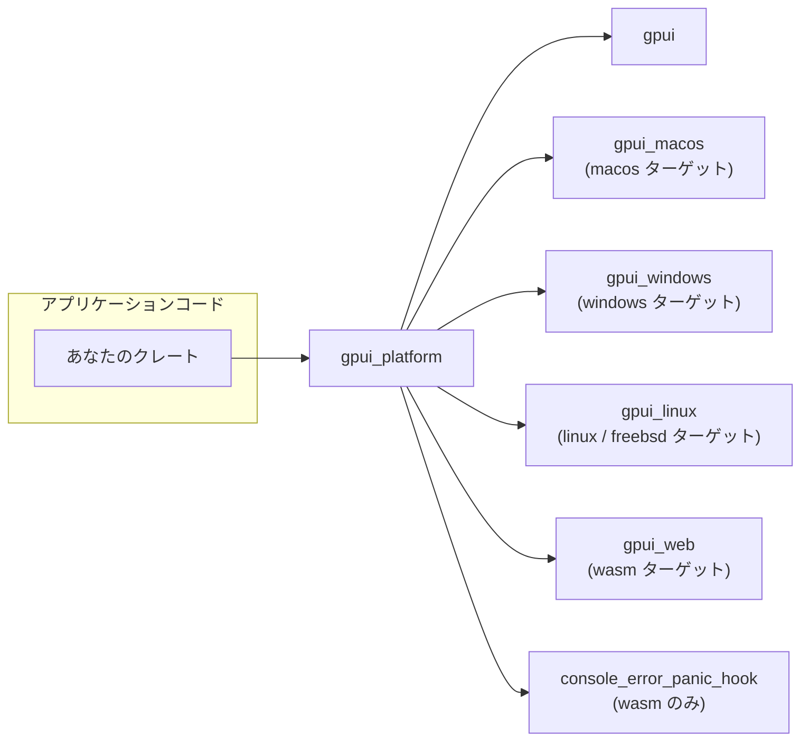
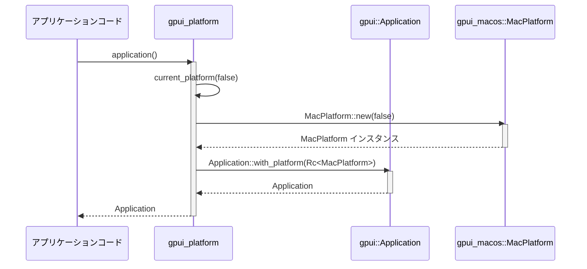

# gpui_platform/

## 1. ざっくり一言

`gpui_platform` は、GUI ライブラリ `gpui` の「現在のプラットフォーム（macOS / Windows / Linux / Web）」に応じた `Platform` 実装をまとめて扱うための薄いラッパークレートです。  
アプリケーション側は `#[cfg]` による OS 判定を書くことなく、共通の関数を呼び出すだけで適切なプラットフォーム実装を取得できます。

---

## 2. このモジュールの役割

### 2.1 概要

- このクレートは、`gpui` が定義するプラットフォーム抽象 (`Platform` トレイトなど) の **実装選択と生成** を担当します。
- OS やビルドターゲット（デスクトップ / Web）に応じて `gpui_macos` / `gpui_windows` / `gpui_linux` / `gpui_web` などを切り替え、`current_platform` などの関数を通じて提供します。
- さらに、`gpui::Application` をプラットフォーム付きで生成する `application`, `headless`, `single_threaded_web` などの高レベル関数を提供し、利用側の初期化コードを簡略化します。

### 2.2 アーキテクチャ内での位置づけ

`gpui_platform` は、アプリケーションコードと各 OS 向けの `gpui_*` クレートの間に位置する薄いファサード（窓口）のような役割を持ちます。



- 依存関係は `Cargo.toml` から読み取れます。
- OS ごとに `target.*.dependencies` で依存クレートが切り替えられており、`cfg` 属性を用いてコンパイル時に分岐しています。

### 2.3 設計上のポイント

- **責務の分割**
  - `gpui` 本体はプラットフォーム抽象（`Platform` トレイトなど）を提供。
  - `gpui_macos` / `gpui_windows` / `gpui_linux` / `gpui_web` は各 OS 向け実装を提供。
  - `gpui_platform` は「どの実装を使うか」を決めてインスタンスを返す専用の窓口です。
- **状態管理**
  - `current_platform` は `Rc<dyn Platform>` を返しますが、内部で状態を保持しているかどうかは各プラットフォームクレートに依存します。
  - このクレート内には長寿命なグローバル状態は定義されていません。
- **エラーハンドリング**
  - Windows プラットフォームのみ `WindowsPlatform::new(headless)` の結果に対して `expect("failed to initialize Windows platform")` を呼び出し、初期化失敗時には panic します。
  - macOS・Linux・Web については、このクレート内ではエラー処理を行わず、各クレートの実装に委ねています。
- **条件付きコンパイル**
  - `#[cfg(target_os = "...")]` や `#[cfg(target_family = "wasm")]` で OS / ターゲットごとに関数実装や依存クレートを分岐させています。
  - テストサポート用 API や Web 初期化用 API も `feature` や `cfg` により限定的に有効化されます。

---

## 3. 主要な機能一覧

このクレートが提供する主な機能は次のとおりです。

- プラットフォーム抽象の再エクスポート: `gpui::Platform` を `gpui_platform::Platform` として再公開。
- デスクトップ用アプリケーションの生成: `application()` により、OS に応じた `gpui::Application` を生成。
- ヘッドレスアプリケーションの生成: `headless()` により、UI のない `gpui::Application` を生成（`headless` フラグ付きプラットフォーム）。
- バックグラウンド実行器（executor）の取得: `background_executor()` からプラットフォームに応じた `gpui::BackgroundExecutor` を取得。
- プラットフォーム実装の直接取得: `current_platform(headless: bool)` により、`Rc<dyn Platform>` を取得。
- テスト用ヘッドレスレンダラー: feature `test-support` が有効な場合に `current_headless_renderer()` を提供（macOS のみ `Some`）。
- Web ターゲット向けの初期化:
  - `single_threaded_web()`（wasm かつ単一スレッド用アプリケーション生成）
  - `web_init()`（panic hook とログの初期化）

`Cargo.toml` の feature 設定により、フォント、スクリーンキャプチャ、Wayland / X11 などの追加機能も、各プラットフォームクレートに伝播するようになっています。

---

## 4. 関数・構造体の解説

### 4.1 型一覧（構造体・列挙体など）

公開されている主な型（およびこのクレートから見える外部型）です。

| 名前 | 種別 | 定義元 | 役割 / 用途 |
|------|------|--------|-------------|
| `Platform` | トレイト（再エクスポート） | `gpui` | 各 OS ごとのプラットフォーム実装の共通インターフェース。`current_platform` などが `Rc<dyn Platform>` として返します。 |
| `Application` | 構造体 | `gpui` | アプリケーションのエントリポイントとなる型。`Application::with_platform` にプラットフォーム実装を渡して生成します。 |
| `BackgroundExecutor` | 構造体 | `gpui` | バックグラウンドタスクを実行するための実行器。`background_executor()` から取得します。 |
| `PlatformHeadlessRenderer` | トレイト | `gpui` | ヘッドレスな描画処理を行うためのインターフェース。`current_headless_renderer()` が `Box<dyn PlatformHeadlessRenderer>` を返すことがあります。 |

※ `Application` などはこのクレート内で定義されていませんが、公開関数の戻り値として重要なため併記しています。

### 4.2 関数詳細

#### `background_executor() -> gpui::BackgroundExecutor`

**概要**

- 現在のプラットフォームに対応する `gpui::BackgroundExecutor` を返します。
- 内部的には `current_platform(true)` でヘッドレスプラットフォームを構築し、その `background_executor()` メソッドを呼び出しています。

**引数**

なし。

**戻り値**

- `gpui::BackgroundExecutor`  
  プラットフォーム依存のバックグラウンドタスク実行器です。

**内部処理の流れ**

1. `current_platform(true)` を呼び出し、ヘッドレスモード用プラットフォームを生成します。
2. 取得した `Rc<dyn Platform>` から `background_executor()` を呼び出します。
3. その結果の `gpui::BackgroundExecutor` をそのまま返します。

**Examples（使用例）**

```rust
use gpui_platform::background_executor; // このクレートから関数をインポート

fn main() {
    // プラットフォームに応じたバックグラウンド実行器を取得する
    let executor = background_executor();

    // ここで executor を使ってタイマーやバックグラウンドタスクを起動するなどの処理を行う
    // 具体的な API は gpui クレート側の定義に依存します。
}
```

**Edge cases（エッジケース）**

- 実行する OS に応じて内部的に使用される実行器は異なりますが、この関数のインターフェース上は同一です。
- Web ターゲット (`wasm`) では `current_platform(true)` が `WebPlatform::new(true)` を使うため、ブラウザ環境に依存した実行器になる可能性があります。

**使用上の注意点**

- 高頻度で呼び出す必要はなく、多くの場合一度取得した executor を再利用する方が自然です（ただし詳細は gpui 側の実装に依存します）。
- この関数は OS / ターゲットごとに動作が変わりますが、呼び出し側で `cfg` 分岐を書く必要はありません。

---

#### `application() -> gpui::Application`

**概要**

- 現在のプラットフォーム用の `gpui::Application` を生成します。
- 通常の GUI アプリケーションのエントリポイントとして利用される想定の関数です。

**引数**

なし。

**戻り値**

- `gpui::Application`  
  適切なプラットフォーム実装付きのアプリケーションインスタンスです。

**内部処理の流れ**

1. `current_platform(false)` を呼び出し、ヘッドレスではないプラットフォームを生成します。
2. `gpui::Application::with_platform(...)` にそのプラットフォームを渡して `Application` を生成します。
3. 生成した `Application` を返します。

**Examples（使用例）**

```rust
use gpui_platform::application; // このクレートから関数をインポート

fn main() {
    // OS に応じて適切な Platform を内部で選択した Application を生成する
    let app = application();

    // ここで app を使ってウィンドウを開いたりイベントループを開始したりする
    // 具体的なメソッドは gpui::Application の定義に依存するため、このチャンクからは分かりません。
}
```

**Edge cases（エッジケース）**

- Windows では `WindowsPlatform::new(false)` の内部初期化に失敗すると `expect` によって panic します。
- Web (`wasm`) ターゲットでは、この関数ではなく `single_threaded_web()` を使う設計になっています（`application()` 自体は `cfg` で排除されていませんが、Web 固有の用途には `single_threaded_web()` が明示されています）。

**使用上の注意点**

- 通常のデスクトップアプリケーションで、プラットフォームを意識せずに `gpui::Application` を生成したい場合に利用します。
- macOS では main スレッド制約などが存在する可能性がありますが、その扱いは `gpui_macos` の実装と `gpui` の設計に依存し、このクレートからは読み取れません。

---

#### `headless() -> gpui::Application`

**概要**

- ヘッドレス（ウィンドウなどを持たない）モード用の `gpui::Application` を生成します。
- 描画を行わないテストやバックグラウンド処理に利用される想定です。

**引数**

なし。

**戻り値**

- `gpui::Application`  
  `current_platform(true)` を使って生成されたアプリケーションです。

**内部処理の流れ**

1. `current_platform(true)` を呼び出し、ヘッドレスモード向けのプラットフォームを生成します。
2. `gpui::Application::with_platform(...)` でアプリケーションを生成します。
3. 生成した `Application` を返します。

**Examples（使用例）**

```rust
use gpui_platform::headless; // ヘッドレス用 Application 生成関数をインポート

fn main() {
    // UI を表示しないヘッドレス Application を生成する
    let app = headless();

    // バックグラウンドタスクの実行やテスト用処理などに app を利用できる想定です。
}
```

**Edge cases（エッジケース）**

- Web ターゲットでは、`current_platform(true)` が内部で `WebPlatform::new(true)` を使用します。`headless` フラグの意味合いは `gpui_web` の実装次第です。
- Windows では `WindowsPlatform::new(true)` が失敗すると panic します。

**使用上の注意点**

- 実際にウィンドウ表示やユーザー入力を扱いたい場合は、`application()` を使う必要があります。
- ヘッドレスモードでサポートされる機能は、各プラットフォームの実装により異なります。

---

#### `single_threaded_web() -> gpui::Application`（`target_family = "wasm"` のみ）

**概要**

- WebAssembly ターゲット（`wasm32-*`）で、単一スレッドの Web アプリケーション用 `gpui::Application` を生成します。
- `application()` とは異なり、「シングルスレッド Web 用」であることが明示されています。

**引数**

なし。

**戻り値**

- `gpui::Application`  
  `gpui_web::WebPlatform::new(false)` を利用して生成されたアプリケーションです。

**内部処理の流れ**

1. `gpui_web::WebPlatform::new(false)` を呼び出して Web プラットフォームを生成します。
2. そのプラットフォームを `Rc` で包んで `Application::with_platform(...)` に渡します。
3. 作成した `Application` を返します。

**Examples（使用例：wasm + wasm_bindgen エントリポイント）**

```rust
use gpui_platform::{single_threaded_web, web_init}; // Web 用の関数をインポート

// wasm_bindgen を用いたエントリポイントの一例（wasm_bindgen は別クレートです）
#[wasm_bindgen::start]
pub fn start() {
    // panic hook やログ出力を初期化する
    web_init();

    // 単一スレッド Web 用の Application を生成する
    let app = single_threaded_web();

    // ここで app を使ってビュー階層の構築やイベントループ開始などを行う想定です。
}
```

**Edge cases（エッジケース）**

- この関数は `#[cfg(target_family = "wasm")]` でコンパイル時に限定されるため、デスクトップターゲットでは存在しません。
- `WebPlatform::new(false)` のパラメータ `false` の意味は `gpui_web` 側に依存しており、このチャンクからは詳細は分かりません。

**使用上の注意点**

- デスクトップターゲットと共通のコードを書きたい場合は、`cfg(target_family = "wasm")` などでこの関数を条件付きで呼び出す必要があります。
- Web 向けアプリケーションでは、`web_init()` と組み合わせて使うことが想定されています（panic hook・ログ初期化のため）。

---

#### `web_init()`（`target_family = "wasm"` のみ）

**概要**

- WebAssembly ターゲットで、panic hook とログを初期化するためのヘルパー関数です。
- ドキュメントコメントに、「wasm_bindgen のエントリポイントからアプリケーションを実行する前に呼び出す」ことが示されています。

**引数**

なし。

**戻り値**

- なし（`()`）。

**内部処理の流れ**

1. `console_error_panic_hook::set_once()` を呼び出し、`panic!` 発生時にブラウザコンソールへスタックトレースなどを出力するように設定します。
2. `gpui_web::init_logging()` を呼び出し、Web 環境向けのログ出力を初期化します。

**Examples（使用例）**

```rust
use gpui_platform::{web_init, single_threaded_web};

#[wasm_bindgen::start]
pub fn start() {
    // panic hook とログ出力の初期化
    web_init();

    // その後でアプリケーションを構築する
    let app = single_threaded_web();

    // app の具体的な利用方法は gpui の API に依存します。
}
```

**Edge cases（エッジケース）**

- この関数は wasm ターゲット以外ではコンパイルされません。
- `web_init()` を複数回呼び出した場合の挙動は、`console_error_panic_hook::set_once` と `gpui_web::init_logging` の実装に依存しますが、このチャンクからは詳細不明です。

**使用上の注意点**

- ドキュメントコメントに従い、「アプリケーションを実行する前」に呼び出す前提で利用する必要があります。
- Web アプリの初期化コードから呼び出すことで、デバッグ・ログ確認が容易になります。

---

#### `current_platform(headless: bool) -> Rc<dyn Platform>`

**概要**

- カレント OS / ターゲットに対応する `Platform` 実装を生成し、`Rc<dyn Platform>` として返します。
- `headless` フラグにより、ヘッドレスモード（UI を持たない）かどうかをプラットフォーム実装に伝えます（ただし Web では無視されています）。

**引数**

| 引数名 | 型 | 説明 |
|--------|----|------|
| `headless` | `bool` | ヘッドレスモードかどうかを示すフラグ。意味はプラットフォームクレートの実装に依存します。 |

**戻り値**

- `Rc<dyn Platform>`  
  現在の OS / ターゲットに対応したプラットフォーム抽象です。

**内部処理の流れ（OS 別）**

- macOS (`target_os = "macos"`)
  1. `gpui_macos::MacPlatform::new(headless)` を呼び出します。
  2. それを `Rc::new(...)` で包んで返します。

- Windows (`target_os = "windows"`)
  1. `gpui_windows::WindowsPlatform::new(headless)` を呼び出します。
  2. `expect("failed to initialize Windows platform")` を使い、`Result` の `Err` の場合は panic します。
  3. 成功した値を `Rc::new(...)` で包んで返します。

- Linux / FreeBSD (`any(target_os = "linux", target_os = "freebsd")`)
  1. `gpui_linux::current_platform(headless)` を呼び出し、その戻り値をそのまま返します。
     - ここでは `Rc<dyn Platform>` が返ってくることが前提になっています（定義はこのチャンクにはありません）。

- Web (`target_family = "wasm"`)
  1. `headless` 引数は `let _ = headless;` によって未使用として扱われます（警告抑制のみ）。
  2. `gpui_web::WebPlatform::new(true)` を `Rc::new(...)` で包んで返します。
     - 注意: 渡す引数は常に `true` であり、呼び出し側の `headless` 値は無視されています。

**Examples（使用例）**

```rust
use gpui_platform::{current_platform, Platform}; // Platform は再エクスポートされたトレイト

fn main() {
    // ヘッドレスではない通常のプラットフォームを取得する
    let platform = current_platform(false);

    // Platform トレイトに定義されたメソッドを通じて、ウィンドウ管理や描画などを行うことができます。
    // 具体的なメソッド名・挙動は gpui クレートの定義に依存し、このチャンクからは分かりません。
}
```

**Edge cases（エッジケース）**

- Windows ではプラットフォーム初期化が失敗した場合に panic します。
- Web ターゲットでは `headless` フラグは無視され、常に `WebPlatform::new(true)` が使用されます。
- Linux / FreeBSD の具体的な挙動は `gpui_linux::current_platform` の実装に依存し、このチャンクからは分かりません。

**使用上の注意点**

- 直接 `current_platform` を使うよりも、`application()` や `headless()` を利用する方が高レベルで扱いやすいケースが多いです。
- 特定 OS に固有の初期化エラー（Windows の panic など）を扱いたい場合は、OS 特有のプラットフォームクレートを直接利用する方が制御しやすい可能性があります。

---

#### `current_headless_renderer() -> Option<Box<dyn gpui::PlatformHeadlessRenderer>>`  

（`feature = "test-support"` のみ）

**概要**

- 現在のプラットフォーム用のヘッドレスレンダラーを返します。
- 現時点では macOS の Metal ベースのヘッドレスレンダラーのみがサポートされており、その他の OS では `None` を返します。

**引数**

なし。

**戻り値**

- `Option<Box<dyn gpui::PlatformHeadlessRenderer>>`  
  - macOS ターゲット: `Some(Box::new(MetalHeadlessRenderer::new()))`
  - macOS 以外: `None`

**内部処理の流れ**

- macOS (`target_os = "macos"`)
  1. `gpui_macos::metal_renderer::MetalHeadlessRenderer::new()` を呼び出します。
  2. それを `Box::new` で包み `Some(...)` として返します。

- macOS 以外 (`#[cfg(not(target_os = "macos"))]`)
  1. 常に `None` を返します。

**Examples（使用例）**

```rust
#[cfg(feature = "test-support")]
use gpui_platform::current_headless_renderer;

fn main() {
    #[cfg(feature = "test-support")]
    {
        // ヘッドレスレンダラーを試しに取得してみる
        if let Some(renderer) = current_headless_renderer() {
            // macOS で Metal ベースのヘッドレスレンダラーが利用可能な場合の処理を書くことができます。
            // 具体的なメソッドは PlatformHeadlessRenderer トレイトの定義に依存します。
        } else {
            // 現在の OS ではヘッドレスレンダリングがサポートされていない
        }
    }
}
```

**Edge cases（エッジケース）**

- `feature = "test-support"` が無効な場合、この関数自体がコンパイルされません。
- macOS 以外では常に `None` です。

**使用上の注意点**

- テストサポート向けの関数であるため、プロダクションコードでの利用は前提とされていない可能性があります。
- ヘッドレスレンダリングが利用可能かどうかは `Option` の値で判定する必要があります。

---

### 4.3 その他の関数（テスト専用）

`gpui_platform::src::gpui_platform.rs` には macOS ターゲット専用のテストモジュールが含まれています（`#[cfg(all(test, target_os = "macos"))]`）。これらは公開 API ではありませんが、挙動確認の観点から簡単にまとめます。

| 関数名 | 役割（1 行） |
|--------|--------------|
| `test_foreground_tasks_run_with_run_until_parked` | `VisualTestAppContext` 上で spawn したフォアグラウンドタスクが `run_until_parked()` によって実行されることを検証します。 |
| `test_advance_clock_triggers_delayed_tasks` | タイマー待ちのタスクが `advance_clock` によって進行し、完了することを検証します。 |
| `test_window_spawn_uses_test_dispatcher` | ウィンドウ経由で spawn したタスクがテスト用ディスパッチャで実行される（Mac 固有ディスパッチャではない）ことを検証します。 |

いずれも `#[ignore]` が付いており、「macOS の main スレッドが必要なため通常の `cargo test` では実行されない」というコメントが付記されています。

---

## 5. データフロー

ここでは代表的なシナリオとして、「デスクトップアプリケーション起動時のプラットフォーム決定と `Application` 生成」の流れを示します（例として macOS を想定）。

1. アプリケーションコードが `gpui_platform::application()` を呼び出します。
2. `application()` 内部で `current_platform(false)` が呼び出されます。
3. `current_platform(false)` は macOS ターゲットで `gpui_macos::MacPlatform::new(false)` を実行し、その結果を `Rc` で包んで返します。
4. `application()` はその `Rc<MacPlatform>` を `gpui::Application::with_platform(...)` に渡して `Application` インスタンスを生成します。
5. 生成された `Application` が呼び出し元に返され、アプリケーションコードはそれを使ってウィンドウ生成やイベントループ開始を行います（詳細は `gpui` 側）。



このように、アプリケーションコードは `gpui_platform` に対して単一の関数呼び出しを行うだけで、OS 特有のプラットフォーム実装にアクセスできます。

---

## 6. 使い方（How to Use）

### 6.1 基本的な使用方法

もっとも基本的な利用方法は、「OS ごとに異なる `Platform` を意識せずに `gpui::Application` を生成する」ことです。

```rust
use gpui_platform::application; // デスクトップアプリ用 Application 生成関数をインポート

fn main() {
    // 現在の OS に応じて適切な Platform が選択された Application を生成する
    let app = application();

    // ここで app を用いてアプリケーション固有の初期化やイベントループの開始を行うことができます。
    // 具体的な API は gpui::Application の定義に依存し、このチャンクからは分かりません。
}
```

このように、呼び出し側は `gpui_macos` / `gpui_windows` / `gpui_linux` などを直接意識する必要がありません。

### 6.2 よくある使用パターン

#### パターン 1: デスクトップ GUI アプリケーション

```rust
use gpui_platform::application;

fn main() {
    // プラットフォーム非依存な方法で Application を構築する
    let app = application();

    // 以下で app を使ってウィンドウを開く・UI を構成するなどの処理を行うことができます。
}
```

- クロスプラットフォームな GUI アプリを作る際に、OS ごとの条件付きコンパイルを避けられます。

#### パターン 2: ヘッドレス処理・テスト

```rust
use gpui_platform::{headless, background_executor};

fn main() {
    // UI を持たないヘッドレス Application を生成する
    let app = headless();

    // バックグラウンド実行器のみを使いたい場合は、直接取得することもできます
    let executor = background_executor();

    // executor を利用してタイマー処理やバックグラウンドタスクを実行するなどのユースケースが考えられます。
}
```

- CI 環境など、実際のウィンドウ表示が不要な環境でのテストやバッチ処理で有用です。

#### パターン 3: WebAssembly 向けアプリケーション

```rust
use gpui_platform::{single_threaded_web, web_init};

// wasm-bindgen を用いたエントリポイントの例
#[wasm_bindgen::start]
pub fn start() {
    // panic hook とログを初期化する
    web_init();

    // 単一スレッド Web 用の Application を生成する
    let app = single_threaded_web();

    // app を用いて Web 向け UI を構成・起動する処理を書きます。
}
```

- Web ターゲットでは、`web_init()` と `single_threaded_web()` の組み合わせによって、ブラウザ上でのデバッグしやすい環境を用意できます。

### 6.3 使用上の注意点（まとめ）

- **OS / ターゲット依存の API**
  - `single_threaded_web` と `web_init` は `target_family = "wasm"` のみでコンパイルされます。
  - `current_headless_renderer` は `feature = "test-support"` が有効な場合にのみ存在します。
- **エラー・panic**
  - Windows ターゲットでは、プラットフォーム初期化に失敗すると `current_platform` 内で `expect` により panic します。
  - 他の OS でのエラー挙動は、このチャンクからは分かりません（各 `gpui_*` クレートに依存します）。
- **ヘッドレスフラグの扱い**
  - Web ターゲット (`wasm`) では、`current_platform(headless: bool)` の `headless` 引数は無視され、常に `WebPlatform::new(true)` が使用されます。
- **条件付きコンパイル**
  - 呼び出し側で Web 専用 API を使う場合は、`cfg(target_family = "wasm")` などでコードを分岐させる必要があります。
- **テストコード**
  - 同梱されている macOS 向けテストは `#[ignore]` が付いており、実行には macOS main スレッド上での特別な起動方法が必要です（テストコメントに具体的な `cargo test` コマンドが記載されています）。

---

## 7. 関連ファイル

このクレートおよび密接に関連するファイル・クレートをまとめます。

| パス / クレート名 | 役割 / 関係 |
|-------------------|------------|
| `gpui_platform/Cargo.toml` | このクレートのパッケージ情報・依存関係・feature を定義します。OS ごとの依存クレート切り替えがここに記述されています。 |
| `gpui_platform/src/gpui_platform.rs` | 本レポートで解説したメインのライブラリファイルであり、`current_platform` などの API を提供します。 |
| `gpui`（別クレート） | `Platform` トレイトや `Application`, `BackgroundExecutor` など、このクレートが利用・再エクスポートする中核 API を提供します。`Cargo.toml` の `dependencies` に記載されています。 |
| `gpui_macos`（別クレート, macOS ターゲット） | macOS 向け `Platform` 実装 (`MacPlatform`) や Metal ベースのヘッドレスレンダラーを提供します。macOS ターゲット時に依存クレートとして利用されます。 |
| `gpui_windows`（別クレート, Windows ターゲット） | Windows 向け `Platform` 実装 (`WindowsPlatform`) を提供します。Windows ターゲット時に依存します。 |
| `gpui_linux`（別クレート, Linux/FreeBSD ターゲット） | Linux / FreeBSD 向け `current_platform` 実装を提供します。Wayland / X11 などの feature もここに委譲されます。 |
| `gpui_web`（別クレート, wasm ターゲット） | WebAssembly / ブラウザ向け `WebPlatform` 実装と `init_logging` 関数を提供します。 |
| `console_error_panic_hook`（外部クレート, wasm ターゲット） | `web_init` で利用される panic hook を提供し、panic 情報をブラウザコンソールに出力できるようにします。 |

このチャンクには `gpui` や `gpui_macos` などの具体的な実装は含まれていないため、それらの詳細な挙動は各クレートのソースコードまたはドキュメントを参照する必要があります。
