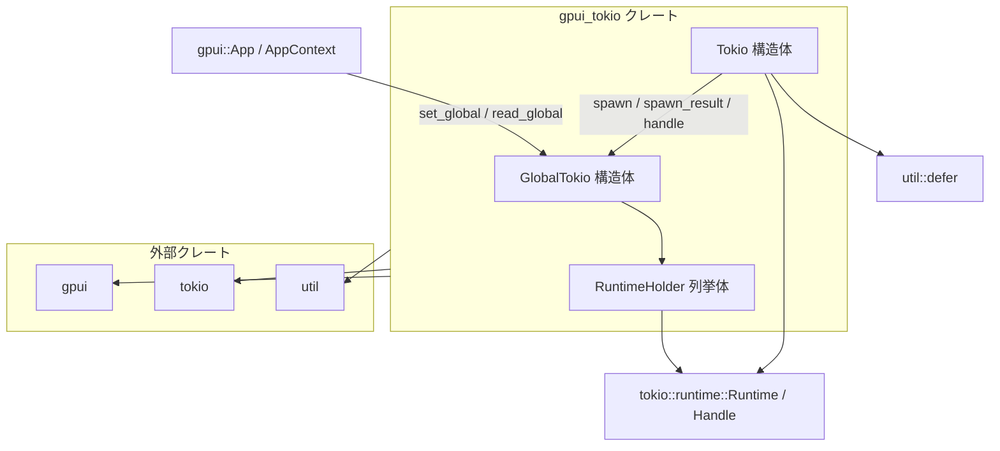

# gpui_tokio/ ディレクトリ解説

## 1. ざっくり一言

`gpui_tokio` は、GPUI（`gpui` クレート）のアプリケーションコンテキストから Tokio ランタイムを使って非同期タスクを実行するための薄いラッパークレートです。  
Tokio のランタイムを GPUI の `Global` として登録し、`Tokio::spawn` などで GPUI の `Task` と Tokio タスクを連動させる役割を持ちます。

---

## 2. このモジュールの役割

### 2.1 概要

- このクレートは **GPUI アプリケーション内で Tokio ランタイムを共有し、GPUI のタスクシステムと連携して非同期処理を実行する** ために存在します。
- 具体的には、Tokio ランタイムを `GlobalTokio` として `gpui::App` に登録し、
  - 新規ランタイムを内部で生成して登録する `init`
  - 既存のランタイム `Handle` を登録する `init_from_handle`
  - GPUI の `AppContext` から安全に Tokio タスクを起動する `Tokio::spawn` / `Tokio::spawn_result`
  - 登録済みランタイムの `Handle` を取得する `Tokio::handle`
  を提供します。

### 2.2 アーキテクチャ内での位置づけ

このクレートは、以下のような関係で他コンポーネントと連携します。



- `GlobalTokio` が「このアプリケーションで使う Tokio ランタイム」を 1 個保持します。
- `RuntimeHolder` が「ランタイムを自前で所有するのか (`Runtime`)」「外部から渡された `Handle` を共有するのか」の違いを吸収します。
- `Tokio` 構造体は状態を持たず、「Tokio 関連のユーティリティの名前空間」として使われています。

### 2.3 設計上のポイント

- **グローバル状態の管理**
  - `GlobalTokio` が `gpui::Global` を実装し、`App` に 1 つの Tokio ランタイムを登録・参照する形になっています。
- **ランタイムの所有形態を抽象化**
  - `RuntimeHolder` によって、「このクレートが `Runtime` を所有する場合 (`Owned`)」と「外部で管理されている `Handle` を借用する場合 (`Shared`)」の双方を同じインターフェース (`handle()`) で扱います。
- **タスクのライフサイクルの連動**
  - `util::defer` と Tokio の `AbortHandle` を利用して、**GPUI 側の `Task` がドロップされたときに、対応する Tokio タスクを `abort()` でキャンセルする** 仕組みが組み込まれています。
  - これにより、「UI 側から見て不要になった非同期処理」がバックグラウンドで走り続けることを避けています。
- **エラーハンドリングの選択肢**
  - `Tokio::spawn` は `Result<R, JoinError>`、`Tokio::spawn_result` は `anyhow::Result<R>` を返し、用途に応じてエラー表現を選べるようになっています。

---

## 3. 主要な機能一覧

このクレートが提供する主な機能は次のとおりです。

- **Tokio ランタイムの初期化**
  - `init`：2 スレッドのマルチスレッド Tokio ランタイムを新規に生成して、GPUI の `Global` として登録する。
  - `init_from_handle`：既存の `tokio::runtime::Handle` を `Global` として登録する。
- **Tokio タスクの起動（GPUI 統合版）**
  - `Tokio::spawn`：任意の `Future<Output = R>` を Tokio のスレッドプール上で実行し、その結果を `Task<Result<R, JoinError>>` として返す。
  - `Tokio::spawn_result`：`Future<Output = anyhow::Result<R>>` を実行し、その結果を `Task<anyhow::Result<R>>` として返す。
- **Tokio ランタイムハンドルの取得**
  - `Tokio::handle`：登録済みの Tokio ランタイム `Handle` を取得し、直接 Tokio の API を呼びたい場合に使用できるようにする。
- **Tokio の `JoinError` の再エクスポート**
  - `pub use tokio::task::JoinError;` により、利用側は `gpui_tokio::JoinError` としてエラー型を参照できます。

---

## 4. 関数・構造体の解説

### 4.1 型一覧

| 名前 | 種別 | 公開 | 役割 / 用途 |
|------|------|------|-------------|
| `RuntimeHolder` | 列挙体 | 非公開 (`enum`) | Tokio ランタイムを所有 (`Runtime`) するか、ハンドルを共有 (`Handle`) するかを表す内部用のラッパーです。 |
| `GlobalTokio` | 構造体 | 非公開 | `gpui::Global` を実装し、アプリケーション全体で共有される Tokio ランタイムを保持します。 |
| `Tokio` | 構造体 | 公開 (`pub struct`) | 状態を持たない名前空間的な構造体で、Tokio タスク起動・ハンドル取得などの静的メソッドを提供します。 |
| `JoinError` | 型エイリアス（再エクスポート） | 公開 (`pub use`) | `tokio::task::JoinError` の再エクスポートです。`Tokio::spawn` の戻り値などで使用します。 |

### 4.2 主要関数の詳細

#### `init(cx: &mut App)`

**概要**

- 2 ワーカースレッドを持つマルチスレッド Tokio ランタイムを新規に生成し、`GlobalTokio` として `gpui::App` に登録します。
- GPUI アプリで Tokio を使いたい場合の基本的な初期化関数です。

**引数**

| 引数名 | 型 | 説明 |
|--------|----|------|
| `cx` | `&mut App` | GPUI のアプリケーションコンテキスト。ここにグローバルとして Tokio ランタイムが登録されます。 |

**戻り値**

- なし。副作用として `cx` に `GlobalTokio` をセットします。

**内部処理の流れ**

1. `tokio::runtime::Builder::new_multi_thread()` でマルチスレッドランタイムのビルダーを生成。
2. `.worker_threads(2)` でワーカースレッド数を 2 に設定。
3. `.enable_all()` でタイマーや I/O など主要な Tokio 機能を有効化。
4. `.build()` で `Runtime` を生成し、エラーの場合は `expect("Failed to initialize Tokio")` で panic。
5. `RuntimeHolder::Owned(runtime)` でラップし、`GlobalTokio::new(...)` を通して `cx.set_global(...)` で登録。

**Examples（使用例）**

```rust
use gpui_tokio::init;          // gpui_tokio の init をインポート
use gpui::App;                 // GPUI の App 型（実際の型パスは gpui 側の定義に依存）

fn setup_app(mut app: App) {   // 何らかの形で App を受け取ると仮定
    // Tokio ランタイムを新規に作成し、この App に紐付ける
    init(&mut app);
    // 以降、この App 上のコンテキストから Tokio::spawn などが使える前提になります
}
```

**Edge cases（エッジケース）**

- すでに別の `GlobalTokio` がセットされている状態で `init` を再度呼んだ場合の挙動は、このチャンクからは分かりません。
- ランタイムの `build()` に失敗した場合は `expect` により panic します。

**使用上の注意点**

- `Tokio::spawn` や `Tokio::handle` を使う前に、必ずどこかで `init` もしくは `init_from_handle` が呼ばれている必要があります。
- 2 スレッド固定のランタイムが作られるため、より多くのスレッドが必要な場合は `init_from_handle` を用いて自前で構成した `Runtime` を渡す必要があります。

---

#### `init_from_handle(cx: &mut App, handle: tokio::runtime::Handle)`

**概要**

- すでに存在する Tokio ランタイムの `Handle` を GPUI の `GlobalTokio` として登録します。
- すでにアプリケーション全体で共有している Tokio ランタイムを使い回したい場合に利用します。

**引数**

| 引数名 | 型 | 説明 |
|--------|----|------|
| `cx` | `&mut App` | GPUI アプリケーションコンテキスト。 |
| `handle` | `tokio::runtime::Handle` | 既存の Tokio ランタイムハンドル。`Send + Sync` なコンテキストから取得したものを想定。 |

**戻り値**

- なし。副作用として `cx` に `GlobalTokio` をセットします。

**内部処理の流れ**

1. 渡された `handle` を `RuntimeHolder::Shared(handle)` に包む。
2. `GlobalTokio::new(...)` で構造体にし、`cx.set_global(...)` で登録。

**Examples（使用例）**

```rust
use gpui_tokio::init_from_handle;
use tokio::runtime::Runtime;
use gpui::App;

fn setup_with_existing_runtime(mut app: App) {
    // 既存の Tokio Runtime を自前で構築
    let runtime = Runtime::new().expect("Tokio runtime init failed");

    // Runtime から Handle を取得し、GPUI のグローバルに登録
    let handle = runtime.handle().clone();
    init_from_handle(&mut app, handle);

    // runtime 自体は別の場所で管理・ライフサイクル制御を行う前提です
}
```

**使用上の注意点**

- この関数はランタイムの所有権を持ちません。`Runtime` 本体のライフサイクル管理は呼び出し側の責任です。
- `Tokio::handle` や `Tokio::spawn` を通じて、この `Handle` が使われ続けるため、アプリケーションの存続期間中は `Runtime` が有効である必要があります。

---

#### `Tokio::spawn<C, Fut, R>(cx: &C, f: Fut) -> Task<Result<R, JoinError>>`

**概要**

- 指定された `Future<Output = R>` を Tokio のスレッドプール上で実行し、その完了結果（または `JoinError`）を GPUI の `Task` として返します。
- **GPUI の `Task` がドロップされると、対応する Tokio タスクは `abort()` によってキャンセルされる** ように設計されています。

**型パラメータ・トレイト境界**

- `C: AppContext`  
  GPUI のコンテキストインターフェース。`read_global` や `background_spawn` を提供します。
- `Fut: Future<Output = R> + Send + 'static`  
  Tokio のマルチスレッドランタイム上で実行できる `Future`。
- `R: Send + 'static`  
  実行結果がスレッド間で安全に移動できる必要があります。

**引数**

| 引数名 | 型 | 説明 |
|--------|----|------|
| `cx` | `&C` | GPUI の `AppContext` 実装。`read_global` 経由で `GlobalTokio` を取得します。 |
| `f` | `Fut` | Tokio のスレッドプール上で実行したい非同期処理。 |

**戻り値**

- `Task<Result<R, JoinError>>`  
  - `Ok(R)`：`Future` が正常終了した場合の結果。
  - `Err(JoinError)`：Tokio タスクが panic した・キャンセルされたなどで `join` に失敗した場合のエラー。

**内部処理の流れ**

1. `cx.read_global(|tokio: &GlobalTokio, cx| { ... })` で `GlobalTokio` を取得しつつ、GPUI コンテキスト `cx` を受け取るクロージャに入る。
2. `tokio.runtime.handle().spawn(f)` で `f` を Tokio のスレッドプール上に `spawn` し、`JoinHandle<R>` を得る。
3. `let abort_handle = join_handle.abort_handle();` でキャンセル用の `AbortHandle` を取得。
4. `let cancel = defer(move || { abort_handle.abort(); });` とし、`cancel` のドロップ時に `abort()` を呼ぶクロージャを登録。
5. `cx.background_spawn(async move { ... })` で GPUI のバックグラウンドタスクとして以下を実行する `Task` を生成:
   - `let result = join_handle.await;` で Tokio タスクの完了を待ち、`Result<R, JoinError>` を得る。
   - `drop(cancel);` で `cancel` を明示的にドロップし、登録されたクロージャを実行。
   - `result` を `Task` の結果として返す。

`util::defer` の実装はこのチャンクにはありませんが、`cancel` が GPUI のタスクとともに破棄されることで `abort_handle.abort()` が呼ばれる前提でコードが書かれています。

**Examples（使用例）**

GPUI の任意のハンドラ内で、非同期 I/O を Tokio で実行し、その結果を受け取る例です。

```rust
use gpui_tokio::Tokio;               // Tokio ユーティリティをインポート
use gpui::AppContext;                // 実際には GPUI 側のトレイトをインポート
use std::time::Duration;

// 何らかのコンポーネントメソッドやイベントハンドラ内を想定
fn do_async_work<C: AppContext>(cx: &C) {
    // Tokio ランタイム上で非同期タスクを起動し、GPUI Task を受け取る
    let task = Tokio::spawn(cx, async move {
        // ここは Tokio ランタイム上で動く非同期コード
        tokio::time::sleep(Duration::from_secs(1)).await;
        42  // 計算結果として 42 を返す
    });

    // task は GPUI の Task<Result<i32, JoinError>> 型（推論されます）
    // 実際の結果の取り出し方は gpui::Task の API に依存します
}
```

**Errors / Panics**

- 戻り値の `Result<R, JoinError>` の `Err` は、`Tokio` タスクが
  - panic した
  - `abort()` でキャンセルされた
  などの理由で正常終了しなかった場合に返されます。
- `GlobalTokio` が登録されていない状態で `read_global` が呼ばれたときの挙動はこのチャンクからは不明ですが、多くの `Global` 実装では panic となるケースが多いため、その可能性があります。

**Edge cases（エッジケース）**

- `f` が `Send` でない、または `'static` でない場合、コンパイルエラーとなります。
- GPUI の `Task` を途中でドロップした場合、Tokio 側のタスクは `abort()` される前提の設計です。
- `join_handle.await` 自体が `Err(JoinError)` を返す場合（panic 等）、そのまま `Task` の `Err` として伝播します。

**使用上の注意点**

- 長時間ブロッキングする処理を `async` の中で直接実行すると、Tokio のワーカースレッドを塞ぐ可能性があります。必要に応じて `spawn_blocking` 等の利用を検討する必要があります（このクレート自体は `spawn_blocking` をラップしていません）。
- `Tokio::spawn` 自体は GPUI の `Task` を返すだけであり、戻り値 `R` をいつどのように UI に反映するかは利用側の設計に委ねられています。

---

#### `Tokio::spawn_result<C, Fut, R>(cx: &C, f: Fut) -> Task<anyhow::Result<R>>`

**概要**

- `Future<Output = anyhow::Result<R>>` を Tokio のスレッドプール上で実行し、その結果を `Task<anyhow::Result<R>>` として返します。
- `anyhow::Result` ベースのエラーハンドリングをしているコードと相性がよいラッパーです。

**型パラメータ・トレイト境界**

- `C: AppContext`
- `Fut: Future<Output = anyhow::Result<R>> + Send + 'static`
- `R: Send + 'static`

**引数・戻り値**

| 引数名 | 型 | 説明 |
|--------|----|------|
| `cx` | `&C` | GPUI のコンテキスト。 |
| `f` | `Fut` | `Output = anyhow::Result<R>` を返す非同期処理。 |

- 戻り値: `Task<anyhow::Result<R>>`

**内部処理の流れ**

`spawn` とほぼ同じですが、内部の `async` ブロック内が次のように異なります。

1. `let result = join_handle.await?;`
   - ここで `join_handle.await` の戻り値 `Result<anyhow::Result<R>, JoinError>` に対して `?` を適用することで、`JoinError` は `anyhow::Error` に変換されて `Err` として返されます。
2. `drop(cancel);`
3. `result`（型は `anyhow::Result<R>`）を返す。

つまり、**Tokio タスクが正常終了した場合**は `f` が返した `anyhow::Result<R>` がそのまま返り、  
**Tokio タスク自体が失敗した場合**（panic・キャンセルなど）は `anyhow::Error` としてラップされて返ります。

**Examples（使用例）**

異常系も `anyhow::Result` でまとめたい場合の例です。

```rust
use gpui_tokio::Tokio;
use gpui::AppContext;
use anyhow::{Result, anyhow};

fn do_async_with_anyhow<C: AppContext>(cx: &C) {
    let task = Tokio::spawn_result(cx, async move {
        // 何らかの I/O や計算
        let value = some_async_func().await?;      // anyhow::Result でチェーン可能
        if value < 0 {
            // 何らかのドメインエラー
            Err(anyhow!("negative value: {}", value))
        } else {
            Ok(value)
        }
    });

    // Task<Result<i32>> のような形で扱えます
}

async fn some_async_func() -> Result<i32> {
    Ok(10)
}
```

**Errors / Panics**

- `join_handle.await` の `JoinError` は `?` によって `anyhow::Error` に変換されます。
- `f` 自身が返す `Err(anyhow::Error)` も、そのまま `Task` の `Err` になります。

**Edge cases（エッジケース）**

- `f` の戻り値が `Ok(R)` でも、Tokio タスクが panic した場合には `anyhow::Error` 側に変換されます（`join_handle.await` が `Err` を返すため）。
- `f` 内で `?` によるエラー伝播を多用する場合、どのレイヤーでログを出すかなどは利用側で設計する必要があります。

**使用上の注意点**

- `Tokio::spawn` 同様、GPUI の `Task` をドロップすると Tokio タスクがキャンセルされる設計になっています。
- `anyhow::Result` を使うことでエラーが一段ラップされるため、エラーの種類別にハンドリングしたい場合は、元のエラー型を `downcast` する必要があります。

---

#### `Tokio::handle(cx: &App) -> tokio::runtime::Handle`

**概要**

- GPUI の `App` から、登録済みの Tokio ランタイム `Handle` を取得します。
- `Tokio::spawn` 等ではなく、直接 Tokio の API を扱いたい場合に利用します。

**引数**

| 引数名 | 型 | 説明 |
|--------|----|------|
| `cx` | `&App` | GPUI アプリケーションコンテキスト。`GlobalTokio` を参照するために使われます。 |

**戻り値**

- `tokio::runtime::Handle`（クローンされたハンドル）  
  `RuntimeHolder::handle()` の戻り値を `clone()` したものです。

**内部処理の流れ**

1. `GlobalTokio::global(cx)` で `GlobalTokio` インスタンスへの参照を取得。
2. `.runtime.handle()` で内部の `RuntimeHolder` を経由して `&Handle` を取得。
3. `.clone()` して `Handle` の所有権を返却。

**Examples（使用例）**

```rust
use gpui_tokio::Tokio;
use gpui::App;

fn use_raw_tokio_handle(app: &App) {
    // GPUI グローバルに登録済みの Tokio ランタイムハンドルを取得
    let handle = Tokio::handle(app);

    // 例えば、Tokio の spawn_blocking を直接呼びたい場合
    handle.spawn_blocking(|| {
        // CPU 集約的な処理など
        heavy_computation()
    });
}

fn heavy_computation() {
    // 実際の重い処理
}
```

**使用上の注意点**

- `GlobalTokio` がセットされていない状態で `Tokio::handle` を呼ぶと、`GlobalTokio::global(cx)` の実装次第では panic になる可能性があります。
- 取得した `Handle` は、`Runtime` のライフタイムより長く保持しないように注意が必要です（`init_from_handle` を使って外部ランタイムを共有している場合など）。

---

### 4.3 補助的な関数・メソッド

| 関数 / メソッド名 | 役割（1 行） |
|-------------------|--------------|
| `RuntimeHolder::handle(&self) -> &tokio::runtime::Handle` | `Owned(Runtime)` と `Shared(Handle)` の両方から `Handle` への参照を取得する共通インターフェースです。 |
| `GlobalTokio::new(runtime: RuntimeHolder) -> Self` | `RuntimeHolder` を受け取って `GlobalTokio` を初期化する単純なコンストラクタです。 |

これらは内部実装の補助であり、利用者が直接呼び出すことは想定されていません（非公開）。

---

## 5. データフロー

ここでは、`Tokio::spawn_result` を使って GPUI から Tokio タスクを起動し、その結果を受け取る一連の流れを示します。

### 処理の概略

1. アプリケーション起動時に `gpui_tokio::init` または `init_from_handle` が呼ばれ、Tokio ランタイムが `GlobalTokio` として登録される。
2. ある UI コンポーネントやイベントハンドラ内で、`Tokio::spawn_result(cx, future)` が呼び出される。
3. `spawn_result` 内で `cx.read_global` により `GlobalTokio` を取得し、内部の `RuntimeHolder` 経由で `Handle` を取り出す。
4. `Handle::spawn(future)` により Tokio のスレッドプール上に `Future` が投入される。
5. 同時に `util::defer` で `AbortHandle` を管理し、GPUI タスクのライフサイクルと Tokio タスクのキャンセルを連動させる。
6. `cx.background_spawn` で `join_handle.await` を行う GPUI タスクを生成し、その結果を `Task<anyhow::Result<R>>` として UI 層に返す。

### シーケンス図

```mermaid
sequenceDiagram
    participant App as GPUI App
    participant GlobalTokio as GlobalTokio
    participant Runtime as Tokio Runtime
    participant UI as UIコンポーネント(Cx)
    participant Tokio as Tokio::spawn_result
    participant GPTask as GPUI Task
    participant Util as util::defer

    App->>GlobalTokio: set_global(GlobalTokio::new(RuntimeHolder))
    Note right of App: 起動時に init / init_from_handle を呼ぶ

    UI->>Tokio: Tokio::spawn_result(cx, future)
    Tokio->>UI: cx.read_global(|GlobalTokio, cx| { ... })
    UI-->>Tokio: &GlobalTokio, &mut AppContext
    Tokio->>Runtime: handle().spawn(future)
    Runtime-->>Tokio: JoinHandle<anyhow::Result<R>>
    Tokio->>Runtime: join_handle.abort_handle()
    Runtime-->>Tokio: AbortHandle
    Tokio->>Util: defer(|| abort_handle.abort())
    Util-->>Tokio: cancel guard
    Tokio->>UI: cx.background_spawn(async move { join_handle.await?; drop(cancel); ... })
    UI-->>GPTask: Task<anyhow::Result<R>>

    Note over GPTask,Runtime: Task がドロップされると<br/>cancel がドロップされ abort() が呼ばれる想定
```

この図から分かる通り、Tokio タスクと GPUI `Task` の間には以下の対応関係があります。

- **生成時**：Tokio タスク（`JoinHandle`）と GPUI `Task` がペアで生成される。
- **完了時**：`join_handle.await` の結果が GPUI `Task` の結果として返される。
- **キャンセル時**：GPUI `Task` がドロップされると、`util::defer` 経由で `AbortHandle::abort()` が呼ばれ、Tokio 側のタスクにキャンセルが伝播する。

---

## 6. 使い方（How to Use）

### 6.1 基本的な使用方法

1. アプリケーション起動時に Tokio ランタイムを GPUI に登録する（`init` または `init_from_handle`）。
2. 各 UI コンポーネントやイベントハンドラ内で、`Tokio::spawn` / `Tokio::spawn_result` を用いて非同期処理を実行する。
3. 必要に応じて `Tokio::handle` で生の `Handle` を取得し、Tokio 固有の API を利用する。

以下は最小限の流れの例です（`gpui::App` の生成方法は実際のアプリケーションによります）。

```rust
use gpui_tokio::{init, Tokio};           // 初期化とユーティリティをインポート
use gpui::{App, AppContext, Task};      // GPUI の型（実際のパスは gpui に依存）
use std::time::Duration;

// アプリケーション起動時
fn main() {
    // 実際には gpui::App の生成ロジックがあるはずです
    let mut app: App = create_app();     // 仮の関数 create_app とする

    // Tokio ランタイムを 2 スレッド構成で初期化して登録
    init(&mut app);

    // 以降、app を使って UI を立ち上げる
}

// 何らかの UI ハンドラ内のコード例
fn on_button_click<C: AppContext>(cx: &C) {
    // Tokio の非同期タスクを起動し、GPUI Task を受け取る
    let task: Task<Result<u64, gpui_tokio::JoinError>> = Tokio::spawn(cx, async move {
        tokio::time::sleep(Duration::from_secs(2)).await;
        100
    });

    // Task の使い方は gpui::Task の API に依存
    // 例: 完了時に UI を更新するなど
}

// App を生成する仮のヘルパ
fn create_app() -> App {
    // 実装は gpui 側に依存するためここでは省略します
    unimplemented!()
}
```

### 6.2 よくある使用パターン

#### パターン 1: 既存の Tokio ランタイムを共有する

すでに `tokio::main` で起動しているアプリケーションに GPUI を組み込み、同一ランタイムを使う場合です。

```rust
use gpui_tokio::{init_from_handle, Tokio};
use tokio::runtime::Handle;
use gpui::{App, AppContext};

#[tokio::main]
async fn main() {
    let handle: Handle = Handle::current();  // 既存ランタイムのハンドル

    let mut app: App = create_app();
    init_from_handle(&mut app, handle.clone()); // 既存ランタイムを GPUI に登録

    // 以降、GPUI 内からも同じ Tokio ランタイムを使って spawn 可能
}

fn some_handler<C: AppContext>(cx: &C) {
    let _task = Tokio::spawn_result(cx, async move {
        // 既存ランタイム上で実行される
        Ok("hello from shared runtime")
    });
}

fn create_app() -> App {
    unimplemented!()
}
```

#### パターン 2: `anyhow` ベースのドメインロジックをそのまま Tokio から呼び出す

ドメインロジックが `anyhow::Result` を返す関数群で構成されている場合、`Tokio::spawn_result` を使うとそのまま流用できます。

```rust
use gpui_tokio::Tokio;
use anyhow::Result;
use gpui::AppContext;

async fn load_data() -> Result<String> {
    // エラーを anyhow::Result で返す I/O 処理など
    Ok("data".to_string())
}

fn on_load_button<C: AppContext>(cx: &C) {
    let task = Tokio::spawn_result(cx, async {
        let data = load_data().await?;   // そのまま ? でつなげる
        Ok(data)
    });

    // task: Task<anyhow::Result<String>>
}
```

### 6.3 使用上の注意点（まとめ）

- **初期化の必須性**
  - `Tokio::spawn` / `Tokio::spawn_result` / `Tokio::handle` を使う前に、必ず `init` または `init_from_handle` で `GlobalTokio` を登録しておく必要があります。
  - 未登録状態での呼び出し時の挙動はこのチャンクからは分かりませんが、`Global` 実装の一般的な挙動として panic になりうる点に注意が必要です。

- **ランタイムのライフサイクル**
  - `init` を使った場合はランタイムを `RuntimeHolder::Owned` で保持しているため、`App` のライフタイムに紐付きます。
  - `init_from_handle` を使った場合は外部で `Runtime` を管理する必要があり、`Tokio::handle` や `Tokio::spawn` が動作している間はその `Runtime` が有効であることが前提になります。

- **タスクキャンセルの連動**
  - GPUI の `Task` がドロップされると、対応する Tokio タスクが `abort()` されるように設計されています（`util::defer` と `AbortHandle` による）。
  - そのため、「結果を待たずに UI 側で Task を捨てる」ことが、その非同期処理のキャンセルを意味することに注意が必要です。

- **`Send` / `'static` 制約**
  - `Tokio::spawn` / `spawn_result` で渡す `Future` と結果型 `R` は `Send + 'static` が必要です。
  - UI コンポーネントの参照などを直接キャプチャすると不適合になる場合があり、その場合は `Arc` などを使用する必要があります。

- **スレッド数・パフォーマンス**
  - `init` が生成するランタイムは `worker_threads(2)` に固定されています。大量の I/O や並列処理が想定される場合は、自前で `Runtime` を構成し `init_from_handle` を使う方が柔軟です。

---

## 7. 関連ファイル

このディレクトリに含まれるファイルと役割は次のとおりです。

| パス | 役割 / 関係 |
|------|------------|
| `gpui_tokio/Cargo.toml` | クレートのメタデータと依存関係を定義します。`gpui`, `tokio`, `anyhow`, `util` に依存し、ライブラリのエントリポイントを `src/gpui_tokio.rs` に設定しています。 |
| `gpui_tokio/src/gpui_tokio.rs` | 本クレートの全実装が含まれるファイルです。`init` / `init_from_handle` / `Tokio` 構造体など、ユーザーが利用する API はすべてここに定義されています。 |

外部クレートとの関係（コード中で参照されているもの）:

- `gpui` クレート
  - `App`, `AppContext`, `Global`, `ReadGlobal`, `Task` などの GPUI の基本的な抽象を提供します。
- `tokio` クレート
  - ランタイム (`tokio::runtime::Runtime`, `Handle`)、タスク (`tokio::task::JoinError`, `JoinHandle`)、および `rt`, `rt-multi-thread` 機能を利用します。
- `util` クレート
  - `util::defer` 関数を提供します。ドロップ時に指定されたクロージャを実行するようなユーティリティであると解釈でき、Tokio タスクの `AbortHandle` を GPUI `Task` のライフサイクルと結びつける目的で使われています（実装詳細はこのチャンクには含まれていません）。
