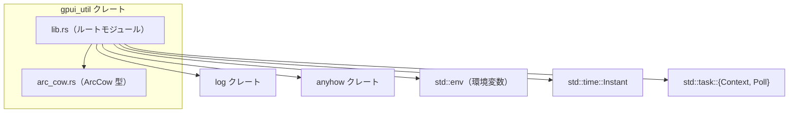
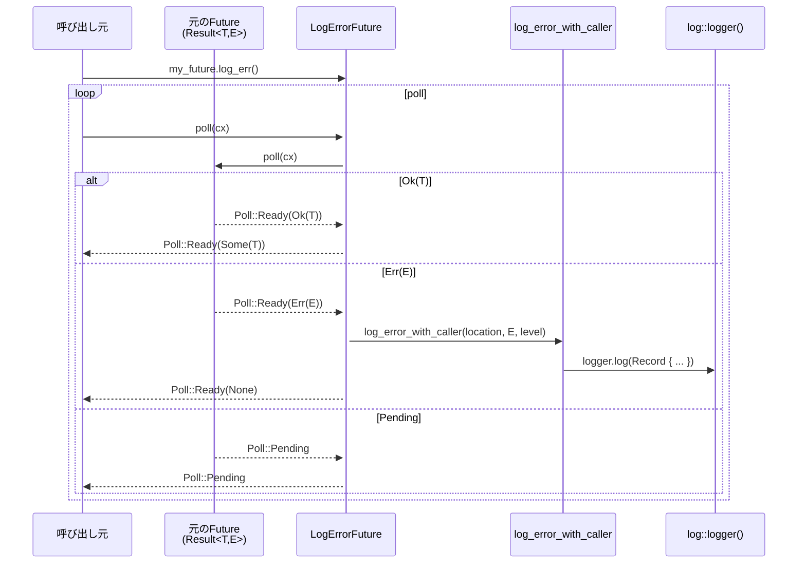

# gpui_util/

## 1. ざっくり一言

`gpui_util` は、ワークスペース全体で共有するためのユーティリティ crate です。  
参照カウント付きの `Cow` 互換型 `ArcCow`、同期／非同期のエラー・ログ補助、`defer` 風のスコープガードなどを提供します。

---

## 2. このモジュールの役割

### 2.1 概要

- このディレクトリは、他の crate から再利用される **共通ユーティリティ群** をまとめた crate です。
- 主な役割は次のとおりです。
  - `Arc<T>` を使ったコピー・オン・ライト風の enum 型 `ArcCow` の提供
  - `Result`／`Future<Output = Result<…>>` に対する **ログ出力・変換用の拡張トレイト**
  - 開発時とリリース時で挙動が異なる `debug_panic!` 系の補助
  - 時間計測 (`measure`) とスコープ終了時実行 (`defer`) の補助

### 2.2 アーキテクチャ内での位置づけ

この crate 自体はアプリケーションロジックを持たず、他の crate からインポートされて使われる想定の「下位ユーティリティ層」として位置づけられます。

ディレクトリ内と外部クレートとの依存関係はおおまかに次のようになります。



- `lib.rs` が crate のルートモジュールで、`arc_cow` モジュールを公開しています。
- `log`・`anyhow` は主にエラー・ログ関連のユーティリティで使用されています。
- `std::env` と `Instant` は時間計測 (`measure`) に使用されています。
- `std::task` 関連は、非同期用ラッパ Future (`LogErrorFuture`, `UnwrapFuture`) の実装で使用されています。

### 2.3 設計上のポイント

コードから読み取れる設計上の特徴は次のとおりです。

- **責務の分割**
  - `arc_cow.rs`: データ型 `ArcCow` とその派生実装をまとめたモジュール
  - `lib.rs`: それ以外の汎用ユーティリティ（ログ／Future／defer 等）を一括で提供
- **状態管理**
  - 基本的には stateless な関数・トレイト実装が中心です。
  - 例外は `measure` 内で環境変数の設定をキャッシュする `OnceLock<bool>` です。
- **エラーハンドリング・ログ**
  - `ResultExt` と `TryFutureExt` により、`Result` / `Future<Output = Result<…>>` から **ログを出しつつ値を取り出す** パターンを共通化しています。
  - ログ出力は `log_error_with_caller` に集約され、呼び出し元のファイルパス・行番号をログに埋め込む構造になっています。
- **デバッグとリリースで挙動を切り替え**
  - `debug_panic!` や `some_or_debug_panic` は、`cfg!(debug_assertions)` を利用して **開発時には panic、リリース時にはログのみ** という挙動を取ります。
- **RAII によるスコープ管理**
  - `Deferred` と `defer` により、「スコープ終了時に必ず実行する処理」を RAII（ドロップ時実行）で表現しています。

---

## 3. 主要な機能一覧

この crate が提供する主な機能を箇条書きで整理します。

- `ArcCow<'a, T>`: 借用（`&'a T`）または `Arc<T>` 所有のどちらかを持てる enum 型
- `post_inc<T>`: 「後置インクリメント」風に、古い値を返しつつ 1 加算する汎用関数
- `measure`: 環境変数 `ZED_MEASUREMENTS` が有効なときに処理時間を計測し、標準エラーにログ出力する関数
- `debug_panic!` マクロ: デバッグビルドでは `panic!`、リリースビルドではエラーとバックトレースをログ出力するマクロ
- `some_or_debug_panic`: `Option` が `None` の場合、デバッグビルドでは panic するヘルパー
- `maybe!` マクロ: 即時実行関数式（IIFE）を生成し、`?` 演算子などを使いやすくするマクロ（同期／async 対応）
- `ResultExt` トレイト:
  - `log_err`, `warn_on_err`: `Result` のエラーをログに出しつつ `Option<T>` に変換
  - `debug_assert_ok`: 開発時に「ここでは Err にならないはず」という前提をチェック
  - `anyhow`: 任意のエラー型を `anyhow::Error` に変換
- `log_err` 関数: 任意のエラー値を、呼び出し元位置付きでログ出力する関数
- `TryFutureExt` トレイトと `LogErrorFuture`, `UnwrapFuture`:
  - 非同期の `Future<Output = Result<T, E>>` に対して、ログ出力や unwrap を行うラッパ Future を提供
- `Deferred` / `defer`: 値がドロップされるときに登録された関数を実行するスコープガード

---

## 4. 関数・構造体の解説

### 4.1 型一覧（構造体・列挙体・トレイトなど）

| 名前 | 種別 | 役割 / 用途 |
|------|------|-------------|
| `ArcCow<'a, T: ?Sized>` | enum | 借用参照または `Arc<T>` を保持する、`Cow` に類似した型 |
| `ResultExt<E>` | トレイト | `Result<T, E>` にログ出力や `anyhow` 変換などの拡張メソッドを追加 |
| `TryFutureExt` | トレイト | `Future<Output = Result<T, E>>` に対してログや unwrap を行う拡張メソッドを追加 |
| `LogErrorFuture<F>` | 構造体 | `Future<Output = Result<T, E>>` をラップし、完了時にエラーをログへ出力する `Future` |
| `UnwrapFuture<F>` | 構造体 | `Future<Output = Result<T, E>>` をラップし、完了時に `Result::unwrap` を適用する `Future` |
| `Deferred<F>` | 構造体 | スコープ終了時（`Drop` 時）にクロージャ `F` を実行するスコープガード |

#### 4.1.1 `ArcCow<'a, T>` の詳細

```rust
pub enum ArcCow<'a, T: ?Sized> {
    Borrowed(&'a T), // 借用参照を保持する
    Owned(Arc<T>),   // 参照カウント付き所有権を保持する
}
```

**主な特徴**

- `Borrowed(&'a T)` と `Owned(Arc<T>)` の 2 つのバリアントを持ちます。
  - `Borrowed`: ライフタイム `'a` に紐づく借用です。
  - `Owned`: `Arc<T>` による共有所有で、ライフタイム `'a` には依存しません。
- `PartialEq`, `Eq`, `PartialOrd`, `Ord`, `Hash`, `Clone`, `Debug` などが実装されており、
  - 値で比較される（Borrowed/Owned で挙動が変わらない）
  - `Owned` の `Clone` は `Arc` の参照カウントを増やすだけです。
- `Deref<Target = T>`, `AsRef<T>`, `Borrow<T>` の実装により、多くの場面で `&T` と同様に扱えます。

**主な `From` 実装（抜粋）**

- `From<&'a T> for ArcCow<'a, T>`: 借用から `Borrowed` を生成
- `From<Arc<T>> for ArcCow<'_, T>` / `From<&Arc<T>> for ArcCow<'_, T>`: `Owned` を生成
- `From<String> for ArcCow<'_, str>` / `From<&String> for ArcCow<'_, str>`:
  - `String` から `Arc<str>` へ変換して `Owned` を生成
- `From<Cow<'a, str>> for ArcCow<'a, str>`:
  - `Cow::Borrowed` → `Borrowed(&'a str)`
  - `Cow::Owned(String)` → `Owned(Arc<str>)`
- `From<Vec<T>> for ArcCow<'_, [T]>`:
  - `Vec<T>` から `Arc<[T]>` へ変換して `Owned` を生成
- `From<&'a str> for ArcCow<'a, [u8]>`:
  - `&str` から `&[u8]` への借用変換 (`s.as_bytes()`) を行い `Borrowed` を生成

**使用例**

```rust
use std::sync::Arc;                              // Arc 型をインポート
use gpui_util::arc_cow::ArcCow;                 // ArcCow 型をインポート

fn main() {
    // &str からの借用
    let borrowed: ArcCow<'_, str> = ArcCow::from("hello"); // 静的文字列を Borrowed として保持

    // String からの所有版
    let owned_string = String::from("world");   // 所有する String を作成
    let owned: ArcCow<'_, str> = ArcCow::from(owned_string); // Arc<str> に変換され Owned として保持

    // Vec からの所有スライス
    let vec = vec![1, 2, 3];                    // Vec<i32> を準備
    let slice: ArcCow<'_, [i32]> = ArcCow::from(vec); // Arc<[i32]> に変換され Owned として保持

    // Arc<T> から
    let arc = Arc::new(42_u32);                 // Arc<u32> を作成
    let cow = ArcCow::from(arc.clone());        // Owned(Arc<u32>) が生成される

    // 通常の &T と同様に参照できる
    let value: &u32 = &*cow;                    // Deref により &u32 として扱える
    println!("{value}");                        // 42 が出力される
}
```

**エッジケース・注意点**

- `Borrowed` バリアントの参照先は、`ArcCow` が使われている間生きている必要があります（通常のライフタイム規則どおりです）。
- `From<String>` や `From<Vec<T>>` は、`Arc` への変換のために **追加のメモリ割り当て** を行います。
- `Hash` や `Eq` は中身の `T` に対して行われるため、`Borrowed` と `Owned` が混在していても、値が同じなら同じハッシュ・比較結果になります。

---

### 4.2 主要な関数・メソッド・マクロの詳細（最大 7 件）

以下では、特に重要と思われる API を 7 つに絞って詳しく説明します。

#### 4.2.1 `post_inc<T: From<u8> + AddAssign<T> + Copy>(value: &mut T) -> T`

**概要**

- `value` を 1 増加させつつ、**増加前の値** を返す関数です。
- 「後置インクリメント (`x++`)」に相当する挙動を汎用的に表現しています。

**引数**

| 引数名 | 型 | 説明 |
|--------|----|------|
| `value` | `&mut T` | インクリメント対象の値への可変参照 |

**戻り値**

- 型: `T`
- 説明: インクリメントされる前の元の値

**内部処理の流れ**

1. `prev` に `*value`（現在の値）をコピーする。
2. `*value += T::from(1)` として、1 を `T` に変換して加算する。
3. `prev` を返す。

**使用例**

```rust
use gpui_util::post_inc;                    // post_inc 関数をインポート

fn main() {
    let mut counter: u32 = 10;              // カウンタを 10 で初期化
    let old = post_inc(&mut counter);       // old は 10、counter は 11 になる
    println!("old = {old}, new = {counter}"); // "old = 10, new = 11" が出力される
}
```

**エッジケース**

- `T` が整数型で最大値付近の場合、加算によるオーバーフローは **型 `T` の通常の挙動** に従います。
  - 例: `u32` ではデバッグビルドで panic、リリースビルドでラップアラウンド。

**使用上の注意点**

- `T: From<u8> + AddAssign<T> + Copy` を満たす型にのみ使用できます。
- 繰り返し呼び出すときは、オーバーフローに注意する必要があります。

---

#### 4.2.2 `measure<R>(label: &str, f: impl FnOnce() -> R) -> R`

**概要**

- クロージャ `f` の実行時間を計測し、**環境変数 `ZED_MEASUREMENTS` が有効なときのみ** 標準エラーに計測結果を出力する関数です。
- 戻り値は `f()` の結果そのものです。

**引数**

| 引数名 | 型 | 説明 |
|--------|----|------|
| `label` | `&str` | ログ出力時に表示するラベル文字列 |
| `f` | `impl FnOnce() -> R` | 計測対象の処理を表すクロージャ |

**戻り値**

- 型: `R`
- 説明: クロージャ `f` の実行結果

**内部処理の流れ**

1. 静的な `OnceLock<bool>` を使って、`ZED_MEASUREMENTS` 環境変数の値を初回だけ読み込み・キャッシュする。
   - `"1"` または `"true"` の場合に `true` になる。
2. フラグが `true` の場合:
   - 現在時刻を `Instant::now()` で取得。
   - `f()` を実行しつつ、その前後の時間差を計測。
   - `eprintln!("{label}: {elapsed:?}")` で標準エラーに出力。
3. フラグが `false` の場合:
   - 単に `f()` を呼び出して結果を返す。

**使用例**

```rust
use gpui_util::measure;                          // measure 関数をインポート

fn main() {
    // 環境変数 ZED_MEASUREMENTS が "1" か "true" の場合のみ計測ログが出る
    let result = measure("heavy_task", || {       // heavy_task というラベルを付ける
        // ここに重い処理を書く
        expensive_computation()                   // 関数の戻り値がそのまま result になる
    });
    println!("result = {result}");                // 計算結果を表示
}

fn expensive_computation() -> u32 {
    // ダミーの重い処理
    (0..1_000_000).sum()                          // 0 から 999_999 までを合計
}
```

**エッジケース**

- `f` が panic した場合、計測結果はログに出力されません（`f()` の途中で unwind するため）。
- 環境変数 `ZED_MEASUREMENTS` を最初に読むタイミングは、最初に `measure` が呼ばれたときです。それ以降に値を変更しても、キャッシュされた値は変わりません。

**使用上の注意点**

- 高頻度で呼び出されるコードに対しても、環境変数の読み出しは `OnceLock` により 1 度だけ行われます。
- 計測結果は標準エラー（`stderr`）に出力される点に注意が必要です。

---

#### 4.2.3 `debug_panic!` マクロ

**概要**

- デバッグビルド（`cfg!(debug_assertions)` が真）では `panic!` を発生させるが、
- リリースビルドでは panic せずに、**エラーメッセージとバックトレースを `log::error!` で出力** するマクロです。

**シグネチャ（概念的）**

```rust
debug_panic!("message: {}", value);
```

**内部処理の流れ**

1. `cfg!(debug_assertions)` でビルドモードを判定。
2. デバッグビルド:
   - `panic!($($fmt_arg)*)` をそのまま実行。
3. リリースビルド:
   - `std::backtrace::Backtrace::capture()` でバックトレースを取得。
   - `log::error!("{}\n{:?}", format_args!(...), backtrace);` でエラーとスタックトレースをログ出力。

**使用例**

```rust
use gpui_util::debug_panic;                    // マクロをインポート（Rust 2018 以降）

fn must_not_fail(x: i32) {
    if x < 0 {
        debug_panic!("x must be non-negative, but got {}", x); // デバッグでは panic、リリースではログのみ
    }
}
```

**エッジケース**

- リリースビルドでは panic しないため、「必ずプロセスが終了する」とは限りません。

**使用上の注意点**

- 「開発中にだけ強くチェックしたい条件」に適しています。
- 本番環境で異常系を完全に止めたい場合は、通常の `panic!` や明示的なエラー処理を用いる必要があります。

---

#### 4.2.4 `maybe!` マクロ

**概要**

- ブロックを「その場で実行される無名関数」としてラップするマクロです。
- `?` 演算子を使いたいが、外側の関数の戻り値が `Option` や `Result` ではない場合に使うと便利な構造になっています。
- 同期ブロック・`async` ブロック・`async move` ブロックに対応しています。

**展開イメージ**

```rust
maybe!({ /* block */ })             // → (|| { /* block */ })()
maybe!(async { /* block */ })       // → (async || { /* block */ })()
maybe!(async move { /* block */ })  // → (async move || { /* block */ })()
```

**使用例（同期版）**

```rust
use gpui_util::maybe;                           // maybe マクロをインポート

fn check_env() -> bool {
    // Option を返す即時無名関数として block を評価
    let result: Option<bool> = maybe!({
        let path = std::env::var("CONFIG_PATH").ok()?; // 環境変数が無いと None を返す
        println!("CONFIG_PATH = {path}");              // 正常ならパスを表示
        Some(true)                                     // 正常終了を表す
    });

    result.unwrap_or(false)                            // None の場合は false とみなす
}
```

**使用例（async 版）**

```rust
use gpui_util::maybe;                           // maybe マクロをインポート

async fn fetch_data_or_default() -> String {
    // async block も同様に即時実行され、Future が返る
    maybe!(async {
        let body = reqwest::get("https://example.com") // HTTP リクエストを送る
            .await
            .ok()?;                                    // エラー時は None
        Some(body.text().await.unwrap_or_default())    // レスポンスボディを文字列化
    })
    .await                                            // maybe! が返す Future を await
    .unwrap_or_else(|| "default".to_string())         // None の場合はデフォルト文字列
}
```

**使用上の注意点**

- `maybe!` 自体は戻り値の型を変えません。  
  例: 同期版では `maybe!({ ... })` の戻り値はブロック内の式の型になります。
- `?` による早期 return の型と、外側で扱う型（例: `Option<T>`）の整合性に注意が必要です。

---

#### 4.2.5 `ResultExt<E>` トレイト（代表: `log_err`, `anyhow`）

**概要**

- 標準の `Result<T, E>` に対して、**エラーのログ出力** や **`anyhow::Result` への変換** などの拡張メソッドを提供します。
- このトレイトは `Result<T, E>` に対して実装されています（`impl<T, E> ResultExt<E> for Result<T, E>`）。

**主なメソッド**

- `fn log_err(self) -> Option<T>`:
  - エラーを `log::Level::Error` でログ出力し、`Ok(T)` のときは `Some(T)`, `Err(_)` のときは `None` を返します。
- `fn warn_on_err(self) -> Option<T>`:
  - ログレベルが `Warn` である点を除き、`log_err` と同様です。
- `fn debug_assert_ok(self, reason: &str) -> Self`:
  - `Err(e)` の場合、`debug_panic!("{reason} - {error:?}")` を呼びます（結果としてデバッグビルドでは panic）。
  - 戻り値は元の `Result<T, E>` です。
- `fn log_with_level(self, level: log::Level) -> Option<T>`:
  - ログレベルを指定可能な `log_err` の汎用版です。
- `fn anyhow(self) -> anyhow::Result<T> where E: Into<anyhow::Error>`:
  - `Err(e)` を `anyhow::Error` に変換して `anyhow::Result<T>` に変換します。

**内部処理（`log_with_level` の例）**

1. `self` が `Ok(value)` の場合: `Some(value)` を返す（ログ出力はしない）。
2. `self` が `Err(error)` の場合:
   - `Location::caller()` から呼び出し位置情報を取得。
   - `log_error_with_caller(location, error, level)` を呼ぶ。
   - 戻り値は `None`。

**使用例**

```rust
use gpui_util::ResultExt;                       // ResultExt トレイトをインポート

fn read_config() -> Option<String> {
    let path = "config.toml";                  // 読み込み対象のファイル
    // io::Result<String> に対して log_err を呼び出す
    std::fs::read_to_string(path)
        .log_err()                             // Err の場合はエラーをログ出力し None を返す
}

fn as_anyhow() -> anyhow::Result<String> {
    let path = "config.toml";                  // 同じく設定ファイル
    std::fs::read_to_string(path)
        .anyhow()                              // io::Error を anyhow::Error に変換
}
```

**エッジケース**

- `log_err` / `warn_on_err` / `log_with_level` は、`Err` のとき **`None` を返す** 点に注意が必要です。
  - `Option<T>` をそのまま `?` したりすると `None` が伝播します。
- `debug_assert_ok` は、`debug_panic!` を内部で呼ぶため、ビルドモードによってエラー時の挙動が変わります。

**使用上の注意点**

- ログ出力用メソッドは `Result<T, E>` を `Option<T>` に変換するため、「ログを出して無視する」用途には適していますが、値が `None` になった後の処理に注意が必要です。
- すべてのメソッドで `E: Debug` が前提となります（`anyhow` だけは `E: Into<anyhow::Error>` が必要）。

---

#### 4.2.6 `TryFutureExt` トレイト + `LogErrorFuture<F>`

**概要**

- `Future<Output = Result<T, E>>` 型の Future に対して、同期版の `ResultExt` と同様の操作（エラー時のログ出力や unwrap）を提供する拡張トレイトです。
- 主に次のメソッドがあります。
  - `log_err(self) -> LogErrorFuture<Self>`
  - `log_tracked_err(self, location: Location<'static>) -> LogErrorFuture<Self>`
  - `warn_on_err(self) -> LogErrorFuture<Self>`
  - `unwrap(self) -> UnwrapFuture<Self>`

**`log_err` の挙動**

- `LogErrorFuture<F>` の `Future` 実装は次のように動きます。

1. 内部の Future `F` を `poll` する。
2. `Poll::Ready(Ok(value))` のとき:
   - `Some(value)` を包んだ `Poll::Ready(Some(value))` を返す。
3. `Poll::Ready(Err(error))` のとき:
   - 事前に保存しておいた `Location<'static>`（`log_err` 呼び出し元）とともに
     `log_error_with_caller(location, error, level)` を呼び、ログ出力する。
   - `Poll::Ready(None)` を返す。
4. `Poll::Pending` のとき:
   - そのまま `Poll::Pending` を返す。

**使用例**

```rust
use std::future::Future;                        // Future トレイト
use gpui_util::TryFutureExt;                   // TryFutureExt トレイトをインポート

async fn async_task() -> Result<u32, anyhow::Error> {
    Ok(42)                                     // ここでは常に成功するダミー
}

async fn run() {
    // async_task の結果をログ付きで受け取る
    let value: Option<u32> = async_task().log_err().await; // Err の場合はログ出力され、None となる
    println!("value = {:?}", value);           // Some(42) か None
}
```

**`unwrap` の挙動**

- `UnwrapFuture<F>` の `poll` 実装は、`F` が `Ready(result)` になったとき `result.unwrap()` を返します。
- つまり、`Ok(T)` なら `T` を返し、`Err(E)` なら panic します（通常の `Result::unwrap` と同じです）。

**使用上の注意点**

- `log_err` / `warn_on_err` の戻り値は `Future<Output = Option<T>>` です。  
  `Some(T)` / `None` を区別して後続処理を記述する必要があります。
- `unwrap` を使うと非同期処理完了時に panic する可能性があります。
- `log_tracked_err` は `Location<'static>` を明示的に渡せるため、ログに載せたい位置情報を制御したい場合に使えます。

---

#### 4.2.7 `Deferred<F>` と `defer<F: FnOnce()>(f: F) -> Deferred<F>`

**概要**

- `Deferred<F>` は `Drop` 実装を持つスコープガードです。
- `defer(f)` で生成した値がドロップされるときに、クロージャ `f` を 1 度だけ実行します。
- `Deferred::abort(self)` を呼ぶと、ドロップ時の実行をキャンセルできます。

**シグネチャ**

```rust
pub struct Deferred<F: FnOnce()>(Option<F>);

impl<F: FnOnce()> Deferred<F> {
    pub fn abort(mut self);
}

pub fn defer<F: FnOnce()>(f: F) -> Deferred<F>;
```

**内部処理の流れ**

1. `defer(f)` は `Deferred(Some(f))` を生成します。
2. `Deferred` が `Drop` されるとき:
   - 内部の `Option<F>` から `Some(f)` を取り出し、`f()` を実行します。
3. `abort(self)` を呼ぶと:
   - 内部の `Option<F>` を `None` にし、その後の `Drop` では何も実行されません。

**使用例**

```rust
use gpui_util::defer;                          // defer 関数をインポート

fn main() {
    // スコープを抜けると必ずこのクロージャが実行される
    let _cleanup = defer(|| {
        println!("scope ended");               // スコープの終了時に実行される
    });

    println!("in scope");                      // 先にこのメッセージが出る
}                                              // ここで _cleanup が Drop され、"scope ended" が出力される
```

**キャンセルの例**

```rust
use gpui_util::defer;                          // defer 関数をインポート

fn main() {
    let cleanup = defer(|| {
        println!("will not run");              // abort によって実行されない
    });

    cleanup.abort();                           // Drop 時の実行をキャンセル
    println!("done");                          // "done" だけが出力される
}
```

**エッジケース・注意点**

- `defer` は `#[must_use]` が付いています。戻り値を変数に束縛しないと、同じ行の末尾で直ちに drop されてしまい、意図しないタイミングで実行されます。
  - 例: `defer(|| println!("x")); println!("y");` の場合、"x" が先に出力されます。
- `Deferred::abort` は `self` を消費するメソッドです。`abort` を呼んだ後に同じ値を再利用することはできません。

---

### 4.3 その他の関数・メソッド・マクロ

ここでは詳細説明を省略した補助的 API を一覧にします。

| 名称 | 種別 | 役割（1 行） |
|------|------|--------------|
| `some_or_debug_panic<T>(option: Option<T>) -> Option<T>` | 関数 | `None` の場合、デバッグビルドでは panic、リリースビルドではそのまま `None` を返す |
| `log_err<E: Debug>(error: &E)` | 関数 | 任意のエラー値を、呼び出し元位置付きで `log::Level::Error` としてログ出力する |
| `ResultExt::warn_on_err` | メソッド | エラーを `Warn` レベルでログに出しつつ `Option<T>` を返す |
| `ResultExt::debug_assert_ok` | メソッド | `Err` の場合、開発中に panic（リリースではログ）させるためのアサーション |
| `ResultExt::log_with_level` | メソッド | 任意のログレベルでエラーを出力する汎用版 |
| `ResultExt::anyhow` | メソッド | エラー型 `E` を `anyhow::Error` に変換する |
| `TryFutureExt::warn_on_err` | メソッド | 非同期版の `warn_on_err` |
| `TryFutureExt::log_tracked_err` | メソッド | ログに使う位置情報を明示的に渡してエラーを出力する |
| `TryFutureExt::unwrap` | メソッド | 非同期処理の結果を `Result::unwrap` して返すラッパ Future を作る |
| `Deferred::abort` | メソッド | Drop 時のクロージャ実行をキャンセルする |
| `log_error_with_caller` | 関数（プライベート） | ファイルパス・行番号・ crate 名などからログの target/module_path を組み立てて出力する内部ユーティリティ |

---

## 5. データフロー

ここでは、非同期エラーのログ出力フロー（`TryFutureExt::log_err` → `LogErrorFuture` → `log_error_with_caller`）を例に、データの流れを整理します。

### 5.1 説明

1. 利用者は `Future<Output = Result<T, E>>` を返す非同期処理に対して `.log_err()` を呼びます。
2. これにより `LogErrorFuture<F>` というラッパ Future が生成されます。
3. `LogErrorFuture` の `poll` が呼ばれると、内部の Future `F` を `poll` します。
4. `F` が `Err(error)` を返した場合、`log_error_with_caller` が呼ばれ、ログに記録されます。
5. ラッパ Future の結果は `Option<T>` で、`Err` のときは `None` となります。

### 5.2 シーケンス図（Mermaid）



この図から分かるポイント:

- エラーは `Future` 完了時にのみログへ出力されます（`Poll::Ready(Err(_))`）。
- 呼び出し元は `Option<T>` を受け取り、`Some(T)` のみを扱えばよい構造になっています。
- ログには `Location::caller()` から取得したファイル名・行番号などが含まれます。

---

## 6. 使い方（How to Use）

### 6.1 基本的な使用方法

ここでは、この crate の代表的な要素をまとめて利用する例を示します。

```rust
use gpui_util::{
    arc_cow::ArcCow,       // ArcCow 型
    defer,                 // defer 関数
    measure,               // measure 関数
    post_inc,              // post_inc 関数
    ResultExt,             // ResultExt トレイト
};

fn main() -> anyhow::Result<()> {
    // post_inc: 後置インクリメント
    let mut counter: u32 = 0;                  // カウンタを 0 で初期化
    let prev = post_inc(&mut counter);         // prev = 0, counter = 1 になる
    println!("prev = {prev}, counter = {counter}");

    // defer: スコープ終了時に実行される処理を登録
    let _cleanup = defer(|| {
        println!("scope ended");               // main の最後で必ず実行される
    });

    // measure: 重い処理の時間計測（ZED_MEASUREMENTS が有効なときのみログ）
    let value = measure("heavy_work", || {
        heavy_work()                           // 重い処理（例）
    });
    println!("heavy_work result = {value}");

    // ResultExt::log_err: エラーをログに出しつつ無視する例
    let _ = might_fail().log_err();            // Err の場合はログに出力され、戻り値は Option<()> になる

    // ArcCow: &str からの借用
    let name: ArcCow<'_, str> = ArcCow::from("static name");
    println!("name = {}", &*name);             // Deref により &str として参照できる

    Ok(())                                     // anyhow::Result の成功値を返す
}

// ダミーの重い処理
fn heavy_work() -> u32 {
    (0..1_000_000).sum()                       // 0 から 999_999 までを合計
}

// 失敗するかもしれない処理
fn might_fail() -> Result<(), std::io::Error> {
    std::fs::read_to_string("maybe_missing.txt")?; // ファイル読み込みを試みる
    Ok(())                                     // 成功したら Ok(())
}
```

### 6.2 よくある使用パターン

#### パターン 1: `maybe!` を用いた「`?` を使うが戻り値は自由」な処理

```rust
use gpui_util::maybe;                          // maybe マクロをインポート

fn load_optional_config() -> bool {
    // maybe! の中では ? を使って Option チェーンを書ける
    let result: Option<bool> = maybe!({
        let path = std::env::var("CONFIG_PATH").ok()?; // CONFIG_PATH が無ければ None
        let content = std::fs::read_to_string(path).ok()?; // 読み込み失敗でも None
        println!("config: {content}");
        Some(true)                               // 正常なら true
    });

    result.unwrap_or(false)                      // 失敗したら false でフォールバック
}
```

#### パターン 2: 非同期処理での `TryFutureExt::log_err`

```rust
use gpui_util::TryFutureExt;                    // TryFutureExt トレイトをインポート

async fn async_operation() -> Result<u32, anyhow::Error> {
    Ok(42)                                      // ダミーの成功結果
}

async fn run_async() {
    // エラーはログに出しつつ、Option<u32> で扱う
    let value: Option<u32> = async_operation().log_err().await;
    if let Some(v) = value {
        println!("value = {v}");                // 成功時のみ実行
    } else {
        println!("async_operation failed");     // エラー時
    }
}
```

#### パターン 3: ドメインエラーから `anyhow::Result` への変換

```rust
use gpui_util::ResultExt;                       // ResultExt トレイトをインポート

#[derive(Debug)]
struct MyError;                                 // ドメイン固有のエラー型

fn domain_logic() -> Result<u32, MyError> {
    Ok(1)                                       // ダミーの成功
}

fn as_anyhow() -> anyhow::Result<u32> {
    domain_logic().anyhow()                     // MyError を anyhow::Error に変換
}
```

### 6.3 使用上の注意点

- **`debug_panic!` / `some_or_debug_panic` の挙動**
  - デバッグビルドでは panic しますが、リリースビルドでは主にログ出力のみです。
  - 「本番環境でも必ず停止させたい」ケースでは、これらだけに頼らず明示的なエラー処理を行う必要があります。
- **`ResultExt` / `TryFutureExt` の `log_err` / `warn_on_err`**
  - 戻り値が `Option<T>` になるため、`Err` の場合は `None` であることに注意が必要です。
  - 単にログを出したいだけなら、戻り値を無視しても構いませんが、`None` 伝播で意図しない分岐にならないように設計する必要があります。
- **`defer` と `Deferred`**
  - 戻り値を変数に束縛しないと、その行の末尾ですぐに drop されてしまい、想定より早いタイミングでクロージャが実行されます。
  - `#[must_use]` によりコンパイラが警告しますが、意図したスコープを明確にするためにも、`let _guard = defer(...);` のように変数に保持することが前提の設計になっています。
- **`ArcCow` のライフタイム**
  - `Borrowed(&'a T)` バリアントを使う場合は、参照先 `T` が `ArcCow` の利用期間中生きている必要があります。
- **`measure` の環境変数**
  - `ZED_MEASUREMENTS` を最初に読み込んだ後は、その値が `OnceLock` にキャッシュされ、プロセスの存続中は変わりません。
  - 計測のオン／オフを切り替える場合は、プロセス起動前に環境変数を設定する必要があります。

---

## 7. 関連ファイル

| パス | 役割 / 関係 |
|------|------------|
| `gpui_util/Cargo.toml` | `gpui_util` crate のパッケージ定義。`log` と `anyhow` を workspace 経由で依存に持つ。 |
| `gpui_util/src/lib.rs` | crate ルート。`arc_cow` モジュールの公開に加え、`post_inc`, `measure`, `debug_panic!`, `maybe!`, `ResultExt`, `TryFutureExt`, `Deferred` などのユーティリティを定義する中心ファイル。 |
| `gpui_util/src/arc_cow.rs` | `ArcCow<'a, T>` 型と、その各種トレイト実装・`From` 実装を提供するモジュール。`lib.rs` から `pub mod arc_cow;` で公開される。 |
