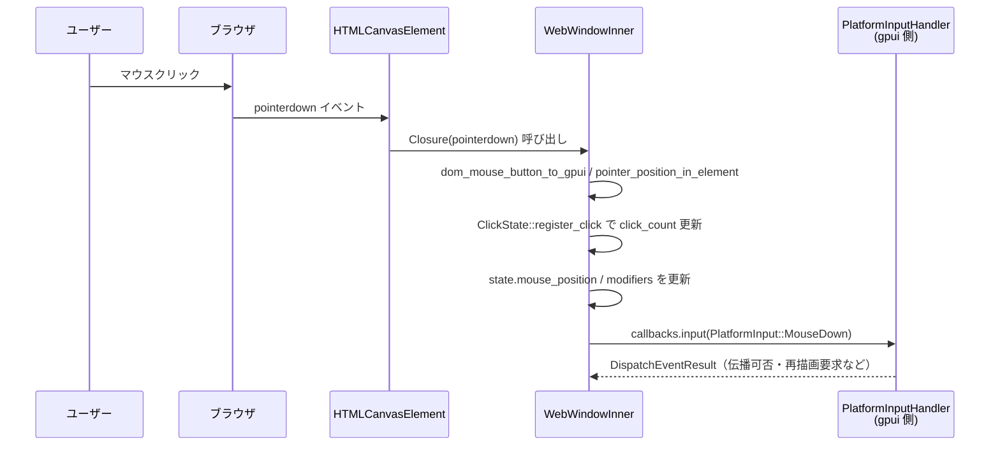

# gpui_web/ ディレクトリ解説

## 0. ざっくり一言

ブラウザ上（wasm32 + WebGPU）で gpui アプリケーションを動かすための **Web プラットフォーム実装一式**と、その動作例（`hello_web`）を含むディレクトリです。

---

## 1. このモジュールの役割

### 1.1 概要

- このディレクトリは、gpui ライブラリのための **Web 専用バックエンド**を提供します。
- ウィンドウ・入力・描画・HTTP・スレッド実行などの機能を、ブラウザ API（`web-sys` / `wasm-bindgen` / WebGPU / Fetch）にマッピングします。
- また `examples/hello_web` では、Web プラットフォーム上で動作する簡単な GPU UI アプリ（素数カウンタ）のサンプル実装を示しています。

### 1.2 アーキテクチャ内での位置づけ

主なコンポーネント同士の関係を示します。

```mermaid
graph LR
    subgraph Browser["ブラウザ (window / DOM / WebGPU / Fetch)"]
    end

    subgraph Crate["gpui_web クレート"]
        WP[WebPlatform<br>(platform.rs)]
        WW[WebWindow<br>(window.rs)]
        WDpy[WebDisplay<br>(display.rs)]
        WD[WebDispatcher<br>(dispatcher.rs)]
        EV[イベント変換<br>(events.rs)]
        HC[FetchHttpClient<br>(http_client.rs)]
        KB[WebKeyboardLayout<br>(keyboard.rs)]
        LG[init_logging<br>(logging.rs)]
    end

    GPUI[gpui ライブラリ / App]:::ext
    EX["examples/hello_web::main"]:::ext

    GPUI --> WP
    EX --> GPUI

    WP --> WW
    WP --> WDpy
    WP --> WD
    WP --> HC
    WP --> KB
    WP --> LG

    WW --> EV
    WW --> Browser
    WD --> Browser
    HC --> Browser
    WDpy --> Browser

    classDef ext fill:#eee,stroke:#999;
```

- `src/gpui_web.rs` はこれらの型を `pub use` し、`gpui_web` クレートの公開 API を構成します。
- 実際のアプリコード（例: `hello_web::main`）は通常、`gpui_platform` 経由で `WebPlatform` などを利用します（`gpui_platform` の実装自体はこのチャンクには含まれていません）。

### 1.3 設計上のポイント

- **プラットフォーム抽象の実装**
  - `WebPlatform` が `gpui::Platform` を実装し、OS 依存の操作をブラウザ API に対応付けています。
  - `WebWindow` / `WebDisplay` / `WebDispatcher` がそれぞれウィンドウ・ディスプレイ・スレッド／タスクスケジューラの役割を持ちます。

- **WASM 前提のスレッドモデル**
  - ベースは「wasm はシングルスレッド」という前提ですが、`SharedArrayBuffer` + `Atomics` + `wasm_thread` が利用可能な場合は WebWorker を使った **マルチスレッド実行**をサポートします。
  - 利用可否は実行時に `shared_memory_supported()` で判定し、使えない環境では自動的にシングルスレッド動作へフォールバックします。

- **ブラウザ API との安全な橋渡し**
  - DOM イベントリスナーは `Closure` をベクタに保持することで GC による解放を防ぎます（`WebEventListeners`）。
  - `web_sys::Window` や `HtmlCanvasElement` は「メインスレッドからのみアクセスする」という前提で `Send` / `Sync` を `unsafe impl` しています。

- **フォールバックと未対応機能の明示**
  - ファイルダイアログやクリップボード、資格情報の保存など、ブラウザで実現しづらい機能は `Err` を返したり no-op にしています。
  - Color scheme や DPI などブラウザが提供する情報を使い、可能な範囲でネイティブと近い挙動を再現しています。

---

## 2. 主要な機能一覧

- Web プラットフォーム実装:
  - `WebPlatform`: gpui の `Platform` をブラウザ環境向けに実装。
  - `BackgroundExecutor` / `ForegroundExecutor` を `WebDispatcher` に接続。

- ウィンドウ・ディスプレイ関連:
  - `WebWindow`: HTML `<canvas>` と `WgpuRenderer` を結びつける `PlatformWindow` 実装。
  - `WebDisplay`: ブラウザの `Window` / `Screen` 情報から論理ディスプレイを構築。

- イベント処理:
  - マウス／ポインタ／ホイール／ドラッグ&ドロップ／キーボード／IME／フォーカス／ホバー／可視状態／テーマ変更の DOM イベントを `PlatformInput` 系イベントに変換。

- タスクスケジューリング:
  - `WebDispatcher`: gpui の `PlatformDispatcher` 実装。
    - マルチスレッド時: WebWorker によるバックグラウンド実行 + Atomics によるメインスレッド通知。
    - シングルスレッド時: すべてメインスレッドで処理。

- HTTP クライアント:
  - `FetchHttpClient`: Fetch API を使った `http_client::HttpClient` 実装。
    - リクエストボディ・レスポンスボディをバイト列に変換。

- 入力・キーボード:
  - `WebKeyboardLayout`: 固定 `"US"` レイアウトを報告。
  - `DummyKeyboardMapper`: キーボードマッピングはダミー実装（gpui 側型）。

- ログ出力:
  - `init_logging`: Rust の `log` をブラウザの `console.*` にルーティング。

- サンプルアプリ:
  - `examples/hello_web`: 素数カウントをバックグラウンドスレッドで実行し、UI を更新するデモ。

---

## 4. 関数・構造体の解説

### 4.1 型一覧（主要な構造体・列挙体）

| 名前 | 種別 | 所在ファイル | 役割 / 用途 |
|------|------|--------------|-------------|
| `WebPlatform` | 構造体 | `src/platform.rs` | gpui の `Platform` をブラウザ上で実装する中核のプラットフォームオブジェクトです。テキストシステム・エグゼキュータ・ウィンドウ生成などを管理します。 |
| `WebWindow` | 構造体 | `src/window.rs` | `PlatformWindow` 実装。`<canvas>` と `WgpuRenderer` を作成し、描画・入力・サイズ変更などの操作を担当します。 |
| `WebWindowInner` | 構造体 | `src/window.rs` | DOM 要素・状態・コールバック・イベントリスナーを実際に保持する内部構造体です。`Rc` 経由で共有されます。 |
| `WebWindowMutableState` | 構造体 | `src/window.rs` | ウィンドウの現在状態（bounds・スケール・タイトル・入力状態・レンダラー等）をまとめた内部状態です。 |
| `WebWindowCallbacks` | 構造体 | `src/window.rs` | gpui から登録される各種コールバック（描画要求、入力処理、リサイズ通知など）を保持します。 |
| `WebDisplay` | 構造体 | `src/display.rs` | `PlatformDisplay` 実装。ブラウザの `Window` / `Screen` から仮想ディスプレイのサイズやデフォルト位置を計算します。 |
| `WebDispatcher` | 構造体 | `src/dispatcher.rs` | `PlatformDispatcher` 実装。gpui の `RunnableVariant` を背景スレッドまたはメインスレッドへ配送します。 |
| `MainThreadMailbox` | 構造体 | `src/dispatcher.rs` | 非メインスレッドからメインスレッドへタスクを送るための優先度付きキューと、Atomics ベースの通知機構をまとめた内部構造です。 |
| `MainThreadItem` | 列挙体 | `src/dispatcher.rs` | メインスレッドで実行されるタスクの種別（即時実行・遅延実行・リアルタイム関数）を表す内部 enum です。 |
| `FetchHttpClient` | 構造体 | `src/http_client.rs` | Fetch API を用いる HTTP クライアント。`http_client::HttpClient` を実装し、`Request`/`Response` をブラウザ API と相互変換します。 |
| `AssertSend<F>` | 構造体 | `src/http_client.rs` | `!Send` な future を `Send` として扱うための内部ラッパー。WASM のシングルスレッド前提に依存しています。 |
| `WebKeyboardLayout` | 構造体 | `src/keyboard.rs` | `PlatformKeyboardLayout` 実装。常に `"us"` / `"US"` を返します。 |
| `WebEventListeners` | 構造体 | `src/events.rs` | 登録した DOM イベント用 `Closure` を保持し、ライフタイム中 GC で解放されないようにするためのコンテナです。 |
| `ClickState` | 構造体 | `src/events.rs` | 直近のクリック位置／時刻／クリック回数を記録し、シングル／ダブルクリックなどの判定に使います。 |
| `WebPlatformCallbacks` | 構造体 | `src/platform.rs` | アプリケーションレベルのコールバック（open_urls, quit など）を保持する内部構造です。 |
| `ConsoleLogger` | 構造体 | `src/logging.rs` | `log::Log` の実装。ログをブラウザコンソールに出力します。 |
| `Preset` | enum | `examples/hello_web/main.rs` | 素数探索の上限値プリセット（1000 万 / 5000 万 / 1 億）を表します。 |
| `HelloWeb` | 構造体 | `examples/hello_web/main.rs` | サンプルアプリの状態を保持し、`Render` を実装するコンポーネントです。 |

### 4.2 重要な関数の詳細（7件）

#### `WebPlatform::new(allow_multi_threading: bool) -> Self`

**概要**

- ブラウザ環境に対応した `WebPlatform` を初期化します。
- WebDispatcher・エグゼキュータ・テキストシステム・ディスプレイなど、プラットフォームの基盤となるコンポーネントをまとめて構築します。

**引数**

| 引数名 | 型 | 説明 |
|--------|----|------|
| `allow_multi_threading` | `bool` | `true` の場合、環境が対応していれば WebWorker を用いたマルチスレッドバックグラウンド実行を有効化します。 |

**戻り値**

- `WebPlatform` インスタンス。内部で必要な構造体やコンテキストをすべて確保した状態になっています。

**内部処理の流れ**

1. `web_sys::window()` でブラウザの `Window` を取得（失敗時は `expect` で panic）。
2. `WebDispatcher::new(browser_window.clone(), allow_multi_threading)` を使ってディスパッチャを生成。
3. `BackgroundExecutor` / `ForegroundExecutor` をディスパッチャから組み立て。
4. `gpui_wgpu::CosmicTextSystem::new_without_system_fonts("IBM Plex Sans")` でテキストシステムを作成。
5. `BUNDLED_FONTS` の埋め込みフォント（IBM Plex Sans, Lilex）を `text_system.add_fonts` で登録し、失敗時は `log::error!` を出力。
6. `WebDisplay::new(browser_window.clone())` でディスプレイオブジェクトを作成。
7. 以上をフィールドに詰めて `WebPlatform` を返却。

**Edge cases（エッジケース）**

- `Window` が取得できない状況（ブラウザ外など）では `expect` で panic します。
- フォント追加に失敗しても、ログ出力のみで処理続行し、テキストシステムは利用可能な状態のままです。

**使用上の注意点**

- wasm 以外のターゲットでは `#![cfg(target_family = "wasm")]` によりコンパイルされない前提です。
- 実際にウィンドウを開く前に `run()` によって WebGPU コンテキストを初期化する必要があります（`open_window` 内でチェックしています）。

---

#### `WebPlatform::run(&self, on_finish_launching: Box<dyn 'static + FnOnce()>)`

**概要**

- WebGPU コンテキスト (`WgpuContext`) を非同期に初期化し、その結果にかかわらず起動完了コールバックを呼び出します。
- gpui のメインループは `Platform::run` の外側（gpui ランタイム側）で管理される前提です。

**引数**

| 引数名 | 型 | 説明 |
|--------|----|------|
| `on_finish_launching` | `Box<dyn FnOnce()>` | 初期化が完了したら一度だけ呼ばれるコールバック。ウィンドウを開くなどの処理を行います。 |

**戻り値**

- なし（`()`）。非同期タスクは `wasm_bindgen_futures::spawn_local` 内で進行します。

**内部処理の流れ**

1. `self.wgpu_context.clone()` をキャプチャし、`spawn_local` で非同期ブロックを起動。
2. `WgpuContext::new_web().await` を呼び出し、WebGPU の初期化を試みる。
3. 成功時:
   - ログに成功メッセージを出力。
   - `wgpu_context.borrow_mut()` に `Some(context)` を保存。
   - `on_finish_launching()` を呼び出し。
4. 失敗時:
   - エラーログを出力。
   - `wgpu_context` は `None` のまま。
   - それでも `on_finish_launching()` を呼び出す（アプリ側でエラー画面を出すなどの判断が可能）。

**Edge cases**

- WebGPU が無効なブラウザでは `Err` となり、ウィンドウ生成時に `open_window` がエラーを返します。
- `on_finish_launching` 内で `open_window` を呼ぶ場合、必ず `run()` の完了後に呼ばれるため、`wgpu_context` が `Some` になっていることが前提です（失敗時は `Err`）。

**使用上の注意点**

- `run` は戻り値を持たないため、WebGPU 初期化失敗を直接は返しません。アプリ側は `open_window` の戻り値などで検出します。
- `spawn_local` を使用しているため、`run` を呼ぶスレッドは wasm のメインスレッドである必要があります。

---

#### `WebPlatform::open_window(&self, handle: AnyWindowHandle, params: WindowParams) -> anyhow::Result<Box<dyn PlatformWindow>>`

**概要**

- `WebWindow` を生成し、gpui の `PlatformWindow` として返します。
- すでに初期化済みの WebGPU コンテキスト (`WgpuContext`) を利用します。

**引数**

| 引数名 | 型 | 説明 |
|--------|----|------|
| `handle` | `AnyWindowHandle` | gpui 側が管理するウィンドウ識別ハンドルです。 |
| `params` | `WindowParams` | ウィンドウの初期サイズや装飾などを含むパラメータです。 |

**戻り値**

- 成功時: `Ok(Box<dyn PlatformWindow>)` として `WebWindow` を返します。
- 失敗時: `Err(anyhow::Error)`。

**内部処理の流れ**

1. `self.wgpu_context.borrow()` を取り出し、`Option<&WgpuContext>` を参照。
2. `None` の場合は `anyhow!("WebGPU context not initialized. Was Platform::run() called?")` で `Err` を返す。
3. `Some(context)` の場合は `WebWindow::new(handle, params, context, self.browser_window.clone())?` を呼び出し。
4. 生成したウィンドウを `self.active_window` に保存。
5. `Ok(Box::new(window))` として返却。

**Edge cases**

- `Platform::run()` がまだ呼ばれていない場合、常にエラーになります。
- `WebWindow::new` の内部で DOM 操作に失敗すると、そのエラーがそのまま伝播します（`document` や `body` が取得できない、`canvas` 作成失敗など）。

**使用上の注意点**

- アプリ側は `open_window` の戻り値を必ず `?` 等でチェックし、失敗時の扱い（エラー表示など）を明示的に決める必要があります。
- 一度に複数ウィンドウを開く機能は、このコードからは読み取れません（`active_window` は単一のハンドルのみ保持しています）。

---

#### `WebWindow::new(handle, _params, context, browser_window) -> anyhow::Result<Self>`

**概要**

- ブラウザの `document` / `body` に `<canvas>` と隠し `<input>` を追加し、`WgpuRenderer` とイベントリスナー、`ResizeObserver`、`requestAnimationFrame` ループをセットアップして `WebWindow` を構築します。

**引数**

| 引数名 | 型 | 説明 |
|--------|----|------|
| `handle` | `AnyWindowHandle` | gpui 側のウィンドウハンドル。後続のコールバック等で利用されます。 |
| `_params` | `WindowParams` | 現状は未使用（将来的な拡張のために受け取っていると解釈できます）。 |
| `context` | `&WgpuContext` | 事前に初期化された WebGPU コンテキストです。 |
| `browser_window` | `web_sys::Window` | DOM 操作・DPR 取得・イベント登録などに使うブラウザの `window` オブジェクトです。 |

**戻り値**

- 成功時: `Ok(WebWindow)`。
- 失敗時: `Err(anyhow::Error)`（DOM 要素の作成・追加や WgpuRenderer 初期化失敗など）。

**内部処理の流れ（概要）**

1. `document` / `body` を取得し、エラー時は `anyhow!` で失敗。
2. `<canvas>` 要素を作成し、CSS で `width: 100%; height: 100%; display: block; outline: none; touch-action: none` を設定し、`tabIndex = -1` をセット。
3. `<canvas>` を `body` に `append_child`。
4. 隠し `<input type="text">` を作成し、`position: fixed; width: 1px; height: 1px; opacity: 0` として `body` に追加し、`focus()` を呼び出し。
5. 初期デバイスサイズを 0 として `WgpuSurfaceConfig` を作成し、`WgpuRenderer::new_from_canvas` でレンダラーを生成。
6. `WebDisplay::new` からディスプレイオブジェクトを作成。
7. `WebWindowMutableState` を初期化し、`WebWindowInner` にまとめる。`is_mac_platform` で Mac 判定を行いフラグとして保持。
8. `create_raf_closure` で `requestAnimationFrame` 用クロージャを作成し、`schedule_raf` で最初のフレームを登録。
9. `ResizeObserver` を生成し、`create_resize_observer_closure` により canvas サイズ・DPR 変化を監視するよう設定。
10. `inner.register_event_listeners()` でマウス・キーボード・フォーカス等の DOM イベントリスナーを登録。
11. 上記をフィールドに持つ `WebWindow` を返却。

**Edge cases**

- `body` が存在しない（特殊なドキュメント）場合や canvas・input の作成が失敗すると、その時点でエラーが返ります。
- `ResizeObserver` が生成できなかった場合は `None` のままですが、その場合の動作はこのコードからは明確ではありません（`observe_canvas` が呼ばれません）。

**使用上の注意点**

- `WebWindow` 自体は `WebPlatform::open_window` 経由で生成される想定であり、アプリケーション側で直接 `new` を呼ぶケースは通常ありません。
- DOM への canvas / input 追加はグローバルに影響するため、同一ページに別の UI を描画する場合は注意が必要です。

---

#### `WebDispatcher::new(browser_window: web_sys::Window, allow_threads: bool) -> Self`

**概要**

- gpui のタスクディスパッチャをブラウザ環境向けに構築します。
- `SharedArrayBuffer` + `Atomics` が利用可能なら WebWorker によるバックグラウンド実行を有効化し、そうでなければメインスレッドのみで実行します。

**引数**

| 引数名 | 型 | 説明 |
|--------|----|------|
| `browser_window` | `web_sys::Window` | ハードウェアスレッド数やタイマー、マイクロタスクキューなどに利用します。 |
| `allow_threads` | `bool` | true の場合マルチスレッドを試みますが、最終的な有効／無効は `shared_memory_supported()` によって決まります。 |

**戻り値**

- `WebDispatcher` インスタンス。必要に応じてバックグラウンドスレッド（WebWorker）が起動済みです。

**内部処理の流れ**

1. `PriorityQueueReceiver::new()` でバックグラウンド用のキューを作成（`multithreaded` feature の有無で受信側の扱いが変わります）。
2. `MainThreadMailbox::new()` でメインスレッド向けの優先度付きキューを作成。
3. `supports_threads` を:
   - `multithreaded` feature 有効時: `allow_threads && shared_memory_supported()` で判定。
   - 無効時: 常に `false`。
4. `supports_threads == true` の場合:
   - `main_thread_mailbox.run_waker_loop(browser_window.clone())` を呼び、Atomics.waitAsync ベースの wake ループを起動。
   - `navigator.hardware_concurrency()` に基づき、`MIN_BACKGROUND_THREADS` 以上の worker 数を決定。
   - 各 worker で `receiver.pop()` をループし、受信した `RunnableVariant` を実行。
5. `supports_threads == false` の場合:
   - ログにフォールバック警告を出すのみ。

**Edge cases**

- `SharedArrayBuffer` や `Atomics` に対応していないブラウザでは自動的にシングルスレッド動作になります（ログに WARN を出力）。
- バックグラウンドキューがクローズされた場合、worker はループを抜けて終了し、ログに INFO を出力します。

**使用上の注意点**

- マルチスレッドを有効にするには、ブラウザ側で COOP/COEP ヘッダを設定して cross-origin isolation を満たす必要があります（`examples/hello_web/trunk.toml` の `headers` フィールドを参照）。
- `WebDispatcher` は `unsafe impl Send + Sync` ですが、`web_sys::Window` はメインスレッドでのみ使う前提です。

---

#### `WebDispatcher::dispatch(&self, runnable: RunnableVariant, priority: Priority)`

**概要**

- 指定されたタスクをバックグラウンドスレッド、またはシングルスレッド環境ではメインスレッドに配送します。

**引数**

| 引数名 | 型 | 説明 |
|--------|----|------|
| `runnable` | `RunnableVariant` | 実行すべき gpui タスク。 |
| `priority` | `Priority` | 優先度。キュー内での順序に影響します。 |

**戻り値**

- なし。内部でログ出力を行う場合があります。

**内部処理の流れ**

1. `supports_threads == false` の場合:
   - `dispatch_on_main_thread(runnable, priority)` を呼び、即座にメインスレッド側へスケジューリングして終了。
2. `supports_threads == true` の場合:
   - `self.on_main_thread()` が `true` なら `background_sender.spin_send(priority, runnable)`、そうでなければ `background_sender.send(...)` を呼び出す。
3. 送信に失敗した場合は `log::error!` でエラー内容を記録。

**Edge cases**

- バックグラウンドキューが閉じられた場合、「failed to send to background queue」というエラーがログに出ます。
- シングルスレッド環境では `Priority` による厳密な優先制御は `schedule_runnable` 内の `set_timeout(0)` に依存し、実際にはブラウザのイベントループに任されます。

**使用上の注意点**

- `dispatch` は「どこで実行されるか」を抽象化しているため、タスク内で DOM API を直接呼ぶことは避け、必要に応じて `dispatch_on_main_thread` や `spawn_realtime` を利用するのが安全です。

---

#### `FetchHttpClient::send(&self, req: http::Request<AsyncBody>) -> BoxFuture<'static, anyhow::Result<http::Response<AsyncBody>>>`

**概要**

- `http_client::HttpClient` の実装として、渡された HTTP リクエストをブラウザの Fetch API に変換し、レスポンスを `http::Response<AsyncBody>` に変換して返します。

**引数**

| 引数名 | 型 | 説明 |
|--------|----|------|
| `req` | `http::Request<AsyncBody>` | メソッド・URI・ヘッダ・非同期ボディを含む HTTP リクエストです。 |

**戻り値**

- `BoxFuture<'static, anyhow::Result<http::Response<AsyncBody>>>`  
  成功時にはステータス・ヘッダ・ボディを含む `Response` を返し、失敗時にはエラー内容を `anyhow::Error` でラップします。

**内部処理の流れ（簡略）**

1. `req.into_parts()` でヘッダ等とボディを分離。
2. `read_body_to_bytes(body).await` で `AsyncBody` をすべてバッファリングして `Option<Vec<u8>>` を得る。
3. `web_sys::RequestInit` を構築し、HTTP メソッドや `RedirectPolicy` に応じた `redirect` モードを設定。
4. ボディが存在する場合は `js_sys::Uint8Array` に変換し、`RequestInit::set_body` に渡す。
5. `web_sys::Request::new_with_str_and_init(url, &init)` で Fetch 用 Request を作成。失敗時は `anyhow!`。
6. `parts.headers` を JavaScript の `Headers` にコピー（非 ASCII の値はエラー）。
7. `global_fetch(&request)` を呼び出して `Promise` を取得し、`JsFuture::from(promise).await` で await。
8. 得られた `JsValue` を `web_sys::Response` に `dyn_into`。失敗時はエラー。
9. `status()` と `headers()` を `http::Response::builder()` にコピー。
   - `Headers` は JS イテラブルとして `[name, value]` ペアを返す前提で `Array::from` しています。
   - 不正なエントリは `log::warn!` でスキップ。
10. `response.array_buffer()` でレスポンスボディ全体を `ArrayBuffer` として取得し、`Uint8Array::new(&array_buffer).to_vec()` で `Vec<u8>` に変換。
11. `builder.body(AsyncBody::from(response_bytes))` で `Response<AsyncBody>` を構築し、返却。

**Edge cases**

- リクエストヘッダ値に非 ASCII 文字が含まれるとエラーになります（`HeaderValue::to_str` 失敗）。
- Fetch そのものが例外を投げた場合や、`Promise` の `await` がリジェクトされる場合は、それぞれ詳細を含んだ `anyhow::Error` を返します。
- レスポンスヘッダの JS 表現が期待どおりの `[name, value]` 形式でない場合、そのエントリはログ警告のうえ無視されます。
- レスポンスボディは **常に全量をメモリに読み込む** 実装です。大きなレスポンスではメモリ消費が増えます。

**使用上の注意点**

- `multithreaded` feature が有効な場合、`new` / `with_user_agent` は `unsafe` です。ドキュメントコメントのとおり、**単一スレッド環境でのみ使用する**ことが前提です（`AssertSend` を用いているため）。
- ストリーミング読み込みは行わないため、巨大なレスポンスには適しません。

**使用例（簡略）**

```rust
use http_client::{HttpClient, AsyncBody};
use http_client::http::{Request, Method};

async fn fetch_example(client: &FetchHttpClient) -> anyhow::Result<()> {
    // GET リクエストを組み立てる
    let req = Request::builder()
        .method(Method::GET)
        .uri("https://example.com")
        .body(AsyncBody::empty())
        ?;

    // Fetch API 経由で送信
    let res = client.send(req).await?;

    println!("Status = {}", res.status());
    Ok(())
}
```

---

#### `WebWindowInner::register_event_listeners(self: &Rc<Self>) -> WebEventListeners`

**概要**

- `<canvas>` および隠し `<input>` に対して必要な全ての DOM イベントリスナーを登録し、それらの `Closure` を `WebEventListeners` にまとめて返します。

**引数**

| 引数名 | 型 | 説明 |
|--------|----|------|
| `self` | `&Rc<WebWindowInner>` | 共有所有の `WebWindowInner` 参照です。 |

**戻り値**

- `WebEventListeners`（`Vec<Closure<dyn FnMut(JsValue)>>` を内部に保持）。

**内部処理の流れ（登録される主なイベント）**

1. ポインタ関連（canvas）
   - `pointerdown` → `register_pointer_down`
   - `pointerup` → `register_pointer_up`
   - `pointermove` → `register_pointer_move`
   - `pointerleave` → `register_pointer_leave`
   - `pointerenter` → `register_pointer_enter`
   - `pointerleave`（hover 用） → `register_pointer_leave_hover`
2. ホイール・コンテキストメニュー（canvas）
   - `wheel`（非パッシブ） → `register_wheel`
   - `contextmenu` → `register_context_menu`
3. ドラッグ&ドロップ（canvas）
   - `dragover` / `drop` / `dragleave`
4. キーボード・IME・フォーカス（input）
   - `keydown` / `keyup`
   - `compositionstart` / `compositionupdate` / `compositionend`
   - `focus` / `blur`
5. ドキュメント/ウィンドウ関連
   - `visibilitychange`（document） → `register_visibility_change`（`Option`）
   - `(prefers-color-scheme: dark)` の `change`（media query） → `register_appearance_change`（`Option`）

**Edge cases**

- `visibilitychange` やテーマ変更用 media query が取得できない場合、それらのリスナーは登録されず、対応する `Option` は `None` になります。
- リスナー登録時のエラーは `.ok()` で無視されています（失敗しても panic はしません）。

**使用上の注意点**

- 戻り値の `WebEventListeners` は `WebWindow` のフィールド `_event_listeners` として保持され、ドロップされないようにしています。これを保持しないと GC により `Closure` が解放された後にイベントリスナーが動かなくなる可能性があります。

---

### 4.3 その他の関数（代表的なもの）

すべてを網羅すると非常に多くなるため、機能ごとに代表的なものを列挙します。

| 関数名 | 所在 | 役割（1 行） |
|--------|------|--------------|
| `dispatch_on_main_thread` / `dispatch_after` / `spawn_realtime` | `dispatcher.rs` | タスクをメインスレッドに即時／遅延／マイクロタスクとしてスケジュールします。 |
| `execute_on_main_thread` / `schedule_runnable` | `dispatcher.rs` | `MainThreadItem` の実行や優先度に応じたタイミング（`queue_microtask` / `set_timeout(0)`）決定を行います。 |
| `screen_size` / `viewport_size` | `display.rs` | ブラウザの `Screen` / `innerWidth` / `innerHeight` から画面サイズを取得します。 |
| `is_mac_platform` | `events.rs` | `navigator.platform` / `userAgent` をもとに macOS かどうかを推定し、修飾キーの扱いなどに利用します。 |
| `dom_key_to_gpui_key` / `dom_mouse_button_to_gpui` | `events.rs` | DOM のキーボード／マウス表現を gpui 内部のキー文字列・ボタン列挙体に変換します。 |
| `compute_key_char` | `events.rs` | 修飾キー状態と DOM `KeyboardEvent` から、挿入すべき文字（`key_char`）を決定します。 |
| `check_device_pixel_support` | `window.rs` | `ResizeObserverEntry.devicePixelContentBoxSize` の有無を調べ、DPR 対応のある環境かどうかを判定します。 |
| `create_resize_observer_closure` | `window.rs` | canvas サイズや DPR 変化を検知し、`bounds` や `scale_factor` を更新して `resize` コールバックを呼びます。 |
| `create_raf_closure` / `schedule_raf` | `window.rs` | `requestAnimationFrame` ループを設定し、毎フレーム `request_frame` コールバックを呼び出します。 |
| `current_appearance` | `window.rs` | `prefers-color-scheme: dark` に基づき `WindowAppearance::Dark/Light` を返します。 |
| `init_logging` | `logging.rs` | `log` クレートの logger を `ConsoleLogger` に設定し、`LevelFilter::Info` を有効にします。 |
| `is_prime` / `count_primes_in_range` | `examples/hello_web/main.rs` | 意図的に CPU を負荷する素朴な素数判定・カウントロジックです。 |
| `HelloWeb::start_search` | `examples/hello_web/main.rs` | 素数カウントのチャンク分割・背景タスク起動・結果集計・履歴追加までを行います。 |

---

## 5. データフロー

ここでは、**マウスクリックイベントが gpui に届くまで**の典型的な流れを示します。

1. ユーザーが `<canvas>` 上をクリックする。
2. ブラウザが `pointerdown` イベントを発火し、`WebWindowInner::register_pointer_down` で登録された `Closure` が呼ばれる。
3. クリック位置・ボタン・修飾キー・クリック回数（シングル／ダブル等）を計算し、`PlatformInput::MouseDown(MouseDownEvent { ... })` を構築。
4. `WebWindowInner::dispatch_input` が `callbacks.input` コールバックに `PlatformInput` を渡す。
5. gpui 側の `PlatformInputHandler` がイベントを処理し、UI の更新や再描画要求を行う。

### シーケンス図



- `callbacks.input` は `PlatformWindow::on_input` 経由で gpui ランタイムから登録されます。
- 同様の流れで `pointerup` / `pointermove` / `wheel` / キーボードイベントなども処理されます。

---

## 6. 使い方（How to Use）

### 6.1 基本的な使用方法（`hello_web` の例）

`examples/hello_web/main.rs` では、gpui + gpui_web をブラウザ上で動かす最小構成が示されています。

```rust
use gpui::prelude::*;
use gpui::{
    App, Bounds, Window, WindowBounds, WindowOptions, div, px, size,
};
use gpui_platform; // 別クレート（このチャンクには実装は含まれていません）

fn main() {
    gpui_platform::web_init();            // Web 向けの初期化（WebPlatform の登録などを行うと推測されます）

    gpui_platform::application().run(|cx: &mut App| {
        // ウィンドウの中心に 640x560 px のウィンドウを配置する Bounds を計算
        let bounds = Bounds::centered(None, size(px(640.), px(560.)), cx);

        // ウィンドウを開き、ルートコンポーネントとして HelloWeb を紐づける
        cx.open_window(
            WindowOptions {
                window_bounds: Some(WindowBounds::Windowed(bounds)),
                ..Default::default()
            },
            |_, cx| cx.new(HelloWeb::new),
        )
        .expect("failed to open window");

        // アプリケーションをアクティブにする
        cx.activate(true);
    });
}
```

この例では:

- `HelloWeb` 構造体がアプリケーション状態を保持し、`impl Render for HelloWeb` によって UI が定義されています。
- `gpui_platform::web_init()` / `application().run(...)` の内部で `WebPlatform::run` や `open_window` が呼ばれ、これまで解説したプラットフォーム実装が利用されます（詳細はこのチャンクには含まれていません）。

### 6.2 よくある使用パターン

#### 6.2.1 重い計算をバックグラウンドで実行する（`HelloWeb::start_search`）

`HelloWeb` では素数カウントを複数チャンクに分割し、バックグラウンドスレッドで計算しています。

ポイントだけ抜き出すと:

```rust
fn start_search(&mut self, cx: &mut Context<Self>) {
    // … 省略: limit / chunk_size などの計算 …

    let start_time = web_time::Instant::now();

    for i in 0..NUM_CHUNKS {
        let range_start = i * chunk_size;
        let range_end = if i == NUM_CHUNKS - 1 { limit } else { range_start + chunk_size };

        // UI スレッド側の Task を spawn
        let task = cx.spawn(async move |this, cx| {
            // 実際の重い処理は background_spawn で別スレッドへ
            let count = cx
                .background_spawn(async move { count_primes_in_range(range_start, range_end) })
                .await;

            // 結果を UI 状態に反映
            this.update(cx, |this, cx| {
                // … run.chunk_results への push、完了判定、履歴更新など …
                cx.notify();
            }).ok();
        });

        self._tasks.push(task);
    }
}
```

- `cx.spawn` は gpui の高レベルタスク API で、UI 状態へのアクセスを安全に行います。
- 内部で `WebDispatcher` が利用され、マルチスレッドが有効な環境では WebWorker 上で `count_primes_in_range` が実行されます。
- 計算完了後は `this.update` + `cx.notify()` により UI を再レンダリングします。

#### 6.2.2 Fetch ベースの HTTP クライアントを利用する

`FetchHttpClient` は通常、アプリケーション内や gpui の別コンポーネントから `HttpClient` として利用します。

```rust
use gpui_web::FetchHttpClient;
use http_client::{HttpClient, AsyncBody};
use http_client::http::{Request, Method};

async fn load_data() -> anyhow::Result<Vec<u8>> {
    let client = FetchHttpClient::new(); // 非 multithreaded ビルドでは安全なコンストラクタ

    let req = Request::builder()
        .method(Method::GET)
        .uri("https://example.com/data.bin")
        .body(AsyncBody::empty())?;

    let res = client.send(req).await?;
    let body = res.into_body().into_bytes().await?; // AsyncBody 側 API（ここでは仮のコード）
    Ok(body)
}
```

※ `AsyncBody` からのバイト取り出し API は `http_client` クレートに依存するため、このチャンクからは正確なコードは分かりません。上記は概念的な例です。

### 6.3 使用上の注意点（まとめ）

- **WASM / ブラウザ前提**
  - すべてのコードは `target_family = "wasm"` 向けに書かれています。ネイティブターゲットではコンパイルされません。
  - `web_sys::window()` に依存しているため、WebWorker やブラウザ外（例: headless WASM ランタイム）では動作しない可能性があります。

- **マルチスレッドと SharedArrayBuffer**
  - `multithreaded` feature + `allow_multi_threading = true` の場合でも、実際にスレッドが使われるかは `shared_memory_supported()` の判定次第です。
  - `examples/hello_web/trunk.toml` にあるように、COEP/COOP ヘッダを設定して cross-origin isolation を満たさないと SharedArrayBuffer が利用できず、シングルスレッドフォールバックになります。

- **未サポートのプラットフォーム機能**
  - ファイルダイアログ (`prompt_for_paths`, `prompt_for_new_path`) は常にエラーを返します。
  - クリップボード読み書き・資格情報ストレージ (`write_credentials` など) も未サポートで、`Err` または `Ok(None)` を返します。
  - `quit` / `restart` / `minimize` / `zoom` / システムメニュー関連 (`set_menus` など) はログ出力のみ、もしくは no-op です。

- **HTTP クライアント**
  - レスポンスボディは全量をメモリに読み込む実装であり、大容量レスポンスには注意が必要です。
  - `multithreaded` feature 有効時の `FetchHttpClient::new` / `with_user_agent` は `unsafe` であり、「単一スレッド環境のみで使用する」ことが前提です。

- **イベントリスナーとライフタイム**
  - `WebEventListeners` や各種 `Closure` フィールドは、イベントリスナーが GC によって解放されないように保持されています。独自に DOM リスナーを追加する場合も、同様に Rust 側で `Closure` を保持する必要があります。

---

## 7. 関連ファイル

| パス | 役割 / 関係 |
|------|------------|
| `gpui_web/Cargo.toml` | `gpui_web` クレートの設定。`target_family = "wasm"` 向け依存関係（`web-sys`, `wasm-bindgen`, `wasm_thread`, `gpui_wgpu` など）や `multithreaded` feature を定義します。 |
| `gpui_web/src/gpui_web.rs` | クレートのルートモジュール。`WebDispatcher` / `WebDisplay` / `FetchHttpClient` / `WebKeyboardLayout` / `init_logging` / `WebPlatform` / `WebWindow` を `pub use` して公開 API としています。 |
| `gpui_web/src/platform.rs` | `WebPlatform` の実装。`Platform` トレイトのメソッド（ウィンドウ生成、URL オープン、テキストシステム、エグゼキュータなど）をブラウザ環境に対応付けます。 |
| `gpui_web/src/window.rs` | `WebWindow` / `WebWindowInner` など。canvas / input の生成、`WgpuRenderer` 初期化、`ResizeObserver`／`requestAnimationFrame` の設定、`PlatformWindow` 実装を行います。 |
| `gpui_web/src/events.rs` | `WebWindowInner` に紐づく DOM イベントリスナーの登録と、gpui の `PlatformInput` 系イベントへの変換ロジックを担当します。 |
| `gpui_web/src/dispatcher.rs` | `WebDispatcher` / `MainThreadMailbox` / `MainThreadItem`。gpui のタスクを WebWorker やメインスレッドに配送する仕組みを提供します。 |
| `gpui_web/src/display.rs` | `WebDisplay` の実装。ブラウザの `Screen` / `innerWidth` / `innerHeight` からディスプレイサイズやデフォルトウィンドウサイズを計算します。 |
| `gpui_web/src/http_client.rs` | `FetchHttpClient` と関連ユーティリティ。Fetch API を `http_client::HttpClient` に適合させます。 |
| `gpui_web/src/keyboard.rs` | `WebKeyboardLayout`。単純な US レイアウト識別子を返すキーボードレイアウト実装です。 |
| `gpui_web/src/logging.rs` | `ConsoleLogger` と `init_logging`。Rust の `log` クレートをブラウザコンソールにブリッジします。 |
| `gpui_web/examples/hello_web/Cargo.toml` | 例示アプリ `hello_web` の Cargo 設定。`gpui` / `gpui_platform` / `web-time` への依存を定義します。 |
| `gpui_web/examples/hello_web/main.rs` | 素数カウンタ UI アプリのサンプル。Web プラットフォーム上でのウィンドウ生成・イベント処理・バックグラウンドタスクの使い方を示します。 |
| `gpui_web/examples/hello_web/rust-toolchain.toml` | 例示アプリ用のツールチェーン設定。`nightly` + `wasm32-unknown-unknown` ターゲット等を指定しています。 |
| `gpui_web/examples/hello_web/trunk.toml` | `trunk` を用いた開発用サーバ設定。WebGPU / SharedArrayBuffer に必要な COOP/COEP ヘッダを設定しています。 |

このディレクトリ全体で、gpui アプリケーションをブラウザ上で実行するための Web プラットフォームバックエンドと、その実際の利用例が一揃いで提供されている構成になっています。
