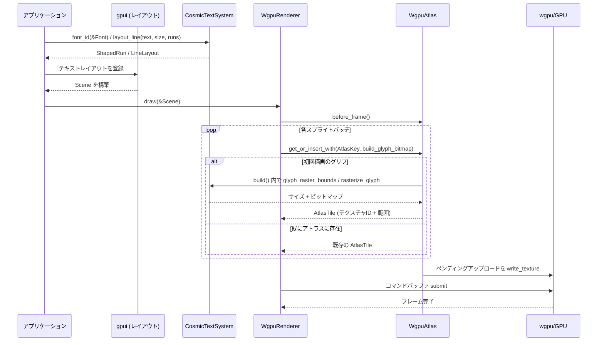

# 1. ざっくり一言

`gpui_wgpu` クレートは、Zed の GUI ライブラリ `gpui` のための **wgpu ベースのレンダラーとテキストシステムの実装**です。  
テキストのレイアウト・ラスタライズ（`cosmic-text` / `swash`）と、2D プリミティブやスプライトの描画（`wgpu`）を橋渡しします。

---

# 2. このモジュールの役割

## 2.1 概要

- このディレクトリは、`gpui` が GPU 上で描画を行うための **バックエンド実装**を提供します。
- 主な役割は次の 3 つです。
  - **テキストシステム**: `cosmic-text` + `swash` を用いたフォント管理 / テキストレイアウト / グリフラスタライズ
  - **アトラス管理**: グリフや画像を格納する GPU テクスチャアトラス (`WgpuAtlas`)
  - **レンダラー / GPU コンテキスト**: `wgpu` のアダプタ / デバイス / サーフェスの管理と、`Scene` の描画 (`WgpuRenderer`, `WgpuContext`)

## 2.2 アーキテクチャ内での位置づけ

主要コンポーネント間の依存関係を簡略図で示します。

```mermaid
graph LR
  subgraph gpui_wgpu クレート
    Text[CosmicTextSystem<br/>(PlatformTextSystem)]
    Atlas[WgpuAtlas<br/>(PlatformAtlas)]
    Ctx[WgpuContext]
    Renderer[WgpuRenderer]
  end

  gpui[gpui クレート] --> Text
  gpui --> Atlas
  gpui --> Renderer

  Renderer --> Atlas
  Renderer --> Ctx

  Ctx --> wgpu[wgpu クレート]
  Atlas --> wgpu
  Renderer --> wgpu

  Text --> cosmic[cosmic-text]
  Text --> swash[swash]
```

- `gpui` は抽象的な描画 API（`Scene`, `PlatformTextSystem`, `PlatformAtlas` など）を定義し、
- `gpui_wgpu` はそれらの実装として `CosmicTextSystem`, `WgpuAtlas`, `WgpuRenderer` を提供します。
- `WgpuContext` は、複数ウィンドウ間で共有される `wgpu::Instance` / `Adapter` / `Device` / `Queue` を管理します。

## 2.3 設計上のポイント

コードから読み取れる特徴を箇条書きでまとめます。

- **明確な責務分割**
  - テキストレイアウト・ラスタライズは `CosmicTextSystem` に集中
  - GPU リソースのアロケーション・描画は `WgpuRenderer`
  - テクスチャアトラス管理は `WgpuAtlas`
  - GPU デバイス選択・再生成は `WgpuContext`
- **スレッド安全性**
  - `CosmicTextSystem` は `RwLock` で内部状態を保護
  - `WgpuAtlas` は `Mutex` で状態を保護
  - `WgpuContext` の `device` / `queue` は `Arc` で共有
- **フォールバックとキャッシュ**
  - フォント: ファミリ名 + フィーチャで `FontId` をキャッシュし、`cosmic-text` のフォント ID との橋渡しを行う
  - テクスチャアトラス: `AtlasKey` ごとに `AtlasTile` をキャッシュし、同じ画像を再利用
- **GPU デバイス喪失への対応**
  - `WgpuContext` は `device_lost` フラグを持ち、デバイス喪失を検出
  - `WgpuRenderer::recover` と `WgpuAtlas::handle_device_lost` で、複数ウィンドウを横断して復旧可能
- **環境変数による調整**
  - `ZED_FONTS_GAMMA` / `ZED_FONTS_GRAYSCALE_ENHANCED_CONTRAST` / `ZED_FONTS_SUBPIXEL_ENHANCED_CONTRAST` によりテキスト描画品質を調整
  - `ZED_DEVICE_ID` による GPU アダプタの手動選択

---

# 3. 主要な機能一覧

- **テキストシステム (`CosmicTextSystem`)**
  - システムフォントおよび埋め込みフォントのロード
  - `gpui::Font` から最適なフォントフェイスを選択
  - テキスト行のレイアウト（`layout_line`）
  - `swash` を用いたグリフのラスタライズとビットマップ生成
- **GPU アトラス (`WgpuAtlas`)**
  - `AtlasKey` 単位のタイル（`AtlasTile`）管理
  - `etagere` を用いたテクスチャ内領域アロケーション
  - ペンディングアップロードのキューイングとフレーム毎のフラッシュ
  - デバイス喪失時のアトラスリセット
- **GPU コンテキスト (`WgpuContext`)**
  - アダプタ列挙と優先度付け（ユーザ指定 / コンポジタ GPU / デバイス種別 / バックエンド）
  - サーフェス互換性検査とデバイス生成
  - `DUAL_SOURCE_BLENDING` 対応状況の検出
  - デバイス喪失コールバックの設定
- **レンダラー (`WgpuRenderer`)**
  - `Scene` 内のバッチ（四角形 / 影 / パス / 下線 / スプライト / サーフェス）の描画
  - インスタンスバッファの動的拡張とストレージバッファアライメント調整
  - 経路塗りつぶし用の中間テクスチャ + MSAA によるパスレンダリング
  - サーフェスサイズの変更・透明／不透明切り替え
  - デバイス喪失検出と復旧 (`recover`)
- **再エクスポート**
  - `pub use wgpu;` により `wgpu` の型をそのまま利用可能
  - テクストシステム / アトラス / レンダラー / コンテキストをクレートルートから再エクスポート

---

# 4. 関数・構造体の解説

## 4.1 主な公開型一覧

| 名前 | 種別 | 定義ファイル | 役割 / 用途 |
|------|------|--------------|-------------|
| `CosmicTextSystem` | 構造体 | `cosmic_text_system.rs` | `gpui::PlatformTextSystem` の実装。フォント管理・テキストレイアウト・グリフラスタライズを担当します。 |
| `WgpuAtlas` | 構造体 | `wgpu_atlas.rs` | `gpui::PlatformAtlas` の実装。グリフや画像を格納するテクスチャアトラスを管理します。 |
| `WgpuTextureInfo` | 構造体 | `wgpu_atlas.rs` | 特定のアトラステクスチャの `wgpu::TextureView` を外部へ渡すためのラッパーです。 |
| `WgpuContext` | 構造体 | `wgpu_context.rs` | `wgpu::Instance` / `Adapter` / `Device` / `Queue` をまとめたコンテキストです。複数ウィンドウから共有されます。 |
| `CompositorGpuHint` | 構造体 | `wgpu_context.rs` | コンポジタが使用中の GPU (vendor/device ID) を示すヒント。アダプタ選択に用いられます。 |
| `GpuContext` | 型エイリアス | `wgpu_renderer.rs` | `Rc<RefCell<Option<WgpuContext>>>`。ウィンドウ間で共有する GPU コンテキストのハンドルです。 |
| `WgpuSurfaceConfig` | 構造体 | `wgpu_renderer.rs` | レンダラーが使用するサーフェスのサイズ・透明度・プレゼントモード設定です。 |
| `WgpuRenderer` | 構造体 | `wgpu_renderer.rs` | `gpui::Scene` を `wgpu` サーフェスへ描画するレンダラーです。 |
| `wgpu` | モジュール再エクスポート | `gpui_wgpu.rs` | `wgpu` クレート全体を再エクスポートします。 |

内部でのみ使用される型（`WgpuResources`, `WgpuPipelines`, `CosmicTextSystemState` など）は、ここでは概要のみに留めます。

---

## 4.2 重要な関数・メソッド詳細（最大 7 件）

### 4.2.1 `CosmicTextSystem::layout_line`

```rust
fn layout_line(&self, text: &str, font_size: Pixels, runs: &[FontRun]) -> LineLayout
```

**概要**

与えられたテキストとフォントラン（`FontRun`）に基づき、`cosmic-text` を用いて 1 行分のテキストレイアウトを行い、`gpui::LineLayout`（`ShapedRun` / `ShapedGlyph` を含む）へ変換します。

**引数**

| 引数名 | 型 | 説明 |
|--------|----|------|
| `text` | `&str` | レイアウト対象のテキスト全体です。 |
| `font_size` | `Pixels` | レイアウトに使用するフォントサイズです。 |
| `runs` | `&[FontRun]` | テキスト内の範囲ごとにフォント（`FontId`）が割り当てられたラン配列です。 |

**戻り値**

- `LineLayout`  
  - `width` / `ascent` / `descent` などのメトリクスと、フォントごとの `ShapedRun` / `ShapedGlyph` を含みます。

**内部処理の流れ**

1. `AttrsList` を作成し、`runs` の各 `FontRun` について:
   - 対応する `LoadedFont` と `cosmic-text` の `FaceInfo` を取得。
   - フォントファミリ名・スタイル・ウェイト・フィーチャ等を `Attrs` に設定し、テキスト範囲（オフセット）に対応づける。
   - フォント ID は `metadata` に格納します（後で `CosmicTextSystemState` 側で利用）。
2. `ShapeLine::new` と `layout_to_buffer` を用いて `cosmic-text` による shaping / layout を実行します。
3. 結果の `layout.glyphs` を走査し、各グリフについて:
   - `glyph.metadata`（事前に設定した `FontId`）と `glyph.font_id`（`cosmic-text` の内部フォント ID）が一致しない場合は、`font_id_for_cosmic_id` によりフォールバックフォントを `loaded_fonts` に追加・解決。
   - 絵文字フォントの場合のハック（`glyph.glyph_id == 3` ならスキップ）を適用。
   - `ShapedGlyph` に変換し、同じ `FontId` が連続する限り同一の `ShapedRun` にまとめる。
4. `LineLayout` を組み立てて返します。

**Examples（使用例）**

`gpui` から見た典型的な利用イメージです（周辺の型は簡略化した疑似コードです）。

```rust
use gpui_wgpu::CosmicTextSystem;
use gpui::{Font, FontFeatures, FontRun, FontId, LineLayout, Pixels};

// テキストシステムを初期化する（システムフォント + フォールバック名）
let text_system = CosmicTextSystem::new("Noto Sans");

// ここでは、すでに `FontId` が取得済みであると仮定する
let font_id = FontId(0);

// "Hello" 全体で同じフォントを使う FontRun を構築
let font_run = FontRun {
    font_id,
    len: "Hello".len(), // バイト数
};

// 1 行分のレイアウトを取得
let layout: LineLayout = text_system.layout_line("Hello", Pixels(14.0), &[font_run]);

// layout.runs 内の ShapedGlyph を使って、後段でスプライトを生成していきます。
```

※ `FontRun` の構築方法や `FontId` の取得は `gpui` 側のコードに依存するため、この例は雰囲気を示すものです。

**Errors / Panics**

- このメソッド自身は `Result` ではなく、レイアウトに失敗した場合は空の `LineLayout`（`runs` が空）を返します。
- ただし内部で使用している `font_id_for_cosmic_id` が `Result` を返しており、エラー発生時は `log::warn!` による警告ログ出力とともに、該当グリフをスキップします。

**Edge cases（エッジケース）**

- `text` が空文字列の場合:
  - `layout_lines.first()` が `None` となり、幅・アセント・ディセントがすべて 0、`runs` も空の `LineLayout` を返します。
- `font_runs` に対応する `FaceInfo` やファミリ名が見つからない場合:
  - 警告ログを出しつつ、そのランはスキップされます（`offs` のみ進める）。
- `cosmic-text` によるフォールバックフォント使用時:
  - `glyph.font_id` に対応する `LoadedFont` が存在しない場合、`font_id_for_cosmic_id` で動的にロードします。

**使用上の注意点**

- `font_runs` の `len` は UTF-8 バイト長を前提としており、`text` 全体のインデックスと対応している必要があります。
- `CosmicTextSystemState` 内部で `FontId` と `cosmic-text` のフォント ID をマッピングしているため、`FontId` を直接作るのではなく、必ず `CosmicTextSystem::font_id` を通して取得する前提になっています。

---

### 4.2.2 `CosmicTextSystemState::rasterize_glyph`

```rust
fn rasterize_glyph(
    &mut self,
    params: &RenderGlyphParams,
    glyph_bounds: Bounds<DevicePixels>,
) -> Result<(Size<DevicePixels>, Vec<u8>)>
```

**概要**

`swash` を用いて単一のグリフをラスタライズし、GPU アトラスへアップロード可能なピクセルバッファ（RGBA/BGRA またはアルファマスク）を生成します。

**引数**

| 引数名 | 型 | 説明 |
|--------|----|------|
| `params` | `&RenderGlyphParams` | フォント ID、グリフ ID、フォントサイズ、サブピクセルオフセット、スケールファクタなどグリフ描画に必要な情報です。 |
| `glyph_bounds` | `Bounds<DevicePixels>` | 既に計算済みのラスタ境界（ピクセル単位）です。 |

**戻り値**

- `Ok((bitmap_size, data))`
  - `bitmap_size`: 実際のビットマップサイズ（`glyph_bounds.size` と一致）
  - `data`: 1 チャンネル（R8）または 4 チャンネル（RGBA/BGRA）のピクセルデータ
- `Err`: ラスタライズやサイズチェックに失敗した場合のエラー

**内部処理の流れ**

1. `glyph_bounds` の幅または高さが 0 の場合は、`anyhow::bail!("glyph bounds are empty")` で即座にエラーを返します。
2. `render_glyph_image(params)` を呼び出し、`swash` による描画結果（`Image`）を取得します。
3. `glyph_bounds.size` を `bitmap_size` として保持し、`image.content` の種別に応じて処理を分岐します。
   - `Content::Color` または `Content::SubpixelMask` の場合:
     - `image.data` は RGBA として戻ってくるため、各ピクセルごとに R と B を入れ替えて BGRA に変換します。
   - `Content::Mask` の場合:
     - 1 チャンネルのマスクデータとしてそのまま使用します。
4. `(bitmap_size, image.data)` を返します。

**Examples（使用例）**

通常は `PlatformTextSystem::rasterize_glyph` 経由で使用され、直接呼び出されることはありません。`gpui` から見た高レベルな利用イメージです。

```rust
use gpui_wgpu::CosmicTextSystem;
use gpui::{RenderGlyphParams, FontId, GlyphId, Pixels};

// 事前に CosmicTextSystem と FontId, GlyphId を取得していると仮定
let text_system = CosmicTextSystem::new("Noto Sans");
let font_id = FontId(0);
let glyph_id = GlyphId(123);

// レンダリングパラメータを組み立てる（詳細フィールドは実際の定義に依存）
let params = RenderGlyphParams {
    font_id,
    glyph_id,
    font_size: Pixels(14.0),
    // subpixel_variant, scale_factor など他のフィールドも設定
    ..unimplemented!()
};

// ラスタ境界を計算
let bounds = text_system.glyph_raster_bounds(&params)?;

// 実際のビットマップを取得
let (size, bitmap) = text_system.rasterize_glyph(&params, bounds)?;
```

**Errors / Edge cases**

- `glyph_bounds` が空（幅または高さが 0）の場合は必ずエラーになります。
- `params.glyph_id.0` が `u16` に収まらない場合、`render_glyph_image` 内部で `try_into()` に失敗しエラーになります。
- `swash` 内部での描画に失敗した場合、`with_context` により詳細なエラーメッセージが付与されます。

**使用上の注意点**

- 戻り値の `Vec<u8>` は行ピッチ（`bytes_per_row`）を含まない「詰め詰め」のピクセル配列です。GPU へアップロードする際は幅・高さとバイト数から行ピッチを計算する必要があります（`WgpuAtlasState::flush_uploads` がその役割を担います）。

---

### 4.2.3 `WgpuAtlas::get_or_insert_with`

```rust
impl PlatformAtlas for WgpuAtlas {
    fn get_or_insert_with<'a>(
        &self,
        key: &AtlasKey,
        build: &mut dyn FnMut() -> Result<Option<(Size<DevicePixels>, Cow<'a, [u8]>)>>,
    ) -> Result<Option<AtlasTile>>;
}
```

**概要**

`AtlasKey` を元にアトラス内のタイル（`AtlasTile`）を取得します。  
存在しない場合は、`build` クロージャを呼び出して画像データを生成し、新規に領域を割り当ててアップロードします。

**引数**

| 引数名 | 型 | 説明 |
|--------|----|------|
| `key` | `&AtlasKey` | 画像・グリフを一意に識別するキーです（テクスチャ種別も含む）。 |
| `build` | `&mut dyn FnMut() -> Result<Option<(Size<DevicePixels>, Cow<[u8]>)>>` | `key` に対応する画像サイズとピクセルデータを生成するクロージャです。`None` を返すとアトラスに登録しません。 |

**戻り値**

- `Ok(Some(tile))`: アトラス内の既存または新規作成の `AtlasTile`
- `Ok(None)`: `build` が `Ok(None)` を返した場合（何も登録しない）
- `Err`: 領域の確保や `build` 内でエラーがあった場合

**内部処理の流れ**

1. `Mutex` をロックし、`tiles_by_key` に `key` が存在するか確認します。
2. 既存エントリがあればクローンしてすぐ返します。
3. 無ければ `build()` を呼び出します。
   - `Ok(None)` の場合はそのまま `Ok(None)` を返し、何も登録しません。
4. `size` と `bytes` を得たら、`allocate(size, key.texture_kind())` でアトラス内の空き領域を探します。
   - すべての既存テクスチャで空きがなければ、新しい `WgpuAtlasTexture` を作成してから再度アロケーションを行います。
5. `upload_texture` でアップロードをペンディングリストに登録し、`tiles_by_key` に `key` → `AtlasTile` を保存します。
6. `Ok(Some(tile))` を返します。

**Examples（使用例）**

`gpui` のレンダラーから見た典型的な利用イメージです。

```rust
use gpui_wgpu::WgpuAtlas;
use gpui::{AtlasKey, AtlasTextureKind, DevicePixels, Size};
use std::{borrow::Cow, sync::Arc};

// device & queue はすでに作成済みと仮定
let atlas = Arc::new(WgpuAtlas::new(device.clone(), queue.clone()));

let key = AtlasKey::Glyph(/* フォントID, グリフID など */);

// 画像生成クロージャ
let mut build = || -> anyhow::Result<Option<(Size<DevicePixels>, Cow<'static, [u8]>)>> {
    // サイズとピクセルデータを生成
    let size = Size {
        width: DevicePixels(16),
        height: DevicePixels(16),
    };
    let data = vec![255u8; 16 * 16]; // 例として 1 チャンネルの白マスク
    Ok(Some((size, Cow::Owned(data))))
};

// 既存タイルを取得、無ければ生成
if let Some(tile) = atlas.get_or_insert_with(&key, &mut build)? {
    // tile.bounds / tile.texture_id を使って描画側が UV を計算します。
}
```

**Errors / Edge cases**

- すべてのアトラステクスチャで領域が確保できない場合、`allocate` が `None` を返し、`context("failed to allocate")` によりエラーになります。
- `build` がエラーを返した場合、そのエラーがそのまま呼び出し元へ伝播します。
- `build` が `Ok(None)` を返した場合、アトラスには登録されず `Ok(None)` が返ります。

**使用上の注意点**

- `before_frame()` を毎フレーム呼び出さないと、`pending_uploads` が GPU に反映されないため、描画側では古いテクスチャが使用される可能性があります。
- `remove(&key)` を呼ぶと、そのキーに対応するタイルが削除され、参照カウントが減少します。完全に参照が無くなったテクスチャスロットは再利用されますが、タイル単位での再配置（デフラグ）は行っていません。

---

### 4.2.4 `WgpuContext::new`（デスクトップ）

```rust
#[cfg(not(target_family = "wasm"))]
pub fn new(
    instance: wgpu::Instance,
    surface: &wgpu::Surface<'_>,
    compositor_gpu: Option<CompositorGpuHint>,
) -> anyhow::Result<Self>
```

**概要**

既存の `wgpu::Instance` と `Surface` をもとに、最適な `Adapter` / `Device` / `Queue` を選択・生成し、`WgpuContext` を構築します。  
ハイブリッド GPU 環境（iGPU + dGPU）でも動作するよう、実際にサーフェスを構成できることを確認しながらアダプタを選びます。

**引数**

| 引数名 | 型 | 説明 |
|--------|----|------|
| `instance` | `wgpu::Instance` | すでに作成済みの `wgpu` インスタンスです。 |
| `surface` | `&wgpu::Surface<'_>` | 対象ウィンドウに紐づく `wgpu` サーフェスです。 |
| `compositor_gpu` | `Option<CompositorGpuHint>` | コンポジタが使用中の GPU 情報（ベンダ ID / デバイス ID）です。優先度付けに使われます。 |

**戻り値**

- `Ok(WgpuContext)`  
  `instance` / `adapter` / `device` / `queue` / `dual_source_blending` / `device_lost` を含むコンテキスト
- `Err`: 適切なアダプタが見つからない、デバイス生成に失敗する等の場合

**内部処理の流れ**

1. 環境変数 `ZED_DEVICE_ID` を読み取り、あれば `parse_pci_id` で 4 桁の 16 進数として解析し、デバイス ID フィルタを構築します。
2. `select_adapter_and_device`（非同期）を `pollster::block_on` で同期呼び出しし、アダプタ・デバイス・キュー・`dual_source_blending` フラグを取得します。
3. `device_lost` 用の `AtomicBool` を初期化し、`Device::set_device_lost_callback` にコールバックを設定します。
4. アダプタ情報（名前・バックエンド）をログ出力し、`WgpuContext` を組み立てて返します。

**使用上の注意点**

- `instance` と `surface` は同じ OS の表示ハンドル（display handle）を共有している必要があります。`WgpuRenderer::new` はこの前提を満たすように `instance` / `surface` を生成しています。
- `device_lost()` が `true` を返した場合は、`WgpuRenderer` 側で `recover` を呼び出して再構築する前提になっています。

---

### 4.2.5 `WgpuRenderer::new`（デスクトップ）

```rust
#[cfg(not(target_family = "wasm"))]
pub fn new<W>(
    gpu_context: GpuContext,
    window: &W,
    config: WgpuSurfaceConfig,
    compositor_gpu: Option<CompositorGpuHint>,
) -> anyhow::Result<Self>
where
    W: HasWindowHandle + HasDisplayHandle + std::fmt::Debug + Send + Sync + Clone + 'static,
```

**概要**

ネイティブウィンドウ（`HasWindowHandle` / `HasDisplayHandle` 実装）から `wgpu::Surface` を生成し、  
必要であれば `WgpuContext` も新規作成したうえで `WgpuRenderer` を構築します。  
複数ウィンドウが同じ `GpuContext` を共有し、デバイス喪失時の協調的な復旧が可能です。

**引数**

| 引数名 | 型 | 説明 |
|--------|----|------|
| `gpu_context` | `GpuContext` | 共有 GPU コンテキスト。`Rc<RefCell<Option<WgpuContext>>>`。 |
| `window` | `&W` | ネイティブウィンドウハンドルを提供するオブジェクトです。 |
| `config` | `WgpuSurfaceConfig` | サーフェスサイズ・透明度・プレゼントモードの初期設定です。 |
| `compositor_gpu` | `Option<CompositorGpuHint>` | アダプタ選択に使うコンポジタ GPU 情報です。 |

**戻り値**

- `Ok(WgpuRenderer)`  
  `WgpuAtlas` / パイプライン / 各種バッファを含むレンダラー
- `Err`: サーフェス作成、コンテキスト生成、パイプライン作成などに失敗した場合

**内部処理の流れ（概要）**

1. `window.window_handle()` を取得し、`wgpu::SurfaceTargetUnsafe::RawHandle` から `Surface` を生成します。
2. 既存の `gpu_context` を参照し、すでに `WgpuContext` が存在すればそれを使い、無ければ `WgpuContext::new` で新規作成します。
3. `WgpuAtlas::new` により、`Device` / `Queue` を共有したアトラスを生成します。
4. `new_internal` を呼び出し、以下を初期化します。
   - サーフェスのフォーマット・アルファモード選択と `SurfaceConfiguration`
   - グローバル・インスタンス用の `BindGroupLayout` / `RenderPipeline`
   - グローバルユニフォームバッファ / インスタンスバッファ
   - パス用中間テクスチャ（初回描画時に遅延生成）

**使用上の注意点**

- `window` のライフタイムは `WgpuRenderer` より長くなければなりません。サーフェスはウィンドウに紐づいているためです。
- `GpuContext` を複数ウィンドウで共有することで、デバイス喪失時の復旧 (`recover`) の際に全ウィンドウを一貫した状態に保ちます。

---

### 4.2.6 `WgpuRenderer::draw`

```rust
pub fn draw(&mut self, scene: &Scene)
```

**概要**

`gpui::Scene` に含まれるすべてのプリミティブバッチを描画し、現在のサーフェスにフレームを呈示します。  
インスタンスバッファのオーバーフロー時には自動的にバッファを拡張し、再描画を試みます。

**引数**

| 引数名 | 型 | 説明 |
|--------|----|------|
| `scene` | `&Scene` | `gpui` が構築した描画対象シーン。四角形・影・パス・スプライトなどの配列を含みます。 |

**戻り値**

- 返り値はありません。描画中の GPU エラーは内部でログに記録され、一定回数以上連続した場合は `panic!` により中断します。

**内部処理の流れ（簡略）**

1. サーフェスが未構成 (`surface_configured == false`) の場合は何も行わずに終了します。
2. 前フレームまでに捕捉されていた GPU エラー (`last_error`) を確認し、あればログと連続失敗カウンタを更新します。
3. `atlas.before_frame()` を呼び出し、アトラスへのペンディングアップロードを GPU に反映します。
4. `surface.get_current_texture()` で現在のフレームテクスチャを取得し、結果に応じて分岐します。
   - `Success`: 続行
   - `Suboptimal` / `Lost` / `Outdated`: サーフェスを再構成して終了
   - `Timeout` / `Occluded`: 何も描画せず終了
   - `Validation`: エラーメッセージを記録して終了
5. 中間パステクスチャが未作成の場合、`ensure_intermediate_textures()` により生成します。
6. グローバルユニフォーム（ビューポートサイズ・ガンマ補正パラメータなど）をバッファに書き込みます。
7. ループ内で以下を行います（インスタンスバッファが足りない場合のリトライ用）:
   - `CommandEncoder` を作成し、メインレンダーパスを開始します。
   - `scene.batches()` を走査し、バッチ種別ごとに対応する描画関数を呼び出します。
     - 四角形: `draw_quads`
     - 影: `draw_shadows`
     - パス: `draw_paths_to_intermediate` → `draw_paths_from_intermediate`
     - 下線: `draw_underlines`
     - スプライト: `draw_monochrome_sprites` / `draw_subpixel_sprites` / `draw_polychrome_sprites`
   - いずれかでインスタンスバッファが不足 (`write_to_instance_buffer` が `None`) した場合は `overflow = true` とし、パスを中断します。
   - `overflow` が `true` なら `grow_instance_buffer()` でバッファを 2 倍に拡張し、同じシーンを再度エンコードします。
8. 最終的に `queue.submit` でコマンドを送信し、`frame.present()` によりサーフェスへ表示します。

**使用上の注意点**

- `Scene` の内容は `draw` 呼び出しごとに完全に再送される前提です。インスタンスバッファはフレーム間では再利用されますが、中身は毎フレーム上書きされます。
- サーフェスが未構成の状態（モバイルでのウィンドウ破棄中など）では早期リターンするため、アプリ側は必要に応じて `replace_surface` や `unconfigure_surface` を利用し、状態を管理する必要があります。

---

### 4.2.7 `WgpuRenderer::recover`

```rust
#[cfg(not(target_family = "wasm"))]
pub fn recover<W>(&mut self, window: &W) -> anyhow::Result<()>
where
    W: HasWindowHandle + HasDisplayHandle + std::fmt::Debug + Send + Sync + Clone + 'static,
```

**概要**

GPU デバイス喪失（ドライバクラッシュ・サスペンド／レジューム等）からの復旧を行います。  
共有 `GpuContext` を利用して、複数ウィンドウ間でコンテキストの再構築を調整します。

**内部処理の流れ（簡略）**

1. `GpuContext`（`Rc<RefCell<Option<WgpuContext>>>`）を参照し、「新しいコンテキストが必要か」を判定します。
   - まだコンテキストが無い or 既存コンテキストで `device_lost()` が `true` → 新規作成が必要。
2. 新しいコンテキストが必要な場合:
   - 既存の `resources` を `None` にして GPU リソースを解放し、`GpuContext` を `None` にリセット。
   - 350ms 待機（ドライバの安定化待ち）。
   - 新しい `Instance` / `Surface` / `WgpuContext` を生成し、`GpuContext` に保存。
3. 既存コンテキストが再利用可能な場合:
   - その `Instance` から新しい `Surface` のみを作成。
4. 現在の `surface_config` から `WgpuSurfaceConfig` を再構築し、  
   `atlas.handle_device_lost` でアトラス内部のテクスチャをリセットします。
5. `new_internal` を呼び出し、既存の `WgpuRenderer` インスタンスを新しいリソースで上書きします。
6. 復旧完了をログ出力して終了します。

**使用上の注意点**

- このメソッドは `device_lost()` が `true` になった後に呼び出す前提です。
- `GpuContext` を複数ウィンドウで共有している場合、最初に `recover` を呼び出したウィンドウがコンテキストを再構築し、他のウィンドウはそれを自動的に採用します。

---

## 4.3 その他の主な関数・メソッド一覧

| 関数 / メソッド名 | 定義 | 役割（1 行） |
|-------------------|------|--------------|
| `CosmicTextSystem::new` | `cosmic_text_system.rs` | システムフォントを使用するテキストシステムを構築します。 |
| `CosmicTextSystem::new_without_system_fonts` | 同上 | 空のフォント DB からテキストシステムを構築します（組み込みフォントのみ使用したい場合など）。 |
| `CosmicTextSystem::font_id` | 同上 | `gpui::Font` から最適な `FontId` を解決します。 |
| `CosmicTextSystem::glyph_raster_bounds` | 同上 | グリフのラスタ境界（ピクセル幅・高さ）を計算します。 |
| `WgpuAtlas::before_frame` | `wgpu_atlas.rs` | ペンディング中のテクスチャアップロードをすべて GPU に反映します。 |
| `WgpuAtlas::remove` | 同上 | 指定キーのタイルを削除し、必要ならテクスチャスロットを再利用可能にします。 |
| `WgpuAtlas::handle_device_lost` | 同上 | デバイス喪失時に内部状態（ストレージ・キャッシュ）をリセットします。 |
| `WgpuContext::new_web` | `wgpu_context.rs` | WASM 環境向けに BROWSER_WEBGPU / GL バックエンドでコンテキストを構築します。 |
| `WgpuRenderer::update_drawable_size` | `wgpu_renderer.rs` | サーフェスサイズ変更に伴う再構成と、中間テクスチャの破棄を行います。 |
| `WgpuRenderer::update_transparency` | 同上 | ウィンドウ透明度の切り替えに合わせてサーフェスの alpha mode とパイプラインを再構成します。 |
| `WgpuRenderer::sprite_atlas` | 同上 | 描画に使用している `WgpuAtlas` への共有参照を返します。 |
| `WgpuRenderer::unconfigure_surface` | 同上 | サーフェスを「未構成」状態にし、その間の描画をスキップします。 |

---

# 5. データフロー

ここでは、「テキストを描画する」典型的なフローを例に、データがどのように流れるかを説明します。

## 5.1 テキスト描画の典型フロー（概略）

1. アプリケーションは `CosmicTextSystem` を使ってテキストをレイアウト (`layout_line`) し、`ShapedGlyph` 群を得ます。
2. `gpui` は `ShapedGlyph` を元に、グリフごとのスプライト (`MonochromeSprite` / `SubpixelSprite` / `PolychromeSprite`) を構築し、`Scene` に詰めます。
3. 描画時に `WgpuRenderer::draw` は `Scene` 内のスプライトバッチに対して、必要なグリフ画像を `WgpuAtlas::get_or_insert_with` 経由でアトラスに登録します。
4. `WgpuAtlas::before_frame` がペンディングアップロードを GPU に送信し、その後 `WgpuRenderer` の描画パイプラインからアトラスのテクスチャビューを参照して描画が行われます。

## 5.2 シーケンス図



このフローから分かるように、テキストラスタライズは必要なグリフごとに「遅延評価」され、アトラスにキャッシュされます。  
同じグリフを再描画する場合、`CosmicTextSystem` / `swash` によるラスタライズは行われず、アトラス上のビットマップが再利用されます。

---

# 6. 使い方（How to Use）

## 6.1 基本的な使用方法（デスクトップ）

ここでは、デスクトップアプリケーションで 1 つのウィンドウを描画する最小構成のイメージを示します。

```rust
use gpui_wgpu::{
    CosmicTextSystem, GpuContext, WgpuRenderer, WgpuSurfaceConfig,
};
use gpui::{Scene, Size, DevicePixels};
use raw_window_handle::{HasWindowHandle, HasDisplayHandle};
use std::{cell::RefCell, rc::Rc};

fn create_renderer_for_window<W>(
    window: &W,
    initial_size: Size<DevicePixels>,
) -> anyhow::Result<(GpuContext, WgpuRenderer, CosmicTextSystem)>
where
    W: HasWindowHandle + HasDisplayHandle + std::fmt::Debug + Send + Sync + Clone + 'static,
{
    // 複数ウィンドウで共有する GPU コンテキスト
    let gpu_context: GpuContext = Rc::new(RefCell::new(None));

    // サーフェス設定
    let surface_config = WgpuSurfaceConfig {
        size: initial_size,
        transparent: false,
        preferred_present_mode: None, // デフォルトの VSync (Fifo)
    };

    // レンダラーを作成
    let renderer = WgpuRenderer::new(
        gpu_context.clone(),
        window,
        surface_config,
        None, // CompositorGpuHint があれば渡す
    )?;

    // テキストシステムを初期化
    let text_system = CosmicTextSystem::new("Noto Sans");

    Ok((gpu_context, renderer, text_system))
}

// 毎フレームの描画イメージ
fn render_frame(renderer: &mut WgpuRenderer, scene: &Scene) {
    // 必要に応じてサイズ変更
    renderer.update_drawable_size(scene.viewport_size());

    // シーンを描画
    renderer.draw(scene);
}
```

※ 実際には `Scene` の構築や `viewport_size` の取得は `gpui` 側に依存します。

## 6.2 よくある使用パターン

### 6.2.1 WASM 環境での利用

```rust
use gpui_wgpu::{WgpuContext, WgpuRenderer, WgpuSurfaceConfig};
use gpui::{Size, DevicePixels};
use wasm_bindgen::JsCast;

async fn create_renderer_web(
    canvas: web_sys::HtmlCanvasElement,
) -> anyhow::Result<(WgpuContext, WgpuRenderer)> {
    // Web 用コンテキストを作成
    let context = WgpuContext::new_web().await?;

    let width = canvas.width() as i32;
    let height = canvas.height() as i32;

    let surface_config = WgpuSurfaceConfig {
        size: Size {
            width: DevicePixels(width),
            height: DevicePixels(height),
        },
        transparent: false,
        preferred_present_mode: None,
    };

    // Canvas から Surface を作成し、レンダラーを構築
    let renderer = WgpuRenderer::new_from_canvas(&context, &canvas, surface_config)?;

    Ok((context, renderer))
}
```

### 6.2.2 デバイス喪失からの復旧

```rust
fn render_loop<W>(
    renderer: &mut WgpuRenderer,
    window: &W,
    scene: &Scene,
) -> anyhow::Result<()>
where
    W: HasWindowHandle + HasDisplayHandle + std::fmt::Debug + Send + Sync + Clone + 'static,
{
    // 描画
    renderer.draw(scene);

    // デバイス喪失を検知したら復旧
    if renderer.device_lost() {
        renderer.recover(window)?;
    }

    Ok(())
}
```

### 6.2.3 ウィンドウサイズ変更への対応

```rust
use gpui::{Size, DevicePixels};

fn on_window_resized(renderer: &mut WgpuRenderer, width: i32, height: i32) {
    let size = Size {
        width: DevicePixels(width),
        height: DevicePixels(height),
    };
    renderer.update_drawable_size(size);
}
```

## 6.3 使用上の注意点（まとめ）

### 共通

- **インスタンスとサーフェスの対応**
  - `WgpuRenderer::replace_surface` のドキュメントにある通り、サーフェスは元の `Instance` と同じものを使って生成する必要があります。別の `Instance` を使うと「Device does not exist」系のエラーを引き起こします。
- **GPU デバイス喪失**
  - デバイス喪失は `WgpuContext` の `device_lost` フラグで検知され、`WgpuRenderer::device_lost` でも確認できます。アプリはこれを定期的にチェックし、`recover` を呼び出す前提です。

### `CosmicTextSystem` まわり

- フォントフィーチャ名は 4 文字のタグ（例: `"liga"`）である必要があります。4 バイト以外の場合、`cosmic_font_features` 内でエラーになります。
- `new_without_system_fonts` を使う場合、`add_fonts` で必要なフォントデータ（バイト列）をすべて明示的に登録する必要があります。

### `WgpuAtlas` まわり

- `before_frame` を呼び出さないと `pending_uploads` が処理されず、新しく生成したタイルが描画されません。
- `remove` を呼ぶとタイルが削除されます。削除後に同じ `AtlasKey` を使って描画すると、新しいタイルが再度割り当てられる可能性があります。

### `WgpuRenderer` まわり

- `draw` はサーフェスが構成済みであることを前提としています。`unconfigure_surface` 呼び出し後は `replace_surface` で新しいサーフェスをセットするまで描画はスキップされます。
- ガンマやコントラストを環境変数で調整する場合は、値の範囲に注意が必要です。
  - `ZED_FONTS_GAMMA`: `1.0..=2.2` にクランプされます。
  - コントラスト系の環境変数は 0.0 以上にクリップされます。

---

# 7. 関連ファイル

このディレクトリ内と、密接に関連する外部クレートを一覧にします。

| パス | 役割 / 関係 |
|------|------------|
| `gpui_wgpu/Cargo.toml` | 本クレートの依存関係・機能フラグ（`font-kit` など）を定義します。 |
| `gpui_wgpu/src/gpui_wgpu.rs` | クレートルート。`CosmicTextSystem` / `WgpuAtlas` / `WgpuContext` / `WgpuRenderer` と `wgpu` を再エクスポートします。 |
| `gpui_wgpu/src/cosmic_text_system.rs` | `gpui::PlatformTextSystem` の実装。`cosmic-text` / `swash` を使ったテキストレイアウトとグリフラスタライズを提供します。 |
| `gpui_wgpu/src/wgpu_atlas.rs` | `gpui::PlatformAtlas` の実装。`etagere` を用いて GPU テクスチャアトラスを管理します。 |
| `gpui_wgpu/src/wgpu_context.rs` | `wgpu::Instance` / `Adapter` / `Device` / `Queue` の選択と管理、デバイス喪失検出を行います。 |
| `gpui_wgpu/src/wgpu_renderer.rs` | `gpui::Scene` を描画する `WgpuRenderer` 本体と、関連する GPU パイプライン・バッファ管理を実装します。 |
| （外部）`gpui` クレート | `Scene`, `PlatformTextSystem`, `PlatformAtlas` などの抽象インターフェースを提供し、本クレートがその実装を担います。 |
| （外部）`cosmic-text` / `swash` | フォント DB 管理とテキストシェイピング・ラスタライズを行います。`CosmicTextSystem` が利用します。 |
| （外部）`wgpu` | 各種 GPU バックエンド（Vulkan/Metal/Dx12/GL/WebGPU）の抽象化。`WgpuContext` / `WgpuRenderer` / `WgpuAtlas` が利用します。 |

このレポートは、`gpui_wgpu` ディレクトリ全体を対象としており、`gpui` 本体や他のバックエンド実装はこのチャンクには含まれていません。
