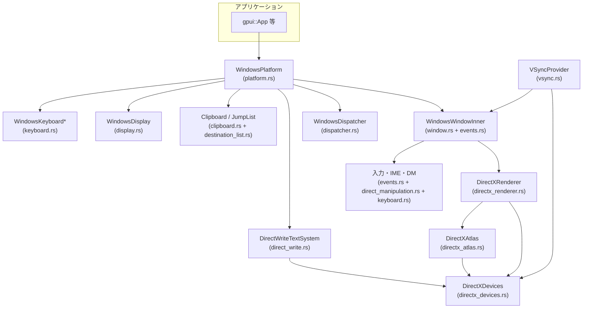
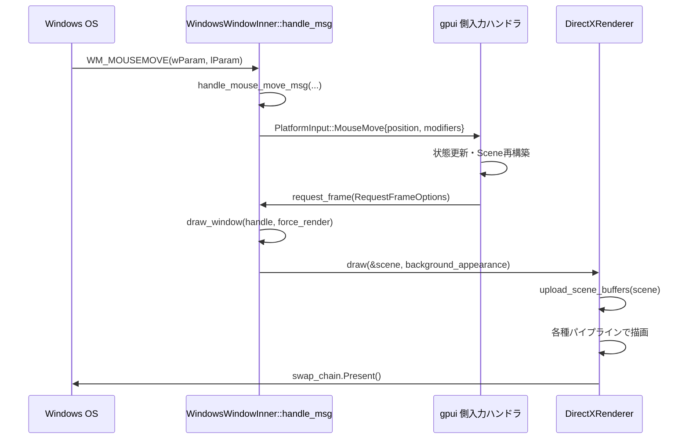

# crates/gpui_windows ディレクトリ解説

---

## 0. ざっくり一言

`gpui_windows` は、`gpui` クレートのための **Windows 専用プラットフォーム実装**です。  
ウィンドウ管理・入力・クリップボード・モニタ情報・DirectX/DirectWrite によるレンダリングなど、GUI アプリを Windows 上で動かすための機能をまとめています。

---

## 1. このモジュールの役割

### 1.1 概要

- このディレクトリは `gpui::Platform` を Windows 上で実装し、アプリケーションから見た「OS 抽象層」として動作します。
- 具体的には、次の責務を持つモジュール群で構成されています。
  - Win32 メッセージループとウィンドウ管理 (`platform.rs`, `window.rs`, `events.rs`)
  - Direct3D 11 / DirectWrite による 2D レンダリング (`directx_*`, `direct_write.rs`)
  - モニタ・DPI・入力・クリップボード・ジャンプリストなど OS 連携 (`display.rs`, `keyboard.rs`, `clipboard.rs`, `destination_list.rs` など)
  - スレッドプール・メインスレッド実行キュー (`dispatcher.rs`) と VSync 駆動の再描画 (`vsync.rs`)

### 1.2 アーキテクチャ内での位置づけ

主要モジュール間の依存関係を簡略化して示します。



- アプリケーションは `WindowsPlatform` を通じて OS 機能にアクセスします。
- 各ウィンドウは `WindowsWindowInner` が保持する `DirectXRenderer` で描画し、キーボード・マウス・タッチパッド・IME などの入力は `events.rs` / `direct_manipulation.rs` が Win32 メッセージから `gpui::PlatformInput` に変換します。
- `DirectXDevices` が D3D11 デバイス・コンテキストを準備し、`DirectXAtlas` と `DirectWriteTextSystem` がそれを利用してテキスト・スプライト描画を行います。
- `WindowsDispatcher` と `VSyncProvider` が、メインスレッド／スレッドプールでのタスク実行と VSync に同期した再描画を協調します。

### 1.3 設計上のポイント

コードから読み取れる設計上の特徴をまとめます。

- **レイヤ分離**
  - `platform.rs` が `gpui::Platform` の実装を一手に引き受け、その内部でウィンドウ・レンダラー・ディスパッチャなどを組み合わせています。
  - レンダリングは `DirectXRenderer`（シーン描画）と `DirectWriteTextSystem`（文字組版）で分離されています。
- **COM / Win32 API の RAII ラップ**
  - クリップボード (`ClipboardGuard`, `LockedGlobal`) や IME コンテキスト (`ImeContext`) など、Win32 のリソースは構造体の `Drop` 実装で解放しています。
- **デバイスロスト対応**
  - `try_to_recover_from_device_lost`（`directx_devices.rs`）と `DirectXRenderer::handle_device_lost` で DX デバイスロストを検知・再作成します。
  - `DirectXAtlas::handle_device_lost` でテクスチャアトラスを破棄・再構築できるようになっています。
- **非同期実行モデル**
  - `WindowsDispatcher` が WinRT の `ThreadPool` を使ったバックグラウンドスレッド実行と、メインスレッドキュー（`PriorityQueueSender`）を統一的に扱います。
  - メインスレッド用キューの実行は、カスタムウィンドウメッセージ `WM_GPUI_TASK_DISPATCHED_ON_MAIN_THREAD` と Windows のメッセージループで駆動されます。
- **プラットフォーム固有機能のカバー**
  - Windows ジャンプリスト (`destination_list.rs`)、システムフォント／サブピクセル設定 (`direct_write.rs`)、IME 位置・合成文字列 (`events.rs`) など、Windows 独自の UI 仕様に対応しています。
- **ビルド時シェーダ管理**
  - `build.rs` で HLSL を `fxc.exe` でコンパイルし、`shader_resources` モジュール経由でバイナリを取り込みます（リリースビルド時）。
  - デバッグビルドでは `D3DCompileFromFile` で実行時コンパイルを行い、開発中のシェーダ編集を容易にしています。

---

## 2. 主要な機能一覧

このディレクトリ全体が提供する主な機能です。

- `WindowsPlatform`:
  - `gpui::Platform` の Windows 実装（イベントループ、ウィンドウ生成、ダイアログ、URL オープン、クリップボード、認証情報管理など）。
- `WindowsWindow` / `WindowsWindowInner`（定義は `window.rs` + `events.rs`）:
  - Win32 ウィンドウハンドル (`HWND`) の生成・破棄・状態管理。
  - Win32 メッセージ (`WM_*`) を `gpui::PlatformInput` やウィンドウコールバックに変換。
- `DirectXDevices`:
  - DXGI / D3D11 デバイス・コンテキストの生成、機能レベルのチェック、デバイスロスト復旧のヘルパ。
- `DirectXRenderer`:
  - `gpui::Scene` をもとに、シャドウ／矩形／パス／下線／各種スプライトを D3D11 で描画。
  - DirectComposition を利用したスワップチェイン構成（環境変数で無効化可能）。
- `DirectWriteTextSystem`:
  - DirectWrite + D3D11 を用いてフォント管理・文字組版 (`layout_line`)・グリフラスタライズ（モノクロ／サブピクセル／カラー絵文字）を行うテキストシステム。
- `DirectXAtlas`:
  - `PlatformAtlas` 実装として、モノクロ／サブピクセル／ポリクロームの 3 種テクスチャアトラスを管理。
- `WindowsDispatcher`:
  - `gpui::PlatformDispatcher` の Windows 実装。WinRT ThreadPool でのバックグラウンド実行と、メインスレッド用キュー＆カスタムメッセージ連携。
- `WindowsDisplay`:
  - 利用可能なモニタ列挙、プライマリモニタ、物理解像度・論理解像度・DPI スケールの取得。
- `WindowsKeyboardLayout` / `WindowsKeyboardMapper`:
  - 現在のキーボードレイアウト ID / 名前の取得。
  - `Keystroke` と仮想キー (`VIRTUAL_KEY`) の相互変換、および US レイアウト基準のキー等価表現。
- `clipboard` モジュール:
  - Unicode テキスト、画像、ファイルパスを Win32 クリップボードと相互変換。
  - `gpui` 内部用メタデータ／ハッシュフォーマットの読み書き。
- `destination_list` モジュール:
  - Windows ジャンプリスト更新（最近のワークスペース・ドックメニュー項目）。
- `direct_manipulation` モジュール:
  - Direct Manipulation API を使ったトラックパッドのスクロール／ピンチジェスチャ検知。
- `vsync` モジュール（このチャンクには定義なし）:
  - VSync の待機と、デバイスロスト時の全ウィンドウへの通知・再描画要求。

---

## 4. 関数・構造体の解説

### 4.1 主要な型一覧

| 型名 | 定義ファイル | 役割 / 用途 |
|------|--------------|-------------|
| `WindowsPlatform` | `platform.rs` | `gpui::Platform` の Windows 実装。アプリ全体のエントリポイントとして使われる。 |
| `WindowsPlatformInner` | `platform.rs` | プラットフォーム共通状態（メニュー・コールバック・DirectXDevices 等）とメインスレッドキューを保持。 |
| `WindowsPlatformState` | `platform.rs` | コールバックセット、ジャンプリスト、カレントカーソル、`DirectXDevices` を保持する内部状態。 |
| `WindowsDispatcher` | `dispatcher.rs` | `gpui::PlatformDispatcher` 実装。スレッドプールタスク／メインスレッドタスクの実行を管理。 |
| `WindowsDisplay` | `display.rs` | モニタハンドル (`HMONITOR`) と DisplayId、DPI スケール、論理／物理 Bounds を表現。 |
| `DirectXDevices` | `directx_devices.rs` | D3D11 デバイス／コンテキスト、DXGI ファクトリ・アダプタをラップ。 |
| `DirectXRenderer` | `directx_renderer.rs` | `Scene` を Direct3D で描画するレンダラ。スワップチェインや各種パイプライン状態を管理。 |
| `DirectXAtlas` | `directx_atlas.rs` | テキスト・スプライト描画に使う GPU テクスチャアトラスを管理する `PlatformAtlas` 実装。 |
| `DirectWriteTextSystem` | `direct_write.rs` | DirectWrite + D3D11 ベースの `PlatformTextSystem` 実装。フォント選択・組版・グリフラスタライズを担当。 |
| `JumpList` / `DockMenuItem` | `destination_list.rs` | Windows のジャンプリストに表示する最近のワークスペース／ドックメニュー項目の管理。 |
| `DirectManipulationHandler` | `direct_manipulation.rs` | DirectManipulation ビューポートのセットアップと、ジェスチャイベントのバッファリング。 |
| `WindowsKeyboardLayout` / `WindowsKeyboardMapper` | `keyboard.rs` | キーボードレイアウトの識別子／名前、および `Keystroke` と仮想キーの相互変換ロジック。 |

以下では特に重要な関数・メソッドをいくつか選び、詳細に説明します。

---

### 4.2 重要な関数・メソッド詳細

#### `WindowsPlatform::new(headless: bool) -> Result<WindowsPlatform>`

**概要**

- Windows 用プラットフォームオブジェクトを構築します。
- 必要に応じて DirectX / DirectWrite デバイスを作成し、メッセージ専用の不可視ウィンドウ（`HWND_MESSAGE`）とディスパッチャなどを初期化します。

**引数**

| 引数名 | 型 | 説明 |
|--------|----|------|
| `headless` | `bool` | `true` の場合、DirectX や実ウィンドウを使わない（レンダリング不要な）モードとして初期化する。 |

**戻り値**

- `Ok(WindowsPlatform)` : 正常に初期化されたプラットフォーム。
- `Err(anyhow::Error)` : COM 初期化失敗、DirectX デバイス作成失敗、ウィンドウクラス登録／ウィンドウ生成失敗など。

**内部処理の流れ**

1. `OleInitialize` を呼び出し、OLE を初期化。
2. `headless == false` の場合:
   - `DirectXDevices::new()` で D3D11 デバイスと DXGI ファクトリを構築。
   - `DirectWriteTextSystem::new(&devices)` を作成し、`text_system` と `direct_write_text_system` に保持。
3. `headless == true` の場合:
   - `gpui::NoopTextSystem` を使う。
4. `PriorityQueueReceiver::new()` でメインスレッド用のタスクキュー（送受信）を作成。
5. ウィンドウクラス (`PLATFORM_WINDOW_CLASS_NAME`) を登録し、`HWND_MESSAGE` タイプの不可視ウィンドウを生成。
   - この際、`PlatformWindowCreateContext` に `main_sender`／`main_receiver`／`DirectXDevices` を渡し、`WindowsPlatformInner` と `WindowsDispatcher` を内部で構築。
6. 環境変数 `GPUI_DISABLE_DIRECT_COMPOSITION` を読んで DirectComposition を無効化するかどうか決定。
7. `BackgroundExecutor` / `ForegroundExecutor` を `WindowsDispatcher` から構築。
8. `DropTargetHelper` やアプリケーションアイコン (`load_icon`) を作成（`headless` なら省略）。

**使用例**

```rust
use gpui_windows::WindowsPlatform;

fn main() -> anyhow::Result<()> {
    // GUI を表示する通常モードでプラットフォームを初期化する
    let platform = WindowsPlatform::new(false)?;

    // gpui 側のランナーに渡してアプリケーションを起動する、という形になります
    // run_application は、実際には gpui 側の初期化ロジックを表す仮の関数です。
    run_application(platform)?;

    Ok(())
}
```

**Errors / Panics**

- DirectX デバイスが必要な環境で GPU が要件（`StructuredBuffer` 対応など）を満たさない場合、`DirectXDevices::new` 内で `Err(anyhow!(...))` になります。
- COM や OLE 初期化 (`OleInitialize`) が失敗した場合も `Err`。

**Edge cases**

- `headless=true` の場合、ウィンドウは開かれませんが、`WindowsPlatform` の多くのメソッドは呼び出し可能です（ただし、ウィンドウやレンダリングに依存するメソッドを呼んでも意味はありません）。
- `GPUI_DISABLE_DIRECT_COMPOSITION` が `"true"` または `"1"` の場合、`DirectXRenderer` は `CreateSwapChainForHwnd` を使った通常のスワップチェイン構成になります。

**使用上の注意点**

- Windows の GUI アプリでは、通常この `new` は **メインスレッド**から呼び出すことが前提です（Win32 API の性質上）。
- 戻り値は `Result` なので、`?` で伝播するか、エラーメッセージをログに出す処理を入れると扱いやすくなります。

---

#### `WindowsPlatform::run(&self, on_finish_launching: Box<dyn FnOnce()>)`

**概要**

- Windows メッセージループを開始し、アプリケーション全体のメインイベントループとして機能します。
- 起動直後に `on_finish_launching` コールバックを 1 回呼び出します。

**引数**

| 引数名 | 型 | 説明 |
|--------|----|------|
| `on_finish_launching` | `Box<dyn FnOnce()>` | メインループ開始直前に一度だけ呼び出される初期化コールバック。 |

**戻り値**

- 戻り値はなく、`WM_QUIT` が発行されてメッセージループが終わるまでブロックします。

**内部処理の流れ**

1. `on_finish_launching()` を即座に実行（アプリの UI 初期化などに利用される想定）。
2. 非 headless モードなら `begin_vsync_thread()` を起動し、VSync 駆動の再描画スレッドを開始。
3. 標準的な Win32 メッセージループ：

   ```rust
   while GetMessageW(&mut msg, None, 0, 0).as_bool() {
       if translate_accelerator(&msg).is_none() {
           TranslateMessage(&msg);
           DispatchMessageW(&msg);
       }
   }
   ```

   - `translate_accelerator` は `WM_KEYDOWN`／`WM_SYSKEYDOWN` を `WM_GPUI_KEYDOWN` に変換してウィンドウに送信するラッパです。
4. ループ終了後、`PlatformCallbacks.quit` に登録されたコールバックがあれば 1 回だけ呼び出します。

**使用例**

```rust
// platform は WindowsPlatform::new(false)? で作成されたものとする
platform.run(Box::new(|| {
    // ここでウィンドウの生成やアプリケーション状態の初期化を行う
    // 例: App::launch(platform.clone());
}));
```

**Errors / Panics**

- `run` 自体は `Result` を返さず、内部で Win32 API 呼び出しの結果をログに記録する設計になっています。
- `WM_QUIT` は `quit()` や OS からの終了要求で発行されます。

**Edge cases**

- メインループ内では `WM_GPUI_TASK_DISPATCHED_ON_MAIN_THREAD` メッセージが投げられることがあり、その処理は `WindowsPlatformInner::run_foreground_task` によって行われます。これにより、メインスレッドキューに溜まった `RunnableVariant` が実行されます。
- headless モードでも `run` 自体は有効ですが、VSync スレッドは起動されません。

**使用上の注意点**

- `run` はブロッキングであり、通常はアプリケーションの最後に 1 度だけ呼び出します。
- `quit()` を呼ぶと `PostQuitMessage(0)` が投げられ、`run` から抜けます。

---

#### `WindowsPlatform::open_window(&self, handle: AnyWindowHandle, options: WindowParams) -> Result<Box<dyn PlatformWindow>>`

**概要**

- 新しい `gpui` ウィンドウを作成し、`PlatformWindow` 実装（`WindowsWindow`）を返します。
- 内部で Win32 の `CreateWindowExW` を呼び出し、レンダラやイベントハンドラをセットアップします。

**引数**

| 引数名 | 型 | 説明 |
|--------|----|------|
| `handle` | `AnyWindowHandle` | `gpui` 側で管理するウィンドウ識別子。 |
| `options` | `WindowParams` | ウィンドウタイトル、サイズ、フルスクリーンフラグなどのパラメータ（定義は `gpui` 側）。 |

**戻り値**

- `Ok(Box<dyn PlatformWindow>)` : `WindowsWindow` の箱入りトレイトオブジェクト。
- `Err(anyhow::Error)` : Win32 ウィンドウ生成や DirectX 初期化に失敗した場合など。

**内部処理の流れ**

1. `self.generate_creation_info()` で `WindowCreationInfo` を構築。
   - ここにはアイコン、`ForegroundExecutor`、カーソル、`DropTargetHelper`、`DirectXDevices`、`invalidate_devices` フラグなどが含まれます。
2. `WindowsWindow::new(handle, options, creation_info)` を呼び出し、新しいウィンドウを生成。
3. 生成されたウィンドウから `HWND` を取得し、`raw_window_handles` のリストに `SafeHwnd` として追加。
4. `Box<dyn PlatformWindow>` として返す。

**簡単な使用例**

```rust
// platform: WindowsPlatform
let window_handle = AnyWindowHandle::new(); // 実際の生成方法は gpui 側に依存
let params = WindowParams::default();       // タイトル・サイズなどを設定する想定

let window = platform.open_window(window_handle, params)?;
// 以降、window を通じてタイトル変更や描画要求などを行う
```

**Errors / Panics**

- DirectX デバイスが存在しない headless モードで `open_window` を呼ぶと、`generate_creation_info` 内で `unwrap()` 相当の処理があるため、エラーではなくパニックになる可能性があります（このチャンクから読み取れる範囲）。

**Edge cases**

- 生成されたウィンドウは `raw_window_handles` に登録されるので、`WindowsPlatform::window_from_hwnd` から逆引きできます。
- DirectComposition の有無は `disable_direct_composition` フラグによって変わります。

**使用上の注意点**

- headless モードでは `open_window` を呼び出さない前提の設計になっています。
- ウィンドウ破棄時には `WM_DESTROY` → `WM_GPUI_CLOSE_ONE_WINDOW` の流れで `raw_window_handles` から削除されます。

---

#### `DirectXRenderer::draw(&mut self, scene: &Scene, background_appearance: WindowBackgroundAppearance) -> Result<()>`

**概要**

- `gpui::Scene` に含まれるパス／四角形／テキストスプライトなどのプリミティブを D3D11 で描画し、スワップチェインを `Present` します。
- デバイスロスト直後は 1 フレーム分の描画をスキップする仕組みを持っています。

**引数**

| 引数名 | 型 | 説明 |
|--------|----|------|
| `scene` | `&Scene` | 描画すべきプリミティブ群（`gpui` が構築）。 |
| `background_appearance` | `WindowBackgroundAppearance` | 透明／不透明など、ウィンドウ背景の描画モード。 |

**戻り値**

- `Ok(())` : 正常に描画と `Present` が完了。
- `Err(anyhow::Error)` : バッファ更新や描画コール、`Present` が失敗した場合。

**内部処理の流れ（簡略）**

1. `skip_draws` が `true` の場合、**何も描画せずに `Ok(())` を返す**。
   - デバイスロスト後の最初のフレームを捨てるためのフラグです。
2. `pre_draw` で
   - グローバル定数バッファ (`GlobalParams`) にフォントガンマ等の設定・ビューポートサイズを転送。
   - 指定された背景色でレンダーターゲットをクリア。
   - レンダーターゲットとビューポートをバインド。
3. `upload_scene_buffers(scene)` で各パイプライン（影／四角形／下線／スプライトなど）の構造化バッファに `scene` のデータをアップロード。
4. `scene.batches()` をイテレートし、バッチの種類に応じて以下を呼び分ける。
   - 影: `draw_shadows(...)`
   - 四角: `draw_quads(...)`
   - パス:
     - `draw_paths_to_intermediate(paths)` で MSAA テクスチャに書き込み→非 MSAA テクスチャへ Resolve。
     - `draw_paths_from_intermediate(paths)` で矩形スプライトとして main render target に合成。
   - 下線・スプライト各種: それぞれ専用のパイプラインで描画。
5. 各バッチ描画でエラーがあった場合は `anyhow::Context` 付きでエラーにします（シーンの統計情報を付加）。
6. 最後に `present()` で `swap_chain.Present(0, 0)` を実行。

**使用例**

通常はアプリケーション側が `Scene` を構築し、`WindowsWindowInner` 内の `request_frame` コールバック経由で呼び出されます。直接呼び出すのは内部実装のみです。

**Errors / Panics**

- `Present` の戻り値が失敗 (`HRESULT` エラー) の場合、`Err` になります（デバイスロストもこの経路で表面化しうる）。
- `devices` や `resources` が `None` の場合には `expect("...")` によってパニックしますが、通常は `DirectXRenderer::new` の直後にしか呼ばれない想定です。

**Edge cases**

- デバイスロスト直後は `handle_device_lost_impl` により `skip_draws = true` になっているため、この関数は何も描画せずに戻ります。強制再描画は `WM_GPUI_FORCE_UPDATE_WINDOW` → `draw_window(..., force_render = true)` から行われます。
- `scene` が空の場合でも `Present` は実行されるため、ウィンドウ内容の更新が保証されます。

**使用上の注意点**

- `resize` を呼んでスワップチェインをリサイズした後は、最初の `draw` が成功するまでデバイスロストの検出が遅れる可能性がありますが、VSync スレッドと `check_device_lost` で補完しています。
- この関数はメインスレッドで呼び出す前提で実装されています（D3D11 デバイスコンテキストの使用スレッドと対応）。

---

#### `DirectWriteTextSystem::layout_line(&self, text: &str, font_size: Pixels, runs: &[FontRun]) -> LineLayout`

**概要**

- 1 行分のテキスト `text` を、フォントラン情報 `runs` に従って DirectWrite でレイアウトし、グリフ位置・幅・アセント／ディセントなどを含む `LineLayout` に変換します。
- 複数フォント混在、OpenType フィーチャ、フォールバックフォントなどを考慮します。

**引数**

| 引数名 | 型 | 説明 |
|--------|----|------|
| `text` | `&str` | レイアウト対象の UTF-8 文字列。 |
| `font_size` | `Pixels` | 基本となるフォントサイズ。 |
| `runs` | `&[FontRun]` | フォント ID と文字範囲を表すラン（`gpui` 側で事前に決定）。 |

**戻り値**

- 正常時: `LineLayout`（行幅、アセント／ディセント、`ShapedRun` のリストなど）。
- 失敗時: エラーをログに残した上で、幅 0 のデフォルト `LineLayout` を返します（`log_err().unwrap_or(...)`）。

**内部処理の流れ（簡略）**

1. `font_runs` が空なら、フォントサイズだけを設定した空の `LineLayout` を返す。
2. `text` を UTF-16 に変換し、内部バッファ `layout_line_scratch` に保存。
3. 最初のランについて:
   - 対応する `FontInfo`（フォントファミリ・スタイル・タイポグラフィ設定）を取得。
   - DirectWrite の `IDWriteTextFormat1` と `IDWriteTextLayout` を作成。
   - テキスト範囲に対して `SetTypography`（OpenType フィーチャ）を適用。
4. 2 ラン目以降について:
   - 各ラン毎に `SetFontCollection` / `SetFontFamilyName` / `SetFontSize` / `SetFontStyle` / `SetFontWeight` / `SetTypography` をランの UTF-16 範囲に適用。
   - `break_ligatures` フラグを使ってフォントサイズを微妙に変化させ、リガチャが跨がらないようにする（詳細ロジックはコード参照）。
5. `GetLineMetrics` でベースラインと行高さを取得し、`ascent`／`descent` を計算。
6. `RendererContext` を構築し、`text_layout.Draw(context, text_renderer)` を呼び出す。
   - `TextRenderer`（`IDWriteTextRenderer` 実装）の `DrawGlyphRun` が呼ばれ、`ClusterAnalyzer` でクラスター分割しつつ `ShapedRun` として `runs` ベクタを埋める。
7. 収集された `runs` と計算した幅・メトリクスから `LineLayout` を構築して返す。

**簡単な使用例**

```rust
// text_system: Arc<DirectWriteTextSystem> とする
let font_id = text_system.font_id(&Font::default())?;
let runs = vec![FontRun {
    font_id,
    len: "Hello".len(),
    // 他のフィールドは gpui 内部の定義による
}];

let layout = text_system.layout_line("Hello", gpui::px(14.0), &runs);
// layout.width, layout.ascent などを使って描画座標を決定する
```

**Errors / Panics**

- DirectWrite API 呼び出しが失敗すると `anyhow::Error` が返されますが、`layout_line` の外側では `log_err().unwrap_or(...)` によってログ出力のみでフォールバックされます。
- `fonts[font_id.0]` が存在しないような不整合は、このチャンクのコードからは起こらない前提で実装されています。

**Edge cases**

- `text` が空文字列でも、`font_size` は有効で、`width=0` の `LineLayout` が返ります。
- 不正な UTF-16 変換や DirectWrite のメトリクス取得に失敗した場合、レイアウトは空の行として扱われます。

**使用上の注意点**

- `font_id` は事前に `font_id(&Font)` で解決しておく必要があります。`select_and_cache_font` が内部でフォントコレクションを更新することがあるため、頻繁なフォント追加／削除の場合のコストに注意します。
- `runs` の `len` は UTF-8 バイト長ではなく、`text` 上のバイト数で渡されています（内部で UTF-16 へのマッピングを `StringIndexConverter` が行います）。

---

#### `WindowsDispatcher::dispatch_on_main_thread(&self, runnable: RunnableVariant, priority: Priority)`

**概要**

- `gpui` ランタイムからの要求に応じて、メインスレッド実行キューに `RunnableVariant` を登録し、必要ならばメッセージループへ起床通知 (`WM_GPUI_TASK_DISPATCHED_ON_MAIN_THREAD`) を送ります。

**引数**

| 引数名 | 型 | 説明 |
|--------|----|------|
| `runnable` | `RunnableVariant` | 実行すべきタスク（同期関数、Future などをラップした型）。 |
| `priority` | `Priority` | 実行優先度（`High`/`Medium`/`Low`/`RealtimeAudio`）。RealtimeAudio はここでは使用禁止。 |

**戻り値**

- 返り値はなく、副作用としてメインスレッドキューにタスクが積まれます。

**内部処理の流れ**

1. `main_sender.send(priority, runnable)` を呼び出す。
2. 送信成功 (`Ok(_)`) の場合:
   - `wake_posted` が `false` であれば `true` にセットし、
   - `PostMessageW` でプラットフォームウィンドウに `WM_GPUI_TASK_DISPATCHED_ON_MAIN_THREAD` を送信。
3. 送信失敗 (`Err(runnable)`) の場合:
   - コメントにある通り、「すでにメイン側がシャットダウンしている＝`!Send` な Future を別スレッドで `drop` できない」ため、`std::mem::forget(runnable)` でメモリを意図的にリークして安全側に倒しています。

**Edge cases**

- メインスレッド側で `PriorityQueueReceiver` が破棄されている（＝アプリ終了中）場合は、タスクは実行されず忘れられます。
- `RealtimeAudio` 優先度で呼ぶと `panic!` するようになっており（`dispatch` 側のガード）、リアルタイムオーディオ用途は専用の `spawn_realtime` を使う前提です。

**使用上の注意点**

- このメソッドは通常、直接呼ぶのではなく、`ForegroundExecutor` を通じて利用されます。
- メインスレッドでしか安全に実行できない処理（UI 更新など）は、必ずここ経由で実行する想定です。

---

#### `WindowsWindowInner::handle_msg(&Rc<Self>, handle: HWND, msg: u32, wparam: WPARAM, lparam: LPARAM) -> LRESULT`（`events.rs`）

**概要**

- 各ウィンドウの Win32 ウィンドウプロシージャとして、全ての `WM_*` メッセージを受け取り、必要な処理を実行して `LRESULT` を返します。
- マウス／キーボード／IME／ウィンドウサイズ変更／DPI 変更／DirectManipulation／デバイスロストなど、幅広いメッセージをここで扱っています。

**主な処理分岐（抜粋）**

- ウィンドウ状態:
  - `WM_ACTIVATE` → `handle_activate_msg`（フォーカス取得／喪失）
  - `WM_MOVE` → `handle_move_msg`（ウィンドウ位置更新＋モニタ切り替え）
  - `WM_SIZE` → `handle_size_msg` → `handle_size_change`（論理サイズ更新＋レンダラーの `resize` 呼び出し）
  - `WM_DPICHANGED` → `handle_dpi_changed_msg`（スケールファクタ更新＋フルスクリーン時のサイズ補正）
  - `WM_DISPLAYCHANGE` → `handle_display_change_msg`（現在の `WindowsDisplay` 更新）
- 入力:
  - マウスボタン／移動 (`WM_LBUTTONDOWN` など) → `handle_mouse_*_msg`
  - ホイール (`WM_MOUSEWHEEL`/`WM_MOUSEHWHEEL`) → `handle_mouse_wheel_msg` / `handle_mouse_horizontal_wheel_msg`
  - キー入力 (`WM_GPUI_KEYDOWN`, `WM_KEYUP`, `WM_SYSKEYUP`) → `handle_keydown_msg` / `handle_keyup_msg` / `handle_syskeyup_msg`
  - 文字 (`WM_CHAR`) → `parse_char_message` → `input_handler.replace_text_in_range`
  - IME (`WM_IME_STARTCOMPOSITION` / `WM_IME_COMPOSITION`) → `update_ime_position` / `handle_ime_composition_inner`
- DirectManipulation:
  - `DM_POINTERHITTEST` → `handle_dm_pointer_hit_test`（タッチパッドジェスチャ開始点の設定）
- レンダリング:
  - `WM_PAINT` → `handle_paint_msg` → `draw_window(handle, force_render=false)`
  - `WM_GPUI_FORCE_UPDATE_WINDOW` → `draw_window(handle, force_render=true)`
- GPU デバイスロスト:
  - `WM_GPUI_GPU_DEVICE_LOST` → `handle_device_lost`（`DirectXRenderer::handle_device_lost` を呼びます）

**内部処理の流れ（概略）**

1. `match msg` で多くの `WM_*` メッセージを `handle_*` 系メソッドに振り分け。
2. `handle_*` メソッドは `Option<isize>` を返し、`Some(n)` なら `LRESULT(n)` を返して処理済みに、`None` なら `DefWindowProcW` にフォールスルー。
3. マウス・キーボード系メソッドでは、`state.callbacks.input` に入っている `FnMut(PlatformInput) -> InputPropagation` を一時的に `take` → 呼び出し → 戻す、というパターンで `gpui` 側にイベントを渡します。
4. `draw_window` では `DirectManipulationHandler` の `update` / `drain_events` を呼び出し、ピンチ・スクロールの仮想イベントを `input` コールバックに流した上で、`request_frame` コールバックに `RequestFrameOptions` を渡して実際の描画をトリガします。

**使用上の注意点**

- このメソッドは Win32 のコールバックから直接呼ばれることを前提にしており、ユーザコードから呼び出すものではありません。
- `with_input_handler` / `with_input_handler_and_scale_factor` など、内部状態とコールバックを一時的に取り出して戻すパターンが多用されているため、再入可能性に注意した実装になっています。

---

### 4.3 その他の代表的な関数

重要度はやや低いが、実用上理解しておくと便利な関数を簡単に列挙します。

| 関数名 | 定義ファイル | 役割（1 行） |
|--------|--------------|--------------|
| `write_to_clipboard(item: ClipboardItem)` | `clipboard.rs` | `ClipboardItem` 内の文字列・画像を Win32 クリップボードに書き込む。 |
| `read_from_clipboard() -> Option<ClipboardItem>` | `clipboard.rs` | クリップボードの CF_UNICODETEXT / 画像 / CF_HDROP を読み取り、`ClipboardItem` に変換。 |
| `update_jump_list(...)` | `destination_list.rs` | 最近のワークスペースとドックメニューを Windows のジャンプリストに反映し、ユーザが削除した項目を返す。 |
| `DirectManipulationHandler::new(window, scale_factor)` | `direct_manipulation.rs` | DirectManipulation マネージャ・ビューポートを初期化し、トラックパッドジェスチャのイベントハンドラを登録。 |
| `DirectXDevices::new()` | `directx_devices.rs` | DXGI ファクトリと D3D11 デバイス／コンテキストを作成し、対応 GPU を選択。 |
| `try_to_recover_from_device_lost(f)` | `directx_devices.rs` | デバイスロストからの復旧処理 `f` を最大 5 回までリトライするユーティリティ。 |
| `WindowsDisplay::displays()` | `display.rs` | 利用可能な全モニタを列挙し、`Rc<dyn PlatformDisplay>` にラップして返す。 |
| `WindowsKeyboardLayout::new()` | `keyboard.rs` | 現在のキーボードレイアウト ID を読み取り、レジストリから人間向けの名前を取得。 |
| `WindowsKeyboardMapper::map_key_equivalent` | `keyboard.rs` | キー等価（US キーボードベースの表記）と物理キーの対応付けを行い、`KeybindingKeystroke` を構築。 |

---

## 5. データフロー

ここでは「マウス移動イベントから描画まで」の典型的な流れを示します。

### 5.1 処理の要点

1. ユーザーがウィンドウ上でマウスを動かすと、Win32 が `WM_MOUSEMOVE` メッセージをそのウィンドウに送信します。
2. `WindowsWindowInner::handle_msg` が `WM_MOUSEMOVE` を受け取り、`handle_mouse_move_msg` に委譲します。
3. `handle_mouse_move_msg` は物理解像度座標をスケールファクタで論理座標に変換し、`PlatformInput::MouseMove` を `input` コールバックに渡します。
4. `gpui` 側は入力に応じてアプリケーション状態と `Scene` を更新し、`request_frame` コールバックを通じて再描画を要求します。
5. `draw_window` が `DirectManipulationHandler` の更新・イベント処理を行った後、`DirectXRenderer::draw` を呼び出して実際の描画を行います。
6. `DirectXRenderer` は `Scene` を GPU にアップロードし、各パイプラインで描画した上でスワップチェインを `Present` します。

### 5.2 シーケンス図



- VSync が有効な場合、実際には別スレッドの `VSyncProvider` が `RedrawWindow` を呼び、`WM_PAINT` をトリガする形で `draw_window` が呼ばれることもあります。

---

## 6. 使い方（How to Use）

### 6.1 基本的な使用方法

`WindowsPlatform` をアプリケーションのエントリポイントとして利用する基本的な流れです。実際の `gpui` 側の API 名はこのチャンクには含まれていないため、擬似的なコードとして示します。

```rust
use std::rc::Rc;
use gpui_windows::WindowsPlatform;
// use gpui::{App}; // 実際の型は gpui 側の公開 API に依存します

fn main() -> anyhow::Result<()> {
    // 1. プラットフォーム生成（DirectX/DirectWrite を含む）
    let platform = WindowsPlatform::new(false)?; // headless=true ならレンダリングなし

    // 2. アプリケーションランナーに渡してイベントループを開始
    platform.run(Box::new(|| {
        // ここでウィンドウを作成したり、初期シーンを構築する
        // 例（擬似コード）:
        // let app = App::new(platform.clone());
        // app.open_main_window();
    }));

    Ok(())
}
```

- `run` の中で Win32 メッセージループが回り続けるため、`main` は通常ここでブロックします。
- ウィンドウの生成は `WindowsPlatform::open_window` を通じて行われます（`gpui` 側が内部で呼びます）。

### 6.2 よくある使用パターン

#### (1) ファイルダイアログを開く

`prompt_for_paths` は `oneshot::Receiver<Result<Option<Vec<PathBuf>>>>` を返す非同期 API です。

```rust
use std::path::PathBuf;
use futures::executor::block_on;
use gpui::{PathPromptOptions};
use gpui_windows::WindowsPlatform;

fn open_file_dialog(platform: &WindowsPlatform) -> anyhow::Result<()> {
    let options = PathPromptOptions {
        // 複数選択可、ディレクトリ選択不可などの設定は gpui 側の定義に依存
        ..Default::default()
    };

    let rx = platform.prompt_for_paths(options);

    // 実際には gpui のタスクランナー上で .await する想定
    let result = block_on(rx)?; // Result<Option<Vec<PathBuf>>>

    if let Some(paths) = result {
        for path in paths {
            println!("選択されたパス: {}", path.display());
        }
    }

    Ok(())
}
```

#### (2) クリップボードに文字列を書き込む／読み込む

```rust
use gpui::{ClipboardItem, ClipboardEntry, ClipboardString};
use gpui_windows::WindowsPlatform;

fn copy_text(platform: &WindowsPlatform, s: &str) {
    let entry = ClipboardEntry::String(ClipboardString {
        text: s.to_string(),
        metadata: None,
    });
    let item = ClipboardItem { entries: vec![entry] };
    platform.write_to_clipboard(item);
}

fn paste_text(platform: &WindowsPlatform) -> Option<String> {
    let item = platform.read_from_clipboard()?;
    for entry in item.entries {
        if let ClipboardEntry::String(s) = entry {
            return Some(s.text);
        }
    }
    None
}
```

#### (3) ジャンプリスト（最近のワークスペース・ドックメニュー）の更新

```rust
use smallvec::SmallVec;
use std::path::PathBuf;
use gpui::{MenuItem, Menu, Keymap};
use gpui_windows::WindowsPlatform;

fn update_jump_list(platform: &WindowsPlatform) {
    // ドックメニューに出したいアクション
    let menus: Vec<MenuItem> = vec![
        // MenuItem::Action { name: "New Window".into(), action: ... }
        // など、実際の定義は gpui 側に依存
    ];

    let entries: Vec<SmallVec<[PathBuf; 2]>> = vec![
        SmallVec::from([PathBuf::from("C:\\workspace1")]),
        SmallVec::from([PathBuf::from("C:\\workspace2")]),
    ];

    let task = platform.update_jump_list(menus, entries);
    // Task<Vec<SmallVec<[PathBuf; 2]>>> をどこかで .await or detach する
}
```

### 6.3 よくある間違い

```rust
use gpui_windows::WindowsPlatform;

fn incorrect_usage() -> anyhow::Result<()> {
    // 間違い例: headless モードなのにウィンドウを開こうとする
    let platform = WindowsPlatform::new(true)?;

    // ここで open_window を呼ぶと、内部で DirectXDevices の None.unwrap() 相当が
    // 発生する可能性があります（このチャンクから読み取れる設計）。
    // let window = platform.open_window(handle, params)?; // 危険

    Ok(())
}
```

正しい例:

```rust
fn correct_usage() -> anyhow::Result<()> {
    // ウィンドウを開く場合は headless=false で初期化する
    let platform = WindowsPlatform::new(false)?;

    // 以降は gpui の API に従ってウィンドウを開く
    Ok(())
}
```

### 6.4 使用上の注意点（まとめ）

- **DirectX / デバイスロスト**
  - GPU ドライバの不具合やマルチディスプレイ構成変更によりデバイスロストが発生することがあります。
  - `DirectXRenderer::handle_device_lost` と VSync スレッドからの `WM_GPUI_GPU_DEVICE_LOST` により自動復旧を試みる設計になっているため、アプリ側で明示的に処理する必要はありませんが、例外的なクラッシュログを見たときにこの経路を意識しておくと役立ちます。
- **headless モード**
  - `headless=true` で初期化した場合、ウィンドウ生成や DirectX レンダリングに依存するメソッドは使わないことが前提です。
- **メインスレッド制約**
  - Win32 の GUI API は基本的にメインスレッドから呼び出す前提で設計されています。`WindowsPlatform::run` / `open_window` / ダイアログ系 API はメインスレッド（`run` の中）で扱うのが安全です。
- **IME / テキスト入力**
  - IME を利用したテキスト入力が前提のウィジェットでは、`PlatformInputHandler` が `query_accepts_text_input` を `true` に返していることが重要です。そうでないと、`update_ime_enabled` によって IME コンテキストが無効化される可能性があります。
- **キーボードショートカット**
  - `WindowsKeyboardMapper` は US 配列に基づいた「キー等価」を提供しますが、実際の物理キーボードと異なる場合があります。レイアウト依存のショートカット（記号キーなど）を定義する場合は、この変換ロジックを踏まえる必要があります。

---

## 7. 関連ファイル

このディレクトリ内で相互に強く関連するファイルをまとめます。

| パス | 役割 / 関係 |
|------|------------|
| `gpui_windows/src/gpui_windows.rs` | このクレートのエントリポイント。各モジュールを `pub(crate) use` し、`WindowsPlatform` を公開。 |
| `gpui_windows/src/platform.rs` | `WindowsPlatform` 本体と `WindowsPlatformInner`。`gpui::Platform` トレイトの Windows 実装。 |
| `gpui_windows/src/window.rs` | 各ウィンドウの構築・破棄・状態管理（このチャンクには定義が含まれていませんが、`WindowsWindowInner` の定義が存在するはずです）。 |
| `gpui_windows/src/events.rs` | `WindowsWindowInner::handle_msg` と各種 `handle_*` メソッド。Win32 メッセージを `gpui` イベントに変換。 |
| `gpui_windows/src/dispatcher.rs` | `WindowsDispatcher` と `PlatformDispatcher` 実装。メイン／バックグラウンドタスクの実行制御。 |
| `gpui_windows/src/directx_devices.rs` | `DirectXDevices` の生成とデバイスロスト復旧ユーティリティ。 |
| `gpui_windows/src/directx_renderer.rs` | `DirectXRenderer` とシェーダリソース管理。`Scene` の描画とスワップチェイン管理。 |
| `gpui_windows/src/directx_atlas.rs` | `DirectXAtlas`（`PlatformAtlas` 実装）。テクスチャアトラス管理。 |
| `gpui_windows/src/direct_write.rs` | `DirectWriteTextSystem` とフォント関連のロジック、カラー絵文字描画など。 |
| `gpui_windows/src/clipboard.rs` | クリップボードとの文字列・画像・ファイルパスの相互変換。 |
| `gpui_windows/src/keyboard.rs` | キーボードレイアウト情報と `Keystroke` ↔ 仮想キー変換。 |
| `gpui_windows/src/display.rs` | モニタ列挙・プライマリモニタ取得・DPI スケール計算。 |
| `gpui_windows/src/destination_list.rs` | Windows ジャンプリスト（最近のワークスペース・ドックメニュー）管理。 |
| `gpui_windows/src/direct_manipulation.rs` | タッチパッドジェスチャ（スクロール・ピンチ）検知用 DirectManipulation ラッパ。 |
| `gpui_windows/src/system_settings.rs` | システム設定（マウスホイール・テーマなど）の取得・キャッシュ（詳細はこのチャンクには含まれていません）。 |
| `gpui_windows/src/vsync.rs` | `VSyncProvider` と GPU デバイスロスト検知／通知（定義はこのチャンク外ですが、`begin_vsync_thread` から利用されています）。 |
| `gpui_windows/src/util.rs` | `ResultExt` や `defer` などのユーティリティ関数（定義は別チャンク）。 |
| `gpui_windows/src/wrapper.rs` | Windows 固有のラッパや補助的な型をまとめたモジュール（詳細はこのチャンクには含まれていません）。 |
| `gpui_windows/build.rs` | HLSL シェーダのビルドスクリプト。`fxc.exe` を用いてコンパイルし、`shader_resources` から参照可能な Rust コードに変換。 |

この解説は、提供されたチャンクに含まれるコードに基づいています。  
他のファイル（`window.rs`、`vsync.rs` など）の詳細な実装はこのチャンクに含まれていないため、役割はファイル名と参照箇所から読み取れる範囲で記述しています。
