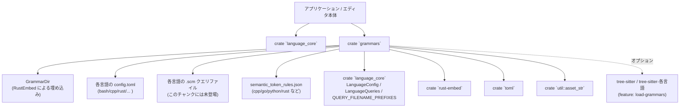
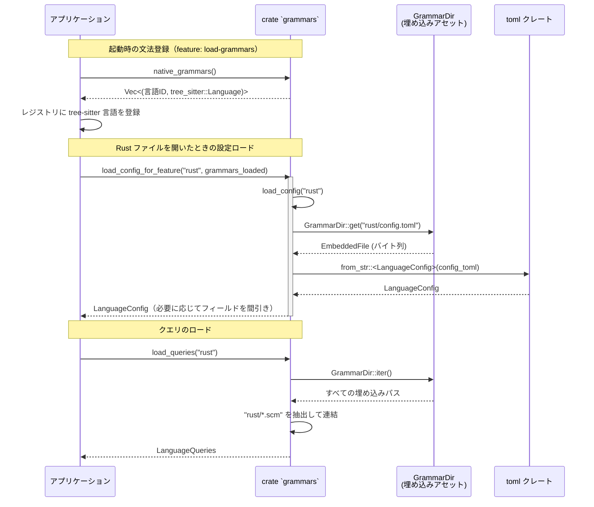

# grammars/ ディレクトリ

## 1. ざっくり一言

`grammars` クレートは、各プログラミング言語の **tree-sitter 文法と、その周辺設定ファイル（config.toml・クエリ・semantic token ルール）をバイナリに埋め込み、読み出すための窓口** です。

---

## 2. このモジュールの役割

### 2.1 概要

- このクレートは、Zed などのエディタが使う **言語ごとの構文情報・編集挙動の設定** を提供します。
- 具体的には次の機能を持ちます。
  - 各言語の **tree-sitter 言語オブジェクトの登録**（`native_grammars`）
  - 各言語ディレクトリにある `config.toml` の読み込みと **`LanguageConfig` への変換**
  - 埋め込まれた `.scm` クエリファイルをまとめて読み込み **`LanguageQueries` を構成**
  - 任意の埋め込みファイル（例: `semantic_token_rules.json`）の **生データ取得**

### 2.2 アーキテクチャ内での位置づけ

このクレートは「言語設定とクエリの倉庫」として機能し、他のクレート（`language_core` など）から参照されます。



- `GrammarDir` は `src/` 配下のすべてのファイルを埋め込みます（`.rs` は除外）。
- `native_grammars` は `tree-sitter-*` 系クレートの `LANGUAGE` 定数から `tree_sitter::Language` を作り、名前とペアで返します。
- `load_config` / `load_queries` は `GrammarDir` からファイルを取得し、`LanguageConfig` / `LanguageQueries` を組み立てます。

### 2.3 設計上のポイント

- **完全埋め込み型**
  - `rust-embed` によって `src/` 配下の設定ファイルやクエリをすべてバイナリに埋め込みます。
  - 実行時にファイルシステム上のパスを意識する必要がありません。
- **機能フラグによる切り替え**
  - `Cargo.toml` の feature `load-grammars` が有効なときだけ tree-sitter 関連の依存クレートを使い、`native_grammars` を提供します。
  - `load_config_for_feature` で、「文法なしビルド」の場合に不要な設定をデフォルトに落とす仕組みがあります。
- **言語ごとの設定はデータ駆動**
  - 言語固有の挙動（コメント記号、インデント規則、ブラケット自動補完、Prettier のパーサー名など）はすべて `src/<lang>/config.toml` に記述されています。
  - Rust 側のコードは「どう使うか」は知らず、`LanguageConfig` として渡す役割だけを担います。
- **クエリのプレフィックス単位での結合**
  - `.scm` ファイルはファイル名のプレフィックス（例: `highlights`, `highlights_extra`）ごとに `LanguageQueries` 内で連結されます。
  - どのプレフィックスがどのフィールドに対応するかは `QUERY_FILENAME_PREFIXES` に委ねられています。

---

## 3. 主要な機能一覧

- **tree-sitter 文法の登録**
  - `native_grammars` : `"rust"`, `"python"`, `"bash"` などの言語名と、対応する `tree_sitter::Language` のペア一覧を返します。
- **言語設定ファイルの読み込み**
  - `load_config(name: &str)` : `src/<name>/config.toml` を読み込み、`LanguageConfig` にデシリアライズします。
  - `load_config_for_feature(name: &str, grammars_loaded: bool)` :
    - 文法をロードする／しない構成に合わせて、`LanguageConfig` の保持するフィールドを調整します。
- **クエリファイルの読み込み**
  - `load_queries(name: &str)` : `src/<name>/*.scm` を走査し、`LanguageQueries` に連結して格納します。
- **埋め込みアセットの取得**
  - `get_file(path: &str)` : `src/` からの相対パスで埋め込みファイルを取得します（例: `"rust/semantic_token_rules.json"`）。
- **言語設定（config.toml）で提供される主な情報**
  - 言語名・tree-sitter grammar ID (`name`, `grammar`)
  - ファイル検出用情報:
    - 拡張子 (`path_suffixes`)
    - shebang / 1 行目のパターン (`first_line_pattern`)
    - modeline (`modeline_aliases`)
    - Markdown のコードフェンス名 (`code_fence_block_name`)
  - コメント・フォーマット:
    - 行コメント / ブロックコメント (`line_comments`, `block_comment`, `documentation_comment`)
    - 折り返し（rewrap）のプレフィックス (`rewrap_prefixes`)
  - ブラケット・自動補完:
    - 自動クローズ前の文字 (`autoclose_before`)
    - ペアになる記号と挙動 (`brackets`)
  - インデント・タブ設定:
    - `increase_indent_pattern`, `decrease_indent_patterns`
    - `auto_indent_on_paste`, `auto_indent_using_last_non_empty_line`
    - `tab_size`, `hard_tabs`
  - その他:
    - デバッガの候補 (`debuggers`)
    - Prettier のパーサー名 (`prettier_parser_name`)
    - 言語サーバーのスコープ設定 (`scope_opt_in_language_servers`, `opt_into_language_servers`)
    - JSX タグ自動クローズ設定（`[jsx_tag_auto_close]` など）
- **semantic_token_rules.json で提供される情報**
  - semantic token の種類 (`token_type`)・修飾子 (`token_modifiers`) と、ハイライトスタイル名 (`style`) の対応づけ。

---

## 4. 関数・構造体の解説

### 4.1 型一覧（主要な型）

| 名前 | 種別 | 定義元 | 役割 / 用途 |
|------|------|--------|-------------|
| `GrammarDir` | 構造体（`RustEmbed` 派生） | 本クレート | `src/` 以下のファイルを埋め込むコンテナです。`GrammarDir::get` / `GrammarDir::iter` を通してアセットにアクセスします。外部 API には公開されていません。 |
| `LanguageConfig` | 構造体 | `language_core` | 1 言語分の設定情報を保持します。`config.toml` から `toml::from_str` で生成され、コメント記号・ブラケット・インデントなど多くのフィールドを持ちます。`Default` 実装があります。 |
| `LanguageQueries` | 構造体 | `language_core` | tree-sitter クエリ（`.scm` ファイルの中身）を各種用途（ハイライト等）ごとに保持します。`LanguageQueries::default()` で空の状態が生成されます。 |
| `rust_embed::EmbeddedFile` | 構造体 | `rust-embed` | 埋め込まれた 1 ファイルを表します。`get_file` の戻り値として使用され、`data` フィールドからバイト列を取得できます。 |

### 4.2 関数詳細

#### `native_grammars() -> Vec<(&'static str, tree_sitter::Language)>`

※ `#[cfg(feature = "load-grammars")]` 付きのため、`load-grammars` feature 有効時のみ利用可能です。

**概要**

- 組み込みの tree-sitter 文法を **言語名と `tree_sitter::Language` のペアのベクタ** として返します。
- ドキュコメントにある通り、**言語設定やクエリをロードする前に呼ばれることを前提** にしています。

登録される主な言語名の例:

- `"bash"`, `"c"`, `"cpp"`, `"css"`, `"diff"`
- `"go"`, `"gomod"`, `"gowork"`
- `"jsdoc"`, `"json"`, `"jsonc"`, `"markdown"`, `"markdown-inline"`
- `"python"`, `"regex"`, `"rust"`, `"tsx"`, `"typescript"`, `"yaml"`, `"gitcommit"`

**引数**

- なし

**戻り値**

- `Vec<(&'static str, tree_sitter::Language)>`
  - `0` 個以上の `(言語 ID, tree-sitter 言語オブジェクト)` のペア。
  - 言語 ID は `config.toml` 内の `grammar` フィールドとは必ずしも一致しません（例: `javascript/config.toml` は `grammar = "tsx"`）。

**内部処理の流れ**

- `vec![ ... ]` リテラルで各言語について
  - 対応する `tree_sitter_<lang>::LANGUAGE` を参照
  - `.into()` で `tree_sitter::Language` に変換
  - 言語名文字列とペアにしてベクタに詰めて返却

**Examples（使用例）**

```rust
// Cargo.toml 側で `grammars` クレートの feature `load-grammars` を有効にしている前提
// [dependencies]
// grammars = { path = "crates/grammars", features = ["load-grammars"] }

#[cfg(feature = "load-grammars")]
fn main() {
    // 利用側の「レジストリ」に登録するイメージのコード
    let mut registry = Vec::new(); // 実際には独自のレジストリ型になるはずです

    for (name, language) in grammars::native_grammars() {
        // ここで name と language をアプリケーション側のレジストリに登録する
        registry.push((name, language));
        println!("登録した言語: {name}");
    }
}

#[cfg(not(feature = "load-grammars"))]
fn main() {
    // feature 無効の場合、この関数自体が存在しないことに注意
}
```

**Errors / Panics**

- この関数内では panic しません。
- ただし、対応する `tree-sitter-*` クレートのビルドに失敗すればコンパイルエラーになります。

**Edge cases（エッジケース）**

- feature `load-grammars` が無効なビルドでは関数が存在しないため、呼び出すとコンパイルエラーになります。

**使用上の注意点**

- ドキュコメントの通り、**言語設定（`load_config`）やクエリ（`load_queries`）を使う前に呼んでおく前提** の設計です。
- 戻り値の `&'static str` は、「config.toml が存在するディレクトリ名」と一致しているとは限りません。
  - 例: `javascript/config.toml` は `grammar = "tsx"` で、tree-sitter の言語 ID と異なる。

---

#### `load_config(name: &str) -> LanguageConfig`

**概要**

- `src/<name>/config.toml` を埋め込みから読み込み、`LanguageConfig` にパースして返します。
- 設定ファイルが存在しない・壊れている場合は panic します（`unwrap_or_else` / `unwrap`）。

**引数**

| 引数名 | 型 | 説明 |
|--------|----|------|
| `name` | `&str` | 言語ディレクトリ名（例: `"rust"`, `"python"`, `"javascript"` など）。`src/<name>/config.toml` が参照されます。 |

**戻り値**

- `LanguageConfig`
  - `config.toml` で定義された内容を格納した設定オブジェクト。

**内部処理の流れ**

1. `GrammarDir::get(&format!("{}/config.toml", name))` で埋め込みファイルを取得。
   - 失敗した場合は `panic!("missing config for language {:?}", name)`。
2. 取得した `EmbeddedFile` の `data` を `Vec<u8>` に変換し、`String::from_utf8` で UTF-8 文字列に変換。
   - UTF-8 でない場合は `unwrap()` により panic。
3. `toml::from_str::<LanguageConfig>(&config_toml)` でパース。
   - 失敗した場合、`with_context(|| format!("failed to load config.toml for language {name:?}"))` でエラーに文脈を付け、最後に `unwrap()` で panic。
4. パースされた `LanguageConfig` を返す。

**Examples（使用例）**

```rust
fn main() {
    // "rust" 言語の設定を読み込む
    let rust_config = grammars::load_config("rust");

    // 設定オブジェクトから表示名などを利用する（フィールド名は language_core 側に依存）
    println!("言語名: {}", rust_config.name); // name フィールドは `load_config_for_feature` からも参照されている
}
```

**Errors / Panics**

- 次の場合に panic します。
  - `src/<name>/config.toml` が存在しない。
  - ファイルが UTF-8 でない。
  - TOML としてパースできない。
- これらは「ビルド時に埋め込むべきファイルが欠落している／壊れている」という開発時の問題を表しています。

**Edge cases**

- `name` に未知の値（ディレクトリがないもの）を渡すと、`missing config for language` というメッセージで panic します。

**使用上の注意点**

- 利用時には通常、`name` はこのクレートがサポートしている言語名（ディレクトリ名）に限定すべきです。
- 実行時エラーを避けたい構成では、この関数のラッパーを作り、`panic` を catch するか、事前に存在チェック用の一覧を持つ必要があります。

---

#### `load_config_for_feature(name: &str, grammars_loaded: bool) -> LanguageConfig`

**概要**

- `load_config` を呼び出して `LanguageConfig` を取得し、その後に **tree-sitter 文法の有無に応じてフィールドを調整して返す** 関数です。
- 文法がロードされていない構成（`grammars_loaded = false`）では、`LanguageConfig` の一部フィールドだけを残し、その他を `Default` にリセットします。

**引数**

| 引数名 | 型 | 説明 |
|--------|----|------|
| `name` | `&str` | 言語ディレクトリ名。`load_config` と同じ。 |
| `grammars_loaded` | `bool` | 文法（tree-sitter 言語）がロードされているかどうか。 |

**戻り値**

- `LanguageConfig`
  - `grammars_loaded == true` の場合: `load_config(name)` と同じオブジェクト。
  - `grammars_loaded == false` の場合: `name`・`matcher`・`jsx_tag_auto_close` だけを残し、それ以外のフィールドは `Default::default()`。

**内部処理の流れ**

1. `let config = load_config(name);` で通常の設定を取得。
2. `if grammars_loaded { config } else { ... }` で分岐。
3. `grammars_loaded == false` のとき:
   - `LanguageConfig { name: config.name, matcher: config.matcher, jsx_tag_auto_close: config.jsx_tag_auto_close, ..Default::default() }`
   - という形で新しい `LanguageConfig` を作成。

**Examples（使用例）**

```rust
fn main() {
    // コンパイル時の feature に応じて grammars_loaded を決める例
    let grammars_loaded = cfg!(feature = "load-grammars");

    // Rust 言語の設定を取得
    let config = grammars::load_config_for_feature("rust", grammars_loaded);

    println!("言語名: {}", config.name);
    // grammars_loaded == false の場合、path_suffixes などの多くのフィールドはデフォルト値になっている点に注意
}
```

**Errors / Panics**

- 内部で `load_config` を呼ぶため、`load_config` と同じ条件で panic します（ファイル欠落、TOML エラーなど）。

**Edge cases**

- `grammars_loaded == false` のとき、どのフィールドが空になるかは `LanguageConfig` の定義に依存します。
  - コード上は `name`, `matcher`, `jsx_tag_auto_close` 以外が `Default` に置き換えられます。
  - これにより、文法に依存する高度な機能（クエリやブラケット設定など）を無効化する意図があると考えられますが、詳細な挙動は `language_core` 側の実装次第です。

**使用上の注意点**

- アプリケーション側で「tree-sitter を全く使わないモード」を実装する場合は、こちらの関数を利用すると安全です。
- 文法がない前提で `LanguageConfig` の他フィールドに依存すると、意図しないデフォルト値で動作する可能性があります。

---

#### `get_file(path: &str) -> Option<rust_embed::EmbeddedFile>`

**概要**

- 埋め込まれたファイルを **`src/` からの相対パスで取得する** ユーティリティです。
- `config.toml` や `.scm` だけでなく、`semantic_token_rules.json` など任意のアセットを取得できます。

**引数**

| 引数名 | 型 | 説明 |
|--------|----|------|
| `path` | `&str` | `src/` からの相対パス。例: `"rust/config.toml"`, `"python/semantic_token_rules.json"`。 |

**戻り値**

- `Option<rust_embed::EmbeddedFile>`
  - 対応するファイルが存在すれば `Some(EmbeddedFile)`、なければ `None`。

**内部処理の流れ**

1. `GrammarDir::get(path)` を呼び出し、その結果をそのまま返します。

**Examples（使用例）**

```rust
fn main() {
    // Rust の semantic token ルールを生データとして取得する例
    if let Some(file) = grammars::get_file("rust/semantic_token_rules.json") {
        let bytes = file.data;                         // バイト列として取得
        let text = String::from_utf8_lossy(&bytes);   // UTF-8 と仮定して文字列に変換
        println!("Rust semantic token ルール:\n{text}");
    } else {
        eprintln!("semantic_token_rules.json が埋め込まれていません");
    }
}
```

**Errors / Panics**

- `get_file` 自体は `Option` を返すだけで panic しません。
- 戻り値の `EmbeddedFile` の `data` を扱う際に、UTF-8 前提で `String::from_utf8` するとパースエラーで `Err` になる可能性はあります（このクレート内ではそこまでしていません）。

**Edge cases**

- 対応するファイルが存在しない場合は単に `None` を返します。
- `.rs` ファイルは `#[exclude = "*.rs"]` 指定により埋め込まれていないため、`get_file("grammars.rs")` のようなパスは常に `None` になります。

**使用上の注意点**

- パスは常に `src/` からの相対パスである点に注意してください。
- このクレート外で独自に JSON や TOML をパースするときは、文字コードやフォーマットエラーの扱いを呼び出し側で決める必要があります。

---

#### `load_queries(name: &str) -> LanguageQueries`

**概要**

- 指定された言語名に対応するディレクトリ（`src/<name>/`）から **すべての `.scm` ファイルを探し、`LanguageQueries` に読み込む** 関数です。
- 同じプレフィックス（例: `highlights`, `highlights_extra`）を持つ複数ファイルは、内容が文字列連結されます。

**引数**

| 引数名 | 型 | 説明 |
|--------|----|------|
| `name` | `&str` | 言語ディレクトリ名。例: `"rust"`, `"python"`。 |

**戻り値**

- `LanguageQueries`
  - クエリが 1 つも見つからなければ、`LanguageQueries::default()` と同じ中身（つまり空）になります。

**内部処理の流れ**

1. `let mut result = LanguageQueries::default();` で空のクエリ集を作成。
2. `GrammarDir::iter()` で埋め込みファイルのパスをすべて列挙。
3. 各パスについて:
   - `path.strip_prefix(name).and_then(|p| p.strip_prefix('/'))` に成功した場合のみ、その言語ディレクトリ配下に属しているとみなす。
   - `remainder` が `.scm` で終わらない場合はスキップ。
4. `.scm` ファイルについて:
   - `for (prefix, query) in QUERY_FILENAME_PREFIXES` でプレフィックス一覧を走査。
   - `remainder.starts_with(prefix)` なら、このファイルをその種別のクエリとして扱う。
   - `asset_str::<GrammarDir>(path.as_ref())` でファイル内容を文字列として取得。
   - `match query(&mut result)` の結果に応じて:
     - `None` の場合: `*query(&mut result) = Some(contents)` で初期値としてセット。
     - `Some(existing)` の場合: `existing.to_mut().push_str(contents.as_ref())` で追記。
5. 最終的な `result` を返す。

**Examples（使用例）**

```rust
fn main() {
    // Rust 言語のクエリを読み込む
    let queries = grammars::load_queries("rust");

    // 実際には LanguageQueries のフィールドに、ハイライトやフォールド用のクエリ文字列が格納されます。
    // 具体的なフィールド名や用途は language_core 側に依存します。
    // ここでは単に「空でないか」を確認するだけの例にします。
    // (疑似コード: queries.highlights.is_some() など)
}
```

**Errors / Panics**

- `GrammarDir::iter()` で得られたパスに対して `asset_str::<GrammarDir>` を呼んでいるため、
  - 埋め込みから削除されたファイルが `iter()` に現れる、という矛盾は通常起こらず、ここでは panic は想定されていません。
- `name` に対応する `.scm` ファイルが 1 つもなくても、エラーにはなりません（空の `LanguageQueries` を返すだけです）。

**Edge cases**

- `name` に存在しない言語を渡した場合:
  - `strip_prefix(name)` に成功するパスが 1 つもなく、結果として空の `LanguageQueries` が返ります。
  - `load_config` とは違い、この関数はその場合も panic しません。
- 同じプレフィックスを持つ `.scm` が複数ある場合:
  - `existing.to_mut().push_str(contents.as_ref())` によって、中身が単純連結されます。
  - 連結順序は `GrammarDir::iter()` の順（埋め込み順）に依存します。

**使用上の注意点**

- クエリファイル名と `QUERY_FILENAME_PREFIXES` のプレフィックスとの対応は `language_core` に依存するため、`.scm` を追加・変更する場合はそちらの定義も確認する必要があります。
- `.scm` ファイルはこのチャンクには含まれていませんが、`load_queries` の挙動から「`src/<name>` 配下に置く」という前提が読み取れます。

---

### 4.3 設定ファイル形式（config.toml / semantic_token_rules.json）

このクレートの振る舞いを理解するうえで重要な、代表的な設定ファイルの構造を簡単に整理します。

#### `config.toml` の共通項目（例: `src/rust/config.toml`）

```toml
# エディタに表示する言語名
name = "Rust"

# 使用する tree-sitter の言語 ID
grammar = "rust"

# 対応するファイル拡張子
path_suffixes = ["rs"]

# 行コメント（doc コメントも含む）
line_comments = ["// ", "/// ", "//! "]

# 自動補完対象のブラケットやコメント
brackets = [
    { start = "{", end = "}", close = true, newline = true },
    # 省略
]

# デバッガ統合の候補
debuggers = ["CodeLLDB", "GDB"]

# ドキュメンテーションコメントのフォーマット
documentation_comment = { start = "/*", prefix = "* ", end = "*/", tab_size = 1 }
```

他の言語でも概ね次のようなパターンで設定されています。

- **基本情報**
  - `name` : エディタ上での表示名
  - `grammar` : tree-sitter 文法の ID（`native_grammars` が返す名前とは別の概念）
  - `hidden` : `true` の場合、ユーザーに直接選択させない内部用途の言語（`jsdoc`, `regex`, `markdown-inline`, `zed-keybind-context` など）
- **ファイル検出**
  - `path_suffixes` : 拡張子（`"rs"`, `"py"`, `"md"`, `"go"` など）
  - `first_line_pattern` : shebang を正規表現で判定（bash / Python / Go など）
  - `modeline_aliases` : `vim: ft=...` 等の modeline 判定用
  - `code_fence_block_name` : Markdown のコードフェンス（```bash``` など）の言語名
- **コメント**
  - `line_comments` : 行コメントのプレフィックス配列
  - `block_comment` : ブロックコメントの `{ start, prefix, end, tab_size }`
  - `documentation_comment` : ドキュメンテーションコメント専用のブロック記号
- **ブラケット・自動補完**
  - `autoclose_before` : 「この文字の直前で自動クローズを行う」といった制御用文字列
  - `brackets` : `start`, `end`, `close`, `newline`, `surround`, `not_in` などからなるオブジェクトの配列
    - 例: Rust の raw string (`r#"..."#` など)、Python の f-string などを個別に指定
- **インデント・整形**
  - `increase_indent_pattern` : 次の行でインデントを増やす行の正規表現
    - 例: Python: `^[^#].*:\s*(#.*)?$`
  - `decrease_indent_patterns` : インデントを減らす行のパターンと、直前のコンテキスト（`valid_after`）
  - `tab_size`, `hard_tabs` : タブ幅とハードタブ使用の有無
  - `auto_indent_on_paste`, `auto_indent_using_last_non_empty_line` : 貼り付け・前行参照の挙動
- **その他のフィーチャ**
  - `prettier_parser_name` : Prettier のパーサー名（`"css"`, `"babel"`, `"markdown"`, `"typescript"`, `"json"` など）
  - `debuggers` : 利用可能なデバッガ名（`"CodeLLDB"`, `"GDB"`, `"Delve"`, `"JavaScript"`, `"Debugpy"`）
  - `wrap_characters` : JSX などタグ要素を wrap するときの記号（`<`, `</` など）
  - `jsx_tag_auto_close` : JSX のタグ自動クローズ用ノード名（TSX/JavaScript 用）
  - `overrides.<scope>` : 特定の構文要素内（例: `element`, `string`）での設定上書き。

#### `semantic_token_rules.json` の形式

例: `grammars/src/rust/semantic_token_rules.json`

```json
[
  {
    "token_type": "angle",
    "style": ["punctuation.bracket"]
  },
  {
    "token_type": "boolean",
    "style": ["boolean"]
  },
  {
    "token_type": "selfKeyword",
    "style": ["variable.special"]
  }
  // ほか多数
]
```

- 配列の各要素は、semantic token の種類にスタイルをひもづけるルールを表します。
- フィールド例:
  - `token_type`: `"boolean"`, `"selfKeyword"`, `"attribute"` など
  - `token_modifiers`: `["readonly"]`, `["format"]` など（ない場合もあります）
  - `style`: `"constant"`, `"string.special"`, `"type"`, `"operator"` などのスタイルラベル配列
- このクレート自身はこれらの JSON を解釈しておらず、`get_file` で生データとして提供するだけです。
  - 実際のパースと適用は別クレート（たとえば UI 層）で行われる前提です。

---

## 5. データフロー

ここでは、代表的なシナリオとして「エディタが Rust ファイルを開くとき」のデータフローを例示します。

### 5.1 処理の要点

1. アプリケーション起動時に `native_grammars()` を呼び、全言語の tree-sitter 文法をレジストリに登録する（`load-grammars` 有効時）。
2. Rust ファイルを開くとき、`load_config_for_feature("rust", grammars_loaded)` で言語設定を取得する。
3. 同時に `load_queries("rust")` を呼び、ハイライトなどに使うクエリを読み込む。
4. 必要に応じて `get_file("rust/semantic_token_rules.json")` で semantic token ルールを取得する。

### 5.2 シーケンス図



---

## 6. 使い方（How to Use）

### 6.1 基本的な使用方法

ここでは、「tree-sitter を使う通常構成」を想定した最小限のコード例を示します。

```rust
// Cargo.toml（一例）
// [dependencies]
// grammars = { path = "crates/grammars", features = ["load-grammars"] }

use grammars;

fn main() {
    // 1. tree-sitter 文法を登録
    #[cfg(feature = "load-grammars")]
    {
        let mut language_registry = Vec::new(); // 実際には専用のレジストリ型にすることが多いです

        for (name, language) in grammars::native_grammars() {
            // アプリケーション側のレジストリに登録する
            language_registry.push((name.to_string(), language));
        }

        println!("登録した言語数: {}", language_registry.len());
    }

    // 2. 言語設定をロード
    let grammars_loaded = cfg!(feature = "load-grammars");
    let rust_config = grammars::load_config_for_feature("rust", grammars_loaded);

    println!("Rust 言語の表示名: {}", rust_config.name);

    // 3. クエリをロード
    let rust_queries = grammars::load_queries("rust");
    // ここで rust_queries を language_core 等へ渡し、ハイライト・ツリーの解釈に用いる想定です

    // 4. semantic token ルールを必要に応じて取得
    if let Some(file) = grammars::get_file("rust/semantic_token_rules.json") {
        let text = String::from_utf8_lossy(&file.data);
        println!("Rust semantic token ルール（先頭100文字）: {}", &text[..100.min(text.len())]);
    }
}
```

### 6.2 よくある使用パターン

#### パターン 1: 文法なしビルド（ツリー解析を行わない構成）

- コンパイル時に `load-grammars` feature を無効にし、`LanguageConfig` の最小情報だけを使う構成です。

```rust
fn main() {
    // 文法はロードしない前提
    let grammars_loaded = false;

    // それでもファイルタイプの判定や名前表示のために設定は欲しい
    let markdown_config = grammars::load_config_for_feature("markdown", grammars_loaded);

    println!("Markdown 言語名: {}", markdown_config.name);
    // path_suffixes などが Default になるかどうかは LanguageConfig に依存します
}
```

- このような構成では `load_queries` は呼ばれないか、呼んでも空の `LanguageQueries` を期待することになります。

#### パターン 2: semantic token ルールだけを別モジュールでパース

- このクレートは JSON を解釈しないので、別クレートでパースします。

```rust
use serde::Deserialize;

// semantic_token_rules.json の 1 要素に対応する構造体（簡略版）
#[derive(Deserialize)]
struct SemanticTokenRule {
    token_type: String,
    #[serde(default)]
    token_modifiers: Vec<String>,
    style: Vec<String>,
}

fn load_rust_semantic_rules() -> anyhow::Result<Vec<SemanticTokenRule>> {
    let file = grammars::get_file("rust/semantic_token_rules.json")
        .ok_or_else(|| anyhow::anyhow!("rust の semantic_token_rules.json が見つかりません"))?;

    let text = String::from_utf8(file.data.to_vec())?;
    // 実際にはコメント付き JSON なので、専用のパーサーが必要な可能性があります。
    let rules: Vec<SemanticTokenRule> = serde_json::from_str(&text)?;
    Ok(rules)
}
```

※ 上のコードは「コメントのない純粋な JSON」であることを前提にした例です。このチャンクに含まれるファイルには `//` コメントが含まれているため、実際には JSON5 など別のパーサーを使うか、独自にコメントを取り除く必要があります。

#### パターン 3: 新しい言語を追加するとき

- このディレクトリの構造から、「新しい言語を追加するときの基本パターン」は次のように整理できます。

  1. `src/<lang-name>/config.toml` を新規作成し、`name` や `grammar` などを記述する。
  2. 必要なら `src/<lang-name>/semantic_token_rules.json` や `.scm` クエリファイルを置く。
  3. tree-sitter 文法を組み込む場合:
     - `Cargo.toml` に `tree-sitter-<lang>` の optional 依存を追加。
     - `native_grammars` の戻り値ベクタに `("<lang-name>", tree_sitter_<lang>::LANGUAGE.into())` を追記する。
  4. 他クレート側で `load_config` / `load_queries` を呼ぶ。

このチャンクのコードからは、追加時のテスト方法などの詳細は分かりませんが、既存言語の構成がそのままテンプレートとして利用できます。

### 6.3 使用上の注意点

- **`load_config` / `load_config_for_feature` の panic**
  - 設定ファイルが見つからない／壊れている場合は panic します。
  - アプリケーションとしては「開発中にすぐ気づきたい種類のエラー」として扱われていると解釈できます。
- **`name` 引数はディレクトリ名ベース**
  - `load_config("rust")` は `src/rust/config.toml` を参照します。
  - `language_core` が内部で持つ「言語名」と完全一致するとは限らないので、呼び出し側で名前とディレクトリの対応表を管理しておくと安全です。
- **feature フラグとの整合性**
  - `native_grammars` は `load-grammars` 有効時のみ存在します。
  - `load_config_for_feature` の `grammars_loaded` 引数と、ビルド時の feature 設定が矛盾しないようにする必要があります。
- **埋め込みファイルのパス指定**
  - `get_file` に渡すパスは `src/` からの相対パスです。
  - `.rs` は埋め込まれていないので取得できません。
- **semantic_token_rules.json のフォーマット**
  - Python や Rust のファイルには `// ...` のようなコメントが混在しており、厳密な JSON ではありません。
  - パース時には JSON5 等の「コメント許容」な形式を想定する必要があります（このクレート内ではパースしていません）。

---

## 7. 関連ファイル

このディレクトリに含まれる主要なファイル・ディレクトリと役割をまとめます。

| パス | 役割 / 関係 |
|------|-------------|
| `grammars/Cargo.toml` | `grammars` クレートの定義。`language_core`, `rust-embed`, `toml`, `tree-sitter-*` などへの依存と、`load-grammars` / `test-support` feature を定義します。 |
| `grammars/src/grammars.rs` | このクレートの中心となる Rust コード。`GrammarDir` の定義と、`native_grammars`, `load_config`, `load_config_for_feature`, `get_file`, `load_queries` を提供します。 |
| `grammars/src/bash/config.toml` | Shell Script 用設定。shebang (`first_line_pattern`) や `do`〜`done`・`then`〜`fi` などシェル構文に応じたインデント・ブラケット設定が含まれます。 |
| `grammars/src/c/config.toml` | C 言語用設定。`debuggers = ["CodeLLDB", "GDB"]` や、ブロックコメント設定 (`/* ... */`) など。 |
| `grammars/src/cpp/config.toml` | C++ 用設定。C とほぼ同様だが、拡張子が豊富に列挙されています。 |
| `grammars/src/cpp/semantic_token_rules.json` | C++ の readonly 変数を `"constant"` スタイルとして扱うルールを定義します。 |
| `grammars/src/css/config.toml` | CSS 用設定。`prettier_parser_name = "css"` や、`completion_query_characters = ["-", "@"]` など。 |
| `grammars/src/diff/config.toml` | Diff ファイル用設定。ブラケットは定義されていません。 |
| `grammars/src/gitcommit/config.toml` | Git コミットメッセージ用設定。`rewrap_prefixes` で箇条書き・引用・タスクリストの折り返し処理を制御します。 |
| `grammars/src/go/config.toml` | Go 用設定。`tab_size = 4`, `hard_tabs = true`, `debuggers = ["Delve"]` など Go らしい設定がされています。 |
| `grammars/src/go/semantic_token_rules.json` | Go の readonly 変数を `"constant"`、フォーマット文字列を `"string.special"` として扱うルールを定義します。 |
| `grammars/src/gomod/config.toml` | `go.mod` ファイル用設定。`code_fence_block_name = "go.mod"` を持ちます。 |
| `grammars/src/gowork/config.toml` | `go.work` ファイル用設定。gomod と同様の構造です。 |
| `grammars/src/javascript/config.toml` | JavaScript 用設定。ただし `grammar = "tsx"` で、TSX 文法を使います。JSX 用設定や Tailwind / Emmet 用の language server スコープ指定が含まれます。 |
| `grammars/src/jsdoc/config.toml` | JSDoc 用設定。`hidden = true` のため直接は見えない補助用言語として扱われます。 |
| `grammars/src/json/config.toml` | JSON 用設定。`prettier_parser_name = "json"`, `debuggers = ["JavaScript"]` など。 |
| `grammars/src/jsonc/config.toml` | コメント付き JSON (JSONC) 用設定。`prettier_parser_name = "jsonc"`。 |
| `grammars/src/markdown/config.toml` | Markdown 用設定。リスト・タスクリスト・blockquote に対する `rewrap_prefixes` や `unordered_list`, `ordered_list`, `task_list` などが定義されています。 |
| `grammars/src/markdown-inline/config.toml` | インライン用 Markdown 設定。`hidden = true`。主に他言語内の Markdown 断片を解析する用途が想定されます。 |
| `grammars/src/python/config.toml` | Python 用設定。多様な文字列プレフィックス（`f"`, `r"`, `u"`, `rb"` など）に対応した `brackets`、インデントパターンなどが定義されています。 |
| `grammars/src/python/semantic_token_rules.json` | `self` / `cls` パラメータや組み込み定数のスタイルを指定するルールが含まれます。 |
| `grammars/src/regex/config.toml` | 正規表現用設定。`hidden = true` で、内部的なサブ言語として使われることが想定されます。 |
| `grammars/src/rust/config.toml` | Rust 用設定。raw string (`r#"..."#` など) や Doc コメント、`collapsed_placeholder` など Rust 特有の構造を扱う設定が含まれます。 |
| `grammars/src/rust/semantic_token_rules.json` | Rust 用の詳細な semantic token スタイル定義。`angle`, `attribute`, `derive`, `lifetime`, `selfKeyword` など多数の token_type が定義されています。 |
| `grammars/src/tsx/config.toml` | TSX 用設定。JSX タグ自動クローズ設定や Tailwind / Emmet 用設定が含まれます。 |
| `grammars/src/typescript/config.toml` | TypeScript 用設定。TSX に似ていますが、`grammar = "typescript"` でプレーン TS 向けです。 |
| `grammars/src/yaml/config.toml` | YAML 用設定。`path_suffixes` に `pixi.lock` や `clang-format` なども含まれます。インデントパターンは YAML のキー・配列要素に合わせた正規表現になっています。 |
| `grammars/src/zed-keybind-context/config.toml` | Zed のキー割り当てコンテキスト用設定。`grammar = "rust"`, `hidden = true` で、内部的に Rust 文法として解析する構成になっています。 |

※ `.scm` クエリファイルはこのチャンクには含まれていませんが、`load_queries` の実装から `grammars/src/<lang>/` 配下に置かれていることが前提になっています。
