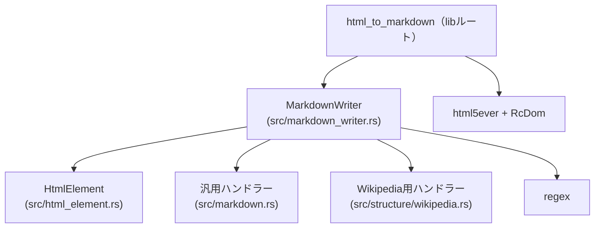
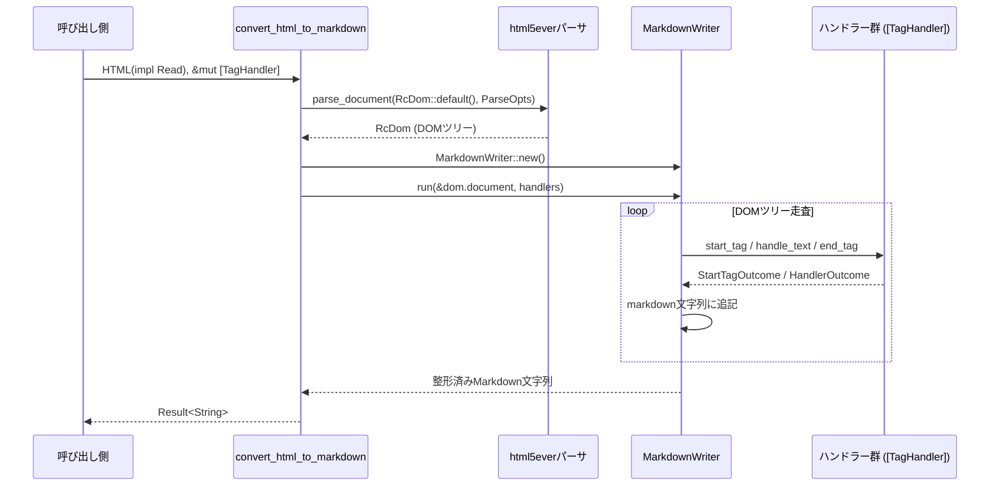

## 1. ざっくり一言

`html_to_markdown` クレートは、**HTML をパースして DOM を走査し、拡張可能なハンドラー群で Markdown 文字列を生成するライブラリ**です。  
汎用サイト向けのハンドラーに加え、Wikipedia の余分な要素を削除するためのハンドラーも含まれています。

---

## 2. このモジュールの役割

### 2.1 全体の概要

- HTML を `html5ever` + `markup5ever_rcdom` で DOM にパースします。
- DOM を `MarkdownWriter` が深さ優先で走査し、タグごと・テキストごとに `TagHandler` 実装へコールバックします。
- 各 `TagHandler` が見出し・段落・リスト・テーブル・コードブロックなどへの変換ルールを実装し、最終的な Markdown 文字列を構築します。
- Wikipedia 用の `HandleTag` 実装により、ページの「クローム」（ヘッダーやサイドバー、脚注リンクなど）を取り除いた Markdown を生成できます。

### 2.2 主なコンポーネント

- ルートモジュール (`html_to_markdown.rs`)
  - `convert_html_to_markdown` … HTML → Markdown のエントリポイント
  - `parse_html` … HTML → `RcDom` のパーサ（非公開）
  - `pub use` で `HtmlElement`, `MarkdownWriter`, `TagHandler`, `HandleTag` などを再公開
- `html_element` モジュール
  - `HtmlElement` … タグ名・属性を扱う軽量ラッパー
- `markdown_writer` モジュール
  - `MarkdownWriter` … DOM を巡回し Markdown を構築する中心クラス
  - `HandleTag` トレイト / `TagHandler` 型エイリアス / `StartTagOutcome` / `HandlerOutcome`
- `markdown` モジュール
  - 汎用サイト向けのタグハンドラー群  
    （段落・見出し・リスト・テーブル・強調・コードなど）
- `structure::wikipedia` モジュール
  - Wikipedia から引用・サイドバー・検索フォームなどを取り除くハンドラー群
  - Wikipedia のコードブロック（言語付き）を Markdown に変換するハンドラー

### 2.3 モジュール間の依存関係

主要モジュール間の依存関係は次のようになっています。



- すべてのタグハンドラーは `HandleTag` トレイトを実装し、`MarkdownWriter` から呼び出されます。
- `HtmlElement` は DOM ノードのタグ情報・属性情報を扱う共通表現として、すべてのハンドラーから参照されます。

---

## 3. 主要な機能一覧

- **HTML → Markdown 変換**
  - `convert_html_to_markdown` に HTML とハンドラー配列を渡すと、Markdown 文字列が返ります。
- **タグハンドラーの拡張可能な仕組み**
  - `HandleTag` トレイトで、任意のタグに対する開始・終了・テキスト処理をカスタマイズ可能です。
- **汎用 HTML → Markdown 変換ハンドラー**
  - 段落: `ParagraphHandler`
  - 見出し: `HeadingHandler`
  - リスト: `ListHandler`
  - テーブル: `TableHandler`
  - 強調/斜体: `StyledTextHandler`
  - コード（インライン/ブロック）: `CodeHandler`
  - ページクローム削除: `WebpageChromeRemover`
- **Wikipedia 専用ハンドラー**
  - ページクローム + 引用リンク削除: `WikipediaChromeRemover`
  - インフォボックス削除: `WikipediaInfoboxHandler`
  - ハイライトされたコードブロック → Markdown コードフェンス: `WikipediaCodeHandler`
- **HTML 要素ユーティリティ**
  - インライン要素かどうかの判定: `HtmlElement::is_inline`
  - 属性取得: `HtmlElement::attr`
  - class 操作: `HtmlElement::classes`, `has_class`, `has_any_classes`

---

## 4. 関数・構造体の解説

### 4.1 代表的な型一覧

| 名前 | 種別 | 定義場所 | 役割 / 用途 |
|------|------|----------|-------------|
| `HtmlElement` | 構造体 | `src/html_element.rs` | タグ名と属性 (`Vec<Attribute>`) を保持し、インライン判定や class 操作を行う |
| `MarkdownWriter` | 構造体 | `src/markdown_writer.rs` | DOM を走査し、ハンドラーを呼び出しながら Markdown 文字列を構築する |
| `StartTagOutcome` | enum | `src/markdown_writer.rs` | タグ開始時に「子孫を辿るか / スキップするか」を指示する (`Continue` / `Skip`) |
| `HandlerOutcome` | enum | `src/markdown_writer.rs` | テキスト処理が「処理済みか / スルーか」を示す (`Handled` / `NoOp`) |
| `HandleTag` | トレイト | `src/markdown_writer.rs` | タグ開始・終了・テキスト処理のコールバックインターフェース |
| `TagHandler` | 型エイリアス | `src/markdown_writer.rs` | `Rc<RefCell<dyn HandleTag>>`。ハンドラーの共有・内部可変を許可する |
| `WebpageChromeRemover` | 構造体 | `src/markdown.rs` | `<head>`, `<script>`, `<style>`, `<nav>` を丸ごとスキップする |
| `ParagraphHandler` | 構造体 | `src/markdown.rs` | 段落タグやインライン要素の前後の空白・改行を整形する |
| `HeadingHandler` | 構造体 | `src/markdown.rs` | `<h1>`〜`<h6>` を `#`〜`######` に変換する |
| `ListHandler` | 構造体 | `src/markdown.rs` | `<ul>`, `<ol>`, `<li>` を Markdown のリスト記法に変換する |
| `TableHandler` | 構造体 | `src/markdown.rs` | `<table>` を Markdown の表記法に変換する（ヘッダー行・区切り行を生成） |
| `StyledTextHandler` | 構造体 | `src/markdown.rs` | `<strong>`, `<em>` を `**` / `_` で囲む |
| `CodeHandler` | 構造体 | `src/markdown.rs` | `<code>`, `<pre>` をインライン/ブロックコードに変換する |
| `WikipediaChromeRemover` | 構造体 | `src/structure/wikipedia.rs` | Wikipedia の脚注リンクやサイドバー等の HTML をスキップする |
| `WikipediaInfoboxHandler` | 構造体 | 同上 | `class="infobox"` の `<table>` をスキップする |
| `WikipediaCodeHandler` | 構造体 | 同上 | Wikipedia のコードハイライトブロックから言語付きコードフェンスを生成する |

以下では、とくに中心的な関数・メソッドを 5 つ取り上げて詳しく説明します。

---

### 4.2 重要関数・メソッドの詳細

#### `convert_html_to_markdown(html: impl Read, handlers: &mut [TagHandler]) -> Result<String>`

**概要**

- 与えられた HTML（`Read` 実装）をパースし、指定したハンドラー群を用いて Markdown 文字列に変換します。
- ライブラリ利用者が最初に呼び出す入口となる関数です。

**引数**

| 引数名 | 型 | 説明 |
|--------|----|------|
| `html` | `impl Read` | HTML を読み出すストリーム。`&[u8]` や `std::fs::File` などが利用可能です。 |
| `handlers` | `&mut [TagHandler]` | タグ処理を行うハンドラー群。順番はテキスト処理の優先度に影響します。 |

**戻り値**

- `anyhow::Result<String>`  
  - `Ok(markdown)` … 変換に成功した場合の Markdown 文字列  
  - `Err(e)` … HTML パースや変換中のエラー

**内部処理の流れ**

1. `parse_html(html)` を呼び出し、`RcDom` に変換します。
2. `MarkdownWriter::new()` でライターを生成します。
3. `markdown_writer.run(&dom.document, handlers)` を実行して DOM 全体を走査し Markdown を生成します。
4. 途中のエラーは `anyhow::Context` を用いて `"failed to parse HTML"` / `"failed to convert HTML to Markdown"` というメッセージを付与してラップします。

**Errors / Panics**

- パース時に HTML が不正で `html5ever` がエラーを返した場合、`Err` になります。
- 関数自体は `panic!` を発生させるコードを含みません。

**Edge cases（代表例）**

- `handlers` が空の場合  
  → DOM は走査されますが、テキストはすべてデフォルト動作で連結されるだけになり、Markdown 特有の装飾は付きません。
- `html` が空ストリームの場合  
  → 空文字列（または空白のみ）の Markdown が返ります（終了時に `trim()` されます）。

**使用例**

```rust
use std::cell::RefCell;                // Rc<RefCell<...> 用
use std::rc::Rc;
use html_to_markdown::{               // クレートの公開 API をインポート
    convert_html_to_markdown,
    markdown,                          // 標準ハンドラー群が入ったモジュール
    TagHandler,                        // ハンドラー用の型エイリアス
};

fn main() -> anyhow::Result<()> {
    let html = r#"<h1>Title</h1><p>Hello <strong>world</strong>.</p>"#;

    // 使用するハンドラーを用意する
    let mut handlers: Vec<TagHandler> = vec![
        Rc::new(RefCell::new(markdown::ParagraphHandler)),
        Rc::new(RefCell::new(markdown::HeadingHandler)),
        Rc::new(RefCell::new(markdown::StyledTextHandler)),
        Rc::new(RefCell::new(markdown::CodeHandler)),
    ];

    // HTML を Markdown に変換する
    let markdown = convert_html_to_markdown(html.as_bytes(), &mut handlers)?;

    println!("{markdown}");
    Ok(())
}
```

---

#### `MarkdownWriter::run(self, root_node: &Handle, handlers: &mut [TagHandler]) -> Result<String>`

**概要**

- DOM のルートノードから再帰的に走査し、ハンドラーを介して Markdown 文字列を構築します。
- 走査後、簡単な整形（改行数の整理・前後の空白除去）を行います。

**引数**

| 引数名 | 型 | 説明 |
|--------|----|------|
| `self` | `self` | 新しく生成された `MarkdownWriter` インスタンス（値として消費されます）。 |
| `root_node` | `&Handle` | 走査を開始する DOM ノード（通常 `&dom.document`）。 |
| `handlers` | `&mut [TagHandler]` | タグとテキストを処理するハンドラー群。 |

**戻り値**

- `Result<String>`  
  - 成功時: Markdown 文字列  
  - 失敗時: ハンドラー内で発生したエラー（現状、標準ハンドラーはエラーを返していません）

**内部処理の流れ**

1. `self.visit_node(root_node, handlers)?` を呼び出し、DOM 全体を深さ優先で走査します。
2. 走査完了後、`Self::prettify_markdown(self.markdown)` で整形を行います。
   - 連続した 3 個以上の改行を 2 個に短縮。
   - 文字列全体の前後の空白を `trim()` で削除。
3. 整形済み Markdown を返します。

**Edge cases**

- DOM の深さが非常に深い場合、`visit_node` 内の制限（`current_element_stack.len() < 200`）に達すると、それ以上深い階層の子ノードは走査されません。

**使用上の注意点**

- ライブラリ利用者がこのメソッドを直接呼ぶ場面は少なく、基本的には `convert_html_to_markdown` を通して利用する想定の構造になっています。

---

#### `MarkdownWriter::visit_node(&mut self, node: &Handle, handlers: &mut [TagHandler]) -> Result<()>`

**概要**

- 単一の DOM ノードに対して
  - 必要なら `HtmlElement` を構築し `start_tag` を呼ぶ
  - 子ノードを（深さ制限付きで）再帰的に走査する
  - 終了時に `end_tag` を呼ぶ  
 という処理を行います。

**内部処理（簡略版）**

1. `node.data` の種類に応じて分岐:
   - `NodeData::Document` / `Doctype` / `ProcessingInstruction` / `Comment`  
     → 現状は何もせず子ノードだけを走査します。
   - `NodeData::Element { name, attrs, .. }`  
     → `HtmlElement::new(name.local.to_string(), attrs.clone())` で要素を生成。
   - `NodeData::Text { contents }`  
     → `visit_text(contents.borrow().to_string(), handlers)?` を呼び出し、テキストを処理。
2. `HtmlElement` が生成された場合:
   - `start_tag` を呼び出し、戻り値を確認。
     - `StartTagOutcome::Skip` の場合、そのノードと子孫は走査せず終了。
     - `Continue` の場合、その要素を `current_element_stack` に push。
3. `current_element_stack.len() < 200` のときのみ、子ノードを走査します。
4. 最後に、`current_element_stack` から要素を pop し、`end_tag` を呼び出します。

**使用上の注意点**

- `StartTagOutcome::Skip` を返したハンドラーがある場合、その要素の子ノードも含めて丸ごとスキップされます（`end_tag` も呼ばれません）。  
  これは `WebpageChromeRemover` や `WikipediaChromeRemover` などの「何かを丸ごと消す」用途に使われています。

---

#### `MarkdownWriter::visit_text(&mut self, text: String, handlers: &mut [TagHandler]) -> Result<()>`

**概要**

- テキストノードをハンドラーへ渡し、どのハンドラーも処理しなかった場合はデフォルトルールで Markdown に追記します。

**処理の流れ**

1. すべての `handlers` に対して、順番に `handle_text(&text, self)` を呼び出します。
   - どれかが `HandlerOutcome::Handled` を返した時点で処理を終了（以降のハンドラーとデフォルト処理は行わない）。
2. すべてが `NoOp` を返した場合、デフォルト処理として:
   - `trim_matches` で `\n`, `\r`, `\t` を前後から削除。
   - 残りの `\n` を `" "` に置き換え。
   - 結果の文字列を `self.push_str()` で Markdown に追記。

**Edge cases**

- `<pre>` 内のテキストは `CodeHandler` / `WikipediaCodeHandler` が `Handled` を返すため、デフォルト処理ではなく「そのまま」のテキストが出力されます。
- 改行やタブのみからなるテキストは、デフォルト処理では基本的に空文字に近い扱いとなります。

---

#### `HtmlElement::has_any_classes(&self, classes: &[&str]) -> bool`

**概要**

- 要素が指定されたクラス群のうち 1 つでも持っているかどうかを判定します。
- Wikipedia 向けハンドラーなどで、特定のクラスをもつ要素をスキップするために使われています。

**引数**

| 引数名 | 型 | 説明 |
|--------|----|------|
| `classes` | `&[&str]` | 判定対象としたいクラス名の配列 |

**戻り値**

- `bool` … 指定されたクラスのうち 1 つでも class 属性に含まれていれば `true`。

**内部処理の要点**

- `self.attrs` の中から `name.local == "class"` の属性を探し、その値を `' '` で分割します。
- 各クラス名を `trim()` し、その結果が `classes` に含まれているかをチェックします。
- 1 つでも一致が見つかれば `true` を返します。

**使用例（Wikipedia のクラス判定）**

```rust
use html_to_markdown::html_element::HtmlElement;

// 実際には MarkdownWriter 内部で HtmlElement が作られるため、
// ハンドラーからは &HtmlElement を受け取って使用します。
fn should_skip(tag: &HtmlElement) -> bool {
    let classes_to_skip = ["noprint", "mw-editsection", "mw-jump-link"];
    tag.has_any_classes(&classes_to_skip)
}
```

---

### 4.3 ハンドラーの振る舞い（概要）

ここでは、主要なハンドラーがどのタグで何をするかを簡潔にまとめます。

| ハンドラー | 対象タグ | 主な処理 |
|-----------|----------|---------|
| `WebpageChromeRemover` | `head`, `script`, `style`, `nav` | 対象タグとその子孫サブツリーをスキップ |
| `ParagraphHandler` | すべて | `<p>` の前に空行を追加。段落内インライン要素の前に必要なスペースを追加。 |
| `HeadingHandler` | `h1`〜`h6` | 開始タグで `\n\n#`〜`\n\n######` を出力し、終了タグで空行を追加。 |
| `ListHandler` | `ul`, `ol`, `li` | `<li>` 開始時に `-`、終了時に改行。リスト全体の前後にも改行を挿入。 |
| `TableHandler` | `table` 系タグ | `<th>` で列数をカウントし、ヘッダー行後に `| ---` の区切り行を出力。各セルを `|` 区切りで出力。 |
| `StyledTextHandler` | `strong`, `em` | 開始・終了時に `**`, `_` を出力して強調・斜体を表現。 |
| `CodeHandler` | `code`, `pre` | `<code>` をインラインコード `` `...` `` に、`<pre>` を ``` ``` ブロックとして出力。 |
| `WikipediaChromeRemover` | すべて（内容に応じて） | `sup.reference`（脚注）、一部 `div/span/a`（サイドバーや検索フォームなど）、`head/script/style/nav` をスキップ。 |
| `WikipediaInfoboxHandler` | `table.infobox` | インフォボックスを丸ごとスキップ。 |
| `WikipediaCodeHandler` | `div`, `pre`, `code` | `mw-highlight-lang-<lang>` クラスから言語名を抽出し、 ```lang ブロックとしてコードを出力。 |

---

## 5. データフロー

### 5.1 全体の処理フロー

HTML から Markdown への変換フローは、概ね次のようになります。



要点:

- DOM 走査は深さ優先で行われ、各ノード到達時に `HandleTag` 実装へコールバックされます。
- テキストノードは、ハンドラーが `Handled` を返さなかった場合のみ、標準ルールで Markdown に連結されます。
- ブロックコード（`<pre>`）や Wikipedia のコードブロックのように、特殊な処理が必要なテキストは該当ハンドラーが先に `Handled` として確保します。

---

## 6. 使い方（How to Use）

### 6.1 基本的な使用方法

もっとも基本的な使い方は、**汎用ハンドラーを組み合わせて HTML を Markdown に変換する**形です。

```rust
use std::cell::RefCell;                          // Rc<RefCell<...> 用
use std::rc::Rc;
use html_to_markdown::{
    convert_html_to_markdown,                    // メインの変換関数
    markdown,                                    // 汎用ハンドラーが定義されたモジュール
    TagHandler,                                  // ハンドラー用の型
};

fn main() -> anyhow::Result<()> {
    // 変換対象の HTML
    let html = r#"
        <h1>Example</h1>
        <p>Hello <strong>world</strong>!</p>
        <ul><li>one</li><li>two</li></ul>
    "#;

    // 使用するハンドラー群を組み立てる
    let mut handlers: Vec<TagHandler> = vec![
        Rc::new(RefCell::new(markdown::ParagraphHandler)),      // 段落・インライン要素の整形
        Rc::new(RefCell::new(markdown::HeadingHandler)),        // 見出し
        Rc::new(RefCell::new(markdown::ListHandler)),           // リスト
        Rc::new(RefCell::new(markdown::TableHandler::new())),   // テーブル
        Rc::new(RefCell::new(markdown::StyledTextHandler)),     // strong/em
        Rc::new(RefCell::new(markdown::CodeHandler)),           // code/pre
        Rc::new(RefCell::new(markdown::WebpageChromeRemover)),  // head/script 等を除去（任意）
    ];

    // HTML を Markdown に変換
    let markdown = convert_html_to_markdown(html.as_bytes(), &mut handlers)?;

    println!("{markdown}");
    Ok(())
}
```

ポイント:

- `TagHandler` は `Rc<RefCell<dyn HandleTag>>` なので、`Rc::new(RefCell::new(...))` で包んで渡します。
- ハンドラーの順番は、`handle_text` の優先度（`Handled` で打ち切り）に影響します。

### 6.2 よくある使用パターン

#### 6.2.1 Wikipedia から記事本文だけを Markdown にする

Wikipedia から取得した HTML を、脚注・サイドバーなどを除去して Markdown にしたい場合の例です。

```rust
use std::cell::RefCell;
use std::rc::Rc;
use html_to_markdown::{
    convert_html_to_markdown,
    markdown,            // 汎用ハンドラー
    TagHandler,
    structure::wikipedia // Wikipedia 用ハンドラー
};

fn wikipedia_to_markdown(html: &str) -> anyhow::Result<String> {
    let mut handlers: Vec<TagHandler> = vec![
        Rc::new(RefCell::new(markdown::ParagraphHandler)),
        Rc::new(RefCell::new(markdown::HeadingHandler)),
        Rc::new(RefCell::new(markdown::ListHandler)),
        Rc::new(RefCell::new(markdown::StyledTextHandler)),
        Rc::new(RefCell::new(wikipedia::WikipediaChromeRemover)),   // 脚注・サイドバー等を削除
        Rc::new(RefCell::new(wikipedia::WikipediaInfoboxHandler)),  // Infobox を削除（必要なら）
        Rc::new(RefCell::new(wikipedia::WikipediaCodeHandler::new())), // 言語付きコードブロック
    ];

    convert_html_to_markdown(html.as_bytes(), &mut handlers)
}
```

#### 6.2.2 独自ハンドラーの追加

特定のタグ（例: `<footer>`）を常に無視したい場合、`HandleTag` を実装した独自ハンドラーを追加できます。

```rust
use std::cell::RefCell;
use std::rc::Rc;
use html_to_markdown::{HandleTag, HtmlElement, MarkdownWriter, StartTagOutcome, TagHandler};

struct FooterRemover;

// HandleTag トレイトを実装する
impl HandleTag for FooterRemover {
    fn should_handle(&self, tag: &str) -> bool {
        tag == "footer"                             // footer タグだけ扱う
    }

    fn handle_tag_start(
        &mut self,
        _tag: &HtmlElement,
        _writer: &mut MarkdownWriter,
    ) -> StartTagOutcome {
        StartTagOutcome::Skip                       // 自身と子孫ノードを丸ごとスキップ
    }
}

fn build_handlers() -> Vec<TagHandler> {
    vec![
        Rc::new(RefCell::new(FooterRemover)),      // 先頭に追加してもよい
        // 他のハンドラー...
    ]
}
```

### 6.3 使用上の注意点

- **ハンドラーの順序**
  - `visit_text` では、ハンドラーは先頭から順に `handle_text` が呼ばれ、最初に `HandlerOutcome::Handled` を返したハンドラーで処理が打ち切られます。
  - 例: Wikipedia のコードブロックを `WikipediaCodeHandler` で処理し、その後に汎用 `CodeHandler` を使いたい場合、`WikipediaCodeHandler` を先に配置する必要があります。

- **ハンドラーの状態（ステートフルなもの）**
  - `TableHandler` は列数やフラグ（`is_first_th` など）を内部状態として持ちます。
  - `WikipediaCodeHandler` は一時的に言語名を保持します。
  - 同じインスタンスを複数回の変換で再利用することは可能ですが、前回の状態が残る可能性があるため、通常は都度 `new()` / `default()` で新しいインスタンスを作る構成になっています。

- **深いネストの制限**
  - `MarkdownWriter` は `current_element_stack.len() < 200` のときだけ子ノードを辿るため、**200 階層を超えるような非常に深いネスト**はそれ以上走査されません。

- **改行・空行の扱い**
  - `prettify_markdown` により、3 個以上連続する改行は 2 個に短縮されます。
  - 文字列全体の前後の空白は `trim()` で削除されます。

- **スレッド安全性**
  - `TagHandler` は `Rc<RefCell<_>>` で定義されており、**単一スレッド前提**の共有です。
  - 同じハンドラーを複数スレッドから同時に利用することは想定されていません。

---

## 7. 関連ファイル

| パス | 役割 / 関係 |
|------|------------|
| `html_to_markdown/Cargo.toml` | クレート名・バージョン・公開設定と、`anyhow`, `html5ever`, `markup5ever_rcdom`, `regex` などの依存を定義します。 |
| `html_to_markdown/src/html_to_markdown.rs` | ライブラリのルート。`convert_html_to_markdown` と `parse_html` を定義し、`HtmlElement` や `MarkdownWriter` 関連を再公開します。 |
| `html_to_markdown/src/html_element.rs` | `HtmlElement` 型と、インライン要素判定・属性 / class 操作のヘルパーメソッドを提供します。 |
| `html_to_markdown/src/markdown_writer.rs` | `MarkdownWriter` 本体と、タグハンドラーのための `HandleTag` トレイト・`TagHandler` 型など中核となる API を提供します。 |
| `html_to_markdown/src/markdown.rs` | 一般的な HTML → Markdown 変換のためのハンドラー群（段落・見出し・リスト・テーブル・強調・コード・クローム除去）を定義します。 |
| `html_to_markdown/src/structure.rs` | サブモジュール `wikipedia` を公開するためのモジュール。 |
| `html_to_markdown/src/structure/wikipedia.rs` | Wikipedia 向けのハンドラー（クローム除去・インフォボックス除去・コードブロック処理）および、それらを組み合わせたテストを含みます。 |

このディレクトリ全体で、「HTML をパースしてハンドラー駆動で Markdown に変換する」という一連の処理が完結する構成になっています。
