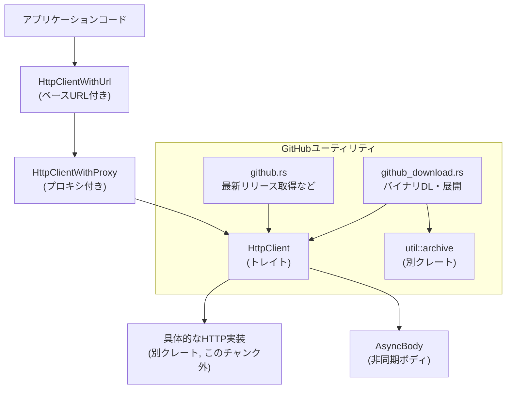
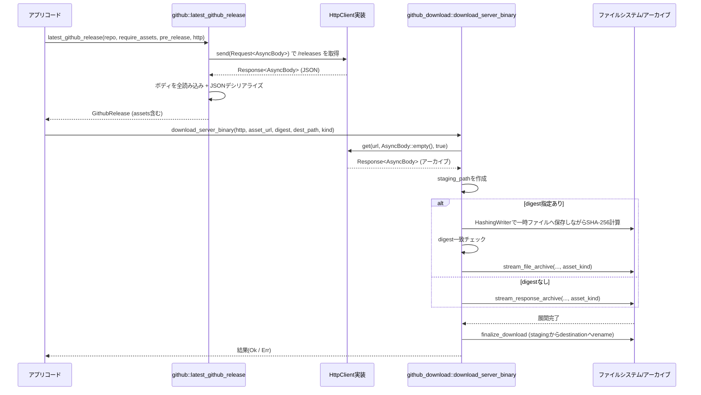

# http_client/ ディレクトリ解説

## 1. ざっくり一言

Zed / GPUI 向けの共通 HTTP クライアント抽象 (`HttpClient` トレイト) と、  
GitHub リリース情報の取得・バイナリのダウンロード／展開を行うユーティリティをまとめたモジュール群です。

---

## 2. このモジュールの役割

### 2.1 概要

- このディレクトリは **HTTP 通信を抽象化するための共通インターフェース** と  
  **GitHub からのリリース取得・バイナリ展開処理** を提供します。
- 具体的な HTTP 実装（実際にソケット通信するコード）は別クレートにあり、ここでは
  - トレイト `HttpClient`
  - ボディ表現 `AsyncBody`
  - プロキシ・ベース URL ラッパ
  を通じて統一的な使い方を定義しています。
- `github.rs` / `github_download.rs` は、この共通インターフェース上に構築された GitHub 用ユーティリティです（wasm 以外のターゲットのみ有効）。

### 2.2 アーキテクチャ内での位置づけ

`HttpClient` を中心とした依存関係は次のようになっています。



- `http_client.rs` が crate のエントリポイントであり、`async_body`, `github`, `github_download` を内包します。
- アプリケーションは、`HttpClientWithUrl` / `HttpClientWithProxy` を通じて `HttpClient` トレイトに依存し、具体実装とは疎結合になります。
- GitHub 関連の処理は、`HttpClient` とファイルシステム系クレート (`async_fs`, `tempfile`, `async-tar` など) に依存しています。

### 2.3 設計上のポイント（コードから読み取れる範囲）

- **HTTP クライアントの抽象化**
  - `HttpClient` トレイトで送信インターフェースだけを定義し、具象実装は別クレートに任せています。
  - GET / JSON POST はトレイトのデフォルトメソッドとして提供されています。
- **ボディ表現の統一**
  - `AsyncBody` によって、空・メモリ上のデータ・任意の `AsyncRead` ストリームを全て同じ型で扱います。
  - `http_body::Body` と `futures::AsyncRead` を両方実装しており、HTTP ライブラリとの橋渡しに使えます。
- **URL・プロキシの付加情報を合成**
  - `HttpClientWithProxy` でプロキシ URL を、`HttpClientWithUrl` でベース URL をラップします。
  - ベース URL に応じて Zed の API / Cloud / LLM 用ホスト名を切り替えるユーティリティを提供します。
- **GitHub リリースの扱い**
  - GitHub API v3 の JSON を `serde` の構造体 (`GithubRelease`, `GithubReleaseAsset`) にデシリアライズします。
  - リリースアセットの digest 文字列から `sha256:` プレフィックスを取り除く処理が含まれます。
- **安全なバイナリダウンロード**
  - アセットの SHA-256 チェックサムを検証した上で展開するルートがあります。
  - 一時ディレクトリ（または一時ファイル）への展開 → 成功したら目的のパスへ `rename`、失敗時はクリーンアップという二段階構造になっています。
- **テスト用のフェイククライアント**
  - `feature = "test-support"` 有効時のみ、`FakeHttpClient` によって任意の挙動を行う HTTP クライアントを作れます。

---

## 3. 主要な機能一覧

- `HttpClient` トレイト: 非同期 HTTP 送信の抽象化（`send` / `get` / `post_json`）
- `AsyncBody`: HTTP リクエスト・レスポンスボディの統一的な非同期表現
- プロキシ付きクライアント: `HttpClientWithProxy` による `HttpClient` のラップ
- ベース URL 付きクライアント: `HttpClientWithUrl` と各種 `build_*_url` メソッド
- GitHub リリース取得:
  - `latest_github_release`: 最新リリース一覧から条件に合うものを取得
  - `get_release_by_tag_name`: 特定タグのリリースを取得
  - `build_asset_url`: タグと形式から GitHub アセット URL を生成
- GitHub バイナリダウンロード:
  - `download_server_binary`: アセットをダウンロードし、任意ディレクトリに展開（必要に応じて SHA-256 検証）
  - `GithubBinaryMetadata`: ダウンロード済みバイナリのメタデータを JSON で入出力
- 環境変数からのプロキシ設定取得:
  - `read_proxy_from_env`, `read_no_proxy_from_env`
- テストサポート（`feature = "test-support"`）
  - `FakeHttpClient`: 任意のレスポンスを返す HTTP クライアント
  - 簡易 200 / 404 応答を行う `with_200_response`, `with_404_response`

---

## 4. 関数・構造体の解説

### 4.1 主な型一覧

| 名前 | 種別 | 役割 / 用途 |
|------|------|-------------|
| `AsyncBody` | 構造体 (newtype) | HTTP ボディの共通表現。空・メモリ上バイト列・任意の `AsyncRead` をラップし、`AsyncRead` と `http_body::Body` を実装します。 |
| `Inner` | enum | `AsyncBody` の中身のバリアント（`Empty` / `Bytes(Cursor<Bytes>)` / `AsyncReader`）。 |
| `Json<T>` | 構造体 (newtype) | `T: Serialize` を JSON にシリアライズして `AsyncBody` に変換するためのラッパ。 |
| `RedirectPolicy` | enum | リダイレクトの扱い方（`NoFollow` / `FollowLimit(u32)` / `FollowAll`）。`Request` の拡張情報として格納。 |
| `FollowRedirects` | 構造体 | `pub bool` 1 要素のラッパ。定義のみで、このチャンクには利用箇所はありません。 |
| `HttpRequestExt` | トレイト | `http::request::Builder` を拡張するユーティリティ（条件付き設定、リダイレクトポリシー設定）。 |
| `HttpClient` | トレイト | HTTP クライアントの共通インターフェース。`send`, `get`, `post_json`, `user_agent`, `proxy` を定義。 |
| `HttpClientWithProxy` | 構造体 | `Arc<dyn HttpClient>` をラップし、プロキシ URL を上書きして公開するクライアント。 |
| `HttpClientWithUrl` | 構造体 | ベース URL とプロキシ付きクライアントを持ち、Zed の API / Cloud / LLM 用 URL を組み立てる。 |
| `GitHubLspBinaryVersion` | 構造体 | GitHub LSP バイナリの名前・URL・ダイジェストを保持（このチャンクでは未使用）。 |
| `GithubRelease` | 構造体 (Deserialize) | GitHub API `/releases` のレスポンス 1 件を表す型。タグ名、プレリリースフラグ、アセット一覧などを保持。 |
| `GithubReleaseAsset` | 構造体 (Deserialize) | リリースの単一アセット（名前・ダウンロード URL・digest）。 |
| `AssetKind` | enum | GitHub アセットの形式（`TarGz`, `TarBz2`, `Gz`, `Zip`）を表現。 |
| `GithubBinaryMetadata` | 構造体 (Serialize/Deserialize) | ダウンロード済みバイナリのメタ情報（フォーマットバージョンと SHA-256 など）を JSON で保存。 |
| `BlockedHttpClient` | 構造体 | 全てのリクエストを PermissionDenied エラーで拒否する `HttpClient` 実装。 |
| `FakeHttpClient` | 構造体（`test-support` 時） | 任意のハンドラでレスポンスを生成できるテスト用 HTTP クライアント。 |

### 4.2 重要な関数・メソッド詳細（最大 7 件）

#### 1. `HttpClient::get(&self, uri: &str, body: AsyncBody, follow_redirects: bool)`

**概要**

- 任意の `HttpClient` 実装に対し、指定 URI へ GET リクエストを送るためのデフォルトメソッドです。
- リダイレクトポリシーを `bool` で簡易指定できます。

**引数**

| 引数名 | 型 | 説明 |
|--------|----|------|
| `uri` | `&str` | リクエスト先 URI（絶対 URL を想定）。 |
| `body` | `AsyncBody` | リクエストボディ。GET では通常 `AsyncBody::empty()` または `Default::default()`。 |
| `follow_redirects` | `bool` | `true` の場合は `RedirectPolicy::FollowAll`、`false` の場合は `NoFollow` を設定。 |

**戻り値**

- `BoxFuture<'static, anyhow::Result<Response<AsyncBody>>>`
  - 非同期に完了する HTTP レスポンス（ボディも `AsyncBody`）を返します。
  - `anyhow::Error` は、リクエスト構築失敗・HTTP 実装側のエラーなどに使われます。

**内部処理の流れ**

1. `http::request::Builder::new()` でビルダーを作成。
2. `.uri(uri)` で URI を設定。
3. `.follow_redirects(...)` で `RedirectPolicy` を拡張情報として付与。
4. `.body(body)` でボディを設定し、`Request<AsyncBody>` を組み立て。
5. `builder.body(...)` が `Ok` のときは `self.send(request)` を返す。
6. `Err` のときは `anyhow::Error` に変換して失敗 future を返す。

**Examples（使用例）**

```rust
use std::sync::Arc;
use http_client::{HttpClient, AsyncBody};

// 非具体的な HttpClient 実装があると仮定する                          // ここでは既存の HttpClient 実装がある前提
async fn fetch_text(client: Arc<dyn HttpClient>) -> anyhow::Result<String> { // テキストを取得する非同期関数
    // 空ボディ + リダイレクト追跡ありで GET を送る                     // GET でボディなし、リダイレクトは全て追跡
    let mut resp = client
        .get("https://example.com", AsyncBody::empty(), true)
        .await?;                                                           // レスポンスを待機

    // ボディをすべて読み込む                                            // ボディ全体をバイト列に読み込む
    use futures::AsyncReadExt;                                            // AsyncReadExt トレイトをインポート
    let mut buf = Vec::new();                                             // 読み込み先バッファ
    resp.body_mut().read_to_end(&mut buf).await?;                         // レスポンスボディを最後まで読む
    Ok(String::from_utf8_lossy(&buf).into_owned())                        // UTF-8 文字列として返す
}
```

**Errors / エッジケース**

- URI が不正な場合、`builder.body` の段階で `Err` となり、即座に `anyhow::Error` が返されます。
- `follow_redirects` の値は、実際にどう解釈されるかは HTTP 実装側の責務です（このチャンクには実装はありません）。
- ボディは `AsyncBody` である必要があるため、別型のボディを使う場合は適宜 `AsyncBody` に変換する必要があります。

---

#### 2. `HttpClient::post_json(&self, uri: &str, body: AsyncBody)`

**概要**

- `Content-Type: application/json` ヘッダを付けて POST するためのデフォルトメソッドです。
- JSON エンコード自体は、この関数の外側で `Json<T>` → `AsyncBody` 変換として行います。

**引数**

| 引数名 | 型 | 説明 |
|--------|----|------|
| `uri` | `&str` | POST 先 URI。 |
| `body` | `AsyncBody` | JSON 文字列を含むボディ。`Json<T>` から自動変換可能。 |

**戻り値**

- `BoxFuture<'static, anyhow::Result<Response<AsyncBody>>>`（`get` と同様）

**内部処理**

1. `Builder::new().uri(uri).method(Method::POST)` で POST リクエストを構築。
2. `"Content-Type": "application/json"` ヘッダを付与。
3. `.body(body)` でボディを設定し、`self.send(request)` で送信。

**Examples（使用例）**

```rust
use http_client::{HttpClient, AsyncBody, Json};
use serde::Serialize;
use std::sync::Arc;

#[derive(Serialize)]
struct Payload {
    message: String,                                                       // JSON にしたいフィールド
}

async fn send_payload(client: Arc<dyn HttpClient>) -> anyhow::Result<()> {
    let payload = Payload {
        message: "hello".into(),                                           // メッセージをセット
    };

    // Json<T> を AsyncBody に変換                                          // Json ラッパから AsyncBody へ変換
    let body: AsyncBody = Json(payload).into();                            // serde_json::to_vec が内部で呼ばれる

    client
        .post_json("https://example.com/api", body)                        // JSON POST を送信
        .await?;                                                           // 結果はここでは使わない
    Ok(())
}
```

**Errors / エッジケース**

- `Json<T>` → `AsyncBody` 変換内の `serde_json::to_vec` が失敗すると `panic!` します。
  - これは `Json<T>` 実装内の `expect("failed to serialize JSON")` によるものです。
  - そのため、`Serialize` 実装が常に成功する型を想定した設計になっています。

---

#### 3. `HttpClientWithUrl::build_zed_api_url(&self, path: &str, query: &[(&str, &str)]) -> Result<Url>`

**概要**

- ベース URL（`https://zed.dev` など）とパス・クエリを組み合わせて、Zed の API 用 URL を構築します。
- いくつかのベース URL 文字列に対して、API ドメインへマッピングする規則が組み込まれています。

**引数**

| 引数名 | 型 | 説明 |
|--------|----|------|
| `path` | `&str` | `/v1/foo` のような API パス。 |
| `query` | `&[(&str, &str)]` | クエリパラメータの `key` / `value` のペア配列。 |

**戻り値**

- `Result<Url>`: クエリも含めた完全な URL。
  - ベース URL やパスが URL として不正な場合、`url::ParseError` 由来の `Err` を返します。

**内部処理**

1. `base_url()` で現在のベース URL（`String`）を取得。
2. `match base_url.as_ref()` で API ホストを決定:
   - `"https://zed.dev"` → `"https://api.zed.dev"`
   - `"https://staging.zed.dev"` → `"https://api-staging.zed.dev"`
   - `"http://localhost:3000"` → `"http://localhost:8080"`
   - その他 → ベース URL そのもの。
3. `Url::parse_with_params(format!("{base_api_url}{path}"), query)` で URL を生成。

**エッジケース・注意点**

- ベース URL に上記以外の値を設定した場合、その値がそのまま API ホストとして使われます。
- `path` は `/` から始まることを前提にした結合方法になっているため、
  - 末尾スラッシュの有無や `path` の形式に注意が必要です（結合ロジックは単純な文字列連結）。
- `query` のエンコードは `Url::parse_with_params` に任せています。

---

#### 4. `github::latest_github_release(...) -> anyhow::Result<GithubRelease>`

```rust
pub async fn latest_github_release(
    repo_name_with_owner: &str,
    require_assets: bool,
    pre_release: bool,
    http: Arc<dyn HttpClient>,
) -> anyhow::Result<GithubRelease>;
```

**概要**

- GitHub API `/repos/{owner}/{repo}/releases` を叩き、条件に合う最新リリースを 1 件返します。
- プレリリースかどうか・アセットが存在するかどうかでフィルタリングします。
- 環境変数 `GITHUB_TOKEN` があれば `Authorization: Bearer <token>` を付与します。

**主要引数**

| 引数名 | 型 | 説明 |
|--------|----|------|
| `repo_name_with_owner` | `&str` | `"owner/repo"` 形式のリポジトリ名。 |
| `require_assets` | `bool` | `true` の場合、アセット配列が空でないリリースのみ対象。 |
| `pre_release` | `bool` | `true` ならプレリリース、`false` なら通常リリースのみ対象。 |
| `http` | `Arc<dyn HttpClient>` | 通信に使用する HTTP クライアント。 |

**内部処理の流れ**

1. `https://api.github.com/repos/{repo}/releases` に GET リクエストを構築。
   - `.follow_redirects(RedirectPolicy::FollowAll)` を設定。
   - `std::env::var("GITHUB_TOKEN")` が `Ok` なら `Authorization` ヘッダを追加（`when_some` を利用）。
2. `http.send(request).await` でレスポンス取得。
3. レスポンスボディを `Vec<u8>` に `read_to_end` で読み込み。
4. ステータスコードがクライアントエラー (`4xx`) なら、ボディを文字列としてログに含めて `bail!`。
5. ボディを `serde_json::from_slice::<Vec<GithubRelease>>` でパース。
   - 失敗した場合は、エラーとレスポンス本文を `log::error!` しつつ `anyhow::bail!`。
6. `into_iter()` → `filter` で
   - `require_assets` が `true` の場合は `!release.assets.is_empty()` のものだけ残す。
   - `release.pre_release == pre_release` のものを `find` で 1 件取得。
7. 得られたリリースの `assets` について、
   - `asset.digest` が `Some(d)` かつ `d` が `"sha256:"` プレフィックス付きなら、それを取り除いた文字列に書き換える。
8. 加工した `GithubRelease` を返す。

**Errors / エッジケース**

- リリースが 1 件も条件に合わない場合、`context("finding a prerelease")?` により `anyhow::Error` になります。
- `GITHUB_TOKEN` がなくてもリクエストは送信されますが、GitHub のレートリミット等の影響を受けます。
- digest フィールドが `"sha256:..."` 以外の形式でも、そのまま `Some(String)` として残ります（削られるのは `"sha256:"` プレフィックスのみ）。

---

#### 5. `github::build_asset_url(repo_name_with_owner, tag, kind) -> Result<String>`

**概要**

- GitHub の「リファレンス付きタグアーカイブ」用 URL を組み立てます。
- タグに `/` などの特殊文字が含まれていても、`url::Url` によって適切にエスケープされます。

**引数**

| 引数名 | 型 | 説明 |
|--------|----|------|
| `repo_name_with_owner` | `&str` | `"owner/repo"` 形式。 |
| `tag` | `&str` | Git タグ名（`release/2.3.5` のように `/` を含んでもよい）。 |
| `kind` | `AssetKind` | `TarGz` / `TarBz2` / `Gz` / `Zip` のいずれか。 |

**処理のポイント**

1. ベース URL: `"https://github.com/{owner/repo}/archive/refs/tags"`.
2. `asset_filename = "{tag}.{extension}"` でファイル名を組み立て。
3. `url.path_segments_mut()?.push(&asset_filename)` でパスに追加。
4. `url.to_string()` を返す（`tag` に含まれる `/` などはパスセグメントとして URL エンコードされる）。

**テスト例から分かること**

- タグ `release/2.3.5` の場合:

  - `TarGz` →  
    `"https://github.com/microsoft/vscode-eslint/archive/refs/tags/release%2F2.3.5.tar.gz"`

  - `Zip` →  
    `"https://github.com/microsoft/vscode-eslint/archive/refs/tags/release%2F2.3.5.zip"`

---

#### 6. `github_download::download_server_binary(...) -> Result<(), anyhow::Error>`

```rust
pub async fn download_server_binary(
    http_client: &dyn HttpClient,
    url: &str,
    digest: Option<&str>,
    destination_path: &Path,
    asset_kind: AssetKind,
) -> Result<(), anyhow::Error>;
```

**概要**

- GitHub などから配布される圧縮バイナリアセットをダウンロードし、
  - 任意のディレクトリ（またはファイル）に展開し、
  - 必要であれば SHA-256 チェックサムを検証する
  処理を行います。

**主要引数**

| 引数名 | 型 | 説明 |
|--------|----|------|
| `http_client` | `&dyn HttpClient` | 通信に利用する HTTP クライアント。 |
| `url` | `&str` | ダウンロード元の URL。 |
| `digest` | `Option<&str>` | 期待する SHA-256（16 進小文字文字列） / `None` なら検証しない。 |
| `destination_path` | `&Path` | 展開後の最終的なディレクトリまたはファイルパス。 |
| `asset_kind` | `AssetKind` | アーカイブ形式（展開方法を決める）。 |

**内部処理の流れ**

1. `destination_path.parent()` を取り出し、`None` なら `bail!`。
2. `staging_path(parent, asset_kind)` で一時ディレクトリ（またはファイル）パスを生成。
   - `TarGz` / `TarBz2` / `Zip` → 一時ディレクトリ。
   - `Gz` → 一時ファイル。
3. `http_client.get(url, Default::default(), true).await` でアセットをダウンロード。
4. `extract_to_staging(body, digest, url, &staging_path, asset_kind).await` を呼び出し:
   - `Some(expected_sha_256)` の場合:
     1. 一時ファイルを作成し、`HashingWriter` 経由でレスポンスを丸ごと保存しつつ SHA-256 を計算。
     2. 計算結果と一致しなければ `ensure!` によりエラー。
     3. 成功時はファイルポインタを先頭へシークし、`stream_file_archive` で展開。
   - `None` の場合:
     1. レスポンスストリームをそのまま `stream_response_archive` に渡して展開。
5. 展開に失敗した場合は `cleanup_staging_path` でステージングを削除してからエラーを返す。
6. 展開に成功したら `finalize_download` で
   - 既存の `destination_path` を `remove_dir_all` で削除（失敗は無視）。
   - `async_fs::rename(staging_path, destination_path)` で atomically 移動。
7. `finalize_download` に失敗した場合もステージングをクリーンアップしてエラーを返す。

**エッジケース・注意点**

- `destination_path` がディレクトリかファイルかは `asset_kind` で決まります。
  - `Gz` → 単一ファイル想定。
  - それ以外 → ディレクトリ（アーカイブ展開）。
- digest が指定されている場合、SHA-256 が一致しないと展開は行われずエラーになります。
- 展開処理自体は `async_tar::Archive` や `util::archive::*` に委譲しているため、その詳細はこのチャンクにはありません。
- `staging_path` / `cleanup_staging_path` により、中途失敗時も一時ファイル・ディレクトリが残りにくいようになっていますが、削除失敗時は `log::warn!` ログを出すのみです。

---

#### 7. `GithubBinaryMetadata::{read_from_file, write_to_file}`

**概要**

- ダウンロード済みバイナリに付随するメタデータを JSON ファイルとして読み書きします。

**シグネチャ**

```rust
pub async fn read_from_file(metadata_path: &Path) -> Result<GithubBinaryMetadata>;
pub async fn write_to_file(&self, metadata_path: &Path) -> Result<()>;
```

**処理内容**

- `read_from_file`:
  1. `async_fs::read_to_string` で JSON テキストを読み込み。
  2. `serde_json::from_str` で `GithubBinaryMetadata` にデシリアライズ。
  3. 読み取り・パースに失敗した場合、`with_context` 付きの `anyhow::Error` を返す。

- `write_to_file`:
  1. `serde_json::to_string(self)` で文字列化。
  2. `async_fs::write` でファイルに書き込み。
  3. 失敗時はどちらも `with_context` で `Err`。

---

### 4.3 その他の補助関数・型（一覧）

| 名前 | 種別 | 役割（1 行） |
|------|------|--------------|
| `AsyncBody::empty` | 関数 | ボディ無し（意味的な「無」）を表す `AsyncBody` を生成します。 |
| `AsyncBody::from_reader` | 関数 | 任意の `AsyncRead + Send + Sync + 'static` をストリーミングボディとして包みます。 |
| `AsyncBody::from_bytes` | 関数 | `bytes::Bytes` をメモリ上のボディとして包みます。 |
| `impl From<T> for AsyncBody` | 実装 | `Bytes`, `Vec<u8>`, `String`, `&'static [u8]`, `&'static str`, `Option<T>` からの変換を提供します。 |
| `Json<T>` | ラッパ型 | `serde_json::to_vec` により `T` を JSON バイト列へシリアライズします。 |
| `HttpRequestExt::when` | メソッド | 条件が `true` のときだけビルダーに変化を適用します。 |
| `HttpRequestExt::when_some` | メソッド | `Option<T>` が `Some` のときだけビルダーに変化を適用します（GitHub トークン付与に使用）。 |
| `read_proxy_from_env` | 関数 | `ALL_PROXY` / `HTTPS_PROXY` などから最初に見つかった値を `Url` にパースします。 |
| `read_no_proxy_from_env` | 関数 | `NO_PROXY` / `no_proxy` のいずれかから値を取得します。 |
| `HttpClientWithUrl::build_zed_cloud_url*` | 関数群 | Cloud / LLM 用ベース URL を、ベース URL に応じて切り替えて組み立てます。 |
| `extract_tar_gz` / `extract_tar_bz2` / `extract_gz` | 関数 | 各圧縮形式のストリームを非同期に展開します。 |
| `stream_response_archive` / `stream_file_archive` | 関数 | HTTP レスポンス / 一時ファイルからアーカイブを展開する共通ルーチンです。 |
| `BlockedHttpClient` | 型 | すべての `send` を PermissionDenied エラーにするクライアントです。 |
| `FakeHttpClient` 系メソッド | テスト用 | 任意のハンドラを差し替えながら HTTP 応答をシミュレートします（`feature = "test-support"` 時のみ）。 |

---

## 5. データフロー

ここでは、GitHub のリリースからアセットを選び、バイナリをダウンロードして展開する一連の典型的なフローを示します。

### 5.1 GitHub リリース取得 → アセット展開のフロー



**要点**

- ネットワーク I/O はすべて `HttpClient` を通じて行われ、アプリ側は HTTP の具象実装を意識しません。
- バイナリ展開は一時パス → 本番パスへの `rename` で行われるため、部分的に壊れたディレクトリが残りにくい構造です。
- digest 指定ありの場合は、必ず SHA-256 検証を通過しないと展開処理に進みません。

---

## 6. 使い方（How to Use）

### 6.1 基本的な使用方法

#### ベース URL 付きクライアントで GET する

```rust
use http_client::{HttpClient, HttpClientWithUrl, AsyncBody};
use std::sync::Arc;

// 既存の HttpClient 実装を受け取る                                   // 実際には別クレートが HttpClient を実装している想定
async fn example_basic_get(raw_client: Arc<dyn HttpClient>) -> anyhow::Result<()> {
    // ベースURL + プロキシ設定なしでラップする                         // ベース URL を "https://zed.dev" に設定
    let client = HttpClientWithUrl::new(raw_client, "https://zed.dev", None); // HttpClientWithUrl を構築

    // ベースURLを使ってエンドポイント URL を構築                        // /health のようなパスから完全な URL を作る
    let url = client.build_url("/health");                                  // -> "https://zed.dev/health"

    // GET リクエストを送信                                                // 空ボディ + リダイレクト追跡あり
    let mut resp = client.get(&url, AsyncBody::empty(), true).await?;       // レスポンスを取得

    // ボディを読み込む                                                    // ここでは中身は利用しない
    use futures::AsyncReadExt;
    let mut buf = Vec::new();
    resp.body_mut().read_to_end(&mut buf).await?;
    println!("status = {}", resp.status());                                 // ステータスコードを表示

    Ok(())
}
```

### 6.2 よくある使用パターン

#### 条件付きでヘッダを付与する (`HttpRequestExt::when` / `when_some`)

`github.rs` と同様に、環境変数があればヘッダを付けるような書き方ができます。

```rust
use http_client::{HttpRequestExt, RedirectPolicy};
use http::Request;

fn build_request_with_optional_auth(url: &str) -> anyhow::Result<Request<AsyncBody>> {
    let token = std::env::var("MY_TOKEN").ok();                             // 環境変数からトークンを取得（無いかもしれない）

    let builder = Request::get(url)                                         // GET リクエストビルダー
        .follow_redirects(RedirectPolicy::FollowAll)                        // リダイレクトを追跡するポリシーを設定
        .when_some(token, |b, t| {                                          // token が Some のときだけヘッダを追加
            b.header("Authorization", format!("Bearer {t}"))                // Authorization ヘッダを付与
        });

    Ok(builder.body(AsyncBody::empty())?)                                   // 最後にボディを付けて Request を作る
}
```

#### GitHub リリースを取得してアセット URL を作る

```rust
use http_client::{github, HttpClient};
use std::sync::Arc;

async fn example_github_release(client: Arc<dyn HttpClient>) -> anyhow::Result<()> {
    // 最新の通常リリースで、アセットが少なくとも1つあるもの           // require_assets = true, pre_release = false
    let release = github::latest_github_release(
        "microsoft/vscode-eslint",
        true,
        false,
        client.clone(),
    ).await?;

    // 取得したタグからzipアセットURLを構築                               // AssetKind::Zip を指定してURLを組み立て
    let url = github::build_asset_url(
        "microsoft/vscode-eslint",
        &release.tag_name,
        github::AssetKind::Zip,
    )?;

    println!("Asset URL = {url}");
    Ok(())
}
```

### 6.3 使用上の注意点（まとめ）

- **`AsyncBody::empty` と「長さ 0 のボディ」の違い**
  - コメントにもある通り、`Empty` は「ボディが存在しない」という意味を表します。
  - 「存在はするが長さ 0」のボディとの扱いが HTTP 実装・サーバ側で異なる場合があります。
- **`Json<T>` のシリアライズ失敗は panic**
  - `Json<T> → AsyncBody` 変換で `serde_json::to_vec` に失敗すると `expect` により panic します。
  - 不正な `Serialize` 実装や自己参照構造などの特殊ケースで問題になり得ます。
- **ベース URL のマッピング**
  - `build_zed_api_url` / `build_zed_cloud_url*` は、特定の文字列にだけ特別なマッピングを行います。
    - 例: `"https://zed.dev"` → `"https://api.zed.dev"` など。
  - それ以外のベース URL を使う場合、文字列連結（`format!("{}{}", base_api_url, path)`）になる点に注意が必要です。
- **GitHub ダウンロード時の digest**
  - `download_server_binary` の `digest` に `"sha256:..."` といったプレフィックス付き文字列を渡すと、そのまま比較されます。
  - `latest_github_release` 内では `"sha256:"` プレフィックスを取り除いているため、そこから渡す場合は素の 16 進文字列になります。
- **`AssetKind` と実際のアーカイブ形式の整合性**
  - `asset_kind` が実際のファイル形式と一致しない場合、展開処理（`extract_tar_gz` など）が失敗します。
- **環境変数によるプロキシ設定**
  - `read_proxy_from_env` は `ALL_PROXY` / `HTTPS_PROXY` / `HTTP_PROXY` 等の最初に見つかった値を使います。
  - 不正な URL 文字列が設定されていると `Url::parse` に失敗し、結果として `None` が返ります。
- **テストサポートは feature 依存**
  - `FakeHttpClient` や `as_fake` メソッドは `feature = "test-support"` 有効時にのみコンパイルされます。
  - 本番バイナリでは利用できない前提で設計されています。

---

## 7. 関連ファイル

| パス | 役割 / 関係 |
|------|------------|
| `http_client/Cargo.toml` | クレートメタデータと依存関係定義。ライブラリのエントリポイントを `src/http_client.rs` に設定し、非 wasm ターゲット時に GitHub 関連機能を有効化しています。 |
| `http_client/src/http_client.rs` | クレートのメインモジュール。`AsyncBody` の re-export、`HttpClient` トレイト、各種ラッパクライアント（`HttpClientWithProxy`, `HttpClientWithUrl`）、プロキシ環境変数処理、ブロック用/テスト用クライアントを定義します。 |
| `http_client/src/async_body.rs` | HTTP ボディ用の型 `AsyncBody` と `Json<T>` を定義。`futures::AsyncRead` と `http_body::Body` を実装し、HTTP ライブラリとの橋渡しを行います。 |
| `http_client/src/github.rs` | GitHub API の `/releases` を扱うユーティリティ。リリース情報の取得・アセット種別 (`AssetKind`)・アセット URL 生成などを提供します。 |
| `http_client/src/github_download.rs` | GitHub などから配布されるアセットをダウンロードし、ハッシュ検証・展開・メタデータ保存を行う処理をまとめたモジュールです。`util::archive` や `async_fs`, `async-tar`, `async-compression`, `tempfile`, `sha2` に依存します。 |

このディレクトリ全体として、HTTP 通信を行う他クレートから見た「共通の土台」として利用できるような構造になっています。
