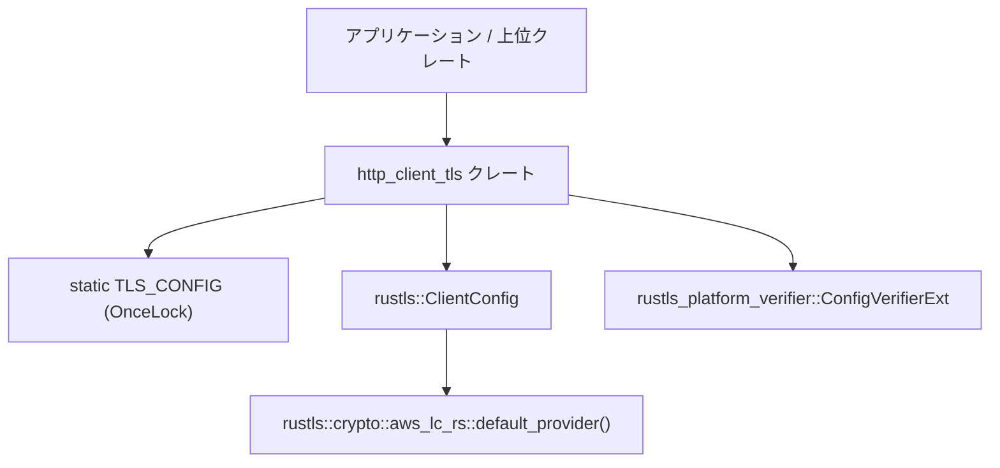
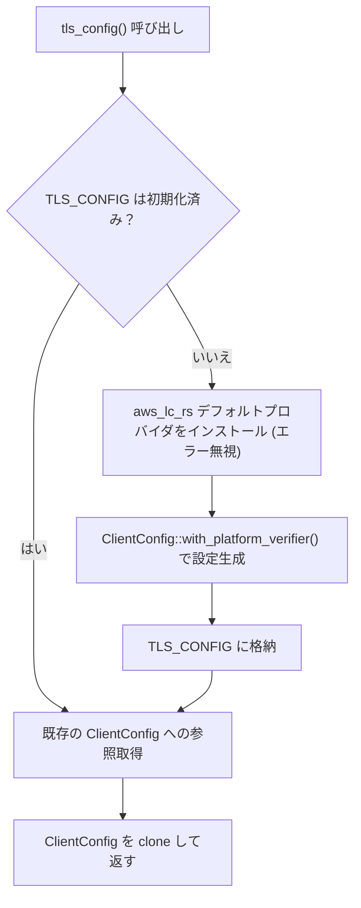
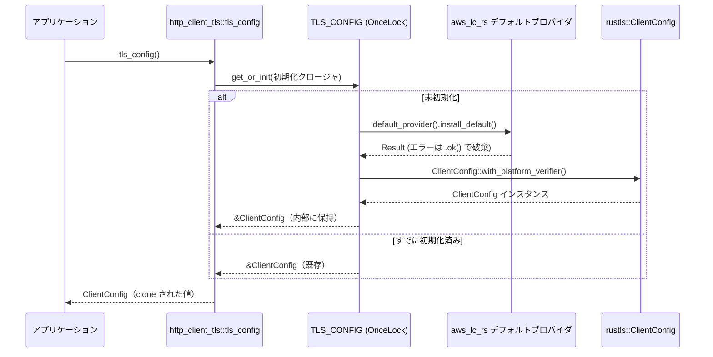

# http_client_tls/ ディレクトリ解説

## 1. ざっくり一言

`http_client_tls` クレートは、**`rustls::ClientConfig` を一度だけ初期化し、どこからでも再利用できる TLS クライアント設定を提供する**ための小さなヘルパークレートです。

---

## 2. このモジュールの役割

### 2.1 概要

- このディレクトリ（クレート）は、TLS 通信に必要な `rustls::ClientConfig` を
  - 適切な暗号プロバイダ（`aws_lc_rs`）をインストールした上で
  - プラットフォーム標準の証明書検証ロジックを有効にした構成で
  - スレッドセーフに一度だけ構築し再利用する
  ための機能を提供します。
- 利用側は `tls_config()` 関数を呼び出すだけで、共通の TLS 設定を取得できます。

### 2.2 アーキテクチャ内での位置づけ

このクレートは、他の HTTP クライアント関連クレートから参照される「TLS 設定プロバイダ」という位置づけと考えられます。

依存関係のイメージを Mermaid 図で示します。



- 上位クレートは `http_client_tls::tls_config()` を通じて TLS 設定を取得します。
- `tls_config()` 内部で `OnceLock` による一度きりの初期化が行われます。
- 初期化時に
  - `aws_lc_rs` ベースの暗号プロバイダをデフォルトとしてインストール
  - `rustls_platform_verifier::ConfigVerifierExt` の拡張メソッド `with_platform_verifier()` により、プラットフォーム依存の検証設定を適用
  が行われます（後者は命名からの推測を含みます）。

### 2.3 設計上のポイント

コードから読み取れる設計上の特徴は次のとおりです。

- **シングルトン的な TLS 設定**
  - `static TLS_CONFIG: OnceLock<ClientConfig>` により、TLS 設定を一度だけ構築し、以後は同じ設定を再利用します。
- **スレッドセーフな遅延初期化**
  - `OnceLock` は複数スレッドからの同時アクセスを安全に扱う標準ライブラリの型であり、初期化処理が一度だけ実行されるようになっています。
- **外部依存のカプセル化**
  - `rustls` および `rustls_platform_verifier` の具体的な初期化手順をこのクレート内に隠蔽し、利用側には単純な関数 (`tls_config()`) のみを公開しています。
- **暗号プロバイダの初期化エラーの無視**
  - `aws_lc_rs::default_provider().install_default()` の結果は `.ok()` により破棄されており、「すでにインストール済み」のようなエラーケースを無視する方針になっています（コメントでもその旨が明示されています）。

---

## 3. 主要な機能一覧

このクレートが提供する機能はシンプルで、ほぼ 1 点に集約されています。

- `tls_config()`:  
  - `rustls::ClientConfig` を
    - `aws_lc_rs` デフォルトプロバイダをインストール済み
    - `rustls_platform_verifier` によるプラットフォーム検証設定を適用済み
    の状態で一度だけ初期化し、そのクローンを返します。

---

## 4. 関数・構造体の解説

このクレート自身は独自の構造体や列挙体を定義していません。  
ここでは、公開されている静的変数と関数について説明します。

### 4.1 静的変数 `TLS_CONFIG`

```rust
static TLS_CONFIG: OnceLock<rustls::ClientConfig> = OnceLock::new();
```

**役割**

- `rustls::ClientConfig` を一度だけ生成し、スレッドセーフに保持するためのコンテナです。
- `OnceLock` は標準ライブラリの型で、最初に `set` または `get_or_init` された値を以後ずっと保持し、二重初期化を防ぎます。

**使用箇所**

- 外部から直接アクセスはされておらず、`tls_config()` 関数の内部でのみ利用されています。

**エッジケース**

- このコードでは `TLS_CONFIG` に直接 `set` する箇所はなく、`get_or_init` による初期化のみが使われています。そのため、
  - 最初の `tls_config()` 呼び出し時にのみ初期化ロジックが実行されます。
  - 以後の呼び出しでは既存の `ClientConfig` への参照を返すだけになります。

### 4.2 関数 `tls_config() -> ClientConfig`

```rust
pub fn tls_config() -> ClientConfig {
    TLS_CONFIG
        .get_or_init(|| {
            // rustls uses the `aws_lc_rs` provider by default
            // This only errors if the default provider has already
            // been installed. We can ignore this `Result`.
            rustls::crypto::aws_lc_rs::default_provider()
                .install_default()
                .ok();

            ClientConfig::with_platform_verifier()
        })
        .clone()
}
```

#### 概要

- TLS クライアント設定オブジェクト `rustls::ClientConfig` を返す公開関数です。
- 初回呼び出し時のみ、以下の初期化を行います。
  1. `aws_lc_rs` ベースの暗号プロバイダを「デフォルト」としてインストール
  2. `ClientConfig::with_platform_verifier()` を通して `ClientConfig` を生成
- 2 回目以降の呼び出しでは、すでに作成済みの `ClientConfig` を `clone()` して返します。

#### 引数

- 引数はありません。

#### 戻り値

- 戻り値の型: `rustls::ClientConfig`
- 意味:
  - このクレートで管理している共通 TLS 設定のクローンです。
  - クローンがどの程度内部状態を共有するかは `rustls::ClientConfig` の実装に依存します（コードからは詳細は分かりません）。

#### 内部処理の流れ

おおまかな処理のステップは次のとおりです。

1. `TLS_CONFIG.get_or_init(...)` を呼び出す。
   - 既に初期化済みであれば、その `&ClientConfig` を返す。
   - 未初期化であれば、クロージャ内の処理を実行して初期化する。
2. 初回の初期化クロージャの中で:
   1. `rustls::crypto::aws_lc_rs::default_provider().install_default().ok();`
      - `aws_lc_rs` を使う暗号プロバイダをデフォルトとしてインストールする。
      - もしすでに他の場所でデフォルトプロバイダがインストールされている場合などにはエラーになる可能性がありますが、`.ok()` によりエラーは破棄されます。
   2. `ClientConfig::with_platform_verifier()` を呼び出して `ClientConfig` を作成する。
      - `with_platform_verifier` は `rustls_platform_verifier::ConfigVerifierExt` というトレイトから提供される拡張メソッドです。
      - メソッド名から、プラットフォーム（OS）標準の証明書ストアや検証ロジックを利用する設定を構成していると推測できますが、コード断片からは詳細は分かりません。
3. `get_or_init` の戻り値は `&ClientConfig` なので、最後に `.clone()` して所有権を持つ `ClientConfig` を返す。

#### 簡易フローチャート



#### Examples（使用例）

この例では、`tls_config()` から取得した `ClientConfig` を使って、他の TLS/HTTP クライアント構築処理に渡すイメージを示します（具体的な HTTP クライアントの型はこのディレクトリには登場しないため、コメントで抽象的に表現しています）。

```rust
// http_client_tls クレートから tls_config 関数をインポートする
use http_client_tls::tls_config;

// 必要に応じて rustls::ClientConfig もインポートする（型を明示したい場合など）
use rustls::ClientConfig;

fn main() {
    // 共通の TLS 設定を取得する
    let tls: ClientConfig = tls_config();

    // ここで tls を HTTP クライアントの設定に渡すことが想定されます
    // 例:
    // let https_connector = SomeHttpClientBuilder::new()
    //     .with_tls_config(tls)
    //     .build();

    // 実際に何をするかは、このリポジトリの他のコードに依存するため
    // このチャンクだけからは詳細は分かりません。
}
```

#### Errors / Panics

コードから読み取れる範囲では、次のようになっています。

- `install_default()` のエラー:
  - コメントにあるとおり、「デフォルトプロバイダがすでにインストールされている場合」にエラーになる可能性があります。
  - しかし `.ok()` によって `Result` は無視されるため、この関数はそのエラーを外側に伝播しません。
- `get_or_init`:
  - `OnceLock::get_or_init` がパニックする条件は標準ライブラリの仕様によりますが、このコードからは特別なエラー処理は行っていません。
- `ClientConfig::with_platform_verifier()`:
  - 戻り値は値（`ClientConfig`）であり、`Result` ではありません。
  - この関数内でのエラー・パニック条件は `rustls_platform_verifier` の実装次第ですが、このチャンクからは判断できません。

#### Edge cases（エッジケース）

- **複数スレッドからの同時呼び出し**
  - `OnceLock` を使用しているため、複数スレッドが同時に `tls_config()` を実行しても、`ClientConfig` の初期化は一度だけ行われます。
- **すでに暗号プロバイダがインストール済み**
  - `install_default()` はその場合にエラーを返す可能性がありますが、`.ok()` により結果は捨てられます。
  - したがって、エラーが起きてもこの関数の挙動は変わらず、処理は継続されます。
- **繰り返し呼び出し**
  - 2 回目以降の `tls_config()` 呼び出しでは、初期化処理は行われず、既存の `ClientConfig` が再利用されます。
- **`ClientConfig` の clone の影響**
  - `clone()` によってどこまで状態が共有されるか（内部で `Arc` を共有するなど）は `rustls::ClientConfig` の実装に依存します。
  - このチャンクだけから、クローン後の設定変更が他のクローンに影響するかどうかは判断できません。

#### 使用上の注意点

- `tls_config()` が返す `ClientConfig` を変更する場合:
  - 変更が他の用途に影響するかどうかは `ClientConfig` の内部実装に依存するため、`rustls` のドキュメントを確認する必要があります。
- 独自に `rustls::crypto::aws_lc_rs::default_provider().install_default()` を別の場所でも呼び出すと、
  - デフォルトプロバイダの二重インストールを試みることになり、`install_default()` がエラーを返す可能性があります。
  - この関数ではそれを無視する設計ですが、他の箇所で同様の処理を行う場合は整合性に注意が必要です。
- この関数はグローバルな TLS 設定を提供する役割を持つため、
  - プロセス全体で TLS ポリシーを統一したい場合に適しています。
  - 逆に、接続ごとに大きく異なる TLS 設定を使い分けたい場合には、この共通設定のみでは不十分になる可能性があります。

---

## 5. データフロー

ここでは、「アプリケーションが初めて `tls_config()` を呼び出す」ケースのデータフローを示します。



要点:

- 初回呼び出し時のみ `aws_lc_rs` デフォルトプロバイダのインストールと `ClientConfig` の生成が行われます。
- 2 回目以降は `OnceLock` 内に保持された `ClientConfig` が即座に再利用されます。
- アプリケーション側は `ClientConfig` の値（クローン）だけを受け取り、内部での初期化手順を意識する必要はありません。

---

## 6. 使い方（How to Use）

### 6.1 基本的な使用方法

このクレートの基本的な使い方は、`tls_config()` を呼び出して `ClientConfig` を取得し、それを HTTP クライアントや TLS ストリームの設定に渡すことです。

```rust
// http_client_tls クレートから tls_config 関数をインポートする
use http_client_tls::tls_config;

// rustls::ClientConfig 型をインポートする（型を明示したい場合）
use rustls::ClientConfig;

fn main() {
    // 共通の TLS クライアント設定を取得する
    let tls_config: ClientConfig = tls_config();

    // 取得した設定を、任意の TLS / HTTP クライアントのビルダーに渡すことが想定されます
    // 例:
    // let client = SomeHttpClientBuilder::new()
    //     .with_tls_config(tls_config)
    //     .build()
    //     .unwrap();
}
```

この例では、`SomeHttpClientBuilder` などの具体的なクライアント型はこのディレクトリ内には定義されていないため、コメントで抽象的に表現しています。

### 6.2 よくある使用パターン

#### パターン 1: 複数のコンポーネントで共通 TLS 設定を利用する

アプリケーション内の複数のモジュールやコンポーネントが TLS を使う場合でも、各コンポーネントは単純に `tls_config()` を呼び出すだけで同一ポリシーの TLS 設定を利用できます。

```rust
use http_client_tls::tls_config;

fn component_a() {
    let tls = tls_config(); // コンポーネント A 用 TLS 設定
    // A 用の HTTP クライアントなどに渡す
}

fn component_b() {
    let tls = tls_config(); // コンポーネント B 用 TLS 設定
    // B 用の HTTP クライアントなどに渡す
}
```

- `component_a` と `component_b` のどちらが先に呼ばれても、初回に一度だけ設定が初期化されます。
- 両方とも、同じ基盤設定に基づく TLS 設定を利用することになります。

#### パターン 2: テストコードからの利用

`Cargo.toml` では `test-support` という空の feature が定義されています。

```toml
[features]
test-support = []
```

このチャンクには `test-support` 特有のコードは含まれていませんが、将来的にテスト専用の挙動を追加するためのフックとして用意されている可能性があります。現状では、テストコードでも通常のコードと同じように `tls_config()` を呼び出すだけです。

### 6.3 使用上の注意点（まとめ）

- **グローバルな TLS ポリシーを意識する**
  - このクレートはプロセス全体で共通の `ClientConfig` を提供する役割を持つため、「接続ごとに全く異なる TLS 設定を使う」といった用途には向きません。
- **暗号プロバイダの初期化重複に注意**
  - 他の場所で同様に `aws_lc_rs::default_provider().install_default()` を呼び出すと、どちらか一方（または両方）でエラーが発生します。
  - このクレート内では `.ok()` によりエラーを無視していますが、アプリケーション全体としてはどこでプロバイダを初期化するかを整理しておく必要があります。
- **`ClientConfig` の変更の影響範囲**
  - `tls_config()` の戻り値を変更した場合、その変更が他の呼び出しに影響するかどうかは `rustls::ClientConfig` の実装によります。
  - 安全のため、「共通設定はこのクレートで提供し、呼び出し側では基本的に変更しない」か、「変更が必要な場合は別途専用の `ClientConfig` を構築する」などの方針を取るのが無難です。
- **ドキュメントテスト (`doctest`)**
  - `Cargo.toml` の `[lib]` 設定で `doctest = true` が指定されています。
  - 将来、このファイルに `///` 形式のドキュメントコメントにコード例を追加すると、それらはテストとしてコンパイル・実行されます。

---

## 7. 関連ファイル

このディレクトリに含まれるファイルと、その役割は次のとおりです。

| パス | 役割 / 関係 |
|------|------------|
| `http_client_tls/Cargo.toml` | クレート名（`http_client_tls`）、バージョン、ライセンス、feature（`test-support`）、ライブラリエントリ (`src/http_client_tls.rs`)、依存関係（`rustls`, `rustls-platform-verifier`）などを定義します。 |
| `http_client_tls/src/http_client_tls.rs` | 実装本体。`static TLS_CONFIG` と公開関数 `tls_config()` を定義し、TLS クライアント設定の初期化と共有ロジックを提供します。 |

このチャンクにはテストコードや、`http_client_tls` を利用する他クレートのコードは含まれていないため、実際にどの HTTP クライアントと組み合わせているかなどの詳細は不明です。
