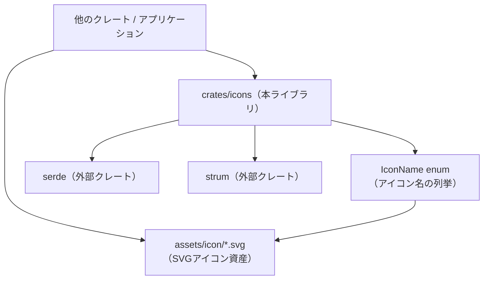
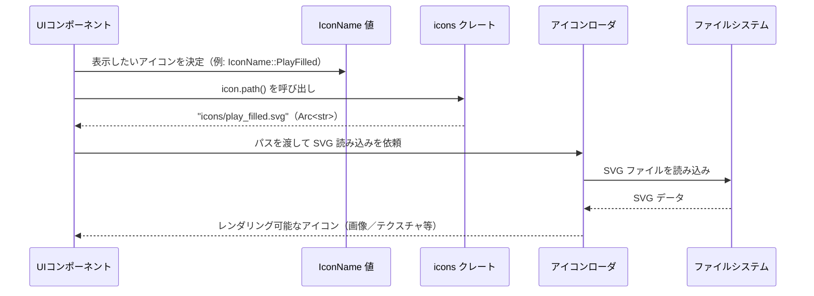

# crates/icons ディレクトリ

## 1. ざっくり一言

Zed 内で使われるアイコンを、列挙型 `IconName` として一元管理し、そのアイコンから対応する SVG ファイルパスを生成するための小さなライブラリクレートです。

---

## 2. このモジュールの役割

### 2.1 概要

- このクレートは、UI で使う多数のアイコンを **型安全な列挙型** として扱うために存在します。
- 列挙型 `IconName` でアイコンの種類を表現し、そこから `"icons/xxx.svg"` 形式の **ファイルパス文字列** を生成する機能を提供します。
- `serde` と `strum` を使って、文字列との相互変換や列挙・シリアライズも行えるようになっています。

### 2.2 アーキテクチャ内での位置づけ

このクレート自体は非常にシンプルで、他のクレートから「アイコン名の定義」と「パス生成」を提供するライブラリとして利用されます。



- 実際の SVG ファイルは `assets/icon` ディレクトリに置かれます（`README.md` に記載）。  
  このディレクトリ自体はこのチャンクには含まれていません。
- `icons/src/icons.rs` はクレートルートファイルとして機能し、`IconName` とそのメソッドを定義します。
- `serde` / `strum` は列挙型に対する周辺機能（シリアライズ、文字列パース、列挙など）を提供します。

### 2.3 設計上のポイント

- **アイコン名の集中管理**  
  すべてのアイコンを `IconName` 列挙体のバリアントとして定義することで、  
  「存在しないアイコン名」をコンパイル時に防ぎやすくなっています。
- **文字列との相互変換**  
  - `EnumString` + `#[strum(serialize_all = "snake_case")]` により、  
    `"play_filled"` のような snake_case 文字列から `IconName` へパースできます。
  - `IntoStaticStr` により、`IconName` を `'static` な文字列へ変換できます。
- **シリアライズ対応**  
  `Serialize, Deserialize` を derive しており、設定ファイルやプロトコルで `IconName` をそのまま扱えます  
  （※デフォルトでは **バリアント名そのまま** が使われます。`snake_case` ではありません）。
- **パス生成の一元化**  
  `IconName::path()` で `"icons/<snake_case>.svg"` という形式のパスを一貫して生成します。
- **共有可能な文字列**  
  パスの戻り値に `Arc<str>`（参照カウント付き文字列スライス）を使い、  
  複数箇所から同じパスをコストを抑えて共有できるようになっています。

---

## 3. 主要な機能一覧

- **アイコン名の列挙**: `IconName` 列挙体で、Zed で使うアイコン名をすべて列挙します。
- **アイコンからパスへの変換**: `IconName::path()` で、対応する SVG ファイルへのパス文字列を生成します。
- **文字列との相互変換（strum）**:
  - snake_case 文字列 → `IconName` へのパース（`EnumString`）
  - `IconName` → `'static` な文字列（`IntoStaticStr`）
- **シリアライズ／デシリアライズ（serde）**: `IconName` をそのまま JSON 等に保存・復元できます。
- **全バリアントの列挙（strum）**: `EnumIter` により、strum の API を通じて全てのアイコンを走査できます。

---

## 4. 関数・構造体の解説

### 4.1 型一覧

| 名前 | 種別 | 役割 / 用途 |
|------|------|-------------|
| `IconName` | 列挙体 (`enum`) | 利用可能なアイコン名をすべて列挙する型です。`serde` / `strum` の derive により、シリアライズ・パース・列挙・文字列変換が可能です。 |

`IconName` は次のような derive を持っています。

```rust
#[derive(
    Debug, PartialEq, Eq, Copy, Clone, EnumIter, EnumString, IntoStaticStr, Serialize, Deserialize,
)]
#[strum(serialize_all = "snake_case")]
pub enum IconName {
    AcpRegistry,
    AiAnthropic,
    // ...中略...
    ZedSrcExtension,
}
```

各 derive の意味（このコードから読み取れる範囲）:

- `Debug` / `PartialEq` / `Eq` / `Copy` / `Clone`  
  - デバッグ出力、比較、コピー・クローンをサポートします。
- `EnumIter`（strum）  
  - strum の API 経由で、列挙体の全バリアントを走査できるようになります。
- `EnumString`（strum）  
  - 文字列から `IconName` へパースできるようにします（`FromStr` 実装）。
- `IntoStaticStr`（strum）  
  - `IconName` を `'static` な文字列に変換できます（`self.into()` など）。
- `Serialize` / `Deserialize`（serde）  
  - `IconName` を JSON などへシリアライズ／デシリアライズできます。
- `#[strum(serialize_all = "snake_case")]`  
  - strum の文字列表現（`IntoStaticStr` や `EnumString` が扱う文字列）を snake_case に統一します。  
  - 例: `IconName::PlayFilled` → `"play_filled"`

> 補足: `serde` 用の `#[serde(rename_all = "...")]` は付いていないため、  
> serde 経由のシリアライズでは **`PlayFilled` のようなバリアント名そのまま** が使われます。

### 4.2 重要なメソッド

#### `IconName::path(&self) -> Arc<str>`

**概要**

- 列挙体の値（例: `IconName::PlayFilled`）から、  
  対応する SVG アイコンファイルのパス（`"icons/play_filled.svg"` のような形）を生成して返します。

**引数**

このメソッドは `&self` だけを引数に取るインスタンスメソッドです。

| 引数名 | 型 | 説明 |
|--------|----|------|
| `self` | `&IconName` | パスを取得したいアイコン名を表す列挙体の値です。 |

**戻り値**

- 型: `Arc<str>`
- 意味:
  - `"icons/<snake_case>.svg"` という形式のパス文字列を、参照カウント付き文字列スライスとして返します。
  - 同じパスを複数箇所で使う場合でも、`Arc` のクローンは軽量です。

**内部処理の流れ**

```rust
pub fn path(&self) -> Arc<str> {
    let file_stem: &'static str = self.into();
    format!("icons/{file_stem}.svg").into()
}
```

処理は次のように動きます。

1. `let file_stem: &'static str = self.into();`  
   - `IntoStaticStr` の実装を使って、`self`（`IconName`）を `'static` 文字列へ変換します。  
   - strum の設定により、この文字列は snake_case です（例: `"play_filled"`）。
2. `format!("icons/{file_stem}.svg")`  
   - `"icons/"` と `file_stem` と拡張子 `".svg"` を結合し、  
     `"icons/play_filled.svg"` のような `String` を作成します。
3. `.into()`  
   - `String` から `Arc<str>` への変換を行い、呼び出し元に返します。

**Examples（使用例）**

`IconName` からパスを取得する最も基本的な例です。

```rust
use std::sync::Arc;            // Arc 型を使うためのインポート
use icons::IconName;           // このクレートの IconName 列挙体をインポート

fn main() {
    let icon = IconName::PlayFilled; // 再生アイコン（塗りつぶし）のバリアントを選択
    let path: Arc<str> = icon.path(); // 対応する SVG パスを取得

    // &*path で Arc<str> から &str を取り出して比較
    assert_eq!(&*path, "icons/play_filled.svg");
}
```

このコードを実行すると、`IconName::PlayFilled` に対応するパスとして  
`"icons/play_filled.svg"` が生成されていることを検証できます。

**Errors / Panics**

- このメソッドはエラーを返さず、`panic!` も含まれていません。
- 常に `"icons/<snake_case>.svg"` 形式のパスを生成して返します。
- パスの指す SVG ファイルが実際に存在するかどうかは、このメソッドでは検証しません。

**Edge cases（エッジケース）**

- **未定義のアイコン**  
  - 列挙体のバリアントとして存在するものに対してのみ呼び出されるため、  
    「未定義のアイコン」に対するケースはコンパイル時に排除されます。
- **対応する SVG が存在しない場合**  
  - `IconName` にバリアントを追加した後、SVG ファイルをまだ作成していない場合など、  
    生成されたパスに対応するファイルがない可能性があります。  
  - その場合、実際にファイルを開く処理側でエラーになります。

**使用上の注意点**

- `IconName` にバリアントを追加した場合、  
  必ず同じ snake_case 名の SVG ファイルを `assets/icon` に追加する必要があります（README の記載）。
- `"icons/..."` という先頭パスは、このクレート内で固定されています。  
  実際のファイル配置（ビルド成果物内での配置など）と整合を取る必要があります。
- `path()` を頻繁に呼び出すと、そのたびに `String` → `Arc<str>` の割り当てが発生します。  
  同じパスを何度も使う場合は、返ってきた `Arc<str>` をクローンして使い回すと効率的です。

### 4.3 その他の機能（derive 経由で利用できるもの）

コード内に明示的な関数定義は `IconName::path` のみですが、  
derive により次のような機能が利用できます（詳細な API 名は strum / serde のドキュメントに従います）。

| 機能 | 提供元 | 概要 |
|------|--------|------|
| 列挙体の全バリアントの列挙 | `EnumIter`（strum） | strum のイテレータ API を使って、全ての `IconName` バリアントを走査できます。アイコンギャラリー表示などに使えます。 |
| 文字列からのパース | `EnumString`（strum） | snake_case 文字列（例: `"play_filled"`）から `IconName` へパースできます。 |
| 列挙体から `'static` 文字列へ変換 | `IntoStaticStr`（strum） | `IconName` から対応する snake_case 文字列（例: `"play_filled"`）を取得できます。 |
| シリアライズ／デシリアライズ | `Serialize`, `Deserialize`（serde） | JSON などに `IconName` をそのまま保存・復元できます（デフォルトではバリアント名の文字列を使います）。 |

---

## 5. データフロー

ここでは、「UI がアイコンを表示するために `IconName` を使って SVG パスを取得し、実際のアイコンを読み込む」流れを例として示します。



- `IconName` は **アイコンの論理名** を表し、その値から `path()` で **物理的な SVG ファイルのパス** を得ます。
- 実際のファイル読み込みとレンダリングは、このクレートの外側（`AssetLoader` や UI 側）の責務です。
- SVG ファイルが存在しない場合などのエラー処理も、このクレートではなく読み込み側で行う必要があります。

---

## 6. 使い方（How to Use）

### 6.1 基本的な使用方法

最も基本的な使い方は、「アイコン名を列挙体で選び、パスを取得する」ことです。

```rust
use std::sync::Arc;         // Arc 型をインポート
use icons::IconName;        // crates/icons クレートから IconName をインポート

fn main() {
    // 1. 表示したいアイコンを列挙体のバリアントとして選ぶ
    let icon = IconName::PlayFilled;       // 再生ボタンの塗りつぶしアイコン

    // 2. アイコンに対応する SVG ファイルのパスを取得する
    let path: Arc<str> = icon.path();      // "icons/play_filled.svg" が得られる

    // 3. 必要に応じて &str にしてファイルローダへ渡す
    let path_str: &str = &*path;           // Arc<str> から &str へ変換
    println!("icon path = {}", path_str);  // 実際のパスを表示
}
```

この例では標準出力にパスを出していますが、実際にはこのパスを使って SVG ファイルを読み込み、UI で描画します。

### 6.2 よくある使用パターン

#### パターン1: 文字列からアイコンを決める（strum でのパース）

設定ファイルなどで snake_case のアイコン名を保存し、それを `IconName` に変換して使うパターンです。

```rust
use std::str::FromStr;      // FromStr トレイトをインポート
use icons::IconName;        // IconName をインポート

fn load_icon_from_name(name: &str) -> Option<IconName> {
    // "play_filled" のような snake_case 文字列から IconName へ変換を試みる
    match IconName::from_str(name) {
        Ok(icon) => Some(icon), // 成功したら Some(IconName)
        Err(_e) => None,        // 不明な名前なら None を返す
    }
}
```

- `EnumString` + `#[strum(serialize_all = "snake_case")]` により、  
  `"play_filled"` → `IconName::PlayFilled` のような変換が可能です。
- 不正な名前の場合、`Err(...)` となります。

#### パターン2: 全てのアイコンを列挙してギャラリー表示（strum の列挙機能）

全アイコンを一覧表示したい場合などに、`EnumIter` を利用します。

```rust
use icons::IconName;              // IconName をインポート
use strum::IntoEnumIterator;      // EnumIter のためのトレイトをインポート

fn print_all_icons() {
    // IconName の全バリアントを列挙する
    for icon in IconName::iter() {
        let path = icon.path();   // 各アイコンに対応するパスを取得
        println!("{:?} -> {}", icon, &*path); // デバッグ表示とパスを出力
    }
}
```

- `EnumIter` の derive により、`IconName::iter()` のような形で全バリアントを得られます（strum の仕様に従います）。
- これを使ってアイコンプレビュー一覧を作ることができます。

#### パターン3: serde で設定に `IconName` を含める

アプリケーションの設定構造体の中に `IconName` を含め、serde で保存・読み込みする例です。

```rust
use icons::IconName;              // IconName をインポート
use serde::{Serialize, Deserialize}; // シリアライズ/デシリアライズ用トレイト
use serde_json;                   // JSON 用クレート（別途依存追加が必要）

#[derive(Serialize, Deserialize)]
struct Settings {
    icon: IconName,               // 設定の中に IconName を含める
}

fn example() -> serde_json::Result<()> {
    let settings = Settings {
        icon: IconName::PlayFilled,   // 何らかのアイコンを設定
    };

    // JSON 文字列へシリアライズ（例: {"icon":"PlayFilled"} という形）
    let json = serde_json::to_string(&settings)?;
    println!("serialized: {json}");

    // JSON から設定を復元
    let decoded: Settings = serde_json::from_str(&json)?;
    assert_eq!(decoded.icon, IconName::PlayFilled);

    Ok(())
}
```

- デフォルト設定では、JSON には **バリアント名そのまま**（例: `"PlayFilled"`）が書き出されます。
- strum の snake_case 設定は serde のシリアライズ形式には影響しません。

### 6.3 よくある間違い

```rust
use icons::IconName;

// 間違い例: パス文字列を直接ハードコードしてしまう
fn wrong() {
    let path = "icons/playfilled.svg"; // スペルミスに気づきにくい
    // 実際のファイル名は "play_filled.svg" など、snake_case である必要がある
}

// 正しい例: 列挙体からパスを取得する
fn correct() {
    let icon = IconName::PlayFilled; // コンパイラがバリアント名をチェックしてくれる
    let path = icon.path();          // snake_case のファイル名が一貫して生成される
}
```

- 文字列を直接書くと、スペルミスやリファクタリング時の漏れに気づきにくくなります。
- `IconName` を経由することで、コンパイル時に多くのミスを防ぎやすくなります。

```rust
use icons::IconName;
use serde_json;

// 間違い例: JSON 側で snake_case を期待してしまう
fn wrong_serde_usage() -> serde_json::Result<()> {
    let json = r#"{"icon":"play_filled"}"#; // JSON を snake_case で書いてしまう
    let result: Result<IconName, _> = serde_json::from_str(json); // 実際には構造体で受ける想定だが簡略化

    // この場合、"play_filled" という値は serde ではデフォルトで解釈できない
    assert!(result.is_err()); // エラーになる可能性が高い

    Ok(())
}
```

- strum の snake_case 設定と、serde のシリアライズ形式（デフォルトでは PascalCase）は別物です。
- JSON などで snake_case を使いたい場合は、`#[serde(rename_all = "snake_case")]` など、serde 側の設定が別途必要になります（このコードには含まれていません）。

### 6.4 使用上の注意点（まとめ）

- **アイコン追加時の命名規則**
  - README にある通り:
    - SVG ファイル名（`assets/icon` 内）は **snake_case**（例: `play_filled.svg`）。
    - `IconName` のバリアント名は **PascalCase**（例: `PlayFilled`）。
  - strum の snake_case 設定により、`IconName` とファイル名の対応がシンプルになります。
- **ファイル存在の保証はしない**
  - `IconName::path()` はパス文字列を生成するだけで、ファイルの存在を検証しません。
  - 実際の読み込み時には、ファイルの存在チェックやエラー処理が必要です。
- **serde と strum の名前形式の違い**
  - strum: snake_case 文字列と対応（`"play_filled"`）。
  - serde（デフォルト）: バリアント名そのまま（`"PlayFilled"`）。
  - 設定ファイルなどでどちらの形式を使うかを明確にしておく必要があります。
- **パフォーマンス上の注意**
  - `path()` 呼び出しごとに新しい `Arc<str>` が生成されます。
  - 同じパスを頻繁に使う場合は、一度取得した `Arc<str>` をクローンして使い回すと効率的です。

---

## 7. 関連ファイル

| パス | 役割 / 関係 |
|------|------------|
| `crates/icons/Cargo.toml` | `icons` クレートのマニフェストファイルです。ライブラリクレートとして設定され、`src/icons.rs` をクレートルートとすること、`serde` / `strum` を依存として持つことなどが記述されています。 |
| `crates/icons/src/icons.rs` | 本クレートのメインコードです。`IconName` 列挙体と `IconName::path()` メソッドを定義しています。 |
| `crates/icons/README.md` | アイコンデザインのガイドラインおよび、新しいアイコンを追加する手順が記載されています（SVG のビュー ボックスサイズ、ストローク幅、命名規則など）。 |
| `assets/icon/*.svg`（別ディレクトリ、README 記載） | 実際のアイコン SVG ファイルが置かれるディレクトリです。このチャンクには SVG ファイル自体は含まれていませんが、`IconName::path()` が生成するパスと対応させる必要があります。 |

このディレクトリ全体としては、`IconName` を中心に「アイコン名の定義」と「ファイルパスの規約」を提供し、実際の表示・読み込みは他のクレートに委ねる構造になっています。
