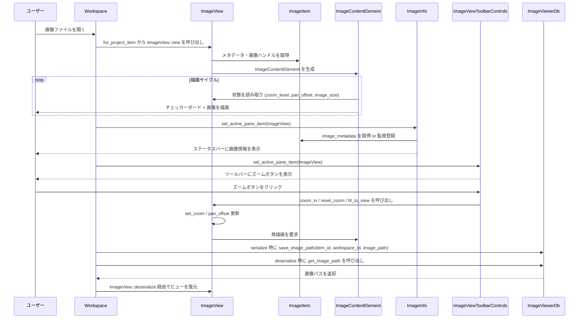

# 1. ざっくり一言

`image_viewer` クレートは、エディタ／ワークスペース上で画像ファイルを表示するためのビュー (`ImageView`) と、それに付随するツールバー・ステータスバー表示・永続化・設定をまとめたモジュール群です。

---

# 2. このモジュールの役割

## 2.1 概要

- このディレクトリは **画像ファイルをエディタ内で閲覧するためのビュー** を提供します。
- 具体的には、
  - 画像の描画（ズーム／パン／フィット）
  - タブやパンくずの表示、ファイルアイコンとの連携
  - ステータスバーでの画像情報表示（サイズ・フォーマット・色数など）
  - ツールバーからのズーム操作 UI
  - セッション間の画像ビューの復元用の DB 永続化
  - 「画像ファイルサイズの単位」を制御する設定
  をまとめて扱います。

## 2.2 アーキテクチャ内での位置づけ

このクレート内外の主要コンポーネントの関係を簡略化して示します。

```mermaid
graph TD
  subgraph image_viewerクレート
    IV[ImageView<br/>(画像ビュー)]
    ICE[ImageContentElement<br/>(描画要素)]
    II[ImageInfo<br/>(ステータスバー)]
    IVS[ImageViewerSettings<br/>(設定)]
    IVTC[ImageViewToolbarControls<br/>(ツールバー)]
    IVD[ImageViewerDb<br/>(永続化)]
  end

  IV --> ICE
  IV --> IVS
  IV --> IVD
  IV -->|メタデータ提供| II
  IVTC -->|ズーム操作| IV
  II -->|単位設定参照| IVS

  IV -->|画像項目参照| ImageItem[project::ImageItem]
  IV -->|プロジェクト参照| Project[project::Project]
  Project --> Workspace[workspace::Workspace]
  IVD --> WorkspaceDb[(WorkspaceDb)]
```

- `ImageView` が中心となり、`ImageItem` / `Project` / `Workspace` と連携してタブ・パンくず・永続化などと結びつきます。
- 表示そのものは `ImageContentElement` の `Element` 実装で行われます。
- ステータスバー (`ImageInfo`) とツールバー (`ImageViewToolbarControls`) は、それぞれ `StatusItemView` / `ToolbarItemView` としてワークスペースに統合される前提の構造になっています。
- `ImageViewerSettings` は `settings` クレートを通じてグローバル設定に統合されます。
- `ImageViewerDb` は `WorkspaceDb` と同じ DB 内に `image_viewers` テーブルを作成し、画像ビューの復元に使うパスを保存します。

## 2.3 設計上のポイント

コードから読み取れる特徴をまとめます。

- 責務の分割
  - `ImageView`: 画像ビュー本体（ズーム／パン、タブ・パンくず、永続化、Workspace との統合）
  - `ImageContentElement`: 実際の画像＋チェッカーボード背景の描画とレイアウト
  - `ImageInfo`: アクティブな画像のメタデータをステータスバーに表示
  - `ImageViewToolbarControls`: アクティブな画像ビュー向けのズーム系ツールバー
  - `ImageViewerSettings`: 画像ビューア固有の設定（ファイルサイズ表示単位）
  - `ImageViewerDb`: 画像ビューのための永続化テーブルとクエリ
- 状態管理
  - `gpui::Entity` と `Context` を用いて、画像ビュー (`ImageView`) を状態を持つ UI コンポーネントとして実装しています。
  - ズームレベルやパンオフセット、ドラッグ中かどうか (`last_mouse_position`) などはすべて `ImageView` の状態です。
  - ステータスバーやツールバーは `WeakEntity` と `Subscription` を用いてアクティブな `ImageView` の変化に追従します。
- イベント駆動
  - マウスホイール・ドラッグ・ピンチイベントからズーム／パンを行います。
  - `ImageItemEvent`（メタデータ更新・リロードなど）を購読してタイトルやパンくずを更新します。
  - 独自アクション (`ZoomIn` 等) を `actions!` マクロで定義し、キーボードショートカットからも操作できる前提の設計です。
- エラーハンドリング
  - DB 経由の復元 (`deserialize`) では `anyhow::Context` を使い、失敗時に文脈付きのエラーを返します。
  - 設定 (`ImageViewerSettings::from_settings`) は `unwrap` を用いているため、設定側に値が存在しないと panic する前提になっています。

---

# 3. 主要な機能一覧

このディレクトリが提供する主な機能を整理します。

- 画像ビュー (`ImageView`)
  - 画像の表示（GPU 画像の生成と解放を含む）
  - ズーム（イン／アウト／100%／実サイズ／ビューにフィット）
  - パン（マウスドラッグ・ホイールスクロール）
  - チェッカーボード背景（透明な画像用）
- ワークスペース連携
  - `Item` / `ProjectItem` / `SerializableItem` / `Focusable` の実装
  - タブタイトル・タブアイコン・ツールチップ・パンくずの表示
  - 分割ビュー (`clone_on_split`)
- ステータスバー表示 (`ImageInfo`)
  - 解像度（幅×高さ）
  - ファイルサイズ（十進／二進単位）
  - チャンネル数・ビット深度
  - 画像フォーマット（PNG, JPEG, GIF, WebP, TIFF, BMP, ICO, Avif, その他）
- ツールバー UI (`ImageViewToolbarControls`)
  - ズームアウトボタン
  - 現在のズーム割合表示 + クリックでズームリセット
  - ズームインボタン
  - 「ビューにフィット」ボタン
- 画像ビューア設定 (`ImageViewerSettings`)
  - ファイルサイズ表示単位の指定（少なくとも `Decimal` と、それ以外のデフォルト）
- 永続化 (`ImageViewerDb`)
  - `image_viewers` テーブル（workspace_id + item_id → 画像パス）
  - `save_image_path` / `get_image_path` によるパスの保存・取得
- 初期化 API
  - `init(&mut App)` で `ImageView` をプロジェクトアイテムかつシリアライズ対象として登録

---

# 4. 関数・構造体の解説

## 4.1 型一覧（構造体・列挙体など）

| 名前 | 種別 | 定義ファイル | 役割 / 用途 |
|------|------|--------------|-------------|
| `ImageView` | 構造体 | `image_viewer.rs` | 画像ビュー本体。ズーム／パンやタブ・パンくず・永続化など、画像ファイルを開いているタブの中心的な状態と振る舞いを持ちます。 |
| `ImageViewEvent` | 列挙体 | `image_viewer.rs` | `ImageView` からワークスペースへ伝えるイベント（現状はタブ更新系 `TitleChanged` のみ）を表します。 |
| `ImageContentElement` | 構造体 | `image_viewer.rs` | `Element` を実装した内部用の描画要素。チェッカーボード背景上に画像を配置し、ズーム／パンに応じた位置とサイズで描画します。 |
| `ImageViewToolbarControls` | 構造体 | `image_viewer.rs` | 画像ビュー用のツールバー項目。アクティブな `ImageView` に対してズーム系操作を行うボタン群を提供します。 |
| `ImageInfo` | 構造体 | `image_info.rs` | ステータスバーに画像のメタデータ（サイズ・フォーマット等）を表示するビュー。アクティブな `ImageView` とその `ImageItem` を監視します。 |
| `ImageViewerSettings` | 構造体 | `image_viewer_settings.rs` | 画像ビューアの設定（現時点ではファイルサイズの単位のみ）を表します。`RegisterSetting` を derive しており、グローバル設定から取得可能です。 |
| `ImageViewerDb` | 構造体 | `image_viewer.rs`（`persistence` モジュール内） | `db::Domain` を実装した永続化用オブジェクト。`WorkspaceDb` 上に `image_viewers` テーブルを作成し、画像ビューごとのパスを保存・検索します。 |
| `ImageFileSizeUnit` | 列挙体 | `image_viewer_settings.rs` から再エクスポート | ファイルサイズの単位（十進／二進など）を示す設定用列挙体。定義自体は `settings` クレート側にあります。 |

## 4.2 主要な関数の詳細

ここでは、モジュール利用時に特に重要になりやすい関数／メソッドを 7 件まで詳細に説明します。

### `pub fn init(cx: &mut App)`

**概要**

- 画像ビュー (`ImageView`) をワークスペースに登録する初期化用関数です。
- アプリケーション起動時など、一度呼び出しておくことで、画像ファイルを開いたときに自動的に `ImageView` が使われるようになります。

**引数**

| 引数名 | 型 | 説明 |
|--------|----|------|
| `cx` | `&mut App` | `gpui` のアプリケーションコンテキスト。ワークスペースへの登録処理に使われます。 |

**戻り値**

- なし（`()`）。

**内部処理の流れ**

1. `workspace::register_project_item::<ImageView>(cx)` を呼び出し、`ImageView` をプロジェクトアイテムとして登録します。
2. `workspace::register_serializable_item::<ImageView>(cx)` を呼び出し、`ImageView` をシリアライズ／デシリアライズ可能なアイテムとして登録します。

**Examples（使用例）**

アプリケーション全体の初期化処理の中で `init` を呼び出すイメージです。

```rust
use gpui::App;                          // gpui のアプリケーションコンテキスト型
use image_viewer::init as init_image_viewer; // image_viewer クレートの init 関数をインポート

pub fn init_plugins(cx: &mut App) {     // アプリ起動時などに呼ばれる初期化関数を想定
    init_image_viewer(cx);              // 画像ビューアを Workspace に登録する
}
```

**使用上の注意点**

- 同じ `App` に対して複数回呼び出すことが想定されているかどうかは、`workspace::register_*` の実装次第です。通常は「一度だけ呼ぶ」前提の初期化関数と解釈できます。

---

### `impl ImageView { pub fn new(image_item: Entity<ImageItem>, project: Entity<Project>, window: &mut Window, cx: &mut Context<Self>) -> Self }`

**概要**

- 指定された `ImageItem` と `Project` に基づいて、新しい画像ビュー (`ImageView`) を生成します。
- 画像の GPU リソースの事前ロード、`ImageItemEvent` の購読、解放時のクリーンアップなどもこの中でセットアップされます。

**引数**

| 引数名 | 型 | 説明 |
|--------|----|------|
| `image_item` | `Entity<ImageItem>` | 表示対象の画像ファイルを表す `ImageItem` のエンティティ。 |
| `project` | `Entity<Project>` | この画像が属しているプロジェクト。タブやパンくず、Git 状態の取得に利用されます。 |
| `window` | `&mut Window` | GPU リソース取得などに利用するウィンドウコンテキスト。 |
| `cx` | `&mut Context<Self>` | `ImageView` 用の UI コンテキスト。購読やフォーカスハンドルの生成に使われます。 |

**戻り値**

- 初期化済みの `ImageView` インスタンス。

**内部処理の流れ**

1. **画像の事前ロード**
   - `image_item.update` 経由で `image.image.clone().get_render_image(window, cx)` を呼び出し、画像のレンダリング用リソースをバックグラウンドで取得しようとします（戻り値は利用していません）。
2. **画像イベントの購読**
   - `cx.subscribe(&image_item, Self::on_image_event)` により、`ImageItemEvent` を購読します。
   - メタデータ更新やリロード時に `on_image_event` が呼ばれます。
3. **ビュー解放時のクリーンアップ登録**
   - `cx.on_release_in(window, |this, window, cx| { ... })` で、ビューが解放されるときに GPU イメージの破棄と `image_data.remove_asset(cx)` を行うハンドラを登録します。
4. **初期画像サイズの取得**
   - `image_item.read(cx).image_metadata` から幅・高さを取り出し、`image_size` に保存します（メタデータが無ければ `None`）。
5. **構造体フィールドの初期化**
   - `zoom_level` を `1.0`、`pan_offset` をデフォルト（原点）、`last_mouse_position` と `container_bounds` は `None` など、初期状態を設定して `Self` を返します。

**Edge cases（エッジケース）**

- `image_item.read(cx).image_metadata` が `None` の場合
  - `image_size` は `None` になり、`ImageContentElement::prepaint` 側でスケーリングサイズが `(0, 0)` として扱われます。
- `get_render_image` が画像をまだ生成できない場合
  - 戻り値は使っていないため、その場では特に何も起きません。後続の描画フェーズで再取得される設計と解釈できますが、詳細は `ImageItem` 側の実装次第です。

**使用上の注意点**

- 通常は外部コードから直接呼ぶのではなく、`ProjectItem` の `for_project_item` 実装を介してワークスペースにより呼び出される想定です。
- `window` と `cx` のライフタイムに依存するため、UI スレッド上で呼び出す必要があります。

---

### `fn compute_fit_to_view_zoom(container_bounds: Bounds<Pixels>, image_size: (u32, u32)) -> f32`

**概要**

- 画像全体がビュー領域に収まり、かつ 100% を超えないようなズーム倍率を計算します。
- 「ビューにフィット」（`FitToView`）用の基準値として使われます。

**引数**

| 引数名 | 型 | 説明 |
|--------|----|------|
| `container_bounds` | `Bounds<Pixels>` | 画像を表示するコンテナの境界（位置・サイズ）。 |
| `image_size` | `(u32, u32)` | 元画像のピクセルサイズ（幅・高さ）。 |

**戻り値**

- ビュー全体に画像が収まるようにしたときのズーム倍率（`f32`）。最大値は `1.0` です。

**内部処理の流れ**

1. `(image_width, image_height)` に分解します。
2. コンテナの幅・高さを `f32` に変換して取得します。
3. `scale_x = container_width / image_width as f32` を計算します。
4. `scale_y = container_height / image_height as f32` を計算します。
5. `scale_x.min(scale_y).min(1.0)` を返します。
   - コンテナに収まる方の縮小率を選び、`1.0`（実サイズ）を上限とします。

**Edge cases（エッジケース）**

- `image_width` または `image_height` が 0 の場合
  - コード上では特にチェックがなく、0 での割り算が実行されます。実際の挙動（NaN になるかどうかなど）は `f32` 演算の結果と利用側次第です。
- コンテナの一方のサイズが極端に小さい場合
  - その軸に合わせて強く縮小された倍率が選ばれます。

**使用上の注意点**

- この関数自体は副作用を持たない純粋関数であり、`ImageView::fit_to_view` や初回レイアウト時の自動ズーム計算に使われています。
- 画像サイズはメタデータ由来のため、メタデータが正しい前提で動作します。

---

### `fn set_zoom(&mut self, new_zoom: f32, zoom_center: Option<Point<Pixels>>, cx: &mut Context<Self>)`

**概要**

- `ImageView` のズーム倍率を更新し、必要に応じてパンオフセットを調整するメソッドです。
- マウスカーソル位置やピンチ中心を基準に「そこをできるだけ同じ位置に保つ」ようなズームを実現します。

**引数**

| 引数名 | 型 | 説明 |
|--------|----|------|
| `new_zoom` | `f32` | 設定したい新しいズーム倍率（後で `MIN_ZOOM`〜`MAX_ZOOM` にクランプされます）。 |
| `zoom_center` | `Option<Point<Pixels>>` | ズームの基準とするスクリーン座標。`None` の場合は基準なしでズームします。 |
| `cx` | `&mut Context<Self>` | UI の再描画を通知するためのコンテキスト。 |

**戻り値**

- なし（`()`）。`self.zoom_level` と `self.pan_offset` が更新されます。

**内部処理の流れ**

1. `old_zoom` に現在の `zoom_level` を保存します。
2. `self.zoom_level = new_zoom.clamp(MIN_ZOOM, MAX_ZOOM)` により、新しいズームを範囲 `[0.1, 20.0]` にクランプします。
3. `zoom_center` と `self.container_bounds` の両方が `Some` の場合のみ、パンオフセットを調整します。
   1. コンテナ中心との相対位置 `relative_center` を計算します。
   2. `mouse_offset_from_image = relative_center - self.pan_offset` として、画像基準でのカーソル位置を求めます。
   3. `zoom_ratio = self.zoom_level / old_zoom` を計算します。
   4. `self.pan_offset += mouse_offset_from_image * (1.0 - zoom_ratio)` により、ズーム前後でカーソル位置がなるべく同じ画像位置を指すようにオフセットを調整します。
4. `cx.notify()` を呼び、再描画を要求します。

**Edge cases（エッジケース）**

- `zoom_center` が `None` または `container_bounds` が未設定の場合
  - パンオフセット調整は行われず、ズーム倍率のみが変わります。
- `new_zoom` が極端な値の場合
  - `MIN_ZOOM`〜`MAX_ZOOM` の範囲にクランプされます。

**使用上の注意点**

- 外部からこのメソッドを直接呼ぶコードは見当たりませんが、`ZoomIn` アクションやホイール／ピンチイベント、ツールバー操作などから間接的に呼ばれています。
- ズームレベルを直接書き換えるのではなく、常にこのメソッド経由で更新することで、パンオフセットとの整合性が保たれます。

---

### `impl Element for ImageContentElement { fn prepaint(&mut self, ..., bounds: Bounds<Pixels>, ..., window: &mut Window, cx: &mut App) -> Self::PrepaintState }`

**概要**

- `ImageContentElement` の `prepaint` は、実際に描画する `AnyElement` を組み立てるフェーズです。
- ズーム／パン、コンテナサイズ、画像サイズに応じて画像の表示位置とサイズを決め、チェッカーボード背景＋画像を持つ要素ツリーを生成します。

**引数（主なもの）**

| 引数名 | 型 | 説明 |
|--------|----|------|
| `bounds` | `Bounds<Pixels>` | この要素が与えられる描画領域。 |
| `window` | `&mut Window` | 描画関連の操作のためのウィンドウコンテキスト。 |
| `cx` | `&mut App` | アプリケーション全体のコンテキスト。`ImageView` の読み取り・更新に用います。 |

**戻り値**

- `Option<(AnyElement, bool)>`
  - `Some((element, is_dragging))`:
    - `element`: 実際に描画すべきルート要素（`div`＋背景＋`img`）を `AnyElement` 化したもの。
    - `is_dragging`: 現在ドラッグ中かどうかを示すフラグ。
  - `None`: 特に描画すべき内容がない場合（このコードでは常に `Some` を返しています）。

**内部処理の流れ（要約）**

1. `ImageView` の状態読み取り
   - `image_view = self.image_view.read(cx)` から、画像項目やズームレベル、パン状態を読み取ります。
   - `image = image_view.image_item.read(cx).image.clone()` により描画対象の画像ハンドルを取得します。
2. 初回レイアウト時のズーム計算
   - `image_view.container_bounds.is_none()` なら「初回レイアウト」とみなし、`compute_fit_to_view_zoom` を使ってビューにフィットするズームレベルを計算します（メタデータがある場合のみ）。
   - 初回でなければ、既存の `image_view.zoom_level` をそのまま使います。
3. スケーリング後サイズと位置の計算
   - `image_view.image_size` が存在する場合、`scaled_width` / `scaled_height` を `zoom_level` 倍した `Pixels` 値として計算します。
   - コンテナ中央を基準に、`pan_offset` を加味して `left` / `top` を決めます。
4. `ImageView` 側の状態更新
   - `this.container_bounds = Some(bounds)` としてコンテナサイズを保存し、必要なら `this.zoom_level = initial_zoom_level` にセットします。
5. 要素ツリーの構築
   - 外側の `div().relative().size_full()`（コンテナ）を作成。
   - その中に、絶対配置された子 `div` を追加し、`left` / `top` / `width` / `height` を設定します。
   - さらにその中に、
     - チェッカーボード背景（`checkerboard(cx.theme().colors().panel_background, BASE_SQUARE_SIZE * zoom_level)`）
     - 画像要素 (`img(image).id(("image-viewer-image", self.image_view.entity_id()))`)
     を重ねて子要素として追加します。
6. `element.prepaint_as_root(...)` を呼び、レイアウトと内部の事前描画を行った後、`Some((image_content, is_dragging))` を返します。

**使用上の注意点**

- `prepaint` 内で `ImageView` の状態を書き換えている点（`container_bounds` と初回ズーム）は、この要素を初めて表示したときの自動フィット処理に重要です。
- `image_size` が `None` の場合、`scaled_width` / `scaled_height` が `0` のままなので、画像は実質的に表示されません（メタデータが揃うまで待つ挙動になります）。

---

### `impl SerializableItem for ImageView { fn deserialize(...) -> Task<anyhow::Result<Entity<Self>>> }`

**概要**

- ワークスペースの復元時に、保存されている `ImageView` の状態（主に表示していた画像パス）から新しい `ImageView` を再生成する関数です。
- 非同期タスクとして `Task<anyhow::Result<Entity<ImageView>>>` を返し、DB とプロジェクトにまたがる処理を行います。

**引数**

| 引数名 | 型 | 説明 |
|--------|----|------|
| `project` | `Entity<Project>` | 対応するプロジェクト。画像を再度開くために利用します。 |
| `_workspace` | `WeakEntity<Workspace>` | ワークスペースの弱参照（この関数内では使用していません）。 |
| `workspace_id` | `WorkspaceId` | 復元対象のワークスペース ID。DB クエリのキーとして使います。 |
| `item_id` | `ItemId` | 復元対象のアイテム ID。DB クエリのキーとして使います。 |
| `window` | `&mut Window` | 非同期タスクの起動や、最終的な `ImageView` の生成に用います。 |
| `cx` | `&mut App` | アプリケーションコンテキスト。DB 取得やプロジェクト操作に使用されます。 |

**戻り値**

- `Task<anyhow::Result<Entity<ImageView>>>`
  - 成功時: 新しく生成された `ImageView` の `Entity` を持つ `Ok(...)`。
  - 失敗時: `anyhow::Error` を含む `Err(...)`。

**内部処理の流れ**

1. `ImageViewerDb::global(cx)` で DB 接続を取得します。
2. `window.spawn(cx, async move |cx| { ... })` で非同期タスクを起動します。
3. タスク内で以下を行います。
   1. `db.get_image_path(item_id, workspace_id)?` を呼び、保存されている `image_path` を取得します。
      - 取得できなかった場合は `context("No image path found")?` でエラーに変換します。
   2. `project.update(cx, |project, cx| project.find_or_create_worktree(image_path.clone(), false, cx))` を実行し、
      - 対応するワークツリーと、そのワークツリー内での相対パスを取得します。
      - 見つからない場合は `context("Path not found")?` でエラーになります。
   3. ワークツリーから `worktree_id` を取得し、`ProjectPath { worktree_id, path: relative_path }` を作成します。
   4. `project.update(cx, |project, cx| project.open_image(project_path, cx)).await?` により `ImageItem` を開きます。
   5. 最後に `cx.update(|window, cx| Ok(cx.new(|cx| ImageView::new(image_item, project, window, cx))))?` を実行し、
      - UI スレッドで新しい `ImageView` のエンティティを生成して返します。

**Errors / Panics**

- DB に `image_path` が存在しない場合
  - `"No image path found"` というコンテキスト付きエラーが返されます。
- プロジェクトがパスに対応するワークツリーを見つけられない場合
  - `"Path not found"` というコンテキスト付きエラーが返されます。
- `project.open_image` や `find_or_create_worktree` が失敗した場合
  - そのエラーが `anyhow::Error` として伝播します。

**使用上の注意点**

- この関数は `workspace::register_serializable_item::<ImageView>` により、ワークスペース側から自動的に呼ばれる前提の実装です。
- 独自に呼び出す必要は通常ありませんが、デシリアライズの挙動（DB スキーマやパス解決）を変更したい場合は、この関数のロジックを読むのが入口になります。

---

### `impl Render for ImageViewToolbarControls { fn render(&mut self, _window: &mut Window, cx: &mut Context<Self>) -> impl IntoElement }`

**概要**

- 画像ビュー用ツールバーアイテムの描画を行うメソッドです。
- アクティブな `ImageView` が存在する場合のみ、ズームアウト／ズームリセット／ズームイン／フィットボタンを表示します。

**引数**

| 引数名 | 型 | 説明 |
|--------|----|------|
| `_window` | `&mut Window` | このメソッド内では使用していません。 |
| `cx` | `&mut Context<Self>` | コンテキスト。`image_view` の読み取りに利用します。 |

**戻り値**

- `impl IntoElement`: ツールバーに配置される UI 要素（`h_flex` コンテナ）を返します。

**内部処理の流れ**

1. `self.image_view` から `WeakEntity<ImageView>` を `upgrade` し、アクティブな `ImageView` が存在するか確認します。
   - 存在しない場合は空の `div()` を返します。
2. 存在する場合は
   1. `zoom_level` を読み取り、`zoom_percentage` 文字列（例: `"100%"`）を生成します。
   2. `h_flex().gap_1()` コンテナを作成し、以下のボタンを子として追加します。
      - ズームアウト (`IconButton::new("zoom-out", IconName::Dash)`)
      - ズームリセット (`Button::new("zoom-level", zoom_percentage)`)
      - ズームイン (`IconButton::new("zoom-in", IconName::Plus)`)
      - ビューにフィット (`IconButton::new("fit-to-view", IconName::Maximize)`)
   3. 各ボタンの `tooltip` には `Tooltip::for_action("...", &ZoomXxx, cx)` を設定します。
   4. 各ボタンの `on_click` では `WeakEntity` をクローンし、`upgrade` に成功した場合に `view.update(cx, |this, cx| this.xxx(&Action, window, cx))` の形で `ImageView` のメソッドを呼び出します。

**使用上の注意点**

- この構造体は `ToolbarItemView` を実装しており、`set_active_pane_item` でアクティブな `ImageView` を受け取る設計になっています。
- `render` 内では `self.image_view` が `None` の場合に何も表示しないため、アクティブなペインアイテムが `ImageView` であるときだけツールバーに表示されます。

---

### `impl Settings for ImageViewerSettings { fn from_settings(content: &settings::SettingsContent) -> Self }`

**概要**

- グローバルな設定コンテンツから `ImageViewerSettings` を構築する実装です。
- 現在はファイルサイズ単位 `unit` のみを取り出しています。

**引数**

| 引数名 | 型 | 説明 |
|--------|----|------|
| `content` | `&settings::SettingsContent` | アプリ全体の設定内容。`image_viewer` セクションを含む構造になっている前提です。 |

**戻り値**

- `ImageViewerSettings`（`unit` フィールドが埋められた値）。

**内部処理の流れ**

1. `content.image_viewer.clone().unwrap()` として `image_viewer` セクションを取得します。
2. 続けて `.unit.unwrap()` として `unit` の値を取得します。
3. `Self { unit }` を返します。

**Errors / Panics**

- `content.image_viewer` が `None` の場合
  - `unwrap()` により panic します。
- `content.image_viewer.clone().unwrap().unit` が `None` の場合
  - こちらの `unwrap()` も panic を引き起こします。

**使用上の注意点**

- 設定スキーマ側で `image_viewer` セクションと `unit` フィールドが必ず存在するようにしておく前提の実装です。
- デフォルト値や欠損時のフォールバックはこの関数内では行っていません（`RegisterSetting` の derive がどのようなデフォルトを提供するかは、このチャンクからは分かりません）。

---

## 4.3 その他の主なメソッド・関数

ここでは、重要度は高いが詳細説明を省略した主な関数・メソッドを一覧で示します。

| 名前 | 所属 | 役割（1 行） |
|------|------|--------------|
| `ImageInfo::new` | `ImageInfo` | ステータスバー用ビューの初期化。メタデータと購読用フィールドを `None` で初期化します。 |
| `ImageInfo::update_metadata` | `ImageInfo` | アクティブな `ImageView` から `ImageItem` を辿り、メタデータを取得。存在しない場合は `image_item` を観測して後から更新します。 |
| `impl Render for ImageInfo::render` | `ImageInfo` | メタデータがある場合に解像度・ファイルサイズ・チャンネル情報・フォーマットを「` • `」区切りで表示します。メタデータが無ければ非表示です。 |
| `impl StatusItemView for ImageInfo::set_active_pane_item` | `ImageInfo` | アクティブペインが `ImageView` のときにメタデータ購読を設定し、それ以外のときは非表示にします。 |
| `ImageView::zoom_in / zoom_out / reset_zoom / fit_to_view / zoom_to_actual_size` | `ImageView` | 各ズームアクションに対応するヘルパーメソッド。`set_zoom` や `compute_fit_to_view_zoom` を呼びます。 |
| `ImageView::handle_scroll_wheel` | `ImageView` | Ctrl（またはプラットフォーム修飾）付きでズーム、そうでなければスクロール量に応じてパンを行います。 |
| `ImageView::handle_mouse_down / handle_mouse_move / handle_mouse_up` | `ImageView` | 左／中ボタンでのドラッグ開始・終了・移動に応じて、パン操作とドラッグ状態の更新を行います。 |
| `ImageView::handle_pinch` | `ImageView` | ピンチ操作のデルタに応じて `set_zoom` を呼び、ピンチ位置を中心にズームします。 |
| `ImageView::on_image_event` | `ImageView` | `ImageItemEvent` に応じて `image_size` を更新し、タイトル・パンくずの更新イベント (`TitleChanged`) を発火します。 |
| `ImageView::tab_content / tab_icon / breadcrumbs` | `ImageView` | タブ表示やパンくず表示に必要なテキスト／アイコン／フォントなどを組み立てます。Git 状態によるラベル色の変化もここで処理されます。 |
| `ImageView::clone_on_split` | `ImageView` | 分割ビュー作成時に、新しい `ImageView` を生成して返します（画像やズーム状態を共有しつつ、ドラッグ状態などはリセット）。 |
| `ImageView::serialize` | `ImageView` | クローズ時などに `WorkspaceId` と `ItemId` に対して画像パスを `ImageViewerDb` に保存する非同期タスクを生成します。 |
| `breadcrumbs_text_for_image` | 関数 | プロジェクトのワークツリー構成に応じて、表示用のパス文字列を生成します。 |
| `ImageViewToolbarControls::set_active_pane_item` | `ImageViewToolbarControls` | アクティブペインが `ImageView` のときに、それを監視しつつ自身をツールバー右側に表示するよう指示します。 |
| `ImageViewerDb::save_image_path` | `ImageViewerDb` | `item_id` と `workspace_id` に対して `image_path` を `image_viewers` テーブルへ INSERT/REPLACE します。 |
| `ImageViewerDb::get_image_path` | `ImageViewerDb` | `item_id` と `workspace_id` から `image_path` を SELECT します。 |

---

# 5. データフロー

ここでは、「ユーザーが画像ファイルを開き、ステータスバーとツールバーを含めて表示が行われる」までの代表的なフローを示します。

1. ユーザーがワークスペースで画像ファイルを開くと、`ProjectItem` の実装を通じて `ImageView::for_project_item` が呼ばれ、内部で `ImageView::new` が実行されます。
2. `ImageView::new` は `ImageItem` からメタデータと画像ハンドルを取得し、`ImageItemEvent` を購読します。
3. `ImageView::render` により `ImageContentElement` が子要素として生成され、`prepaint` を通じてチェッカーボード＋画像の描画が行われます。
4. ワークスペースはステータスバー項目として `ImageInfo` を保持しており、アクティブペインが変わるたびに `set_active_pane_item` が呼ばれます。`ImageView` がアクティブなときは `ImageInfo::update_metadata` が実行され、画像メタデータがステータスバーに表示されます。
5. 同様に、ツールバー項目として `ImageViewToolbarControls` にも `set_active_pane_item` が呼ばれ、アクティブな `ImageView` を監視しながらズームボタンを表示します。
6. ユーザーがツールバーのボタンやマウス操作でズーム／パンを行うと、`ImageView` の状態が更新され、`cx.notify()` により再描画がトリガーされます。
7. ワークスペースがセッションを保存する際には、`ImageView::serialize` が呼ばれ、`ImageViewerDb::save_image_path` を通じて画像パスが `image_viewers` テーブルに保存されます。再起動時には `deserialize` がこれを読み出してビューを復元します。

この流れをシーケンス図で表します。



---

# 6. 使い方（How to Use）

## 6.1 基本的な使用方法

このクレートはライブラリとして提供されており、エディタなどのアプリケーション側で以下のように初期化して使う形が想定されています。

1. アプリケーションの起動時に `image_viewer::init` を一度呼び出し、`ImageView` をワークスペースに登録する。
2. その後、ユーザーが画像ファイルを開くたびに、ワークスペース側が `ImageView` を自動的に作成・表示する。

初期化部分のイメージコードです。

```rust
use gpui::App;                          // gpui のアプリケーションコンテキスト型
use image_viewer::init as init_image_viewer; // image_viewer クレートの init 関数

pub fn init_plugins(cx: &mut App) {     // アプリケーション起動時などに呼ばれる初期化関数
    init_image_viewer(cx);              // 画像ビューアを Workspace に登録する
}
```

- この `init` が呼ばれていれば、画像ファイルを `Project` 経由で開いたときに `ImageView` が `ProjectItem` として使われます。
- `SerializableItem` としても登録されるため、ワークスペースのセッション復元機能に連携できます。

`ImageViewerSettings` の利用イメージ（グローバル設定の読み取り）も示します。

```rust
use gpui::App;                          // アプリケーションコンテキスト
use image_viewer::ImageViewerSettings;  // 画像ビューアの設定型

fn use_image_viewer_settings(cx: &App) {
    let settings = ImageViewerSettings::get_global(cx); // グローバル設定から取得
    // settings.unit に応じて、ファイルサイズの表示方法を切り替える処理をここに書く
}
```

## 6.2 よくある使用パターン

このディレクトリのコードから読み取れる範囲で、想定される使い方を整理します。

- **画像ファイルタブとしての利用**
  - ワークスペース側が画像ファイルを開く際の `ProjectItem` として `ImageView` が使われます。
  - タブタイトル・ツールチップ・アイコン・パンくず表示は `ImageView` 内で自動的に決まるため、外部からは特別な処理を行う必要はありません。
- **ステータスバーでの画像情報表示**
  - `ImageInfo` は `StatusItemView` を実装しているので、ワークスペース側でステータスバー項目として登録することで、アクティブな画像の解像度やファイルサイズ、フォーマットなどの情報を表示できます。
  - `set_active_pane_item` を通じてアクティブな `ImageView` を検出し、その `ImageItem` からメタデータを取得する設計になっています。
- **ツールバーからのズーム操作**
  - `ImageViewToolbarControls` は `ToolbarItemView` を実装しているため、ツールバー項目として登録することで、アクティブな画像ビューに対するズームボタンが表示されます。
  - ズームボタンは内部的には `ZoomIn`／`ZoomOut`／`ResetZoom`／`FitToView` アクションに対応するメソッドを直接呼び出しており、キーボードショートカットと動作を統一できます。
- **セッションの復元**
  - `SerializableItem` により、ワークスペース側のセッション保存／復元処理に自動的に組み込まれます。
  - 復元時には `ImageViewerDb` に保存されている画像パスから `ImageItem` を開き直し、その上に `ImageView` を再構築します。

## 6.3 使用上の注意点

このディレクトリ全体に共通する注意点をまとめます。

- **設定の前提 (`ImageViewerSettings`)**
  - `from_settings` で `content.image_viewer.clone().unwrap().unit.unwrap()` を直接呼んでいるため、設定コンテンツに `image_viewer` セクションと `unit` フィールドが必ず存在する前提になっています。
  - 設定ファイルやスキーマを変更する際は、この前提が崩れないよう注意が必要です（さもないと起動時に panic します）。
- **ズーム倍率の範囲**
  - ズーム倍率は `MIN_ZOOM = 0.1`、`MAX_ZOOM = 20.0` にクランプされます。
  - 外部から `zoom_level` を直接書き換えるのではなく、`set_zoom` を使う設計になっているため、それに従う方が一貫した挙動になります。
- **画像サイズ 0 の扱い**
  - `compute_fit_to_view_zoom` では画像の幅・高さが 0 の場合の特別扱いはありません。
  - 通常はメタデータ側で 0 にならない前提の設計と考えられますが、メタデータ周りを変更する場合はこの前提に注意が必要です。
- **リソースの解放**
  - `ImageView::new` 内で `cx.on_release_in` を通じて GPU イメージの解放と `image_data.remove_asset(cx)` が登録されています。
  - `ImageView` のライフサイクルに関わるコードを変更する際は、この解放処理が確実に呼ばれる前提を崩さないことが重要です。
- **購読と WeakEntity の扱い**
  - `ImageInfo` や `ImageViewToolbarControls` は `Subscription` と `WeakEntity` を使って `ImageView` の状態を監視します。
  - `set_active_pane_item` で古い購読を `None` にリセットしているので、アクティブペインの切り替え時にメモリリークや不要な更新が起きないよう配慮された構造になっています。このパターンを真似して拡張すると一貫性が保ちやすくなります。

---

# 7. 関連ファイル

このディレクトリ内のファイルと、その役割の対応を整理します。

| パス | 役割 / 関係 |
|------|------------|
| `image_viewer/Cargo.toml` | `image_viewer` クレートのマニフェスト。ライブラリクレートとして `src/image_viewer.rs` をエントリポイントに設定し、`gpui`／`workspace`／`project`／`settings`／`db` などへの依存を宣言しています。 |
| `image_viewer/src/image_viewer.rs` | ライブラリ本体。`ImageView`・`ImageContentElement`・`ImageViewToolbarControls`・`ImageViewerDb`・`init` 関数など、このクレートの中心的なロジックを含みます。 |
| `image_viewer/src/image_info.rs` | ステータスバー用ビュー `ImageInfo` の定義。アクティブな `ImageView` の `ImageItem` からメタデータを取り出して表示します。`image_viewer.rs` から `pub use` されており、外部からも利用できます。 |
| `image_viewer/src/image_viewer_settings.rs` | `ImageViewerSettings` と `ImageFileSizeUnit` の再エクスポート。画像ビューア特有の設定（ファイルサイズ表示単位）を定義し、`settings` クレートと統合しています。 |

この 4 ファイルで、画像ビューの描画・ワークスペース統合・ステータス／ツールバー連携・設定・永続化といった機能が一通り完結する構成になっています。
