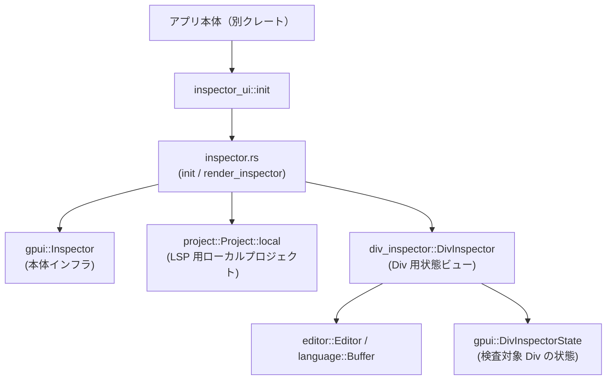
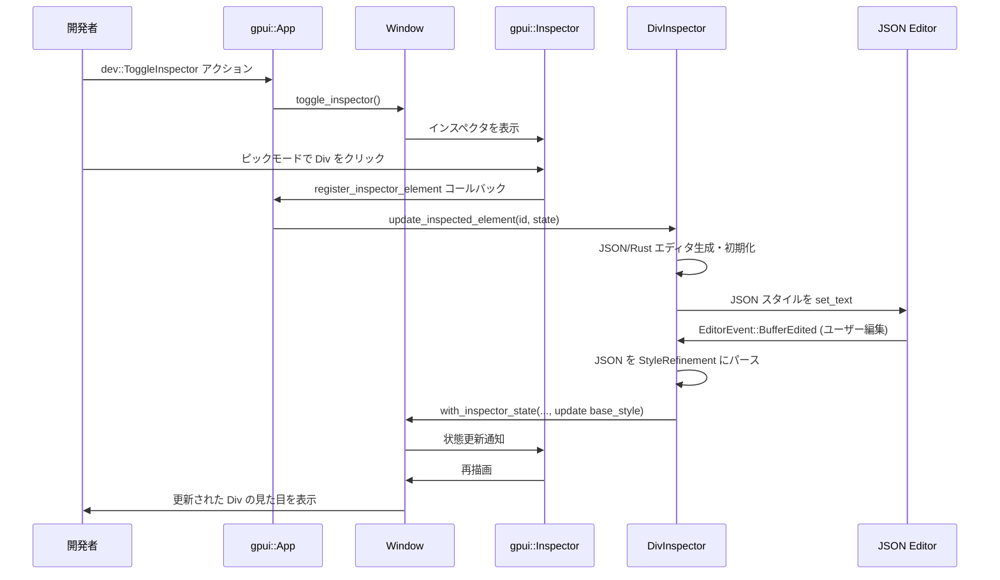

# crates/inspector_ui ディレクトリ

## 1. ざっくり一言

Zed の GPUI で描画された要素（主に `Div`）を検査・一時的に編集するための、**デバッグ専用インスペクタ UI クレート**です。  
`dev::ToggleInspector` アクションでインスペクタを開き、レイアウト情報やスタイル（Rust / JSON）の確認・編集と、元ソースコードへのジャンプを行います。

---

## 2. このモジュールの役割

### 2.1 概要

- このクレートは、Zed 内部の **GPUI インスペクタの UI 部分**を提供します。
- デバッグビルド時のみ有効で、`dev::ToggleInspector` アクションを通じてインスペクタを開閉します。
- 各 UI 要素（特に `Div`）のレイアウト情報やスタイルを表示し、JSON / 簡易的な Rust スタイルコードからスタイルを編集して、その結果を即座にプレビューします。
- 検査対象要素の **ソースコード位置を外部の `zed` CLI で開く**機能も提供します。

### 2.2 アーキテクチャ内での位置づけ

このクレートは、アプリケーションの初期化時に呼び出されて GPUI にインスペクタを登録し、以降は GPUI からコールバックされて UI を描画します。概略の依存関係は次のようになります。



- `inspector_ui::init` がエントリポイントで、GPUI の `Inspector` に対して
  - インスペクタのサイドペイン描画関数（`render_inspector`）
  - 個々の `Div` の状態ビュー描画関数（`DivInspector`）
  を登録します。
- スタイル編集用のエディタは `project::Project::local` で作られたローカルプロジェクト上の `Buffer` / `Editor` を通じて提供され、JSON には JSON LSP、Rust 側は言語情報のみを付与して Rust Analyzer は起動しないようになっています。
- `build.rs` で設定される `ZED_REPO_DIR` 環境変数を使って、要素の元ソース位置を `zed` CLI 経由で開きます。

### 2.3 設計上のポイント

- **デバッグビルド限定**
  - `#[cfg(debug_assertions)]` により、インスペクタの実体はデバッグビルドでのみ有効です。
  - リリースビルドでは、アクションを隠しつつ、呼び出された場合はユーザーにエラーメッセージを出します。
- **GPUI コアと UI の分離**
  - コアのインスペクタ機能は別クレート（`crates/gpui/inspector.rs`、README 記載）にあり、このクレートは「UI のレンダリングと編集体験」に集中しています。
- **非同期初期化**
  - `DivInspector::new` でスタイル編集用のバッファを非同期に生成し、準備完了までは「Loading...」表示にしておきます。
- **スタイルの二重表現**
  - `StyleRefinement` をベースに、「JSON 表現」と「Rust メソッドチェーン表現」を行き来しながら編集します。
  - Rust 側で表現できないスタイルは `unconvertible_style` として保持し、JSON 編集で上書きされないように分離しています。
- **補完とプレビューの連動**
  - Rust スタイルエディタでメソッド補完を行う際、補完候補の選択状態を `DivInspector` に渡し、確定前でも JSON・スタイルプレビューに反映します。
- **ソース位置ナビゲーション**
  - `std::panic::Location` を保持しておき、クリックで `zed` CLI を非同期実行して当該箇所を開きます。

---

## 3. 主要な機能一覧

- インスペクタの有効化・無効化：
  - `inspector_ui::init` を通じて `dev::ToggleInspector` アクションを登録し、アクティブウィンドウのインスペクタの開閉を行います。
- インスペクタサイドペイン UI の描画：
  - 上部ツールバー（ピックモードボタン＋タイトル）と、選択要素情報・状態ビューのリストを描画します。
- `Div` 要素のレイアウト情報表示：
  - `DivInspector` が `DivInspectorState` から Bounds / Size / Content size を表示します。
- `Div` スタイルの Rust コード風編集：
  - `StyleRefinement` に対応する `Styled` / `StyledExt` メソッドチェーンを推測し、簡易的な Rust コードとして表示・編集し、メソッド名ごとに補完を提供します。
- `Div` スタイルの JSON 編集：
  - スタイルを JSON にシリアライズしてエディタに表示し、JSON を編集して `DivInspectorState.base_style` を直接更新します（lenient な JSON パーサを使用）。
- JSON と Rust スタイルの同期：
  - Rust 側の変更を JSON 側へ反映しつつ、Rust で表現できない部分や JSON でのみ変更された部分を適切にマージします。
- 未認識メソッドの診断表示：
  - Rust スタイルエディタ内で、`StyleRefinement` に対応しないメソッド名を警告診断としてハイライトします。
- 要素のソースコード位置表示・ジャンプ：
  - `InspectorElementId` に埋め込まれた `Location` からパスを表示し、クリックで `zed` CLI を起動して該当位置を開きます（`ZED_REPO_DIR` ベース）。

---

## 4. 関数・構造体の解説

### 4.1 型一覧（構造体・列挙体など）

| 名前 | 種別 | 可視性 | 役割 / 用途 |
|------|------|--------|-------------|
| `DivInspector` | 構造体 | `pub(crate)` | `Div` 要素用のインスペクタ UI コンポーネント。スタイル編集用のバッファ・エディタと各種状態を保持し、`Render` を実装してレイアウト・スタイル編集 UI を描画します。 |
| `State` | 列挙体 | モジュール内 | `DivInspector` の内部状態（バッファ未準備 / 準備済み / エディタ準備済み / ロードエラー）を管理します。 |
| `RustStyleCompletionProvider` | 構造体 | モジュール内 | Rust スタイルエディタ用の補完プロバイダ。`StyleRefinement` に対するスタイルメソッドを補完候補として提供します。 |
| `STYLE_METHODS` | `static LazyLock<Vec<...>>` | モジュール内 | `StyleRefinement` に対するすべての `StyledExt` / `Styled` メソッドをリフレクションで列挙したテーブル。メソッド名からスタイルの変化を得るために使用します。 |

> `InspectorElementId`, `DivInspectorState`, `StyleRefinement` などは他クレート（`gpui`）から提供される型で、このチャンクでは定義は登場しませんが、名前から UI の要素識別子・Div のスタイル状態を表す型と解釈できます。

---

### 4.2 関数詳細（最大 7 件）

#### 4.2.1 `inspector_ui::init(app_state: Arc<workspace::AppState>, cx: &mut gpui::App)`

**概要**

- アプリケーション起動時に呼び出され、インスペクタ機能を GPUI に登録します。
- **デバッグビルド**と**リリースビルド**で挙動が異なります。
  - デバッグビルド：実際のインスペクタ（UI・Div 編集機能）を登録。
  - リリースビルド：`dev::ToggleInspector` が呼ばれたらエラー通知し、コマンドパレットから非表示にします。

**引数**

| 引数名 | 型 | 説明 |
|--------|----|------|
| `app_state` | `Arc<workspace::AppState>` | アプリケーション全体の状態。ローカル `Project` を構築するために利用されます（デバッグビルド時）。 |
| `cx` | `&mut gpui::App` | GPUI のアプリケーションコンテキスト。アクションやインスペクタを登録します。 |

**戻り値**

- なし（`()`）。失敗はエラーとしてログや通知に流されます。

**内部処理の流れ**

デバッグビルドの場合（`inspector.rs::init`）：

1. `zed_actions::dev::ToggleInspector` アクションにハンドラを登録。
   - アクティブウィンドウを取得し、`window.toggle_inspector(cx)` を `cx.defer` で非同期に呼び出します。
2. `project::Project::local` を使い、LSP 用のローカルプロジェクトを生成。
3. `OnceCell` を使って `DivInspector` のインスタンスを遅延生成し、`cx.register_inspector_element` に登録。
   - GPUI から `DivInspectorState` が渡されたときに `DivInspector::update_inspected_element` と `render` を呼び出します。
4. `cx.set_inspector_renderer(Box::new(render_inspector))` により、インスペクタサイドペイン全体の描画関数を登録。

リリースビルドの場合（`inspector_ui.rs` 内）：

1. `dev::ToggleInspector` アクションにハンドラを登録し、呼び出されたら
   - `anyhow!("dev::ToggleInspector is only available in debug builds")` を `notify_app_err` で通知。
2. `CommandPaletteFilter::update_global` で、コマンドパレットから `dev::ToggleInspector` を非表示にします。

**Examples（使用例）**

アプリケーション側でインスペクタを有効化する基本例です（デバッグビルドを想定）。

```rust
use std::sync::Arc;                         // Arc のインポート
use gpui::App;                              // GPUI アプリケーション
use workspace::AppState;                    // アプリケーション状態（定義は別クレート）
use inspector_ui;                           // 本クレート

fn main() {
    App::new(|cx| {                         // GPUI アプリケーションを起動
        // AppState を生成する（実際の生成方法はアプリ側で定義）
        let app_state: Arc<AppState> = Arc::new(/* AppState を構築する */);

        // インスペクタ機能を登録（デバッグ時のみ実体が有効になる）
        inspector_ui::init(app_state.clone(), cx);

        // 残りのアプリケーション初期化処理...
    });
}
```

**Errors / Panics**

- デバッグビルド：
  - `cx.active_window()` が `None` の場合、「no active window to toggle inspector」というコンテキスト付きエラーが `log_err()` でログ出力されます（パニックにはなりません）。
- リリースビルド：
  - `dev::ToggleInspector` 実行時にエラーを通知しますが、パニックはしません。
- `init` 自体はパニックしません。

**Edge cases（エッジケース）**

- **アクティブウィンドウがない状態で `dev::ToggleInspector` が発行された場合**
  - 何も起こらず、エラーログのみ記録されます。
- **リリースビルドで `dev::ToggleInspector` を実行した場合**
  - 通知としてエラーメッセージが表示されるだけで、インスペクタは開きません。

**使用上の注意点**

- 通常はアプリケーションの初期化時に **1 回だけ**呼び出される想定の設計になっています（複数回呼び出してもコード上のガードはありませんが、アクション登録が重複する可能性があります）。
- リリースビルドで実際のインスペクタ機能は利用できないため、「実際に要素のスタイルを編集したい場合はデバッグビルドで起動する」という前提が必要です。

---

#### 4.2.2 `render_inspector(inspector: &mut Inspector, window: &mut Window, cx: &mut Context<Inspector>) -> AnyElement`

**概要**

- GPUI のインスペクタサイドペイン全体の UI を描画する関数です。
- 上部のツールバー（ピックモードボタン＋タイトル）と、選択中要素の情報＋各要素状態ビューを縦に並べて表示します。

**引数**

| 引数名 | 型 | 説明 |
|--------|----|------|
| `inspector` | `&mut Inspector` | GPUI のインスペクタ本体。現在のピック状態、アクティブ要素 ID、要素状態ビューを提供します。 |
| `window` | `&mut Window` | 現在のウィンドウ。フォント・テーマなど UI 設定を取得するために使用します。 |
| `cx` | `&mut Context<Inspector>` | コンポーネントのレンダリングコンテキスト。イベントハンドラや子要素のレンダリングに使用します。 |

**戻り値**

- `AnyElement`：GPUI の汎用 UI 要素。サイドペイン全体を表します。

**内部処理の流れ**

1. `theme_settings::setup_ui_font` で UI 用フォントをセットアップします。
2. テーマから色（`colors`）を取得し、背景色・文字色・境界線の色をスタイルに適用します。
3. ツールバー部分を描画：
   - 左側に「ピックモード」ボタン（虫眼鏡アイコン）を表示。
   - ボタン押下時に `inspector.start_picking()` を呼び、`window.refresh()` で再描画します。
   - 右側に `"GPUI Inspector"` ラベル。
4. 本文部分（スクロール可能領域）を描画：
   - `inspector.active_element_id()` があれば、`render_inspector_id` で要素 ID 情報を表示。
   - `inspector.render_inspector_states(window, cx)` によって登録済みの状態ビュー（`DivInspector` など）を描画します。

**Examples（使用例）**

`init` からの利用は以下のようになっています（実際のコードから抜粋）。

```rust
// inspector.rs より（デバッグビルド時）
pub fn init(app_state: Arc<AppState>, cx: &mut App) {
    // ... アクション登録や DivInspector 登録 ...

    // インスペクタのサイドペイン描画関数を登録
    cx.set_inspector_renderer(Box::new(render_inspector));
}
```

**Errors / Panics**

- この関数内で明示的にエラーを返したりパニックさせる箇所はありません。
- 使用している UI API（`v_flex`, `h_flex`, `IconButton` など）がパニックする条件はコードからは分かりません。

**Edge cases（エッジケース）**

- **アクティブな要素 ID がない場合**
  - `render_inspector_id` は呼ばれず、状態ビューのみが表示されます。
- **状態ビューが登録されていない場合**
  - `inspector.render_inspector_states` の結果に依存します。このチャンクからは詳細は分かりませんが、通常は空のリストになると考えられます。

**使用上の注意点**

- ユーザーコードから直接呼び出す想定ではなく、`cx.set_inspector_renderer` からのみ使用される設計になっています。
- カスタマイズしたい場合は、この関数をコピー・変更して別のレンダラを登録する形になりますが、その場合は GPUI 側の API に依存します。

---

#### 4.2.3 `DivInspector::new(project: Entity<Project>, window: &mut Window, cx: &mut Context<Self>) -> DivInspector`

**概要**

- `Div` 要素用のインスペクタコンポーネントを初期化します。
- JSON / Rust 両方のスタイル編集用バッファを非同期に生成し、準備ができ次第 `State::BuffersLoaded` または `State::LoadError` に遷移させます。

**引数**

| 引数名 | 型 | 説明 |
|--------|----|------|
| `project` | `Entity<Project>` | LSP 対応のローカルプロジェクト。JSON スタイルバッファを開くために使用されます。 |
| `window` | `&mut Window` | バッファ生成タスクをウィンドウに紐付けて実行するために使用されます。 |
| `cx` | `&mut Context<Self>` | コンポーネントコンテキスト。非同期タスクの生成や状態更新に使用します。 |

**戻り値**

- 初期状態の `DivInspector`。
  - `state` は `State::Loading` に設定されています。

**内部処理の流れ**

1. `cx.spawn_in(window, async move |this, cx| { ... }).detach()` で非同期タスクを起動。
   - JSON スタイルバッファを `create_buffer_in_project(ZED_INSPECTOR_STYLE_JSON, &project, cx).await` で生成。
   - Rust スタイルバッファは `Buffer::local("", cx).with_language_async(rust_language, cx)` でローカルに生成（Rust Analyzer は起動されない）。
2. 両方のバッファが生成できたら
   - `this.state = State::BuffersLoaded { ... }` に更新。
   - すでに `inspector_id` がセットされていれば、`window.with_inspector_state` で `DivInspectorState` を取得し、`update_inspected_element` を呼び出して初期表示を更新。
3. いずれかのバッファ生成に失敗した場合
   - `State::LoadError { message }` に遷移させ、エラーメッセージを保持。

**Examples（使用例）**

`inspector.rs` での利用例です。

```rust
// inspector.rs より、DivInspector の遅延初期化
let div_inspector = OnceCell::new();
cx.register_inspector_element(move |id, state: &DivInspectorState, window, cx| {
    // 初回呼び出し時に DivInspector を生成
    let div_inspector = div_inspector
        .get_or_init(|| cx.new(|cx| DivInspector::new(project.clone(), window, cx)));

    // 各要素の状態を反映してレンダリング
    div_inspector.update(cx, |div_inspector, cx| {
        div_inspector.update_inspected_element(&id, state.clone(), window, cx);
        div_inspector.render(window, cx).into_any_element()
    })
});
```

**Errors / Panics**

- バッファ生成が失敗した場合は `State::LoadError` に遷移し、UI 上でエラーメッセージを表示します。
- `panic!` を明示的に呼ぶ箇所はありません。

**Edge cases（エッジケース）**

- **インスペクタが初期化される前に要素が選択された場合**
  - `DivInspector::new` 内の非同期タスク完了前に `update_inspected_element` が呼ばれる可能性がありますが、
    - `update_inspected_element` は `State::Loading` ではエディタ初期化を行わず
    - バッファができた後に `inspector_id` を見て再度 `update_inspected_element` を呼び出す
    というロジックがあるため、最終的には正しく UI が更新されます。

**使用上の注意点**

- `DivInspector::new` はほぼ内部用で、外部から直接呼ぶのではなく `cx.new` と `register_inspector_element` を通じて使用する設計になっています。
- 非同期初期化のため、「生成直後にエディタが必ず利用可能」とは限らず、`State::Loading` / `"Loading..."` 表示を考慮した UI になっています。

---

#### 4.2.4 `DivInspector::update_inspected_element(&mut self, id: &InspectorElementId, inspector_state: DivInspectorState, window: &mut Window, cx: &mut Context<Self>)`

**概要**

- 現在検査対象となっている `Div` 要素の ID と状態（`DivInspectorState`）を受け取り、`DivInspector` の内部状態と編集用エディタを更新します。
- ここで JSON / Rust スタイルエディタの初期化と、イベント購読の設定が行われます。

**引数**

| 引数名 | 型 | 説明 |
|--------|----|------|
| `id` | `&InspectorElementId` | 検査対象 `Div` の識別子（ソース位置やインスタンス ID を含む）。 |
| `inspector_state` | `DivInspectorState` | 検査対象 `Div` の現在の状態。`base_style` などの情報を含みます。 |
| `window` | `&mut Window` | GPUI ウィンドウ。`with_inspector_state` を通じて `DivInspectorState` を更新するために使用します。 |
| `cx` | `&mut Context<Self>` | コンポーネントコンテキスト。エディタ生成やイベント購読に使用します。 |

**戻り値**

- なし（`()`）。

**内部処理の流れ**

1. `inspector_state.base_style` をクローンし、`initial_style` として保持。
2. 既に `self.inspector_id` が同じ ID の場合は、何もせず終了（不要な再初期化を避ける）。
3. `self.state` が
   - `State::BuffersLoaded` または `State::Ready` の場合：バッファを取得。
   - `State::Loading` / `State::LoadError` の場合：何もせず終了。
4. Rust / JSON 両方のエディタを `create_editor` で生成。
   - Rust エディタには `RustStyleCompletionProvider` をセットする。
5. `reset_style_editors` で
   - `initial_style` を JSON 文字列に変換して JSON バッファへセット。
   - `guess_rust_code_from_style` で推測した Rust スタイルコードを Rust バッファへセットし、未認識メソッドを診断として付与。
6. JSON エディタに対して `EditorEvent::BufferEdited` を購読。
   - JSON をパースして `StyleRefinement` に変換。
   - Rust スタイルバッファから再度 `rust_style` を取り出し、`unconvertible_style` + `rust_style` を基準に `json_style_overrides` を計算。
   - `window.with_inspector_state` を通じて `DivInspectorState.base_style` を更新し、`window.refresh()` で再描画。
7. Rust エディタに対して `EditorEvent::BufferEdited` を購読。
   - Rust スタイルが編集されるたびに `update_json_style_from_rust` を呼び、JSON 側を同期。
8. `unconvertible_style` と `json_style_overrides` を初期化し、`self.state = State::Ready { ... }` に設定。

**Examples（使用例）**

`register_inspector_element` 内からの呼び出し（実コード）です。

```rust
cx.register_inspector_element(move |id, state: &DivInspectorState, window, cx| {
    let div_inspector = div_inspector
        .get_or_init(|| cx.new(|cx| DivInspector::new(project.clone(), window, cx)));

    div_inspector.update(cx, |div_inspector, cx| {
        // 現在の要素 ID と状態を反映
        div_inspector.update_inspected_element(&id, state.clone(), window, cx);

        // 反映された状態をもとに UI を描画
        div_inspector.render(window, cx).into_any_element()
    })
});
```

**Errors / Panics**

- JSON シリアライズ / デシリアライズや Rust コード推測時にエラーが発生した場合、
  - `json_style_error` にエラーメッセージを格納し、
  - UI 上でエラー枠として表示します。
- パニックを明示的に起こす処理はありません。

**Edge cases（エッジケース）**

- **`State::Loading` / `State::LoadError` の場合**
  - エディタの初期化や購読は行われず、そのまま戻ります。
  - `State::LoadError` の場合は、`render` でエラーメッセージが表示されます。
- **同じ `InspectorElementId` に対して繰り返し呼ばれる場合**
  - 2 回目以降は早期リターンし、エディタの再初期化が行われません。

**使用上の注意点**

- この関数は GPUI からのコールバック経由でのみ呼ばれる想定です。外部から直接呼び出すと、`state` との整合性が崩れる可能性があります。
- `DivInspectorState` を破壊的に更新するため、他のコンポーネントが同じ状態を前提に動いている場合は、その影響範囲を考慮する必要があります（ただし、このチャンクでは他コンポーネントの詳細は不明です）。

---

#### 4.2.5 `DivInspector::update_json_style_from_rust(&mut self, json_style_buffer: &Entity<Buffer>, rust_style_buffer: &Entity<Buffer>, cx: &mut Context<Self>)`

**概要**

- Rust スタイルエディタの内容（メソッドチェーン）から `StyleRefinement` を再構築し、JSON スタイルバッファへ反映します。
- ユーザーによる JSON 側の上書き（`json_style_overrides`）と、Rust で表現できない部分（`unconvertible_style`）を尊重した上で、最終スタイルを決定します。

**引数**

| 引数名 | 型 | 説明 |
|--------|----|------|
| `json_style_buffer` | `&Entity<Buffer>` | JSON スタイルを表示しているバッファ。ここに新しい JSON 文字列を書き込みます。 |
| `rust_style_buffer` | `&Entity<Buffer>` | Rust スタイルコードを保持しているバッファ。ここから `StyleRefinement` を計算します。 |
| `cx` | `&mut Context<Self>` | コンテキスト。バッファ更新や診断更新に使用します。 |

**戻り値**

- なし（`()`）。

**内部処理の流れ**

1. `rust_style_buffer.update` でスナップショットを取り、`style_from_rust_buffer_snapshot` を用いて
   - `rust_style: StyleRefinement`
   - `unrecognized_ranges: Vec<Range<Anchor>>`
   を取得。
2. `set_rust_buffer_diagnostics` に `unrecognized_ranges` を渡し、「unrecognized」警告を Rust バッファに付与。
3. 新しいスタイルを構成：
   - `new_style = unconvertible_style.clone()`
   - `new_style.refine(&json_style_overrides)`（JSON 側の上書きを適用）
   - `let new_style = new_style.refined(rust_style)`（Rust 側のスタイルでさらに上書き）
4. `serde_json::to_string_pretty(&new_style)` で JSON にシリアライズし、`json_style_buffer` に設定。
5. JSON シリアライズに失敗した場合は `json_style_error` にエラーメッセージを格納。

**Examples（使用例）**

Rust スタイルエディタの変更イベントからの呼び出し（実コード）です。

```rust
cx.subscribe(&rust_style_editor, {
    let json_style_buffer = json_style_buffer.clone();   // JSON バッファをクローン
    let rust_style_buffer = rust_style_buffer.clone();   // Rust バッファをクローン
    move |this, _editor, event: &EditorEvent, cx| {
        if let EditorEvent::BufferEdited = event {
            // Rust コードが編集されたときに JSON 側を同期
            this.update_json_style_from_rust(
                &json_style_buffer,
                &rust_style_buffer,
                cx,
            );
        }
    }
})
.detach();
```

**Errors / Panics**

- JSON シリアライズで `Err` になった場合、`json_style_error` にメッセージを格納します。
- パニックを明示的に発生させるコードはありません。

**Edge cases（エッジケース）**

- **Rust スタイルが空・全くマッチしない場合**
  - `style_from_rust_buffer_snapshot` が `StyleRefinement::default()` を返すため、
    `new_style` は `unconvertible_style + json_style_overrides` のみで構成されます。
- **未認識メソッドがある場合**
  - その範囲が警告診断として表示されますが、スタイル計算には含まれません。

**使用上の注意点**

- JSON 側の変更を Rust 側に自動反映する実装にはなっていません（コメントにも明示的に記述されています）。
  - ユーザーが Rust エディタで編集すると、同じキーを持つ JSON 側の変更は Rust 側の値で上書きされる点に注意が必要です。

---

#### 4.2.6 `DivInspector::style_from_rust_buffer_snapshot(&self, snapshot: &BufferSnapshot) -> (StyleRefinement, Vec<Range<Anchor>>)`

**概要**

- Rust スタイルエディタの現在のテキスト（スナップショット）から、スタイルメソッド名を抽出し、それらを順に適用して `StyleRefinement` を構築します。
- 同時に、認識できなかったトークンの範囲を返し、診断表示のために利用します。

**引数**

| 引数名 | 型 | 説明 |
|--------|----|------|
| `snapshot` | `&BufferSnapshot` | Rust スタイルエディタのスナップショット。行・オフセット・テキストの取得に使用します。 |

**戻り値**

- `(StyleRefinement, Vec<Range<Anchor>>)` のタプル。
  - 第 1 要素：認識されたメソッドチェーンを適用した最終的なスタイル。
  - 第 2 要素：未認識トークンの範囲（`Anchor` ベース）のリスト。診断用。

**内部処理の流れ**

1. `self.rust_completion` と `self.rust_completion_replace_range` がセットされている場合は、
   - 補完前のテキスト・補完後のテキストを連結しつつ、補完候補そのものを 1 つのトークンとして挿入。
2. それ以外の場合は、スナップショット全体のテキストを `split_str_with_ranges(&is_not_identifier_char)` で分割。
   - `is_not_identifier_char` は「英数字と `_` 以外」をトークン区切りとみなします。
3. 得られた `(Range<usize>, String)` のリストに対して、
   - `STYLE_METHODS` の中から `method.name == name` のものを検索。
   - 見つかれば `style = method.invoke(style)` で `StyleRefinement` を更新。
   - 見つからなければ、その範囲を `Anchor` に変換して `unrecognized_ranges` に追加。
4. 最終的な `style` と `unrecognized_ranges` を返却。

**Examples（使用例）**

`update_json_style_from_rust` や JSON 編集時の処理から使用されています。

```rust
let snapshot = rust_style_buffer.snapshot();              // バッファのスナップショット取得
let (rust_style, unrecognized_ranges) =
    self.style_from_rust_buffer_snapshot(&snapshot);      // スタイルと未認識範囲を計算
DivInspector::set_rust_buffer_diagnostics(
    unrecognized_ranges,
    rust_style_buffer,
    &snapshot,
    cx,
);
```

**Errors / Panics**

- この関数自体は `Result` を返さず、エラーになりうる外部呼び出しも行っていません。
- メソッド検索に失敗した場合も単に「未認識」として扱い、エラーにはなりません。

**Edge cases（エッジケース）**

- **補完候補が選択されている場合**
  - 実際にテキストに挿入されていなくても、`self.rust_completion` の内容をトークン列に挿入するため、補完候補を選択しただけでスタイルに即座に反映されます。
- **スタイルメソッドが 1 つも見つからない場合**
  - `StyleRefinement::default()` が返り、未認識トークンの範囲だけが返されます。

**使用上の注意点**

- この処理は簡易なトークン分割に基づくため、Rust 構文全体を正確にパースするものではありません（メソッドチェーンの名前部分だけを対象にしています）。
- メソッド名の衝突を避けるために、`STYLE_METHODS` の順序（`StyledExt` を先に優先）に依存しています。

---

#### 4.2.7 `RustStyleCompletionProvider::completions(...) -> Task<Result<Vec<CompletionResponse>>>`

**概要**

- Rust スタイルエディタで補完を行う際に呼び出され、`StyleRefinement` に対応するスタイルメソッドの一覧を補完候補として返します。
- その場で置き換えるべきテキスト範囲（`completion_replace_range`）を計算し、その情報を `DivInspector` に保存します。

**引数（主要なもの）**

| 引数名 | 型 | 説明 |
|--------|----|------|
| `self` | `&RustStyleCompletionProvider` | 補完プロバイダ自身。内部に `Entity<DivInspector>` を保持しています。 |
| `buffer` | `&Entity<Buffer>` | 補完対象となるバッファ。 |
| `position` | `Anchor` | 補完がトリガされた位置。 |
| `_` | `editor::CompletionContext` | コンテキスト（この実装では使用していません）。 |
| `_window` | `&mut Window` | ウィンドウ（この実装では使用していません）。 |
| `cx` | `&mut Context<Editor>` | エディタコンテキスト。`DivInspector` の更新に使用します。 |

**戻り値**

- `Task<Result<Vec<CompletionResponse>>>`
  - 非同期タスクとして補完結果（ここでは即座に `Task::ready`）を返します。
  - 正常時は `Ok(vec![CompletionResponse { ... }])`、補完不要時は `Ok(Vec::new())`。

**内部処理の流れ**

1. `completion_replace_range(&buffer.read(cx).snapshot(), &position)` で、現在行における置き換え対象範囲（`Range<Anchor>`）を計算。
   - 見つからなければ `Task::ready(Ok(Vec::new()))` を返し、補完を行わない。
2. 見つかった場合、その範囲を `DivInspector` に保存：
   - `div_inspector.update(cx, |div_inspector, _| { div_inspector.rust_completion_replace_range = Some(replace_range.clone()); });`
3. `STYLE_METHODS` から全メソッドを列挙し、それぞれに対して `Completion` を生成：
   - `new_text`：`.method_name()`
   - `label`：`CodeLabel::plain(method.name.to_string(), None)`
   - `documentation`：あれば `CompletionDocumentation::MultiLineMarkdown` として設定。
4. 生成した `Completion` 一覧を 1 つの `CompletionResponse` にまとめて返す。

**Examples（使用例）**

`DivInspector::update_inspected_element` 内で補完プロバイダとして登録されています。

```rust
rust_style_editor.update(cx, {
    let div_inspector = cx.entity();                    // DivInspector の Entity を取得
    |rust_style_editor, _cx| {
        // Rust スタイルエディタに補完プロバイダをセット
        rust_style_editor.set_completion_provider(Some(Rc::new(
            RustStyleCompletionProvider { div_inspector },
        )));
    }
});
```

**Errors / Panics**

- 現在の実装では `Err` を返すコードパスはなく、常に `Ok` を返しています。
- パニックするような処理は含まれていません。

**Edge cases（エッジケース）**

- **補完位置が識別子として適切でない場合**
  - `completion_replace_range` が `None` を返し、補完候補は空になります。
- **補完候補が非常に多い場合**
  - すべて `STYLE_METHODS` の列挙結果に依存します。このチャンクからは件数は分かりませんが、`sort_completions` が `false` を返すため、順序は明示的にはソートされません。

**使用上の注意点**

- この補完プロバイダは「スタイルメソッド専用」であり、一般的な Rust 補完（変数名や関数名など）とは別物です。
- `is_completion_trigger` も同じ `completion_replace_range` 判定を用いているため、「メソッドチェーンの中のみ」で補完が有効になります。

---

### 4.3 その他の関数

| 関数名 | 役割（1 行） |
|--------|--------------|
| `DivInspector::reset_style` | 現在の `initial_style` を基に JSON / Rust スタイルエディタを初期状態に戻し、エラー表示をクリアします。 |
| `DivInspector::reset_style_editors` | `initial_style` を JSON / Rust 両方に反映しつつ、未認識メソッド診断を更新し、`StyleRefinement` を返します。 |
| `DivInspector::handle_rust_completion_selection_change` | Rust 補完選択の変更を受け取り、`rust_completion` を更新した上で `update_json_style_from_rust` を呼び出します。 |
| `DivInspector::set_rust_buffer_diagnostics` | 未認識トークンの範囲から `DiagnosticSet` を生成し、Rust スタイルバッファに警告診断を設定します。 |
| `DivInspector::create_buffer_in_project` | 指定パスに対して `Project::create_worktree` → `open_path` を行い、`Buffer` を非同期に生成します。 |
| `DivInspector::create_editor` | 与えられた `Buffer` をラップした `MultiBuffer` から `Editor` を生成し、行番号やミニマップなどの UI 設定を行います。 |
| `render_layout_state` | `DivInspectorState` から Bounds / Size / Content size を読み取り、レイアウト情報の表示用 `Div` を構築します。 |
| `guess_rust_code_from_style` | 目標スタイル `goal_style` を満たすメソッドのサブセットを選び、`fn build() -> Div { div().method()... }` 形式の Rust コードと適用後スタイルを推測します。 |
| `is_not_identifier_char` | 「英数字でも `_` でもない文字か」を判定するヘルパーで、トークン分割に使用されます。 |
| `completion_replace_range` | 補完位置の行テキストを解析し、メソッド名部分の置き換え範囲（`Range<Anchor>`）を決定します。 |
| `render_inspector_id` | `InspectorElementId` からインスタンス ID とソース位置、`global_id` を表示する UI ブロックを構築します。 |
| `open_zed_source_location` | `ZED_REPO_DIR` と `Location` を組み合わせて `zed path:line:col` を実行し、ソースコードを外部 Zed インスタンスで開きます。 |
| `build.rs::main` | `CARGO_MANIFEST_DIR` からリポジトリルートと思しきディレクトリを特定し、`ZED_REPO_DIR` をコンパイル時環境変数として設定します。 |

---

## 5. データフロー

ここでは、「JSON スタイルエディタを編集して `Div` のスタイルが変わるまで」の代表的なデータフローを示します。

1. ユーザーが `dev::ToggleInspector` を実行し、インスペクタサイドペインが表示される。
2. ピックモードで `Div` 要素をクリックすると、GPUI がその要素の `InspectorElementId` と `DivInspectorState` を `register_inspector_element` のコールバックに渡す。
3. コールバック内で `DivInspector::update_inspected_element` が呼ばれ、JSON / Rust エディタが初期化される。
4. ユーザーが JSON エディタを編集すると、`EditorEvent::BufferEdited` が発火し、`DivInspector` の購読ハンドラが JSON をパースして `StyleRefinement` に変換する。
5. `DivInspector` は `unconvertible_style` と `rust_style` を組み合わせて `json_style_overrides` を計算し、`window.with_inspector_state` を通じて `DivInspectorState.base_style` を更新する。
6. GPUI は更新された `DivInspectorState` に基づいて対象 `Div` の描画を更新し、ユーザーは変更結果を即座に確認できる。

### シーケンス図



---

## 6. 使い方（How to Use）

### 6.1 基本的な使用方法

アプリケーションでインスペクタを有効化する最小限の手順は次の通りです。

1. アプリケーション起動時に `inspector_ui::init` を呼ぶ。
2. `dev::ToggleInspector` アクションを実行できる状態にしておく（キーやコマンドパレットから）。

簡易なコード例（デバッグビルドを想定）：

```rust
use std::sync::Arc;                         // 共有所有権用 Arc
use gpui::App;                              // GPUI アプリケーション
use workspace::AppState;                    // アプリケーション状態（定義は別クレート）
use inspector_ui;                           // 本クレート

fn main() {
    App::new(|cx| {                         // GPUI アプリケーションを開始
        // AppState を構築（実際の実装はアプリ側で定義）
        let app_state: Arc<AppState> = Arc::new(/* AppState を構築する */);

        // インスペクタ UI を登録（デバッグビルドでのみ有効）
        inspector_ui::init(app_state.clone(), cx);

        // 残りの UI / ワークスペース初期化...
    });
}
```

以後、`dev::ToggleInspector` を発行するとインスペクタがサイドペインに表示され、UI 要素をクリックして検査できます。

### 6.2 よくある使用パターン

1. **デバッグビルドのみでインスペクタを有効化する**

   多くの場合、アプリ側でさらに `#[cfg(debug_assertions)]` を用いて、リリースビルドで `init` を呼ばないようにすることが考えられます。

   ```rust
   #[cfg(debug_assertions)]
   {
       inspector_ui::init(app_state.clone(), cx);  // デバッグビルドのみ
   }
   ```

   （このクレート自体がリリースビルドでの動作をケアしているため、必須ではありませんが、意図が明確になります。）

2. **スタイルの試行錯誤**

   - インスペクタで `Div` を選択し、まず JSON タブで気軽に数値や色を変更する。
   - ある程度固まったら、Rust タブでメソッドチェーンとしてどう書けそうかを確認する（`guess_rust_code_from_style` の結果）という形で利用できます。
   - 実際のアプリコードへの反映は別途手作業になりますが、レイアウト調整のプロトタイピングに利用できます。

### 6.3 よくある間違い

```rust
// 誤り例: インスペクタを初期化していないのに dev::ToggleInspector を使おうとしている

fn main() {
    gpui::App::new(|_cx| {
        // inspector_ui::init(...) を呼んでいない
    });

    // どこかで dev::ToggleInspector を実行しても、何も起こらないかエラーになる
}
```

```rust
// 正しい例: アプリ起動時に inspector_ui::init を呼び出しておく

use std::sync::Arc;
use workspace::AppState;

fn main() {
    gpui::App::new(|cx| {
        let app_state = Arc::new(/* AppState 構築 */);

        // ここでインスペクタを登録
        inspector_ui::init(app_state.clone(), cx);

        // その他の初期化...
    });
}
```

### 6.4 使用上の注意点（まとめ）

- **ビルドモード依存**
  - デバッグビルドとリリースビルドで挙動が大きく異なります。
  - リリースビルドでは、`dev::ToggleInspector` を呼んでも実際のインスペクタ UI は開かず、エラー通知とコマンド非表示だけが行われます。
- **外部 `zed` CLI への依存**
  - ソース位置のクリック時に `zed path:line:col` を実行するため、`PATH` 上に `zed` コマンドが存在しない場合、`open_zed_source_location` はエラーを返します（呼び出し側ではログ付きで非同期実行）。
- **`ZED_REPO_DIR` 環境変数への依存**
  - `build.rs` により `CARGO_MANIFEST_DIR` から計算されたリポジトリルートが `ZED_REPO_DIR` に設定されます。
  - プロジェクトの配置が `.../crates/inspector_ui` でない場合、ビルドスクリプトがパニックします。
- **スタイル編集の永続化**
  - README にも記載の通り、インスペクタのスタイル編集は基本的に一時的であり、元のソースコードには自動反映されません。
  - ピックモードの再開始などで編集が失われる前提で利用する必要があります。
- **JSON / Rust スタイルの同期仕様**
  - Rust 側を編集すると、同じプロパティに対する JSON 側の変更は上書きされます。
  - Rust で表現できないスタイルは `unconvertible_style` として保持され、JSON 側でのみ編集される形になります。

---

## 7. 関連ファイル

| パス | 役割 / 関係 |
|------|------------|
| `crates/inspector_ui/Cargo.toml` | クレート名・依存関係・ライブラリエントリ（`src/inspector_ui.rs`）を定義します。 |
| `crates/inspector_ui/build.rs` | `CARGO_MANIFEST_DIR` からリポジトリルートを推定し、`ZED_REPO_DIR` 環境変数を設定します。ソース位置ナビゲーションに利用されます。 |
| `crates/inspector_ui/src/inspector_ui.rs` | クレートルート。`init` 関数の公開と、デバッグ / リリースビルドごとの挙動分岐を行います。 |
| `crates/inspector_ui/src/inspector.rs` | デバッグビルド時の実体となる `init` 実装と、インスペクタサイドペイン UI（`render_inspector`）および要素 ID 表示・ソース位置オープン処理を実装します。 |
| `crates/inspector_ui/src/div_inspector.rs` | `DivInspector` コンポーネントを実装し、`DivInspectorState` をもとにレイアウト情報とスタイル編集（Rust / JSON）UI および補完・診断を提供します。 |
| `crates/inspector_ui/README.md` | インスペクタの目的・現在の機能・既知の問題・将来構想を文章で説明しています。コードにはない設計意図が記載されています。 |
| `crates/gpui/inspector.rs` | README で「かなり密に結合している」と言及されている GPUI 側のインスペクタ本体実装です（このチャンクにはコードは含まれていません）。 |

このディレクトリ全体として、`inspector_ui` クレートは「Zed 内部の GPUI インスペクタ UI」を担当し、他のクレート（特に `gpui`・`project`・`editor`・`workspace`）と連携して、要素の検査・一時的なスタイル編集・ソースコードナビゲーションを実現しています。
